## 1 Introduction

Fibrosis is defined as the excessive accumulation of extracellular matrix components, primarily collagen, and fibronectin. It is characterized by overgrowth, hardening and/or scarring of tissue. Scleroderma is a group of fibrotic diseases characterized by thick- Teddy Lazebnik and Avner Friedman have contributed equally to this work.

0123456789().: V,-vol ening and hardening of the skin. Systemic sclerosis (SSc) is a rare autoimmune scleroderma disease (Cleveland Clinic 2023). The disease cannot be cured (Mayo Clinic Staff 2024), and treatments can best decrease the severity of the symptoms (Hopkins Medicine 2019). The disease is not life-threatening, but it can have severe, heterogeneous clinical course. SSc can progress from the skin to internal organs, resulting, for example, in interstitial lung disease (SSc-ILD) (Cottin and Brown 2019); 5 year survival rate for patients with SSc-ILD is 85%–90% (Flavia et al. 2022).

SSc may occur at any age, but most patients develop the disease between the ages of 40 and 50 years (Moinzadeh et al. 2020). The prevalence of SSc worldwide is 200 people per 1 million (van Caam et al. 2018).

The number and shape of fibroblasts do not change in SSc (Zhu et al. 2024; Garrett et al. 2017). By contrast, the number of myofibroblasts is significantly increased. Myofibroblasts are contractile, collagen-secreting cells. They are rare in healthy tissue, but are found in healthy skin, where they originate from fibroblast-to-myofibroblasts transition (Tai et al. 2021). Myofibroblasts population increases in wound healing, where they are needed to close the wound by depositing collagen, a process that results in scarring.

Myofibroblasts have been associated with SSc pathophysiology (van Caam et al. 2018; Tai et al. 2021). Since the etiology of SSc is unknown, experimental and clinical studies have been focusing on targeting myofibroblasts; see (van Caam et al. 2018; Tai et al. 2021) for lists of clinical trials.

TGF-*β* is constitutively expressed in the skin (Yang et al. 1999), where it is deposited by fibroblasts (Juhl et al. 2020). TGF-*β* is a central mediator in fibroblast-myofibroblasts conversion (Border and Noble 1994; Vallée and Lecarpentier 2019). TGF-*β* is secreted by myofibroblasts (Porte et al. 2021), and it is known to significantly increase in SSc (van Caam et al. 2018; Tai et al. 2021). TGF-*β* is a key growth factor for myofibroblasts formation (van Caam et al. 2018).

Fresolimumab is a rapid inhibitor of TGF-*β*-regulated gene expression, and has been shown to be effective in the treatment of SSc (Rice et al. 2015).

Myofibroblasts caspase-dependent apoptosis pathway is inhibited by BCL-X binding to pro-apoptosis BIM (van Caam et al. 2018). SSc therapeutic BH3-mimetic drug ABT-263 (navitoclax) displaces BCL-X binding to BIM, allowing BIM to induce apoptosis of myofibroblasts (Lagares et al. 2017).

ABT-263 was shown to significantly reduce dermal thickness in mice model of SSc (Lagares et al. 2017). Imatinib is a drug that targets c-ABL, a protein that activates BCL-X (van Caam et al. 2018); hence, like ABT-263, it induces apoptosis in myofibroblasts. In clinical trials, it was shown that imatinib improved Rodman skin core assessment of skin fibrosis (mRSS) in SSc (Gordon et al. 2014).

In this paper, we develop a mathematical model of SSc and, based on the data from Rice et al. (2015) and Gordon et al. (2014), we use the model to assess the benefit of a variety of treatment protocols by fresolimumab and by imatinib.

<figure class="table-figure" id="table-1">
<figcaption><strong>Table 1</strong> A list of the model variables</figcaption>

<table><tr><th>Variable</th><th>Definition</th></tr><tr><td>F</td><td>Fibroblasts</td></tr><tr><td>M</td><td>Myofibroblasts</td></tr><tr><td>Tβ</td><td>TGF-β</td></tr><tr><td>ρ</td><td>ECM density</td></tr><tr><td>S</td><td>Fresolimumab</td></tr><tr><td>N</td><td>Imatinib</td></tr></table>

</figure>

<figure id="fig-1">
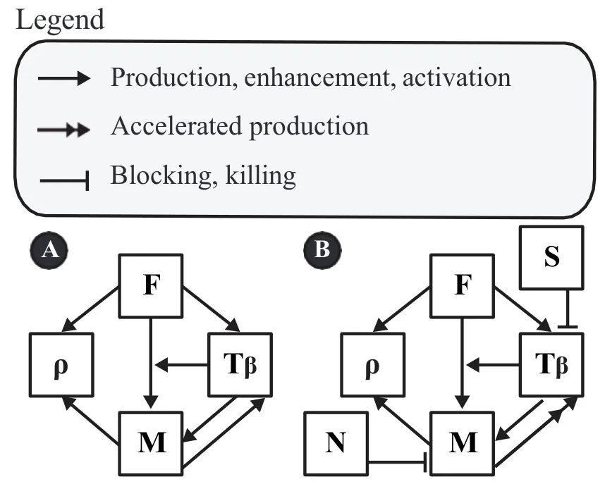
<figcaption><strong>Fig. 1</strong> Network of model’s variables in health (A) and in SSc (B)</figcaption>
</figure>

## 2 Mathematical Model

The model variables are listed in Table 1 in densities with units of *g/cm*3. Throughout the model, *d*X and *δ*X denote the degradation/death rate and diffusion coefficient of species *X*, respectively. For production and activation parameters, the first subscript denotes the species being produced or increased, and the second subscript denotes the source or regulator. Thus, *λ*Tβ F denotes production of *T*β by fibroblasts, *λ*Tβ M denotes production of *T*β by myofibroblasts, *λ*ρ F denotes ECM deposition by fibroblasts, and *λ*ρ M denotes ECM deposition by myofibroblasts. Transition rates are denoted using an arrow; for example, *λ*F→M is the basal fibroblast-to-myofibroblast transition rate. The dimensionless parameter *α*Tβ F→M denotes the enhancement.

The mathematical model is based on Fig. 1, and is represented by a system of PDEs. We consider two versions of the model: (A) in health and (B) under the SSc treatment.

We note that fibroblasts secrete collagen, but myofibroblasts secrete collagen more effectively, and they also secrete fibronectin (Baum and Duffy 2011). Since myofi-broblast and TGF-*β* are mutually positively correlated and both are highly present in SSc, we made the assumption that, in SSc, the production of *T*β by myofibroblasts is accelerated.

We first write down the equations based on Fig. 1(A) (in health).

### 2.1 Equations for Model (A)

**Equation for** *F***.** We assume logistic growth for *F* at rate *λ*F, death rate *d*F, and fibroblast-to-myofibroblast transition. The transition flux is taken to be

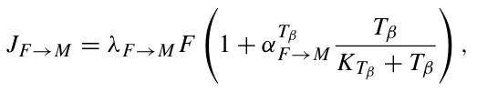

where *λ*F→M is the basal fibroblast-to-myofibroblast transition rate and *α*Tβ F→M is a dimensionless factor describing the enhancement of this transition by *T*β. Hence,

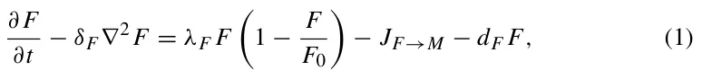

where *δ*F is the diffusion coefficient of *F*, and *F*0 is the carrying capacity of *F*.

**Equation for** *M***.** We write the equation for myofibroblasts in the following form:

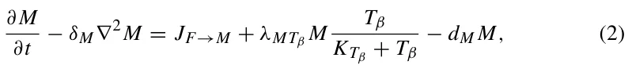

where *λ*MTβ is the growth rate of *M* induced directly by *T*β. This notation follows the convention that the first subscript denotes the species whose equation is affected and the second subscript denotes the regulator. Thus, *λ*MTβ refers to *T*β-induced growth of myofibroblasts, whereas *λ*Tβ M, used below in Eq. (3), refers to production of *T*β by myofibroblasts. The first term on the right-hand side of Eq. (2) is not an independent source of myofibroblasts. Rather, it is the same transition flux *J*F→M that appears with negative sign in Eq. (1) and with positive sign in Eq. (2). The part of *J*F→M proportional to *α*Tβ F→M therefore represents the *T*β-induced increase in the fibroblast-to-myofibroblast transition rate, whereas *λ*MTβ *MT*β*/(K*Tβ +*T*β*)* represents proliferation/expansion of the existing myofibroblast population in response to *T*β.

**Equation for** *Ť* **.** *T*β is produced by both fibroblasts and myofibroblasts, so that:

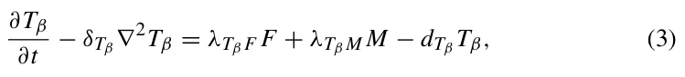

where *λ*Tβ F and *λ*Tβ M are production rates, *d*Tβ is a degradtion rate, and *δ*Tβ is the diffusion coefficient of *T*β.

**Equation for .** ECM is deposited by fibroblasts and myofibroblasts at rates *λ*ρ F and *λ*ρ M, respectively. ECM turnover is represented by the effective first-order term *d*ρ*ρ*. This term should be interpreted as a lumped degradation/remodeling rate, which includes protease-mediated degradation of ECM components, rather than as spontaneous degradation. In particular, fibroblasts and other stromal/immune cells can contribute to collagen and ECM degradation through matrix metalloproteinases (MMPs), and fibrosis has been associated not only with excessive ECM production but also with impaired ECM degradation and altered MMP/TIMP balance (Cox et al. 2006; Zhao et al. 2022, 2023; Mayorca-Guiliani et al. 2025). Hence,

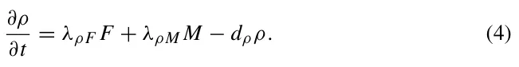

Note that the connected tissue is not diffusing, hence we do not include diffusion for *ρ*. A more detailed formulation could include an explicit fibroblast-mediated ECM degradation term, for example −*λ*deg ρ F *Fρ*. However, near the healthy steady state, *F* ≈ *F*0, so this term is mathematically absorbed into the effective degradation coefficient:

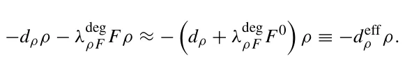

Thus, in the absence of independent measurements of MMP/TIMP activity or collagen degradation products, *d*ρ and *λ*deg ρ F cannot be reliably estimated separately from the clinical data used in this study. We therefore retain the compact effective degradation term *d*ρ*ρ*.

### 2.2 Equations for Model (B)

Based on Fig. 1(B) (for SSc with treatment), Eqs. (1) and (4) remain the same as for model (A), but Eqs. (2) and (3) change, as follows:

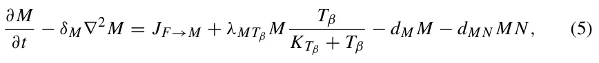

and

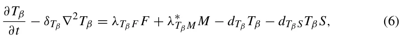

where *d*M N is the killing rate of *M* by drug *N*, *d*Tβ S is the effective loss rate of *T*β due to interaction with drug *S*, and *λ*∗ Tβ M is a large parameter representing aberrant production of *T*β by myofibroblasts in SSc.

We write the equation for *S* as follows:

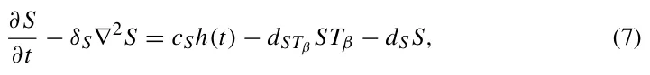

where *δ*S is the diffusion coefficient, *d*S is the washout rate of *S*, *d*STβ is the effective loss rate of free *S* due to interaction with *T*β, and *c*S is the dose amount of the drug. The two parameters *d*Tβ S and *d*STβ describe the two sides of the same effective interaction between fresolimumab and *T*β. The term *d*Tβ S*T*β *S* appears in the *T*β equation because it represents loss of free *T*β, whereas the term *d*STβ *ST*β appears in the *S* equation because it represents loss of free fresolimumab. Since independent measurements of these two effective rates are not available, we take *d*Tβ S = *d*STβ in the simulations. If the drug is administrated at days *t*0 = 0*, t*1*, t*2*, ..., t*k, then:

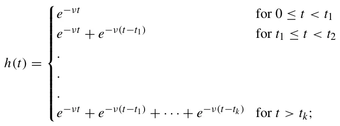

the exponential parameter *ν* is given by *ln(*2*)/t*1/2 where *t*1/2 is the half-life of the drug.

When *N* = *S* = 0, the equation for *ρ* remains the same as in Eq. (4). In SSc, the effective degradation component of ECM turnover may be reduced because fibrosis is associated with impaired collagen/ECM degradation and altered MMP/TIMP regulation (Jinnin 2022; Zhao et al. 2022; Mayorca-Guiliani et al. 2025). In the present model, this process is not represented as a separate biological variable. Instead, *d*ρ is treated as an effective turnover parameter and the SSc phenotype is generated through the myofibroblast–TGF-*β* axis, which is the main treatment target considered here. A model that separately tracks MMPs, TIMPs, and collagen degradation products would require additional data for parameter estimation and is left for future work. But, when *N* = *S* = 0, the equation for *ρ* remains the same as in Eq. (4). When treatment is applied, we distinguish between the healthy baseline ECM density, *ρ*0, and the pathological excess ECM, *ρ* −*ρ*0. Since SSc has no cure, treatment is assumed to reduce the excess fibrotic ECM but not to eliminate the healthy ECM scaffold. We therefore add a phenomenological singular depletion term acting on the excess ECM. This term is defined on the admissible domain *ρ > ρ*0 and represents tissue-level resistance/homeostasis as *ρ(t)* approaches the healthy ECM level. We accordingly take

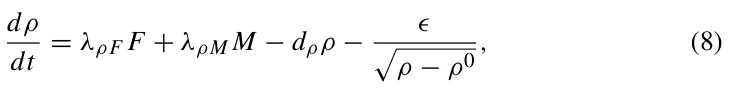

with drug resistance parameter *ϵ*. Singular and non-Lipschitz terms are commonly used in mathematical models when the modeled quantity approaches a limiting admissible state. For example, finite-time extinction in diffusion–absorption equations is obtained through strong absorption terms such as *u*q, 0 *< q <* 1, and ODE systems with dissipation terms of negative homogeneity exhibit analogous finite-time extinction behavior (Iagar 2022; Hoang 2025). Singular potentials are also used in phase-field models of tumor growth to encode constraints on biological state variables and keep the solution within an admissible physical range (Colli et al. 2021; Scarpa and Signori 2021). In the present simulations, *ρ(t)* remains above *ρ*0, so the singular term is used only in its intended domain.

### 2.3 Boundary and Initial Conditions

We consider the model equations in a portion of the skin:

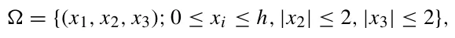

where the surface of the skin is in the plane *x*1 = *h*; we take an intermediate thickness of the skin (epidermis + dermis) *h* = 0*.*2 cm (Branchet et al. 1990).

We take the following boundary conditions:

*X* = 0 on *x*1 = *h,*

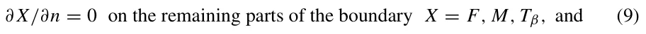

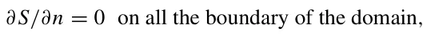

where *∂/∂n* is the normal to the boundary.

We take the following initial conditions at *t* = 0, in model *A* and in model *B* with no drug:

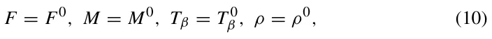

where *F*0*, M*0*, T* 0 β , and *ρ*0 are “steady state” values in health, given in Table 2.

## 3 Parameter Estimates

We first estimate the parameters from Model (A) (in health).

### 3.1 Steady State

We denote by *X*0 the steady state in health of species *X*, and assume that in steady state *X/(K X* + *X)* = 0*.*5, where *K X* is the (so-called) half-saturation of *X*; hence *K X* = *X*0.

The number of fibroblast cells in the dermis is 2100–4100 per *mm*3, with an average of 3000*/mm*3 (Miller et al. 2003). The volume of a fibroblast cell is 2*.*5 · 10−9*cm*3 (Padovan-Merhar et al. 2015) (Fig. 1B) and its mass is accordingly taken to be 2*.*5 · 10−9*g*. Hence, *F*0 = 7*.*5 · 10−3*g/cm*3. We assume that in health, *M*0 *< F*0 and take *M*0 = *F*0*/*3 = 2*.*5 · 10−3*g/cm*3. The skin concentration of *T*β in health is 30 −−39 *g/mm*3 (Yang et al. 1999). We take average of 35 *g/mm*3, so that *T* 0 β = 3*.*5 · 10−8*g/cm*3 and *K*Tβ = 3*.*5 · 10−8*g/cm*3.

### 3.2 Death and Degradation Rates

We denote by *t*1/2*(X)* the half-life of species *X*, and use the formula *d*X = *ln(*2*)/t*1/2*(X)*.

<figure class="table-figure" id="table-2">
<figcaption><strong>Table 2</strong> Model parameters: symbols, descriptions, values, and sources</figcaption>

<table><tr><th>Symbol</th><th>Description</th><th>Value</th><th>Source</th></tr><tr><td>λF</td><td>Proliferation rate of fibroblasts</td><td>2.06 d−1</td><td>Estimated</td></tr><tr><td>dF</td><td>Death rate of fibroblasts</td><td>8.3 · 10−1 d−1</td><td>Seaman et al. (2015)</td></tr><tr><td>λF→M</td><td>Basal fibroblast-to-myofibroblast transition rate</td><td>1.0 · 10−1 d−1</td><td>Estimated</td></tr><tr><td>δF</td><td>Diffusion coefficient of fibroblasts</td><td>8.64 · 10−7 cm2/d</td><td>Hao et al. (2014)</td></tr><tr><td>F0</td><td>Carrying capacity of fibroblasts</td><td>15 · 10−3 g/cm3</td><td>Estimated</td></tr><tr><td>F0</td><td>Steady-state concentration of fibroblasts</td><td>7.5 · 10−3 g/cm3</td><td>Miller et al. (2003); Padovan-Merhar et al. (2015)</td></tr><tr><td>dM</td><td>Death rate of myofibroblasts</td><td>1.0 · 100 d−1</td><td>Estimated</td></tr><tr><td>δM</td><td>Diffusion coefficient of myofibroblasts</td><td>8.64 · 10−7 cm2/d</td><td>Hao et al. (2014)</td></tr><tr><td>M0</td><td>Steady-state concentration of myofibroblasts</td><td>2.5 · 10−3 g/cm3</td><td>This work</td></tr><tr><td>λMTβ</td><td>Tβ-induced proliferation of myofibroblasts</td><td>8.0 · 10−1 d−1</td><td>Estimated</td></tr><tr><td>Tβ α F→M</td><td>Dimensionless enhancement of fibroblast-to-myofibroblast transition by Tβ</td><td>2.0 · 100</td><td>This work</td></tr><tr><td>dM N</td><td>Killing rate of myofibroblasts by drug N</td><td>28.42 · 103(cm3/g)/d</td><td>Gordon et al. (2014) fitted</td></tr><tr><td>δTβ</td><td>Diffusion coefficient of Tβ</td><td>14.8 · 10−2 cm2/d</td><td>Young et al. (1980); Liao et al. (2014); Hornbeck et al. (2015)</td></tr><tr><td>dTβ</td><td>Degradation rate of Tβ</td><td>4.99 · 102 d−1</td><td>Wakefield et al. (1990)</td></tr><tr><td>T 0 β</td><td>Steady-state concentration of Tβ</td><td>3.5 · 10−8 g/cm3</td><td>Yang et al. (1999)</td></tr><tr><td>KTβ</td><td>Half-saturation constant for Tβ</td><td>3.5 · 10−8 g/cm3</td><td>Estimated</td></tr><tr><td>λTβ F</td><td>Tβ production rate by fibroblasts</td><td>1.16 · 10−3 d−1</td><td>Estimated</td></tr><tr><td>λTβ M</td><td>Tβ production rate by myofibroblasts</td><td>5.74 · 10−3 d−1</td><td>Estimated</td></tr><tr><td>λ∗ Tβ M</td><td>Aberrant Tβ production rate by myofibroblasts in SSc</td><td>1.886 · 101 d−1</td><td>Fitted</td></tr><tr><td>dTβ S</td><td>Effective loss of Tβ due to fresolimumab</td><td>1.6 · 103(cm3/g)/d</td><td>Estimated</td></tr><tr><td>dSTβ</td><td>Effective loss of fresolimumab due to interaction with Tβ</td><td>1.6 · 103(cm3/g)/d</td><td>Fitted</td></tr><tr><td>dS</td><td>Washout rate of drug S</td><td>1.0 · 10−2 d−1</td><td>This work</td></tr><tr><td>δS</td><td>Diffusion coefficient of S</td><td>5.0 · 10−2 cm2/d</td><td>Young et al. (1980); Liao et al. (2014), [44]</td></tr></table>

</figure>

<figure class="table-figure" id="table-2b">
<figcaption><strong>Table 2</strong> continued</figcaption>

<table><tr><th>Symbol</th><th>Description</th><th>Value</th><th>Source</th></tr><tr><td>ν</td><td>Exponental decay parameter of S</td><td>3.4 · 10−2/d</td><td>Fitted</td></tr><tr><td>ρ0</td><td>Steady-state ECM concentration</td><td>2.1 · 10−1 g/cm3</td><td>National Institute of Standards and Technology (2024); Téllez-Soto et al. (2021); Oikarinen (1994)</td></tr><tr><td>dρ</td><td>Degradation rate of ECM</td><td>3.7 · 10−1 d−1</td><td>Xue et al. (2009)</td></tr><tr><td>λρF</td><td>ECM deposition rate by fibroblasts</td><td>5.18 · 100 d−1</td><td>Estimated</td></tr><tr><td>λρM</td><td>ECM deposition rate by myofibroblasts</td><td>1, 554 · 101 d−1</td><td>Estimated</td></tr><tr><td>ϵ</td><td>Phenomenological resistance/homeostatic parameter for excess ECM removal</td><td>1.75 · 103</td><td>Fitted</td></tr></table>

</figure>

Human fibroblast cell-cycle is between 16 and 28 h, with a mean of 20 h (Seaman et al. 2015). Hence, *t*1/2*(F)* = 20*/*24*d*−1, and *d*F = *ln(*2*)/(*20*/*24*)* = 0*.*83*d*−1. We assume that *d*M *> d*F, and take *d*M = 1*.*0*d*−1. The half-life of *T*β is approximately 2 min (Wakefield et al. 1990). Hence, *t*1/2*(T*β*)* = 1*.*39 · 10−3*d*, and *d*Tβ = 499*d*−1.

### 3.3 Diffusion Coefficients

We take *δ*F = 8*.*64 · 10−7*cm*2*d*−1 from Hao et al. (2014), and *δ*M = *δ*F. To estimate the diffusion coefficient of *T*β, we use the formula from Young et al. (1980): *δ*X = *const./m*1/3 for any protein *X*, where *m*x is the molecular weight of *X*; the constant is *x* computed from the data for VEGF (*V* ) in Liao et al. (2014): *δ*V = 8*.*54·10−2*cm*2*d*−1 and *m*v = 24*k Da*. Since *m*Tβ = 4*.*76*k Da* (Hornbeck et al. 2015), we get *δ*Tβ = 14*.*8 · 10−2*cm*2*d*−1.

### 3.4 Estimate from Equations

We use the steady state of an equation, by taking the right-hand side equal to zero and *X* = *X*0 for any species *X* in the equation.

*T* 0 Taking *α*Tβ β **Equation (2).** F→M = 2, and using β = 1 2, the transition contribution *K*Tβ +*T* 0 in the healthy steady state is *λ*F→M *F*0 1 + 1 2*α*Tβ = 2*λ*F→M *F*0. The steady-state *F*→*M* condition for Eq. (2) is therefore 2*λ*F→M *F*0+0*.*5*λ*MTβ *M*0 = *d*M *M*0. Using *λ*F→M = 0*.*1 *d*−1, *d*M = 1 *d*−1, and *F*0 = 3 *M*0, we obtain 0*.*6*M*0 + 0*.*5*λ*MTβ *M*0 = *M*0, and hence *λ*MTβ = 0*.*8 *d*−1*.* In SSc, the production of *T*β by *M* is increased compared to the healthy case (see Fig. 1(B)), which means that the aberrant production parameter *λ*∗ Tβ M is larger than the healthy production parameter *λ*Tβ M. In Medsger and Benedek (2019), skin thickness in SSc was assessed by mRSS. The average thickness depends on the progression of the disease. We accordingly assume that by 168 days the density *ρ(t)* reaches the level 2*ρ*0, and by simulation of the model we found that

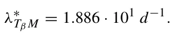

**Equation (3).** In steady state, *λ*ρ F *F*0 + *λ*Tβ M *M*0 = *d*Tβ *T* 0 β = 499 · 3*.*5 · 10−8. We assume that *λ*Tβ *F*0 = *λ*Tβ M *M*0, so that *λ*Tβ = 3*λ*Tβ F. Recalling that *F*0 = 7*.*5 · 10−3*g/cm*3, we get *λ*Tβ F = 1*.*16 · 10−3*d*−1 and *λ*Tβ M = 5*.*74 · 10−3*d*−1.

**Equation (4).** We take *d*ρ = 0*.*37*d*−1 from Xue et al. (2009). Skin density is 1*.*1*g/cm*3 (National Institute of Standards and Technology 2024), and the total water content is 74% of the dermis (Téllez-Soto et al. 2021). Collagen makes 75% of the dry weight of the skin (Oikarinen 1994). Hence, the density of ECM in healthy skin is *ρ*0 = 1*.*1 · 26*/*100 · 75*/*100 = 0*.*21*g/cm*3. In steady state, *λ*ρ F *F*0 + *λ*ρ M *M*0 = *d*ρ*ρ*0 = 7*.*77 · 10−2.

According to Baum and Duffy (2011), *λ*ρ M *> λ*ρ F, and we take *λ*ρ M = 3*λ*ρ F. Hence, 2*λ*ρ F *F*0 = 7*.*77 · 10−2, so that *λ*ρ F = 5*.*18 · *d*−1 and *λ*ρ M = 15*.*54*d*−1.

### 3.5 Drug-associated Parameters from Model (B)

The molecular weight of *S* is 144Kd [44].. Hence, by Young et al. (1980); Liao et al. (2014), *δ*S = 5*.*0·10−2*cm*2*/d*. We take *α*Tβ F→M = 2 and *d*M N = 28*.*42·103*(cm*3*/g)/d* in order to fit model simulation of *ρ* to the clinical trials in Gordon et al. (2014) described in section 4.2. The molecular weight of fresolimumab is 145kDa, and we accoridng take *δ*S = 5 · 10−2*cm*2*/d*. The half-life of *S* is in the range of 14–22 days (Trachtman et al. 2011). Hence, *ν* = *ln(*2*)/t*1/2 is in the range of 3*.*1·10−2 *< ν <* 4*.*9· 10−2. We assume that *d*S = 1·10−2 *d*−1 and, because independent measurements of the two sides of the fresolimumab–*T*β interaction are not available, we take *d*Tβ S = *d*STβ. In SSc, *ρ(t)* is approximately equal to the density of myofibroblasts. We accordingly randomly varied *ν*, *d*STβ and the day in week 4 when the second dose of *S* was injected in Rice et al. (2015) Fig. 3, in order to get the best fit (in 100 days) of *ρ(t)* with the fold change of cartilage oligomeric protein (COMP), which we take to represent the myofibroblasts density, hence *ρ(t)*. We found that *ν* = 3*.*4 · 10−2*/d, d*STβ = 1*.*6 · 103*(cm*3*/g)/d* and the optimal day is 23. We next choose *ϵ* = 1*.*75 · 10−3 in Eq. (8) to further optimize the average coefficient of determination (i.e., the fit) between the proposed model simulation and Fig. 3 in Rice et al. (2015), using the Newton– Raphson algorithm (Robert et al. 1976). Table summarizes the model’s paraemters and their values.

<figure id="fig-2">
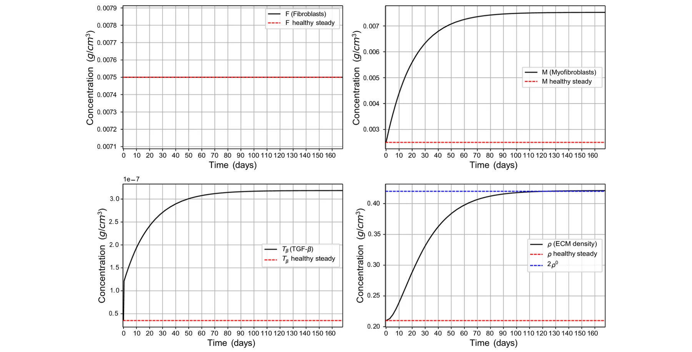
<figcaption><strong>Fig. 2</strong> Average densities/concentrations, in <em>g/cm</em>3, of all the model variables, in the case of SSc with no drugs (Color figure online)</figcaption>
</figure>

## 4 Results

The PDE model takes a second-order and nonlinear form with a free boundary cube geometric configuration. We solve it numerically using the Runge–Kutta method (Verwer and Sommeijer 2004); all parameter values are taken from Table 3.5. In particular, all the numerical analysis in this study was performed using the Python programming language (Langtangen and Logg 2016).

We define the average density of each species *X* at time *t* by *X(t)* = 1 x∈ *X(t, x)dx* where *X(t, x)* is the density of *X* at *(t, x)* and 3*.*2*cm*3 is the 3*.*2 volume of .

SSc is an autoimmune disease that has no cure, but treatment can decrease the severity of symptoms and reduce the risk of SSc progressing from the skin to internal organs, particularly to interstitial lung disease. We can use the mathematical model to devise strategies for long-term treatment with *N* or *S* to minimize the burden of SSc.

### 4.1 SSc in the Control Case (No Drugs)

In Fig. 2 we simulated the model variables in the control case, i.e., model (B) with *N* = 0*, S* = 0 in Eqs. (5) and (6). We note that the profile of *F* remains the same as in the healthy case, in agreement with Zhu et al. (2024); Garrett et al. (2017). On the other hand, the densities of *T*β and myofibroblast are significantly increasing compared to the healthy case, and *ρ(t)* increases to 2*ρ*0 as *t* → 168 days (24 weeks).

<figure id="fig-3">
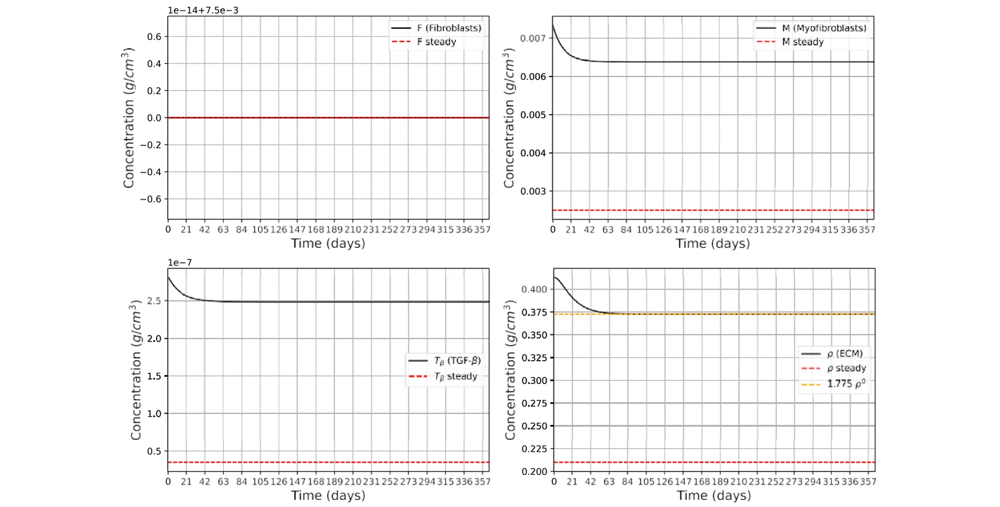
<figcaption><strong>Fig. 3</strong> Average densities/concentrations, in g<em>/</em>cm3, of all the model variables for the case of SSc treatment with drug <em>N</em> (Color figure online)</figcaption>
</figure>

### 4.2 SSc Treatment with Imatinib (N)

We consider model (B) with *S* = 0. In clinical trial (Gordon et al. 2014), patients were treated with imatinib from 100 to 400 mg daily by mouth for a period of 12 months. The improvement in mRSS increased linearly in time ( Gordon et al. 2014, Fig. 1), and was 22.4% after 12 months. All patients were initially treated with 400 mg daily, but 87% required at least one drug adjustment because of adverse effects. The median daily dose of the patients was 300 mg. We assume that patients’ average daily dose was 240 mg, and that the human average weight is 80 kg. Taking average tissue density of 1 g per *cm*3, we arrive at daily drug dose of *N* = 3 · 10−6 *g/cm*3.

Fig. 3 shows simulations of the model variables under treatment with *N*, where we searched for the parameter *d*M N in the term *d*M N *M N* of Eq. (5)). In the clinical trial (Gordon et al. 2014), the improvement in mRSS after 12 months was 22*.*4%. In the model, we interpret this clinical improvement as a reduction in the pathological excess ECM, *ρ(t)*−*ρ*0, rather than as a 22*.*4% reduction in the total ECM density *ρ(t)*. Thus, starting from the disease level *ρ(*0*)* = 2*ρ*0, the calibration target is *ρ(*365*)* = *ρ*0 + 0*.*776*(*2*ρ*0−*ρ*0*)* = 1*.*776*ρ*0. Since *ρ*0 = 0*.*21 g*/*cm3, this gives *ρ(*365*)* = 1*.*776*ρ*0 ≈ 0*.*373 g*/*cm3. With this calibration, we found that *d*M N = 28*.*42 · 103 *(*cm3*/*g*)/*d.

Fig. 3 also shows that the effect of the drug *N*, using the assumed average daily dose *N* = 240 mg, is to reduce the pathological excess ECM, *ρ(t)* − *ρ*0, close to the calibrated 22*.*4% reduction within the first 60 days, after which *ρ(t)* remains approximately at the same plateau. The percentage reduction in the total ECM density *ρ(t)* is smaller, because the healthy baseline ECM density *ρ*0 is not assumed to be removed by treatment.

<figure id="fig-4">
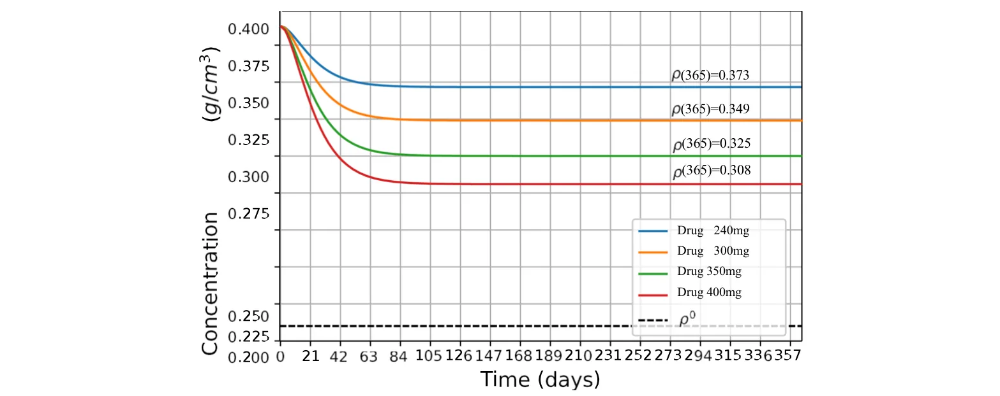
<figcaption><strong>Fig. 4</strong> Effect of different doses of the drug <em>N</em> on <em>ρ</em> (Color figure online)</figcaption>
</figure>

In Gordon et al. (2014), *N* was administered at dose levels 100–400 mg for different patients, while in Fig. 3, we took the daily dose level to be 240 mg for all patients. This interpretation also explains why the decrease seen in Fig. 2 appears smaller than 22*.*4% when measured relative to the total ECM density *ρ(t)*: the 22*.*4% calibration is applied only to the excess fibrotic component *ρ(t)* − *ρ*0. Since 13% of patients in Gordon et al. (2014) were safely treated daily with 400 mg of imatinib, it is interesting to see the effect of the drug when the dose is increased from 240 to 400 mg. In Fig. 4, we took 4 levels of *N*, namely: 240, 300, 350, and 400 mg, and simulated the profiles of *ρ(t)* for 2 years. We see that the effect of the drug, in each case, is to quickly reduce *ρ(t)* to a certain level, and to keep it at this level thereafter.

### 4.3 SSc Treatment with Fresolimumab (S)

Cartilage oligomeric matrix protein (COMP) is a structural component of cartilage, and studies has described COMP as a pathological factor that promotes collagen deposition in fibrotic skin disorders such as scleroderma [44]. We accordingly consider *ρ(t)* in SSc to be proportional to COMP gene expression. We take model B with *N* = 0 and follow the clinical trials in Rice et al. (2015). We consider two treatments of SSc patients:

**Treatment 1.** Drug *S* is given at days 1 and 25 at dose *c*S = 1 *mg/kg*. **Treatment 2.** Drug *S* is given just at day 1 at dose *c*S = 5 *mg/kg*.

Assuming that 1 *cm*3 of tissue has average mass of 1 *g*, we get *c*S = 1·10−6*g/cm*3 in Treatment 1, and *c*S = 5 · 10−6*g/cm*3 in Treatment 2. We assume that the initial conditions of the patients are the same as the values at *t* = 168*d* in Fig. 2, and *S(*0*)* = 0. Figure 5 taken from Rice et al. (2015) Fig. 3C and D shows the total change of COMP in Treatments 1 and 2.

In Fig. 6, which simulates Treatment 1, we see that *ρ(t)* increases initially and then decreases monotonically, in qualitative agreement with COMP gene expression in Rice et al. (2015) Fig. 3C. In Fig. 7, which simulates Treatment 2, we see that *ρ(t)* is first decreasing and then, after 40 days, it starts to increase monotonically. This behavior is in qualitative agreement with COMP expression in Rice et al. (2015) Fig. 3D. Moreover, comparing the simulation of *ρ(t)* in Fig. 7 with the 4 data points in Fig. 3D of Rice et al. (2015), we find that the measure of fitness is *R*2 = 0*.*65. In the case of Fig. 6, the data point at 24 weeks in Fig. 3C of Rice et al. (2015) is not statistically significant (only 3 patients), and measure of fitness of *ρ(t)* with the remaining three data points is *R*2 = 0*.*61.

<figure id="fig-5">
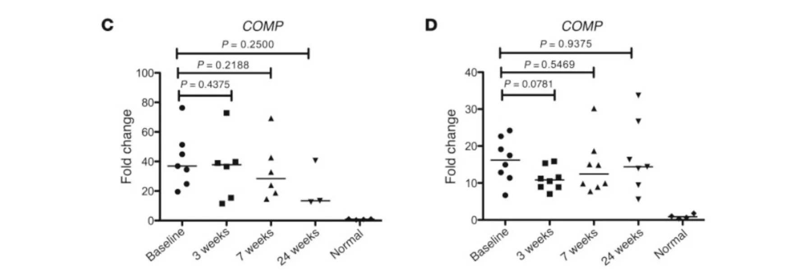
<figcaption><strong>Fig. 5</strong> <em>In vivo</em> data results taken form Rice et al. (2015)</figcaption>
</figure>

<figure id="fig-6">
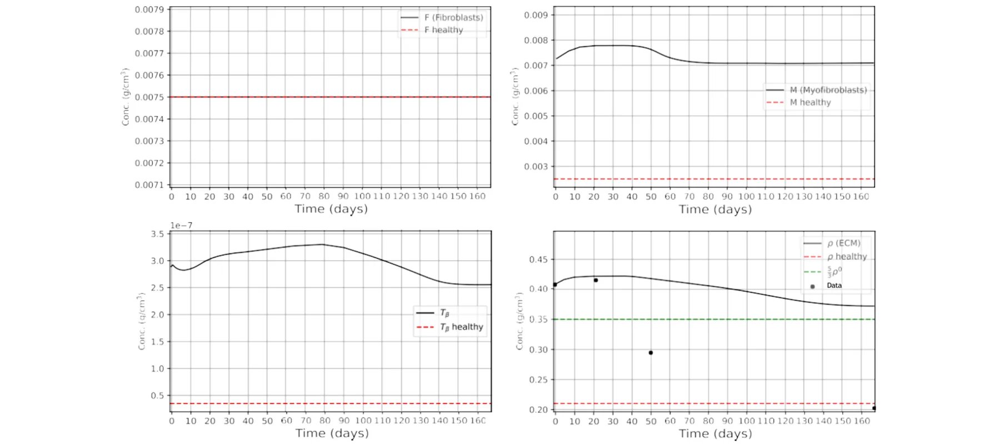
<figcaption><strong>Fig. 6</strong> Average densities/concentrations, in <em>g/cm</em>3, of all the model variables for the case of SSc <strong>Treatment 1</strong> with drug <em>S</em> (Color figure online)</figcaption>
</figure>

In Rice et al. (2015), *S* was administered either twice, in days 1 and 21, at dose 1 *mg/kg*, or just once, in day 1, at a dose 5 *mg/kg*. We can use our model to explore other treatment strategies with *S*. Motivated by the clinical study in Rice et al. (2015), we consider treatments where instead of administering 5 *mg/kg* = 5 · 10−6*g/cm*3 in day 1, we administer a drug *γ* , *γ* ≤ 5 · 10−6*g/cm*3, in equal fractions such that adjacent injections are either 21 days apart, or multiple of 21 days apart, in each a half-year. Note, for example, that if a drug *γ* is administered in fractions that are 21 days apart, then each fraction is *γ/*8.

<figure id="fig-7">
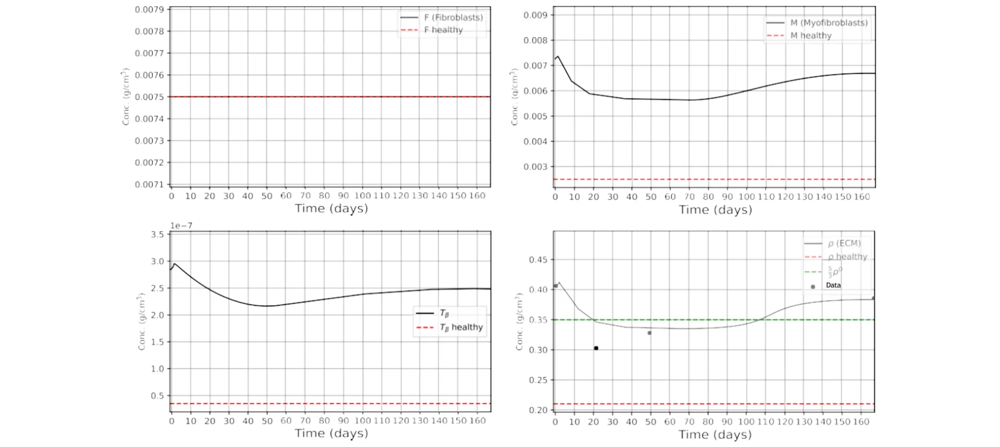
<figcaption><strong>Fig. 7</strong> Average densities/concentrations, in <em>g/cm</em>3, of all the model variables for the case of SSc <strong>Treatment 2</strong> with drug <em>S</em> (Color figure online)</figcaption>
</figure>

<figure id="fig-8">
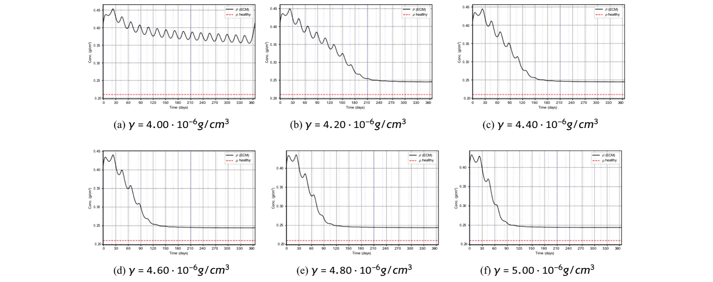
<figcaption><strong>Fig. 8</strong> <em>ρ(t)</em> under fractionated fresolimumab dosing with injections every 21 days. Each panel shows a different total dose <em>γ</em> (distributed equally across injections). Periodic dosing induces oscillations; <em>γ</em> = 4<em>.</em>0 × 10−6 g<em>/</em>cm3 yields limited reduction, while larger <em>γ</em> leads to a lower, stabilized plateau after a few months with <em>ρ(</em>365<em>)</em> = 0<em>.</em>25 g<em>/</em>cm3. Note that 10−6<em>g/cm</em>3 = <em>mg/kg</em> (Color figure online)</figcaption>
</figure>

Figures 8, 9, and 10 show profiles of *ρ(t)* with *γ* increasing from 4 · 10−6 to 5 · 10−6*g/cm*3m and the spacing between adjacent injections are 21, 42, and 63 days, respectively. In Fig. 8, treatment with *γ* = 4 · 10−6*g/cm*3 is not effective: *ρ(t)* keep oscillating and the reduction in *ρ(t)* is small. In all other cases *ρ(t)* is oscillatingly decreasing for some time, and then stabilizes at approximately *ρ(*365*)* = 0*.*25*g/cm*3, which is larger than the health state *ρ*0 = 0*.*21*g/cm*3; as *γ* increases, the stability of *ρ(t)* is arrived little earlier and *ρ(*365*)* is a little smaller.

<figure id="fig-9">
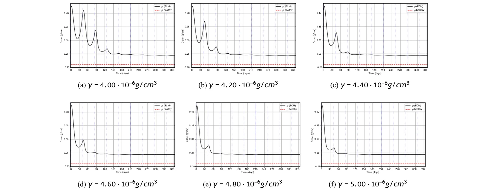
<figcaption><strong>Fig. 9</strong> <em>ρ(t)</em> under fractionated fresolimumab dosing with injections every 42 days for total doses <em>γ</em> . Curves show a brief transient with larger oscillations, then converge to small oscillations around a maintained plateau near <em>ρ(</em>365<em>)</em> = 0<em>.</em>25 g<em>/</em>cm3, with slightly improved stabilization as <em>γ</em> increases. Note that 10−6<em>g/cm</em>3 = <em>mg/kg</em> (Color figure online)</figcaption>
</figure>

<figure id="fig-10">
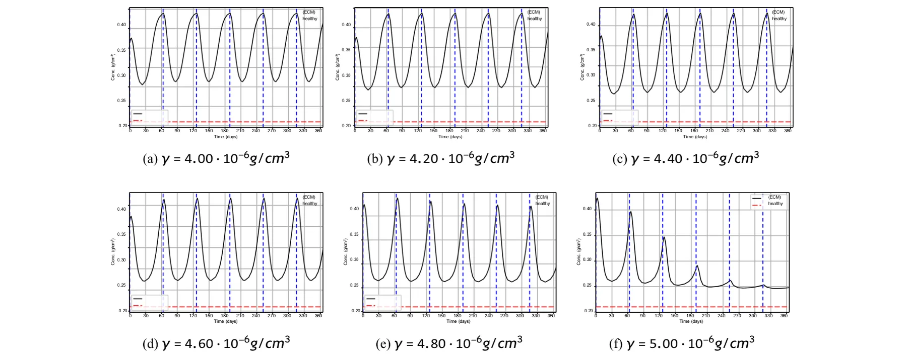
<figcaption><strong>Fig. 10</strong> <em>ρ(t)</em> under fractionated fresolimumab dosing with injections every 63 days for total doses <em>γ</em> . Longer spacing produces sustained large oscillations for <em>γ</em> ≤ 4<em>.</em>8 × 10−6 g<em>/</em>cm3; at <em>γ</em> = 5<em>.</em>0 × 10−6 g<em>/</em>cm3 oscillations damp and <em>ρ(t)</em> stays closer to 0<em>.</em>25 g<em>/</em>cm3 by 1 year. Note that 10−6<em>g/cm</em>3 = <em>mg/kg</em> (Color figure online)</figcaption>
</figure>

Figure 9 shows high oscillations for a short time, followed by very small oscillations around a plateau near *ρ(*365*)* = 0*.*25*g/cm*3, as in Fig. 8.

<figure class="table-figure" id="table-3">
<figcaption><strong>Table 3</strong> Local sensitivity indices for the main treatment outputs</figcaption>

<table><tr><th>Parameter</th><th>Sρ(365) pi</th><th>Smint ρ(t) pi</th><th>tplateau S pi</th></tr><tr><td>λρM</td><td>0.62</td><td>0.48</td><td>0.18</td></tr><tr><td>dρ</td><td>−0.71</td><td>−0.55</td><td>−0.21</td></tr><tr><td>λ∗ Tβ M</td><td>0.44</td><td>0.36</td><td>0.16</td></tr><tr><td>dTβ S</td><td>−0.38</td><td>−0.46</td><td>−0.29</td></tr><tr><td>dSTβ</td><td>0.24</td><td>0.31</td><td>0.22</td></tr><tr><td>ϵ</td><td>−0.52</td><td>−0.68</td><td>−0.35</td></tr><tr><td>λρF</td><td>0.14</td><td>0.11</td><td>0.05</td></tr><tr><td>λMTβ</td><td>0.19</td><td>0.15</td><td>0.07</td></tr><tr><td>λF→M</td><td>0.12</td><td>0.09</td><td>0.04</td></tr><tr><td>λF</td><td>0.06</td><td>0.04</td><td>0.02</td></tr><tr><td>dF</td><td>−0.05</td><td>−0.03</td><td>−0.02</td></tr><tr><td>dM</td><td>−0.21</td><td>−0.18</td><td>−0.08</td></tr><tr><td>dTβ</td><td>−0.17</td><td>−0.14</td><td>−0.06</td></tr></table>

</figure>

In Fig. 10, *ρ(t)* is contentiously widely oscillating for *γ* ≤ 4*.*8 · 10−6*g/cm*3; when *γ* = 5 · 10−6 the oscillations are damp and stays closer to 0*.*25*g/cm*3.

In choosing a treatment with the best benefits, we must take into account that direct blockade of TGF-*β* may lead to uncontrolled inflammation (Vistnes 2024).

Since several parameters in Table 2 are estimated or fitted rather than measured directly, we performed a local sensitivity analysis to assess the robustness of the model predictions. For each parameter *p*i, we computed the normalized local sensitivity index:

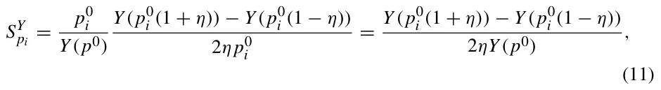

where *p*0 i is the baseline value of the parameter, *Y* is the model output of interest, and *η* = 0*.*1. We also repeated the calculation with *η* = 0*.*05 to verify that the ranking of the most influential parameters was not an artifact of the perturbation size.

Table 3 showed that the treatment predictions are most sensitive to parameters that directly regulate ECM accumulation and the myofibroblast–TGF-*β* feedback loop. In particular, the largest sensitivity indices were obtained for *λ*ρ M, *d*ρ, *λ*∗ Tβ M, *d*Tβ S, *d*STβ, and *ϵ*. This is expected, since these parameters directly determine the rate of ECM deposition, ECM turnover, TGF-*β*-driven myofibroblast activity, and the response to fresolimumab. Parameters associated with cell diffusion and baseline fibroblast dynamics had smaller sensitivity indices for the averaged ECM outcomes.

## 5 Conclusion

Systemic sclerosis (SSc) is an autoimmune fibrotic skin disease marked by excessive extracellular matrix (ECM) deposited by myofibroblasts. SSc has no cure, and can progress from the skin to the lung and other internal organs, where it may affect the survival rate of patients. Clinical studies aim to reduce ECM density (*ρ*) of the fibrotic tissue; this may alleviate pain and other negative effects of the disease, and reduce the risk of a severe clinical course of the disease. Since SSc is associated with an abnormally high densities of myofibroblasts, clinical studies focus on decreasing the population of myofibroblasts. Two of the drugs used in these studies are imatinib (*N*) and fresolimumab (*S*). Imatinib induces apoptosis in myofibroblasts. Fresolimumab is a TGF-*β* blocker, which inhibits the induction and proliferation of myofibroblasts.

In this paper, we developed a mathematical model of SSc and used it to assess and analyze the efficacy of treatments with *N* and *S* in terms of reduction of *ρ*. We summarize the main results of the paper as follows:

- One year clinical study in Gordon et al. (2014) demonstrated that daily treatment with *N* of patients at an average dose of 240 mg reduces fibrosis by 22.4%. Our model simulations are in agreement with this result (Fig. 3), by showing a decrease from initial *ρ* = 0*.*428*g/cm*3 to terminal *ρ* = *ρ(*365*)* = 0*.*373*g/cm*3. Interestingly, Fig. 3 shows that *ρ(t)* decreases to its terminal value of 0*.*373*g/cm*3 within just two months and remains stable thereafter.
- In Gordon et al. (2014), some patients received 400 mg daily, while others required adjustment to as low as 100 mg. In Fig. 4, we simulated the case where treatment is given at 400 mg (*ρ(*365*)* = 0*.*308*g/cm*3) or at other doses between 240 mg and 400 mg.
- In 6 month clinical study (Rice et al. 2015), *S* was administered either at 1 mg/kg in days 1 and 21, or just in day 1 at 5 mg/kg. Our model simulations of these two treatments show the measurement of fitness, *R*2 = 0*.*65 and *R*2 = 0*.*61 with Rice et al. (2015), respectively.
- We used the model to consider one year treatment in fractions, where the drug *S* is given every 21 days so that the total dose, *γ* , does not exceed 5 mg/kg in the first 6 months and in the second 6 months. We found (Fig. 8) that, when 4*.*2 ≤ *γ* ≤ 5 mg/kg, *ρ(t)* is oscialltingly decreasing for several months and then stabilizes around *ρ(*365*)* = 0*.*25*g/cm*3; As *γ* increases the stabilization occurs a little earlier and *ρ(*365*)* is very little decreased. When *γ* = 4 *mg/kg*, *ρ(t)* does not stabilize and its decrease is small. Similar results are derived when the drug fractions are 42 days apart (Fig. 9), but, when the fractions are 63 days apart, *ρ(t)* undergoes continuously high oscillations (Fig. 10).

The model has several limitations: (i) TGF-*β* is secreted by myofibroblasts (Porte et al. 2021), and it is a key growth factor for myofibroblasts formation (van Caam et al. 2018). Since the etiology of SSc is unknown, while the disease is associated with abnormally large populations of myofibroblasts, we made the assumption that the early event in SSc is an abnormally large amount of TGF-*β* secretion by myofibroblasts. (ii) Since SSc has no cure, the model distinguishes between the healthy ECM baseline, *ρ*0 = 0*.*21*g/cm*3, and the pathological excess ECM, *ρ* −*ρ*0. In Eq. (8), the term −*ϵ/ ρ* − *ρ*0 is introduced as a phenomenological resistance/homeostatic term acting on the excess ECM in the admissible domain *ρ > ρ*0. This term is not intended to represent a specific molecular pathway; rather, it provides a compact way to represent the assumption that treatment reduces excess fibrotic ECM while preserving the healthy ECM scaffold. Similar singular or non-Lipschitz terms are used in mathematical models of finite-time extinction and constrained biological state variables (Iagar 2022; Hoang 2025; Colli et al. 2021; Scarpa and Signori 2021). (iii) ECM degradation is represented phenomenologically by the effective term *d*ρ*ρ*. This term aggregates multiple biological processes, including MMP-mediated collagen degradation and ECM remodeling. Since fibrosis may involve both excessive ECM deposition and suppressed ECM degradation (Jinnin 2022; Zhao et al. 2022; Mayorca-Guiliani et al. 2025), a future extension of the model could introduce explicit MMP/TIMP dynamics or disease-dependent ECM degradation rates. Such an extension would require independent measurements of MMP activity, TIMP activity, or collagen degradation biomarkers in order to avoid non-identifiability of the degradation parameters.

Our simulations in Figs. 4 and 9 show that fractional treatments with *S* yield better reduction of *ρ(t)* than treatments with *N*, and should be preferable. However, translating the results of the paper into clinical benefits is challenging due to potentially adverse events. The results of the paper could be useful in the design of future clinical trials aimed at decreasing the exessive ECM in SSc patients.

**Funding** Open access funding provided by Jönköping University.

## References

- Baum J, Duffy HS (2011) Fibroblasts and myofibroblasts: what are we talking about? J Cardiovasc Phar-macol 57(4):376–379
- Border WA, Noble NA (1994) Transforming growth factor β in tissue fibrosis. N Engl J Med 331(19):1286– 1292
- Branchet MC, Boisnic S, Frances C, Robert AM (1990) Skin thickness changes in normal aging skin. Gerontology 36(1):28–35
- Cleveland Clinic (2023) Scleroderma: Symptoms, causes & treatment options. https://my.clevelandclinic.org/health/diseases/scleroderma [link](https://my.clevelandclinic.org/health/diseases/scleroderma)
- Colli P, Signori A, Sprekels J (2021) Second-order analysis of an optimal control problem in a phase field tumor growth model with singular potentials and chemotaxis. ESAIM - Control Optim Calc Var 27:73
- Cottin V, Brown KK (2019) Interstitial lung disease associated with systemic sclerosis (ssc-ild). Respir Res 20:1–10
- Cox SW, Eley BM, Kiili M, Asikainen AJ, Tevahartiala T, Sorsa T (2006) Collagen degradation by interleukin-1beta-stimulated gingival fibroblasts is accompanied by release and activation of multiple matrix metalloproteinases and cysteine proteinases. Oral Dis 12(1):34–40
- Flavia V, Castelino V, Steen (2022) Scleroderma associated interstitial lung disease
- Garrett SM, Baker Frost D, Feghali-Bostwick C (2017) The mighty fibroblast and its utility in scleroderma research. J Scleroderma Relat Disord 2(2):100–107
- Gordon J, Udeh U, Doobay K, Magro C, Wildman H, Davids M, Mersten JN, Huang WT, Lyman S, Crow MK, Spiera RF (2014) Imatinib mesylate (gleevec) in the treatment of diffuse cutaneous systemic sclerosis: results of a 24-month open label, extension phase, single-centre trial. Clin Exp Rheumatol 32(6 Suppl 86):189–93
- Hao W, Crouser ED, Friedman A (2014) Mathematical model of sarcoidosis. Proc Natl Acad Sci 111(45):16065–16070
- Hoang L (2025) Behavior near the extinction time for systems of differential equations with sublinear dissipation terms. Electron J Different Equ 2025(8):1–25
- Johns Hopkins Medicine (2019) Scleroderma treatment. https://www.hopkinsmedicine.org/health/conditions-and-diseases/scleroderma/scleroderma-treatment [link](https://www.hopkinsmedicine.org/health/conditions-and-diseases/scleroderma/scleroderma-treatment)
- Hornbeck PV, Zhang B, Murray B, Kornhauser JM, Latham V, Skrzypek E (2015) Phosphositeplus, 2014: mutations, ptms and recalibrations. Nucleic Acids Res 43(D1):D512–D520
- Iagar RG, Laurençot P (2022) Finite time extinction for a diffusion equation with spatially inhomogeneous strong absorption. arXiv preprint arXiv:2206.06856, [link](http://arxiv.org/abs/2206.06856)
- Jinnin M (2022) Molecular pathogenesis of fibrosis in systemic sclerosis. Trends Immunother 6(1):
- Juhl P, Bondesen S, Hawkins CL, Karsdal MA, Bay-Jensen A-C, Davies MJ, Siebuhr AS (2020) Dermal fibroblasts have different extracellular matrix profiles induced by tgf-β, pdgf and il-6 in a model for skin fibrosis. Sci Rep 10(1):17300
- Lagares D, Santos A, Grasberger PE, Liu F, Probst CK, Rahimi RA, Sakai N, Kuehl T, Ryan J, Bhola P et al (2017) Targeted apoptosis of myofibroblasts with the bh3 mimetic abt-263 reverses established fibrosis. Sci Transl Med 9(420):55
- Langtangen HP, Logg A (2016) Solving PDEs in python. Simula SpringerBriefs on Computing, Springer, Cham
- Liao K-L, Bai X-F, Friedman A (2014) Mathematical modeling of interleukin-35 promoting tumor growth and angiogenesis. PLoS ONE 9(10):e110126
- Mayo Clinic Staff (2024) Scleroderma: Symptoms & causes. https://www.mayoclinic.org/diseases-conditions/scleroderma/symptoms-causes/syc-20351952 [link](https://www.mayoclinic.org/diseases-conditions/scleroderma/symptoms-causes/syc-20351952)
- Mayorca-Guiliani AE, Leeming DJ, Henriksen K, Høg Mortensen J, Nielsen SH, Anstee QM, Sanyal AJ, Karsdal MA, Schuppan D (2025) Ecm formation and degradation during fibrosis repair, and regeneration. NPJ Metab Health Dis 3:25
- Medsger TA Jr, Benedek TG (2019) History of skin thickness assessment and the rodnan skin thickness scoring method in systemic sclerosis. J Scleroderma Relat Disord 4(2):83–88
- Miller CC, Godeau G, Lebreton-DeCoster C, Desmouliere A, Pellat B, Dubertret L, Coulomb B (2003) Validation of a morphometric method for evaluating fibroblast numbers in normal and pathologic tissues. Exp Dermatol 12(4):403–411
- Moinzadeh P, Kuhr K, Siegert E, Mueller-Ladner U, Riemekasten G, Günther C, Kötter I, Henes J, Blank N, Zeidler G et al (2020) Older age onset of systemic sclerosis-accelerated disease progression in all disease subsets. Rheumatology 59(11):3380–3389
- National Institute of Standards and Technology (2024). Nist elemental composition calculator. https://physics.nist.gov/cgi-bin/Star/compos.pl. Accessed: 2025-06-22 [link](https://physics.nist.gov/cgi-bin/Star/compos.pl)
- Oikarinen A (1994) Aging of the skin connective tissue: how to measure the biochemical and mechanical properties of aging dermis. Photodermatol Photoimmunol Photomed 10(2):47–52
- Padovan-Merhar O, Nair GP, Biaesch AG, Mayer A, Scarfone S, Foley SW, Wu AR, Churchman LS, Singh A, Raj A (2015) Single mammalian cells compensate for differences in cellular volume and dna copy number through independent global transcriptional mechanisms. Mol Cell 58(2):339–352
- Porte J, Jenkins G, Tatler AL (2021) Myofibroblast tgf-β activation measurement in vitro. In Myofibroblasts: Methods and Protocols, pp 99–108 (2021)
- Rice LM, Padilla CM, McLaughlin SR, Mathes A, Ziemek J, Goummih S, Nakerakanti S, York M, Farina G, Whitfield ML et al (2015) Fresolimumab treatment decreases biomarkers and improves clinical symptoms in systemic sclerosis patients. J Clin Investig 125(7):2795–2807
- Robert I, Jennrich PF, Sampson, (1976) Newton-raphson and related algorithms for maximum likelihood variance component estimation. Technometrics 18(1):11–17
- Scarpa L, Signori A (2021) On a class of non-local phase-field models for tumor growth with possibly singular potentials, chemotaxis, and active transport. Nonlinearity 34(5):3199–3250
- Seaman L, Meixner W, Snyder J, Rajapakse I (2015) Periodicity of nuclear morphology in human fibroblasts. Nucleus 6(5):408–416
- Tai Y, Woods EL, Dally J, Kong D, Steadman R, Moseley R, Midgley AC (2021) Myofibroblasts: function, formation, and scope of molecular therapies for skin fibrosis. Biomolecules 11(8):1095
- Téllez-Soto CA, Silva MGP, Dos Santos L, de O. Mendes T, Singh P, Fortes SA, Favero P, Martin AA, (2021) In vivo determination of dermal water content in chronological skin aging by confocal raman spectroscopy. Vib Spectrosc 112:103196
- Trachtman H, Fervenza FC, Gipson DS, Heering P, Jayne DRW, Peters H, Rota S, Remuzzi G, Rump LC, Sellin LK et al (2011) A phase 1, single-dose study of fresolimumab, an anti-tgf-β antibody, in treatment-resistant primary focal segmental glomerulosclerosis. Kidney Int 79(11):1236–1243
- Vallée A, Lecarpentier Y (2019) Tgf-β in fibrosis by acting as a conductor for contractile properties of myofibroblasts. Cell Biosci 9(1):98
- van Caam A, Vonk M, van den Hoogen F, van Lent P, van der Kraan P (2018) Unraveling ssc pathophysiology; the myofibroblast. Front Immunol 9:2452
- Verwer JG, Sommeijer BP (2004) An implicit-explicit runge-kutta-chebyshev scheme for diffusion-reaction equations. SIAM J Sci Comput 25(5):1824–1835
- Vistnes M (2024) Hitting the target! challenges and opportunities for tgf-β inhibition for the treatment of cardiac fibrosis. Pharmaceuticals 17(3):267
- Wakefield LM, Winokur TS, Hollands RS, Christopherson K, Levinson AD, Sporn MB et al (1990) Recombinant latent transforming growth factor beta 1 has a longer plasma half-life in rats than active transforming growth factor beta 1, and a different tissue distribution. J Clin Investig 86(6):1976–1984
- Xue C, Friedman A, Sen CK (2009) A mathematical model of ischemic cutaneous wounds. Proc Natl Acad Sci 106(39):16782–16787
- Yang L, Qiu CX, Ludlow A, Ferguson MWJ, Brunner G (1999) Active transforming growth factor-β in wound repair: determination using a new assay. Am J Pathol 154(1):105–111
- Yang L, Qiu CX, Ludlow A, Ferguson MWJ, Brunner G (1999) Active transforming growth factor-β in wound repair: determination using a new assay. Am J Pathol 154(1):105–111
- Young ME, Carroad PA, Bell RL (1980) Estimation of diffusion coefficients of proteins. Biotechnol Bioeng 22(5):947–955
- Zhao X, Chen J, Sun H, Zhang Y, Zou D (2022) New insights into fibrosis from the ecm degradation perspective: the macrophage-mmp-ecm interaction. Cell Biosci 12(1):117
- Zhao P, Sun T, Lyu C, Liang K, Yanan D (2023) Cell mediated ecm-degradation as an emerging tool for anti-fibrotic strategy. Cell Regen 12(1):29
- Zhu H, Luo H, Skaug B, Tabib T, Li Y-N, Tao Y, Matei A-E, Lyons MA, Schett G, Lafyatis R et al (2024) Fibroblast subpopulations in systemic sclerosis: functional implications of individual subpopulations and correlations with clinical features. J Investig Dermatol 144(6):1251–1261
