## 1 Introduction

The attempt to forecast state government tax revenues using aggregate economic variables is subject to Lucas’s critique (Lucas, 1976). Economic behavior is goal-oriented, has an intertemporal dimension, and is influenced by expectations. Reduced-form equations that link current decisions to observable variables will reflect the expectations of the decision-makers. However, when a change in economic policy is introduced, agents may react, changing their expectations and behavior, which will affect the equations and render them unstable. In the face of these instability problems, economic models should be based on explicit micro-economic optimization since, unlike reduced-form equations, structural elements like preference orderings and production functions are invariant to changes in policy regimes.

The inclusion of economic agents, in all forms, in the forecasting model of tax revenues may improve the level of forecast accuracy (Poledna et al., 2023; Evans et al., 2021), expanding the understanding of economic dynamics led to the change in a more detailed resolution. However, this approach requires the use of methods capable of assimilating “intelligent” economic agents into the economic model while tracing their decision-making path, which is not feasible with regression-based models and time series methods (Canese et al., 2021). Indeed, the literature on state and local government tax revenue forecasting has established that forecasters in state and local governments are less inclined to use advanced quantitative econometric and time-series methods relative to the qualitative and contextual knowledge of budgeting (Williams & Kavanagh, 2016; Reitano, 2019). However, governments with more educated budgeters and advanced technology are more likely to use technical (e.g., quantitative econometric or time-series) forecasting methods (Reddick, 2004). Either way, whether based on qualitative knowledge or quantitative models, forecasts should focus on minimization of error (McDonald, 2013; Reitano, 2019).

This paper focuses on a unique segment that has rarely been treated in studies concerning tax revenue forecasts and their level of accuracy, that is—assessment of *state* tax revenues obtained from geographical areas within countries, such as regions and cities. The study discusses the assessment of state (central) government tax revenues from economic activity within cities or districts and not the forecasting of local government tax revenues. For a comprehensive review of forecasting tax revenues for local governments please refer to Williams and Kavanagh (2016) and Reitano (2018, 2019). To the best of our knowledge, state government tax revenue forecasting at a city or regional level has not been addressed in studies dealing with fiscal forecasting. Evaluating the tax revenues received from a district or central city in the country will contribute to increasing the accuracy of forecasts and a better understanding of the implications of government taxation policies and even their suitability for socio-economic characteristics unique to each geographical area across the country.

Large-scale supply and demand systems in the form of monopolistic competition have been subject to special concern since such systems play a central and indispensable role in today’s economic activities (Bertoletti & Etro, 2022). An inherent property of these systems is the heterogeneity of the agents participating in the economic dynamics. According to Schleiffer (2021), modeling heterogeneity at a microscopic level is a key step toward understanding macroscopic dynamics. The author also suggests using artificial agents to represent individual decision-making processes as a tool to better comprehend highly complex, dynamic, and inter-depended dynamics. Economic policies need to be optimized to tackle one or more socio-economic needs. The problem of optimal policy design is challenging as policy optimization poses a mechanism design problem (Coglianese, 2018; Lee & Saez, 2012).

Due to the partial study of factors and mechanisms that are dynamic, multidimensional, and context-dependent, the association between the taxation policies and supply–demand of multiple products remains empirically inconclusive and theoretically puzzling (Brannlund & Nordstrom, 2004; Shrestha & Marpaung, 1999; Shrestha et al., 1998). The fundamental problem of evaluating the effect of environmental and social factors on the human heterogeneous, non-stationary, sequential decision-making process is how to trace the (direct/indirect) causative path and the hidden mechanisms that might describe the process of influence between government, businesses, and consumers (Jano-Ito & Crawford-Brown, 2017; Finnegan & Sexton, 1998). Research evidence in the social and life sciences faces the same analytical challenges, as the general approach is too simple to account for the complex interplay between all three types of agents and their populations (Rutter et al., 2017; Mohajan, 2018; Vennesson, 2008). On the other hand, current theoretical approaches to policy design are limited by analytical tractability and thus fail to capture the complexity of the real world (Zheng et al., 2021). Empirical studies are challenged by the lack of counterfactual data and face the Lucas critique which states that historical data do not capture behavioral responses to policy behavior. Therefore, the description of how a wide set of interdependent social and environmental determinants are connected and related to the supply–demand network given a taxation policy is out of reach with classical methods.

Nonetheless, machine learning and in silico methods for analyzing socioeconomic processes hold promise for overcoming the existing challenges (Nyman & Ormerod, 2017; Raberto et al., 2001; Islam et al., 2019). Even so, a general computational framework for accurately representing the outcomes of a government policy in an economy with a supply–demand economic model remains lacking (Mohajan, 2018). The challenge with simulating the influence of a policy on a supply–demand economy comes from the need to solve a parameter-rich, heterogeneous, non-stationary, two-level, sequential decision-making process where there are two groups of agents, consumers, and businesses, that both learn and adapt over time. In this study, we use the genetic algorithm (GA) approach to tackle this challenge. GA has been unitized in economic settings multiple times (Davis, 1985; Bo et al., 2006). Still, the main usage of these methods is in the context of one group of agents, optimizing a single objective (Zhao & Xu, 2013; Routledge, 2001). More modern methods extend the optimization for several groups of agents (Drake & Marks, 2002) or even for a heterogeneous population (Heppenstall et al., 2007) but keeping the utility-maximizing objective shared across the entire population, or at best, for each group of agents.

The current study proposes a computational framework to obtain an evaluation of tax revenues given a government’s policy using a heterogeneous population of businesses and consumers. We take advantage of the agent-based approach with a multi-agent GA for multi-objective optimization to simulate the influence of the government’s taxation policies in a closed economy with a supply–demand economic model. The proposed model was able to obtain a 4.08% ± 1.21% average (and standard deviation) relative error for forecasting the yearly tax revenue from a small city (around 62.4 thousand consumers and 50 businesses) over the course of 4 years. Moreover, we show that the proposed model is able to approximate the influence of changes in taxation policies on tax revenues over time.

The rest of the paper is structured as follows. In Sect. 2 we review the economic literature related to tax revenue forecasting models. Following, we outline the usage of agent-based simulations and genetic algorithms in economic settings. In Sect. 3 we describe the components that structure our economic model and the interactions between them. Next, in Sect. 4 we present the agent-based simulation with the multi-objective genetic algorithm for decision-making based on the proposed economic model. In Section 5 we demonstrate an in silico experiment based on a small city and show the proposed simulation’s ability to predict the total tax revenues over time. In Sect. 6, we analyze the obtained results, and in Sect. 7 we offer concluding remarks and possible future work.

## 2 Related Work

Accurate tax revenue forecasting is essential for the efficient operation of public finance and the successful implementation of fiscal programs. These forecasts are a critical input for fiscal policy planning in the short and medium term (Auerbach, 1999), helping policymakers decide how much revenue will be available as they discuss spending levels for public goods and services for the upcoming fiscal year, which in turn affect the decision-making process among firms and the volume of economic activity and employment.

Four types of factors contribute to the accuracy of revenue forecasting. First, the forecast methodology, such as the utilization of expert opinion, nominal groups, moving average, exponential smoothing, regression, and simulation methods. Second, economic factors, which considered the central components of a model’s forecast accuracy, such as GDP, employment rate, or per capita income (Voorhees, 2004, 2006; Thompson & Gates, 2007; Mikesell, 2018). Third, political factors, such as the political party composition of the government, the government’s structure of authority, and elections. Since revenue forecasts ultimately determine the level of expenditure, they are important for both the current administration and opposing parties. Studies have shown that forecast errors are affected indirectly by the leader’s policy preferences, whether the current administration’s political influence is being restrained, and whether local elections were conducted (Grizzle & Klay, 1994; Voorhees, 2004, 2006; Brogan, 2012; Mikesell & Ross, 2014; Mikesell, 2018). And last, institutional factors, such as tax and expenditure limits, budget cycles, frequency of the forecast, whether the budget is bound by the forecast, the use of the university faculty in the forecast preparation, and the presence of an economic advisory council (Rose & Smith, 2012; Voorhees, 2004).

If tax revenue forecasts are not systematically biased in any direction, they can serve as a guideline for future spending leeway and prevent governments to run into excessive public debts and deficits. However, forecasting revenues with accuracy is inherently difficult and is always subject to error. Research shows that biased forecasting “is actually quite common” during the budget process (Williams & Calabrese, 2016). Biases in tax revenue estimates largely stem from wrong macroeconomic predictions. If the macroeconomic outlook changes or was assessed wrongly, this ultimately translates into false tax revenue predictions. However, not only the prediction of macroeconomic conditions itself leads to biased estimates of future tax revenues, but also wrong assessments of linkages across macroeconomic aggregates and tax revenues, namely, tax revenue elasticities. Göttert and Lehmann (2021) disentangle tax revenue forecast errors into these two sources of possible distortions for a variety of tax types and the overall tax sum. The authors suggest that both error sources matter, with heterogeneous degrees across the tax types. For profit-related taxes as well as the wage tax, more than 90% of the explained forecast error can be attributed to wrong macroeconomic assumptions. The opposite holds for the energy tax and sales taxes. 94% of the explained energy tax forecast error and two-thirds of the explained sales taxes error are attributed to a false assessment of the tax revenue elasticity concerning its corresponding tax base. For the overall tax sum, 31% of the explained error can be attributed to the forecast error of the elasticity and 69% to the error of a wrong macroeconomic prediction.

Various strands of the literature highlight the benefit of forecasting aggregates indirectly via their sub-components. Lutkepohl (2009) indicates that an indirect disaggregated forecast of sub-components can lead to better forecasts for the aggregate than a direct forecast of the aggregate variables. This is mainly due to the richer information contained in the sub-components. The aggregated versus disaggregated approach has also been assessed in the context of GDP forecasting. Perevalov and Maier (2010) found that forecasting economic activity in the U.S. indirectly through the expenditure components may improve the forecast for the aggregate. Similarly, Marcellino et al. (2003) show that it is better to forecast the euro area GDP via aggregating the forecast of individual countries (disaggregated approach). Moreover, Asimakopoulos et al. (2018) examine the differences between direct forecasts of aggregate fiscal variables and indirect forecasts via their sub-components, and found that the latter works better.

Boyd and Dadayan (2014) examine across US states revenue forecasting errors and the relationship between revenue forecasting accuracy and tax revenue, volatility, timing and frequency of forecasts, and forecasting institutions and processes. The author’s main conclusions are: (1) Corporate income tax forecasting errors are much larger than errors for other taxes, followed by the personal income tax and then the sales tax. The median absolute percentage error was 11.8% for the corporate income tax, 4.4% for the personal income tax, and 2.3% for the sales tax. (2) Smaller states and states dependent on a few sectors of the economy (particularly states reliant on oil or natural gas, or gambling) tend to have larger errors. (3) When taxes are particularly difficult to forecast, states tend to be more likely to underestimate the forecast of revenue, suggesting that they may try to do so to avoid large shortfalls. (4) Errors become particularly large in and after recessions, while further-ahead forecasts are more error-prone. Moreover, the authors find that increases in forecasting errors have been driven by increases in revenue volatility, which in turn have been driven in large part by volatile capital gains, which have grown as a share of adjusted gross income over the last several decades.

We define the forecasting error as actual minus the forecast. Thus, a positive number is an underestimate of revenue (actual revenue is greater than the forecast), and a negative number is an overestimate. Forecasters often view underestimates as better than overestimates. One very common measure in the literature examining state revenue forecasting is the absolute value of the error as a percentage of the actual result (known as absolute percentage error) (Voorhees, 2004). In general, the absolute value is useful when we are interested in the concept of accuracy, without regard to whether revenue is above or below the target.

### 2.1 Genetic Algorithms

Genetic algorithms (GA) are a family of optimization methods based on the biological theory of evolution (Holland, 1992). In particular, GA simulates the process of "evolving" through natural selection where solutions (also referred to as "chromosomes") that obtain a better score (more adapted) from the fitness function have a higher probability to pass their chromosomes to the next generation. Since every two generations, several stochastic processes take place, In particular, mutation (Davis, 1985), crossover (Bo et al., 2006), and feasibility test (Salehi & Bahreininejad, 2011) which can be different between one chromosome and another.

GAs have been used in multiple fields such as engineering (Bo & Rein, 2005), medicine (Ghaheri et al., 2005), and economy (Zhao & Xu, 2013). Salehi and Bahreininejad (2011) tackled the task of process planning optimization that is based on sequences of machines and the operations they perform. The authors used GA to obtain feasible processes for start and later found the optimal process from the set of feasible processes. Bo et al. (2006) explored and analyzed the usage of GA with various constraints in process route sequencing and astringency. The authors reconstructed the GA, including the establishment of the coding strategy, the evaluation operator, and the fitness function, showing that the new GAs can meet the requirement of sequencing work and can meet the requirement of astringency.

In the field of economics, GA is used since the converging process of the algorithm somewhat imitates the human decision-making process. Moreover, GAs are flexible and can be adapted to new circumstances in a relatively easy manner. In addition, they can learn from experience and can find solutions to problems unsolvable by traditional means (Drake & Marks, 2002). For example, Zhao and Xu (2013) proposed an optimization scheme based on GA to improve the models of Atkinson fuel engines by reducing fuel consumption (Zhao & Xu, 2013; Zhao et al., 2012). The authors suggested using GA since the system that aimed to be optimized is high-dimensional and non-linear which makes the usage of classical optimization methods time and resource-consuming. Moreover, the authors proposed GA as a financial model to learn how to use a signal, how to make an inference about a signal from a market-clearing price, and whether or not a signal is worth acquiring (Routledge, 2001). They show how GA can be used to optimize decision making which is based on temporal economic data. However, their model is highly sensitive to the sampling rate of the signal and the hyper-parameters of the GA due to relatively high noise in the domain and the broad definition of the fitness function. Another usage of GA in the context of economics is the model proposed by Drake and Marks (2002). The authors present that GAs emerged as a search and optimization technique for economics, reproducing results of ordinary differential equations-based models. In addition to the computational advantage of GA in economic settings, Anjan et al. (2021) show that bacterial growth and involvement are based on the economic transcription-translation machinery, revealing an underlying connection between economics and biology.

### 2.2 Agent‑Based Simulations

Agent-based simulation (ABS) is a simulation technique for complex systems that has seen many applications in the last few years, including applications to real-world economic problems (Bonabeau, 2002). To be exact, the ABS technique models systems as a collection of autonomous decision-making entities called agents. Each agent individually assesses their situation (state) and makes decisions based on a set of rules. In particular, it is common to model these agents as finite state machines (Sakellariou, 2002; Alexi et al., 2022; Lazebnik & Alexi, 2023, 2022). These agents can perform various actions and behaviors according to the system they represent. For example, in an economic model, agents can represent firms that buy, sell, and produce products. The ABS technique uses the computational capabilities of modern computers to represent and explore dynamics that are considered out of reach for pure mathematical methods (Epstein & Axtell, 1996; Axelrod, 1998; Lazebnik et al., 2022, 2021).

ABS has been widely adopted in social science in general (Van Dinther, 2008) and in economics in particular (Deguchi, 2004; Heckbert et al., 2010). For instance, Van Dinther (2008) proposed an ABS approach to simulate the finance market dynamics, assuming that the agents are purely rational. In their model, they assume full observability of all the agents in the simulation, which is reflected by the fact that all agents are aware of any transaction in the market. The authors show that the ABS technique is superior to theoretical analysis methods which allow for the relaxation of the full observability and pure rationality constraints. Similarly, Tesfatsion (2002) introduced a distributed approach for ABS in economics, assuming each agent is autonomous and interact with other agents in an adaptive way to optimize a utility function. They suggest that ABS is useful to represent complex economic systems capable of adapting to their current state throughout a feedback loop. Moreover, Ciatto et al. (2020) demonstrate a possible usage of ABS in the artificial intelligence field. The authors suggested using ABS to address the challenge of defending interpretability and explainability for machine learning models using the agent-oriented perspective and based on that, to conclude for the entire population. The authors motivated these definitions and examples of interpretability via social simulations.

<figure id="fig-1">
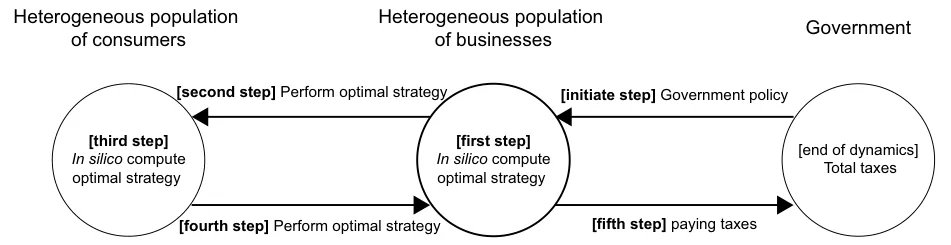
<figcaption><strong>Fig. 1</strong> A schematic view of the agents participating in the dynamics and the interactions between them, divided into five main steps</figcaption>
</figure>

In addition, since agents in the ABS can perform decisions as a reaction to the state of the dynamics (i.e., the states of other agents), Heppenstall et al. (2007) proposed to use a GA approach as the decision-making mechanism. Indeed, the authors were able to produce not just an optimized result, but results that match those derived by expert analysis through rational exploration. Thus, suggesting that GA can converge to optimal results even for non-linear and complex systems.

## 3 The Benchmark Model

Assume a closed economy where each business has a unique set of products that the consumers can buy. At the beginning of the dynamics, the government defines a taxation policy that influences the way businesses and consumers operate in the economy. Hereafter, at each point in time, each business computes the optimal strategy to operate given knowledge of their state in some time frame [*t* − *휏*, *t*] , such that *휏* ∈ ℕ is the period of interest. Given the new strategies of the businesses in the form of adjusted prices and quantities of goods (services), the consumers adapt to maximize a given target (utility) function. Between any two evaluation points [*t* − *휏*, *t*] , the businesses and consumers perform economic actions (e.g., buying and selling goods, respectively) that yield taxes for the government. The last two processes repeat periodically until convergence to equilibrium. We propose an agent-based approach to simulate these dynamics. A schematic view of the agents participating in the dynamics and the interactions between them is presented in Fig. 1.

### 3.1 The Government

At the beginning of the dynamics, the government defines a taxation policy. The policy is static (i.e., does not change over time) and is considered to be the sum of all taxes in the economy. Formally, one can define the taxation-policy (*I*) using two sets of functions: time-depended ( *I*t ) and action-depended ( *I*a ) functions. In the first set, taxes are time-depended (for example, income tax). In the second set, taxes are a result of economic activity (for instance, value-added tax on purchases). We assume that the provided taxation policy maximizes the welfare of the economy. Hence, we focus on computing this quantum.

### 3.2 The Business

A business *b* ∈ *B* can be defined as a timed finite state machine in the following way: *b* ∶= (*m*, *p*, *휂*, *휌*) , where *m* is the total budget available to the business, *p* is the vector of prices for the products (services) a business offers, *휂* is the vector of variable costs associated with each product (such as employee wages) and overall business operation (fixed costs), and *휌* is the current inventory of each product (service). In addition, we define a target (profit) function that businesses aim to maximize during some period Δ*t*:

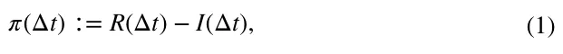

where *휋* is the profit function, *R*(Δ*t*) is the total revenue, and *I*(Δ*t*) is the total costs (in Latin *iactura*) at the period Δ*t* . Moreover, in the context of this model, we assume businesses do not accept credit. Thus, we introduce the following constrain on Eq. (1):

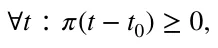

such that *t*0 is the time at the beginning of the dynamics.

Each business has a *state* that consists of the revenue obtained from all products and services the business provides, the costs related to these products (services), the current financial status of the business, the states of all consumers in the economy, and all the available products with their prices provided by other businesses in the economy. All the possible states a business can be at define the *state-space* of this business, *S*b.

In addition, each business has a list of possible actions it can perform at each state to transform from one state in the state space to another. We refer to this list of actions as the *action-space* of a business, *A*b . The possible actions a business can perform are divided into two groups: (1) changing the price of a product (service); (2) choosing the number of products (services) the business offers in the following time step (which affects production costs). A business’ action ( *a* ∈ ℝ2|P| ) is defined as a vector of the new prices and quantities of all the business’ products, *P*.

These two definitions are used to define the business strategy. A strategy is defined as a function *P*b ∶ *S*b → *A*b that maps each state (*s* ∈ *S*b) to an action (*a* ∈ *A*b) . At each point in time, a business performs an action *a* = *P*b(*s*) . Furthermore, at every period of time *휑* , all the businesses in the economy update their strategy (see Sect. 4).

Since businesses are heterogeneous, each has a different set of products and services that produces revenues and costs. However, all businesses have five common costs: (1) Taxes—all the taxes a business has to pay according to the government’s taxation policy; (2) employee salaries—we assume employees are heterogeneous, can produce all the products of the business in productivity that correspond to their salary and more employees are available upon demand; (3) advertising—all businesses can increase their popularity by increasing the values of their products (services) in the consumers’ preferences vector; (4) consumables—we assume all business’ products (services) are using the same abstract consumable with mean price per product; (5) depreciation—all business has a vector of depreciations proportional to the products (services) they offer and the quantity they sell it. A schematic view of the business’ economic model is shown in Fig. 2.

<figure id="fig-2">
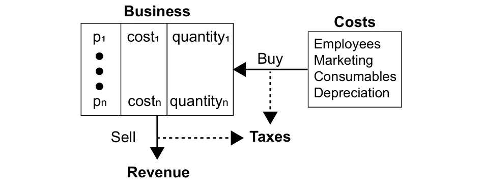
<figcaption><strong>Fig. 2</strong> A schematic view of the business’ economic model</figcaption>
</figure>

<figure class="table-figure" id="table-x1">
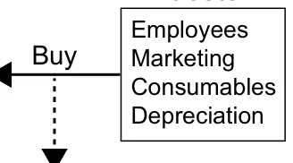

</figure>

### 3.3 The Consumer

A consumer *c* ∈ *C* can be defined as a timed finite state machine in the following way: *c* ∶= (*휙*, *휔*, *휑*, *휉*, *l*) where *휙* is the consumer’s disposable income, *휔* is the consumer preferences vector of the possible products and services the businesses provide, *휑* is the amount of time between salaries, *휉* is the salary of the consumer (such that *휙* ← *휙* + *휉* ), and *l* is a list of all products and services the consumer purchased between two salaries. Additionally, we define a target (utility) function that consumers aim to maximize:

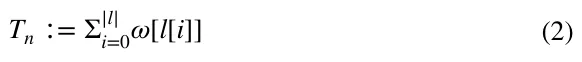

where *휔*[*l*[*i*]] indicates the utility the consumer obtained from his *i*th purchase.

Similar to businesses, each consumer has a *state* that consists of his current state and all the available products with their prices provided by the businesses. All the possible states a consumer can be at define the *state-space* of a consumer *S*t . Moreover, each consumer has a list of possible actions it can perform at each state to transform from one state in the state-space to another. We refer to this list of actions as the *action-space* of a consumer *A*t . Specifically, a consumer’s action is defined to be a purchase of a product (service) from the available products provided by the businesses.

Therefore, the consumer’s strategy is defined as a function *P*t ∶ *S*t → *A*t that maps each state (*s* ∈ *S*t) to an action (*a* ∈ *A*t) . At each point in time, a consumer is performing an action *a* = *P*t(*s*) . Furthermore, at every period of time *휑* , all the consumers in the economy update their strategy (see Sect. 4).

## 4 Agent‑Based Simulation with Multi‑objective Genetic Algorithm

Based on the proposed model, one can formally define the process using an agent-based simulation (Macal, 2010). Each agent in the economy is allocated to be either a business or a consumer (in addition to the government). Every agent is associated with a GA-based model responsible for its action in each step of the calculation. A detailed description of the agent’s learning and inference processes is provided below.

Following the definition of a business, a consumer, and the interactions between them, we implement these two types of agents to simulate the economic dynamics described by the model. Each agent contains a unique list of attributes and possible actions which is derived from its type and the initial condition taking place at the begging of the simulation. In addition, a sense-update-action loop is used as the mainframe of the algorithm (Pinciroli et al., 2011). In particular, the simulator has a synchronized clock. In each clock tick (marked by *t*i for the ith tic) each consumer in the economy, in a random order, purchases a product (service) from a business, if any. Furthermore, each *휑* ∈ ℕ clock ticks, the agents’ strategies are updated using the following procedure. At the beginning of the simulation, the population of businesses and consumers is initialized. For each business, a number *훼* of products with random prices and quantities obtained from a pre-defined distribution is given as a start condition of the simulation. In addition, expense functions are either randomly generated or obtained as a start condition. Furthermore, each business has an initial budget sampled from a given distribution. For each consumer, a *휏*-time income is randomly sampled from a given distribution, alongside a vector of preferences in the size of all products (and services) of all businesses. On top of that, a taxation policy is provided. Hereafter, for each step, the agents’ strategies are updated according to an algorithms which are based on three main logical steps. First, all the businesses are allocating new prices and acquiring quantities to their products (services) by computing the optimal option from all the possible options, assuming all other businesses keep the same prices for their products and the consumer does not update their strategies. This assumption results in a sub-optimal, local response to the market dynamics, as the business is aware of the fact that all other businesses potentially will change their strategies which may alter the dynamics it currently trying to optimize, resulting in a sub-optimal solution. Moreover, these updates occur periodically, resulting in a sub-optimal and local in-time response for each business at any point in time. Second, after all, businesses update the prices and quantities of their products (services) and influence the preference vectors of the consumers by investing in advertising, the consumers update their strategy. The consumers plan the list of purchases that maximize their personal utility function, under the constraints. Third, after all the businesses’ and consumers’ actions had taken place, the taxes associated with these actions is paid by the businesses.

<figure id="fig-3">
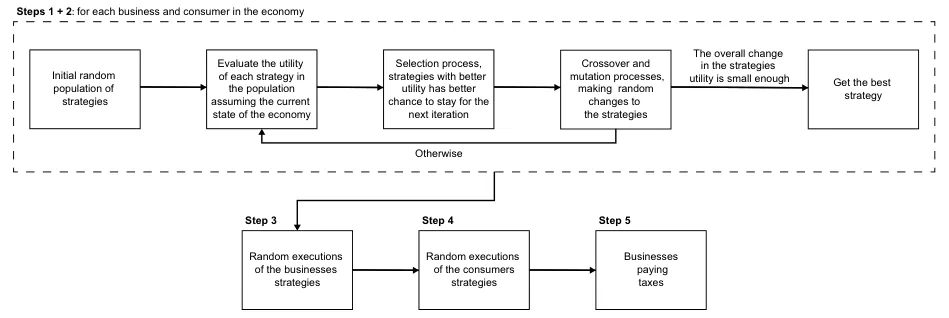
<figcaption><strong>Fig. 3</strong> Schematic view of the GA implementation for the proposed model</figcaption>
</figure>

In the following subsection, we propose an implementation of the proposed dynamics using a GA approach (Kumar et al., 2010), as shown in Fig. 3.

The businesses agents are defined as follows. Each business has a list of goods ( *G* ) such that each product has a price and a quantity. Since usually companies focus on a specific section of the market, it is safe to assume a similarity in the eyes of the consumers between the business’ products. Therefore, each business has a similarity matrix between all its products *훿* ∈ ℝ|G|×|G|.

In addition, the quantity of each product that the business produces (buys) is affected by four expenditure functions: taxes *I*T , employee’s salaries *I*E , consumables *I*C , and depreciation *I*D . These functions differ significantly across industries, countries, and periods of time (Ohanian et al., 2008; Kugler & Kugler, 2009; Decoster et al., 2010; Causa & Hermansen, 2017). One can approximate the consumables ( *I*C ) and depreciation ( *I*D ) functions using linear functions ( *ax* + *b* ) to obtain a fair approximation for an average business, such that the coefficients (*a*, *b*) are unique to each good ( *g* ∈ *G* ), where *x* stands for the quantity of good *g* . In addition, the employee’s salaries, ( *I*E ), are driven from some pre-defined distribution and each employee has an output. We assume the output is linearly dependent on the employee’s salary and that each product the business sell has some *processing* effort required. The taxation function ( *I*T ) is defined for each business as an initial condition of the model and therefore does not defined in advance.

Moreover, each business can spend a portion of its budget on advertising one or more of its products. It is assumed that there is an advertising function *I*M that gets a product, the amount of money the business is willing to invest in the advertising of this product, and returns the average increment of the product’s preference in the consumer’s population. Additionally, due to the similarity between the business’ products and by taking into consideration the business brand, any investment in advertising one product reflects in the product’s preference increase in respect to the similarity between the two products (Fryar, 1991; Brown & Dacin, 1997). Specifically, in the context of this simulator, we define the advertising function to be logarithmic to the amount of money spend and which coefficients ( *a*, *b* ) related to each product, such as:

*I*p M(*x*) = *a* ⋅ *ln*(1 + *bx*).

This function has been chosen following several studies that regressed sales on advertising and offered evidence that advertising’s effectiveness is subject to diminishing returns, where doubled advertising results in less than doubled sales (Dekimpe & Hanssens, 2007; Simon & Arndt, 1980; Simon, 1970).

Therefore, in the first step, a population initialization phase takes place. This phase can be divided into first population initialization in the simulation and second or after population initialization. For the case where this is the first population initialization in the simulation, a random vector of prices and quantities is sampled from a given distribution of feasible prices and quantities. Otherwise, the population from the last strategy computation is taken. Then, a pre-defined number of times the mutation operator is performed on the population. This yields a sub-optimal, more diverse population for the previous strategy-learning phase and can be used as a good initial stage to the next strategy-learning phase, assuming the dynamics change at a slow enough rate.

A single chromosome takes the form of a list of the business’ products (services), such that each product (service) is a tuple of the product’s price and quantity. We define a fitness function for such chromosomes to be the economic utilization fitness function, as described in Eq. (1). In practice, the fitness function is computed according to the business knowledge from the last iteration on the other businesses and the consumers’ preferences. Indeed, in reality, most sellers sell many heterogeneous products while most products are sold with price tags set by the seller and customers shop by searching for the best price across sellers. Therefore, the price adjustment process in these types of businesses is a far more difficult, complex, and involved operation than in stores selling a single product (Levy et al., 1998; Klenow & Malin, 2010). Formally, the fitting criteria for a chromosome ( *휙* ) take the form:

*fitness*(*휙*) ∶= *R*(*휙*, *E*(*휙*)) − *I*T(*휙*, *E*(*휙*)) − *I*D(*휙*) − *I*C(*휙*) − *I*E(*휙*) − *I*M(*휙*, *E*(*휙*)), where *E*(*휙*) is the expected sales of all the business’ products given a chromosome *휙* . One can compute the *E*(*휙*) by computing the next iteration of the model, assuming just the evaluating business updates its strategy while the businesses and consumers repeat the same strategy as in the last iteration.

In this research, we use the tournaments selection operator in the context of operations sequencing such as query sessions, this method showing promising results (Bo et al., 2006). Following this logic, the individual with the optimal (best) fitness score in some generation should be kept for the next generation as its probability leads the way for the optimal agent. Therefore, some portion of the population *훼* ∈(0, 1) is kept for the next generation. In addition, other chromosomes in the population are selected using the following tournament selection process. Suppose there have *W* chromosomes to be selected. In each iteration, a chromosome is selected out of the remained population with a probability corresponding to its normalized fitness score (normalized such that the sum of all chromosomes’ fitness scores is 1 ). This process is repeated until *W* chromosomes are selected.

In addition, the crossover operator used is based on the Select Any Crossover (SAC) approach (Hassanat & Alkafaween, 2017) with the Order Crossover (OC) (Davis, 1985) and the Ring Crossover (RC) (Kaya et al., 2011). The underline motivation is that the SAC allows a wider range of crossover options, allowing the algorithm a better exploration. In addition, the OC keeps the order (e.g., several products’ prices and quantities) of the chromosome, allowing it to keep potently optimal products intact. In a similar manner, the RC keeps the prices and quantities but allocates them for other products. These slightly different crossover methods allow overcoming local optima obtained by one of them while not producing too much disagreement in the global convergence direction (which can lead to overall diversion).

Furthermore, a mutation operator has been used to generate new chromosomes which are not a combination of the initial population. We use a mutation operator that randomly selects some chromosomes from the population with a probability *M*p . Then, for each chromosome, a single product (service) is randomly chosen. The price and quantity of this product are altered by adding a delta in price and quantity, which is produced by sampling a given distribution.

The consumer agents are defined as follows. The consumer strategy update is implemented using a multi-objective GA such that a chromosome is defined as a list of the purchases of products (and services) from businesses. The fitness function of the chromosomes is chosen to be the personal utilization fitness function, as described in Eq. (2). Moreover, similar to the business selection operator, we use the tournament, selection operator. However, since the businesses’ products do not change over time, we based our crossover operator on the BLX-*훼* crossover proposed by Eshelman and Schaffer (1993), as this crossover has shown to work well on a wide range of tasks on one hand while being simple and fast to compute on the other hand (Tsutsui et al., 1999). Furthermore, a mutation operator is used and works as follows. A chromosome (product purchase) is randomly picked and replaced with another product from all possible products such that the probability to pick a product is associated with the normalized distance between the price multiplied by the consumer’s preference for the product with the original one. On top of it, we introduce a feasibility operator which checks if a chromosome can even exist or not according to a given set of constraints (Salehi & Bahreininejad, 2011). If a chromosome is not feasible, its fitness score is set to be 0 such that it will not be selected during the selection process.

## 5 Model Validation

In order to evaluate the ability of the proposed model in estimating state tax revenues obtained from geographical areas within countries, such as districts or cities, we benchmark the results of the proposed model on data from a small city near Moscow (Russia), Klin1

### 5.1 Setup

#### 5.1.1 Data Acquisition

We obtain data regarding 50 local businesses from Klin, Russia. In particular, revenues and costs report from 2015 to 2019. Notably, for the proposed model, the number of employees and their respective monthly salaries, the profit associated with each good, the tax deductions due to expenditure incurred on spare parts and consumable stores, and the depreciation expenses are provided. Based on this, we manually extracted for each business the following data points:

- The number of employees, including their yearly salaries.
- The yearly sum of taxes, in rubles, the business pays every year.
- The number of unique products (services) the business sold each year.
- The tax deductions due to business’ consumables and depreciation.

A summary of this data with a description of the main occupation of each business is summarized in Table 1. In addition, in regard to the consumers, there were around 79, 000 individuals in Klin in 20182 and only 79% of the population is 18 years old and older (at 2019)3 which assumes to be the age where consumer start to work and take active rule in the economy.4 Therefore, it results in 62410 consumers participating in Klin’s economy.

#### 5.1.2 Simulation Setup

Since the output of each employee in each business is not provided, and arguably changes over time and is complex to measure (Hunter et al., 1990; Kocag, 2021), we assume that the output an employee produces is proportional to the yearly salary he gets. In addition, we assume that the overall output of all employees in a business is exactly the amount of work required to sell all the goods each year. To evaluate the legitimacy of this assumption, we compute the output each employee produces as a function of his salary for the first year (2015) and the input required from the employees to put in each product (service) of the business in the same year. Afterward, we repeated the same computation for the other 4 years (2016–2019) and generated a relative error matrix *E* ∈ ℝ4×50 where *e*i,j ∈ *E* is the mean relative error of the output required by all the products for the *i*th year and the *j*th business compared to the output of the same business in 2015. By taking the average of this matrix, one gets that the mean relative error across time and businesses are 0.087 . Namely, the Footnote 1 (continued)

<figure class="table-figure" id="table-1">
<figcaption><strong>Table 1</strong> A description of the businesses that were taken into consideration in the simulation</figcaption>
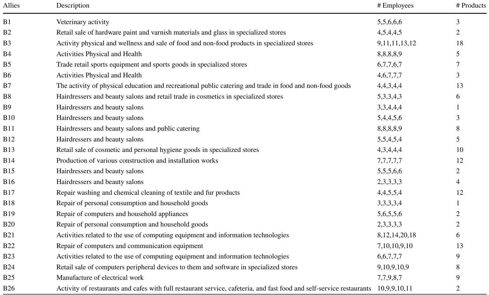

</figure>

<figure class="table-figure" id="table-1b">
<figcaption><strong>Table 1</strong> (continued)</figcaption>
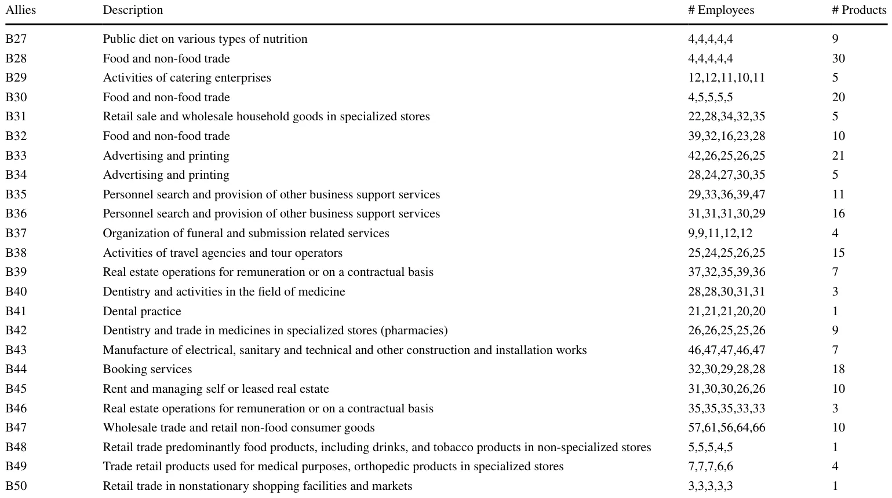

</figure>

assumption introduces an average of 8.7% error. Moreover, due to the lack of marketing costs data and its influence over time, we neglect the marketing costs from this simulation.

We estimate the total taxes originated by four taxation laws: corporate tax, employer tax, value-added tax (VAT), and employees’ income tax, as they construct most of the taxes businesses in Russia pay. In particular, the corporate tax rate is set at 15%, the employer tax rate is 22% for the first 1.465 million rubles, and 10% on any amount over it from each employee’s yearly wage. In addition, 2.9% of the wage is added as a social insurance fund, limited by 0.966 million rubles. On top of that, 5.1% of the wage is taxed as the medical insurance fund. This is summarized as 30% of the yearly employee’s wage. The VAT is set to 18%. The employees’ income tax is set to 13%.

Given the data for the year 2015, we assumed that the businesses operated identically in 2014 and as such assume the same employees worked in 2014, with the same salary and output. In the same manner, the initial amount of budget and products are assumed to be as in 2015. The salaries in 2014 are allocated according to a skewed normal distribution with a mean of 32137 , a standard deviation of 29125 , and skewness of 1.95 to satisfy a median salary of 132025 and a top 1% of the salaries of around 100000 (approximated from news articles). During the simulation, the consumer’s salary is linearly growing to satisfy the new mean salary while keeping the same distribution.6 In addition, the consumers’ initial preference vectors are assumed to be the set of vectors *P*s such that:

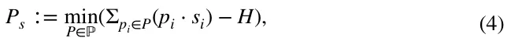

where ℙ *⊂* ℝ𝜒 ( *휒* is the size of the population multiple by the size of a single preference vector) is the space of all possible sets of preference vectors. As such, *P* ∈ ℙ is a set of preference vectors. In addition, *s*i is the yearly disposable income of the *i*th consumer, *p*i ∈[0, 1]휁 (such that *휁* is the total number of products in the economy) is the preference vector of the *i*th consumer, and *H* ∈ ℝ휁 is the vector of total sales of each product in the local currency. Namely, the set of preferences that minimize the error to the historical records over all products in the economy. In addition, we assume that each consumer deducts a fixed rate, *훾* , from his disposable income for savings (in our case, that rate is equal to *훾* = 0.156).7 That is, in each period consumers spend only 1 − *훾* = 0.844 of their disposable income for the purpose of consuming products and services.

For each firm, during the strategy evaluation process performed by the GA algorithm, we used the following hyperparameters. The strategy population, the number of generations, the mutation rate, the crossover rate, and the royalty rate are set to 100, 50, 0.05, 0.1, and 0.03, respectively.

### 5.2 Results

Based on the assumptions outlined above, we ran the proposed simulation (see Sect. 4) such that each of the businesses and the consumers update their strategies once a month. First, we evaluated the ability of the proposed model to estimate state tax revenues using historical records. In particular, we computed tax revenues between 2016 and 2019 on a yearly basis, fitting the model on the data obtained from 2015, as shown in Fig. 4, where the x-axis represents the year and the y-axis shows the tax revenues in hundreds of millions of rubles. The model’s predictions are the 5% bottom percentile of *n* = 50 repetitions due to the stochastic nature of the model. The obtained relative mean absolute error and standard deviation of the errors are 5.44% ± 2.45%.

In order to compare the model’s forecast error to the traditional regression-based model’s forecast errors, we used average forecast error data of tax revenues provided for U.S. by Boyd and Dadayan (2014) over 10 years period. Since our interest is focused on the assessment of state tax revenues obtained from geographical areas within countries, such as districts and cities, We took into consideration states with one dominant industry or states with small volatile taxes compared to their budget in order to find a set well representing the proposed case (Boyd & Dadayan, 2014). We enriched this data with the gross domestic product (GDP) for the year 2020 of each state as a representation of the economy’s size.8 Moreover, since the predictions conducted by Boyd and Dadayan (2014) have been up to the year 2010, we estimated the GDP of each state by computing an exponential fitting to the overall U.S. GDP between the years 2010 and 2020,9 and computing backward the GDP of each state separately. The results are shown in Fig. 5, where the x-axis is the size of the economy and the y-axis is the mean ± standard deviation error in predicting the tax revenues next year based on 10-year historical records, for 10 years sample. Based on this data, we computed the linear regression *MAE* = 11.0764 − 0.0125*GDP* , obtained with a coefficient of determination of *R*2 = 0.455 . Based on the linear model, we computed the estimated error the regression model proposed by (Boyd & Dadayan, 2014) would obtain on Klin’s economy as shown by the red (triangle) point (11.07%). Moreover, we computed the mean *pm* standard deviation of the proposed model when predicting 1 year ahead based on the economic state in the same year for 4 years, obtaining 4.08 ± 1.21 . One can notice this comparison is not in the favor of the proposed model since the regression-based results used 10 years of historical data compared to the 1 year used by the proposed model. In addition, the regression-based results are a mean of 10 years while the proposed model’s results are of only 4 years, which provides fewer samples to reduce the average error.

Moreover, we computed the sensitivity of the model to changes in the employer’s tax and the Value Added tax with respect to the average number of employees per business and changes in total tax revenues of the government, respectively. The results are shown as mean ± standard deviation of *n* = 50 repetitions of the model’s prediction. The changes in the average number of employees per business for 4 years as a result of the government changing the employer’s tax and value-added tax are presented in Figs. 6 and 7, where the yellow (dashed) horizontal line indicates the baseline of 30% and 18% rates of taxes, respectively. Notably, the VAT has been raised to 20% on January 1, 2019, however, we assume that this raise does not occur.

<figure id="fig-4">
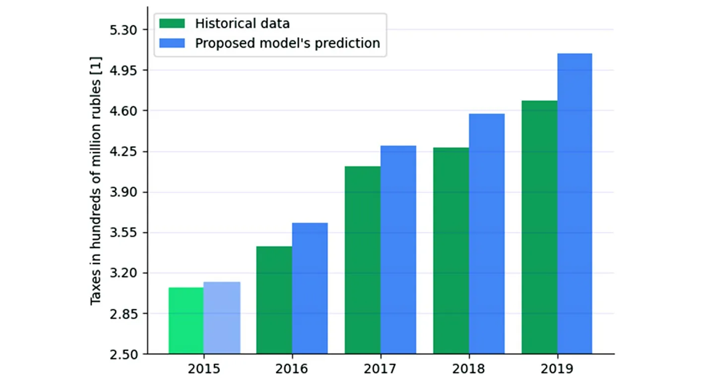
<figcaption><strong>Fig. 4</strong> Comparison between the absolute historical tax revenues and the model’s forecast. The year 2015 was used to fit the model’s parameters. The results of the proposed model are the mean of <em>n</em> = 50 repetitions</figcaption>
</figure>

Furthermore, the change in the total state tax revenues as a percentage of the original amount of taxes (Fig. 4), as a result of the government changing the employer’s tax and the changing of VAT are presented in Figs. 8 and 9, where the black (dashed) horizontal line indicates the baseline of 30% and 18% for the taxes, respectively. The influence is represented by four lines indicating the changes in 1 year (green), 2 years (purple), 3 years (blue), and 4 years (yellow).

## 6 Discussion

The proposed model is based on the supply and demand model in a closed economy and assumes that individuals are rational but unnecessarily able to obtain the optimal decision due to lack of computation time, biased initial point, and error in the computation (i.e., bounded rationality). In addition, the individuals have partial information concerning the current state of the economy. However, they always have complete information on the economic state that existed in previous periods. Based on this, we developed a heterogeneous agent-based model with a government, a heterogeneous group of businesses, and a heterogeneous group of consumers where the decision-making process of each agent (either business or consumer) is performed using a multi-objective GA.

<figure id="fig-5">
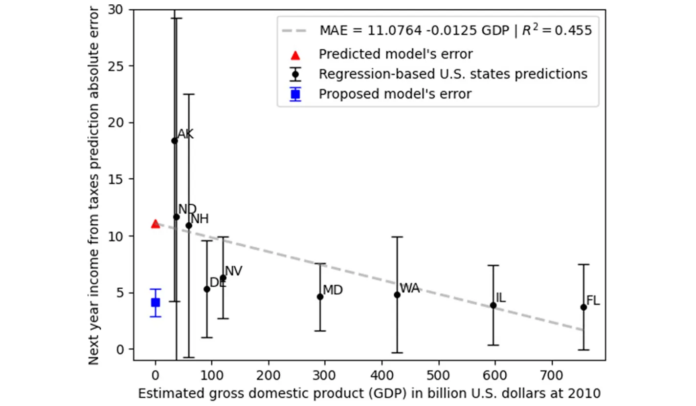
<figcaption><strong>Fig. 5</strong> The connection between economy size and prediction of next year’s taxes error using regression models. The blue (square) and red (triangle) points indicate the results of the proposed model and the estimated results one would get by using the regression model</figcaption>
</figure>

The proposed simulation is fitted on historical data for the city of Klin (Russia), with 50 businesses and 62.41 thousand consumers for the year 2015. Additional socioeconomic data, such as the distribution of salaries and the taxation policy, have been used. Using the simulation, we show that the model can estimate the total yearly state tax revenues over 4 years ( 5.96%, 4.29%, 6.82%, 8.69% ) with a mean relative error and standard deviation of 5.44% ± 2.45% , as shown in Fig. 4. One can notice that the proposed model captures the increasing trend in taxation. This happens due to two main processes that the model takes into consideration: a) the increase in the population’s size as well as the average amount of money they can spend results in more consumption, which yields more taxes; and b) businesses that survive for several years, as the ones evaluated in our simulation, show on average a growth trajectory, which also generates more taxes by the businesses (Mogos et al., 2021; Rannikko et al., 2019).

The obtained mean relative error that the proposed model is using for the state of the economy at each year and predicted 1 year is 4.08% ± 1.21 , as shown in Fig. 5. We compared the model’s error to the one obtained for U.S. states with one dominant industry as a function of the economy’s size represented by the GDP of the state in 2010 (e.g., the end of the prediction) using the regression model proposed by Boyd and Dadayan (2014) which uses 10 years historical data for each prediction and reports the mean ± standard deviation of 10 predictions. One can see there is a phase transition between large states ( *GDP >* 90 billion U.S. dollars) and small ( *GDP* ≤ 90 billion U.S. dollars), such that the error obtained for the large states is around 5 while the error obtained for the small states is over 10 . We computed the linear regression model based on this data, predicting the error of the same regression model would be 11.07% for our case. Since the proposed model’s mean relative error is 4.08% compared to the 11.07% that a classical regression model with 10 times more data would obtain, it is safe to say the proposed model outperforms classical regression models for tax revenue predictions for small size economics. Moreover, the standard deviation of the model obtained from four samples is 1.21% while the most stable prediction for the state of Maryland (MD) is 3% . Hence, the proposed model is significantly more stable over time in predicting income from taxes. This outcome is significant given the fact that the results we obtained are for an economy of minimal size (city), knowing that the more the assessment is made for a smaller economy the greater the error will be (Boyd & Dadayan, 2014). Namely, classical signal processing methods used for tax prediction on a country level is not suitable for small-sized economies (such as a city) and required both different computational approach and data. Hence, the proposed model would be less accurate for large-size economics and vise-verse.

<figure id="fig-6">
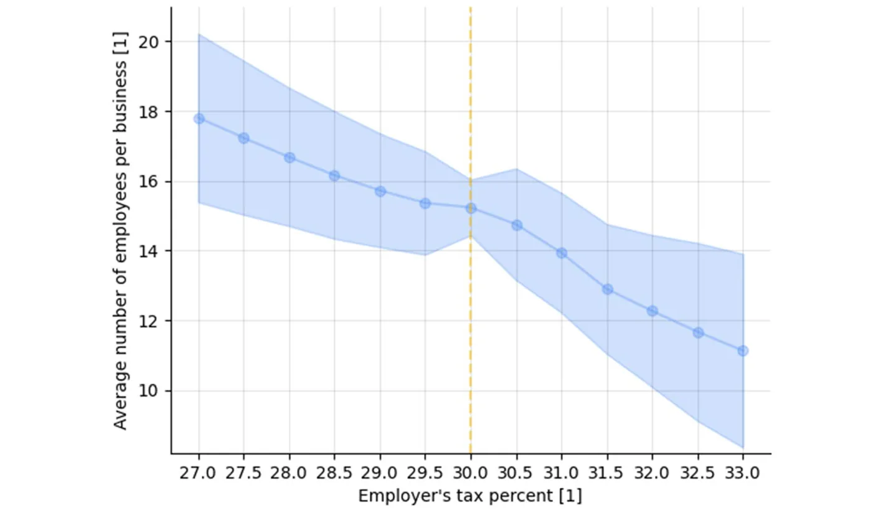
<figcaption><strong>Fig. 6</strong> Sensitivity analysis on the number of employees as a function of the employer tax. The historical employer’s tax is 30%. The model parameters fitted for the year 2015. The results are shown as mean ± standard deviation of <em>n</em> = 50 model repetitions</figcaption>
</figure>

<figure id="fig-7">
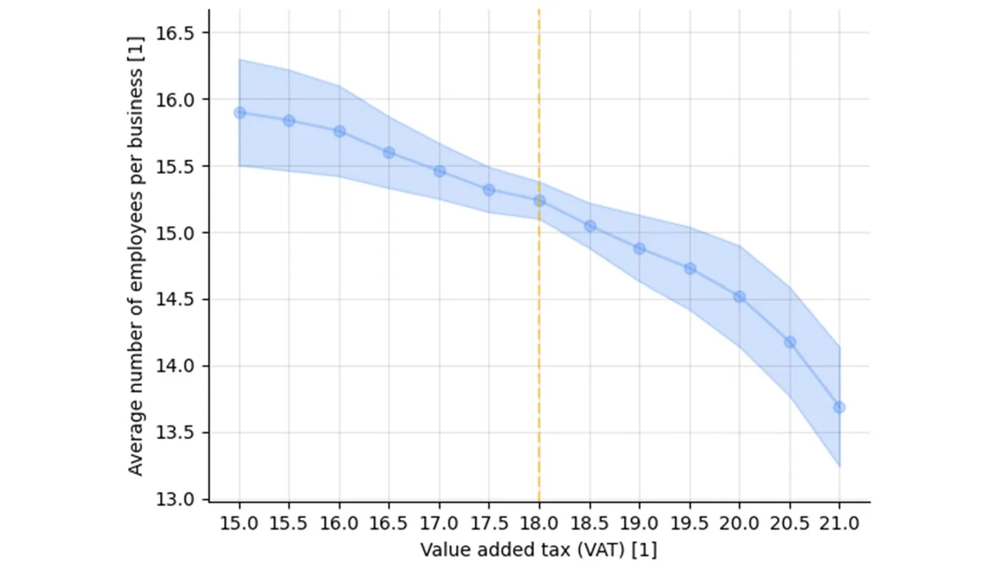
<figcaption><strong>Fig. 7</strong> Sensitivity analysis on the number of employees as a function of VAT. The historical VAT is 18% for the majority of the period (from 2015 to 2018). The model parameters fitted for the year 2015. The results are shown as mean ± standard deviation of <em>n</em> = 50 model repetitions</figcaption>
</figure>

<figure id="fig-8">
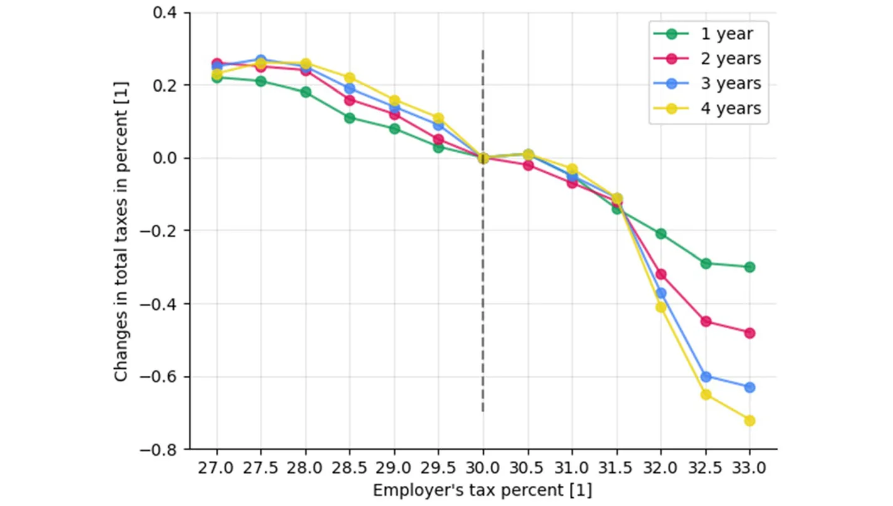
<figcaption><strong>Fig. 8</strong> Sensitivity analysis on the changes in total taxes as a function of the employer tax. The historical employer’s tax is 30%. The model parameters fitted for the year 2015. The results are shown as 5% bottom percentile of <em>n</em> = 50 model repetitions</figcaption>
</figure>

<figure id="fig-9">
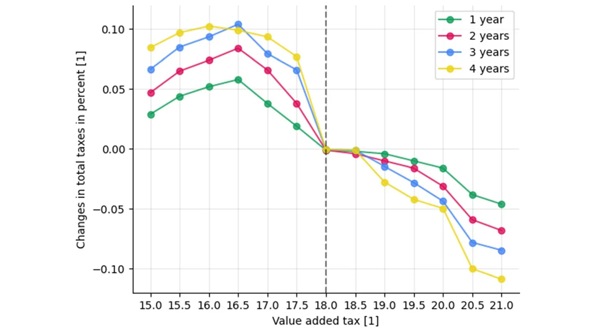
<figcaption><strong>Fig. 9</strong> Sensitivity analysis on the changes in total taxes as a function of VAT. The historical VAT is set to 18% as the baseline. The model parameters fitted for the year 2015. The results are shown as the 5% bottom percentile of <em>n</em> = 50 model repetitions</figcaption>
</figure>

Furthermore, the proposed model can estimate the influence of altering the taxation policy by the government on the economy. This feature is made possible by the inclusion of micro-economic variables, rather than broad macroeconomic indicators, in the forecasting model. For example, we evaluated the impact of changing the employer’s tax and the VAT on the average number of employees per business in the economy, as shown in Figs. 6 and 7, respectively. By performing a linear regression on the data from Figs. 6 to 7, one obtains *̄E* = 46.8646 − 1.0946*T*employers and *̄E* = 20.970 − 0.325*T*VAT with a coefficient of determination of *R*2 = 0.98 and *R*2 = 0.95 , respectively, where *̄E* is the average number of employees per business and *T*employers, *T*VAT are the employer’s taxes and the VAT, respectively. Hence, the changes in both taxes are linear to the average number of employees per business in a global manner but as one can see, the second numerical derivative of Fig. 6 is changing sign twice between 29 and 32 and of Fig. 7 is almost monotony increasing as a function of the VAT. Videlicet, small changes, and large changes have a non-linear impact on the average number of employees per business, but on average the impact is linear.

Moreover, we evaluated the impact of changing the employer’s tax and the VAT on the total change (in percent) in state government tax revenues over time, as shown in Figs. 8 and 9, respectively. For the case of employer’s tax, one can point out four intervals of interest: from 27 to 28%, 28–30%, 30–31.5%, and 31.5–33%. In the first interval, the amount of tax revenues increases for the first 2 years but later reduces in the third and fourth years while still higher than the baseline. In the second interval, the amount of tax revenues increases for all 4 years such that each year produces a higher increment compared to the previous one. In the third interval, there is a reduction in the 4 years but the reduction in the first 2 years is more significant compared to the latter 2 years. Finally, in the fourth interval, the amount of tax revenues decreased for all 4 years such that each year produces a higher decrease compared to the previous one. Nonetheless, one can see that the suggested tax policy in Russia places the tax revenues on the descending side of the Laffer curve so that lowering the tax rate will lead to an increase in state tax revenues, while a further increase in the employer’s tax rate will lead to a decrease in total tax revenues. This conclusion is also supported by Fig. 6 which indicates an increase in the number of employees per business in the event of a reduction in employer tax. This result illustrates the idea that people will adjust their behavior in the face of the incentives created by tax rates. The same conclusion is reached after analyzing the results for changes in value-added tax, as shown in Fig. 9, with the three intervals: 15–16.5%, 16.5–18%, and 18–21%.

## 7 Conclusion

A well-defined tax revenue forecast is the linchpin for a sustainable fiscal program. The model developed in this study allows us to predict tax revenues given a taxation policy with fine accuracy even for small economies. The inclusion of all economic agents, and not just aggregate economic indicators, into the forecasting model allows for rich analysis. In particular, the model can provide estimates for the impact of changes in taxation policy on the economy. For instance, the number of employees in businesses and the total amount of tax revenues. The model is implemented for the city of Klin, Russia, with data of 50 local businesses and 62410 consumers.

The proposed model combines a heterogeneous agent-based simulation with a personal decision-making process per agent using a genetic algorithm. This is extending the traditional agent-based simulation often used in economics by two factors: first, the agents are divided into two inherently different groups: businesses and consumers; such that each one of the groups has a different objective (i.e., fitness function type and not just parameters). Second, the population is heterogeneous as each business has a unique set of products and each consumer has unique preferences. These properties allow us to better simulate a realistic scenario of how individuals operate in a free market, which allows us to explore the influence of changes in taxation policies on the total amount of taxes the population and business would pay overtime and the influence of various economic processes such as shown in Figs. 6, 7, 8 and 9.

When proposing a new taxation policy, policymakers will be able to use our model to investigate the effect of the proposed change on multiple economic processes, in particular on the tax revenues over time. Our results indicate that policymakers need to take into consideration the unique socio-economic properties that individuals in the population have in different cities and regions to obtain a better prediction of tax revenues due to policy changes.

The results in this study were obtained from the data of the city of Klin, Russia (as presented in Sect. 5). These results can vary significantly across countries and time as it depends on several hyper-parameters such as the population size, current taxation policy, available businesses data, and other socio-economic properties (Ulman et al., 2021; Dabbous & Tarhini, 2021). Therefore, in future studies, we suggest investigating the influence of taking into consideration changes in the population and businesses. In addition, since the model assumes businesses and consumers are goal-oriented (i.e., aiming to maximize their utility for just the following period of time), one may relax this assumption and introduce a savings mechanism into the simulation to better represent the actual dynamics. Moreover, we plan to extend the proposed model for an open economy and investigate the influence of the inner and outer connectivity of a single economy on the model’s accuracy. Furthermore, in our analysis, we compared the results of the proposed model with the relatively simple time series forecasting model proposed by Boyd and Dadayan (2014) while more advanced methods such as machine learning (Masini et al., 2021), deep learning (Sezer et al., 2020), and ordinary differential equations based models (Gao et al., 2022; Hu et al., 2022) are already wildly used in economics. This is the outcome of a lack of publicly available data needed for such analysis for Russia and other countries.

One limitation of the proposed agent-based simulator is that the computation time is asymptotically linear to the size of the population. In comparison, classical regression models are using several historical points which are independent of the size of the population and therefore require a fixed amount of time to be computed. This time is more often than not significantly less than the time required by the proposed model. Therefore, for large size populations such as in the case of countries, the required computation time or resources increase and may be expensive. However, most of the computation steps in the simulations are independent in the scope of a single individual in the population which allows relatively easy parallelization of the computation, which in its turn can reduce the computing time. This would make the proposed simulation a feasible solution even for large populations like entire countries. In addition, the proposed simulation assumes the individuals and businesses are rational (bounded rationality), but relaxes this assumption by allowing sub-optimal results to be obtained due to the GA and the partial ability of the data from the agent’s perspective. Nevertheless, the modern behavioral economy shows repeatably that individuals are irrational (Reed et al., 2013). Thus, in order to better represent realistic dynamics, a model can introduce an “irrationality” component to the decision-making. For instance, individual irrationality can be modeled as an information filtering mechanism where part of the state the individual is aware of is ignored at random (Xu et al., 2016).

**Author Contributions** Formal analysis and investigation, and manuscript editing were performed by Ariel Alexi; Conceptualization, formal analysis and investigation, software, original draft preparation, and original draft preparation were performed by Teddy Lazebnik; Formal analysis and investigation and manuscript editing were performed by Labib Shami.

**Funding** The authors declare that no funds, grants, or other support were received during the preparation of this manuscript.

**Data Availability** The data used as part of this study is partially published: https://rosstat.gov.ru/compe ndium/document/132822. https://rosstat.gov.ru/compendium/document/132843. https://vestnikramn.spr-journal.ru/jour/article/view/41. The business’s yearly reports are protected by privacy law according to clauses 2–11 of part 1 of article 6, part 2 of article 10, and part 2 of article 11 of the Russian federal law.

**Code Availability** Upon acceptance, we will publish all the source code used in a GitHub repository.

### Declarations

**Conflict of interest** The authors have no relevant financial or non-financial interests to disclose.

## Notes

1 Under the Constitution of the Russian Federation, all state bodies are divided into 1) federal entities,

2) bodies of the “constituent subjects” of the Russian Federation, and 3) local (municipal) bodies. The holder of the highest office in the Russian Federation is the President, which appoints the Prime Minister and the Chairman of the Central Bank. The Government of the Russian Federation exercises executive power at the federal level, with the Prime Minister acting as its head, and the Parliament exercises legislative powers at the federal level. The Russian Federation consists of 85 “constituent subjects” as regions within the federation, and they granted a certain degree of autonomy over their internal economic and

political affairs. Regional powers include the authority to manage a regional property, establish regional budgets, collect regional taxes, and maintain law and order. The lowest level of the political system is the local government (Municipalities) that have their budgets and may enjoy certain limited taxation powers.

2 https://rosstat.gov.ru/compendium/document/13282.

3 https://rosstat.gov.ru/compendium/document/13282.

4 https://vestnikramn.spr-journal.ru/jour/article/view/41.

5 https://www.statista.com/statistics/1269963/russia-minimum-wage/.

6 https://www.statista.com/statistics/1010660/russia-average-monthly-nominal-wage/.

7 https://www.ceicdata.com/en/indicator/russia/gross-savings-rate.

8 https://www.statista.com/statistics/248023/us-gross-domestic-product-gdp-by-state/

9 https://tradingeconomics.com/united-states/

## References

- Alexi, A., Rosenfeld, A., & Lazebnik, T. (2022). A security games inspired approach for distributed control of pandemic spread. Advanced Theory and Simulations, 2200631.
- Anjan, R., Goberman, D., & Pugatch, R. (2021). A unifying autocatalytic network-based framework for bacterial growth laws. PNAS, 118(33), e2107829118.
- Asimakopoulos, S., Paredes, J., & Warmedinger, T. (2018). Real-time fiscal forecasting using mixed-frequency data. The Scandinavian Journal of Economics, 22(1), 369–390.
- Auerbach, A. J. (1999). On the performance and use of government revenue forecasts. National Tax Journal, 52(4), 767–782.
- Axelrod, R. (1998). The complexity of cooperation: Agent-based models of competition and collaboration. Princeton University Press.
- Bertoletti, P., & Etro, F. (2022). Monopolistic competition, as you like it. Economic Inquiry, 60(1), 293–319.
- Bo, Z. W., Hua, L. Z., & Yu, Z. G. (2006). Optimization of process route by genetic algorithms. Robotics and Computer-Integrated Manufacturing, 22, 180–188.
- Bonabeau, E. (2002). Agent-based modeling: Methods and techniques for simulating human systems. PNAS, 99, 7280–7287.
- Bo, L., & Rein, L. (2005). Comparison of the luus-jaakola optimization procedure and the genetic algorithm. Engineering Optimization, 37(4), 381–396.
- Boyd, D. J. & Dadayan, L. (2014). State tax revenue forecasting accuracy. Technical report, Rockefeller Institute of Government, the State University of New York.
- Brannlund, R., & Nordstrom, J. (2004). Carbon tax simulations using a household demand model. European Economic Review, 48(1), 211–233.
- Brogan, M. (2012). The politics of budgeting: Evaluating the effects of the political election cycle on state-level budget forecast errors. Public Administration Quarterly, 84–115.
- Brown, T. J., & Dacin, P. A. (1997). The company and the product: Corporate associations and consumer product responses. Journal of Marketing, 61(1), 68–84.
- Canese, L., Cardarilli, G. C., Di Nunzio, L., Fazzolari, R., Giardino, D., Re, M., & Spano, S. (2021). Multi-agent reinforcement learning: A review of challenges and applications. Applied Sciences, 11(11), 4948.
- Causa, O. & Hermansen, M. (2017). Income redistribution through taxes and transfers across oecd countries. OECD Economics Department Working Papers, 1453.
- Ciatto, G., Schumacher, M. I., Omicini, A., & Calvaresi, D. (2020). Agent-based explanations in AI: Towards an abstract framework. In: International Workshop on Explainable, Transparent Autonomous Agents and Multi-Agent Systems, pp. 3–20. Springer.
- Coglianese, C. (2018). Optimizing regulation for an optimizing economy (pp. 18–35). Institute for Law and Economics: University of Pennsylvania.
- Dabbous, A., & Tarhini, A. (2021). Does sharing economy promote sustainable economic development and energy efficiency? Evidence from oecd countries. Journal of Innovation & Knowledge, 6(1), 58–68.
- Davis, L. (1985). Applying adaptive algorithms to epistatic domains. Proceedings of the International Joint Conference on Artificial Intelligence, 162–164.
- Decoster, A., Loughrey, J., O’Donoghue, C., & Verwerft, D. (2010). How regressive are indirect taxes? a microsimulation analysis for five European countries. Journal of Policy Analysis and Management, 29(2), 326–350.
- Deguchi, H. (2004). Gaming simulation and the dynamics of a virtual economy. Springer.
- Dekimpe, M. G. & Hanssens, D. M. (2007). Advertising response models. In: The Sage Handbook of Advertising, pp. 247–263. Sage Publications.
- Drake, A. E., & Marks, R. (2002). Genetic algorithms in economics and finance: Forecasting stock market prices and foreign exchange-a review. In S. Chen (Ed.), Genetic algorithms and genetic programming in computational finance (pp. 29–54). Boston, MA: Springer.
- Epstein, J. M. & Axtell, R. (1996). Growing artificial societies: Social science from the bottom up. MIT Press.
- Eshelman, L. J., & Schaffer, J. D. (1993). Real-coded genetic algorithms and interval-schemata. Foundations of Genetic Algorithms, 2, 187–202.
- Evans, B. P., Glavatskiy, K., Harre, M. S., & Prokopenko, M. (2021). The impact of social influence in australian real estate: market forecasting with a spatial agent-based model. Journal of Economic Interaction and Coordination.
- Finnegan, J. R., & Sexton, K. (1998). Community decision making (Vol. 121). Island Press.
- Fryar, C. R. (1991). What is different about services marketing? Journal of Services Marketing.
- Gao, P., Yang, X., Huang, K., Zhang, R., & Goulermas, J. Y. (2022). Explainable tensorized neural ordinary differential equations for arbitrary-step time series prediction. IEEE Transactions on Knowledge and Data Engineering.
- Ghaheri, A., Shoar, S., Naderan, M., & Hoseini, S. S. (2005). The applications of genetic algorithms in medicine. Oman Medical Journal, 30(6), 406–416.
- Göttert, M., Lehmann, R., et al. (2021). Tax revenue forecast errors: Wrong predictions of the tax base or the elasticity? Technical report, Working Paper No. 9148, CESifo.
- Grizzle, G. A., & Klay, W. E. (1994). Forecasting state sales tax revenues: comparing the accuracy of different methods. State & Local Government Review, 142–152.
- Hassanat, A. B. A., & Alkafaween, E. (2017). On enhancing genetic algorithms using new crossovers. International Journal of Computer Applications in Technology, 55(3), 202–212.
- Heckbert, S., Baynes, T., & Reeson, A. (2010). Agent-based modeling in ecological economic. Annals of the New York Academy of Sciences, 1185, 39–63.
- Heppenstall, A. J., Evans, A. J., & Birkin, M. H. (2007). Genetic algorithm optimisation of an agent-based model for simulating a retail market. Environment and Planning B: Urban Analytics and City Science.
- Holland, J. H. (1992). Genetic algorithms. Scientific American, 267(1), 66–73.
- Hunter, J. E., Schmidt, F. L., & Judiesch, M. K. (1990). Individual differences in output variability as a function of job complexity. Journal of Applied Psychology, 75(1), 28–42.
- Hu, P., Yang, W., Zhu, Y., & Hong, L. (2022). Revealing hidden dynamics from time-series data by odenet. Journal of Computational Physics, 461, 111203.
- Islam, M. R., Muthiah, S., & Ramakrishnan, N. (2019). NActSeer: Predicting user actions in social network using graph augmented neural network. Association for Computing Machinery. Volume 82, pp. 1793-1802.
- Jano-Ito, M. A., & Crawford-Brown, D. (2017). Investment decisions considering economic, environmental and social factors: An actors’ perspective for the electricity sector of mexico. Energy, 121(15), 92–106.
- Kaya, Y., Uyar, M., & T. R. (2011). A novel crossover operator for genetic algorithms: ring crossover. arXiv.
- Klenow, P. J., & Malin, B. A. (2010). Microeconomic evidence on price-setting. In: Handbook of monetary economics, Volume 3, pp. 231–284. Elsevier.
- Kocag, E. K. (2021). The measurement of employee welfare and its effects on the output level. In: Handbook of Research on Novel Practices and Current Successes in Achieving the Sustainable Development Goals.
- Kugler, A., & Kugler, M. (2009). Labor market effects of payroll taxes in developing countries: Evidence from colombia. Economic Development and Cultural Change 57(2).
- Kumar, M., Husain, M., Upreti, N., & Gupta, D. (2010). Genetic algorithm: Review and application. International Journal of Information Technology and Knowledge Management, 2(2), 451–454.
- Lazebnik, T., Bunimovich-Mendrazitsky, S., & Shami, L. (2022). Pandemic management by a spatio-temporal mathematical model. International Journal of Nonlinear Sciences and Numerical Simulation.
- Lazebnik, T., Shami, L., & Bunimovich-Mendrazitsky, S. (2021). Spatio-temporal influence of non-pharmaceutical interventions policies on pandemic dynamics and the economy: The case of covid-19. Research Economics.
- Lazebnik, T., & Alexi, A. (2022). Comparison of pandemic intervention policies in several building types using heterogeneous population model. Communications in Nonlinear Science and Numerical Simulation, 107, 106176.
- Lazebnik, T., & Alexi, A. (2023). High resolution spatio-temporal model for room-level airborne pandemic spread. Mathematics, 11(2), 426.
- Lee, D., & Saez, E. (2012). Optimal minimum wage policy in competitive labor markets. Journal of Public Economics, 96, 739–749.
- Levy, D., Dutta, S., Bergen, M., & Venable, R. (1998). Price adjustment at multiproduct retailers. Managerial and Decision Economics, 19(2), 81–120.
- Lucas, R. E. (1976). Econometric policy evaluation: A critique. Carnegie-Rochester Conference Series on Public Policy, 1, 19–46.
- Lutkepohl, H. (2009). Forecasting aggregated time series variables: A survey. European University Institute.
- Macal, C. M. (2010). To agent-based simulation from system dynamics. In: Proceedings of the 2010 Winter Simulation Conference, pp. 371–382.
- Marcellino, M., Stock, H. J., & Watson, M. W. (2003). Macroeconomic forecasting in the euro area: Country specific versus area-wide information. European Economic Review, 47(1), 1–18.
- Masini, R. P., Medeiros, M. C., & Mendes, E. F. (2021). Machine learning advances for time series forecasting. Journal of Economic Surveys, 1–36.
- McDonald, B. (2013). An introduction to dirty forecasting. Government Finance Review, 29(5), 57–60.
- Mikesell, J. L. (2018). Often wrong, never uncertain: Lessons from 40 years of state revenue forecasting. Public Administration Review, 78(5), 795–802.
- Mikesell, J. L., & Ross, J. M. (2014). State revenue forecasts and political acceptance: The value of consensus forecasting in the budget process. Public Administration Review, 74(2), 188–203.
- Mogos, S., Davis, A., & Baptista, R. (2021). High and sustainable growth: persistence, volatility, and survival of high growth firms. Eurasian Business Review, 11(1), 135–161.
- Mohajan, H. K. (2018). Qualitative research methodology in social sciences and related subjects. Journal of Economic Development, Environment and People, 7(1), 23–48.
- Nyman, R., & Ormerod, P. (2017). Predicting economic recessions using machine learning algorithms. arXiv.
- Ohanian, L., Raffo, A., & Rogerson, R. (2008). Long-term changes in labor supply and taxes: Evidence from oecd countries, 1956–2004. Journal of Monetary Economics, 55(8), 1353–1362.
- Perevalov, N., & Maier, P. (2010). On the advantages of disaggregated data: Insights from forecasting the us economy in a data-rich environment. Bank of Canada: Technical report.
- Pinciroli, C., Trianni, V., O’Grady, R., Pini, G., Brutschy, A., Brambilla, M., Mathews, N., Ferrante, E., Di Caro, G., Ducatelle, F., Stirling, T., Gutierrez, A., Gambardella, L. M., & Dorigo, M. (2011). ARGoS: A modular, multi-engine simulator for heterogeneous swarm robotics. In: 2011 IEEE/RSJ International Conference on Intelligent Robots and Systems, pp. 5027–5034.
- Poledna, S., Miess, M. G., Hommes, C., & Rabitsch, K. (2023). Economic forecasting with an agent-based model. European Economic Review, 151, 104306.
- Raberto, M., Cincotti, S., Focardi, S. M., & Marchesi, M. (2001). Agent-based simulation of a financial market. Physica A: Statistical Mechanics and its Applications, 299, 319–327.
- Rannikko, H., Tornikoski, E. T., Isaksson, A., & Löfsten, H. (2019). Survival and growth patterns among new technology-based firms: Empirical study of cohort 2006 in sweden. Journal of Small Business Management, 57(2), 640–657.
- Reddick, C. G. (2004). Assessing local government revenue forecasting techniques. International Journal of Public Administration, 27(8–9), 597–613.
- Reed, D., Niileksela, C., & Kaplan, B. (2013). Behavioral economics. Behavior Analysis in Practice, 6, 34–54.
- Reitano, V. (2019). Small local government revenue forecasting. In: The Palgrave Handbook of Government Budget Forecasting, pp. 241–256. Springer.
- Reitano, V. (2018). An open systems model of local government forecasting. The American Review of Public Administration, 48(5), 476–489.
- Rose, S., & Smith, D. L. (2012). Budget slack, institutions, and transparency. Public Administration Review, 72(2), 187–195.
- Routledge, B. R. (2001). Genetic algorithm learning to choose and use information. Macroeconomic Dynamics, 5(2), 303–325.
- Rutter, H., Savona, N., Glonti, K., Bibby, J., Cummins, S., Finegood, D. T., Greaves, F., Harper, L., Hawe, P., Moore, L., Petticrew, M., Rehfuess, E., Shiell, A., Thomas, J., & White, M. (2017). The need for a complex systems model of evidence for public health. The Lancet, 390, 2602–2604.
- Sakellariou, I. (2002). Agent based modelling and simulation using state machines. In: Proceedings of the 2nd international conference on simulation and modeling methodologies, technologies and applications, pp. 270–279.
- Salehi, M., & Bahreininejad, A. (2011). Optimization process planning using hybrid genetic algorithm and intelligent search for job shop machining. Journal of Intelligent Manufacturing, 22(4), 643–652.
- Schleiffer, R. (2021). Traffic itself is simple - just analyzing it is not. Processiding of the 33th annual hawaii international conference on system sciences 2.
- Sezer, O. B., Gudelek, M. U., & Ozbayoglu, A. M. (2020). Financial time series forecasting with deep learning : A systematic literature review: 2005–2019. Applied Soft Computing, 90, 106181.
- Shrestha, R. M., & Marpaung, C. O. P. (1999). Supply- and demand-side effects of carbon tax in the indonesian power sector: An integrated resource planning analysis. Energy Policy, 27(4), 185–194.
- Shrestha, R. M., Shrestha, R., & Bhattacharya, S. C. (1998). Environmental and electricity planning implications of carbon tax and technological constraints in a developing country. Energy Policy, 26(7), 527–533.
- Simon, J. L., & Arndt, J. (1980). The shape of the advertising response function. Journal of Advertising Research 20(4).
- Simon, J. L. (1970). Issues in the Economics of Advertising. University of Illinois Press.
- Tesfatsion, L. (2002). Agent-based computational economics: Growing economies from the bottom up. Artificial Life, 8(1), 55–82.
- Thompson, F., & Gates, B. L. (2007). Betting on the future with a cloudy crystal ball? How financial theory can improve revenue forecasting and budgets in the states. Public Administration Review, 67(5), 825–836.
- Tsutsui, S., Yamamura, M., & Higuchi, T. (1999). Multi-parent recombination with simplex crossover in real-coded genetic algorithms. Gecco.
- Ulman, S.-R., Mihai, C., Cautisanu, C., Bruma, I.-S., Coca, O., & Stefan, G. (2021). Environmental performance in eu countries from the perspective of its relation to human and economic wellbeing. International Journal of Environmental Research and Public Health, 18(23), 12733.
- Van Dinther, C. (2008). Agent-based simulation for research in economics. In: Handbook on information technology in finance, pp. 421–442. Springer.
- Vennesson, P. (2008). Case studies and process tracing: theories and practices. Cambridge
- Voorhees, W. R. (2004). More is better: Consensual forecasting and state revenue forecast error. International Journal of Public Administration, 27(8–9), 651–671.
- Voorhees, W. R. (2006). Consistent underestimation bias, the asymmetrical loss function, and homogeneous sources of bias in state revenue forecasts. Journal of Public Budgeting, Accounting & Financial Management, 18(1), 61–76.
- Williams, D. W., & Calabrese, T. D. (2016). The status of budget forecasting. Journal of Public and Nonprofit Affairs, 2(2), 127–160.
- Williams, D. W., & Kavanagh, S. C. (2016). Local government revenue forecasting methods: Competition and comparison. Journal of Public Budgeting, Accounting and Financial Management, 28(4), 488–526.
- Xu, B., Liu, R., & He, Z. (2016). Individual irrationality, network structure, and collective intelligence: An agent-based simulation approach. Complexity, 21, 44–54.
- Zhao, J., & Xu, M. (2013). Fuel economy optimization of an atkinson cycle engine using genetic algorithm. Applied Energy, 105, 335–348.
- Zhao, J., Xu, M., Li, M., Wang, B., & Liu, S. (2012). Design and optimization of an atkinson cycle engine with the artificial neural network method. Applied Energy, 92, 492–502.
- Zheng, S., Trott, A., Srinivasa, S., Parkes, D. C., & Socher, R. (2021). The ai economist: Optimal economic policy design via two-level deep reinforcement learning. arXiv.
- Springer Nature or its licensor (e.g. a society or other partner) holds exclusive rights to this article under
- a publishing agreement with the author(s) or other rightsholder(s); author self-archiving of the accepted
- manuscript version of this article is solely governed by the terms of such publishing agreement and
- applicable law.
