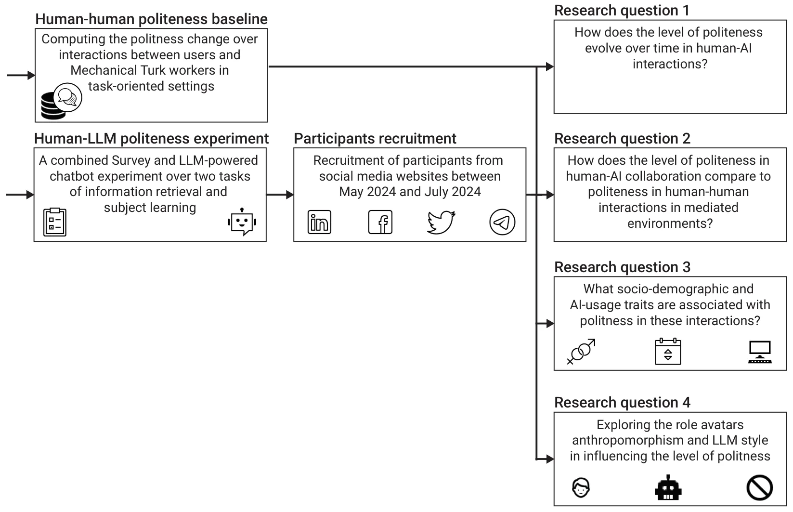
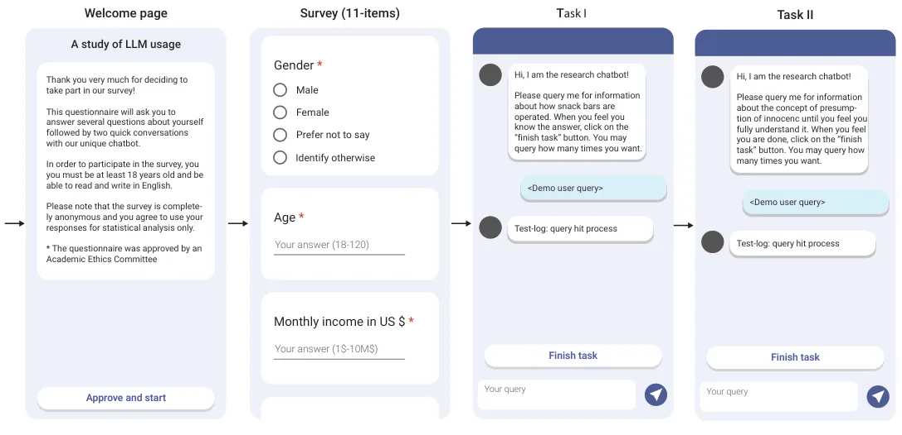
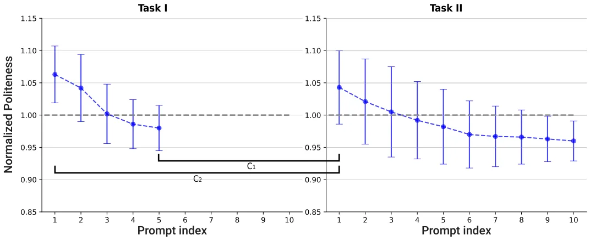
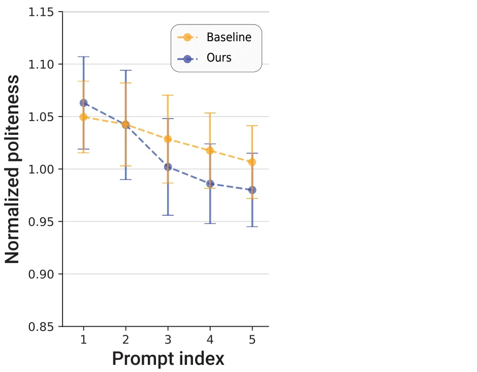
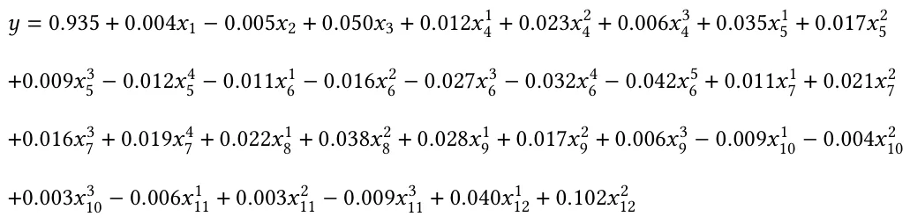

## 1 Introduction

As AI systems become increasingly integrated into collaborative work environments, a critical question arises: How do humans treat the conversational AI they interact with? While these AI entities lack emotions and do not react to politeness in the way humans do, examining how users communicate with AI can reveal important insights into their perceptions of these technologies and the mediated environments they operate in. Furthermore, understanding these behaviors may also influence future interactions, not only with AI but also in their relationships with other humans in similar settings.

In future work contexts, AI systems are expected to play significant roles in mediating interactions, assisting in decision-making, and facilitating collaboration between humans and machines.

This work is licensed under a Creative Commons Attribution-NonCommercial 4.0 International License. © 2025 Copyright held by the owner/author(s). ACM 2573-0142/2025/11-ARTCSCW450 https://doi.org/10.1145/3757631 This raises fundamental questions about the norms and dynamics that will govern *“AI-human collaboration.”* While previous research has explored how AI systems are designed to mimic human communication, it remains unclear which social norms will persist or evolve when interacting with AI, especially as these systems become integral to everyday work tasks. This study specifically examines politeness, a key social norm, and how it shapes the nature of collaboration between humans and AI in computer-mediated work environments.

Current large language models (LLMs) are designed to simulate human-human communication patterns. Harper and Randall [31] argue that language plays a fundamental role in how users interpret and interact with technology, suggesting that the conversational design of these systems is intended to create a sense of agency or human-like intent [22, 31]. This is particularly relevant in collaborative environments, where communication norms, such as politeness, help shape interactions. As a result, users may apply familiar social norms to their interactions with AI, much as they would with human collaborators. However, it remains unclear which of these norms will be sustained or adapted in AI-mediated collaboration, particularly as AI systems take on more complex and pivotal roles in work environments.

This uncertainty drives our investigation into the role of politeness in human-AI interactions. Politeness is an inherently social construct used to maintain harmony, reduce misunderstandings, and navigate imbalanced power dynamics [65]. It plays a critical role in managing social relationships, establishing respect, and promoting cooperation in collaborative settings. In online communities and computer-mediated environments, politeness has been cited as a key behavior to encourage, such as by Reddit moderators who reward politeness in online interactions [40]. Additionally, newcomers to communities like Open Source Software projects exhibit politeness as they integrate into these spaces [5, 16]. On the other hand, computer-mediated environments are known to foster disinhibition and de-individuation, where reduced accountability can lead to impersonal or less polite exchanges [27]. This can result in unequal social dynamics that are sometimes exploited for disruptive behavior, such as trolling [57].

Therefore, it is unclear which norms, positive or negative, will emerge in human-AI collaboration. Further, politeness in human-AI interactions may reflect deeper psychological mechanisms, such as attributing agency, intelligence, or even sentience to AI systems [62]. Anthropomorphism, where users unconsciously assign human-like qualities to AI, may significantly influence how people engage with these systems over time. This research aims to explore whether users apply similar politeness norms to AI as they do in human-human interactions, providing insights into how AI is perceived as a collaborator in mediated environments.

We also study the user characteristics that are associated with politeness in human-AI collaboration. Identifying these factors can inform the design of AI systems to encourage more respectful and productive collaboration, particularly in professional or high-stakes environments. For example, task complexity, user familiarity with AI, or the perceived intelligence of the AI system may influence how polite users are during interactions [79]. Understanding these characteristics can help shape AI design that fosters productive collaborations while minimizing potential misunderstandings.

Finally, we explore how the dynamics of politeness might change if conversational AI systems adopt human-like forms. Recent AI implementations, such as Replika.AI1, have experimented with human-like avatars to create more meaningful interactions between AI and users. We are particularly interested in understanding how increasing anthropomorphism in AI design, specifically through the use of minimal visual cues, influences the level of politeness users exhibit. As conversational agents become more lifelike, it becomes increasingly important to examine how these design shifts influence collaboration norms and the social dynamics that shape politeness.

Our four primary research questions are:

- **RQ1**: How does the level of politeness evolve over time in human-AI interactions?
- **RQ2**: How does the level of politeness in human-AI collaboration compare to politeness in human-human interactions in mediated environments?
- **RQ3**: What user characteristics are associated with politeness in human-AI interactions?
- **RQ4**: What role does anthropomorphism play in influencing the level of politeness in human- AI interactions?

To address these questions, we conducted an online experiment with 1,684 participants, where users engaged with AI to collaborate on two different tasks. Participants were randomly assigned to conditions where anthropomorphism in the AI was either emphasized ,de-emphasized, or not referred at all. We then analyzed the level of politeness exhibited in these interactions and compared the findings to known politeness levels in similar human-human interactions using the MultiWOZ dataset [8].

The remainder of this paper is organized as follows: Section 2 provides a review of related work on politeness dynamics in both human-human and human-AI interactions. Section 3 details the methodology employed in our study, including the experiment design, participant details, and statistical analysis methods used. Section 4 presents the results of the study, and Section 5 discusses the implications of these findings and offers suggestions for future research directions.

## 2 Related Work

Politeness is a fundamental social construct in human interaction. We review here related theoretical theories and findings related to politeness in human interactions, interactions with AI, and known influencing factors.

### 2.1 Politeness in human communication

Politeness is a fundamental and multifaceted aspect of human communication, intricately woven into the fabric of social norms and cultural contexts across the globe [6, 56]. Its significance extends beyond mere etiquette; politeness serves as a vital tool for managing social relationships, mitigating potential conflicts, and conveying respect or deference in various conversational scenarios [7, 71].

To this end, Locher [47] offers an insightful perspective, arguing that politeness should not be perceived as a rigid set of linguistic rules. Instead, it involves a complex negotiation of social identities and power dynamics between interlocutors. This negotiation process is deeply contextual, shaped by factors such as the participants’ backgrounds, their relationships, and the situational context of the interaction. The expression of politeness becomes a reflection of broader societal structures, often indicating the relative status and power of the individuals engaged in the communication [52, 77].

This perspective highlights the inherent social stratification embedded within communication practices, suggesting that the act of being polite is not just about language but also about an individual’s perceived social standing. For instance, in hierarchical cultures, the use of honorifics or formal language may be more prevalent, signifying respect and acknowledgment of status differences [42]. Thus, between humans, higher levels of politeness are correlated with larger social distance, perceived power relationships, and increased imposition of information on the listener [6, 62].

Interestingly, politeness level can change during an interaction. Vinagre et al. [76] found that individuals who do not know each other in advance tend to exhibit relatively high levels of politeness in their interactions. This phenomenon can be attributed to the “social distance” between participants, which influences their communicative behavior [51]. As individuals become more familiar with one another, the level of politeness often diminishes, reflecting a shift in relational dynamics [75]. This adaptation is essential for fostering genuine connections while balancing the inherent risks of communication.

Thus, one of the goals of our research, is to explore whether human-AI interactions exhibit similar dynamics of decreased politeness during a conversation, and the underlying reasons.

### 2.2 Human-AI politeness

The question of politeness towards machines can be seen as embedded in the larger question of social interaction with machines [38]. Reeves and Nash [60] conceptualized the Computers Are Social Actors (CASA) paradigm, suggesting to evaluate whether social constructs in human communication exist when humans communicate with machines. Their theories suggest that social norms triggered by more instinctive processes, such as conversational politeness, are more likely to be elicited mindlessly than more structured and culturally specific behaviors. A follow-up study demonstrated that people unconsciously apply social rules to devices, displaying behaviors like politeness when interacting with machines [54]. This automatic extension of social norms has been shown to occur particularly in interactions where machines exhibit human-like characteristics.

In the context of conversational agents, several researchers found a similar unconscious polite behavior. In a small-scale study, participants used mindless politeness when interacting with Alexa, i.e., saying ‘Thank you’, and ‘Please’ [48]. Diederich et al. [20] further showed using the CASA approach, that users unconsciously transfer human-to-human interaction rules, including politeness, to AI engagements. However, studies with young children did not yield similar results. A study examining a large set of videos of interactions between young children aged four to ten and a virtual agent found that they tended to command their voice assistant and talk rudely to it [10]. A possible explanation is that the use of ‘Please’ followed by a command, is negatively-correlated with politeness [18]. The research line echoed numerous reports from parents and educators about a cross context spillover effect, where children’s impolite behavior toward agents extended into their everyday social interactions [38, 62].

Similar concerns exist for human-robot interactions. Approaches that try to overcome impoliteness found that Human-robot interaction through wakeword-driven commands, like “Hey, Robot”, may inadvertently train users, especially children, to speak impolitely, and suggested that the use of polite wakewords like “Excuse me, Robot” could encourage more respectful communication [78].

Thus, it is unclear whether people are polite because they attribute agency to the AI. Shechtman and Horowitz [69] demonstrated that “users’ beliefs or mental models about an interface have a critical impact on how they experience them or behave with them”. Using a computer-mediated conversation, they found that when people believed they were talking to a human they exhibited behaviors associated with establishing a relationship, including politeness. When they believed they were talking to a computer, they were less likely to exhibit such behavior.

Unlike interactions with robots and conversational agents like Alexa, interactions with large language models are not command-centric. Generative AI serves a wide range of purposes, including emotional support and consulting [35]. As AI agents become more emotionally responsive and socially sophisticated, users increasingly attribute human-like qualities to these systems [11, 15]. For instance, ChatGPT’s polite communication style enabled effective interaction with people with aphasia [58]. Given the anthropomorphic behaviors of these systems [22, 31], it is important to understand whether people indeed perceive them as social actors. Here, we examine the construct of politeness in social interactions to gain an insight into the perception of LLMs as social actors.

### 2.3 User-Level Factors

The degree of politeness exhibited in a conversation may be influenced by a myriad of parameters related to both parties involved, such as socio-demographic characteristics, the context of the conversation, and the platform on which it is conducted. Throughout this paper, we refer to such variables collectively as user characteristics, a term that includes both stable individual differences (e.g., age, education) and experience-based factors (e.g., AI usage frequency).

User characteristics such as age, gender, and education level have been shown to influence conversational dynamics [1, 4, 49, 50]. Gender differences in perceived appropriate linguistic behavior during request-making have been observed, particularly in contexts varying in power and social distance. However, these differences do not necessarily conform to common stereotypes. For example, men are not consistently more aggressive than women [49]. A positive correlation has been found between higher education levels and increased politeness, with the relationship being stronger when accounting for gender; specifically, highly educated men tend to exhibit greater politeness than their female counterparts [1]. While no direct association has been found between a speaker’s own age and their level of politeness, larger age gaps between interlocutors are associated with more polite communication [50].

Studies exploring user-level parameters show that older users and those with less technical education tend to continue using polite language for more extended periods compared to other demographics [62]. It has been suggested that this behavior might stem from a stronger adherence to traditional social norms or a lack of familiarity with AI technologies, which leads to a more cautious approach in their interactions. Similarly, the existing relationship between the communicators, which can range from acquaintances to close friends [23], and the situational context of the exchange, including the setting and the nature of the interaction, were demonstrated to affect politeness [3, 34]. It was further demonstrated that the influence of these factors depends on the context of the interaction. For example, a study on English politeness strategies used by Chinese students in SMS interactions with their professors found no gender differences between male and female students, contradicting previous findings that suggested that females tend to employ more advanced politeness strategies, especially in computer-mediated platforms [24]. The asymmetric power relations and social distance between students and professors outweighed both the gender differences and the known tendency to simplify language when using online messaging platforms [3].

These findings underscore the need for a deeper investigation into how politeness in AI interactions evolves, and what factors drive this behavior across different contexts and user demographics.

To further understand influencing factors, we also investigate the effect of visual anthropomorphism. Anthropomorphism refers to the psychological process by which humans attribute human-like characteristics, emotions, or intentions to non-human agents [21]. Epley, Waytz, and Cacioppo [21] proposed a framework outlining three key motivations for anthropomorphism: (1) a tendency to rely on familiar human-based knowledge when interpreting ambiguous behavior (elicited agent knowledge), (2) a desire for control and predictability (effectance motivation), and (3) a need for social connection (sociality motivation). Visual anthropomorphism specifically deals with attributing human-like traits to objects or agents based on visual design elements such as faces, body shapes, or expressive features. These visual cues including avatars, emojis, facial features, or even the use of profile pictures, can trigger perceptions of humanness and evoke social responses in users. Visual anthropomorphic design in chatbots or conversational agents often leads users to engage with them more naturally [26].

It was found that anthropomorphic cues enhance the social effect, often prolonging polite behavior in AI interactions [29]. These cues enhance the perception of AI as a social actor rather than a mere tool, reinforcing the tendency to treat AI with human-like social behaviors [79]. As current AI tools exhibit human-like behaviors [31], the question arises whether people would create a human mental model for the AI with a visual anthropomorphic cue, even if limited [69], and thus engage in social behaviors with it. While previous studies have examined how users respond to anthropomorphic interfaces in general, few have explored how minimal visual cues alone influence politeness in human-AI collaboration, particularly across different task contexts. In here, we explore the politeness construct of social engagement with AI, and AI with a limited visual anthropomorphic cue.

## 3 Study

### 3.1 Method

<figure id="fig-1">

<figcaption>Fig. 1. A schematic view of the study’s design.</figcaption>
</figure>

Fig. 1 shows a schematic view of our study’s design. The study consists of two parts. The first creates a Human-human in computer-mediated environment politeness baseline, computed over the popular MultiWOZ dataset [8], as detailed in Section 3.2. The second is an experiment to study human-AI politeness levels, as detailed in Section 3.3.

### 3.2 Human-human politeness baseline

In order to evaluate the change in the level of politeness over interactions in the human-AI, we first established a baseline for the change in the level of politeness in human-human interactions online.

*3.2.1 The MultiWOZ Dataset.* The Multi-Domain Wizard-of-Oz dataset (MultiWOZ) is a popular fully-labeled collection of human-human chat-based conversations spanning over multiple domains and topics [8]. This dataset is collected through an experiment where human participants are asked to interact with workers who are acting as support representatives and were recruited by the Mechanical Turk website [9]. Participants engage in natural dialogues across multiple domains, such as booking hotels or restaurants, while the wizard generates realistic system responses. The collected conversations are then annotated with user intents, dialogue states, and other relevant details. This process captures multi-domain interactions, including task-switching and spontaneous conversation, providing a rich dataset for training dialogue systems.

The dataset contains around ten thousand dialogues between users and workers, including the users’ inputs, workers’ responses, and domain tagging. For our needs, to best mimic the human-AI interactions, we consider only dialogues that are tagged as “commands” from the users, and contain requests for information or help.

*3.2.2 Politeness experiment with the MultiWOZ Dataset.* To obtain the politeness level of users’ texts, we used the ConvoKit model [12], a popular toolkit that contains tools to extract conversational features and analyze social phenomena in conversations, which was validated and utilized for this task before [79]. Simply put, the ConvoKit model uses a set of lexical and parse-based features correlating with politeness and impoliteness to estimate the level of politeness in a given text [80]. We computed the change in the level of politeness throughout the interaction by calculating the average and standard deviation across the interaction, relative to the prompt’s (i.e., user input) position from the beginning of the interaction.

### 3.3 Human-LLM politeness experiment design

For our analysis, we developed a dedicated website with both an online survey and an LLM-powered conversational AI.

<figure id="fig-2">

<figcaption>Fig. 2. The system’s screens and the user flow between them.</figcaption>
</figure>

Fig. 2 depicts the system’s screens and the user flow between them. Participants transitioned between the screens described in Fig. 2 as follows.

- (1) Upon entering the experiment’s link, participants were requested to provide formal consent in a “welcome” page which also provides information about the experiment (see the first screen from the left in Fig. 2). The first page explained that their information would be kept anonymous and secured.
- (2) In the second screen, the participants answered the 11-item demographics questionnaire. (3) Screens 3 (Task I) and 4 (Task II): In the following screens, the participants were requested to address two conversational AI tasks. The reason we chose to include more than one task is twofold: it allowed us to examine what happens during a second interaction with the LLM, and it provided a more accurate comparison to the MultiWoZ dataset, where dialogues consist of multiple tasks.

#### 3.3.1 Website Experiment Design

*Socio-demographic survey.* We developed an 11-item closed-form questionnaire consisting of two parts (see the second screen from the left in Fig. 2): socio-demographic questions (8 items) and conversational AI tool usage questions (3 items). The socio-demographic questions were designed to capture a wide range of participant characteristics that could influence their interaction with conversational AI tools from previous studies [2, 33, 44, 45, 53, 66]. The conversational AI tool usage questions aim to gather information on the participants’ familiarity, frequency, and purpose of AI tool usage, providing context for their interactions [81]. The questionnaire’s page mimics the popular Google Form style to allow increased familiarity and convenience for users [67], and collects the following information: Gender, age, education, academic discipline of highest completed degree, monthly income, marital status, language proficiency, frequency use if AI tools, and primary reason for using AI (e.g., work, education).

*Chatbot tasks.* The conversational AI interface (see the third and fourth screens from the left in Fig. 2) mimics the common design of online chatbots and is powered by a large language model (LLM) through an API (Application Programming Interface). On this page, participants are asked to perform two tasks that were selected for two main reasons: their relevance to typical LLM use cases allowed us to examine what happens during a second interaction with the LLM, and their alignment with the structure of the MultiWOZ dataset, which features multi-task dialogues. The tasks, Task I and Task II, were chosen similarly to [79], which are information retrieval (Task I) and subject learning (Task II). In Task I, participants query the AI about how snack bars operate. Task II involves discussing and understanding the concept of presumption of innocence.

For the chatbot phase of the experiment, participants were randomly and uniformly assigned to one of nine conditions to explore the role of anthropomorphism in influencing politeness during human-AI interactions. These conditions were defined by two factors: the user interface (three options) and the conversational AI model (three options). For the user interface, participants were placed in one of three user interface conditions, each featuring a different icon next to the AI’s messages in the chat window: no icon, a robot icon, or an image of a person. To avoid using images of real individuals, the DCFace model [36], which generates realistic artificial faces, was used, and each participant in the “image of a person” condition received a unique face. These different models were selected due to their variation in linguistic style [63], reasoning ability [43], and proficiency [41]. For robustness, we also alternated the AI model. For the conversational AI model, participants were assigned to one of three systems: GPT-4o by OpenAI, Gemini 1.5 by Google, or Claude 3.5 Sonnet by Anthropic [70].

Importantly, all responses were kept confidential and anonymous, as clearly communicated to participants at the start of the questionnaire (Left screen of Fig. 2).

*3.3.2 Participants recruitment.* Data was collected between May 2024 and July 2024. During this period, social media posts were used to invite participants who could read and write in English and had prior experience with conversational AI tools. Participation was voluntary, with no monetary compensation offered; instead, participants were informed that they would receive the study’s results once available. To track the social media platform through which participants learned about the experiment, each platform was assigned a unique uniform resource locator (URL). All participants provided informed consent and confirmed that they were at least 18 years old. This voluntary participation model aligns with similar online studies, such as those conducted by “Lab in the Wild” [61].

*Data cleaning.* We included only participants who completed the full experiment. Of the 7,322 unique visitors (based on IP addresses) who accessed the welcome page, 1,907 began the survey, and 1,684 completed all tasks. This corresponds to a completion rate of 88.3% among survey starters, which is consistent with prior online behavioral studies [46]. While this filtering criterion introduces potential survivorship bias [37], it ensures consistent data quality for addressing our research questions. To assess the validity of participant responses, we manually examined response times and text lengths to flag suspicious behavior. Specifically, we looked for excessively fast completions (indicative of bot activity [39]) and unusually long responses (potentially linked to LLM-based input [59]), but no responses met exclusion criteria based on these checks. Thus, no further data cleaning was required beyond removing incomplete responses. While our sample may not fully represent the general online population, these procedures enhance the reliability of our dataset for analyzing human decision-making in digital environments [19, 28, 32].

*3.3.3 Analysis.* All statistical analyses were conducted using Python (version 3.9.2) [72]. Unless specified otherwise, significance is determined at *𝑝 <* 0*.*05. Since each research question required a different statistical approach, we describe the corresponding analyses separately for each one below.

*Research question 1 analysis - Politeness change over interactions.* Here, we aim to compute each participant’s change in politeness throughout their interaction with our interface across two tasks. We define each interaction as the sequence of prompts used by the participant to complete each of the tasks, ordered sequentially. To assess changes in politeness, we tracked shifts in politeness scores across these prompts. We used the ConvoKit model (as also applied for the human-human baseline in Section 3.2.2) to analyze the distribution of politeness throughout participants’ interactions. Specifically, we calculated the distribution of politeness scores relative to each prompt’s position (i.e., index) within the interaction.

To compare politeness levels across tasks, we applied the Wilcoxon Signed-Rank test [64]. We selected this non-parametric test because politeness is measured in a continuous manner and our data did not meet the assumption of normality, as confirmed by a Shapiro–Wilk test (Task I: *𝑊* = 0*.*82*, 𝑝* = 0*.*029 *<* 0*.*05; Task II: *𝑊* = 0*.*74*, 𝑝* = 0*.*036 *<* 0*.*05, Delta between tasks: *𝑊* = 0*.*47*, 𝑝* = 0*.*011 *<* 0*.*05) [30] and critically, these comparisons involve paired or dependent samples. The Wilcoxon Signed-Rank test is appropriate for assessing differences between two related samples, making it well-suited for our analysis of politeness differences across tasks. Notably, in order to establish a difference between the groups, we used a two-tailed test in the statistical analysis.

To investigate potential cross-task spillover effects, we additionally compared politeness shifts between the end of Task I and the beginning of Task II, as well as between the first prompt of each task. These comparisons were also conducted using the Wilcoxon Signed-Rank test, for the same reasons outlined above. Importantly, in order to account for the multiple comparisons performed within this research question (four Wilcoxon Signed-Rank tests), we applied a Bonferroni correction [68] to the resulting p-values, adjusting the significance level accordingly. In practice, this adjusted the family-wise error rate by setting the new significance threshold to *𝛼* = 0*.*0125 (= 0*.*05/4).

*Research question 2 analysis - Comparison of human-AI and human-human conversations’ politeness levels.* To compare politeness levels between human–human and human–AI conversations, we treated Task I (human–AI interaction) as a single continuous interaction per participant. Each participant’s average politeness score was divided by the average politeness score of the population to enable comparison on a common scale. Similarly, politeness scores from the human–human conversations were normalized relative to the cohort average to establish a fair baseline. To assess differences in politeness between conditions, we used the Wilcoxon rank-sum test [55], a non-parametric test suitable for two populations with non-normally distributed data, which is our case as at least the average politeness level of our cohort is not non-normally distributed according to a Shapiro–Wilk test (*𝑊* = 0*.*74*, 𝑝* = 0*.*045 *<* 0*.*05).

*Research questions 3 and 4 analysis- the influence of user characteristics and visual anthropomorphism on politeness.* To understand the role of user-level factors on politeness, we fit a linear regression model that included socio-demographic factors, AI usage variables (outlined in Table 1), and the user interface conditions. Due to the categorical (and ordinal) nature of the features, we use dummy factors [73] for all the factors except for the “age” and “monthly income” factors, which are treated as continuous factors. This model enabled us to assess the influence of demographic and usage-related characteristics on politeness, as well as to determine whether the interface condition remained a statistically significant predictor after accounting for these individual differences.

To examine the isolated influence of the level of anthropomorphism, represented by the icon accompanying the LLM’s responses, on participants’ politeness, we divided users into three experimental groups, as detailed in Section 3.3.1. We analyzed differences in politeness across these user interface conditions using a one-way ANOVA [25], after assuring the data is normally distributed using a Shapiro–Wilk test (*𝑊* = 0*.*86*, 𝑝* = 0*.*416 *>* 0*.*05). This analysis was conducted by pooling data across the different LLM engines employed, effectively assessing whether interface design alone affected politeness levels, regardless of the specific AI model.

## 4 Results

In this section, we present the results of our analysis. We start by reporting the descriptive statistics of our sample and follow with the analysis of the four research questions.

*Descriptive Statistics .* In total, 1684 participants who completed both tasks I and II and the demographic questionnaire were included in the study, providing the requested demographics and contextual details. Table 1 summarizes the socio-demographics details and AI usage characteristics of the participants. The obtained cohort shows a diverse cohort of participants with balanced gender representation (41.75% female and 54.16% male), a wide range of ages (ranging from 18 to 67 and with a mean and standard deviation of 32*.*6 ± 12*.*1), and various levels of educations and professions. Almost half of the participants came from Facebook (48.56%), followed by Telegram (26.07%), Twitter (15.32%), and LinkedIn (10.15%). The vast majority had post-secondary education, and over 50% reported daily use of AI tools.

### 4.1 RQ1 - Human-AI change in politeness during interactions

We start by computing the level of politeness with respect to the prompt index of each user’s interactions with conversational AI. On average, participants submitted 2.2 prompts in Task I (SD = 0.4) and 7.6 prompts in Task II (SD = 3.1). The results of this analysis are presented in Fig. 3 such that the mean ± standard deviation of the level of politeness across the population is shown. Notably, in each of the interactions (Task I and II), there is a monotonic decline in the average level of politeness.

To quantify the rate of change in politeness within each task, we fitted a linear regression with prompt index as the predictor. The slopes show average declines of 0.019 in Task I and 0.012 in Task II, indicating a slower drop in the more complex task. Residuals met the normality assumption (Shapiro–Wilk W = 0.97, p = 0.18 > 0.05). A pooled model with a Task × prompt-index interaction confirmed that the decline was steeper in Task I (interaction p < .01).

<figure class="table-figure" id="table-1">
<figcaption>Table 1. Demographic and AI-usage data of the participants</figcaption>

<table><tr><th>Variable</th><th>Value</th><th>Count (%)</th></tr><tr><td></td><td>Facebook</td><td>816 (48.56%)</td></tr><tr><td>Social Media Source</td><td>LinkedIn</td><td>171 (10.15%)</td></tr><tr><td></td><td>Twitter</td><td>258 (15.32%)</td></tr><tr><td></td><td>Telegram</td><td>439 (26.07%)</td></tr><tr><td></td><td>Female</td><td>703 (41.75%)</td></tr><tr><td>Gender</td><td>Male</td><td>912 (54.16%)</td></tr><tr><td></td><td>Identify otherwise / Prefer not to disclose</td><td>69 (4.09%)</td></tr><tr><td>Age (Years)</td><td>Range Average ± SD</td><td>18–67 32.6 ± 12.1</td></tr><tr><td></td><td>Range</td><td>350–32,000</td></tr><tr><td>Monthly Income (USD)</td><td>Average ± SD</td><td>2428.4 ± 3783.1</td></tr><tr><td></td><td>Married</td><td>773 (45.90%)</td></tr><tr><td></td><td>Single</td><td>613 (36.40%)</td></tr><tr><td>Marital Status</td><td>Divorced</td><td>196 (11.64%)</td></tr><tr><td></td><td>Widowed</td><td>17 (1.00%)</td></tr><tr><td></td><td>Prefer not to disclose</td><td>85 (5.04%)</td></tr><tr><td></td><td>High School</td><td>181 (10.75%)</td></tr><tr><td></td><td>Some College</td><td>435 (25.83%)</td></tr><tr><td></td><td>Bachelor’s Degree</td><td>691 (41.03%)</td></tr><tr><td>Education Level</td><td>Master’s Degree</td><td>276 (16.39%)</td></tr><tr><td></td><td>Doctoral Degree</td><td>83 (4.93%)</td></tr><tr><td></td><td>Prefer not to disclose</td><td>18 (1.07%)</td></tr><tr><td></td><td>Exact Sciences</td><td>370 (21.97%)</td></tr><tr><td></td><td>Social Sciences</td><td>588 (34.92%)</td></tr><tr><td>Discipline of Highest Education</td><td>Natural Sciences</td><td>347 (20.61%)</td></tr><tr><td></td><td>Engineering</td><td>306 (18.17%)</td></tr><tr><td></td><td>Medicine</td><td>73 (4.33%)</td></tr><tr><td></td><td>Monolingual (English)</td><td>771 (42.22%)</td></tr><tr><td>Language Proficiency</td><td>Bilingual</td><td>692 (41.09%)</td></tr><tr><td></td><td>Multilingual</td><td>221 (13.12%)</td></tr><tr><td></td><td>Daily</td><td>902 (53.56%)</td></tr><tr><td></td><td>Weekly</td><td>460 (27.32%)</td></tr><tr><td>Frequency of AI Tool Use</td><td>Monthly</td><td>105 (6.24%)</td></tr><tr><td></td><td>Rarely / Never</td><td>207 (12.29%)</td></tr><tr><td></td><td>Daily</td><td>856 (50.83%)</td></tr><tr><td>Frequency of</td><td>Weekly</td><td>429 (25.48%)</td></tr><tr><td>Conversational AI Tool Use</td><td>Monthly</td><td>90 (5.34%)</td></tr><tr><td></td><td>Rarely / Never</td><td>309 (18.35%)</td></tr><tr><td></td><td>Work</td><td>1135 (67.40%)</td></tr><tr><td></td><td>Education</td><td>327 (19.41%)</td></tr><tr><td>Primary Reason for AI Tool Use</td><td>Entertainment</td><td>115 (6.83%)</td></tr><tr><td></td><td>Personal Assistant</td><td>107 (6.35%)</td></tr></table>

</figure>

<figure id="fig-3">

<figcaption>Fig. 3. The connection between the prompt index and the normalized politeness level across tasks. The results are shown as the mean ± standard deviation across the population.</figcaption>
</figure>

The overall relative decline in politeness between the first and last prompt is 8.4 % for Task I and 9.6 % for Task II. Two-tailed Wilcoxon signed-rank tests show both declines are statistically significant under the Bonferroni correction (*𝛼* = 0.0125): Task I, p = 0.0019 < 0.0125; Task II, p = 0.0001 < 0.0125.

We compare the level of politeness at the beginning of task II to the end of task I, as indicated by *𝐶*1 in Fig. 3. We found that the level of politeness at the beginning of task II was statistically higher compared to the end of task I with *𝑝* = 0*.*0016 *<* 0*.*0125 using the two-tailed Wilcoxon Signed-Rank test, which indicates a restoration in the level of politeness between interactions. We repeated the same analysis for the beginning of Tasks I and II, as indicated by *𝐶*2 in the figure, and found that politeness at the start of Task II was significantly lower than at the start of Task I (*𝑝* = 0*.*0106 *<* 0*.*0125). This suggests a cross-task spillover effect, where user behavior in Task I influences their initial politeness in Task II.

### 4.2 RQ2 - Comparing to human-human interactions

To address this question, we compare the average politeness across interactions in our first task in the experiment (human-AI) to a similar timeline in the baseline (human-human). Using the two-tailed Wilcoxon rank-sum test, we found that the human-AI interaction’s level of politeness was statistically significantly lower compared to the human-human interactions (*𝑝* = 0*.*047 *<* 0*.*05). In addition, the initial politeness level (i.e., the level of politeness at the first prompt) was statistically similar (*𝑝* = 0*.*258 *>* 0*.*05) between human-AI and human-human with median values of 1.047 and 1.041, respectively. Fig. 4 depicts the results. Both types show a monotonic decline, with the decline in human-human interactions being slower and having a smaller standard deviation, indicating more consistent behavior across participants.

### 4.3 RQ3 + RQ4 - The influence of user characteristics and visual anthropomorphism on politeness

To address the third and fourth research questions, we fitted a linear regression model including the following predictors: Age (Years) (*𝑥*1), Monthly Income (USD) (*𝑥*2), Gender (Male) (*𝑥*3), Social Media Source (with levels LinkedIn (*𝑥*1 4), Twitter (*𝑥*2 4), and Telegram (*𝑥*3 4) with Facebook), Marital Status (with levels Married (*𝑥*1 5), Single (*𝑥*2 5), Divorced (*𝑥*3 5), and Widowed (*𝑥*4 5) with "Prefer not to disclose"), Education Level (with levels High School (*𝑥*1 6), Some College (*𝑥*2 6), Bachelor’s Degree (*𝑥*3 6), Master’s Degree (*𝑥*4 6), and Doctoral Degree (*𝑥*5 6) with "Prefer not to disclose"), Discipline of Highest Education (with levels Exact Sciences (*𝑥*1 7), Social Sciences (*𝑥*2 7), Natural Sciences (*𝑥*3 7), and Engineering (*𝑥*4 7) with Medicine), Language Proficiency (with levels Bilingual (*𝑥*1 8) and Multilingual (*𝑥*2 8) with Monolingual (English)), Frequency of AI Tool Use (with levels Daily (*𝑥*1 9), Weekly (*𝑥*2 9), and Monthly (*𝑥*3 9) with "Rarely/Never"), Frequency of Conversational AI Tool Use (with levels Daily (*𝑥*1 10), Weekly (*𝑥*2 10), and Monthly (*𝑥*3 10) with "Rarely / Never"), Primary Reason for AI Tool Use (with levels Work (*𝑥*1 11), Education (*𝑥*2 11), and Entertainment (*𝑥*3 11) with Personal Assistant), and Visual Anthropomorphism (with levels robot icon (*𝑥*1 12) and human icon (*𝑥*2 12) with None).

<figure id="fig-4">

<figcaption>Fig. 4. A comparison between the human-human and human-AI level of politeness during and cross interactions. The results are shown as the mean ± standard deviation across the population.</figcaption>
</figure>

Before interpreting the regression coefficients, we assessed the multicollinearity among the predictor variables by calculating the Variance Inflation Factor (VIF). The VIF values for all predictors were below 5 (range: 1.05 - 2.30), indicating that multicollinearity was not a significant concern in this model. In addition, to maintain model interpretability and avoid overfitting, we did not include interactions.

The regression model was statistically significant overall (*𝑅*2 = 0*.*48*, 𝐹* (32*,* 1651) = 47*.*62*, 𝑝 <* 0*.*001). As shown in Table 2, the following variables significantly predicted average politeness level: Age (*𝑝 <* 0*.*001∗∗∗), Gender (Male) (*𝑝* = 0*.*002∗∗), Married marital status (*𝑝* = 0*.*007∗∗), Daily frequency of AI tool use (*𝑝* = 0*.*002∗∗), and the human icon for visual anthropomorphism (*𝑝* = 0*.*023∗). Descriptively, frequent-AI users showed lower politeness, but when demographic covariates were held constant, daily AI use was associated with slightly higher politeness, indicating a suppression effect. In contrast, Monthly Income, Social Media Source (all levels), Marital Status (Single, Divorced, Widowed), all Education Levels, all Disciplines of Highest Education, both Language Proficiencies (Bilingual, Multilingual), Frequency of AI Tool Use (Weekly, Monthly), all Frequencies of Conversational AI Tool Use, all Primary Reasons for AI Tool Use, and the robot icon for Visual Anthropomorphism were not statistically significant predictors (*𝑝 >* 0*.*05).

These results highlight the importance of both socio-demographic factors and interface design in shaping polite behavior in human-AI interactions. In particular, the presence of a human-like face in the user interface consistently increased politeness levels, even when controlling for other participant-level variables.

<figure class="table-figure" id="table-2">
<figcaption>Table 2. Regression coefficients predicting average level of politeness — <em>𝑝 &lt;</em> 0<em>.</em>05 denoted by ∗, <em>𝑝 &lt;</em> 0<em>.</em>01 by ∗∗, <em>𝑝 &lt;</em> 0<em>.</em>001 by ∗∗∗.</figcaption>

<table><tr><th>Factor</th><th>Coefficients (B)</th><th>Std. Error</th><th>t- statistic</th><th>Sig.</th><th>95% Lower</th><th>95% Up- per</th></tr><tr><td>Constant (𝑥0)</td><td>0.935</td><td>0.060</td><td>—</td><td>—</td><td>0.867</td><td>1.103</td></tr><tr><td>Age (Years) (𝑥1)</td><td>0.004</td><td>0.001</td><td>4.00</td><td>&lt;</td><td>0.002</td><td>0.006</td></tr><tr><td></td><td></td><td></td><td></td><td>0.001***</td><td></td><td></td></tr><tr><td>Monthly Income</td><td>-0.005</td><td>0.008</td><td>0.528</td><td>0.528</td><td>-0.021</td><td>0.011</td></tr><tr class="row-group"><td>(USD) (𝑥2)</td><td></td><td></td><td></td><td></td><td></td><td></td></tr><tr><td>Gender (Male) (𝑥3)</td><td>0.050</td><td>0.016</td><td>3.13</td><td>0.002**</td><td>0.019</td><td>0.082</td></tr><tr><td>Social Media Source</td><td>(Facebook) (𝑥4)</td><td></td><td></td><td></td><td></td><td></td></tr><tr><td>LinkedIn (𝑥1 4)</td><td>0.012</td><td>0.022</td><td>0.55</td><td>0.582</td><td>-0.031</td><td>0.055</td></tr><tr><td>Twitter (𝑥2 4)</td><td>0.023</td><td>0.019</td><td>1.21</td><td>0.226</td><td>-0.014</td><td>0.061</td></tr><tr><td>Telegram (𝑥3 4)</td><td>0.006</td><td>0.018</td><td>0.33</td><td>0.741</td><td>-0.030</td><td>0.042</td></tr><tr><td>Marital Status (Prefer</td><td>not to disclose)</td><td>(𝑥5)</td><td></td><td></td><td></td><td></td></tr><tr><td>Married (𝑥1 5)</td><td>0.035</td><td>0.013</td><td>2.69</td><td>0.007**</td><td>0.009</td><td>0.061</td></tr><tr><td>Single (𝑥2 5)</td><td>0.017</td><td>0.012</td><td>1.42</td><td>0.156</td><td>-0.007</td><td>0.041</td></tr><tr><td>Divorced (𝑥3 5)</td><td>0.009</td><td>0.017</td><td>0.53</td><td>0.596</td><td>-0.025</td><td>0.043</td></tr><tr><td>Widowed (𝑥4 5)</td><td>-0.012</td><td>0.032</td><td>-0.38</td><td>0.704</td><td>-0.076</td><td>0.052</td></tr><tr><td>Education Level (Prefer</td><td>not to disclose)</td><td>(𝑥6)</td><td></td><td></td><td></td><td></td></tr><tr><td>High School (𝑥1 6)</td><td>-0.011</td><td>0.027</td><td>-0.41</td><td>0.682</td><td>-0.065</td><td>0.043</td></tr><tr><td></td><td></td><td></td><td></td><td></td><td>Continued on</td><td>next page</td></tr></table>

</figure>

<figure class="table-figure" id="table-x3">

<table><tr><th>Factor</th><th>Coefficients Std. Error (B)</th><th>t- statistic</th><th>Sig.</th><th>95% Lower</th><th>95% Up- per</th></tr><tr><td>Some College (𝑥2 6)</td><td>-0.016 0.019</td><td>-0.84</td><td>0.401</td><td>-0.053</td><td>0.021</td></tr><tr><td>Bachelor’s Degree</td><td>-0.027 0.017</td><td>-1.59</td><td>0.112</td><td>-0.060</td><td>0.006</td></tr><tr class="row-group"><td>(𝑥3 6)</td><td></td><td></td><td></td><td></td><td></td></tr><tr><td>Master’s Degree</td><td>-0.032 0.020</td><td>-1.60</td><td>0.119</td><td>-0.071</td><td>0.007</td></tr><tr class="row-group"><td>(𝑥4 6)</td><td></td><td></td><td></td><td></td><td></td></tr><tr><td>Doctoral Degree</td><td>-0.042 0.030</td><td>-1.40</td><td>0.162</td><td>-0.101</td><td>0.017</td></tr><tr><td>(𝑥5 6) Discipline of Highest</td><td>Education (Medicine) (𝑥7)</td><td></td><td></td><td></td><td></td></tr><tr><td>Exact Sciences (𝑥1 7)</td><td>0.011 0.021</td><td>0.52</td><td>0.603</td><td>-0.030</td><td>0.052</td></tr><tr><td>Social Sciences (𝑥2 7)</td><td>0.021 0.019</td><td>1.11</td><td>0.267</td><td>-0.016</td><td>0.058</td></tr><tr><td>Natural Sciences</td><td>0.016 0.020</td><td>0.80</td><td>0.424</td><td>-0.023</td><td>0.055</td></tr><tr class="row-group"><td>(𝑥3 7)</td><td></td><td></td><td></td><td></td><td></td></tr><tr><td>Engineering (𝑥4 7)</td><td>0.019 0.019</td><td>1.00</td><td>0.317</td><td>-0.018</td><td>0.056</td></tr><tr><td>Language Proficiency</td><td>(Monolingual (English))</td><td>(𝑥8)</td><td></td><td></td><td></td></tr><tr><td>Bilingual (𝑥1 8)</td><td>0.022 0.016</td><td>1.38</td><td>0.168</td><td>-0.009</td><td>0.053</td></tr><tr><td>Multilingual (𝑥2 8)</td><td>0.038 0.020</td><td>1.90</td><td>0.057</td><td>-0.001</td><td>0.077</td></tr><tr><td>Frequency of AI Tool</td><td>Use (Rarely / Never) (𝑥9)</td><td></td><td></td><td></td><td></td></tr><tr><td>Daily (𝑥1 9)</td><td>0.028 0.009</td><td>3.11</td><td>0.002**</td><td>0.010</td><td>0.046</td></tr><tr><td>Weekly (𝑥2 9)</td><td>0.017 0.010</td><td>1.70</td><td>0.089</td><td>-0.003</td><td>0.037</td></tr><tr><td>Monthly (𝑥3 9)</td><td>0.006 0.013</td><td>0.46</td><td>0.646</td><td>-0.020</td><td>0.032</td></tr><tr><td>Frequency of</td><td>Conversational AI Tool Use (Rarely</td><td>/ Never)</td><td>(𝑥10)</td><td></td><td></td></tr><tr><td>Daily (𝑥1 10)</td><td>-0.009 0.010</td><td>-0.90</td><td>0.368</td><td>-0.029</td><td>0.011</td></tr><tr><td>Weekly (𝑥2 10)</td><td>-0.004 0.011</td><td>-0.36</td><td>0.719</td><td>-0.026</td><td>0.018</td></tr><tr><td>Monthly (𝑥3 10)</td><td>0.003 0.016</td><td>0.19</td><td>0.849</td><td>-0.028</td><td>0.034</td></tr><tr><td>Primary Reason for</td><td>AI Tool Use (Personal</td><td>Assistant)</td><td>(𝑥11)</td><td></td><td></td></tr><tr><td>Work (𝑥1 11)</td><td>-0.006 0.008</td><td>-0.75</td><td>0.453</td><td>-0.022</td><td>0.010</td></tr><tr><td>Education (𝑥2 11)</td><td>0.003 0.011</td><td>0.27</td><td>0.787</td><td>-0.019</td><td>0.025</td></tr><tr><td>Entertainment</td><td>-0.009 0.013</td><td>-0.69</td><td>0.490</td><td>-0.035</td><td>0.017</td></tr><tr><td>(𝑥3 11) Visual Anthropomorphism</td><td>(None) (𝑥12)</td><td></td><td></td><td></td><td></td></tr><tr><td>robot icon (𝑥1 12)</td><td>0.040 0.062</td><td>0.65</td><td>0.515</td><td>-0.082</td><td>0.162</td></tr><tr><td>human icon (𝑥2 12)</td><td>0.102 0.045</td><td>2.27</td><td>0.023*</td><td>0.014</td><td>0.190</td></tr></table>

</figure>

In order to further evaluate the influence of anthropomorphism on politeness, we computed the effect of the user interface, which portrays an AI-generated human face, a limited visual cue, on conditions that included no icon or a robot icon. Table 3 summarizes the analysis of politeness levels across different conversational AI models and user interfaces. Importantly, to assess whether socio-demographic characteristics differed across the nine experimental groups (3 user interfaces over 3 conversational AI models), we conducted individual statistical tests for each demographic variable. For categorical variables (e.g., gender, marital status, education), we used Chi-square tests [74]. For continuous variables (e.g., age, monthly income), we used one-way ANOVA [13] or the Kruskal–Wallis test when normality was not met. These tests were selected to appropriately match the data types and ensure robust group comparisons. Normality of continuous variables was assessed using the Shapiro–Wilk test before applying parametric tests. None of the comparisons yielded statistically significant differences *𝑝 >* 0*.*05, indicating that the groups were demographically comparable. This suggests that the observed differences in politeness are unlikely to be due to socio-demographic imbalances. Across both tasks (I and II) and all conversational AI models, there were no statistically significant differences in politeness levels between the ’no icon’ and ’robot icon’ conditions. In contrast, the ’human face’ condition consistently exhibited significantly higher politeness levels compared to both the ’no icon’ and ’robot icon’ groups (*𝑝* = 0*.*023 *<* 0*.*05). This effect held regardless of the task or the underlying conversational AI model. These findings indicate that the presence of an AI-generated human face, as a visual anthropomorphic cue, elicits a significantly higher level of politeness in user responses.

<figure class="table-figure" id="table-3">
<figcaption>Table 3. The distribution of politeness level as mean ± standard deviation, normalized to the average politeness level on the message level, divided by the three user interfaces and conversational AI. ∗ indicates that the human case is statistically significant (<em>𝑝 &lt;</em> 0<em>.</em>05), in a pairwise manner.</figcaption>

<table><tr><th>User interface</th><th>Conversational AI</th><th>Participants</th><th>Politeness (task I)</th><th>Politeness (task II)</th></tr><tr><td></td><td>GPT 4o</td><td>181</td><td>0.91 ± 0.08</td><td>0.86 ± 0.10</td></tr><tr><td>No</td><td>Gemini 1.5</td><td>185</td><td>0.90 ± 0.07</td><td>0.87 ± 0.10</td></tr><tr><td></td><td>Claude 3.5 Sonnet</td><td>187</td><td>0.89 ± 0.09</td><td>0.86 ± 0.09</td></tr><tr><td></td><td>GPT 4o</td><td>196</td><td>0.89 ± 0.10</td><td>0.85 ± 0.11</td></tr><tr><td>Robot</td><td>Gemini 1.5</td><td>183</td><td>0.90 ± 0.09</td><td>0.84 ± 0.11</td></tr><tr><td></td><td>Claude 3.5 Sonnet</td><td>182</td><td>0.88 ± 0.13</td><td>0.86 ± 0.09</td></tr><tr><td></td><td>GPT 4o</td><td>183</td><td>1.14 ± 0.14∗</td><td>1.10 ± 0.10∗</td></tr><tr><td>Human</td><td>Gemini 1.5</td><td>188</td><td>1.12 ± 0.15∗</td><td>1.09 ± 0.11∗</td></tr><tr><td></td><td>Claude 3.5 Sonnet</td><td>199</td><td>1.13 ± 0.15∗</td><td>1.09 ± 0.13∗</td></tr></table>

</figure>

## 5 Discussion

### 5.1 Summary of Findings

The study found that politeness in human-AI interactions decreases progressively as the interaction proceeds. Initially, participants were polite toward AI, but this politeness eroded over time, especially as users became more focused on task completion. Early interactions often included polite formalities, but as the users became more accustomed to the AI, these formalities quickly diminished. This pattern may reflect a shift in users’ orientation, favoring task efficiency over adherence to social niceties, when interacting with conversational AI.

While our findings indicate an overall decline in politeness as interactions progress, this trend may also be influenced by the differing nature of the two tasks. Task I, a concrete, low-stakes scenario involving operating a snack shop, may encourage participants to quickly abandon formalities once the context becomes clear. In contrast, Task II, which involves reasoning about an abstract legal concept (the presumption of innocence), may elicit more sustained politeness, potentially due to increased cognitive demands or heightened perceived seriousness.

A linear regression analysis of politeness levels over prompt index supports this distinction: the average decline rate in Task I was 0.019, while in Task II it was significantly lower, 0.012, suggesting that the rate of politeness erosion is slower in the more complex task. We also found a small increase in politeness at the start of Task II relative to the end of Task I, consistent with a possible reset effect triggered by switching tasks. Yet politeness at the start of Task II was significantly lower than at the start of Task I after the Bonferroni correction (p = 0.0106), pointing to a modest cross-task spill-over.

These findings highlight that politeness dynamics are not solely a function of interaction length or growing familiarity with the AI, but may also be shaped by task characteristics, such as abstractness, cognitive load, and social framing.

Compared to human-human interactions in mediated environments, politeness in human-AI communication declined at a faster rate. While politeness was initially comparable in both conditions, users interacting with AI were quicker to prioritize task execution over maintaining polite behavior, whereas human-human interactions preserved politeness for a longer period. This highlights how users view AI differently from human collaborators, treating AI less as a social peer and more as a functional tool. However, due to the changes in the difficulty between the two tests, the differences in the decline patterns might be partly driven by this shift.

Politeness levels were also associated with individual characteristics. Older participants tended to maintain polite language longer, reflecting greater adherence to social norms in human–AI interactions. Younger users, by contrast, were quicker to abandon formalities. Descriptively, participants who frequently used AI tools were also less polite. However, after adjusting for age, gender, and other covariates, daily AI use was positively associated with politeness. This suppression effect suggests that while frequent AI users tend to be younger and thus less polite overall, their direct experience with AI may foster a different orientation: one that still retains a degree of formality, perhaps out of habit, strategy, or a learned sense of interactional appropriateness, even when no human is present.

Anthropomorphism significantly influenced the level of politeness in human-AI interactions. Participants interacting with the human-face avatar recorded a mean politeness score 0.102 points higher than those in the no-icon or robot-icon conditions (p = 0.023).

In summary, while task complexity likely plays a role in shaping user behavior, it does not appear to fully explain the changes in politeness we observed. Task II was longer and more cognitively demanding, yet the decline in politeness over time was marginally steeper in the simpler Task I (regression estimates were -0.019 for Task I, -0.012 for Task II). One possible explanation is that users shift their tone more quickly in straightforward tasks, focusing on efficiency over formality. In contrast, the more abstract nature of Task II might encourage users to maintain a more careful or formal tone, perhaps due to uncertainty or the nature of the topic. At the same time, the findings from RQ2 offer a different angle. When comparing human-AI and human-human interactions on similarly complex tasks, politeness declined more quickly in the human-AI condition. Together with the user-level factors found in RQ3 and RQ4, this may indicate that factors beyond task structure, such as the type of interaction partner, social norms, and user characteristics, also play a role in how users adjust their tone. Taken together, these patterns point to a range of influences that shape communication in human-AI settings, which may vary depending on context.

### 5.2 Theoretical Implications

The findings from this study extend existing literature on how social norms, including politeness, are transferred from human-human to human-AI interactions. Prior research, such as Lopatovska and Williams (2018) [48] and Diederich et al. (2022) [20], has shown that users often display “mindless politeness” when interacting with conversational agents. The present study builds on this by demonstrating that although users initially exhibit politeness toward AI systems, this politeness tends to decline over the course of the interaction, especially as the task becomes more focused and goal-oriented.

Our results also contribute to understanding the role of interface design in sustaining politeness. Consistent with Shechtman and Horowitz (2003) [69], we found that limited anthropomorphic cues, specifically, the presence of a human-like avatar, can help maintain higher levels of politeness throughout the interaction. This effect was robust across tasks and across different conversational AI systems, highlighting a reliable behavioral pattern. These results underscore the importance of interface design choices in shaping communication behavior during human-AI interactions, particularly in contexts where maintaining a respectful or civil tone may be important, such as education, healthcare, or professional collaboration.

The observed decline in politeness over time also raises design and ethical considerations. While users may begin interactions with socially normative behavior, they may increasingly deprioritize politeness as they discover that AI systems operate effectively without it. This behavioral adaptation could reflect a growing familiarity or confidence in the use of AI tools, in which efficiency is prioritized over social ritual. However, this trend may carry broader implications. As suggested by Kramer and Manzeschke (2021) [38], there is a possibility of contextual spillover effects, where diminished politeness in AI interactions could influence behavior in human-human contexts. Designing AI systems that support or reinforce polite interaction norms may therefore serve not only to improve user experience but also to help safeguard social norms more broadly.

### 5.3 Limitations

While the study offers useful insights, its focus on information retrieval and learning-based tasks may limit the generalizability of the findings. Other types of interaction, such as emotional support or advice seeking, can evoke different patterns of politeness.

The study was also limited to short-term interactions. It remains unclear how politeness might evolve in longer-term or repeated engagements with AI systems. Although the results suggest that anthropomorphic features can help sustain politeness in brief exchanges, these effects may not persist as users become more familiar with the system.

All participants completed the two tasks in the same sequence, which introduces the possibility of order effects or learning bias. This decision was made for two reasons. First, since participants were volunteers rather than compensated users, the shorter task was presented first to support retention across the full study. Second, the sequence reflects common real-world use, where users often begin with simpler information-seeking tasks before moving to more complex goals. Still, the fixed order may have influenced participant behavior.

In comparing human–AI and human–human interactions, it is important to note that the participant samples came from different groups and study contexts. While we used the Wilcoxon rank-sum test to account for independence and non-normal distribution, this comparison does not reflect a fully controlled between-subjects design. Differences in demographics or study framing may have influenced politeness levels.

Cultural factors also present a limitation. The study was conducted in a Western context, and politeness norms vary across cultures. What is considered polite, neutral, or overly direct may differ significantly across linguistic and social environments.

The anthropomorphic manipulation was limited to a specific type of visual cue. Although the use of a human face is a common and effective anthropomorphic strategy, it does not represent the full range of cues that could influence social perception. More subtle features such as names, emojis, or stylized avatars may also affect perceived humanness, and minimal cues may help avoid the uncanny valley effect [14, 17].

Finally, our regression accounts for 48% of the variance in politeness, leaving 52% unexplained. Unmeasured individual differences such as personality traits or momentary emotional states, are potential contributors to this residual variance and should be examined in future work.

### 5.4 Future Work

Future work could explore more systematically how task complexity interacts with perceived agency, formality, or goal orientation in shaping user tone. Varying complexity within controlled task structures, while keeping interaction length consistent, may help disentangle whether shifts in politeness are driven more by cognitive load, social framing, or other contextual cues. It would also be valuable to examine how these patterns evolve over longer interactions or across repeated sessions with the same AI system.

Longitudinal studies may help clarify whether anthropomorphic features sustain politeness over time or whether familiarity with the AI leads to a decline in formality. Comparing different types of tasks across multiple sessions could offer insight into how politeness adapts not only to content but also to familiarity and perceived relational roles.

Cross-cultural studies would further enhance our understanding of politeness in human-AI interaction. Exploring how cultural norms shape user expectations and tone could inform the development of culturally responsive AI systems.

Finally, future research could examine a broader range of anthropomorphic design cues beyond facial representation. Minimal cues such as human-like names, emojis, or symbolic avatars, may trigger perceptions of humanness while avoiding overcommitment to realism. This line of work may also help clarify the boundaries between social and functional framing in AI interaction.

## 6 Conclusion

This study examined how politeness evolves in human–AI interactions. We found that users initially exhibit polite behavior, but this politeness tends to decline over time, especially as interactions become more task-oriented. Compared to human–human communication, this decline occurs more rapidly in AI-mediated settings.

At the same time, politeness levels varied based on user characteristics. Older participants and those with less frequent AI use were generally more polite, while younger and more experienced users shifted toward more direct communication. Interface design also played a role: the presence of a human-like avatar led to more sustained politeness, suggesting that even minimal anthropomorphic cues can shape user behavior.

Together, these findings highlight how politeness in human–AI interactions is influenced by a combination of social norms, individual traits, and design elements. As conversational AI becomes more widespread, understanding how these dynamics evolve can support the development of systems that encourage respectful and effective communication.

## References

1. M. A. AlAfnan. 2022. Politeness as a nonverbal communication Behavior: An investigation into driving habits in Asia. Studies in Media and Communication 10, 1 (2022), 112–123.
2. Roi Alfassi, Angelora Cooper, Zoe Mitchell, Mary Calabro, Orit Shaer, and Osnat Mokryn. 2025. Fanfiction in the Age of AI: Community Perspectives on Creativity, Authenticity and Adoption. International Journal of Human–Computer Interaction (2025), 1–33.
3. Z. Amir, H. Abidin, S. Darus, and K. Ismail. 2012. Gender differences in the language use of Malaysian teen bloggers. GEMA Online Journal of Language Studies 12, 1 (2012), 105–124.
4. G. Axia and M. R. Baroni. 1985. Linguistic Politeness at Different Age Levels. Child Development (1985), 918–927.
5. S. Balali, I. Steinmacher, U. Annamalai, A. Sarma, and M. A. Gerosa. 2018. Newcomers’ barriers... is that all? an analysis of mentors’ and newcomers’ barriers in OSS projects. Computer Supported Cooperative Work (CSCW) 27 (2018), 679–714.
6. P. Brown and S. C. Levinson. 1987. Politeness: Some universals in language usage. Number 4. Cambridge university press.
7. P. Brown and S. C. Levinson. 1999. Politeness. In The Discourse Reader. Routledge.
8. P. Budzianowski, T-H. Wen, B-H. Tseng, I. Casanueva, S. Ultes, O. Ramadan, and M. Gasic. 2018. Multiwoz: A large-scale multi-domain wizard-of-oz dataset for task-oriented dialogue modelling. arXiv (2018).
9. M. Buhrmester, T. Kwang, and S. D. Gosling. 2011. Amazon’s Mechanical Turk: A New Source of Inexpensive, Yet High-Quality, Data? Perspectives on Psychological Science 6, 1 (2011), 3–5. [doi:10.1177/1745691610393980](https://doi.org/10.1177/1745691610393980)
10. D. Bylieva, Z. Bekirogullari, V. Lobatyuk, and T. Nam. 2020. How virtual personal assistants influence children’s communication. In International Conference on Professional Culture of the Specialist of the Future. Springer, 112–124.
11. A. Carolus, C. Wienrich, A. Törke, T. Friedel, C. Schwietering, and M. Sperzel. 2021. ‘Alexa, I Feel for You!’ Observers’ Empathetic Reactions Towards a Conversational Agent. Frontiers in Computer Science 3 (2021), 682982. [doi:10.3389/fcomp.2021.682982](https://doi.org/10.3389/fcomp.2021.682982)
12. J. P. Chang, C. Chiam, L. Fu, A. Z. Wang, J. Zhang, and C. Danescu-Niculescu-Mizil. 2020. ConvoKit: A Toolkit for the Analysis of Conversations. arXiv (2020).
13. Anna Chatzi and Owen Doody. 2024. The one-way ANOVA test explained. Nurse researcher 32, 4 (2024).
14. Jiahao Chen, Mingming Li, and Jaap Ham. 2024. Different dimensions of anthropomorphic design cues: How visual appearance and conversational style influence users’ information disclosure tendency towards chatbots. International Journal of Human-Computer Studies 190 (2024), 103320.
15. H. Chin, L. W. Molefi, and M. Y. Yi. 2020. Empathy is All You Need: How a Conversational Agent Should Respond to Verbal Abuse. In Proceedings of the 2020 CHI Conference on Human Factors in Computing Systems. 1–13.
16. J. Cho and R. Wash. 2021. How potential new members approach an online community. Computer Supported Cooperative Work (CSCW) 30 (2021), 35–77.
17. Leon Ciechanowski, Aleksandra Przegalinska, Mikolaj Magnuski, and Peter Gloor. 2019. In the shades of the uncanny valley: An experimental study of human–chatbot interaction. Future Generation Computer Systems 92 (2019), 539–548.
18. C. Danescu-Niculescu-Mizil, M. Sudhof, D. Jurafsky, J. Leskovec, and C. Potts. 2013. A computational approach to politeness with application to social factors. In Proceedings of the 51st Annual Meeting of the Association for Computational Linguistics (Volume 1: Long Papers). 250–259.
19. T. Dasu and J. M. Loh. 2012. Statistical distortion: Consequences of data cleaning. arXiv (2012).
20. S. Diederich, A. B. Brendel, S. Morana, and L. Kolbe. 2022. On the Design of and Interaction with Conversational Agents: An Organizing and Assessing Review of Human-Computer Interaction Research. Journal of the Association for Information Systems 23, 1 (2022), 96–138.
21. Nicholas Epley, Adam Waytz, and John T Cacioppo. 2007. On seeing human: a three-factor theory of anthropomorphism. Psychological review 114, 4 (2007), 864.
22. Z. Epstein, S. Levine, D. G. Rand, and I. Rahwan. 2020. Who gets credit for AI-generated art? Iscience 23, 9 (2020).
23. V. Escandell-Vidal. 1996. Towards a Cognitive Approach to Politeness. Language Sciences 18, 3-4 (1996), 629–650.
24. S. Eshghinejad and M. R. Moini. 2016. Politeness strategies used in text messaging: Pragmatic competence in an asymmetrical power relation of teacher–student. Sage Open 6, 1 (2016), 2158244016632288.
25. E. R. Girden. 1992. ANOVA: Repeated measures. Number 84. Sage.
26. Eun Go and S Shyam Sundar. 2019. Humanizing chatbots: The effects of visual, identity and conversational cues on humanness perceptions. Computers in human behavior 97 (2019), 304–316.
27. M. Griffiths. 1999. Violent video games and aggression: A review of the literature. Aggression and Violent Behavior 4, 2 (1999), 203–212.
28. S. Guha, F. A. Khan, J. Stoyanovich, and S. Schelter. 2024. Automated data cleaning can hurt fairness in machine learning-based decision making. IEEE Transactions on Knowledge and Data Engineering 36, 12 (2024), 7368–7379.
29. L. Hanschmann, U. Gnewuch, and A. Maedche. 2023. Saleshat: A LLM-Based Social Robot for Human-Like Sales Conversations. In International Workshop on Chatbot Research and Design. Springer Nature Switzerland, 61–76.
30. Z. Hanusz, J. Tarasinska, and W. Zielinski. 2016. Shapiro–Wilk test with known mean. REVSTAT-statistical Journal 14, 1 (2016), 89–100.
31. R. Harper and D. Randall. 2024. Machine Learning and the Work of the User. Computer Supported Cooperative Work (CSCW) (2024), 1–34.
32. Y.-C. Hsieh, C-Y. Chen, D-Y. Liao, K-C. Lin, and S-C. Chang. 2023. Data Cleansing with Minimum Distortion for ML-Based Equipment Anomaly Detection. IEEE Transactions on Semiconductor Manufacturing 36, 4 (2023), 506–514.
33. W-C. Huang, S-K. Wong, M. Volonte, and S. V. Babu. 2023. Impact of Socio-Demographic Attributes and Mutual Gaze of Virtual Humans on Users’ Visual Attention and Collision Avoidance in VR. IEEE Transactions on Visualization and Computer Graphics (2023), 1–17.
34. G. Kasper. 1990. Linguistic Politeness: Current Research Issues. Journal of Pragmatics 14, 2 (1990), 193–218.
35. M. J. Kian, M. Zong, K. Fischer, A. Singh, A-M. Velentza, P. Sang, S. Upadhyay, A. Gupta, M. A. Faruki, W. Browning, et al. 2024. Can an LLM-powered socially assistive robot effectively and safely deliver cognitive behavioral therapy? A study with university students. arXiv (2024).
36. M. Kim, F. Liu, A. Jain, and X. Liu. 2023. DCFace: Synthetic Face Generation With Dual Condition Diffusion Model. In Proceedings of the IEEE/CVF Conference on Computer Vision and Pattern Recognition (CVPR). 12715–12725.
37. R. Kohavi, R. Longbotham, D. Sommerfield, and R. M. Henne. 2009. Controlled experiments on the web: survey and practical guide. Data mining and knowledge discovery 18 (2009), 140–181.
38. N. Krämer and A. Manzeschke. 2021. Social reactions to socially interactive agents and their ethical implications. In The Handbook on Socially Interactive Agents: 20 years of Research on Embodied Conversational Agents, Intelligent Virtual Agents, and Social Robotics Volume 1: Methods, Behavior, Cognition. 77–104.
39. C. M. Lachaud and O. Renaud. 2011. A tutorial for analyzing human reaction times: How to filter data, manage missing values, and choose a statistical model. Applied Psycholinguistics 32, 2 (2011), 389–416.
40. C. Lambert, F. Choi, and E. Chandrasekharan. 2024. “Positive reinforcement helps breed positive behavior”: Moderator Perspectives on Encouraging Desirable Behavior. Proceedings of the ACM on Human-Computer Interaction CSCW (2024).
41. T. Lazebnik and A. Rosenfeld. 2024. Detecting LLM-assisted writing in scientific communication: Are we there yet? Journal of Data and Information Science (2024).
42. G. Leech and L. Tatiana. 2014. Politeness: West and east. Russian Journal of Linguistics 4 (2014), 9–34.
43. Z. Li, Y. Cao, X. Xu, J. Jiang, X. Liu, Y. S. Teo, S-W. Lin, and Y. Liu. 2024. LLMs for Relational Reasoning: How Far are We? arXiv (2024).
44. H.T. Liao, Z. Zhou, and Y. Zhou. 2021. A Systematic Review of Social Media for Intelligent Human-Computer Interaction Research: Why Smart Social Media is Not Enough. In Intelligent Human Computer Interaction, M. Singh, D.K. Kang, J.H. Lee, U.S. Tiwary, D. Singh, and W.Y. Chung (Eds.). Lecture Notes in Computer Science, Vol. 12615. Springer, Cham.
45. Y. M. Lim, A. Ayesh, and K. N. Chee. 2013. Socio-Demographic Differences in the Perceptions of Learning Management System (LMS) Design. International Journal of Software Engineering & Applications (IJSEA) 4, 5 (2013), 31–44.
46. M. Liu and L. Wronski. 2018. Examining completion rates in web surveys via over 25,000 real-world surveys. Social Science Computer Review 36, 1 (2018), 116–124.
47. M. A. Locher. 2006. Polite Behavior within Relational Work: The Discursive Approach to Politeness. Multilingua 25, 3 (2006), 249–267.
48. I. Lopatovska and H. Williams. 2018. Personification of the Amazon Alexa: BFF or a mindless companion. In Proceedings of the 2018 Conference on Human Information Interaction & Retrieval. 265–268.
49. N. Lorenzo-Dus and P. Bou-Franch. 2003. Gender and politeness: Spanish and British undergraduates’ perceptions of appropriate requests. Género, lenguaje y traducción (2003), 187–199.
50. M. Mahmud. 2013. The roles of social status, age, gender, familiarity, and situation in being polite for bugis society. Asian Social Science 9, 5 (2013), 58–72.
51. C. A. Miller, T. Ott, P. Wu, and V. Vakili. 2010. Politeness effects in directive compliance: Effects with power and social distance. In Proceedings of the Human Factors and Ergonomics Society Annual Meeting, Vol. 54. 487–491.
52. S. Mills and D. Z. Kádár. 2011. Politeness and Culture. In Politeness in East Asia. 21–44.
53. K. Nagygyörgy, R. Urbán, J. Farkas, M. D. Griffiths, D. Zilahy, G. Kökönyei, and Z. Demetrovics. 2013. Typology and Sociodemographic Characteristics of Massively Multiplayer Online Game Players. International Journal of Human–Computer Interaction 29, 3 (2013), 192–200.
54. C. Nass and Y. Moon. 2000. Machines and Mindlessness: Social Responses to Computers. Journal of Social Issues 56, 1 (2000), 81–103.
55. Sundar Natarajan, Stuart R Lipsitz, Garrett M Fitzmaurice, Debajyoti Sinha, Joseph G Ibrahim, Jennifer Haas, and Walid Gellad. 2012. An extension of the Wilcoxon rank sum test for complex sample survey data. Journal of the Royal Statistical Society Series C: Applied Statistics 61, 4 (2012), 653–664.
56. Y. Obana and T. Tomoda. 1994. The Sociological Significance of ‘Politeness’ in English and Japanese Languages—Report from a Pilot Study. Japanese Studies 14, 2 (1994), 37–49.
57. H. Paakki, H. Vepsäläinen, and A. Salovaara. 2021. Disruptive online communication: How asymmetric trolling-like response strategies steer conversation off the track. Computer Supported Cooperative Work (CSCW) 30, 3 (2021), 425–461.
58. A. K. Purohit, A. Upadhyaya, and A. Holzer. 2023. Chatgpt in healthcare: Exploring ai chatbot for spontaneous word retrieval in aphasia. In Companion Publication of the 2023 Conference on Computer Supported Cooperative Work and Social Computing. 1–5.
59. K. Radivojevic, N. Clark, and P. Brenner. 2024. Llms among us: Generative ai participating in digital discourse. In Proceedings of the AAAI Symposium Series, Vol. 3. 209–218.
60. B. Reeves and C. Nass. 1996. The media equation: How people treat computers, television, and new media like real people. Cambridge, UK 10, 10 (1996), 19–36.
61. K. Reinecke and K. Z. Gajos. 2015. LabintheWild: Conducting large-scale online experiments with uncompensated samples. In Proceedings of the 18th ACM Conference on Computer Supported Cooperative Work & Social Computing. ACM, 1364–1378.
62. P. Ribino. 2023. The role of politeness in human–machine interactions: a systematic literature review and future perspectives. Artificial Intelligence Review 56 (2023), 445–482.
63. A. Rosenfeld and T. Lazebnik. 2024. Whose LLM is it Anyway? Linguistic Comparison and LLM Attribution for GPT-3.5, GPT-4 and Bard. arXiv (2024).
64. B. Rosner, R. J. Glynn, and M-L. T. Lee. 2006. The Wilcoxon signed rank test for paired comparisons of clustered data. Biometrics 62, 1 (2006), 185–192.
65. M. Ryabova. 2015. Politeness strategy in everyday communication. Procedia-Social and Behavioral Sciences 206 (2015), 90–95.
66. E. Savchenko and T. Lazebnik. 2022. Computer aided functional style identification and correction in modern Russian texts. Journal of Data, Information and Management 4 (2022), 25–32.
67. E. Savchenko and A. Rosenfeld. 2024. Authorship conflicts in academia: an international cross-discipline survey. Scientometrics 129 (2024), 2101–2121.
68. Philip Sedgwick. 2012. Multiple significance tests: the Bonferroni correction. Bmj 344 (2012).
69. N. Shechtman and L. M. Horowitz. 2003. Media inequality in conversation: how people behave differently when interacting with computers and people. In Proceedings of the SIGCHI conference on Human factors in computing systems. 281–288.
70. Y. Sonoda, R. Kurokawa, Y. Nakamura, J. Kanzawa, M. Kurokawa, Y. Ohizumi, W. Gonoi, and O. Abe. 2024. Diagnostic performances of GPT-4o, Claude 3 Opus, and Gemini 1.5 Pro in “Diagnosis Please” cases. Japanese Journal of Radiology 42 (2024), 1–11.
71. H. Spencer-Oatey. 2008. Culturally speaking second edition: Culture, communication and politeness theory. Bloomsbury Publishing.
72. K. R. Srinath. 2017. Python – The Fastest Growing Programming Language. International Research Journal of Engineering and Technology 4, 12 (2017).
73. D. B. Suits. 1957. Use of dummy variables in regression equations. J. Amer. Statist. Assoc. 52, 280 (1957), 548–551.
74. Ronald J Tallarida, Rodney B Murray, Ronald J Tallarida, and Rodney B Murray. 1987. Chi-square test. Manual of pharmacologic calculations: with computer programs (1987), 140–142.
75. M. Terkourafi. 2011. From politeness1 to politeness2: Tracking norms of im/politeness across time and space. In Discursive Approaches to Politeness. 159–185.
76. M. Vinagre. 2008. Politeness Strategies in Collaborative E-Mail Exchanges. Computers & Education 50, 3 (April 2008), 1022–1036.
77. Y. Wang. 2021. The price of being polite: politeness, social status, and their joint impacts on community Q&A efficiency. Journal of Computational Social Science 4 (2021), 101–122.
78. T. Williams, D. Grollman, M. Han, R. B. Jackson, J. Lockshin, R. Wen, Z. Nahman, and Q. Zhu. 2020. “Excuse me, robot”: Impact of polite robot wakewords on human-robot politeness. In Social Robotics: 12th International Conference, ICSR 2020, Golden, CO, USA, November 14–18, 2020, Proceedings 12. Springer, 404–415.
79. Y. Yuan, M. Su, and X. Li. 2024. What Makes People Say Thanks to AI. In Artificial Intelligence in HCI, H. Degen and S. Ntoa (Eds.). Lecture Notes in Computer Science, Vol. 14734. Springer, Cham.
80. J. Zhang, J. P. Chang, C. Danescu-Niculescu-Mizil, L. Dixon, Y. Hua, N. Thain, and D. Taraborelli. 2018. Conversations Gone Awry: Detecting Early Signs of Conversational Failure. In Proceedings of ACL.
81. L. Zhou, Y. Farag, and A. Vlachos. 2024. An LLM Feature-based Framework for Dialogue Constructiveness Assessment. arXiv (2024). Received October 2024; revised April 2025; accepted August 2025
