## I. Introduction

In nature, a gentle biological and ecological balance is kept in a complex system of plants, animal species, and the environment.1–6 In the micro-level of a small spatial location, the ecological system’s dynamics is the sum of interactions between a number of animal (and plants) species with their environment and each other. Thus, one can divide these biological interactions into two: animal–environment and animal–animal interactions.7 The first type is mostly stable over time as changes in such interactions result from a long-term evolution process.8 As such, a good approximation of these dynamics can be associated with the environment’s ability to support its inhabitants.9 The latter type is much more complex with multiple ways and strategies animals apply to survive and produce offspring.10–12

This system is highly sensitive and even a small-size event can break this gentle balance and put the ecological system in a long-term course of re-stabilization.13,14 A large catastrophic event can result in fatal outcomes such as species extinction,15 partially ruined food chains,16–18 and large-scale economic damages for the human population supported by this ecosystem.19,20 In history, experts recorded many types and occasions of such events, ranging from large-scale fires to extreme weather changes.21–23 A dominant type of event that repeats itself over time and locations is pandemics.24–26 For example, the influenza virus, a member of the Orthomyxoviri-dae family, infect multiple species worldwide, including poultry, swine, humans, horses, seals, and other animals.27–29

Currently, our understanding of multi-species pandemic is limited due to the complexity of detecting it on time, gathering relevant data, and influencing its course.30–33 However, the study of interacting species has gained popularity in the last decades, constantly revealing new insights into the biological dynamics around us and providing a cornerstone for a broad spectrum of technological developments.34–37 Indeed, a particular interest is provided to the study of epidemiology to understand the spread of infectious diseases with the goal to determine pandemic intervention policies to possibly eradicate them.38–44 In a complementary manner, the research of prey–predator dynamics has been widely extended with models increasing in complexity and scope which are, presumably, capable of better representation of the dynamics found in nature.45,46 As such, mathematical models and computer simulations are shown to be powerful tools to understand the biological and ecological dynamics of pandemic spread.47–53

A large body of work aims to extend the simple Susceptible–Infectious–Recovered (SIR) model that takes the form54

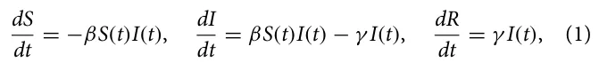

where *S*, *I*, and *R* are the groups of susceptible, infected, and recovered individuals, respectively, and the average infection rate and the average recovery rate are donated by β ∈ R+ and γ ∈ R+, respectively. The SIR model assumes the population is well-mixed (i.e., the probability two individuals interact at any point in time is uniformly distributed) and that *S* + *I* + *R* = *N* ∈ N such that *N* is the constant, over time, population’s size. As the SIR model is shown to be too simplistic to capture realistic pandemic scenarios,55–57 multiple extensions were proposed to improve it.58–65 For instance, Ogut *et al.*66 used the SIR model to capture the pandemic spread in a fish population, showing the model is able to well capture and predict the pandemic spread dynamics. Chen67 analyzed an SEIR (E stands for the Exposed status) epidemiological model with healthcare treatment pandemic intervention policy for Ebola in humans. Coburn *et al.*68 reviewed several mathematical modeling attempts for spatial–temporal transmission dynamics of influenza. In particular, they show that spatiotemporal stochastic SIR models are suitable to well approximate the average reproduction number of the swine flu based on historical data. More advanced epidemiological models take into consideration multi-strain dynamics where there is more than one pandemic in parallel. Lazebnik and Bunimovich- Mendrazitsky69 and Minayev and Ferguson70 have studied a class of multi-strain deterministic epidemic models that extend the SIR model in which cross-immunity varies with the genetic distance between strains. The authors show that for low maximal values of cross-immunity, all strains play a critical role in the course of the dynamics and tend to chaos. However, for the complementary case, the system has both chaotic and stable phases during the dynamics. Agiza *et al.*71 studied a multi-scale immuno-epidemiological model of influenza viruses including direct and environmental transmission, extending the SIR model to allow two time-since-infection structural variables. Terry58 examine a spatiotemporal model for the disease, extending the SIR model by taking into consideration a population living on two or more patches between any pair of which migration is allowed. They analyzed the influence of a pulse vaccination strategy, concluding conditions for eradicating the pandemic.

In a similar manner, researchers investigated the prey–predator dynamics from a bio-mathematical perspective. Most of the prey–predator models are based on the Lotka–Volterra model, which takes the form72

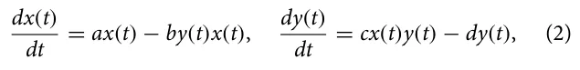

where *x*(*t*) and *y*(*t*) are the prey and predator population sizes over time, respectively. *a* ∈ R+ is the natural growth rate of the prey population supported by the environment, *b* ∈ R+ is the proton of the prey population that is consumed by the predator population, *c* ∈ R+ is the rate of resources available for the predator population to grow due to consumption of the prey population, and *d* ∈ R+ is the natural decay rate of the predator population. These models are based on two assumptions: (a) the habitat for the prey is assumed to be unlimited so that in the absence of predators the prey will reproduce exponentially, and (b) the predators survive only on the prey, and in the absence of food, their number will decrease exponentially. This model and its extensions are well studied.73–77

Several attempts of merging these two models have been investigated. References 78–81 developed and analyzed a predator–prey model, where both species are subjected to parasitism. They show that in the case where the uninfected predator cannot survive only on uninfected prey, the parasitization could lead to the persistence of the predator provided a certain threshold of transmission is surpassed. Sahoo and Poria82 analyzed a two-species prey–predator model with the SIS epidemiological model where predators have an alternative food source rather than the prey. Sabir *et al.*83 also investigate a two-species prey–predator model with the SIS epidemiological model, proposing a stochastic version of it and a numerical scheme to solve the model efficiently. Common to these works is the focus on both single-strain pandemics and only two species. To the best of our knowledge, no model that combines multi-strain epidemiological dynamics with a multi prey–predictor network has been proposed yet.

In this work, we propose a novel multi-strain with multi-species (MSMS) model for studying the spread of infectious diseases in a more realistic, complex ecosystem. In addition, we provide a novel metric to evaluate the pandemic spread by evaluating how many of the species in an ecosystem is driven to extinction. A schematic view of the two possible extensions of two species with a single strain and their merge into an MSMS model is provided in Fig. 1.

The remaining paper is organized as follows: Sec. II describes the proposed model’s mathematical formalization followed by a computer simulation implementation. Section III outlines the implementation of the proposed model as a computer simulator. Section IV provides a comprehensive evaluation of the proposed model using synthetic and real-world setups. Finally, Sec. V provides a discussion on the model’s benefits and limitations followed by conclusion remarks and suggestions for future work.

## Ii. Model Definition

In order to capture the ecological–epidemiological dynamics, we use a system of ordinary differential equations (ODEs). Intuitively, we combine the multi-strain pandemic model proposed by Lazebnik and Bunimovich-Mendrazitsky69 with a multi-species Lotka–Volterra model proposed by Sahoo and Poria.82 On top of that, we further extend the multi-strain pandemic model to include cross-species infection and infection’s exposition phase.

<figure id="fig-1">
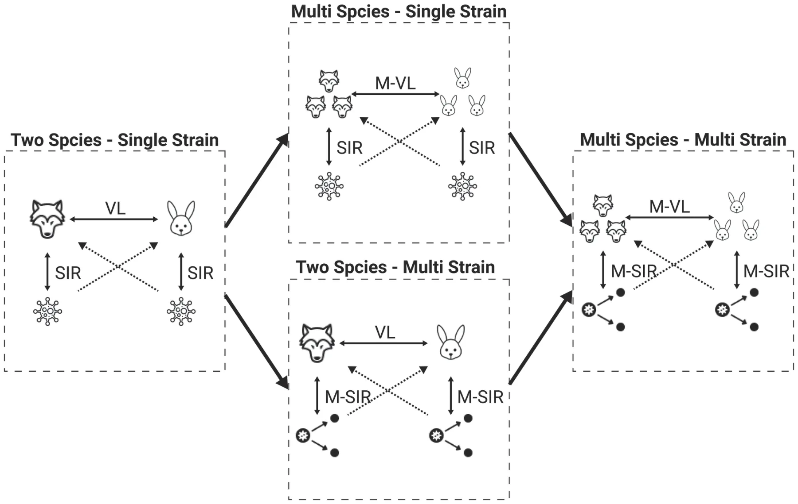
<figcaption><strong>FIG. 1.</strong> A schematic view of the model’s structure and the connections between them.</figcaption>
</figure>

### A. Single specie-level dynamics

For each specie in the set of all species in the system, the multi-strain epidemiological model considers a population Pi for the *i*th specie. We assume a pandemic for specie *i* has *M*i := {1, . . . , *m*i} *j* strains. Each individual in the population, *p*i ∈ Pi, is associated with one of five epidemiological states with respect to each strain: susceptible (*S*), exposed (*E*), infected (*I*), recovered (*R*), and dead (*D*). Thus, the epidemiological state of an individual can be represented by a vector ηi ∈ R|Mi|×5. Moreover, as it is assumed that an individual cannot be infected or exposed to more than one strain at the same time and since once an individual is dead due to one strain it is dead, the individual’s epidemiological state can be reduced to a set of strain one recovered from, *j* ∈ *P*(*M*i), and the current infectious strain, *k* ∈ *P*(*M*i).

Therefore, each individual belongs to one of five groups: (1) Infectious with strain *k* ∈ *M*i and a history of recoveries *J* ∈ *P*(*M*i)

(i.e., the power set of the strain and its strain set) represented by *R*J*I*i k; (2) Exposed with strain *k* ∈ *M*i and a history of recoveries *J* ∈ *P*(*M*i) represented by *R*J*E*i k; (3) Recovered with a history *J* ∈ *P*(*M*) represented by *R*i J; and (4) Dead (*D*i). Of note, for *J* = ∅, *R*J ≡ *S* is the susceptible epidemiological state. A schematic view of the transition between the stages of the disease for an individual for two strains (i.e., ∥*M*∥= 2) is shown in Fig. 2.

Individuals in the Recovered (*R*J) group have immunity to strains *k* ∈ *J* and are susceptible to infection by strains *M*i\\*J*. When an individual in this group is exposed to strain *k* ∈ *M*\\*J*, the individual is transferred to the Exposed with strain *k* with a history of recoveries group *J* (*R*J*E*k) at a rate βJ,k. The individual stays in this group ψJ,k time stamps, after which the individual is transferred to the Infected group of the same strain *k* with the same recovery history *J* marked by (*R*J*I*k). The individuals stay in this group γJ,k time stamps, after which the individuals are transferred to the Recovered group (*R*J∪{k}) or the Dead group (*D*) at rate 1 − ξJ,k and ξJ,k, respectively. The recovered individuals are again healthy, no longer contagious, and immune from future infection from the same strain *k*.

Formally, for the *i*th specie, the multi-strain epidemiological *dR*i *J*(*t*) model takes the following form: First, in Eq. (3), is the dynamic *dt* number of individuals who have recovered from a group of strains *J* ∈ *P*(*M*i) over time. It is affected by the following two terms. First, for each strain *k* ∈ *J*, an individual who has recovered from group *J*\\{*k*} of strains and is infected with strain *k* recovers at rate γ i *J*\\{*k*},*k* with a probability of 1 − ξ i J\\{k},k. Second, individuals infected by strain *k* with rate βi J,k. These individuals can be infected by any individual with a strain *k* who has recovered from any group *L* of strains so that *k*/ ∈ *L*,

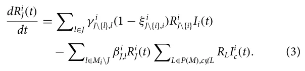

*dRJEk*(*t*) Second, in Eq. (4), is the dynamic number of individuals *dt* who have recovered from a group of strains *J* and are exposed to a strain *k* over time. It is affected by the following two terms. First, individuals infected by strain *k* with rate βi J,k. These individuals can be infected by any individual with a strain *k* who has recovered from any group *L* of strains so that *k*/ ∈ *L*. Second, individuals exposed to strain *k* who become infected at rate φi J,k,

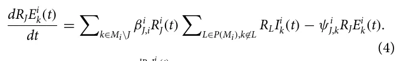

*dRJI*i *k*(*t*) Third, in Eq. (5), is the dynamic number of individu- *dt* als who have recovered from a group of strains *J* and are infected with strain *k* over time. It is affected by the following two terms. First, individuals exposed to strain *k* with a history of *J* who become infected with strain *k*, at rate φi J,k. Second, individuals infected with strain *k* who are either dead or recovered at rate γ i J,k,

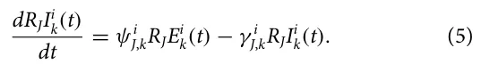

Fourth, in Eq. (6), dDi(t) is the dynamic number of dead individ- *dt* uals over time. For each strain *k*, and for each group *J*\\{*k*}, infected individuals who do not recover die at rate γ i J\\{k},k with probability

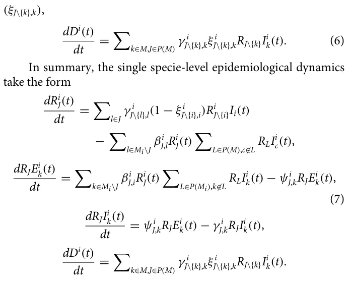

One can notice that the last equation that captures the number of individuals in the population that die due to the pandemic does not change the dynamics. As such, for our subsequent implementation, we will omit this equation from consideration.

<figure id="fig-2">
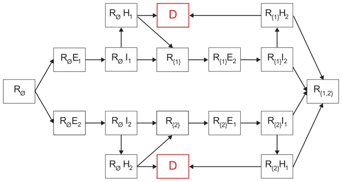
<figcaption><strong>FIG. 2.</strong> Schematic view of transition between disease stages, shown for ∥<em>M</em>∥= 2.</figcaption>
</figure>

### B. Cross-species dynamics

In our model, the cross-species dynamics include two main components: cross-infection and prey–predator interactions. However, not all species interact with all other species and, even if they do interact, they need not necessarily interact in the same way. As such, one can represent the interactions between a set of species **P** := [P1, . . . , PN] using a directed, non-empty graph *G* := (*V*, *E*1, *E*2), where *V* ∈ **P** × R2 is a set of nodes corresponding to the species populations, *E*1 ⊂ *V* × *V* × R2 is set of directed edges representing the prey–predator interactions, and *E*2 ⊂ *V* × *V* × R|Mx||My| is set of directed edges representing the cross-infection interactions. Formally, *v* ∈ *V* represents the entire population of specie with two parameters: the natural growth rate due to free resources *a*i ∈ R and natural population decay *d*i ∈ R. The prey–predator interac- *x*,*y* tion between specie Px and Py, *e*1 ∈ *E*1, defines two parameters the average portion of population Px consumes from population Py, *C*x,y ∈ R, and the growth rate population Px obtains from consuming population Py, *B*x,y ∈ R. The cross-infection interaction between *x*,*y* specie Px and Py, *e*2 ∈ *E*2, defines the average infection rate from an infected individual with strain *k*x that belongs to population *x* to an individual in population *y* to become exposed to strain *k*y to be *x*,*y* βkx,ky ∈ R. Accordingly, the prey–predator dynamics is following the Lotka–Volterra model for two species at a time. As such, in Eq. (8), d|Px(t)|(t) is the dynamic number of individuals in population *x* over *dt* time. It is influenced by the following four terms. First, the noninfected population has a natural reproduction at rate *a*x. Second, the *x* population is consuming a set of other populations, {*y*|(*x*, *y*) ∈ *E*1}, such that from each one of them with a rate *B*x,y is added to the *x* population concerning the size of the *y* population. Third, in a symmetric way to the second term, the *x* population is also consumed by other species with a rate *C*x,y. Finally, the population’s size is naturally exponentially decreased at a rate *d*x,

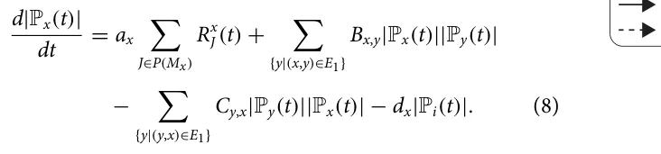

In addition, in order to capture the cross-infection dynamic, let us focus on two species, *x* and *y*. For any two species, a matrix *A* ∈ R|Mx||My| is defined to represent the infection rate that makes individuals from the *x* population infected by strain *k*1 ∈ *M*x to an individual in the *y* population that would be infected by strain *k*2 ∈ *M*y. Once *x*, *y*, *k*1, and *k*2 are chosen, the dynamic change of the exposed individuals in strain *k*1 from population *x* corresponds to *x*,*y* the infection rate βk1,k2 of all individuals in the *x* population that are susceptible to strain *k*1 and can be infected from an individual from population *y* that is infected by strain *k*2 with any recovery history, as formally described in Eq. (9),

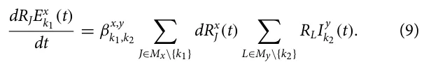

Hence, these dynamics takes can be summarized by the following system of ODEs:

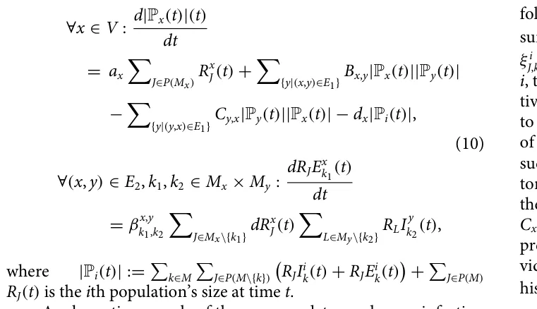

A schematic example of the prey–predator and cross-infection in a multi-species case is provided in Fig. 3 where six species are participating in the dynamics such that specie 1 eats species 2 and 3, specie 2 eats species 4 and 5, and specie 3 eats specie 6. In addition, specie 3 infects specie 2 and is infected by specie 5. Species 5 and 6 infect each other.

## Iii. Computer Simulation

To simulate the model, we used an agent-based simulation approach84–88 where each individual in the multi-population (i.e., the set of all species populations) is a timed finite state machine89 that defined by a tuple *p*i ∈ Pi : *p*i := (*s*, *k*, *J*, τ) such as *s* ∈ [1, . . . , *N*] is the individual’s specie’s index, *k* ∈ *M*i ∪ 0 is the current strain the individual is infected with (if any), *J* ∈ *P*(*M*i) is the recovery history, and τ ∈ N is the number of time steps that passed from the last change in the epidemiological state.

<figure id="fig-3">
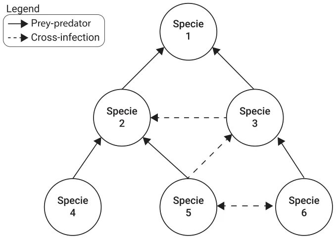
<figcaption><strong>FIG. 3.</strong> An example for prey–predator and cross-infection graph of multi-species with six species.</figcaption>
</figure>

At the beginning of the simulation, the user is responsible to generate a set of populations, such that all agents in the same population have an identical *s* value. Moreover, for each population *i*, the user declares the number of strains *M*i and as a result, provides the following set of parameters: infection rates βi J,k, duration from exposure to being infectious ψi J,k, recovery duration γ *i* J,k, and recovery rate ξ i J,k, for each *k* ∈ *M*i and *J* ∈ *P*(*M*i). In addition, for each population *i*, the user provides natural growth and decay rates *a*i and *d*i, respectively. Once all the populations are generated, the user is required to construct the prey–predator graph *G* by introducing the two sets of edges *E*1 and *E*2 as follows. First, for each pair of populations such that population *x* is the prey and population *y* is the predator, the edge (*x*, *y*) ∈ *E*1 is added with the consumption portion of the prey population *B*x,y and the growth to the predator population *C*x,y. Second, for each pair of populations *x* and *y* (not necessarily prey and predator), the edge (*x*, *y*) ∈ *E*2 is added such that *x*’s individual’s strain *k*1 ∈ *M*x, *y*’s individual’s strain *k*2 ∈ *M*y with recovery *x*,*y* history *J* ∈ *P*(*M*y), and an cross-infection rate βJ,k1 ∈ R+. Afterward, simulation takes place in rounds *r* ∈ [1, . . . , *T*] such that *T* < ∞. At each round, individuals in each population may interact, thus initiating some epidemiological and prey–predator dynamics as mathematically detailed in Secs. II A and II B. However, since the order of execution of each dynamic might influence the course of the dynamics, we tackle this challenge by computing all the changes in the meta-population and executing all of them at once after canceling-out opposite changes, as commonly performed in particle simulations.90–92 A schematic view of the simulator’s process is shown in Fig. 4.

### A. Ecosystem instability metric

There are multiple metrics used to evaluate the course of a pandemic, such as total mortality, the maximum number of infected individuals at the same time, and the basic reproduction number.69,93–96 Each of these properties captures different properties of the pandemic spread. However, they are all designed for the case where there is a single population or where the evaluation is agnostic to all sub-populations and aims to measure the overall pandemic spread.

<figure id="fig-4">
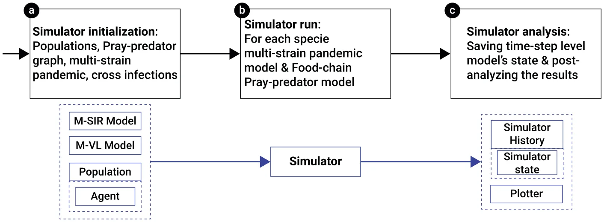
<figcaption><strong>FIG. 4.</strong> A schematic view of the simulator’s process in both process diagram (black) and objects diagram (blue). (a) The initial phase of constructing the simulator, (b) the computation of the simulation itself, and (c) the analysis of the simulation’s results.</figcaption>
</figure>

Thus, for our analysis, we propose a novel metric to measure the pandemic spread for a multi-species scenario where the focus is on the ecosystem’s ability to reach back a stable state. Intuitively, if no pandemic is present, the ecosystem reaches an equilibrium state,97–99 *s*∗, that can be treated as a baseline and, therefore, *d*(*s*∗) = 1. The other extreme case, *s*∗∗ is that all species are extinct due to the pandemic. As this is probably the worst-case scenario, we define *d*(*s*∗∗) = 0. Notice that both *s*∗ and *s*∗∗ define an equilibrium state. Thus, it is self-evident to require a metric *d* to evaluate the system’s closest equilibrium state’s condition. Following this rationale, the metric *d* is assessing an equilibrium state *s* that indicates the number of extinct species. Moreover, as we allow the equilibrium state to contain any value in R ∪−∞, ∞, the proposed metric is also an indicator of the instability caused to the ecosystem by the pandemic. Therefore, the metric *d* is formally defined as follows.

**Definition III.1 (Ecosystem’s stability metric).** Given an MSMS dynamic system *M* with *N* species, the ecosystem’s stability metric, *d*, measures the level of ecosystem’s stability significantly after the pandemic has been eliminated or has stabilized as follows:

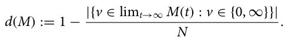

Notably, one can define *d* slightly differently following the same motivation and constraints. Thus, the proposed definition is a sample of a feasible definition for *d* and not the only possible one.

## Iv. Evaluation

In order to study the behavior of the MSMS model for various conditions and scenarios, we divide the analysis into two main parts:

<figure class="table-figure" id="table-1">
<figcaption><strong>TABLE I.</strong> The model’s parameters description and default values.</figcaption>

<table><tr><th>Parameter</th><th>Description</th><th>Default value</th></tr><tr><td>|V|</td><td>Number of species [1]</td><td>[5, . . . , 20]</td></tr><tr><td>|Pi|</td><td>Number of individuals in the ith species’ population [1]</td><td>[500, . . . , 5000]</td></tr><tr><td>|E1|</td><td>Number of prey–predator connections [1]</td><td>[0.05|V|, . . . , 0.5|V|]</td></tr><tr><td>|E2|</td><td>Number of cross-infection connections [1]</td><td>[0.05|V|, . . . , 0.5|V|]</td></tr><tr><td>|Mi|</td><td>Number of strains for the ith species [1]</td><td>[0, 1, 2, 3, 4]</td></tr><tr><td>T</td><td>Steps in time in days [t]</td><td>365</td></tr><tr><td>βi k,J</td><td>The infection rate of specie i for strain k for an individual with recovery history J [1]</td><td>[0.05, . . . , 0.15] −[0.01, . . . , 0.1] · |J|/|Mi|</td></tr><tr><td>Xi k,J</td><td>The strain X ∈[γ , φ, ξ, ψ] property rate of specie i for strain k for an individual with recovery history J [1]</td><td>[0.01, . . . , 0.5]</td></tr></table>

</figure>

<figure class="table-figure" id="table-x2">

</figure>

<figure id="fig-5">
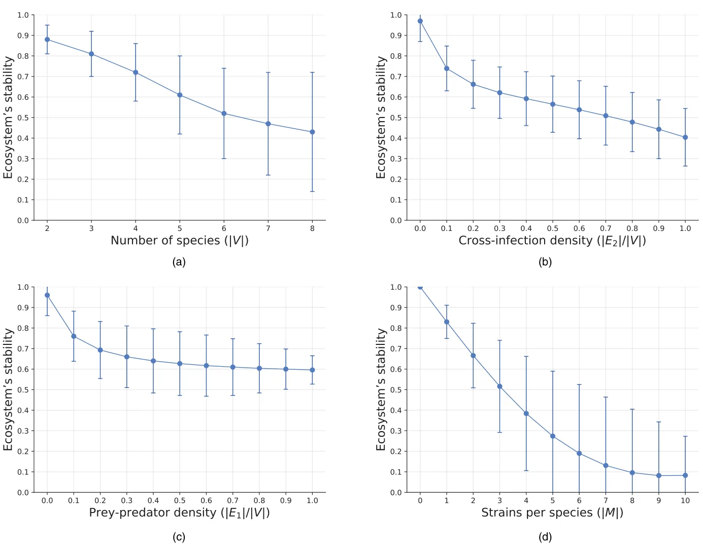
<figcaption><strong>FIG. 5.</strong> A sensitivity analysis of the ecosystem’s stability metric. The results are shown as mean ± standard deviation of <em>n</em> = 100 repetitions. (a) Number of species (|<em>V</em>|). (b) Cross-infection density (|<em>E</em>2|/|<em>V</em>|). (c) Prey–predator density (|<em>E</em>1|/|<em>V</em>|). (d) Number of strains (|<em>M</em>|).</figcaption>
</figure>

synthetic and real-world setups. Using the synthetic data, we are able to numerically study the damage and instability a multi-strain pandemic causes to an ecosystem for different cases. In particular, as the ecosystems are widely diverse and complex, in order to study the sensitivity of the pandemic’s damage, we randomly generate a large set of cases and measure the average and standard deviation of the pandemic’s damage on this set while changing a sub-set of parameters and initial conditions each time. In a complementary manner, real-world cases are considered in order to test the influence of global pandemic properties on the overall ecosystem’s stability, given a specific topology of the species interactions.

### A. Synthetic setup

For realizing this simulation, several parameters of the MSMS model have to be set. We discuss the main parameter values below and provide a summary in Table I. The parameters are chosen to represent relatively small, yet diverse, ecosystems that require reasonable computational burden to simulate. The pandemic’s properties as well as the prey–predator dynamics are randomly sampled, if not stated otherwise.

In order to obtain a wide variety of cases, *n* = 1000 randomly generated graphs are considered. For the sampled 1000 graphs, we examine the ecosystem’s stability metric as a function of different properties of the MSMS model. Figure 5 summarizes the main results obtained. As one can see from Fig. 5(a), the mean ecosystem’s stability is monotonically decreasing by the number of species (|*V*|) and the standard deviation is increasing. In a similar manner, Fig. 5(b) shows that the cross-infection density (|*E*2|/|*V*|) enforces a monotonic decreasing behavior to the ecosystem’s stability. Moreover, as the cross-infection density increases, the decrease rate intensifies, as indicated by the negative value of the second-order numerical derivative of the graph. The ecosystem’s stability shows a monotonically decreasing behavior to the prey–predator density (|*E*1|/|*V*|), as presented by Fig. 5(c). Specifically, an inverse behavior is found to be 0.95 − 0.39*Z*/(*Z* + 0.11), where *Z* := |*E*1|/|*V*| with a coefficient of determination *R*2 = 0.958, using the least mean square method.100 Similar dynamics are encountered when computing the sensitivity of the ecosystem’s stability to the number of strains (|*M*|), as shown in Fig. 5(d).

<figure id="fig-6">
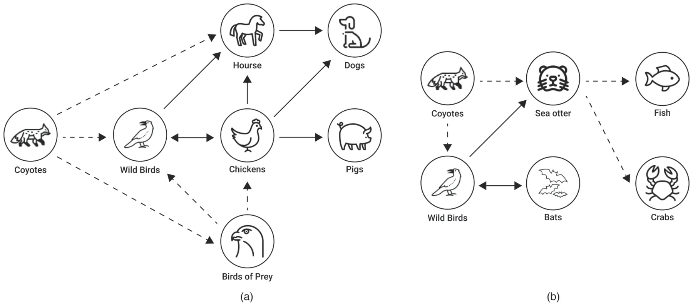
<figcaption><strong>FIG. 6.</strong> A schematic view of the two real-world cases. The solid and dashed lines indicate the cross-infection and prey–predator interactions between species, respectively. (a) Wild farm settings. (b) Near-shore ocean settings.</figcaption>
</figure>

### B. Real-world setup

In order to evaluate the proposed MSMS model’s ability to capture and predict the ecosystem’s state during a pandemic in a more realistic setup, we consider two real-world cases: First, a wild farm case in Asia where farm animals have interacted with nearby wild animals; Second, a near-shore ocean case. For both cases, we consider the Avian Influenza virus to be the pathogen at the root of the pandemic.33,101–105

Due to the fact that each case involves many species and their interactions, there is a lot of unknown information. In order to maintain a balance between available data and computational resources and the case’s representation accuracy, we have selected a subset of species that play a key role in the dynamics. For both cases, we consider the following: initially, wild birds infected farm chickens, then chickens infected wild birds. Furthermore, wild birds and chickens infect horses, which, in turn, infect dogs. In addition, chickens also directly infect dogs and pigs.106 Among the prey–predator interactions, Coyotes eat wild birds, birds of prey, and horses.107 In addition, birds of prey eat smaller wild birds.108 In the second case, wild birds infect bats and vice versa. In addition, they infect sea otters.106 As a prey–predator interaction, Coyotes eat wild birds and sea otters.107 In their turn, sea otter eats small fish and crabs.109 A schematic view of the two cases is shown in Fig. 6, where the solid and dashed lines indicate the cross-infection and prey–predator interactions, respectively.

In order to use the proposed MSMS model in these cases, one first needs to find the model’s parameters’ values and initial condition. Unfortunately, these data are largely unavailable110 and even partial observations of the dynamics highly differ between locations and timeframes.111–113 To overcome this challenge, we generate a large number of samples under the constraint that for the same initial condition and prey–predator interactions, the ecosystem’s stability after 365 steps in time is 1. The motivation behind this constrain is to sample cases that are relatively stable if no pandemic is presented, as believed to be the case for a short duration of time in most setups.74–76

Figure 7 presents a two-dimensional sensitivity analysis for the real-world cases between the ecosystem’s stability and the average cross-infection rate on the x-axis and the average inner-species infection rate on the y-axis. The results are shown as the average of *n* = 25 samples for each configuration, as computed after *T* = 365 steps. A paired T-test between the result metrics of the “wild farm” and “near-shore ocean” case shows that the two cases statistically significantly differ with *p* < 0.0001. One can see in both cases that, on average, a larger average cross-infection rate and a larger inner-species infection rate cases more instability in the ecosystem. However, this connection is non-linear as linear fitting on both cases resulted in a coefficient of determinations *R*2 = 0.312 and *R*2 = 0.185, respectively.

<figure id="fig-7">
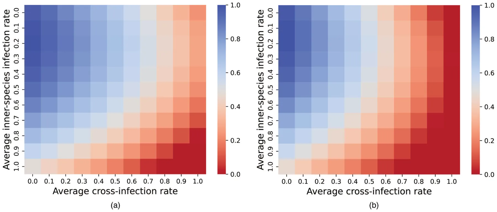
<figcaption><strong>FIG. 7.</strong> A two-dimensional sensitivity analysis for the real-world cases between the ecosystem’s stability and the combined influence of the average cross-infection rate and the average inner-species infection rate. (a) Wild farm case. (b) Near-shore ocean case.</figcaption>
</figure>

## V. Discussion

In this study, we proposed a novel ecological–epidemiological model of multi-species with multi-strain dynamics that account for prey–predator interactions and cross-infection interactions between arbitrary numbers of species using an extended Lotka–Volterra and SIR models, represented by ordinary differential equations operated on a graph. Considering the Avian Influenza A pathogen and its various strains for different species as a representative example, we evaluated the proposed model using an extensive agent-based simulation based on both synthetic and real-world graphs and data.

Starting with synthetic graphs and data, we examine the sensitivity of the ecosystem’s long-duration stability due to the multi-strain pandemic, using a wide range of cases. On average, as the number of species increases, the ecosystem’s stability decreases, as shown in Fig. 5(a). Moreover, the entropy of the system is also increasing, as indicated by the standard deviation of the graph. These results agree with biological observations in nature.114 A similar outcome was achieved for cross-infection density and prey–predator density, as shown in Figs. 5(b) and 5(c), respectively, aligning with the existing view that cross-infections in the predator population result in community instability among predators and their prey.114–117 Furthermore, as the number of strains in the environmental dynamics increases, the ecosystem’s stability decreases. This outcome again agrees with prior literature examining other multi-strain pandemics applied to a single species.69,70

In addition, using real-world data, we examined two realistic cases—one of a wild farm and another of a near-shore ocean, presented in Fig. 6. We examined the influence of the average cross-infection rate and the average inner-species infection rate on the ecosystem’s stability, as presented in Fig. 7. As one could expect, as these quantities increase, the ecosystem’s stability decreases in a non-linear fashion. Comparing the cross-infection rates between wild farm animals, it seems that the ecosystem is more stable among them as opposed to those found near the shore. This observation also holds when we consider the rate of inner infection among these animals. Furthermore, both ecosystems appear to have a higher rate of cross-infection than within-species infection which makes the ecosystem less stable.

Taken jointly, the results indicate that the proposed MSMS model with its agent-based simulation could adequately represent multi-species multi-strain pandemic dynamics. Researchers can utilize the proposed model to conduct *in silico* experiments, exploring different pandemic intervention policies for a wide range of configurations.

This study has several limitations that should be addressed in future work to further improve the biological and ecological accuracy of the proposed MSMS model. First, as no spatial component is taken into consideration, current infection rates are operating as an upper bound for the realistic infection rate,69 which results in overpessimistic outcomes. Moreover, by considering spatial dynamics, one is able to capture the movement patterns of various species.118–120 Thus, introducing a spatial component to the model would significantly increase its accuracy.121–123 Second, many species alter their behavior over time, due to weather changes, for example, thus directly influencing other species’ behaviors.124–126 For instance, bird migration,127 bears’ hibernation,128 and plants’ blossoming.129 Third, the proposed model uses constant epidemiological and ecological values. However, in practice, these values are dynamic and influenced by the time of year, changes in the strains’ mutation, and other factors. As such, time-depended or even stochastic values would make the model, presumably, even more realistic and accurate at the cost of analytical analysis feasibility. Futhermore, while humans can also be taken as just a species in the proposed model like any other one, this would result in sub-optimal modeling of the dynamics as humans differ from other species due to complex social, economic, and technological factors that differentiate them from other species. Hence, future work can focus on integrating these unique properties into the proposed model to obtain an MSMS model that can accurately integrate humans as one of the species. Moreover, as strains in a pandemic are not static and new strains can appear through a mutation process in hosts, one can further extend the multi-strain pandemic model into a multi-mutation pandemic model as well.130 Finally, the proposed model is not fitted or validated using real-world data as such data are not publicly available since pandemic data in animals are sparse usually sampling a small subset of a single species over a short period of time once every few weeks or even months. Gathering such data can be a pivot point in the development of more accurate models and a better understanding of the MSMS dynamics.

(1967).

## Acknowledgments

The authors wish to thank Ziv Zemah Shamir for his ecological-related consulting.

## Author Declarations

## Conflict of Interest

The authors have no conflicts to disclose.

## Author Contributions

**Ariel Alexi:** Conceptualization (equal); Data curation (equal); Investigation (equal); Writing – original draft (equal). **Ariel Rosenfeld:** Conceptualization (equal); Supervision (equal); Validation (equal); Writing – review & editing (equal). **Teddy Lazebnik:** Conceptualization (equal); Formal analysis (equal); Methodology (equal); Project administration (equal); Software (equal); Visualization (equal); Writing – original draft (equal).

## Data Availability

The data that support the findings of this study are available within the article.

## References

1. M. Alberti, “Maintaining ecological integrity and sustaining ecosystem function in urban areas,” Curr. Opin. Environ. Sustain. 2, 178–184 (2010). [doi:10.1016/j.cosust.2010.07.002](https://doi.org/10.1016/j.cosust.2010.07.002)
2. A. Middleton, “Managing ecological balance,” in Sustainability in Tourism: A Multidisciplinary Approach, edited by I. Jenkins and R. Schroder (Springer Fachmedien, Wiesbaden, 2013), pp. 137–157. [doi:10.1016/j.cosust.2010.07.002](https://doi.org/10.1016/j.cosust.2010.07.002)
3. I. Tsehaye, M. L. Jones, T. O. Brenden, J. R. Bence, and R. M. Claramunt, “Changes in the salmonine community of Lake Michigan and their implications for predator—prey balance,” Trans. Am. Fish. Soc. 143, 420–437 (2014). [doi:10.1080/00028487.2013.862176](https://doi.org/10.1080/00028487.2013.862176)
4. K. Blyuss and Y. Kyrychko, “Sex, ducks, and rock “n” roll: Mathematical model of sexual response,” Chaos 33, 043106 (2023). [doi:10.1063/5.0143190](https://doi.org/10.1063/5.0143190)
5. M. Kuwamura and H. Chiba, “Mixed-mode oscillations and chaos in a prey-predator system with dormancy of predators,” Chaos 19, 043121 (2009). [doi:10.1063/1.3270262](https://doi.org/10.1063/1.3270262)
6. J. G. Freire, M. R. Gallas, and J. A. Gallas, “Impact of predator dormancy on prey-predator dynamics,” Chaos 28, 053118 (2018). [doi:10.1063/1.5016434](https://doi.org/10.1063/1.5016434)
7. S. Chen, A. Ilany, B. J. White, M. W. Sanderson, and C. Lanzas, “Spatial-temporal dynamics of high-resolution animal networks: What can we learn from domestic animals?,” PLoS One 10, e0129253 (2015). [doi:10.1371/journal.pone.0129253](https://doi.org/10.1371/journal.pone.0129253)
8. A. Costall, “From Darwin to Watson (and cognitivism) and back again: The principle of animal-environment mutuality,” Behav. Philos. 32, 179–195 (2004).
9. B. Dubey, “A prey-predator model with a reserved area,” Nonlinear Anal. 12, 479–494 (2007). [doi:10.15388/NA.2007.12.4.14679](https://doi.org/10.15388/NA.2007.12.4.14679)
10. J. L. Harper, “A Darwinian approach to plant ecology,” J. Appl. Ecol. 4, 267–290 [doi:10.2307/2401336](https://doi.org/10.2307/2401336)
11. R. L. Trivers and D. E. Willard, “Natural selection of parental ability to vary the sex ratio of offspring,” Science 179, 90–92 (1973). [doi:10.1126/science.179.4068.90](https://doi.org/10.1126/science.179.4068.90)
12. D. B. Fogel, “An introduction to simulated evolutionary optimization,” IEEE Trans. Neural Netw. 5, 3–14 (1994). [doi:10.1109/72.265956](https://doi.org/10.1109/72.265956)
13. D. J. Weese, A. K. Schwartz, P. Bentzen, A. P. Hendry, and M. T. Kinni-son, “Eco-evolutionary effects on population recovery following catastrophic disturbance,” Evol. Appl. 4, 354–366 (2011). [doi:10.1111/j.1752-4571.2010.00169.x](https://doi.org/10.1111/j.1752-4571.2010.00169.x)
14. M. S. Edwards and J. A. Estes, “Catastrophe, recovery and range limitation in NE pacific kelp forests: A large-scale perspective,” Mar. Ecol. Progress Ser. 320, 79–87 (2006). [doi:10.1111/j.1752-4571.2010.00169.x](https://doi.org/10.1111/j.1752-4571.2010.00169.x)
15. P. A. Carpenter and P. C. Bishop, “A review of previous mass extinctions and historic catastrophic events,” Futures 41, 676–682 (2009). [doi:10.1016/j.futures.2009.07.012](https://doi.org/10.1016/j.futures.2009.07.012)
16. R. Holt, “Food webs in space: On the interplay of dynamic instability and spatial processes,” Ecol. Res. 17, 261–273 (2002). [doi:10.1046/j.1440-1703.2002.00485.x](https://doi.org/10.1046/j.1440-1703.2002.00485.x)
17. D. Knorr, M. A. Augustin, and B. Tiwari, “Advancing the role of food processing for improved integration in sustainable food chains,” Front. Nutr. 7, 1 (2020). [doi:10.3389/fnut.2020.00034](https://doi.org/10.3389/fnut.2020.00034)
18. A. Klebanoff and A. Hastings, “Chaos in three species food chains,” J. Math. Biol. 32, 427–451 (1994). [doi:10.1007/BF00160167](https://doi.org/10.1007/BF00160167)
19. W. McKibbin and D. Vines, “Global macroeconomic cooperation in response to the COVID-19 pandemic: A roadmap for the G20 and the IMF,” Oxf. Rev. Econ. Policy 36, S297–S337 (2020). [doi:10.1007/BF00160167](https://doi.org/10.1007/BF00160167)
20. A. A. Toda, “Susceptible-infected-recovered (SIR) dynamics of COVID-19 and economic impact,” Covid Econ. 1, 43–63 (2020). [doi:10.1093/oxrep/graa032](https://doi.org/10.1093/oxrep/graa032)
21. W. A. Hoffmann, E. L. Geiger, S. G. Gotsch, D. R. Rossatto, L. C. R. Silva, O. L. Lau, M. Haridasan, and A. C. Franco, “Ecological thresholds at the savanna-forest boundary: How plant traits, resources and fire govern the distribution of tropical biomes,” Ecol. Lett. 15, 759–768 (2012). [doi:10.1111/j.1461-0248.2012.01789.x](https://doi.org/10.1111/j.1461-0248.2012.01789.x)
22. M. E. Swanson, J. F. Franklin, R. L. Beschta, C. M. Crisafulli, D. A. DellaSala, R. L. Hutto, D. B. Lindenmayer, and F. J. Swanson, “The forgotten stage of forest succession: Early-successional ecosystems on forest sites,” Front. Ecol. Environ. 9, 117–125 (2011). [doi:10.1890/090157](https://doi.org/10.1890/090157)
23. M. A. Cochrane, “Fire science for rainforests,” Nature 421, 913–919 (2003). [doi:10.1038/nature01437](https://doi.org/10.1038/nature01437)
24. A. A. Conti, “Historical and methodological highlights of quarantine measures: From ancient plague epidemics to current coronavirus disease (COVID-19) pandemic,” Acta Bio Med. Atenei Parmensis 91, 226–229 (2020).
25. A. Brodeur, D. Gray, A. Islam, and S. Bhuiyan, “A literature review of the economics of COVID-19,” J. Econ. Surv. 35, 1007–1044 (2021). [doi:10.1111/joes.12423](https://doi.org/10.1111/joes.12423)
26. A. K. Wiethoelter, D. Beltran-Alcrudo, R. Kock, and S. M. Mor, “Global trends in infectious diseases at the wildlife–livestock interface,” Proc. Natl. Acad. Sci. U.S.A. 112, 9662–9667 (2015). [doi:10.1073/pnas.1422741112](https://doi.org/10.1073/pnas.1422741112)
27. R. G. Webster, W. J. Bean, O. T. Gorman, T. M. Chambers, and Y. Kawaoka, “Evolution and ecology of influenza a viruses,” Microbiol. Rev. 56, 152–179 (1992). [doi:10.1128/mr.56.1.152-179.1992](https://doi.org/10.1128/mr.56.1.152-179.1992)
28. D. van Riel, V. J. Munster, E. de Wit, G. F. Rimmelzwaan, R. A. Fouchier, A. D. Osterhaus, and T. Kuiken, “Human and avian influenza viruses target different cells in the lower respiratory tract of humans and other mammals,” Am. J. Pathol. 171(4), 1215–1223 (2007). [doi:10.1038/nrg2053](https://doi.org/10.1038/nrg2053)
29. M. Nelson and E. Holmes, “The evolution of epidemic influenza,” Nat. Rev. Genet. 8, 196–205 (2007). [doi:10.1038/nrg2053](https://doi.org/10.1038/nrg2053)
30. R. Tangwangvivat, S. Chanvatik, K. Charoenkul, S. Chaiyawong, T. Janethanakit, R. Tuanudom, D. Prakairungnamthip, S. Boonyapisitsopa, N. Bunpapong, and A. Amonsin, “Evidence of pandemic H1N1 influenza exposure in dogs and cats, Thailand: A serological survey,” Zoonoses Public Health 66, 349–353 (2019). [doi:10.1111/zph.12551](https://doi.org/10.1111/zph.12551)
31. Z. Kettlewel Hill, “The foot and mouth disease (FMD) epidemic in the United Kingdom 2001,” Comp. Immunol. Microbiol. Infect. Dis. 25, 331–343 (2002).
32. I. H. Brown, “The pig as an intermediate host for influenza a viruses between birds and humans,” Int. Congress Ser. 25, 331–343 (2002). [doi:10.1016/S0378-1135(00)00160-7](https://doi.org/10.1016/S0378-1135%2800%2900160-7)
33. D. J. Alexander, “A review of avian influenza in different bird species,” Vet. Microbiol. 74, 3–13 (2000). [doi:10.1016/S0378-1135(00)00160-7](https://doi.org/10.1016/S0378-1135%2800%2900160-7)
34. O. Vidal, F. Z. Rostom, C. Francois, and G. Giraud, “Prey–predator long-term modeling of copper reserves, production, recycling, price, and cost of production,” Environ. Sci. Technol. 53, 11323–11336 (2019). [doi:10.1021/acs.est.9b03883](https://doi.org/10.1021/acs.est.9b03883)
35. G. E. Machovsky-Capuska, S. C. P. Coogan, S. J. Simpson, and D. Rauben-heimer, “Motive for killing: What drives prey choice in wild predators?,” Ethology 122, 703–711 (2016).
36. J. P. Suraci, J. A. Smith, S. Chamaille-Jammes, K. M. Gaynor, M. Jones, B. Lut-tbeg, E. G. Ritchie, M. J. Sheriff, and A. Sih, “Beyond spatial overlap: Harnessing new technologies to resolve the complexities of predator–prey interactions,” Oikos 2022(8), e09004 (2022). [doi:10.1111/oik.09004](https://doi.org/10.1111/oik.09004)
37. C. Mackey and C. Kribs, “Can scavengers save zebras from anthrax? A modeling study,” Infect. Dis. Modell. 6, 56–74 (2021). [doi:10.1016/j.idm.2020.10.016](https://doi.org/10.1016/j.idm.2020.10.016)
38. O. M. Araz, P. Damien, D. A. Paltiel, S. Burke, B. van de Geijn, A. Galvani, and L. A. MEyers, “Simulating school closure policies for cost effective pandemic decision making,” BMC Public Health 12, 449 (2012). [doi:10.1186/1471-2458-12-449](https://doi.org/10.1186/1471-2458-12-449)
39. M. I. Meltzer, N. J. Cox, and K. Fukuda, “The economic impact of pandemic influenza in the United States: Priorities for intervention,” Emerg. Infect. Dis. 5, 659–671 (1999). [doi:10.3201/eid0505.990507](https://doi.org/10.3201/eid0505.990507)
40. M. Kabir, M. S. Afzai, A. Khan, and H. Ahmed, “COVID-19 pandemic and economic cost; impact on forcibly displaced people,” Travel Med. Infect. Dis. 35, 101661 (2020). [doi:10.1016/j.tmaid.2020.101661](https://doi.org/10.1016/j.tmaid.2020.101661)
41. P. Perrin, O. McCabe, G. Everly, and J. Links, “Preparing for an influenza pandemic: Mental health considerations,” Prehosp. Disaster Med. 24, 223 (2009). [doi:10.1017/S1049023X00006853](https://doi.org/10.1017/S1049023X00006853)
42. M. R. Taylor, K. E. Agho, G. J. Stevens, and B. Raphael, “Factors influencing psychological distress during a disease epidemic: Data from Australia’s first outbreak of equine influenza,” BMC Public Health 8, 347 (2008). [doi:10.1017/S1049023X00006853](https://doi.org/10.1017/S1049023X00006853)
43. A. Alexi, A. Rosenfeld, and T. Lazebnik, “A security games inspired approach for distributed control of pandemic spread,” Adv. Theory Simul. 6(2), 2200631 (2022). [doi:10.1002/adts.202200631](https://doi.org/10.1002/adts.202200631)
44. T. Lazebnik and A. Alexi, “Comparison of pandemic intervention policies in several building types using heterogeneous population model,” Commun. Nonlinear Sci. Numer. Simul. 107, 106176 (2022). [doi:10.1016/j.cnsns.2021.106176](https://doi.org/10.1016/j.cnsns.2021.106176)
45. N. M. Marples, M. P. Speed, and R. J. Thomas, “An individual-based profitability spectrum for understanding interactions between predators and their prey,” Biol. J. Linn. Soc. 125, 1–13 (2018). [doi:10.1093/biolinnean/bly088](https://doi.org/10.1093/biolinnean/bly088)
46. G. Carroll, K. K. Holsman, S. Brodie, J. T. Thorson, E. L. Hazen, S. J. Bograd, M. A. Haltuch, S. Kotwicki, J. Samhouri, P. Spencer, E. Willis-Norton, and R. L. Selden, “A review of methods for quantifying spatial predator–prey overlap,” Glob. Ecol. Biogeogr. 28, 1561–1577 (2019). [doi:10.1111/geb.12984](https://doi.org/10.1111/geb.12984)
47. M.-G. Cojocaru, T. Migot, and A. Jaber, “Controlling infection in predator-prey systems with transmission dynamics,” Infect. Dis. Modell. 5, 1–11 (2020). [doi:10.1111/geb.12984](https://doi.org/10.1111/geb.12984)
48. D. J. Becker and R. J. Hall, “Too much of a good thing: Resource provisioning alters infectious disease dynamics in wildlife,” Biol. Lett. 10, 20140309 (2014). [doi:10.1098/rsbl.2014.0309](https://doi.org/10.1098/rsbl.2014.0309)
49. N. Nagelkerke, L. J. Abu-Raddad, S. F. Awad, V. Black, and B. Williams, “A signature for biological heterogeneity in susceptibility to HIV infection?,” Infect. Dis. Modell. 3, 139–144 (2018). [doi:10.1016/j.idm.2018.08.002](https://doi.org/10.1016/j.idm.2018.08.002)
50. T. A. Dallas, G. Foster, R. L. Richards, and B. D. Elderd, “Epidemic time series similarity is related to geographic distance and age structure,” Infect. Dis. Modell. 7, 690–697 (2022). [doi:10.1016/j.idm.2022.09.002](https://doi.org/10.1016/j.idm.2022.09.002)
51. A. Alexi, A. Rosenfeld, and T. Lazebnik, “The trade-off between airborne pandemic control and energy consumption using air ventilation solutions,” Sensors 22, 8594 (2022). [doi:10.3390/s22228594](https://doi.org/10.3390/s22228594)
52. T. Lazebnik and A. Alexi, “High resolution spatio-temporal model for room-level airborne pandemic spread,” Mathematics 11, 426 (2023). [doi:10.3390/math11020426](https://doi.org/10.3390/math11020426)
53. M. Banerjee and V. Volpert, “Prey-predator model with a nonlocal consumption of prey,” Chaos 26, 083120 (2016). [doi:10.1063/1.4961248](https://doi.org/10.1063/1.4961248)
54. W. O. Kermack and A. G. McKendrick, “A contribution to the mathematical theory of epidemics,” Proc. R. Soc. 115, 700–721 (1927).
55. I. Rahimi, F. Chen, and A. H. Gandomi, “A review on COVID-19 forecasting models,” Neural Comput. Appl. 2021, 1 (2021). [doi:10.1007/s00521-020-05626-8](https://doi.org/10.1007/s00521-020-05626-8)
56. A. Wiratsudakul, P. Suparit, and C. Modchang, “Dynamics of Zika virus outbreaks: An overview of mathematical modeling approaches,” PeerJ 6, e4526 (2018). [doi:10.1007/s00521-020-05626-8](https://doi.org/10.1007/s00521-020-05626-8)
57. A. Adiga, D. Dubhashi, B. Lewis, M. Marathe, S. Venkatramanan, and A. Vollikanti, “Mathematical models for COVID-19 pandemic: A comparative analysis,” J. Indian Inst. Sci. 100, 793–807 (2020). [doi:10.1007/s41745-020-00200-6](https://doi.org/10.1007/s41745-020-00200-6)
58. V. Ram and L. P. Schaposnik, “A modified age-structured SIR model for COVID-19 type viruses,” Sci. Rep. 11, 15194 (2021). [doi:10.1038/s41598-021-94609-3](https://doi.org/10.1038/s41598-021-94609-3)
59. T. Lazebnik and S. Bunimovich-Mendrazitsky, “The signature features of COVID-19 pandemic in a hybrid mathematical model—Implications for optimal work–school lockdown policy,” Adv. Theory Simul. 4, e2000298 (2021). [doi:10.1038/s41598-021-94609-3](https://doi.org/10.1038/s41598-021-94609-3)
60. A. J. Terry, “Pulse vaccination strategies in a metapopulation sir model,” Math. Biosci. Eng. 7, 455–477 (2010). [doi:10.1002/adts.202000298](https://doi.org/10.1002/adts.202000298)
61. I. E. Marie and K. Masaomi, Effects of Metapopulation Mobility and Climate Change in SI-SIR Model for Malaria Disease (Association for Computing Machinery, 2020), pp. 99–103.
62. O. Khyar and K. Allali, “Global dynamics of a multi-strain SEIR epidemic model with general incidence rates: Application to COVID-19 pandemic,” Nonlinear Dyn. 102, 489–509 (2020). [doi:10.1007/s11071-020-05929-4](https://doi.org/10.1007/s11071-020-05929-4)
63. F. Bozkurt, A. Yousef, and T. Abdeljawad, “Analysis of the outbreak of the novel coronavirus COVID-19 dynamic model with control mechanisms,” Results Phys. 19, 103586 (2020). [doi:10.1007/s11071-020-05929-4](https://doi.org/10.1007/s11071-020-05929-4)
64. A. A. Thirthar, R. K. Naji, F. Bozkurt, and A. Yousef, “Modeling and analysis of an SI1I2R epidemic model with nonlinear incidence and general recovery functions of I1,” Chaos, Solitons Fractals 145, 110746 (2021). [doi:10.1016/j.chaos.2021.110746](https://doi.org/10.1016/j.chaos.2021.110746)
65. M. A. Alqudah, T. Abdelijawad, A. Zeb, I. U. Khan, and F. Bozhurt, “Effect of weather on the spread of COVID-19 using eigenspace decomposition,” Comput. Mater. Continua 69, 3047–3063 (2021).
66. H. Ogut, S. LaPatra, and P. Reno, “Effects of host density on furunculosis epidemics determined by the simple SIR model,” Prev. Vet. Med. 71, 83–90 (2005). [doi:10.1016/j.prevetmed.2005.06.001](https://doi.org/10.1016/j.prevetmed.2005.06.001)
67. W. Chen, “A mathematical model of Ebola virus based on SIR model,” in 2015 International Conference on Industrial Informatics—Computing Technology, Intelligent Technology, Industrial Information Integration (IEEE, Piscataway, NJ, 2015), pp. 213–216. [doi:10.1109/ICIICII.2015.135](https://doi.org/10.1109/ICIICII.2015.135)
68. B. J. Coburn, B. G. Wagner, and S. Blower, “Modeling influenza epidemics and pandemics: Insights into the future of swine flu (H1N1),” BMC Med. 7, 30 (2009). [doi:10.1186/1741-7015-7-30](https://doi.org/10.1186/1741-7015-7-30)
69. T. Lazebnik and S. Bunimovich-Mendrazitsky, “Generic approach for mathematical model of multi-strain pandemics,” PLoS One 17, e0260683 (2022). [doi:10.1371/journal.pone.0260683](https://doi.org/10.1371/journal.pone.0260683)
70. P. Minayev and N. Ferguson, “Improving the realism of deterministic multi-strain models: Implications for modelling influenza A,” J. R. Soc. Interface 6(35) 509–518 (2008). [doi:10.1098/rsif.2008.0333](https://doi.org/10.1098/rsif.2008.0333)
71. Y.-X. Dang, X.-Z. Li, and M. Martcheva, “Competitive exclusion in a multi-strain immuno-epidemiological influenza model with environmental transmission,” J. Biol. Dynamics 10, 416 (2016). [doi:10.1080/17513758.2016.1217355](https://doi.org/10.1080/17513758.2016.1217355)
72. E. Venturino, “The influence of diseases on Lotka-Volterra systems,” JSTOR 24, 381–402 (1994). [doi:10.1080/17513758.2016.1217355](https://doi.org/10.1080/17513758.2016.1217355)
73. M. Danca, S. Codreanu, and B. Bako, “Detailed analysis of a nonlinear prey-predator model,” J. Biol. Phys. 23, 11–20 (1997). [doi:10.1023/A:1004918920121](https://doi.org/10.1023/A:1004918920121)
74. T. K. Kar, “Stability analysis of a prey–predator model incorporating a prey refuge,” Commun. Nonlinear Sci. Numer. Simul. 10, 681–691 (2005). [doi:10.1023/A:1004918920121](https://doi.org/10.1023/A:1004918920121)
75. M. F. Elettreby, “Two-prey one-predator model,” Chaos, Solitons Fractals 39, 2018–2027 (2018). [doi:10.1016/j.chaos.2007.06.058](https://doi.org/10.1016/j.chaos.2007.06.058)
76. B. Chakraborty and N. Bairagi, “Complexity in a prey-predator model with prey refuge and diffusion,” Ecol. Complexity 37, 11–23 (2019). [doi:10.1016/j.ecocom.2018.10.004](https://doi.org/10.1016/j.ecocom.2018.10.004)
77. H. N. Agiza, E. M. ELabbasy, H. EL-Metwally, and A. A. Elsadany, “Chaotic dynamics of a discrete prey–predator model with Holling type II,” Nonlinear Anal.: Real World Appl. 10, 116–129 (2009). [doi:10.1016/j.ecocom.2018.10.004](https://doi.org/10.1016/j.ecocom.2018.10.004)
78. N. N. Hamadneh, M. Tahir, and W. A. Khan, “Using artificial neural network with prey predator algorithm for prediction of the COVID-19: The case of Brazil and Mexico,” Mathematics 9, 180 (2021). [doi:10.1016/j.nonrwa.2007.08.029](https://doi.org/10.1016/j.nonrwa.2007.08.029)
79. A. Agarwal, B. S. Sangma, D. Lal, and S. Singh, “Mathematical modelling for circular prey-predator model,” in Proceedings of the 2020 3rd International Conference on Mathematics and Statistics (Association for Computing Machinery, 2020), pp. 42–48.
80. C. J. O’Bryan, A. R. Braczkowski, R. J. S. Magalhães, and E. McDonald-Madden, “Conservation epidemiology of predators and scavengers to reduce zoonotic risk,” Lancet Planet. Health 4, E304–E305 (2020).
81. K. Hadeler and H. I. Freedman, “Predator-prey populations with parasitic infect,” J. Math. Biol. 27, 609–631 (1989). [doi:10.1007/BF00276947](https://doi.org/10.1007/BF00276947)
82. B. Sahoo and S. Poria, “Disease control in a food chain model supplying alternative food,” Appl. Math. Modell. 37, 5653–5663 (2013). [doi:10.1016/j.apm.2012.11.017](https://doi.org/10.1016/j.apm.2012.11.017)
83. Z. Sabir, T. Botmart, M. A. Z. Raja, and W. Weera, “An advanced computing scheme for the numerical investigations of an infection-based fractional-order nonlinear prey-predator system,” PLoS One 17, e0265064 (2022). [doi:10.1016/j.apm.2012.11.017](https://doi.org/10.1016/j.apm.2012.11.017)
84. G. Ciatto, M. I. Schumacher, A. Omicini, and D. Calvaresi, “Agent-based explanations in AI: Towards an abstract framework,” in International Workshop on Explainable, Transparent Autonomous Agents and Multi-Agent Systems (Springer, 2020), pp. 3–20.
85. M. Raberto, S. Cincotti, S. M. Focardi, and M. Marchesi, “Agent-based simulation of a financial market,” Phys. A 299, 319–327 (2001). [doi:10.1016/S0378-4371(01)00312-0](https://doi.org/10.1016/S0378-4371%2801%2900312-0)
86. T. Lazebnik, S. Bunimovich-Mendrazitsky, and L. Shami, “Pandemic management by a spatio–temporal mathematical model,” Int. J. Nonlinear Sci. Numer. Simul. 107, 106176 (2021). [doi:10.1016/S0378-4371(01)00312-0](https://doi.org/10.1016/S0378-4371%2801%2900312-0)
87. J. D. Priest, A. Kishore, L. Machi, C. J. Kuhlman, D. Machi, and S. S. Ravi, “CSonNet: An agent-based modeling software system for discrete time simulation,” in 2021 Winter Simulation Conference (WSC) (WSC, 2021), pp. 1–12. [doi:10.1016/j.cnsns.2021.106176](https://doi.org/10.1016/j.cnsns.2021.106176)
88. L. Tesfatsion, “Agent-based computational economics: Growing economies from the bottom up,” Artif. Life 8, 55 (2002). [doi:10.1109/WSC52266.2021.9715287](https://doi.org/10.1109/WSC52266.2021.9715287)
89. V. S. Alagar and K. Periyasamy, “Extended finite state machine,” in Specification of Software Systems (Springer, London, 2011), pp. 105–128.
90. S. Byna, J. Chou, O. Rubel, H. Karimabadi, W. S. Daughter, V. Roytershteyn, E. W. Bethel, M. Howison, K.-J. Hsu, K.-W. Lin, A. Shoshani, A. Uselton, and K. Wu, “Parallel I/O, analysis, and visualization of a trillion particle simulation,” in SC ’12: Proceedings of the International Conference on High Performance Computing, Networking, Storage and Analysis (IEEE, Piscataway, NJ, 2012), pp. 1–12. [doi:10.1109/SC.2012.92](https://doi.org/10.1109/SC.2012.92)
91. B. Faddegon, J. Ramos-Mendez, J. Schuemann, A. McNamara, J. Shin, J. Perl, and H. Paganetti, “The TOPAS tool for particle simulation, a Monte Carlo simulation tool for physics, biology and clinical research,” Phys. Med. 72, 114–121 (2020). [doi:10.1016/j.ejmp.2020.03.019](https://doi.org/10.1016/j.ejmp.2020.03.019)
92. F. Karsch and E. Laermann, “Numerical simulations in particle physics,” Rep. Prog. Phys. 56, 1347 (1993). [doi:10.1088/0034-4885/56/11/001](https://doi.org/10.1088/0034-4885/56/11/001)
93. L. Di Domenico, G. Pullano, C. E. Sabbatini, P. Y. Bo Elle, and V. Colizza, “Impact of lockdown on COVID-19 epidemic in Ile-de-France and possible exit strategies,” BMC Med. 18, 240 (2020). [doi:10.1088/0034-4885/56/11/001](https://doi.org/10.1088/0034-4885/56/11/001)
94. S. Zhao, L. Stone, D. Gao, S. S. Musa, M. K. C. Chong, D. He, and M. H. Wang, “Imitation dynamics in the mitigation of the novel coronavirus disease (COVID- 19) outbreak in Wuhan, China from 2019 to 2020,” Ann. Transnatl. Med. 8, 1 (2020). [doi:10.21037/atm.2020.03.168](https://doi.org/10.21037/atm.2020.03.168)
95. K. Chatterjee, K. Chatterjee, A. Kumar, and S. Shankar, “Healthcare impact of COVID-19 epidemic in India: A stochastic mathematical model,” Med. J. Armed Forces India 76, 147–155 (2020). [doi:10.1016/j.mjafi.2020.03.022](https://doi.org/10.1016/j.mjafi.2020.03.022)
96. D. Breda, F. Florian, J. Ripoll, and R. Vermiglio, “Efficient numerical computation of the basic reproduction number for structured populations,” J. Comput. Appl. Math. 384, 113165 (2021). [doi:10.1016/j.mjafi.2020.03.022](https://doi.org/10.1016/j.mjafi.2020.03.022)
97. W. M. May, “Stability in multispecies community models,” Math. Biosci. 12, 59–79 (1971). [doi:10.1016/j.cam.2020.113165](https://doi.org/10.1016/j.cam.2020.113165)
98. W. M. Getz, “A unified approach to multispecies modeling,” Nat. Resource Model. 5, 393–421 (1991). [doi:10.1111/j.1939-7445.1991.tb00254.x](https://doi.org/10.1111/j.1939-7445.1991.tb00254.x)
99. J. Shireen, Modelling, Dynamics and Analysis of Multi-Species Systems with Prey Refuge (Brunel University London, 2018).
100. M. K. Transtrum and J. P. Sethna, “Improvements to the Levenberg- Marquardt algorithm for nonlinear least-squares minimization,” arXiv (2012).
101. C. Abolnik, T. P. Phiri, G. van der Zel, J. Anthony, N. Daniell, and L. de Boni, “Wild bird surveillance in the Gauteng province of South Africa during the high-risk period for highly pathogenic avian influenza virus introduction,” Viruses 14, 2027 (2022). [doi:10.3390/v14092027](https://doi.org/10.3390/v14092027)
102. M. Wu, Z. Zhang, X. Su, H. Lu, X. Li, C. Yuan, Q. Liu, Q. Teng, L. Geri, and Z. Li, “Biological characteristics of infectious laryngotracheitis viruses isolated in China,” Viruses 14, 1200 (2022). [doi:10.3390/v14061200](https://doi.org/10.3390/v14061200)
103. J. Liang, Q. Li, L. Cai, Q. Yuan, L. Chen, Q. Lin, C. Xiao, B. Xiang, and T. Ren, “Adaptation of two wild bird-origin H3N8 avian influenza viruses to mammalian hosts,” Viruses 14(5), 1097 (2022). [doi:10.3390/v14051097](https://doi.org/10.3390/v14051097)
104. D. L. Suarez and S. Schultz-Cherry, “Immunology of avian influenza virus: A review,” Dev. Comp. Immunol. 24, 269–283 (2000). [doi:10.1016/S0145-305X(99)00078-6](https://doi.org/10.1016/S0145-305X%2899%2900078-6)
105. K. J. Vandegrift, S. H. Sokolow, P. Daszak, and A. M. Kilpatrick, “Ecology of avian influenza viruses in a changing world,” Ann. N. Y. Acad. Sci. 1195, 113–128 (2010). [doi:10.1016/S0145-305X(99)00078-6](https://doi.org/10.1016/S0145-305X%2899%2900078-6)
106. L. J. Kerstetter, S. Buckley, C. M. Bliss, and L. Coughlan, “Adenoviral vectors as vaccines for emerging avian influenza viruses,” Front. Immunol. 11, 1 (2021). [doi:10.3389/fimmu.2020.607333](https://doi.org/10.3389/fimmu.2020.607333)
107. P. S. Morey, E. M. Gese, and S. Gehrt, “Spatial and temporal variation in the diet of coyotes in the Chicago metropolitan area,” Am. Midl. Nat. 158, 147–161 (2007). [doi:10.1674/0003-0031(2007)158[147:SATVIT]2.0.CO;2](https://doi.org/10.1674/0003-0031%282007%29158[147:SATVIT]2.0.CO;2)
108. J. Alkama, E. Korpimaki, B. Arroyo, P. Beja, V. Bretagnolle, E. Bro, R. Kenward, S. Manosa, S. M. Redpath, S. Thirgood, and J. Vinuela, “Birds of prey as limiting factors of gamebird populations in Europe: A review,” Biol. Rev. 80, 171–203 (2005).
109. J. A. Estes and J. F. Palmisano, “Sea otters: Their role in structuring nearshore communities,” Science 185, 1058–1060 (1974). [doi:10.1126/science.185.4156.1058](https://doi.org/10.1126/science.185.4156.1058)
110. J. O. Lloyd-Smith, D. George, K. M. Pepin, V. E. Pitzer, J. R. C. Pulliam, A. P. Dobson, P. J. Hudson, and B. T. Grenfell, “Epidemic dynamics at the human-animal interface,” Science 326, 1362–1367 (2009). [doi:10.1126/science.1177345](https://doi.org/10.1126/science.1177345)
111. J. K. Valkonen, O. Nokelainen, M. Niskanen, J. Kilpimaa, M. Bjorklund, and J. Mappes, “Variation in predator species abundance can cause variable selection pressure on warning signaling prey,” Ecol. Evol. 2, 1971–1976 (2012). [doi:10.1002/ece3.315](https://doi.org/10.1002/ece3.315)
112. B. R. Broitman, P. L. Szathmary, K. A. S. Mislan, C. A. Blanchette, and B. Hel-muth, “Predator–prey interactions under climate change: The importance of habitat vs body temperature,” Oikos 118, 219–224 (2009). [doi:10.1111/j.1600-0706.2008.17075.x](https://doi.org/10.1111/j.1600-0706.2008.17075.x)
113. C. Barnes, D. Maxwell, D. C. Reuman, and S. Jennings, “Global patterns in predator–prey size relationships reveal size dependency of trophic transfer efficiency,” Ecology 91, 222–232 (2010). [doi:10.1890/08-2061.1](https://doi.org/10.1890/08-2061.1)
114. F. Tong, P. Zhang, X. Zhang, and P. Chen, “Impact of oyster culture on coral reef bacterioplankton community composition and function in Daya Bay, China,” Aquacult. Environ. Interact. 13, 489–503 (2021). [doi:10.1890/08-2061.1](https://doi.org/10.1890/08-2061.1)
115. S. A., “Stability and prey behavioural responses to predator density,” J. Anim. Ecol. 48, 79–89 (1979). [doi:10.3354/aei00421](https://doi.org/10.3354/aei00421)
116. F. M. Hilker and K. Schmitz, “Disease-induced stabilization of predator–prey oscillations,” J. Theor. Biol. 255, 299–306 (2008). [doi:10.1016/j.jtbi.2008.08.018](https://doi.org/10.1016/j.jtbi.2008.08.018)
117. A. Mougi, “Infected food web and ecological stability,” Sci. Rep. 12, 1–6 (2022).
118. A. Berke, R. Doorley, L. Alonso, V. Arroyo, M. Pons, and K. Larson, “Using mobile phone data to estimate dynamic population changes and improve the understanding of a pandemic: A case study in Andorra,” PLoS One 17, e0264860 (2022).
119. A. Viguerie, G. Lorenzo, F. Auricchio, D. Baroli, T. J. R. Hughes, A. Patton, A. Reali, T. E. Yankeelov, and A. Veneziani, “Simulating the spread of COVID- 19 via a spatially-resolved susceptible–exposed–infected–recovered–deceased (SEIRD) model with heterogeneous diffusion,” Appl. Math. Lett. 111, 106617 (2021). [doi:10.1016/j.aml.2020.106617](https://doi.org/10.1016/j.aml.2020.106617)
120. M. J. Keeling, “The implications of network structure for epidemic dynamics,” Theor. Popul. Biol. 67, 1–8 (2005). [doi:10.1016/j.tpb.2004.08.002](https://doi.org/10.1016/j.tpb.2004.08.002)
121. I. Z. Kiss, J. C. Miller, and P. L. Simon, Mathematics of Epidemics on Networks (Springer, Cham, 2017). [doi:10.1016/j.tpb.2004.08.002](https://doi.org/10.1016/j.tpb.2004.08.002)
122. Y. Shen, C. Li, H. Dong, Z. Wang, L. Martinez, Z. Sun, A. Handel, Z. Chen, E. Chen, M. H. Ebell, F. Wang, B. Yi, H. Wang, X. Wang, A. Wang, B. Chen, Y. Qi, L. Liang, Y. Li, F. Ling, J. Chen, and G. Xu, “Community outbreak investigation of SARS-CoV-2 transmission among bus riders in eastern China,” JAMA Intern. Med. 180, 1665–1671 (2020). [doi:10.1001/jamainternmed.2020.5225](https://doi.org/10.1001/jamainternmed.2020.5225)
123. P. Holme, “Fast and principled simulations of the SIR model on temporal networks,” PLoS One 16, e0246961 (2021). [doi:10.1001/jamainternmed.2020.5225](https://doi.org/10.1001/jamainternmed.2020.5225)
124. E. A. Beever, L. E. Hall, J. Varner, A. E. Loosen, J. B. Dunham, M. K. Gahl, F. A. Smith, and J. J. Lawler, “Behavioral flexibility as a mechanism for coping with climate change,” Front. Ecol. Environ. 15, 299–308 (2017). [doi:10.1002/fee.1502](https://doi.org/10.1002/fee.1502)
125. J. N. Marchant-Forde, “The science of animal behavior and welfare: Challenges, opportunities, and global perspective,” Front. Vet. Sci. 2, 1 (2015). [doi:10.3389/fvets.2015.00016](https://doi.org/10.3389/fvets.2015.00016)
126. D. D. Brown, R. Kays, M. Wikelski, R. Wilson, and A. P. Klimley, “Observing the unwatchable through acceleration logging of animal behavior,” Anim. Biotelemetry 1, 20 (2013). [doi:10.1186/2050-3385-1-20](https://doi.org/10.1186/2050-3385-1-20)
127. M. Clairbaux, J. Fort, P. Mathewson, W. Porter, H. Strom, and D. Gremil-let, “Climate change could overturn bird migration: Transarctic flights and high-latitude residency in a sea ice free Arctic,” Sci. Rep. 9, 17767 (2019). [doi:10.1186/2050-3385-1-20](https://doi.org/10.1186/2050-3385-1-20)
128. T. Honda and C. Kozakai, “Mechanisms of human-black bear conflicts in Japan: In preparation for climate change,” Sci. Total Environ. 739, 140028 (2020). [doi:10.1016/j.scitotenv.2020.140028](https://doi.org/10.1016/j.scitotenv.2020.140028)
129. Z. Mashwani, “Environment, climate change and biodiversity,” in Environment, Climate, Plant and Vegetation Growth, edited by S. Fahad, M. Hasanuzzaman, M. Alam, H. Ullah, M. Saeed, I. Ali Khan, and M. Adnan (Springer International Publishing, 2020), pp. 473–501.
130. L. Shami and T. Lazebnik, “Economic aspects of the detection of new strains in a multi-strain epidemiological-mathematical model,” Chaos, Solitons Fractals 165, 112823 (2013).
