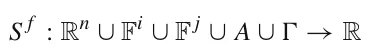
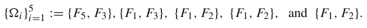
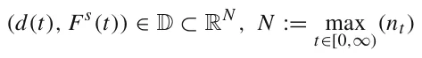
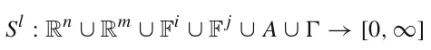
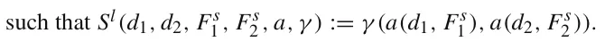
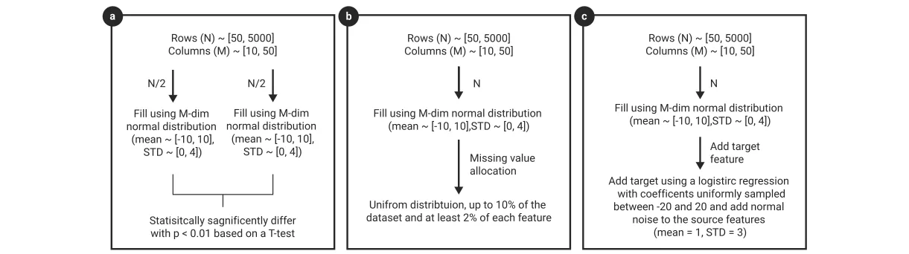
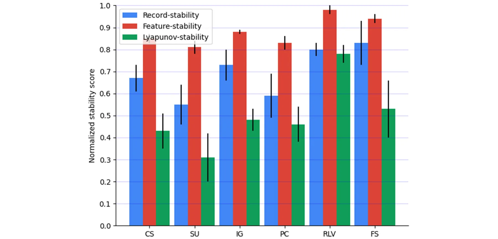
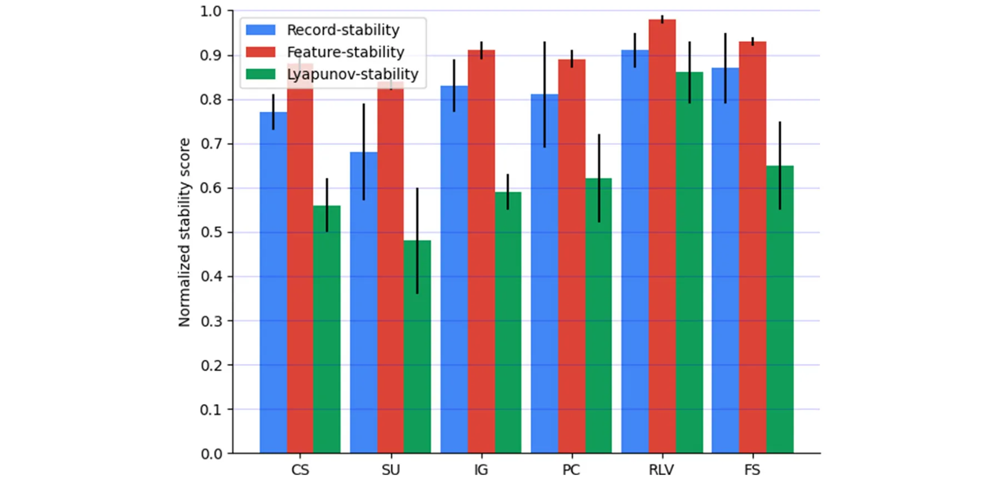
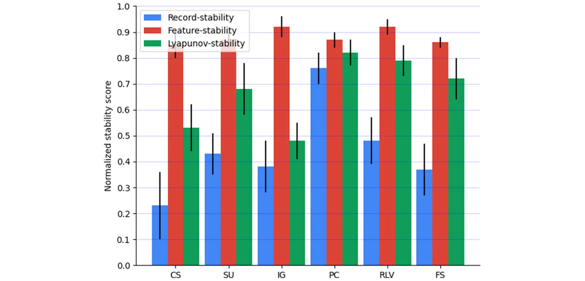
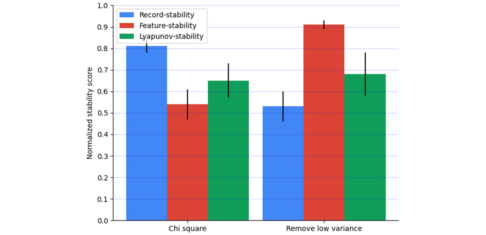

## 1 Introduction

A model’s predictive accuracy is often the primary criterion for evaluating machine learning (ML) algorithms [1, 2]. Recently, researchers have started to consider alternative measures to evaluate ML performance including computational complexity [3, 4], stability [5, 6], and explainability [7]. This paper focuses on how to quantify the *stability* of feature selection (FS) algorithms. In general, stability measures the amount of change in the output of a model as a function of changes in the inputs. For a data-driven model, an ML algorithm is said to be stable if it produces consistent predictions concerning small perturbations of training records.

As ML algorithms and datasets become progressively more complex, the result’s stability, or its ability to handle small changes in the distribution of the data, is becoming increasingly important. Consequently, the model’s stability, also referred to as ML robustness, is often a primary or secondary objective [8–12]. For example, the usage of ML models in clinical settings has become more common over the last few years [13]. These models are used to forecast the clinical consequences of cancer diseases [14–16], cardiovascular risk prediction [17], and classify mental health status [18]. These models are often developed on a relatively small amount of records [19] and therefore must demonstrate their generality to other real-world settings – which often does not occur in the model testing phase [20–22]. ML stability is also important within other settings such as within search engines [23, 24] and finance [25–27].

Increased model stability helps prevent overfitting by ensuring that the model is resilient to minor changes in the training dataset. To achieve this goal, multiple works have proposed methods to improve the model’s *record-stability* to make the model more resilient to changes in the underlining distribution of the data with the same features [28, 29]. One of these methods is feature selection (FS) which reduces the number of features in a system by finding features that are most connected to the target variable within a supervised ML task. FS was previously shown to improve learning model performance, especially when handling complex data inputs with high dimensionality [30–32]. The reduced number of inputs also facilitates better stability as the causal relationship between the system’s dependent and independent variables becomes less complex, commonly reducing the entropy in the data thus making the ML’s logic more understandable [33–35].

This modification is typically found by adding small amounts of noise into the data’s records by bootstrapping different random samples. The FS is then applied to all bootstraps and the level of similarity within the outputs quantifies that FS’s stability. This approach has shown significant success, and *record-stability* has been typically used to date to quantify FS stability.

In this work, we present two new definitions of models’ stability – *feature-stability* and *Lyapunov-stability*. In contrast to *record-stability*, *feature-stability* studies modifications to the dataset’s features (columns) rather than on the records (rows). The *Lyapunov-stability* includes both definitions, allowing for the change to occur on both the records (rows) and features (columns). Based on the *feature-stability* and *Lyapunov-stability* metrics we present, this work demonstrates four main contributions:

- *Significant Differences* exist between the *record-stability*, the *feature-stability*, and *Lyapunov stability* metrics. Each of these metrics is best suited for identifying problems with stability in different learning environment.
- The *Lyapunov-stability* metric is much more sensitive for concept drift in online learning models compared to the *record-stability* and the *feature-stability* metrics.
- The *feature-stability* metric is best suited for identifying issues with missing values in features. In contrast, *record-stability* and *Lyapunov-stability* are less impacted by missing values, making them less suited for addressing stability when many values of features are missing.
- The *record-stability* metric is most effective in identifying stable features within supervised FS algorithms. In contrast, the *feature-stability* metric is better suited for unsupervised FS algorithms. *Lyapunov-stability* is between these two metrics, as it incorporates elements of both the *record-stability* and *feature-stability*.

The paper is organized as follows. In Section 2, we motivate the usefulness of the stability measurement and a review of the FS stability definitions. In Section 3, we formally introduce our *feature-stability* and *Lyapunov-stability* FS stability definitions. In Section 4, we statistically show that the proposed stability definitions are different on many datasets (*n* = 90). In Section 5, we explore three properties of how datasets change and the ability of the proposed FS stability definitions to capture it using synthetic datasets. In Section 6, we discuss the usage of the proposed definitions and propose several cases in which they are useful.

## 2 Related work

Multiple definitions of stability have been proposed for data-driven tasks, each aiming to measure different aspects of the learning models’ resilience to changes in training data, task definition, and other properties [36–38]. Intuitively, an algorithm is considered *stable* if a small change to its input causes a limited change in its output. However, this definition is considered too generic for any applicative usage [39].

The most common stability definition is measuring the ability of the learning model to preserve similar results such as accuracy, explainability, and robustness if small changes in the records are introduced in either the training, testing, or production data [40, 41], which will be referred to as *record-stability*. In particular, one can measure the stability of FS algorithms according to the agreement of feature sets produced by the same algorithm when trained on different datasets [42]. Namely, in the context of FS algorithms, *record-stability* stands for all stability measurements associated with the changes in the obtained feature set after a change to the records in the dataset. Formally, a FS *record-stability* metric can be defined as follows:

**Definition 2.1** The *record-stability* of a feature selection algorithm is a metric function

*S*r : Rn ∪ Rm ∪ F ∪ *A* ∪ → R such that *S*r*(d*1*, d*2*, F*s*, a, γ )* → R, where *d*1 ⊂ Rn is the baseline dataset, *d*2 ⊂ Rm is the modified dataset, *F*s ∈ F is the source feature set, *a* ∈ *A* is a FS algorithm, and *γ* ∈ is a metric function *γ* : F × F → R such that *γ (a(d*1*, F*s*), a(d*2*, F*s*))* → R, where *a(d*1*, F*s*), a(d*2*, F*s*)* ⊂ *F*s.

For instance, given a dataset *(D)* with a set of features *(F*s*)*. a *record-stability* metric *s*r ∈ *S*r can be a function that computes the feature set obtained by the Top-*k* [43] features as ranked by the Chi square algorithm [44], *(a)*. Chi square’s stability can then be computed by comparing the resultant feature set on the given dataset *(a(d*1*, F*s*))* in comparison to the alternate feature set *(a(d*2*, F*s*))* that was obtained by randomly removing a portion of the records. A similarity metric, (*γ* , then quantifies the stability between the two obtained feature sets in the output of the *s*r metric.

Notably, the specific similarity metric between two sets of features is not trivial and multiple metrics have been proposed to tackle this challenge for different use cases. For instance, the Jaccard metric receives as its input two feature sets– *A* and *B*, and the similarity between them is defined as |*A*∩*B*|*/*|*A*∪*B*| [45]. Similarly, the Tanimoto metric also receives two feature sets *A* and *B*, but the similarity between them is defined as *(*|*A* ∩ *B*|*)/(*|*A* ∪ *B*|− |*A* ∩ *B*|*)* [46]. Other similarity metrics are proposed which require additional information about the feature sets, such as the Hamming distance that requires ranking [47] or the Pearson correlation that requires weights [48]. For instance, the Hamming distance gets two vectors of features *F*1 and *F*2 and defined as *H(F*1*, F*2*)* := *f* 1, f 2∈F1,F2*(*I *f*1≠ f2*)* such that Icond is a predict function that returns 1 is the condition *cond* is satisfied and 0 otherwise. The Pearson correlation gets two vectors of features with theirs weights *(F*1*, W* 1*)* and *(F*2*, W* 2*)* and defined as *P(F*1*, W* 1*, F*2*, W* 2*)* := *cov(W* 1*, W* 2*)/(σ*W 1 · *σ*W 2*)* where *cov(x, y)* is the covariance between a vector *x* and *y* and *σ*x is the standard deviation of *x*.

These metrics are depended on the filter FS method used to obtain the subset, ranking, or weight of the feature set. Multiple Filter FS algorithms exist. For instance, Remove Low Variance (RLV) [49] ranks the features according to their variance and removes features with variance lower than some predefined threshold. Chi square (CS) [50] is based on the Chi-Square test measuring the independence of two events. In particular, this determines the relationship between the independent feature and dependent (target) feature, aiming to select the features which are more dependent on the target feature. Symmetrical uncertainty (SU) [51] is adopted to measure the relevance between the feature and the class label in the target feature. The average normalized interaction gain of an independent feature *f* , every other feature, and the class label target feature is calculated to reflect the interaction of independent feature *f* with other features in the feature set. Based on the combination of symmetrical uncertainty and normalized interaction gain, less important features are removed iteratively [51]. Fisher’s score (FS) [52] selects each feature independently according to their scores under the Fisher criterion. Intuitively, The key idea of the Fisher score is to find a subset of features such that the distances between data points in different classes are as large as possible, while the distances between data points in the same class are as small as possible [53]. Information gain (IG) [54] is an entropy-based selection method, which involves the calculation from the output data grouped by an independent feature. The method ranks the contribution of each independent feature, removing low contributing features based on a predefined threshold.

Practically, there are three main implementations for how *record-stability* can be quantified [55]. The first implementation, *partial record-stability* divides the dataset into *k* ∈ N pairwise distinct subsets which are usually the same size. The stability measurement is the average similarity distance between all of the obtained feature sets relative to the other subsets. The second implementation, *increasing record-stability* divides the dataset *D* into *k* ∈ N subsets {*D*i}k i=1 such that k i=1*(D*i*)* = *D* and *D*i ⊂ *D j* ↔ *i < j* ∈[1*, . . . , k*]. The stability measurement is the average similarity distance between any two consecutive feature sets obtained from the FS algorithm and a subset (∀*i* ∈[1*, . . . k* − 1] : *(D*i*, D*i+1). The third implementation, *noisy record-stability*, introduces noise to the dataset which is either in the same distribution of the features or random distribution. Stability is then measured by quantifying the similarity between the noisy feature set and the original one without the introduction of the noise.

All three of these implementations are based on measuring the similarity of the different feature results. Kalusis et al. [56] suggested three ways to measure this similarity: Pearson correlation (for FS algorithms that provides weight), Spearman’s rank correlation (for FS algorithms that provide ranking), and the Tanimoto distance [46] for any FS algorithm. In addition, Kuncheva [57] proposed treating the FS stability metric as a sequential forward selection task and suggested a new measurement for the similarity between two feature sets that are monotonic, bounded, and punished for error oversize. While showing promising results, the method is limited to time-series data. Furthermore, Dernoncourt et al. [58] investigated T-score based feature selection approaches, especially for small sample data with high dimensionality which tends to be unstable. The authors developed a mathematical model for the stability measurement and later empirically validated it on artificial and real data. They have shown the sensitivity of the method for cases with the curse of dimensionality (i.e., the number of features is larger than the number of records) and when the number of features is large, making it less accurate for large datasets.

A large body of literature has focused on the advantages of having *record-stability*. For example, Khaire and Dhanalakshmi [39] show that stability indicates the reproducibility power of FS methods, proposing that high stability of the FS algorithm is equally important to its contribution to the classification accuracy when evaluating FS performance. Saeys et al. [59] showed that ensembles of FS techniques obtain more robust results when considering stability in the performance of classification tasks, especially for high-dimensional domains with small samples sizes. Yeom et al. [60] proposed to take into consideration the model’s stability during the testing phase to avoid overfitting. They explored the relationships between privacy and overfitting and how to improve privacy with more stable ML models in general and FS algorithms in particular.

Nogueira et al. [61] proposed five properties which they claim a good FS stability metric should contain: fully defined, strict monotonicity, bounded, obtain maximum stability if and only if the selection is deterministic, and correction for chance. In addition, the authors propose a novel stability metric that fulfills these conditions [61].

## 3 Feature and lyapunov stability metrics

Based on the *record-stability* metric definition, we propose two novel definitions for FS stability: *feature-stability* and *Lyapunov-stability*. The *feature-stability* metric is intuitively defined as the *record-stability* on the transposed dataset (e.g., the transpose of the matrix representing the dataset). Formally, a *feature-stability* metric can be defined as follows:

**Definition 3.1** The *feature-stability* of a feature selection algorithm is the metric function

such that *S* f *(d, F*s 1 *, F*s 2 *, a, γ )* → R, where *d* ⊂ Rn is the dataset, *F*s 1 and *F*s 2 are the source and modified source feature set, *a* ∈ *A* is a FS algorithm, and *γ* ∈ is a metric function *γ* : Fl × Fo → R such that *γ (a(d, F*s 1 *), a(d, F*s 2 *))* → R, where *a(d, F*s 1 *)* ⊂ Fl and *a(d, F*s 2 *)* ⊂ Fo such that Fl and Fo are the feature spaces obtained by applying *a* on Fs 1 and Fs 2, respectively.

For instance, given a dataset *(D)*, the *feature-stability* metric *s* f ∈ *S* f will calculate the stability of the FS algorithms constructed from the Top-*k* [43] features as ranked by the Chi square algorithm [44] *a*, such that *a* is computed for the full feature set of the dataset *F*s 1 and for the ranking obtained after removing a single feature from the dataset’s feature set *F*s 2 . This is a type of a *partial feature-stability*. The resulting value, *s* f = *γ (a(D, F*s 1 *), a(D, F*s 2 *))*, is computed with any of the similarity measures previously discussed such as the Jaccard similarity (*γ* ).

The *feature-stability* is best suited for univariate FS algorithms where there is a dependency with other features for the result, such as the Top-*k* method or when multivariate FS is used. For example, assume the Remove Low Variance (RLV) [49, 54] algorithm is considered. This FS univariate algorithm sorts features according to their variance without consideration of feature interdependence. In this example, we will assume that the Top-*K* features will be selected from the dataset shown in Table 1, when *k* = 2 as per RLV’s ranking. Given the *feature-stability*’s modification is the reduction of a single feature from the dataset, we obtain five feature sets

One can notice that 3 = 4 = 5 and that *Jaccard(* 1*,* 2*)* = *Jaccard(* 2*,* 3*)* = 0*.*5, showing the Top-*k* with the RLV algorithm is relatively stable for this example with a final average score of 0*.*8 which obtained by calculating the average Jaccard similarity between any two consecutive feature sets. Notably, as at least one of the features is removed to test for stability, a perfect value of one is not mathematically possible. Even if there is a feature set that is obtained all the time, in some configurations one of the features would be removed which will reduce the stability score of the algorithm. Therefore, in some configurations of the *feature-stability* the stability range is normalized to be [0*,* 1] in a post-hoc manner.

<figure class="table-figure" id="table-1">
<figcaption><strong>Table 1</strong> An example matrix for the FS stability definitions for an unsupervised dataset</figcaption>

<table><tr><th>F1</th><th>F2</th><th>F3</th><th>F4</th><th>F5</th></tr><tr><td>−1.51</td><td>−1.39</td><td>−0.47</td><td>0.96</td><td>−2.88</td></tr><tr><td>0.42</td><td>−0.72</td><td>0.49</td><td>0.1</td><td>0.77</td></tr><tr><td>0.09</td><td>1.72</td><td>−1.46</td><td>1.55</td><td>0.25</td></tr><tr><td>−0.54</td><td>0</td><td>−0.28</td><td>0.43</td><td>−0.97</td></tr><tr><td>1.38</td><td>−0.62</td><td>1.29</td><td>−0.44</td><td>2.63</td></tr><tr><td>0.29</td><td>0.41</td><td>1.17</td><td>0.09</td><td>0.52</td></tr><tr><td>0.75</td><td>1.43</td><td>0.73</td><td>0.98</td><td>1.58</td></tr><tr><td>0.87</td><td>1.11</td><td>0.91</td><td>1.69</td><td>1.60</td></tr><tr><td>−0.10</td><td>0.68</td><td>1.09</td><td>1.82</td><td>−0.23</td></tr><tr><td>0.73</td><td>2.11</td><td>1.19</td><td>1.24</td><td>1.37</td></tr></table>

The first five rows and four columns were obtained from a normal distribution with a mean and standard deviation of 0 and 1, respectively. For the same rows, the fifth column is obtained by multiplying the first column by two and adding Gaussian noise with a mean of 0 and a standard deviation of 0.1. The remaining five rows are obtained in the same way but with a normal distribution with a mean and standard deviation of 1 and 0.5, respectively

</figure>

The motivation for the *Lyapunov-stability* originates from treating the dataset as a *n*- dimensional point allocated in a *n*-dimensional distribution space. By adding noise to this point and measuring the performance of an algorithm on the data, given a similarity metric between feature sets, one can measure the amount of change introduced to the outcome feature set due to the changes introduced to the input. Inspired by *Lyapunov-stability* in dynamic systems which is represented using differential equations [62], we treat the FS algorithm as a dynamics system as follows: At time *t* = 0 the state of the system is defined to be *F*t*(*0*)* that obtained by *a(d(*0*), F*s*)*. At each point in time *t*, we add *α*t ≤ *α* new records to the dataset *d(t)* and *β*t ≤ *β* features to *F*s*(t)*. Assuming the FS algorithm *a* is autonomous (does not explicitly depend on *t*) dynamical system, the tuple

denotes the system state vector, D an open set containing the origin, and *a* : D → RN is a continuous vector field on D. In addition, we assume that *F*t*(*0*)* = *a(d(*0*), F*s*(*0*))* is an equilibrium state in the manner that *a* optimize some inner target function *g*. Formally, the *Lyapunov-stablity* metric takes the form:

**Definition 3.2** The *Lyapunov-stability* of a feature selection algorithm is a metric function:

Namely, the *Lyapunov-stability* of a dataset given a FS algorithm *(a)* and feature set similarity function *(γ* ) is the average change in the obtained feature sets due to the introduction of some modification to both the records and features space of the table. Thus, the *Lyapunov-stability* extends both the *record-stability* and *feature-stability* as one can use the definition of *Lyapunov-stability* and use the identity function for either the change in the records or features space to obtain the original definitions, respectively. The proposed definition for *Lyapunov-stability* is only inspired by the classical Lyapunov stability originally proposed for dynamic systems. Simply put, the Lyapunov stability has been proposed for ordinary differential equations that describe the change of a system’s state over time. Here, we adopted this approach by assuming that change in the data is occurring over time and therefore the state of the dataset (i.e., the dynamical system) is stable in a similar sense to the original Lyapunov stability. However, as far as we know, there is no mathematical isomorphism between the two definitions.

Following the sample example from Table 1, the *Lyapunov-stability* would obtain a lower score compared to the *feature-stability* due to the changes in the distribution between the first five records and the last five records. In particular, one can take an increasing size of sub-matrices, following the diagonal (starting from the top-left corner) to obtain one approximation for the *Lyapunov-stability*. This is a type of a *increasing Lyapunov-stability*. Hence, we obtain five sub-matrices sizes [*(*2*,* 1*), (*4*,* 2*), (*6*,* 3*), (*8*,* 4*), (*10*,* 5*)*] by increasing the sub-table by one feature at a time (and therefore two records). One can notice that the distribution of the data starts to change between the second and third subset due to the introduction of the sixth record which was obtained from another distribution compared to the first five records. Thus, the stability score of the *Lyapunov-stability* would be 0*.*5 which is lower compared to the *feature-stability* score (0*.*8) for the same dataset.

To provide more intuition for the Lyapunov-stability metric, let us consider the following example. During the COVID-19 pandemic, researchers discovered and gathered new information regarding risk factors, the number of ill, life-treating ill, recovered, and dead individuals [63]. As such, the change over the rows is intuitive as this indicates changes in the number of patients for which new information was available. In addition, during 2020 alone, in Israel, the definition of “life-treating illness” changed three times [64]. This change can be represented as a change in the feature space as the definition for different risk-factors and their consequences, was redefined over time. The advantage behind the Lyapunov definition is in its able to evaluate the stability of a given model in settings where both changes in the records of patient data (rows) and feature space (columns) exist.

## 4 Feature selection stability definitions’ uniqueness

**In this section, we present our study of the outcomes of record-, feature-, and Lyapunov-stability metrics on** *n* = 90 **real-world datasets, utilizing diverse filter feature selection algorithms. As we detail in this section, our results show that the proposed stability metrics are statistically significantly unique.** Specifically, we studied the outcomes of the record-, feature-, and Lyapunov- stability metrics on *n* = 90 datasets from Kaggle1. The datasets were manually picked to cover a wide range of topics while ensuring from the description of each dataset that the data originated from real-world gathering rather than being a synthetically generated one. The list of datasets is provided as a supplementary material For each dataset, we computed a 24-dimensional vector which contains the scores of all the combinations of stability metrics (data, feature, Lyapunov) with the filter FS algorithms: Chi square (CS) [44], Symmetrical uncertainty (SU) [51], Information gain (IG) [54], Pearson correlation (PC) [65], Spearman correlation (SC) [59], Remove low variance (RLV) [66], Missing value ration (MSR) [66], Fisher’s score (FS) [52]. The hyperparameters of each algorithms is obtained using a grid search [67] where the fitness function is the obtained model’s accuracy.

We used the Jaccard metric [68] to quantify stability by measuring the similarity between any two sets of features. The *record-stability* has been computed by dividing the dataset into *k*D = 10 increasing subsets (i.e., for each subsets *i < j* : *D*i ⊂ *D j*) such that the size of the *i*th subset is *i/k*D from the size of the entire dataset for *i* ∈[1*, . . . , k*D], implementing the *increasing record-stability* approach (see Section 2). For each pair of subsets (*D*i*, D*i+1), the Jaccard metric between the two feature sets is computed. The features set for each subset is obtained using an FS algorithm on the subset. The *feature-stability* metric is computed using the increasing approach as well, starting with a single feature and increasing until the last subset contains all the features of the dataset with a predefined step of size *k*F = 1. The *Lyapunov-stability* metric is computed in the same manner, with both the records and columns increasing, following the diagonal of the dataset’s representing matrix. As such, the *i*th subset (e.g., *D*i) is *i/k*L is formed from the size of the entire dataset, i.e., *i* ∈[1*, . . . , k*L], where *K*L equals to the number of features in the dataset. Importantly, except for the *Missing value ratio* FS algorithm, for all other FS algorithms, the missing values have been removed from the datasets.

Based on the obtained meta-table, we calculated a two-tail paired T-test between the record-, feature-, and Lyapunov- stability metrics with each one of the eight filter FS algorithms, as shown in Table 2. It is possible to see that the record- and Lyapunov- stability metrics are statistically different for 87.5% (seven out of eight FS algorithms), as shown in Table 2. Similarly, the feature- and Lyapunov- stability metrics are statistically different for 75% of the FS algorithms (six out of eight FS algorithms), and also the record- and feature-stability metrics are statistically different for 100% of the FS algorithms (eight out of eight FS algorithms). Therefore, it is safe to say that the three stability metrics are statistically different across datasets and filter FS algorithms.

There are three cases in which the results are not significant. First, the case of Chi square with the record- and Lyapunov- stability. This result obtained a p-value of 0*.*062 which is not considered significant but we believe a bit larger sample set would result in a statistically significant result. Second, the remove low variance with the feature- and Lyapunov- stability. Since most of the features in most the datasets had similar variance relative to their dataset, the changes in the features or features and records were not significant enough. Third, the missing value ratio with the feature- and Lyapunov- stability. Most of the datasets are without missing values. In the small portion which it does, most of the missing values can be found concentrated on just a few features. As such, the feature- and Lyapunov- stability metrics are similar and indeed did not obtain statistically significant different results. Overall, we statistically show that all three stability definitions are pairwise distinct

*p*DL *<* 0*.*005*, p*F L *<* 0*.*005*,* and *p*DF *<* 0*.*001*,* as presented in Table 2 a by computing a two-tailed pair T-test between any two stability metrics.

<figure class="table-figure" id="table-2">
<figcaption><strong>Table 2</strong> The P-values of paired two-tail T-tests between the record- (R), feature- (F), and Lyapunov- (L) stability, on the <em>n</em> = 90 datasets, divided into the eight filter FS algorithms</figcaption>

<table><tr><th>Feature selection algorithm</th><th>Stability metrics</th><th>P-value</th></tr><tr><td></td><td>R-F</td><td>p &lt; 0.05</td></tr><tr><td>Chi square</td><td>R-L</td><td>p = 0.062 &lt; 0.1∗</td></tr><tr><td></td><td>F-L</td><td>p &lt; 0.05</td></tr><tr><td></td><td>R-F</td><td>p &lt; 0.01</td></tr><tr><td>Symmetrical uncertainty</td><td>R-L</td><td>p &lt; 0.01</td></tr><tr><td></td><td>F-L</td><td>p &lt; 0.01</td></tr><tr><td></td><td>R-F</td><td>p &lt; 0.01</td></tr><tr><td>Information gain</td><td>R-L</td><td>p &lt; 0.05</td></tr><tr><td></td><td>F-L</td><td>p &lt; 0.05</td></tr><tr><td></td><td>R-F</td><td>p &lt; 0.0005</td></tr><tr><td>Pearson correlation</td><td>R-L</td><td>p &lt; 0.01</td></tr><tr><td></td><td>F-L</td><td>p &lt; 0.001</td></tr><tr><td></td><td>R-F</td><td>p &lt; 0.01</td></tr><tr><td>Spearman correlation</td><td>R-L</td><td>p &lt; 0.01</td></tr><tr><td></td><td>F-L</td><td>p &lt; 0.05</td></tr><tr><td></td><td>R-F</td><td>p &lt; 0.01</td></tr><tr><td>Remove low variance</td><td>R-L</td><td>p &lt; 0.05</td></tr><tr><td></td><td>F-L</td><td>p = 0.081 &lt; 0.1∗</td></tr><tr><td></td><td>R-F</td><td>p &lt; 0.05</td></tr><tr><td>Missing value ratio</td><td>R-L</td><td>p &lt; 0.01</td></tr><tr><td></td><td>F-L</td><td>p = 0.143 &lt; 0.2∗</td></tr><tr><td></td><td>R-F</td><td>p &lt; 0.01</td></tr><tr><td>Fisher correlation</td><td>R-L</td><td>p &lt; 0.05</td></tr><tr><td></td><td>F-L</td><td>p &lt; 0.05</td></tr></table>

(*) Not statistically significant difference

</figure>

## 5 Feature selection stability’s properties

In this section, we use synthetically generated datasets to explore three naturally occurring phenomena: concept drift, missing values, and supervised feature selection. For each property, a set of *n* = 1000 datasets is generated at random, differentiating by the three properties to be examined. Using the obtained set, we computed the record, feature, and Lyapunov stability of multiple FS algorithms. In addition, we conduct a meta-analysis across these properties showing no metric is superior over the others for all examined cases. Figure 1 presents a schematic view of the synthetic datasets generation process for the three experiments.

### 5.1 Concept drift sensitivity

*Concept drift* is a well known challenge in ML applications [69–71]. *Concept Drift* occurs as the target variable needing to be learned changes over time in unforeseen ways. A learning system is challenged when the system needs to learn this variable over time as the target variable is under constant flux. For example, drift will exist if the system’s goal is to learn consumers’ preferences while sellers’ preferences change. This phenomenon typically makes data-driven algorithms (such as ML) less accurate over time since the learned connection between the source and target variable changes. We measure two different ways of concept drift: shifted and moving. *Shifted concept drift* occurs when the distribution of the data is changed at a single point in time due to some event from one distribution *D*1 to another distribution *D*2 such that *D*1/ = *D*2. On the other hand, *moving concept drift* occurs when the distribution of the data changes over time between the original distribution *D*1 to another distribution *D*2 such that *D*1/ = *D*2.

<figure id="fig-1">

<figcaption><strong>Fig. 1</strong> A schematic view of the synthetic datasets generation process for the three experiments. Panel (a) stands for the concept drift case; panel (b) stands for the missing values case; and panel (c) stands for supervised feature selection case</figcaption>
</figure>

In order to evaluate the sensitivity of the proposed stability metrics to concept drift, we measure the record-, feature-, and Lyapunov- stability over the eight FS algorithms for 1000 artificial datasets. The datasets were generated as follows. A random number of records *(N)* and features *(M)* between 50 and 5000 and between 10 and 50 are chosen, respectively. Afterward, the first half of the records *(*[1*, N/*2]*)* are fulfilled according to a *M*-dimensional normal distribution such that the means and standard deviations of the data for each dimensional are chosen in random ranging from -10 to 10 and from 0 to 4, respectively. The second half of the records *(*[*N/*2 + 1*, N*]*)* is generated identically but the *M*-dimensional normal distribution is chosen such that the two sets would be statistically significant difference according to a two-tailed T-test with *p <* 0*.*01. Based on these datasets, we computed the record-, feature-, and Lyapunov- stability on each dataset and show the mean and standard division in Fig. 2.

In a similar manner, a random number of records *(N)* and features *(M)* between 50 and 5000 and between 10 and 50 are chosen, respectively. Afterward, two *M*-dimensional normal distribution that satisfies that for *N/*2 · *M* records each, the sets are statistically significant different according to a two-tailed T-test with *p <* 0*.*01, marked by D1 and D2, respectively. Each sample *i* ∈[1*, N*] is generated as a sample from the distribution i·D1+(N−i)·D2 . Again, *N* we computed the record-, feature-, and Lyapunov- stability on each dataset and show the mean and standard division are shown in Fig. 3.

From both Figs. 2 and 3, one can notice that the *Lyapunov-stability* metric obtains much lower scores compared to the *record-stability* and *feature-stability* metrics for all six FS algorithms. As such, the *Lyapunov-stability* metric is more sensitive to a shift in the distribution of the dataset associated with concept drift. Hence, a sudden reduction in the *Lyapunov-stability* metric’s value over time might be an indicator for concept drift. In this case, the higher sensitivity (i.e., less stability) is preferable as it means one can use the metric in order to identify concept drift.

<figure id="fig-2">

<figcaption><strong>Fig. 2</strong> Comparison between the record-, feature-, and Lyapunov- stability for the shifted concept drift datasets. Where CS, SU, IG, PC, RLV, and FS stands for Chi square, symmetrical uncertainty, information gain, Pearson correlation, remove low variance, and fisher score, respectively</figcaption>
</figure>

### 5.2 Missing values

Missing data is a significant challenge and is pervasive in Learning and prediction ML and statistical data analysis [72]. Missing data occurs in a wide array of application domains for several reasons. For example, missing data can occur when hardware is damaged such as when a physical sensor is damaged or from human factors such as when patients dropout of a clinical trial [72]. Several methods have been proposed to address this challenge [73–75].

<figure id="fig-3">

<figcaption><strong>Fig. 3</strong> Comparison between the record-, feature-, and Lyapunov- stability for the moving concept drift datasets. Where CS, SU, IG, PC, RLV, and FS stands for Chi square, symmetrical uncertainty, information gain, Pearson correlation, remove low variance, and fisher correlation, respectively</figcaption>
</figure>

In order to evaluate the sensitivity of the proposed stability metrics to missing values, we measure the record-, feature-, and Lyapunov- stability over the six FS algorithms for 1000 artificial datasets. The datasets were generated as follows. A random number of records *(N)* and features *(M)* between 50 and 5000 and between 10 and 50 are chosen, respectively. Afterward, the matrix is fulfilled according to a *M*-dimensional normal distribution such that the means and standard deviations of the data for each dimensional are chosen in random ranging from -10 to 10 and from 0 to 4, respectively. Afterward, in an uniformly distributed way, missing values are allocated such that no more than 10% and no less than 2% of each record and feature has missing values. Using these datasets, we computed the record-, feature-, and Lyapunov- stability on each dataset and show the mean and standard division in Fig. 4.

As can be seen from Fig. 4 the *feature-stability* metric obtains the highest scores across all six FS algorithms, which means it is more resilient to the lack of values in the dataset. Hence, one can measure the FS stability of datasets with missing values using the *feature-stability* and *record-stability* to obtain an upper and lower boundaries for the FS’s stability, respectively.

### 5.3 Supervised feature selection

Supervised FS algorithm are commonly used in a ML pipelines during the prepossessing phase [7]. These algorithms are known to improve model accuracy and explainability by selecting those features with strong connections between the source and target features [66].

<figure id="fig-4">

<figcaption><strong>Fig. 4</strong> Comparison between the record-, feature-, and Lyapunov- stability for the datasets with missing values. Where CS, SU, IG, PC, RLV, and FS stands for Chi square, symmetrical uncertainty, information gain, Pearson correlation, remove low variance, and fisher correlation, respectively</figcaption>
</figure>

For example, the Chi square (CS) and Information Gain (IG) FS algorithms are supervised that compare each source feature with the target feature. Other algorithms, such as the Remove low variance (RLV) FS algorithm, is unsupervised since it takes into consideration one source feature at a time.

We evaluate the sensitivity of the proposed stability metrics to datasets representing a classification or regression task where all features except one are the source features and the remaining feature is the target feature (which is the feature one is aiming to predict based on the source features). In practice, we measure the record-, feature-, and Lyapunov-stability over the Chi square [44] and Remove low variance [49] FS algorithms for 1000 artificial datasets. The datasets were generated as follows. A random number of records *(N)* and features *(M)* between 50 and 5000 and between 10 and 50 are chosen, respectively. Afterward, the target feature is fulfilled by sampling a uniform distribution between 1 and *λ* where *λ* ∈[2*,* 20] is chosen randomly. Following that, a vector of size *M* − 1 with values ranging between −10 and 10 is generated, operating as the coefficients of a multi-dimensional logistic regression. Using the generated logistic regression, the source features are fulfilled such that the accuracy of the model is 100% (using the Monte-Carlo method). In addition, Gaussian noise is introduced to the source features with a mean of 1 and a standard deviation of 3. Based on these datasets, we computed the record-, feature-, and Lyapunov- stability on each dataset and show the mean and standard division in Fig. 5.

As can be seen from Fig. 5, *record-stability* obtaining the best score for the supervised FS algorithm as already been shown in previous works [7, 8, 60]. On the other hand, for the unsupervised FS algorithm, the *feature-stability* obtain the highest score which indicates it more fitted for unsupervised tasks while the *record-stability* is more fitted for supervised tasks. In both cases, the *Lyapunov-stability* obtains a score between the other two stability matrices, representing a more generic stability metric.

<figure id="fig-5">

<figcaption><strong>Fig. 5</strong> Comparison between the record-, feature-, and Lyapunov- stability for the datasets with supervised (Chi square) and unsupervised (remove low variance) FS algorithms</figcaption>
</figure>

### 5.4 Meta-analysis

In order to explore the performance of the different stability definitions across the above four properties, we computed the mean ± standard deviation of each stability definition across the FE algorithms examined. The motivation behind this analysis is to present the performance of each stability definition in an FE algorithmic agnostic manner. Table 3 presents the results of this meta-analysis. One can notice that the *Lyapunov-stability* is the most sensitive to all properties as it obtains the lowest stability score, followed by the *record-stability*, leaving the *feature-Lyapunov* to last. That said, more sensitivity is not necessarily better as one can prefer a less sensitive stability metric for the missing values case. In such a scenario, the *feature-stability* would be preferable. To this end, for the concept drift cases, where more often than not, the user wishes to detect and handle concept drift as early as possible, being sensitive to it is better. As such, the Lyapunov stability outperforms the classical record stability. Unlike, in the case of the missing values, less sensitivity in the stability metric is often the desired property so feature stability outperforms the others.

For each property, we computed an Analysis of Variance (ANOVA) test with *p*-value of 0*.*01 set as statistically significant. For both the moving and shift concept drift cases, the three stability definitions are statistically significantly different. However, for the missing values case and supervised FE, the record- and Lyapunov- do not statistically differ from each other while both differ from the feature-stability. This outcome can be explained by the fact that in the explored datasets, the number of records is much larger than the number of features, so changes in these more dominant in the *Lyapunov-stability* computation that takes both into consideration.

## 6 Conclusions and future work

In the paper, we proposed two new definitions for FS stability metrics: the *feature-stability* and *Lyapunov-stability* metrics. These metrics complement the established *record-stability* metric. The *feature-stability* metric is “orthogonal” to the *record-stability* definition as it measures changes in the obtained feature set due to changes in the source feature set rather than changes to the records, as does the *record-stability* metric. The *Lyapunov-stability* is a combination of the *feature-stability* and *record-stability* by taking into consideration changes in both the records and features.

We show that the three stability matrices are statistically pairwise distinct on *n* = 90 real-world datasets. As such, these stability metrics capture different stability properties of the FS process, making them possibly useful in different scenarios. To demonstrate this point, we found three scenarios in which the results obtained from each of the stability metrics differ, illustrating scenarios in which one stability metric is superior to the others. We found that the *Lyapunov-stability* metric is better in identifying changes in both shifted and moving concept drift compared to the *feature-stability* and *record-stability*. We found that the *feature-stability* metric is better for identifying stability problems resulting from missing values relative to the *record-stability* and *Lyapunov-stability*. Moreover, we show that the *record-stability* metric is better for supervised FS algorithms while the *feature-stability* metric is better suited for unsupervised FS algorithms and that the *Lyapunov-stability* lies in between. These results show that no stability metric is best for all situations. Consequently, we encourage the reader to consider which stability metric is used based on the potential problem they hope to measure. This outcome is similar to other metric-related usages, in general, and in ML, in particular. For example, one can not claim that the mean absolute error (MAE) is better or worse than the mean squared error (MSE) since each one is better suited for a specific case compared to the other - similar to the case we present. To this end, the diversity of metrics allows users to find the one best suited for their task at hand.

<figure class="table-figure" id="table-3">
<figcaption><strong>Table 3</strong> A summary of the record-, feature-, and Lyapunov- stability definitions, presented as the average ± standard deviation score in terms of the concept drift sensitivity, missing values, and supervised FE</figcaption>

<table><tr><th>Property</th><th>Record</th><th>Feature</th><th>Lyapunov</th></tr><tr><td>Moving concept drift</td><td>0.708 ± 0.056</td><td>0.842 ± 0.039</td><td>0.488 ± 0.093</td></tr><tr><td>Shift concept drift</td><td>0.806 ± 0.060</td><td>0.891 ± 0.028</td><td>0.585 ± 0.067</td></tr><tr><td>Missing values</td><td>0.407 ± 0.065</td><td>0.882 ± 0.025</td><td>0.392 ± 0.120</td></tr><tr><td>Supervised</td><td>0.677 ± 0.134</td><td>0.721 ± 0.218</td><td>0.674 ± 0.031</td></tr></table>

</figure>

Several directions are possible for future work. While we demonstrated the differences between these three stability measures with 90 real-world datasets, the experiments with drift, missing values, and supervised and unsupervised FS stability differences were conducted with simulated data. We hope to verify these results in real-world data as well. A second possible direction is to repeat these experiments on non-numerical datasets as the artificial datasets were exclusively comprised of numerical data. Moreover, we hope to study further the connection between different stability measures and why each one is best suited for a different problem. For example, we are studying why *Lyapunov-stability* is best suited for measuring concept drift. Third, we focused on naturally occurring changes in the data over time, such as rows added to a dataset for the *data-stability*. However, synthetic modifications such as data perturbations play a central role in modern data-driven systems. Future work can further explore the proposed metrics in such a context. This study could help further generalize these results to predict additional problems that are best suited for each of the three stability measures we present. We believe this study will provide additional insights into how to best measure stability in different learning scenarios.

**Author Contributions** Conceptualization, methodology, formal analysis and investigation, Writing - original draft preparation, and Writing - review and editing: Teddy Lazebnik; Supervision and Writing - review and editing: Avi Rosenfeld.

**Funding** The authors did not receive support from any organization for the submitted work.

**Data transparency** All the data used in this research is provided as supplementary materials.

## Declarations

**Competing interests** The authors have no relevant financial or non-financial interests to disclose.

## Notes

1 https://www.kaggle.com/

## References

1. Ling, C.X., Huang, J., Zhang, H.: AUC: a better measure than accuracy in comparing learning algorithms. Adv. Artif. Intell. (2003)
2. Huang, J., Ling, C.X.: Using auc and accuracy in evaluating learning algorithms. Adv. Artif. Intell. 17(3), 299–310 (2005)
3. Al-Jarrah, O.Y., Yoo, P.D., Muhaidat, S., Karagiannidis, G.K., Taha, K.: Efficient machine learning for big data: a review. Big Data Res. 2(3), 87–93 (2015)
4. Jordan, M.I., Mitchell, T.M.: Machine learning: trends, perspectives, and prospects. Science 349(6245), 255–260 (2015)
5. Beriman, L.: Heuristics of instability and stabilization in model selection. Ann. Stat. 24, 2350–2383 (1996)
6. Bousquet, O., Elisseff, A.: Stability and generalization. J. Mach. Learn. Res. 2, 499–526 (2002)
7. Rosenfeld, A., Richardson, A.: Explainability in human-agent systems. Auton. Agents Multi-Agent Syst. 33(6), 673–705 (2019)
8. Ben-Hur, A., Elisseeff, I., Guyon, A.: A stability based method for discovering structure in clustered data. Pac. Symp. Biocomput. 1, 6–17 (2002)
9. Meinshausen, N., Buhlmann, P.: Stability selection. J. R. Stat. Soc. 72, 414–473 (2010)
10. Wang, J.: Consistent selection of the number of clusters via cross validation. Biometrika 72, 893–904 (2010)
11. Liu, K., Roeder, K., Wasserman, L.: Stability approach to regularization selection for high-dim graphical models. Adv. Neural Inf. Process. Syst. 23, (2010)
12. Stodden, V., Leisch, F., Peng, R.: Implementing reproducible research. CRC Press (2014)
13. Shah, P., Kendall, F., Khozin, S., Goosen, R., Hu, J., Laramie, J., Ringel, M., Schork, N.: Artificial intelligence and machine learning in clinical development: a transnational perspective. Npj Digit. Med. 69, 1–34 (2019)
14. Boyko, N., Sviridova, T., Shakhovska, N.: Use of machine learning in the forecast of clinical consequences of cancer diseases. 7th Mediterranean Conference on Embedded Computing (MECO), pp. 1–6 (2018)
15. Yaniv-Rosenfeld, A., Savchenko, E., Rosenfeld, A., Lazebnik, T.: Scheduling bcg and il-2 injections for bladder cancer immunotherapy treatment. Mathematics, 1–6 (2018)
16. Veturi, Y.A., Woof, W., Lazebnik, T., Moghul, I., Woodward-Court, P., Wagner, S.K., Cabral de Guimaraes, T.A., Daich Varela, M., Liefers, B., Patel, P.J., Beck, S., Webster, A.R., Mahroo, O., Keane, P.A., Michaelides, M., Balaskas, K., Pontikos, N.: Syntheye Investigating the impact of synthetic data on artificial intelligence-assisted gene diagnosis of inherited retinal disease. Ophthalmology Science 3(2), 100258 (2023)
17. Weng, S.F., Reps, J., Kai, J., Garibaldi, J.M., Qureshi, N.: Can machine-learning improve cardiovascular risk prediction using routine clinical data? PLOS ONE 12, e0174944 (2017)
18. Bonner, G.: Decision making for health care professionals: use of decision trees within the community mental health setting. J. Adv. Nursing 35, 349–356 (2001)
19. Flechet, M., Güiza, F., Schetz, M., Wouters, P., Vanhorebeek, I., Derese, I., Gunst, J., Spriet, I., Casaer, M., Van den Berghe, G., Meyfroidt, G.: Akipredictor, an online prognostic calculator for acute kidney injury in adult critically ill patients: development, validation and comparison to serum neutrophil gelatinase-associated lipocalin. J. Adv. Nursing 35, 349–356 (2001)
20. Shung, D.L., Au, B., Taylor, R.A., Tay, J.K., Laursen, S.B., Stanley, A.J., Dalton, H.R., Ngu, J., Schultz, M., Laine, L.: Validation of a machine learning model that outperforms clinical risk scoring systems for upper gastrointestinal bleeding. Gastroenterology 158, 160–167 (2020)
21. Shamout, F., Zhu, T., Clifton, D.A.: Machine learning for clinical outcome prediction. IEEE Rev. Biomed. Eng. 14, 116–126 (2020)
22. Lazebnik, T., Somech, A., Weinberg, A.I.: Substrat: a subset-based optimization strategy for faster automl. Proc. VLDB Endow. 16(4), 772–780 (2022)
23. Aztiria, A., Farhadi, G., Aghajan, H.: User Behavior Shift Detection in Intelligent Environments. Springer, (2012)
24. Gama, J., Zliobaite, I., Bifet, A., Pechenizkiy, M., Bouchachia, A.: A survey on concept drift adaptation. ACM Comput. Surv. (CSUR), 46, (2014)
25. Cavalcante, R.C., Oliveira, A.L.I.: An approach to handle concept drift in financial time series based on extreme learning machines and explicit drift detection. Int. Jt. Conf. Neural Netw. (IJCNN), 1–8 (2015)
26. Lazebnik, T., Fleischer, T., Yaniv-Rosenfeld, A.: Benchmarking biologically-inspired automatic machine learning for economic tasks. Sustainability 11232(14), (2023)
27. Shami, L., Lazebnik, T.: Implementing machine learning methods in estimating the size of the non-observed economy. Comput. Econ. (2023)
28. K. Chaudhuri and S. A. Vinterbo. A stability-based validation procedure for differentially private machine learning. Advances in Neural Information Processing Systems, 2013
29. Yokoyama, H.: Machine learning system architectural pattern for improving operational stability. IEEE Int. Conf. Softw. Architecture Comp. (2019)
30. Bolón-Canedo, V., Alonso-Betanzos, A.: Ensembles for feature selection: a review and future trends. Inf. Fusion 52, 1–12 (2019)
31. Guyon, I., Elisseeff, A.: An introduction to variable and feature selection. J. Mach. Learn. Res. 3(Mar), 1157–1182 (2003)
32. Liu, H., Motoda, H., Setiono, R., Zhao, Z.: Feature selection: an ever evolving frontier in data mining. In Feature selection in data mining, p 4–13. PMLR (2010)
33. Rosenfeld, A.: Better metrics for evaluating explainable artificial intelligence. In: AAMAS ’21: 20th International Conference on Autonomous Agents and Multiagent Systems, pp. 45–50. ACM (2021)
34. Bhatt, U., Xiang, A., Sharma, S., Weller, A., Taly, A., Jia, Y., Ghosh, J., Puri, R., Moura, J.M.F., Eckersley, P.: Explainable machine learning in deployment. In: Proceedings of the 2020 Conference on Fairness, Accountability, and Transparency, pp. 648–657 (2020)
35. Lazebnik, T., Bunimovich-Mendrazitsky, S., Rosenfeld, A.: An algorithm to optimize explainability using feature ensembles. Appl. Intell. (2024)
36. Sun, W.: Stability of machine learning algorithms. Purdue University, (2015)
37. Kenneth, O.S.: Learning concept drift with a committee of decision trees. Technical Report AI03-302, (2019)
38. Jain, A.K., Chandrasekaran, B.: Machine learning based concept drift detection for predictive maintenance. Comput. Ind. Eng. 137, 106031 (2019)
39. Khaire, U.M., Dhanalakshmi, R.: Stability of feature selection algorithm: a review. J. King Saud Univ. Comput. Inf. (2019)
40. Shah, R., Samworth, R.: Variable selection with error control: another look at stability selection. J. R. Stat. Soc. 75, 55–80 (2013)
41. Sun, W., Wang, J., Fang, Y.: Consistent selection of tuning parameters via variable selection stability. J. Mach. Learn. Res. 14, 3419–3440 (2013)
42. Han, Y.: Stable Feature Selection: Theory and Algorithms. PhD thesis, (2012)
43. Zhang, X., Fan, M., Wang, D., Zhou, P., Tao, D.: Top-k feature selection framework using robust 0-1 integer programming. IEEE Trans. Neural Netw. Learn. Syst. 32(7), 3005–3019 (2021)
44. Plackett, R.L.: Karl pearson and the chi-squared test. International Statistical Review/Revue Internationale de Statistique, pp. 59–72 (1983)
45. Chung, N.C., Miasojedow, B., Startek, M., Gambin, A.: Jaccard/tanimoto similarity test and estimation methods for biological presence-absence data. BMC Bioinform. 20, (2019)
46. Bajusz, D., Racz, A., Heberger, K.: Why is tanimoto index an appropriate choice for fingerprint-based similarity calculations? J. Cheminform. 20(7), (2015)
47. Bookstein, A., Kulyukin, V.A., Raita, T.: Generalized hamming distance. Inf. Retr. 5, 353–375 (2002)
48. Liu, Y., Mu, Y., Chen, K., Li, Y., Guo, J.: Daily activity feature selection in smart homes based on pearson correlation coefcient. Neural Process. Letters 51, 1771–1787 (2020)
49. Chandrashekar, G., Sahin, F.: A survey on feature selection methods. Comput. Electr. Eng. 40(1), 16–28 (2014)
50. Plackett, R.L.: Karl pearson and the chi-squared test. International Statistical Review/Revue Internationale de Statistique, 59–72 (1983)
51. Kanna, S.S., Ramaraj, N.: A novel hybrid feature selection via symmetrical uncertainty ranking based local memetic search algorithm. Knowl. Based Syst. 23(6), 580–585 (2010)
52. Chengzhang, L., Jiucheng, X.: Feature selection with the fisher score followed by the maximal clique centrality algorithm can accurately identify the hub genes of hepatocellular carcinoma. Sci. Rep. 9, 17283 (2019)
53. Gu, Q., Li, Z., Han, J.: Generalized fisher score for feature selection. In: Proceedings of the Twenty- Seventh Conference on Uncertainty in Artificial Intelligence, pp. 266–273. AUAI Press (2011)
54. Azhagusundari, B., Thanamani, A.S.: Feature selection based on information gain. Int. J. Innov. Res. Sci. Eng. Technol. 2(2), 18–21 (2013)
55. Bommert, A., Michel, L.: stabm: Stability measures for feature selection. J. Open Source Softw. 1, 1 (2021)
56. Kalousis, A., Prados, J., Hilario, M.: Evaluating feature-selection stability in next-generation proteomics. Knowl. Inf. Syst. 12(1), 95–116 (2007)
57. Kuncheva, L.I.: A stability index for feature selec. In: Proceedings of the 25th IASTED International Multi-Conference Artificial Intelligence and Applications (2007)
58. Dernoncourt, D., Hanczar, B., Zucker, J.-D.: Analysis of feature selection stability on high dimension and small sample data. Comput. Stat. Data Anal. 71, 681–693 (2013)
59. Saeys, Y., Abeel, T.: and Y, vol. de. Springer, Peer. Robust Feature Selection Using Ensemble Feature Selection Techniques (2008)
60. Yeom, S., Giacomelli, I., Fredrikson, M., Jha, S.: Privacy risk in machine learning: analyzing the connection to overfitting. In: 2018 IEEE 31st Computer Security Foundations Symposium (CSF), pp. 268–282. IEEE (2018)
61. Nogueira, S., Sechidis, K., Brown, G.: On the stability of feature selection algorithms. J. Mach. Learn. Res. 18, 1–54 (2018)
62. Lyapunov, A.M..: The general problem of the stability of motion. University Of Kharkov, (1966)
63. Shami, L., Lazebnik, T.: Economic aspects of the detection of new strains in a multi-strain epidemiological-mathematical model. Chaos, Solitons & Fractals 165, 112823 (2022)
64. Mayerhofer, T., Klein, S.J., Peer, A., Perschinka, F., Lehner, G.F., Hasslacher, J., Bellmann, R., Gasteiger, L., Mittermayr, S., Eschertzhuber, M., Mathis, S., Fiala, S., Fries, D., Kalenka, A., Foidl, E., Hasibeder, W., Helbok, R., Kirchmair, L., Stogermüller, C., Krismer, B., Heiner, T., Ladner, E., Thome, C., Preub- Hernandez, C., Mayr, A., Pechlaner, A., Potocnik, M., Reitter, M., Brunner, J., Zagitzer-Hofer, S., Ribitsch, A., Joannidis, M.: Changes in characteristics and outcomes of critically ill covid-19 patients in tyrol (Austria) over 1 year. Wiener klinische Wochenschrift 133, 1237–1247 (2021)
65. Liu, Y., Mu, Y., Chen, K., Li, Y., Guo, J.: Daily activity feature selection in smart homes based on pearson correlation coefcient. Neural Process. Letters 51, 1771–1787 (2020)
66. A. Jovie, K. Brkie, and N. Bogunovic. A review of feature selection methods with applications. IEEE, (2015). In: Russian
67. Liu, R., Liu, E., Yang, J., Li, M., Wang, F.: Optimizing the hyper-parameters for svm by combining evolution strategies with a grid search. Intell. Control Automation 344, (2006)
68. Rezatofighi, H., Tsoi, N., Gwak, J., Sadeghian, A., Reid, I., Savarese, S.: Generalized intersection over union: a metric and a loss for bounding box regression. In CVPR 2019 (2019)
69. Žliobaite, I., Pechenizkiy, M., Gama, J.: Big Data Analysis: New Algorithms for a New Society, vol. 16. Springer (2016)
70. Gama, J.M., Zliobaite, I., Bifet, A., Pechenizkiy, M., Bouchachia, A.: A survey on concept drift adaptation. ACM Comput. Surv. 46(4), 1–37 (2014)
71. Lu, J., Liu, A., Dong, F., Gu, F., Gama, J., Zhang, G.: Learning under concept drift: a review. IEEE Trans. Knowl. Data Eng. 31(12), 2346–2363 (2019)
72. Marlin, B.M.: Missing data problems in machine learning. pp. 1–6. University of Toronto, (2008)
73. Jerez, J.M., Molina, I., Garcia-Laencina, P.J., Alba, E., Ribelles, N., Martin, M., Franco, L.: Missing data imputation using statistical and machine learning methods in a real breast cancer problem. Artif. Intell. Med. 50(2), 105–115 (2010)
74. Ramoni, M., Sebastiani, P.: Robust learning with missing data. Mach. Learn. 45, 147–170 (2001)
75. Thomas, R.M., Bruin, W., Zhutovsky, P., van Wingen, G.: Chapter 14 - dealing with missing data, small sample sizes, and heterogeneity in machine learning studies of brain disorders. In: Andrea Mechelli and Sandra Vieira, editors, Machine Learning, pp. 249–266. Academic Press (2020)
