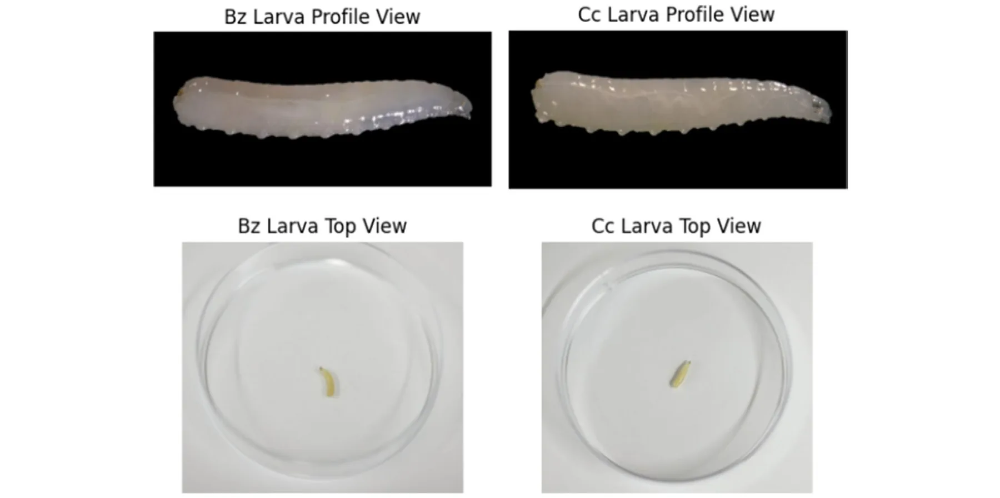
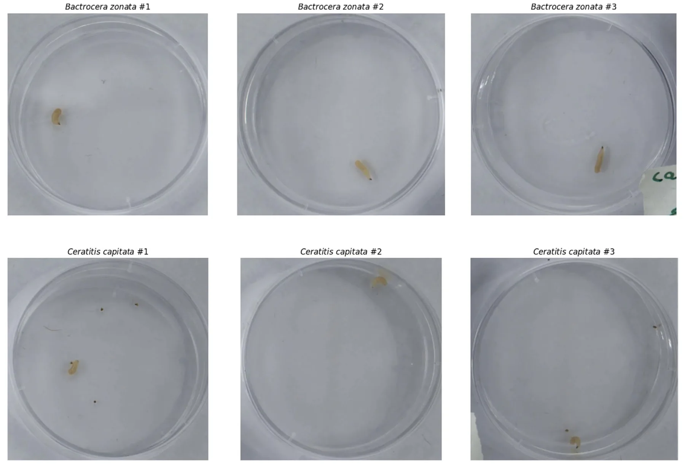
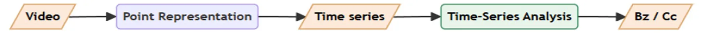
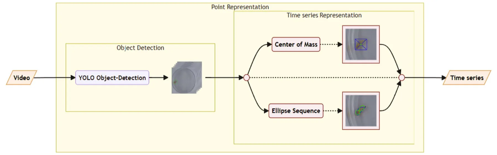
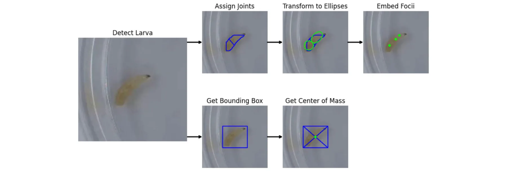
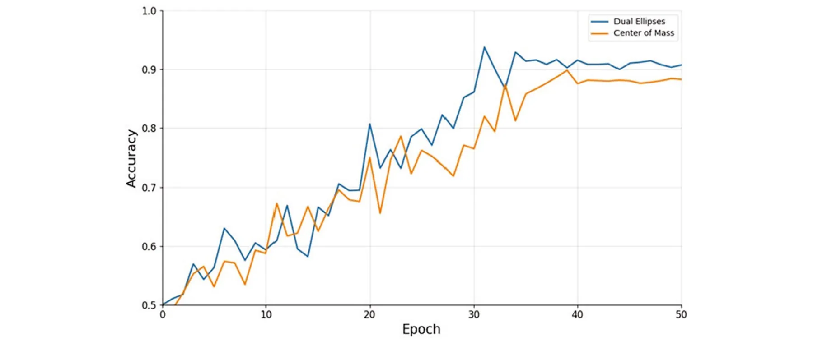

In the Middle East, the Mediterranean fruit fly, *Ceratitis capitata* (Cc) and the invasive fruit fly species, such as the peach fruit fly, *Bactrocera zonata* (Bz), pose significant economic and ecological threats (Blaser et al. 2018; White and Elson-Harris 1992). Both species are notorious members of the Tephritidae family. After mating, females oviposit hundreds of eggs within their host fruits during their lifetime. A few days later, the larvae hatch and make their way into the fruit pulp, where they develop. Upon reaching the third and final larval instar, the larvae exit the host fruit and pupate in the soil.

Both species are polyphagous pests with highly flexible physiology, enabling them to settle around the globe. However, the distribution of these two flies does not overlap. Cc invaded from East Africa and is present in over 80 countries situated between 40° parallel latitudes. Bz invaded more recently from East India and is present in fewer countries, mostly in Asia and North Africa. Yet, both are considered quarantine pests in several countries that are significant markets for global trade. These countries oblige the use of restrictive measures to assure safe trade with countries where these flies are present. The quarantine status of these two pests is not similar in every country. For example, in the European Union, which is the major market for Israeli export, Cc is endemic in several countries, whereas Bz, which is not present there, is considered a quarantine pest (Bragard et al. 2020). Therefore, discriminating measures among these two fruit flies' larvae in the exported fruits is critical for safe trade. The detection of a single fruit fly individual may result not only in the loss of the commodity but also in the imposition of sanctions for further trade.

Despite the urgency of effective detection, the larvae of te-phritid flies are very similar morphologically, as can be seen in Figure 1, creating difficulties in identification. The current primary detection methods are either incubation of the insect for adult emergence and identification or DNA-based identification. Both techniques offer high accuracy but at a significant cost-and time-consuming processes (Choudhary et al. 2018). Importantly, in order to achieve a true negative detection error that is acceptable, multiple tests are conducted, exploring different properties of the species, such as the morphological microscopic examination of the anterior spiracles and the mouth hooks (White and Elson-Harris 1992). These tests are usually conducted by domain experts and require expensive training and equipment, leaving the farmer, who is the first link in the chain and arguably the most economically sensitive one, without any reasonable way to detect which fruit fly species is present in their field.

To bridge this gap, we propose a novel non-invasive method based on computer vision that requires only a relatively simple and cheap setup to classify whether a fruit fly detected is either Cc or Bz. Our solution can be used by everyone in the export chain, from the farmer to plant protection officials, as it requires minimal equipment and skills while also being able to be included in the more robust detection process to further improve its performance. Namely, the proposed solution uses a 15-s video taken in a lab-like environment of a single larva within a petri dish. Thus, the novelty of this work is twofold: First, we generate lab-quality videos of the fruit files which can be used by others. Second, we developed an AI solution based on this data.

## 2 | Related Work

In this section, we provide an overview of fruit fly detection methods with their strengths and limitations, followed by an overview of recent developments in video-based and Artificial intelligence (AI) powered object(s) in image detection methods.

### 2.1 | Fruit Fly Detection

Morphological detection relies on the physical examination of the specimen. This can be done after incubation of the infected fruits and allowing the flies to reach adulthood, or by examination of the larvae under a microscope to identify species-specific characteristics (Pieterse et al. 2024). While the first method's cost is very low, the tradeoff is in the time needed to achieve the identification. This time, which might take days or longer, translates to a reduced shelf life of the shipment. The larval inspection method is less expensive than DNA-based detection but requires significant expertise in entomology. Additionally, it is shown to be highly prone to human error and may not be accurate for distinguishing highly similar larvae, such as Cc and Bz (Gazit and Akiva 2017).

DNA-based detection methods have been the preferred approach for identifying fruit fly species, in particular their larval stages due to their high accuracy. These methods include restriction fragment length polymorphism (RFLP) (Armstrong et al. 1997), high-resolution melt (HRM), real-time polymerase chain reaction (PCR) assays (Dhami and Kumarasinghe 2014) and PCR amplification using species-specific primers (Koohkanzade et al. 2018). Another approach is simply sequencing specific ‘bar-code’ regions, such as the mitochondrial cytochrome oxidase I gene (COI), and comparing the results to existing databases. While highly accurate, these methods are labour-intensive, requiring highly trained personnel, sophisticated equipment and the transportation of samples to a centralised location for testing.

<figure id="fig-1">

<figcaption><strong>FIGURE 1</strong> | <em>Bactrocera zonata</em> (Bz) and <em>Ceratitis capitata</em> (Cc) larvae comparison: The larvae are visually practically identical (Photos: Alex Protasov). [Colour figure can be viewed at wileyonlinelibrary.com]</figcaption>
</figure>

Recently, a CRISPR/Cas12a-based protocol has been developed to distinguish between *Ceratitis capitata* and *Bactrocera zonata* larvae. This method offers significant improvements in terms of cost, labour and time (Alon et al. 2023). However, some basic laboratory equipment and reagents are still necessary for its implementation.

### 2.2 | Video-Based and AI-Based Detection

Recent advancements in video technology have enabled the development of video-based detection methods for various tasks, such as anomaly detection (Nayak et al. 2021), object detection and tracking (Yang and Xiao 2020) and behaviour recognition (Yang and Xiao 2020). Specifically, video-based solutions have been adopted to detect different animal types such as dogs (Franzoni et al. 2024) and wolves (Gable et al. 2023), animal's emotional state (Martvel, Lazebnik, Feighelstein, Meller, et al. 2023) and animal personality traits (Farhat et al. 2023). Generally speaking, these methods involve recording the behaviour and movement patterns of animals and analysing the footage to identify species-specific characteristics and their alignment to a property in question (Shitrit 2022; Zuerl et al. 2022). Video-based detection offers the advantage of non-invasiveness and close-to-real-time monitoring while also requiring relatively cheap equipment, which makes it suitable for widespread adoption.

In the agricultural domain, AI methods have been extensively employed and tested on numerous crop insects. For instance, Gondal and Khan (2015) were among the first who pioneered early pest detection using image processing and computational intelligence, laying the groundwork for subsequent AI-based pest management systems, focusing their study on white fly detection. Thenmozhi and Reddy (2019) developed a deep convolutional neural network and transfer learning approach for crop pest classification, which has been recognised for its accuracy. Ayan et al. (2020) introduced a genetic algorithm-based weighted ensemble of deep convolutional neural networks, demonstrating significant improvements in pest detection performance. Wang et al. (2021) developed Sampling-balanced Region Proposal Network (S-RPN) for small crop pest detection, which provided high precision in identifying pests in various agricultural settings. Dong et al. (2022) created an automatic crop pest detection method using a multiscale feature fusion approach, highlighting the advancements in feature extraction techniques. Cheng et al. (2022) developed a lightweight crop pest detection method based on convolutional neural networks, emphasising efficiency and accuracy. These advancements demonstrate the potential of AI-driven approaches to revolutionise pest management by enabling accurate and efficient detection of various pest species. AI techniques such as deep learning and machine learning are utilised to analyse images and videos, identify pest species and predict infestation patterns, significantly improving the precision and timeliness of pest control measures.

Focusing on fruit fly video-based detection, (Ardekani et al. 2013) developed a three-dimensional fly behaviour monitoring system to study the social behaviour of a group of flies by acquiring the position of each individual over time, making the process automatic. Leonardo et al. (2018) analysed 14 deep learning and machine learning models for the detection of fruit fly species originating in Brazil, showing that AI-powered methods sometimes outperform human observers. Martins et al. (2019) developed a deep learning-based model for the identification of two species of fruit flies as part of a network of intelligent traps designed to monitor these insects' populations on a plantation. The authors used a convolutional neural network (Li et al. 2022) based model, which learns the characteristics of the insects based on their images made from the adhesive floor of the trap. Diller et al. (2023) explored various machine learning techniques for the automated detection and monitoring of fruit flies, emphasising the practical applications in agricultural settings. Notably, none of these studies focused on the maggot phase of the fruit fly life cycle.

## 3 | Methods and Materials

### 3.1 | Insects

*Ceratitis capitata* and *Bactrocera zonata* were obtained from laboratory colonies maintained in Bet Dagan, Israel, at the “Israel Cohen” Institute for Biological Control, Plants Board. These colonies were established from wild flies obtained from infested fruit and were kept in the laboratory at 24°C ± 1°C, 60% to 80% relative humidity, with a 14:10 h L:D photoperiod. Newly ovipos-ited eggs were placed on an artificial diet consisting of 26.8% wheat bran, 8.1% brewer yeast, 12.1% sucrose, 1.6% technical-grade HCl, 51% water and 0.4% fungicide (Gazit and Akiva 2017). Each colony was held in captivity for < 2 years.

### 3.2 | Camera Setup

The imaging setup comprised an Exo253CU3 camera (SVS-Vistek) equipped with an ML-U1615SR-18C, 16 mm lens (Moritex), housed inside a 60 cm3 lightbox with an integrated light source (GODOX). To reduce reflections on the Petri dish lids, a rectangular piece of cardboard was positioned between the light source and the camera. Video acquisition was facilitated by 2ndLook software (IO Industries). Individual larvae were positioned on each 55 mm empty Petri dish, with the camera positioned 25 cm above the dishes. Six dishes were concurrently recorded in each experimental batch.

### 3.3 | Dataset Overview

The initial dataset included video recordings of 27 Cc larvae and 27 Bz larvae (54 individuals in total). Each video captured six petri dishes, three of which were Bz and three others Cc (overall nine videos of average length 7 min). The videos were then cut into 280 15-s videos, each focusing on individual petri dishes, as demonstrated in Figure 2. Further subdivision of each clip into six smaller segments increased the granularity of the data, allowing for detailed, frame-by-frame analysis of individual larval movements. This division yielded a comprehensive set of 1686 videos, each providing a focused view of a single larva's behaviour. After excluding videos shorter than 15 s, 1632 videos remained, forming the final dataset for this study.

### 3.4 | The AI Pipeline

Figure 3 presents a high-level overview of the AI pipeline, which consists of two main modules, that we describe below: a point representation extraction module and a time series analysis module.

#### 3.4.1 | Point Representation Extraction Module

At this stage, videos of moving larvae are transformed into a point representation, which has a form of time series data obtained from a number of points on the larvae body. These points can be chosen in many different ways. In this study, we experimented with two different point representations: centre of mass (single point) and 2-ellipse foci (represented by three foci points), which are described below. The latter configuration was selected based on sensitivity analysis and the conceptual division of larvae into approximately two parts as follows.

**3.4.1.1** | **Object Detection (Larvae Contour Detection) Part.** The first part of this module uses a custom-trained YOLOv8 (Varghese and Sambath 2024) for tracking the larvae contours. The model was developed and evaluated using 2348 manually annotated images from our video dataset, with 1723 images used to fine-tune the YOLO model and 625 images used for validation of the model's improvement compared to the baseline YOLO model.

**3.4.1.2** | **Time Series Representation Part.** The second part proceeds with either Ellipse sequence detection or centre of mass detection as we explain below:

- Ellipse sequence detection (using the following steps):
- 1.Ellipse sequence transformation: Convert the tracked larval contours into a sequence of *n* ellipses (joints) for subsequent analysis. This step results in *k*-dimensional

<figure id="fig-2">

<figcaption><strong>FIGURE 2</strong> | Example frames from the preprocessed dataset. [Colour figure can be viewed at wileyonlinelibrary.com]</figcaption>
</figure>

<figure id="fig-3">

<figcaption><strong>FIGURE 3</strong> | Schematic representation of the analysis pipeline. [Colour figure can be viewed at wileyonlinelibrary.com]</figcaption>
</figure>

- representation, where *k* is computed as follows: {*k*}∞ n=1 = 5*n* and *k*0 = 2 elsewhere.
- 2.Dimensionality reduction: Reduce the *k*-dimensional representation of larval movement to an *m*-dimensional embedding, streamlining the data for analysis. *m* here is calculated as: *m* = 2 for *k* = 2 and *m* = 4*k* ∕5 for *k* ≥ 5 . Note that following the computation of *k* in the ellipse sequence transformation above, *k* is not defined for values 3, 4
- Centre of mass detection (using the following steps): 1.Bounding box extraction: Get the bounding box of the larva as the primary region of interest out of the contours.
- 2.Intersection computation: Calculate the diagonals of the bounding box and determine their intersection point, which serves as the centre of mass.

Figures 4 and 5 showcase the described pipeline.

#### 3.4.2 | Time Series Analysis Module

To classify larval movements as either *Bactrocera zonata* (Bz) or *Ceratitis capitata* (Cc), we use a time series analysis module based on a Clockwork Recurrent Neural Network (Koutník et al. 2014). This network processes sequential representations of larval motion over time.

The input to the network is a fixed-length sequence of shape (*T*, *m*), where *T* is the number of time steps and *m* is the number of features per time step. These features are extracted either from a sequence of ellipses fitted to larval contours or from centre-of-mass trajectories. Depending on the method, *m* is either 2 (for 2D coordinates) or 4*k*/5 (for the ellipse-based representation).

The Clockwork RNN is designed to capture both short-term and long-term movement patterns. It uses 128 hidden units, with different groups of neurons updating at different time intervals. This structure allows the network to efficiently model multi-scale temporal dependencies in the larval motion.

Following the recurrent layer, the output is passed through a fully connected layer with 64 ReLU-activated units. A dropout layer with a rate of 0.2 is applied to reduce overfitting. Finally, a single-neuron output layer with a sigmoid activation function produces a probability score for binary classification (Bz or Cc).

The model is trained using the binary cross-entropy loss function and optimised with the Adam optimiser (learning rate = 0.001).

<figure id="fig-4">

<figcaption><strong>FIGURE 4</strong> | Schematic representation of the Point Representation Module. [Colour figure can be viewed at wileyonlinelibrary.com]</figcaption>
</figure>

<figure id="fig-5">

<figcaption><strong>FIGURE 5</strong> | The point representation module: (1) detecting the larva within the image frame, (2) assigning joints to key points along the body of the detected larva, (3) transforming the detected joints to either two ellipses or a centre of mass, embedding focal points. [Colour figure can be viewed at wileyonlinelibrary.com]</figcaption>
</figure>

Figure 6 presents the learning curves for both dual ellipses and centre of mass approaches.

### 3.5 | The Experiments

We split the dataset into training, validation and test sets. Given the relatively small sample size, we adopted a stratified approach to ensure a balanced representation of both species (Bz and Cc) across splits. The dataset was divided as follows: training set (80%, 1306 videos), which was used to train the time series model, and the test set (20%, 327 videos), which was used to evaluate the obtained model's performance. To ensure the model generalised well to unseen data, we employed fivefold cross-validation during training (Rodriguez et al. 2010). This strategy helped mitigate the risk of overfitting and provided more robust performance metrics. The best-performing model on the validation set was then evaluated on the independent test set. Model performance was assessed using standard classification metrics, including accuracy, recall, precision and F1 score.

We compared two versions of the AI pipeline with two different point representations: centre of mass and 2-ellipse representation. These representations influence only the time series component in the pipeline.

## 4 | Results

We evaluated the performance of two classification approaches, Ellipse Sequences with length of 2 (Dual Ellipses) and Centre of Mass, in distinguishing between *Ceratitis capitata* and *Bactrocera zonata* larvae. Table 1 summarises the obtained results. The Dual Ellipses approach achieved an Accuracy of 0.904, demonstrating a strong overall classification capability. It exhibited a Sensitivity of 0.934, indicating high effectiveness in correctly identifying positive cases. The Specificity was 0.874, showing its ability to correctly exclude negative cases. Moreover, the approach attained a Precision of 0.881, highlighting its reliability in positive predictions, and an F1 Score of 0.907, balancing precision and recall. For the Centre of Mass approach, we obtained slightly lower performance, with an Accuracy of 0.871. It achieved a Sensitivity of 0.912, meaning it effectively identified positive cases, while its Specificity was 0.830, slightly lower than the Dual Ellipses method. The Precision was 0.843, indicating moderate reliability in positive predictions, and the F1 Score reached 0.876, confirming its balanced performance across precision and recall.

## 5 | Discussion

Accurate detection of larvae is essential to control the spread of invasive fruit fly species that threaten agricultural economies worldwide. Traditional identification techniques, such as DNA testing, are reliable but expensive and time-consuming, making them impractical for rapid field use. Morphological similarities among larvae further complicate identification, highlighting the need for efficient, scalable solutions. To this end, in this study, we leveraged an AI-powered computer vision classification model that uses short video segments (15 s long). Under controlled conditions with fixed cameras and consistent lighting, the model achieved 90% detection accuracy. While the approach by (Zheng et al. 2023) reports a higher 94% accuracy on multi-species insect classification, their task involves more visually distinct classes. In contrast, our study addresses a more subtle challenge: distinguishing between two nearly identical insect species based on motion patterns. That said, maintaining this accuracy in real-world environments remains challenging due to variable lighting, shifting camera angles and environmental noise.

<figure id="fig-6">

<figcaption><strong>FIGURE 6</strong> | Learning curves. [Colour figure can be viewed at wileyonlinelibrary.com]</figcaption>
</figure>

<figure class="table-figure" id="table-1">
<figcaption><strong>TABLE 1</strong> | Performance of the proposed method for both the Dual Ellipses and Centre of Mass approach.</figcaption>

<table><tr><th></th><th>Accuracy</th><th>Sensitivity</th><th>Specificity</th><th>Precision</th><th>F1 Score</th></tr><tr><td>Dual ellipses</td><td>0.904</td><td>0.934</td><td>0.874</td><td>0.881</td><td>0.907</td></tr><tr><td>Centre of mass</td><td>0.871</td><td>0.912</td><td>0.830</td><td>0.843</td><td>0.876</td></tr></table>

</figure>

Beyond the technological aspects, biological factors must be considered when implementing automated detection systems. Larval behaviour, such as movement patterns, body contractions and responses to environmental stimuli, can influence classification accuracy. To this end, our method can also be used as a practical tool to investigate these dynamics, allowing deeper investigation of these species.

The proposed study is not without limitations. First, in this study, we focused on third instar larvae, while detection across all developmental stages (1–3) is important. Future work should expand the training dataset to include 1st and 2nd instar larvae and aim to obtain a more robust solution. Second, although the model performs well in controlled settings, its current inference time limits its usability in the field. Enhancing pipeline efficiency is crucial for deployment on mobile devices, enabling on-site larval detection by farmers and plant protection personnel.

Taken jointly, the proposed method is intended to complement, not replace, traditional morphological and DNA-based methods while providing relatively good classification accuracy in a rapid, cost-effective manner. It broadens the detection toolkit available to pest management stakeholders, supporting integrated pest management programmes and helping to quickly identify the fruit fly pest and employ adequate control measures, potentially mitigating economic impacts. For example, plant protection officials at border controls may prevent a certain fruit shipment from entering the country, or a farmer may apply species-specific biocontrol measures such as methyl eugenol and the deployment of sterile males. Furthermore, the integration of AI-powered tools into pest surveillance workflows represents a step forward in bridging the gap between entomological expertise and real-time field applications, fostering improved agricultural biosecurity.

#### Author Contributions

**Eddie Kanevsky:** investigation, methodology, writing – original draft, writing – review and editing, software, validation, formal analysis.

**Teddy Lazebnik:** investigation, methodology, writing – original draft, writing – review and editing, software. **Roy Kaspi:** conceptualization, investigation, writing – original draft. **Yoav Gazit:** conceptualization, investigation, writing – original draft. **Eyal Halon:** conceptualization, investigation, writing – original draft. **Dror Fried:** conceptualization, investigation, writing – original draft, project administration. **Anna**

**Zamansky:** conceptualization, investigation, methodology, writing – original draft, writing – review and editing, software, supervision, resources. **Gur Pines:** conceptualization, investigation, writing – original draft.

#### Conflicts of Interest

The authors declare no conflicts of interest.

#### Data Availability Statement

The data that support the findings of this study are openly available in Zenodo at https://doi.org/10.5281/zenodo.15450098.

## References

- Alon, D. M., T. Partosh, D. Burstein, and G. Pines. 2023. “Rapid and Sensitive On-Site Genetic Diagnostics of Pest Fruit Flies Using CRISPR-Cas12a.” Pest Management Science 79, no. 1: 68–75. [doi:10.1002/ps.7173](https://doi.org/10.1002/ps.7173)
- Ardekani, R., A. Biyani, J. E. Dalton, et al. 2013. “Three-Dimensional Tracking and Behaviour Monitoring of Multiple Fruit Flies.” Journal of the Royal Society Interface 10, no. 78: 20120547. [doi:10.1098/rsif.2012.0547](https://doi.org/10.1098/rsif.2012.0547)
- Armstrong, K. F., C. M. Cameron, E. R. Frampton, and D. M. Suckling. 1997. “Aliens at the Border and Cadavers in the Field: A Molecular Technique for Species Identification.” Proceedings of the New Zealand Plant Protection Conference 50: 316–321. [doi:10.30843/nzpp.1997.50.11323](https://doi.org/10.30843/nzpp.1997.50.11323)
- Ayan, E., H. Erbay, and F. Varçın. 2020. “Crop Pest Classification With a Genetic Algorithm-Based Weighted Ensemble of Deep Convolutional Neural Networks.” Computers and Electronics in Agriculture 179: 105809. [doi:10.1016/j.compag.2020.105809](https://doi.org/10.1016/j.compag.2020.105809)
- Blaser, S., C. Heusser, H. Diem, et al. 2018. “Dispersal of Harmful Fruit Fly Pests by International Trade and a Loop-Mediated Isothermal Amplification Assay to Prevent Their Introduction.” Geospatial Health 13, no. 2. [doi:10.4081/gh.2018.726](https://doi.org/10.4081/gh.2018.726)
- Bragard, C., K. Dehnen-Schmutz, F. Di Serio, et al. 2020. “Pest Categorisation of Non-EU Tephritidae.” EFSA Journal 18, no. 1: e05931. [doi:10.2903/j.efsa.2020.5931](https://doi.org/10.2903/j.efsa.2020.5931)
- Cheng, Z., R. Huang, R. Qian, W. Dong, J. Zhu, and M. Liu. 2022. “A Lightweight Crop Pest Detection Method Based on Convolutional Neural Networks.” Applied Sciences 12, no. 15: 7378. [doi:10.3390/app12157378](https://doi.org/10.3390/app12157378)
- Choudhary, J. S., N. Naaz, M. Lemtur, et al. 2018. “Genetic Analysis of Bactrocera Zonata (Diptera: Tephritidae) Populations From India Based on Cox1 and Nad1 Gene Sequences.” Mitochondrial DNA Part A DNA Mapping, Sequencing, and Analysis 29, no. 5: 727–736. [doi:10.1080/24701394.2017.1350952](https://doi.org/10.1080/24701394.2017.1350952)
- Dhami, M. K., and L. Kumarasinghe. 2014. “A HRM Real-Time PCR Assay for Rapid and Specific Identification of the Emerging Pest Spotted-Wing Drosophila (Drosophila suzukii).” PLoS One 9, no. 6: e98934. [doi:10.1371/journal.pone.0098934](https://doi.org/10.1371/journal.pone.0098934)
- Diller, Y., A. Shamsian, B. Shaked, et al. 2023. “A Real-Time Remote Surveillance System for Fruit Flies of Economic Importance: Sensitivity and Image Analysis.” Journal of Pest Science 96, no. 2: 611–622. [doi:10.1007/s10340-022-01528-x](https://doi.org/10.1007/s10340-022-01528-x)
- Dong, S., J. Du, L. Jiao, et al. 2022. “Automatic Crop Pest Detection Oriented Multiscale Feature Fusion Approach.” Insects 13, no. 6: 554. [doi:10.3390/insects13060554](https://doi.org/10.3390/insects13060554)
- Farhat, N., T. Lazebnik, J. Monteny, et al. 2023. “Digitally-Enhanced Dog Behavioral Testing.” Scientific Reports 13, no. 1: 21252. [doi:10.1038/s41598-023-48423-8](https://doi.org/10.1038/s41598-023-48423-8)
- Franzoni, V., G. Biondi, and A. Milani. 2024. “Advanced Techniques for Automated Emotion Recognition in Dogs From Video Data Through Deep Learning.” Neural Computing and Applications 36, no. 28: 17669– 17688. [doi:10.1007/s00521-024-10042-3](https://doi.org/10.1007/s00521-024-10042-3)
- Gable, T. D., S. M. Johnson-Bice, A. T. Homkes, and J. K. Bump. 2023. “Video Observations of Wolves Hunting Ungulates on Linear Features.” Food Webs 36: e00297. [doi:10.1016/j.fooweb.2023.e00297](https://doi.org/10.1016/j.fooweb.2023.e00297)
- Gazit, Y., and R. Akiva. 2017. “Toxicity of Malathion and Spinosad to Bactrocera Zonata and Ceratitis Capitata (Diptera: Tephritidae).” Florida Entomologist 100: 385–389.
- Gondal, D., and Y. N. Khan. 2015. “Early Pest Detection From Crop Using Image Processing and Computational Intelligence.” FAST-NU Research Journal 1.
- Koohkanzade, M., M. Zakiaghl, M. K. Dhami, L. Fekrat, and H. Sadeghi Namaghi. 2018. “Rapid Identification of Bactrocera Zonata (Dip.: Tephritidae) Using TaqMan Real-Time PCR Assay.” PLoS One 13, no. 10: e0205136. [doi:10.1371/journal.pone.0205136](https://doi.org/10.1371/journal.pone.0205136)
- Koutník, J., K. Greff, F. Gomez, and J. Schmidhuber. 2014. “A Clockwork RNN.” Leonardo, M. M., T. J. Carvalho, E. Rezende, R. Zucchi, and F. A. Faria. 2018. “Deep Feature-Based Classifiers for Fruit Fly Identification (Diptera: Tephritidae).” SIBGRAPI Conference on Graphics, Patterns and Images (SIBGRAPI). IEEE. pp. 41–47 in 2018 31st.
- Li, Z., F. Liu, W. Yang, S. Peng, and J. Zhou. 2022. “A Survey of Convolutional Neural Networks: Analysis, Applications, and Prospects.” IEEE Transactions on Neural Networks and Learning Systems 33, no. 12: 6999–7019. [doi:10.1109/TNNLS.2021.3084827](https://doi.org/10.1109/TNNLS.2021.3084827)
- Martins, V. A. M., L. C. Freitas, M. S. de Aguiar, L. B. de Brisolara, and P. R. Ferreira. 2019. “Deep Learning Applied to the Identification of Fruit Fly in Intelligent Traps.” In 2019 IX Brazilian Symposium on Computing Systems Engineering (SBESC), 1–8. IEEE.
- Martvel, G., T. Lazebnik, M. Feighelstein, et al. 2023. “Automated Landmark-Based Cat Facial Analysis and Its Applications.” Frontiers in veterinary science, 11, 1442634.
- Nayak, R., U. C. Pati, and S. K. Das. 2021. “A Comprehensive Review on Deep Learning-Based Methods for Video Anomaly Detection.” Image and Vision Computing 106: 104078. [doi:10.1016/j.imavis.2020.104078](https://doi.org/10.1016/j.imavis.2020.104078)
- Pieterse, W., M. De Meyer, M. Virgillio, and P. Addison. 2024. “Development of a Multi-Entry Identification Key for Economically Important Fruit Fly Larvae (Diptera, Tephritidae, Dacinae).” ZooKeys 1197: 127–136. [doi:10.3897/zookeys.1197.116887](https://doi.org/10.3897/zookeys.1197.116887)
- Rodriguez, J. D., A. Perez, and J. A. Lozano. 2010. “Sensitivity Analysis of K-Fold Cross Validation in Prediction Error Estimation.” IEEE Transactions on Pattern Analysis and Machine Intelligence 32, no. 3: 569–575. [doi:10.1109/TPAMI.2009.187](https://doi.org/10.1109/TPAMI.2009.187)
- Shitrit, T. 2022. “Proceedings of the Eight International Conference on Animal-Computer Interaction, ACI'21.” In Feature Learning in Video-Based Analysis of Animal Emotional States, 1–4. Association for Computing Machinery.
- Thenmozhi, K., and U. S. Reddy. 2019. “Crop Pest Classification Based on Deep Convolutional Neural Network and Transfer Learning.” Computers and Electronics in Agriculture 164: 104906.
- Varghese, R., and M. Sambath. 2024. “YOLOv8: A Novel Object Detection Algorithm With Enhanced Performance and Robustness.” Pp. 1–6 in 2024 International Conference on Advances in Data Engineering and Intelligent Computing Systems (ADICS).
- Wang, R., L. Jiao, C. Xie, P. Chen, J. Du, and R. Li. 2021. “S-RPN: Sampling-Balanced Region Proposal Network for Small Crop Pest Detection.” Computers and Electronics in Agriculture 187: 106290. [doi:10.1016/j.compag.2021.106290](https://doi.org/10.1016/j.compag.2021.106290)
- White, I. M., and M. M. Elson-Harris. 1992. Fruit Flies of Economic Significance: Their Identification and Bionomics. CAB International.
- Yang, Q., and D. Xiao. 2020. “A Review of Video-Based Pig Behavior Recognition.” Applied Animal Behaviour Science 233: 105146. [doi:10.1016/j.applanim.2020.105146](https://doi.org/10.1016/j.applanim.2020.105146)
- Zheng, T., X. Yang, J. Lv, M. Li, S. Wang, and W. Li. 2023. “An Efficient Mobile Model for Insect Image Classification in the Field Pest Management.” Engineering Science and Technology, an International Journal 39: 101335. [doi:10.1016/j.jestch.2023.101335](https://doi.org/10.1016/j.jestch.2023.101335)
- Zuerl, M., P. Stoll, I. Brehm, et al. 2022. “Automated Video-Based Analysis Framework for Behavior Monitoring of Individual Animals in Zoos Using Deep Learning-A Study on Polar Bears.” Animals 12, no. 6: 692. [doi:10.3390/ani12060692](https://doi.org/10.3390/ani12060692)
