## 1. Introduction and Related Work

A large group of epidemiological models are extensions of the Susceptible-Infected- Recovered (SIR) model [1]. These models were used for both prediction of the pandemic spread and to find optimal intervention policies for multiple types of diseases, such as polio [2], COVID-19 [3], ebola [4], and influenza [5]. These models use a wide range of analyses and extensions for the SIR model to properly represent the epidemiological and biological properties unique to each disease. One can use these models to obtain multiple intervention policies and the properties of the pandemic dynamics [3], for example, to predict the required number of intensive care units (ICU) to treat all severely infected individuals [6], in order to estimate the influence of the pandemic on the economy [3,7]. Wang et al. [8] provided a review of multiple intervention policies and modeling approaches for the pandemic spread, showing the advantage of the stochastic approach for SIR-type models as compared to deterministic models in representing real-world dynamics.

However, as models become large, it becomes complicated to numerically solve them and to obtain the model analytical properties. A specific property of interest is asymptotic stable equilibria states [9]. The way of obtaining these steps is significantly dependent on the system and its representation. For example, one can obtain the asymptotic stable equilibria states of an ordinary differential equation (ODE) system numerically using a proportional-derivative controller [9]. On the other hand, one may use analytical methods, which first obtain the equilibria states by setting the gradient of the system’s state to zero and then solve them to find the system’s state. In order to find the stability properties of such equilibria, one may use several methods, such as adding errors to the equilibria to show if this either decreases or increases and under which conditions [10]. Another option is to show that under given conditions the eigenvalues of the Jacobin matrix in the equilibria states are negative [2]. An additional common option is using the Lyapunov stability theorem [11–14]. While these methods are useful, they require some level of expertise to understand how to configure a specific dynamic system for each method. Furthermore, these methods first require one to find the equilibria states of the model, which may be a time- and resource-consuming task in itself. Therefore, the analytical analysis of large-scale systems a complex task remains challenging.

One method shown to be useful in modeling dynamics in epidemics is the Markov chain method [15,16]. In the context of epidemics, the Markov chain method represents the dynamics, that is, the rapid spread of the disease in the population, using a transmission matrix [15].

Since the pandemic spread is subject to multiple complex factors whose nature is uncertain [16], and these factors change based on the current state of the disease spread, the Markov chain method is a natural approach to use in order to model such dynamics [17–19]. It was shown that the Markov chain method approximates the deterministic SIR model very well [20,21]. In addition, using the Markov chain method it is possible to obtain multiple analytical properties such as equilibria states and asymptotic states [22].

We propose a novel method to obtain all asymptotic stable equilibria states of an extended SIR for three age groups and for five epidemiological states, which we develop to describe long-term immunity memory in the airborne infection pandemic model [3]. Our method approximates the continuous extended SIR model using a discrete, stochastic, Markov chain representation. The paper is organized as follows. First, we introduce an extended SIR model, consisting of 15 ODEs. Second, we present the asymptotic equilibrium state of the proposed model. Third, we compare the proposed method with a classical method. Finally, we discuss the main advantages and limitations of the proposed method.

## 2. Model Definition

We describe an extended SIR epidemiological model proposed by us in [23], with the addition of the new age group (elderly) and dividing the infection state into asymptomatic and symptomatic subpopulations. A full description of the proposed model is as follows: The model considers a constant population with a fixed number of individuals *N*. Each individual belongs to one of the five subpopulations: susceptible (*S*), infected asymptomatic (*I*a), infected symptomatic (*I*s), recovered (*R*), and dead (*D*), such that *N* = *S* + *I*s + *I*a + *R* + *D*, such that each subpopulation is non-negative. When an individual in the susceptible subpopulation (*S*) is exposed to the infection, they are transformed to either the asymptomatic or symptomatic infected subpopulation (*I*a, *I*s) in rates *β*a, *β*s. Individuals in the symptomatic infected subpopulation (*I*s) stay in this subpopulation on average *d*s I→R days, after which they are transformed to either the recovered (*R*) or dead (*D*) subpopulation. Therefore, in each time unit, some portion of infected individuals recover while others die or remain seriously ill. Individuals in the asymptomatic infected subpopulation (*I*a) stay in this subpopulation on average *d*a I→R days, after which they are transformed to the recovered subpopulation (*R*). Thus, our extended SIR model that consists of Susceptible, Infected-Asymptomatic, Infected-Symptomatic, Recovered and Deceased subpopulations is called SIIRD. A schematic view of the transition of an individual in the population between the model’s states is shown in Figure 1.

The population is divided into three classes based on age: children, adults, and elderly because these subpopulations experience diseases in varying degrees of severity and have different infection probabilities. Individuals below age *A*1 are associated with the “children” age class, while individuals below age *A*2 are associated with the “adult” age class and the complementary subpopulation are associated with the “elderly” age class. The specific threshold ages (*A*1, *A*2) may differ in different locations but the main goal is to divide the population into three representative age classes. Since it takes *A*1 years from birth to move from a child to an adult age subpopulation and *A*2 *− A*1 from an adult to the elderly subpopulation, the conversion rate is set as *α*1 := 1/*A*1 and *α*2 := 1/(*A*2 *− A*1). In addition, children are born and the elderly die at a rate unrelated to the pandemic *λ*. We assume that different age groups spend most of their time in separation from each other, which results in a relatively small rate of infected individuals infecting a susceptible individual from different age groups. Therefore, we neglect these dynamics by setting these to zero. By expanding the designation to three age classes, we let *S*c, *I*a c , *I*s c, *R*c, *D*c, *S*a, *I*a a, *I*s a, *R*a, *D*a, and *S*e, *I*a e , *I*s e, *R*e, *D*e to represent the susceptible, asymptomatic infected, symptomatic infected, recovered„ and dead subpopulations for children, adults, and the elderly, respectively, such that

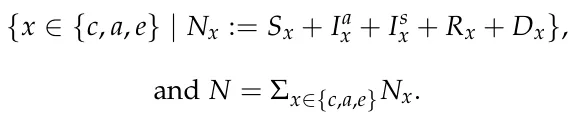

In addition, we mark *n* = 15 to be the number of the subpopulation in the model. Afterward, in order to obtain the distribution of the subpopulations sizes in the whole population, we divide each subpopulation by the overall size of the population to obtain

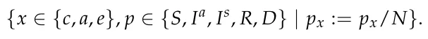

Equations (1)–(15) describe the epidemic’s dynamics. In Equation (1), dSc(t) is the dynamic amount of susceptible individual children over *dt* time. It is affected by the following four terms. First, at a rate of *β*cs, each symptomatic infected child infects susceptible children. Second, at a rate of *β*ca, each asymptomatic infected child infects the susceptible children. Third, children grow and pass from the children’s age class to the adult’s age class with a transition rate of *α*1, and are removed from the children’s age class. Finally, at a rate of *λ*, the children born and the elderly die, which is not related to the pandemic.

<figure id="fig-1">
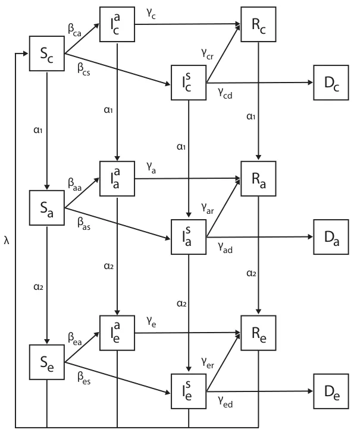
<figcaption><strong>Figure 1.</strong> Schematic view of the three age group SIIRD model with transition between disease stages, divided by age groups. Each node is an epidemiological age state in the form of <em>X</em>y, where <em>X ∈</em> [<em>S</em>, <em>I</em>a, <em>I</em>s, <em>R</em>, <em>D</em>] is the epidemiological state and <em>y ∈</em> [<em>c</em>, <em>a</em>, <em>e</em>] is the age group. The edges are the possible transformation, and the value next to them indicates the rate of the population that moves from the source node to the target node. A detailed description of the dynamics is presented in Equations (1)–(15).</figcaption>
</figure>

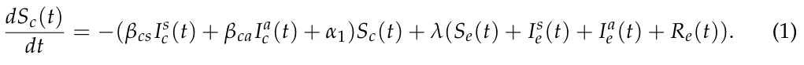

In Equation (2), dIsc(t) is the dynamic amount of symptomatic infected individual *dt* children over time. It is affected by the following four terms. First, at a rate of *β*cs, each symptomatic infected child infects the susceptible children. Second, individuals recover from the disease at a rate of *γ*cr. Third, individuals die from the disease at a rate of *γ*cd. Finally, children grow and pass from the children’s age class to the adult’s age class at a transition rate of *α*1, and are removed from the adult’s age class.

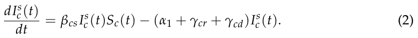

In Equation (3), dIac (t) is the dynamic amount of asymptomatic infected individual *dt* children over time. It is affected by the following three terms. First, at a rate of *β*ca, each asymptomatic infected child infects the susceptible children. Second, individuals recover from the disease at a rate of *γ*cr. Finally, children grow and pass from the children’s age class to the adult’s age class at a transition rate of *α*1, and are removed from the adult’s age class.

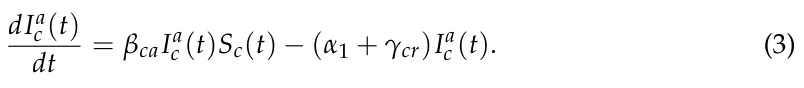

In Equation (4), dRc(t) is the dynamic amount of recovered individual children over *dt* time. It is affected by the following two terms. First, at each point, a portion of the symptomatic and asymptomatic infected children recover at a rate of *γ*cr. Second, children grow from birth and pass from the children’s age class to the adult age class at a transition rate of *α*1, and are removed from the children’s age class.

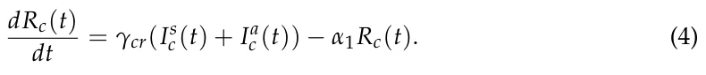

In Equation (5), dDc(t) is the dynamic amount of dead individual children over time. *dt* It is affected by the symptomatic infected children that die at a rate of *γ*cd.

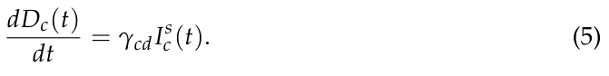

In Equation (6), dSa(t) is the dynamic amount of susceptible adult individuals over *dt* time. It is affected by the following four terms. First, children grow and pass from the children’s age class to the adult’s age class at a transition rate of *α*1, and are added to the adult age class. Second, adults grow and pass from the adults’ age class to the elderly age class at a transition rate of *α*2, and are removed from the adult’s age class. Third, at a rate of *β*as, each symptomatic infected adult infects susceptible adults. Finally, at a rate of *β*aa, each asymptomatic infected adult infects susceptible adults.

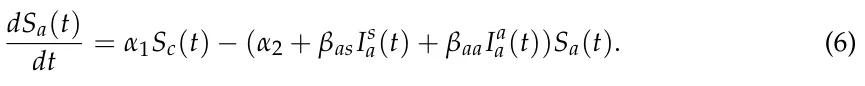

In Equation (7), dIsa(t) is the dynamic amount of symptomatic infected individual *dt* adults over time. It is affected by the following five terms. First, children grow and pass from the children’s age class to the adult’s age class at a transition rate of *α*1, and are added to the adult age class. Second, adults grow and pass from the adults’ age class to the elderly age class at a transition rate of *α*2, and are removed from the adult’s age class. Third, at a rate of *β*as, each symptomatic infected adult infects susceptible adults. Forth, individuals recover from the disease at a rate of *γ*cr. Finally, individuals die from the disease at a rate of *γ*ad.

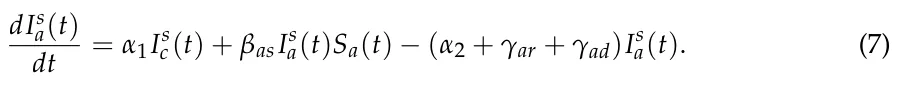

In Equation (8), dIaa(t) is the dynamic amount of asymptomatic infected individual *dt* adults over time. It is affected by the following four terms. First, at a rate of *β*aa, each asymptomatic infected adult infects susceptible adults. Second, individuals recover from the disease at a rate of *γ*ar. Third, children grow and pass from the children’s age class to the adult’s age class at a transition rate of *α*1, and are removed from the adult’s age class. Finally, adults grow and pass from the adults’ age class to the elderly age class at a transition rate of *α*2, and are removed from the adult’s age class.

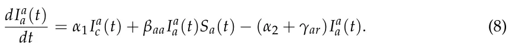

In Equation (9), dRa(t) is the dynamic amount of recovered individual adults over time. *dt* It is affected by the following three terms. First, at each point, a portion of the symptomatic and asymptomatic infected adults recover at a rate of *γ*ar. Second, children grow from birth and pass from the children’s age class to the adult age class at a transition rate of *α*1, and are removed from the children’s age class. Finally, adults grow and pass from the adults’ age class to the elderly age class at a transition rate of *α*2, and are removed from the adult’s age class.

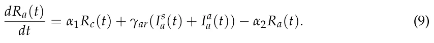

In Equation (10), dDa(t) is the dynamic amount of dead individual adults over time. It *dt* is affected by the symptomatic infected adult that dies at a rate of *γ*ad.

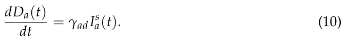

In Equation (11), dSe(t) is the dynamic amount of susceptible elderly individuals over *dt* time. It is affected by the following four terms. First, adults grow and pass from the adults’ age class to the elderly age class at a transition rate of *α*2, and are added to the elderly age class. Second, the elderly naturally die at a transition rate of *λ*, and are removed from the elderly age class. Third, at a rate of *β*es, each symptomatic infected elderly person infects susceptible elderly people. Finally, at a rate of *β*ea, each asymptomatic infected elderly person infects susceptible elderly people.

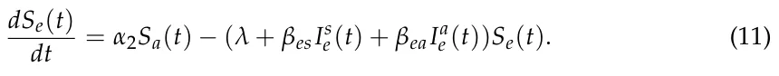

In Equation (12), dIse(t) is the dynamic amount of symptomatic infected individual *dt* elderly people over time. It is affected by the following five terms. First, adults grow and pass from the adult’s age class to the elderly age class at a transition rate of *α*2, and are added to the elderly age class. Second, the elderly naturally die at a transition rate of *λ*, and are removed from the elderly age class. Third, at a rate of *β*es, each symptomatic infected elderly person infects susceptible elderly people. Forth, individuals recover from the disease at a rate of *γ*er. Finally, individuals die from the disease at a rate of *γ*ed.

In Equation (13), dIae (t) is the dynamic amount of asymptomatic infected individual *dt* elderly people over time. It is affected by the following four terms. First, at a rate of *β*ea, each asymptomatic infected elderly person infects susceptible elderly people. Second, individuals recover from the disease at a rate of *γ*er. Third, adults grow and pass from the adult’s age class to the elderly age class at a transition rate of *α*2, and are removed from the adult’s age class. Finally, the elderly die naturally at a transition rate of *λ*, and are removed from the elderly age class.

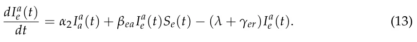

In Equation (14), dRe(t) is the dynamic amount of recovered individual elderly people *dt* over time. It is affected by the following three terms. First, at each point, a portion of the symptomatic and asymptomatic infected elderly people recover at a rate of *γ*er. Second, adults grow from birth and pass from the adult’s age class to the elderly age class at a transition rate of *α*2, and are removed from the children’s age class. Finally, the elderly naturally die at a transition rate of *λ*, and are removed from the elderly age class.

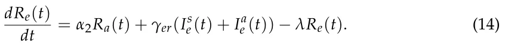

In Equation (15), dDe(t) is the dynamic amount of dead individual elderly people over *dt* time. It is affected by the symptomatic infected elderly that die due to the pandemic at a rate of *γ*ed.

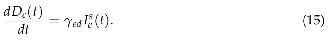

Therefore, the system takes the following form:

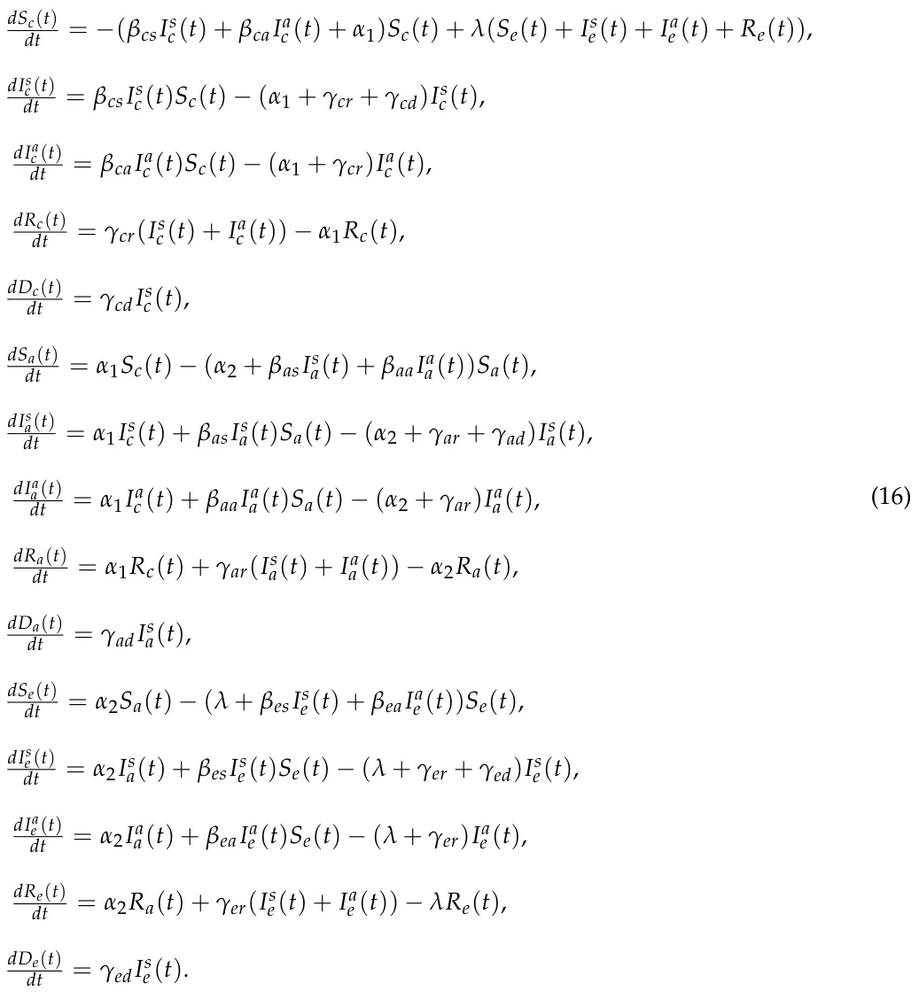

In this notation, the parameters

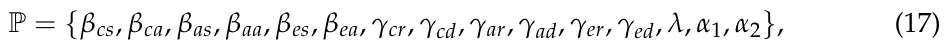

are rates and define the changes in the population entirely and not on the individual level.

One can model the pandemic dynamics using a stochastic process due to the unstable nature of the parameters of the pandemic used in the model, such as the infection rates (*β*cs, *β*ca, *β*as, *β*aa, *β*es, *β*ea) and recovery rates (*γ*cr, *γ*cd, *γ*ar, *γ*ad, *γ*er, *γ*ed), which differ over time. This is because these models are affected by multiple parameters that are unnecessarily taken into consideration or are even unmeasurable in real-world settings. Therefore, it is possible to treat these parameters as an average probability that an event would happen. Following these assumptions, one can represent the epidemiological dynamics as a transition matrix between two consecutive states of the model, which is represented by an n-dimensional vector, corresponding to the number of subpopulations, as follows:

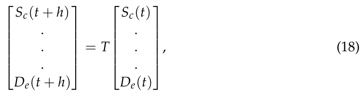

where *h ∈* R is an arbitrary small step in time and *T ∈* Rn×n is the transformation matrix. The model’s state at time *t* is defined by

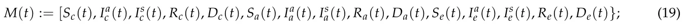

therefore, Equation (18) takes the following form:

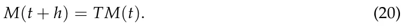

The transformation matrix is defined as *T* := *I* + *h*Φ, where

<figure class="table-figure" id="table-x1">
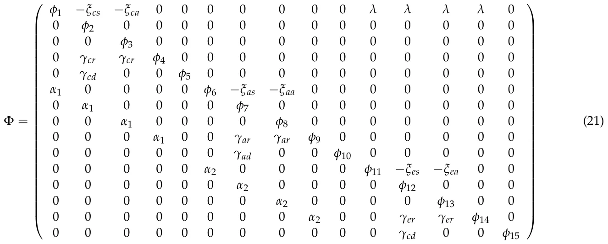

</figure>

## such that

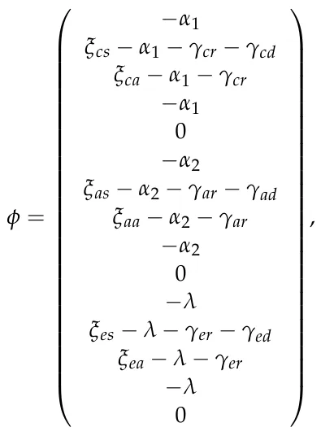

where the model’s parameters P (see Equation (17)) are probabilities rather than rates, as they represent the probabilities for state transfer at the individual level. The transformation matrix (*T*) obtained by solving dM(t) = Φ*M*(*t*), where dM(t) , is taken from Equation (16), *dt dt* after performing linearization on the *β*kl*I*l k*S*k terms to be

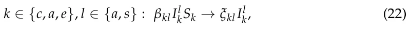

such that *ξ*kl = *β*kl*S*k(*t*). Therefore, the parameter *ξ*kl is the probability that an infected individual will infect other individuals in the population, while *β*kl is the probability that a suspicious individual will be infected by an infected individual. The parameter *ξ*kl changes over time as *S*k(*t*) changes over time, but it can be treated as a constant because *ξ*kl is a random variable in nature, and so incorporates sufficient variability to capture the dynamics of *S*k(*t*) over time. The motivation for using this linearization is that the alternative, *β*kl*I*l k*S*k *→ β*kl*S*k, provides a worse approximation. For example, consider the following case: *k ∈{c*, *a*, *e}*, *l ∈{a*, *s}* : *I*l k = 0 *∧S*k *>* 0. Following the approximation *β*kl*I*l k*S*k *→ β*kl*S*k means that some portion of the suspicious population become infected, which is impossible from an epidemiological perspective. On the other hand, following the linearization in Equation (22) results in *k ∈{c*, *a*, *e}*, *l ∈{a*, *s}* : *I*l k = 0 in this scenario.

Therefore, matrix *T* is the stochastic, linear, approximation of the transformation between two states of the ODE-based model (see Equation (16)). Nevertheless, the models described in Equation (16) (ODE, the deterministic model) and Equations (20) and (21) (the linear transformation matrix, the stochastic model) analytically differ since in Equation (16), the parameters P can be assigned any real value. While it may no longer describe epidemiological dynamics, the mathematical model is well defined in such a scenario. On the other hand, Equations (20) and (21) required the parameters to be *∀p ∈* P : *p ∈* (0, 1] according to Equation (21), which is a stochastic matrix and therefore satisfies that each row sums to 1. This condition is not met if *∀p ∈* P : *p ∈* (0, 1] does not hold. Therefore, the model represented by Equation (16) includes the model represented by Equations (20) and (21).

However, for the subspace where both models are defined, they are numerically equal for any finite time. Indeed, this is true for a given norm function *|| · ||* : Rn *→* R, start condition *M*(0), and time interval [0, *t*max]. The state of the stochastic SIIRD (Equations (20) and (21)) *M*s(*t*) and the state of the deterministic SIIRD (Equation (16)) *M*d(*t*) satisfy

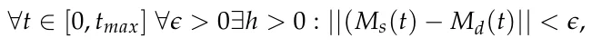

where the parameters *{c*, *a*, *e}*, *l ∈{a*, *s}* : *ξ*kl(*t*) = *β*kl*S*k(*t*) are updated at each point in time *t*.

By approximating the deterministic representation (Equation (16)) system using the forward Euler method [24] in each of the states, the approximation introduces *O*(*h*2) errors for each step in time. Now, one needs to take tmax steps in time to cover [0, *t*max], which *h* introduces an overall tmax *· O*(*h*2) = *O*(*t*max*h*) error. Therefore, *||M*d *− M*s*|| < t*max*h*. As *h* a result, for *h < ϵ*/*t*max, the condition *∀t ∈* [0, *t*max] : *||*(*M*s(*t*) *− M*d(*t*)*|| < ϵ* is satisfied. Thereafter, we define a stochastic process of the dynamics in Equations (20) and (21) at each point in time (*t*) for each subpopulation *M*i(*t*) *∈ M*(*t*), in which there are three possible options for each individual in the population in respect to this subpopulation. First, an individual can be transformed from *M*i(*t*) to *M*j(*t* + 1) (*i/* = *j ∈* [1, . . . , *n*]) at a probability *α*, which results in Φi,j = *α*. Second, an individual can transform from *M*j(*t*) to *M*i(*t* + 1) at a probability *ξ*, which results in Φj,i = *ξ* in a symmetric way to the first case. Third, an individual in *M*i(*t*) can stay in *M*i(*t* + 1). This is a default case and happens at probability 1 *−*Σn j=1(Φi,j), which is the complementary probability to all the probabilities of an individual to transform from *M*i(*t*). These are the only options possible for an individual in each subpopulation *M*i(*t*) as *∀t* : *N* = Σn i=1*M*i(*t*) is constant in time. Therefore, it is possible to define the transformation between each two states in time as follows:

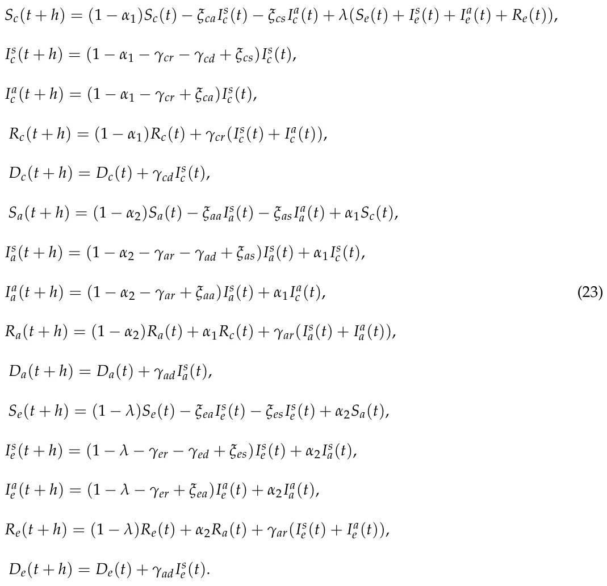

The representation in Equation (23) is isomorphic to the one in Equations (20) and (21). However, Equation (23) treats the dynamic as a stochastic process in nature rather than approximating the deterministic ODE-based dynamics while restoring the underline behavior of the epidemiological system.

## 3. Asymptotic Stable Equilibria States

In epidemiology, there are two types of cases that interest decision makers. First, the state of the population in the long term after the end of a pandemic. Second, the equilibria points and their stable or unstable nature.

The state of the population in the long term after the pandemic can be mapped to the asymptotic state of the pandemic in time because after long enough (e.g., *t →* ∞), the population either survives and its regular dynamics are restored or becomes extinct. While the second scenario is trivial as the population is distributed between the different *death* states of the model, the first scenario holds a larger amount of options. Specifically, the pandemic can die out (i.e., the size of the infected population is zero) and, as a result, after a few generations, only susceptible individuals would remain. On the other hand, in some settings, the pandemic may not die out but be kept under control, such that the pandemic converges to a steady state.

The equilibria states are important for decision makers as these promise a scenario that remains the same unless some action is taken or a major event takes place. However, the equilibria states should be divided into two groups. On the one hand, unstable equilibria states provide some level of stability but are still problematic due to their unstable nature, in which even a relatively small change results in a drastic outcome. On the other hand, stable equilibria do not have this issue.

Therefore, in this section, we analyze the model’s asymptotic equilibria states. One may try to obtain the asymptotic equilibria states and their stability properties from the ODE-based representation (e.g., Equation (16)). Nevertheless, this approach would require one to solve a n-dimensional, nonlinear, heterogeneous, ODE system, which is both numerically and analytically complex and time consuming. On the other hand, by defining a nonhomogeneous discrete-time Markov chain represented by the transformation function (Equation (23)) with state space *M*(*t*) (Equation (18)), in respect to the states in Equation (16), one can find the asymptotic equilibrium as follows. First, in order to model the dynamics as a Markov chain, one needs to show that

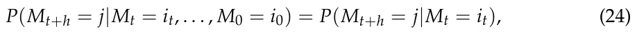

where *{M}*t is a stochastic process with values in the state space for all *t ≥* 0 and all states *i*0, . . . *i*t, *j*, and *h* is an arbitrary small step in time [25]. *T* satisfies Equation (24) if any value in *M*(*t* + *h*) depends only on the previous state *M*(*t*). Indeed, as *T* does not depend on *t* or any value of *M*(*t*) or the previous state, the condition is satisfied.

Therefore, we show that Equation (23) describes a Markovian process. As a result, given the model’s initial condition (M(0)), the model’s state at some time *t* is defined by *M*(*t*) = *T*t*M*(0) [22]. Now, assume any initial condition *M*(0). From Equation (23) and Figure 1, it is possible to see a few subprocesses in the dynamics. First, an individual that at some time *t* reaches a death state (corresponding to lines 5, 10, and 15 in Equation (23)) stays there as the coefficients of *D*c, *D*a, and *D*e is 1 for any parameter’s values. Second, if the pandemic ended, namely, *I*s c + *I*a c + *I*s a + *I*a a + *I*s e + *I*a e = 0, there are two possible cases: the population is extended or some portion of the population (or even the whole population) survived. In the case in which the population is extended, the obtained state is a distribution over the *{D*c, *D*a, *D*e*}* states, while the other subpopulations are 0. In the second option, the population is distributed over the *{S*c, *S*a, *S*e, *R*c, *R*a, *R*e, *D*c, *D*a, *D*e*}* as the infection states are 0. However, after *t >* 1/*α*1, all the individuals at *R*c transform to *R*a. Similarly, after time *t >* 1/*α*2, all the individuals at *R*a transform to *R*e, and finally, after *t > λ*, all the individuals at *R*e transform to *S*c. As a result, after time *t >* 1/*α*1 + 1/*α*2 + 1/*λ*, the subpopulations *R*c = *R*a = *R*e = 0. While at the same time, the remaining population at *S*c, *S*a and *S*e circulate between these states. Finally, in the case in which the pandemic is not finished, after some time *t*, the pandemic will end, as

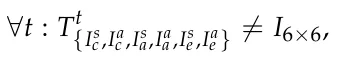

which means these subpopulations eventually decrease over time. As a result, for any start condition *M*(0), and parameters *∀p ∈* P : *p ∈* (0, 1], at *t →* ∞, the model’s asymptotic state (limt→∞ *M*(*t*)) takes the following form:

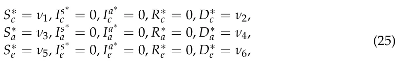

where *{ν ≥* 0*}*6 i=1 and Σ6 i=1*v*i = *N*; and *N* is the total size of the population as defined in Section 2.

The values *{ν}*6 i=1 are dependent on the initial conditions and the model’s parameters and are thus complex and time consuming to find. Therefore, Equation (25) defined the (six-dimensional) subspace in which all possible asymptotically stable states of the model are located with the distribution of the population in the state space, which contains the results of all possible outcomes of the model for any initial condition and model parameters. That is to say, once the model’s state takes the form of Equation (25), it stays in this form from this point on.

Therefore, one can take advantage of this property in order to obtain the asymptotic stable equilibria, as they necessarily follow Equation (25). In order to obtain the asymptotic equilibrium state, we set Equation (25) in Equation (18) and obtain

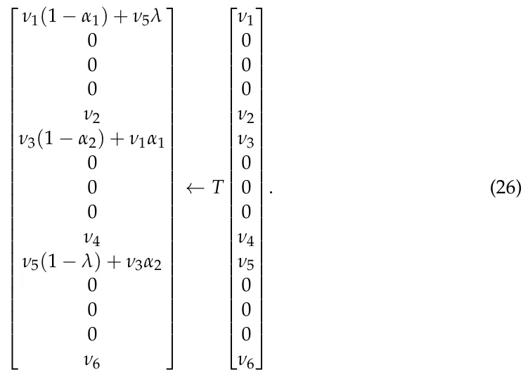

It is possible to divide the types of equilibria into two subgroups: where *ν*1 = *ν*3 = *ν*5 = 0 and otherwise. The first option corresponds to the scenario in which the population is extended due to the pandemic. By setting *ν*1 = *ν*3 = *ν*5 = 0 in Equation (27), one can obtain that all combinations of *{ν*2, *ν*4, *ν*6*}*, such that *ν*2 + *ν*4 + *ν*6 = *N*, are in equilibrium. This results in (*N* + 1)2 for the population in size *N* as it is combinatorially equivalent to dividing *N* items into three (allowing empty) groups. On the other hand, assuming *ν*1*/* = 0, *ν*3*/* = 0, *ν*5*/* = 0, the state is in equilibrium if and only if

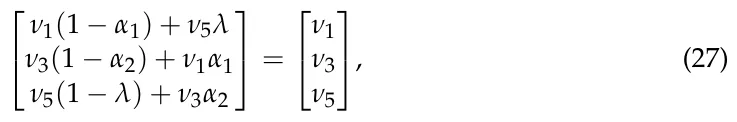

which means the asymptotic state is also in equilibrium if the following condition is fulfilled:

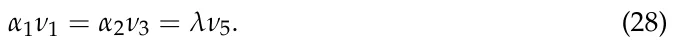

As a result, for any initial condition and the model’s parameters values, there is a time *t*0 such that for all *t > t*0, Equation (25) is fulfilled. In the case in which either *ν*1 = *ν*3 = *ν*5 = 0 or *α*1*ν*1 = *α*2*ν*3 = *λν*5, the model is in an asymptotically stable equilibrium state.

## 4. Comparison with Classical Methods

We compare the proposed method shown in Section 3 with a classical method used to obtain equilibria states and their stability properties for dynamic systems [26,27].

### 4.1. Equilibrium

The equilibria states of the model (Equation (16)) are defined as the states of the model in which the gradient is zero. Therefore, Equation (16) takes the form

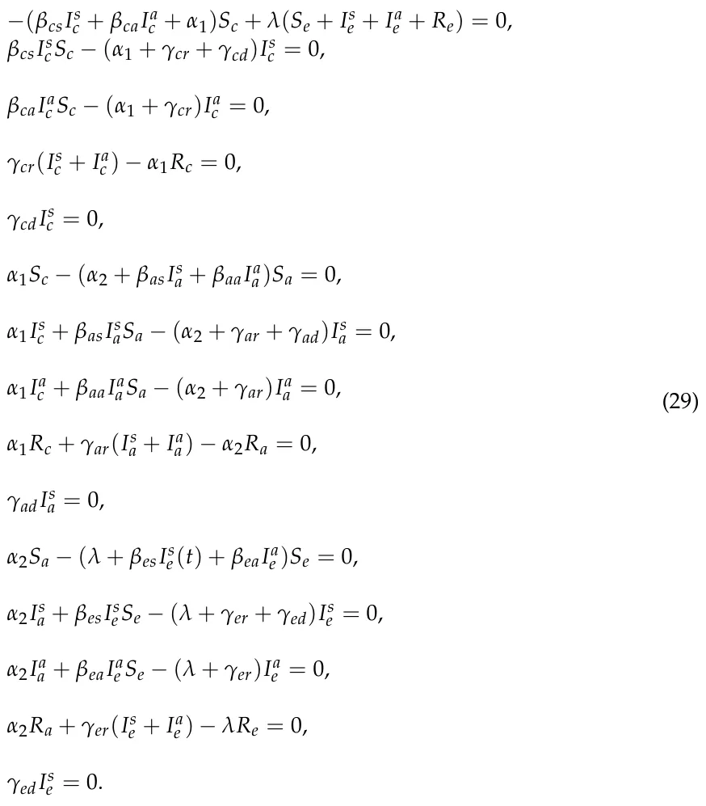

One can notice that from Equations (16) and (29), it follows that

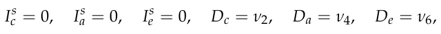

where *ν*2, *ν*4, *ν*6 are arbitrary constants such that *{ν*2i*}*3 i=1 *≥* 0 and ∑3 i=1 *ν*2i *≤ N*, because if either *I*s c, *I*s a, or *I*s e is not equal zero, then the gradient of *D*c, *D*a, or *D*e is not zero and, therefore, the state is not in equilibrium by definition. Therefore, *I*s c = 0, *I*s a = 0, *I*s e = 0 leads to *D*c = *ν*2, *D*a = *ν*4, *D*e = *ν*6 due to Equations (5), (10), and (15). As a result, one is left with

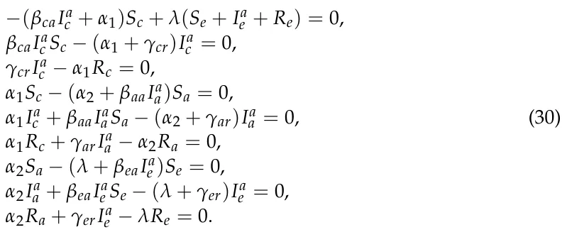

By setting *I*a c = 0, *I*a a = 0, *I*a e = 0, *R*c = 0, *R*a = 0, and *R*e = 0 in Equation (30), we obtain *α*1*S*c = *α*2*S*a = *λS*e, which coincides with (28). Hence, we obtain the following equilibrium:

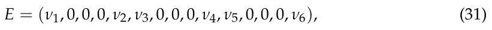

where *||E||* = *N*.

### 4.2. Centralization and Linearization

Consider the nonlinear differential equation

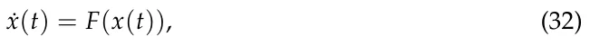

where *x ∈* Rn, and *F*(*x*) = 0 has a solution *x*∗, which is an equilibrium of Equation (32). Using a new variable *y*(*t*) = *x*(*t*) *− x*∗, one can represent Equation (32) in the form

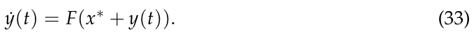

The stability of the zero solution of Equation (33) is equivalent to the stability of the equilibrium *x*∗ in Equation (32).

Using Taylor’s expansion, Equation (33) takes the form

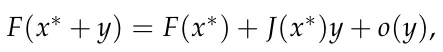

*|o*(*y*)*|* where *J*(*x*∗) is the Jacobian matrix of Equation (33) and lim|y|→0 = 0, *|y|* is the *|y|* Euclidean norm in Rn, and the equality *F*(*x*∗) = 0. Thus, we obtain a linear approximation of Equation (33):

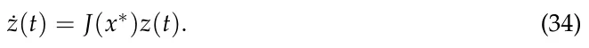

It is easy to check that, for the considered system, the Jacobian matrix *J*(*x*∗) coincides with the matrix Φ given in Equation (21). A state is an asymptotic stable state if and only if the matrix is negative as defined for any values of the parameters (Equation (17)). Unfortunately, the matrix Φ is neither diagonal nor triangular and, therefore, one is able to determine if it is negative definite or not by analytically obtaining the determinant and investigating its properties. However, this will result in a 15-ordered polynomial, which is much more time and resource consuming as compared to the method presented in Section 3.

## 5. Conclusions and Future Research Directions

We propose a novel method to analytically obtain all asymptotic stable equilibria states. We present this method for an extended SIR model, for the three age groups SIIRD model. This method is based on the Markov chain model, the parameters of which are deterministic (Equation (23)). Using this representation, one is able to obtain all asymptotic stable equilibrium states of the model for any given start condition and properties using the stationary state (Equation (31)). The method works because there is a symmetry in the time of the population size (e.g., being constant *N*), which allows the system to converge rather than diverge to infinity or to crash into the trivial case of an extended population.

When comparing the proposed method with classical methods of obtaining equilibria and its stability properties, it is clear that for large-scale SIR models, the proposed method is superior for several reasons. First, the classic method requires a certain level of algebraic expertise to solve the equations that describe the dynamics, while the proposed method treats them as a single process and therefore renders the aforementioned process unnecessary. Second, the classic method is not able to identify all asymptotic stable equilibria by itself, as one is required to manually find all equilibria states and investigate each one independently. This process is time and resource consuming. On the other hand, the proposed model analytically obtains all asymptotic stable equilibria, as it finds the stationary state of the stochastic process that represents the dynamics.

Naturally, converting the deterministic biological rate coefficients, such as the recovery rates *γ* or infection rates *ξ*, into transformation probabilities may create cases that do not correspond to the biological dynamics on the individual level, and these should, therefore, be treated with care. For example, a susceptible individual (*p ∈ S*a) can be infected and transformed into the asymptomatic infected subpopulation (*I*a a) at a given time *t*. Immediately afterward, in time *t* + 1, there is a chance *γ*ar that the same individual recovers and is transformed to the recovered subpopulation (*R*a).

The stochastic representation of pandemic dynamics allows for more flexibility and credibility than when treating model parameters as deterministic values. This is because data often involve uncertainty [16]. This approach allows for pandemic dynamics to be simulated based on an extended SIR model using distributed systems models. This allows additional social [3], non-pharmaceutical and pharmaceutical intervention (NPI/PI) policies [28], and economical policies [7] to be added to the epidemic dynamics.

We plan to extend the proposed method to handle spatio-temporal SIR-type models, in which the spatial dynamics are taking place in either a continues space or discrete space. For the continues case, the pandemic spread dynamics can be described using a system of partial differential equations [29]. For the discrete case, the pandemic spread dynamics can be described using a graph, resulting in a combination of ODE and graph models [8]. In either case, the addition of spatial dynamics (and the walk of population) would require principle changes in the proposed method. In addition, a numerical and analytical investigation of the duration that the dynamics converge to for the asymptotic stable equilibrium from any given initial condition and model’s parameters would need to be studied. Furthermore, a comparison of the numerical solution of the proposed model (Equations (1)–(15)) and the proposed analytical results will be explored.

**Author Contributions:** Conceptualization, T.L.; methodology, T.L.; validation, L.S. and S.B.-M.; formal analysis, T.L. and L.S.; writing—original draft preparation, T.L.; writing—review and editing, S.B.-M.; visualization, T.L.; supervision, S.B.-M.; project administration, S.B.-M. All authors have read and agreed to the published version of the manuscript

**Funding:** This research received no external funding.

**Institutional Review Board Statement:** Not applicable.

**Informed Consent Statement:** Not applicable.

**Data Availability Statement:** Not applicable.

**Conflicts of Interest:** The authors declare no conflict of interest.

## References

1. Kermack, W.O.; McKendrick, A.G. A contribution to the mathematical theory of epidemics. Proc. R. Soc. 1927, 115, 700–721.
2. Bunimovich-Mendrazitsky, S.; Stone, L. Modeling polio as a disease of development. J. Theor. Biol. 2005, 237, 302–315.
3. Lazebnik, T.; Bunimovich-Mendrazitsky, S. The signature features of COVID-19 pandemic in a hybrid mathematical mode— Implications for optimal work-school lockdown policy. Adv. Theory Simul. 2021, 4, 2000298.
4. Chen, W. A Mathematical Model of Ebola Virus Based on SIR Model. In Proceedings of the 2015 International Conference on Industrial Informatics—Computing Technology, Intelligent Technology, Industrial Information Integration, Wuhan, China, 3–4 December 2015; pp. 213–216.
5. Tan, X.; Yuan, L.; Zhou, J.; Zheng, Y.; Yang, F. Modeling the initial transmission dynamics of influenza A H1N1 in Guangdong Province, China. Int. J. Infect. Dis. 2013, 17, e479–e484.
6. Tuite, A.R.; Fisman, D.N.; Greer, A.L. Mathematical modelling of COVID-19 transmission and mitigation strategies in the population of Ontario, Canada. CMAJ 2020, 192, E497–E505.
7. Bethune, Z.A.; Korinek, A. Covid-19 Infection Externalities: Trading off Lives vs. Livelihoods; Working Paper 27009; National Bureau of Economic Research: Cambridge, MA, USA, 2020.
8. Wang, Z.; Bauch, C.T.; Bhattacharyya, S.; d’Onofrio, A.; Manfredi, P.; Perc, M.; Perra, N.; Salathe, M.; Zhao, D. Statistical physics of vaccination. Phys. Rep. 2016, 664, 1–113.
9. Paden, B.; Panja, R. Globally asymptotically stable ‘PD+’ controller for robot manipulators. Int. J. Control 1988, 47, 1697–1712.
10. Ahmed, E.; El-Sayed, A.M.; El-Saka, H.A. Equilibrium points, stability and numerical solutions of fractional-order predator—Prey and rabies models. J. Math. Anal. Appl. 2007, 325, 542–553.
11. Bhat, S.P.; Bernstein, D.S. Lyapunov analysis of semistability. In Proceedings of the 1999 American Control Conference (Cat. No. 99CH36251), San Diego, CA, USA, 2–4 June 1999; Volume 3, pp. 1608–1612.
12. Magal, P.; McCluskey, C.; Webb, G. Lyapunov functional and global asymptotic stability for an infection-age model. Appl. Anal. 2010, 89, 1109–1140.
13. Genesio, R.; Tartaglia, M.; Vicino, A. On the estimation of asymptotic stability regions: State of the art and new proposals. IEEE Trans. Autom. Control 1985, 30, 747–755.
14. Shaikhet, L. Construction of Lyapunov functionals for stochastic difference equations with continuous time. Math. Comput. Simul. 2004, 66, 509–521.
15. Hamra, G.; MacLehose, R.; Richardson, D. Markov chain Monte Carlo: an introduction for epidemiologists. Int. J. Epidemiol. 2013, 42, 627–634.
16. Cortés, J.; El-Labany, S.K.; Navarro-Quiles, A.; Selim, M.M.; Slama, H. A comprehensive probabilistic analysis of approximate SIR-type epidemiological models via full randomized discrete-time Markov chain formulation with applications. Math. Methods Appl. Sci. 2020, 43, 8204–8222.
17. Sharma, S. Markov Chain Monte Carlo Methods for Bayesian Data Analysis in Astronomy. Annu. Rev. Astron. Astrophys. 2017, 55, 213–259.
18. Nix, A.E.; Vose, M.D. Modeling genetic algorithms with Markov chains. Ann. Math. Artif. Intell. 1992, 5, 79–88.
19. Bois, F.Y. GNU MCSim: Bayesian statistical inference for SBML-coded systems biology models. Bioinformatics 2009, 25, 1453–1454.
20. Becker, N. A general chain binomial model for infectious diseases. Biometrics 1981, 37, 251–258.
21. Allen, L.J.S. An Introduction to Stochastic Processes with Applications to Biology; CRC Press: New York, NY, USA, 2010.
22. Privault, N. Understanding Markov Chains; Springer: Singapore, 2018.
23. Lazebnik, T.; Shami, L.; Bunimovich-Mendrazitsky, S. Spatio-Temporal Influence of Non-Pharmaceutical Interventions Policies on Pandemic Dynamics and the Economy: The Case of COVID-19. Res. Econ. 2021, [doi:10.1080/1331677X.2021.1925573](https://doi.org/10.1080/1331677X.2021.1925573)
24. Press, W.H.; Flannery, B.P.; Teukolsky, S.A.; Vetterling, W.T. Numerical Recipes in FORTRAN: The Art of Scientific Computing; Cambridge University Press: Cambridge, UK, 1992; pp. 710–710.
25. Bremaud, P. Non-Homogeneous Markov Chains; Springer: Berlin/Heidelberg, Germany, 2020; Voume 31, pp. 399–422.
26. Shaikhet, L. About one method of stability investigation for nonlinear stochastic delay differential equations. Int. J. Robust Nonlinear Control 2021, 31, 2946–2959.
27. Beretta, E.; Kolmanovskii, V.; Shaikhet, L. Stability of epidemic model with time delays influenced by stochastic perturbations. Math. Comput. Simul. 1998, 45, 269–277.
28. Zhao, S.; Stone, L.; Gao, D.; Musa, S.S.; Chong, M.K.C.; He, D.; Wang, M.H. Imitation dynamics in the mitigation of the novel coronavirus disease (COVID-19) outbreak in Wuhan, China from 2019 to 2020. Ann. Transnatl. Med. 2020, 8, 448.
29. Di Domenico, L.; Pullano, G.; Sabbatini, C.E.; Bo Elle, P.Y.; Colizza, V. Impact of lockdown on COVID-19 epidemic in Ile-de-France and possible exit strategies. BMC Med. 2020, 18, 240.
