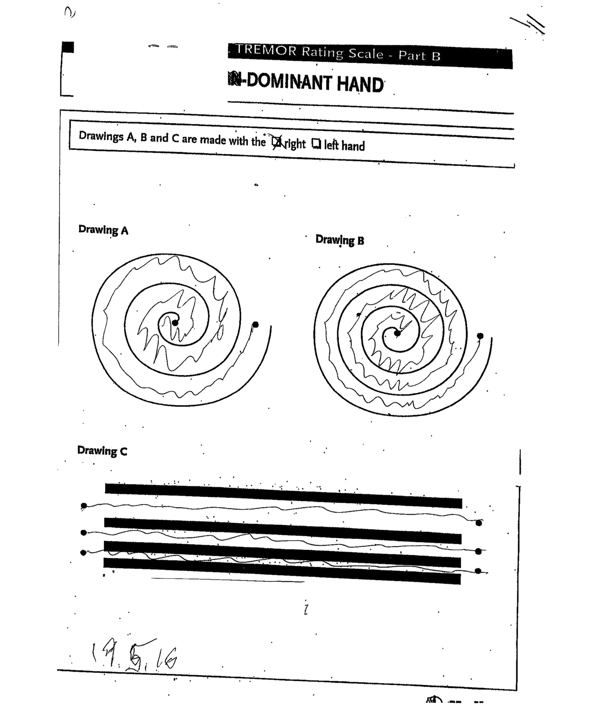
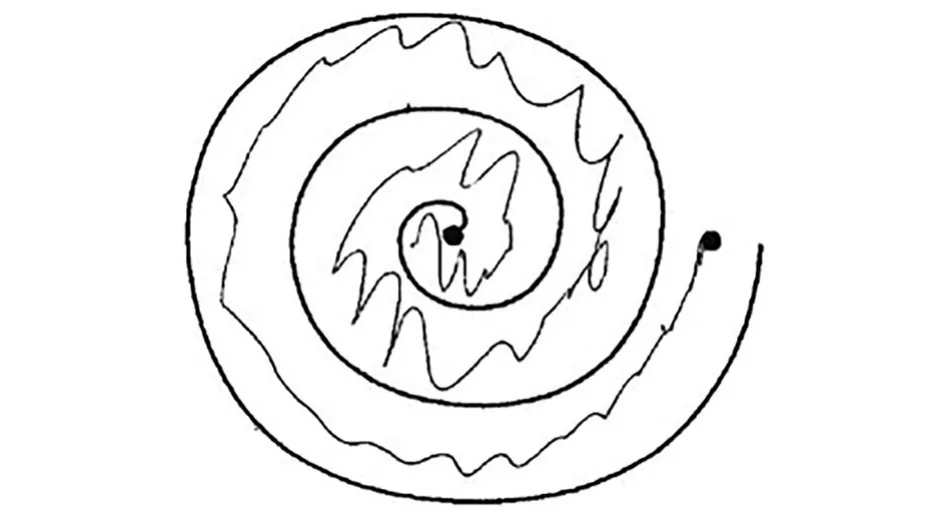
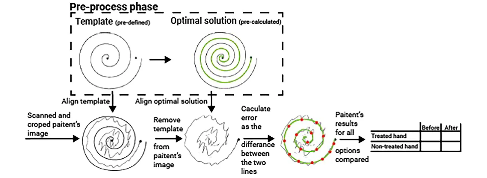
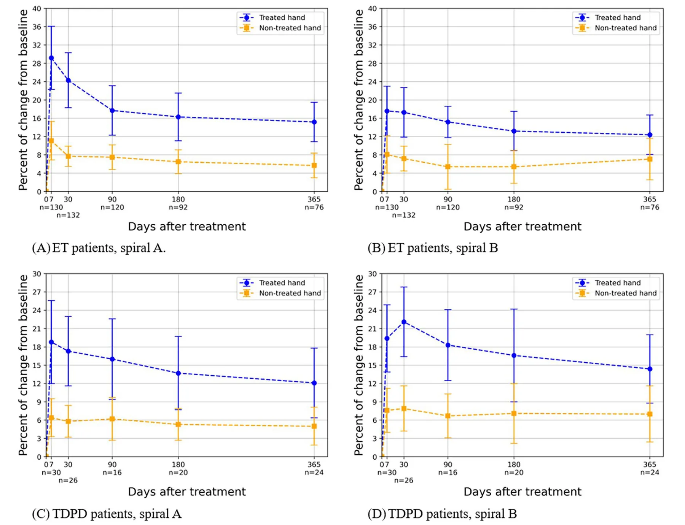

## Introduction

Patients with essential tremor (ET) and tremor-dominant Parkinson’s disease (TDPD) may have reduced quality of life because of their tremor. In most of these patients, when tremor is severe, pharmacological therapy does not improve tremor sufficiently, and, when it does, adverse effects limit its use. For these patients, deep brain stimulation was the treatment of choice till the emergence of focused ultrasound (FUS) thalamotomy as a minimally invasive alternative [1–3]. With FUS thalamotomy, ultrasound waves penetrate through the skull to heat the tissue. The ultrasound-transmitted energy causes a thermal ablation of the intended target, the ventro-intermediate thalamus (VIM) [1]. Adverse events seen after the procedure are most commonly mild and include gait ataxia, paresthesia, dysgeusia and scalp numbness, which resolve within 3 months in most patients [2, 3]. Until recently, treatment was performed unilaterally with clear improvement in the treated arm. Recently, the possibility of staged bilateral treatment has emerged [4–6]. We therefore offered our patients this choice, but some patients disclosed that they felt significant improvement in the ipsilateral, non-treated hand after FUS and therefore did not need a second procedure. This observation of ipsilateral improvement of tremor has previously been reported in a subset of patients that underwent FUS [7] while others did not find such improvement [2].

Since this change in ipsilateral tremor has not been documented often, we hypothesized that the change in tremor, if it exists, may be minor in most patients and thus not detected by the tremor scale. Hence, we chose to develop an objective tool that will quantify tremor in the treated and non-treated hand. We hypothesized that by using image and signal processing of the Archimedes spirals drawn by our patients, we could provide an objective tremor measurement tool.

We compared the tremor seen in these drawings before and after treatment using the tool we developed, employing automated image processing and signal processing. We assessed whether improvement in tremor could be detected objectively using this tool and whether this change would be seen only on the contralateral side or on the ipsilateral side as well.

## Methods

### Patients

One hundred thirty-two patients with ET and 26 patients with TDPD were included in the study. All patients had medication-refractory tremor that underwent FUS thalamotomy at Rambam Health Care campus, Haifa, Israel.

### FUS Treatments

FUS thalamotomy was performed in a 3-T magnetic resonance imaging system (GE Medical Systems, Milwaukee, WI, USA) using an ExAb-late Neuro 4000 device and a silicon membrane (InSightec, Tirat Hacarmel, Israel). A magnetic resonance-compatible stereotactic frame (Integra Radionics, Burlington, MA, USA) immobilized the patient’s head. Target tissue temperature was measured using magnetic resonance thermometry. The treatment was done in a stepwise manner. The first step involved calculation of the initial target based on the brain atlas and the MRI images of the patient. The second step was sonication at low energy. This heated the tissue slightly to verify the effect and absence of side effects. At this stage, the temperature at the target was gradually increased to reach 45–50 °C. The temperature at the target was slowly increased with the treatment team examining the patient repeatedly to verify improvement, usually showing total disappearance of tremor contralateral to the treated side. When the target was verified with no adverse effects, the energy was increased to reach a tissue temperature of 54–60 °C with a sonication duration of 10–39 s to create a permanent lesion. Throughout the procedure, the patient was awake, giving the treatment team real-time feedback. If the decrease in tremor was not adequate or adverse effects were noted at low temperatures, the target was adjusted until improvement was seen without unwanted side effects.

This study was performed in accordance with the Helsinki Declaration of 1964 and its later amendments. This study was approved by the local Institutional Review Board at Rambam Health Care Campus (IRB 4040-17). Data were gathered retrospectively, and all data were pseudonymized, so participants’ written informed consent was not required. The board approved publication of the study. All authors review the manuscript and confirmed its publication.

### Spiral Drawings Dataset

According to the Clinical Rating Scale for Tremor (CRST) [8], the patients were given a paper template containing two Archimedean spirals and three straight lines. Spirals were denoted as spirals A and B, in which spiral B was narrower than spiral A. Patients were requested to draw a line between the lines seen in the template, as shown in Fig. 1. The scan depicted in Fig. 1, which is not of good quality, was intentionally chosen to illustrate the challenges inherent to the preprocessing stage of our analytical method. This highlights the complexities of handling real-world medical data, which often arrive in various imperfect forms. These include misalign-ments, handwritten annotations and other distortions that require rigorous preprocessing to ensure accurate data extraction and analysis [9]. Prior to the treatment, and in multiple follow-up sessions after treatment, patients performed the Archimedes spiral drawing test. Patients were requested to draw a line between the lines seen in template A and B with the right and left hand at each follow-up visit. Patients with an Archimedes spiral test drawing using both hands before treatment and at least three follow-up drawings after treatment were included in the study.

On each template, the administrating personnel marked the hand used for drawing—left or right—and the dominant hand. The templates were scanned in 300 DPI resolution and saved using a pseudonymized identification code for the patient and the session latency, in days, from the treatment date. The scanned dataset was accompanied by a spreadsheet containing information for each scan regarding drawing date, treated hand and treatment date. The scans underwent computerized pre-processing to isolate the spirals in the scans and to eliminate human-induced errors, such as patient and/or physician marking on the page and scanning artifacts such as rotation and pixelization, as detailed in Aharonson et al. [9]. The areas of spiral A and spiral B were cropped uniformly from each scan, resized to a 500 × 500 pixel image and then converted to grayscale. Figure 2

<figure id="fig-x1">

</figure>

- ◂ **Fig. 1** An example of a scanned template and drawings completed by a patient. The dominant hand and the hand used for the drawing are marked at the top of the template by the clinician. Below this information are the two spiral templates, headed by the texts “Drawing A”—a wider spiral—and “Drawing B”—a narrower spiral, and the straight lines headed by the text “Drawing C.” Additional information is sometimes hand-written by the clinician, such as the date at the lower left side of the page. Scanning artifacts of sporadic black dots on the page and tilt of the template can be seen

presents an example of the outcome of the pre-processing for the spiral in drawing A of the scanned template in Fig. 1.

### Spiral Image Analysis

The Archimedes spiral drawings were extracted using a computerized image analysis developed using the Python programming language, version 3.8.2 [10]. The first step in the analysis was the application of a fixed threshold to binarize the image. This threshold value of 43/255 was determined using the grid-search method with values ranging from 10 to 100 and a step size of one [11]. Subsequently, each spiral image was cropped to retain only the spherical region, encompassing the leftmost, rightmost, uppermost and lowermost points of the spiral’s template and the patient’s drawn line. Following the cropping, an "empty" spherical representation was meticulously prepared and removed from the image. This removal process employed a pixel-wise subtraction and the Canny smoothing technique [12], effectively isolating the patient’s drawn line from the rest of the image content. To facilitate the analysis, an ideal reference line was computed. To compute the equidistant points, the found boundary pixels of the spirals, as matched by the pre-defined template, were divided into linear segments with equal length, starting with the beginning point of the spiral. For both the inner and outer sphere, the locations [in terms of the *(x*, *y)* values in the image] of the pixels were marked by *l*1*, l*2 , and the corresponding equidistant point was set to 0.5(*l*1 + *l*2) . This line smoothly connected all the points equidistant between the lines of the spiral template, as illustrated by the green line denoted “optimal solution” in Fig. 3. The computerized evaluation of the patients’ performance was based on the comparison of a patient’s drawn line to this reference line. Next, the line drawn by the patient was sampled to produce a set of discrete samples along this line (illustrated by the red dots in Fig. 3). The sampling used a fixed-length size, which was determined based on the Manhattan (L1) distance metric that was computed over the black pixels (those with binary value of one) within the image. Simultaneously, the reference "ideal" line was sampled to produce an identical number of data points as in the patient’s drawn line. This was achieved by a normalization of the step size, obtained in the sampling of the patient’s drawn line, in the reference line’s sampling. Finally, to quantify the deviation of the patient’s line from the reference line, the Manhattan (L1) distance was computed between the two sets of sampled points generated in the previous steps. This distance metric provided a quantitative measure, a performance score, for the deviation of the patient’s spiral from the desired reference spiral. A schematic description of the image processing is presented in Fig. 3. Importantly, the sampling rate as well as the metric were hyper-parameters of the method which can be altered. We provide an analysis and motivation for the above choices in the Appendix. Performance scores were computed for each patient’s spiral A and spiral B drawings before the FUS treatment—the baseline—and at all follow-up sessions after treatment, for both hands. The treatment’s effect on a patient’s drawing was computed by comparing the percent change in the performance scores between each follow-up session and the baseline session, for each hand separately.

### Experimental Design

Since the proposed tool is based on a mathematical approach of signal processing, we first validated that the tool can capture the real-world clinical dynamics observed. To this end, we used the treated hand as the validation cohort. We aimed to check whether the proposed tool showed the known clinical properties of the diseases and treatment, a statistically significant improvement after the treatment. Thereafter, we used the proposed tool to study changes in tremor in the non-treated hand. We also used the proposed tool to analyze change in treatment efficacy over time.

<figure id="fig-2">

<figcaption><strong>Fig. 2</strong> An example of a dataset spiral following the automated preprocessing of the template in Fig. 1. The spiral under “Drawing A” was cropped out, its tilt corrected and all black dots induced by scanning removed</figcaption>
</figure>

### Statistical Analysis

To evaluate whether the change in the proposed performance score before and after the treatment is statistically different, we first used the Shapiro-Wilk test to check whether the proposed metric’s score was normally distributed or not. As we determined that the data were not normally distributed, we used a Wilcoxon signed-rank test to capture the pair-wise nature of the samples, as we had a pre- and post- treatment sample from each patient. A *P* value ≤ 0.05 was considered significant. In addition, we examined the change over time following the treatment on the treated hand using the Kendall tau ranking test. The statistical examination was carried out using the Python programming language (version 3.9.2).

## Results

The tool we developed that employed image and signal processing was able to detect a significant reduction in tremor in the treated hand following FUS for all 132 patients with ET and 26 patients with TDPD. This significant improvement was sustained at all time points in patients with ET and patients with TDPD, as shown by objective analysis of tremor in the drawing of Archimedes spiral A; see Table 1, Fig. 4A, C. There was similar significant improvement in and cropped patient’s drawing in a spiral, the template spiral is removed. Both the reference line (green) and the patient’s drawn line are sampled (red dots), and the performance score featuring the L1 distance between the two sampled lines is calculated the population are drawn. The horizontal axis is the days elapsed from treatment. The vertical axis is the percent change from the baseline for the patient population objective tremor assessment in the treated hand in the drawing of Archimedes spiral B at all time points in patients with ET and patients with TDPD; see Table 1, Fig. 4B, D.

<figure id="fig-3">

<figcaption><strong>Fig. 3</strong> A schematic description of the image processing method that computed the change in a patient’s performance in the spiral-drawing task. In the preprocessing phase, depicted in the rectangle, a template spiral and its reference line—in green—are prepared. For each scanned</figcaption>
</figure>

<figure class="table-figure" id="table-1">
<figcaption><strong>Table 1</strong> Significance of change in tremor after focused ultrasound compared with baseline</figcaption>

<table><tr><th>Patients</th><th colspan="2">Essential tremor</th><th></th><th></th><th></th><th colspan="2">Parkinson’s disease</th><th></th><th></th><th></th></tr><tr><th></th><th></th><th colspan="2">Treated hand</th><th colspan="2">Non-treated hand</th><th></th><th colspan="2">Treated hand</th><th colspan="2">Non-treated hand</th></tr><tr><th>Spiral</th><th></th><th>Spiral A</th><th>Spiral B</th><th>Spiral A</th><th>Spiral B</th><th></th><th>Spiral A</th><th>Spiral B</th><th>Spiral A</th><th>Spiral B</th></tr><tr><td>1 week</td><td>n = 130</td><td>p &lt; 0.001</td><td>p &lt; 0.001</td><td>p &lt; 0.005</td><td>p &lt; 0.001</td><td>n = 30</td><td>p &lt; 0.005</td><td>p &lt; 0.005</td><td>p &lt; 0.01</td><td>p &lt; 0.005</td></tr><tr><td>1 month</td><td>n = 132</td><td>p &lt; 0.001</td><td>p &lt; 0.001</td><td>p &lt; 0.005</td><td>p &lt; 0.005</td><td>n = 26</td><td>p &lt; 0.005</td><td>p &lt; 0.005</td><td>p &lt; 0.01</td><td>p &lt; 0.005</td></tr><tr><td>3 months</td><td>n = 120</td><td>p &lt; 0.005</td><td>p &lt; 0.001</td><td>p &lt; 0.005</td><td>p &lt; 0.005</td><td>n = 16</td><td>p &lt; 0.005</td><td>p &lt; 0.005</td><td>p &lt; 0.05</td><td>p &lt; 0.01</td></tr><tr><td>6 months</td><td>n = 92</td><td>p &lt; 0.005</td><td>p &lt; 0.005</td><td>p &lt; 0.01</td><td>p &lt; 0.01</td><td>n = 20</td><td>p &lt; 0.01</td><td>p &lt; 0.01</td><td>p &lt; 0.05</td><td>p &lt; 0.01</td></tr><tr><td>1 year</td><td>n = 76</td><td>p &lt; 0.01</td><td>p &lt; 0.005</td><td>p &lt; 0.01</td><td>p &lt; 0.01</td><td>n = 24</td><td>p &lt; 0.01</td><td>p &lt; 0.01</td><td>p &lt; 0.05</td><td>p &lt; 0.01</td></tr></table>

</figure>

<figure id="fig-4">

<figcaption><strong>Fig. 4</strong> Change from baseline (pre-treatment) in patients as a function of time following the treatment for Archimedes spiral drawing. The average ± standard deviation of</figcaption>
</figure>

In patients with ET and patients with TDPD following unilateral VIM thalamotomy, the tremor in the hand that was not treated was reduced significantly at all time points as seen in the scores of our tool for drawing A and drawing B; see Table 1, Fig. 4A–D.

Our tool detected a significant decline in the efficacy of FUS treatment over time in the treated hand (*p* < 0.05). The change over time was statistically significance for both spiral A and spiral B and in both ET and TDPD patients.

## Discussion

Using the tool we developed, which incorporates automated image processing and signal processing, we could demonstrate an objective and significant reduction in tremor following FUS. This reduction in tremor was observed in patients with both ET and TDPD and at all follow-up time points up to 1 year, reproducing known clinical data [14–16]. The proposed method was sensitive enough to convey a smaller yet significant improvement in the non-treated ipsilateral hand for all sessions following treatment. Furthermore, the method confirmed the observations of the decline in efficacy of the FUS over time, in both ET and TDPD patients, although significant tremor reduction compared to the pre-treatment baseline was still apparent at 1 year post treatment [1–3].

Using our tool, the reduction in tremor was smaller than the previously reported reduction where the CRST score was used [1, 2]. This may reflect the fact that our tool only assessed the spiral drawings while the CRST score offers a more comprehensive assessment of tremor effect on daily living. Alternatively, it may indicate that our tool underestimates the tremor.

Tremor assessment during focused ultrasound thalamotomy is currently performed by subjective visual observations. There is an unmet need for repeated objective assessments of tremor. Using traditional scanned paper drawings and a simple, fast analysis, we were able to address these limitations. Our analyses offered a quantitative and interpretable tremor estimation in the spiral drawings. The analyses provided a tremor reduction criterion, based on a measure of geometrical deviation of the drawn spiral from its ideal trajectory. Our preliminary study [9] used a single geometric feature, the deviations of angles in the drawn spirals, and considered only drawings by the treated hand on the patients. The results portrayed a statistical reduction in this deviation across all follow-up sessions in 76% of the patients in the treated hand. While the former analysis focused on a specific feature, the current analysis extends this approach to encompass a broader range of irregular aspects in the drawing, thereby providing a more accurate measure of the observed tremor. This broader perspective, and the larger population of patients, helps justify the differences between the results of the two analyses.

The dentato-rubro-thalamic tract is classically described as a decussating pathway, ascending to the contralateral thalamus. However, the existence of non-decussating (i.e., ipsilateral) fibers in humans has been demonstrated. Thus, it is not surprising that a reduction of tremor was found in this study not only on the contralateral side but also on the ipsilateral side. Notably, the percentage change in the ipsilateral side was significantly less than that of the contralateral side, probably probably because most fibers were decussated. Thus, the effect might have been genuinely smaller. Another theoretical explanation is that the baseline tremor severity on the contralateral side was lower, leading to a smaller observed change (floor effect). Future studies should explore these options.

This study had limitations. Initially, the patient cohort was derived from a single medical center, which limited the generalization of the results as bias from clinical practices and socio-demographic properties of the patients may exist [13]. As such, a larger and more diverse sample size would be necessary to generalize the findings to represent the broader population of ET and TDPD patients. In addition, while the Archimedes spiral test is a useful tool for measuring tremor, it may not capture all aspects of tremor severity and its impact on daily activities.

Other complementary assessment tools could provide a more comprehensive evaluation of patients’ quality of life. Finally, the study did not include a control group of patients who did not receive FUS thalamotomy, which limits the ability to attribute improvements solely to the intervention. In addition, the proposed method cannot handle errors such as shifting (i.e., when the patient’s line is topologically identical to the “ideal” line but shifted from the middle of the spiral), which can cause bias in healthy patients.

## Conclusion

Our objective method that incorporated image and signal processing provided a quantitative measure of tremor reduction. It demonstrated significant improvement in tremor in the treated (contralateral) and non-treated (ipsilateral) hand following FUS as well as decreased efficacy over time. This tool may serve as a complementary tool to the clinicians’ subjective visual observations and the patients’ accounts of tremor during and following FUS treatment.

## Acknowledgements

The authors thank Hen Talmor and Shani Frid-man for their administrative help.

***Author Contributions.*** List all authors along with a clarification of role(s): Design: Vered Aharonson, Teddy Lazebnik, Ilana Schlesinger. Data acquisition: Vered Aharonson, Teddy Lazebnik, Alon Sinai, Maria Nassar, Inna Senderova, Marius Constantinescu, Lev Tov Lior, Ilana Schlesinger. Execution: Vered Aharonson, Teddy Lazebnik. Writing: Vered Aharonson, Teddy Lazebnik, Alon Sinai, Ilana Schlesinger. Editing of final version of the manuscript: Vered Aharonson, Teddy Lazebnik, Alon Sinai, Ilana Schlesinger.

***Funding.*** No funding or sponsorship was received for this study or publication of this article. The Rapid Service Fee was funded by the authors.

***Data Availability.*** The data that support the findings of this study are available on request from the corresponding author. The data are not publicly available due to privacy or ethical restrictions.

### Declarations

***Conflict of Interest.*** Vered Aharonson is employed by School of Electrical and Information Engineering, University of the Witwatersrand, Johannesburg, South Africa, & Medical School, University of Nicosia, Cyprus. Teddy Lazebnik is employed by Ariel University, Israel. Alon Sinai is employed by Rambam Healthcare Campus. He received consultation fees from the IsraelMedicUp. Maria Nassar is employed by Rambam Healthcare Campus. Inna Senderova is employed by Rambam Healthcare Campus. Marius Constantinescu is employed by Rambam Healthcare Campus. Lev Tov Lior is employed by Rambam Healthcare Campus, Haifa Israel. Ilana Schlesinger is employed by Rambam Healthcare Campus, Haifa Israel. She received consultation fees from the Israeli Ministry of Defense Rehabilitation Division and IsraelMedicUp.

***Ethical Approval.*** This study was performed in accordance with the Helsinki Declaration of 1964 and its later amendments. This study was approved by the local Institutional Review Board at Rambam Health Care Campus) (IRB 4040- 17). Data were gathered retrospectively, and all data were pseudonymized and therefore did not require written informed consent of the participants. The board approved publication of the study. All authors reviewed the manuscript and confirmed its publication.

***Open Access.*** This article is licensed under a Creative Commons Attribution-NonCommercial 4.0 International License, which permits any non-commercial use, sharing, adaptation, distribution and reproduction in any medium or format, as long as you give appropriate credit to the original author(s) and the source, provide a link to the Creative Commons licence, and indicate if changes were made. The images or other third party material in this article are included in the article’s Creative Commons licence, unless indicated otherwise in a credit line to the material. If material is not included in the article’s Creative Commons licence and your intended use is not permitted by statutory regulation or exceeds the permitted use, you will need to obtain permission directly from the copyright holder. To view a copy of this licence, visit http://creativeco mmons.org/licenses/by-nc/4.0/.

## References

1. Sinai A, Nassar M, Eran A, et al. Magnetic resonance-guided focused ultrasound thalamotomy for essential tremor: a 5-year single-center experience. J Neurosurg. 2019;133(2):417–24.
2. Elias WJ, Lipsman N, Ondo WG, et al. A randomized trial of focused ultrasound thalamotomy for essential tremor. N Engl J Med. 2016;375(8):730–9.
3. Zaaroor M, Sinai A, Goldsher D, Eran A, Nassar M, Schlesinger I. Magnetic resonance-guided focused ultrasound thalamotomy for tremor: a report of 30 Parkinson’s disease and essential tremor cases. J Neurosurg. 2018;128(1):202–10.
4. Cesarano S, Saporito G, Sucapane P, et al. Staged magnetic resonance-guided focused ultrasound thalamotomy for the treatment of bilateral essential tremor and Parkinson’s disease related tremor: a systematic review and critical appraisal of current knowledge. Front Neurol. 2024;15:1409727.
5. Fukutome K, Hirabayashi H, Osakada Y, Kuga Y, Ohnishi H. Bilateral magnetic resonance imaging-guided focused ultrasound thalamotomy for essential tremor. Stereotact Funct Neurosurg. 2022;100(1):44–52.
6. Iorio-Morin C, Yamamoto K, Sarica C, et al. Bilateral focused ultrasound thalamotomy for essential tremor (BEST-FUS phase 2 trial). Mov Disord. 2021;36(11):2653–62.
7. Yamamoto K, Sarica C, Elias GJB, et al. Ipsilateral and axial tremor response to focused ultrasound thalamotomy for essential tremor: clinical outcomes and probabilistic mapping. J Neurol Neurosurg Psychiatry. 2022;2:2–8.
8. Stacy MA, Elble RJ, Ondo WG, Wu SC, Hulihan J. Assessment of interrater and intrarater reliability of the Fahn-Tolosa-Marin Tremor Rating Scale in essential tremor. Mov Disord. 2007;22(6):833–8.
9. Aharonson V, Postema M, Gebbie R, Van Der Merwe J, Schlesinger I. Sobel edge detection for quantifying the effectiveness of focused ultrasound thalamotomy for tremor relief. Front bio-eng biotechnol. 2023;9(1):17–21.
10. Srinath KR. Python—The fastest growing programming language. IRJET. 2017;4(12):354–7.
11. Liu R, Liu E, Yang J, Li M, Wang F. Optimizing the Hyper-parameters for SVM by combining evolution strategies with a grid search. In: Huang DS, Li K, Irwin GW (eds) Intelligent control and automation. Lecture notes in control and information sciences, vol 344. 2006; p712–721.
12. Jiang Q, Wang Q. Large space fire image processing of improving canny edge detector based on adaptive smoothing. 2010 International Conference on Innovative Computing and Communication and 2010 Asia-Pacific Conference on Information Technology and Ocean Engineering, Macao, China. 2010:264–267.
13. Predictors of hospitalization duration among patients with borderline personality disorder. Adm Policy Ment Health. 2024.
14. Elias WJ, Lipsman N, Ondo WG, Ghanouni P, Kim YG, Lee W, Schwartz M, Hynynen K, Lozano AM, Shah BB, Huss D. A randomized trial of focused ultrasound thalamotomy for essential tremor. N Engl J Med. 2016;8:730–9.
15. Sinai A, Nassar M, Eran A, Constantinescu M, Zaaroor M, Sprecher E, Schlesinger I. Magnetic resonance–guided focused ultrasound thalamotomy for essential tremor: a 5-year single-center experience. J Neurosurg. 2024;201:417–24.
16. Halpern CH, Santini V, Lipsman N, Lozano AM, Schwartz ML, Shah BB, Elias WJ, Cosgrove GR, Hayes MT, McDannold N, Aldrich C. Three-year follow-up of prospective trial of focused ultrasound thalamotomy for essential tremor. Neurology. 2019;8:e2284–93.
