## 1 Introduction and related work

The COVID-19 pandemic has negatively impacted many aspects of our lives, causing massive unrest around the world with significant loss of life [1–3]. Due to a lack of an efficient vaccine, inaccessibility of the vaccine for the masses, or clinical treatment for COVID-19, policy-makers are forced to rely on non-pharmaceutical intervention (NPI) policies to control the epidemic. Several NPIs took place during 2020 in a multitude of countries, including masks, social distancing, and partial to full lockdowns [4].

Information and data are interpreted, analyzed, and applied differently by policy-makers, each looking through his own lens [5]. Based on clinical and epidemiological studies, mathematical models and computer simulations are shown to be a powerful tool for policy-makers and healthcare professionals to investigate different scenarios and their outcomes in a controlled manner [6–9].

A.O. **Teddy Lazebnik** contributed equally to this work with A.T. **Svetlana Bunimovich-Mendrazitsky**.

**Labib Shami**, Department of Economics, Western Galilee College, Acre, Israel Scientists have extended the classic Susceptible-Infected-Recovered (SIR) model [10], represented as a system of ordinary differential equations (ODE), to study the relationship between quarantine decisions and the epidemiological dynamics of COVID-19 outbreaks. There are six meaningful extensions of the SIR model to better represent the spread dynamics:

First, the mortality due to COVID-19 is high, and stood at approximately 1.4 million people on December 1, 2020 [3]. Therefore, adding a dead state, *D*, will allow us to consider these dynamics and investigate the mortality rate of different policies [11].

Second, data from several epidemiological studies show that children and adults transmit the disease at different rates and have different recovery duration [12–15]. As a result, we divided the population into two age groups, adults, and children, such that the recovery rate and infection rates within and between groups are different.

Third, individuals experience the disease in several degrees of severity [8]. In particular, Kelvin and Halperin [16] concluded that the disease is asymptomatic in children, but they still act as carriers of the virus. In addition, He et al. [17] reviewed recent COVID-19 research showing nearly 8% of adults are asymptomatic. Therefore, we divided the infection group, *I*, into two degrees of infection severity: symptomatic, *I*s, and asymptomatic, *I*a.

Fourth, the places where individuals spend their time during the day affect the pandemic dynamics by changing the rate of infection. This is more prominent when dividing the population into adults and children, as children attend school and adults go to work. Indeed, Viguerie et al. [18] showed that spatio–temporal SIR-based models better predicted the COVID-19 spread in the Italian region of Lombardy. Their version of the spatial dynamics assumes the static distribution of the population over the course of the day and does not take into consideration the unique dynamics of a different location as is possible by using a graph-based spatial model, which we implemented in this study.

Fifth, wearing masks reduces the rate of infection in the event of an encounter between individuals [19]. As a result, this is considered an effective NPI and shown to significantly reduce the basic reproduction number, *R*0, if a large share of the population is wearing masks [20].

Sixth, large size social events (weddings, industrial activities, etc.) increase the infection rate in a pandemic [21]. Nevertheless, social events occur if a lockdown policy is not taken into consideration and therefore, it is important to do so.

Scientists are pushing the study of these compartmental models in a multitude of dimensions, improving our understanding of the transmission mechanism through which health shocks affect the economy and the other way around. For example, Acemoglu et al. (2020) [22] characterize the optimal lockdown policy for a planner whose aim is to control the number of fatalities while minimizing the output loss during the lockdown. Another example is Bethune and Korinek (2020) [23] which quantify the infection externalities associated with COVID-19 using a decentralized, individualized, and social planners’ approach. Moreover, Bodenstein et al. (2020) [24] combine an SIR model, containing two groups of a heterogeneous population, with a multi-sector general equilibrium model. The authors in their model show that the economic transmission mechanism through which the outbreak affects the economy is the change in labor supply. In a similar manner, Krueger et al. (2020) [25] present heterogeneity across sectors by introducing a multi-sector economy. However, the authors focus on the demand side of the economic activity. Furthermore, Quaas (2020) [26] provide some theoretical propositions on behavioral responses to various changes in policies.

The current mathematical models provide analysis on NPIs modifying one aspect of the dynamics (e.g., lockdown, social distances, masks) [8, 11, 18] while real-world scenarios are shown to integrate several NPIs to manage the pandemic. In addition, these models usually are not accessible for non-expert individuals (as is commonly the case for policy-makers), which limits the ability to apply the model on updated data and different scenarios. We present a spatio-temporal model (Figure 1) based on an SIRD model for two age classes and two infection severity groups, using 10 sub-populations and a spatial model where these sub-populations are distributed in space and time between work, school, and home. In this way, it is possible to manage the crisis by preventing an outbreak (*R*0 ≤ 1), while maintaining as normal a lifestyle as possible. The model includes all six extensions presented above and operates on an hour-level scale.

<figure id="fig-1">
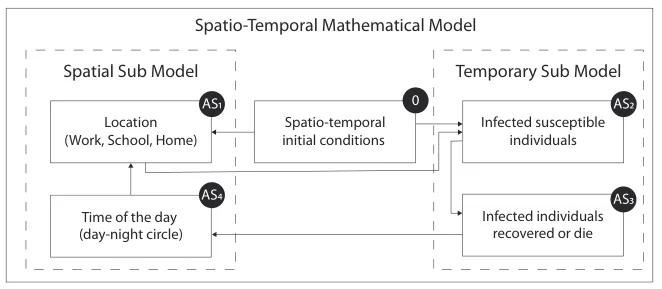
<figcaption><strong>Figure 1:</strong> The computational flow of an individual in the population, as performed by the proposed model for any algorithmic step (ASi) and the interactions between the temporal and spatial sub-models. AS1: The location of the individual is updated according to his state and time of the day. AS2: The individual is susceptible, and then becomes infected due to his location and the locations and state of the other individuals in the population. AS3: If the infected individual, according to the period, passes from being infected to becoming either recovered or dead. AS4 updates the time of the day. The order of {ASi}4 i=1 is immaterial to simulation and can be replaced in any other order. A detailed description of the model is presented in Sections 2.1 and 2.2.</figcaption>
</figure>

## 2 Model definition

The model can be mathematically described using an interaction between two sub-models: temporal (epidemiological) ODE-based (see Figure 2) with spatial (social) graph-based (see Figure 3) sub-models, as shown in Figure 1 [9]. This representation is hard to numerically solve due to the noncontinuous accrual as a result of the spatial dynamics (population mobility from home to work or school and back). In addition, this representation is also hard to be used to obtain analytical results, due to the nontrivial integration of ODE and graph theories. Therefore, we proposed a distributed system approach to simulate the proposed model (see Section 2.3). The examined NPI policies are treated as an additional layer to the model and modify several attributes of the model (for example, working-school hours modify the values of *t*a and *t*c).

The parameters used in the calculation of the model (if not stated otherwise) are presented in Table 1. The parameters *t*a, and *t*c are the hours of the day that adults and children are at home, estimated to be [0–15] and [0–19], respectively, such that there are nine working hours for adults and five school hours for children (during each 24 h day). A schematic description of the proposed model’s dynamics is shown below, using the interaction between two sub-models (temporal and spatial).

<figure id="fig-2">
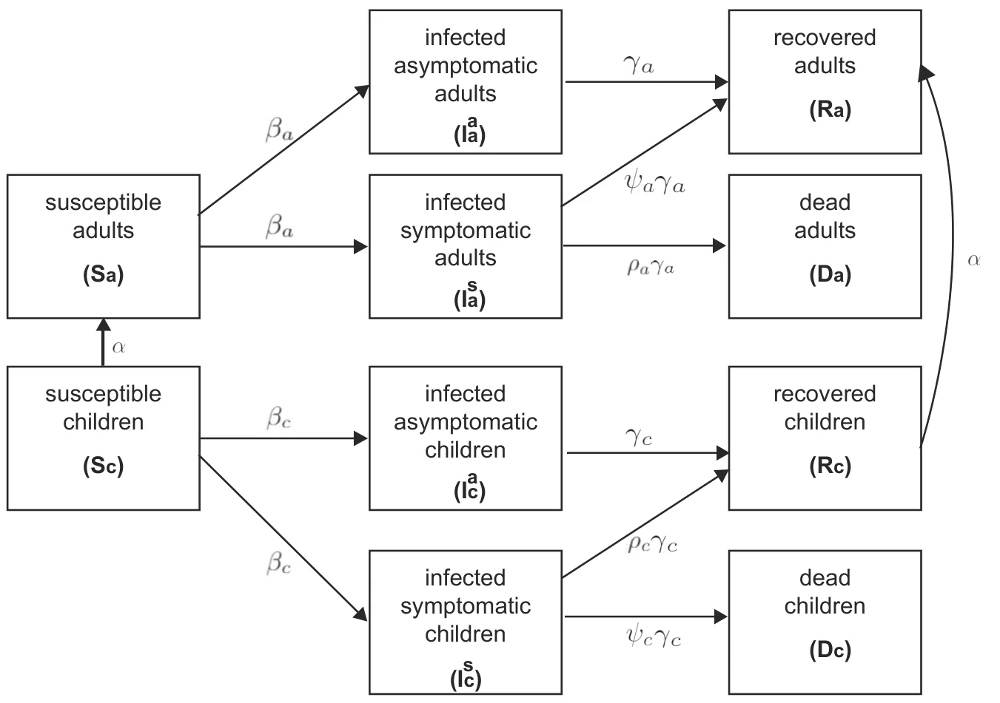
<figcaption><strong>Figure 2:</strong> Schematic view of transition between disease stages, divided by age-class.</figcaption>
</figure>

<figure class="table-figure" id="table-1">
<figcaption><strong>Table 1:</strong> Model parameter description, values, and sources.</figcaption>
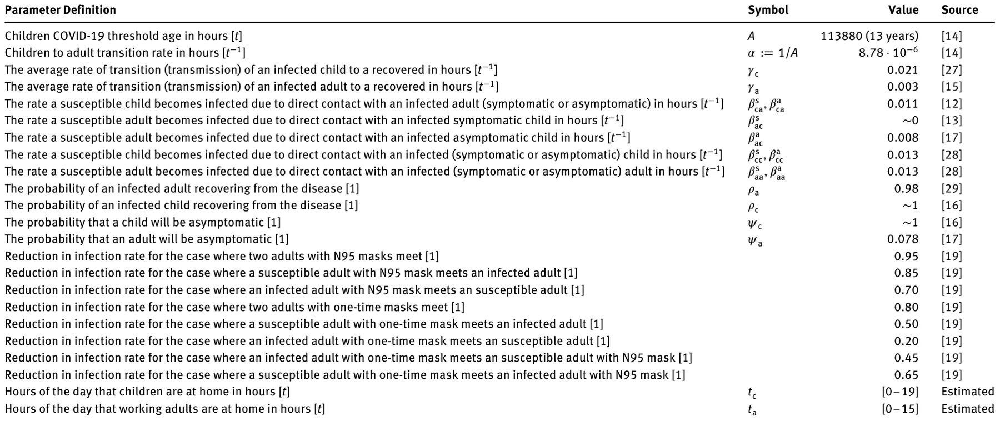

</figure>

<figure id="fig-3">
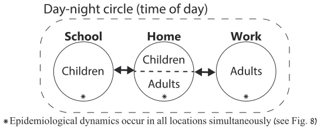
<figcaption><strong>Figure 3:</strong> A three-node line graph where the nodes represent school, home, and work, respectively, such that children can be located at home and school, and adults can be located at home and work. The location of each sub-population is defined by the time of the day, and the epidemiological dynamics occur in all locations simultaneously at all times. A detailed description of the population movement on the graph provided in Section 2.2.</figcaption>
</figure>

### 2.1 Temporal sub-model

The model considers a constant population with a fixed number of individuals *N*. For simplicity, and given the short time horizon of interest, we abstract from population growth. Each individual belongs to one of the five groups: susceptible (*S*), asymptomatic infected (*I*a), symptomatic infected (*I*s), recovered (*R*), and dead (*D*) such that *N* = *S* + *I*a + *I*s + *R* + *D*. Individuals in the first group have no immunity and are susceptible to infection. When an individual in the susceptible group (*S*) is exposed to the pathogen, the individual is transferred to either the asymptomatic infected group (*I*a) or symptomatic infected group (*I*s) at a rate *𝜓*. The individual stays in the symptomatic infected group on average *𝛾* days, after which the individual is transferred to the recovered group (*R*) or the dead group (*D*). Therefore, a rate of (1 −*𝜓*) of symptomatic infected individuals remain seriously ill or die while others recover. All asymptomatic infected individuals stay in the infected *I*a group on average *𝛾* days, after which the individual is transferred to the recovered group (*R*). The recovered are again healthy, no longer contagious, and immune from future infection.

We divide the population into two classes based on their age: children and adults, because these groups experience the disease in varying degrees of severity and have different infection rates [12, 15]. In addition, adults and children are present in various discrete locations throughout many hours of the day, which affects the spread dynamics.

Individuals below age *A* are associated with the “*children*” age-class while individuals in the complementary group are associated with the “*adult*” age-class. Since it takes *A* years from birth to move from a child to an adult age group, the conversion rate is set as *𝛼*:= 1∕*A*. We neglected the transformation of children into adults during the infection period, as on average, children recover in two days [14], resulting in a small percentage of children becoming adults, on average, during this period.

By expanding the designation to two age-classes, we let *S*c*, I*a c*, I*s c*, R*c*, D*c, *S*a*, I*a a*, I*s a*, R*a, and *D*a represent susceptible, asymptomatic infected, symptomatic infected, recovered, and death groups for children and adults, respectively such that

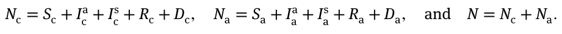

The epidemiological dynamics is described in Eqs. (1)–(10).

In Eq. (1), dSc(t) is the dynamic amount of susceptible children at home over time. It is affected by the d*t* following five terms: (1) each symptomatic infected child at home infects susceptible children at home at a rate *𝛽*s cc; (2) each asymptomatic infected child at home infects susceptible children at home at a rate *𝛽*a cc; (3) each infected symptomatic adult at home infects the susceptible children at home at a rate *𝛽*s ca; (4) each infected asymptomatic adult at home infects the susceptible children at home at a rate *𝛽*a ca; (5) children grow and pass from the children’s age-class to the adult’s age-class with transition at a rate *𝛼*, reduced from the children’s age-class. *N*c is the size of the children population and used to take all variables as fixed proportions of the population *N*.

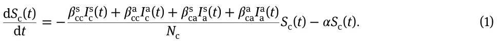

In Eq. (2), dSa(t) is the dynamic amount of susceptible adult individuals at home over time. It is affected d*t* by the following five terms: (1) children grow and pass from the children’s age-class to the adult’s age-class with transition rate *𝛼*, added to the adult age-class; (2) each symptomatic infected child at home infects the susceptible adult at home at a rate *𝛽*s ac; (3) each asymptomatic infected child at home infects the susceptible adult at home at a rate *𝛽*a ac; (4) each symptomatic infected adult at home infects a susceptible adult at home at a rate *𝛽*s aa; (5) each asymptomatic infected adult at home infects a susceptible adult at home at a rate *𝛽*a aa. *N*a is the size of the adult population and used to take all variables as fixed proportions of the population *N*.

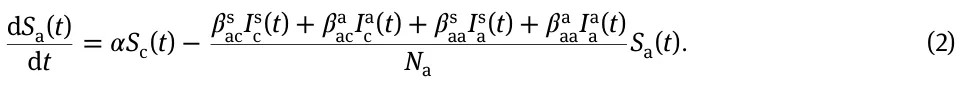

In Eq. (3), dIs c(*t*) is the dynamic amount of symptomatic infected children at home over time. It is affected by d*t* the following five terms: (1) children grow and pass from the children’s age-class to the adult’s age-class with transition rate *𝛼*, added to the adult age-class; (2) each symptomatic infected child at home infects the susceptible adult at home at a rate *𝛽*s ac; (3) each asymptomatic infected child at home infects the susceptible adult at home at a rate *𝛽*a ac; (4) each symptomatic infected adult at home infects a susceptible adult at home at a rate *𝛽*s aa; (5) individuals recover or die from the disease after period *𝛾*c. Terms {*𝛽*s cc*I*hs c (*t*)*, 𝛽*ha cc *I*a c(*t*)*, 𝛽*s ca*I*hs a (*t*)*, 𝛽*a ca*I*ha a (*t*)} multiplied by the probability a child will be symptomatic 1 −*𝜓*c.

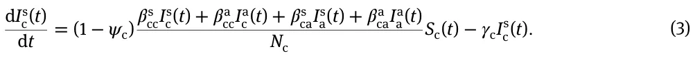

In Eq. (4), dIa c (*t*) is the dynamic amount of asymptomatic infected children at home over time. It is follows d*t* the dynamics presented in Eq. (3) but the probability a child will be asymptomatic is *𝜓*c.

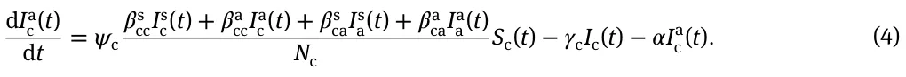

In Eq. (5), dIs a(*t*) is the dynamic amount of symptomatic infected adult individuals at home over time. It is d*t* affected by the following four terms: (1) children grow and pass from the children’s age-class to the adult’s age-class with transition rate *𝛼*, added to the adult age-class; (2) each symptomatic infected child at home infects the susceptible adult at home at a rate *𝛽*s ac; (3) each asymptomatic infected child at home infects the susceptible adult at home at a rate *𝛽*a ac; (4) each symptomatic infected adult at home infects a susceptible adult at home at a rate *𝛽*s aa; (5) individuals recover or die from the disease after period *𝛾*a.

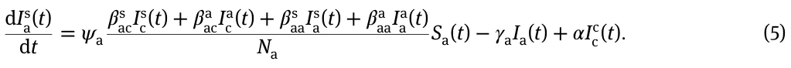

In Eq. (6), dIa a(*t*) is the dynamic amount of asymptomatic infected adults at home over time. It follows the d*t* dynamics presented in Eq. (5) but the probability an adult will be asymptomatic is *𝜓*a.

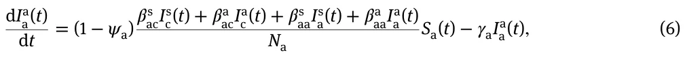

In Eq. (7), dRc(t) is the dynamic amount of recovered children at home over time. It is affected by the d*t* following two terms: (1) in each point, a portion of the infected children at home recover after period *𝛾*c which is multiplied by the rate of children at home that do recover from the disease *𝜌*c; (2) children grow from birth and pass from the children’s age-class to the adult age-class with transition rate *𝛼*, reduced from the children’s age-class.

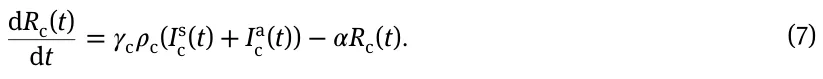

In Eq. (8), dRa(t) is the dynamic amount of recovered adult individuals at home over time. It is affected d*t* by the following two terms: (1) in each point, a portion of the infected adults at home recover after period *𝛾*a which is multiplied by the rate of adults that do recover from the disease *𝜌*a; (2) children grow from birth and pass from the children’s age-class to the adult age-class with transition rate *𝛼*, added to the adult age-class.

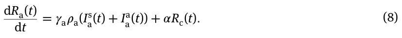

In Eq. (9), dDc(t) is the dynamic amount of dead children at home over time. It is affected by the portion d*t* of the infected children at home that do not recover after period *𝛾*c which is multiplied by the rate of children that do not recover from the disease 1 −*𝜓*c.

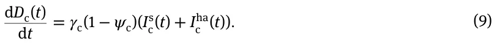

In Eq. (10), dDa(t) is the dynamic amount of dead adult individuals at home over time. It is affected by a d*t* portion of the infected adults at home that do not recover after period *𝛾*a which is multiplied by the rate of adults that do not recover from the disease 1 −*𝜓*a.

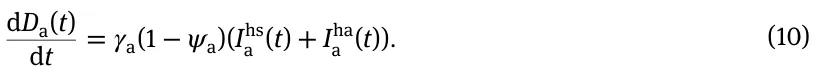

The dynamics of Eqs. (1)–(10) are summarized in Eq. (11). The initial conditions of Eq. (11) defined at Eq.

(12).

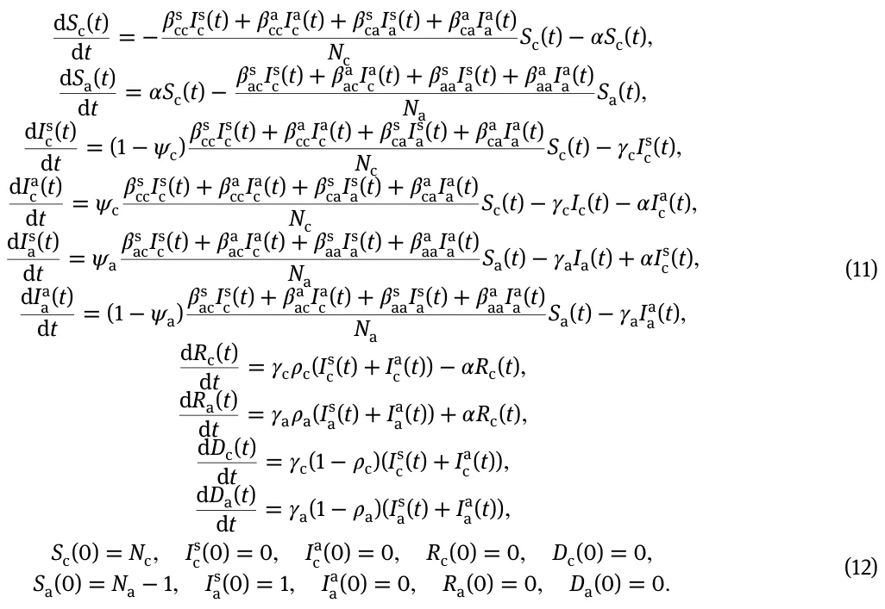

A schematic transition between disease stages and age groups of an individual is shown in Figure 2, such that *𝛽*c = (*𝛽*s cc*I*s c(*t*)+ *𝛽*a cc*I*a c(*t*) + *𝛽*s ca*I*s a(*t*) + *𝛽*a ca*I*a a(*t*) and *𝛽*a = *𝛽*s ac*I*s c(*t*) + *𝛽*a ac*I*a c(*t*) + *𝛽*s aa*I*s a(*t*) + *𝛽*a aa*I*a a(*t*), as the rate of susceptible children and adults becoming infected can be found by summing over the interaction rate with all four infected groups *I*s c*, I*a c*, I*s a*, I*a a.

### 2.2 Spatial sub-model

The spatial sub-model is a graph-based model. The population *N* from the temporal dynamics is allocated in some distribution to the nodes of an undirected, connected graph. Specifically, we used a three-node graph where each node represents a different location (home, work, school), as shown in Figure 3.

In addition, by dividing the time passed from the beginning of the temporal model *T* into a 24 h cycle, the model defines an hour-level discrete step in time. Each hour, the population on the graph is moving to one of the neighbor nodes of the node they are currently located at or stay in the same node, according to the following rules:

<figure id="fig-4">
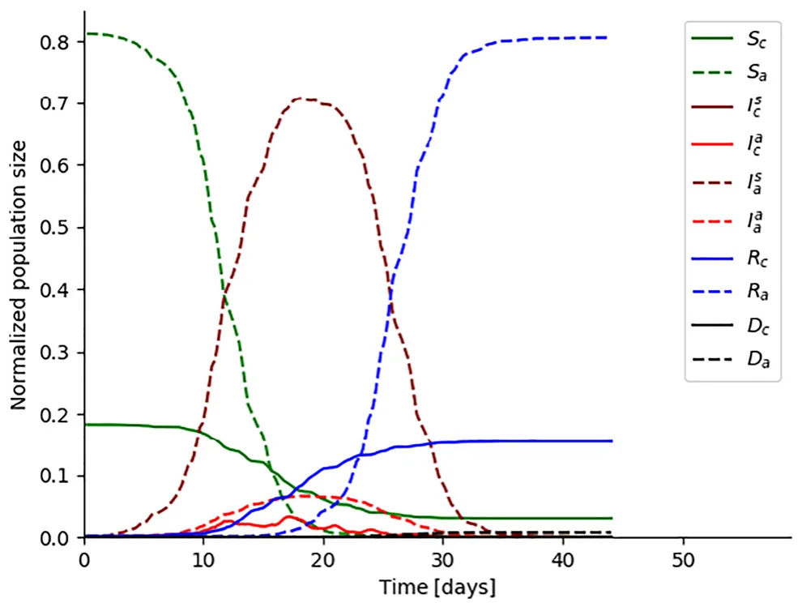
<figcaption><strong>Figure 4:</strong> Numerical simulation of trajectories of Eqs. (S1)–(S20) using the parameter values from Table. 1. The graphs show the evolution in time (days) of <em>S</em>c(<em>t</em>), <em>S</em>a(<em>t</em>), <em>I</em>s c(<em>t</em>), <em>I</em>a c(<em>t</em>), <em>I</em>s a(<em>t</em>), <em>I</em>a a(<em>t</em>), <em>R</em>c(<em>t</em>), <em>R</em>a(<em>t</em>), <em>D</em>c(<em>t</em>), and <em>D</em>a(<em>t</em>). Adult and children graphs are presented with a dotted and solid lines, respectively. Susceptible, symptomatic infected, asymptomatic infected, recovered, and dead are shown in green, dark red, red, blue, and black, respectively. The model’s parameter taken from Table 1.</figcaption>
</figure>

1. If *T* mod 24 = *t*d c , all of the children sub-population that is located at the *home* node moves to the *school* node.
2. if *T* mod 24 = *t*d

- a, all of the adult sub-population that is located at the *home* node moves to the *work* node. 3. if *T* mod 24 = 23, all of the adult sub-population that is located at the *work* node and all of the children sub-population that is located at the *school* node move to the *home* node.

We assume the transition from home to either work or school and back is immediate and that everybody is following the same clock. Otherwise, the distribution of the population on the graph stays the same. Between each population movement on the graph, the temporal sub-model is performed simultaneously on all the graph’s nodes (Figure 4).

### 2.3 Distributed system simulation method

Due to the fact that the proposed model is noncontinuous (as a result of the population mobility at *T* mod 24 ∈{*t*c*, t*a*,* 23}, and the relatively large number of equations – 30 equations (10 for each location), it is hard to numerically solve the results in both a stable and fast way. Therefore, we simulated the epidemiological and social dynamics at the individual level and the overall dynamics emerge from the interactions of the population. This method is hard to analyze, due to its asynchronous, stochastic nature; however, it does not suffer from the complexity to solve numerically Eqs. (1)–(10).

The method can be defined as follows. An individual is defined as an anonymous finite state machine (unidentified, without memory) with three attributes: age-group, location, and epidemiological stage. Because there are two age groups, three locations, and 10 epidemiological stages it is possible to represent each individual using 60 (practically speaking, 20 states are sufficient as each one from the two age-groups has only two possible locations and five possible epidemiological stages), each corresponding to a combination of these three attributes. For simplicity, we represent each state using a three-element tuple representing the age-group, current location, and epidemiological stage, respectively. In addition, each individual has an inner clock that counts the time he spends in the current state, and is set to zero when the individual’s state is changed.

At the beginning of the simulation, a population (*A*) is initialized with *N* individuals such that the distribution of the individuals’ states is set according to Eq. (12). In addition, the time of the day *T* is set to *T* = 0. Afterward, the following four algorithmic steps are repeated until

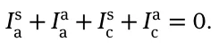

The first algorithmic step is children attend school and adults go to work, and vice versa, according to the time of the day. This is performed using Eq. (13).

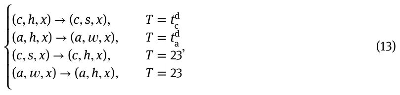

where the first element in the tuple is the age-group (c stands for children and a stands for adults), the second element is the location (h-home, s-school, and w-work), and the third element is the epidemiological state (*x* ∈[*S, I*a*, R, D*]).

Second, each individual is randomly pair-wise with other (non-dead) individuals. The pair-wise interaction updates both individuals’ state according to Eq. (14).

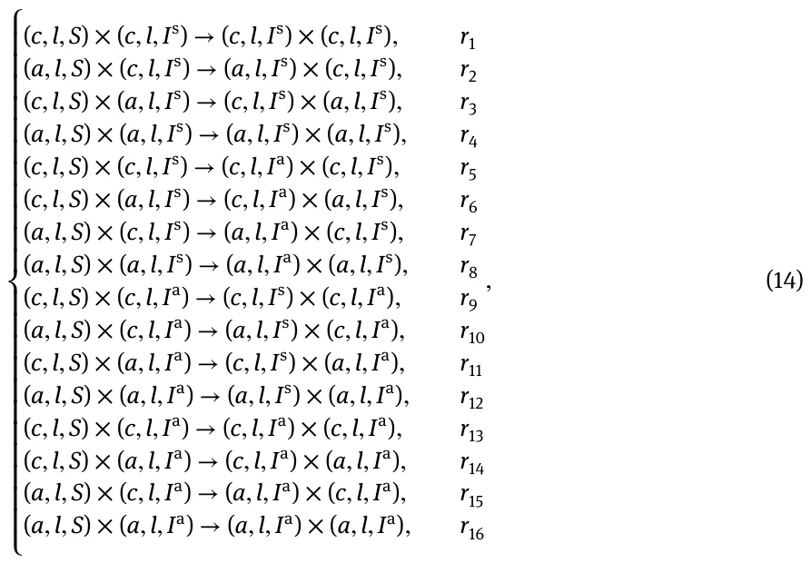

where *l* ∈{*h, s, 𝑤*} and {*r*i}16 i=1 is the chance that the transform is executed. Any other case that is not specifically mentioned in Eq. (14), is the identical function with chance 1.

Third, each asymptomatic infected individual is recovered when his inner clock reaches 1 𝛾. Similarly, each symptomatic infected individual is either recovered in probability *𝜌* or die when its inner clock is reaches 1 𝛾. Fourth, the time of the day is updated according to Eq. (15):

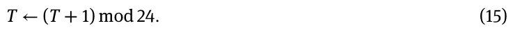

### 2.4 Model’s parameters

The values in Table 1 are cited from the sources [11–16, 18, 22, 29, 30] in the manuscript except for *A* which is calculated from the data of [14]. The threshold of the children’s age to become adults in parameter *A* is set at 13 years as the mean value of the group of ages in which the percentage of critical cases relative to all cases is the highest as reported by Dong et al. [14].

## 3 Results

Using a simulator based on the proposed model, the following five results are obtained. The robustness of the model is shown by comparing *R*0 based on data from three countries – USA, UK, and Russia, which were selected based on geographic distribution (America, Europe, and Asia), size, and lack of insulation from October 1 to November 1 (2020) (see Figures 5–7, S3, and S4) and the results of the proposed model. The effect of adults wearing masks on the base reproduction number *R*0 has been examined (Figures 8–11). The influence of school and working time on the spread of the pandemic is presented in Figure 10. The influence of school and working hours on the distribution of infections between home, school, and work is shown in Figure 11. We studied the combination of two NPI policies as crisis management policies (keeping the base reproduction number *R*0 ≤ 1) considering wearing masks and working and studying for a reasonable number of hours. Finally, we examined the influence of large social events on *R*0 (Figure 12).

<figure id="fig-5">
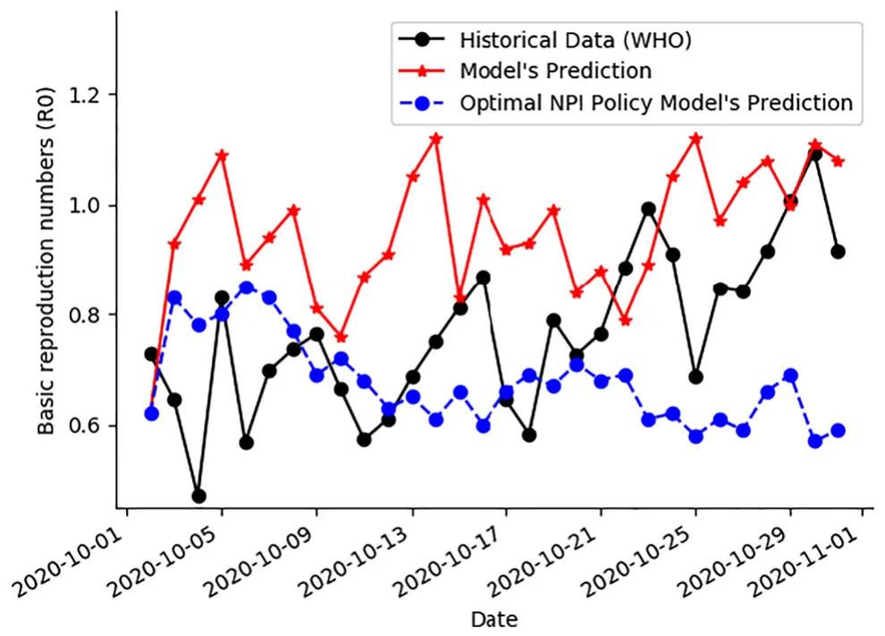
<figcaption><strong>Figure 5:</strong> Comparison of historical data of the COVID- 19 pandemic in the United States from October 1 to November 1 (2020) (black line with circles) and the model forecast (red line with asterisks), where adults wore 5% of the N95 masks and 10% of the disposable masks for nine working hours and five teaching hours. The dotted (blue) line represents the optimal dynamic policy: 5% of adults wear N95 masks, 45% wear disposable masks during 10 working hours. The children’s school day lasts 6 h. The model’s parameter taken from Table 1.</figcaption>
</figure>

<figure id="fig-6">
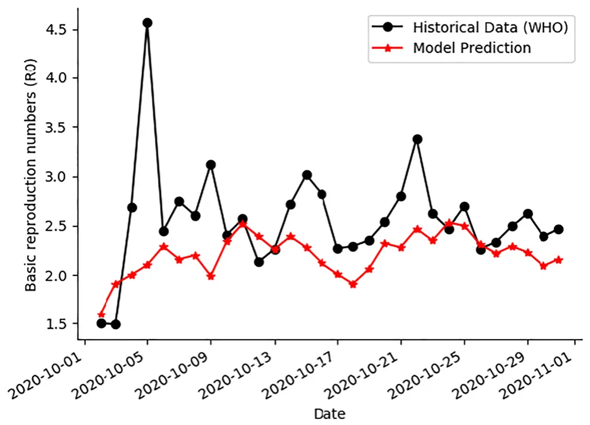
<figcaption><strong>Figure 6:</strong> Comparison of historical data of COVID-19 epidemics and model predictions for the daily <em>R</em>0 in the UK from October 1 to November 1 (2020) [3], where adults wear 5% N95 mask and 10% disposable mask all the time (both at work and at home). The model’s parameter taken from Table 1.</figcaption>
</figure>

<figure id="fig-7">
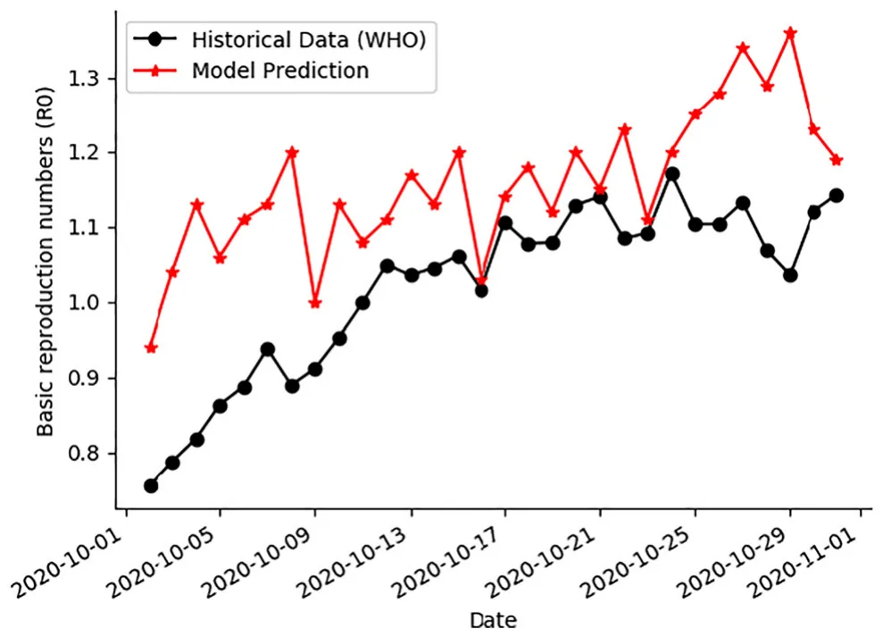
<figcaption><strong>Figure 7:</strong> Comparison of historical data of COVID-19 epidemics and model predictions for the daily <em>R</em>0 in Russia from October 1 to November 1 (2020) [3], where adults wear 5% N95 mask and 10% disposable mask all the time (both at work and at home). The model’s parameter taken from Table 1.</figcaption>
</figure>

<figure id="fig-8">
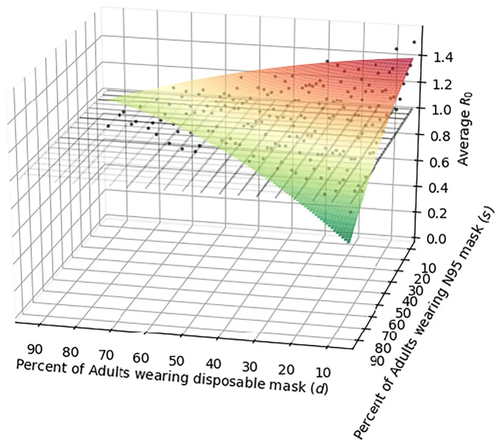
<figcaption><strong>Figure 8:</strong> The effect of adults wearing masks at work on the average <em>R</em>0 during October, in the USA, as a function of the percent of adults wearing N95 masks (<em>s</em>) and disposable masks (<em>d</em>). The black dots are the results of the simulations, and the surface is calculated using the LMS method on the dots using the family function presented in Eq. (20) which resulted in Eq. (21). We assume that children attend school and adults go to work for five and 9 h each day, respectively. The model’s parameter taken from Table 1.</figcaption>
</figure>

<figure id="fig-9">
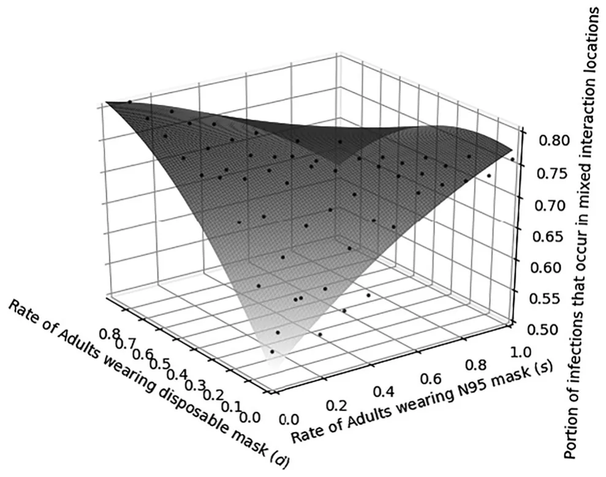
<figcaption><strong>Figure 9:</strong> The effect of adults wearing masks on the portion of the infections that occur in mixed interaction locations (e.g., home) from all infections, as a function of adults wearing disposable and N95 masks at home. The black dots are the mean result of five simulations, and the surface is calculated using the LMS method on the family function presented in Eq. (20) which resulted in Eq. (22). We assume adults work 9 h and children study 5 h a day. The model’s parameter taken from Table 1.</figcaption>
</figure>

<figure id="fig-10">
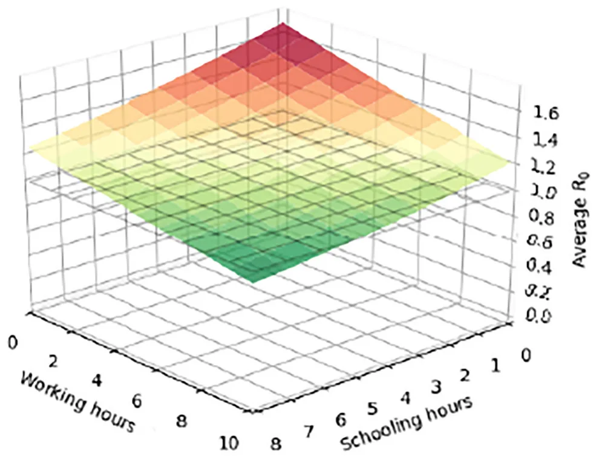
<figcaption><strong>Figure 10:</strong> The influence of the school-working hours on the average <em>R</em>0, in October (2020), as a function of the school (<em>t</em>c) and working (<em>t</em>a) hours, five days a week. We assume adults wear 10% – N95 masks and 40% – disposable masks at work and home. The function is fitted on a random sampling of the four-dimensional space <em>s, d, t</em>c<em>, t</em>a. Each point is simulated 20 times and the mean value has been taken. The surface follows Eq. (23) which is the casting of the four-dimensional fitted function to the (<em>t</em>a<em>, t</em>c) sub-space where (<em>s, d</em>) = (10<em>,</em> 40). The model’s parameter taken from Table 1.</figcaption>
</figure>

<figure id="fig-11">
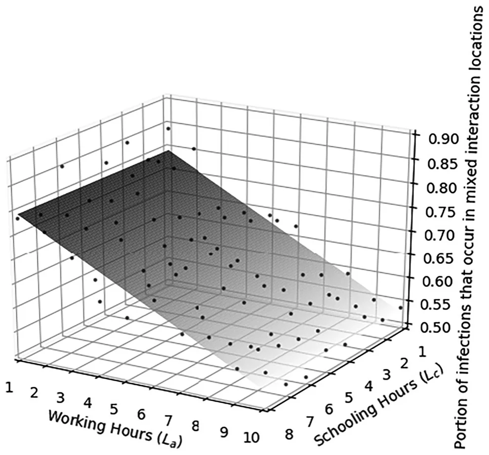
<figcaption><strong>Figure 11:</strong> The effect of working (<em>L</em>a) and school hours (<em>L</em>c) on the portion of the infections that occur in mixed interaction locations (e.g., home) from all infections, as a function of (<em>L</em>a) and (<em>L</em>c). The black dots are the mean result of five simulations while the surface is calculated using two-dimensional linear regression which resulted in Eq. (24). We assume 10% of adults are wearing N95 masks and 40% wearing disposable masks at all times. The model’s parameter taken from Table 1.</figcaption>
</figure>

<figure id="fig-12">
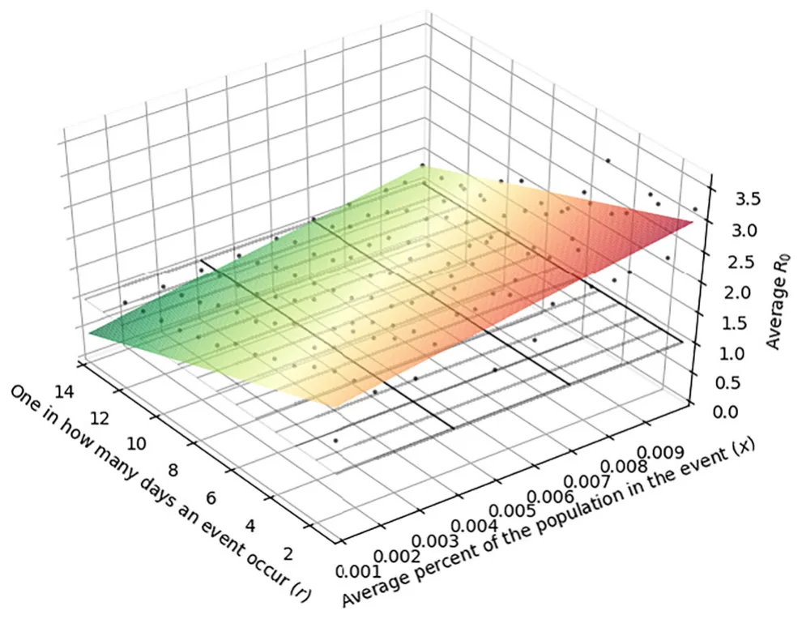
<figcaption><strong>Figure 12:</strong> The average (<em>R</em>0) as a function of the average rate of event occurrence (<em>r</em>) and the average percent of the population who participated in an event (<em>x</em>). The black dots are the mean result of five simulations, while the grid is calculated using a two-dimensional linear regression which resulted in Eq. (25). The model’s parameter taken from Table 1.</figcaption>
</figure>

### 3.1 Model dynamics

Figure 4 presents the model dynamics. The *x*-axis shows the time (in days) from the beginning of the simulation while the *y*-axis shows the distribution of the population to *S*c(*t*), *S*a(*t*), *I*s c(*t*), *I*a c(*t*), *I*s a(*t*), *I*a a(*t*), *R*c(*t*), *R*a(*t*), *D*c(*t*), and *D*a(*t*). The graph is similar to two instances of the classical SIR model [30], one for the adult population (*S*a(*t*), *I*a a(*t*), *I*s a(*t*), *R*a(*t*), and *D*a(*t*)) and one for the children population (*S*c(*t*), *I*a c(*t*), *I*s c(*t*), *R*c(*t*), and *D*c(*t*)). The initial condition is taken from Eq. (1) for USA on September 1 (2020) and scaled such that *N* = 10000. In addition, no NPI policy was used.

A maximum in the percent of infected children and adults (44%, 85%) is reached on the 18th day as shown in Figure 4. Therefore, the maximum infected population was 73.5% of the whole population. Besides, all children infected and recovered after 31 days (children did not die because *𝜓*c = 0) while all adults, except for 0*.*13% of the adult population that died during the pandemic, recovered after 41 days.

### 3.2 Validation of the model on the dynamics of the COVID-19 pandemic in the USA, UK, and Russia

To test the model, we calculated the average daily *R*0 in the USA, UK, and Russia for the period from October 1 to November 1 (2020), dividing the number of new cases by the total number of cases on that day (obtained from [3]).

This analysis was performed for the data from USA, UK and Russia as shown in Figures (5)–(7), with MSE of 0*.*0560*.*099 and 0.047. Therefore, the model obtain MSE of 0.067, on average.

#### 3.2.1 Model parameter fitting method

For each country’s analysis (Figures 2, 6 and 7), we calculated the parameters of the model based on the data from September 1 to October 1 (2020). Given the initial conditions of each country, the parameter space (*𝛽*j i ), and the historical data from [3], we used the gradient descent method [31] with the loss function *d* to obtain the best representing values for the model’s parameters such that *d* is defined as follows:

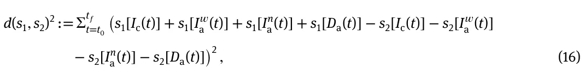

where [*t*0*, t*f] is the segment in time where the comparison between two dynamics (*S*1 and *S*2) takes place.

The start condition was taken from Table 1 in the manuscript and the *estimated* values obtained by the Monte-Carlo method sampled 1000 random parameter values (marked by *X*) and used the one that fulfils minx*d*(*x*). The results of this process are the (*𝛽*j i ) parameters that best fit the dynamics using the proposed model.

For these three countries, we fitted the model’s parameters, based on the data from September 1 to October 1. We simulated the proposed model and calculated *R*0(*t*) = (*I*(*t*) −*I*(*t* −1))∕(*R*(*t*) −*R*(*t* −1)).

#### 3.2.2 Usa

From [3], there were 655567 infected at October 1. Given that the average recovery rate of children is 2 days and adults is 14 days [15, 27], and that children compose 18.5% of the population, we obtained that there were approximately 534289 infected adults and 121278 infected children. We assumed that the number of recovered individuals is heterogeneous across the population and that only adults die from the epidemic, as a result of the disease, up until this point. Equation (17) shows the initial conditions for October 1, 2020 (*t*0), USA.

The obtained values of *R*0 as shown in Figure 5, with a mean square error (MSE) of 0.056.

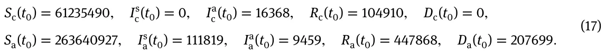

#### 3.2.3 Uk

The same procedure conducted for the USA is repeated for UK. From [3], there were 453264 infected at October 1 (2020) and as children are 12% of the population, we obtain that there were approximately 398872 infected adults and 1710 infected children. Equation (18) shows the initial conditions for October 1 (*t*0) in UK. We assume all individuals are home at the beginning of the simulation (as the time is midnight). The obtained values of *R*0 are shown in Figure 6, with a mean square error (MSE) of 0.099.

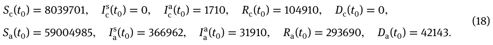

One can notice that on October 5 (2020), *R*0 = 4*.*56 which is an anomaly in October’s daily *R*0 because of its z-score of 3.77 (where the mean is 2.568 and the standard deviation is 0.529). One possible explanation of this anomaly is the fact that nine days before, on September 26 there was a large scale protest in London where thousands of individuals participated, largely without masks or social distancing.1

#### 3.2.4 Russia

The same procedure conducted for the UK and USA is repeated for Russia. From [3], there were 1176286 infected at October 1 (2020) and as children are 18.15% of the population, we obtain that there were approximately 7083 infected adults and 100882 infected children. Equation (19) shows the initial conditions for October 1 (*t*0) in Russia. The obtained values of *R*0 are shown in Figure 7, with a mean square error (MSE) of 0.047.

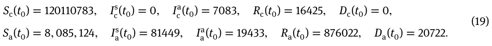

### 3.3 Masks NPI policy

We examined the influence of adults wearing masks on the average *R*0 and the distribution in locations where infections take place. First, we simulated the influence of masks worn by adults at work on the average *R*0 in October (2020), taking the initial condition from the USA (Eq. (17)) and the parameters from Table 1. We defined *s* as the percent of adults wearing N95 masks and *d* as the percent of adults wearing disposable masks, such that *s* + *d* ≤ 100%. The results of the simulations are fitted using the least mean square (LMS) method [32]. The family function for the surface approximation is

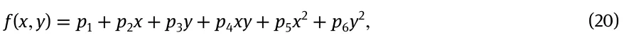

to balance between the accuracy of the sampled data on the one hand and simplicity of usage on the other [33] resulted in:

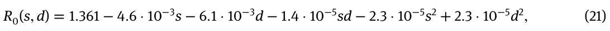

and was obtained with a coefficient of determination *R*2 = 0*.*792. The results are presented in Figure 8 as an average of 20 repetitions. From Eq. (21), the coefficients of the first-order terms, both the N95 and disposable

**1** https://www.theguardian.com/world/2020/sep/26/london-lockdown-protesters-urged-to-follow-covid-rules.

masks reduce the infection rate in the same order of magnitude. Furthermore, from the coefficients of the second-order terms, the second-order influence (the infection of an individual from a third-party individual) of people wearing either N95 masks, disposable masks, or a combination of the two is in the same level of magnitude. Namely, on average, the N95 and disposable masks have a similar effect on second-ordered infection over time.

Second, the influence of adults wearing masks (disposable and N95) on the distribution of locations in which infections occur, is simulated and the portion of infections that happen in mixed interaction (between adults and children) locations (for example, home, car, mall, etc.) is shown in Figure 11, as a function of adults wearing disposable (d) and N95 (s) masks. Equation (24) is the result of fitting a linear function on the simulated data:

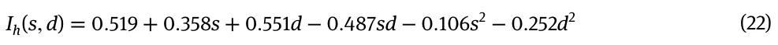

and was obtained with a coefficient of determination *R*2 = 0*.*942.

### 3.4 School-working hours optimal policy

We examined the effect of the school-working hours modification NPI policy on the pandemic spread *R*0 and the distribution in locations of where infections take place. This policy is a relaxed version of the lockdown policy as individuals are partially able to continue their regular life (children attend school, adults go to work) which has been implemented by several governments (for example, Peru, UK, etc.) and shown to be effective from an epidemiological point of view but produces significant damage to the economy, mental health and morale [34, 35].

Figure 10 shows the fitted function *R*0(*t*c*, t*a) trimmed to maximum eight school hours and 10 working hours to examine real-life policies. *R*0(*t*c*, t*a) belongs to the function family presented in Eq. (20) where 10% of adults are wearing N95 masks and 40% disposable masks all day (both at work and home). Equation (23) is the casting of the four-dimensional *s, d, t*c*, t*a fitted function where (*s, d*) = (10*,* 40) to the (*t*a*, t*c) sub-space:

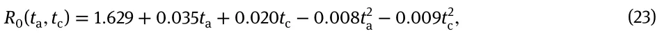

and was obtained with a coefficient of determination *R*2 = 0*.*418 and goodness of fit 10.12. From Eq. (23), assuming adults go to work 10 h during the workday and children attend school for more than 5.7 h each day, the pandemic will not break out as shown in Figure 10.

The influence of working and school hours on the distribution of locations in which infections occur, is simulated and the portion of infections that happen in mixed interaction locations (e.g., home) is shown in. Figure 11, as a function of the working (*L*a) and school (*L*c) hours such that 10% of adults are wearing N95 masks and 40% disposable masks at all times (at work and home). Equation (24) is the result of performing two-dimensional linear regression on the simulated data:

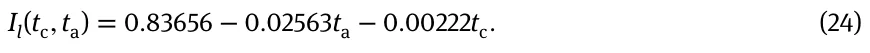

The model was fitted with a coefficient of determination *R*2 = 0*.*918.

### 3.5 Event influence on R0

We examine the influence of large size social events on the (*R*0). Such events can be characterized via two parameters, the average rate of occurrence (*r*) and the average rate of participants in an event (*x*). In an event, if an individual is susceptible, the individual will be infected. Figure 12 shows *R*0 as a function of *r* and *x*, such that 5% of adults are wearing N95 masks and 10% disposable masks at all times (both at work and home). In addition, children attend school for 5 h and adults go to work for 9 h each day. Equation (25) is the result of performing a two-dimensional linear regression on the simulated data:

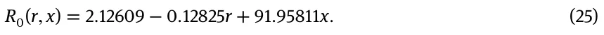

The model was fitted with a coefficient of determination *R*2 = 0*.*979. It is possible to allow crowds of less than 0.006% of the population (e.g., at weddings) once every two weeks (or less) without the risk of an outbreak as shown in Figure 12 and Eq. (25).

## 4 Discussion

In the case of a future pandemic virus, researchers will be able to use our approach to predict the consequences of several NPI policies on the pandemic with the ability to merge several NPIs into a single more complex NPI. We show the influence of NPI policies on the COVID-19 pandemic based on the proposed model by developing an optimal NPI. The crisis caused by the COVID-19 pandemic is unique in that the global collapse has been more dramatic than most of the previous epidemics of the 20th century. Consequently, models are required that provide conditions for normalizing life with the COVID-19 virus, and this is precisely what our research aim.

The model has four extensions to the traditional SIR model (dead group, separation into age groups, separation into asymptomatic and symptomatic groups, and including graph-based spatial dynamics). In addition, there are two extensions in the NPI-level dynamics which are two types of masks and regulation of large social events.

Using these extensions, the model confirms the dynamics that took place between October 1 and November 1 (2020) in the US, UK, and Russia as presented in Figures 5–7, respectively, with an average MSE of 0.067 on the daily *R*0. Therefore, it is safe to claim that the model predicts the average dynamics of the pandemic with fair accuracy, assuming 5% of adults wear N95 and 10% wear disposable masks at work, and clock in nine working hours, while children attend school for 5 h (not including weekends). Therefore, the model can be used to predict the pandemic spread in a limited warranty. When the model is used to such manner, it is recommend to make sure it over-estimation rather than under-estimation the historical data for prevention proposes.

The model shows that mask-wearing indeed reduces *R*0, as shown in Figure 8. Based on the historical data [3] from the US on October 1 (2020), it requires more than 60% of the adults to wear N95 masks or more than 89% to wear disposable masks at work to keep the *R*0 ≤ 1 while maintaining nine working and five school hours, as shown in Figure 8. Therefore, wearing masks by adults probably cannot prevent an outbreak (*R*0 ≤ 1) but it is unlikely to assume 60% of the adult population acquires N95-like masks. Similarly, the scenario in which almost nine out of 10 adults wear masks all the time is unlikely. Indeed, similar results obtained by Aglar et al. [36].

Lockdown policies have proven to be an effective NPI but have a negative effect on the economy and social morale [34, 35]. The model shows that it is possible to relax the lockdown NPI by modifying the working and school hours. Indeed, if only half of the adult population (10% with N95 masks and 40% with disposable masks) are wearing masks, by setting the working and school hours to at least 8 h (or at least 10 working hours and six school hours) the outbreak is prevented (e.g., *R*0 ≤ 1), as shown in Figure 10, because more working and school hours produce smaller *R*0. This may seem counter-intuitive, but Figure 11 shows that more working and school hours reduce the infection in mixed interaction locations (e.g., home), which actually has a significant second-order decrease in *R*0 as shown in Eq. (23) (the coefficients of *t*2 a and *t*2 c). Therefore, more working and school hours invigorates more aggressive pandemic spread at the beginning, but in total reduces the pandemic. These results align the conclusions of Keskinocaket et al. [37] for Georgia state and by Lazebnik et al. [9, 38] for the state of Israel for the number of activity hours in order to obtain *R*0 ≤ 1.

In addition, as large events are shown to be infection centers [21] on the one hand but an integral part of social life, it is unlikely to prevent all large social events, and therefore the infection due to large social events can be controlled by the occurrence of such events and their average number of participants. If such events occur once every two weeks (14 days), 15% (5% with N95 masks and 10% with disposable masks) of the adults wearing masks and no children participants in the event, can be up to 0.0036 percent of the population (for the US it is around 12000 individuals) and still prevent an outbreak (*R*0 ≤ 1), as shown in Figure 12.

## 5 Conclusion

The model developed in this study allows us to examine the impact of NPI policies (specifically, masks wearing, school-work duration’s, and occurrence of large scale social event) on the course of a pandemic spread.

The model is implemented to the COVID-19 outbreak and extends the traditional SIR model by introducing a dead group, time dimension, two age groups (children and adults), and three locations where individuals can be present during the day. The proposed spatial-temporal interactions allow us to explore the effect of multiple NPIs and their combinations on the spread of the pandemic such as shown in Figures 8, 11, and 12.

As a complement to the model, we provide an open-source code that can be used as an *in silico* environment (simulator) that is deployed as a web-based service.2 Furthermore, *in silico* environment allows non-technical individuals (e.g., policymakers) to incorporate real-time data in our simulator and investigate the way proposed NPI policies influence the economy and the dynamics of the outbreak, in a wide range of scenarios.

**Author contribution:** All the authors have accepted responsibility for the entire content of this submitted manuscript and approved submission.

**Research funding:** None declared.

**Conflict of interest statement:** The authors declare no conflicts of interest regarding this article.

## References

1. J. Chen, T. Qi, L. Liu, et al., ‘‘Clinical progression of patients with Covid-19 in Shanghai, China,’’ J. Infect., vol. 80, pp. e1−e6, 2020.
2. Eurosurveillanc Editorial Team, ‘‘Note from the editors: world health organization declares novel coronavirus (2019-ncov) sixth public health emergency of international concern,’’ Euro Surveill., vol. 25, p. 200131e, 2020.
3. World Health Organization, WHO coronavirus disease (covid-19) dashboard (2020).
4. A. Desvars-Larrive, E. Dervic, N. Haug, et al., ‘‘A structured open dataset of government interventions in response to Covid-19,’’ Sci. Data, vol. 7, pp. 285, 2020.
5. B. W. Head, ‘‘Three lenses of evidence-based policy,’’ Aust. J. Publ. Adm., vol. 67, pp. 1−11, 2007.
6. J. C. Miller, ‘‘Mathematical models of sir disease spread with combined non-sexual and sexual transmission routes,’’ Infect. Dis. Model., vol. 2, pp. 35−55, 2017.
7. C. Scoglio and F. D. Sahneh, ‘‘Epidemic spread in human networks,’’ in IEEE Conference on Decision and Control and European Control Conference, 2011.
8. A. R. Tuite, D. N. Fisman, and A. L. Greer, ‘‘Mathematical modelling of Covid-19 transmission and mitigation strategies in the population of Ontario, Canada,’’ Can. Med. Assoc. J., vol. 192, pp. E497−E505, 2020.
9. T. Lazebnik and S. Bunimovich-Mendrazitsky, ‘‘The signature features of Covid-19 pandemic in a hybrid mathematical model − implications for optimal work−school lockdown policy,’’ Adv. Theory Simulat., vol. 4, p. 2000298, 2021.
10. W. O. Kermack and A. G. McKendrick, ‘‘A contribution to the mathematical theory of epidemics,’’ Proc. R. Soc. A, vol. 115, 1927. [doi:10.1098/rspa.1927.0118](https://doi.org/10.1098/rspa.1927.0118)
11. S. Zhao, L. Stone, D. Gao, et al., ‘‘Imitation dynamics in the mitigation of the novel coronavirus disease (Covid-19) outbreak in Wuhan, China from 2019 to 2020,’’ Ann. Transl. Med., vol. 8, p. 488, 2020.
12. C. Jiehao, X. Jin, L. Daojiong, et al., ‘‘A case series of children with 2019 novel coronavirus infection: clinical and epidemiological features,’’ Clin. Infect. Dis., vol. 71, pp. 1547−1551, 2020.
13. J. She, L. Liu, and W. Liu, ‘‘Covid-19 epidemic: disease characteristics in children,’’ J. Med. Virol., vol. 92, pp. 747−754, 2020.
14. Y. Dong, X. Mo, Y. Hu, et al., ‘‘Epidemiological characteristics of 2143 pediatric patients with 2019 coronavirus disease in China,’’ Pediatrics, vol. 58, pp. 712−713, 2020.
15. I. Voinsky, G. Baristaite, and D. Gurwitz, ‘‘Effects of age and sex on recovery from Covid-19: analysis of 5769 israeli patients,’’ J. Infect., vol. 81, pp. e102−e103, 2020.
16. A. A. Kelvin and S. Helperin, ‘‘Covid-19 in children: the link in the transmission chain,’’ Lancet, vol. 20, pp. 633−634, 2020. 2 https://teddylazebnik.info/coronavirus-sir-simulation/pandemic\_managment.html. [link](https://teddylazebnik.info/coronavirus-sir-simulation/pandemic_managment.html)
17. J. He, Y. Guo, R. Mao, and J. Zhang, ‘‘Proportion of asymptomatic coronavirus disease 2019: a systematic review and meta-analysis,’’ J. Med. Virol., vol. 93, pp. 1−11, 2020.
18. A. Viguerie, G. Lorenzo, F. Auricchio, et al., ‘‘Simulating the spread of Covid-19 via a spatially-resolved susceptible−exposed−infected−recovered−deceased (seird) model with heterogeneous diffusion,’’ Appl. Math. Lett., vol. 111, p. 106617, 2020.
19. K. O’Dowd, K. M. Nair, P. Forouzandeh, et al., ‘‘Face masks and respirators in the fight against the Covid-19 pandemic: a review of current materials, advances and future perspectives,’’ Materials, vol. 13, p. 3363, 2020.
20. T. Li, Y. Liu, M. Li, X. Qian, and S. Y. Dai, ‘‘Mask or no mask for Covid-19: a public health and market study,’’ PloS One, vol. 15, 2020, Art no. e0237691.
21. M. N. Saidana, M. A. Shboolb, O. S. Arabeyyatc, S. T. Al-Shihabib, Y. Al Abdallatb, M. A. Barghashb, and H. Saidand, ‘‘Estimation of the probable outbreak size of novel coronavirus (Covid-19) in social gathering events and industrial activities,’’ Int. J. Infect. Dis., vol. 98, pp. 321−327, 2020.
22. D. Acemoglu, V. Chernozhukov, I. Werning, and M. D. Whinston, ‘‘Optimal targeted lockdowns in a multi-group sir model,’’ in Working Paper 27102, National Bureau of Economic Research, 2020.
23. Z. A. Bethune and A. Korinek, ‘‘Covid-19 infection externalities: trading off lives vs. livelihoods,’’ in Working Paper 27009, National Bureau of Economic Research, 2020.
24. M. Bodenstein, G. Corsetti, and L. Guerrieri, ‘‘Social distancing and supply disruptions in a pandemic,’’ Econ. Res., 2020. [doi:10.17016/feds.2020.031](https://doi.org/10.17016/feds.2020.031)
25. D. Krueger, H. Uhlig, and T. Xie, ‘‘Macroeconomic dynamics and reallocation in an epidemic: evaluating the ‘Swedish Solution’,’’ in Working Paper 27047, National Bureau of Economic Research, 2020.
26. G. Quaas, ‘‘The reproduction number in the classical epidemiological model,’’ in Working Paper 167, Universität Leipzig, Wirtschaftswissenschaftliche Fakultät, Leipzig, 2020.
27. Y. Dong, X. Mo, Y. Hu, et al., ‘‘Epidemiology of Covid-19 among children in China,’’ Pediatrics, vol. 145, p. e20200702, 2020.
28. H. Nishiura and T. Kobayashi, ‘‘Estimation of the asymptomatic ratio of novel coronavirus infections (Covid-19),’’ Int. J. Infect. Dis., vol. 94, pp. 154−155, 2020.
29. M. R. Mehra, S. S. Desai, S. Kuy, T. D. Henry, and A. N. Patel, ‘‘Cardiovascular disease, drug therapy, and mortality in Covid-19,’’ N. Engl. J. Med., vol. 382, p. e102, 2020.
30. W. Yang, D. Zhang, L. Peng, C. Zhuge, and L. Liu, ‘‘Rational evaluation of various epidemic models based on the Covid-19 data of China,’’ arXiv, 2020.
31. B. C. Haskell, ‘‘The method of steepest descent for non-linear minimization problems,’’ Q. Appl. Math., vol. 2, pp. 258−261, 1944.
32. A. Björck, ‘‘Numerical methods for least squares problems,’’ SIAM J. Sci. Stat. Comput., 1996. [doi:10.1137/1.9781611971484](https://doi.org/10.1137/1.9781611971484)
33. L. Shanock, B. Baran, W. Gentry, S. C. Pattison, and E. D. Heggestad, ‘‘Polynomial regression with response surface analysis: a powerful approach for examining moderation and overcoming limitations of difference scores,’’ J. Bus. Psychol., pp. 543−554, 2010. [doi:10.1007/s10869-010-9183-4](https://doi.org/10.1007/s10869-010-9183-4)
34. R. J. C. Calderon-Anyosa and J. S. Kaufman, ‘‘Impact of Covid-19 lockdown policy on homicide, suicide, and motor vehicle deaths in Peru,’’ Prev. Med., vol. 143, p. 106331, 2021.
35. D. Ding, B. Del Pozo Cruz, M. A. Green, and A. E. Bauman, ‘‘Is the Covid-19 lockdown nudging people to be more active: a big data analysis,’’ Br. J. Sports Med., vol. 54, pp. 1183−1184, 2020.
36. B. E. Oruc, A. Baxter, P. Keskinocak, J. Asplund, and N. Serban, Homebound by Covid19: The Benets and Consequences of Non-pharmaceutical Intervention Strategies, Research Square, 2020.
37. A. Baxter, B. E. Oruc, P. Keskinocak, J. Asplund, and N. Serban, ‘‘Evaluating scenarios for school reopening under Covid19,’’ medRxiv, 2020.
38. T. Lazebnik, L. Shami, and S. Bunimovich-Mendrazitsky, ‘‘Spatio-temporal influence of non-pharmaceutical interventions policies on pandemic dynamics and the economy: the case of Covid-19,’’ Epidemiologic-Economic, 2021. Material: The online version of this article offers supplementary material (https://doi.org/10.1515/ijnsns-2021-0063). [doi:10.1080/1331677x.2021.1925573.Supplementary](https://doi.org/10.1080/1331677x.2021.1925573.Supplementary)
