## 1. Introduction

Spatio-temporal mathematical models of biological processes, which take place in a domain with a known boundary, are commonly represented by a system of partial differential equations (PDEs). But when the boundary of the domain varies in time, some assumptions must be made on the dynamics of the boundary that will enable us to solve the PDE system simultaneously with the unknown boundary.

In some cases where these assumptions are not necessarily correct, an entirely different approach, known as agent-based simulation (ABS) may be more, or equally, useful. ABS is a stochastic model where, in a biological process, cells move in a grid-geometry, and proteins determine the dynamics of the environment. In ABS, no assumptions are imposed on the unknown boundary, but in order to derive “reliable”

results, one must perform many repetitions of the simulation and then take their average.

provided the original author and source are credited.

Data availability statement: All relevant data In this paper, we use both methods (PDE and ABS) to address a biomedical are within the paper. problem and compare their respective conclusions. The problem is to determine Funding: The author(s) received no specific the in-time closure of an ischemic dermal wound with or without therapy. This is an funding for this work. important medical problem, since wounds that remain open for a long time increase Competing interests: The authors have the risk of infection in the whole body.

declared that no competing interests exist.

The skin has three main layers: the dermis is the middle layer, the epidermis layer is above, and the hypodermis is below. The epidermis is the thinnest layer; it helps hydrate the body and protect it from damage. Most of the cells in the epidermis are keratinocytes, a highly specialized type of epithelial cells. The dermis is the thickest layer of the skin. It supports the epidermis by providing strength and flexibility, and its blood arteries transport (by diffusion) nutrients to the cells in the epidermis. The dermis also contains sweat glands, hair follicles, collagen and elastin, and nerve cells. The hypodermis (subcutaneous tissue) connects the skin to the muscles and bones of the body.

The healing process of dermal wounds is divided into four overlapping phases. In the first phase, clotting factors are delivered by platelets immediately after injury. In the second phase, called the inflammatory phase, platelets release growth factors (PDGF), which attract pro-inflammatory M1 macrophages to clear the inflammation in the open wound. In the next phase, called the proliferative phase, M1 macrophages polarize into anti-inflammatory M2 macrophages who, together with fibroblasts (*F*), begin the process of closing the wound. The expected time for normal wound closure is a few weeks, after which the phase of scar formation begins, and its completion may take many months. For definiteness, we assume that the expected closure of the wound is 30 days.

The closure of the wound in an expected time depends on a normal supply of oxygen by the peripheral artery. In ischemic wounds, where the peripheral artery in the dermis is impaired, resulting in oxygen deficiency, wound closure, in expected time, may not be completed without intervention by oxygen infusion. This situation was mathematically modeled in [1], in the special case of radially symmetric “flat” wounds, with radius *R*(*t*), where the depth of the dermal wound is ignored. The wound healing model in [1] was represented by a PDE system of equations in the “partially healed tissue” (PHT), *R*(*t*) < *r* < *B* where *B* > *R*(0). The model included, in addition to macrophages and fibroblasts, also vascular endothelial growth factor (VEGF) which promotes angiogenesis, and density, *ρ*, of the extracellular matrix (ECM). However, in order to derive an equation for the unknown boundary, *r* = *R*(*t*) of the open wound, several assumptions had to be made.

The first assumption in [1] was that PHT has the structure of upper convected Maxwell fluid with constant parameters independent of space, and the healing dynamic is quasi-static. This led to an equation for the ECM velocity *v* = *v*(*r*, *t*) of the form:

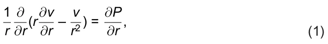

where *P* is the internal isotropic pressure associated with the ECM density (*ρ*) in PHT. The second assumption was that *P* depends on *ρ* as follows:

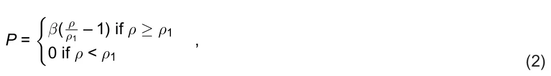

for some parameters *β*, *ρ*1. The third assumption was that ECM and all cells and cytokines move with velocity *v*, and, in particular, *dR*/*dt* = *v*(*R*(*t*), *t*). Nevertheless, it was shown in [1] that the model simulations are in agreement with experimental results for ischemic dermal wounds.

It was subsequently shown, for this model, in [2], by mathematical analysis and simulations, that the time of wound closure increases if the oxygen supply from the boundary *r* = *B* decreases.

The above model was later extended to include the depth of dermal wounds and wounds with non-spherical shapes. In [3], axially symmetric wounds were considered, and in [4], general 3d wounds were studied, by analysis, and with simulation in axially symmetric wounds. The model in [1] was extended in [5] to simulate wound healing and wound closure of chronic wounds in diabetes and obesity. We note, however, that all the above models do not include the role played by keratinocytes, who are the predominant cells in the epidermis [6,7].

Agent-based model (ABM) is a computational model for simulating the action and interactions of autonomous agents [8], while agent-based simulation (ABS) refers to computer implementation.

There are several models of wound healing based on ABM approach [9–12]; they represent activities between discrete cells, proteins, and other molecules, outside the wound, with cell migration of epithelial cells and other cells (e.g., immune cells, fibroblasts) into the wound.

ABS models have been used in cancer biomedicine; see comprehensive review in [13]. ABS models that use differential equations to qualify selected pathways, or communication between cells appeared in [14–17].

In this paper, we model the healing process only inside the wound, a region we call the partial healing wound (PHW). In the radially symmetric flat wound, *PHW*(*t*) = {*R*(*t*) < *r* < *R*(0)}. We are interested in the progress to wound closure of the epidermis layer, and, accordingly, we shall focus only on the proliferative phase of wound healing. Although dermal wounds may extend to the full thickness of the dermis, we shall consider here only the wound closure achieved by the keratinocytes, at the epidermal layer.

We first develop a PDE model of a radially symmetric flat wound with Eqs. (1−2) but include in the “flat wound” the epidermal layer whose thickness is very small, 0.07–0.15 mm [18]. The model variables include keratinocyte cells (*E*), which make up 90% of the epidermal cells [19], epidermal macrophages (*M*) [20], skin that fibroblasts (*F*) [21] which produce the ECM of the epidermis [22], density of ECM (*ρ*), VEGF (*V*), oxygen (*W*), TGF-*β* (*T*β), and wound area (*A*(*t*) = *πR*2(*t*)).

Fig 1 is a network of interactions among the model variables; it will guide the development of the PDE model, and partially also of the ABS model.

## 2. Mathematical model

### 2.1. PDE model

The model variables are listed in Table 1 in densities with units of *g*/*cm*3.

The model is represented by a system of partial differential equations in the region *PHW*(*t*), based on the network in Fig 1.

We focus on the proliferation phase, where most *M*1 macrophages have already polarized into *M*2 macrophages at the initial time, *t* = 0; for simplicity, we do not include *M*1 explicitly in the model.

Fibroblasts and *M*2 macrophages are sensitive to hypoxia, and their proliferation is affected by the level of oxygen [23,24], which we take to be https://doi.org/10.1371/journal.pone.0340624.g001

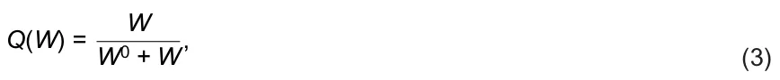

where *W*0 is the average oxygen concentration in human tissue.

<figure id="fig-1">
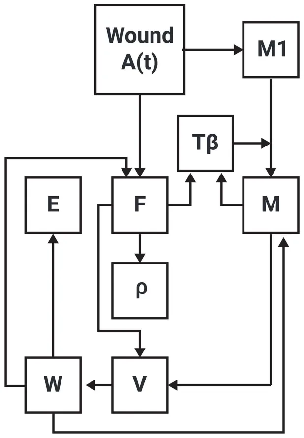
<figcaption><strong>Fig 1. Network of model’s variables.</strong> The arrows indicate activation, production, increasing, and enhancing.</figcaption>
</figure>

<figure class="table-figure" id="table-1">
<figcaption><strong>Table 1. A list of the model variables.</strong></figcaption>

<table><tr><th>Variable</th><th>Definition</th></tr><tr><td>F</td><td>Fibroblasts</td></tr><tr><td>M</td><td>M2 macrophages</td></tr><tr><td>E</td><td>Keratinocyte cells</td></tr><tr><td>V</td><td>Vascular endothelial growth factor (VEGF)</td></tr><tr><td>W</td><td>Oxygen</td></tr><tr><td>Tβ</td><td>Transforming growth factor-beta (TGF-β)</td></tr><tr><td>ρ</td><td>Extracellular matrix (ECM) density</td></tr><tr><td>A(t)</td><td>Open wound area</td></tr><tr class="row-group"><td>https://doi.org/10.1371/journal.pone.0340624.t001</td><td></td></tr></table>

</figure>

**2.1.1. Equation for ECM density (*ρ*).** ECM is produced by fibroblasts, and this process is enhanced by TGF-*β* [25,26]. We write the equation for *ρ* as follows:

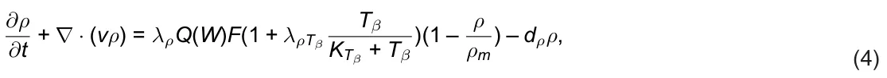

where *λ*ρ, *λ*ρTβ and *ρ*m are constants, and *d*ρ is the degradation rate of *ρ*. The equation for each of the remaining species *X* has the form

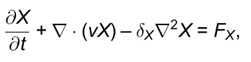

where *δ*X is a diffusion coefficient, *v* is the velocity, which in the case of radially symmetric flat wound satisfies Eqs. (1–2), and *F*X is determined by the network in Fig 1 (with *M*1 omitted).

**2.1.2. Equation for fibroblasts (*F*).** PDGF is released by damaged blood platelets in the wound, whose total mass is proportional to the wound area *A*(*t*) = *πR*2(*t*). PDGF stimulates logistic growth of fibroblasts at oxygen dependent rate *λ*F*Q*(*W*) [27]. Accordingly, we write the equation for *F* as follows:

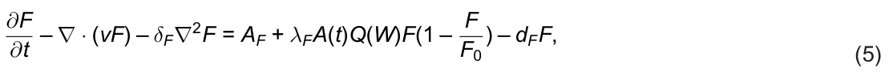

where *A*F is the source of fibroblasts, *d*F is the death rate of fibroblasts, and *F*0 is the carrying capacity of *F*.

**2.1.3. Equation for M2 macrophages (*M*).** Blood monocytes are attracted to the wound and differentiate into pro-inflammatory M1 macrophages [28]. PDGF released from the wound stimulate growth of M1 macrophages [29]. During the proliferation phase, most M1 macrophages had already polarized to M2 macrophages, a process enhanced by TGF-*β* [28]. For simplicity, we do not include M1 explicitly in the proliferation phase, and take the growth dynamics of M2 to mimic the growth dynamics of M1, so that

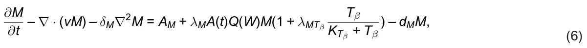

where *d*M is the death rate of M; note that the growth of *M* is oxygen dependent [30].

**2.1.4. Equation for Keratinocyte cells (*E*).** Keratinocytes make up 90% of the cells in the epidermis [19], and they play a role as structural cells that also exert important immune function [31]. Growth of keratinocytes cells depends on oxygen, hence

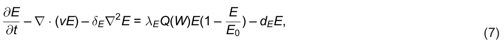

where *d*E is the death rate of *E*, and *E*0 is the carrying capacity of *E*.

**2.1.5. Equation for VEGF (*V*).** VEGF is secreted by M2 macrophages and fibroblasts [29,32]. VEGF is lost in the process of angiogenesis. In this process, VEGF ligands to receptors on endothelial cells, and new blood capillaries are then formed near the wound, resulting in blood oxygen seepage into the wound. We view the proliferation of endothelial cells by VEGF as an “eating” process of VEGF by the endothelial cells, and use the Michaelis–Menten expression const. *V*/(*K*V + *V*) to represent the rate of loss of *V*. We write the equation for VEGF as follows:

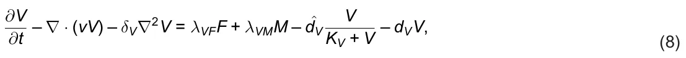

where the third term on the right-hand side represents a loss of *V* in the process of angiogenesis, and *d*V is the degradation rate of *V*.

**2.1.6. Equation for oxygen (*W*).** Oxygen is increased by angiogenesis, when VEGF ligands to receptors on endothelial cells. Due to limited receptor recycling time, we model this increase in oxygen by the Michaelis–Menten expression *λ*WV*V*/(*K*V + *V*), for some parameter *λ*WV. We write the equation for oxygen as follows:

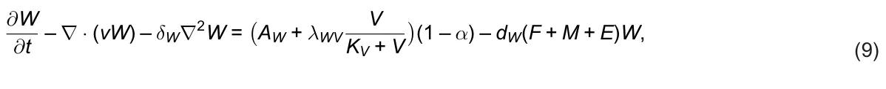

where oxygen is supplied by blood cells at rate *A*W, it is enhanced by VEGF at rate *λ*WV, and is consumed by cells *F*, *M*, and *E*. The parameter *α* quantifies the level of ischemia, 0 *≤ α ≤* 1; when *α* increases from 0 to 1, the ischemic level increases from non-ischemia to total ischemia.

**2.1.7. Equation for TGF-*β* (*T***β**).** TGF-*β* is produced by fibroblasts [33] and M macrophages [34]. Hence,

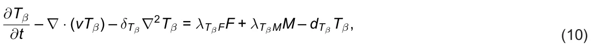

where *d*Tβ is the degradation rate of *T*β.

**2.1.8. Equation for *R*(*t*).** We assume that the wound boundary decreases with the velocity *v* of the ECM:

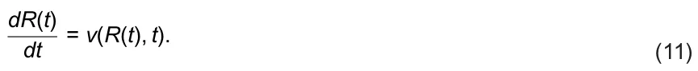

In the PDE model of a radially symmetric flat wound, Eqs. (1–11) hold in the partially healed wound (PHW) *R*(*t*) *≤ r ≤ R*(0), *t* > 0. In order to simulate the PDE system, we need to assume boundary conditions on the moving boundary *r* = *R*(*t*) and the external boundary, *r* = *R*(0).

### 2.2. Boundary conditions

For Eq. (1) we take

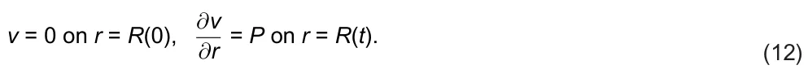

For oxygen we take

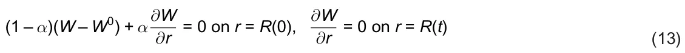

where *α* is the parameter that quantifies the level of ischemia.

We denote by *X*0 the average density, in health, of any species *X* of cells or proteins, and take

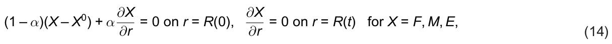

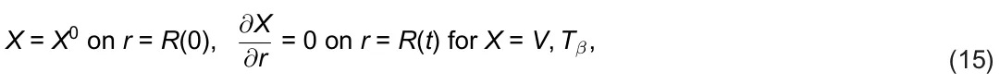

and

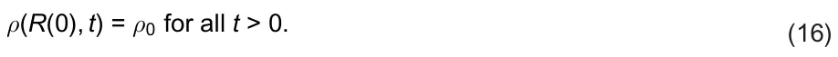

The PDE system takes place in the region {*R*(*t*) *≤ r ≤ R*(0)}, *t* > 0, and we take *R*(0) = 1 cm.

From Eqs. (9) and (11), we see that in the case of *α* = 1 (total ischemia), *W* = 0, hence *Q*(*W*) = 0, *ρ* = 0, *E* = 0, *V* = 0, and *R*(*t*) = *R*(0) for all *t* ≥ 0; the wound will not begin to heal without treatment.

### 2.3. Parameters estimation

**2.3.1. Steady state in health.** We denote the healthy steady (or average) state of species *X* by *X*0, and assume that in steady state KX+X = 1/2 where *K*X is the half-saturation of *X*; hence *K*X = *X*0. *X*

The thickness of the epidermis of the human body is 0.07 – 0.15 mm [18]; we take an average of 0.01 cm. The epidermis has 4 layers of stratum basale [35], and each layer contains 26–45 layers of keratinocyte cells [7]; we take an average of 30 layers. Each layer has 2500–5000 cells in *cm*2 [19]; we take an average number of 4000 cells. Hence, the number density of keratinocytes is 1 0.014 · 30 · 4000 = 4.8 · 107 in cm3.

The size of a keratinocyte cell is 10–15 *µm*; hence its flat area is less than 102 – 152 *µm*2. But the vertical dimension is smaller than 0.01 divided by the number of the keratinocyte layers, (0.01/120)*cm* = 1/1.2*µm*. We accordingly take the volume of a keratinocyte cell to be (10*µm*)3 = 10–9*cm*3. Assuming that 1 *cm*3 full of cells has a mass of 1g, we get the density of keratinocytes in the epidermis to be

*E*0 = 4.8 *·* 107 *·* 10–9 = 4.8 *·* 10–2 *g*/*cm*3.

There are 2100–4100 fibroblasts in *mm*3 of the mid-dermis [36], and 2000–4000 macrophages in *mm*3 of the mid-dermis [37]. Since 90% of the cells in the epidermis are keratinocytes [19], we assume that the remaining 10% are macrophages and fibroblasts, in equal numbers. Assuming that the volume of each of these cells is (10*µm*)3, we get

*F*0 = *M*0 = 5/100*E*0 = 2.4 *·* 10–3 *g*/*cm*3.

In skin of healthy mice, the density of VEGF is 150 pg/mg [38] (Fig 7). Assuming that the mass of 1 *cm*3 of skin tissue is 1g, we get

*V*0 = 1.5 *·* 10–7 *g*/*cm*3.

In healthy skin the density of *T*β is 30–39 *pg*/*mm*3 [39]; taking the average, we get

*T*0 β = 3.5 *·* 10–8 *g*/*cm*3.

The concentration of oxygen is given by the formula (in text, section “Materials and Methods” of [40]): *W*0 = *P*O2 *· α*tissue, where *P*O2 = 100*M*/mmHg is the oxygen pressure in arterial blood and (from Table 3 in [40]) *α*tissue = 1.25 *·* 10–6 mmHg is the oxygen solubility in the tissue; here *M* = 10–3*mol*/*cm*3 = 32 *·* 10–3 *g*/*cm*3. Hence, *W*0 = 1.25 *·* 32 *·* 10–6 = 4 *·* 10–6*g*/*cm*3.

The ECM density is 3–4% of the dry weight of tissue [41]. Since the epidermis contains 70% water [42], we take *ρ*0 = 0.06*g*/*cm*3. We also take *ρ*m = 1.1*ρ*0 = 0.066*g*/*cm*3, *ρ*1 = 0.2*ρ*0 = 0.012*g*/*cm*3, and *β* = 2.72 *·* 10–3/*d*.

**2.3.2. Death and degradation rates.** The death/degradation rate *d*X of species *X* is determined by the half-life *t*1/2(*X*) of *X*: *d*X = *log*(2)/*t*1/2(*X*). From the half-life (or average of half-lives) in previous papers, get: *d*F = 0.02/*d* [43], *d*M = *d*M2 = 0.099/*d* [44], *d*E = 0.0577/*d* [45], *d*V = 16.5/*d* [46], *d*Tβ = 495/*d* [47], and *d*ρ = 0.37/*d* [1].

**2.3.3. Diffusion coefficients.** From previous work, we take the estimate *δ*F = *δ*M = *δ*E = 8.64 *·* 10–7*cm*2/*d* [48]; although this estimate is very rough, it seems to have the correct order of magnitude. The remaining diffusion coefficients were estimated more precisely as follows: *δ*V = 8.64 *·* 10–2*cm*2/*d* [49], *δ*W = 2*cm*2/*d* [50], *δ*Tβ = 7.1 *·* 10–2*cm*2/*d* [51].

### 2.4. Steady state in health

We take *K*V = *V*0 = 1.5 *·* 10–7*g*/*cm*3, *K*Tβ = *T*0 β = 3.5 *·* 10–8*g*/*cm*3, and the carrying capacity of *F* and *E* to be *F*0 = 2*F*0 = 4.8 *·* 10–3*g*/*cm*3 and *E*0 = 2*E*0 = 9.6 *·* 10–2*g*/*cm*3. In steady state of health, *A*(*t*) = 0 and *Q*(*W*) = 1/2, and Eqs. (5–10) take the following form:

*A*F = *d*F*F*0 = 4.8 *·* 10–5*g*/*cm*3 *· d*, *A*M = *d*M*M*0 = 23.76 *·* 10–2*g*/*cm*3 *· d*, *λ*E = 4*d*E = 23.08 *·* 10–2/*d*, *λ*VF*F*0 + *λ*VM*M*0 = 0.5 ˆ*d*V + *d*V*V*0, *A*W + 0.5*λ*WV = *d*W(*F*0 + *M*0 + *E*0)*W*0, *λ*TβF*F*0 + *λ*TβM*M*0 = *d*β*T*0 β. We assume that *λ*VF*F*0 = *λ*VM*M*0, 0.5 ˆ*d*V = *d*V*V*0, and conclude that *λ*VF = *d*V*V*0/*F*0 = 16.5 *·* 1.5 *·* 10–7/(2.4 *·* 10–3) = 1.031 *·* 10–3/*d*, *λ*VM = *d*V*V*0/*M*0 = 1.031 *·* 10–3/*d*, ˆ*d*V = 2*d*V*V*0 = 33 *·* 1.5 *·* 10–7 = 4.95 *·* 10–6*g*/*cm*3 *· d*.

We assume that *d*W = 0.2/*d* and *A*W = 0.5*λ*WG, and find that *A*W = 0.5 *·* 0.2 *·* 5.28 *·* 10–2 = 5.28 *·* 10–3*g*/*cm*3 *· d* and *λ*WV = 11.616 *·* 10–3*g*/*cm*3 *· d* (somewhat larger than 2*A*W). Finally, we assume that *λ*TβF*F*0 = *λ*TβM*M*0 and conclude that *λ*TβF = 0.5*d*Tβ*T*0 β/*F*0 = 0.5 *·* 495 *·* 3.5 *·* 10–8/(2.4 *·* 10–3) = 3.608/*d*, *λ*TβM = 0.5*d*Tβ*T*0 β/*M*0 = 3.608/*d*. We take *λ*ρTβ = 1, and from the steady state of Eq. (4) we get:

*λ*ρ *·* 0.5 *· F*0 *·* 1.5 *·* 0.1/1.1 *·* 0.5 = *d*ρ*ρ*0 = 0.37 *·* 0.06, so that *λ*ρ = 1.356 *·* 102/*d*.

**2.4.1. Parameters associated with *A*(*t*).** We assume that in Eq. (5), *λ*F*A*(*t*)*Q*(*W*)*F*(1 – F F0 ) = *γ*1*d*F*F* at *t* = 0 for some parameter *γ*1 = 3.2. Since *R*(0) = 1 cm, *A*(0) = *π*, so that *λ*F*π*/4 = 3.2*d*F = 0.064; hence *λ*F = 8.154 *·* 10–2/*cm*2 *· d*. *T*β We take *λ*MTβ = 1 in Eq. (6), and assume that *λ*M*A*(*t*)*Q*(*W*)*M*(1 + KTβ +Tβ ) = *γ*2*d*M*M* at *t* = 0; for some parameter *γ*2 = 1.7. Assuming also that *T*β = *T*0 β at *t* = 0, we get *λ*M *· π*/2 *·* 3/2 = 1.7*d*M = 1.683 *·* 10–1; hence *λ*M = 7.14 *·* 10–2/*cm*2 · *d*.

## 3. ABS model

We define a uniform grid in two-dimensional space with *x*, *y* axes, constructed using lines separated by a mesh size of ∆. The set of centers of the resulting squares is denoted by **N**2. The Manhattan distance between two points (*x*1, *y*1) and (*x*2, *y*2) in **N**2 is given by the sum of the absolute differences of their coordinates |*x*1 – *x*2| + |*y*1 – *y*2|. The squares adjacent to a square centered at (*a*, *b*) are the 8 squares with centers at (*a* + *i*, *b* + *j*), where *i*, *j* take values from {−1, 0, 1}. We model agents as cells, with each square can accommudate at most one cell, positioned at the square’s center.

In agent-based simulation (ABS) based on the PDE model (Eqs. (1–16)), the agents are cells from *F*, *M*, and *E*, and the environment is associated with VEGF (*V*), oxygen (*W*), and TGF-*β* (*T*β). In setting up the ABS model, we assume that all the cells arrive from the boundary of the wound *r* = *R*(0). We refer to the distribution of agents as the “geometry” of the model and assume any initial geometry.

Formally, an agent is defined by five parameters (*τ*, ¯*x*, *ψ*, *ξ*, *p*): *τ* is the cell type, with *τ ∈* {*F*, *M*, *E*} in our specific model; ¯*x* is the center of the square where the cell is located; *ψ* is the lifespan of the cell; *ξ* is the inner clock of the cell (in minutes); and *p* is the non-zero pressure vector that represents the force applied to the agent by other agents to move within the geometry. In the simulations, we take the parameters for the ABS model from Table 1, but include velocity and diffusion in a different way than in the PDE model.

Following the ABS framework [52,53], we define three operators: spontaneous (*I*s), agent-agent (*I*aa), and agent-environment (*I*ae). Given an initial geometry at time *t*0 = 0, we run the operators *I*s, *I*aa, and *I*ae successively at times *t*1, *t*2, *. . .* , *t*n, *. . .* with equal time steps *t*n – *t*n–1 = ∆*t* for all *n*, where ∆*t* = 1 minute.

### 3.1. Operator Is (spontaneuos dynamics)

The life-span of *X ∈* {*F*, *M*, *E*} cells is derived from the equation dX dt = –*d*X*X*, or *X*(*t*) = *X*(0)*e*–dXt. Then, full life-span *X*(*t*)*dt* = 1 means that *d*X*e*–dXt*dt* = 1, and the discrete probability *ψ* is given by the exponential distribution: ∫∞ 0 ∫∞ 0 {*d*X*e*–dXn, *n* = 1, 2, *. . .* }, *d*X = 1/(*e*dX – 1) in units of days.

We set *t*n = *t* and *t*n+1 = *t* + 1. For any cell type *x ∈ X*(*t*), if *ξ ≥ ψ* then we eliminate *x*, while if *ξ* < *ψ* then we increase the cell inner clock time to *ξ* + 1; see Algorithm 1, lines 1–21.

For *X ∈* {*F*, *M*, *E*}, we denote by |*X*(*t*)| the number of cells in *X*(*t*). For any positive real number *N*, we deno*t*e by *⌊N⌋* the larges*t* integer ≤*N*. We compute the number of cells to be added for all three cell types; see Algorithm 1, lines 22–24. All new cells are introduced at the boundary *r* = *R*(0), endowed with random life-span from their exponential distribution, and pressure vector *p* pointing inward the wound. If the location of a new cell on *r* = *R*(0) was occupied by another cell, that cell is pushed over to adjacent location, determined by its pressure *p*. If the first push of a cell ends in a location already occupied by another cell, that cell is pushed by its pressure *p* forward, and this pushing process continues until the last push ends at an unoccupied location. We performed the pushing process first with all *E* cells, then with all *M* cells, and finally with *F* cells, as briefly indicated in Algorithm 1, lines 25–31.

In order to compute an approximation for the wound’s radius at some time *t*, we define the size of the region unfulfilled by cells at time *t* to be *A*(*t*) and define the radius *R*(*t*) by *πR*(*t*)2 = *A*(*t*) or *R*(*t*) = √*A*(*t*)/*π*.

### Algorithm 1 Spontaneous Dynamics (Is) at time t

1: **for** each fibroblast cell in fibroblast cells (*f ∈ F*(*t*)) **do** 2: **if** *f*.*ξ ≥ f*.*ψ* **then** 3: Eliminate fibroblast cell (f) 4: **else** 5: *f*.*ξ ← f*.*ξ* + 1 6: **end if** 7: **end for** 8: **for** each macrophage cell in macrophage cells (*m ∈ M*(*t*)) **do** 9: **if** *m*.*ξ ≥ m*.*ψ* **then** 10: Eliminate macrophage cell (m) 11: **else** 12: *m*.*ξ ← m*.*ξ* + 1 13: **end if** 14: **end for** 15: **for** each keratinocyte cell in keratinocyte cells (*e ∈ E*(*t*)) **do** 16: **if** *e*.*ξ ≥ e*.*ψ* **then** 17: Eliminate keratinocyte cell (E) 18: **else** 19: *e*.*ξ ← e*.*ξ* + 1 20: **end if** 21: **end for** 22: |*F*(*t*)new| ← *⌊A*F + *λ*F*πR*(*t*)2*Q*(*W*) *·* |*F*(*t*)| *·* (1 – |*F*(*t*)|/*F*0)*⌋* 23: |*M*(*t*)new| ← *⌊A*M + *λ*M*πR*(*t*)2*Q*(*W*) *·* |*M*(*t*)| *·* (1 + *λ*MTβ|*T*β(*t*)|/(*K*Tβ + |*T*β(*t*)|))*⌋* 24: |*E*(*t*)new| ← *⌊λ*E*Q*(*W*) *·* |*E*(*t*)| *·* (1 – |*E*(*t*)|/*E*0)*⌋* 25: Initialize new cells stack *←∅* 26: **for** *n ∈* {*E*, *M*, *F*} **in priority order do** 27: **for** *i* = 1 **to** |*n*(*t*)new| **do** 28: Add new *n*-cell to the boundary *R*(0)

29: Apply inward pressure *p*, displacing lower-priority cells inward 30: **end for** 31: **end for**

### 3.2. Operator Iaa (agent-agent)

This operator is empty for our simulation as the three cell types are interacting with each other through the environment rather than directly.

### 3.3. Operator Iae (agent-environment)

At the beginning of the simulation (*t* = *t*0), oxygen (*W*), VEGF (*F*), and TGF-*β* (*T*β ) are divided in an equally distributed manner to all locations in the geometry, such that each square obtains the same number |*W*(0)|, |*V*(0)|, and |*T*β(0)|, respectively. Next, following Algorithm 2, for each iteration, under the agent-environment operator (*I*ae), oxygen is introduced uniformly to the geometry at rate (*A*W/*S* + 0.5*λ*WV)(1 – *α*) where *S* is the total number of locations in the geometry, and consumed by all the cells (*E*, *F*, *M*). In addition, fibroblasts (*F*) generate VEGF (*V*) and *T*β in the locations they are present at rates *λ*VF and *λ*TβF, respectively. In a similar manner, macrophages (*M*) generate VEGF (*V*) and *T*β in the locations they are present at rates *λ*VM and *λ*TβM, respectively. Then, for each location in the geometry, the new amount of a free *I ∈* {*W*, *T*β} is obtained using the following formula of diffusion with a degradation coefficient *d*I:

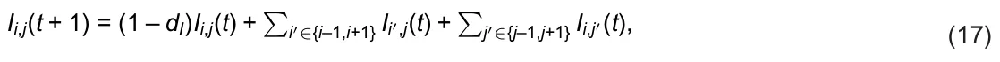

where *I*i,j stands for the amount of the free *I* in location (*i*,*j*). The decay of *V* is – ˆ*d*V*V*/(*K*V + *V*) – *d*V*V*, and for simplicity we take it to be 2*d*V*V*. Than, the diffusion and decay of *V* is as follows:

*V*i,j(*t* + 1) = (1 – 2*d*V)*V*i,j(*t*) + ∑

**Algorithm 2 Agent-Environment Interactions (***I*ae**) at time** *t* i′∈{i–1,i+1} Vi′,j(t) + ∑j′∈{j–1,j+1} Vi,j′(t). (18)

1: **for** each location, *l ∈ S*, in the geometry **do** 2: *W*l *← W*l + *A*W/*S* + 0.5*λ*WV 3: **end for** 4: **for** each macrophage cell in macrophages cells (*m ∈ M*(*t*)) **do** 5: *V*m.¯x *← V*m.¯x + *λ*VM 6: *T*βm.¯x *← T*βm.¯x + *λ*TβM 7: *W*m.¯x *← W*m.¯x – *d*W 8: **end for** 9: **for** each fibroblast cell in fibroblast cells (*f ∈ F*(*t*)) **do** 10: *V*f.¯x *← V*f.¯x + *λ*VF 11: *T*βf.¯x *← T*βf.¯x + *λ*TβF 12: *W*f.¯x *← W*f.¯x – *d*W 13: **end for** 14: **for** each keratinocyte cell in keratinocyte cells (*e ∈ E*(*t*)) **do** 15: *W*e.¯x *← W*e.¯x – *d*W 16: **end for** 17: Diffuse and decay VGEF (*V*) in the geometry using Eq. (17) 18: Diffuse and decay oxygen (*W*) in the geometry using Eq. (17) 19: Diffuse and decay TGF-*β* (*T*β ) in the geometry using Eq. (17)

## 4. Results

### 4.1. Computational method

The PDE model takes a second-order and nonlinear form with a free boundary spherical geometric configuration. We solve it numerically using the Runge-Kutta method [54]. Here, the boundary is updated at each step of the Runge-Kutta method. The free boundary is moved from one step to the next by updating the position (*x*) based on Eq. (11) (with the value of *v* from the previous step) and the numerical time step *h*. This process involves evaluating *R*(*t*) at the boundary point and then shifting the cell distribution in the numerical grid accordingly.

In the ABS model, for grid side *A*(*t*), we define *R*2(*t*) = *A*(*t*)/*π* and we use this *R*(*t*) to compare with the *R*(*t*) of the PDE model.

All the numerical analysis in this study was performed using the Python programming language [55].

### 4.2. Wound closure without therapy

Fig 2 shows the radius of the wound (*R*(*t*)) for 30 days for *α* = 0, 0.1, 0.2, *. . .* , 0.9 for the PDE and ABS models. Due to the stochastic nature of the ABS model, the results for this model are shown as the mean ± standard deviation of *n* = 100 simulations. In the non-ischemic case (*α* = 0), wound closure is complete already after 18 days. In the case of extreme ischemia (*α* = 0.9), the wound does not close, and *R*(30) *∼* 0.8*R*(0). The coefficient of determination (*R*2) that measures the goodness of fit between the PDE and ABS simulations averaged across the different values of *α* is *R*2 = 0.913, which indicates that both models highly agree with each other in representing wound closure profiles.

Fig 3 shows the Keratinocytes cells’s density in the wound (*E*(*t*)) for 30 days for the cases in *α* = 0, 0.1, 0.2, *. . .* , 0.9 for both the PDE and ABS models. Due to the stochastic nature of the ABS model, the results are shown as the mean ± standard deviation of *n* = 100 simulations. In the non-ischemic case (*α* = 0), the average density *E*(*t*) is increasing until day 20, soon after wound closure is complete, and *E*(20) *∼* 4.96 *·* 10–2*g*/*cm*3, which is the keratinocyte cells density in the epidermis, in health. In the case of extreme ischemia (*α* = 0.9), *E*(*t*) is increasing in time but *E*(30) is just slightly over 1.0 *·* 10–2*g*/*cm*3.

<figure id="fig-2">
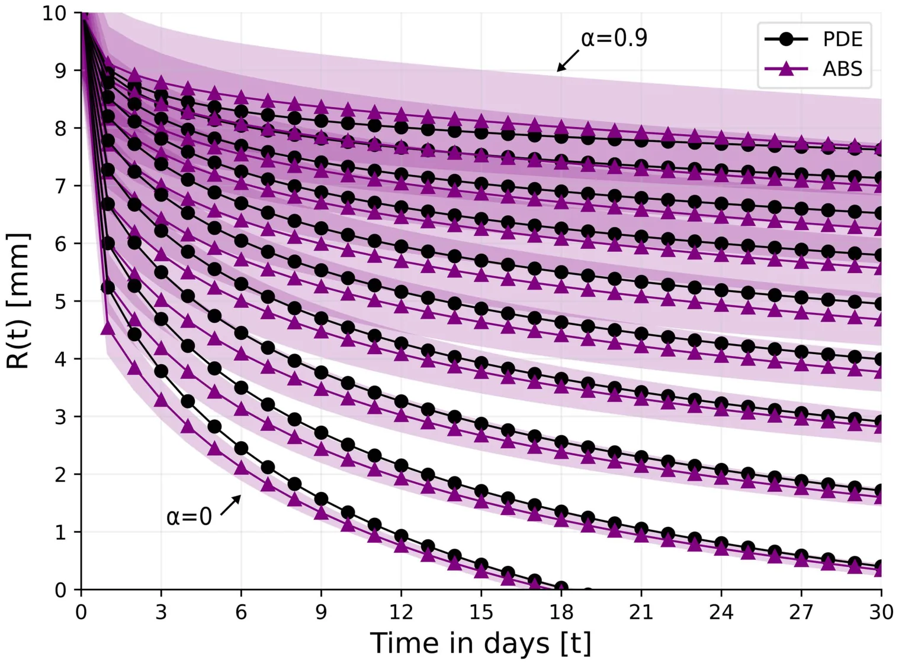
<figcaption><strong>Fig 2. Wound’s radius over the course of 30 days for different levels of ischemia, <em>α</em> = 0, 0.1, 0.2, . . . , 0.9.</strong> For the ABS model, the results are shown as the mean ± standard deviation of <em>n</em> = 100 simulations.</figcaption>
</figure>

<figure id="fig-3">
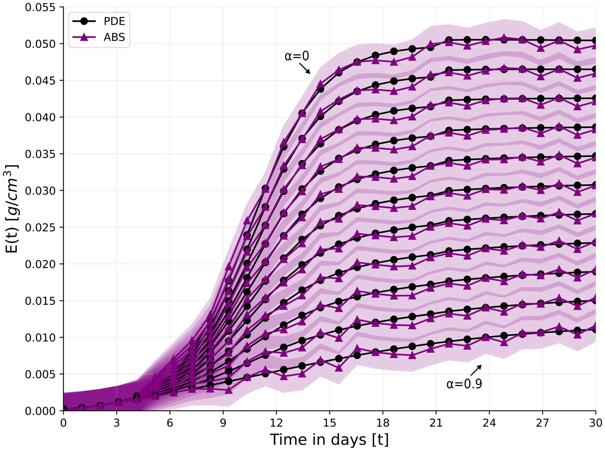
<figcaption><strong>Fig 3. Keratinocytes cells’ average density in the wound over time for <em>α</em> = 0, 0.1, 0.2, . . . , 0.9.</strong></figcaption>
</figure>

### 4.3. Comparison with experimental data

In vivo experiments with domestic white pig conducted in [56], identical wounds were developed in the healthy skin region and in the previously prepared ischemic skin region. Fig 3 in [56] shows the profile of the percentage of the initial wound radius for 20 days in both cases. Note that when a wound is developed, it dilates for the first few days before closure begins, as seen in [56] Fig 3. Fig 4A is taken from [56] Fig 3. Fig 4B shows the comparison between our simulations and Fig 4A; since the initial dilation is not included in our model, we start the comparison from day 3. We took *R*(0) = 0.2 cm as in [56] and computed, for each 0 *≤ α* < 1, the percentage of initial wound radius, for days 3, 4, ⋯, 19, 20. We then, connected these values linearly as done in Fig 4A. In the non-schematic case (*α* = 0), we found that the measure of fitness (*R*2) between the curve derived by the model and the curve in Fig 4A is *R*2 = 0.945. In the ischemic case, we used the gradient descent method and least mean square to find *α* that yields the best fit to Fig 4A. We found that with *α* = 0.467, the measure of fitness is *R*2 = 0.892.

<figure id="fig-4">
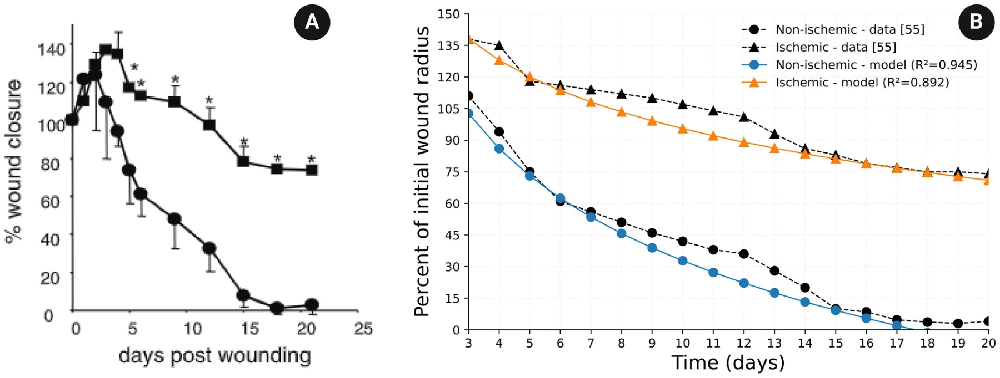
<figcaption><strong>Fig 4. Comparison between the model simulations and Fig 3 in [</strong>56<strong>].</strong> Fig 4A is taken from Fig. 3 in [56]. Fig. 4B shows a comparison between the model’s simulations and Fig. 4A in the non-ischemic case, and in the ischemic case with α = 0.467.</figcaption>
</figure>

### 4.4. Oxygen therapy

There are two general approaches to oxygen therapy in ischemic wound healing: Hyperbaric Oxygen therapy (HBOT) and topical oxygen therapy (TOT).

In HBOT, a patient enters a special chamber, for 2 hours daily, to breathe pure oxygen in pressure levels of 1.5 to 3 times higher than oxygen pressure in air [57,58]. The high pressure of oxygen increases the systemic oxygen in the plasma, which then circulates to tissues and helps drive oxygen directly into the damaged tissue [59]. The increased oxygen pressure on the tissue surrounding the wound also begins to decrease the level of ischemia after 6–8 days, and, between 18–23 days, the number of blood vessels reaches 80% of normal tissue [60].

We model this decrease in ischemia by decreasing the initial parameter *α* = *α*(0) to *α*(*t*), where *α*(*t*) = *α*(0) if *t* < 10 days and *α*(*t*) = *α*(0) – (*α*(0) – 0.1) *·* (*t* – 10)/20 if 10 ≤ *t* ≤ 30 days, and we modify Eq. (9) as follows:

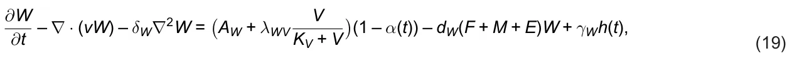

where *γ*W = *γ*0 W*A*W(1 – *α*(*t*)), such that *γ*0 W *∈* [1.5, 3] and

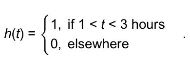

We replace *α* by *α*(*t*) also in Eqs. (13–14).

In TOT, a tissue surrounding the wound is enclosed in a device with high oxygen pressure. The pressure increases the oxygen concentration to 5 times the normal concentration directly in the wound, independently of the ischemic condition; treatment is given daily for 1.5 hours [61]. We modify Eq. (9) as follows (Fig 5 and 6):

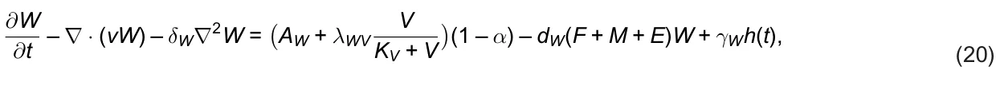

<figure id="fig-x5">
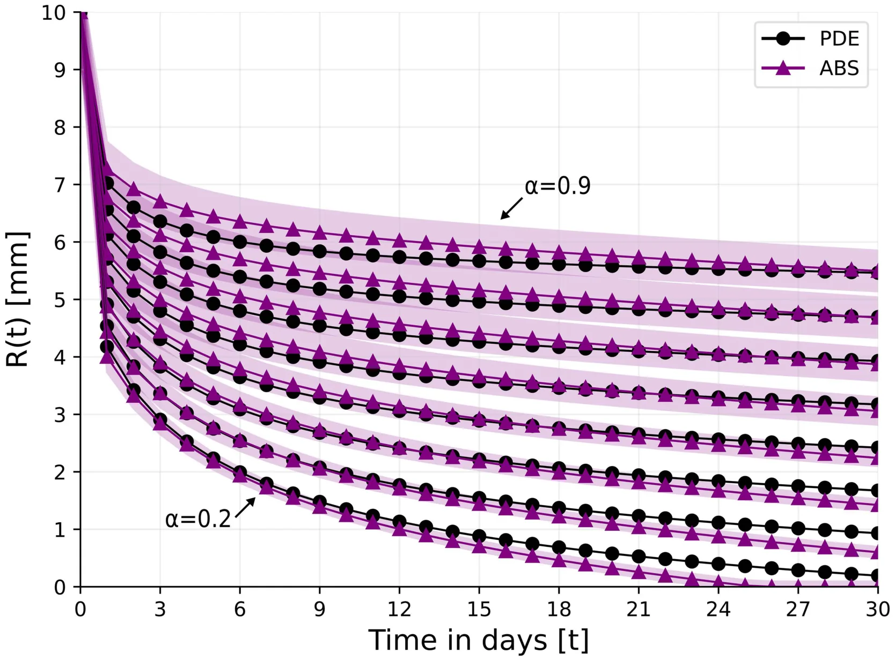
</figure>

<figure id="fig-5">

<figcaption><strong>Fig 5. <em>γ</strong></em>0</figcaption>
</figure>

https://doi.org/10.1371/journal.pone.0340624.g005 where *γ*W = 5*A*W and

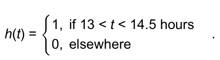

From Fig 2 we see that in the case of very mild ischemia where *α* = 0.1, wound closure is nearly complete by day 30. In order to simulate treatment with HBOT where *α*(*t*) is actually decreasing, we consider the cases where *α ≥* 0.2.

Fig 7 shows the profile of *R*(*t*) under HBOT treatment for two different treatments.

We see that under a small oxygen pressure of *γ*0 W = 1.5, wound closure is achieved for *α* = 0.2 after 28 days, but closure is not achieved in the ischemic case *α* = 0.3. On the other hand, with *γ*0 W = 3, wound closure for *α* = 0.2 is complete after 20 days, and in the case *α* = 0.3 it is nearly complete by day 30.

TCOT is a topical oxygen therapy given continuously 24 hours a day [61,62]. TCOT is used as adjunctive therapy in hard-to-heal wounds such as diabetic foot ulcer and pressure source ulcer; it provides a continuous supply of oxygen to promote healing. Here we shall consider the effect of TOT and TCOT on the closure of ischemic wounds. Figs 8 and 9 show the profiles of *R*(*t*) under treatment with TOT and TCOT, respectively. With TOT treatment, wound closure in the case *α* = 0.2 is complete by day 21, but, for *α* = 0.3, it is only 95% complete by day 30. On the other hand, with TCOT wound closure is achieved (by day 25) for an ischemic level of *α* = 0.5.

When the ischemic level is high, namely, when *α* > 0.5, oxygen therapy cannot achieve wound closure in expected time. Non-healing wounds, such as highly ischemic wounds (e.g., with *α* > 0.5) are treated with debridement to remove https://doi.org/10.1371/journal.pone.0340624.g006 damaged tissue and prevent infection, and with compression therapy to help move blood around. In rare cases, non-healing wounds present a risk of life-threatening infection and may require amputation.

<figure id="fig-6">
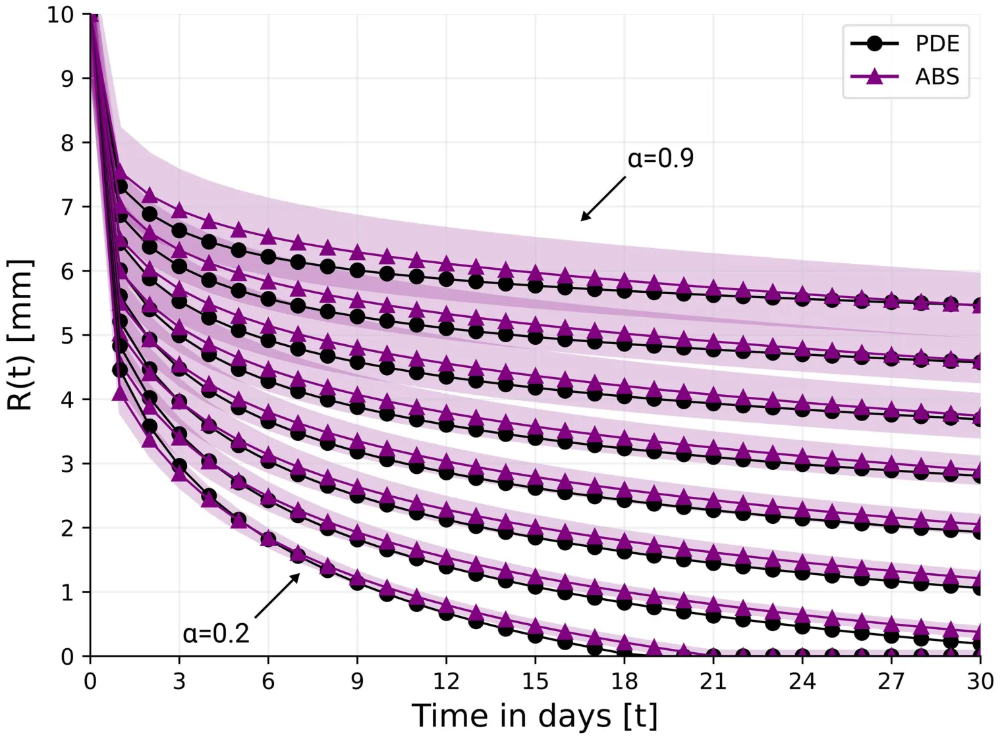
<figcaption><strong>Fig 6. <em>γ</strong></em>0 W <strong>= 1.5.</strong></figcaption>
</figure>

## 5. Discussion

### 5.1. Comparing PDE and ABS simulation results

In a PDE model of a biological process, the variables (species) are densities of cells, proteins, and other molecules at each point in space. In ABS model in 3D or (2D) space is covered with a uniform grid of size ∆, cubes are of volume ∆3 (or ∆2), and each cube (or square) is occupied by at most one cell. In PDE models, the dynamics of the species is continuous in time, while in ABS, a set of rules is given, and simulations proceed in discrete time in a stochastic-probabilistic fashion. When the biological process takes place in a region whose boundary is unknown, the PDE system of equations must be complemented by a dynamic equation of the unknown boundary; this is not the case in the corresponding ABS model, where the boundary is automatically generated as cells proliferate and fill space.

Each of these two methods has its advantages and deficiencies. Hence it is interesting to compare their simulation results, particularly if we take the parameters associated with the rules of the ABS model from the parameters that appear to represent similar rules in the PDE model. This is what we did in the present paper, on ischemic wound closure. We found, quite surprisingly, that the boundaries of the open wound, *r* = *R*(*t*), in the control case and under various oxygen treatments, as simulated by PDE and by ABS, are in very good agreement.

### 5.2. Minimal PDE model

In this paper, we developed a mathematical model to study the closure of ischemic wounds with or without oxygen therapy. Since there is always uncertainty in estimating the model parameters, one should aim for a model that has a https://doi.org/10.1371/journal.pone.0340624.g007 “minimal” number of variables: the biological species should be those that are absolutely needed to simulate correctly the process of wound closure; species that are thought to affect wound closure rather marginally should be excluded. The decisions of what to include and what to exclude are a judgment call. In our model, we included fibroblasts, M2 macrophages, and keratinocytes, but not other epithelial cells, and not M1 cells. We also include VEGF, oxygen, and TGF-*β* but explicitly PDGF. We also did not include TGF-*β* and PDGF drugs since our focus was on ischemic wounds, and for the same reason, we did not include lipid molecules that play a role in chronic wounds and in age-associated wounds.

<figure id="fig-7">
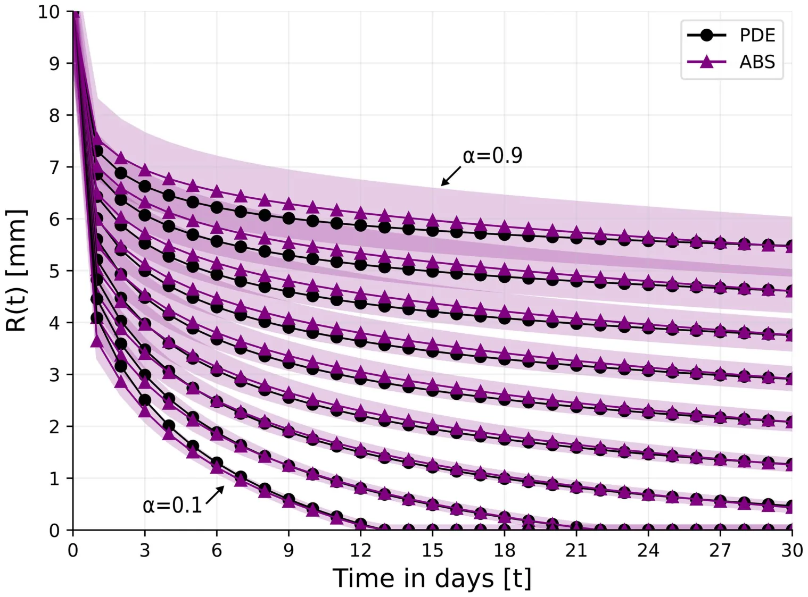
<figcaption><strong>Fig 7. Wound’s radius over the course of 30 days for different levels of ischemia under two HBOT treatments.</strong> For the ABS model, the results are shown as the mean ± standard deviation of n = 100 simulations.</figcaption>
</figure>

## 6. Conclusion

In this paper, we considered the healing of ischemic wounds, and focused on the proliferative phase, when the open wound is shrinking. We introduced a new PDE model of radially symmetric “flat” wound, which includes the primary role of keratinocyte cells, which make up to 90% of the cells of the epidermis. The radius *r* = *R*(*t*) of the open wound at time *t* is decreasing, and factors released from the area of the open wound (*A*(*t*) = *πR*2(*t*)) increase the proliferation of fibroblasts and *M*2 macrophages.

We defined the level of ischemia by a parameter *α*, that determines the flow rate of oxygen into the wound (Eq. (13)); 0 *≤ α ≤* 1, *α* = 0 means no-ischemia while *α* = 1 means total ischemia. In order to compute *R*(*t*), we assumed, as in [1], that ECM is moving with velocity *v* during the proliferation phase, and all species, including the wound boundary, are moving with the same velocity. Furthermore, we derived an equation for *v*, in terms of *ρ*(*t*), by assuming that *t*he tissue in *R*(*t*) ≤ *r* ≤ *R*(0) has the viscous structure of a quasi-static upper convected Maywell fluid.

We also introduced another, very different, ABS model. In this model, the wound boundary *r* = *R*(*t*) is generated automatically as cells proliferate in a stochastic-probabilistic manner. The rules of movement in ABS are entirely different from the rules in the PDE model, but we derived some of the parameters in the ABS model from appropriate parameters in the PDE model.

<figure id="fig-8">
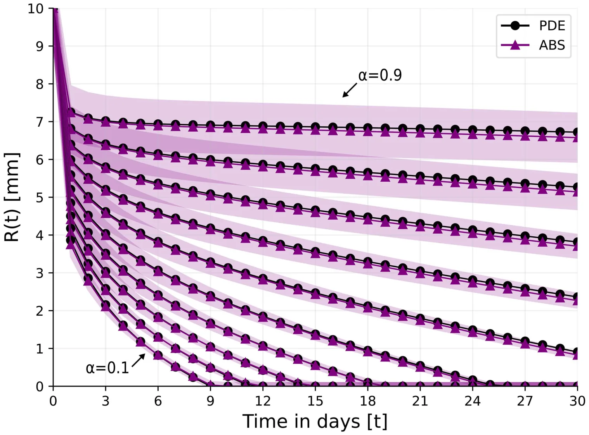
<figcaption><strong>Fig 8. Wound’s radius over the course of 30 days for different levels of ischemia, <em>α</em> = 0.1, 0.2, . . . , 0.9 under the TOT treatment.</strong> For the ABS model, the results are shown as the mean ± standard deviation of <em>n</em> = 100 simulations.</figcaption>
</figure>

We assumed that it takes at most 30 days to achieve closure of normal healthy wounds, and considered the question of in-time wound closure for ischemic wounds under various oxygen therapies. We obtained the following results:

- (a) In the non-ischemic and ischemic cases, the model simulations are in good agreement with *in vivo* experiments made on domestic white pig [56]; the fitness measure is *R*2 = 0.945 in the non-ischemic case and *R*2 = 0.892 in the ischemic case (Fig 4).
- (b) In all simulations of the model with *α* = 0, 0.1, 0.2, *. . .* , 0.9, the average measure of goodness of fit between the curves *R*(*t*) in the PDE model and in the ABS model is *R*2 = 0.913, which is surprisingly good; see also Discussion, sub-section 5.1.
- (c) Treatment with HBOT can achieve wound closure in 30 days if *α ≤* 0.3 (Fig 5), while treatment with TCOT can achieve closure if *α ≤* 0.5 (Fig 7). If *α* > 0.5, additional interventions will be needed.

The PDE model has the following limitations:

- (1) The parameter *α* has not been mapped into a biologically measured value, such as oxygen pressure (*PO*2) on the skin. Future in vivo experiments, such as [56], that also measure *PO*2 in the wound environment could help provide a mapping for the model parameters *α* to *PO*2.
- (2) The average thickness of the epidermis is 0.1 cm, and the species (variables) in the PDE model are defined as densities in units of *g*/*cm*3. But in the definition of the velocity *v* (Eqs. (1–2)) and in all other model’s equations we tacitly assumed, for simplicity, that the dynamics of wound closure does not depend on the thickness of the epidermis, thus treating the wound as a “flat” wound. The same simplification was introduced in the ABS model.
- (3) As explained in Discussion sub-section 5.2, we developed, what we consider to be, a minimal model. This model still has many parameters, listed in Table 2. Some of the parameters are known from previous papers, while for a few

<figure class="table-figure" id="table-2">
<figcaption><strong>Table 2. Summary of parameter estimations with their values.</strong></figcaption>

<table><tr><th>Parameter</th><th>Description</th><th>Value</th><th>Reference</th></tr><tr><td>E0</td><td>Keratinocyte density in epidermis</td><td>4.8 · 10–2 g/cm3</td><td>estimated</td></tr><tr><td>F0</td><td>Fibroblast density in epidermis</td><td>2.4 · 10–3 g/cm3</td><td>estimated</td></tr><tr><td>M0</td><td>Macrophage density in epidermis</td><td>2.4 · 10–3 g/cm3</td><td>estimated</td></tr><tr><td>V0</td><td>VEGF density in skin</td><td>1.5 · 10–7 g/cm3</td><td>[38]</td></tr><tr><td>T0 β</td><td>Tβ density in skin</td><td>3.5 · 10–8 g/cm3</td><td>[39]</td></tr><tr><td>W0</td><td>Oxygen concentration in tissue</td><td>4 · 10–6 g/cm3</td><td>[40]</td></tr><tr><td>ρ0</td><td>ECM density in tissue</td><td>0.06 g/cm3</td><td>[41]</td></tr><tr><td>ρm</td><td>Carrying capacity of ρ</td><td>0.066 g/cm3</td><td>this work</td></tr><tr><td>ρ1</td><td>Threshold of internal pressure by ρ</td><td>0.012 g/cm3</td><td>this work</td></tr><tr><td>β</td><td>Growth parameter of internal pressure by ρ</td><td>2.72 · 10–3/d</td><td>this work</td></tr><tr><td>dF</td><td>Death rate of fibroblasts</td><td>0.02/d</td><td>[43]</td></tr><tr><td>dM</td><td>Death rate of macrophages</td><td>0.099/d</td><td>[44]</td></tr><tr><td>dE</td><td>Death rate of keratinocytes</td><td>0.0577/d</td><td>[45]</td></tr><tr><td>dW</td><td>Consumption rate of W by cells</td><td>0.2/d</td><td>estimated</td></tr><tr><td>dV</td><td>Degradation rate of VEGF</td><td>16.5/d</td><td>[46]</td></tr><tr><td>dTβ</td><td>Degradation rate of Tβ</td><td>495/d</td><td>[47]</td></tr><tr><td>dρ</td><td>Degradation rate of ECM</td><td>0.37/d</td><td>[1]</td></tr><tr><td>δF, δM, δE</td><td>Diffusion coefficients of fibroblasts, macrophages, and keratinocytes</td><td>8.64 · 10–7 cm2/d</td><td>[48]</td></tr><tr><td>δG</td><td>Diffusion coefficient of VEGF</td><td>8.64 · 10–2 cm2/d</td><td>[49]</td></tr><tr><td>δW</td><td>Diffusion coefficient of oxygen</td><td>2 cm2/d</td><td>[50]</td></tr><tr><td>δTβ</td><td>Diffusion coefficient of Tβ</td><td>7.1 · 10–2 cm2/d</td><td>[51]</td></tr><tr><td>KV</td><td>Half-saturation of G</td><td>1.5 · 10–7g/cm3</td><td>estimated</td></tr><tr><td>KTβ</td><td>Half-saturation of Tβ</td><td>3.5 · 10–8g/cm3</td><td>estimated</td></tr><tr><td>F0</td><td>Carrying capacity of F</td><td>4.8 · 10–3g/cm3</td><td>estimated</td></tr><tr><td>E0</td><td>Carrying capacity of E</td><td>9.6 · 10–2g/cm3</td><td>estimated</td></tr><tr><td>AF</td><td>Source of F</td><td>4.8 · 10–5g/cm3</td><td>estimated</td></tr><tr><td>AM</td><td>Source of M</td><td>23.76 · 10–2g/cm3</td><td>estimated</td></tr><tr><td>λE</td><td>Growth rate of E</td><td>23.08 · 10–2g/cm3</td><td>estimated</td></tr><tr><td>λVF</td><td>Production of V by F</td><td>1.031 · 10–3/d</td><td>estimated</td></tr><tr><td>λVM</td><td>Production of V by M</td><td>1.031 · 10–3/d</td><td>estimated</td></tr><tr><td>ˆdV</td><td>Loss of V in the process of angiogenesis</td><td>4.95 · 10–6g/cm3 · d</td><td>estimated</td></tr><tr><td>AW</td><td>Source of oxygen in tissue</td><td>5.28 · 10–2g/cm3 · d</td><td>estimated</td></tr><tr><td>λWV</td><td>Production of W by VEGF</td><td>11.616 · 10–3g/cm3 · d</td><td>estimated</td></tr><tr><td>λTβF</td><td>Production of Tβ by F</td><td>3.608/d</td><td>estimated</td></tr><tr><td>λTβM</td><td>Production of Tβ by M</td><td>3.608/d</td><td>estimated</td></tr><tr><td>λρTβ</td><td>Enhanced production of ρ by Tβ</td><td>1</td><td>this work</td></tr><tr><td>λρ</td><td>Production of ρ by F</td><td>1.356 · 102/d</td><td>estimated</td></tr><tr><td>λF</td><td>Production coefficient of F associated with A(t)</td><td>8.154 · 10–2/cm2 · d</td><td>estimated</td></tr><tr><td>λM</td><td>Production coefficient of M associated with A(t)</td><td>7.14 · 10–2/cm2 · d</td><td>estimated</td></tr><tr><td>λMTβ</td><td>Tβ enhanced production of M by Tβ</td><td>1</td><td>this work</td></tr></table>

</figure>

parameters there is no reference at all, and the chosen values are marked by “this work” in Table 2. The remaining parameters are derived from known experimental results either directly or under some “mild” assumption, as explained in Section 2.3, and they are marked by “estimated” in Table 2.

- (4) When a wound occurs, it undergoes a process of stretching where its radius grows for several days, before it begins to decrease, as seen in [56] Fig 3. This process is not included in our model.

Mathematical models can be useful when they suggest new directions for research and experiments. When a mapping between the ischemic parameter *α* and *PO*2 is developed as outlined in model’s limitation (1), the PDE model could then be useful in suggesting personally optimal oxygen treatment for patients, based on their specific oxygen pressure.

The cells of the dermis include fibroblasts, macrophages, adipocytes, mast cells, Schwann cells, and stem cells [63], and, in deep wound healing, cells from both the epidermis and dermis start proliferating and migrating to the wound bed to close the wound [64]. In this paper, we consider the proliferation phase and wound closure of the epidermis. It would be interesting to extend the results of the paper to ischemic wounds deep into the dermis.

## Author contributions

**Conceptualization:** Avner Friedman.

**Data curation:** Avner Friedman.

**Formal analysis:** Teddy Lazebnik, Avner Friedman.

**Investigation:** Teddy Lazebnik, Avner Friedman.

**Methodology:** Teddy Lazebnik, Avner Friedman.

**Software:** Teddy Lazebnik.

**Validation:** Avner Friedman.

**Visualization:** Teddy Lazebnik.

**Writing – original draft:** Avner Friedman.

**Writing – review & editing:** Teddy Lazebnik, Avner Friedman.

## References

1. Xue C, Friedman A, Sen CK. A mathematical model of ischemic cutaneous wounds. Proc Natl Acad Sci U S A. 2009;106(39):16782–7. [doi:10.1073/pnas.0909115106](https://doi.org/10.1073/pnas.0909115106) · [PubMed 19805373](https://pubmed.ncbi.nlm.nih.gov/19805373/)
2. Friedman A, Hu B, Xue C. Analysis of a Mathematical Model of Ischemic Cutaneous Wounds. SIAM J Math Anal. 2010;42(5):2013–40. [doi:10.1137/090772630](https://doi.org/10.1137/090772630)
3. Friedman A, Xue C. A mathematical model for chronic wounds. Math Biosci Eng. 2011;8(2):253–61. [doi:10.3934/mbe.2011.8.253](https://doi.org/10.3934/mbe.2011.8.253) · [PubMed 21631128](https://pubmed.ncbi.nlm.nih.gov/21631128/)
4. Friedman A, Hu B, Xue C. A three dimensional model of wound healing: Analysis and computation. DCDS-B. 2012;17(8):2691–712. [doi:10.3934/dcdsb.2012.17.2691](https://doi.org/10.3934/dcdsb.2012.17.2691)
5. Friedman A, Siewe N. Mathematical Model of Chronic Dermal Wounds in Diabetes and Obesity. Bull Math Biol. 2020;82(10):137. [doi:10.1007/s11538-020-00815-x](https://doi.org/10.1007/s11538-020-00815-x) · [PubMed 33057956](https://pubmed.ncbi.nlm.nih.gov/33057956/)
6. Brazil JC, Quiros M, Nusrat A, Parkos CA. Innate immune cell-epithelial crosstalk during wound repair. J Clin Invest. 2019;129(8):2983–93. [doi:10.1172/JCI124618](https://doi.org/10.1172/JCI124618) · [PubMed 31329162](https://pubmed.ncbi.nlm.nih.gov/31329162/)
7. Yousef H, Alhajj M, Fakoya AO, Sharma S. Anatomy, skin (integument), epidermis. 2024.
8. Lazebnik T, Friedman A. Comparing partial differential equations and agent-based simulations in spatio-temporal modeling of cancer growth and shape. Journal of Computational and Applied Mathematics. 2026;477:117183. [doi:10.1016/j.cam.2025.117183](https://doi.org/10.1016/j.cam.2025.117183)
9. Ziraldo C, Mi Q, An G, Vodovotz Y. Computational modeling of inflammation and wound healing. Advances in wound care. 2013;2(9).
10. Boon WM, Koppenol DC, Vermolen FJ. A multi-agent cell-based model for wound contraction. J Biomech. 2016;49(8):1388–401. [doi:10.1016/j.jbiomech.2015.11.058](https://doi.org/10.1016/j.jbiomech.2015.11.058) · [PubMed 26805459](https://pubmed.ncbi.nlm.nih.gov/26805459/)
11. Rodrigues M, Kosaric N, Bonham CA, Gurtner G. Wound Healing: A Cellular Perspective. Physiol Rev. 2018;21(99):665–706.
12. Vodovotz Y, An G. Agent-based modeling of wound healing: Examples for basic and translational research. Complex systems and computational biology approaches to acute inflammation. 2020. p. 223–43.
13. Cogno N, Axenie C, Bauer R, Vavourakis V. Agent-based modeling in cancer biomedicine: applications and tools for calibration and validation. Cancer Biol Ther. 2024;25(1):2344600. [doi:10.1080/15384047.2024.2344600](https://doi.org/10.1080/15384047.2024.2344600) · [PubMed 38678381](https://pubmed.ncbi.nlm.nih.gov/38678381/)
14. Zhang L, Jiang B, Wu Y, Strouthos C, Sun PZ, Su J, et al. Developing a multiscale, multi-resolution agent-based brain tumor model by graphics processing units. Theor Biol Med Model. 2011;8:46. [doi:10.1186/1742-4682-8-46](https://doi.org/10.1186/1742-4682-8-46) · [PubMed 22176732](https://pubmed.ncbi.nlm.nih.gov/22176732/)
15. Gong C, Milberg O, Wang B, Vicini P, Narwal R, Roskos L, et al. A computational multiscale agent-based model for simulating spatio-temporal tumour immune response to PD1 and PDL1 inhibition. J R Soc Interface. 2017;14(134):20170320. [doi:10.1098/rsif.2017.0320](https://doi.org/10.1098/rsif.2017.0320) · [PubMed 28931635](https://pubmed.ncbi.nlm.nih.gov/28931635/)
16. Cai Y, Wu J, Xu S, Li Z. A Hybrid Cellular Automata Model of Multicellular Tumour Spheroid Growth in Hypoxic Microenvironment. Journal of Applied Mathematics. 2013;2013:1–10. [doi:10.1155/2013/519895](https://doi.org/10.1155/2013/519895)
17. Lazebnik T. Cell-Level Spatio-Temporal Model for a Bacillus Calmette-Guérin-Based Immunotherapy Treatment Protocol of Superficial Bladder Cancer. Cells. 2022;11(15):2372. [doi:10.3390/cells11152372](https://doi.org/10.3390/cells11152372) · [PubMed 35954213](https://pubmed.ncbi.nlm.nih.gov/35954213/)
18. Sissons B. What to know about thin and thick skin. MedicalNewsToday. 2021.
19. Primary Human Epidermal Keratinocytes Cell Culture System. https://www.sigmaaldrich.com 2024 January 17. [link](https://www.sigmaaldrich.com)
20. Lee SH, Sacks DL. Resilience of dermis resident macrophages to inflammatory challenges. Exp Mol Med. 2024;56(10):2105–12. [doi:10.1038/s12276-024-01313-z](https://doi.org/10.1038/s12276-024-01313-z) · [PubMed 39349826](https://pubmed.ncbi.nlm.nih.gov/39349826/)
21. Van Hove L, Hoste E. Activation of Fibroblasts in Skin Cancer. J Invest Dermatol. 2022;142(4):1026–31. [doi:10.1016/j.jid.2021.09.010](https://doi.org/10.1016/j.jid.2021.09.010) · [PubMed 34600919](https://pubmed.ncbi.nlm.nih.gov/34600919/)
22. Chermnykh E, Kalabusheva E, Vorotelyak E. Extracellular Matrix as a Regulator of Epidermal Stem Cell Fate. Int J Mol Sci. 2018;19(4):1003. [doi:10.3390/ijms19041003](https://doi.org/10.3390/ijms19041003) · [PubMed 29584689](https://pubmed.ncbi.nlm.nih.gov/29584689/)
23. Mouton AJ, DeLeon-Pennell KY, Rivera Gonzalez OJ, Flynn ER, Freeman TC, Saucerman JJ, et al. Mapping macrophage polarization over the myocardial infarction time continuum. Basic Res Cardiol. 2018;113(4):26. [doi:10.1007/s00395-018-0686-x](https://doi.org/10.1007/s00395-018-0686-x) · [PubMed 29868933](https://pubmed.ncbi.nlm.nih.gov/29868933/)
24. Kramer PA, Ravi S, Chacko B, Johnson MS, Darley-Usmar VM. A review of the mitochondrial and glycolytic metabolism in human platelets and leukocytes: implications for their use as bioenergetic biomarkers. Redox Biol. 2014;2:206–10. [doi:10.1016/j.redox.2013.12.026](https://doi.org/10.1016/j.redox.2013.12.026) · [PubMed 24494194](https://pubmed.ncbi.nlm.nih.gov/24494194/)
25. Tracy LE, Minasian RA, Caterson EJ. Extracellular Matrix and Dermal Fibroblast Function in the Healing Wound. Adv Wound Care (New Rochelle). 2016;5(3):119–36. [doi:10.1089/wound.2014.0561](https://doi.org/10.1089/wound.2014.0561) · [PubMed 26989578](https://pubmed.ncbi.nlm.nih.gov/26989578/)
26. Liarte S, Bernabe-Garcia A, Nicolas FJ. Role of TFG-β in skin chronic wounds: a keratinocyte perspective. Cells. 2020.
27. Kwan PO, Tredget EE. Biological Principles of Scar and Contracture. Hand Clin. 2017;33(2):277–92. [doi:10.1016/j.hcl.2016.12.004](https://doi.org/10.1016/j.hcl.2016.12.004) · [PubMed 28363295](https://pubmed.ncbi.nlm.nih.gov/28363295/)
28. Zhang F, Wang H, Wang X, Jiang G, Liu H, Zhang G, et al. TGF-β induces M2-like macrophage polarization via SNAIL-mediated suppression of a pro-inflammatory phenotype. Oncotarget. 2016;7(32):52294–306. [doi:10.18632/oncotarget.10561](https://doi.org/10.18632/oncotarget.10561) · [PubMed 27418133](https://pubmed.ncbi.nlm.nih.gov/27418133/)
29. Krzyszczyk P, Schloss R, Palmer A, Berthiaume F. The Role of Macrophages in Acute and Chronic Wound Healing and Interventions to Promote Pro-wound Healing Phenotypes. Front Physiol. 2018;9:419. [doi:10.3389/fphys.2018.00419](https://doi.org/10.3389/fphys.2018.00419) · [PubMed 29765329](https://pubmed.ncbi.nlm.nih.gov/29765329/)
30. Shen L, Chen W, Ding J, Shu G, Chen M, Zhao Z, et al. The role of metabolic reprogramming of oxygen-induced macrophages in the dynamic changes of atherosclerotic plaques. FASEB J. 2023;37(3):e22791. [doi:10.1096/fj.202201486R](https://doi.org/10.1096/fj.202201486R) · [PubMed 36723768](https://pubmed.ncbi.nlm.nih.gov/36723768/)
31. Piipponen M, Li D, Landén NX. The Immune Functions of Keratinocytes in Skin Wound Healing. Int J Mol Sci. 2020;21(22):8790. [doi:10.3390/ijms21228790](https://doi.org/10.3390/ijms21228790) · [PubMed 33233704](https://pubmed.ncbi.nlm.nih.gov/33233704/)
32. Johnson KE, Wilgus TA. Vascular Endothelial Growth Factor and Angiogenesis in the Regulation of Cutaneous Wound Repair. Adv Wound Care (New Rochelle). 2014;3(10):647–61. [doi:10.1089/wound.2013.0517](https://doi.org/10.1089/wound.2013.0517) · [PubMed 25302139](https://pubmed.ncbi.nlm.nih.gov/25302139/)
33. Lu H-L, Huang X-Y, Luo Y-F, Tan W-P, Chen P-F, Guo Y-B. Activation of M1 macrophages plays a critical role in the initiation of acute lung injury. Biosci Rep. 2018;38(2):BSR20171555. [doi:10.1042/BSR20171555](https://doi.org/10.1042/BSR20171555) · [PubMed 29531017](https://pubmed.ncbi.nlm.nih.gov/29531017/)
34. Ramirez H, Patel SB, Pastar I. The Role of TGFβ Signaling in Wound Epithelialization. Adv Wound Care (New Rochelle). 2014;3(7):482–91. [doi:10.1089/wound.2013.0466](https://doi.org/10.1089/wound.2013.0466) · [PubMed 25032068](https://pubmed.ncbi.nlm.nih.gov/25032068/)
35. How many layers of keratinocytes does thin skin have?. Studycom. https://www.study.com 2024. [link](https://www.study.com)
36. Padovan-Merhar O, Nair GP, Biaesch AG, Mayer A, Scarfone S, Foley SW, et al. Single mammalian cells compensate for differences in cellular volume and DNA copy number through independent global transcriptional mechanisms. Mol Cell. 2015;58(2):339–52. [doi:10.1016/j.molcel.2015.03.005](https://doi.org/10.1016/j.molcel.2015.03.005) · [PubMed 25866248](https://pubmed.ncbi.nlm.nih.gov/25866248/)
37. Tong PL, Roediger B, Kolesnikoff N, Biro M, Tay SS, Jain R, et al. The skin immune atlas: three-dimensional analysis of cutaneous leukocyte subsets by multiphoton microscopy. J Invest Dermatol. 2015;135(1):84–93. [doi:10.1038/jid.2014.289](https://doi.org/10.1038/jid.2014.289) · [PubMed 25007044](https://pubmed.ncbi.nlm.nih.gov/25007044/)
38. Johnson KE, Wilgus TA. Vascular Endothelial Growth Factor and Angiogenesis in the Regulation of Cutaneous Wound Repair. Adv Wound Care (New Rochelle). 2014;3(10):647–61. [doi:10.1089/wound.2013.0517](https://doi.org/10.1089/wound.2013.0517) · [PubMed 25302139](https://pubmed.ncbi.nlm.nih.gov/25302139/)
39. Yang L, Qiu CX, Ludlow A, Ferguson MWJ, Brunner G. Active transforming growth factor-β in wound repair. American Journal of Pathology. 1999;154(1).
40. Beard DA. Modeling of oxygen transport and cellular energetics explains observations on in vivo cardiac energy metabolism. PLoS Comput Biol. 2006;2(9):e107. [doi:10.1371/journal.pcbi.0020107](https://doi.org/10.1371/journal.pcbi.0020107) · [PubMed 16978045](https://pubmed.ncbi.nlm.nih.gov/16978045/)
41. Xue M, Jackson CJ. Extracellular matrix reorganization during wound healing and its impact on abnormal scarring. Advances in Wound Care. 2015;4(3).
42. Verdier-Sévrain S, Bonté F. Skin hydration: a review on its molecular mechanisms. J Cosmet Dermatol. 2007;6(2):75–82. [doi:10.1111/j.1473-2165.2007.00300.x](https://doi.org/10.1111/j.1473-2165.2007.00300.x) · [PubMed 17524122](https://pubmed.ncbi.nlm.nih.gov/17524122/)
43. Cohen IK, Diegelmann RF, Lindblad W. Wound healing: biochemical and clinical aspects. 1992.
44. Italiani P, Boraschi D. From monocytes to M1/M2 macrophages: phenotypical vs. functional differentiation. Frontiers in Immunology. 2014;5(514).
45. Hsieh EA, Chai CM, de Lumen BO, Neese RA, Hellerstein MK. Dynamics of keratinocytes in vivo using HO labeling: a sensitive marker of epidermal proliferation state. J Invest Dermatol. 2004;123(3):530–6. [doi:10.1111/j.0022-202X.2004.23303.x](https://doi.org/10.1111/j.0022-202X.2004.23303.x) · [PubMed 15304093](https://pubmed.ncbi.nlm.nih.gov/15304093/)
46. Finley SD, Engel-Stefanini MO, Imoukhuede PI, Popel AS. Pharmacokinetics and pharmacodynamics of VEGF-neutralizing antibodies. BMC Syst Biol. 2011;5:193. [doi:10.1186/1752-0509-5-193](https://doi.org/10.1186/1752-0509-5-193) · [PubMed 22104283](https://pubmed.ncbi.nlm.nih.gov/22104283/)
47. Kaminska B, Wesolowska A, Danilkiewicz M. TGF beta signaling and its role in tumor pathogenesis. Acta Biochimica Polonica. 2005;52(2):329–36.
48. Hao W, Crouser ED, Friedman A. Mathematical model of sarcoidosis. Proc Natl Acad Sci U S A. 2014;111(45):16065–70. [doi:10.1073/pnas.1417789111](https://doi.org/10.1073/pnas.1417789111) · [PubMed 25349384](https://pubmed.ncbi.nlm.nih.gov/25349384/)
49. Liao K-L, Bai X-F, Friedman A. Mathematical modeling of interleukin-27 induction of anti-tumor T cells response. PLoS One. 2014;9(3):e91844. [doi:10.1371/journal.pone.0091844](https://doi.org/10.1371/journal.pone.0091844) · [PubMed 24633175](https://pubmed.ncbi.nlm.nih.gov/24633175/)
50. Hornbeck PV, Zhang B, Murray B, Kornhauser JM, Latham V, Skrzypek E. PhosphoSitePlus, 2014: mutations, PTMs and recalibrations. Nucleic Acids Research. 2014;43(D1):D512–20.
51. Androjna C, Gatica JE, Belovich JM, Derwin KA. Oxygen diffusion through natural extracellular matrices: implications for estimating “critical thickness” values in tendon tissue engineering. Tissue Eng Part A. 2008;14(4):559–69. [doi:10.1089/tea.2006.0361](https://doi.org/10.1089/tea.2006.0361) · [PubMed 18377199](https://pubmed.ncbi.nlm.nih.gov/18377199/)
52. Zhou M, Li J, Basu R, Ferreira J. Creating spatially-detailed heterogeneous synthetic populations for agent-based microsimulation. Computers, Environment and Urban Systems. 2022;91:101717. [doi:10.1016/j.compenvurbsys.2021.101717](https://doi.org/10.1016/j.compenvurbsys.2021.101717)
53. Raberto M, Cincotti S, Focardi SM, Marchesi M. Agent-based simulation of a financial market. Physica A: Statistical Mechanics and its Applications. 2001;299(1–2):319–27. [doi:10.1016/s0378-4371(01)00312-0](https://doi.org/10.1016/s0378-4371%2801%2900312-0)
54. Verwer JG, Sommeijer BP. An Implicit-Explicit Runge--Kutta--Chebyshev Scheme for Diffusion-Reaction Equations. SIAM J Sci Comput. 2004;25(5):1824–35. [doi:10.1137/s1064827503429168](https://doi.org/10.1137/s1064827503429168)
55. Langtangen HP, Logg A. Solving PDEs in Python. Cham: Springer. 2016.
56. Roy S, Biswas S, Khanna S, Gordillo G, Bergdall V, Green J, et al. Characterization of a preclinical model of chronic ischemic wound. Physiol Genomics. 2009;37(3):211–24. [doi:10.1152/physiolgenomics.90362.2008](https://doi.org/10.1152/physiolgenomics.90362.2008) · [PubMed 19293328](https://pubmed.ncbi.nlm.nih.gov/19293328/)
57. Medicine JH. Hyperbaric Oxygen Therapy. https://www.hopkinsmedicine.org/health/treatment-tests-and-therapies/hyperbaric-oxygen-therapy#::text=HBOT%20reduces%20swelling%20while%20flooding,HBOT%20prevents%20%22reperfusion%20injury.%22 2025. [link](https://www.hopkinsmedicine.org/health/treatment-tests-and-therapies/hyperbaric-oxygen-therapy#::text=HBOT%20reduces%20swelling%20while%20flooding,HBOT%20prevents%20%22reperfusion%20injury.%22)
58. Karataev B. What pressure of hyperbaric oxygen is best?. https://revivo.ca/what-pressure-of-hyperbaric-oxygen-is-best/ 2024. [link](https://revivo.ca/what-pressure-of-hyperbaric-oxygen-is-best/)
59. Health U. Hyperbaric Oxygen Therapy. https://uvahealth.com/locations/Hyperbaric-Oxygen-Treatment-Center-5597296 2024. [link](https://uvahealth.com/locations/Hyperbaric-Oxygen-Treatment-Center-5597296)
60. Medicine P. Hyperbaric Oxygen Therapy; 2025. https://www.chestercountyhospital.org/services-and-treatments/wound-care/hyperbaric-oxygen-therapy [link](https://www.chestercountyhospital.org/services-and-treatments/wound-care/hyperbaric-oxygen-therapy)
61. Oropallo A, Andersen CA. Topical Oxygen. Treasure Island. 2023.
62. Continuous topical oxygen therapy. https://www.healthtechnology.wales/reports-guidance/ 2025. [link](https://www.healthtechnology.wales/reports-guidance/)
63. Brownm TM, Krishnamurthy K. Histology, dermis. StatPearls. 2022.
64. Rognoni E, Watt FM. Skin Cell Heterogeneity in Development, Wound Healing, and Cancer. Trends Cell Biol. 2018;28(9):709–22. [doi:10.1016/j.tcb.2018.05.002](https://doi.org/10.1016/j.tcb.2018.05.002) · [PubMed 29807713](https://pubmed.ncbi.nlm.nih.gov/29807713/)
