## 1. Introduction and related work

Bladder cancer (BC) is the 10th most common form of cancer worldwide, with an estimated 549,000 new cases and 200,000 deaths. The highest incidence occurs in industrialized and developed areas, such as Europe, North America, and Australia (Bray et al., 2018). The primary cause of about half of bladder cancer cases is occupational exposure to chemicals in industrial areas processing paints, metals, dyes and petroleum products. Tobacco smoking and environmental carcinogens are another risk factor for bladder cancer (Bunimovich-Mendrazitsky et al., 2015a). The high rates of recurrence, invasive surveillance strategies, and high treatment costs combine to make bladder cancer the single most expensive cancer in both England and the United States (Eylert et al., 2014).

Treatment of non-invasive BC has not advanced significantly over the past few decades following the treatment protocol suggested by Morales et al. (1976) that involves weekly instillations of Bacillus Calmette–Gu´erin (BCG) (Morales et al., 1976). BCG, an attenuated non-pathogenic strain of Mycobacterium bovis that was originally used as a vaccine against tuberculosis (TB), is a type of immunotherapy used to treat non-invasive bladder cancer (Herr et al., 1988; Simon et al., 2008; Redelman-Sidi et al., 2014). BCG immunotherapy has proven superior to chemotherapy in reducing the rate of tumor relapse (Wei, 2016). Although Lamm and others have found that BCG even reduces the progression of the disease (Lamm, 2006), it is necessary to understand why the standard BCG treatment protocol is not effective for non-responding or relapsing patients. The BCG treatment protocol has yet to be optimized specifically for those patients who do not achieve remission from treatment according to the standard scheme.

Mathematical modeling shown to be a useful tool in oncology, allowing to investigate both the disease and possible treatments (Bhattacharya et al., 2020; Jord˜ao and Tavares, 2017; Hornberg et al., 2006). Several attempts have been made to develop the model for BCG treatment of BC as a response of the immune system to introduced bacteria into the bladder by means of Ordinary Differential Equations (ODE) in order to find the optimal treatment protocol (Shaikhet and Bunimovich-Mendrazitsky, 2018; Bunimovich-Mendrazitsky and Goltser, 2011; Bunimovich-Mendrazitsky et al., 2015b). In addition, several attempts were made to describe the cell dynamics taking into account biological interactions in the physical space based on partial differential equations (PDE) (Lazebnik et al., 2020; Matzavinos et al., 2004; Eikenberry et al., 2009; Fridman and Kao, 2014). One of them is the model is investigated by Fridman et al. (Fridman and Kao, 2014) which describes the case where the geometrical configuration is a sphere. The model describes the cell population dynamics including the immune system cells, cancer cells, healthy cells and disease-infected cells. Their model (Fridman and Kao, 2014) analyzes both logistic and exponential growth of tumor cells.

Another model describing BCG immunotherapy treatment dynamics that takes into consideration an approximation of the bladder’s geometry using PDE investigated by Lazebnik et al. (2020). Their model (Lazebnik et al., 2020) assumed continuous BCG instillation and logistic growth of tumor cells inside the bladder. In (Lazebnik et al., 2020) the changes in treatment protocol were studied by considering a sphere-ring approximation to the bladder’s geometry. Moreover, in this model a diffusion dynamics was added for all cell populations as BCG, tumor and effector cells. The model from (Lazebnik et al., 2020) suffered from numerical instability for long treatment time: cancer cell population shows divergence to infinity at the 35th day of the treatment.

In the research of Guzev et al. (2019) a BCG and interleukin 2 (IL-2) combined therapy was examined and presented validation of this protocol for BC patients (Guzev et al., 2019). However, the model from (Guzev et al., 2019) is lacking the geometrical understanding of the dynamics of the biological system and diffusion of cell population during therapy.

There are medical and biological investigations that show the prognostic significance of tumor location on survival outcomes in patients with BC (Grabnar et al., 2006; Weiner et al., 2019). Therefore, in order to obtain the best treatment protocol, it is important to consider the geometry of the bladder and the location of the polyps.

In this research, we propose a model that tackles the two main inefficiencies of the Guzev et al. (2019) and Lazebnik et al. (2020) models. This paper is organized as follows: in Section 2, we introduce our mathematical model of BCG treatment with the approximation of the geometrical configuration of the bladder. Afterwards, the numerical calculation used to solve the PDE and solution stability analysis. In Section 3, we present the model’s bifurcation points and their clinical impact. In Section 4, we offer a method to find the optimal time treatment protocol given the paitent’s start condition. In Section 5, we investigate the influence of the tumor depth and distribution in the urothelium on the optimal treatment protocol. In Section 6, we discuss the main clinical results arising from the model.

## 2. Mathematical modeling extension

Our aim in the development of this mathematical model is to allow clinical professionals to perform better and more personalized treatment in the scope of BCG immunotherapy of bladder cancer. The advantage of using a mathematical model is the ability to examine the biological system in relatively simple settings while producing clinical results which may be used on real patients. The mathematical model we present is a system of 10 s-ordered, nonlinear PDEs representing cell populations dynamic.

### 2.1. Model definition

The system of Eq. (1-14) represents the treatment of bladder cancer with BCG and IL-2 as the dynamics of cell populations (the values of the parameters that we used are shown in Table 3).

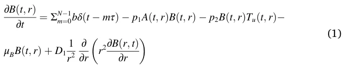

In Eq. (1), ∂B(t,r) is the dynamical rate of BCG cell population distri∂*t* bution over time. It is affected by the following five terms. First, a quantity *b* of BCG instilled into the bladder every τ days. As the instillation of the BCG is modeled by a shifted Dirac delta function *δ*(*t* ˘*mτ*)*,m* ∈ {0*,* 1*,*…*,N*˘1}, the *m*th dose raises *B*(*t, r*) by *b* units at *t* = *mr*. Second, the elimination of BCG by antigen presenting cells (APCs) according to the rate coefficient − *p*1. Third, the BCG tumor cell groth at a rate coefficient − *p*2. Fourth, the bacteria cell death with rate coefficient *μ*β. Finally, the diffusion of the BCG cell population inside the bladder’s geometry is assumed to spread at rate coefficient *D*1.

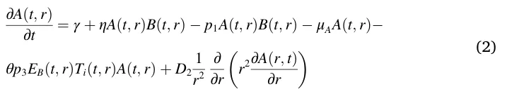

In Eq. (2) ∂A(t,r) ∂t is the dynamic of nonactivated APCs. It is affected by the following six terms. First, the normal influx of APCs to the tumor at a constant rate λ. Second, the recruitment of APCs due to bacterial infection at a rate coefficient τ. Third, the activation of APCs by BCG at the rate coefficient − *p*1. Fourth, the natural cell death at the rate coefficient, − *τ*A. Fifth, the two-stage elimination of tumor cells, first by effector CTL activity on BCG infected tumor cells, which leads to lysis of these cells and flooding of the tumor micro-environment with tumor antigens. The localized inflammatory response then attracts APCs, such as macrophages, which in turn eliminate uninfected tumor cells, according to the rate − *p*3. Finally, a diffusion of the APCs cell population inside the bladder’s geometry is assumed to spread at rate coefficient *D*2.

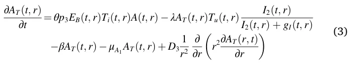

In Eq. (3) ∂AT(t,r) is the tumor-Ag-activated APC (TAA-APC) dynamic. ∂*t* It is affected by the following five terms. First, the APCs which were activated by tumor antigen. Second, the tumor-Ag-activated APCs cells which destroy the uninfected tumor cells, with a rate coefficient λ. This term is multiplied by an IL-2-dependent parameter with a saturation constant *g*I, to propose that in the absence of IL-2, *A*T production ceases, while in the presence of external IL-2, the production term is close to 1. Third, the migration of TAA-APC to the draining lymphoid tissues at a rate of coefficient − *β*1. Fourth, the natural death of TAA-APC at a rate coefficient *μ*A1. Finally, the diffusion factor of the TAA-APC cells population in the bladder geometry is assumed to be *D*3.

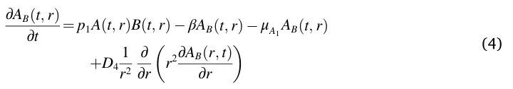

In Eq. (4) ∂AB(t,r) is the dynamic of BCG-activated APCs. It is affected ∂*t* by the following four terms. First, the number of nonactivated APCs as well as BCG bacteria, with rate coefficient *p*1. Second, the migration of the infected, activated APCs to the draining lymphoid tissues, at rate coefficient *β*1. Third, the death of activated APCs at rate coefficient *A*1. Finally, the diffusion factor of the BCG-activated APCs cells population in the bladder geometry is assumed at coefficient *D*4.

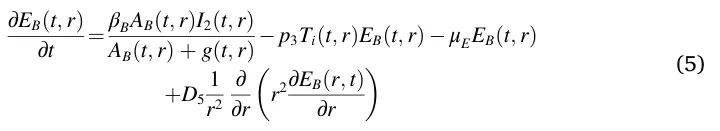

In Eq. (5) ∂EB(t,r) is the dynamic of effector CTLs that react with BCG ∂*t* infection. It is affected by the following four terms. First, the migration term is proportional to *A*B and IL-2, with a maximal rate coefficient *β*B. This rate is brought to saturation by large numbers of *A*B, using a Michaelis–Menten saturation function, with Michaelis parameter *g*. Second, the decrease in CTLS population size from the inactivation of effector CTLs via their encounter with infected tumor cells (*T*i) at a success rate coefficient − *p*3. Third, the decrease in the BCG-effector CTL (*E*B) population size from the (*E*B) cells’ natural death rate *μ*E. Finally, the diffusion factor of the effector CTLs that react with BCG infection cell population in the bladder geometry is assumed at rate coefficient *D*5.

In Eq. (6) ∂ET(t,r) is the dynamic of effector cells reacting with tumor ∂*t* Ag. It is affected by the following four terms. First, the migration element is proportional to *A*T and IL-2 with a maximal rate coefficient *β*T. This rate is brought to saturation by large numbers of *A*T using a Michaelis–Menten saturation function, with Michaelis parameter *g*. Second, the inactivation of effector CTLs via their encounter with uninfected tumor cells (*T*u), at a success rate coefficient − *p*3. Third, the *E*T natural death rate, with a rate coefficient *μ*E. Finally, the diffusion factor of the effector cells reacting with tumor Ag cell population in the bladder geometry is assumed at rate coefficient *D*6.

maximal growth rate coefficient (*r*), which is limited by the maximal tumor cell number (*K*). Second, bacterial infection, which is characterized by a coefficient rate of *p*2. Third, capturing and elimination of *T*u cells by APC cells (*A*), which were activated by tumor-Ag at a rate coefficient λ and to the activity of TAA-CTL effectors, (*E*T), which destroy uninfected tumor cells, (*T*u), at a rate coefficient α. The dependence in the equation of *T*u on *F*β is decreasing from 1 to *a*Tβ with Michaelis constant *e*T,β. And then there is a multiplication of those terms by an *I*2-dependent Michaelis–Menten term, with Michaelis parameter *g*I, to propose that in the absence of *I*2, *T*u cellular death does not occur. Since the tumor produces a variety of mechanisms in the biological settings that curtail the success of effector cell activity, they multiply I2+gI by *I*2 Tu+gT, to denote the inversely proportional reduction in effector cell ac*g*T tivity rate, such that when *T*u = 0 the term is equal to 1 and when

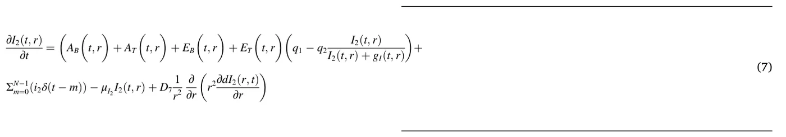

In Eq. (7) ∂I2(t,r) is the IL-2 dynamic. It is affected by the following five ∂*t* processes, with all processes assuming equal expression at a constant rate coefficient *q*1. They reflect the IL-2 external source (*i*2), which is injected into the bladder every θ time units. First, *I*2 is consumed by APCs and CTLs. They assume that the rate of consumption is similar for both types of cells and denote its coefficient by *q*2. The consumption depends on *I*2 and is limited in a Michaelis–Menten fashion, with the Michaelis constant *g*I. Second, introduction of − *μ*I2 , the *I*2 degradation rate coefficient. Finally, the diffusion factor of the IL-2 cell population in the bladder geometry is assumed at rate coefficient *D*7.

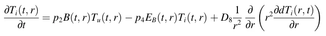

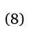

In Eq. (8) ∂Ti(t,r) is the dynamic of infected tumor cells, and it depends ∂*t* on three mechanisms. The first mechanism corresponds only to the rate of bacterial infection of uninfected tumor cells, (*T*u), according to rate coefficient *p*2. The second is the elimination of infected tumor cells (*T*i) by their interaction with BCG-CTL effector cells (*E*B), at a rate coefficient − *p*4. Finally, the diffusion factor of the infected tumor cell population in the bladder geometry is assumed at rate coefficient *D*8.

( ) *lim*Tu→∞ gT = 0. Finally, the diffusion factor of the uninfected *T*u+*g*T tumor cell population in the bladder geometry is assumed at rate coefficient *D*9. ∫ R *dF*β(*t*) (10) = *α*βT *T*u(*t, r*)*dr* − *μ*β*F*β(*t*) *dt r*0

In Eq. (10) dFβ(t) dt is the dynamic of a transforming growth factor-beta, proportional to the tumor cell population *T*u with *α*βT as a proportion coefficient and is destroyed at a rate of *μ*β proportional to *F*β. The dynamics of *F*β are not geometry dependent but the dynamics of *T*u(*t, r*) are geometry dependent. Therefore, the ∫R r0 *T*u(*t, r*)*dr* provides all the uninfected tumor cells in the bladder’s geometry.

We assume the bladder’s geometry satisfies Eq. (11) as an approximation to the bladder’s geometrical configuration:

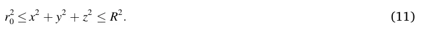

In Eq. (11), the variables *x*, *y*, *z* are the Cartesian coordinate system, *r*0 and *R* are the radius of the internal and external spheres of the geometrical configuration, respectively. The bladder’s geometry is approximated using a perfect ring-sphere while the real human bladder is more like a ring-ellipsoid with three tunnels (Guzev et al., 2019). Fig. 1 visualizes the geometry of the system.

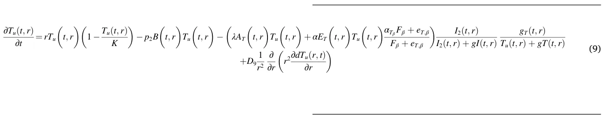

In Eq. (9) ∂Tu(t,r) is the dynamic of uninfected tumor cells. It depends ∂*t* on four processes. First, the natural tumor growth characterized by a The boundary condition is based on two surfaces, the inner and outer sphere, respectively. The inner sphere boundary condition is assumed according to Eq. (12) known to be exactly *b* and decreases over time according to the system dynamics. The cells population associative to the immune system (e.g. *A, A*T*, A*β*, E*β*, E*T*, I*2 ) is assumed to be equal to zero as the immune system does not allocate resources to the area until the BCG is injected. *T*i is assumed to be equal to zero as well because cancer cells were not able to be infected by BCG before any BCG is injected into the system. *T*u is assumed to be equally distributed inside each sphere approximating the cancer tumor. The inner sphere boundary condition is given to be:

<figure id="fig-1">
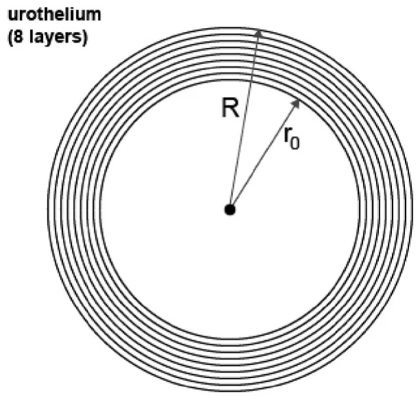
<figcaption><strong>Fig. 1.</strong> Representation of the model’s geometry from Eq. (11). The urothelium is divided into 8 layers of tissue, indexed from shallowest layer (smallest radius) indexed as 0 to deepest indexed as 7.</figcaption>
</figure>

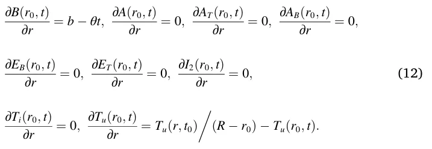

The boundary condition of the external sphere is unknown. It is assumed that the natural cell population spread over time satisfies diffusion equations. Therefore, one can find the boundary condition of the external sphere by reverse engineering the values that best satisfy the known start conditions and internal boundary sphere conditions. Given the inner sphere boundary condition from Eq. (12) and the start condition from Eq. (14), algorithm (1) returns the outer sphere boundary condition.

Specifically, we used finite-elements in a 2d matrix where the geometry is represented by a tensor with 106 values and the step in time (Δ*t*) is 2 h (12 steps each day). Unless otherwise stated, it is assumed that the cancer polyps’ sizes are equal in the beginning of the treatment (*t*0). In addition, the cancer cells population is equally distributed in the urothelium’s geometry.

The dFβ(t0) equation is the outcome of solving the linear ordinary Eq. *dt* (13) for *F*β:

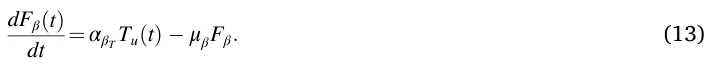

The initial condition is assumed to be:

*B*(*r, t*0) = 0*, A*(*r, t*0) = *a, A*T(*r, t*0) = 0*, A*B(*r, t*0) = 0*,*

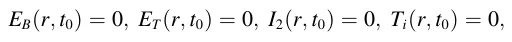

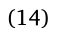

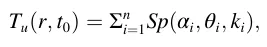

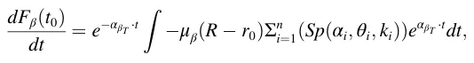

where *a >* 0 is the natural influx of APC cells, *n >* 0 the number of polyps at the beginning of the treatment, *Sp*(*α, θ, R*) is a sphere with radius *R* and origin in angles (*α, θ*) on the (*xy, xz*) plain, respectively.

### 2.2. Numerical solution

To obtain a better understanding of how different parameter values influence the system dynamics, in this section we illustrate the behavior of the system using numerical analysis. To carry out the numerical simulations of the tumor-immune model, we used the parameter values from Table 3.

Eq. (1-10) are PDEs, second order, nonlinear, from R2 to R10, where R2 is the space of both time (marked by *t*) and radial distance from the center of the bladder’s geometry configuration (marked by *r*) and R10 is the population distribution of all nine populations (marked by *B*(*t,r*), *A*(*t, r*), *A*T(*t,r*), *A*B(*t,r*), *E*B(*t,r*), *E*T(*t,r*), *I*2(*t,r*), *T*i(*t,r*), *T*u(*t,r*)) and the value of growth factor-beta *F*β(*t*)). Galerkin-Petrov’s method is suitable for approximating the solution for such a system of equations (Skeel and Berzins, 1990).

In Eqs. (1)–(9) the leading (second order) factor is a diffusion dynamics and in Eq. (10) an ODE so the equations are elliptic. Therefore, Galerkin-Petrov’s method takes the form:

<figure class="table-figure" id="alg-1">
<figcaption><strong>Algorithm 1</strong>. Find external sphere boundary conditions</figcaption>
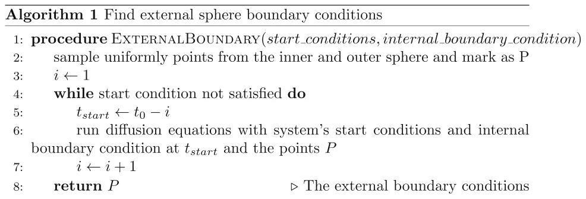

</figure>

<figure id="fig-2">
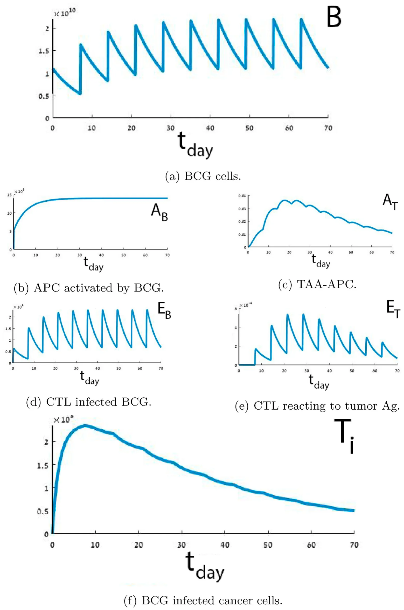
<figcaption><strong>Fig. 2.</strong> Numerical simulation of trajectories of Eq. (1 - 14) using Eq. (15 - 17)) with the parameter values from Table 3. The graphs show the evolution in time (days) of <em>B</em>(<em>t, r</em>)<em>, A</em>(<em>t, r</em>)<em>, A</em>B(<em>t, r</em>)<em>, E</em>B(<em>t, r</em>)<em>, E</em>T(<em>t, r</em>), and <em>T</em>i(<em>t, r</em>).</figcaption>
</figure>

<figure id="fig-3">
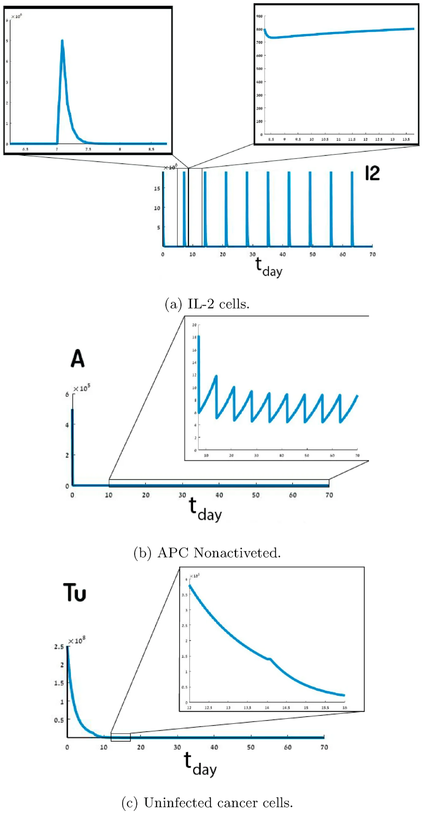
<figcaption><strong>Fig. 3.</strong> Numerical simulation of trajectories of Eqs. (2, 7, and 9) using Eq. (15 - 17) with the parameter values from Table 3. The graphs show the evolution in time (days) of <em>I</em>2(<em>t, r</em>)<em>, A</em>(<em>t, r</em>), and <em>T</em>i(<em>t, r</em>) in different resolutions.</figcaption>
</figure>

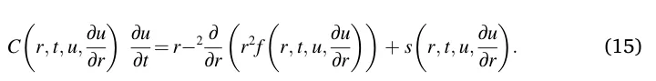

All the numerical calculations in this paper have been performed with *Matlab* software (version 2019b) using the *pdepe* function (Skeel and Berzins, 1990). However, the *pdepe* function has been modified to use specificity Eq. (15), provided with the system dynamics in Eq. (1-10), inner sphere boundary conditions from Eq. (12), and start conditions from Eq. (14).

The overall treatment has been divided into several components, following τ-long treatments as a result of the injection of BCG ΣN− 1 m=0*bδ*(*t* − *mτ*) and IL-2 ΣN− 1 m=0*i*2*δ*(*t* − *m*) in Eqs. (1) and (7), respectively. The start condition of each τ-long treatment, except the first one, has been updated according to Eq. (16). Similarly, the boundary condition has been updated according to Eq. (17).

*B*(*r, t*τ⋅i+Δt) = *B*(*r, t*τ⋅i) + *b, A*(*r, t*τ⋅i+Δt) = *A*(*r, t*τ⋅i)*,*

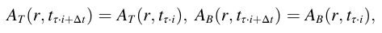

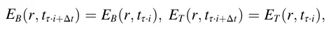

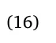

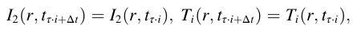

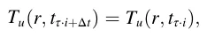

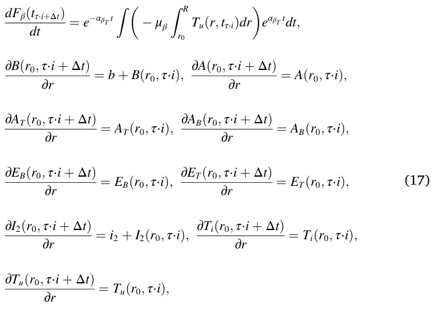

where *i* ∈ N is the *i*th day of the overall treatment. The values of the model’s parameters are shown in Table 3 (see Appendix). The solutions of the system (1–14) with the parameter assumptions and values we used are shown in Fig. 2. Fig. 2 shows the cell population sizes over time of *B*(*t,r*), *A*(*t,r*), *A*B(*t,r*), *E*B(*t,r*), *E*T(*t,r*), and *T*i(*t, r*) where the x-axis in all nine graphs represents the time (in days) that has passed from the beginning of the treatment and the y-axis is the size of each cell population size, respectively. Fig. 3 shows the cell population of *I*2(*t,r*), *A*T(*t, r*), and *T*u(*t,r*), where part of each graph is presented in a different scale.

The BCG (*B*) population reaches an upper limit, as shown in Fig. 2a. The maximum values of BCG (on days {7*i*}9 i=1) occur on the days of the BCG injection, and during the week they decrease to a level of 2⋅ 1010. Fig. 3a shows the harmonic behavior of IL-2 (*I*2), where *i*2 is introduced every {7*i*}9 i=1 day, which decreases to around 750 in the same day (as shown in Fig. 3a). In Fig. 3b nonactivated APC (*A*) cells significantly decrease until the third week, where there is converge to a harmonic oscillation between 5 and 10 (as shown in Fig. 3b).

<figure id="fig-4">
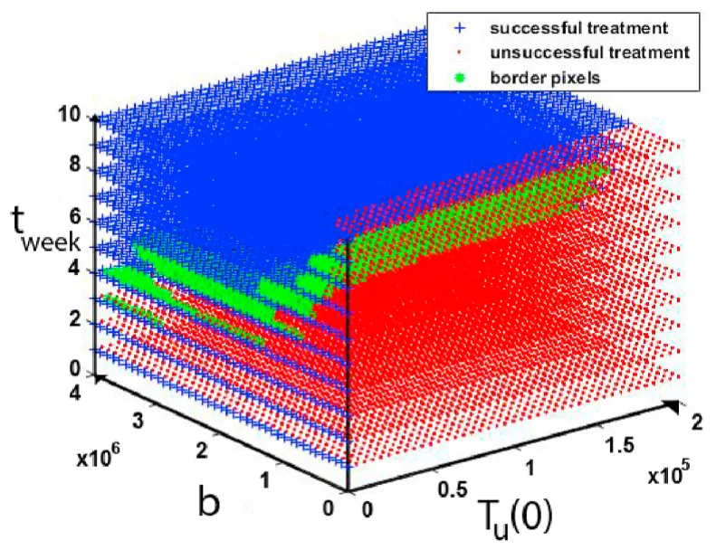
<figcaption><strong>Fig. 4.</strong> Discrete sampling of the system’s image space. Blue pixels represent a successful treatment, red pixels represent an unsuccessful treatment, and green dots represent border pixels.</figcaption>
</figure>

In Fig. 2b it was shown that the population of APC activated by BCG (*A*b) cells converges to the upper limit value of 1*.*4⋅106. The same phenomenon occurs in CTL effector cells infected by BCG, as shown in Fig. 2d. Effector cells reacted to the Ag tumor grow in the first four weeks and then decrease. In addition, on the BCG injection days the cell population sharply increases, as shown in Fig. 2e. In Fig. 2c TAA-APC (*A*T) cells growth during first four weeks. After the fourth week, *A*T decreases over time, except for a local increase on the days when BCG is administered.

In Fig. 2f, the population of cancer cells infected by BCG increases during the first week. After the second injection of BCG into the bladder, the *T*i population decreases over time with the local maximums on the BCG injection days, as shown in Fig. 2f. Additionally, in Fig. 3fc uninfected cancer cell populations (*T*u) decrease over time, and in the first week this sharp decrease occurs with a constant rate (̃ 0*.*7). Each week, the population decreases in one factor of magnitude (̃ 10− 1) as shown in Fig. 3c.

### 2.3. Solution stability

Lyapunov’s stability analysis method cannot be used for the system (1–14) because it does not satisfy the needed conditions (Buis, 1968). The system does not diverge to infinity on a representative case as presented in Fig. 2. Therefore, it is possible to analyze its stability for a given set of parameters using the system’s image space (Guzev et al., 2019).

Basically, the main goal is to find a treatment protocol resulting in a tumor-free equilibrium given a patient condition in the beginning of the treatment. We define a *successful treatment* as a treatment resulting in tumor-free equilibrium (*T*u(*t*\**, r*) = 0) and *unsuccessful treatment* otherwise, where *t*\* is the time at the end of the treatment.

In our model, four parameters affect the success of treatment: First, the initial cancer cell population size *T*u(*t*0). Second, the amount of BCG *b* injected over the course of the treatment. Third, the overall time of the treatment *t* in days; Fourth, the amount of IL-2 *i*2 injected over the course of the treatment. Based on these, it is possible to define a four dimensional space to investigate the influence of *T*u(0)*, b, t,* and *i*2 on the success of the treatment protocol. Determining which initial condition of the patient and which treatment protocol leads to successful treatment can be performed using the solution stability method described in (Lazebnik et al., 2020).

For our analysis we neglect IL-2 from the parameters and, therefore, are left with a three dimensional space defined by *T*u(0)*, b,* and *t*. We define a function *S* : R3→Z2 such that *S*(*T*u(*t*0)*, b, t*) ∈{0*,* 1} where 1 represents successful treatment and 0 represents unsuccessful treatment. For any vector *v* ∈(*T*u(*t*0)*,b,t*), it is satisfied that *S*(*v*) is the solution for system (1–14) with the parameters from Table 3. The binary classification is determined according to a set of factors *C* = {*c*i}9 i=0. Where ∀*i* ∈ {0*,* …*,* 9} : *c*i ∈ R+ are thresholds of the nine population sizes *B*(*t*), *A*(*t, r*), *A*T(*t*), *A*B(*t*), *E*B(*t*), *E*T(*t*), *I*2(*t*), *T*i(*t*), and *T*u(*t*), respectively. It is assumed that there are lower and upper boundaries for each one of the parameters (*T*u(*t*0)*,b,t*). All three parameters are lower-bounded by 0 as they cannot be negative. The upper boundary for *T*u(*t*0) is the number of all cells in the bladder. The amount of *b* injected is bounded by the bladder’s volume and the treatment time is bounded because medical treatment cannot be provided for eternity.

<figure id="fig-5">
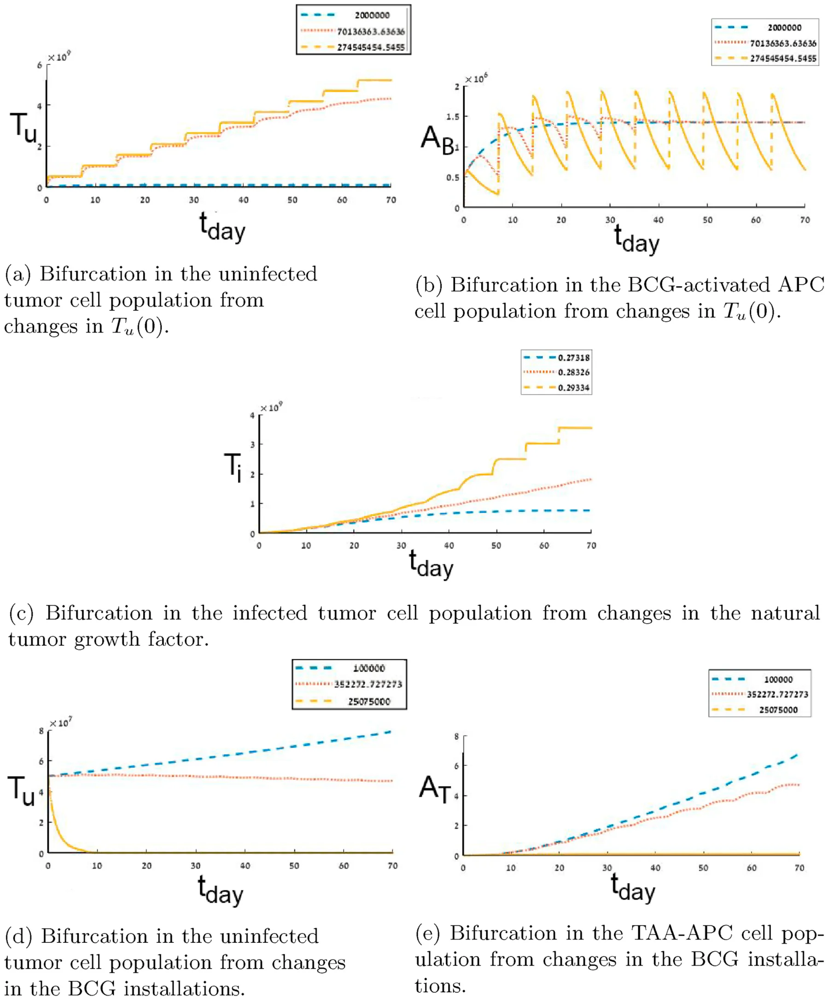
<figcaption><strong>Fig. 5.</strong> Bifurcation in <em>T</em>u<em>, A</em>b<em>, T</em>i<em>,</em> and <em>A</em>t cell population. Each color (and line style) represents a different value on the changes parameter.</figcaption>
</figure>

This results in space P⊂R3. P is a compact parameter’s set because it is complete (as a sub-set of R3) and bounded. We assume that the image of function *S*|P is continuous and can be restored from discrete sampling.

Fig. 4 presents the space *S*|P which has been sampled 16000 times, *T*u(0) sampled 40 times ranging from 0 to 2*.*5⋅108 in equal steps, *b* marked as *BCG* sampled 40 times ranging from 0 to 2*.*14⋅ 106 in equal steps, and the treatment time in weeks *t* sampled 10 times ranging from 0 to 10 in equal steps. A treatment is considered successful if it satisfies *T*u = 0 ∧*BCG <* 108. The sampled space size is the largest that a modern personal computer was able to calculate in 8 h.

All the pixels in Fig. 4 have been computed successfully (no diversions at any *T*u(0)*, b, t*). Using these values, it is easy to see that by picking *k* = 1 then function *S* satisfies the Lipschitz continuity condition

*d*1(*S*(*v*1)*, S*(*v*2)) ≤*k*⋅*d*3(*v*1*, v*2)*,* where *d*i is the Euclidean distance function in Ri. Recall, we assume that *S* continues and can be restored from a discrete sample. Therefore, for some value *ε >* 0, there exists a unique solution to the initial value problem *S*(*v*) according to the Picard–Lindel¨of theorem (Coddington and Levinson, 1955). Therefore, the system (1–14) is numerically stable on the sampled sub-space P.

## 3. Bifurcation analysis

Bifurcations in the cell population of *A*B*, A*T*, T*i*, T*u arise from changes in *T*u(0)*, r,* and *b*. Such bifurcations indicate various clinical results for different treatment protocols and allow to drawing the line between successful and unsuccessful treatment protocols.

The bifurcation numerically emerges in the cases where the sensitivity analysis (Section 7.2) shows *behaviorally-different* dynamics for different values of the parameter in question. We define two functions *P*1 and *P*2 *behaviorally-different* if there is no *t*i ∈{0*,* …*, t*max} such that

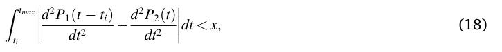

where *P*1*, P*2 are a polynomial interpolation of a cell population that originated from two different values and *x* is a manually picked threshold. Fig. 5 is the result of picking *x* = 1.

The motivation for Eq. (18) is to find an interval [*t*i*, t*max] such that the difference between curvatures of two functions is small enough (*x*) in time. If two functions satisfy this condition, then, there is some point in time *t*i in the treatment protocol where the sum of differences in the changes of the cell populations are significant enough and the original functions should present an entirely different behavior.

Fig. 5a and b presents the bifurcation in the dynamics of *T*u and *A*b, respectively. In the case where *T*u(0) = 2⋅106 then the population of *T*u is decreasing over time and *A*b converge to 1*.*5⋅106 after three weeks. On the other hand, where *T*u(0) = 2*.*7⋅108 the population of *T*u increases over time and *A*b has harmonic behavior oscillating between 7*.*5⋅105 and 1*.*75⋅ 106.

This bifurcation is associated with the fact that a small enough amount of cancer cells in the beginning of the treatment leads to relatively small amplitude in the BCG-activated APC *A*B cell population size, after converging to 1*.*3⋅106. The small amplitude reflects the overall immune system’s response; the *A*B population is slightly affected by different amounts of injected BCG *b* as shown in Fig. 10. Similarly, a large amount (2*.*7 ⋅108) of cancer cells in the beginning of the treatment leads to more sporadic behavior of the immune system.

Fig. 5c presents the bifurcation in the dynamics of *T*i from the changes in the natural tumor growth *r*. In the case where *r* = 2*.*73⋅10− 1 the population of *T*i increases in the first seven weeks and then decreases. On the other hand, where *r* = 2*.*92⋅10− 1 the population of *T*i monotonically increases over time.

Fig. 5d and e presents the bifurcation in the dynamics of *T*u and *A*t from changes in the BCG installations *b*, respectively. In the case where *b* = 105 the population of both *A*t and *T*u monotonically increases over time. On the other hand, where *b* = 2*.*5⋅105 the populations of both *T*u and *A*t decrease to zero.

## 4. Time optimal treatment protocol

The question is whether it is possible to find the optimal treatment protocol in accordance with the initial conditions of the patient. By finding the equation describing the border between successful and unsuccessful treatment protocols in continuous settings, it can be determined if it is feasible to predict if a treatment will result in tumor-free equilibrium or not. In space P this is a phase transformation between unsuccessful and successful treatment in time as shown in Fig. 4.

Considering the initial state of the patient as the size of the cancer cell population at the beginning of treatment (*T*u(*t*0)), the treatment protocol as the amount of BCG injected (*b*) and the frequency of its introduction into the bladder (*m*), the optimal treatment ensures a minimum duration (if it exists) so that the treatment is successful. This phase transformation can be defined by a border function *BF* : R2→R such that *BF*(*T*u(0)*,b*)→*t*. Given (*T*u(0)*,b, m* = 7), any time *t* that satisfies *t >*= *t*min will result in a successful treatment and *t < t*min otherwise, where *t*min = *BF*(*T*u(0)*, b*).

It is possible to approximate the border function using the border pixels and then using the least mean square (LMS) method (Bj¨orck, 1996) to approximate the border function itself. First, a pixel (*i,j,k*) will be defined as a *border pixel* iff it satisfies

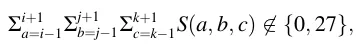

where {0*,* 27} are the cases where all the values of 3 × 3 × 3 window centered in the pixel (*i,j,k*) are the same (either 0 or 1). Fig. 4 shows the border pixels in green. This method is inspired by computer vision threshold based edge detection algorithms (Yellasiri et al., 2011).

Second, to use the LMS method one needs to define the family function approximating the function. The function family has been chosen to balance between the accuracy of the sampled data on the one hand and simplicity of usage on the other (Shanock et al., 2010). The border function is obtained with a coefficient of determination *R*2 = 0*.*85, using the LMS method. Therefore, it is safe to claim that function *f*(*b, T*u(0)) is well fitting the data and presents a good approximation for the border function, which is easy and stable to compute.

*f* (*b, T*u(0)) = *a*1 + *a*2*b* + *a*3*T*u(0) + *a*4*bT*u(0) + *a*5*b*2 + *a*6*T*u(0)2

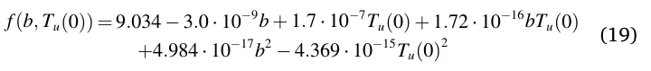

For example, consider a patient who has a polyp in the urinary bladder of size *T*u(*t*0) = 5⋅106 cells, and receives BCG treatment *b* = 2⋅ 106 once a week. By setting these values in the Eq. (19), the minimal treatment time, 10 weeks, will be possible for successful results.

## 5. Treatment protocol based on initial tumor distribution

Weiner et al. (2019) have shown that the localization of a cancer polyp in the bladder affects the dynamics of cells inside the bladder as a result of differences in the biological reaction to treatment. The model proposed by Grabnar et al. (2006) is a mathematical model that describes the interaction of different layers of the urinary bladder from a biological point of view. They presented the variable drug concentration due to urine formation and voiding diffusion in the bladder tissue with parameters from *in vitro* experiments.

<figure id="fig-6">
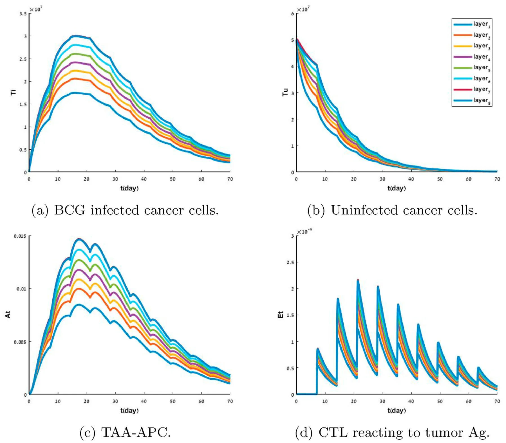
<figcaption><strong>Fig. 6.</strong> The dynamics of the system where the cancer cells <em>T</em>u are equally distributed at a single layer of the urothelium at the beginning of the treatment (<em>t</em>0). Each color represents the cell population size in the whole geometry. The x-axis is the time (in days) from the beginning of the treatment. The y-axis is the cell population size.</figcaption>
</figure>

The model proposed in Eq. (1 - 14) takes into consideration the bladder’s geometry (Eq. (11)) and the diffusion dynamics of cell population biological reactions. Specifically, adding the diffusion dynamics to Eqs. (1)–(9) and the border condition from Eq. (12) and Algorithm 1. The model allows to fine-tune the prediction according to the tumor’s depth in the urothelium at the beginning of the treatment which in turn improves the accuracy of the model and therefore more accurately predicts the treatment result.

Cancer polyps depth and distribution inside the bladder’s geometry can be approximated using multiple ring-sphere shaped layers of the urothelium, centralized in the center of bladder. According to this approximation, it is possible to define a two-parameter space which describes non-isomorphic instances of tumor depths in the bladder’s geometry at time *t*0 of the treatment. The normalized size of cancer cell ( ) population Tu(r,t) and the distribution of the population in the eighth ||*T*u(*r,t*)|| layer of the urothelium.

Figs. 6 and 7 are derived using Eq. (15) as well, at the beginning of the treatment *t*0, the geometry of the bladder as presented in Fig. 1, has been divided into eight separated geometries (layers). Each bladder tissue layer’s geometry satisfies the condition:

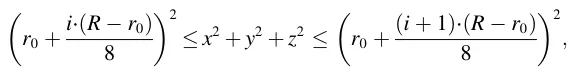

where *i* ∈[0*,* …*,* 7] is the index of the layer. Each geometry has been represented by a two-dimensional array (grid), where cancer cells have been allocated to a layer, with the values of the array assigned to be the amount of the uninfected cancer cells.

It is possible to analyze the differences in the dynamics between the layers of the urothelium, allowing us to better understand the differences in the dynamic in each tissue layer. Fig. 6 shows the dynamics of the system where the cancer cells *T*u are equally distributed at a single layer of the urothelium. The population of BCG infected cancer cells *T*i grows faster in the first 2 weeks as the cancer found only in a deeper layer but is reduced at a faster rate after the second week, as shown in Fig. 6a. Similarly, when the cancer cells are found deeper in the urothelium at the beginning of the treatment than the population of cancer cells *T*u decays at a slower rate, as shown in Fig. 6b. In addition, the reaction of the immune system is relatively small, as shown in Fig. 6c and d.

<figure id="fig-7">
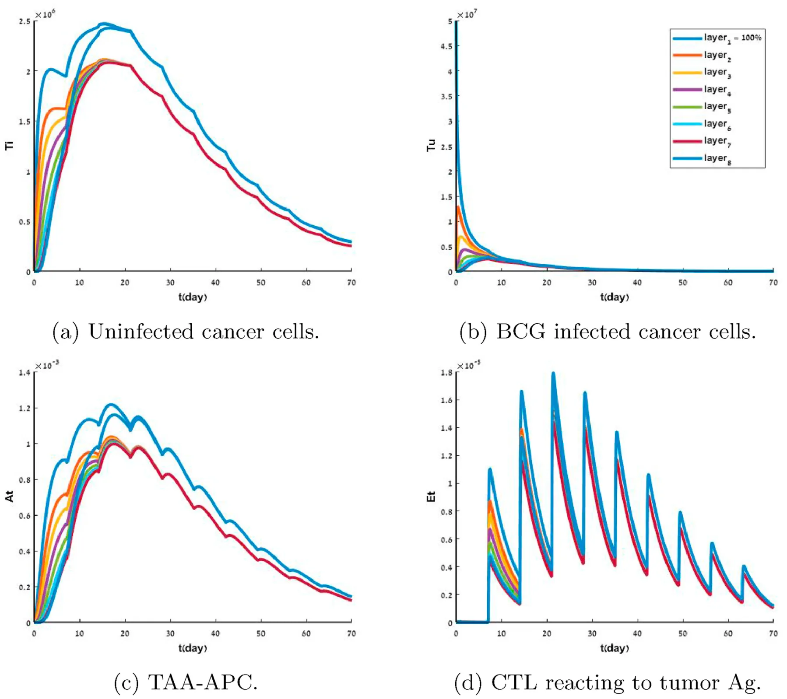
<figcaption><strong>Fig. 7.</strong> The dynamics of each individual layer of the system’s geometry where the cancer cells <em>T</em>u are equally distributed at the first (most shallow) layer of the urothelium at the beginning of the treatment (<em>t</em>0). Each color represents the cell population size in a different layer of the urothelium. The x-axis is the time (in days) from the beginning of the treatment. The y-axis is the cell population size.</figcaption>
</figure>

<figure class="table-figure" id="table-1">
<figcaption><strong>Table 1</strong> The sensitivity of the model to the initial distribution of cancer cells in different layers of the bladder at the beginning of treatment (<em>t</em>0). <em>SP</em> is defined as the difference between the uninfected cancer cell population from the treatment protocols with the biggest population size of uninfected cancer cells and smallest population size at time <em>t</em>max. <em>AP</em> is defined as the average uninfected cancer population size for all the possible combinations of different treatment protocols that differ in the distribution of the uninfected cancer cells in the layers of the urothelium. The values were calculated over the first four weeks of the treatment.</figcaption>

<table><tr><th></th><th>1 layer</th><th>2 layers</th><th>3 layers</th><th>4 layers</th><th>5 layers</th><th>6 layers</th></tr><tr><td>SP [m3t]</td><td>1.90 ⋅ 107</td><td>1.63 ⋅107</td><td>1.36 ⋅107</td><td>0.88 ⋅107</td><td>0.70 ⋅ 107</td><td>0.54 ⋅107</td></tr><tr><td>AP [m3t]</td><td>1.157 ⋅ 109</td><td>1.155 ⋅109</td><td>1.159 ⋅ 109</td><td>1.158 ⋅109</td><td>1.159 ⋅109</td><td>1.157 ⋅ 109</td></tr></table>

</figure>

All cell population sizes for the different cases converge after 10 weeks, which can be associated with the fact that after enough time the diffusion of the cells’ populations are spread all over the geometry of the bladder and from that point operating as instance response, making the location insignificant, as shown in Fig. 6.

It is possible to divide the geometry to the eight layers of the urothelium to examine the influence of the initial cancer polyp depth on the layer level. Fig. 7 shows the dynamics of each individual layer of the system’s geometry where the cancer cells are equally distributed in the first (most shallow) layer of the urothelium.

The cancer starts to spread to other layers where layers closer to the polyps are affected faster. Nevertheless, in the first week of the treatment, the overall population of uninfected cancer cells (*T*u) decreases, as shown in Fig. 7b. As a result, the BCG-infected cell population (*T*i) shows a different increment rate in different layers until the end of the second week, where the changes between the different layers become negligible. Moreover, the first and eighth layers show a slightly different behavior in comparision to the other six layers. This phenomenon can be explained by the fact that these are the border layers of the model and have only one neighbor layer to spread to other layers which have two neighbor layers to spread to, as shown in Fig. 7a where the first and eighth layers show faster increase in the first three weeks of the treatment, reaching a higher maximum (1*.*2⋅106) compared to the other six layers (1⋅ 106). The populations of TAA-APC *A*t and CTL reacting to tumor Ag. *E*t cells show similar behavior, as shown in Fig. 7c and d, respectively. In both Figs. 6 and 7, the cell populations *B, I*2*, A, A*b, and *E*B are not shown as the changes are neglected relative to the dynamics shown in Fig. 2.

From clinical trials, it is known that cancer cells usually spread across multiple layers of the urothelium (Weiner et al., 2019). To examine the influence of the number of tumor polyps on the system, multiple layers with tumors can be initialized. Table 1 shows the differences in the dynamics of the uninfected cancer cell *T*u population size given a combination of {*k*}6 0 different layers where the cancer cells are equally distributed. *SP* is defined as the difference between the treatment protocol with the biggest population size and smallest population size [*m*3*t*]. This metric allows for measurement of the difference between the different treatment protocols of cancer cell population that originated in multiple layers of the urothelium, calculated as follows

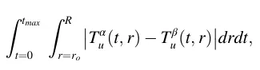

where *T*α u(*t, r*) and *T*β u(*t, r*) are two different cancer cell populations dynamics from different initial conditions.

*AP* is defined as the average cancer population size for all the possible combinations. The values are calculated over the first four weeks of the treatment as follows

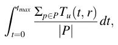

where *P* is the set of all the possible isomorphic permutations of *k* layers from the eight layers of the urothelium.

The differences between the case with the biggest population size of uninfected cancer cells at time *t*max and with the smallest population size are reduced as the cancer is initialized in more layers. In addition, the average case for different amounts of initial layers that cancer cells are similarly distributed for all {*k*}6 0 layers, is shown in Table 1.

Based on Table 1 and Fig. 7b, it can be noticed that the treatment starts to be efficient after the BCG arrives at the deepest layer where the cancer polyp is located. In Fig. 7b, the amount of uninfected cancer cells *T*u is almost equal after the first week across all the layers.

We argue that a treatment protocol should aim to arrive at the point where the BCG arrives at the deepest layer where the cancer polyp is located in the dynamics as early as possible. From Eq. (1) the diffusion of the BCG influences the distribution of the BCG in the geometry. The BCG diffusion is

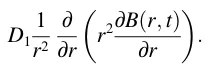

Both *r* and *D*1 are properties of the bladder and a way to influence them does not exist in the scope of this treatment. On the other hand, the size of the population *B*(*r, t*) can be changed in the treatment protocol by introducing into the system an increased amount of BCG. A larger amount of BCG results in faster spread of the BCG in the geometry of the bladder. Fig. 6b shows that the size of *T*u in the whole geometry for the same amount of injected BCG *b*.

<figure class="table-figure" id="table-2">
<figcaption><strong>Table 2</strong> The amount of BCG needed to be injected in the first week is a function of the deepest layer of where the uninfected cancer cell population is located at the beginning of the treatment to get <em>T</em>u − <em>similar</em> treatment protocols with the baseline. <em>t</em>max is taken to be the 42 days that it takes to match the standard treatment duration (Paterson and Patel, 1998).</figcaption>

<table><tr><th>Layer</th><th>1st (baseline)</th><th>2nd</th><th>3rd</th><th>4th</th><th>5th</th><th>6th</th><th>7th</th><th>8th</th></tr><tr><td>BCG (b⋅ 106)</td><td>1.07</td><td>1.16</td><td>1.48</td><td>1.91</td><td>2.49</td><td>3.12</td><td>3.88</td><td>5.04</td></tr></table>

</figure>

The motivation is to reduce the initial spread of the cancer cell population (*T*u(0)) inside the geometry of the bladder relatively quickly. In doing so, the point can be reached where the system’s dynamic operates as an instant response and the geometry can be neglected (Lazebnik et al., 2020). Such an approach may be used to personalize the treatment protocol according to the patent’s initial spread of the cancer cell population at the beginning of the treatment, aiming to arrive at the point in the treatment where the treatment protocol can be replaced with a generic one with the best results.

Recall, we define a treatment protocol by the four parameter *T*u(0)*, b, t,* and *i*2. We define two treatment protocols *TP*1*, TP*2 which differ only in the injected amount of BCG *b* to be *T*u − *similar* after some time *t*\* if and only if the *T*u(*t*\*) resulting from treatment protocol *TP*1 (marked as *T*u(*t*\*)|TP1) and *TP*2 (marked as *T*u(*t*\*)|TP2) satisfies

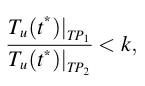

where *k >* 1 ∈ R. The motivation of the definition is to declare that the population of uninfected cancer cells *T*u(*t, r*) in the whole geometry for two protocols is in one level of magnitude defined by some factor *k*.

Table 2 shows the amount of BCG that is needed in the first week such that a treatment protocol (*TP*) will be *T*u − *similar* at time *t*\* = *t*7 to the treatment protocol that satisfies *T*u(0) = 1⋅106, *k* = 10 and *b* = 1*.*07⋅106, where *t*7 is the seventh day of the treatment.

## 6. Conclusions

Mathematical modeling has already been shown to be a useful tool for studying the mechanism of tumor growth and response to therapy (Bunimovich-Mendrazitsky et al., 2015a; Bunimovich-Mendrazitsky and Goltser, 2011; Matzavinos et al., 2004; Bunimovich-Mendrazitsky et al., 2019). Models which better represent the biological and clinical dynamics and complexity can provide a better understanding of the system, resulting in more accurate prediction of an outcome of a treatment and determination of better therapeutic protocols (Shaikhet and Bunimovich-Mendrazitsky, 2018; Guzev et al., 2019). Specifically, models based on population analysis are a common way of describing such systems (Bunimovich-Mendrazitsky et al, 2015a; Kirschner and Panetta, 1998).

Based on the proposed model, the bifurcation for *T*u*, A*b*, T*i*, T*u*,* and *A*t resulted in changes in *T*u(0), *r*, and *b* as shown in Fig. 5. We argue that these bifurcations are the border line between a successful and unsuccessful treatment and the found values can be used to assist in clinical decisions based on the proposed treatment protocol.

In addition, a time optimal treatment protocol has been proposed using the stable matrix defined by the parameters that affect the success of a treatment based on the system’s image space (Guzev et al., 2019). A formula that, given the patient’s cancer cell population size at the beginning of the treatment *T*u(0) and the amount of BCG installations *b*, returns the minimal treatment time in days for the treatment to be successful as shown in Eq. (19).

Furthermore, we show that the proposed model takes into consideration the initial distribution of the cancer cells over the geometry of the bladder and as such can provide more customized treatment by providing tumor polyps depth in the urothelium. Fig. 6 shows that a cancer tumor that originates in a shallower layer of the urothelium can be treated with less aggressive treatment either in treatment duration or injection of BCG *b*. Layer specific treatment is insignificant and in the case where the tumor polyps are spread out, it is easier to instead treat the case where the tumor is localized in a deep layer of the urothelium, as shown in Fig. 7 and Table 1.

Moreover, Table 2 shows the amount of BCG that is needed to be introduced in the first week of the treatment such that the model can neglect the geometry of the bladder without meaningful loss of accuracy. Providing a personal BCG injection protocol at the beginning of

## Appendix

### 7.1 Computationally Parameter’s Values

treatment gives the best results.

These results are important for BCG immunotherapy, which modulates the healing effect. Understanding the key processes in tumor-immune interactions will be crucial for the development of effective treatments, for setting goals, as well as for optimizing dosage and schedule. The model presented here takes a step towards demonstrating the effect of the depth of the cancer and its spread, and further extensions of the model will be used to learn how to manage the treatment protocol for the successful elimination of bladder cancer.

## Declarations of competing interest

None.

Table 3 describes the parameter values used in the calculation of the model not mentioned otherwise. All the values were taken from (Guzev et al., 2019). Parameters {*D*i}9 i=1 taken from (Lazebnik et al., 2020). *D*1 satisfies the same conditions as Eq. (1) from (Lazebnik et al., 2020). *D*2*,D*3*,D*4*,D*5*,D*6, and *D*7 are equal to the diffusion factor of the effector cells *E* assuming the diffusion of the cell population related to the immune system is identical. *D*8 and *D*9 are identical to the diffusion coefficients of the BCG infected and uninfected cancer cells.

<figure class="table-figure" id="table-3">
<figcaption><strong>Table 3</strong> The model’s parameters.</figcaption>

<table><tr><th>Parameter</th><th>Value</th><th>Source</th></tr><tr><td>βB</td><td>7.20⋅105</td><td>Guzev et al. (2019)</td></tr><tr><td>βT</td><td>7.50⋅103</td><td>Guzev et al. (2019)</td></tr><tr><td>Γ</td><td>4.70⋅103</td><td>Guzev et al. (2019)</td></tr><tr><td>R</td><td>8.50⋅10−3</td><td>Guzev et al. (2019)</td></tr><tr><td>B</td><td>1.07⋅106</td><td>Guzev et al. (2019)</td></tr><tr><td>Tu(0)</td><td>1.00⋅106</td><td>Guzev et al. (2019)</td></tr><tr><td>i2</td><td>1.00⋅106</td><td>Guzev et al. (2019)</td></tr><tr><td>i2</td><td>1.00⋅106</td><td>Guzev et al. (2019)</td></tr><tr><td>eTb</td><td>1.00⋅104</td><td>Guzev et al. (2019)</td></tr><tr><td>q1</td><td>7.00⋅10−3</td><td>Guzev et al. (2019)</td></tr><tr><td>q2</td><td>1.20⋅10−3</td><td>Guzev et al. (2019)</td></tr><tr><td>μA</td><td>3.80⋅10−3</td><td>Guzev et al. (2019)</td></tr><tr><td>μA1</td><td>4.00⋅10−1</td><td>Guzev et al. (2019)</td></tr><tr><td>μE1</td><td>1.90⋅10−1</td><td>Guzev et al. (2019)</td></tr><tr><td>μE2</td><td>3.40⋅10−3</td><td>Guzev et al. (2019)</td></tr><tr><td>А</td><td>3.70⋅10−6</td><td>Guzev et al. (2019)</td></tr><tr><td>αβT</td><td>1.38⋅10−4</td><td>Guzev et al. (2019)</td></tr><tr><td>αTβ</td><td>6.90⋅10−1</td><td>Guzev et al. (2019)</td></tr><tr><td>μB</td><td>1.50⋅10−1</td><td>Guzev et al. (2019)</td></tr><tr><td>μI2</td><td>1.15⋅101</td><td>Guzev et al. (2019)</td></tr><tr><td>μβ</td><td>1.66⋅102</td><td>Guzev et al. (2019)</td></tr><tr><td>gT</td><td>5.20⋅103</td><td>Guzev et al. (2019)</td></tr><tr><td>G</td><td>1.00⋅1013</td><td>Guzev et al. (2019)</td></tr><tr><td>gI</td><td>1.00⋅105</td><td>Guzev et al. (2019)</td></tr><tr><td>p1</td><td>1.25⋅10−4</td><td>Guzev et al. (2019)</td></tr><tr><td>p2</td><td>0.28⋅10−5</td><td>Guzev et al. (2019)</td></tr><tr><td>p3</td><td>1.03⋅10−10</td><td>Guzev et al. (2019)</td></tr><tr><td>p4</td><td>2.32⋅10−5</td><td>Guzev et al. (2019)</td></tr><tr><td>D1</td><td>1.00⋅10−4</td><td>Lazebnik et al. (2020)</td></tr><tr><td>D2</td><td>7.00⋅10−5</td><td>Lazebnik et al. (2020)</td></tr><tr><td>D3</td><td>7.00⋅10−5</td><td>Lazebnik et al. (2020)</td></tr><tr><td>D4</td><td>7.00⋅10−5</td><td>Lazebnik et al. (2020)</td></tr><tr><td>D5</td><td>7.00⋅10−5</td><td>Lazebnik et al. (2020)</td></tr><tr><td>D6</td><td>7.00⋅10−5</td><td>Lazebnik et al. (2020)</td></tr><tr><td>D7</td><td>7.00⋅10−5</td><td>Lazebnik et al. (2020)</td></tr><tr><td>D8</td><td>6.00⋅10−1</td><td>Lazebnik et al. (2020)</td></tr><tr><td>D9</td><td>6.00⋅10−1</td><td>Lazebnik et al. (2020)</td></tr></table>

</figure>

### 7.2 Sensitivity Analysis

The sensitivity of the model to changes in several parameters has been explored. Using the sensitivity analysis it is possible to examine the lim itations and robustness of the model. The parameters in the model that have be explored are *α, β, β*B*, r, λ, b,* and *T*u(*r, t*0) which are chosen because of their biological importance in the treatment protocol. It is known that each parameter has upper and lower boundary values in the scope of this treatment (Shaikhet and Bunimovich-Mendrazitsky, 2018). Figs. (8-12) present the different dynamics of the system for each one of the nine population sizes where the color of each plot defined the value of the considered parameter used in each calculation. The sample values for each parameter {

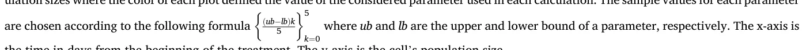

the time in days from the beginning of the treatment. The y-axis is the cell’s population size.

Fig. 8 shows the sensitivity of the system to parameter α ranging from 103 to 9⋅103 with step size 1*.*25⋅103. Each color (and line style) represents a different sample. It is easy to see that there is no change in the population sizes as a function of α.

<figure id="fig-8">
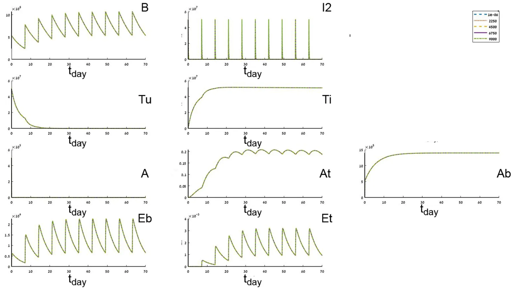
<figcaption><strong>Fig. 8.</strong> Sensitivity of parameter α ranging from 1⋅103 to 9⋅103..</figcaption>
</figure>

Fig. 9 shows the sensitivity of the system to parameter β ranging from 2*.*55⋅10− 2 to 4*.*25⋅10− 2 with step size 4*.*25⋅10− 3. Sub figures *A*t and *A*b show that smaller β resulted in a stronger response of the immune system.

<figure id="fig-9">
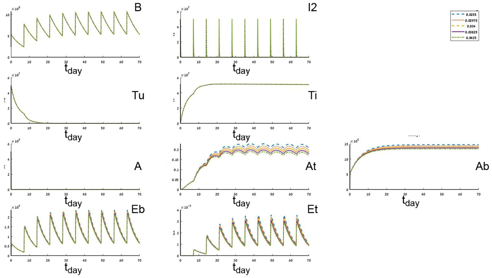
<figcaption><strong>Fig. 9.</strong> Sensitivity of parameter β ranging from 0.0255 to 0.0425..</figcaption>
</figure>

Fig. 10 shows the sensitivity of the system to parameter *b* ranging from 105 to 108 with step size 1*.*98⋅106. Where *b* is low (blue line) then the tumor cells (*T*i*, T*u) are increasing and as a result the immune system cells *A*t*, E*t are increasing in the injection over time as well. It is easy to notice that a too little amount of *b* does not lead to tumour-free equilibrium. As *b* grows, more *T*u cells are converted faster to *T*i and the immune system’s cell populations grow but converge to some plateau. In addition, sub figures *T*u and *A*b show inherently different dynamics for different values of *b* which are further analyzed in the bifurcation section.

<figure id="fig-10">
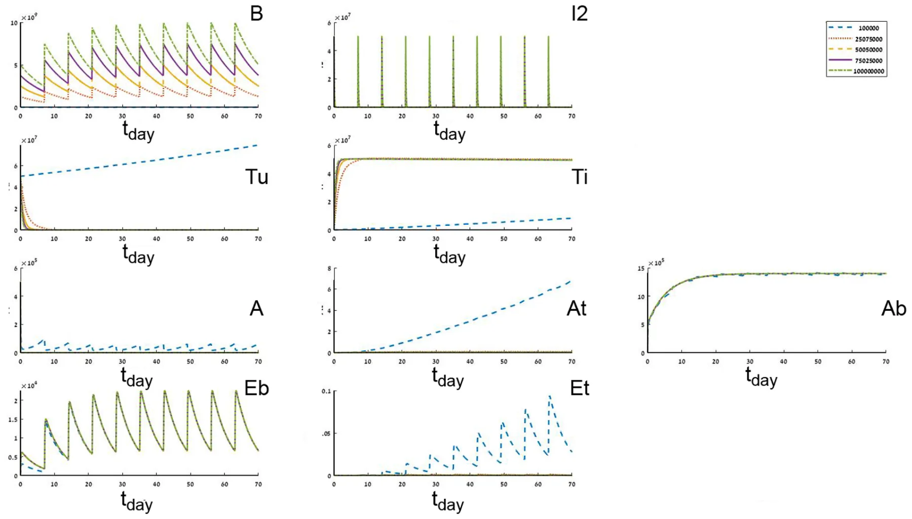
<figcaption><strong>Fig. 10.</strong> Sensitivity of parameter <em>b</em> ranging from 105 to 108..</figcaption>
</figure>

Fig. 11 shows the sensitivity of the system to parameter *β*B ranging from 1*.*08⋅104 to 1*.*81⋅104 with step size 1*.*45⋅103. Sub Figure *A*t shows that *A*t decreases as *β*B increases while *β*b has a minor effect on the other cell populations.

<figure id="fig-11">
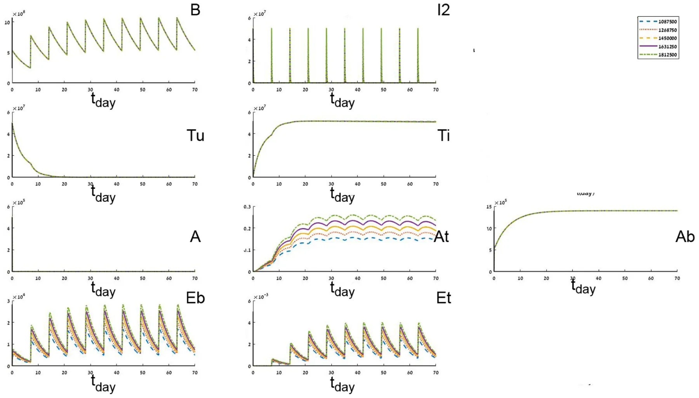
<figcaption><strong>Fig. 11.</strong> Sensitivity of parameter <em>β</em>B ranging from 1087500 to 1811200..</figcaption>
</figure>

Fig. 12 shows the sensitivity of the system to parameter *r* ranging from 1⋅10− 3 to 5⋅10− 1 with step size 1*.*25⋅10− 2. As *r* increases the needed time such that the cancer cell population size (*T*i*, T*u) decay rate is decreasing. Furthermore, for a large enough *r* the system does not converge to a tumor-free equilibrium, as shown in sub figures *T*u and *T*i. In addition, a small enough *r* results in a more stable immune system reaction *A*b*, A*t*, A*. Sub Figure *T*u shows inherently different dynamics for different values of *r* which are further analyzed in the bifurcation section.

<figure id="fig-12">
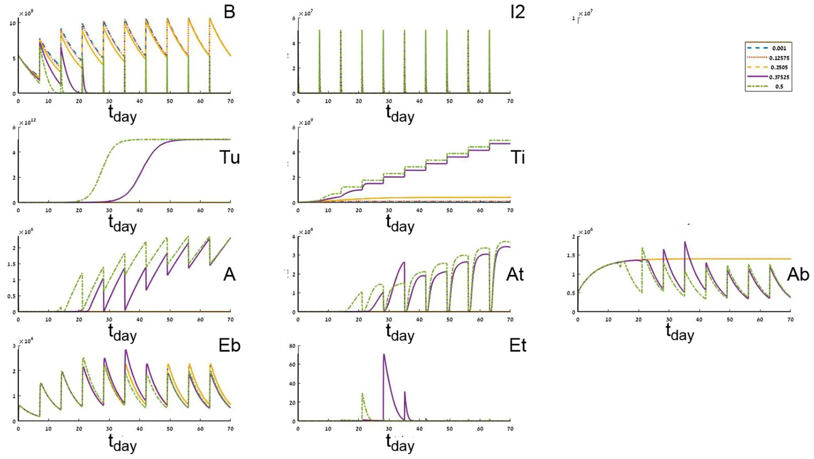
<figcaption><strong>Fig. 12.</strong> Sensitivity of parameter <em>r</em> ranging from 1⋅10− 3 to 5⋅10− 1..</figcaption>
</figure>

## References

- Bhattacharya, S., Sah, P.P., Banerjee, A., Ray, S., 2020. Structural impact due to PPQEE deletion in multiple cancer associated protein - integrin V: an in silico exploration. ABiosystems 104216. [link](http://refhub.elsevier.com/S0303-2647%2820%2930193-3/sref1)
- Bj¨orck, Å., 1996. Numerical Methods for Least Squares Problems. SIAM Journal on Scientific and Statistical Computing. Book OT51. [link](http://refhub.elsevier.com/S0303-2647%2820%2930193-3/sref1) · [link](http://refhub.elsevier.com/S0303-2647%2820%2930193-3/sref2)
- Bray, F., Ferlay, J., Soerjomataram, I., Siegel, R.L., Torre, L.A., Jemal, A., 2018. Global cancer statistics 2018: GLOBOCAN estimates of incidence and mortality worldwide for 36 cancers in 185 countries. CA A Cancer J. Clin. 68 (6), 394–424. [link](http://refhub.elsevier.com/S0303-2647%2820%2930193-3/sref2) · [link](http://refhub.elsevier.com/S0303-2647%2820%2930193-3/sref3)
- Buis, R.G., 1968. Lyapunov stability for partial differential equations. NASA 1100. [link](http://refhub.elsevier.com/S0303-2647%2820%2930193-3/sref3) · [link](http://refhub.elsevier.com/S0303-2647%2820%2930193-3/sref4)
- Bunimovich-Mendrazitsky, S., Goltser, Y., 2011. Use of quasi-normal form to examine stability of tumor-free equilibrium in a mathematical model of BCG treatment of bladder cancer. Math. Biosci. Eng. 8, 529–547. [link](http://refhub.elsevier.com/S0303-2647%2820%2930193-3/sref4) · [link](http://refhub.elsevier.com/S0303-2647%2820%2930193-3/sref5)
- Bunimovich-Mendrazitsky, Pisarev, V., E. Kashdan, E., 2015a. Modeling and simulation of a low-grade urinary bladder carcinoma. Comput. Biol. Med. 58, 118–129. [link](http://refhub.elsevier.com/S0303-2647%2820%2930193-3/sref5) · [link](http://refhub.elsevier.com/S0303-2647%2820%2930193-3/sref7)
- Bunimovich-Mendrazitsky, S., Halachmi, S., Kronik, N., 2015b. Improving Bacillus Calmette Gu´erin (BCG) immunotherapy for bladder cancer by adding interleukin-2 (IL-2): a mathematical model. Math. Med. Biol. 159–188. [link](http://refhub.elsevier.com/S0303-2647%2820%2930193-3/sref7) · [link](http://refhub.elsevier.com/S0303-2647%2820%2930193-3/sref8)
- Bunimovich-Mendrazitsky, S., Kronik, N., Vainstein, V., 2019. Optimization of interferon-alpha and imatinib combination therapy for chronic myeloid leukemia: a modeling approach. Adv. Theor. Simul. 1800081. [link](http://refhub.elsevier.com/S0303-2647%2820%2930193-3/sref8) · [link](http://refhub.elsevier.com/S0303-2647%2820%2930193-3/sref9)
- Coddington, E.A., Levinson, N., 1955. Theory of Ordinary Differential Equations. New York McGraw-Hill. [link](http://refhub.elsevier.com/S0303-2647%2820%2930193-3/sref9) · [link](http://refhub.elsevier.com/S0303-2647%2820%2930193-3/sref10)
- Eikenberry, S., Thalhauser, C., Kuang, Y., 2009. Tumor-immune interaction, surgical treatment, and cancer recurrence in a mathematical model of melanoma. PLoS Comput. Biol., e1000362 [link](http://refhub.elsevier.com/S0303-2647%2820%2930193-3/sref10) · [link](http://refhub.elsevier.com/S0303-2647%2820%2930193-3/sref11)
- Eylert, M., Hounsome, L., Persad, R., Bahl, A., Jefferies, E., Verne, J., Mostafid, H., 2014. Falling bladder cancer incidence from 1990 to 2009 is not producing universal mortality improvements. J. Clin. Urol. 7, 90–98. [link](http://refhub.elsevier.com/S0303-2647%2820%2930193-3/sref11) · [link](http://refhub.elsevier.com/S0303-2647%2820%2930193-3/sref12)
- Fridman, A., Kao, C.Y., 2014. Mathematical Modeling of Biological Processs, Lecture Notes on Mathematical Modeling in the Life Sciences. Springer, Cham. [link](http://refhub.elsevier.com/S0303-2647%2820%2930193-3/sref12) · [link](http://refhub.elsevier.com/S0303-2647%2820%2930193-3/sref13)
- Grabnar, I., Bogataj, M., Belic, A., Logar, V., Karba, R., Mrhar, A., 2006. Kinetic model of drug distribution in the urinary bladder wall following intravesical instillation. Int. J. Pharma. 52–59. [link](http://refhub.elsevier.com/S0303-2647%2820%2930193-3/sref13) · [link](http://refhub.elsevier.com/S0303-2647%2820%2930193-3/sref14)
- Guzev, E., Halachmi, S., Bunimovich-Mendrazitsky, S., 2019. Additional extension of the mathematical model for BCG immunotherapy of bladder cancer and its validation by auxiliary tool. Int. J. Nonlinear Sci. Numer. Stimul. 20 (6), 675–689. [link](http://refhub.elsevier.com/S0303-2647%2820%2930193-3/sref14) · [link](http://refhub.elsevier.com/S0303-2647%2820%2930193-3/sref15)
- Herr, H.W., Laudone, V.P., Badalament, R.A., Oettgen, H.F., Sogani, P.C., Freedman, B. D., Melamed, M.R., Whitmore, W.F., 1988. Bacillus Calmette-Gu´erin therapy alters the progression of superficial bladder cancer. J. Clin. Oncol. 1450–1455. [link](http://refhub.elsevier.com/S0303-2647%2820%2930193-3/sref15) · [link](http://refhub.elsevier.com/S0303-2647%2820%2930193-3/sref16)
- Hornberg, J.J., Bruggeman, F.J., Westerhoff, H.V., Lankelma, J., 2006. Cancer: a systems biology disease. Biosystems 81–90. [link](http://refhub.elsevier.com/S0303-2647%2820%2930193-3/sref17)
- Jord˜ao, G., Tavares, J.N., 2017. Mathematical models in cancer therapy. Biosystems 12–23. [link](http://refhub.elsevier.com/S0303-2647%2820%2930193-3/sref17) · [link](http://refhub.elsevier.com/S0303-2647%2820%2930193-3/sref18)
- Kirschner, D., Panetta, J.C., 1998. Modeling immunotherapy of the tumor–immune interaction. J. Math. Biol. 37, 235–252. [link](http://refhub.elsevier.com/S0303-2647%2820%2930193-3/sref18) · [link](http://refhub.elsevier.com/S0303-2647%2820%2930193-3/sref19)
- Lamm, D.L., 2006. Improving patient outcomes: optimal BCG treatment regimen to prevent progression in superficial bladder cancer. Eur. Urol. Suppl. 5, 654–659. [link](http://refhub.elsevier.com/S0303-2647%2820%2930193-3/sref19) · [link](http://refhub.elsevier.com/S0303-2647%2820%2930193-3/sref20)
- Lazebnik, T., Yanetz, S., Bunimovich-Mendrazitsky, S., Haroni, N., 2020. Treatment of bladder cancer using BCG immunotherapy: PDE modeling. Partial Differ. Equ. [doi:10.26351/FDE/26/3-4/5](https://doi.org/10.26351/FDE/26/3-4/5) · [link](http://refhub.elsevier.com/S0303-2647%2820%2930193-3/sref20)
- Matzavinos, A., Chaplain, M.A., Kuznetsov, V.A., 2004. Mathematical Modelling of the Spatio-Temporal Response of Cytotoxic T-Lymphocytes to a Solid Tumour, Mathematical Medicine and Biology, pp. 1–34. [doi:10.26351/FDE/26/3-4/5](https://doi.org/10.26351/FDE/26/3-4/5) · [link](http://refhub.elsevier.com/S0303-2647%2820%2930193-3/sref22)
- Morales, A., Eidinger, D., Bruce, A.W., 1976. Intracavity Bacillus Calmette-Gu´erin in the treatment of superficial bladder tumors. J. Urol. 116, 180–183. [link](http://refhub.elsevier.com/S0303-2647%2820%2930193-3/sref22) · [link](http://refhub.elsevier.com/S0303-2647%2820%2930193-3/sref23)
- Paterson, D.L., Patel, A., 1998. Bactillus calmette-guerin (BCG) immunotherapy for bladder cancer: reivew of complications and their treatment. Aust. N. Z. J. Surg. 340–344. [link](http://refhub.elsevier.com/S0303-2647%2820%2930193-3/sref23) · [link](http://refhub.elsevier.com/S0303-2647%2820%2930193-3/sref24)
- Redelman-Sidi, G., Glickman, M., Bochner, B., 2014. The mechanism of action of BCG therapy for bladder cancer–a current perspective. Nat. Rev. Urol. 11, 153–162. [link](http://refhub.elsevier.com/S0303-2647%2820%2930193-3/sref24) · [link](http://refhub.elsevier.com/S0303-2647%2820%2930193-3/sref25)
- Shaikhet, L., Bunimovich-Mendrazitsky, S., 2018. Stability analysis of delayed immune response BCG infection in bladder cancer treatment model by stochastic perturbations. Comput. Math. Methods Med. [doi:10.1155/2018/9653873](https://doi.org/10.1155/2018/9653873) · [link](http://refhub.elsevier.com/S0303-2647%2820%2930193-3/sref25)
- Shanock, L.R., Baran, B.E., Gentry, W.A., Pattison, S.C., Heggestad, E.D., 2010. Polynomial regression with response surface analysis: a powerful approach for examining moderation and overcoming limitations of difference scores. J. Bus. Psychol. 543–554. [doi:10.1155/2018/9653873](https://doi.org/10.1155/2018/9653873) · [link](http://refhub.elsevier.com/S0303-2647%2820%2930193-3/sref27)
- Simon, M.P., O’Donnell, M.A., Griffith, T.S., 2008. Role of neutrophils in BCG immunotherapy for bladder cancer. Urol. Oncol.: Semin. Orig. Invest. 341–345. [link](http://refhub.elsevier.com/S0303-2647%2820%2930193-3/sref27) · [link](http://refhub.elsevier.com/S0303-2647%2820%2930193-3/sref28)
- Skeel, R.D., Berzins, M., 1990. A method for the spatial discretization of parabolic equations in one space variable. SIAM J. Sci. Stat. Comput. 11, 1–32. [link](http://refhub.elsevier.com/S0303-2647%2820%2930193-3/sref28) · [link](http://refhub.elsevier.com/S0303-2647%2820%2930193-3/sref29)
- Wei, H.C., 2016. Polynomial Regression with Response Surface Analysis: A Powerful Approach for Examining Moderation and Overcoming Limitations of Difference Scores, Discrete and Continuous Dynamical Systems - Series B., pp. 1279–1295. [link](http://refhub.elsevier.com/S0303-2647%2820%2930193-3/sref29) · [link](http://refhub.elsevier.com/S0303-2647%2820%2930193-3/sref30)
- Weiner, A.B., Desai, A.S., Meeks, J.J., 2019. Tumor location may predict adverse pathology and survival following definitive treatment for bladder cancer: a national cohort study. Eur. Urol. Oncol. 2 (Issue 3), 304–310. [link](http://refhub.elsevier.com/S0303-2647%2820%2930193-3/sref30) · [link](http://refhub.elsevier.com/S0303-2647%2820%2930193-3/sref31)
- Yellasiri, R., Poornima, B., Sridevi, T., 2011. Threshold based edge detection algorithm. Int. J. Eng. Technol. 3. [link](http://refhub.elsevier.com/S0303-2647%2820%2930193-3/sref31) · [link](http://refhub.elsevier.com/S0303-2647%2820%2930193-3/sref32)
