## 1. Introduction

The motion of particles through density-stratified fluids plays a central role in numerous natural and industrial processes, including sedimentation in oceans and lakes, pollutant dispersion, and the transport of biological and chemical particulates [1–3]. Although particle settling in homogeneous fluids is commonly described through a balance of gravity, buoyancy, and hydrodynamic drag, this description becomes incomplete when a particle crosses a sharp density interface [4, 5]. In such systems, the particle interacts with an interfacial region that can store, redistribute, and release momentum through wake formation, entrainment, internal-wave response, and viscous or diffusive relaxation. As a result, particles crossing density interfaces often exhibit strong deceleration, prolonged residence near the interface, velocity minima, and, in some cases, apparent rebound or ‘bouncing’, even when no neutrally buoyant position exists [6].

Previous experimental, theoretical, and numerical studies have shown that the additional resistance experienced by particles in stratified fluids cannot be reduced to a simple correction of the classical drag force. Srdi´c-Mitrovi´c *et al* [7] showed that a sphere crossing a sharp density interface can entrain lighter fluid in its wake, thereby increasing the effective resistance during descent. Abaid *et al* [8] extended this picture by introducing a reduced order dynamical model with auxiliary ordinary differential equations for the virtual-mass variable that reproduced the qualitative features of deceleration, arrest, and rebound-like motion. Verso *et al* [5] further related the stratification force to the buoyancy of an entrained wake volume, while Boetti and Verso [9] used numerical simulations to examine how the resulting deceleration and apparent levitation depend on the lower-layer properties and interface thickness. Camassa *et al* [6, 10] developed an inviscid critical-density framework for distinguishing penetration from arrest or levitation regimes, and Wang *et al* [4] identified the sequence of wake attachment, wake detachment, transient bouncing, and final sedimentation in sharply stratified fluids. These studies provide a detailed physical picture of the mechanisms involved in particle–interface interactions, including wake entrainment, added or virtual mass, wake detachment, jet-induced recoil, and interfacial relaxation. However, existing reduced-order descriptions either reproduce only part of the observed transient response or require auxiliary state variables whose connection to directly measurable flow structures is limited. In particular, a compact analytical closure that simultaneously captures delayed onset, exponential relaxation, phase-lagged recoil, and bouncing-like trajectories across experimental conditions remains difficult to obtain from first-principles modeling alone.

This difficulty reflects a broader challenge in fluid dynamics: many experimentally observed phenomena are governed by coupled mechanisms that are known qualitatively, but are difficult to express as closed-form predictive models. Symbolic regression (SR) offers a complementary route for addressing this challenge by searching over analytical expressions rather than fitting parameters within a prescribed functional form [11–13]. In contrast to black-box regression models, SR can return compact mathematical expressions that are interpretable, testable, and suitable for incorporation into reduced-order physical models [14–16]. When combined with dimensional consistency, physical constraints, and expert-guided assumptions, this approach is commonly referred to as physics-informed symbolic regression (PISR) [17–19]. Unlike physics-informed neural networks, where physical constraints are embedded as differentiable penalty terms within a trained network, PISR embeds physical admissibility directly into the search over candidate analytical expressions, so that the outcome remains an interpretable, closed-form closure rather than a black-box model. In this setting, SR is best viewed not as a replacement for physical reasoning, but as a tool for organizing experimental evidence and proposing candidate analytical closures within a physically admissible hypothesis space [20–22].

In the present study, we use an artificial intelligence (AI) assisted, physics-informed SR workflow to identify a reduced-order expression for the stratification-induced force acting on spheres crossing sharp density interfaces. Specifically, we apply recent extensions [23–25] of the SciMED PISR framework [26], to high-resolution particle-tracking data collected from water–salt and water–glycerol stratified systems. The symbolic search is constrained by experimentally measured quantities and physical considerations, including gravitational scaling, density contrast, interface width, viscosity, far-field behavior, dimensional consistency, and the possibility of a delayed oscillatory response associated with the local buoyancy frequency. Within this constrained search space, the procedure provides several candidates that are compact force expressions with delayed activation, an exponentially decaying envelope, and a phase-shifted oscillatory component, and we picked the one with the best physical plausibility.

The result replaces the need for auxiliary virtual-mass ODEs, originally proposed by Abaid *et al* [8] by introducing an analytical, closed-form stratification-force term to the sphere equation of motion. The PISR derived expression enables the equation of motion to capture acceleration reversals, velocity minima, delayed recovery, and bouncing-like trajectories across a range of density contrasts and, more importantly, previously untreated viscous effects. In doing so, it unifies several previously separated empirical observations, including drag enhancement, wake detachment, interfacial recoil, and post-interface oscillations, within one physically interpretable analytical description. Importantly, the formulation was not imposed from a preselected theoretical template; as it computationally found from an AI-guided symbolic search constrained by physical knowledge and verified against experimental measurements.

The contribution of this study is therefore twofold. First, we propose a compact reduced-order stratification-force model that could capture key transient, non-linear and inter-coupled features of particle motion across sharp density interfaces, including velocity minima, delayed recovery, prolonged retention time, and bouncing. The model improves the description of transient-rich cases relative to a virtual-mass-based baseline while retaining a simple analytical form that can be inserted into particle-transport multiphase fluid dynamics numerical simulations. Second, we demonstrate a scientist-in-the-loop workflow for AI-assisted physical-model discovery in fluid dynamics. The methodological novelty is the use of the PISR framework to connect fully resolved time series of experimental measurements with prior physical knowledge.

The remainder of this paper is organized as follows. Section 2 reviews previous attempts to model particle motion in density-stratified fluids and summarizes relevant developments in PISR. Section 3 presents the experimental setup, data-processing procedure, trajectory classification rules, parameter-fitting protocol, and SR workflow. Section 4 reports the selected force expression and evaluates its ability to reproduce measured time histories in velocity-position state space, including retention time and bouncing behavior, relative to a baseline model [8]. Finally, section 5 discusses the physical interpretation, limitations, and potential extensions of the proposed closure, as well as the broader role of AI-assisted SR in constructing interpretable reduced-order models for complex fluid-dynamics systems.

## 2. Background

This section reviews two bodies of work that motivate the present study. First, we summarize previous experimental, theoretical, and numerical efforts to describe the motion of solid particles across density interfaces, with emphasis on wake entrainment, added or virtual mass, interfacial recoil, and bouncing-like dynamics. Second, we review SR and PiSR as tools for extracting interpretable analytical models from data.

### 2.1. The physics of solid particles through density-stratified fluids

The motion of solid particles through density-stratified fluids has long been recognized as a rich and complex problem in fluid dynamics, with relevance to sediment transport, marine snow aggregation, and industrial separation processes [4–8]. Early investigations found that when a sphere crosses a sharp density interface, its velocity decreases sharply relative to predictions based on simple buoyancy–drag balance, a result attributed to the entrainment of lighter fluid, thereby forming a caudal wake. Experiments confirmed that this wake remains temporarily attached to the sphere, enhancing the effective drag until it detaches and returns to the upper layer [7]. These studies established the existence of a stratification drag distinct from classical viscous drag.

Abaid *et al* [8] was the first to observe bouncing phenomena, in which a sinking particle unexpectedly reverses its motion at the density interface, and proposed a first reduced-order model that can reproduce it using three coupled ODEs. The proposed nonlinear dynamical system generalizes the Newtonian force balance by introducing an auxiliary state variable of mass *z*, which evolves dynamically as a virtual fluid mass that traverses the stratification after the sphere:

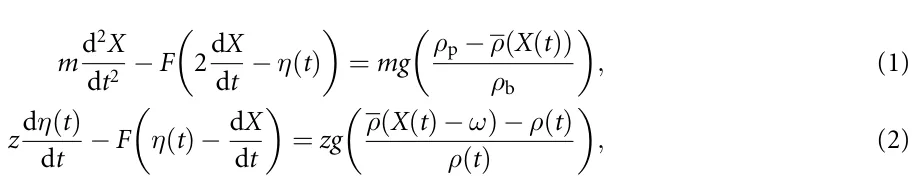

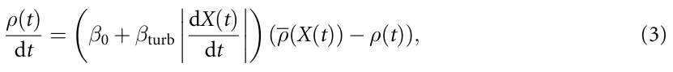

where *X*(*t*) denotes the sphere’s position as a function of time, and the stratified density profile is *ρ*(*X*). The parameters *m*, *ρ*b, and *g* denote the sphere’s mass, particle density, and the gravitational acceleration constant, respectively. A point mass of mass *z*, located a fixed distance *ω* above the sphere with velocity *η*(*t*) and density *ρ*(*t*). The coefficients *β*0 and *β*turb were interpreted as replicas of molecular and turbulent diffusivity, but do not relate to the relevant physical values of such fluid flow properties. Importantly, in this model, as well as in general, the key assumption is that the entrained fluid remains attached to the particle as an added-mass term and exchanges momentum with it during descent [8].

This formulation successfully reproduced several qualitative features of the measured trajectories, including deceleration, arrest, and, in some cases, reversal of motion. However, the model also illustrates a central difficulty in reduced-order descriptions of stratified-particle dynamics: the entrained or virtual mass acts as an auxiliary state variable that represents several unresolved processes at once. In classical theory, the added mass arises from the acceleration of the surrounding fluid and is proportional to a geometric displaced-fluid contribution; for a sphere, this contribution is often written as *m*a = 1 2*ρV*s and it is attached to the sphere, not at some arbitrary distance from the sphere. In contrast, the effective mass-like quantity used in this model attempts to represent complex phenomena of wake entrainment, density exchange, and momentum coupling with the surrounding stratification and requires two additional ODEs. As a result, the model can reproduce important trajectory features but could not provide a compact explicit force closure with explicit terms representing delayed interfacial response, phase-lagged recoil, or oscillatory post-interface recovery. This limitation motivates the search for a reduced-order force expression that can represent these transient effects while remaining analytically interpretable.

Verso *et al* [5] refined the physical description by relating the stratification force to the buoyancy of an entrained wake volume rather than to viscous coupling. In their formulation, the transient resistance experienced by a particle at the density interface arises from the density deficit of the fluid parcel trapped in its wake, which exerts an effective buoyant force opposing motion. They suggested that the governing expression for the stratification force can be written as a force term in the equation of motion,*⃗ F*S = (*ρ*1 *−ρ*f)[*l*]*−V*c(*t*)*g*. Here [*l*]*−V*c(*t*) is interpreted explicitly as an effective fluid volume attached to the sphere, *ρ*f denote the instantaneous density of the entrained wake, and *ρ*1 is the ambient density of the upper layer.

This formulation explicitly connects the stratification drag to the evolution of the wake volume, with the latter governed by entrainment–detrainment kinetics that depend on the local Froude number, *Fr* = *U/*(*Na*), and the density ratio, ∆*ρ/ρ*2. Their time-dependent model predicted a critical “levitation” Froude number below which downward motion ceases, corresponding to maximum wake buoyancy and detachment onset. Following this formalization, Boetti and Verso validated this framework through direct numerical simulations, showing that the extent of deceleration and the occurrence of levitation depend primarily on the bottom-layer properties (*ρ*2, *Fr*2) and the interface thickness [9]. Despite these advances, the wake-volume formulation is primarily a monotonic entrainment–detrainment description. It provides a physically meaningful explanation for enhanced resistance and apparent levitation, but it does not explicitly represent a delayed oscillatory recoil of the interface or phase-lagged recovery of the surrounding flow. Therefore, while the Verso and Boetti–Verso framework clarifies the role of wake buoyancy and lower-layer properties, it does not by itself yield a compact time-dependent closure capable of reproducing the full sequence of post-interface slowdown, rebound, and damped recovery observed in oscillatory trajectories.

In parallel, Camassa *et al* [6] proposed an inviscid, potential–flow model that introduced the concept of *critical density triplets*, (*ρ*1*,ρ*2*,ρ*p), to distinguish among full penetration, arrest (minimum penetration), and apparent levitation regimes. The authors derived a linear relation between the critical particle density and the lower–layer density ratio that serves as an analytical upper bound to the experimental data [6]. The model correctly captured the approximately linear dependence and explicitly distinguished levitation from the minimum–penetration threshold. This framework is valuable because it identifies inviscid limits and critical density conditions for penetration, arrest, and apparent levitation. However, because the model intentionally idealizes the flow as inviscid and irrotational, it does not resolve the viscous, diffusive, and vortical processes associated with wake formation, wake detachment, and interfacial recoil, and it does not provide a force term to represent sphere motion dynamics. Thus, the Camassa framework provides an important theoretical reference point, but not a complete reduced-order description of the transient force history measured in viscous stratified experiments.

Wang *et al* [4] combined high-speed visualization and numerical simulations to study particle motion through sharply stratified three-layer fluids, particularly in regimes without a neutrally buoyant position (*ρ*p *> ρ*2 *> ρ*1). They identified four sequential stages of the descent process: (i) *wake attachment*, in which a caudal wake of lighter fluid remains connected to the sphere; (ii) *wake detachment*, marked by the separation of this entrained volume; (iii) *transient bouncing*, when the detached wake returns upward as an internal jet and exerts a recoil force on the particle; and (iv) *final sedimentation* in the lower layer. The total stratification resistance force,*⃗ F*S, was decomposed into two components: a buoyancy term *F*Sb due to the attached lighter fluid, and a jet-induced force*⃗ F*Sj resulting from the upward return flow behind the sphere, such that*⃗ F*S =*⃗ F*Sb +*⃗F*Sj. This decomposition provided a clearer physical picture of the coupled wake-jet dynamics, revealing that the bouncing motion occurs predominantly at low Reynolds numbers (*Re*2 ⩽ 30) and is highly sensitive to the interfacial Froude number, *Fr* = *U/*(*Na*).

Taken together, the Camassa and Wang frameworks provide a detailed physical account of particle– interface dynamics: the former establishes inviscid regime boundaries for penetration, arrest, and levitation, while the latter resolves the hydrodynamic sequence of wake attachment, detachment, jet-induced recoil, and final sedimentation. However, neither framework translates directly into a compact, closed-form force term that can be inserted into the particle equation of motion. The Camassa model operates at the level of regime classification rather than force prediction, and the Wang decomposition *F*S =*⃗ F*Sb +*⃗F*Sj describes the physical origin of each contribution without providing an explicit time-dependent expression for either component. As a result, the combined picture accounts qualitatively for why bouncing occurs and under which conditions, but it does not yield a single analytical closure capable of reproducing the full time history of the stratification-induced force, including its delayed onset after interface entry, exponential relaxation, and oscillatory recoil, across a range of experimental conditions. This gap motivates the present study: rather than proposing a new mechanistic model from first principles, we use PISR to search directly for a compact, dimensionally consistent force expression that is consistent with the physical mechanisms identified by prior work and validated against fully resolved experimental trajectories.

### 2.2. Pisr

SR is a data-driven approach aimed at discovering analytical expressions that best describe an observed dataset [27–30]. Unlike conventional regression, which fits parameters within a predefined functional form, SR simultaneously infers both the structure and parameters of the governing equations [31, 32]. This is typically expressed as an optimization problem:

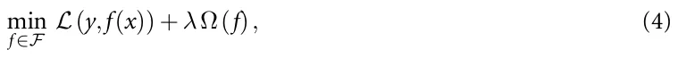

where *F* denotes the space of all possible symbolic expressions, *L* is the loss function (e.g. mean squared error), Ω(*f*) penalizes model complexity, and *λ ∈* R+ is a user-defined coefficient. In this formulation, Ω(*f*) is particularly important in scientific applications because many high-complexity expressions can fit noisy experimental data without providing a useful physical interpretation. Model selection therefore requires balancing predictive accuracy against parsimony, dimensional consistency, and physical plausibility. In the present work, this balance is essential: the aim is not to obtain the most flexible trajectory fit, but to identify a compact candidate closure that captures the dominant transient structure of the stratification-induced force.

Due to the fact that the search space of possible symbolic expressions is combinatorially large, various optimization strategies have been developed to solve the SR problem more efficiently [33], including: brute-force, genetic programming, sparse regression, and machine-learning-driven methods. The most direct strategy enumerates all possible symbolic expressions within a limited depth and set of operators, evaluating each candidate using the loss function [34]. Although this approach guarantees an optimal solution for small problems, it scales exponentially with expression size and quickly becomes intractable [35]. Representative implementations include the Operon and Eureqa frameworks [36, 37]. Genetic programming-based methods treat equations as expression trees and evolve them using operations such as crossover, mutation, and selection [38, 39]. It is well-suited to nonconvex landscapes and can discover complex nonlinear structures, though convergence can be slow and results are stochastic [40, 41]. Common implementations include DEAP and gplearn [42]. Sparse regression methods, exemplified by the sparse identification of nonlinear dynamics algorithm [43], assume that only a few terms from a large candidate library are relevant [44]. By applying sparsity-promoting techniques (e.g. LASSO [45] or sequential thresholding [46]), they efficiently recover parsimonious models from data. This class of methods is commonly used for physical data [47, 48] as it implements the law of parsimony (I.e., a theory which states that a simpler model with the same predictive power is better) [49]. Recent methods combine symbolic reasoning with deep learning, reinforcement learning, or grammar-based modeling to explore large expression spaces more efficiently [22, 50, 51]. Neural or transformer-based architectures learn mappings from data to symbolic representations while maintaining interpretability [18, 22], such as AI Feynman [52].

Recent advances have integrated domain knowledge and physical constraints into the symbolic discovery process, resulting in a new class of model known as PISR [43, 53, 54]. In PISR, the search space is regularized by embedding known symmetries, dimensional consistency, or conservation laws into the model generation stage [55, 56]. This constrains the symbolic search to physically meaningful candidates, thereby improving both generalization and interpretability. To this end, a key feature of PISR is that it incorporates *a priori* physical knowledge into the learning process through explicit or implicit constraints. These constraints can take multiple forms, including but not limited to enforcing dimensional homogeneity, embedding invariants such as mass, momentum, or energy conservation as penalty terms in the loss function, constraining symmetries directly within the candidate function space, and coupling symbolic discovery with differential operators to ensure compatibility with the governing partial differential equations (PDEs). Algorithmically, PISR extends standard SR optimization by adding physics-based regularization terms of the general form:

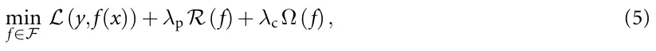

where *R* enforces physical consistency and *λ*p, *λ*c are tunable weights controlling their respective contributions. This allows the symbolic discovery process to remain data-driven yet physically plausible.

<figure id="fig-1">
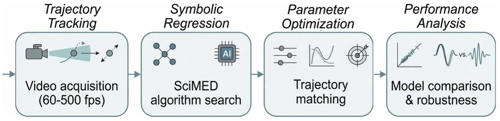
<figcaption><strong>Figure 1.</strong> Schematic view of the study’s methodological process.</figcaption>
</figure>

Over the past few years, PISR has been successfully applied to diverse scientific domains [43, 53–55]. For instance, Rudy *et al* [57] demonstrated the recovery of canonical PDEs such as the Navier–Stokes, diffusion, and Korteweg–de Vries equations directly from spatiotemporal data using sparse regression with embedded derivative operators. Cranmer *et al* [58] introduced differentiable graph-based representations of equations that preserve symmetries during optimization, enabling scalable and interpretable model discovery. In fluid mechanics, PISR has been used to identify reduced-order turbulence closure models [59], reconstruct constitutive relations in non-Newtonian fluids, and infer transport laws in multiphase and porous media systems [60–62].

In addition, Keren *et al* [26] introduced the *Scientist–Machine equation Detector* (SciMED) framework, an open-source computational system designed to automate and enhance the discovery of physically interpretable models from experimental or simulated data. SciMED integrates scientific domain knowledge through a scientist-in-the-loop architecture, combining expert-guided dimensional reasoning with state-of-the-art SR algorithms. The framework employs a genetic algorithm-based wrapper for feature selection, automatic machine learning for parameter optimization, and a two-level SR hierarchy that first identifies structural candidates and then refines them into dimensionally consistent analytical forms. In validation studies, SciMED was tested across multiple canonical configurations of a sphere settling through a fluid, both with and without nonlinear aerodynamic drag. Across all cases, the framework successfully rediscovered the correct symbolic forms of the governing force equations directly from noisy experimental data, including the classical drag law and its nonlinear extensions, often outperforming other SR models such as gplearn and AI Feynman.

Practically, Keren *et al* [63] conducted a particle settling experiment in order to obtain a large number of particles and expand the parameter range of previous studies. Using SciMED, the authors proposed an equation that captures the dynamics of the particle duration. To this end, SciMED demonstrated the value of integrating scientific reasoning and data-driven search: the inclusion of domain-specific constraints and dimensional consistency drastically reduced the hypothesis space and enhanced model interpretability. Nevertheless, the absence of an explicit ODE structure prevents the automatic discovery of time-evolving force laws that coexist with inertial, diffusive, and oscillatory contributions.

## 3. Methods and materials

In this section, we describe the methodological workflow used to identify and evaluate the proposed reduced-order stratification-force closure. The workflow consists of four main steps: trajectory tracking, SR, parameter optimization, and performance analysis. In the trajectory-tracking step, we collected particle-settling videos, characterized the density interface, extracted particle trajectories, computed velocity histories, and defined interface-crossing events. In the SR step, we used the processed trajectories, along with measured physical quantities and physics-guided constraints, to select candidate analytical expressions for the stratification-induced force. In the parameter-optimization step, the numerical coefficients of the selected expression and of the baseline model were calibrated by matching simulated trajectories to measured ones. Finally, in the performance-analysis step, we evaluated the resulting model using time-resolved comparisons of velocity and acceleration, trajectory-class-specific behavior, and retention-time statistics. Figure 1 presents a schematic view of the study’s methodological process.

### 3.1. Data collection

We performed high-throughput settling experiments of single spheres traversing a three-layer, miscible, density-stratified column. Two fluids formed the upper and lower homogeneous layers (set **A**: water–salt;

<figure class="table-figure" id="table-1">
<figcaption><strong>Table 1.</strong> Summary of the experiment’s parameters.</figcaption>

<table><tr><th>Parameter</th><th>Symbol</th><th>Definition</th><th>Exp. A</th><th>Exp. B</th><th>Units</th></tr><tr><td>Upper layer density</td><td>ρ1</td><td>—</td><td>1090 −1120</td><td>1081 −1133</td><td>( kgm−3) (</td></tr><tr><td>Lower layer density</td><td>ρ2</td><td>—</td><td>1100 −1130</td><td>1096 −1164</td><td>( kgm−3)</td></tr><tr><td>Upper layer viscosity</td><td>ν1</td><td>—</td><td>1.317 −1.848</td><td>2.689 −6.703</td><td>10−6 m2 s−1) (</td></tr><tr><td>Lower layer viscosity</td><td>ν2</td><td>—</td><td>1.415 −1.937</td><td>3.477 −12.79</td><td>10−6 m2 s−1)</td></tr><tr><td>Interface width</td><td>h</td><td>√ —</td><td>0.01 −0.05</td><td>0.01 −0.02</td><td>(m) (</td></tr><tr><td>Brunt–Väisälä frequency</td><td>N</td><td>2g ρ2−ρ1 h ρ2+ρ1</td><td>1.2 −2.7</td><td>2.3 −4.0</td><td>s−1)</td></tr><tr><td>Upper Reynolds number</td><td>Re1</td><td>V1a ν1</td><td>165.4 −387.4</td><td>110.5 −300.5</td><td>(—)</td></tr><tr><td>Lower Reynolds number</td><td>Re2</td><td>V2a ν2</td><td>0.1 −227.7</td><td>9.5 −135.6</td><td>(—)</td></tr><tr><td>Upper Froude number</td><td>Fr1</td><td>V1 Na</td><td>1.2 −4.2</td><td>1.4 −3.7</td><td>(—)</td></tr><tr><td>Lower Froude number</td><td>Fr2</td><td>V2 Na</td><td>0.0 −3.1</td><td>0.1 −2.3</td><td>(—)</td></tr></table>

</figure>

set **B**: water–glycerol). The tank is initially filled with the lighter solution, then the denser solution is carefully introduced through a capped hole at the bottom. To minimize mixing between the two solutions, the denser fluid is delivered using a pump, with the flow rate manually regulated via a valve to approximately 500 mlmin−1. The resulting transition layer (the density interface) between the lighter and denser fluids forms primarily through diffusion, consistent with previous studies [5, 7]. The density interface was characterized by measuring the vertical density profile with a Mettler Toledo Easy D40 densitometer (accuracy *±*0*.*5 kgm−3) and fitting an error–function model to define the interface location, *h*ref given by [4] and formalized as:

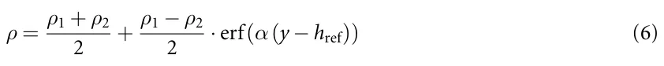

where *ρ*1 and *ρ*2 are the densities of the two fluids. In this context, we define the interface width (*h*) as the span covering 98% of the change between *ρ*1, the upper layer density, and *ρ*2, the lower layer density. A Photron FASTCAM SA3 recorded trajectories at 60–500 fps over a 30 *×* 30 cm field of view (1024 *×* 1024 px; *∼* 0*.*3 mm px−1), with a 0.5 mm Nd laser sheet (527 nm) for planar illumination. A stepper-motor release tube submerged the particle to minimize initial transients and enforced a 5 min inter-drop interval to allow the flow to decay (verified by PIV tracers at rest near the interface). Multiple sphere types (nylon and cellulose acetate) of diameter *≈* 10 mm were used; diameters were measured on *n* = 20 samples per type (dial indicator, *±*0*.*1 *µ*m), and densities were estimated with 95% confidence intervals. The kinematic uncertainty was *∼*0*.*3 mm (*∼*3% for 10 mm spheres). Using a local least– squares differentiation with error bounds following Dalziel’s formula algorithm, the position and velocity of the sphere in the frame were obtained [64]. The full campaign encompassed two experiment families and emphasized retention/bouncing behavior in regimes with *h/a* = *O*(1), with bouncing more frequent in the higher-viscosity set B. Table 1 summarizes the experiment’s parameters with their value range in both sets A and B.

### 3.2. Trajectory preprocessing and event definitions

For each experiment, the measured particle-centroid position was denoted by *y*(*t*), with the vertical coordinate measured along the settling direction. The density-interface location *h*ref and interface width *h* were obtained from the fitted error-function density profile in equation (6). We defined the density-interface interval as *I*h = *h*ref *−* h 2*,h*ref + h . The interface-entry time, *t*0, was then defined as the first 2 time at which the particle centroid entered this interval *t*0 = min*{t*i : *y*(*t*i) *∈I*h*}*. This definition was used both for trajectory alignment and for constructing the delayed-time variable used in the SR search. Particle velocity, *V*(*t*), was computed from the smoothed trajectory using the same local least-squares differentiation procedure used throughout the analysis. A post-interface velocity minimum was accepted if all of the following conditions were satisfied: (i) the candidate minimum occurred after interface entry, *t > t*0; (ii) it was a local minimum of *|V*(*t*)*|* over the smoothed velocity trace; and (iii) it was followed by recovery toward the lower-layer terminal settling velocity. The lower-layer terminal velocity, *V*2, was estimated from the late-time portion of each trajectory after the particle had exited the interface region. Recovery was defined as the first post-minimum time at which the velocity returned to within a prescribed tolerance of the lower-layer terminal value *|V*(*t*) *−V*2*|* ⩽ *ϵ*V*|V*2*|*, where *ϵ*V was kept fixed for all trajectories. The same tolerance was used for both measured and simulated trajectories.

The retention time, *τ*r, was defined as the time elapsed between interface entry and recovery from the post-interface slowdown: *τ*r = *t*rec *−t*0, where *t*rec is the first time satisfying the recovery criterion after the accepted velocity minimum. For bouncing trajectories, the same definition was applied after the rebound stage, so that *τ*r measures the full delay associated with the interface-induced transient rather than only the time to the velocity minimum.

Based on these definitions, trajectories were assigned to one of three classes. A *minimum* trajectory contains an accepted post-interface minimum in *|V*(*t*)*|* followed by recovery toward *V*2, without a sign reversal of *V*(*t*). A *bouncing* trajectory contains an accepted post-interface minimum followed by a zero crossing and sign reversal of *V*(*t*), indicating transient upward motion. A *no-minimum* trajectory crosses the interface without a resolvable post-interface minimum according to the above criteria. These definitions were applied identically to all experiments before model fitting and statistical evaluation. The complete rule-based procedure used to detect interface entry, identify post-interface minima, classify trajectories, and compute retention time is summarized in the appendix.

The final dataset comprised 321 trajectories in total: 236 experiments in set A (water–salt) and 85 experiments in set B (water–glycerol). Applying the preprocessing and classification rules, we identified three trajectory classes: minimum, bouncing, and no-minimum. The *minimum* class was the dominant response, with 272 experiments in total (211 in set A and 61 in set B), corresponding to 84*.*7% of the full dataset. These trajectories exhibited a clear post-interface deceleration, an accepted local minimum in *|V*(*t*)*|*, and recovery toward the lower-layer settling velocity without sign reversal. The *bouncing* class contained 40 experiments (25 in set A and 15 in set B), corresponding to 12*.*5% of the dataset. These cases exhibited an accepted post-interface minimum followed by a zero crossing and sign reversal of *V*(*t*), indicating transient upward rebound. Finally, 9 experiments (2*.*8% of the dataset), all from set B, were classified as *no-minimum*; in these cases, the particle crossed the interface and relaxed toward its lower-layer value without a resolvable post-interface minimum. In relative terms, bouncing was more frequent in the more viscous water–glycerol system (15/85, 17*.*6%) than in the water–salt system (25/236, 10*.*6%), while the no-minimum response was observed only in set B.

### 3.3. SR model

We used SciMED [26], together with a dual-data-representation workflow [65], to identify candidate analytical closures for the stratification-induced force. The SR task was formulated as a search over compact expressions for a closed form expression of a force term,*⃗ F*S in the equation of motion, in addition to the gravity, buoyancy and viscous drag. The goal was not to perform an unconstrained search for a universal law, but to select among a physically admissible reduced-order expressions the one that could both reproduce the dominant transient features of the measured interface-crossing trajectories, and allow for interpretability of its components.

The candidate-variable set included particle kinematics and material or fluid properties measured in the experiments *X* = *y*(*t*)*, V*(*t*)*, ρ*(*y*)*, ρ*p*, ν*1*, ν*2*, a, g, h, N, τ* , where *y*(*t*) and *V*(*t*) are the particle position and velocity, *ρ*(*y*) is the fitted density profile, *ρ*p is the particle density, *ν*1 and *ν*2 are the upper-and lower-layer kinematic viscosities, *a* is the particle diameter, *g* is gravitational acceleration, *h* is the interface width, *N* is the buoyancy frequency, and *τ* = max*{*0*,t −t*0*}* is the delayed time after interface entry. The delayed-time variable was introduced as a physically motivated feature because the additional stratification response should not activate before the particle reaches the interface.

The operator library was *O* = *{*+*,−,×,÷,*exp*,*sin*,*cos*}*. The inclusion of exponential and trigonometric operators was guided by the physical expectation that interfacial memory may decay over time and that wake-interface recoil may contain an oscillatory component. Thus, the availability of delayed, damped, and oscillatory structures was imposed by the search design, whereas the final combination of these components, their multiplicative organization, and their relative weighting were selected by the SR and model-selection procedure.

Candidate expressions were evaluated using a multi-objective criterion that balanced trajectory-level validation error, symbolic complexity, and physical admissibility. For a candidate expression *f*, we used the score

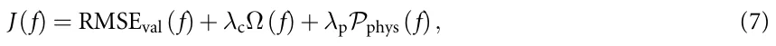

where RMSEval is the validation error, Ω(*f*) is the expression-complexity penalty, and *P*phys(*f*) penalizes violations of the imposed physical constraints. The physical penalty was decomposed as

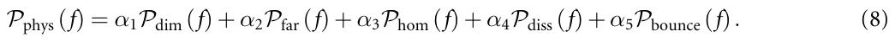

Here, *P*dim penalizes dimensionally inconsistent expressions; *P*far penalizes candidates for which the stratification force does not vanish far from the interface, *|y −h*ref*| ≫ h*; *P*hom penalizes candidates that do not reduce to the homogeneous-fluid buoyancy–drag limit when *ρ*1 = *ρ*2; *P*diss penalizes drag-like terms that violate nonnegative dissipation, expressed as *F*drag*V* ⩽ 0; and *P*bounce penalizes candidates that cannot reproduce sign reversal in experimentally identified bouncing cases. This last term was used only as a weak admissibility constraint to ensure that the candidate expression was capable of representing the full range of observed trajectory classes, rather than to prescribe the exact rebound shape.

<figure class="table-figure" id="table-2">
<figcaption><strong>Table 2.</strong> Separation between measured quantities, physics-guided assumptions, SR-selected structure, and post-discovery fitted coefficients.</figcaption>

<table><tr><th>Component</th><th>Role in the discovery process</th></tr><tr><td>Measured inputs</td><td>Density profile, interface location, interface width, particle size, particle density, viscosity, and trajectory-derived kinematics were obtained from experiment.</td></tr><tr><td>Physics-guided priors</td><td>Dimensional consistency, far-field vanishing of Fstrat, homogeneous-fluid limit, delayed activation after interface entry, and admissibility of damped oscillatory response were imposed or made available in the search space.</td></tr><tr><td>SR selection</td><td>The multiplicative organization of the final expression, the coupling between stratification intensity and delayed temporal response, and the specific delayed damped oscillatory structure were selected through validation error, complexity, and physical admissibility.</td></tr><tr><td>Post-discovery calibration</td><td>Numerical coefficients such as c1,c2,c3,c4 were fitted during trajectory-level calibration and should be interpreted as dataset-specific parameters within the selected expression family.</td></tr></table>

</figure>

Expression complexity was computed from the symbolic expression tree as Ω(*f*) = *n*var(*f*) + *n*const(*f*) + P o∈O *w*o*n*o(*f*), where *n*var, *n*const, and *n*o denote the number of variables, numerical constants, and operator occurrences in the expression tree, respectively, and *w*o is the operator-specific cost. Candidate expressions were first filtered for physical admissibility and then compared on the validation-error/complexity Pareto front. The selected model was the lowest-complexity Pareto-front expression that reproduced delayed onset, decay, and oscillatory recoil without violating the imposed physical constraints. Full details of the Pareto-front construction, operator weights, random seeds, and sensitivity tests are provided in the appendix. To clarify the role of prior knowledge in the SR workflow, table 2 separates the different sources of information that contributed to the final force expression.

### 3.4. Parameter fitting procedure

After the SR model selection, the numerical coefficients of the selected closure were calibrated by matching simulated trajectories to measured trajectories. The discovered stratification-induced force, denoted by*⃗ F*S, was introduced directly into the particle equation of motion as an additional force term acting together with buoyancy and hydrodynamic drag. Specifically, the particle dynamics were simulated using

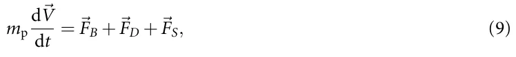

where [*l*]*−V*p = *π a*3*/*6 is the particle volume, *m*p = *ρ*p[*l*]*−V*p is the particle mass, *a* is the particle diameter, *ρ*p is the particle density, *ρ*f = *ρ*f(*y*) is the local fluid density obtained from the fitted density profile, and*⃗ V* is the particle velocity. The buoyancy-corrected gravitational force was written as and the drag force was modeled as

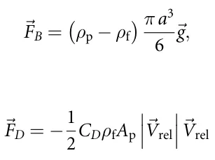

such that *C*D = 0*.*4 + 24 √ 6 Re where *A*p = *π a*2*/*4 is the projected particle area,*⃗ V*rel is the relative Re + 1+ velocity between the particle and the surrounding fluid, and *Re* = *a|⃗V*rel*|/ν*f is the particle Reynolds number based on the local kinematic viscosity *ν*f. In the absence of the SR term, equation (9) reduces to the standard gravity–buoyancy–drag model. In the proposed model, the SR-discovered term*⃗ F*S = *F*S(*t,y,⃗V*;***θ***) represents the additional transient stratification force associated with delayed interfacial response, wake detachment, recoil, and viscous relaxation.

For a given parameter vector ***θ***, equation (9) was solved numerically as an initial-value problem to generate the simulated trajectory ˆ*y*(*t*;***θ***). Numerical integration was performed using the *odeint* function from the *scipy* library, which uses the LSODA solver from the ODEPACK library and automatically switches between non-stiff and stiff integration methods [66, 67]. The corresponding measured trajectory was denoted by *y*(*t*). Parameters were estimated by minimizing the trajectory-level least-squares objec- P tive: ***θ***∗ = argminθ i [ˆ*y*(*t*i;***θ***) *−y*(*t*i)]2.

The same fitting protocol was applied to the baseline model based on Abaid *et al* [8], so that both models were compared after trajectory-level parameter optimization. The optimization was performed using a Monte-Carlo exploration of the admissible parameter space followed by local refinement of the best candidates [68, 69]. During fitting, parameter values were constrained to physically admissible ranges, and candidate solutions were rejected if they violated dimensional consistency, far-field vanishing of the stratification force, nonnegative dissipation of drag-like terms, or boundedness of the oscillatory contribution. The optimization was terminated when successive refinement cycles produced a relative improvement smaller than ∆*J/J <* 10−3, or when the parameter brackets fell below the prescribed numerical tolerance.

Because several coefficients are coupled, different parameter combinations can produce similar trajectory-level errors. We therefore interpreted the fitted coefficients as one physically admissible calibration of the selected symbolic family, rather than as uniquely identifiable universal constants. Robustness was evaluated by applying the fitted model to held-out trajectories, checking performance separately for minimum and bouncing responses, and verifying that the recovered coefficients remained within the experimentally admissible regime for *h/a* = *O*(1).

### 3.5. Statistical analysis

To assess the predictive performance of the discovered stratification-force model, we evaluated the agreement between simulated and measured particle dynamics at both the time-resolved and trajectory-integrated levels. For each experiment, the measured trajectory was used together with the calibrated force law to generate a simulated trajectory by solving the reduced equation of motion described above. Model performance was then quantified by comparing the simulated and measured time series on a common time base after alignment at the interface-crossing event. In addition to the fitting loss, we computed an out-of-sample trajectory error for each run, defined as the root-mean-square deviation between measured and predicted velocity histories over the observation window. This error metric was used both as a summary performance measure and as a ranking criterion for selecting representative *best*, *average*, and *worst* cases for qualitative visualization.

To account for the distinct physical responses observed in the experiments, all trajectories were first assigned to one of two canonical classes: *minimum* trajectories, which exhibit a pronounced post-interface velocity minimum followed by monotonic recovery, and *bouncing* trajectories, which display one or more post-interface oscillations. Statistical summaries were then reported separately for each trajectory class and for each fluid pair (water–salt and water–glycerol), yielding four analysis groups in total. This stratified analysis was used to determine whether model performance depended systematically on fluid viscosity, density contrast, or rebound behavior.

At the time-resolved level, agreement between model and experiment was examined using both velocity and normalized-acceleration histories. For acceleration, the measured and simulated curves were normalized by their respective peak magnitudes in order to compare waveform shape, peak timing, and decay envelope independently of absolute scale. For velocity, agreement was assessed in terms of the timing of the interfacial slowdown, the location of the minimum, the late-time asymptote, and, when present, the oscillation frequency and damping rate. Because the goal of the model is to reproduce transient dynamics rather than only endpoint quantities, these full-history comparisons were treated as a primary validation tool.

At the trajectory-integrated level, we extracted a retention time, denoted *τ*r, from each measured and simulated trajectory. Operationally, *τ*r was defined as the characteristic delay associated with recovery from the interfacial slowdown toward the lower-layer settling state. Predicted retention times, ˆ*τ* r, were compared against measured values using parity plots constructed separately for each fluid-pair/trajectory-class combination. Within each panel, we fitted a least-squares linear regression of ˆ*τ* r against *τ*r and reported the corresponding slope, intercept, and coefficient of determination (*R*2). The identity line ˆ*τ* r = *τ*r was included as a reference for perfect agreement. This analysis provided a compact statistical test of whether the obtained force reproduces the dominant time scale of the interfacial transient across different regimes.

## 4. Results

We first present the reduced-order stratification-force closure selected by the PiSR workflow. The full SR procedure, including Pareto-front construction, alternative candidate expressions, random-seed sensitivity, and operator-library ablation tests, is reported in the appendix:

<figure id="fig-2">
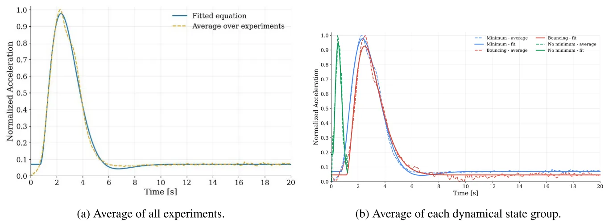
<figcaption><strong>Figure 2.</strong> Time-resolved normalized acceleration during passage through the density interface. Panel (a) shows the fixed-coefficient fit against the averaged response, while panel (b) presents the corresponding comparison after separating the trajectories by dynamical state.</figcaption>
</figure>

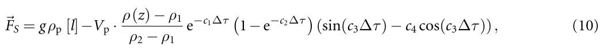

where ∆*τ* := max*{*0*, t −t*0*}* and *c*1*,c*2*,c*3*,c*4 *∈* R are numerical coefficients such that *t*0 denotes the time at which the sphere enters the density interface. Specifically, we obtained *c*1 = 0*.*984, *c*2 = 0*.*0764, *c*3 = 0*.*631, and *c*4 = 0*.*0178, yielding good agreement with the normalized experimental response, with RMSE = 0*.*0173 and *R*2 = 0*.*995. The fitted coefficients indicate that the stratification-induced force is inherently transient and oscillatory rather than purely monotonic. In particular, the coefficient *c*1 sets the dominant exponential decay of the response, *c*2 controls the gradual onset of the force after interface entry, *c*3 determines the oscillation timescale, and the small value of *c*4 implies that the response is close to sinusoidal with only a weak phase-shift correction. Notably, the selected closure, out of multiple possible closures the framework suggests, is constructed as the product of four physically interpretable contributions:

- 1. a gravitational–buoyancy scale, *gρ*p[*l*] *−V*p;
- 2. a local stratification factor, (*ρ*(*z*) *−ρ*1)*/*(*ρ*2 *−ρ*1), which measures the particle position within the density transition;
- 3. a delayed transient envelope, e−c1∆τ(1*−*e−c2∆τ), which captures gradual activation after interface entry and subsequent decay of the interfacial response;
- 4. a phase-shifted oscillatory term, sin(*c*3∆*τ*) *−c*4 cos(*c*3∆*τ*), which represents a lumped reduced-order description of wake-interface recoil and delayed recovery.

Figure 2 compares the measured and fitted normalized acceleration during passage through the density interface. In figure 2(a), the fixed-coefficient closure reproduces the dominant impulse in the averaged response, including the onset after interface entry, the peak timing, and the subsequent decay. The model slightly underestimates the maximum acceleration and damps somewhat faster immediately after the peak, but it captures the overall waveform shape and relaxation trend. Figure 2(b) shows the corresponding comparison after separating trajectories by dynamical class. Agreement is strongest for the minimum and bouncing classes, where the delayed activation and decaying oscillatory response reproduce the principal acceleration waveform. The no-minimum class shows larger deviations, which should be interpreted cautiously because this class contains only 9 trajectories, all from the water–glycerol system. Overall, the acceleration comparison indicates that the selected closure captures the dominant time-resolved structure of the interface-induced force response.

We then compared measured velocity histories with simulations generated by the selected closure and by the baseline model of Abaid *et al* [8]. This comparison evaluates whether the proposed closure improves the trajectory-level description of the interfacial slowdown, delayed recovery, and bouncing-like response. Figure 3 presents a 3 *×* 3 comparison of representative velocity histories during descent through the density interface, with rows corresponding to the three experimentally observed trajectory classes (*minimum*, *bouncing*, and *no-minimum*) and columns showing the best, average, and worst examples within each class. In the *minimum* row, both models reproduce the easiest case well, but clear differences emerge for the average and especially the worst trajectories: our oscillatory stratification-force model places the velocity minimum and the subsequent delayed recovery more accurately, whereas the Abaid *et al* [8] baseline relaxes too rapidly after the slowdown and departs visibly from the measured long-time recovery. The advantage of the present model is even more evident in the *bouncing* row, where it captures the sharp post-interface deceleration, the near-zero rebound stage, and the slow return toward the lower-layer settling state, while the baseline systematically overpredicts the post-minimum velocity and misses the observed retention time. By contrast, in the *no-minimum* row both models remain close to the measurements, indicating that when the response is short and nearly monotonic the added oscillatory term does not degrade the fit.

<figure id="fig-3">
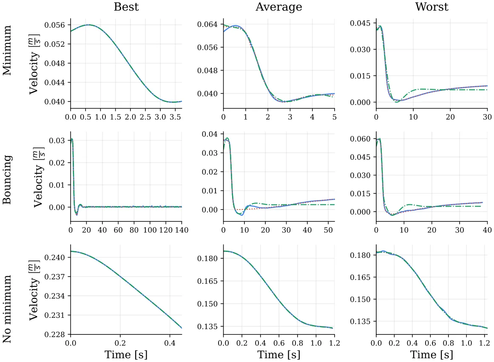
<figcaption><strong>Figure 3.</strong> Representative time-resolved velocity trajectories through a density interface. Rows correspond to the minimum, bouncing, and no-minimum trajectory classes, while columns show the best, average, and worst examples within each class. Experimental data (solid blue) are compared against the proposed oscillatory-force model (red, dotted) and the Abaid <em>et al</em> baseline (green, dash-dot). The largest improvements obtained by the present model occur in the minimum and bouncing cases, where it better reproduces the delayed recovery and post-interface transient dynamics.</figcaption>
</figure>

Finally, we evaluated whether the selected closure reproduces the integrated time scale of the interfacial transient. For this purpose, we compared predicted and measured retention times, ˆ*τ* r and *τ*r, for the minimum and bouncing classes. The no-minimum class was excluded from this analysis because no accepted post-interface minimum is present by definition. Figure 4 presents parity plots comparing the predicted retention time, ˆ*τ* r, with the experimentally measured value, *τ*r, for the two fluid pairs and the two trajectory classes for which a retention-time definition is meaningful (*bouncing* and *minimum*). The agreement is not uniform across the four panels. The strongest rank-level agreement is obtained for the *water–salt, bouncing* cases, with a regression slope of 0*.*93, an intercept of 9*.*10 s, and *R*2 = 0*.*958. This indicates that the model preserves the ordering of the measured rebound-delay times well, although the nonzero intercept suggests a systematic positive bias in the predicted retention time. The *water–glycerol, minimum* and *water–salt, minimum* panels also show good agreement, with *R*2 = 0*.*943 and *R*2 = 0*.*913, respectively, indicating that the model captures the dominant recovery time scale for minimum-type trajectories in both fluid systems. By contrast, the weakest agreement occurs in the *water–glycerol, bouncing* panel, where *R*2 = 0*.*853 and the points show visibly larger scatter. Thus, the retention-time analysis shows that the proposed force law performs well for minimum trajectories and for water–salt bouncing trajectories, while bouncing trajectories in the water–glycerol system remain the most variable and difficult to predict.

<figure id="fig-4">
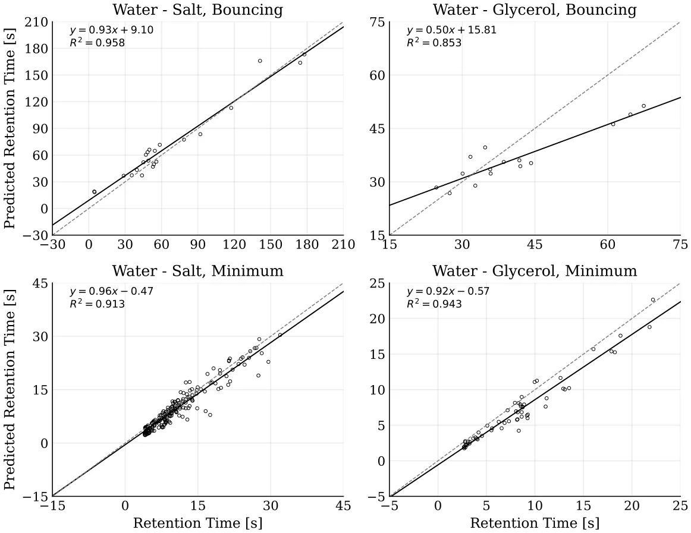
<figcaption><strong>Figure 4.</strong> Predicted versus measured retention time for the bouncing and minimum trajectory classes in the water–salt and water–glycerol systems. Points denote individual experiments, the solid black line is the least-squares regression in each panel, and the dashed gray line marks the identity relation ˆ<em>τ</em> r = <em>τ</em>r. Agreement is strongest for the water–salt bouncing cases and remains high for minimum trajectories in both fluid systems, whereas the largest scatter occurs for bouncing trajectories in the water–glycerol system.</figcaption>
</figure>

## 5. Discussion

In this study, we develop a reduced-order analytical closure for the stratification-induced force contribution that modifies the classical buoyancy–drag balance of particles crossing sharp density interfaces. The closure in equation (10) was selected using a PISR workflow guided by fluid-dynamics domain knowledge and validated against experimental trajectory data. The resulting expression reproduces transient behaviors that are difficult to capture with existing reduced-order models, or that are often represented through auxiliary entrained- or virtual-mass terms with limited direct physical interpretability. Thus, the contribution of this work is twofold. First, it proposes a compact, oscillatory reduced-order closure for particle motion in sharply stratified fluids over the tested experimental regime. Second, it demonstrates that AI-assisted PISR can serve as a practical route for identifying physically interpretable reduced-order models in fluid dynamics, rather than merely fitting experimental trajectories. Accordingly, equation (10) should be interpreted as a candidate closure supported by the present dataset and parameter range.

At the level of the state-averaged acceleration response, the proposed closure reproduces the interfacial impulse and subsequent relaxation with high fidelity, as shown in figure 2. For the three trajectory classes, the fitted normalized-acceleration curves yield *R*2 = 0*.*995 for the minimum class, *R*2 = 0*.*989 for the bouncing class, and *R*2 = 0*.*949 for the no-minimum class. These values indicate that the functional form in equation (10) provides an effective reduced-order representation of the dominant transient features of the interface-crossing event: delayed onset after interface entry, rapid decay of the primary impulse, and weak oscillatory recoil at later times. The time-resolved velocity comparisons in figure 3 further show where this structure is most useful. In simple, nearly monotonic trajectories, both the present model and the Abaid-style baseline remain close to the measurements. However, in the average and more difficult minimum and bouncing cases, the delayed oscillatory contribution in the present formulation improves the agreement with the measured velocity histories, especially in the timing of the velocity minimum, the delayed recovery, and the near-zero or sign-reversing rebound stage. In the no-minimum regime, the added oscillatory term does not noticeably degrade performance, suggesting that the selected closure retains the simpler monotonic limit while extending the model to transient-rich cases.

This interpretation is reinforced by the retention-time statistics in figure 4, although the level of agreement varies across fluid pairs and trajectory classes. The strongest agreement is observed for the water–salt bouncing cases, where the model preserves the ordering of measured retention times with *R*2 = 0*.*958, but with a positive intercept that indicates a systematic bias in the predicted delay. This bias suggests that the selected closure captures the relative variation among bouncing cases better than the absolute retention-time offset in this subset. Minimum-type trajectories are also reproduced well in both systems, with *R*2 = 0*.*913 for water–salt and *R*2 = 0*.*943 for water–glycerol. The weakest agreement appears in the water–glycerol bouncing cases, where *R*2 = 0*.*853 and the scatter is visibly larger. These results indicate that the proposed closure captures the integral interfacial time scale reliably for minimum trajectories and for water–salt bouncing trajectories, while rebound events in the water–glycerol system exhibit stronger case-to-case variability than can be represented by the present single calibrated time scale.

The selected closure also suggests a useful reduced-order interpretation of bouncing trajectories. Rather than representing apparent levitation or reversal solely through a neutrally buoyant equilibrium or an anomalously large virtual mass, the model is consistent with the interpretation that these behaviors can arise from the time-dependent response of the stratified layer itself. The oscillatory term in equation (10) should be interpreted as a lumped representation of recoil-like dynamics, in which the interface and entrained wake store and release momentum after the particle enters the transition region. The exponential envelope then describes the finite lifetime of this response as mixing, diffusion, and viscous dissipation reduce the interfacial memory. This structure is consistent with observations of wake attachment, wake detachment, upward return flow, and delayed post-interface recovery, but expresses them through one compact analytical force contribution. The resulting formulation therefore replaces an implicit or purely phenomenological description of the missing force contribution with an explicit closure that can be inserted into reduced-order particle-transport models.

Equally important is how this closure was obtained. The complete expression in equation (10) was not imposed as a preselected theoretical template, although the search space was deliberately shaped by physical priors. In particular, the relevant variables, dimensional constraints, delayed activation, and availability of damped oscillatory components were physics-guided, whereas the final symbolic organization and calibrated coefficients were selected through validation performance, complexity, and trajectory-level fitting. This distinguishes the present use of SR from conventional regression or parameter calibration. The method did not only estimate coefficients in an assumed model; it helped identify the structure of a candidate reduced-order closure. In this sense, the study demonstrates a scientist-in-the-loop route to AI-assisted physical-model discovery: experimental measurements define the phenomenon, domain knowledge constrains the hypothesis space, and SR proposes interpretable analytical forms that can be tested against the data and examined physically.

From an applied perspective, the selected closure provides a compact term that can be incorporated into reduced-order models of particle transport across density transitions without resolving the full interfacial flow field. This is relevant to environmental and engineering systems in which particles cross sharp or finite-thickness stratifications, including sediment settling in lakes and estuaries [70], marine-snow transport [71], pollutant dispersion, wastewater clarification [72], and density-based separation devices. In such settings, accurate prediction of retention time, minimum penetration depth, and rebound likelihood is often more important than resolving every detail of the surrounding wake. Because the present formulation links these transient outcomes to measurable quantities such as interface thickness, density contrast, and buoyancy frequency, it can support both forward prediction and experimental design. After further validation beyond the present parameter range, the model may be used to estimate when particles accumulate near interfaces, how long they remain trapped in the interfacial region, and under which conditions oscillatory recoil becomes dynamically significant.

This study is not without limitations. First, the calibration dataset covers centimeter-scale spheres at moderate *Re* and *Fr* values; extreme regimes remain to be tested. Second, the density field is treated as one-dimensional and steady, so lateral heterogeneity, internal waves, and tilted interfaces are not resolved. Third, the oscillatory term is a lumped closure for wake detachment and jet-induced recoil, rather than a resolved-vortex dynamics model. In addition, the oscillatory term is inferred from trajectory-level data and is not yet directly validated against simultaneous flow-field measurements of wake detachment, return flow, or interfacial deformation. Fourth, retention-time extraction is sensitive to record length and interface identification, contributing to scatter in short, weakly damped rebounds. Finally, the discovery process is intentionally not fully automatic. Choices regarding experimental design, candidate variables, physical constraints, admissible operators, and interpretation of the resulting expression remain scientist-guided. This should not be viewed as a weakness of the approach, but as an important feature of the proposed workflow: AI-driven SR is most powerful when used as a partner in theory formation, rather than as an unconstrained equation generator.

Addressing these limitations will require targeted experiments with controlled interface thickness, broader ranges of Reynolds and Froude numbers, simultaneous PIV/PTV measurements for joint sphere–flow inference, and DNS-informed priors to refine the closure. A particularly important next step is blind validation on new particle sizes, density contrasts, interface widths, and fluid pairs that were not used during SR selection or coefficient calibration. Such extensions would allow the present closure to be tested outside the parameter range in which it was identified and may reveal whether the same oscillatory structure persists across other stratified multiphase-flow regimes. More broadly, these future studies would provide a natural test of the proposed AI-driven discovery framework itself: whether SR, constrained by physical knowledge and validated by carefully designed experiments, can repeatedly identify compact reduced-order closures in systems where first-principles derivations remain difficult.

Taken jointly, the experimental measurements, symbolic-discovery pipeline, and trajectory-level validations support a revised physical picture of particle motion through density interfaces. The observed slowdown, retention, and rebound can be interpreted, within the present reduced-order framework, not only as consequences of an anomalous virtual added mass, but also as signatures of a delayed oscillatory response of the stratified layer, with a characteristic memory that decays over time. The resulting closure improves the description of a specific hydrodynamic phenomenon while also demonstrating a broader methodological point: AI-powered PiSR can contribute to the construction of interpretable reduced-order physical models in fluid dynamics when coupled to careful experiments and expert constraints. In that sense, the present work is both a contribution to reduced-order modeling of stratified particle motion and a demonstration of a practical pathway for AI-assisted physical-model discovery.

## Acknowledgment

A.L. thanks the ISF grant (441/22) for the support during this research.

## Data availability statement

The data cannot be made publicly available upon publication because they contain commercially sensitive information. The data that support the findings of this study are available upon reasonable request from the authors.

## Author contributions

### Teddy Lazebnik 0000-0002-7851-8147

Conceptualization (equal), Formal analysis (equal), Investigation (equal), Methodology (equal), Software (equal), Supervision (equal), Visualization (equal), Writing – original draft (equal), Writing – review & editing (equal)

### Chen Mortenfeld

Conceptualization (equal), Data curation (equal), Formal analysis (equal), Investigation (equal), Methodology (equal), Software (equal), Visualization (equal), Writing – original draft (equal)

Alex Liberzon 0000-0002-6882-4191 Conceptualization (equal), Data curation (equal), Formal analysis (equal), Funding acquisition (equal), Investigation (equal), Methodology (equal), Project administration (equal), Resources (equal), Software (equal), Supervision (equal), Validation (equal), Visualization (equal), Writing – review & editing (equal)

## Appendix A. Trajectory classification and retention-time extraction

This appendix provides the rule-based procedure used to classify measured trajectories and extract retention-time statistics. The purpose of this procedure is to make the definitions of interface entry, post-interface velocity minimum, bouncing behavior, no-minimum behavior, and retention time reproducible from the processed trajectory data.

For each experiment, the particle-centroid position was denoted by (y(t)), and the velocity *V*(*t*) was obtained from the smoothed trajectory using the local least-squares differentiation procedure. The density-interface location *h*ref and interface width *h* were obtained from the fitted error-function density profile in equation (6). The interface interval was defined as *I*h = *h*ref *−* h 2*,h*ref + h . The interface-entry 2 time was defined as *t*0 = min*{t*i : *y*(*t*i) *∈I*h*}*. This value was used both for trajectory alignment and for defining the delayed-time variable ∆*τ* = max0*,t −t*0.

Algorithm 1 summarizes the rule-based classification procedure. The algorithm receives as input the smoothed particle trajectory, the differentiated velocity signal, the density-interface interval, the lower-layer terminal velocity, and a fixed recovery tolerance. It first identifies the interface-entry time *t*0, then searches the post-interface velocity history for an accepted local minimum in *|V*(*t*)*|*. If no such minimum is detected, the trajectory is classified as no-minimum. Otherwise, the algorithm determines the recovery time *t*rec, computes the retention time *τ*r = *t*rec *−t*0, and classifies the trajectory as bouncing if the velocity changes sign after the accepted minimum, or as minimum if no sign reversal occurs. The same procedure was applied to all measured and simulated trajectories, ensuring that class labels and retention-time statistics were obtained consistently across fluid systems and model comparisons.

**Algorithm 1.** Trajectory classification and retention-time extraction.

**Require:** Smoothed trajectory *y*(*t*), velocity *V*(*t*), interface interval *I*h, lower-layer terminal velocity *V*2, recovery tolerance *ϵ*V

- 1: Search for post-interface local minima of *|V*(*t*)*|* for *t > t*0
- 2: **if** no accepted post-interface minimum is found **then**
- 3: Assign class: no-minimum
- 4: Retention time is not defined 5: **else**
- 6: Let *t*min be the accepted post-interface minimum
- 7: Define *t*rec as the first time after *t*min such that *|V*(*t*) *−V*2*|* ⩽ *ϵ*V*|V*2*|*
- 8: Compute *τ*r = *t*rec *−t*0
- 9: **if** *V*(*t*) changes sign after *t*min **then**
- 10: Assign class: bouncing
- 11: **else**
- 12: Assign class: minimum
- 13: **end if**
- 14: **end if**

The tolerance used for recovery was *ϵ*V = 0*.*05, corresponding to recovery within (5%) of the lower-layer terminal velocity. The lower-layer terminal velocity *V*2 was estimated from the late-time portion of each trajectory after the particle had exited the interface region. In cases where the observation window ended before the recovery criterion was reached, the trajectory was flagged as right-censored for retention-time extraction and was excluded from the retention-time parity analysis unless otherwise stated. Table 3 presents the trajectory-class counts obtained using Algorithm 1.

<figure class="table-figure" id="table-3">
<figcaption><strong>Table 3.</strong> Trajectory-class counts obtained using algorithm 1.</figcaption>

<table><tr><th>Fluid system</th><th>Minimum</th><th>Bouncing</th><th>No-minimum</th></tr><tr><td>Water–salt, set A</td><td>211</td><td>25</td><td>0</td></tr><tr><td>Water–glycerol, set B</td><td>61</td><td>15</td><td>9</td></tr><tr><td>Total</td><td>272</td><td>40</td><td>9</td></tr></table>

</figure>

## Appendix B. Symbolic-regression reproducibility and robustness

This appendix provides additional details on the physics-informed SR workflow used to obtain equation (10). The purpose of this appendix is to distinguish the robust symbolic structure of the selected closure from numerical coefficient variation that can arise during stochastic symbolic search and subsequent trajectory-level calibration. The main Results section reports only the selected reduced-order closure and its direct trajectory-level validation. Additional SR outputs are reported here because they support reproducibility and robustness, but are not direct physical results.

### B.1. Search objective and physical admissibility

The SR search was formulated as a multi-objective problem in which candidate expressions were evaluated according to validation error, symbolic complexity, and physical admissibility. For a candidate expression *f*, the selection score was

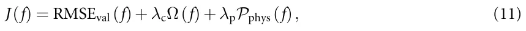

where RMSEval is the validation error, Ω(*f*) is the expression-complexity penalty, and *P*phys(*f*) penalizes violations of physical admissibility. The complexity-penalty coefficient was *λ*c = 10−3, and the physical-penalty coefficient was *λ*p = 103. The relatively large value of *λ*p reflects the fact that physically inadmissible expressions were strongly penalized and, in most cases, removed from the admissible candidate set. The physical-admissibility penalty was decomposed as

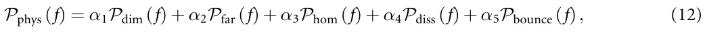

where *P*dim penalizes dimensionally inconsistent expressions; *P*far penalizes nonzero stratification force far from the interface; *P*hom penalizes failure to recover the homogeneous-fluid limit; *P*diss penalizes drag-like terms that violate nonnegative dissipation; and *P*bounce penalizes candidates that cannot reproduce sign reversal in experimentally identified bouncing cases. The weights were *α*1 = 1*.*0, *α*2 = 1*.*0, *α*3 = 1*.*0, *α*4 = 0*.*5, and *α*5 = 0*.*25. Thus, dimensional consistency, far-field vanishing, and the homogeneous-fluid limit were treated as the strongest physical-admissibility requirements, while dissipative consistency and the ability to represent bouncing were used as weaker admissibility criteria.

If a constraint was implemented as a hard filter rather than as a soft penalty, the corresponding penalty was assigned a large value and the candidate was removed from the admissible set. In practice, dimensional consistency, far-field vanishing, and the homogeneous-fluid limit were treated as strict admissibility checks, while trajectory-level agreement and expression complexity were used to rank the remaining candidates.

### B.2. Candidate variables and operator library

The candidate-variable set used in the SR search was *X* = *{y*(*t*)*,V*(*t*)*,ρ*(*y*)*,ρ*p*,ν*1*,ν*2*,a,g,h,N,*∆*τ}*. where *y*(*t*) is the particle position, *V*(*t*) is the particle velocity, *ρ*(*y*) is the fitted density profile, *ρ*p is the particle density, *ν*1 and *ν*2 are the upper- and lower-layer kinematic viscosities, *a* is the particle diameter, *g* is gravitational acceleration, *h* is the interface width, *N* is the buoyancy frequency, and ∆*τ* = max(0*,t −t*0) is the delayed time after interface entry.

The operator library was *O* = *{*+*,−,×,÷,*exp*,*sin*,*cos*}*. The inclusion of exponential and trigonometric operators was physics-guided. Exponential terms allow delayed activation and decay of interfacial memory, while trigonometric terms allow oscillatory recoil-like responses. Thus, the availability of damped oscillatory structures was imposed by the search design, but the final symbolic organization of these terms was selected by validation error, expression complexity, and physical admissibility. Table 4 presents the symbolic-regression search space and selection criteria.

### B.3. Expression-complexity score

Expression complexity was computed using a weighted expression-tree size,

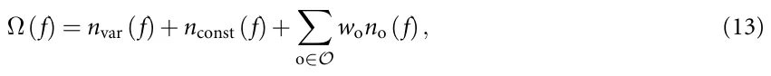

where *n*var, *n*const, and *n*o denote the number of variables, numerical constants, and operator occurrences in the expression tree, respectively. The operator-specific cost is denoted by *w*o. The values used in this study are summarized in table 5.

<figure class="table-figure" id="table-4">
<figcaption><strong>Table 4.</strong> Symbolic-regression search space and selection criteria.</figcaption>

<table><tr><th>Search component</th><th>Specification</th></tr><tr><td>Candidate variables</td><td>y(t), V(t), ρ(y), ρp, ν1, ν2, a, g, h, N, ∆τ.</td></tr><tr><td>Operators</td><td>+, −, ×, ÷, exp, sin, cos.</td></tr><tr><td>Physical admissibility</td><td>Dimensional consistency, far-field vanishing, homogeneous-fluid limit, nonnegative dissipation of drag-like terms, ability to represent sign reversal in bouncing cases.</td></tr><tr><td>Search limits</td><td>Maximum expression depth: 8; maximum expression complexity: 35; population size: 500; number of generations: 50.</td></tr><tr><td>Selection rule</td><td>Candidate expressions were filtered for physical admissibility and then compared on the validation-error/complexity Pareto front. The selected expression was the lowest-complexity Pareto-front candidate that reproduced delayed onset, decay, and oscillatory recoil.</td></tr></table>

</figure>

<figure class="table-figure" id="table-5">
<figcaption><strong>Table 5.</strong> Operator weights used to compute the expression-complexity score in equation (13).</figcaption>

<table><tr><th>Operator or node type</th><th>Complexity cost</th></tr><tr><td>Variable node</td><td>1</td></tr><tr><td>Numerical constant</td><td>1</td></tr><tr><td>Addition/subtraction</td><td>1</td></tr><tr><td>Multiplication</td><td>2</td></tr><tr><td>Division</td><td>3</td></tr><tr><td>Exponential</td><td>4</td></tr><tr><td>Sine/cosine</td><td>4</td></tr></table>

</figure>

<figure class="table-figure" id="table-6">
<figcaption><strong>Table 6.</strong> Representative candidates from the validation-error/complexity Pareto front. Candidate selection was based on validation error, expression complexity, and physical admissibility.</figcaption>

<table><tr><th>Candidate</th><th>Expression family</th><th>Complexity</th><th>Val. RMSE</th><th>Val. R2</th><th>Selected</th></tr><tr><td>f1</td><td>Monotonic exponential relaxation without oscillatory recoil: Ae−b∆τ(1−e−d∆τ)</td><td>18</td><td>0.0418</td><td>0.961</td><td>No</td></tr><tr><td>f2</td><td>Delayed exponential envelope with phase-shifted oscillatory recoil, corresponding to equation (10)</td><td>27</td><td>0.0173</td><td>0.995</td><td>Yes</td></tr><tr><td>f3</td><td>Higher-complexity oscillatory expression: Ae−b∆τ(1−e−d∆τ)(sin(ω∆τ) −qcos(ω∆τ)) + Be−r∆τ sin(2ω∆τ)</td><td>39</td><td>0.0164</td><td>0.996</td><td>No</td></tr><tr><td>f4</td><td>Alternative physically admissible delayed oscillatory expression: A(1−e−b∆τ)e−d∆τ sin(ω∆τ + ϕ)</td><td>31</td><td>0.0189</td><td>0.993</td><td>No</td></tr></table>

</figure>

### B.4. Pareto-front construction and model-selection rule

Candidate equations were first filtered for physical admissibility. The remaining candidates were then placed on a validation-error/complexity Pareto front. The final expression was selected as the elbow solution on this front rather than as the candidate with the lowest training error. This criterion favors the simplest expression that produces a substantial reduction in validation error while avoiding unnecessary algebraic complexity.

The selected expression was

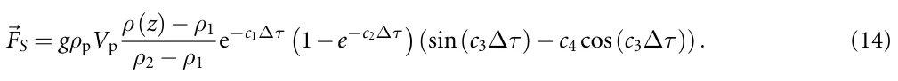

This expression was selected because it was the lowest-complexity physically admissible candidate that reproduced the three required transient features: delayed activation after interface entry, exponential decay of the interfacial response, and phase-shifted oscillatory recoil. Table 6 shows a representative candidate from the validation-error/complexity Pareto front. Candidate selection was based on validation error, expression complexity, and physical admissibility.

Lower-complexity candidates reproduced the primary interfacial slowdown but did not capture delayed rebound and phase-lagged recovery in bouncing trajectories. Higher-complexity candidates produced only small validation-error improvements while introducing redundant algebraic terms. Equation (10) was therefore selected because it provided the simplest physically admissible representation of delayed, exponentially damped, oscillatory interfacial response.

<figure class="table-figure" id="table-7">
<figcaption><strong>Table 7.</strong> Repeated SR searches across random seeds. Structural recovery denotes recovery of an interface-localized, delayed, exponentially damped oscillatory force family.</figcaption>

<table><tr><th>Search repeats</th><th>Number of runs</th><th>Structural recovery rate</th><th>Validation RMSE</th></tr><tr><td>Full search configuration</td><td>20</td><td>17/20 (85%)</td><td>0.0191 ± 0.0034</td></tr><tr><td>Physically admissible candidates only</td><td>20</td><td>16/20 (80%)</td><td>0.0204 ± 0.0041</td></tr><tr><td>Selected Pareto-front family</td><td>20</td><td>15/20 (75%)</td><td>0.0187 ± 0.0028</td></tr></table>

</figure>

<figure class="table-figure" id="table-8">
<figcaption><strong>Table 8.</strong> Sensitivity of the SR discovery process to stochastic seeds and search settings.</figcaption>

<table><tr><th>Search setting</th><th>Values tested</th><th>Structural recovery</th><th>Validation error</th></tr><tr><td>Random seed</td><td>20 seeds listed in section B.5</td><td>85%</td><td>0.0191 ± 0.0034</td></tr><tr><td>Operator library</td><td>Full; no trigonometric operators; no exponential operators</td><td>Full: (85%); no trig.: (0%); no exp.: (20%)</td><td>Full: 0.0191 ± 0.0034; no trig.: 0.0436 ± 0.0062; no exp.: 0.0379 ± 0.0055</td></tr><tr><td>Maximum complexity</td><td>20, 25, 30, 35, 40</td><td>(20%), (55%), (75%), (85%), (85%)</td><td>0.0472, 0.0308, 0.0224, 0.0191, 0.0186</td></tr><tr><td>Complexity penalty λc</td><td>10−4, 10−3,10−2</td><td>(85%), (85%), (60%)</td><td>0.0179 ± 0.0031, 0.0191 ± 0.0034,</td></tr><tr><td></td><td></td><td></td><td>0.0275 ± 0.0048</td></tr><tr><td>Train/validation split</td><td>70/30, 80/20, 90/10</td><td>(80%), (85%), (75%)</td><td>0.0208 ± 0.0039, 0.0191 ± 0.0034, 0.0185 ± 0.0046</td></tr></table>

</figure>

### B.5. Random seeds and repeated SR searches

To assess sensitivity to stochastic search initialization, the SR procedure was repeated using the seed set

*S* = *{*1*,*2*,*3*,*4*,*5*,*11*,*17*,*23*,*31*,*42*,*57*,*73*,*89*,*101*,*123*,*137*,*151*,*173*,*199*,*223*}.* (15)

Across repeated runs, we did not require identical algebraic constants or exactly identical expression trees. Instead, we assessed whether the same structural family was recovered. Structural recovery was defined as recovery of an interface-localized stratification factor multiplied by a delayed transient envelope and an oscillatory recoil term. Table 7 shows repeated SR searches across random seeds.

The repeated-search analysis separates the discovery of the symbolic expression family from the subsequent numerical calibration of coefficients. The main robust outcome is the delayed, exponentially damped, oscillatory structure, whereas the numerical values of the coefficients vary across calibration runs and should be interpreted as dataset-specific parameters.

### B.6. Sensitivity to SR settings

We tested the sensitivity of the selected symbolic family to five classes of SR settings: random seed, operator library, maximum expression complexity, complexity-penalty coefficient, and train/validation partition. For each setting, we recorded the best Pareto-front candidates, validation error, physical-admissibility status, and whether the recovered expression belonged to the same structural family as equation (10). Table 8 reports the sensitivity analysis of the SR discovery process to stochastic seeds and search settings.

The full operator library repeatedly recovered the same structural family as equation (10). When trigonometric operators were removed, the SR search recovered monotonic relaxation models that captured the primary slowdown but did not reproduce rebound and phase-lagged recovery. When exponential operators were removed, the search could represent oscillation but failed to capture the observed decay envelope. Increasing the maximum complexity allowed additional algebraic terms, but these terms provided only marginal validation-error improvements and reduced interpretability.

### B.7. Operator-library ablation

To evaluate the role of the operator library, we repeated the SR search under restricted operator sets. These ablation tests are not intended as additional physical results. Their purpose is to determine whether the delayed, damped, oscillatory structure depends on the availability of specific operators. Table 9 shows the operator-library ablation tests.

<figure class="table-figure" id="table-9">
<figcaption><strong>Table 9.</strong> Operator-library ablation tests. These tests examine whether exponential, trigonometric, and delayed-time components are necessary for recovering the selected symbolic family.</figcaption>

<table><tr><th>Operator set</th><th>Best recovered family</th><th>Val. RMSE</th><th>Interpretation</th></tr><tr><td>Full library</td><td>Delayed exponentially damped oscillatory closure</td><td>0.0173</td><td>Captures slowdown, recovery, and rebound-like response.</td></tr><tr><td>No sin,cos</td><td>Monotonic delayed relaxation</td><td>0.0436</td><td>Captures primary slowdown but not phase-lagged rebound.</td></tr><tr><td>No exp</td><td>Undamped or weakly damped oscillatory expression</td><td>0.0379</td><td>Captures oscillation but not observed decay envelope.</td></tr><tr><td>No ∆τ</td><td>Time-local algebraic expression</td><td>0.0528</td><td>Fails to represent delayed activation after interface entry.</td></tr></table>

</figure>

<figure class="table-figure" id="table-10">
<figcaption><strong>Table 10.</strong> Calibrated coefficients of the selected reduced-order stratification-force closure. Uncertainty values are estimated from repeated calibration runs and should be interpreted as empirical variability rather than universal parameter uncertainty.</figcaption>

<table><tr><th>Coefficient</th><th>Point estimate</th><th>Uncertainty/CI</th><th>Interpretation</th></tr><tr><td>c1</td><td>0.984</td><td>0.984 ± 0.086</td><td>Dominant decay rate of the transient response.</td></tr><tr><td>c2</td><td>0.0764</td><td>0.0764 ± 0.011</td><td>Gradual activation rate after interface entry.</td></tr><tr><td>c3</td><td>0.631</td><td>0.631 ± 0.047</td><td>Oscillation time scale.</td></tr><tr><td>c4</td><td>0.0178</td><td>0.0178 ± 0.006</td><td>Phase-shift correction.</td></tr></table>

</figure>

## Appendix C. Parameter calibration and coefficient robustness

After selecting the symbolic family, numerical coefficients were calibrated by matching simulated trajectories to measured trajectories. The same trajectory-level fitting protocol was applied to the selected closure and to the baseline model of Abaid *et al* [8]. The calibrated coefficients for the selected closure are reported in table 10. The point estimates are those used in the main Results section. Confidence intervals or bootstrap ranges were estimated from repeated calibration runs and are reported as empirical variability around the calibrated point estimates.

Because the coefficients are coupled, different parameter combinations can produce similar trajectory-level errors. The fitted values should therefore be interpreted as one physically admissible calibration of the selected symbolic family, not as uniquely identifiable universal constants.

## References

1. White F M and Xue H 2021 Fluid Mechanics 9th edn (McGraw Hill)
2. Magnaudet J and Mercier M J 2020 Particles, drops and bubbles moving across sharp interfaces and stratified layers Annu.Rev. Fluid Mech. 52 61–91 [doi:10.1146/annurev-fluid-010719-060139](https://doi.org/10.1146/annurev-fluid-010719-060139)
3. White F M and Majdalani J 2022 Viscous Fluid Flow 4th edn (McGraw Hill)
4. Wang S, Kandel P, Deng J, Caulfield C P and Dalziel S B 2024 Bouncing behaviour of a particle settling through a density transition layer J. Fluid Mech. 997 A49 [doi:10.1017/jfm.2024.663](https://doi.org/10.1017/jfm.2024.663)
5. Verso L, van Reeuwijk M and Liberzon A 2019 Transient stratification force on particles crossing a density interface Int. J. Multiph. Flow 121 103109 [doi:10.1016/j.ijmultiphaseflow.2019.103109](https://doi.org/10.1016/j.ijmultiphaseflow.2019.103109)
6. Camassa R, Ding L, McLaughlin R M, Overman R, Parker R and Vaidya A 2022 Critical density triplets for the arrestment of a sphere falling in a sharply stratified fluid Recent Advances in Mechanics and Fluid-Structure Interaction With Applications (Advances in Mathematical Fluid Mechanics) (Springer) pp 69–91
7. Srdi´c-Mitrovi´c A N, Mohamed N A and Fernando H J S 1999 Gravitational settling of particles through density interfaces J. Fluid Mech. 381 175–98 [doi:10.1017/S0022112098003590](https://doi.org/10.1017/S0022112098003590)
8. Abaid N, Adalsteinsson D, Agyapong A and McLaughlin R M 2004 An internal splash: levitation of falling spheres in stratified fluids Phys. Fluids 16 1567–80 [doi:10.1063/1.1687685](https://doi.org/10.1063/1.1687685)
9. Boetti M and Verso L 2022 Force on inertial particles crossing a two layer stratified turbulent/non-turbulent interface Int. J. Multiph. Flow 148 104153 [doi:10.1016/j.ijmultiphaseflow.2022.104153](https://doi.org/10.1016/j.ijmultiphaseflow.2022.104153)
10. Camassa R, Falcon C, Lin J, McLaughlin R M and Mykins N 2010 A first-principle predictive theory for a sphere falling through sharply stratified fluid at low Reynolds number J. Fluid Mech. 664 436–65 [doi:10.1017/S0022112010003800](https://doi.org/10.1017/S0022112010003800)
11. Schmidt M and Lipson H 2009 Distilling free-form natural laws from experimental data Science 324 81–85 [doi:10.1126/science.1165893](https://doi.org/10.1126/science.1165893)
12. Bongard J and Lipson H 2007 Automated reverse engineering of nonlinear dynamical systems Proc. Natl Acad. Sci. 104 9943–8 [doi:10.1073/pnas.0609476104](https://doi.org/10.1073/pnas.0609476104)
13. Cava W L, Orzechowski P, Burlacu B, de Franca F O, Virgolin M, Jin Y, Kommenda M and Moore J H 2021 Contemporary symbolic regression methods and their relative performance Proc. Neural Information Processing Systems Track on Datasets and Benchmarks
14. Zegklitz J and Poˇsík P 2021 Benchmarking state-of-the-art symbolic regression algorithms Genet. Program. Evol. Mach. 22 5–33 [doi:10.1007/s10710-020-09387-0](https://doi.org/10.1007/s10710-020-09387-0)
15. Champion K, Lusch B, Kutz J N and Brunton S L 2019 Data-driven discovery of coordinates and governing equations Proc. Natl Acad. Sci. 116 22445–51 [doi:10.1073/pnas.1906995116](https://doi.org/10.1073/pnas.1906995116)
16. Brunton S L, Noack B R and Koumoutsakos P 2020 Machine learning for fluid mechanics Annu.Rev. Fluid Mech. 52 477–508 [doi:10.1146/annurev-fluid-010719-060214](https://doi.org/10.1146/annurev-fluid-010719-060214)
17. Guo J and Yin W-J 2024 Harnessing data using symbolic regression methods for discovering novel paradigms in physics Sci. China Phys. Mech. Astron. 67 267301 [doi:10.1007/s11433-023-2346-2](https://doi.org/10.1007/s11433-023-2346-2)
18. Podina L, Darooneh D, Grewal J and Kohandel M 2024 Enhancing symbolic regression and universal physics-informed neural networks with dimensional analysis (arXiv:2411.15919) [link](https://arxiv.org/abs/2411.15919)
19. AbdusSalam S, Abel S and Rom˜ao M C 2025 Symbolic regression for beyond the standard model physics Phys. Rev. D 111 015022 [doi:10.1103/PhysRevD.111.015022](https://doi.org/10.1103/PhysRevD.111.015022)
20. de Franca F O et al 2024 Srbench++: principled benchmarking of symbolic regression with domain-expert interpretation IEEE Trans. Evol. Comput. 29 1127–37 [doi:10.1109/TEVC.2024.3423681](https://doi.org/10.1109/TEVC.2024.3423681)
21. Lazebnik T and Simon-Keren L 2024 Knowledge-integrated autoencoder model Expert Syst. Appl. 252 124108 [doi:10.1016/j.eswa.2024.124108](https://doi.org/10.1016/j.eswa.2024.124108)
22. Tenachi W, Ibata R and Diakogiannis F I 2023 Deep symbolic regression for physics guided by units constraints: toward the automated discovery of physical laws Astrophys. J. 959 99 [doi:10.3847/1538-4357/ad014c](https://doi.org/10.3847/1538-4357/ad014c)
23. Taskin B, Xie W and Lazebnik T 2026 Knowledge integration for physics-informed symbolic regression using pre-trained large language models Sci. Rep. 16 1614 [doi:10.1038/s41598-026-35327-6](https://doi.org/10.1038/s41598-026-35327-6)
24. Shmuel A, Lazebnik T and Glickman O 2026 Follow the forest trail: distillation by gradient boosting models to enhance symbolic regression performance IEEE Access 14 19701–12 [doi:10.1109/ACCESS.2026.3657793](https://doi.org/10.1109/ACCESS.2026.3657793)
25. Shmuel A, Glickman O and Lazebnik T 2024 Symbolic regression as a feature engineering method for machine and deep learning regression tasks Mach. Learn.: Sci. Technol. 5 025065 [doi:10.1088/2632-2153/ad513a](https://doi.org/10.1088/2632-2153/ad513a)
26. Keren L S, Liberzon A and Lazebnik T 2023 A computational framework for physics-informed symbolic regression with straightforward integration of domain knowledge Sci. Rep. 13 1249 [doi:10.1038/s41598-023-28328-2](https://doi.org/10.1038/s41598-023-28328-2)
27. Chen C, Luo C and Jiang Z 2018 Block building programming for symbolic regression Neurocomputing 275 1973–80 [doi:10.1016/j.neucom.2017.10.047](https://doi.org/10.1016/j.neucom.2017.10.047)
28. Jin Y, Fu W, Kang J, Guo J and Guo J 2019 Bayesian symbolic regression (arXiv:1910.08892) [link](https://arxiv.org/abs/1910.08892)
29. Tohme T, Liu D and Youcef-Toumi K 2022 GSR: a generalized symbolic regression approach (arXiv:2205.15569) [link](https://arxiv.org/abs/2205.15569)
30. Orzechowski P, Cava W L and Moore J H 2018 Where are we now? Proc. Genetic and Evolutionary Computation Conf.
31. Virgolin M, Alderliesten T, Witteveen C and Bosman P A N 2021 Improving model-based genetic programming for symbolic regression of small expressions Evol. Comput. 29 211–37 [doi:10.1162/evco_a_00278](https://doi.org/10.1162/evco_a_00278)
32. Neumann P, Cao L, Russo D, Vassiliadis V S and Lapkin A A 2020 A new formulation for symbolic regression to identify physicochemical laws from experimental data Chem. Eng. J. 387 123412 [doi:10.1016/j.cej.2019.123412](https://doi.org/10.1016/j.cej.2019.123412)
33. Virgolin M and Pissis S P 2022 Symbolic regression is NP-hard (arXiv:2207.01018) [link](https://arxiv.org/abs/2207.01018)
34. Heule M J and Kullmann O 2017 The science of brute force Commun. ACM 60 70–79 [doi:10.1145/3107239](https://doi.org/10.1145/3107239)
35. Kammerer L, Kronberger G, Burlacu B, Winkler S, Kommenda M and Affenzeller M 2020 Symbolic regression by exhaustive search: Reducing the search space using syntactical constraints and efficient semantic structure deduplication Genetic Programming Theory and Practice XVII (Springer) pp 79–99
36. Burlacu B, Kronberger G and Kommenda M 2020 Operon c++: an efficient genetic programming framework for symbolic regression Proc. 2020 Genetic and Evolutionary Computation Conf. Companion pp 1562–70
37. Truscott P and Korns M F 2014 Explaining unemployment rates with symbolic regression Genetic Programming Theory and Practice XI (Springer) pp 119–35
38. Koza J R 1994 Genetic programming as a means for programming computers by natural selection Stat. Comput. 4 87–112 [doi:10.1007/BF00175355](https://doi.org/10.1007/BF00175355)
39. Dˇzeroski S and Petrovski I 1994 Discovering dynamics with genetic programming Machine Learning: ECML-94: European Conf. Machine Learning (Catania, Italy, 6–8 April 1994) (Springer) pp 347–50
40. Uy N Q, Hoai N X, O’Neill M, McKay R and Galván-López E 2011 Semantically-based crossover in genetic programming: application to real-valued symbolic regression Genet. Program. Evol. Mach. 12 91–119 [doi:10.1007/s10710-010-9121-2](https://doi.org/10.1007/s10710-010-9121-2)
41. Vladislavleva E J, Smits G F and den Hertog D 2009 Order of nonlinearity as a complexity measure for models generated by symbolic regression via Pareto genetic programming IEEE Trans. Evol. Comput. 13 333–49 [doi:10.1109/TEVC.2008.926486](https://doi.org/10.1109/TEVC.2008.926486)
42. Stephens T 2016 gplearn: genetic programming in Python, with a scikit-learn inspired API Software documentation
43. Brunton S L, Proctor J L and Kutz J N 2016 Discovering governing equations from data by sparse identification of nonlinear dynamical systems Proc. Natl Acad. Sci. 113 3932–7 [doi:10.1073/pnas.1517384113](https://doi.org/10.1073/pnas.1517384113)
44. Kaptanoglu A A et al 2022 PySINDy: a comprehensive python package for robust sparse system identification J. Open Source Softw. 7 3994 [doi:10.21105/joss.03994](https://doi.org/10.21105/joss.03994)
45. Ranstam J and Cook J A 2018 Lasso regression Brit. J. Surg. 105 1348–1348 [doi:10.1002/bjs.10895](https://doi.org/10.1002/bjs.10895)
46. Zhu S and Wang Y 2019 Scaled sequential threshold least-squares (s2TLS) algorithm for sparse regression modeling and flight load prediction Aerosp. Sci. Technol. 85 514–28 [doi:10.1016/j.ast.2018.12.038](https://doi.org/10.1016/j.ast.2018.12.038)
47. do Cabo C T, Joshua R and Mao Z 2025 Structural dynamics identification using physics-informed sindy Topics in Modal Analysis & Parameter Identification II vol 10 (River Publishers) pp 25–32
48. Kirkham S 2024 Discovering dynamical models of speech using physics-informed machine learning Proc. 13th Int. Seminar on Speech Production pp 185–8
49. Laird J 1919 The law of parsimony Monist 29 321–44 [doi:10.5840/monist191929317](https://doi.org/10.5840/monist191929317)
50. Merler M, Haitsiukevich K, Dainese N and Marttinen P 2024 In-context symbolic regression: leveraging large language models for function discovery Proc. 62nd Annual Meeting of the Association for Computational Linguistics (Volume 4: Student Research Workshop) (Association for Computational Linguistics) pp 589–606
51. Petersen B K, Landajuela M, Mundhenk T N, Santiago C P, Kim S K and Kim J T 2021 Deep symbolic regression: recovering mathematical expressions from data via risk-seeking policy gradients (arXiv:1912.04871) [link](https://arxiv.org/abs/1912.04871)
52. Udrescu S and Tegmark M 2020 AI Feynman: a physics-inspired method for symbolic regression Sci. Adv. 6 eaay2631 [doi:10.1126/sciadv.aay2631](https://doi.org/10.1126/sciadv.aay2631)
53. Martius G and Lampert C H 2016 Extrapolation and learning equations (arXiv:1610.02995) [link](https://arxiv.org/abs/1610.02995)
54. Golden M 2024 Scalable sparse regression for model discovery: the fast lane to insight (arXiv:2405.09579) [link](https://arxiv.org/abs/2405.09579)
55. Brunton S L, Proctor J L and Kutz J N 2016 Sparse identification of nonlinear dynamics with control (SINDYc) IFAC- PapersOnLine 49 710–5 [doi:10.1016/j.ifacol.2016.10.249](https://doi.org/10.1016/j.ifacol.2016.10.249)
56. Chen Z, Liu Y and Sun H 2021 Physics-informed learning of governing equations from scarce data Nat. Commun. 12 6136 [doi:10.1038/s41467-021-26434-1](https://doi.org/10.1038/s41467-021-26434-1)
57. Rudy S H, Brunton S L, Proctor J L and Kutz J N 2017 Data-driven discovery of partial differential equations Sci. Adv. 3 e1602614 [doi:10.1126/sciadv.1602614](https://doi.org/10.1126/sciadv.1602614)
58. Cranmer M, Sanchez-Gonzalez A, Battaglia P, Xu R, Cranmer K, Spergel D and Ho S 2020 Discovering symbolic models from deep learning with inductive biases Advances in Neural Information Processing Systems vol 33 pp 17429–42
59. Pawar S 2022 Physics-guided machine learning for turbulence closure and reduced-order modeling PhD Thesis (Oklahoma State University)
60. Aravanis T, Chrimatopoulos G, Ferdows M, Xenos M and Tzirtzilakis E E M 2026 Asp-assisted symbolic regression for interpretable modelling of 3d laminar channel flow Sci. Rep. 16 20105 [doi:10.1038/s41598-026-49762-y](https://doi.org/10.1038/s41598-026-49762-y)
61. Elghannay H A and Hasadi Y M F E 2024 Symbolic regression for the wall effect on a settling sphere in a circular cylinder Al- Mukhtar J. Eng. Res. 8 01–15 [doi:10.54172/fm5ryg72](https://doi.org/10.54172/fm5ryg72)
62. Tang H, Wang Y, Wang T and Tian L 2023 Discovering explicit Reynolds-averaged turbulence closures for turbulent separated flows through deep learning-based symbolic regression with non-linear corrections Phys. Fluids 35 025118 [doi:10.1063/5.0135638](https://doi.org/10.1063/5.0135638)
63. Keren L S, Lazebnik T and Liberzon A 2024 Improved prediction of settling behavior of solid particles through machine learning analysis of experimental retention time data Int. J. Multiph. Flow 172 104716 [doi:10.1016/j.ijmultiphaseflow.2023.104716](https://doi.org/10.1016/j.ijmultiphaseflow.2023.104716)
64. Dalziel S B 1992 Decay of rotating turbulence: some particle tracking experiments Appl. Sci. Res. 49 217–44 [doi:10.1007/BF00384624](https://doi.org/10.1007/BF00384624)
65. Lazebnik T and Liberzon A 2026 Moving from table to graph in physics-informed spatio-temporal symbolic regression Sci. Rep. 16 16016 [doi:10.1038/s41598-026-53882-w](https://doi.org/10.1038/s41598-026-53882-w)
66. Virtanen P et al (SciPy 1.0 Contributors) 2020 SciPy 1.0: fundamental algorithms for scientific computing in python Nat. Methods 17 261–72 [doi:10.1038/s41592-019-0686-2](https://doi.org/10.1038/s41592-019-0686-2)
67. Hindmarsh A C 1983 ODEPACK, a systematized collection of ODE solvers Scientific Computing, ed R S Stepleman, M Carver, R Peskin, W F Ames and R Vichnevetsky (North-Holland) pp 55–64
68. Wu J, Chen X-Y, Zhang H, Xiong L-D, Lei H and Deng S-H 2019 Hyperparameter optimization for machine learning models based on Bayesian optimization J. Electron. Sci. Technol. 17 26–40 [doi:10.11989/JEST.1674-862X.80904120](https://doi.org/10.11989/JEST.1674-862X.80904120)
69. Zhou Z, Leahy R N and Qi J 1997 Approximate maximum likelihood hyperparameter estimation for Gibbs priors IEEE Trans. Image Process. 6 844–61 [doi:10.1109/83.585235](https://doi.org/10.1109/83.585235)
70. McAnally W H, Friedrichs C, Hamilton D, Hayter E, Shrestha P, Rodriguez H, Sheremet A and Teeter A (A. T. C. on Management of Fluid Mud) 2007 Management of fluid mud in estuaries, bays and lakes. i: Present state of understanding on character and behavior J. Hydraul. Eng. 133 9–22 [doi:10.1061/(ASCE)0733-9429(2007)133:1(9)](https://doi.org/10.1061/%28ASCE%290733-9429%282007%29133:1%289%29)
71. Wu N, Grieve S W D, Manning A J and Spencer K L 2025 Marine snow as vectors for microplastic transport: multiple aggregation cycles account for the settling of buoyant microplastics to deep-sea sediments Limnol. Oceanogr. 70 899–910 [doi:10.1002/lno.12814](https://doi.org/10.1002/lno.12814)
72. Ødegaard H 1998 Optimised particle separation in the primary step of wastewater treatment Water Sci. Technol. 37 43–53 [doi:10.2166/wst.1998.0374](https://doi.org/10.2166/wst.1998.0374)
