## 1. Introduction

Academic departments are increasingly required to operate as strategic research-planning units [1–3]. Beyond teaching coordination and administrative governance, departments must decide how to allocate limited resources among laboratories, research groups, early-career scholars, doctoral students, postdoctoral positions, equipment, travel support, internal seed grants, and emerging interdisciplinary initiatives [4,5]. These decisions are inherently economic: the department owns a limited budget, faces uncertainty about future outcomes, and must choose between competing opportunities. Classical portfolio theory formalized the idea that rational allocation should consider not only expected return but also risk and dependence among assets [6]. Later financial models extended this view by linking expected return to market risk and equilibrium behavior, while institutional portfolio approaches introduced structured mechanisms for combining prior beliefs with observed market information [7].

In a university department, however, the relevant return currency is not monetary profit but scientific performance, which is less straightforward to quantify and has a more subjective nature. Generally speaking, academic departments are evaluated through publications, citations, external grants, high-quality venues, doctoral training, visibility, reputation, and strategic scientific positioning [8–10]. Scientometrics provides many of the indicators used to measure such outcomes, including author-level productivity indices [11,12], citation-impact indicators [13], and journal-level citation measures [14]. At the same time, the structure of science is not merely a collection of independent outputs: publications are embedded in citation networks, scientific activity follows large-scale regularities that can be studied quantitatively [15], and recognition is shaped by cumulative-advantage mechanisms that may amplify initial differences between researchers and institutions [16]. Funding is therefore not only another scientometric outcome, but also one of the main enabling conditions of future academic output. Recent evidence by [17] shows that access to federal research funding is strongly associated with sustained publication activity, while unfunded faculty are substantially more likely to experience a career year with no publications. Similarly, [18] showed the great impact of NIH grant funding on scientific productivity, [19] empirically reveals that research grants can complement other inputs and increase publication productivity, and [20] found evidence that public funding affects research output in the context of the New Zealand Marsden Fund. Hence, it is clear that a department’s funding can greatly shift the future scientific outcome of its members.

Nevertheless, this task is complicated due to several factors. First, departments face an exploration-exploitation tradeoff. Allocating resources to already successful areas may produce reliable short-term outputs, but excessive reliance on proven areas can reduce renewal, diversity, and long-term adaptability. Conversely, allocating resources to uncertain emerging areas may reveal future opportunities but may also produce weak short-term returns. This tension resembles the organizational tradeoff between exploration and exploitation [21] and the algorithmic problem of learning under uncertainty [22,23]. A second factor is that scientific opportunities exhibit spillovers. Supporting one research area may improve another through shared methods, infrastructure, students, collaborations, or intellectual proximity. Therefore, departments accumulate not only immediate outputs but also capabilities. This is related to the idea of absorptive capacity, where prior knowledge affects the ability of an organization to recognize, assimilate, and use new knowledge [24]. Scientific collaboration networks also shape the flow of knowledge and the formation of innovative capacity [25]. A third factor is that departments must balance novelty, impact, and resilience. Research that combines atypical ideas may generate high impact but also carries uncertainty [26]. Scientific impact can also unfold over long horizons, making short-term evaluation unreliable [27]. Funding mechanisms can influence the rate and direction of scientific exploration, suggesting that allocation policies can shape not only how much research is produced but also what kind of research is pursued [28].

To this end, in this study, we propose a normative computational-economic model for departmental research allocation. The model does not claim to describe how academic departments actually make funding decisions in practice. Rather, it provides a decision-support framework for examining how a department could allocate resources if it chose to formalize its priorities through an explicit portfolio objective. In this framework, the department is represented as an institutional decision-maker that allocates resources across a portfolio of research opportunities. Each opportunity may correspond to a lab, research theme, faculty member, infrastructure project, interdisciplinary initiative, or doctoral/postdoctoral line. The department’s objective is to allocate resources in a way that improves long-term scientometric performance while balancing risk, uncertainty, diversity, institutional inertia, and strategic priorities, similar to economic portfolio investment [29,30].

To address these challenges, we define the *Departmental Scientometric Portfolio Optimization* (DSPO) problem. In DSPO, a department observes a set of feasible research opportunities at each time step and chooses an allocation vector subject to budgetary, institutional, and strategic constraints. Each opportunity is associated with expected scientometric return, uncertainty, risk, strategic alignment, and spillover potential. The departmental objective combines expected scientometric performance with risk control, uncertainty reduction, scientific spillovers, topic diversity, concentration penalties, strategic alignment, and adjustment costs. The resulting problem is multi-objective in nature because the department must make explicit trade-offs among several competing institutional priorities rather than optimize a single natural quantity [31].

The contribution of this study consists of four distinct layers. First, we formulate departmental research planning as the DSPO problem, in which the return currency is scientometric rather than monetary and the feasible set represents institutional constraints and commitments. Second, we provide a domain-specific integration of established ideas from portfolio optimization, exploration under uncertainty, spillover modeling, diversity preservation, concentration control, and sequential learning. The novelty does not lie in any one of these optimization components, which are related to existing methods [32]; rather, it lies in adapting and combining them within a formal research-governance problem that includes academic considerations such as emerging-field exploration, cross-group spillovers, topic diversity, strategic alignment, and organizational inertia [33]. Third, we operationalize the formulation through *Departmental Epistemic Portfolio Optimization* (DEPO), an adaptive decision-support procedure that updates departmental beliefs and repeatedly generates feasible allocations as new scientometric evidence becomes available. DEPO uses diversity-preserving ideas related to submodular optimization [34], robustness principles related to uncertain optimization [35], sequential belief updating in the spirit of reinforcement learning [36], and a feasible-direction allocation procedure related to the Frank–Wolfe method [37,38]. Fourth, we use controlled simulation experiments to study the behavioral consequences and trade-offs produced by this integrated framework under stable, emerging-field, scientific-monoculture, and budget-shock environments. These experiments are intended to show how the procedure behaves under alternative institutional conditions, not to establish that its constituent optimization techniques are new or that DEPO is universally superior to simpler policies.

## 2. Background

This section provides the background for the proposed problem formulation and solution. First, we review work on academic performance measurement, which provides the empirical indicators that define the “return currency” of the proposed model. Second, we discuss the economics of science, which motivates the treatment of research activity as an institutional allocation problem under uncertainty, incentives, spillovers, and delayed returns. Third, we review portfolio optimization models, which provide the mathematical basis for allocating scarce resources across uncertain opportunities.

### 2.1. Academic Performance Measurement

Academic performance measurement concerns the construction, interpretation, and limitations of indicators used to evaluate researchers, departments, journals, and institu-tions. The central idea is that scientific activity produces observable traces, such as publications, citations, journal placements, collaborations, and online attention, but these traces are only imperfect proxies for scientific quality, influence, or institutional value [39–41]. As a result, academic performance measurement has developed both technical methods for constructing indicators and critical frameworks for preventing their misuse [42,43]. A first stream of work develops citation analysis and bibliometric evaluation as systematic tools for research assessment [44,45]. Moed provides one of the major foundations for citation-based research evaluation, emphasizing both the usefulness and methodological complexity of citation indicators [46]. Seglen criticizes the use of journal impact factors for evaluating individual research contributions and shows why journal-level indicators can be misleading when applied to articles or researchers [47]. Van Raan discusses methodological problems in university rankings based on bibliometric indicators, highlighting the risks of over-interpreting aggregated performance tables [48]. Bornmann and Daniel review the motivations behind citation behavior, showing that citations do not measure a single homogeneous construct [49]. Tahamtan and Bornmann extend this discussion by reviewing newer studies of citation contexts, citation functions, and citation motivations [50]. Hicks et al. formulate the Leiden Manifesto, which argues for responsible research metrics and stresses that quantitative indicators should support, not replace, expert judgment [51]. The San Francisco Declaration on Research Assessment similarly criticizes narrow journal-based evaluation practices and calls for broader assessment of research outputs [52]. Priem et al. introduce altmetrics as a way to capture broader and faster traces of scholarly attention beyond traditional citations [53]. Piwowar argues that research evaluation should value diverse research products, including datasets and other non-article outputs [54]. Cronin and Sugimoto synthesize multidimensional approaches to scholarly impact, reinforcing the view that academic performance is better represented as a portfolio of indicators than as a single scalar measure [55]. Accordingly, the proposed framework does not prescribe a universal measure of scientific production. Instead, it allows each department to select and weight indicators that reflect its disciplinary context, institutional priorities, and evaluation practices.

### 2.2. Economics of Science

The economics of science studies scientific research as an economic and institutional activity [56]. Its main premise is that knowledge production depends on incentives, labor markets, funding mechanisms, spillovers, uncertainty, and the public-good properties of knowledge. For the present paper, this literature provides the conceptual basis for modeling a university department as an economic decision-maker. A department does not merely observe scientific output; it allocates scarce resources that affect which research opportunities are pursued, which capabilities are accumulated, and which future outputs become possible. Nelson’s analysis of basic research presents scientific knowledge as an activity with public-good characteristics and motivates public or institutional support for research that private actors may underprovide [57]. Arrow similarly frames invention and knowledge production as allocation problems shaped by uncertainty, appropriability, and market failure [58]. Dasgupta and David develop the idea of a new economics of science, distinguishing the reward structures and norms of open science from market-based production [59]. Rosenberg emphasizes the path-dependent and uncertain nature of technological and scientific change, which is important for modeling delayed and uncertain returns from research investments [60]. Romer formalizes technological change as an endogenous outcome of intentional investment decisions, supporting the idea that knowledge growth can be treated as a dynamic economic process [61]. Griliches surveys the use of patents as economic indicators, showing how knowledge outputs can be quantified while also warning that such indicators vary in value and interpretation [62]. Jaffe provides empirical evidence that university research can generate geographically mediated spillovers to industrial innovation [63]. Adams models accumulated academic knowledge as a stock that contributes to productivity growth with long lags, which parallels the proposed concept of departmental scientometric capital [64]. Mansfield examines the role of academic research in industrial innovation and documents links between research investment and later technological application [65]. Pavitt analyzes why basic research can be economically useful, emphasizing not only direct outputs but also trained people, methods, instrumentation, and problem-solving capabilities [66].

### 2.3. Portfolio Optimization Models

Portfolio optimization provides a formal language for allocating limited resources across uncertain opportunities [67]. Its core insight is that an opportunity should not be evaluated only by its individual expected return, but also by its contribution to portfolio-level risk, diversification, and strategic constraints [68]. For example, Tobin’s work on liquidity preference links portfolio choice to risk behavior and provides an early economic treatment of how decision-makers allocate resources between safer and riskier assets under uncertainty [69]. Merton analytically derives the efficient portfolio frontier and formalizes the idea that an optimal portfolio is not simply a set of individually attractive assets, but a combination whose joint risk-return structure determines its value [70]. Jobson and Korkie show that estimation problems strongly affect portfolio optimization, especially when historical evidence is limited [71]. Chopra and Ziemba further show that errors in expected returns, variances, and covariances can substantially distort optimized portfolios, with expected-return errors being particularly influential [72]. Other portfolio models provide alternatives to classical variance-based risk. For instance, Konno and Yamazaki propose the mean-absolute-deviation portfolio model, which replaces variance with a more computationally tractable risk measure and applies the model to stock-market portfolio construction [73]. Rockafellar and Uryasev introduce conditional value-at-risk optimization, which focuses on controlling downside losses rather than average volatility [74]. Bertsimas and Sim develop a robust optimization framework in which the decision-maker protects against uncertain inputs while controlling how conservative the solution becomes [75]. Boyd and Vandenberghe provide the convex optimization foundations for constrained resource-allocation models, including feasibility sets, Lagrangian methods, and iterative procedures for solving structured optimization problems [76]. These methods show the promise of using a constrained feasible set, where allocations must satisfy departmental budgets, lower and upper bounds, and institutional policy constraints.

## 3. Model Formalization

In this section, we formally introduce the resource allocation problem and its proposed solution. Initially, we define the *departmental scientometric portfolio optimization* (DSPO) problem. Next, we outline the scientometric return as departmental currency. Following this, we provide an applied departmental objective function definition. Lastly, we introduce the epistemic portfolio optimization algorithm. For simplicity, Table 1 summarizes the main notation used in the DSPO formulation and DEPO algorithm.

<figure class="table-figure" id="table-1">
<figcaption><strong>Table 1.</strong> Main notation used in the DSPO formulation and DEPO algorithm.</figcaption>

<table><tr><th>Symbol</th><th>Meaning</th></tr><tr><td>t = 0, . . . , T</td><td>Discrete planning period.</td></tr><tr><td>It</td><td>Set of feasible research investment opportunities at time t.</td></tr><tr><td>nt</td><td>Number of opportunities in It.</td></tr><tr><td>i</td><td>A research opportunity.</td></tr><tr><td>θi</td><td>Topic vector representing the scientific area of opportunity i.</td></tr><tr><td>κi</td><td>Departmental capability associated with opportunity i.</td></tr><tr><td>τi</td><td>Delay until measurable output from opportunity i.</td></tr><tr><td>Bt</td><td>Available departmental research budget at time t.</td></tr><tr><td>xt</td><td>Raw allocation vector chosen by the department at time t; xi,t is the amount of budget assigned to opportunity i.</td></tr><tr><td>ϕi(·)</td><td>Opportunity-specific investment-response function that converts raw allocation into effective investment.</td></tr><tr><td>zi,t = ϕi(xi,t)</td><td>Effective investment intensity generated by the raw allocation xi,t.</td></tr><tr><td>Xt</td><td>Feasible allocation.</td></tr><tr><td>Yi,t+1</td><td>Raw multidimensional scientometric output vector of opportunity i.</td></tr><tr><td>eYi,t+1</td><td>Normalized scientometric output vector.</td></tr><tr><td>wt</td><td>Departmental scientometric exchange-rate vector.</td></tr><tr><td>ci,t+1</td><td>Realized scalar scientometric contribution of opportunity i in period t + 1.</td></tr><tr><td>bµi,t</td><td>Estimated expected scientometric contribution per unit of effective investment for opportunity i.</td></tr><tr><td>Rt+1</td><td>Realized departmental scientometric return, obtained by summing the opportunity- level contributions.</td></tr><tr><td>Σt</td><td>Covariance matrix of scalar scientometric returns.</td></tr><tr><td>ui,t</td><td>Uncertainty score for opportunity i.</td></tr><tr><td>sij,t</td><td>Spillover strength from opportunity i to opportunity j.</td></tr><tr><td>ai,t</td><td>Strategic-alignment score of opportunity i.</td></tr><tr><td>Mt, Vt, Ut, St, Dt, Ct, At, Jt</td><td>Expected return, risk, uncertainty value, spillover value, diversity, concentration, strategic alignment, and adjustment-cost components.</td></tr><tr><td>λM, λV, λU, λS, λD, λC, λA, λJ</td><td>Department-specific preference weights in the scalarized objective.</td></tr><tr><td>Ot(xt)</td><td>One-period DSPO objective function.</td></tr><tr><td>eOt(xt)</td><td>Optimistic objective used by DEPO under uncertainty.</td></tr><tr><td>Bt</td><td>Departmental belief state used by DEPO.</td></tr></table>

</figure>

### 3.1. Departmental Scientometric Portfolio Optimization

We define the DSPO problem as a dynamic resource-allocation problem faced by an academic department inside a university. The department controls a limited annual budget and must distribute it among internal research opportunities, such as faculty groups, research themes, laboratories, seed grants, Ph.D. lines, postdoctoral positions, equipment, conference support, or interdisciplinary initiatives. Unlike financial portfolio optimization, where the return currency is monetary profit, the return currency in DSPO is “scientometric performance”, represented by publications, citations, grants, prestige, and related measurable research outputs.

Formally, let the department operate over a finite planning horizon *t* = 0, 1, . . . , *T*, where each time step corresponds to an arbitrary duration. At time *t*, the department observes a set of feasible research investment opportunities *I*t = *{*1, 2, . . . , *n*t*}*. Each opportunity *i ∈I*t represents a potential departmental investment in a lab, researcher, research theme, project, or infrastructure item. We define each opportunity as *i* := (*ℓ*i, *θ*i, *κ*i, *ρ*i, *τ*i, *c*i) where *ℓ*i denotes the associated lab or research unit, *θ*i is a topic vector describing the scientific area, *κ*i represents current departmental capability in that area, *ρ*i represents the opportunity’s risk profile, *τ*i is the expected time delay until measurable output, and *c*i is the marginal cost of investment.

The department chooses an allocation vector **x**t = (*x*1,t, *x*2,t, . . . , *x*nt,t), where *x*i,t *≥* 0 is the amount of departmental resource allocated to opportunity *i* at time *t*. Resources may be measured in money, funded months, Ph.D. scholarships, postdoctoral positions, equipment units, teaching relief, internal grant points, or a normalized combination of these. The allocation must satisfy the departmental budget constraint ∑i∈It *x*i,t *≤ B*t, where *B*t is the available departmental research budget at time *t*. Thus, the feasible allocation set is denoted by

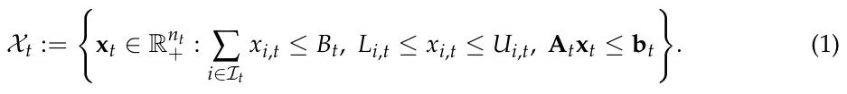

The lower and upper bounds *L*i,t and *U*i,t represent institutional constraints, such as minimum support for ongoing laboratories, maximum concentration in a single topic, or limits on how much seed funding a single group can receive. The matrix constraint **A**t**x**t *≤* **b**t captures additional departmental rules, such as maintaining support across sub-fields, protecting early-career faculty, reserving funds for graduate students, or satisfying university-level strategic priorities.

It is important to distinguish the allocated resource from the productive intensity generated by that resource. The raw allocation *x*i,t is the amount of departmental budget, funded time, equipment, or other resource assigned to opportunity *i*. It is the decision variable that enters the budget and feasibility constraints. The corresponding effective investment is *z*i,t := *ϕ*i(*x*i,t), where *ϕ*i : R+ *→* R+ is a non-decreasing and typically concave investment-response function. Thus, *z*i,t represents the productive research activity generated by the allocated resource after accounting for diminishing marginal returns and opportunity-specific absorption capacity. Throughout the remainder of the formulation, *x*i,t is used for feasibility and adjustment costs, whereas *z*i,t is used for expected productivity, risk, spillovers, topic shares, capability accumulation, and scientometric-output generation.

### 3.2. Scientometric Return as Departmental Currency

For each opportunity *i*, the realized scientometric output at time *t* + 1 is modeled as an unknown vector *Y*i,t+1 := (*P*i,t+1, *C*i,t+1, *G*i,t+1, *Q*i,t+1, *H*i,t+1, *R*i,t+1), where *P*i,t+1 denotes the number or quality-adjusted number of publications, *C*i,t+1 denotes citation impact, *G*i,t+1 denotes external grant income, *Q*i,t+1 denotes publication quality or venue prestige, *H*i,t+1 denotes human-capital output such as graduated students or trained researchers, and *R*i,t+1 denotes reputation-related outcomes such as awards, invited talks, strategic partnerships, or institutional visibility.

Due to the fact that scientometric indicators differ in scale, dispersion, disciplinary meaning, and temporal dynamics, the raw output vector cannot be directly scalarized. We therefore treat normalization as part of the definition of the departmental return currency. Let e*Y*i,t+1 := *N* (*Y*i,t+1) denote the normalized scientometric output vector, where *N* (*·*) maps each component into a dimensionless score. In an empirical implementation, this mapping may use field-normalized citation impact, discipline-specific publication baselines, normalized grant income, venue-quality percentiles, doctoral-training outputs, and reputation indicators adjusted to the relevant institutional context. Thus, the notation *N* (*·*) should be understood as a required preprocessing step rather than as an unspecified free parameter.

The department converts the normalized scientometric output vector into a realized scalar contribution using the exchange-rate vector

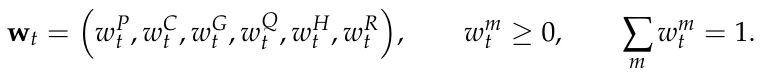

The realized scientometric contribution of opportunity *i* is

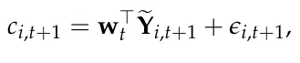

where *ϵ*i,t+1 is an opportunity-level stochastic return shock. The weights are institutional preference parameters rather than universal constants. For example, a department preparing for a national evaluation may assign greater weight to publications and grants, whereas a department focused on long-term capacity may emphasize doctoral training, early-career development, or emerging research areas.

The output vector **Y**i,t+1, and therefore *c*i,t+1, is generated conditional on the effective investment *z*i,t = *ϕ*i(*x*i,t). Consequently, the realized departmental return is

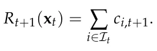

The contribution is not multiplied again by *x*i,t or *z*i,t, because the effect of the allocation has already entered the output-generation process through *z*i,t.

At the portfolio level, the department’s realized scientometric return is defined to be *R*t+1(**x**t) := ∑i∈It *x*i,t*r*i,t+1 and the expected return is *µ*t(**x**t) := E[*R*t+1(**x**t) *| F*t], where *F*t is the department’s information set at time *t*, including previous outputs, internal evaluations, external funding trends, discipline-level baselines, collaboration networks, and institutional priorities.

### 3.3. Departmental Objective Function

The department is treated as a bounded institutional planner that allocates resources across a set of research opportunities in order to maximize long-term scientometric performance while controlling for risk, strategic imbalance, uncertainty, and institutional constraints. The formulation extends classical mean–variance portfolio optimization [6] by replacing monetary returns with scientometric returns and by incorporating additional terms that are specific to academic departments.

At time *t*, each investment opportunity *i ∈I*t is associated with an expected scalar scientometric return b*µ*i,t := E[*r*i,t+1 *| F*t], where *r*i,t+1 is the normalized weighted scientometric return defined in the previous subsection, and *F*t is the departmental information set at time *t*. The value b*µ*i,t summarizes the expected contribution of opportunity *i* to the department’s scientometric currency, including publications, citations, external grants, venue quality, human-capital formation, and reputation.

The second component is portfolio risk. Let **Σ**t *∈* Rnt×nt denote the covariance matrix of the scalar scientometric returns of the investment opportunities. The entry Σij,t captures whether two opportunities tend to succeed or fail together. For example, two labs that depend on the same national funding program, the same publication venue ecosystem, or the same technological infrastructure may have positively correlated returns. The department-level portfolio risk is defined as *V*t(**x**t) := **z**⊤ t **Σ**t**z**t where **z**t := (*ϕ*1(*x*1,t), . . . , *ϕ*nt(*x*nt,t)). This term follows the logic of portfolio variance in financial economics [6], but here risk refers to volatility in future scientometric performance rather than volatility in financial return.

The third component is the uncertainty-reduction value of an allocation. Let *u*i,t *≥* 0 denote the department’s uncertainty about the expected return of opportunity *i*. This value may be high for a new faculty member, a new research direction, an interdisciplinary initiative, or an emerging scientific topic with limited local evidence. Inspired by exploration–exploitation methods and upper-confidence-bound algorithms [22], we define the learning value of a portfolio as *U*t(**x**t) := ∑i∈It *ϕ*i(*x*i,t)*u*i,t. This term rewards allocations that improve the department’s information about uncertain but potentially valuable opportunities.

The fourth component is scientific spillover. Let *G*t = (*I*t, *E*t) be a research-opportunity graph, where nodes represent opportunities and weighted edges represent intellectual, technological, or organizational proximity. Let *s*ij,t *≥* 0 denote the expected spillover strength from opportunity *i* to opportunity *j*. The spillover value of a portfolio is defined as *S*t(**x**t) := ∑i,j∈It *s*ij,t*ψ x*i,t, *x*j,t where *ψ*(*·*, *·*) is a non-negative interaction function. A sim-q ple specification is *ψ*(*x*i,t, *x*j,t) = *ϕ*i(*x*i,t)*ϕ*j(*x*j,t), which gives high value to simultaneous support of complementary research areas while preserving diminishing marginal interaction effects. In the departmental context, this term captures cases in which investment in one area strengthens nearby areas, such as computational infrastructure that benefits robotics, machine learning, data science, and bioinformatics at the same time.

The fifth component is topic diversity. Let the department’s research opportunities be ∑i*∈I*k,t *z*i,t partitioned into *K*t topic clusters, and let *p*k,t(**x**t) := ∑j∈It zj,t denote the share of effective departmental investment assigned to topic cluster *k*, where *I*k,t *⊆I*t is the set of opportunities associated with that cluster. We define portfolio diversity using Shannon entropy: *D*t(**x**t) := *−*∑Kt k=1 *p*k,t(**x**t) log *p*k,t(**x**t). The entropy term rewards breadth and evenness across the complete topic-share distribution. In particular, it assigns value to maintaining meaningful support for small or previously underrepresented topic clusters rather than allocating resources only to the largest areas. More generally, *D*t may be replaced by a submodular coverage function when scientific breadth is represented as coverage of a knowledge graph [34].

The sixth component is topic concentration. We define *C*t(**x**t) := ∑Kt k=1(*p*k,t(**x**t))2. This term is analogous to a Herfindahl concentration index [77]. Because the topic shares are squared, the concentration measure places comparatively greater emphasis on large shares and directly penalizes cases in which one or a few topics dominate the departmental portfolio. It therefore captures dominant-topic exposure, whereas Shannon entropy characterizes the breadth and evenness of the complete topic distribution.

The seventh component is strategic alignment. Departments often operate under university-level goals, such as increasing external grant income, strengthening interdisciplinary research, supporting early-career faculty, improving doctoral training, or developing national-priority fields. Let *a*i,t *∈* [0, 1] denote the degree to which opportunity *i* aligns with the department’s current strategic priorities. The strategic alignment value of the portfolio is

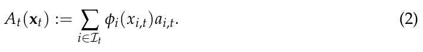

Finally, we define an adjustment cost that penalizes abrupt changes in departmental allocation. Let **x**t−1 be the previous allocation vector. The adjustment cost is *J*t(**x**t, **x**t−1) := *∥***x**t *−***x**t−1*∥*2 2. This term captures the fact that departments cannot radically reallocate resources every year without organizational costs. Existing laboratories, doctoral students, equipment commitments, and teaching obligations create inertia.

Combining these components, the one-period departmental objective function is defined as

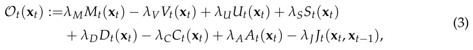

where *λ*M, *λ*V, *λ*U, *λ*S, *λ*D, *λ*C, *λ*A, *λ*J *≥* 0 are departmental preference parameters. These parameters determine the relative importance of short-term scientometric performance, risk aversion, exploration, scientific spillovers, portfolio diversity, concentration avoidance, strategic alignment, and organizational stability. The objective is therefore multi-objective in nature [78,79], but it is scalarized to support algorithmic optimization and simulation-based comparison.

In the implementation, the raw components of Equation (3) are not combined directly. Expected return, risk, uncertainty reduction, spillover value, diversity, concentration, strategic alignment, and adjustment cost have different natural units and different numerical ranges. Therefore, each component is first converted into a dimensionless normalized score before the *λ*-weights are applied. Formally, let *H*h,t(**x**t) *∈ {M*t(**x**t), *V*t(**x**t), *U*t(**x**t), *S*t(**x**t), *D*t(**x**t), *C*t(**x**t), *A*t(**x**t), *J*t(**x**t, **x**t−1) denote one raw objective component. For components whose feasible minimum and maximum are not available in closed form, the implementation estimates the normalization range over a fixed reference set of feasible allocations, *C*norm *⊆X*t. This set contains the projected previous *t* allocation, equal allocation, prestige-based allocation, greedy expected-return allocation, mean–variance allocation, and randomly generated feasible allocations. For each component *h*, we define *H*min = minx∈Cnorm *H*h,t(**x**) and *H*max = maxx∈Cnorm *H*h,t(**x**), and use *h*,*t* t *h*,*t* t *H*h,t(**x**t)*−H*min *H*h,t(**x**t) = h,t *H*max h,t *−H*min h,t +εnorm , where *ε*norm *>* 0 prevents division by zero. This procedure makes the components comparable within each decision period and prevents the largest-scale raw quantity from dominating the scalarized objective. Topic diversity and topic concentration also have natural analytical normalizations. Topic diversity is divided by its maximum possible value *D*t(**x**t) = Dt(xt) log Kt . Topic concentration is normalized using the feasible range of the Herfindahl index over *K*t topic clusters *C*t(**x**t) = Ct(xt)−1/Kt . 1*−*1/*K*t

The one-period Departmental Scientometric Portfolio Optimization problem is then

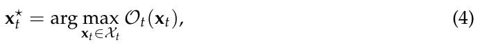

where *X*t is the feasible allocation set defined in Equation (1).

For a planning horizon of *T* periods, the dynamic version of the problem is

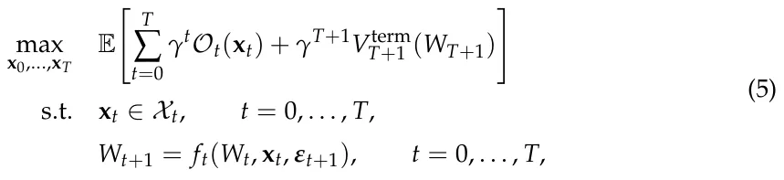

where *γ ∈* (0, 1] is a discount factor, *W*t is the department’s accumulated scientometric capital, *V*term T+1 is a terminal value function, and *f*t is the transition function that updates departmental capital according to realized publications, citations, grants, human-capital formation, reputation, spillovers, and stochastic shocks ***ε***t+1. Thus, the optimization problem is to find a feasible sequence of departmental allocations that maximizes expected discounted scientometric utility over time. The proposed algorithm developed in the next section solves this problem approximately by combining portfolio optimization with exploration bonuses, spillover-aware allocation, and diversity regularization.

### 3.4. Epistemic Portfolio Optimization Algorithm

The algorithm combines four principles: mean–variance portfolio allocation [6], exploration under uncertainty [22], diversity-preserving allocation [34], and rolling-horizon sequential decision-making [36]. Accordingly, DEPO should be read as an integrative decision-support heuristic. Its purpose is to operationalize the DSPO formulation by combining established algorithmic components in a way that is tailored to departmental research planning. At each time step *t*, the department observes its information set *F*t, which includes previous allocations, realized scientometric outcomes, internal evaluations, current departmental constraints, and the current set of feasible opportunities *I*t. The algorithm then performs three operations. First, it estimates the expected scientometric return, uncertainty, covariance, spillover, and strategic alignment of each opportunity. Second, it constructs the current departmental objective function defined in Equation (3). Third, it approximately solves the constrained optimization problem in Equation (4) and returns a feasible allocation vector **x**⋆ t .

#### 3.4.1. Belief State

The department’s belief state at time *t* is defined as *B*t := (b***µ***t, **Σ**t, **u**t, **S**t, **a**t, ***κ***t), where b***µ***t is the vector of expected scalar scientometric returns, **Σ**t is the covariance matrix of scientometric returns, **u**t is the uncertainty vector, **S**t = [*s*ij,t] is the spillover matrix, **a**t is the strategic alignment vector, and ***κ***t is the departmental capability vector.

Let *n*i,t denote the number of previous time steps in which opportunity *i* or a sufficiently similar opportunity has received positive investment. Let ¯*r*i,t be the empirical mean of its observed normalized scientometric returns. The expected return is estimated using a shrinkage estimator:

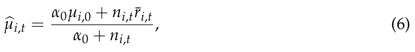

where *µ*i,0 is a prior estimate based on departmental judgment, field-level benchmarks, or previous university data, and *α*0 *≥* 0 controls the strength of the prior. This formulation is useful for departments because many opportunities, such as new faculty hires or emerging research themes, have limited internal historical evidence.

The uncertainty associated with opportunity *i* is defined as

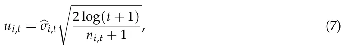

where b*σ*i,t is the estimated standard deviation of past returns for opportunity *i*. If no direct historical observations are available, the department assigns a high default uncertainty value. This term follows the logic of upper-confidence-bound exploration [22]: opportunities with limited evidence receive an exploration bonus, preventing the algorithm from allocating all resources only to already-proven areas.

The covariance matrix **Σ**t is estimated from historical return vectors. Since departmental datasets are typically small, we use a shrinkage form

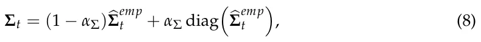

*emp* where b**Σ** is the empirical covariance matrix and *α*Σ *∈* [0, 1] controls the amount of *t* shrinkage toward a diagonal covariance model. This reduces overfitting when the number of observed departmental allocation periods is small.

The spillover value *s*ij,t between opportunities *i* and *j* is estimated using scientific proximity, organizational proximity, and observed historical complementarity:

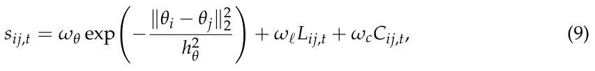

where *θ*i and *θ*j are topic vectors, *L*ij,t indicates whether the opportunities share laboratories, infrastructure, or personnel, and *C*ij,t measures observed complementarity, such as joint publications, shared grants, or cross-lab student supervision. The parameters *ω*θ, *ω*ℓ, *ω*c *≥* 0 determine the relative importance of topical, organizational, and empirical spillover evidence.

#### 3.4.2. Optimistic Scientometric Utility

Given the belief state *B*t, DEPO constructs an optimistic one-period objective. The purpose of optimism is to encourage the department to explore uncertain opportunities when the potential learning value justifies the risk. Define b*µ*+ i,t = b*µ*i,t + *β*t*u*i,t, where *β*t *≥* 0 controls the exploration level. Replacing b*µ*i,t with b*µ*+ i,t in the expected-return component gives the optimistic expected scientometric return *M*+ t (**x**t) = ∑i∈It *ϕ*i(*x*i,t)b*µ*+ i,t.

The algorithm then maximizes the following surrogate objective:

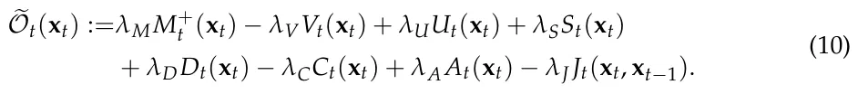

This surrogate is close to the departmental objective in Equation (3), but it replaces the expected return with an optimistic estimate. The distinction is important: Equation (3) defines what the department values, whereas Equation (10) defines how the algorithm behaves under uncertainty.

#### 3.4.3. Constrained Optimization by Feasible Direction Search

The optimization problem is generally non-linear because of diminishing returns, spillover interactions, entropy-based diversity, and adjustment costs. Moreover, the feasible set *X*t may include departmental rules that make closed-form solutions unavailable. DEPO therefore uses a feasible-direction search based on a conditional-gradient procedure [37,38]. The advantage of this approach is that every intermediate solution remains feasible with respect to the departmental constraints. Starting from a feasible allocation **x**(0) *∈X*t, usually *t* the previous allocation projected onto the current feasible set, the algorithm iteratively computes the gradient **g**(m) = *∇*x e*O*t **x**(m) and solves the linearized allocation problem *t* D E. The allocation is then updated by **x**(m+1) = (1 *−η*m)**x**(m) **d**(m) = arg maxd∈Xt **g**(m), **d** + *t t η*m**d**(m) where *η*m *∈* (0, 1] is selected by line search or by the standard schedule *η*m = 2/(*m* + 2). Since both **x**(m) and **d**(m) belong to the convex feasible set *X*t, the updated *t* allocation also belongs to *X*t. The algorithm terminates when the conditional-gradient gap *G*(m) = D**g**(m), **d**(m) *−***x**(m) E *t* falls below a tolerance threshold *ε*, or when a maximum number of iterations is reached.

#### 3.4.4. Algorithm

Algorithm 1 formally outlines DEPO. It is organized around two nested loops. The outer loop represents the department’s repeated decision-making process over the planning horizon. At each period *t*, the department first defines the feasible set of allocations according to its current budget and institutional constraints. It then evaluates each available research opportunity by estimating its expected scientometric return, uncertainty, optimistic return, and strategic alignment. After all opportunities have been evaluated, the department estimates portfolio-level quantities, namely the covariance matrix that captures risk dependencies between opportunities and the spillover matrix that captures complementarities among them. The inner loop solves the allocation problem for the current period. Starting from the previous allocation projected onto the current feasible set, the algorithm repeatedly computes the gradient of the optimistic departmental objective, identifies the feasible allocation direction that most improves the objective, and moves toward that direction using a controlled step size. This process continues until the conditional-gradient gap is sufficiently small or the maximum number of iterations is reached. The result is a feasible allocation vector **x**⋆ t that approximately maximizes the department’s current objective. After the inner loop terminates, the department implements the recommended allocation and observes the realized scientometric outputs in the following period. These outputs are normalized and converted into scalar scientometric returns, then added to the departmental history. Finally, the belief state is updated so that future allocation decisions are based on the newly observed evidence. In this way, DEPO combines portfolio optimization with sequential learning: the outer loop updates what the department knows over time, while the inner loop computes the best feasible allocation given the department’s current knowledge.

**Algorithm 1** Departmental Epistemic Portfolio Optimization (DEPO)

**Require:** Planning horizon *T*; departmental budgets *{B*t*}*T t=0; feasible opportunity sets *{I*t*}*T t=0; initial belief state *B*0; objective parameters *λ*M, *λ*V, *λ*U, *λ*S, *λ*D, *λ*C, *λ*A, *λ*J; exploration schedule *{β*t*}*T t=0; tolerance *ε*.

**Ensure:** Feasible departmental allocations **x**⋆ 0, . . . , **x**⋆ T. 1: *H*0 *←* ∅. 2: **x**−1 *←* **0**. 3: **for** *t* = 0, 1, . . . , *T* **do** 4: Construct feasible allocation set *X*t using Equation (1). 5: **for** *i ∈I*t **do** 6: Estimate b*µ*i,t and *u*i,t. 7: Compute b*µ*+ i,t and *a*i,t. 8: **end for** 9: Estimate **Σ**t and **S**t = [*s*ij,t]. 10: **x**(0) *←* ΠXt(**x**t−1). *t* 11: *m ←* 0. 12: **repeat** 13: **g**(m) *←∇*x e*O*t(**x**(m) ). *t* **d**(m) *←* arg maxd∈Xt D E 14: **g**(m), **d** . *G*(m) *←* D**g**(m), **d**(m) *−***x**(m) E 15: . *t* 16: Choose step size *η*m by line search or set *η*m = 2/(*m* + 2). 17: **x**(m+1) *←* (1 *−η*m)**x**(m) + *η*m**d**(m). *t t* 18: *m ← m* + 1. 19: **until** *G*(m) *≤ ε* or maximum iterations reached 20: **x**⋆ t *←* **x**(m) . *t* 21: Implement allocation **x**⋆ t . 22: Observe realized scientometric output vectors *{***Y**i,t+1*}*i∈It. 23: Normalize outputs e**Y**i,t+1 *←N* (**Y**i,t+1) and compute scalar returns *r*i,t+1. n o 24: *H*t+1 *←H*t *∪* **x**⋆ t , e**Y**i,t+1, *r*i,t+1 . *i∈I*t 25: Update *B*t+1. 26: **end for** 27: **return x**⋆ 0, . . . , **x**⋆ T.

**Theorem 1** (Feasibility of DEPO iterates)**.** *Assume that X*t *is non-empty and convex, that* **x**(0) *∈X*t*, that* **d**(m) *∈X*t *for every inner-loop iteration m, and that η*m *∈* [0, 1]*. Then every DEPO t inner-loop iterate satisfies* **x**(m) *∈X*t*. In particular, the returned allocation* **x**⋆ t *is feasible. t*

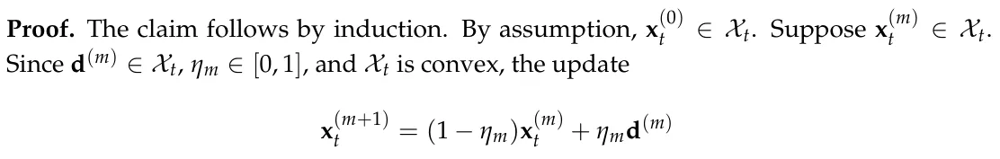

is also in *X*t. Therefore, by induction, all iterates are feasible.

Next, we analyze the time and memory consumption of DEPO. Let *n*t = *|I*t*|* be the number of research opportunities at time *t*, *M*max the maximum number of feasible-direction iterations, *R* the number of reference allocations used for component normalization, and *C*LP(*n*t, *m*t) the cost of solving the linearized allocation problem with *m*t linear institutional constraints. In the dense implementation, DEPO stores and evaluates covariance and spillover matrices, so the per-period running time is *O Rn*2 t + *M*max *n*2 t + *C*LP(*n*t, *m*t) . The corresponding memory consumption is *O*(*n*2 t ) mainly due to the covariance and spillover matrices.

If the spillover graph is sparse with *|E*t*|* nonzero spillover edges, the pairwise spillover part can be stored and evaluated sparsely. In this case, the per-period time becomes

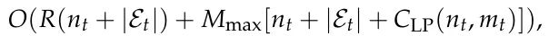

and the memory consumption becomes *O*(*n*t + *|E*t*|*). Over a planning horizon of *T* periods, these costs are multiplied by *T*. When the feasible set contains only budget and bound constraints, the linearized allocation subproblem can be solved by sorting or water-filling in *O*(*n*t log *n*t); with general institutional constraints, it is solved as a linear program.

## 4. Experiments

In order to evaluate the proposed algorithm, we conduct a sequence of in silico experiments aiming to reproduce realistic yet generic configurations. We evaluate the proposed algorithm through a series of controlled in silico experiments representing stylized departmental allocation environments. We first describe the experimental design and then present the simulation results.

### 4.1. Experimental Setup

The experiments evaluate DEPO in a controlled simulated departmental economy. The purpose of the simulator is not to reproduce a particular university department, but to generate realistic allocation problems with heterogeneous research opportunities, delayed outputs, skewed productivity, correlated risk, field-level spillovers, and institutional constraints. All experiments use the same base department and differ only in the environmental dynamics imposed on the research opportunities.

Each Monte Carlo replication generates one synthetic department with *n* = 24 investment opportunities partitioned into *K* = 6 topic clusters. Each opportunity represents a lab, research theme, early-career investment, infrastructure initiative, or emerging interdisciplinary area. The department allocates a normalized annual research budget over a planning horizon of *T* = 20 periods, where each period corresponds to one academic year. Unless otherwise stated, the annual budget is *B*t = 1, the lower allocation bound is *L*i = 0.005, and the upper allocation bound is *U*i = 0.15. These bounds allow the depart-ment to maintain minimal support for existing areas while preventing a single opportunity from absorbing an unrealistic share of the internal budget.

The simulation experiments are designed as an internal validation of the proposed framework, not as an external validation of allocation behavior or performance in actual university departments. Their purpose is to evaluate construct validity and to stress-test the implemented decision procedure under controlled environmental conditions. Internal validation is assessed through three questions. First, does the procedure consistently generate allocations that satisfy the specified budgetary and institutional constraints? Second, does its behavior change in directions that are consistent with the preferences encoded in its objective function, such as increased exploration when uncertainty is valued, broader topic coverage when diversity is rewarded, lower concentration when concentration is penalized, and smoother allocations when adjustment costs are increased? Third, what trade-offs arise among cumulative scientometric return, oracle regret, topic diversity, topic concentration, and allocation volatility?

Due to the fact that the simulator includes uncertainty, spillovers, diversity, concentration, delayed output, and adjustment costs that correspond directly to components of the DEPO objective, favorable performance on these dimensions should be interpreted as consistency with encoded preferences rather than as independent evidence of policy superiority. The experiments do not establish that the simulated environments accurately represent a particular university, that the selected parameter values are empirically calibrated, or that DEPO would outperform existing governance practices in real departments. Such claims would require external validation using retrospective or prospective institutional data.

To examine whether the reported findings depend on a single arbitrary DEPO parameterization, we also conducted a restricted one-factor-at-a-time sensitivity analysis. We varied the uncertainty-value weight *λ*U, the joint diversity and concentration weights (*λ*D, *λ*C), the adjustment-cost weight *λ*J, and the scale *b* of the exploration schedule *β*t = *b*/√ *t* + 1. Each configuration was evaluated in all four environments using the same Monte Carlo design as the main experiments. Common random numbers were used so that the compared configurations encountered the same synthetic departments and stochastic realizations within each replication. The complete design and results are reported in the Appendixes A–D.

#### 4.1.1. Synthetic Department Generation

At the beginning of each Monte Carlo replication, each opportunity *i* is assigned a topic cluster *k*(*i*) *∈{*1, . . . , *K}*, a topic vector *θ*i, an initial capability level *κ*i,0, a latent scientific quality *q*i, a delay parameter *τ*i, a risk parameter *σ*i, and a strategic-alignment score *a*i. Topic vectors are generated by first sampling cluster centers and then drawing opportunity-level vectors around the corresponding center. This creates departments in which opportunities within the same topic cluster are scientifically closer than opportunities in different clusters. This construction is intended to approximate the fact that departments are usually organized around partially overlapping scientific areas rather than around independent projects. Topic vectors represent an abstract version of field, method, application domain, or intellectual proximity. In an empirical implementation, such vectors could be estimated from publication keywords, abstracts, journal categories, grant panels, faculty profiles, or citation-based embeddings. The topic-cluster structure is therefore stylized, but it corresponds to an observable feature of real departments: research opportunities are embedded in disciplinary and interdisciplinary neighborhoods.

*σ*2q Latent scientific quality is drawn from a log-normal distribution *q*i *∼* log *N −* 2 , *σ*2 , *q* so that the mean quality is approximately one while productivity remains right-skewed. This assumption is not meant to imply that scientific quality is directly observable or fixed in real departments. It is used to reproduce a common empirical regularity of academic systems: publications, citations, grants, and recognition are typically unevenly distributed across researchers, topics, and institutions. The log-normal form provides a simple way to generate heterogeneous opportunities without allowing negative quality values. Initial capability is drawn as *κ*i,0 *∼* Beta(*α*κ, *β*κ) and strategic alignment is drawn as *a*i *∼* Beta(*α*a, *β*a). These bounded distributions are used because both variables are naturally represented on a finite interval. Capability reflects accumulated students, infrastructure, methods, routines, and collaborations. Strategic alignment reflects the degree to which an opportunity fits current departmental or university priorities. In real applications, these quantities would not be sampled randomly; they would be estimated from departmental records and expert assessment. The delay parameter *τ*i is sampled from 0, 1, 2, 3, where larger values represent research activities whose outputs become visible only after several years. This reflects the fact that some investments, such as conference travel or small equipment, may affect output quickly, whereas hiring, doctoral training, infrastructure building, and emerging interdisciplinary work often produce measurable results only after a delay. The raw allocation is converted into effective investment according to *z*i,t = *ϕ*i(*x*i,t) = 1 *−*exp(*−η*i*x*i,t), where *η*i *>* 0 controls how efficiently opportunity *i* converts allocated departmental resources into productive research activity. The raw allocation *x*i,t remains subject to the budget constraints, whereas *z*i,t enters the capability and output-generation equations. The concavity assumption represents diminishing marginal returns. For example, initial support may allow a laboratory to hire a student, purchase essential equipment, or submit a grant proposal, while additional support beyond that point may produce smaller marginal gains. This assumption is stylized, but it is consistent with the practical idea that research units often face capacity limits, coordination costs, and finite absorption capacity.

4.1.2. Spillovers, Covariance, and Capability Accumulation

Scientific spillovers are represented by a weighted opportunity graph. The spillover from opportunity *i* to opportunity *j* is

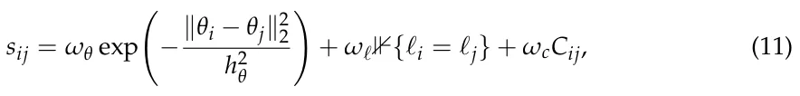

such that *s*ii = 0, where topical proximity, shared organizational infrastructure, and historical complementarity all contribute to spillover strength. In the simulations, *C*ij is generated as a sparse complementarity indicator, representing previous collaboration, shared equipment, or cross-supervision potential. This spillover structure is imposed because scientific opportunities are rarely independent. In real departments, one investment can affect another through shared doctoral students, common equipment, methodological transfer, co-authorship, shared grant infrastructure, or intellectual proximity. The three terms in Equation (11) correspond to three empirical sources of such spillovers. The topical-proximity term represents similarity in research content; the shared-laboratory or shared-infrastructure term represents organizational proximity; and the complementarity term represents observed or expected collaboration. In an empirical implementation, these terms could be estimated from co-authorship networks, grant collaborations, shared supervision, equipment-use records, research-center membership, or semantic similarity among publications and project descriptions.

Departmental capability evolves according to

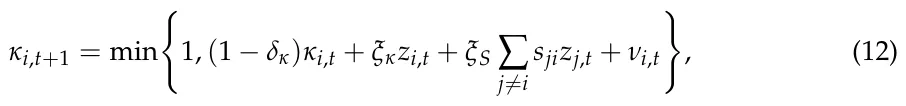

where *δ*κ is capability depreciation, *ξ*κ is the direct capability-building effect of investment, *ξ*S is the spillover-driven capability gain, and *ν*i,t is a small zero-mean capability shock. This state variable captures accumulated students, infrastructure, methods, routines, and collaborations.

Return shocks are correlated within topic clusters. Let *ϵ*i,t denote the scalar scientometric shock of opportunity *i* at time *t*. We generate

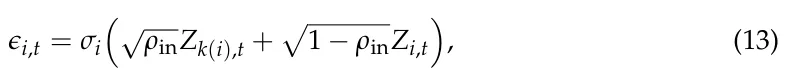

where *Z*k(i),t is a topic-level shock and *Z*i,t is an idiosyncratic opportunity-level shock. This induces positive covariance among opportunities exposed to the same field, funding ecosystem, publication venues, or technological bottlenecks.

#### 4.1.3. Scientometric Output Generation

The output-generation process is intentionally modular. Rather than representing research performance by a single simulated indicator, the simulator generates separate dimensions for publications, citations, grants, venue quality, human-capital formation, and reputation. This choice reflects the fact that departments are evaluated through multiple imperfect indicators. The model does not assume that these dimensions exhaust academic value. Rather, they are included because they correspond to commonly observed administrative and scientometric data. Other dimensions, such as mentoring quality, public engagement, intellectual leadership, software, datasets, patents, or policy impact, could be added in the same framework if a department wished to include them.

For each opportunity and period, the simulator first computes the latent output intensity

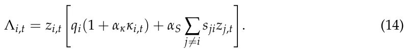

The six-dimensional scientometric output vector is then generated as *Y*i,t+1 = (*P*i,t+1, *C*i,t+1, *G*i,t+1, *Q*i,t+1, *H*i,t+1, *R*i,t+1), where publications, citations, grants, venue quality, human-capital output, and reputation are simulated as follows *P*i,t+1 *∼* Poisson(*λ*PΛi,t), *C*i,t+1 *∼* NegBinom(*λ*CΛi,t, *ζ*C), *G*i,t+1 *∼* Bernoulli(1 *−*exp(*−λ*GΛi,t)) *·* Gamma(*k*G, *θ*G), *Q*i,t+1 *∼* TruncNorm[0,1] *q*0 + *q*1Λi,t, *σ*2 , *H*i,t+1 *∼* Poisson(*λ*H*z*i,t), *Q R*i,t+1 *∼* Poisson(*λ*RΛi,t). Grant income *G*i,t+1 is measured in normalized grant units. The negative-binomial citation model allows over-dispersion, which is important because citation outcomes are typically more variable than publication counts.

Each component is normalized before scalarization:

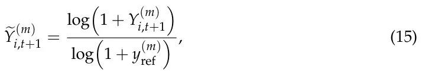

where *m ∈{P*, *C*, *G*, *Q*, *H*, *R}* and *y*(m) ref is a reference value for the corresponding scientometric dimension. Venue quality *Q* is already bounded in [0, 1] and is therefore used directly. The scalar scientometric return is *r*i,t+1 = **w**⊤e**Y**i,t+1 + *ϵ*i,t+1. The realized departmental return in period *t* + 1 is *R*t+1(**x**t) = ∑n i=1 *r*i,t+1.

#### 4.1.4. Policies Compared

All policies are evaluated on the same Monte Carlo replications, initial departments, exogenous shocks, and feasible allocation constraints. Thus, differences between policies reflect differences in allocation logic rather than differences in the simulated environment.

Each feasible policy chooses an allocation vector from the same feasible set *X*t, defined in Equation (1). Let ΠXt(*·*) denote Euclidean projection onto this feasible set.

The equal-allocation policy distributes the available budget uniformly across opportunities and then projects the result onto the feasible set **x**E Bt t = ΠXt nt **1** . The random-allocation policy samples a random budget share vector from a Dirichlet distribution and projects it onto the feasible set **v**t *∼* Dirichlet(*α*R**1**), **x**R t = ΠXt(*B*t**v**t). This policy is included as an unstructured exploration baseline. The prestige-based policy allocates according to fixed initial prestige scores. Let *µ*i,0 denote the prior expected scientometric return assigned to opportunity (i) at the beginning of the simulation. The normalized *µ*i,0 prestige weight is *π*i = *nt* j=1 µ*j*,0 . and the prestige-based allocation is xP t = ΠXt(*B*t***π***). This ∑ policy represents a reputation-driven or inertia-driven allocation rule that does not update its ranking of opportunities during the simulation. The greedy expected-return policy uses the current estimated expected scientometric return but ignores risk, uncertainty, spillovers, diversity, concentration, strategic alignment, and adjustment costs. It solves **x**G t = arg maxx∈Xt ∑nt i=1 *ϕ*i(*x*i)b*µ*i,t. Thus, the greedy policy uses the same estimated return vector and feasible set as DEPO, but only optimizes the expected-return component. The mean–variance policy is the closest classical portfolio baseline. It uses the same estimated return vector, investment-response function, and covariance estimate as DEPO, but excludes the exploration, spillover, diversity, concentration, strategic-alignment, and adjustment-cost h i terms. It solves **x**MV = arg maxx∈Xt ∑nt i=1 *ϕ*i(*x*i)b*µ*i,t *−λ*MV **z**⊤b**Σ**t**z** such that *z*i = *ϕ*i(*x*i). *t V* The oracle policy is an infeasible informed benchmark. In each period, it constructs its allocation using the true latent quantities of the simulated department rather than the estimated beliefs available to the feasible policies. These quantities include latent opportunity quality, delay parameters, capability, spillovers, covariance, strategic alignment, and environment-specific modifications. The oracle remains subject to the same budgetary and allocation constraints as the other policies. However, it does not observe future stochastic shocks and therefore is not clairvoyant. Its realized cumulative scientometric return is consequently not a deterministic upper bound: because outputs contain random variation, another policy may obtain a higher realized return in a particular replication or a higher mean realized return across replications. The oracle is used as an informed reference policy rather than as a guaranteed ex-post optimum. We define **x**O t = arg maxx∈Xt E *R*t+1(**x**) *|* Θtrue , where *t* Θtrue denotes the true latent simulation parameters available to the oracle. Since realized *t* outcomes include stochastic shocks, a feasible policy may occasionally obtain a higher realized cumulative return than the oracle in a finite Monte Carlo sample. For this reason, oracle regret is interpreted as an empirical diagnostic relative to a true-parameter expected benchmark, not as a deterministic dominance guarantee.

Table 2 summarizes the allocation policies compared in the experiments.

<figure class="table-figure" id="table-2">
<figcaption><strong>Table 2.</strong> Allocation policies compared in the simulation experiments.</figcaption>

<table><tr><th>Policy</th><th>Abbrev.</th><th>Description</th></tr><tr><td>Departmental Epistemic Portfolio Optimization</td><td>D</td><td>The proposed DEPO algorithm, which allocates resources using expected scientometric return, uncertainty, covariance, spillovers, topic diversity, concentration penalties, strategic alignment, and adjustment costs.</td></tr><tr><td>Equal allocation</td><td>E</td><td>Allocates the available budget evenly across all opportunities, sub- ject to lower and upper allocation bounds.</td></tr><tr><td>Random allocation</td><td>R</td><td>Samples feasible allocations from a Dirichlet distribution and projects them onto the feasible allocation set Xt.</td></tr></table>

</figure>

<figure class="table-figure" id="table-2b">
<figcaption><strong>Table 2.</strong> <em>Cont.</em></figcaption>

<table><tr><th>Policy</th><th>Abbrev.</th><th>Description</th></tr><tr><td>Greedy expected-return allocation</td><td>G</td><td>Allocates resources to opportunities with the largest current esti- mated expected return bµi,t, subject to feasibility constraints.</td></tr><tr><td>Prestige-based allocation</td><td>P</td><td>Allocates according to fixed initial prestige scores computed from the pre-simulation prior means µi,0. This policy represents institu- tional inertia and reputation-driven funding.</td></tr><tr><td>Mean–variance allocation</td><td>MV</td><td>Solves a classical mean–variance allocation problem using expected return and covariance, without exploration, spillovers, topic diver- sity, concentration penalties, or strategic alignment.</td></tr><tr><td>Oracle allocation</td><td>O</td><td>An infeasible informed benchmark that constructs allocations using the true latent simulation quantities rather than estimated beliefs. It remains subject to the same feasibility constraints and does not observe future stochastic shocks. It is used to calculate the realized oracle shortfall and should not be interpreted as a clairvoyant or deterministic upper-bound policy.</td></tr></table>

</figure>

#### 4.1.5. Evaluation Metrics

Policy performance is evaluated using five primary metrics. Cumulative scientometric return is CSR = ∑T−1 t=0 *R*t+1(**x**t). Oracle regret is computed relative to the infeasible true-parameter oracle: Reg = ∑T−1 E *R*t+1(**x**O t ) *|* Θtrue *−*E *R*t+1(**x**t) *|* Θtrue , where **x**O t=0 t t t is the oracle allocation and Θtrue denotes the true latent simulation parameters. This regret *t* definition compares expected performance under the true data-generating model. It is therefore distinct from realized cumulative scientometric return, which includes random shocks. This distinction is important because finite-sample realized returns may occasionally favor a feasible policy even when the oracle has the best expected allocation. Topic diversity is measured by normalized Shannon entropy, Divt = *−* log K ∑K 1 k=1 *p*k,t log *p*k,t, where *p*k,t is the share of effective investment allocated to topic cluster *k*. Concentration is measured by the Herfindahl index, Conct = ∑K k=1 *p*2 k,t. Finally, allocation volatility is Vol = T−1 ∑T−1 1 t=1 *∥***x**t *−***x**t−1*∥*1. All reported values are averaged across *N*MC Monte Carlo replications. Tables report mean *±* standard error. Figures show Monte Carlo means with 95% confidence intervals.

#### 4.1.6. Environment-Specific Modifications

The stable scientific environment uses the base simulator without additional drift, delayed breakthroughs, monoculture pressure, or budget shocks.

In the emerging-field environment, a subset *E ⊂I* of opportunities is assigned high hidden long-term potential but weak early observed performance. For *i ∈E*, the latent quality becomes

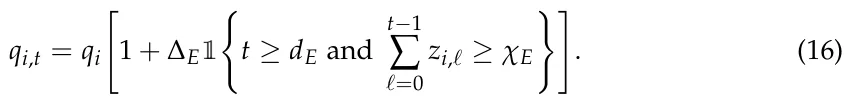

Thus, emerging opportunities become high-return only after receiving sufficient cumulative support.

In the scientific monoculture environment, one topic cluster *k*⋆ receives a temporary attractiveness multiplier but becomes less productive when the department over-concentrates in it:

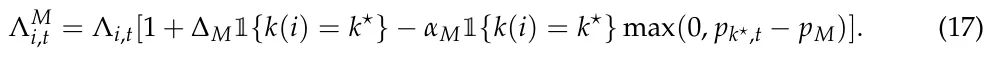

This setting captures the risk that a fashionable topic initially appears attractive but eventually suffers from crowding, duplicated effort, or reduced departmental breadth.

In the budget-shock environment, the budget changes at time *t*s:

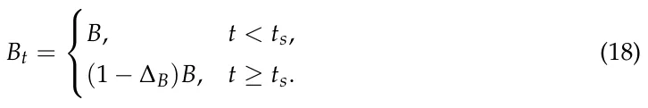

In the reported experiments, *t*s = 10 and ∆B = 0.35, so the available budget falls from *B* to 0.65*B* and remains at that level for the rest of the planning horizon. The feasible allocation set *X*t is updated immediately when the reduced budget takes effect.

### 4.2. Results

Table 3 presents the aggregate performance of all allocation policies across the four simulated environments. For each experiment–policy pair, the table reports cumulative scientometric return, oracle regret, topic diversity, topic concentration, and allocation volatility as mean *±* standard error across *n* = 100 Monte Carlo replications. Prestige-based allocation obtains the highest cumulative scientometric return in all four environments. DEPO remains close to the oracle and mean–variance benchmarks while generally preserving relatively high topic diversity, low concentration, and moderate allocation volatility. Equal allocation obtains the greatest diversity and lowest concentration but sacrifices cumulative return, whereas greedy allocation produces substantially greater concentration and lower diversity without consistently obtaining the highest cumulative return.

<figure class="table-figure" id="table-3">
<figcaption><strong>Table 3.</strong> Policy performance across all experiments. CSR denotes realized cumulative scientometric return. ROS denotes realized oracle shortfall, defined in each Monte Carlo replication as [CSR<em>O −</em>CSR<em>π</em>]+. Div, Conc, and Vol denote average topic diversity, topic concentration, and allocation volatility, respectively. Values report mean <em>±</em> standard error across <em>n</em> = 100 Monte Carlo replications. Because ROS truncates negative gaps at zero, a policy may have a higher mean CSR than the oracle while still having a positive ROS.</figcaption>

<table><tr><th>Experiment</th><th>Policy</th><th>CSR</th><th>ROS</th><th>Div</th><th>Conc</th><th>Vol</th></tr><tr><td>Stable</td><td>D</td><td>122.23 ± 1.05</td><td>2.93 ± 0.39</td><td>0.97 ± 0.00</td><td>0.18 ± 0.00</td><td>0.06 ± 0.00</td></tr><tr><td>Stable</td><td>E</td><td>118.84 ± 1.08</td><td>5.86 ± 0.52</td><td>1.00 ± 0.00</td><td>0.17 ± 0.00</td><td>0.00 ± 0.00</td></tr><tr><td>Stable</td><td>R</td><td>112.92 ± 0.93</td><td>10.23 ± 0.64</td><td>0.96 ± 0.00</td><td>0.19 ± 0.00</td><td>0.88 ± 0.00</td></tr><tr><td>Stable</td><td>G</td><td>118.68 ± 1.12</td><td>5.73 ± 0.59</td><td>0.86 ± 0.01</td><td>0.25 ± 0.00</td><td>0.23 ± 0.01</td></tr><tr><td>Stable</td><td>P</td><td>126.08 ± 1.10</td><td>1.84 ± 0.36</td><td>0.96 ± 0.00</td><td>0.19 ± 0.00</td><td>0.00 ± 0.00</td></tr><tr><td>Stable</td><td>MV</td><td>121.31 ± 1.13</td><td>3.80 ± 0.46</td><td>0.97 ± 0.00</td><td>0.18 ± 0.00</td><td>0.07 ± 0.00</td></tr><tr><td>Stable</td><td>O</td><td>122.87 ± 1.04</td><td>0.00 ± 0.00</td><td>0.98 ± 0.00</td><td>0.18 ± 0.00</td><td>0.01 ± 0.00</td></tr><tr><td>Emerging-field</td><td>D</td><td>120.90 ± 1.14</td><td>4.58 ± 0.56</td><td>0.97 ± 0.00</td><td>0.18 ± 0.00</td><td>0.06 ± 0.00</td></tr><tr><td>Emerging-field</td><td>E</td><td>119.96 ± 1.02</td><td>5.26 ± 0.54</td><td>1.00 ± 0.00</td><td>0.17 ± 0.00</td><td>0.00 ± 0.00</td></tr><tr><td>Emerging-field</td><td>R</td><td>112.41 ± 0.87</td><td>11.62 ± 0.72</td><td>0.96 ± 0.00</td><td>0.19 ± 0.00</td><td>0.88 ± 0.00</td></tr><tr><td>Emerging-field</td><td>G</td><td>118.08 ± 1.13</td><td>6.72 ± 0.61</td><td>0.85 ± 0.01</td><td>0.25 ± 0.00</td><td>0.24 ± 0.01</td></tr><tr><td>Emerging-field</td><td>P</td><td>125.00 ± 1.18</td><td>2.21 ± 0.39</td><td>0.96 ± 0.00</td><td>0.19 ± 0.00</td><td>0.00 ± 0.00</td></tr><tr><td>Emerging-field</td><td>MV</td><td>121.59 ± 1.02</td><td>4.48 ± 0.49</td><td>0.97 ± 0.00</td><td>0.18 ± 0.00</td><td>0.06 ± 0.00</td></tr><tr><td>Emerging-field</td><td>O</td><td>124.00 ± 1.03</td><td>0.00 ± 0.00</td><td>0.98 ± 0.00</td><td>0.18 ± 0.00</td><td>0.01 ± 0.00</td></tr><tr><td>Monoculture</td><td>D</td><td>126.49 ± 1.25</td><td>3.32 ± 0.45</td><td>0.97 ± 0.00</td><td>0.18 ± 0.00</td><td>0.06 ± 0.00</td></tr><tr><td>Monoculture</td><td>E</td><td>122.63 ± 1.11</td><td>5.67 ± 0.54</td><td>1.00 ± 0.00</td><td>0.17 ± 0.00</td><td>0.00 ± 0.00</td></tr><tr><td>Monoculture</td><td>R</td><td>116.70 ± 0.95</td><td>10.86 ± 0.67</td><td>0.96 ± 0.00</td><td>0.19 ± 0.00</td><td>0.88 ± 0.00</td></tr><tr><td>Monoculture</td><td>G</td><td>123.39 ± 1.08</td><td>5.47 ± 0.61</td><td>0.84 ± 0.01</td><td>0.25 ± 0.00</td><td>0.22 ± 0.01</td></tr><tr><td>Monoculture</td><td>P</td><td>129.85 ± 1.13</td><td>1.84 ± 0.35</td><td>0.96 ± 0.00</td><td>0.19 ± 0.00</td><td>0.00 ± 0.00</td></tr><tr><td>Monoculture</td><td>MV</td><td>124.82 ± 1.16</td><td>4.09 ± 0.46</td><td>0.97 ± 0.00</td><td>0.18 ± 0.00</td><td>0.06 ± 0.00</td></tr><tr><td>Monoculture</td><td>O</td><td>127.16 ± 1.08</td><td>0.00 ± 0.00</td><td>0.98 ± 0.00</td><td>0.18 ± 0.00</td><td>0.01 ± 0.00</td></tr><tr><td>Budget shock</td><td>D</td><td>109.36 ± 0.96</td><td>3.44 ± 0.49</td><td>0.96 ± 0.00</td><td>0.19 ± 0.00</td><td>0.07 ± 0.00</td></tr><tr><td>Budget shock</td><td>E</td><td>106.09 ± 0.89</td><td>5.81 ± 0.58</td><td>1.00 ± 0.00</td><td>0.17 ± 0.00</td><td>0.02 ± 0.00</td></tr><tr><td>Budget shock</td><td>R</td><td>101.82 ± 0.84</td><td>9.49 ± 0.66</td><td>0.95 ± 0.00</td><td>0.19 ± 0.00</td><td>0.73 ± 0.00</td></tr><tr><td>Budget shock</td><td>G</td><td>109.01 ± 0.94</td><td>4.14 ± 0.50</td><td>0.82 ± 0.01</td><td>0.27 ± 0.01</td><td>0.20 ± 0.01</td></tr><tr><td>Budget shock</td><td>P</td><td>113.63 ± 1.04</td><td>1.75 ± 0.32</td><td>0.96 ± 0.00</td><td>0.19 ± 0.00</td><td>0.02 ± 0.00</td></tr><tr><td>Budget shock</td><td>MV</td><td>109.13 ± 1.06</td><td>3.81 ± 0.47</td><td>0.96 ± 0.00</td><td>0.20 ± 0.00</td><td>0.08 ± 0.00</td></tr><tr><td>Budget shock</td><td>O</td><td>111.15 ± 0.94</td><td>0.00 ± 0.00</td><td>0.96 ± 0.00</td><td>0.19 ± 0.00</td><td>0.02 ± 0.00</td></tr></table>

</figure>

#### 4.2.1. Stable Scientific Environment

Figure 1 presents cumulative scientometric return before and after the negative budget shock. The vertical line marks the shock time *t*s, after which the department must reallocate under the smaller feasible budget. Prestige-based allocation achieves the highest cumulative return, while DEPO, greedy allocation, and mean–variance allocation remain close to one another and below the oracle. DEPO preserves competitive performance after the shock without relying on the more concentrated allocation structure produced by the greedy policy.

<figure id="fig-1">
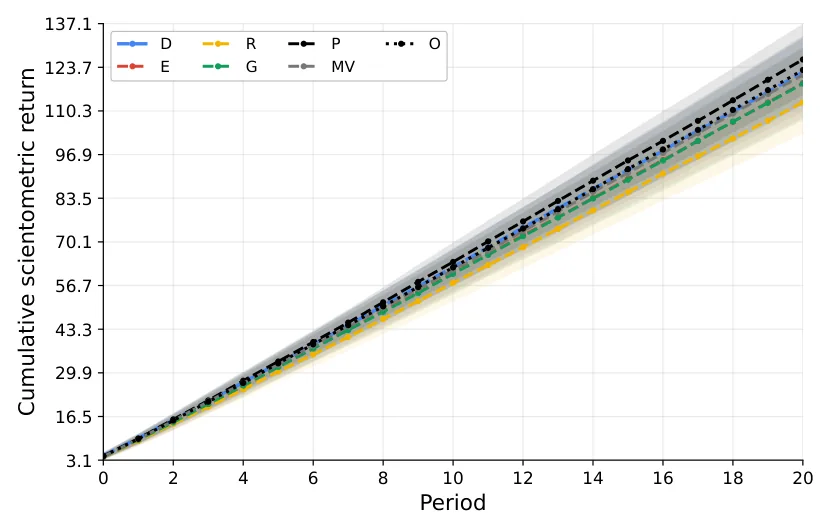
<figcaption><strong>Figure 1.</strong> Cumulative scientometric return over time in the stable scientific environment. Curves show the mean over Monte Carlo replications, with shaded regions representing confidence intervals.</figcaption>
</figure>

Figure 2 presents topic concentration over time in the stable scientific environment. Lower values indicate a more balanced distribution of departmental resources across topic clusters. The main point to notice is that greedy allocation produces the highest concentration, reflecting its tendency to focus resources on currently attractive opportunities. DEPO, mean–variance, prestige-based allocation, and the oracle remain in a much lower concentration range, while equal allocation provides the lowest possible concentration by construction.

<figure id="fig-2">
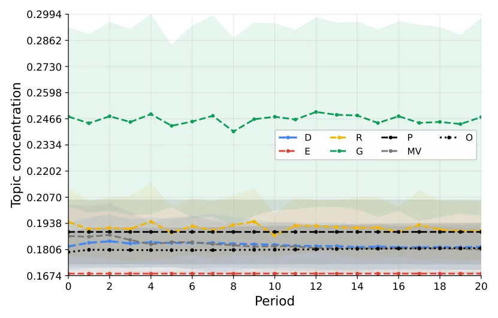
<figcaption><strong>Figure 2.</strong> Topic concentration over time in the stable scientific environment. Lower values indicate a more balanced departmental research portfolio.</figcaption>
</figure>

#### 4.2.2. Emerging-Field Environment

Figure 3 presents cumulative scientometric return over time in the emerging-field environment. This setting introduces opportunities whose early observed performance is weak but whose latent long-term potential can become visible after sufficient investment. The figure shows that DEPO remains competitive with the oracle and mean–variance allocation, but it does not dominate the prestige-based baseline in cumulative return under the current parameterization.

<figure id="fig-3">
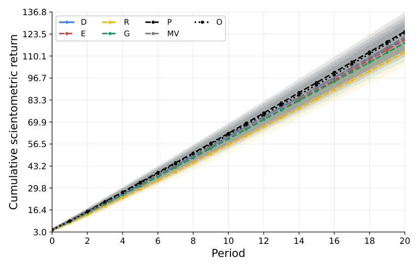
<figcaption><strong>Figure 3.</strong> Cumulative scientometric return over time in the emerging-field environment. Prestige-based allocation obtains the highest cumulative return under the current parameterization. DEPO remains close to the oracle and mean–variance policies but does not obtain a cumulative-return advantage after the delayed-output phase. Curves show Monte Carlo means, and shaded regions indicate one standard deviation.</figcaption>
</figure>

Figure 4 presents the share of departmental budget allocated to emerging opportunities over time. This figure directly evaluates whether each policy supports uncertain or under-observed areas. Equal and random allocation assign relatively large shares to emerging opportunities because they spread resources broadly, while greedy allocation gives almost no support to them. DEPO gradually increases its emerging-field allocation and remains close to the oracle and mean–variance policies.

<figure id="fig-4">
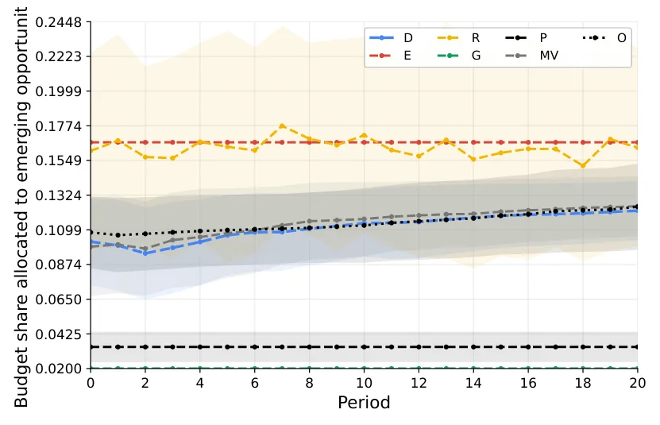
<figcaption><strong>Figure 4.</strong> Share of departmental budget allocated to emerging opportunities over time. Higher values indicate stronger support for uncertain or under-observed research opportunities.</figcaption>
</figure>

Figure 5 presents the cumulative realized oracle shortfall in the emerging-field environment. Lower values indicate that a policy experiences smaller realized downside gaps relative to the informed oracle benchmark. Prestige-based allocation has the lowest shortfall among the feasible policies under the current parameterization, while DEPO and mean–variance allocation form a second group with moderate shortfalls. Random allocation has the largest shortfall. These values should not be interpreted as conventional expected regret or as evidence that the oracle must have the highest realized CSR in every replication.

<figure id="fig-5">
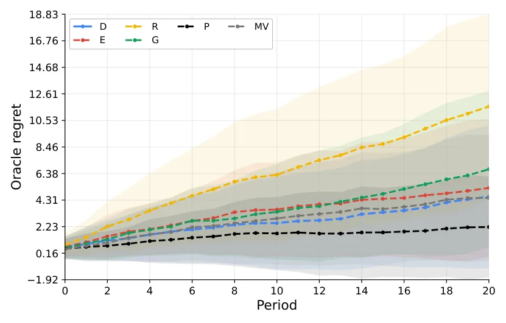
<figcaption><strong>Figure 5.</strong> Regret relative to the oracle policy in the emerging-field environment. Lower regret indicates better learning and allocation under uncertainty.</figcaption>
</figure>

#### 4.2.3. Scientific Monoculture Environment

Figure 6 presents the budget share allocated to the fashionable topic in the scientific monoculture environment. This environment tests whether policies over-commit to a temporarily attractive topic cluster. Greedy allocation assigns the largest share to the fashionable topic, showing the expected tendency toward monoculture. DEPO, mean– variance, prestige-based allocation, and the oracle allocate more moderately, while equal allocation remains low because it distributes resources uniformly across topic clusters.

<figure id="fig-6">
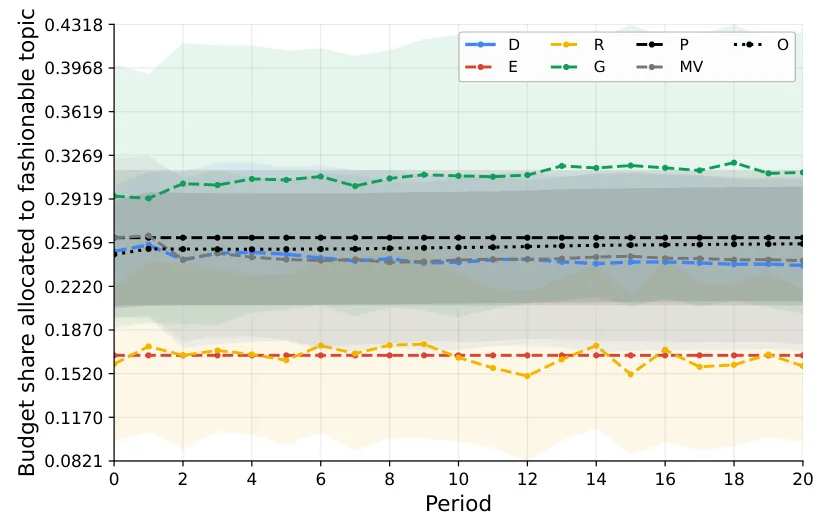
<figcaption><strong>Figure 6.</strong> Budget share allocated to the fashionable topic in the scientific monoculture environment.</figcaption>
</figure>

Figure 7 presents topic diversity over time in the scientific monoculture environment. Higher values indicate broader research coverage across topic clusters. The figure shows that greedy allocation has the lowest diversity throughout the simulation, consistent with its high allocation to the fashionable topic. DEPO preserves diversity at a level close to the oracle, mean–variance, and prestige-based policies, while equal allocation achieves the highest diversity by construction.

<figure id="fig-7">
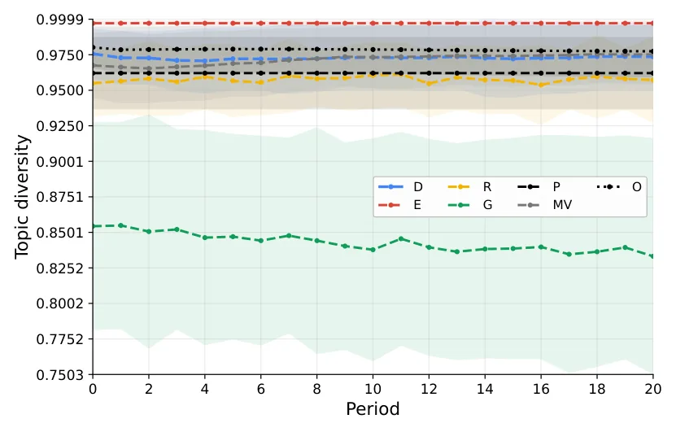
<figcaption><strong>Figure 7.</strong> Topic diversity over time in the scientific monoculture environment. Higher values indicate broader departmental research coverage.</figcaption>
</figure>

#### 4.2.4. Budget-Shock Environment

Figure 8 presents cumulative scientometric return in the budget-shock environment. The vertical line marks the shock time *t*s, after which the department must reallocate under the new budget constraint. Prestige-based allocation again achieves the highest cumulative return, while DEPO, greedy allocation, and mean–variance allocation remain close to one another and below the oracle. The important pattern is that DEPO preserves competitive performance after the shock without relying on the more concentrated structure of greedy allocation.

<figure id="fig-8">
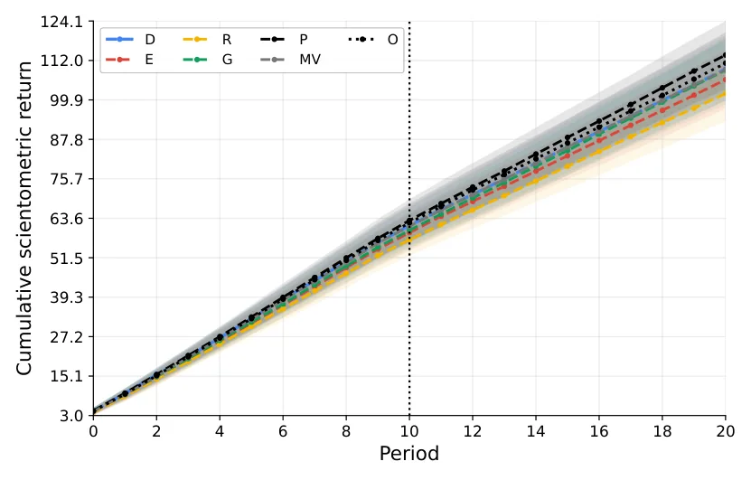
<figcaption><strong>Figure 8.</strong> Cumulative scientometric return in the budget-shock environment. The vertical dashed line marks the shock time <em>t</em>s.</figcaption>
</figure>

Figure 9 presents allocation volatility before and after the budget shock. This metric measures the magnitude of period-to-period changes in the allocation vector; lower values indicate smoother institutional adaptation. Random allocation is by far the most volatile policy, and greedy allocation also exhibits relatively high volatility. DEPO shows a moderate temporary increase around the shock but remains much smoother than random and greedy allocation, reflecting the effect of its adjustment-cost term.

<figure id="fig-10">
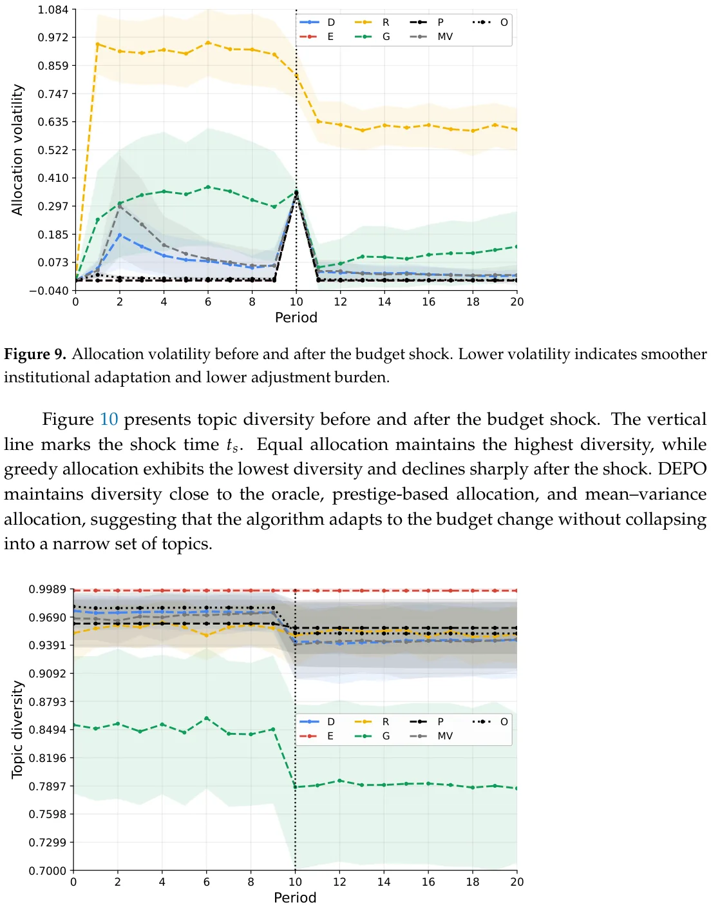
<figcaption><strong>Figure 10.</strong> Topic diversity before and after the budget shock. The vertical dashed line marks the shock time <em>t</em>s.</figcaption>
</figure>

Figure 10 presents topic diversity before and after the budget shock. The vertical line marks the shock time *t*s. Equal allocation maintains the highest diversity, while greedy allocation exhibits the lowest diversity and declines sharply after the shock. DEPO maintains diversity close to the oracle, prestige-based allocation, and mean–variance allocation, suggesting that the algorithm adapts to the budget change without collapsing into a narrow set of topics.

## 5. Discussion

In this study, we introduced the DSPO problem and the DEPO algorithm as a computational-economic framework for university-level research-related resource allocation. This formalization establishes a decision-support framework in which a department can explicitly state several priorities and then examine the allocation consequences of these priorities. We compared the proposed framework with simple and widely used baseline methods. The results do not show that DEPO is universally superior to simpler allocation policies, as prestige-based allocation obtains the highest cumulative scientometric return in all four simulated environments. Hence, the contribution of DEPO is to provide a structured way to produce feasible allocations that reflect a broader set of stated institutional objectives. In this sense, the results are partly expected by design. Since diversity, concentration control, uncertainty, spillovers, and adjustment costs are included in the objective, DEPO should perform relatively well on metrics related to these dimensions.

The obtained results support the main claim that department-level research allocation benefits from a portfolio logic rather than from a purely performance-maximizing rule. In the stable scientific environment, DEPO remains close to the strongest short-term baselines in cumulative scientometric return. At the same time, DEPO produces lower topic concentration than policies that allocate mainly according to recent performance or accumulated prestige. This result is consistent with the broader finding that scientific indicators are useful but incomplete decision signals, as once indicators become decision targets, they may over-direct attention toward already visible outputs rather than toward the broader institutional conditions that sustain research quality [80]. Thus, in the stable environment, DEPO produces a different point on the trade-off surface: it remains competitive in cumulative return while preserving greater topic breadth and lower concentration than several performance-oriented policies [81]. Whether this allocation is institutionally preferable depends on how the department values these competing outcomes.

To be exact, the simulation results provide internal validation of DSPO and DEPO rather than external evidence about actual university allocation practices. The relevant question is therefore not whether DEPO is universally superior to the comparison policies, but whether the implemented procedure behaves consistently with the institutional preferences encoded in its objective and whether the resulting trade-offs are transparent. On this criterion, the results support the internal consistency of the framework. DEPO generates feasible allocations, places sustained value on diversity and concentration control, adapts allocations over time as its beliefs change, and limits abrupt reallocations through its adjustment-cost component. These outcomes are partly expected by design because the corresponding considerations are explicitly represented in the objective function. Their evidential role is to verify that the integrated procedure operationalizes those preferences coherently, not to demonstrate that the preferences themselves are empirically correct or universally desirable.

Across the four environments, the simulations provide internal evidence that the implemented policies generate distinct and interpretable allocation profiles. Prestige-based allocation obtains the highest mean realized CSR under the current parameterization, whereas equal allocation produces maximal topic diversity, minimal concentration, and very low volatility. Greedy allocation is substantially more concentrated, and random allocation is the most volatile. DEPO and mean–variance allocation occupy intermediate regions, combining competitive realized return with relatively broad and stable portfolios. These patterns should be interpreted as differences in encoded institutional priorities rather than as a universal ranking of allocation quality.

The environment-specific results refine this general trade-off. In the stable environment, DEPO remains close to the principal structured baselines while preserving relatively high diversity. In the emerging-field environment, its uncertainty-aware component generates some support for under-observed opportunities, but this does not produce a clear realized-return advantage over prestige-based allocation. The monoculture environment shows the clearest return–concentration trade-off: policies that concentrate more strongly do not dominate simultaneously on CSR and portfolio breadth. Under the budget shock, the adjustment-cost component limits abrupt reallocations, although smoother adaptation may come at a return cost. Taken together, these results produce a Pareto-style comparison in which no implementable policy dominates realized CSR, diversity, concentration, and volatility simultaneously.

From an applicative perspective, DEPO should be understood as a structured decision-support tool. A practical implementation would begin by defining the decision units, such as laboratories, research themes, early-career investments, infrastructure projects, or interdisciplinary initiatives. The department would then assemble evidence about past outputs, grants, doctoral training, collaborations, shared infrastructure, and strategic priorities. Some quantities, such as publication counts or grant outcomes, may be estimated from administrative and bibliometric records. Other quantities, such as strategic alignment, future spillovers, and the promise of emerging areas, require structured expert judgment. The main practical value of DEPO is that it makes these judgments explicit. Instead of allowing implicit preferences to remain hidden, the framework requires the department to state how simultaneously dominate return, risk control, exploration, diversity, concentration avoidance, spillovers, strategic alignment, and allocation stability. The resulting allocation should be treated as one scenario among several. Committees can run the model under alternative weights, inspect which assumptions drive the recommendation, and compare the output with peer-review assessments and qualitative priorities. Final decisions should remain with accountable human decision-makers who can revise inputs, reject implausible assumptions, and document reasons for departing from the model recommendation.

The use of algorithmic allocation in academic governance also raises important risks. First, any model based on scientometric indicators may encourage metric gaming if researchers or units learn that specific outputs directly affect future allocations. Second, historical data may encode existing inequalities, such as unequal access to laboratories, grant-writing support, doctoral students, teaching relief, or professional networks [82]. If used mechanically, DEPO could reinforce these inequalities by treating past advantage as evidence of future merit. Third, disciplinary heterogeneity matters: fields differ in publication rates, citation practices, grant availability, authorship norms, and time horizons. A single normalization scheme may still fail to capture these differences fully. Finally, overreliance on quantifiable outputs may undervalue mentoring quality, intellectual risk-taking, public engagement, theoretical contributions, software, datasets, negative results, or long-term field-building work.

This study is not without limitations. First, the experiments are simulation-based, and although the simulated environments are designed to capture stylized features of academic systems, they do not reproduce the full complexity of real departments. Second, scientometric return is necessarily a simplified representation of academic value; important outcomes such as mentoring quality, intellectual leadership, public engagement, and long-term theoretical contribution are difficult to encode. Third, the model assumes that departmental preferences can be represented through weights and constraints, whereas real governance often involves negotiation, politics, disciplinary norms, and incomplete agreement about goals [83]. Fourth, the algorithm depends on estimates of returns, uncertainty, covariance, and spillovers, and these estimates may be noisy or biased in practice, making the model’s predictions less accurate [84]. Fifth, real departments may not have sufficiently rich or reliable data to estimate all DSPO quantities directly. In such cases, DEPO should be used with conservative shrinkage, transparent uncertainty scores, and expert-reviewed assumptions rather than with falsely precise numerical estimates. Finally, DEPO is normative rather than descriptive. It specifies how a department could allocate resources under an explicit objective function, but it does not explain how departments actually make allocation decisions. Real departmental governance includes negotiation, disciplinary politics, leadership priorities, informal norms, peer judgment, and constraints that may not be captured by a formal objective. Future work should aim to remedy some or all of these limitations to further improve the usability of DEPO and improve resource allocation in science.

Taken jointly, this study makes four related but distinct contributions. First, it formulates departmental research planning as the Departmental Scientometric Portfolio Optimization problem, thereby shifting attention from the measurement of scientific performance to sequential institutional decision-making under limited resources and uncertainty. Second, it integrates established concepts from portfolio optimization, uncertainty-aware exploration, spillover modeling, diversity preservation, concentration control, strategic alignment, and adjustment costs within a single domain-specific scientometric objective. Third, it operationalizes this formulation through DEPO, an adaptive decision-support procedure that updates departmental beliefs and generates feasible allocation scenarios over repeated planning periods. Fourth, the simulation experiments provide a behavioral and trade-off analysis of this framework across stable, emerging-field, scientific-monoculture, and budget-shock environments. The experiments demonstrate how the integrated objective changes exploration, diversity, concentration, and allocation stability, but they do not establish a universally optimal research-funding policy. More broadly, the study illustrates how computational economics can contribute to the science of science not by replacing academic judgment, but by structuring and making explicit the institutional trade-offs that underlie research-planning decisions.

**Supplementary Materials:** The following supporting information can be downloaded at: https: //www.mdpi.com/article/10.3390/a19080635/s1.

**Funding:** This research received no external funding.

**Data Availability Statement:** All the experimental code and collected data are available in the Supplementary Materials.

**Acknowledgments:** The author used AI-based tools for initial ideations, problem definition, code generation, and the initial version of the manuscript. All materials were manually reviewed and edited. The authors take full responsibility for the content.

**Conflicts of Interest:** The author declare no conflicts of interest.

## Appendix A. Simulation Parameterization

Table A1 summarizes the simulation parameters, their descriptions, and their default values. These values define a transparent baseline scenario rather than a calibration to a particular empirical department. The scientometric normalization reference values were selected to produce dimensionless output scores on broadly comparable ranges after logarithmic scaling. The scientometric weight vector **w** represents an illustrative department that assigns somewhat greater importance to publications, citations, and grants while retaining human-capital, venue-quality, and reputation outcomes in the scalar return. For the normalization of the DSPO objective components, the reference set contains the projected previous allocation, equal allocation, prestige-based allocation, greedy expected-return allocation, mean–variance allocation, and *n* = 100 randomly generated feasible allocations.

<figure class="table-figure" id="table-a1">
<figcaption><strong>Table A1.</strong> Default simulation parameters.</figcaption>

<table><tr><th>Category</th><th>Parameter</th><th>Default Value</th><th>Description</th></tr><tr><td>Department size</td><td>n</td><td>24</td><td>Number of research investment opportunities.</td></tr><tr><td>Department size</td><td>K</td><td>6</td><td>Number of topic clusters.</td></tr><tr><td>Department size</td><td>n/K</td><td>4</td><td>Number of opportunities per topic cluster.</td></tr><tr><td>Planning horizon</td><td>T</td><td>20</td><td>Number of annual allocation periods.</td></tr><tr><td>Monte Carlo design</td><td>NMC</td><td>100</td><td>Number of independent Monte Carlo replications.</td></tr><tr><td>Budget</td><td>B</td><td>1.0</td><td>Normalized annual departmental research budget.</td></tr></table>

</figure>

<figure class="table-figure" id="table-a1b">
<figcaption><strong>Table A1.</strong> <em>Cont.</em></figcaption>

<table><tr><th>Category</th><th>Parameter</th><th>Default Value</th><th>Description</th></tr><tr><td>Feasibility</td><td>Li</td><td>0.005</td><td>Minimum allocation to each opportunity.</td></tr><tr><td>Feasibility</td><td>Ui</td><td>0.15</td><td>Maximum allocation to each opportunity.</td></tr><tr><td>Latent quality</td><td>σq</td><td>0.45</td><td>Log-normal productivity heterogeneity parameter.</td></tr><tr><td>Initial capability</td><td>ακ, βκ</td><td>2, 5</td><td>Shape parameters for κi,0 ∼Beta(ακ, βκ).</td></tr><tr><td>Strategic alignment</td><td>αa, βa</td><td>2, 2</td><td>Shape parameters for ai ∼Beta(αa, βa).</td></tr><tr><td>Delay</td><td>τi</td><td>Uniform on {0, 1, 2, 3}</td><td>Delay between investment and visible output.</td></tr><tr><td>Investment response</td><td>ηi</td><td>Uniform on [4, 8]</td><td>Controls diminishing marginal returns in ϕi(x) = 1 −</td></tr><tr><td></td><td></td><td></td><td>exp(−ηix).</td></tr><tr><td>Lagged investment</td><td>δτ</td><td>0.60</td><td>Persistence of past investments in delayed output.</td></tr><tr><td>Risk</td><td>σi</td><td>Uniform on [0.08, 0.25]</td><td>Opportunity-level return volatility.</td></tr><tr><td>Correlation</td><td>ρin</td><td>0.35</td><td>Within-topic return-shock correlation.</td></tr><tr><td>Spillover</td><td>ωθ</td><td>0.50</td><td>Weight assigned to topical proximity in spillover generation.</td></tr><tr><td>Spillover</td><td>hθ</td><td>0.75</td><td>Bandwidth of topical-proximity spillover kernel.</td></tr><tr><td>Spillover</td><td>ωℓ</td><td>0.20</td><td>Weight assigned to shared lab or infrastructure.</td></tr><tr><td>Spillover</td><td>ωc</td><td>0.30</td><td>Weight assigned to collaboration complementarity.</td></tr><tr><td>Capability</td><td>δκ</td><td>0.08</td><td>Annual capability depreciation rate.</td></tr><tr><td>Capability</td><td>ξκ</td><td>0.20</td><td>Direct capability gain from own investment.</td></tr><tr><td>Capability</td><td>ξS</td><td>0.05</td><td>Capability gain from spillovers.</td></tr><tr><td>Capability</td><td>νi,t</td><td>N (0, 0.012)</td><td>Small capability shock, truncated so κi,t ∈[0, 1].</td></tr><tr><td>Output intensity</td><td>ακ</td><td>0.60</td><td>Effect of accumulated capability on latent output intensity.</td></tr><tr><td>Output intensity</td><td>αS</td><td>0.30</td><td>Effect of incoming spillovers on latent output intensity.</td></tr><tr><td>Publications</td><td>λP</td><td>3.0</td><td>Publication intensity multiplier.</td></tr><tr><td>Citations</td><td>λC</td><td>15.0</td><td>Citation intensity multiplier.</td></tr><tr><td>Citations</td><td>ζC</td><td>2.0</td><td>Negative-binomial dispersion parameter.</td></tr><tr><td>Grants</td><td>λG</td><td>0.35</td><td>Grant-success intensity parameter.</td></tr><tr><td>Grants</td><td>kG, θG</td><td>2, 0.50</td><td>Gamma parameters for normalized grant size.</td></tr><tr><td>Venue quality</td><td>q0, q1</td><td>0.35, 0.15</td><td>Intercept and slope for venue-quality generation.</td></tr><tr><td>Venue quality</td><td>σQ</td><td>0.10</td><td>Standard deviation of venue-quality noise.</td></tr><tr><td>Human capital</td><td>λH</td><td>1.0</td><td>Human-capital output intensity multiplier.</td></tr><tr><td>Reputation</td><td>λR</td><td>0.50</td><td>Reputation-event intensity multiplier.</td></tr><tr><td>Normalization</td><td>yP ref</td><td>5</td><td>Publication reference value.</td></tr><tr><td>Normalization</td><td>yC ref</td><td>50</td><td>Citation reference value.</td></tr><tr><td>Normalization</td><td>yG ref</td><td>2</td><td>Normalized grant reference value.</td></tr><tr><td>Normalization</td><td>yH ref</td><td>3</td><td>Human-capital reference value.</td></tr><tr><td>Normalization</td><td>yR ref</td><td>3</td><td>Reputation reference value.</td></tr><tr><td>Scientometric weights</td><td>w</td><td>(0.25,0.20,0.20,0.15,0.10,0.10)</td><td>Weights for publications, citations, grants, venue quality,</td></tr><tr><td></td><td></td><td></td><td>human capital, and reputation.</td></tr><tr><td>DEPO objective</td><td>λM</td><td>1.00</td><td>Expected scientometric return weight.</td></tr><tr><td>DEPO objective</td><td>λV</td><td>0.25</td><td>Portfolio risk penalty.</td></tr><tr><td>DEPO objective</td><td>λU</td><td>0.20</td><td>Explicit learning-value weight.</td></tr><tr><td>DEPO objective</td><td>λS</td><td>0.15</td><td>Scientific spillover weight.</td></tr><tr><td>DEPO objective</td><td>λD</td><td>0.10</td><td>Topic-diversity reward.</td></tr><tr><td>DEPO objective</td><td>λC</td><td>0.10</td><td>Concentration penalty.</td></tr><tr><td>DEPO objective</td><td>λA</td><td>0.10</td><td>Strategic-alignment reward.</td></tr><tr><td>DEPO objective</td><td>λJ</td><td>0.05</td><td>Adjustment-cost penalty.</td></tr><tr><td>DEPO learning</td><td>α0</td><td>3.0</td><td>Prior strength in the expected-return shrinkage estimator.</td></tr><tr><td>DEPO learning</td><td>αΣ</td><td>0.50</td><td>Shrinkage weight toward diagonal covariance.</td></tr><tr><td>DEPO learning</td><td>βt</td><td>1/√ t + 1</td><td>Exploration schedule for optimistic return estimates.</td></tr><tr><td>DEPO optimization</td><td>ε</td><td>10−4</td><td>Conditional-gradient stopping tolerance.</td></tr><tr><td>DEPO optimization</td><td>Mmax</td><td>250</td><td>Maximum feasible-direction iterations per period.</td></tr><tr><td>DEPO optimization</td><td>ηm</td><td>2/(m + 2)</td><td>Default conditional-gradient step size.</td></tr><tr><td>Emerging field</td><td>|E|</td><td>4</td><td>Number of emerging opportunities.</td></tr><tr><td>Emerging field</td><td>dE</td><td>5</td><td>Minimum delay before an emerging opportunity can reveal</td></tr><tr><td></td><td></td><td></td><td>high value.</td></tr><tr><td>Emerging field</td><td>χE</td><td>0.30</td><td>Cumulative effective investment threshold for emergence.</td></tr><tr><td>Emerging field</td><td>∆E</td><td>0.75</td><td>Latent-quality increase after successful emergence.</td></tr><tr><td>Monoculture</td><td>∆M</td><td>0.40</td><td>Initial attractiveness premium for the fashionable topic.</td></tr><tr><td>Monoculture</td><td>pM</td><td>0.30</td><td>Topic-share threshold after which crowding costs appear.</td></tr></table>

</figure>

<figure class="table-figure" id="table-a1bb">
<figcaption><strong>Table A1.</strong> <em>Cont.</em></figcaption>

<table><tr><th>Category</th><th>Parameter</th><th>Default Value</th><th>Description</th></tr><tr><td>Monoculture</td><td>αM</td><td>1.20</td><td>Strength of the monoculture crowding penalty.</td></tr><tr><td>Budget shock</td><td>∆B</td><td>0.35</td><td>Relative budget reduction applied at ts.</td></tr><tr><td>Budget shock</td><td>ts</td><td>10</td><td>Period in which the negative budget shock occurs.</td></tr><tr><td>Budget shock</td><td>∆B</td><td>0.35</td><td>Relative budget reduction applied at ts.</td></tr><tr><td>Random baseline</td><td>αR</td><td>1.0</td><td>Dirichlet concentration parameter for random allocation.</td></tr><tr><td>Mean–variance baseline</td><td>λMV V</td><td>0.25</td><td>Risk penalty used by the classical mean–variance baseline.</td></tr></table>

</figure>

## Appendix B. Policy Implementation Details

All policies are implemented under the same feasible allocation constraints. Let ΠXt(*·*) denote Euclidean projection onto the feasible set *X*t. The equal-allocation policy is **x**E t = ΠXt Bt . The random-allocation policy samples **v**t *∼* Dirichlet(*α*R**1**), **x**R n **1** t = ΠXt(*B*t**v**t). The prestige-based policy uses fixed initial prestige scores *π*i = µi,0 **x**P ∑n j=1 µj,0 , t = ΠXt(*B*t***π***). The greedy expected-return policy solves **x**G t = arg maxx∈Xt ∑n i=1 *ϕ*i(*x*i)b*µ*i,t. The h i mean–variance policy solves **x**MV = arg maxx∈Xt ∑n i=1 *ϕ*i(*x*i)b*µ*i,t *−λ*MV **z**⊤b**Σ**t**z** , *z*i = *t V ϕ*i(*x*i). The oracle policy solves the same allocation problem as DEPO but replaces estimated quantities with the true latent simulation parameters. It is used only as a benchmark for regret.

## Appendix C. Practical Estimation and Institutional Use

A practical implementation of DSPO requires estimating the quantities that enter the departmental belief state. These estimates need not come only from automated scientometric data. In realistic departmental settings, they should combine administrative records, bibliometric indicators, grant histories, collaboration data, and structured expert judgment.

Expected scientometric return b*µ*i,t can be estimated from historical outputs associated with a research opportunity, including publications, field-normalized citations, grant submissions and awards, doctoral completions, invited talks, prizes, and other locally valued indicators. For early-career researchers, emerging topics, or new interdisciplinary initiatives, direct historical evidence may be sparse. In such cases, the prior *µ*i,0 can be constructed from field-level benchmarks, external peer review, hiring-committee assessments, grant-review outcomes, or expert elicitation by departmental committees.

Uncertainty *u*i,t should reflect both statistical uncertainty and epistemic uncertainty. Statistical uncertainty arises when few historical observations are available. Epistemic uncertainty arises when the department has limited experience with a new topic, method, field, or researcher profile. Thus, high uncertainty should not automatically be interpreted as weakness. It may indicate an opportunity whose value is difficult to assess with existing indicators. In practice, uncertainty scores can combine observation counts, variability of past outcomes, field volatility, and expert assessments of how well the department understands the opportunity.

The covariance matrix **Σ**t can be estimated from historical return series when sufficient data are available. However, most departments will have limited time-series data. Therefore, covariance estimates should usually be regularized or shrinkage-based. When direct estimation is unreliable, departments can approximate covariance through shared exposure indicators, such as dependence on the same funding agency, publication venues, expensive infrastructure, regulatory environment, or external collaborator network. The goal is not to estimate covariance perfectly, but to identify cases in which several opportunities are likely to succeed or fail together.

Spillover values *s*ij,t can be estimated from observable relationships among research opportunities. Relevant data sources include co-authorship networks, shared grants, shared doctoral supervision, joint seminars, shared equipment, research-center membership, methodological similarity, citation proximity, and semantic similarity between publications or project descriptions. These quantitative signals should be supplemented by expert judgment, since important spillovers may be prospective rather than historical. For example, a new data-science infrastructure project may create future value for several laboratories even if no previous collaboration is observed.

Strategic alignment *a*i,t is inherently institutional rather than purely statistical. It should be defined through departmental and university priorities, such as support for early-career scholars, interdisciplinary growth, doctoral training, national-priority areas, infrastructure development, external grant competitiveness, or field renewal. In practice, strategic-alignment scores should be assigned through a transparent deliberative process, not inferred mechanically from publication or citation data alone.

The objective weights *λ*M, *λ*V, *λ*U, *λ*S, *λ*D, *λ*C, *λ*A, *λ*J should also be treated as institutional preference parameters. They determine how the department balances expected return, risk, exploration, spillovers, diversity, concentration control, strategic alignment, and adjustment stability. These weights should be selected by decision-makers through scenario analysis, committee deliberation, and sensitivity checks. A useful implementation would run DEPO under several weight configurations, such as a return-focused scenario, an exploration-focused scenario, a diversity-preserving scenario, and a low-volatility scenario, and then compare the resulting allocations.

## Appendix D. Restricted Parameter-Sensitivity Analysis

The main experiments use one balanced DEPO parameterization, but the objective weights are institutional preference parameters rather than universal constants. To determine whether the reported findings depend on that single configuration, we conducted a restricted one-factor-at-a-time sensitivity analysis. We varied the uncertainty-value weight *λ*U, the joint diversity and concentration weights (*λ*D, *λ*C), the adjustment-cost weight *λ*J, and the scale of the exploration schedule *β*t. The tested settings were

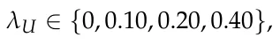

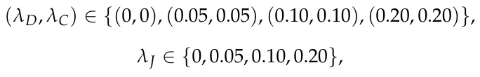

and

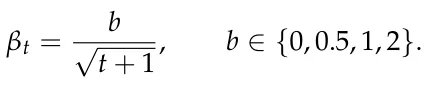

The default configuration was *λ*U = 0.20, (*λ*D, *λ*C) = (0.10, 0.10), *λ*J = 0.05, and *b* = 1. Within each analysis, only the indicated parameter or parameter pair was changed; all other DEPO and simulation parameters retained their default values.

Each configuration was evaluated in the stable, emerging-field, scientific-monoculture, and budget-shock environments using *N*MC = 100 Monte Carlo replications. The analysis used common random numbers: within each replication, all parameter configurations were evaluated on the same synthetic department and with the same environment-specific random-number stream. This pairing reduces variation caused by different generated departments or stochastic shocks and makes the observed differences more directly attributable to the tested parameter. Performance was evaluated using the same metrics as in the main experiments: cumulative scientometric return (CSR), oracle regret (Reg), normalized topic diversity (Div), topic concentration (Conc), and average allocation volatility (Vol).

Table A2 reports the complete results. The clearest and most systematic sensitivity pattern concerns the jointly varied diversity and concentration weights. Because *λ*D and *λ*C were varied together in this restricted analysis, the reported changes represent their combined effect and should not be interpreted as separately identifying the marginal contribution of entropy and concentration control. Increasing (*λ*D, *λ*C) from (0, 0) to (0.20, 0.20) increased diversity and reduced concentration in every environment. Diversity increased from 0.969 to 0.979 in the stable environment, from 0.970 to 0.979 in the emerging-field environment, from 0.969 to 0.980 in the monoculture environment, and from 0.947 to 0.965 under the budget shock. The corresponding concentration values decreased from 0.186 to 0.180, from 0.186 to 0.180, from 0.187 to 0.179, and from 0.202 to 0.189, respectively. These results verify that the diversity and concentration components affect the allocation in the intended direction. Importantly, the broader portfolio did not generate a uniform return penalty: the highest tested diversity/concentration setting produced CSR values equal to or greater than the default in all four environments, although the size of this difference was modest and should not be interpreted as establishing a universally optimal setting. The adjustment-cost sensitivity analysis also behaved consistently with its intended institutional interpretation. Comparing the endpoints *λ*J = 0 and *λ*J = 0.20, average allocation volatility decreased from 0.059 to 0.052 in the stable environment, from 0.061 to 0.052 in the emerging-field environment, from 0.057 to 0.051 in the monoculture environment, and from 0.070 to 0.064 in the budget-shock environment. The associated changes in CSR and regret were comparatively small and were not monotonic across environments. Hence, *λ*J provides a genuine smoothness-control mechanism, but choosing it involves an institutional trade-off rather than a universally superior numerical value.

<figure class="table-figure" id="table-a2">
<figcaption><strong>Table A2.</strong> Restricted one-factor-at-a-time sensitivity analysis of DEPO. Values report mean <em>±</em> standard error across Monte Carlo replications. Only the indicated parameter group changes; all remaining parameters retain their default values.</figcaption>

<table><tr><th>Environment</th><th>Parameter</th><th>Setting</th><th>CSR</th><th>Reg</th><th>Div</th><th>Conc</th><th>Vol</th></tr><tr><td>Stable</td><td>λU</td><td>0.00</td><td>121.92 ± 1.05</td><td>3.41 ± 0.45</td><td>0.975 ± 0.002</td><td>0.183 ± 0.001</td><td>0.059 ± 0.004</td></tr><tr><td>Stable</td><td>λU</td><td>0.10</td><td>122.52 ± 1.06</td><td>2.88 ± 0.41</td><td>0.976 ± 0.001</td><td>0.182 ± 0.001</td><td>0.058 ± 0.004</td></tr><tr><td>Stable</td><td>λU</td><td>0.20</td><td>122.23 ± 1.05</td><td>2.93 ± 0.39</td><td>0.975 ± 0.002</td><td>0.183 ± 0.001</td><td>0.055 ± 0.004</td></tr><tr><td>Stable</td><td>λU</td><td>0.40</td><td>122.43 ± 1.06</td><td>2.93 ± 0.39</td><td>0.974 ± 0.002</td><td>0.183 ± 0.001</td><td>0.054 ± 0.004</td></tr><tr><td>Stable</td><td>(λD, λC)</td><td>(0.00, 0.00)</td><td>122.14 ± 1.15</td><td>3.36 ± 0.43</td><td>0.969 ± 0.002</td><td>0.186 ± 0.001</td><td>0.059 ± 0.004</td></tr><tr><td>Stable</td><td>(λD, λC)</td><td>(0.05, 0.05)</td><td>122.34 ± 1.04</td><td>3.19 ± 0.42</td><td>0.973 ± 0.002</td><td>0.184 ± 0.001</td><td>0.058 ± 0.004</td></tr><tr><td>Stable</td><td>(λD, λC)</td><td>(0.10, 0.10)</td><td>122.23 ± 1.05</td><td>2.93 ± 0.39</td><td>0.975 ± 0.002</td><td>0.183 ± 0.001</td><td>0.055 ± 0.004</td></tr><tr><td>Stable</td><td>(λD, λC)</td><td>(0.20, 0.20)</td><td>122.76 ± 1.12</td><td>2.84 ± 0.43</td><td>0.979 ± 0.001</td><td>0.180 ± 0.001</td><td>0.055 ± 0.004</td></tr><tr><td>Stable</td><td>λJ</td><td>0.00</td><td>122.50 ± 1.04</td><td>3.10 ± 0.44</td><td>0.974 ± 0.002</td><td>0.184 ± 0.001</td><td>0.059 ± 0.004</td></tr><tr><td>Stable</td><td>λJ</td><td>0.05</td><td>122.23 ± 1.05</td><td>2.93 ± 0.39</td><td>0.975 ± 0.002</td><td>0.183 ± 0.001</td><td>0.055 ± 0.004</td></tr><tr><td>Stable</td><td>λJ</td><td>0.10</td><td>122.07 ± 1.08</td><td>3.20 ± 0.44</td><td>0.975 ± 0.002</td><td>0.183 ± 0.001</td><td>0.057 ± 0.004</td></tr><tr><td>Stable</td><td>λJ</td><td>0.20</td><td>122.17 ± 1.09</td><td>3.28 ± 0.48</td><td>0.974 ± 0.002</td><td>0.184 ± 0.001</td><td>0.052 ± 0.003</td></tr><tr><td>Stable</td><td>b</td><td>0.0</td><td>121.33 ± 1.03</td><td>3.72 ± 0.46</td><td>0.976 ± 0.001</td><td>0.182 ± 0.001</td><td>0.061 ± 0.004</td></tr><tr><td>Stable</td><td>b</td><td>0.5</td><td>122.44 ± 0.99</td><td>3.09 ± 0.47</td><td>0.974 ± 0.002</td><td>0.183 ± 0.001</td><td>0.057 ± 0.004</td></tr><tr><td>Stable</td><td>b</td><td>1.0</td><td>122.23 ± 1.05</td><td>2.93 ± 0.39</td><td>0.975 ± 0.002</td><td>0.183 ± 0.001</td><td>0.055 ± 0.004</td></tr><tr><td>Stable</td><td>b</td><td>2.0</td><td>122.13 ± 1.10</td><td>3.38 ± 0.44</td><td>0.976 ± 0.002</td><td>0.182 ± 0.001</td><td>0.051 ± 0.003</td></tr><tr><td>Emerging-field</td><td>λU</td><td>0.00</td><td>121.64 ± 1.08</td><td>3.97 ± 0.46</td><td>0.974 ± 0.002</td><td>0.183 ± 0.001</td><td>0.060 ± 0.004</td></tr><tr><td>Emerging-field</td><td>λU</td><td>0.10</td><td>121.72 ± 1.15</td><td>3.97 ± 0.50</td><td>0.975 ± 0.002</td><td>0.183 ± 0.001</td><td>0.059 ± 0.004</td></tr><tr><td>Emerging-field</td><td>λU</td><td>0.20</td><td>120.90 ± 1.14</td><td>4.58 ± 0.56</td><td>0.975 ± 0.002</td><td>0.183 ± 0.001</td><td>0.063 ± 0.004</td></tr><tr><td>Emerging-field</td><td>λU</td><td>0.40</td><td>121.19 ± 1.09</td><td>4.27 ± 0.48</td><td>0.976 ± 0.002</td><td>0.182 ± 0.001</td><td>0.056 ± 0.004</td></tr><tr><td>Emerging-field</td><td>(λD, λC)</td><td>(0.00, 0.00)</td><td>122.37 ± 1.07</td><td>3.95 ± 0.47</td><td>0.970 ± 0.002</td><td>0.186 ± 0.001</td><td>0.055 ± 0.003</td></tr><tr><td>Emerging-field</td><td>(λD, λC)</td><td>(0.05, 0.05)</td><td>121.83 ± 1.08</td><td>4.28 ± 0.52</td><td>0.972 ± 0.002</td><td>0.185 ± 0.001</td><td>0.061 ± 0.004</td></tr><tr><td>Emerging-field</td><td>(λD, λC)</td><td>(0.10, 0.10)</td><td>120.90 ± 1.14</td><td>4.58 ± 0.56</td><td>0.975 ± 0.002</td><td>0.183 ± 0.001</td><td>0.063 ± 0.004</td></tr><tr><td>Emerging-field</td><td>(λD, λC)</td><td>(0.20, 0.20)</td><td>122.42 ± 1.09</td><td>3.74 ± 0.47</td><td>0.979 ± 0.001</td><td>0.180 ± 0.001</td><td>0.057 ± 0.003</td></tr></table>

</figure>

<figure class="table-figure" id="table-a2b">
<figcaption><strong>Table A2.</strong> <em>Cont.</em></figcaption>

<table><tr><th>Environment</th><th>Parameter</th><th>Setting</th><th>CSR</th><th>Reg</th><th>Div</th><th>Conc</th><th>Vol</th></tr><tr><td>Emerging-field</td><td>λJ</td><td>0.00</td><td>121.95 ± 1.09</td><td>3.88 ± 0.51</td><td>0.974 ± 0.002</td><td>0.183 ± 0.001</td><td>0.061 ± 0.004</td></tr><tr><td>Emerging-field</td><td>λJ</td><td>0.05</td><td>120.90 ± 1.14</td><td>4.58 ± 0.56</td><td>0.975 ± 0.002</td><td>0.183 ± 0.001</td><td>0.063 ± 0.004</td></tr><tr><td>Emerging-field</td><td>λJ</td><td>0.10</td><td>121.54 ± 1.17</td><td>4.03 ± 0.50</td><td>0.975 ± 0.002</td><td>0.182 ± 0.001</td><td>0.056 ± 0.003</td></tr><tr><td>Emerging-field</td><td>λJ</td><td>0.20</td><td>122.08 ± 1.14</td><td>3.78 ± 0.52</td><td>0.975 ± 0.002</td><td>0.183 ± 0.001</td><td>0.052 ± 0.003</td></tr><tr><td>Emerging-field</td><td>b</td><td>0.0</td><td>121.90 ± 1.13</td><td>4.20 ± 0.51</td><td>0.976 ± 0.001</td><td>0.182 ± 0.001</td><td>0.061 ± 0.004</td></tr><tr><td>Emerging-field</td><td>b</td><td>0.5</td><td>121.48 ± 1.05</td><td>4.00 ± 0.51</td><td>0.975 ± 0.001</td><td>0.182 ± 0.001</td><td>0.061 ± 0.004</td></tr><tr><td>Emerging-field</td><td>b</td><td>1.0</td><td>120.90 ± 1.14</td><td>4.58 ± 0.56</td><td>0.975 ± 0.002</td><td>0.183 ± 0.001</td><td>0.063 ± 0.004</td></tr><tr><td>Emerging-field</td><td>b</td><td>2.0</td><td>122.04 ± 1.07</td><td>3.74 ± 0.48</td><td>0.976 ± 0.002</td><td>0.182 ± 0.001</td><td>0.050 ± 0.003</td></tr><tr><td>Monoculture</td><td>λU</td><td>0.00</td><td>126.87 ± 1.22</td><td>3.39 ± 0.44</td><td>0.974 ± 0.002</td><td>0.184 ± 0.001</td><td>0.057 ± 0.004</td></tr><tr><td>Monoculture</td><td>λU</td><td>0.10</td><td>127.01 ± 1.20</td><td>3.21 ± 0.43</td><td>0.974 ± 0.002</td><td>0.184 ± 0.001</td><td>0.057 ± 0.004</td></tr><tr><td>Monoculture</td><td>λU</td><td>0.20</td><td>126.49 ± 1.25</td><td>3.32 ± 0.45</td><td>0.973 ± 0.002</td><td>0.184 ± 0.001</td><td>0.055 ± 0.004</td></tr><tr><td>Monoculture</td><td>λU</td><td>0.40</td><td>126.66 ± 1.20</td><td>3.21 ± 0.44</td><td>0.973 ± 0.002</td><td>0.184 ± 0.001</td><td>0.051 ± 0.004</td></tr><tr><td>Monoculture</td><td>(λD, λC)</td><td>(0.00, 0.00)</td><td>125.91 ± 1.20</td><td>3.62 ± 0.48</td><td>0.969 ± 0.002</td><td>0.187 ± 0.001</td><td>0.058 ± 0.004</td></tr><tr><td>Monoculture</td><td>(λD, λC)</td><td>(0.05, 0.05)</td><td>126.57 ± 1.18</td><td>3.24 ± 0.45</td><td>0.971 ± 0.002</td><td>0.185 ± 0.001</td><td>0.059 ± 0.004</td></tr><tr><td>Monoculture</td><td>(λD, λC)</td><td>(0.10, 0.10)</td><td>126.49 ± 1.25</td><td>3.32 ± 0.45</td><td>0.973 ± 0.002</td><td>0.184 ± 0.001</td><td>0.055 ± 0.004</td></tr><tr><td>Monoculture</td><td>(λD, λC)</td><td>(0.20, 0.20)</td><td>127.22 ± 1.24</td><td>3.35 ± 0.48</td><td>0.980 ± 0.001</td><td>0.179 ± 0.001</td><td>0.055 ± 0.004</td></tr><tr><td>Monoculture</td><td>λJ</td><td>0.00</td><td>127.59 ± 1.19</td><td>2.77 ± 0.39</td><td>0.975 ± 0.002</td><td>0.183 ± 0.001</td><td>0.057 ± 0.004</td></tr><tr><td>Monoculture</td><td>λJ</td><td>0.05</td><td>126.49 ± 1.25</td><td>3.32 ± 0.45</td><td>0.973 ± 0.002</td><td>0.184 ± 0.001</td><td>0.055 ± 0.004</td></tr><tr><td>Monoculture</td><td>λJ</td><td>0.10</td><td>127.44 ± 1.32</td><td>3.58 ± 0.53</td><td>0.975 ± 0.002</td><td>0.183 ± 0.001</td><td>0.051 ± 0.003</td></tr><tr><td>Monoculture</td><td>λJ</td><td>0.20</td><td>126.97 ± 1.12</td><td>3.44 ± 0.46</td><td>0.975 ± 0.002</td><td>0.183 ± 0.001</td><td>0.051 ± 0.003</td></tr><tr><td>Monoculture</td><td>b</td><td>0.0</td><td>127.08 ± 1.19</td><td>2.98 ± 0.42</td><td>0.975 ± 0.001</td><td>0.182 ± 0.001</td><td>0.060 ± 0.004</td></tr><tr><td>Monoculture</td><td>b</td><td>0.5</td><td>127.24 ± 1.14</td><td>2.82 ± 0.39</td><td>0.973 ± 0.002</td><td>0.184 ± 0.001</td><td>0.060 ± 0.004</td></tr><tr><td>Monoculture</td><td>b</td><td>1.0</td><td>126.49 ± 1.25</td><td>3.32 ± 0.45</td><td>0.973 ± 0.002</td><td>0.184 ± 0.001</td><td>0.055 ± 0.004</td></tr><tr><td>Monoculture</td><td>b</td><td>2.0</td><td>127.35 ± 1.19</td><td>3.02 ± 0.39</td><td>0.974 ± 0.002</td><td>0.184 ± 0.001</td><td>0.049 ± 0.004</td></tr><tr><td>Budget shock</td><td>λU</td><td>0.00</td><td>109.97 ± 0.95</td><td>3.31 ± 0.44</td><td>0.960 ± 0.002</td><td>0.193 ± 0.002</td><td>0.071 ± 0.004</td></tr><tr><td>Budget shock</td><td>λU</td><td>0.10</td><td>110.15 ± 0.93</td><td>3.27 ± 0.47</td><td>0.962 ± 0.002</td><td>0.192 ± 0.002</td><td>0.069 ± 0.004</td></tr><tr><td>Budget shock</td><td>λU</td><td>0.20</td><td>109.36 ± 0.96</td><td>3.44 ± 0.49</td><td>0.958 ± 0.003</td><td>0.194 ± 0.002</td><td>0.067 ± 0.003</td></tr><tr><td>Budget shock</td><td>λU</td><td>0.40</td><td>109.53 ± 1.00</td><td>3.51 ± 0.44</td><td>0.961 ± 0.002</td><td>0.192 ± 0.002</td><td>0.065 ± 0.003</td></tr><tr><td>Budget shock</td><td>(λD, λC)</td><td>(0.00, 0.00)</td><td>109.98 ± 0.99</td><td>3.52 ± 0.48</td><td>0.947 ± 0.003</td><td>0.202 ± 0.002</td><td>0.075 ± 0.004</td></tr><tr><td>Budget shock</td><td>(λD, λC)</td><td>(0.05, 0.05)</td><td>110.24 ± 1.00</td><td>3.18 ± 0.42</td><td>0.954 ± 0.003</td><td>0.197 ± 0.002</td><td>0.072 ± 0.004</td></tr><tr><td>Budget shock</td><td>(λD, λC)</td><td>(0.10, 0.10)</td><td>109.36 ± 0.96</td><td>3.44 ± 0.49</td><td>0.958 ± 0.003</td><td>0.194 ± 0.002</td><td>0.067 ± 0.003</td></tr><tr><td>Budget shock</td><td>(λD, λC)</td><td>(0.20, 0.20)</td><td>110.75 ± 0.92</td><td>2.78 ± 0.40</td><td>0.965 ± 0.002</td><td>0.189 ± 0.002</td><td>0.071 ± 0.003</td></tr><tr><td>Budget shock</td><td>λJ</td><td>0.00</td><td>110.46 ± 0.99</td><td>3.05 ± 0.45</td><td>0.957 ± 0.003</td><td>0.195 ± 0.002</td><td>0.070 ± 0.003</td></tr><tr><td>Budget shock</td><td>λJ</td><td>0.05</td><td>109.36 ± 0.96</td><td>3.44 ± 0.49</td><td>0.958 ± 0.003</td><td>0.194 ± 0.002</td><td>0.067 ± 0.003</td></tr><tr><td>Budget shock</td><td>λJ</td><td>0.10</td><td>109.45 ± 0.99</td><td>3.31 ± 0.47</td><td>0.964 ± 0.002</td><td>0.191 ± 0.001</td><td>0.066 ± 0.003</td></tr><tr><td>Budget shock</td><td>λJ</td><td>0.20</td><td>109.98 ± 0.91</td><td>3.52 ± 0.46</td><td>0.961 ± 0.002</td><td>0.192 ± 0.002</td><td>0.064 ± 0.003</td></tr><tr><td>Budget shock</td><td>b</td><td>0.0</td><td>109.80 ± 0.87</td><td>3.28 ± 0.45</td><td>0.959 ± 0.002</td><td>0.194 ± 0.002</td><td>0.079 ± 0.004</td></tr><tr><td>Budget shock</td><td>b</td><td>0.5</td><td>109.87 ± 0.97</td><td>3.39 ± 0.44</td><td>0.957 ± 0.002</td><td>0.195 ± 0.002</td><td>0.072 ± 0.004</td></tr><tr><td>Budget shock</td><td>b</td><td>1.0</td><td>109.36 ± 0.96</td><td>3.44 ± 0.49</td><td>0.958 ± 0.003</td><td>0.194 ± 0.002</td><td>0.067 ± 0.003</td></tr><tr><td>Budget shock</td><td>b</td><td>2.0</td><td>110.18 ± 0.97</td><td>3.21 ± 0.42</td><td>0.960 ± 0.002</td><td>0.193 ± 0.002</td><td>0.065 ± 0.003</td></tr></table>

</figure>

## References

1. Chen, C.l.; Bullington, S.F. Development of a strategic research plan for an academic department through the use of quality function deployment. Comput. Ind. Eng. 1993, 25, 49–52. [doi:10.1016/0360-8352(93)90218-m](https://doi.org/10.1016/0360-8352%2893%2990218-m)
2. Nguyen, H.T.L.; Van Gramberg, B. University strategic research planning: A key to reforming university research in Vietnam? Stud. High. Educ. 2018, 43, 2130–2147.
3. Arnold, E.; Rush, H.; Bessant, J.; Hobday, M. Strategic planning in research and technology institutes. R D Manag. 1998, 28, 89–100. [doi:10.1111/1467-9310.00085](https://doi.org/10.1111/1467-9310.00085)
4. Santos, J.L. Resource allocation in public research universities. Rev. High. Educ. 2007, 30, 125–144. [doi:10.1353/rhe.2006.0077](https://doi.org/10.1353/rhe.2006.0077)
5. Liverpool, L.S.; Eseyin, E.; Opara, E. Modelling for resource allocation to departments and faculties in African universities. High. Educ. 1998, 36, 139–153. [doi:10.1023/a:1003251629680](https://doi.org/10.1023/a:1003251629680)
6. Markowitz, H. Portfolio Selection. J. Financ. 1952, 7, 77–91. [doi:10.1111/j.1540-6261.1952.tb01525.x](https://doi.org/10.1111/j.1540-6261.1952.tb01525.x)
7. Black, F.; Litterman, R. Global Portfolio Optimization. Financ. Anal. J. 1992, 48, 28–43. [doi:10.2469/faj.v48.n5.28](https://doi.org/10.2469/faj.v48.n5.28)
8. Drew, D.E.; Karpf, R. Ranking academic departments: Empirical findings and a theoretical perspective. Res. High. Educ. 1981, 14, 305–320. [doi:10.1007/bf00976681](https://doi.org/10.1007/bf00976681)
9. Masuoka, N.; Grofman, B.; Feld, S.L. Ranking Departments: A Comparison of AlternativeApproaches. PS Political Sci. Politics 2007, 40, 531–537. [doi:10.1017/s1049096507070825](https://doi.org/10.1017/s1049096507070825)
10. Meyers, M.A.; Quan, H. The use of the h-index to evaluate and rank academic departments. J. Mater. Res. Technol. 2017, 6, 304–311. [doi:10.1016/j.jmrt.2017.09.004](https://doi.org/10.1016/j.jmrt.2017.09.004)
11. Hirsch, J.E. An Index to Quantify an Individual’s Scientific Research Output. Proc. Natl. Acad. Sci. USA 2005, 102, 16569–16572. [doi:10.1073/pnas.0507655102](https://doi.org/10.1073/pnas.0507655102)
12. Rosenfeld, A.; Alexi, A.; Mushiev, L.; Lazebnik, T. The Academic Midas Touch: A citation-based indicator of research excellence. J. Data Inf. Sci. 2025, 10, 78–91. [doi:10.2478/jdis-2025-0038](https://doi.org/10.2478/jdis-2025-0038)
13. Waltman, L. A Review of the Literature on Citation Impact Indicators. J. Inf. 2016, 10, 365–391. [doi:10.1016/j.joi.2016.02.007](https://doi.org/10.1016/j.joi.2016.02.007)
14. Garfield, E. Citation Analysis as a Tool in Journal Evaluation. Science 1972, 178, 471–479. [doi:10.1126/science.178.4060.471](https://doi.org/10.1126/science.178.4060.471)
15. Fortunato, S.; Bergstrom, C.T.; Börner, K.; Evans, J.A.; Helbing, D.; Milojevíc, S.; Petersen, A.M.; Radicchi, F.; Sinatra, R.; Uzzi, B.; et al. Science of Science. Science 2018, 359, eaao0185. [doi:10.1126/science.aao0185](https://doi.org/10.1126/science.aao0185)
16. Lazebnik, T.; Beck, S.; Shami, L. Academic co-authorship is a risky game. Scientometrics 2023, 128, 6495–6507. [doi:10.1007/s11192-023-04843-x](https://doi.org/10.1007/s11192-023-04843-x)
17. Goldstein, K.; Yair, G.; Rotem, N. Mount Horribilis: Examining Productivity Gaps in American Research Universities. High. Educ. 2026. [doi:10.1007/s10734-026-01665-7](https://doi.org/10.1007/s10734-026-01665-7)
18. Jacob, B.A.; Lefgren, L. The Impact of Research Grant Funding on Scientific Productivity. J. Public Econ. 2011, 95, 1168–1177. [doi:10.1016/j.jpubeco.2011.05.005](https://doi.org/10.1016/j.jpubeco.2011.05.005)
19. Hottenrott, H.; Lawson, C. Fishing for Complementarities: Research Grants and Research Productivity. Int. J. Ind. Organ. 2017, 51, 1–38. [doi:10.1016/j.ijindorg.2016.12.004](https://doi.org/10.1016/j.ijindorg.2016.12.004)
20. Gush, J.; Jaffe, A.B.; Larsen, V.; Laws, A. The Effect of Public Funding on Research Output: The New Zealand Marsden Fund. New Zealand Econ. Pap. 2018, 52, 227–248. [doi:10.1080/00779954.2017.1325921](https://doi.org/10.1080/00779954.2017.1325921)
21. March, J.G. Exploration and Exploitation in Organizational Learning. Organ. Sci. 1991, 2, 71–87. [doi:10.1287/orsc.2.1.71](https://doi.org/10.1287/orsc.2.1.71)
22. Auer, P.; Cesa-Bianchi, N.; Fischer, P. Finite-Time Analysis of the Multiarmed Bandit Problem. Mach. Learn. 2002, 47, 235–256. [doi:10.1023/A:1013689704352](https://doi.org/10.1023/A:1013689704352)
23. Lazebnik, T.; Iny, O. Temporal graphs anomaly emergence detection: Benchmarking for social media interactions. Appl. Intell. 2024, 54, 12347–12356. [doi:10.1007/s10489-024-05821-3](https://doi.org/10.1007/s10489-024-05821-3)
24. Cohen, W.M.; Levinthal, D.A. Absorptive Capacity: A New Perspective on Learning and Innovation. Adm. Sci. Q. 1990, 35, 128–152. [doi:10.2307/2393553](https://doi.org/10.2307/2393553)
25. Powell, W.W.; Koput, K.W.; Smith-Doerr, L. Interorganizational Collaboration and the Locus of Innovation: Networks of Learning in Biotechnology. Adm. Sci. Q. 1996, 41, 116–145. [doi:10.2307/2393988](https://doi.org/10.2307/2393988)
26. Uzzi, B.; Mukherjee, S.; Stringer, M.; Jones, B. Atypical Combinations and Scientific Impact. Science 2013, 342, 468–472. [doi:10.1126/science.1240474](https://doi.org/10.1126/science.1240474)
27. Wang, D.; Song, C.; Barabási, A.L. Quantifying Long-Term Scientific Impact. Science 2013, 342, 127–132. [doi:10.1126/science.1237825](https://doi.org/10.1126/science.1237825)
28. Azoulay, P.; Graff Zivin, J.S.; Manso, G. Incentives and Creativity: Evidence from the Academic Life Sciences. RAND J. Econ. 2011, 42, 527–554. [doi:10.1111/j.1756-2171.2011.00140.x](https://doi.org/10.1111/j.1756-2171.2011.00140.x)
29. Stephan, P. How Economics Shapes Science; Harvard University Press: Cambridge, MA, USA, 2012.
30. Shami, L.; Lazebnik, T. Financing and managing epidemiological-economic crises: Are we ready for another outbreak? J. Policy Model. 2023, 45, 74–89. [doi:10.1016/j.jpolmod.2023.02.003](https://doi.org/10.1016/j.jpolmod.2023.02.003)
31. Deb, K.; Pratap, A.; Agarwal, S.; Meyarivan, T. A Fast and Elitist Multiobjective Genetic Algorithm: NSGA-II. IEEE Trans. Evol. Comput. 2002, 6, 182–197. [doi:10.1109/4235.996017](https://doi.org/10.1109/4235.996017)
32. Wu, L.; Wang, D.; Evans, J.A. Large Teams Develop and Small Teams Disrupt Science and Technology. Nature 2019, 566, 378–382. [doi:10.1038/s41586-019-0941-9](https://doi.org/10.1038/s41586-019-0941-9)
33. Evans, J.A.; Foster, J.G. Metaknowledge. Science 2011, 331, 721–725. [doi:10.1126/science.1201765](https://doi.org/10.1126/science.1201765)
34. Nemhauser, G.L.; Wolsey, L.A.; Fisher, M.L. An Analysis of Approximations for Maximizing Submodular Set Functions—I. Math. Program. 1978, 14, 265–294. [doi:10.1007/BF01588971](https://doi.org/10.1007/BF01588971)
35. Ben-Tal, A.; Nemirovski, A. Robust Convex Optimization. Math. Oper. Res. 1998, 23, 769–805. [doi:10.1287/moor.23.4.769](https://doi.org/10.1287/moor.23.4.769)
36. Sutton, R.S.; Barto, A.G. Reinforcement Learning: An Introduction, 2nd ed.; MIT Press: Cambridge, MA, USA , 2018.
37. Frank, M.; Wolfe, P. An Algorithm for Quadratic Programming. Nav. Res. Logist. Q. 1956, 3, 95–110. [doi:10.1002/nav.3800030109](https://doi.org/10.1002/nav.3800030109)
38. Jaggi, M. Revisiting Frank-Wolfe: Projection-Free Sparse Convex Optimization. In Proceedings of the 30th International Conference on Machine Learning; JMLR.org: Brookline, MA, USA, 2013; pp. 427–435.
39. Ravenscroft, J.; Liakata, M.; Clare, A.; Duma, D. Measuring scientific impact beyond academia: An assessment of existing impact metrics and proposed improvements. PLoS ONE 2017, 12, e0173152. [doi:10.1371/journal.pone.0173152](https://doi.org/10.1371/journal.pone.0173152)
40. Semenzato, G.; Rizzato, G.; Agostini, C. Impact factor as measure of scientific quality. Am. J. Respir. Crit. Care Med. 2004, 169, 1070–1071. [doi:10.1164/ajrccm.169.9.950](https://doi.org/10.1164/ajrccm.169.9.950)
41. Bollen, J.; Van de Sompel, H.; Hagberg, A.; Chute, R. A principal component analysis of 39 scientific impact measures. PLoS ONE 2009, 4, e6022. [doi:10.1371/journal.pone.0006022](https://doi.org/10.1371/journal.pone.0006022)
42. Shubert, E. Use and misuse of the Impact Factor. Syst. Biodivers. 2012, 10, 391–394. [doi:10.1080/14772000.2012.753716](https://doi.org/10.1080/14772000.2012.753716)
43. Pendlebury, D.A. The use and misuse of journal metrics and other citation indicators. Arch. Immunol. Ther. Exp. 2009, 57, 1–11. [doi:10.1007/s00005-009-0008-y](https://doi.org/10.1007/s00005-009-0008-y)
44. Lazebnik, T.; Rosenfeld, A. How lonely or influential is the Lone Wolf? An analysis of individual scholars’ solo-authorship dynamics. Scientometrics 2025, 130, 3053–3069. [doi:10.1007/s11192-025-05332-z](https://doi.org/10.1007/s11192-025-05332-z)
45. Alexi, A.; Lazebnik, T.; Rosenfeld, A. The scientometrics and reciprocality underlying co-authorship panels in Google Scholar profiles. Scientometrics 2024, 129, 3303–3313. [doi:10.1007/s11192-024-05026-y](https://doi.org/10.1007/s11192-024-05026-y)
46. Moed, H.F. Citation Analysis in Research Evaluation; Springer: Dordrecht, The Netherlands, 2005. [doi:10.1007/1-4020-3714-7](https://doi.org/10.1007/1-4020-3714-7)
47. Seglen, P.O. Why the Impact Factor of Journals Should Not Be Used for Evaluating Research. BMJ 1997, 314, 497–502. [doi:10.1136/bmj.314.7079.497](https://doi.org/10.1136/bmj.314.7079.497)
48. van Raan, A.F.J. Fatal Attraction: Conceptual and Methodological Problems in the Ranking of Universities by Bibliometric Methods. Scientometrics 2005, 62, 133–143. [doi:10.1007/s11192-005-0008-6](https://doi.org/10.1007/s11192-005-0008-6)
49. Bornmann, L.; Daniel, H.D. What Do Citation Counts Measure? A Review of Studies on Citing Behavior. J. Doc. 2008, 64, 45–80. [doi:10.1108/00220410810844150](https://doi.org/10.1108/00220410810844150)
50. Tahamtan, I.; Bornmann, L. What Do Citation Counts Measure? An Updated Review of Studies on Citations in Scientific Documents Published between 2006 and 2018. Scientometrics 2019, 121, 1635–1684. [doi:10.1007/s11192-019-03243-4](https://doi.org/10.1007/s11192-019-03243-4)
51. Hicks, D.; Wouters, P.; Waltman, L.; de Rijcke, S.; Rafols, I. Bibliometrics: The Leiden Manifesto for Research Metrics. Nature 2015, 520, 429–431. [doi:10.1038/520429a](https://doi.org/10.1038/520429a)
52. Cagan, R. The San Francisco Declaration on Research Assessment. Dis. Model. Mech. 2013, 6, 869–870. [doi:10.1242/dmm.012955](https://doi.org/10.1242/dmm.012955)
53. Priem, J.; Taraborelli, D.; Groth, P.; Neylon, C. Altmetrics: A Manifesto. 2010. Available online: https://zenodo.org/records/12684249 (accessed on 29 July 2026 ). [link](https://zenodo.org/records/12684249)
54. Piwowar, H. Altmetrics: Value All Research Products. Nature 2013, 493, 159. [doi:10.1038/493159a](https://doi.org/10.1038/493159a)
55. Cronin, B.; Sugimoto, C.R. (Eds.) Beyond Bibliometrics: Harnessing Multidimensional Indicators of Scholarly Impact; MIT Press: Cambridge, MA, USA, 2014.
56. Stephan, P.E. The economics of science. J. Econ. Lit. 1996, 34, 1199–1235.
57. Nelson, R.R. The Simple Economics of Basic Scientific Research. J. Political Econ. 1959, 67, 297–306. [doi:10.1086/258177](https://doi.org/10.1086/258177)
58. Arrow, K.J. Economic Welfare and the Allocation of Resources for Invention. In The Rate and Direction of Inventive Activity: Economic and Social Factors; Princeton University Press: Princeton, NJ, USA, 1962; pp. 609–626.
59. Dasgupta, P.; David, P.A. Toward a New Economics of Science. Res. Policy 1994, 23, 487–521. [doi:10.1016/0048-7333(94)01002-1](https://doi.org/10.1016/0048-7333%2894%2901002-1)
60. Rosenberg, N. Exploring the Black Box: Technology, Economics, and History; Cambridge University Press: Cambridge, UK, 1994.
61. Romer, P.M. Endogenous Technological Change. J. Political Econ. 1990, 98, S71–S102. [doi:10.1086/261725](https://doi.org/10.1086/261725)
62. Griliches, Z. Patent Statistics as Economic Indicators: A Survey. J. Econ. Lit. 1990, 28, 1661–1707.
63. Jaffe, A.B. Real Effects of Academic Research. Am. Econ. Rev. 1989, 79, 957–970.
64. Adams, J.D. Fundamental Stocks of Knowledge and Productivity Growth. J. Political Econ. 1990, 98, 673–702. [doi:10.1086/261702](https://doi.org/10.1086/261702)
65. Mansfield, E. Academic Research and Industrial Innovation. Res. Policy 1991, 20, 1–12. [doi:10.1016/0048-7333(91)90080-A](https://doi.org/10.1016/0048-7333%2891%2990080-A)
66. Pavitt, K. What Makes Basic Research Economically Useful? Res. Policy 1991, 20, 109–119. [doi:10.1016/0048-7333(91)90074-Z](https://doi.org/10.1016/0048-7333%2891%2990074-Z)
67. Gunjan, A.; Bhattacharyya, S. A brief review of portfolio optimization techniques. Artif. Intell. Rev. 2023, 56, 3847–3886. [doi:10.1007/s10462-022-10273-7](https://doi.org/10.1007/s10462-022-10273-7)
68. Ma, Y.; Mao, R.; Lin, Q.; Wu, P.; Cambria, E. Quantitative stock portfolio optimization by multi-task learning risk and return. Inf. Fusion 2024, 104, 102165. [doi:10.1016/j.inffus.2023.102165](https://doi.org/10.1016/j.inffus.2023.102165)
69. Tobin, J. Liquidity Preference as Behavior Towards Risk. Rev. Econ. Stud. 1958, 25, 65–86. [doi:10.2307/2296205](https://doi.org/10.2307/2296205)
70. Merton, R.C. An Analytic Derivation of the Efficient Portfolio Frontier. J. Financ. Quant. Anal. 1972, 7, 1851–1872. [doi:10.2307/2329621](https://doi.org/10.2307/2329621)
71. Jobson, J.D.; Korkie, B. Estimation for Markowitz Efficient Portfolios. J. Am. Stat. Assoc. 1980, 75, 544–554. [doi:10.1080/01621459.1980.10477507](https://doi.org/10.1080/01621459.1980.10477507)
72. Chopra, V.K.; Ziemba, W.T. The Effect of Errors in Means, Variances, and Covariances on Optimal Portfolio Choice. In Advances in Futures and Options Research; JAI Press: Greenwich, CT, USA, 1993; Volume 6, pp. 231–243.
73. Konno, H.; Yamazaki, H. Mean-Absolute Deviation Portfolio Optimization Model and Its Applications to Tokyo Stock Market. Manag. Sci. 1991, 37, 519–531. [doi:10.1287/mnsc.37.5.519](https://doi.org/10.1287/mnsc.37.5.519)
74. Rockafellar, R.T.; Uryasev, S. Optimization of Conditional Value-at-Risk. J. Risk 2000, 2, 21–41. [doi:10.21314/jor.2000.038](https://doi.org/10.21314/jor.2000.038)
75. Bertsimas, D.; Sim, M. The Price of Robustness. Oper. Res. 2004, 52, 35–53. [doi:10.1287/opre.1030.0065](https://doi.org/10.1287/opre.1030.0065)
76. Boyd, S.; Vandenberghe, L. Convex Optimization; Cambridge University Press: Cambridge, UK, 2004.
77. Hendricks, K.; McAfee, R.P. Measuring Industry Concentration in Intermediate Goods. 1999. Available online: http://papers.economics.ubc.ca/legacypapers/dp0001.pdf (accessed on 9 June 2026). [link](http://papers.economics.ubc.ca/legacypapers/dp0001.pdf)
78. Deb, K. Multi-Objective Optimization Using Evolutionary Algorithms; John Wiley & Sons: Hoboken, NJ, USA, 2001.
79. Marler, R.T.; Arora, J.S. Survey of Multi-Objective Optimization Methods for Engineering. Struct. Multidiscip. Optim. 2004, 26, 369–395. [doi:10.1007/s00158-003-0368-6](https://doi.org/10.1007/s00158-003-0368-6)
80. Campbell, D.T. Assessing the Impact of Planned Social Change. Eval. Program Plan. 1979, 2, 67–90. [doi:10.1016/0149-7189(79)90048-X](https://doi.org/10.1016/0149-7189%2879%2990048-X)
81. Shami, L.; Lazebnik, T. Implementing machine learning methods in estimating the size of the non-observed economy. Comput. Econ. 2024, 63, 1459–1476. [doi:10.1007/s10614-023-10369-4](https://doi.org/10.1007/s10614-023-10369-4)
82. Shami, L.; Lazebnik, T. Got much, got nothing: Analyzing the impact of increased special interest groups’ influence on utility. Eurasian Econ. Rev. 2025, 15, 1021–1044. [doi:10.1007/s40822-025-00316-z](https://doi.org/10.1007/s40822-025-00316-z)
83. Shami, L.; Lazebnik, T. Cooperative Game-Theoretic Framework for Sustainable UN Financing: An Application to Global Public Goods Provision. Economies 2026, 14, 263. [doi:10.3390/economies14070263](https://doi.org/10.3390/economies14070263)
84. Kearns, M.; Roth, A. The Ethical Algorithm: The Science of Socially Aware Algorithm Design; Oxford University Press: Oxford, UK, 2019.
