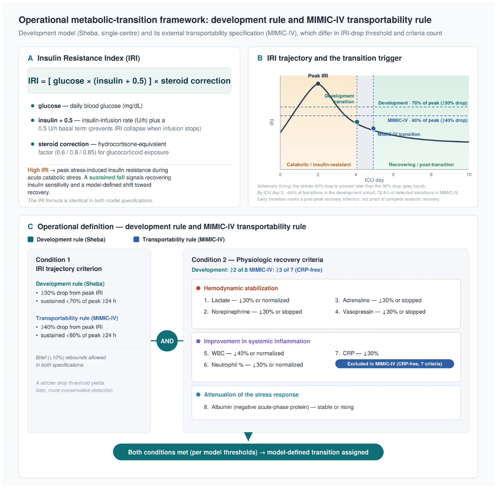
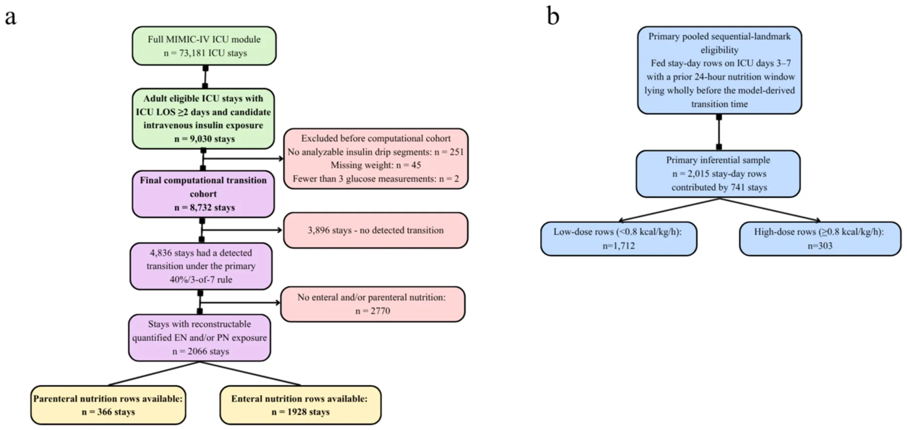
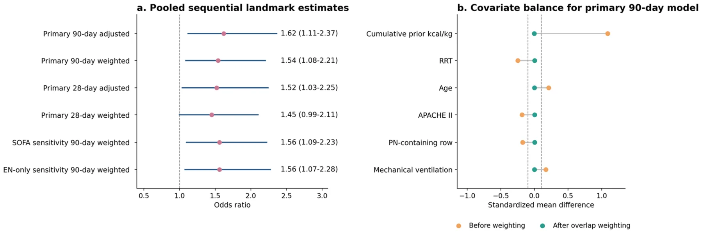
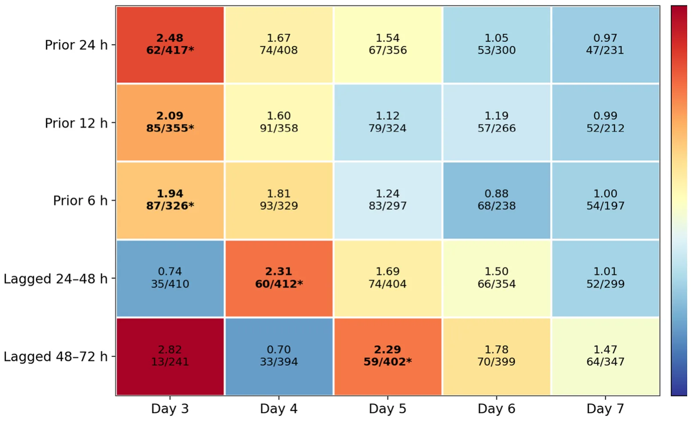

## 1. Background

Critical illness is characterized by marked neuroendocrine and inflam ammatory stress, with catecholamine excess, insulin resistance, substrate mobilization, and resistance to anabolic signaling [1–3]. In that setting, both the timing and the dose of nutritional support are biologically relevant because exogenous energy delivered before metabolic tolerance is restored may be handled differently from nutrition delivered later in recovery [1,2,4].

Current ICU nutrition guidance necessarily relies on generalized recommendations regarding when to start and how to advance feeding, yet randomized trials and mechanistic syntheses continue to caution against early high-dose feeding in unselected critically ill populations [2,4–7]. The practical clinical question is therefore not whether nutrition matters, but when an individual patient is metabolically ready for more aggressive delivery.

A recently published physiology-based framework proposed identifying the transition from early catabolism toward recovery using insulin-resistance dynamics together with concordant recovery signals [1]. The framework was based on the assumption that recovery from acute catabolic stress should appear as a post-peak improvement in insulin resistance accompanied by parallel clinical recovery signals, rather than as a single static laboratory value. In the parent model, the insulin-resistance index was calculated from glucose and insulin exposure with correction for corticosteroid effect, and candidate transition was considered only after the individual patient's IRI peak. Transition required a sustained decline in IRI from that peak together with concordant improvement in supportive physiological criteria reflec ecting hemodynamic stabilization, inflammatory resolution, and attenuation of the acute-phase response. The original derivation rule used a ≥30% post-peak IRI decline together with ≥2 of 8 supportive criteria, including lactate, vasopressor trajectories, inflam ammatory markers including CRP, and albumin trajectory (Fig. 1). Because MIMIC-IV did not support faithful implementation of all original components, particularly CRP, the present study used a prespecified ed CRP-free operational refinement of the framework. This transported rule required a stricter sustained post-peak IRI decline together with a greater number of concordant non-CRP recovery criteria, while preserving the original construct of insulin-resistance improvement accompanied by parallel physiological recovery (Fig. 1). The exact operational differences between the original and MIMIC-IV rules are detailed in the Methods and bridge analyses.

We hypothesized that, among critically ill patients classified ed as being in a pre-transition state by this prespecified ed MIMIC-operational version of the framework, higher recent EN/PN dose would be associated with higher subsequent mortality. The primary aim was to test this association using a pooled sequential-landmark design in MIMIC-IV. Secondary aims were to evaluate robustness across alternative transition specifica cations, adjustment strategies, and EN-only restriction, and to characterize the transportability limitations of the CRP-free operational rule.

## 2. Methods

### 2.1. Study design and data source

We performed a retrospective observational study in MIMIC-IV to evaluate the transportability of a CRP-free operational version of a previously derived physiology-based metabolic transition framework for transition-guided nutrition research. The original framework was developed using a steroid-corrected insulin-resistance index together with concordant recovery criteria. For external application in MIMIC-IV, we did not re-derive a new transition model. Instead, before fitting the outcome models reported here, we prespecified ed a C-reactive protein–free operational refine nement designed to preserve the underlying biological construct while accommodating transportability constraints and prior derivation-cohort nutrition-directed refi nement. This transported specifica cation, a stricter CRP-free refine nement of the original rule, is define ned in full under “Transported transition rule.” Supportive bridge analyses comparing the original rule, prespecified ed CRP-free candidate specifica cations, and the transported MIMIC-IV specifica cation are summarized in the Supplementary Appendix.

The study was designed as an external evaluation of a transition-guided nutrition framework, with the observational analysis structured to improve temporal alignment between nutrition exposure and subsequent outcomes while reducing selected measured biases. The primary inferential framework was a pooled sequential-landmark design, whereas analyses using stricter fixed exposure-window defini nitions were treated as secondary descriptive analyses. This approach was chosen to better match the clinical question and to reduce circularity between exposure timing and model-derived transition timing.

The underlying source frame was the full MIMIC-IV ICU module (73,181 ICU stays). The patient-level source extraction applied adult/eligible ICU-stay filtering, ICU length of stay of at least 2 days, and candidate intravenous insulin exposure, yielding 9030 candidate stays. Strict insulin-segment parsing then excluded 251 stays with no analyzable insulin drip segments, leaving 8779 stays; 45 additional stays were excluded for missing weight and 2 for fewer than 3 glucose measurements, leaving a final analytic cohort of 8732 stays (Fig. 2). Using the prespecified ed transported 40%/3-of-7 CRP-free rule, transition was detected in 4836 of these 8732 stays (55.4%).

At the source-package level, quantified ed nutrition was available only for stays with reconstructable enteral or parenteral nutrition rows. Overall, 2765 of 8732 stays (31.7%) had any quantified ed EN/PN rows, including 2556 with enteral rows and 448 with parenteral rows. Among transitioned stays, reconstructable quantified ed EN/PN rows were available in 2066 of 4836 stays. The primary pooled analysis was then restricted to fed stay-day rows from these transitioned stays on ICU days 3–7 whose prior 24-h nutrition window lay wholly before the derived transition time; this yielded 2015 rows contributed by 741 stays, including 303 high-dose rows from 165 stays. This denominator progression is shown in Fig. 2 and refle ects a restricted inferential subcohort nested within the broader computational cohort. To characterize potential selection related to nutrition charting completeness, retained stays with versus without reconstructable quantified ed EN/PN rows were compared descriptively (Supplementary Table S4).

<figure id="fig-1b">

<figcaption>Fig. 1. Panel A shows the insulin-resistance index (IRI), calculated from glucose and insulin exposure with corticosteroid correction. The same IRI structure was used in both model specifica cations. Panel B schematically illustrates the post-peak IRI decline criterion. The development rule required a sustained ≥30% decline from peak IRI, whereas the MIMIC-IV transportability rule required a stricter sustained ≥40% decline. Panel C summarizes the two-part operational defini nition: an IRI trajectory criterion plus concordant physiologic recovery criteria. The development model required ≥2 of 8 criteria, including CRP; the MIMIC-IV transportability specifica cation required ≥3 of 7 non-CRP criteria because CRP availability was limited. When both conditions were fulfill lled according to the relevant rule, a model-define ned transition point was assigned. The trajectory is schematic and is intended to explain the operational rule rather than display cohort-level IRI data. Abbreviations: CRP, C-reactive protein; ICU, intensive care unit; IRI, insulin-resistance index; WBC, white blood cell count.</figcaption>
</figure>

### 2.2. Derivation bridge and transport-ready specification

The original Sheba derivation program had already generated both the transition framework and the nutrition-timing hypothesis. Supportive bridge analyses are provided in the Supplementary Appendix for transparency but are outside the main MIMIC inferential family. These analyses compare the original 30% IRI drop/2-of-8 rule with a small prespecified ed set of CRP-free candidates in the derivation cohort, quantify how the 40% IRI drop/3-of- 7 specifica cation relates to the original construct, and summarize the behavior of a more permissive 30%/2-of-7 alternative in MIMIC. Their purpose is to document continuity and transportability, not to reopen unrestricted rule search.

<figure id="fig-2b">

<figcaption>Fig. 2. From 73,181 ICU stays in the MIMIC-IV ICU module, 9030 adult eligible stays with ICU length of stay ≥2 days and candidate intravenous insulin exposure were identified ed. After excluding 251 stays with no analyzable insulin drip segments, 45 with missing weight, and 2 with fewer than 3 glucose measurements, 8732 stays formed the computational transition cohort. Using the prespecified ed transported 40%/3-of-7 rule, transition was detected in 4836 stays. Reconstructable quantified ed enteral and/or parenteral nutrition rows were available in 2765 stays overall and in 2066 transitioned stays. The primary pooled sequential-landmark analysis was restricted to fed stay-day rows from transitioned stays on ICU days 3–7 whose prior 24-h nutrition window lay wholly before the model-derived transition time, yielding 2015 stay-day rows contributed by 741 stays, including 303 high-dose and 1712 lower-dose rows. Counts are stays unless otherwise indicated.</figcaption>
</figure>

The 40%/3-of-7 specifica cation was selected before the main MIMIC outcome modeling to favor construct specifici city in an external dataset with limited CRP availability. The higher IRI-decline threshold was chosen to reduce the chance that short-term glucose-insulin fluctuation would be classified ed as transition, whereas the requirement for 3 concordant criteria was chosen to avoid the permissiveness observed when only 2 supportive criteria were required. The 30%/3-of-7 rule was retained as a sensitivity analysis because it was the closest less-stringent CRP-free alternative. Its similar behavior in MIMIC-IV was interpreted as evidence of robustness of the transported construct, not as a reason to redefine ne the locked primary rule after outcome inspection.

### 2.3. Transported transition rule

The transported rule preserved the conceptual structure of the published model but operationalized a locked derivation-refine ned CRP-free specifica cation [1]. Operationally, the transported MIMIC- IV rule consisted of two required components. First, the patient's steroid-corrected IRI trajectory had to demonstrate a sustained post-peak decline of at least 40%, meaning that the IRI remained below 60% of the individual peak for at least 24 h, allowing only limited short rebounds. Second, at least 3 of 7 available non-CRP recovery criteria had to be fulfill lled during the same recovery period. These criteria represented three recovery domains: hemodynamic improvement, inflam ammatory improvement, and attenuation of the acute-phase response. The 7 non-CRP criteria were.

- 1. Lactate decrease or normalization;
- 2. Norepinephrine reduction or cessation;
- 3. Vasopressin reduction or cessation;
- 4. Epinephrine/adrenaline reduction or cessation;
- 5. WBC decrease or normalization;
- 6. Neutrophil percentage decrease or normalization;
- 7. Albumin stabilization or increase.

CRP was omitted because it was available in only 326/8732 stays (3.7%). Accordingly, the operational MIMIC rule required 3 of 7 observable non-CRP criteria rather than 3 of 8 original criteria. The object evaluated in the present study is therefore a locked derivation-refined CRP-free operational specifica cation within the published framework, not the untouched original rule. Supplementary bridge analyses place that refinement in context by comparing it with the original derivation rule, the closest CRP-free surrogate, and a more permissive alternative MIMIC candidate.

### 2.4. Nutrition extraction and exposure definitions

Quantified ed EN and PN were extracted conservatively from the locked package. EN capture relied on strict formula and feeding rows and excluded oral intake, flushes, medication carriers, and clearly non-nutritional entries. PN capture relied on strict PN bag rows and ingredient-level reconstruction where available. Route capture was audited against route-presence flags.

For the primary pooled analysis, recent nutrition dose was define ned as the average energy delivery in kcal/kg/h during the prior 24 h. High recent dose was define ned as at least 0.8 kcal/kg/h; the comparison group consisted of fed stay-day rows with lower recent dose. The primary exposure window had to lie wholly before the model-derived transition time. All kcal/kg/h calculations used the single stay-level weight variable and held constant within stay across windows. The package does not preserve whether that value originated from admission or an early ICU charted weight, which should be considered when interpreting weight-normalized dose.

### 2.5. Primary pooled sequential landmark framework

We emulated a sequence of day-specific c clinical decisions on ICU days 3–7 [8]. At each landmark, eligible rows were those from transitioned stays remaining alive and in the ICU, with quantified ed EN/PN delivery in the prior 24-h window and a prior-24-h window that lay wholly before transition. These rows were stacked into a pooled stay-day dataset. Because the same stay could contribute more than one landmark row, all outcome models used cluster-robust standard errors at the stay level.

The primary endpoint was 90-day all-cause mortality; 28-day mortality was prespecified ed as a key secondary endpoint. Ninety-day mortality was retained as the primary endpoint to align with the parent derivation program and to capture downstream clinical consequences of early nutritional exposure that may extend beyond short-term ICU mortality, whereas 28-day mortality was analyzed as the more proximal secondary endpoint.

The primary adjusted model included APACHE II, age, mechanical ventilation before the index window, renal replacement therapy before the index window, cumulative prior nutrition before window start, PN-containing nutrition, and landmark day. These variables were chosen because they are clinically relevant determinants of feeding intensity but are not themselves transition-defini ning physiologic components. As a prespecified ed adjusted secondary analysis, we estimated propensity scores using the same covariates and applied overlap weighting to improve measured covariate balance between high-dose and lower-dose rows [9]. Analyses were implemented in a custom Python workflow (pandas, numpy, and statsmodels, with a Streamlit interface), and cluster-robust standard errors were estimated at the stay level.

Prespecified ed sensitivity analyses replaced APACHE II with day-1 SOFA and restricted the pooled dataset to EN-only rows.

### 2.6. Secondary descriptive exact-window family

We also retained the exact-window family that classified ed recent EN/PN windows by their exact relation to transition and restricted inference to windows lying wholly before transition. This descriptive branch contained 30 day-window contrasts (5 ICU days × 6 window types) at the main threshold of 0.8 kcal/kg/h across ICU days 3–7 and the six prespecified ed windows (prior 6 h, prior 12 h, prior 24 h, lagged 24–48 h, lagged 48–72 h, and cumulative admission-to-day average). Benjamini-Hochberg false-discovery-rate control was applied across that 30-test family [10].

This descriptive exact-window family was not the main inferential analysis in the present revision; rather, it was used to map where the signal was concentrated in relation to the model-derived transition time.

## 3. Results

### 3.1. Cohort and analytic populations

Supplementary bridge analyses place the transported specifi cation in context. In the Sheba derivation cohort, the 40%/3-of-7 rule behaved as a stricter, slightly later transition-time subset of the original 30%/2-of-8 rule rather than as a distinct phenotype defini nition, while the pre-transition nutrition signal remained stable across the plausible 2-of-7 and 3-of-7 CRP-free candidates. In the derivation cohort, where CRP was available, the CRP-free rule reproduced the original construct as a strict subset: it detected no patient who was not also detected by the original rule (0 candidate-only of 2350; 99 original-only), agreed closely on timing among jointly detected patients (median absolute difference 0.079 days), and showed substantial detection agreement with the original rule (Cohen's κ = 0.72 for 40%/3-of-7, 0.84 for 30%/3-of-7, and 0.99 for the closest 30%/2-of-7 surrogate). The adjusted pre-transition nutrition odds ratio was essentially identical whether the original or refine ned rule define ned transition (1.20 [95% CI 0.98–1.48] vs 1.19 [0.96–1.46];Supplementary Table S1–S2). In MIMIC-IV, the more permissive 30%/2-of-7 specifica cation identified ed transition in 7103 of 8732 stays (81.3%), with a median transition time of 1.03 ICU days; 4799 detections (67.6%) met only the minimum 2-criterion threshold, suggesting relative permissiveness in the external cohort. By contrast, an additional 30%/3- of-7 CRP-free sensitivity behaved very similarly to the primary transported rule, detecting transition in 4870 of 8732 stays (55.8%) at a median of 1.51 ICU days and yielding a pooled fed prior-24-h pre-transition risk set of 2024 rows from 748 stays, with adjusted and overlap-weighted ORs for 90-day mortality of 1.58 (95% CI 1.08–2.31) and 1.49 (1.04–2.13), respectively. These findings supported retention of the stricter transported 40%/3-of-7 rule for the primary analysis while indicating that the main external permissiveness problem arose from lowering the concordant-criteria requirement to 2 rather than from using a 30% rather than 40% IRI-drop threshold. The similarity between the 30%/3-of-7 sensitivity and the 40%/3-of-7 primary rule was therefore interpreted as supporting robustness of the transported CRP-free construct rather than as justifica cation for changing the prespecified ed primary rule. Full bridge results are provided in the Supplementary Appendix.

### 3.2. Performance of the transported transition specification in

*MIMIC-IV*

Using the prespecified ed transported 40%/3-of-7 CRP-free rule, transition was detected in 4836 of 8732 stays (55.4%), at a median of 1.55 days from ICU admission (IQR 0.75–3.23). Among detected transitions, 35.4%, 59.9%, and 72.8% occurred by ICU days 1, 2, and 3, respectively; 79.3% met exactly 3 criteria and 20.7% met more than 3 criteria. This front-loaded distribution was therefore interpreted cautiously as early post-peak improvement in the recorded IRI/recovery-marker trajectory, not as evidence of complete anabolic recovery by day 3. In exploratory audit analyses, non-transition stays were characterized more by absent vasoactive exposure and shorter ICU observation time than by absence of inflam ammatory abnormalities. Most non-transition stays had no norepinephrine/epinephrine/vasopressin exposure, yet many still showed elevated lactate or leukocytosis, suggesting that failure to detect transition more often reflec ected lower hemodynamic-stress burden and limited trackable trajectory length than complete absence of stress biology.

Figure 2 summarizes the denominator flow for the primary analysis. Of 8732 retained stays, 4836 had a detected transition under the transported 40%/3-of-7 rule. Reconstructable quantified ed EN/PN rows were available in 2765 stays overall and in 2066 transitioned stays. The primary pooled fed whole-window pre-transition prior-24-h analysis was further restricted to 2015 stay-day rows contributed by 741 transitioned stays, of which 303 high-dose rows arose from 165 stays. Thus, the primary analysis was performed in a restricted transitioned subcohort with reconstructable quantified ed EN/PN exposure and landmark-eligible pre-transition windows, rather than in the full computational cohort.

Compared with retained stays without reconstructable EN/PN rows, those with quantified ed EN/PN rows represented a selected subset with similar age and APACHE II but substantially higher day-1 SOFA (10 [7–12] vs 7 [3,4,8,11]), more frequent mechanical ventilation (85.9% vs 79.8%) and RRT (32.2% vs 9.0%), markedly longer ICU stay (10.9 [6.8–17.4] vs 3.2 [2.3–4.3] days), more frequent detected transition (74.7% vs 46.4%), later transition timing among transitioned stays (2.5 [1.1–5.4] vs 1.2 [0.7–2.1] days), and higher 90-day mortality (35.8% vs 10.7%) (Supplementary Table S4). Therefore, the primary inferential sample should be interpreted as a selected nutrition-documented, higher-acuity subgroup nested within the computational transition cohort, rather than as representative of all retained MIMIC-IV ICU stays. In the pooled primary risk set, the high-dose rows had lower admission APACHE II than the low-dose rows (median 27 [IQR 22–32] vs 29 [23–34]) but identical day-1 SOFA (10 [7–12] in both groups). Unweighted cumulative prior nutrition differed substantially between groups, as expected for a treatment-intensity analysis, but overlap weighting eliminated measured imbalance across the prespecified ed covariates. Baseline characteristics of the pooled primary risk set are summarized in Table 1.

Values summarize the row-level pooled landmark dataset used in the primary models unless otherwise stated. Because one stay could contribute rows at multiple landmark days, row counts exceed unique-stay counts. A stay could also contribute both lower-dose and high-dose rows across different landmarks, so subgroup unique-stay counts do not sum to the overall unique-stay total. Because exposure was define ned in kcal/kg/h, lower body weight makes crossing the high-dose threshold more likely; residual confounding related to body size may therefore persist despite overlap weighting.

### 3.3. Primary pooled sequential landmark analysis

High recent dose in the pooled fed pre-transition prior-24-h dataset was associated with higher 90-day mortality. Crude 90- day mortality was 49.8% in the high-dose rows versus 39.5% in the lower-dose rows. The crude OR was 1.52 (95% CI 1.19–1.94; p = 0.0008), the parsimoniously adjusted OR was 1.62 (1.11–2.37; p = 0.013), and the overlap-weighted OR was 1.54 (1.08–2.21; p = 0.017).

The key secondary 28-day endpoint was directionally similar. Crude 28-day mortality was 38.0% in the high-dose rows versus 26.9% in the lower-dose rows. The crude OR was 1.66 (1.29–2.14; p = 0.0001), the adjusted OR was 1.52 (1.03–2.25; p = 0.036), and the overlap-weighted OR was 1.45 (0.99–2.11; p = 0.057), narrowly missing conventional statistical significa cance.

### 3.4. Sensitivity analyses and weighting diagnostics

Replacing APACHE II with day-1 SOFA yielded very similar estimates for both endpoints. For 90-day mortality, the SOFA-based adjusted OR was 1.64 (95% CI 1.11–2.41) and the overlap-weighted OR was 1.56 (1.09–2.23). For 28-day mortality, the SOFA-based adjusted OR was 1.54 (1.03–2.30) and the overlap-weighted OR was 1.46 (1.00–2.13).

In the EN-only sensitivity analysis, the 90-day association remained materially unchanged, with adjusted OR 1.63 (95% CI 1.09–2.44) and overlap-weighted OR 1.56 (1.07–2.28). For 28-day mortality, the EN-only estimates remained directionally harmful but were attenuated and less precise, with adjusted OR 1.43 (0.94–2.17) and overlap-weighted OR 1.37 (0.92–2.04).

Before weighting, the largest measured imbalance was observed for cumulative prior nutrition (standardized mean difference 1.07), with smaller imbalances in APACHE II, age, renal replacement therapy, PN-containing rows, and mechanical ventilation. After overlap weighting, measured covariates were balanced to near-zero standardized mean differences. Even so, the marked row imbalance (303 high-dose vs 1712 lower-dose) implies a smaller effective weighted sample; the primary overlap-weighted model corresponded to approximately 267 high-dose and 826 lower-dose row-equivalents. The main pooled estimates and prespecified ed sensitivity analyses are summarized in Table 2. The pooled effect estimates and covariate-balance diagnostics are shown in Fig. 3.

Because high-dose rows were lighter than lower-dose rows (median 75.0 vs 94.3 kg) and exposure was weight-normalized, we added a post hoc sensitivity analysis including body weight in both the adjusted and propensity/overlap models. Weight imbalance was eliminated (standardized mean difference − 0.93 →− 0.03), and the 90-day association was unchanged (adjusted OR 1.70, 95% CI 1.16–2.51; overlap-weighted OR 1.50, 1.05–2.15), with the 28-day endpoint remaining directionally consistent (overlap-weighted OR 1.41, 0.96–2.05).

### 3.5. Locked descriptive exact-window family

In the locked descriptive exact-window family at 0.8 kcal/kg/h, the pattern remained concentrated in windows lying immediately before transition or in the 24–72 h preceding transition for later transitioners. Five cells were retained after Benjamini-Hochberg false-discovery-rate control in the originally locked 30-test family (5 ICU days × 6 window types = 30 tests): day 3 prior 24 h (adjusted OR 2.48, 95% CI 1.37–4.49), day 3 prior 12 h (2.09, 1.23–3.56), day 3 prior 6 h (1.94, 1.14–3.29), day 4 lagged 24–48 h (2.31, 1.27–4.21), and day 5 lagged 48–72 h (2.29, 1.25–4.19). Across the remaining cells, most point estimates remained above 1, supporting concentration of the descriptive signal in recent pre-transition windows rather than complete dependence on a few isolated extreme estimates.

<figure class="table-figure" id="table-1">
<figcaption><strong>Table 1</strong> Baseline characteristics of the pooled fed whole-window pre-transition prior-24-h risk set.</figcaption>

<table><tr><th>Characteristic</th><th>Overall</th><th>Lower dose</th><th>High dose</th></tr><tr><td>Stay-day rows</td><td>2015</td><td>1712</td><td>303</td></tr><tr><td>Unique contributing stays</td><td>741</td><td>695</td><td>165</td></tr><tr><td>Age, y</td><td>65 [56–73]</td><td>64 [56–72]</td><td>68 [57–75]</td></tr><tr><td>Male sex</td><td>1201/2015 (59.6%)</td><td>987/1712 (57.7%)</td><td>214/303 (70.6%)</td></tr><tr><td>Weight, kg</td><td>90.6 [74.9–110.1]</td><td>94.3 [77.8–112.9]</td><td>75.0 [65.8–85.0]</td></tr><tr><td>APACHE II</td><td>29 [23–34]</td><td>29 [23–34]</td><td>27 [22–32]</td></tr><tr><td>SOFA day 1</td><td>10 [7–12]</td><td>10 [7–12]</td><td>10 [7–12]</td></tr><tr><td>Mechanical ventilation</td><td>1747/2015 (86.7%)</td><td>1472/1712 (86.0%)</td><td>275/303 (90.8%)</td></tr><tr><td>RRT</td><td>688/2015 (34.1%)</td><td>613/1712 (35.8%)</td><td>75/303 (24.8%)</td></tr><tr><td>Charlson index</td><td>6 [4–8]</td><td>6 [4–7]</td><td>6 [4–8]</td></tr><tr><td>PN-containing row</td><td>369/2015 (18.3%)</td><td>330/1712 (19.3%)</td><td>39/303 (12.9%)</td></tr><tr><td>Cumulative prior nutrition, kcal/kg</td><td>6.4 [0.4–21.6]</td><td>4.5 [0.1–16.5]</td><td>30.2 [14.7–50.4]</td></tr><tr><td>90-day mortality</td><td>828/2015 (41.1%)</td><td>677/1712 (39.5%)</td><td>151/303 (49.8%)</td></tr><tr><td>28-day mortality</td><td>576/2015 (28.6%)</td><td>461/1712 (26.9%)</td><td>115/303 (38.0%)</td></tr></table>

</figure>

<figure class="table-figure" id="table-2">
<figcaption><strong>Table 2</strong> Pooled sequential landmark analyses for high versus lower recent dose before transition.</figcaption>

<table><tr><th>Scenario</th><th>Endpoint</th><th>Fed n</th><th>High/low n</th><th>Crude OR (95% CI)</th><th>Adjusted OR (95% CI)</th><th>Weighted OR (95% CI)</th><th>Adjusted p</th><th>Weighted p</th></tr><tr><td>Primary</td><td>90-day mortality</td><td>2015</td><td>303/1712</td><td>1.52 (1.19–1.94)</td><td>1.62 (1.11–2.37)</td><td>1.54 (1.08–2.21)</td><td>0.013</td><td>0.017</td></tr><tr><td>Primary</td><td>28-day mortality</td><td>2015</td><td>303/1712</td><td>1.66 (1.29–2.14)</td><td>1.52 (1.03–2.25)</td><td>1.45 (0.99–2.11)</td><td>0.036</td><td>0.057</td></tr><tr><td>SOFA sensitivity</td><td>90-day mortality</td><td>2015</td><td>303/1712</td><td>1.52 (1.19–1.94)</td><td>1.64 (1.11–2.41)</td><td>1.56 (1.09–2.23)</td><td>0.012</td><td>0.014</td></tr><tr><td>SOFA sensitivity</td><td>28-day mortality</td><td>2015</td><td>303/1712</td><td>1.66 (1.29–2.14)</td><td>1.54 (1.03–2.30)</td><td>1.46 (1.00–2.13)</td><td>0.035</td><td>0.050</td></tr><tr><td>EN-only sensitivity</td><td>90-day mortality</td><td>1646</td><td>264/1382</td><td>1.48 (1.14–1.93)</td><td>1.63 (1.09–2.44)</td><td>1.56 (1.07–2.28)</td><td>0.018</td><td>0.021</td></tr><tr><td>EN-only sensitivity</td><td>28-day mortality</td><td>1646</td><td>264/1382</td><td>1.62 (1.23–2.13)</td><td>1.43 (0.94–2.17)</td><td>1.37 (0.92–2.04)</td><td>0.099</td><td>0.124</td></tr></table>

Adjusted models included APACHE II, age, mechanical ventilation, renal replacement therapy, cumulative prior nutrition, PN-containing row, and landmark day; the SOFA sensitivity substituted day-1 SOFA for APACHE II. Weighted models used overlap weighting based on the same covariate sets.

</figure>

<figure id="fig-3">

<figcaption><strong>Fig. 3.</strong> Pooled sequential-landmark analysis and weighting diagnostics Figure 3. Panel a shows the main pooled sequential landmark estimates and selected prespecified ed sensitivity analyses. Panel b shows covariate balance for the primary 90-day model before and after overlap weighting; the largest pre-weighting imbalance was for cumulative prior nutrition, whereas all measured covariates were effectively balanced after weighting.</figcaption>
</figure>

The pooled re-analysis therefore attenuated the magnitude of the association relative to the most extreme retained cells, but it did not eliminate the transition-relative pattern. Instead, it suggested that the descriptive signal observed in the locked family can be summarized more parsimoniously as a broader, hypothesis-generating association centered on recent pre-transition exposure rather than as a claim resting on a few extreme cell-specific c ORs (Fig. 4).

## 4. Discussion

The central finding of this external MIMIC-IV re-implementation is that, within a restricted transitioned inferential subcohort, higher recent EN/PN dose in windows lying wholly before the model-derived metabolic transition remained associated with higher subsequent mortality in the pooled days-3-to-7 fed prior- 24-h risk set. This association should be interpreted as hypothesis-generating and not as evidence that lower pre-transition nutrition would causally reduce mortality. The main strengths of the revised analysis are the explicit separation of the computational source cohort from the narrower inferential cohort, the use of a prespecified ed transport-ready CRP-free rule, and the persistence of the association after parsimonious non-circular adjustment and overlap weighting. Taken together with the derivation-cohort findings, these results support the external plausibility of the transition-guided nutrition hypothesis, while appropriately limiting the present inference to transportability and hypothesis generation.

The choice of the transported 40%/3-of-7 rule should not be interpreted simply from the lower overall transition rate in MIMIC-IV relative to the Sheba derivation cohort. Rather, bridge analyses showed that the more permissive 30%/2-of-7 candidate yielded very early and often borderline detections within MIMIC- IV, with most detected transitions satisfying only the minimum 2- criterion threshold. By contrast, an additional 30%/3-of-7 CRP-free MIMIC sensitivity-arguably the closest stable CRP-free analogue of the original 30%/2-of-8 derivation construct-behaved very similarly to the primary 40%/3-of-7 rule in transition frequency, timing, and pooled mortality estimates. Taken together, these findings suggest that external permissiveness was driven more by reducing the concordant-criteria requirement from 3 to 2 than by choosing a 30% rather than 40% IRI-drop threshold. Thus, the stricter 40% threshold was retained to preserve the locked transport-ready specifica cation and reduce sensitivity to short-term IRI fluctuation, while the similar 30%/3-of-7 sensitivity was used to demonstrate robustness rather than to redefine ne the primary analysis.

The early distribution of detected transitions also requires cautious physiological interpretation. In MIMIC-IV, the median transition time was 1.55 days and nearly three quarters of detected transitions occurred by ICU day 3. This does not necessarily imply complete anabolic recovery within the first 72 h. Rather, the transported rule likely identifies es an early post-peak improvement in insulin-resistance and concordant recovery markers after maximal recorded metabolic stress. ICU admission time may also occur after substantial pre-ICU resuscitation in the emergency department, operating room, ward, or outside hospital; therefore, ICU day 1 is not equivalent to biological illness onset. Accordingly, early transition should be interpreted as an early model-define ned recovery inflec ection rather than proof that full metabolic recovery has occurred.

<figure id="fig-4">

<figcaption><strong>Fig. 4.</strong> Locked exact-window descriptive family at 0.8 kcal/kg/h whole-window pre-transition adjusted ORs for 90-day mortality Figure 4. Cells show adjusted odds ratios for 90-day mortality in whole-window pre-transition analyses across ICU days 3–7 and the prespecified ed windows shown. Each cell is annotated with the adjusted OR and the high/low count; asterisks mark the 5 of 30 cells retained after Benjamini-Hochberg false-discovery-rate control in the original locked family. The color scale indicates adjusted OR magnitude. The cumulative admission-to-day row is omitted from the main display for clarity; false-discovery-rate control refers to the original locked 30-test family. Cells with very small high-dose counts should be interpreted cautiously; for example, the visually prominent day 3 lagged 48–72 h estimate was based on only 13 high-dose rows and did not survive Benjamini-Hochberg correction.</figcaption>
</figure>

An important interpretive issue is whether the transported rule identifies es a specifica cally metabolic transition or a broader recovery phenotype. These mechanisms are unlikely to be fully separable in retrospective ICU data. The framework intentionally combines insulin-resistance dynamics with concordant hemodynamic, inflammatory, and albumin-related recovery signals; therefore, transition should be interpreted as a model-define ned metabolic recovery construct rather than direct proof of complete anabolic recovery. Its association with mortality may partly refle ect recovery biology, residual severity differences, clinician behavior around feeding tolerance, or all of these mechanisms.

A related limitation is that several supportive transition criteria, including vasopressor reduction, lactate improvement, inflam ammatory improvement, and albumin stabilization, are themselves prognostic markers in critical illness. Therefore, associations between transition timing and mortality are expected and should not be interpreted as independent proof that the model captures a uniquely metabolic process. For this reason, the primary analysis did not use transition status itself as the exposure; rather, it examined nutrition dose within windows classified ed as pre-transition. Even so, the timing of those windows depends on a prognostically enriched construct, and this may contribute to the observed mortality association.

This study should therefore be understood as a transportability analysis of a CRP-free operational refine nement within the original biological framework, not as a direct external validation of the original CRP-containing rule. The accompanying bridge analyses are included to make that continuity transparent and to show why a stricter specifica cation was carried forward into MIMIC.

Nevertheless, the transition defini nition remains complex and should not be regarded as a defini nitive biological switch. Its components depend on glucose and insulin data density, steroid correction, availability of supportive recovery markers, and the persistence rules used to distinguish true improvement from short-term fluctuation. The bridge analyses reduce, but do not eliminate, this concern: the 40%/3-of-7 rule behaved as a stricter subset of the original derivation rule, and the 30%/3-of-7 MIMIC sensitivity produced very similar transition frequency, timing, and mortality estimates. These findings support robustness of the operational construct, but not full equivalence to the original CRP-containing model.

The descriptive exact-window family remains informative because it shows where the signal is concentrated: specifica cally, in the 0–24 h immediately preceding transition and, for later transitioners, in the preceding 24–72 h. This pattern is biologically plausible, but it should not be interpreted as proof that the model identifies es a causal feeding-risk window. Rather, it suggests that transition-relative timing may capture a clinically meaningful period in which nutrition exposure, evolving recovery, and residual illness severity intersect.

The exposure was define ned over a prior 24-h nutrition window occurring on ICU days 3–7, whereas mortality was assessed at 90 days, with similar directional findings also observed for 28-day mortality. A biologically coherent pathway is still plausible, because poorly tolerated early feeding could contribute to hyperglycemia, electrolyte shifts, feeding intolerance, or downstream infectious complications that alter later trajectories [2,4,5], although the present dataset did not directly capture these intermediate phenotypes. Accordingly, the mortality findings support a clinically meaningful outcome association across both shorter-and longer-term horizons, while the mechanistic interpretation should remain cautious because the transition anchor itself contains markers of recovery and prognosis.

The lower APACHE II in the high-dose group deserves emphasis. If anything, patients receiving higher recent dose appeared slightly less ill at admission by APACHE II, while day-1 SOFA was identical. That pattern weakens a simple severity-only explanation, although it does not exclude later trajectory-based confounding: clinicians may preferentially advance feeding in patients who appear more stable early, whereas unmeasured deterioration, interruptions, gut dysfunction, or care-limitation decisions may still shape both nutrition delivery and mortality. Therefore, the present analysis suggests, but does not prove, that transition-relative nutrition timing may provide information not captured by admission APACHE II or day-1 SOFA alone.

From a clinical-translatability perspective, the present framework is not ready for bedside decision-making. A feasible future application would require automated extraction of glucose, insulin exposure, steroid exposure, nutrition dose, and supportive recovery markers from the electronic health record, prospective validation of transition timing across institutions, and demonstration that transition-informed feeding targets improve outcomes compared with usual calendar-based advancement. In its current form, the model is best viewed as a research tool for defini ning physiology-aligned exposure windows, enriching future studies, and designing prospective trials of individualized nutrition timing.

Several limitations merit emphasis. First, this study remains observational, and residual confounding by indication is likely. Bedside feeding intensity is influe uenced by factors incompletely captured in MIMIC-IV, including gut function, nuanced hemodynamics, feeding interruptions, nutritional-risk assessment, and clinician judgment. In addition, the primary pooled dataset was imbalanced (303 high-dose vs 1712 lower-dose rows). Although overlap weighting achieved near-complete balance across measured covariates, the corresponding effective weighted sample size was smaller, approximately 267 high-dose and 826 lower-dose row-equivalents, so weighted estimates remain sensitive to residual model misspecifica cation and limited treated-group information. Accordingly, the study was not powered for reliable subgroup or effect-modifica cation analyses, including by admission diagnosis, PN versus EN predominance, or other clinically relevant strata; absence of demonstrated effect modifica cation should therefore not be inferred. Thus, the sequential-landmark design and overlap weighting should be interpreted as bias-reduction methods, not as methods that convert the study into a causal analysis. Therefore, higher recent dose may reflec ect unmeasured clinical decisions, feeding tolerance, perceived recovery, or evolving illness trajectory rather than an isolated nutritional exposure. In addition, because the transition anchor incorporates recovery markers that are themselves prognostic, the analysis cannot fully separate metabolic readiness from broader improvement in illness trajectory.

Second, exposure capture was limited and selected a narrower, higher-acuity subgroup. Only 2765 of 8732 retained stays had reconstructable quantified ed EN/PN rows, and these stays differed materially from the 5967 without such rows, with higher day-1 SOFA, more frequent organ support, markedly longer ICU stay, more frequent detected transition, and higher observed mortality. Of the 4836 transitioned stays, only 2066 had reconstructable quantified ed EN/PN exposure, and the final pooled risk set came from 741 stays. This selection has two implications. First, the findings should not be generalized to all ICU patients, all insulin-treated patients, or all patients receiving nutrition; they apply specifically to a subgroup with suffici cient longitudinal metabolic data, detected transition, quantified ed EN/PN exposure, and eligible pre-transition landmark windows. Second, the selection process may enrich for patients with longer ICU exposure, greater organ support, and higher baseline mortality risk, potentially altering both the opportunity to observe pre-transition feeding windows and the apparent relationship between nutrition dose and outcome. Together with the use of a single stay-level weight value held constant across windows and the absence of a dedicated extreme-body-size sensitivity analysis, this supports interpreting the study as hypothesis-generating evidence within a restricted computational cohort rather than as a broad ICU nutrition message.

Third, the transported rule was not identical to the original published rule because CRP was available in only 326 of 8732 stays (3.7%). The bridge analyses support continuity of the underlying biological construct and show that 30%/3-of-7 and 40%/3-of-7 behaved similarly in MIMIC-IV, but the present study still evaluates a transport-ready CRP-free operational refi nement rather than a verbatim retest of the original model. Accordingly, these findings support transport of the framework and justify further evaluation, not direct replacement of bedside nutrition judgment. Reproducibility across ICUs with different glucose-monitoring frequency, insulin protocols, steroid practices, nutrition documentation, and inflam ammatory-marker availability remains to be established.

## 5. Conclusions

In MIMIC-IV, within a restricted transitioned subcohort with quantified ed EN/PN exposure, higher recent enteral/parenteral nutrition dose in windows lying wholly before model-derived metabolic transition was associated with higher subsequent mortality in a pooled days-3-to-7 sequential landmark analysis.

These findings provide hypothesis-generating external support for a transition-guided nutrition framework using a prespecified ed transport-ready CRP-free specifica cation. Because exposure capture was limited, residual confounding remains likely, and the transported rule was not identical to the original published model, the results should not be interpreted as practice-guiding evidence. Rather, they justify prospective validation of transition timing across institutions and higher-fide delity studies testing whether physiology-timed nutrition strategies improve clinically relevant outcomes compared with usual calendar-based advancement.

## Ethics approval and consent to participate

All procedures were conducted in accordance with the ethical standards of the responsible committee and with the 1964 Declaration of Helsinki and its later amendments. The MIMIC-IV database was reviewed and approved by the Institutional Review Board at Beth Israel Deaconess Medical Center, which granted a waiver of informed consent for the sharing of the de-identified ed research resource. All analyses were conducted under the required data use agreement. This secondary analysis of publicly available de-identified ed data did not require additional local institutional review board approval.

## Consent for publication

## Not applicable

## Availability of data and materials

The data used in this study were obtained from the publicly available MIMIC-IV database on PhysioNet, subject to credentialing and data use requirements [11].

## Authors' contributions

**YG** conceived and designed the study, performed substantial analysis and interpretation of the data, and was a major contributor in drafting the manuscript and substantively revising it.

**OL, DC, JV and DS** were responsible for the acquisition of data and contributed to substantively revising the work.

**TL** performed substantial analysis and interpretation of data and substantively revised the work.

**ES, AC, NL** contributed to the conception and design of the work, interpretation of the data, and was a major contributor in substantively revising the manuscript.

All the authors read and approved the final manuscript.

## Funding

Data extraction and analysis validation was supported by the Sheba Hospital Research Fund.

## Competing interests

All the authors declare that they have no conflic icts of interest.

## Acknowledgments

We thank the Laboratory for Computational Physiology at the Massachusetts Institute of Technology and the collaborators who developed and maintain the Medical Information Mart for Intensive Care (MIMIC-IV) database, which made this external transportability study possible. MIMIC-IV is a publicly available critical care database derived from Beth Israel Deaconess Medical Center and accessed through PhysioNet after completion of the required credentialing and data use procedures [11].

## List of abbreviations

BH Benjamini-Hochberg CI confide dence interval CRP C-reactive protein EN enteral nutrition FDR false discovery rate ICU intensive care unit IRI insulin-resistance index OR odds ratio PN parenteral nutrition RRT renal replacement therapy SOFA Sequential Organ Failure Assessment

## Appendix A. Supplementary data

Supplementary data to this article can be found online at https://doi.org/10.1016/j.clnesp.2026.103431.

## References

1. Gargi Y, Levran N, Vine J, Cohen A, Weiner D, Stein D, et al. Detecting the metabolic transition to personalize nutritional timing: model development and preliminary validation in a large ICU cohort. Crit Care 2026;30:132. [doi:10.1186/s13054-026-05874-5](https://doi.org/10.1186/s13054-026-05874-5)
2. Reintam Blaser A, Rooyackers O, Bear DE. How to avoid harm with feeding critically ill patients: a synthesis of viewpoints of a basic scientist, dietitian and intensivist. Crit Care 2023;27(1):258. [doi:10.1186/s13054-023-04543-1](https://doi.org/10.1186/s13054-023-04543-1)
3. Raje V, Ahern KW, Martinez BA, Howell NL, Oenarto V, Granade ME, et al. Adipocyte lipolysis drives acute stress-induced insulin resistance. Sci Rep 2020;10(1):18166. [doi:10.1038/s41598-020-75321-0](https://doi.org/10.1038/s41598-020-75321-0)
4. de Man AME, Gunst J, Reintam Blaser A. Nutrition in the intensive care unit: from the acute phase to beyond. Intensive Care Med 2024;50(7):1035–48. [doi:10.1007/s00134-024-07458-9](https://doi.org/10.1007/s00134-024-07458-9)
5. Singer P, Blaser AR, Berger MM, Alhazzani W, Calder PC, Casaer MP, et al. ESPEN guideline on clinical nutrition in the intensive care unit. Clin Nutr 2019;38(1):48–79. [doi:10.1016/j.clnu.2018.08.037](https://doi.org/10.1016/j.clnu.2018.08.037)
6. Casaer MP, Mesotten D, Hermans G, Wouters PJ, Schetz M, Meyfroidt G, et al. Early versus late parenteral nutrition in critically ill adults. N Engl J Med 2011;365(6):506–17. [doi:10.1056/NEJMoa1102662](https://doi.org/10.1056/NEJMoa1102662)
7. Rice TW, Wheeler AP, Thompson BT, Steingrub J, Hite RD, Moss M, et al. Initial trophic versus full enteral feeding in patients with acute lung injury: the EDEN randomized trial. JAMA 2012;307(8):795–803. [doi:10.1001/jama.2012.137](https://doi.org/10.1001/jama.2012.137)
8. Hernan MA, Robins JM. Using big data to emulate a target trial when a randomized trial is not available. Am J Epidemiol 2016;183(8):758–64. [doi:10.1093/aje/kwv254](https://doi.org/10.1093/aje/kwv254)
9. Li F, Thomas LE, Li F. Addressing extreme propensity scores via the overlap weights. Am J Epidemiol 2019;188(1):250–7. [doi:10.1093/aje/kwy201](https://doi.org/10.1093/aje/kwy201)
10. Benjamini Y, Hochberg Y. Controlling the false discovery rate: a practical and powerful approach to multiple testing. J R Stat Soc Series B 1995;57(1): 289–300. [link](http://refhub.elsevier.com/S2405-4577%2826%2900528-0/sref10)
11. Johnson AEW, Bulgarelli L, Shen L, Gayles A, Shammout A, et al. MIMIC-IV, a freely accessible electronic health record dataset. Sci Data 2023;10(1):1. [doi:10.1038/s41597-022-01899-x](https://doi.org/10.1038/s41597-022-01899-x)
