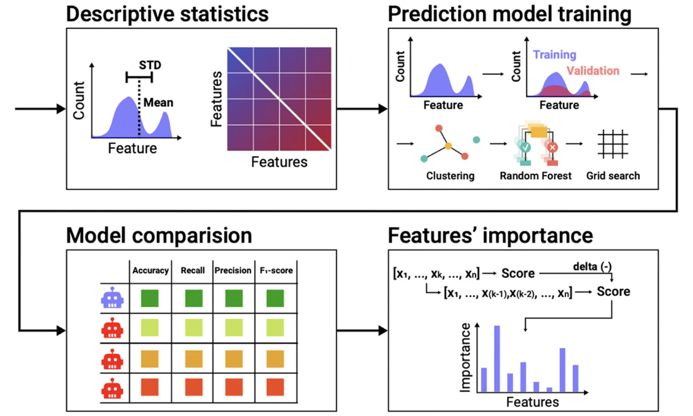
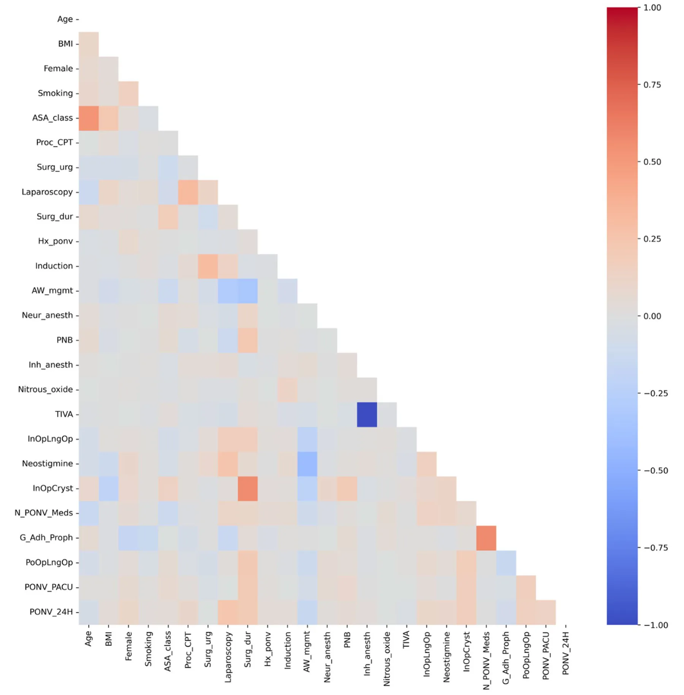
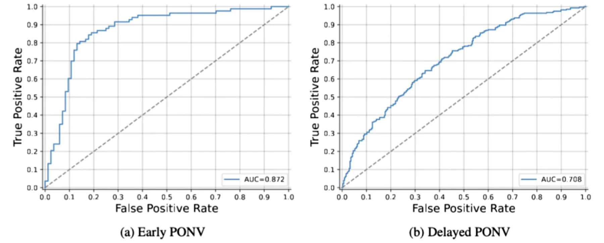
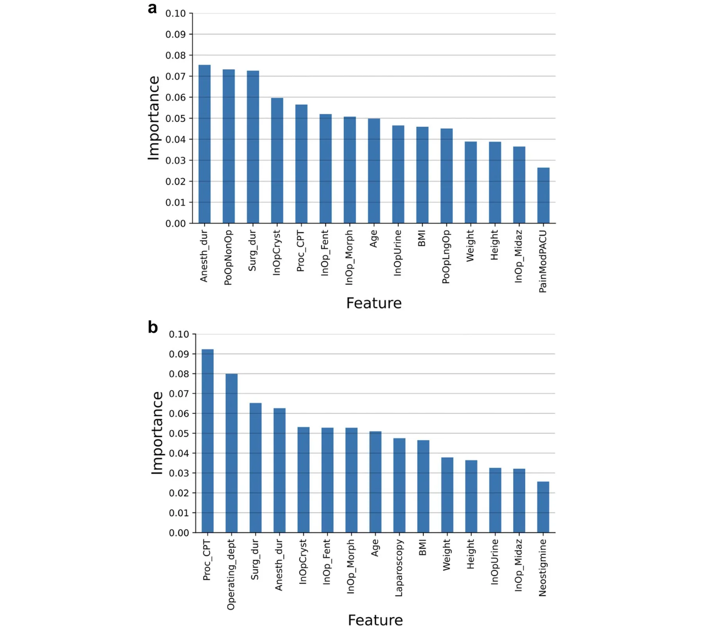
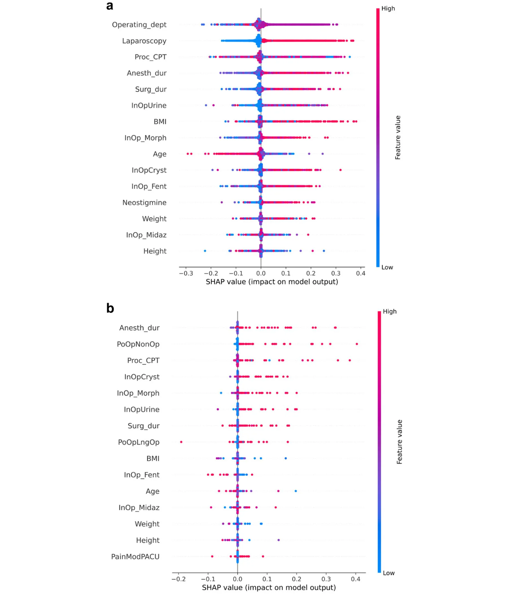

## Introduction

Postoperative nausea and vomiting (PONV) are frequently observed in patients undergoing surgery under anesthesia [1]. The risk of PONV is reported to be 30% and 80% in the general surgical population and high-risk cohorts, respectively [2]. PONV can influence patient satisfaction with anesthesia and surgery, prolong the duration of stay in the post-anesthesia care unit (PACU), increase the incidence of unplanned admissions after outpatient surgery, and increase the costs associated with medical treatment [3].

Previous studies have investigated the causes, prevalence, prevention, and treatment of PONV and developed evidence-based guidelines for the prevention and management of PONV [4]. The Apfel simplified risk score [2] and Koivuranta score [5] have been proposed for PONV risk assessment in the latest version of the guidelines [4]. However, despite their simplicity, these scores yield a predictive performance of less than 70%, on average [6]. Therefore, a better tool is required for the prediction of PONV to facilitate an accurate assessment of patient risk and formulation of evidence-based care for individual patients.

Machine learning algorithms have been used increasingly to develop predictive models since the rise of artificial intelligence (AI) [7]. These models have been shown to outperform previous models based on classical statistics [8].

Therefore, this study aimed to develop a model to predict the risk of early (during PACU stay) and delayed (first 24 postoperative hours) PONV based on machine learning algorithms. Furthermore, the performance of the proposed model was compared with that of the currently used prediction scores.

## Methods and materials

The study was conducted following the principles of the Declaration of Helsinki of the World Medical Association and was approved by the ethics committee of Sheba Medical Center, Israel (SMC 9646–22, January 25, 2023). The requirement for informed consent from patients was waived by the Ethical Committee. The study was guided by the Transparent Reporting of a multivariable prediction model for Individual Prognosis Or Diagnosis (TRI- POD + AI) framework.

### Data collection

All adult (age > 18 years) inpatients admitted to the PACU who had undergone surgical procedures under general anesthesia (GA), GA with neuraxial anesthesia (NA), GA with a peripheral nerve block (PNB), or GA with NA and PNB at the Sheba Medical Center, Israel, between September 1, 2018, and September 1, 2023, were eligible for inclusion in this study. The exclusion criteria were: patients who underwent surgery under local anesthesia, PNB, NA, and/or light sedation only; patients who underwent cardiac surgery or obstetric procedures, including cesarean section; patients with American Society of Anesthesiologists (ASA) physical status classification of grade 5; and patients who arrived intubated or required postoperative mechanical ventilation. Additionally, patients who had received any medications with antiemetic properties within 12 h prior to surgery were excluded. Of note, our institutional protocol does not include the routine administration of antiemetic drugs as premedication. Patients with perioperative medical records with insufficient data were excluded. In this study, patients with missing data for any features used in the proposed prediction models were excluded from the analysis. This decision was made to ensure the completeness and integrity of the dataset for machine learning model development. Given the retrospective nature of the study, imputing missing values was avoided to prevent potential bias or inaccuracies in the predictive modeling process. Data from our electronic patient records system, including biometric, medical, procedural, and physiological variables, were extracted anonymously and analyzed retrospectively. Patient data were anonymized and deidentified before being accessed and analyzed. Early PONV was defined as any documented event requiring the administration of rescue antiemetic medication in the PACU, whereas delayed PONV was defined as an event requiring the administration of rescue antiemetic medication during the first 24 postoperative hours. Based on the incidence of PONV described in the literature [2] and considering the complexity of the model as well as the number of features, we applied the rule of thumb requiring at least 10 outcome events per variable (EPV) to guide the calculation and justification of the sample size. Our final analysis included 35,003 patients, which exceeds the minimum required sample size.

### Data analysis

The collected data underwent a three-step analysis. The statistical properties of the dataset were initially computed and analyzed. The data were subsequently divided into training and validation cohorts to facilitate the training and evaluation of the prediction model, followed by the training of two machine-learning-based algorithms for the prediction of early and delayed PONV. In addition, the performances of the obtained prediction models were compared with those of currently available PONV prediction scores. Finally, we assessed the significance of each parameter in the prediction to investigate the clinical reasoning identified and applied by the models. All analyses were performed using Python programming language (version 3.9). Figure 1 shows a schematic of the workflow of the proposed framework.

### Cohort analysis

The patient characteristics were compared and described using appropriate statistics. Student’s t-test or Mann– Whitney U-test was used to compare continuous variables, and the Chi-squared test was used for categorical variables. Data are expressed as median (interquartile range [IQR]) and proportion, as appropriate. Comparisons between groups were performed using a one-way analysis of variance (ANOVA). Pearson correlation matrix from the cohort was computed to explore the linear and monotonic dependencies between the features and between the features and targets (i.e., early and delayed PONV).

### Prediction tool training

The study population was divided into a training cohort (from which the proposed algorithm was derived) and a validation cohort (from which the prediction models were applied and tested). A popular cross-validation approach [9] that repeats the splitting of the study population into training and validation groups multiple times was used to achieve a more statistically resilient evaluation of the performance of the prediction models [10]. In particular, the *k*-fold cross-validation method, which splits the data into *k* identically sized and pairwise distinct cohorts, was used in this study. Each of these cohorts was used as the validation cohort once, and the remaining cohorts were used as the training cohorts, resulting in *k* validations. The average performance of the prediction models in these validation cohorts was computed. The population was split into training and validation cohorts such that the age and sex distributions of both cohorts were statistically similar to ensure that the validation set followed a distribution similar to that of the training set, as required in a clinical-related machine learning analysis [11]. The age and sex distributions of each cohort were similar to those of all other cohorts in the k-fold cross-validation method. Notably, we did not control for the target features to avoid data leakage. This condition is formalized as an optimization task such that dataset *D* is divided into *k* size-identical and pairwise distinct subsets. This minimizes the average distance between the distributions defined by the age and sex distributions of each cohort and those of any other cohort. Intuitively, this task is a private case of the nurse scheduling problem [12] (which is known to be NP-hard [13]). Based on Goodman et al. [14], a close-to-optimal solution was obtained using the Directed Bee Colony Optimization algorithm [15]. An ensemble of machine learning and feature selection algorithms were analyzed after each split in the training and validation cohorts to maximize the accuracy of the prediction model. The k-fold cross-validation method was used in the training cohort to ensure that the obtained prediction model was robust for the prevention of over-fitting of the prediction model in the training cohort and to improve data stability [10]. The divided training cohort was analyzed using a Tree-based Pipeline Optimization Tool (TPOT) [16], an automated machine learning tool that optimizes machine learning pipelines using genetic programming [17]. Furthermore, the hyperparameters of the model were tuned using the grid search method [18] to improve its performance in terms of accuracy. Multiple combinations of all hyperparameters of the prediction model were sampled to determine the hyperparameter values that optimized the average accuracy of the k-fold cross-validation examination over the training cohort [19]. In addition, post-pruning methods were applied to tree-based models to further improve the generalization and performance of these prediction models [20]. Importantly, because the distribution of target features can be unbalanced for some folds, we allow TPOT to use Synthetic Minority Oversampling Technique (SMOTE), an oversampling technique that generates synthetic samples from the minority class, to tackle this challenge. In order to provide context for the performance of the obtained model, we also trained a logistic regression model on the data following the same process.

<figure id="fig-1">

<figcaption><strong>Fig. 1</strong> A schematic view of the workflow of the proposed framework</figcaption>
</figure>

### Feature importance analysis

The importance of the parameters was evaluated using the information gain method [21]. For each parameter used by the prediction models, a feature was removed each time, and the models were re-trained such that the average accuracy obtained from the k-fold cross-validation analysis was stored, resulting in an accuracy score for each removed parameter. A new parameter was introduced to the prediction models subsequently, which was generated by sampling normally distributed noise with a mean of 0 and a standard deviation of 1. The decrease (or increase) compared to the accuracy of the prediction models with all the parameters and without the “noise” parameter was computed for all these cases. All the parameters with absolute differences smaller than those obtained from the “noise” parameter case were set to zero. All values were normalized such that their sum was equal to one (i.e., L1 normalization) to obtain the importance of the parameters for each instance of the prediction models. In addition, SHapley Additive exPlanations (SHAP) analysis was used to gain insight into the influence of various features on the obtained prediction models [22]. SHAP values can be used to explain the output of a machine learning model by attributing the contribution of each individual feature to a particular prediction [23]. SHAP analysis originated in game theory and provides a method to estimate the contribution of features to the model’s final prediction. The SHAP values quantify the extent to which each feature influences the prediction in feature importance analysis. A positive SHAP value for a feature indicates that it contributes positively to the prediction, whereas a negative value indicates that it has a negative impact.

## Results

### Descriptive statistics

The final cohort comprised 35,003 patients. The study included 16,321 women (46.59%) and the median patient age was 51.0 years [IQR 36.3—69.1]. Detailed characteristics of the cohort are presented in Table 1.

Figure 2 shows the Pearson correlation matrix between the features of the prediction model and themselves, including the target features. Most features were not correlated with each other, as the absolute values were close to zero. Notably, the Pearson correlation between early PONV and delayed PONV is also low. To further assess the relationship between these binary, pair-wised variables, we performed the McNemar test, which confirmed a statistically significant difference between early and delayed PONV (*p* < 0.0001).

### The performance of the proposed prediction model and comparison with classical scores

Two prediction models were created: one to predict “early PONV” and one to predict “delayed PONV”. The “early PONV” is found to be based on the XGboost model while the “delayed PONV” is found to be an ensemble of a k-nearest neighbors model with a Random Forest model. The receiver operating characteristic (ROC) curve and the area under the ROC curve (AUC) were calculated to evaluate the prediction tools, as presented in Fig. 3. The AUC scores were 0.872 and 0.708 for predicting early and delayed PONV, respectively.

The accuracy, recall, precision, and F1-score metrics for the proposed prediction models were determined using a k-fold cross-validation method (k = 5). In addition, to obtain a relative comparison to the currently used scores to evaluate the risk of early and delayed PONV, we computed these metrics for the Apfel and Koivuranta scores. The inclusion of the risk factors described in the guidelines was for the purpose of completeness, even though it is a guideline for the use of prophylactic antiemetics rather than a genuine risk score to estimate the risk of PONV [4]. Table 2. summarizes the results of the analysis. The proposed prediction models outperformed all three scores for both tasks. The proposed prediction model achieved an accuracy of 0.836 for predicting early PONV, whereas the other prediction scores achieved accuracies of 0.644, 0.706, and 0.536, respectively. Similarly, the proposed prediction model achieved an accuracy of 0.748 for predicting delayed PONV, whereas the other prediction scores achieved accuracies of 0.570, 0.644, and 0.585, respectively. A one-sided ANOVA test performed for each task revealed that the proposed prediction models exhibited statistically significant improvements in terms of accuracy (*p* < 0.001 and *p* < 0.001, respectively). The logistic regression model, operating as a baseline model, achieved similar results to the previous prediction models (such as Apfel) further emphasizing the need for non-linear and more sophisticated modeling approaches to effectively capture the complex dynamics within the data.

<figure class="table-figure" id="table-1">
<figcaption><strong>Table 1</strong> Demographic and baseline characteristics of the cohort</figcaption>

<table><tr><th>Characteristic</th><th>All cohort</th></tr><tr><td>Age (years)</td><td>51.0 [36.3—69.1]</td></tr><tr><td>Female</td><td>16,321 (46.59%)</td></tr><tr><td>BMI (kg/m2)</td><td>25.9 [22.9—29.6]</td></tr><tr class="row-group"><td>ASA-PS</td><td></td></tr><tr><td>1</td><td>4,952 (14.14%)</td></tr><tr><td>2</td><td>8,615 (24.59%)</td></tr><tr><td>3</td><td>8,147 (23.26%)</td></tr><tr><td>4</td><td>951 (2.71%)</td></tr><tr><td>Smoking</td><td>7,636 (21.80%)</td></tr><tr><td>Elective surgery</td><td>28,583 (81.59%)</td></tr><tr><td>Laparoscopic approach</td><td>8,446 (24.11%)</td></tr><tr><td>Surgery duration (min)</td><td>67 [38—122]</td></tr><tr><td>Anesthesia duration (min)</td><td>104 [68—174]</td></tr><tr><td>PACU stay (min)</td><td>42 [28—71]</td></tr><tr><td>History of PONV</td><td>546 (1.56%)</td></tr><tr><td>Inhalational anesthetic</td><td>31,279 (89.28%)</td></tr><tr><td>Intraoperative long-acting opioid</td><td>30,160 (86.09%)</td></tr><tr class="row-group"><td>Apfel simplified risk score</td><td></td></tr><tr><td>0</td><td>4,815 (13.76%)</td></tr><tr><td>1</td><td>13,577 (38.79%)</td></tr><tr><td>2</td><td>13,288 (37.96%)</td></tr><tr><td>3</td><td>3,224 (9.21%)</td></tr><tr><td>4</td><td>99 (0.28%)</td></tr><tr class="row-group"><td>Guidelines’ risk stratification</td><td></td></tr><tr><td>1–2 risk factors</td><td>20,967 (59.90%)</td></tr><tr><td>&gt; 2 risk factors</td><td>12,382 (35.37%)</td></tr><tr class="row-group"><td>Number of PONV prophylactic drugs</td><td></td></tr><tr><td>0</td><td>5,119 (14.61%)</td></tr><tr><td>1</td><td>14,252 (40.68%)</td></tr><tr><td>2</td><td>14,776 (42.18%)</td></tr><tr><td>3</td><td>854 (2.44%)</td></tr><tr><td>Guidelines adherent prophylaxis</td><td>9,291 (25.52%)</td></tr><tr><td>Early PONV</td><td>1,340 (3.82%)</td></tr><tr><td>Delayed PONV</td><td>6,585 (18.8%)</td></tr></table>

All data are presented as the median [IQR] or n (%) <em>Abbreviations</em>: <em>BMI</em> Body mass index, <em>ASA-PS</em> The American Society of Anesthesiologists (ASA) physical status classification, <em>PACU</em> Post-anesthesia care unit

</figure>

### Feature importance

The information gain from each feature was computed for both tasks to determine its significance as a predictive model. Figure 4 shows the results of this analysis. Features with importance scores that were lower than those attributed to random noise were excluded from each prediction model. The variables were arranged from left to right, and their order was determined based on their respective weights for the PONV effect.

Specifically, Fig. 4a illustrates the top five predictors for early PONV, identified as the duration of anesthesia, the administration of non-opioid analgesics in the PACU, the duration of surgery, the volume of intraoperative crystalloids administered, and the type of surgical procedure undertaken. Conversely, Fig. 4b delineates the primary five factors influencing the incidence of delayed PONV, which include the type of surgical procedure, the operating department, the duration of surgery, the duration of anesthesia, and the volume of intraoperative crystalloids administered.

The SHAP values [22] for both prediction models were computed to obtain a better clinical understanding of the contribution of the variables to the model. Figure 5 shows the SHAP values of the top 15 combinations of variables. The color ranges from blue to red, indicating low to high values, and the y-axis indicates an increase or decrease in the probability of early or delayed PONV incidence according to each prediction model. The early PONV prediction model is shown in Fig. 5a.

In the context of the early PONV prediction model, several factors were identified as significant risk contributors: the laparoscopic surgical approach, extended durations of anesthesia and surgery, elevated Body Mass Index (BMI), higher doses of intraoperative morphine, younger age, increased volume of intraoperative crystalloids, greater doses of intraoperative fentanyl, and higher intraoperative doses of neostigmine. This constellation of variables, represented by a spectrum of blue and red dots, underscored their associative risk elevation for early PONV.

Conversely, Fig. 5b elucidates factors associated with an augmented risk of delayed PONV. Notably, these include prolonged anesthesia and surgery durations, increased administration of postoperative non-opioid analgesics, higher intraoperative morphine dosages, a larger volume of intraoperative crystalloids, higher doses of postoperative long-acting opioids, and postoperative pain levels assessed as moderate or higher.

<figure id="fig-2">

<figcaption><strong>Fig. 2</strong> Pearson correlations between the dataset’s features. Abbreviations: BMI, body mass index; ASA_class, The American Society of Anesthesiologists (ASA) physical status classification; Proc_CPT, procedure CPT (The Current Procedural Terminology); Surg_urg, surgery urgency; Surg_dur, surgery duration; Hx_ponv, history of PONV; AW_mgmt, airway management; Neur_anesth, neuraxial anesthesia; PNB, peripheral nerve block; Inh_anesth, inhalational anesthesia; TIVA, total intravenous anesthesia; InOpLngOp, intraoperative long-acting opioid; InOpCryst, intraoperative crystalloid volume; N_PONV_Meds, number of PONV prophylaxis drugs; G_Adh_Proph: adherence to guidelines; PONV_PACU, PONV in the PACU; PONV_24H, PONV within 24 h</figcaption>
</figure>

## Discussion

The primary objective of this study was to develop a computational model capable of assessing the probability of PONV. Novel machine-learning-based prediction models were developed and validated using a comprehensive dataset from a diverse surgical population, including records of over 35,003 patients, to predict the risk of early and delayed PONV. The findings of the present study revealed the complexity of PONV prediction, as the analysis revealed multidimensional and nonlinear correlations between most variables and the risk of PONV (Fig. 2). This underscores the importance of using statistical methods other than traditional methods to utilize machine learning techniques [24– 26], enabling us to capture the intricate relationships that influence PONV.

<figure id="fig-3">

<figcaption><strong>Fig. 3</strong> The receiver operating characteristic (ROC) curve of the obtained prediction models for the early and delayed PONV tasks</figcaption>
</figure>

<figure class="table-figure" id="table-2">
<figcaption><strong>Table 2</strong> Comparison of the prediction performance of the proposed prediction models with the simplified Apfel score, Koivuranta score, and risk factors according to the fourth consensus guideline for the management of PONV. The results are presented as the mean of the k-fold cross-validation analysis (k=5). The best prediction tool for each metric is highlighted in bold font</figcaption>

<table><tr><th>Task</th><th>Prediction model</th><th>Accuracy</th><th>Recall</th><th>Precision</th><th>F1-score</th></tr><tr><td>Early PONV</td><td>Our</td><td>0.836</td><td>0.819</td><td>0.829</td><td>0.824</td></tr><tr><td></td><td>Logistic regression</td><td>0.648</td><td>0.203</td><td>0.541</td><td>0.292</td></tr><tr><td></td><td>Apfel</td><td>0.644</td><td>0.417</td><td>0.777</td><td>0.543</td></tr><tr><td></td><td>Koivuranta</td><td>0.706</td><td>0.660</td><td>0.767</td><td>0.710</td></tr><tr><td></td><td>Guidelines risk factors</td><td>0.536</td><td>0.413</td><td>0.557</td><td>0.475</td></tr><tr><td>Delayed PONV</td><td>Our</td><td>0.748</td><td>0.749</td><td>0.740</td><td>0.745</td></tr><tr><td></td><td>Logistic regression</td><td>0.650</td><td>0.187</td><td>0.532</td><td>0.274</td></tr><tr><td></td><td>Apfel</td><td>0.570</td><td>0.237</td><td>0.734</td><td>0.358</td></tr><tr><td></td><td>Koivuranta</td><td>0.644</td><td>0.541</td><td>0.689</td><td>0.606</td></tr><tr><td></td><td>Guidelines risk factors</td><td>0.585</td><td>0.654</td><td>0.580</td><td>0.615</td></tr></table>

</figure>

Artificial intelligence and machine learning are widely used in modern medicine, demonstrating significant predictive utility in various clinical applications [27–29]. Specifically in anesthesiology, various ML models were used to predict post induction hypotension [30], postoperative complications [31], and mortality [32]. However, the application of ML in predicting PONV is novel, marking a significant contribution of this study to the field.

The proposed prediction models demonstrated good discriminative performance, as evidenced by high AUC values of 0.872 and 0.708 for predicting the incidence of early and delayed PONV, respectively. A comparative analysis with classical PONV prediction scores, such as the Apfel and Koivuranta scores, revealed that the proposed prediction models significantly outperformed traditional approaches (Table 2.). Thus, these metrics suggest that the proposed prediction models can effectively identify patients at risk of developing PONV, thereby enabling early intervention and personalized care.

Consistent with the findings of previous studies, the present study revealed that the duration of anesthesia and surgery, laparoscopic surgical approach, type of procedure, the use of opioids, and younger age are important predictors of early PONV [4]. The prediction model developed for predicting delayed PONV has a similar distribution of feature importance. These findings validate the proposed model.

<figure id="fig-4">

<figcaption><strong>Fig. 4 a</strong>, A feature importance analysis of the early PONV prediction model. <strong>b</strong>, A feature importance analysis of the delayed PONV prediction model. Abbreviations: Anesth_dur, anesthesia duration; PoOpNonOp, postoperative non-opioid analgesics; Surg_dur, surgery duration; InOpCryst, intraoperative crystalloids; Proc_CPT, procedure CPT (The Current Procedural Terminology); InOp_Fent, intraoperative fentanyl; InOp_Morph, intraoperative morphine; InOpUrine, intraoperative urine output; InOpLngOp, intraoperative long acting opioids; InOp_Midaz, intraoperative midazolam; PainModPACU, pain ≥ moderate in PACU; Operating_dept, operating department; BMI, body mass index</figcaption>
</figure>

However, in contrast with the findings of previous studies describing the protective effect of crystalloid infusion on PONV [33], the present study revealed that the volume of intraoperative crystalloids was an important independent predictor of PONV. A recent meta-analysis reported the protective effect is limited to healthy patients (ASA physical status 1–2) undergoing procedures that are ambulatory or require a short length of stay [34]. The reasons for the occurrence of PONV due to this variable remain unclear and require further investigation.

We acknowledge that some of the predictors we used to develop the model, such as postoperative opioid administration, and pain levels in the PACU, are "late features"—variables that may not be available until after surgery or upon arrival in the PACU. Our model aims to provide a versatile tool for PONV prediction across different time points. In practice, the tool can serve two distinct purposes: 1) preoperative risk assessment—by incorporating readily available preoperative and demographic variables (e.g., age, history of PONV, type of surgery, anesthesia plan, etc.), the model can offer an initial prediction to guide preventive strategies. This usage aligns with current clinical needs for early identification and intervention to reduce PONV risk; 2) dynamic intraoperative and PACU updates—we envision that, in settings where continuous data input is feasible, such as within an integrated electronic health record system, the model could dynamically update its predictions based on intraoperative and early postoperative data. This adaptive approach would allow clinicians to adjust antiemetic interventions as the risk profile evolves during surgery, enhancing the model’s value in real-time decision support.

<figure id="fig-5">

<figcaption><strong>Fig. 5 a</strong>, A SHAP function value of each feature for the early PONV prediction model <strong>b</strong>, A SHAP function value of each feature for the delayed PONV prediction model. Abbreviations: Anesth_dur, anesthesia duration; PoOpNonOp, postoperative non-opioid analgesics; Surg_dur, surgery duration; InOpCryst, intraoperative crystalloids; Proc_CPT, procedure CPT (The Current Procedural Terminology); InOp_Fent, intraoperative fentanyl; InOp_Morph, intraoperative morphine; InOpUrine, intraoperative urine output; InOpLngOp, intraoperative long acting opioids; InOp_Midaz, intraoperative midazolam; PainModPACU, pain ≥ moderate in PACU; Operating_dept, operating department; BMI, body mass index</figcaption>
</figure>

The results of this study lay the groundwork for the development of a predictive calculator aimed at providing anesthesiologists with real-time assessments of PONV risk. This tool is expected to enhance preventive measures and improve patient outcomes by integrating "assistive" decision-support platforms into local electronic health record systems. Future studies should focus on the real-world implementation and clinical integration of these prediction tools. However, one of the major challenges with implementation is the gap in comprehension and trust in AI technologies among practicing clinicians, which is critical for their adoption [35]. Additionally, the number of ML articles published in technical journals is much higher than those published in medical journals, highlighting the fact that translation into clinical practice is still fraught with multiple hurdles [36].

This study had some limitations. The use of retrospective data from a single medical center may limit the generalizability of prediction tools across different clinical settings. Specifically, patient populations, treatment protocols, and diagnostic tools can vary significantly between institutions, meaning that an algorithm developed from one dataset may not perform as well in other contexts due to implicit bias. The proposed tools must be validated in multiple clinical contexts to confirm the robustness and external validity of the prediction tools. Multicenter studies with larger and more diverse datasets must be conducted to validate the prediction tools across different clinical settings.

#### Funding

While our machine learning models successfully identify patterns correlated with PONV and demonstrate strong predictive performance, it is important to emphasize that these correlations do not inherently establish causation [37]. Machine learning algorithms discern statistical associations rather than causal pathways. This distinction underscores the need for prospective studies and rigorous clinical validation.

## Conclusions

This study represents a significant step forward in the prediction and assessment of PONV in patients undergoing surgery. These machine learning-based prediction tools exhibit strong discrimination ability, clinical interpretability, and superior performance compared to traditional scoring systems. These findings hold significant promise in clinical practice, as they enable individualized PONV risk assessment.

#### Abbreviations

<figure class="table-figure" id="table-x3">

<table><tr><th>PONV</th><th>Postoperative nausea and vomiting</th></tr><tr><td>PACU​</td><td>Postanesthesia care unit</td></tr><tr><td>AI</td><td>Artificial intelligence</td></tr><tr><td>TRIPOD + AI</td><td>Transparent reporting of a multivariable prediction model for Individual Prognosis Or Diagnosis + Artificial Intelligence</td></tr><tr><td>GA</td><td>General anesthesia</td></tr><tr><td>NA</td><td>Neuraxial anesthesia</td></tr><tr><td>PNB</td><td>Peripheral nerve block</td></tr><tr><td>ASA</td><td>The American Society of Anesthesiologists</td></tr><tr><td>EPV</td><td>Events per variable</td></tr><tr><td>IQR</td><td>Interquartile range</td></tr><tr><td>ANOVA</td><td>Analysis of variance</td></tr><tr><td>TPOT</td><td>Tree-based Pipeline Optimization Tool</td></tr><tr><td>SMOTE</td><td>Synthetic Minority Oversampling Technique</td></tr><tr><td>SHAP</td><td>SHapley Additive exPlanations</td></tr><tr><td>BMI</td><td>Body mass index</td></tr><tr><td>ASA-PS</td><td>The American Society of Anesthesiologists physical status classification</td></tr></table>

We thank Marwa Sabih for her contributions.

MG: Conceptualization, Methodology, Formal analysis, Investigation, Data curation, Writing - Original Draft, Writing - Review &amp; Editing. TL: Methodology, Software, Formal analysis, Investigation, Writing - Original Draft, Writing - Review &amp; Editing, Visualization, Project administration. MK: Writing - Review &amp; Editing. BO: Funding acquisition. HB: Funding acquisition, Writing - Review &amp; Editing. SBM: Funding acquisition.

This study represents an independent research project funded by Ariel University and the Holon Institute of Technology (grant number RA2300000519).

The datasets analysed during the current study are not publicly available due to institutional policies but are available from the corresponding author on reasonable request. The code that has been used in this study is publicly available in this study’s GitHub repository: https://github.com/teddy4445/ponv_prediction_tool

</figure>

#### Acknowledgements

#### Authors’ contributions

#### Data availability

### Declarations

#### Ethics approval and consent to participate

The study was conducted following the principles of the Declaration of Helsinki of the World Medical Association and was approved by the ethics committee of Sheba Medical Center, Israel (SMC 9646–22, January 25, 2023). The requirement for informed consent from patients was waived by the Ethical Committee.

#### Consent for publication

Not applicable.

#### Competing interests

The authors declare no competing interests.

#### Author details

1 Department of Anesthesiology, Sheba Medical Center, Derech Sheba 2, Ramat Gan 52621, Israel. 2 Department of Mathematics, Ariel University, Ariel, Israel. 3 Department of Cancer Biology, Cancer Institute, University College London, London, UK. 4 Digital Medicine and Technology, Holon Institute of Technology, Holon, Israel. 5 Faculty of Medicine, Tel-Aviv University, Tel‑Aviv, Israel.

Received: 21 January 2025 Accepted: 26 February 2025

## References

1. Macario A, Weinger M, Carney S, Kim A. Which clinical anesthesia outcomes are important to avoid? The perspective of patients Anesth Analg. 1999;89(3):652–8. [doi:10.1097/00000539-199909000-00022](https://doi.org/10.1097/00000539-199909000-00022)
2. Apfel CC, Läärä E, Koivuranta M, Greim CA, Roewer N. A simplified risk score for predicting postoperative nausea and vomiting: conclusions from cross-validations between two centers. Anesthesiology. 1999;91(3):693–700. [doi:10.1097/00000542-199909000-00022](https://doi.org/10.1097/00000542-199909000-00022)
3. Jin Z, Gan TJ, Bergese SD. Prevention and treatment of postoperative nausea and vomiting (PONV): a review of current recommendations and emerging therapies. Ther Clin Risk Manag. 2020;16:1305–17. [doi:10.2147/TCRM.S256234](https://doi.org/10.2147/TCRM.S256234)
4. Gan TJ, Belani KG, Bergese S, et al. Fourth consensus guidelines for the management of postoperative nausea and vomiting. Anesth Analg. 2020;131(2):411–48. correction appears in Anesth Analg. 2020 Nov;131(5):e241. [doi:10.1213/ANE.0000000000004833.published](https://doi.org/10.1213/ANE.0000000000004833.published)
5. Koivuranta M, Läärä E, Snåre L, Alahuhta S. A survey of postoperative nausea and vomiting. Anaesthesia. 1997;52(5):443–9. [doi:10.1111/j.1365-2044.1997.117-az0113.x](https://doi.org/10.1111/j.1365-2044.1997.117-az0113.x)
6. Apfel CC, Kranke P, Eberhart LH, Roos A, Roewer N. Comparison of predictive models for postoperative nausea and vomiting. Br J Anaesth. 2002;88(2):234–40. [doi:10.1093/bja/88.2.234](https://doi.org/10.1093/bja/88.2.234)
7. Veturi YA, Woof W, Lazebnik T, et al. Syntheye: investigating the impact of synthetic data on AI-assisted gene diagnosis of inherited retinal disease. Ophthalmol Sci. 2022;2(1):100258.
8. Deo RC. Machine learning in medicine. Circulation. 2015;132(20):1920–30.
9. Wong TT, Yeh PY. Reliable accuracy estimates from k-fold cross-validation. IEEE Trans Knowl Data Eng. 2020;32(8):1586–94.
10. Jung Y. Multiple predicting k-fold cross-validation for model selection. J Nonparametr Stat. 2018;30(1):197–215.
11. Doshi-Velez F, Perlis RH. Evaluating machine learning articles. JAMA. 2019;322(18):1777–9. [doi:10.1001/jama.2019.17304](https://doi.org/10.1001/jama.2019.17304)
12. Dowsland K, Thompson J. Solving a nurse scheduling problem with knapsacks, networks and tabu search. J Oper Res Soc. 2000;51:825–33.
13. Goh SL, Sze SN, Sabar NR, Abdullah S, Kendall G. A 2-stage approach for the nurse rostering problem. IEEE Access. 2022;10:69591–604.
14. Goodman MD, Dowsland KA, Thompson JM. A grasp-knapsack hybrid for a nurse-scheduling problem. J Heuristics. 2007;15(3):351–79.
15. Rajeswari M, Amudhavel J, Pothula S, Dhavachelvan P. Directed bee colony optimization algorithm to solve the nurse rostering problem. Comput Intell Neurosci. 2017;2017:6563498. [doi:10.1155/2017/6563498](https://doi.org/10.1155/2017/6563498)
16. Olson RS, Moore JH. TPOT: A tree-based pipeline optimization tool for automating machine learning. In: Workshop on Automatic Machine Learning. vol. 64. PMLR; 2016. p. 66–74.
17. Routledge BR. Genetic algorithm learning to choose and use information. Macroecon Dyn. 2001;5(2):303–25.
18. Liu R, Liu E, Yang J, Li M, Wang F. Optimizing the hyper-parameters for SVM by combining evolution strategies with a grid search. Intell Control Autom. 2006;344:157–61.
19. Lazebnik T, Bahouth Z, Bunimovich-Mendrazitsky S, Halachmi S. Predicting acute kidney injury following open partial nephrectomy treatment using SAT-pruned explainable machine learning model. BMC Med Inform Decis Mak. 2022;22(1):133. [doi:10.1186/s12911-022-01877-8](https://doi.org/10.1186/s12911-022-01877-8)
20. Lazebnik T, Bunimovich-Mendrazitsky S. Decision tree post-pruning without loss of accuracy using the SAT-PP algorithm with an empirical evaluation on clinical data. Data Knowl Eng. 2023;145:102173.
21. Wu G, Xu J. Optimized approach of feature selection based on information gain. Int Conf Comput Sci Mech Autom. 2015;157–61.
22. Lu S, Chen R, Wei W, Belovsky M, Lu X. Understanding heart failure patients EHR clinical features via SHAP interpretation of tree-based machine learning model predictions. AMIA Annu Symp Proc. 2022;2021:813–22.
23. Mokhtari KE, Higdon BP, Başar A. Interpreting financial time series with SHAP values. In: Proc 29th Annu Int Conf Comput Sci Softw Eng. IBM Corp.; 2019. p. 166–72.
24. Shami L, Lazebnik T. Implementing Machine Learning Methods in Estimating the Size of the Non-observed Economy. Comput Econ. 2024;63(4):1459–76. [doi:10.1007/s10614-023-10369-4](https://doi.org/10.1007/s10614-023-10369-4)
25. Natan S, Lazebnik T, Lerner E. A distinction of three online learning pedagogic paradigms. SN Soc Sci. 2022;2(4):46. [doi:10.1007/s43545-022-00337-4](https://doi.org/10.1007/s43545-022-00337-4)
26. Boyko N, Sviridova T, Shakhovska N. Use of machine learning in the forecast of clinical consequences of cancer diseases. 7th Mediterranean Conf Embed Comput. 2018;1–6.
27. Haug CJ, Drazen JM. Artificial intelligence and machine learning in clinical medicine. N Engl J Med. 2023;388(13):1201–8. [doi:10.1056/NEJMra2302038](https://doi.org/10.1056/NEJMra2302038)
28. Shin Y, Cho K, Chang M, Youk H, Kim YJ, Park JY, Yoo D. The development and validation of a novel deep-learning algorithm to predict in-hospital cardiac arrest in ED-ICU (emergency department-based intensive care units): a single center retrospective cohort study. Signa Vitae. 2024;20(4):83–98. [doi:10.22514/sv.2024.045](https://doi.org/10.22514/sv.2024.045)
29. Xia Y, Xu L, Lai Q, Long H, Zhou Y. Construction and validation of machine learning models based on bedside parameters for identifying sepsis in acute pancreatitis patients. Signa Vitae. 2024;20(7):60–8. [doi:10.22514/sv.2024.084](https://doi.org/10.22514/sv.2024.084)
30. Nakanishi T, Tsuji T, Sento Y, et al. Association between postinduction hypotension and postoperative mortality: a single-centre retrospective cohort study. Can J Anaesth. 2024;71(3):343–52. [doi:10.1007/s12630-023-02653-6](https://doi.org/10.1007/s12630-023-02653-6)
31. Yu X, Zhang L, He Q, et al. Development and validation of an interpretable Markov-embedded multilabel model for predicting risks of multiple postoperative complications among surgical inpatients: a multicenter prospective cohort study. Int J Surg. 2024;110(1):130–43. [doi:10.1097/JS9.0000000000000817](https://doi.org/10.1097/JS9.0000000000000817)
32. Lee CK, Hofer I, Gabel E, Baldi P, Cannesson M. Development and validation of a deep neural network model for prediction of postoperative in-hospital mortality. Anesthesiology. 2018;129(4):649–62. [doi:10.1097/ALN.0000000000002186](https://doi.org/10.1097/ALN.0000000000002186)
33. Apfel CC, Meyer A, Orhan-Sungur M, et al. Supplemental intravenous crystalloids for the prevention of postoperative nausea and vomiting: quantitative review. Br J Anaesth. 2012;108(6):893–902. [doi:10.1093/bja/aes138](https://doi.org/10.1093/bja/aes138)
34. Jewer JK, Wong MJ, Bird SJ, et al. Supplemental perioperative intravenous crystalloids for postoperative nausea and vomiting. Cochrane Database Syst Rev. 2019;3(3):CD012212. [doi:10.1002/14651858.CD012212.pub2](https://doi.org/10.1002/14651858.CD012212.pub2)
35. Mathis MR, Kheterpal S, Najarian K. Artificial intelligence for anesthesia: What the practicing clinician needs to know: more than black magic for the art of the dark. Anesthesiology. 2018;129(4):619–22. [doi:10.1097/ALN.0000000000002384](https://doi.org/10.1097/ALN.0000000000002384)
36. Lonsdale H, Jalali A, Gálvez JA, et al. Artificial intelligence in anesthesiology: hype, hope, and hurdles. Anesth Analg. 2020;130(5):1111–3. [doi:10.1213/ANE.0000000000004751](https://doi.org/10.1213/ANE.0000000000004751)
37. D’Amico F, Marmiere M, Fonti M, Battaglia M, Belletti A. Association Does Not Mean Causation, When Observational Data Were Misinterpreted as Causal: The Observational Interpretation Fallacy. J Eval Clin Pract. 2025;31(1):e14288. [doi:10.1111/jep.14288](https://doi.org/10.1111/jep.14288)
