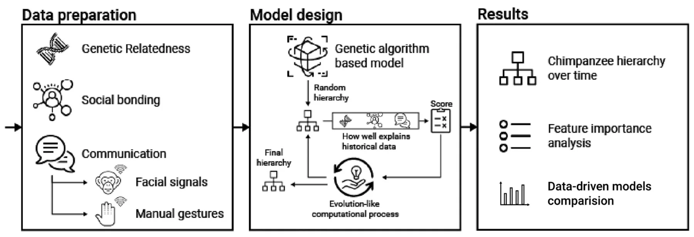
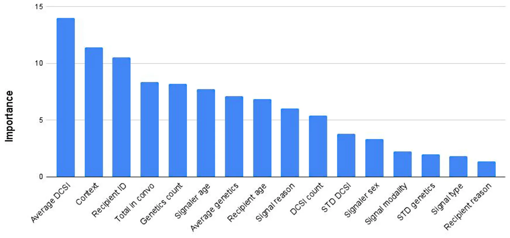

## 1 Introduction

Primates, like other animals, show diverse social structures and organizations within and between species, which include group composition, spatial patterns, and social interactions (Chapman and Rothman 2009). Primates vary in the degree to which they exhibit evidence of status hierarchies, where certain individuals have priority access to resources such as food and mates compared to others (Cummins 2016). The strength of status hierarchies among primate groups can vary from being egalitarian (i.e., weak differences between individual statuses)

to despotic (i.e., strong differences between individual statuses; Thierry 1990). Individuals within a status hierarchy can achieve a higher social status (i.e., rank) through dominance (aggression, coercion, and intimidation) and/or prestige (skills, knowledge, and influence) (Cummins 2016). In non-human primates, dominance is a much more common strategy for increasing social rank compared to prestige, which is sometimes argued to be a uniquely human trait (Maner 2017). For instance, although cases of innovation are more frequently reported for low-ranking individuals compared to high-ranking individuals (Reader and Laland 2001), non-human primates still appear to copy dominant individuals preferentially (Kendal et al. 2015). In addition to achieving high social rank through dominance, demographic and ecological factors also influence status hierarchies. Age, sex, body size, competitive ability, and kinship (i.e., nepotism) are some of the demographic factors influencing status achievement among primates (Pereira 1995). The availability, quality, and distribution of food resources and mates, as well as group size, can also affect the establishment and steepness of status hierarchies (Brown 2013; Fedigan 1983; Guo et al. 2020). Taken together, numerous factors influence the formation of status hierarchies, creating a very complex picture.

Primates living in status hierarchies must navigate various interactions related to social bonding and conflict arising from competition for priority access to resources (de Waal 1986). A large communicative repertoire can be useful for navigating such interactions, as signals can minimize misunderstandings and reduce the risk of physical injuries (Reddon et al. 2021). For example, primates are capable of producing various affiliative, aggressive, and submissive facial signals that are often distinguishable from one another (Reddon et al. 2021). In catarrhine monkeys and apes, dominant individuals typically produce a tense-mouth face before launching a fast attack, characterized by compressed lips and tense jaw muscles (Van Hooff 1967; Preuschoft 2000; Goodall 1986; Murray et al. 2023). Submissive individuals can respond to these attacks with a silent bared-teeth face, where the lips are pulled back vertically to expose the teeth (Van Hooff 1967; Preuschoft 2000; Goodall 1986; Murray et al. 2023). Harm reduction becomes more attainable when primates can use these communicative signals to predict the future behavior of conspecifics. For example, crested macaques (*Macaca nigra*) associate silent bared-teeth expressions with grooming outcomes more frequently than injury outcomes (Waller et al. 2016). Social bonding plays a significant role in status hierarchies, as it often involves maintaining the cohesion of the social group and the associated hierarchy through affiliation and reconciliation (de Waal 1986). Social bonding activities, such as grooming, often involve the use of facial signals and manual gestures, including lip smacks (Van Hooff 1967; Preuschoft 2000; Goodall 1986; Murray et al. 2023) and body presentations (Chadwick-Jones 1989). Previous research has indicated that the communicative behavior of apes is influenced by the strength of the social bonds they have established and the characteristics of the individuals with whom they interact (Roberts and Roberts 2017, 2016).

Communicative signals are often stable over time (Tkaczynski et al. 2020) and are stronger indicators of social rank within a status hierarchy than the outcomes of aggressive disputes (as observed in chimpanzees, *Pan troglodytes*, de Waal 1986). In a recent study of 26 primate species, researchers found that vocal communication is associated with dominance style (Kavanagh et al. 2021). Dominant yet tolerant individuals vocalize more, while despotic species have a larger vocal repertoire than tolerant species (Kavanagh et al. 2021). Differences in the strength of social hierarchies have also been associated with variations in facial signaling complexity (Rincon et al. 2023) and the use of facial and manual gestures in catarrhine monkeys (Maestripieri 2005). For example, submissive individuals display lip smacks, bared teeth faces, and submissive body postures significantly more often than dominant individuals and vice versa (Maestripieri 2005). Catarrhine monkeys with more tolerant social styles possess larger (Dobson 2012) and more complex (Rincon et al. 2023) facial signaling repertoires than tolerant species. The reliability of communicative signals as indicators of social rank, along with the strong association of demographic variables (such as age, sex, bond strength, and genetic relatedness) with status achievement, is valuable for researchers studying primate species’ status hierarchies, as it provides researchers an avenue for identifying the rankings of individuals within a given social group.

Accurately identifying social rank can be a challenging task because different dominance rank metrics correspond to various behavioral and demographic traits. For example, simple ordinal ranking models are most suitable when access to resources does not increase proportionately with increases in hierarchy size, and they are useful for assessing the traits of males (Levy et al. 2020). Standardized ranking approaches are more effective when access to resources scales with hierarchy size and are useful for assessing the characteristics of females (Levy et al. 2020). However, correlational metrics can be problematic when status hierarchies are non-linear and when using certain variables, such as vocalizations, to ascertain social rank (Bayly et al. 2006). An additional factor to consider is that the social rankings of primates may not always be stable, particularly during periods of social instability. Hence, it is important to consider uncertainty when calculating dominance rank metrics (Mccowan et al. 2022). Developing a process for the accurate identification of social rank while taking all of these factors into consideration is a difficult task, but one that can be solved with the use of data-driven models.

Data-driven models are a subset of artificial intelligence (AI) and offer a promising avenue for overcoming these challenges (Goodwin et al. 2020). By processing large datasets of observational data, data-driven models can identify patterns and relationships that might elude human researchers (Veturi et al. 2023). This capacity to analyze complex and nuanced behaviors makes it an ideal tool for investigating the intricate dynamics of social behavior in animals (Valletta et al. 2017). For example, Kleanthous et al. (2018) developed a data-driven model to classify five activities of livestock using data from two sheep and four goats; the model obtained a promising 96% accuracy in the prediction. Torney et al. (2021) implement a novel approach to movement modeling through the use of multilevel Gaussian processes, showing that the model offers efficient inference for large-volume movement data sets, along with the fitting of complex flexible models. Brookes et al. (2022) proposed a machine learning (ML) model (i.e., a type of data-driven model) facial recognition system embedded within a cognitive enrichment device and used on zoo-kept gorillas. The authors show that their model could automatically identify individual gorillas through facial recognition with 97% precision. Specifically, previous studies have successfully employed data-driven models to decode various aspects of primate behavior (Dezecache et al. 2021; Bennett et al. 2021; Schofield et al. 2019). Mccarthy et al. (2021) proposed that ML and citizen science can effectively work together, as both approaches are essential for collecting and analyzing high-quality data related to animals. In their study, the authors demonstrated that involving citizen scientists enhances the development of social networks. These citizen scientists were able to identify chimpanzees in camera trap videos with a comparable level of accuracy to experts, and the data they provided helped create a more robust social network. This improvement in data collection occurred despite the fact that the citizen scientists were not familiar with the behaviors of captive chimpanzees (*Pan troglodytes*). As technology matured, van de Sande et al. (2024) introduced an end-to-end pipeline to track chimpanzee poses using deep learning (a version of data-driven models). This information is then inputted into another data-driven model (support vector machine) operating as a classifier of role transitions within grooming interactions with 86% accuracy. These models cover important aspects of chimpanzee behavior, but they ignore status hierarchies, which play a central role in shaping chimpanzee behavior over time.

It is important to note that alternative approaches exist to examine factors influencing social ranking among non-human primates. Examples include using generalized linear mixed models (GLMMs) (Lu et al. 2013; Zhang et al. 2023) and social network analysis (or SNA) (Farine and Whitehead 2015; Wey et al. 2008; Dahl et al. 2020). In certain cases, both methods are used together to explore factors that affect social ranking. One previous study utilized both GLMMs and SNA to demonstrate that rank acquisition is closely related to age and sex in Barbary macaques (*Macaca sylvanus*) and that these factors also influence roles within social grooming networks (Sosa 2016). Although GLMMs and SNA are beneficial in the study of primate social rank, they also come with their own limitations. GLMMs can elucidate relationships between independent and dependent variables; however, they have limitations in predictive capability, particularly when forecasting social rankings in new groups or among the same individuals in subsequent years (Bolker et al. 2009). Social networks run the risk of overinterpretation, and it can be challenging to model multiple independent variables simultaneously within the network. In SNA, there are numerous measures to choose from, many of which are correlated with one another or are only suitable for specific types of networks (such as weighted versus unweighted; Sosa et al. 2020). We propose that data-driven modeling approaches could act as a complementary method to provide a more comprehensive understanding of primate social rank.

Our current research aims to investigate whether a data-driven model can predict the social rankings of a troop of captive chimpanzees using communicative and demographic variables before and during a period of status hierarchy instability. These data are from three previous studies conducted by the first author (BF) on chimpanzee facial signals and manual gestures (Florkiewicz and Campbell 2021a, 2021b; Florkiewicz et al. 2024). Chimpanzees are an ideal species for assessing social rank, as troops comprise strict dominance hierarchies. Extensive research has been conducted on chimpanzee status hierarchies by primatologists, providing a greater understanding of how social rank is determined and a way for us to assess the validity of our data-driven model. For instance, previous studies have found that the production of facial signals (Kim et al. 2022), manual gestures (Bard et al. 2014), vocalization (Clark 1993), and positional behaviors (Hunt 1992) by chimpanzees varies based on social rank. Body size is a strong indicator of social rank among female chimpanzees (Pusey et al. 2005) but not for males. When food resources can be monopolized or the number of competitors for food increases, contest competition also increases, and the outcomes of these contests are strongly linked to social rank (Wittig and Boesch 2003). Typically, female chimpanzees wait for their turn to increase their ranking in the status hierarchy, while males actively compete and dispute rankings to increase theirs (Foerster et al. 2016). High-ranking males and multiparous females (Newton- Fisher et al. 2010) have the greatest reproductive success, with multiparity also being associated with high social rank (Pusey et al. 1997). In other words, we have a solid understanding of how individual communicative and demographic variables influence status hierarchies among chimpanzees, enabling us to incorporate them into our model. Often, these variables are assessed independently. However, with our model, we can evaluate the significance of each variable in social rankings and measure their combined impact.

The data from the two previous studies conducted by the first author (Florkiewicz et al. 2024; Florkiewicz and Campbell 2021b, 2021a) also provide a unique opportunity to assess the ability of data-driven models to accurately identify rank during periods of stability and instability in status hierarchies. Data were collected from 2017 to 2019, and in 2017, social rankings were established based on the input of other primatologists, zookeepers, and volunteers. The highest-ranking female of this captive troop of chimpanzees passed away near the end of 2017, which likely led to changes in the social rankings in 2018 and 2019. Using information acquired in 2017, we can assess the accuracy of our model before it generates predictions about changes in social rankings between 2018 and 2019. We can employ feature importance analysis to determine the impact of various communicative and demographic characteristics on the social rankings of chimpanzees, provided the predictions of 2017 are consistent with reports from zookeepers and researchers familiar with the troop (Figure 1). We hope that our data-driven model can be used by primatologists in the future who wish to discern the social rankings of chimpanzees (and perhaps other primates) to test research questions and predictions related to status hierarchies. Our data-driven model provides an avenue for new researchers to access social rank information if it is not readily available from zookeepers, long-time researchers, or knowledgeable experts in captive and field settings.

## 2 Materials and Methods

For our current study, we investigated the communicative and social behavior of 13 adult chimpanzees (*>*7 years) living at the Los Angeles Zoo and Botanical Gardens from 2017 to 2019. Additional information on their names, birth dates, birthplaces, sexes, and social rankings from 2017 is available in Table 1 below. During our study, five infant chimpanzees (*<*7 years) were also present in the enclosure. We did not include infants in our rank assessment because their social rankings are subject to change as they get older and start forming bonds within the troop.

The chimpanzees are usually kept in a spacious (approximately 3500 m2) naturalistic outdoor enclosure. This enclosure includes various natural features (such as a waterfall, rocky areas, trees, and bushes), as well as enrichment items like termite mounds, artificial fruits, slack lines, nesting materials, and tunnels to encourage species-typical behavior. Our study mostly involved observing chimpanzees within this outdoor enclosure. However, chimpanzees also have access to both an indoor off-exhibit area and an on-exhibit looking area that is used for husbandry purposes. Due to poor visibility, we seldom observed chimpanzee behavior in these areas. The chimpanzees were given fresh produce three times a day (9:30 a.m., 12:30 p.m., and 4 p.m.) in their regular outdoor enclosure and had *ad libitum* access to water and leftover food from previous feeding events. Chimpanzees, whenever possible, are fed in rank order, with the highest-ranking individuals being fed first and the keepers calling out the names of the chimpanzees in that order. It is noteworthy that this practice could have reinforcement effects; however, we did not have sufficient video data featuring the keepers calling out to the chimpanzees to include as a variable in our study.

<figure id="fig-1">

<figcaption><strong>FIGURE 1</strong> A schematic view of the study’s design.</figcaption>
</figure>

<figure class="table-figure" id="table-1">
<figcaption><strong>TABLE 1</strong> A list of all adult chimpanzees who were housed at the Los Angeles Zoo during our study (2017–2019). Note that the categories associated with social rank are based on information from researchers and zookeepers provided in 2017 and are only valid for that year.</figcaption>

<table><tr><th>Name</th><th>Birth date</th><th>Birthplace</th><th>Sex</th><th>Social rank</th></tr><tr><td>Pandora</td><td>03/05/1967</td><td>Los Angeles Zoo</td><td>Female</td><td>Highest</td></tr><tr><td>Nan</td><td>12/12/1979</td><td>Los Angeles Zoo</td><td>Female</td><td>High</td></tr><tr><td>Regina</td><td>10/23/1983</td><td>Los Angeles Zoo</td><td>Female</td><td>Mid</td></tr><tr><td>Julie</td><td>03/28/1986</td><td>Other Zoo</td><td>Female</td><td>Mid</td></tr><tr><td>Gracie</td><td>01/26/1987</td><td>Los Angeles Zoo</td><td>Female</td><td>Mid-high</td></tr><tr><td>Shaun</td><td>07/08/1988</td><td>Los Angeles Zoo</td><td>Male</td><td>Mid</td></tr><tr><td>Jerrard</td><td>02/20/1990</td><td>Los Angeles Zoo</td><td>Male</td><td>Mid-high</td></tr><tr><td>Yoshiko</td><td>07/02/1990</td><td>Los Angeles Zoo</td><td>Female</td><td>Mid-high</td></tr><tr><td>Glenn</td><td>04/21/1994</td><td>Los Angeles Zoo</td><td>Male</td><td>Highest</td></tr><tr><td>Jean</td><td>05/06/1999</td><td>Los Angeles Zoo</td><td>Female</td><td>Lowest</td></tr><tr><td>Ben</td><td>07/31/2002</td><td>Other Zoo</td><td>Male</td><td>Low-mid</td></tr><tr><td>Jake</td><td>06/14/1999</td><td>Los Angeles Zoo</td><td>Male</td><td>Lowest</td></tr><tr><td>Zoe</td><td>08/09/1999</td><td>Research Lab</td><td>Female</td><td>Low</td></tr></table>

</figure>

### 2.1 Social Ranking

Knowledgeable zookeepers and researchers familiar with this specific troop provided information on the chimpanzees’ status hierarchy. Zookeepers have the opportunity to observe chimpanzee behavior not only in the main enclosure but also in their indoor enclosures after visiting hours. This is crucial for observing behaviors that contribute to social ranking assessments, including aggressive encounters. The purpose of this aspect of our study is to gather more detailed data on the precise social hierarchy of the chimpanzees. The information provided by zookeepers and researchers was relatively broad, with social rank being loosely categorized into seven levels: highest, high, mid-high, mid, low-mid, low, and lowest. Rankings were determined in relation to other members of the troop. Two separate sets of rankings were created: one for males and one for females. Birthdates (i.e., age) were used to verify social rank assessments. Research indicates that chimpanzees’ age is a significant factor in determining their social status. Older female chimpanzees tend to hold higher ranks than younger female chimpanzees (Foerster et al. 2016). This was also confirmed to be the case based on information from zookeepers and researchers regarding chimpanzee social rankings at the Los Angeles Zoo and Botanical Gardens. In 2017, Pandora held the highest rank as the oldest female, while Jean, one of the youngest chimpanzees in the group, held the lowest rank as a female. While older male chimpanzees also tend to hold higher ranks than younger males, their rank may drop as they reduce their involvement in aggressive encounters with age (Rosati et al. 2020). This pattern also applies to male chimpanzees at the Los Angeles Zoo and Botanical Gardens. The youngest chimpanzees in the troop (Ben and Jake) held the lowest rankings. However, the highest-ranking male, Glenn, was younger than Shaun and Jerrard, who held mid- to high-level ranks during that time. Zookeepers reported that Glenn was highly favored by many of the female chimpanzees in the enclosure. They preferred grooming him and displayed affiliative behavior, allowing him to rise to the highest-ranking position. Previous studies have shown that female mate choice also influences male rankings among chimpanzees, confirming this assessment (Klinkova et al. 2005).

Categorical social ranking assessments are only available for 2017. Our study aims to offer more detailed information about the social hierarchy of the chimpanzees. Another goal is to help determine the social ranks after the passing of the highest-ranking female chimpanzee, Pandora, at the end of 2017. Pandora was born at the Los Angeles Zoo in 1967. She was one of the five founding chimpanzees, meaning she was among the first individuals to be brought into the troop when the zoo was rebuilt and reopened on November 28, 1966. Upon her passing, Pandora was the oldest chimpanzee in the troop and also held the highest rank. She spent most of her life at the zoo in a position of higher rank, as she was only one of two females who were part of the founding troop (the other being Bonnie, a wild-caught chimpanzee). She successfully bore and raised four children, five grandchildren, and one great-grandchild, all of whom were present at the zoo until her death. After Pandora had passed away, the zookeepers predicted that one of her daughters (which includes Gracie and Regina) or her oldest granddaughter (Yoshi) would take her place as the highest-ranking female. However, it was not immediately clear whether this was the case in 2018 or 2019.

Based on the existing literature regarding how social rankings are established among male and female chimpanzees (Foerster et al. 2016), along with observations made by zookeepers and fellow primate researchers, we can make some preliminary predictions about how these social rankings may shift in 2018 and 2019 following the death of Pandora in late 2017. As males compete for rankings and no significant disputes were reported during this time, we predict no major shifts in rankings will occur for males between 2017 and 2019. For females, where the categories are less clear, we predict that they will follow a typical species pattern of waiting their turn to increase social ranking. Each female should move up one rank to replace Pandora and the chimpanzees that followed her. Specifically, each female should move up one rank to replace Pandora and the chimpanzees that followed her (Table 2).

We hope that our data-driven model can provide greater insight into social rankings and be used by other researchers when similar periods of ambiguity arise, but more precise data on social rankings are needed to answer key research questions. It is important to note that another limitation of our study is the absence of specific historical data on shifts in social rankings among chimpanzees. Such historical data likely influence the rankings observed in our current study. Gathering this information in the future would enhance the validity and accuracy of our models.

### 2.2 Data Collection

Data on chimpanzee communicative behaviors and social bond scores were collected in the form of video recordings. We received approval from the Los Angeles Zoo and Botanical Gardens to conduct this study before collecting any data. However, since our study only involved non-invasive behavioral observations and did not require any direct interactions with the chimpanzees, full Institutional Animal Care and Use Committee (IACUC) approval was waived. Our data collection protocols were in accordance with the Association for the Study of Animal Behaviour’s guidelines for the treatment of animals in behavioral research (2018). All video recordings were captured during peak activity hours using a Panasonic Full HD Video Camera Camcorder (HC-V770) in public viewing areas within the main enclosure. We utilized two distinct sampling methods to gather our video footage. We used the focal sampling method (in 2017) to capture the footage necessary for calculating social bond scores. We used a combination of focal (in 2017) and opportunistic (2018-2019) sampling methods to collect video footage required for analyzing communicative interactions among chimpanzees.

Our study was made possible with a unique and unplanned collaborative partnership between both authors (BNF and TL). BNF had access to pre-existing data that could be used by TL’s statistical approaches to explore new questions that had not yet been addressed. However, we faced limitations in our current study due to the characteristics of the dataset. For example, ideally, both focal sampling and opportunistic sampling would have been used across all 3 years of data collection (2017–2019) so that data on social bond scores could be available each year, in addition to our data on communicative interactions. The primary goal of the research project at the time of data collection was to assess the communicative properties of chimpanzee facial and manual gestures (Florkiewicz and Campbell 2021a). We started by using the focal sampling method to collect our video footage in 2017. However, we found that the number of communicative signals we were capturing was lower than what had been found in previously published studies. In 2018, we officially switched to the opportunistic sampling method. This change resulted in us being able to gather a greater number of communicative signals, which was necessary for the project on facial and manual gesturing. This study is still useful despite its identified data limitations. Our data-driven model, if accurate, can be applied to future datasets and other populations of chimpanzees (both captive and wild) to help determine social rankings.

For the focal sampling method, one troop member was randomly selected each week (if not already sampled) and their behaviors were recorded in a 30-min interval. The order of recording individuals, along with the times they were recorded, varied each week, providing a more comprehensive view of an individual’s daily behaviors. Videos obtained using this method also captured the behaviors of neighboring individuals, which was essential for calculating our social bond scores. For the opportunistic sampling method, we observed the largest and most active part of the troop. We recorded their behaviors during peak activity times when they were engaging in communicative interactions. Our video recordings started just before a communicative interaction began (with assistance from our camcorder’s pre-record feature) and ended shortly after. As a result, the lengths of the recordings varied, and they captured different individuals. Using these methods, we obtained a total of 156.5 h of video footage: 68 h were obtained using focal sampling in 2017, while the remaining 88.5 h were obtained using the opportunistic sampling method (from 2018 to 2019, with 74.5 h being collected in 2018 and 14 h in 2019).

<figure class="table-figure" id="table-2">
<figcaption><strong>TABLE 2</strong> A list of predicted rankings for adult chimpanzees at the Los Angeles Zoo from 2017 to 2019.</figcaption>

<table><tr><th></th><th></th><th>2017</th><th colspan="2">2018/2019</th></tr><tr><td>Rank Position</td><td>Male</td><td>Female</td><td>Male</td><td>Female</td></tr><tr><td>1</td><td>Glenn</td><td>Pandora</td><td>Glenn</td><td>Nan</td></tr><tr><td>2</td><td>Jerrard</td><td>Nan</td><td>Jerrard</td><td>Gracie</td></tr><tr><td>3</td><td>Shaun</td><td>Gracie</td><td>Shaun</td><td>Yoshiko</td></tr><tr><td>4</td><td>Ben</td><td>Yoshiko</td><td>Ben</td><td>Regina</td></tr><tr><td>5</td><td>Jake</td><td>Regina</td><td>Jake</td><td>Julie</td></tr><tr><td>6</td><td>—</td><td>Julie</td><td>—</td><td>Zoe</td></tr><tr><td>7</td><td>—</td><td>Zoe</td><td>—</td><td>Jean</td></tr><tr><td>8</td><td>—</td><td>Jean</td><td>—</td><td>—</td></tr></table>

</figure>

### 2.3 Data Coding

Once our data collection was complete, we carried out a two-part coding process. The first part involved watching video footage and using behavioral scan sampling to gather data on proximity that were required for calculating social bond scores. The second part involved exporting videos into ELAN 5.6-AVFX and using a customized template to code all relevant variables for communicative interactions.

#### 2.3.1 Social Bonding and Genetic Relatedness

Using video footage collected with the focal sampling method, we conducted behavioral scan sampling at 1-min intervals and recorded all chimpanzees within one arm’s length of the focal individual. Throughout this process, we calculate the overall rate of close proximity for each potential pair of adult chimpanzees. This overall rate is determined by dividing the number of times two individuals were in close proximity by the total number of opportunities across all focal videos and behavioral scan samples. We then used the overall rates of close proximity to calculate social bond scores using the ***dyadic composite sociality index (DCSI)***. Social bond strength was calculated by taking the overall rate of close proximity for each pair and dividing it by the average overall rate of close proximity observed for all possible pairs (Silk et al. 2006a, 2006b). A higher DCSI score indicates a stronger bond between two chimpanzees. We inputted DCSI scores into an 18 × 18 matrix, which we used as a feature for the hierarchy ranking model later on. We also carried out this process for the percentage of genetic relatedness for each possible pair, with the data being represented in an 18 × 18 matrix. Information on genetic relatedness was obtained by examining family trees provided by zookeepers and already included in the data archives at the Los Angeles Zoo and Botanical Gardens, and can be found in the electronic supplement.

#### 2.3.2 Communication

For our current study, we concentrated on bouts of communication between two or more chimpanzees involving the production of facial signals and/or manual gestures. We defined a bout of communication as a period of time during which signals are exchanged between two or more chimpanzees. These communicative exchanges have a clear onset (i.e., a signal is produced by a signaler) and offset (i.e., chimpanzees disperse and/or cease the production of additional signals). For each bout of communication, we tallied the ***total number of signals*** produced and categorized the ***context*** of each interaction (along with associated signals) using an ethogram (Florkiewicz and Campbell 2021a) adapted from Pollick and de Waal (2007) on chimpanzee communicative behaviors. We defined signals (including facial and manual) as actions performed by signalers in an attempt to influence or alter the behavior of conspecifics (Smith and Harper 1995). For each signal, we recorded the ***reason*** for its production (i.e., whether the signal was initiated by the chimpanzee who started the bout of communication or if it produced a response by another chimpanzee). We also recorded the ***identity*** of the chimpanzee producing each signal. Using this information and input from zookeepers, we were able to assign demographic variables such as ***age*** (infant or adult) and ***sex*** (female or male). We also made note of the ***genetic relationship*** between the signaler and the recipient. ***Facial signals*** involve the movement of one (or more) facial muscles to communicate, while ***manual gestures*** involve movements of the head, hands, and other body parts to communicate. We focused on ***facial signal types*** and ***manual gesture types*** that have already been documented in the literature and described in behavioral ethograms. We derived categories of facial signals from Parr et al. (2007) and manual gestures from Hobaiter and Byrne (2014) and Byrne et al. (2017). We excluded facial muscle movements and bodily movements used for activities related to biological maintenance (such as chewing and locomotion).

#### 2.3.3 Inter-Observer Reliability

We calculated agreement for approximately 10% of video clips collected during 2018 (Florkiewicz and Campbell 2021a). These video clips contained 13.67% of all coded facial signals and 11.46% of manual gestures (Florkiewicz and Campbell 2021a). We calculated the percentage of agreement for both facial signals and manual gestures, along with Cohen’s Kappa for manual gesture types—as these are common practices in primate communication studies (Hobaiter 2012). Previous studies have found that agreement percentages of 70% or higher are considered good (Hobaiter and Byrne 2011), and Cohen’s Kappa values of 0.61 or higher indicate substantial agreement (McHugh 2012). In our current (and previous) study, facial signals had a good agreement percentage of 74.83%, whereas manual gestures had close to good agreement (65.56% and a Cohen’s Kappa of 0.604). Detailed information about inter-observer reliability can be found in the electronic supplement of our previously published article (Florkiewicz and Campbell 2021a).

### 2.4 Data-Driven Modeling

To achieve social ranking, we adopted the genetic algorithm (GA), a heuristic search algorithm inspired by the principles of natural evolution and survival of the fittest (Lambora et al. 2019). GA mimics the process of natural selection where the fittest individuals are selected for reproduction to produce the offspring of the next generation. GA operates through a cycle of selection, crossover, and mutation to evolve solutions to optimization and search problems. By simulating these evolutionary processes, the algorithm iteratively improves the solutions, enabling it to efficiently navigate complex search spaces and discover optimal or near-optimal solutions (Alexi et al. 2024; Lazebnik et al. 2023).

GA is particularly well-suited for problems with large, multidimensional search spaces where traditional optimization techniques might struggle. Our use of the GA in achieving social ranking allows for adaptive and robust solutions that can dynamically respond to changing conditions and criteria (Iwashita and Papa 2019). Formally, to use the GA, one is required to define five operators: fitness, crossover, mutation, selection, and stop condition. We assume a solution is a vector representing the population members’ social ranking and contains the value 1 to *N* such that *N* is the population size. Since we do not have a strict list of social hierarchies but rather a list of constraints regarding the members of the population in the data, we defined the fitness function to count the portion of constraints met. For the mutation operator, we randomly pick two members (in locations *i*, *i* + 1 for 1*< i < N* − 1) in the ranking list and swap their locations. This operator is performed for each solution at some rate *α*. For the crossover operator, two solutions (*g*1, *g*2) are picked at random. Then, a value *1 <* s *< N* is picked at random, in a uniform manner, generating two new solutions as follows: 𝑔1new = 𝑔1[0, 𝑠] + 𝑔2[𝑠, 𝑁], 𝑔2new = 𝑔2[0, 𝑠] + 𝑔1[𝑠, 𝑁] where *g*[*x*, *y*] returns the values in the indexes between *x* and *y* in the vector *g*. For the selection operator, we used the tournament with a royalty operator (Filipović 2012). Namely, the solutions with the *ρ* highest fitness scores are kept for the next iteration. In addition, other solutions in the population are selected using the following tournament selection process. Suppose there are *n* solutions to be selected. In each tournament iteration, a solution is selected out of the remained population with a probability corresponding to its normalized fitness score (normalized such that the sum of all solutions’ fitness scores is 1). This process is repeated until *n* solutions are selected, allowing for picking the same solution more than once. Lastly, for the stop condition, we stop the algorithm if the average fitness function of the solution population is lower than a pre-defined threshold, 0 *< δ <<* 1, for *τ >* 0 iterations.

The GA run is divided into two phases—training and inference. During the training phase, the GA algorithm runs as follows. Initially, a solution population of size *k* is randomly generated so that each solution is unique. Afterward, in an iterative manner and until the stop condition is met, we compute the mutation, crossover, fitness, and selection operators. Finally, the solution with the highest fitness is returned as the answer. This way, the GA “learns” how to map the collected data to the social hierarchy. Later, during the inference phase, the GA obtains a random population of solutions and uses the path of mutations, crossover, and selections that lead to the optimal solution during the training phase to produce the prediction.

#### 2.4.1 Robustness Tests

Due to the relatively small amount of data, the classical train-test validation process can be statistically unstable. Thus, ensuring the robustness of the proposed data-driven model is important. To this end, we adopted two different methods to explore the robustness and performance of the proposed GA algorithm. We conducted tests using three different train-test splits: (1) training on data from 2017 and testing on data from 2018 and 2019; (2) training on data from 2017 and the first half of 2018, and testing on the second half of 2018 and all of 2019; and (3) using 2017– 2018 for training while testing on data from 2019, following the popular time series k-fold cross-validation method (Bergmeir et al. 2018). Then, we compared the proposed GA algorithm with three additional methods: the Bradley–Terry Model (Caron and Doucet 2012), Random Forests (functioning as a regression model by predicting ranking scores, Rigatti 2017), and SoftRank (Taylor et al. 2008). We selected candidates to represent each of the main ranking algorithm groups: pointwise, pairwise, and listwise, respectively. A more detailed description of each algorithm is provided in Supporting Information.

In addition, exploring the ability of the proposed model to implicitly construct useful features, we designed three features that have been constructed using variables in our pre-existing dataset coupled with pre-existing information from the research literature. This includes:

1. **Dyad composition**, which combines information about the signaler ID and recipient ID for each signal. Communication is a dyadic process, and the identities (and associated rankings) of the chimpanzees (both signaler and recipient) are likely to influence how communicative interactions unfold over time. Indeed, previous research has shown differences in communication strategies based on the social ranks of individual chimpanzees (de Waal 1986).
2. **Sex signaling interactions**, which combine information about the sex of the chimpanzees along with their roles in communicative interactions, either as signalers or recipients. Since males and females have different social rankings and employ distinct strategies to achieve those rankings (Foerster et al. 2016), we anticipate variations in behavior based on

<figure class="table-figure" id="table-3">
<figcaption><strong>TABLE 3</strong> The proposed model’s social hierarchy predictions are divided into years. Females are italicized.</figcaption>

<table><tr><th>Rank∖Year</th><th>2017</th><th>2018</th><th>2019</th></tr><tr><td>1</td><td>Glenn</td><td>Glenn</td><td>Glenn</td></tr><tr><td>2</td><td>Pandora</td><td>Jerrard</td><td>Jerrard</td></tr><tr><td>3</td><td>Nan</td><td>Nan</td><td>Nan</td></tr><tr><td>4</td><td>Jerrard</td><td>Gracie</td><td>Regina</td></tr><tr><td>5</td><td>Yoshiko</td><td>Yoshiko</td><td>Yoshiko</td></tr><tr><td>6</td><td>Gracie</td><td>Regina</td><td>Gracie</td></tr><tr><td>7</td><td>Regina</td><td>Shaun</td><td>Shaun</td></tr><tr><td>8</td><td>Shaun</td><td>Ben</td><td>Ben</td></tr><tr><td>9</td><td>Julie</td><td>Julie</td><td>Zoe</td></tr><tr><td>10</td><td>Ben</td><td>Zoe</td><td>Julie</td></tr><tr><td>11</td><td>Zoe</td><td>Jean</td><td>Jake</td></tr><tr><td>12</td><td>Jean</td><td>Jake</td><td>Jean</td></tr><tr><td>13</td><td>Jake</td><td>—</td><td>—</td></tr></table>

</figure>

both sex and communication roles. For example, a female chimpanzee initiating a social interaction with a male may have different social ranking and interaction implications than a male initiating a social interaction with a female.

3. **Age signaling interactions**, which combine information about the age of the chimpanzees along with their roles in communicative interactions, either as signalers or recipients. Infant social rankings can change as they grow and form relationships within their troop, and their behavioral patterns also vary as a result of their age group. Therefore, we expect that the communicative interactions between adult–infant pairs will differ significantly from those between adult–adult pairs.

## 3 Results

Table 3 presents the model’s social hierarchy predictions, divided into 2017, 2018, and 2019 such that 2017 is used for the model’s training phase while 2018 and 2019 are obtained from the inference phase. The training data consisted of 931 interactions (2017) while the inference included 2607 interactions (from both 2018 and 2019). Our model accurately predicted the social rankings that we obtained in 2017 (from input provided by zookeepers and researchers familiar with the troop, see Table 1). This outcome is expected, as the proposed model was trained on these data, demonstrating that the model was expressive enough to capture the underlining dynamics (Alpaydin 2020). A data-driven model is designed to fit the distribution represented by the samples in a given dataset (Roelofs et al. 2019). If the model is sufficiently expressive—meaning it has a large and complex enough structure with an appropriate number of parameters—it should be able to accurately predict the data it was trained on (Zielensy 2011). Glenn was identified as the highest-ranking male by zookeepers, researchers, and our model, while Pandora was consistently identified as the highest-ranking female. Other chimpanzees, identified as mid- to high-ranking by zookeepers and researchers (Nan, Jerrard, Yosiko, and Gracie), were also recognized as such by our model. Finally, the lowest-ranking chimpanzees (Jean, Jake, and Zoe) identified by zookeepers and researchers were also identified as the lowest rank by our model. The results of our model for 2017 show that our model is a valuable tool for predicting rankings in 2018 and 2019, as presented in Table 3.

In 2018, there were two notable observations in the rankings of female chimpanzees using our model for 2018. First, Nan ascended to the position of the highest-ranking female. Second, with the exception of Gracie, who overtook Yoshiko in rank, the relative ranking of female chimpanzees remained the same from 2017 and 2018. The relative ranking of male chimpanzees was predicted to remain the same between 2017 and 2018. From 2018 to 2019, our model indicated significant changes in social hierarchy among females, while the relative rankings of males remained stable during the same period. In 2019, Gracie’s predicted rank declined, suggesting that two chimpanzees, Regina and Yoshiko, were expected to have risen above her in status. Additionally, a shift occurred between Zoe and Julie, who both held positions in the lower tier of the social hierarchy.

Our results for 2018 and 2019 are valid based on discussions we had with zookeepers in 2019. Zookeepers confirmed that the relative rankings of the male chimpanzees did not change between 2017 and 2019. Glenn remained the highest-ranking male, while Jake continued to be the lowest-ranking male in the group. In 2019, Ben and Jake were set to be transferred to another zoo in Florida, with the aim of enhancing their overall well-being (including their social ranking) and supporting conservation efforts through the Association of Zoos and Aquarium’s Species Survival Program. The impact of Pandora’s death on the female chimpanzees was less straightforward. Nan likely maintained a relatively high rank among the chimps due to her long tenure at the Los Angeles Zoo, as well as the fact that her son, Glenn, continued to hold the position of the highest-ranking male. Zookeepers reported that Gracie’s ranking declined as she became more reserved in her social interactions. They also reported that Julie’s ranking improved due to her increased involvement in conflicts among males and between males and females, as well as her reciprocal altruism toward other females. Our model predicted these shifts in Gracie’s rank for 2019, when social ranking changes were discussed with zookeepers, but did not predict Julie’s. Julie’s rank surpassed two females, Jean and Zoe, in 2017 and 2018, but not in 2019. While Julie’s ranking is less clear, the identified shifts in the ranks of others suggest that our model has a relatively high degree of accuracy.

<figure id="fig-2">

<figcaption><strong>FIGURE 2</strong> The feature importance for the proposed model in percentages.</figcaption>
</figure>

Figure 2 shows the feature importance of the proposed model in percentages, calculated using the leave-one-feature-out method (Feng et al. 2013). It is important to note that all these features (i.e., variables) are crucial for establishing and maintaining status hierarchies, but they differ in their contributions. For instance, the variable with the highest importance is the average DCSI level (14%), followed by the social context of interactions (11.4%) and the social interaction’s recipient (10.5%). On the other hand, the social interaction’s recipient’s age is the least important feature (1.4%) slightly outperformed by social signal type (1.8%) and the standard deviation in one’s genetic relatedness to the population (2%).

The combination of predicted social rankings (Table 3) and differences in feature importance (Figure 2) accurately reflect species-level behaviors as well as the distinct history of the troop (and its members) at the Los Angeles Zoo. The highest-ranking female of the troop, Pandora, passed away in late 2017. Our model predicted a shift in relative social ranking within the population in 2018, indicating an upward trend for females. This is consistent with previous studies that have found female chimpanzees queuing for rank (Foerster et al. 2016). For example, our model identifies Nan as the highest-ranking chimpanzee in 2018, attributed to her status as the oldest chimpanzee in the enclosure. However, age is only one of the many factors influencing status hierarchies among female chimpanzees, as highlighted by the varying feature importance determined by our model. Other factors, such as the strength of relationships (measured using the DCSI), significantly contribute to the overall dynamics of the status hierarchy.

It is probable that Nan has developed a robust social network, considering her tenure at the Los Angeles Zoo and the number of high-ranking offspring she has produced. Glenn, the top-ranking male, is her son, and the average social bonds (calculated using the DCSI) she had with members of the troop in 2017 (average DCSI = 0.70) is higher than some low-ranking females (such as Jean, with an average DCSI of 0.67). Interestingly, the relative social rankings of all other chimpanzees remained stable in 2018, with the exception of Gracie, who ascended one rank, presumably because of her genetic and social connection to Pandora, her mother (DCSI = 1.67). Gracie maintained robust social connections with her troop members in 2017 (DCSI = 0.86). In 2019, Gracie dropped two ranks in the status hierarchy, consistent with reports from zookeepers and researchers that she appeared uninterested in assuming the highest-ranking position. However, we received very little video footage from 2019 (14 h) compared to 2017 (68 h) and 2018 (74.5 h). Therefore, more video footage may be necessary to generate more accurate predictions.

The type and modality of communicative signals are of minimal importance in forecasting status hierarchies; however, the context of social interactions plays a crucial role. Significant changes in the status hierarchy between Nan and Gracie were evident in their communicative interactions. For instance, we did not witness Nan engaging in agonistic encounters during 2017, yet she took part in seven aggressive interactions in 2018. Conversely, we observed an increase in affiliative encounters for Gracie from 2017 (*N* = 4) to 2018 (*N* = 11), which likely contributed to her advancement in social rank. Dominance among chimpanzees is frequently exhibited through aggression, coercion, and intimidation, which is encapsulated within our “agonistic” context. Status hierarchies depend on social cohesion and activities that promote social bonding, which is also addressed within our contexts of “affiliative” and “grooming.” Considering this information, it is reasonable to conclude that the contexts of communicative interactions and the social standings of Nan and Gracie would have changed between 2017 and 2018.

<figure class="table-figure" id="table-4">
<figcaption><strong>TABLE 4</strong> Comparison of the proposed model’s social hierarchy predictions performance, in terms of order accuracy, with three other ranking methods for three train-test data splits.</figcaption>

<table><tr><th></th><th>(2017; 2018–2019)</th><th>(2017–2018.5; 2018.5–2019)</th><th>(2017–2018; 2019)</th></tr><tr><td>GA</td><td>92.3%, 83.3%</td><td>84.6%, 83.3%</td><td>91.6%, 91.6%</td></tr><tr><td>Bradley-Terry</td><td>76.9%, 70.8%</td><td>84.0%, 75.0%</td><td>83.3%, 75,0%</td></tr><tr><td>Random Forest</td><td>92.3%, 75.0%</td><td>84.0%, 79.2%</td><td>83.3%, 83.3%</td></tr><tr><td>SoftRank</td><td>92.3%, 62.5%</td><td>84.6%, 75.0%</td><td>91.6%, 83.3%</td></tr></table>

</figure>

Additionally, the robustness of the GA algorithm is explored along with its performance in comparison to the three baseline algorithms. Table 4 presents the performance of the GA algorithm across three different train-test data splits. The results are shown as a pair of the model’s performance on the training and testing cohorts of each configuration. Since we do not have a clear baseline for 2018 and 2019, we used 2017 rankings as our baseline. Going off of this baseline, for 2018/2019, the order of the males will remain the same, while the order of the females will be shifted one position above the corresponding males, where applicable (see Table 2). Notably, the Bradley–Terry model produced the worst results for both the training and testing cohorts. In contrast, the Random Forest model achieved results that were somewhat comparable to those of the GA. Additionally, the SoftBank model showed similar performance to the GA for the training cohort, but its results were worse for the testing cohort. This is particularly interesting as both models belong to the same group of ordering algorithms. For all four cases, the results show a consistent drop in both the training and testing cohorts for the second case (2017–2018.5; 2018.5–2019). This phenomenon can be linked to the concept of drift, which refers to a change in the relationship between the input data and the model’s target, or shifts in the underlying dynamics of a system. This change became evident in the data following Pandora’s death.

Furthermore, for the feature exploration, we obtained that three features did not alter the GA results. This outcome can be attributed to the GA’s ability to capture these features implicitly in the data (Pei et al. 1998).

## 4 Discussion

In our current study, we present a machine-learning model that uses data to predict the social rankings of captive chimpanzees. The model incorporates communicative and demographic variables that have been identified as important influencers of status in previous studies with non-human primates. We focused on a captive troop of chimpanzees to develop and assess our models, as chimpanzees are known for their status hierarchies. By utilizing large datasets that encompass communicative interactions, social context, and kinship data, the proposed model successfully captured the subtle social dynamics of chimpanzee groups, even detecting significant social ranking shifts following key events resulting in periods of status hierarchy instability. Given the high level of accuracy of our model, we believe it has the potential to be applied to data obtained from other primate species that occupy strong status hierarchies, including wild populations. In our dataset, we have captured a natural occurrence in the drift of social hierarchy following the passing of Pandora, the dominant female chimpanzee. After Pandora’s death, the model predicted changes in social rank that align with both prior studies and information from zookeepers and researchers familiar with the troop. It is important to note that our model lacked researcher-provided information about Pandora’s death, and we did not include her original social status in our model. Nevertheless, it still managed to identify her as a top-ranking individual. This indicates that our model accurately and reliably used communicative and demographic variables to track changes in the status hierarchy. Furthermore, we know that predictions from 2018 are highly accurate. We were able to collect a comparable number of hours of video footage to 2017 but had more instances of communication (i.e., a larger sample of communicative signals) to train our model with.

Our analysis of feature (i.e., variable) importance, displayed in Figure 2, provides key insights into the factors contributing most to rank prediction. Notably, the average DCSI level emerged as the most important feature, contributing 14% to the model’s decision-making process. This aligns with primatological studies suggesting that social bonds are critical in shaping individual status within chimpanzee troops (Bray et al. 2021). Social bonding in chimpanzees is often linked to grooming (Mitani 2009), alliance-building (Fox et al. 2022), and conflict resolution (Watts 2006), all of which can influence an individual’s rank over time. The social context of interactions and the recipient of social interactions were also significant features, contributing 11.4% and 10.5%, respectively. These findings suggest that not only the frequency but also the quality and target of social interactions play a vital role in determining social status, which also aligns with previous studies (Mitani 2009; Feldblum et al. 2021). Interestingly, demographic factors such as the recipient’s age and genetic relatedness were found to have a moderate influence. This finding indicates that although kinship may contribute to the establishment of alliances, it is not a significant determinant of rank within this specific group of captive chimpanzees. Instead, our data-driven model indicates that behavioral and social factors, such as social bond strength and interaction patterns, have a much stronger impact on status hierarchies. This is consistent with the view that status hierarchies that are established through dominance must also involve affiliation and reconciliation (de Waal 1986). It is essential to recognize that age, kinship, and friendship are closely intertwined among chimpanzees, as individuals tend to establish stronger connections with those who are closely related during adolescence (Sandel et al. 2020). For this reason, we cannot entirely dismiss the influence of genetics on social dynamics.

One interesting aspect to note is that our model excels at incorporating not only typical social ranking patterns observed among chimpanzees but also captures unique differences within the troop that lead to deviations from these predicted patterns. Although the social rankings of the female chimpanzees were less straightforward in 2018 and 2019, our model was able to detect a shift in Gracie’s social rank after her mother’s passing in late 2017. This was surprising, as current literature would predict that Gracie would naturally ascend in rank. These results demonstrate that our model can be utilized to examine behavioral changes among individual troops, which is highly beneficial for zookeepers as they adjust husbandry protocols. A key element of the study is the integration of both male and female interactions within the dataset. Female chimpanzees queue for higher social ranking in a status hierarchy, whereas males actively compete to increase theirs (Foerster et al. 2016). Although male and female chimpanzees employ different strategies within their status hierarchies, interactions between the sexes can, and in our model do, influence social rankings. Consequently, the proposed model integrates interactions from both sexes without making explicit distinctions between their behavioral patterns. However, it is straightforward to derive the sex-specific social hierarchy by calculating the complete status hierarchy and subsequently filtering for the desired sex, as we have done in our results section. Among the 3538 communicative signals recorded, 62.012% were attributed to signaling behavior taking place between individuals of different sexes. Interactions between males and females are, therefore, common and are expected to play a crucial role in influencing status hierarchies within this troop, despite our model indicating that the sex of the signaler and recipient is of minimal significance on its own. Previous research has indicated that chimpanzee groups exhibit variations in their inter- and intra-sexual social dynamics, which can be attributed to the distinct social structures present within each troop (Rawlings et al. 2023). Due to the potential variability of inter-sexual social dynamics among different troops of chimpanzees, we highly recommend applying our model to additional chimpanzee troops to assess its accuracy within diverse social structures.

The proposed model’s success in capturing social shifts, such as those triggered by Pandora’s death, demonstrates its potential for making future predictions about chimpanzee social hierarchies. Future research should investigate how early signs of social change, such as the weakening of alliances or shifts in grooming patterns, could be used as indicators for future rank adjustments. In addition, incorporating more features related to environmental and ecological factors, such as resource availability or group size fluctuations, may provide deeper insights into the factors influencing social ranking changes. By expanding the dataset and integrating ecological variables, the model could not only predict future ranks with greater accuracy but also shed light on the broader dynamics of primate social hierarchies. Moreover, the feature importance analysis revealed that the most significant contributors to rank prediction were social factors such as average DCSI scores and social interaction context. These findings suggest that social bonds and relationships are central to maintaining and predicting status within chimpanzee groups, reinforcing the importance of considering both the quality and context of social interactions when studying primate hierarchies. Furthermore, future work can further explore more complex interacting factors in the model by integrating them as features or exploring more explainable models, which can provide a clearer picture of the underlying relationships in the data used to make the social ranking predictions. Taken jointly, this study demonstrates the viability of a data-driven model in predicting social rankings within captive chimpanzee groups. While computationally robust, the model is constrained by the limitations of the dataset, particularly the relatively small sample size and short duration. Expanding the dataset could improve its generalizability and predictive power thanks to the adoptive GA approach used at the base of the proposed model.

#### Supporting Information

Additional supporting information can be found online in the Supporting Information section.

## References

- Alexi, A., T. Lazebnik, and L. Shami. 2024. “Microfounded Tax Revenue Forecast Model With Heterogeneous Population and Genetic Algorithm Approach.” Computational Economics 63: 1705–1734.
- Alpaydin, E. 2020. Introduction to Machine Learning. MIT Press.
- Bard, K. A., S. Dunbar, V. Maguire-Herring, Y. Veira, K. G. Hayes, and K. Mcdonald. 2014. “Gestures and Social-Emotional Communicative Development in Chimpanzee Infants.” American Journal of Primatology 76: 14–29.
- Bayly, K. L., C. S. Evans, and A. Taylor. 2006. “Measuring Social Structure: A Comparison of Eight Dominance Indices.” Behavioural Processes 73: 1– 12.
- Bennett, A. J., P. J. Pierre, M. J. Wesley, et al. 2021. “Predicting Their Past: Machine Language Learning Can Discriminate the Brains of Chimpanzees With Different Early-Life Social Rearing Experiences.” Developmental Science 24: e13114.
- Bergmeir, C., R. J. Hyndman, and B. Koo. 2018. “A Note on the Validity of Cross-Validation for Evaluating Autoregressive Time Series Prediction.” Computational Statistics & Data Analysis 120: 70–83.
- Bolker, M. B., M. E. Brooks, C. J. Clark, et al. 2009. “Generalized Linear Mixed Models: A Practical Guide for Ecology and Evolution.” Trends in Ecology & Evolution 24: 127–135.
- Bray, J., J. T. Feldblum, and I. C. Gilby. 2021. “Social Bonds Predict Dominance Trajectories in Adult Male Chimpanzees.” Animal Behaviour 179: 339–354.
- Brookes, O., S. Gray, P. Bennett, et al. 2022. “Evaluating Cognitive Enrichment for Zoo-Housed Gorillas Using Facial Recognition.” Frontiers in Veterinary Science 9: 886720.
- Brown, M. 2013. “Food and Range Defence in Group-Living Primates.” Animal Behaviour 85: 807–816.
- Byrne, R. W., E. Cartmill, E. Genty, K. E. Graham, C. Hobaiter, and J. Tanner. 2017. “Great Ape Gestures: Intentional Communication With a Rich Set of Innate Signals.” Animal Cognition 20: 755–769.
- Caron, F., and A. Doucet. 2012. “Efficient Bayesian Inference for Generalized Bradley–Terry Models.” Journal of Computational and Graphical Statistics 21, no. 1: 174–196. Chadwick-Jones, J. 1989. “Presenting and Mounting in Non-Human Primates: Theoretical Developments.” Journal of Social and Biological Structures 12: 319–333.
- Chapman, C. A., and J. M. Rothman. 2009. “Within-Species Differences in Primate Social Structure: Evolution of Plasticity and Phylogenetic Constraints.” Primates; Journal of Primatology 50: 12–22.
- Clark, A. P. 1993. “Rank Differences in the Production of Vocalizations by Wild Chimpanzees as a Function of Social Context.” American Journal of Primatology 31: 159–179.
- Cummins, D. D. 2016. “Status and Dominance Hierarchies.” In Encyclopedia of Evolutionary Psychological Science, edited by T. K. Shackelford and V.A. Weekes-Shackelford, 1–10. Springer.
- Dahl, C. D., E. Ferrando, and K. Zuberbühler. 2020. “An Information- Theory Approach to Geometry for Animal Groups.” Animal Cognition 23: 807–817.
- De Waal, F. B. 1986. “The Integration of Dominance and Social Bonding in Primates.” Quarterly Review of Biology 61: 459–479.
- Dezecache, G., K. Zuberbühler, M. Davila-Ross, and C. D. Dahl. 2021. “A Machine Learning Approach to Infant Distress Calls and Maternal Behaviour of Wild Chimpanzees.” Animal Cognition 24: 443–455.
- Dobson, S. D. 2012. “Coevolution of Facial Expression and Social Tolerance in Macaques.” American Journal of Primatology 74: 229–235.
- Farine, D. R., and H. Whitehead. 2015. “Constructing, Conducting and Interpreting Animal Social Network Analysis.” Journal of Animal Ecology 84, no. 5: 1144–1163.
- Fedigan, L. M. 1983. “Dominance and Reproductive Success in Primates.” American Journal of Physical Anthropology 26: 91–129.
- Feldblum, J. T., C. Krupenye, J. Bray, A. E. Pusey, and I. C. Gilby. 2021. “Social Bonds Provide Multiple Pathways to Reproductive Success in Wild Male Chimpanzees.” Iscience 24: 102864.
- Feng, D., F. Chen, and W. Xu. 2013. “Efficient Leave-One-Out Strategy for Supervised Feature Selection.” Tsinghua Science and Technology 18: 629–635.
- Filipović, V. 2012. “Fine-Grained Tournament Selection Operator in Genetic Algorithms.” Computing and Informatics 22: 143–161.
- Florkiewicz, B., and M. Campbell. 2021a. “Chimpanzee Facial Gestures and the Implications for the Evolution of Language.” PeerJ 9: e12237.
- Florkiewicz, B. N., and M. W. Campbell. 2021b. “A Comparison of Focal and Opportunistic Sampling Methods When Studying Chimpanzee Facial and Gestural Communication.” Folia Primatologica 92: 164–174.
- Florkiewicz, B. N., L. S. Oña, L. Oña, and M. W. Campbell. 2024. “Primate Socio-Ecology Shapes the Evolution of Distinctive Facial Repertoires.” Journal of Comparative Psychology 138: 32–44. [doi:10.1037/com0000350](https://doi.org/10.1037/com0000350)
- Foerster, S., M. Franz, C. M. Murray, et al. 2016. “Chimpanzee Females Queue but Males Compete for Social Status.” Scientific Reports 6: 35404.
- Fox, S. A., M. N. Muller, N. T. González, et al. 2022. “Weak, but Not Strong, Ties Support Coalition Formation Among Wild Female Chimpanzees.” Philosophical Transactions of the Royal Society B: Biological Sciences 378: 20210427.
- Goodall, J. 1986. The Chimpanzees of Gombe: Patterns of Behavior. Belknap Press, Harvard University Press.
- Goodwin, N. L., S. R. O. Nilsson, and S. A. Golden. 2020. “Rage Against the Machine Advancing the Study of Aggression Ethology via Machine Learning.” Psychopharmacology 237: 2569–2588.
- Guidelines for the treatment of animals in behavioural research 2018. “Guidelines for the Treatment of Animals in Behavioural Research and Teaching.” Animal Behaviour 135: 1–10.
- Guo, S. T., S. J. He, H. Zhang, et al. 2020. “Male Social Rank and Food Competition in a Primate Multi-Level Society.” American Journal of Physical Anthropology 173: 630–642.
- Hobaiter, C. 2012. "Gestural Communication in Wild Chimpanzees." PhD diss., St Andrews Research Repository, University of St Andrews.
- Hobaiter, C., and R. W. Byrne. 2011. “The Gestural Repertoire of the Wild Chimpanzee.” Animal Cognition 14: 745–767.
- Hobaiter, C., and R. W. Byrne. 2014. “The Meanings of Chimpanzee Gestures.” Current Biology 24: 1596–1600.
- Hunt, K. D. 1992. “Social Rank and Body Size as Determinants of Positional Behavior in Pan troglodytes.” Primates; Journal of Primatology 33: 347–357.
- Iwashita, A. S., and J. P. Papa. 2019. “An Overview on Concept Drift Learning.” IEEE Access 7: 1532–1547.
- Kavanagh, E., S. E. Street, F. O. Angwela, et al. 2021. “Dominance Style Is a Key Predictor of Vocal Use and Evolution Across Nonhuman Primates.” Royal Society Open Science 8: 210873.
- Kendal, R., L. M. Hopper, A. Whiten, et al. 2015. “Chimpanzees Copy Dominant and Knowledgeable Individuals: Implications for Cultural Diversity.” Evolution and Human Behavior 36: 65–72.
- Kim, Y., J. M. R. Vlaeyen, R. Heesen, Z. Clay, and M. E. Kret. 2022. “The Association Between the Bared-Teeth Display and Social Dominance in Captive Chimpanzees (Pan troglodytes).” Affective Science 3: 749–760.
- Kleanthous, N., A. Hussain, A. Mason, et al. 2018. "Machine Learning Techniques for Classification of Livestock Behavior." In Neural Information Processing, ICONIP 2018, edited by L. Cheng, A. Leung, and S. Ozawa, 304–315. Springer International Publishing.
- Klinkova, E., J. K. Hodges, K. Fuhrmann, J. De, T., and M. Heistermann. 2005. “Male Dominance Rank, Female Mate Choice and Male Mating and Reproductive Success in Captive Chimpanzees.” International Journal of Primatology 26: 357–484.
- Lambora, A., K. Gupta, and K. Chopra. 2019. “Genetic Algorithm- A Literature Review.” In 2019 International Conference on Machine Learning, Big Data, Cloud and Parallel Computing (COMITCon), 380–384. IEEE.
- Lazebnik, T., T. Fleischer, and A. Yaniv-Rosenfeld. 2023. “Benchmarking Biologically-Inspired Automatic Machine Learning for Economic Tasks.” Sustainability 15: 11232.
- Levy, E. J., M. N. Zipple, E. Mclean, et al. 2020. “A Comparison of Dominance Rank Metrics Reveals Multiple Competitive Landscapes in an Animal Society.” Proceedings of the Royal Society B 287: 20201013.
- Lu, A., C. Borries, A. Caselli, and A. Koenig. 2013. “Effects of Age, Reproductive State, and the Number of Competitors on the Dominance Dynamics of Wild Female Hanuman Langurs.” Behaviour 150, no. 5: 485–523.
- Maestripieri, D. 2005. “Gestural Communication in Three Species of Macaques (Macaca mulatta, M. nemestrina, M. arctoides): Use of Signals in Relation to Dominance and Social Context.” Gesture 5: 57–73.
- Maner, J. K. 2017. “Dominance and Prestige: A Tale of Two Hierarchies.” Current Directions in Psychological Science 26: 526–531.
- Mccarthy, M. S., C. Stephens, P. Dieguez, et al. 2021. “Chimpanzee Identification and Social Network Construction Through an Online Citizen Science Platform.” Ecology and Evolution 11: 1598–1608.
- Mccowan, B., J. Vandeleest, K. Balasubramaniam, F. Hsieh, A. Nathman, and B. Beisner. 2022. “Measuring Dominance Certainty and Assessing Its Impact on Individual and Societal Health in a Nonhuman Primate Model: a Network Approach.” Philosophical Transactions of the Royal Society B: Biological Sciences 377: 20200438.
- Mchugh, M. L. 2012. “Interrater Reliability: The Kappa Statistic.” Biochemia Medica 22: 276–282.
- Mitani, J. C. 2009. “Male Chimpanzees Form Enduring and Equitable Social Bonds.” Animal Behaviour 77: 633–640.
- Murray, L., J. Goddard, and D. Gordon. 2023. “Facial Expressions of TIPI Personality and CHMP-Tri Psychopathy Traits in Chimpanzees (Pan troglodytes): Evidence for Honest Signalling?” Human Nature 34: 513–538. Newton-Fisher, N. E., M. E. Thompson, V. Reynolds, C. Boesch, and L. Vigilant. 2010. “Paternity and Social Rank in Wild Chimpanzees (Pan troglodytes) From the Budongo Forest, Uganda.” American Journal of Physical Anthropology 142: 417–428.
- Parr, L. A., B. M. Waller, S. J. Vick, and K. A. Bard. 2007. “Classifying Chimpanzee Facial Expressions Using Muscle Action.” Emotion (Washington, D.C.) 7: 172–181.
- Pereira, M. E. 1995. “Development and Social Dominance Among Group- Living Primates.” American Journal of Primatology 37: 143–175.
- Pei, M., E. D. Goodman, and W. F. Punch. 1998. “Feature Extraction Using Genetic Algorithms.” In Proceeding of International Symposium on Intelligent Data Engineering and Learning’98 (IDEAL’98). https://dl.acm.org/doi/10.5555/1756582.1756697. [link](https://dl.acm.org/doi/10.5555/1756582.1756697)
- Pollick, A. S., and F. B. M. D. Waal. 2007. “Ape Gestures and Language Evolution.” Proceedings of the National Academy of Sciences 104: 8184–8189.
- Preuschoft, S. 2000. “Primate Faces and Facial Expressions.” Social Research 67: 245–271.
- Pusey, A., J. Williams, and J. Goodall. 1997. “The Influence of Dominance Rank on the Reproductive Success of Female Chimpanzees.” Science 277: 828–831.
- Pusey, A. E., G. W. Oehlert, J. M. Williams, and J. Goodall. 2005. “Influence of Ecological and Social Factors on Body Mass of Wild Chimpanzees.” International Journal of Primatology 26: 3–31.
- Rawlings, B. S., E. J. C. Van Leeuwen, and M. Davila-Ross. 2023. “Chimpanzee Communities Differ in Their Inter- and Intrasexual Social Relationships.” Learning & Behavior 51: 48–58.
- Reader, S. M., and K. N. Laland. 2001. “Primate Innovation: Sex, Age and Social Rank Differences.” International Journal of Primatology 22: 787– 805.
- Reddon, A. R., T. Ruberto, and S. M. Reader. 2021. “Submission Signals in Animal Groups.” Behaviour 159: 1–20.
- Rigatti, S. J. 2017. “Random Forest.” Journal of Insurance Medicine 41, no. 1: 31–39.
- Rincon, A. V., B. M. Waller, J. Duboscq, et al. 2023. Higher Social Tolerance Is Associated With More Complex Facial Behavior in Macaques. eLife 12: RP87008.
- Roberts, A. I., and S. G. B. Roberts. 2016. “Wild Chimpanzees Modify Modality of Gestures According to the Strength of Social Bonds and Personal Network Size.” Scientific Reports 6: 33864.
- Roberts, A. I., and S. G. B. Roberts. 2017. “Convergence and Divergence in Gesture Repertoires as an Adaptive Mechanism for Social Bonding in Primates.” Royal Society Open Science 4: 170181.
- Roelofs, R., V. Shankar, B. Recht, et al. 2019. “A Meta-Analysis of Overfitting in Machine Learning.” In Advances in Neural Information Processing Systems 32. Curran Associates, Inc.
- Rosati, A. G., L. Hagberg, D. K. Enigk, et al. 2020. “Social Selectivity in Aging Wild Chimpanzees.” Science 370: 473–476.
- Sandel, A. A., K. E. Langergraber, and J. C. Mitani. 2020. “Adolescent Male Chimpanzees (Pan troglodytes) Form Social Bonds With Their Brothers and Others During the Transition to Adulthood.” American Journal of Primatology 82: e23091.
- Schofield, D., A. Nagrani, A. Zisserman, et al. 2019. “Chimpanzee Face Recognition From Videos in the Wild Using Deep Learning.” Science Advances 5: eaaw0736.
- Silk, J. B., S. C. Alberts, and J. Altmann. 2006a. “Social Relationships Among Adult Female Baboons (Papio cynocephalus) II. Variation in the Quality and Stability of Social Bonds.” Behavioral Ecology and Sociobiology 61: 197–204.
- Silk, J. B., J. Altmann, and S. C. Alberts. 2006b. “Social Relationships Among Adult Female Baboons (Papio cynocephalus) I. Variation in the Strength of Social Bonds.” Behavioral Ecology and Sociobiology 61: 183–195.
- Smith, M. J., and D. G. C. Harper. 1995. “Animal Signals: Models and Terminology.” Journal of Theoretical Biology 177: 305–311.
- Sosa, S. 2016. “The Influence of Gender, Age, Matriline and Hierarchical Rank on Individual Social Position, Role and Interactional Patterns in Macaca sylvanus at ‘La Forêt des Singes’: A Multilevel Social Network Approach.” Frontiers in Psychology 17, no. 7: 529.
- Sosa, S., C. Sueur, and I. Puga-Gonzalez. 2020. “Network Measures in Animal Social Network Analysis: Their Strengths, Limits, Interpretations and Uses.” Methods in Ecology and Evolution 12, no. 1: 10–21.
- Taylor, M., J. Guiver, S. Robertson, and T. Minka. 2008. “Softrank: Optimizing Non- smooth Rank Metrics.” In WSDM ’08: Proceedings of the 2008 International Conference on Web Search and Data Mining, 77–86. Association for Computing Machinery.
- Thierry, B. 1990. “Feedback Loop Between Kinship and Dominance: The macaque Model.” Journal of Theoretical Biology 145: 511–522.
- Tkaczynski, P. J., A. Mielke, L. Samuni, A. Preis, R. M. Wittig, and C. Crockford. 2020. “Long-Term Repeatability in Social Behaviour Suggests Stable Social Phenotypes in Wild Chimpanzees.” Royal Society Open Science 7: 200454.
- Torney, C. J., J. M. Morales, and D. Husmeier. 2021. “A Hierarchical Machine Learning Framework for the Analysis of Large Scale Animal Movement Data.” Movement Ecology 9: 6.
- Valletta, J. J., C. Torney, M. Kings, A. Thornton, and J. Madden. 2017. “Applications of Machine Learning in Animal Behaviour Studies.” Animal Behaviour 124: 203–220.
- Van De Sande, Y., W. Pouw, and L. M. Southern. 2024. “Automated Recognition of Grooming Behavior in Wild Chimpanzees.” In Proceedings of the Annual Meeting of the Cognitive Science Society, vol. 46. https://escholarship.org/uc/item/27c0v604. [link](https://escholarship.org/uc/item/27c0v604)
- Van Hooff, J. A. R. A. M. 1967. “The Facial Displays of the Catarrhine Monkeys and Apes.” In Primate Ethology, edited by D. Morris, 7–68. AldineTransaction.
- Veturi, Y. A., W. Woof, T. Lazebnik, et al. 2023. “SynthEye: Investigating the Impact of Synthetic Data on Artificial Intelligence-Assisted Gene Diagnosis of Inherited Retinal Disease.” Ophthalmology Science 3: 100258.
- Waller, B. M., J. Whitehouse, and J. Micheletta. 2016. “Macaques Can Predict Social Outcomes From Facial Expressions.” Animal Cognition 19: 1031–1036.
- Watts, D. P. 2006. “Conflict Resolution in Chimpanzees and the Valuable- Relationships Hypothesis.” International Journal of Primatology 27: 1337– 1364.
- Wey, T., D. T. Blumstein, W. Shen, and F. Jordán. 2008. “Social Network Analysis of Animal Behaviour: A Promising Tool for the Study of Sociality.” Animal Behaviour 75, no. 2: 333–344.
- Wittig, R. M., and C. Boesch. 2003. “Food Competition and Linear Dominance Hierarchy Among Female Chimpanzees of the Taï National Park.” International Journal of Primatology 24: 847–867.
- Zhang, T., S. Q. Liu, Y. N. Xia, B. W. Li, X. Wang, and J. H. Li. 2023. “Aging- Related Behavioral Patterns in Tibetan Macaques.” Biology 12, no. 10: 1325.
- Zielensy, A. 2011. From Curve Fitting to Machine Learning. Vol. 18. Springer.
