## 1. Introduction

Cancer is one of the most widespread illnesses in the world and is considered to be one of the leading causes of death globally [1]. To be exact, according to the Natural Health Society, cancer is a condition where cells in a specific part of the body grow and reproduce uncontrollably and can invade and destroy surrounding healthy tissue. Thus, there are multiple types of cancer, each one orients in a different organ and has unique bio-clinical properties and dynamics [2]. Bladder cancer (BC) is one form of cancer that is known to influence a large portion of the population, both genders, and a wide range of ages alongside being very aggressive [3]. Current estimations of BC patients stand at more than 600,000 new cases worldwide during 2022 alone with only a 77% 5-year survival rate (for the full statistics see https://www.cancer.net/cancer-types/bladder-cancer/statistics#:~:text=The%20 general%205%2Dyear%20survival,the%20bladder%20wall%20is%2096%25, accessed on 1 February 2023).

The survival rate of BC patients depends on many factors, including BC type and stage and, crucially, the course of treatment. In this work, we focus on the non-invasive (superficial) BC where the cancer cells do not spread beyond the inner layer of the bladder. This particular case is highly common with up to 80% of all BC cases diagnosed at a non-invasive stage [4]. For this case, several treatment protocols were proposed [5,6]. Currently, the immunotherapy treatment suggested by [7] that follows weekly injections of Bacillus Calmette–Gérin (BCG) accompanied by IL-2 injections is considered the *golden standard*, obtaining the highest success rates over a broad spectrum of clinical states [8,9]. Originally, BCG was developed as a vaccine to prevent tuberculosis and later adopted for BC. Nonetheless, a large portion of the patients that receive a standard BCG treatment course is affected in disfavored ways [10]. For example, nearly four out of five patients will have recurrence after the conclusion of the BCG treatment [11].

One promising avenue for improving the BCG treatment protocol is changing the currently practiced “one-size-fits-all” weekly injection schedule with a more personalized scheduling approach. Specifically, one could potentially bring about a better-tailored schedule for the injections at the individual patient’s level and lead to better clinical outcomes [12]. In order to derive such a personalized injection schedule one must be able to predict and simulate, to an acceptable level of accuracy, the bio-clinical state of a patient following a given schedule. As such, it is common to rely on grounded mathematical models and computer simulations [13–17]. Indeed, in the wider scope of cancer treatment, several studies have proposed novel drug administration scheduling algorithms in order to obtain better clinical outcomes. For instance, [18] used the reinforcement learning natural actor– critic approach [19] and the ordinary differential equation-based model proposed by [20] for tumor growth during chemotherapy treatment to obtain an optimal drug injection schedule. The authors’ objective was set to minimize the tumor cell population and the drug amount while maintaining adequate population levels of healthy immune cells, thus obtaining the desired clinical goal. Similarly, [21] develop a finite-horizon Markov decision process model for cancer chemotherapy treatment planning. The authors focused on gastric and gastroesophageal cancers and provided some level of personalization by taking into consideration the patients’ toxicity levels which are known to have a significant effect on the treatment success. They show that their model and approach yield better outcomes compared to the standard non-personalized treatment schedule.

To the best of our knowledge, only a single work has considered personalizing the BCG-based treatment schedule [22]. The authors have examined the possibility of using a dynamic injections schedule by adopting a Markovian model. In this work, we improve the scheduling approach by leveraging deep learning techniques, utilizing the same bio-mathematical modeling used by [22]. Through a realistic numerical simulation, we demonstrate the great potential clinical benefits of the proposed scheduling approach for several real-world clinical cases and a few representative cases taken from the literature. Specifically, our personalized scheduling approach is shown to lead to better clinical outcomes compared to the existing parties (i.e., weekly injections) and the existing state-of-the-art approach.

The remaining of this article is organized as follows: In Section 2, we present the biological background and introduce our mathematical model of the BCG-based treatment for BC. In Section 3, we present the scheduling objective and our proposed approach for personalizing the BCG-based treatment schedule. In Section 4, we evaluate the proposed approach and compare it with the existing treatment practice and the state-of-the-art scheduling approaches through a numerical simulation over several real-world and representative clinical cases. In Section 5, we discuss the main results arising from the work, its limitations, and propose possible future work directions.

## 2. Biological Model

Our following mathematical formulation relies on the extensive prior literature which proposed and analyzed several biological models to describe the biological process underlying the BCG-based immunotherapy treatment for BC with increasing levels of complexity, capturing biological and clinical properties with great levels of detail and, presumably, accuracy [23–29]. These and similar models describe, in a mathematical manner, the change in several cell populations over time due to (spatio-)temporal interaction between these cell populations [30–33]. Generally speaking, the main line of work for modeling BCG-based treatment for BC, which we also follow in this work, is proposed by [30]. The authors used a system of ordinary differential equations that represents the cell population sizes of several cell types over time. In particular, they divide the cell population into three main groups: healthy, cancer, and immune-related cells and described their interaction. In addition, special attention was placed on the distinction between BCG-infected and non-BCG-infected cells.

It is believed that BCG can eliminate tumors by attaching to the urothelium and triggering an inflammatory response. This inflammation attracts innate immune cells, which then recruit CTLs and natural killer cells to attack the tumor cells. Bacteria from the BCG vaccine can also enter antigen-presenting cells (APCs) in the urothelium, stimulating the production of inflammatory cytokines such as IL-2. Additionally, BCG infection can occur in residual cancer cells that were not detected during surgery, leading to presentation of bacterial antigens on the tumor surface. The APCs then present tumor antigens, which can cause CTLs to mature and track bacteria antigens, or capture tumor cells based on their tumor-associated antigens.

Following the same modeling approach, we consider the ensuing system of 10 ordinary differential equations that capture the interactions between the BCG-based treatment and an immune system in cancer’s microenvironment, as shown below in Equation (1). In words, the first equation describes the dynamical rate of BCG change over time (*B*(*t*)). The second equation describes the immune system’s cells capable of phagocytosis (also known as APC cells) population size over time (*A*(*t*)). The third equation describes the amount of tumor Ag-activated APC (*A*T(*t*)). The fourth equation describes the BCG-activated APC cells over time (*A*B(*t*)). The fifth equation describes the effector CTLs cells that react to the BCG infection (*E*B(*t*)). The sixth equation describes the effector cells reacting with tumor Ag (*E*T(*t*)). The seventh equation describes the IL-2 treatment influence on the in vivo dynamics over time (*I*2(*t*)). The eighth equation describes the amount of BCG-infected tumor cells over time (*T*i(*t*)). The ninth equation describes the amount of BCG uninfected tumor cells (*T*u(*t*)). Finally, the last equation describes the amount of TGF-*β*, the transforming growth factor-beta, over time (*F*β(*t*)).

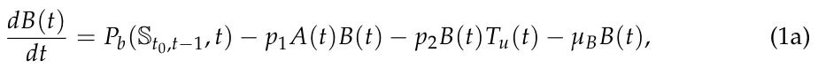

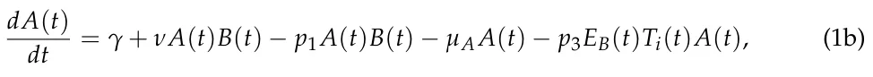

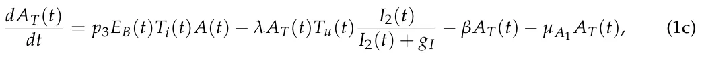

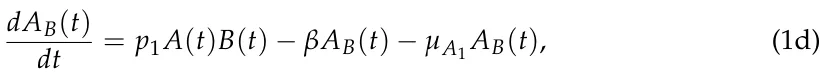

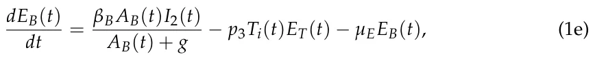

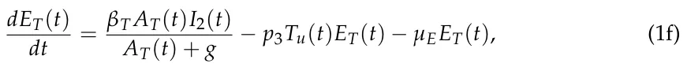

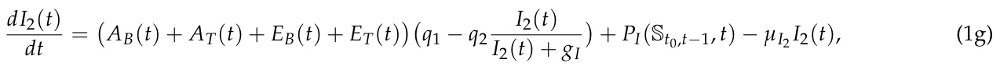

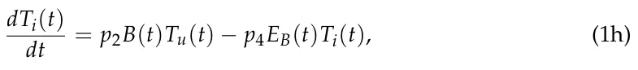

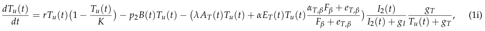

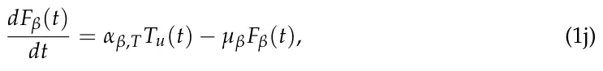

where *P*b : R11 *→* R+ and *P*i : R11 *→* R+ are the dynamical BCG and IL-2 injection policies, respectively, and St0,t−1 *∈* R10×t−1−t0 is the 10-dimensional state of the dynamics between the beginning time of the treatment (*t*0) and up to last step in time (*t −*1). The proposed model is adopted from [22] while the injection terms in Equations (1a) and (1g) are altered to the *P*b and *P*i functions. Parameter values are adopted from [22], the existing state-of-the-art in this context, and summarized in Table 1. A schematic view of the model is shown in Figure 1.

<figure id="fig-1">
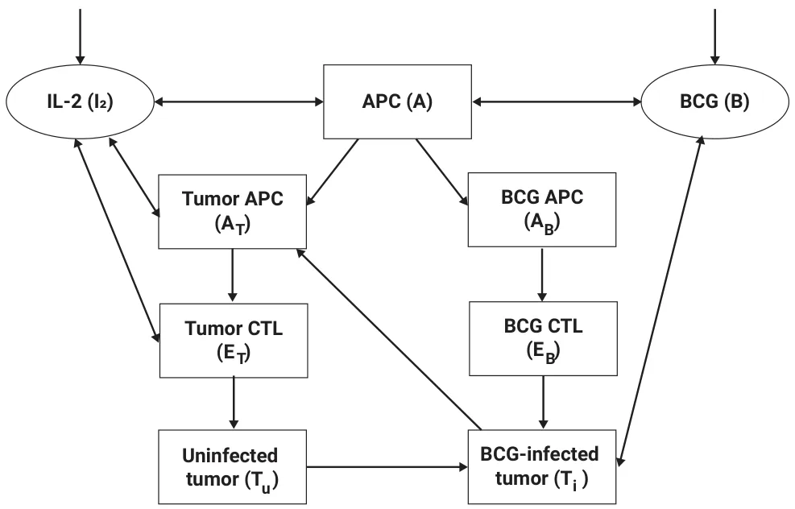
<figcaption><strong>Figure 1.</strong> Our schematic view of the biological model proposed by [22].</figcaption>
</figure>

<figure class="table-figure" id="table-1">
<figcaption><strong>Table 1.</strong> The model’s parameter definitions and average values as adopted from [22].</figcaption>

<table><tr><th>Parameter</th><th>Description</th><th>Average Value</th></tr><tr><td>µA</td><td>APC half life (t−1)</td><td>3.8 · 102</td></tr><tr><td>µA1</td><td>Activated APC half life (t−1)</td><td>1.38 · 10−1</td></tr><tr><td>µE1</td><td>Effector cells mortality rate W/O IL-2 (t−1)</td><td>1.9 · 10−1</td></tr><tr><td>µE2</td><td>Effector cells mortality rate IL-2 (t−1)</td><td>0.034</td></tr><tr><td>muB</td><td>BCG half life (t−1)</td><td>0.1</td></tr><tr><td>p1</td><td>The rate of BCG binding with APC (cells−1t−1)</td><td>1.25 · 10−4</td></tr><tr><td>p2 p3</td><td>Infection rate of tumor cells by BCG (cells−1t−1) Rate of E deactivation after binding with infected tumor cells (cells−1t−1)</td><td>2.8 · 10−8 1.03 · 10−10</td></tr><tr><td>p4</td><td>Rate of destruction of infected tumor cells by effector cells (cells−1t−1)</td><td>1.1 · 10−6</td></tr><tr><td>λ</td><td>Production rate of TAA-APC (t−1)</td><td>1 · 10−6</td></tr><tr><td>βB</td><td>Recruitment rate of effector cells in response to signals released by BCG-infected and activated APC (cells−1t−1I−1 2 )</td><td>1.45 · 108</td></tr><tr><td>βT</td><td>Recruitment rate of effector cells in response to signals released by TAA-infected and activated APC (cells−1t−1I−1 2 )</td><td>1.51 · 106</td></tr></table>

</figure>

<figure class="table-figure" id="table-1b">
<figcaption><strong>Table 1.</strong> <em>Cont.</em></figcaption>

<table><tr><th>Parameter</th><th>Description</th><th>Average Value</th></tr><tr><td>γ</td><td>Initial APC cell numbers (cells−1t−1)</td><td>4.7 · 102</td></tr><tr><td>ν</td><td>Rate of recruited additional resting APCs (cells−1t−1)</td><td>2.6 · 10−7</td></tr><tr><td>r</td><td>Tumor growth rate (t−1)</td><td>4.8 · 10−3</td></tr><tr><td>b</td><td>Bio-effective dose of BCG</td><td>b0 = 2.8 · 10−6</td></tr><tr><td>β</td><td>Migration rate of TAA-APC and bacteria activated APC to the lymph node (cells−1t−1)</td><td>3.4 · 10−2</td></tr><tr><td>α</td><td>Efficacy of an effector cell on tumor cell (cells−1t−1)</td><td>3.7 · 10−6</td></tr><tr><td>g</td><td>Michaelis–Menten constant for BCG activated CTLs and for TAA- CTLs (cells)</td><td>1.0 · 1013</td></tr><tr><td>gT</td><td>Michaelis–Menten constant for tumor cells (cells)</td><td></td></tr><tr><td>K</td><td>Maximal tumor cell population (cells)</td><td>5.2 · 103</td></tr><tr><td>q1</td><td>Rate of IL-2 production IU (cells−1t−1) 1.0 · 1011</td><td></td></tr><tr><td>q2</td><td>The proportion of IL-2 used for differentiation of effector cells IU (cells−1t−1)</td><td>7.0 · 10−3</td></tr><tr><td>µI2</td><td>Degradation rate (t−1)</td><td>1.2 · 10−3</td></tr><tr><td></td><td>Recruitment rate of Tumor-Ag-activated APC cells in response to sig-</td><td></td></tr><tr><td>θ</td><td>nals released after binding effector cells, that react to BCG infection, with infected tumor cells (cells)</td><td>1.15 · 101</td></tr><tr><td>αβ,T</td><td>The release term per tumor cell (cellst−1)</td><td>1.0 · 10−2</td></tr><tr><td>αT,β</td><td>Michaelis-Menten saturation dynamics (1)</td><td></td></tr><tr><td>eT,β</td><td>Michaelis constant (1)</td><td>1.38 · 10−4</td></tr><tr><td>µβ</td><td>The constant rate, accounts for degradation of Fβ (t−1)</td><td>6.9 · 10−1</td></tr><tr><td>gI</td><td>Michaelis–Menten constant for IL-2 (cells)</td><td>10,000</td></tr><tr><td>i2</td><td>Rate of external source (1)</td><td>i0 = 4 · 10−6</td></tr></table>

</figure>

## 3. Personalized BCG-Based Treatment Scheduling

According to [7], the treatment process for BC, as in many other types of cancer, should be divided into two phases: an active phase of *t*1 days in which treatment is actively administered and a “waiting period” of *t*2 days at the end of which the “long-term” clinical outcomes could be assessed. Thus, the overall treatment process consists of *t*∗ := *t*1 + *t*2 days where the treatment itself should be administered only between *t*0 and *t*1. Following [34,35], in our work, we set *t*1 and *t*2 to be 56 and 180 days.

In order to adequately pursue optimal scheduling of treatment, one must first formulate an objective. Arguably, the obvious candidate for such an objective should be the *clinical success* of the treatment. Following [36], clinical success is defined for a given patient as a binary term which assumes the value of 1 if and only if *T*i(*t*∗) + *T*u(*t*∗) = 0 and maxt(*A*(*t*)) *<* 2*A*(*t*0). In words, the treatment is considered to be successful if the cancer cell population is eliminated and the maximal immune system’s response throughout the process is not too excessive since the latter is likely to lead to death. Unfortunately, directly optimizing for this objective is questionable as it does not account for “partial success” (i.e., a great reduction in cancer cell population size), increased immune system’s response (which is not life threatening, i.e., less than 2*A*(*t*0)), the high costs and limited availability of BCG and IL-2, etc.

To overcome the above limitation, in this work we draw inspiration from [18] by considering the problem to be multi-objective where one seeks to reach an optimal clinical state at the end of the treatment course while minimizing the administered substances and the immune system’s response in the process. Obviously, these objectives are inherently incompatible. We formally represent this complex objective using the following optimization problem:

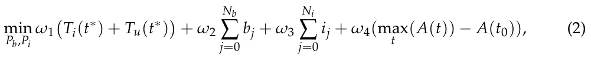

where *N*b and *N*i are the total number of BCG and IL-2 injections administered during the treatment process, respectively. *b*j and *i*j are the amount of BCG and IL-2 injected in the *j*-th injection, respectively. *{ω*i*}*4 i=1 *≥* 0 are the weights assigned to the different objectives (commonly ∑4 i=1 *ω*i = 1, we refer to the assigned values as the *weighting scheme*). *t*0 stands for the time at the beginning of the treatment. *T*i(0) and *T*u(0) are the BCG-infected and uninfected cancer cells. Naturally, both types are to be minimized. *A*(*t*) is the APC cells population size at time *t*, which is used to indicate the immune system’s response to the treatment. Obviously, any excess in autoimmune response is to be minimized as well.

We refer to the first term of the objective (Equation (2)) as the Cancer cell population (as it measures the total number of tumor cells at the end of the treatment course), the second term as the *Administered BCG*, the third term as the *Administered IL-2* and the last term as *Immune system’s response*, or *ISR* for short.

For convenience, we assume that time and drug dosages are bounded and discretized in steps denoted ∆*t*, ∆*b* and ∆*i*, respectively. For our implementation, we assume that time is discretized on an hourly basis and drugs are discretized to be a tenth of the basic amount currently in practice (see [7])—namely, ∆*t* = 1, ∆*b* = 0.1*b*0 and ∆*i* = 0.1*i*0. Furthermore, we assume that each BCG and IL-2 injection dosage is bounded by an amount three times larger than the standard injection dosages *b*0 and *i*0 as a higher dosage in a single injection would likely result in unwanted clinical outcomes and therefore can be treated as unfeasible (see [34] for additional details).

Naïvely, one can iterate over the entire schedule space (i.e, all possible schedules) and obtain an optional schedule for each individual patient. However, such computation is somewhat impractical due to the large schedule space size (i.e., there are 1,209,600 = (30 *·*30 *·* 24 *·* 56) possible schedules for each individual—namely, 30 possible dosages of BCG, 30 possible dosages of IL-2 over 24 h times 56 days). In order to overcome this limitation, we adopt a well-established machine learning-based approach, which has been successfully implemented in the past for similar healthcare settings [37–41], and tailor it to the scheduling task at hand. Specifically, we leverage an advanced machine learning algorithm, recurrent neural networks (RNN) with long-short term memory (LSTM), which showed very promising results in similar clinical planning and scheduling tasks [42–44], to learn and generalize an approximated optimal scheduling policy with relatively negligible computation time in deployment.

In order to adequately implement an RNN model, one needs to define the input and output spaces, along with a “loss function” which determines what a “desired” policy looks like.

We define two input spaces, resulting in two RNNs: a “semi-personalized” (SP) space and a “personalized” (P) space. The resulting RNNs are referred to as the “Semi-personalized RNN” and the “Personalized RNN”, respectively.

Starting with the SP input space, we define the following input space where at time *t*:

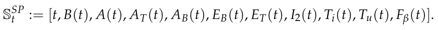

As such, the input to our semi-personalized RNN model is 11 dimensions.

The above input space is considered to be “semi-personalized” since it does not explicitly account for each patient’s *p*3, *γ*, *ν*, which are part of Equation (1). Specifically, the above input space does personalize the treatment scheduled to a certain extent, since it is tailored to the patient’s initial clinical condition unlike the current practice, yet it does not fully realize the personalization potential since these important parameters are set to the average of the population (taken from [22]). In order to assess the role these parameters play in determining an optimal treatment schedule, we further define the P input state space to the following:

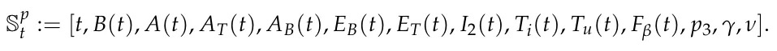

It is important to note that *p*3, *γ*, and *ν* are relatively simple to obtain from a clinical perspective, yet their importance in determining an optimal schedule is an open clinical question.

For both RNNs, the output space is defined to be all allowed dosages of BCG and/or IL-2 for each injection and the “do nothing” option. Since issuing an amount equal to zero at time *t* is identical to not issuing an injection at all at that time, the output of the model is a two-dimensional array, [*b*, *i*], such that *b ∈* [0, ∆*b*, . . . , 3*b*0] and *i ∈* [0, ∆*i*, . . . , 3*i*0] are the amounts of BCG and IL-2 issued to be injected at that time, respectively. Overall, 302 action options at each time step.

In order to ensure that the desired scheduling policy is learned, we introduce a unique loss function based on Equation (2) to both RNNs. Specifically, given the simulated bio-clinical state of the patient after *t*∗ days since the beginning of treatment using Equation (1) and the RNN’s action decisions, we compute the objective’s value. In the following, we vary the values of *w*1 to *w*4 coefficients (i.e., the weighting scheme) in the objective function to explore different clinical preferences and, as a result, scheduling policies. If not stated otherwise, we report the simple uniform case where *w*i = 0.25. To obtain an optimal neural architecture for the RNNs, we used the *AutoKeras* library [45] which utilizes an automatic machine learning approach [46]. Namely, this library finds the optimal neural architecture and its associated weights.

In order to maintain the biological validity of our experiments, we obtained the records of 10 patients diagnosed with BC and treated with the standard (i.e., weekly) BCG with IL-2 treatment protocol (provided as supplementary material). The normal distribution of the tumor growth rate (*p*3), the immune system’s APC cells natural recurrent (*γ*), and BCG-immune system response (*ν*) are obtained by fitting a normal distribution to the obtained data. Equation (1) is solved over time using the numerical method proposed by [47]. If not stated otherwise, we used the ∆*t* = 1 (i.e., 1 h) for our evaluation.

## 4. Evaluation

In the following, we rely on the evaluation metrics introduced and discussed in Section 3. Namely, the cancer cell population, administered BCG, administered IL-2, ISR, and arguably most importantly, the *clinical success*. Note that the cancer cell population and ISR of one patient cannot be directly compared to another since both do not account for the initial clinical state of each patient (i.e., the cancer cell population size and ISR at *t* = 0). Instead, we report the normalized values for both metrics which are naturally defined, respectively, below:

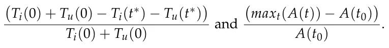

If not stated otherwise, we train both models with the objective presented in Equation (2) with the uniform weighting scheme (i.e., *w*1 = *w*2 = *w*3 = *w*4 = 0.25).

### 4.1. RNN Models

The automatic search for optimal RNN architectures has resulted in two six-layered architectures with the following layers: (1) an input layer with 11 dimensions for the non-personalized RNN and 14 dimensions for the personalized RNN; (2) a fully connected (FC) layer with a ReLu activation function and eight neurons; (3) an LSTM layer with eight neurons; (4) a fully connected (FC) layer with a ReLu activation function and eight neurons; (5) a fully connected (FC) layer with a ReLu activation function and four neurons; and (6) a fully connected (FC) layer that operates also as an output layer with two neurons. A schematic view of the RNN model’s architecture is shown in Figure 2. This architecture does not seem to significantly change for a number of reasonably selected weighting schemes such as the ones examined in Table 2) and temporal discretization options (i.e., different ∆*t*) such as the ones examined in Figure 3. The optimization algorithm *Adam* was used with a learning rate of 0.0062 and a batch size of 8, both selected by simple trail and error.

<figure id="fig-2">
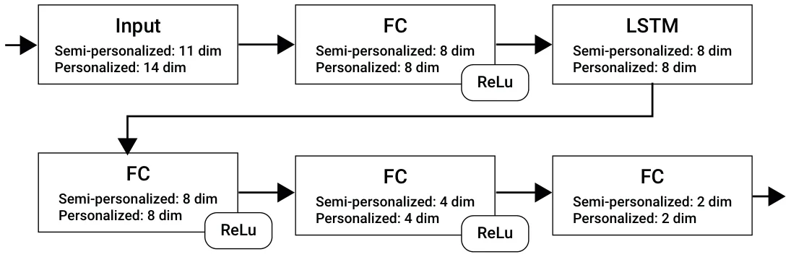
<figcaption><strong>Figure 2.</strong> A schematic view of the RNN model’s architecture, as obtained using the AutoKeras library [45].</figcaption>
</figure>

### 4.2. Learning Process

First, recall that one has to determine the level of temporal details (i.e., different ∆*t*). Figure 3 presents the learning performance of the RNNs based on 1, 4, 24 (1 day), and 168 (1 week) hours of discretization where the x-axis is the number of epochs and the y-axis is the clinical success of the treatment provided by the RNN. A logarithmic relation between the number of epochs and treatment success rate is evident. Moreover, as the level of temporal discretization is higher (i.e., ∆*t* is smaller) the treatment success rate is higher as well. Last, the personalized version of the RNN model (marked by ‘P’ and green lines) is converging to a higher success rate plateau compared to the non-personalized version (marked by ‘SP’ and blue lines).

From Figure 3 it is also apparent that greater temporal detail entails greater clinical success. Specifically, despite the fact that the current standard treatment protocol operates on a weekly basis, scheduling using a finer-grained temporal detail encompasses significant potential clinical benefits.

### 4.3. Comparison

We compared the performance of the trained RNNs, using a 1-hour temporal discretization, against the baseline (weekly) injections schedule (Morales et al. [7]) and the current state of the art (Guzev et al. [22]).

Table 2 compares the four scheduling approaches using three representative weighting schemes. Specifically, each row presents a different weighting scheme ranging from a uniform weighting scheme to a highly clinically-biased weighting scheme (where the clinical components of Equation (2) are over-weighted by a factor of 4).

Starting with the cancer cell population metric, the baseline approach brings about the least favorable outcomes followed by the existing state of the art. Specifically, the existing state of the art provides an improvement over the baseline across the three examined weighting schemes (0.336, 0.315 and 0.401 vs. 0.417 achieved by the baseline). However, both RNNs, and especially the personalized RNN, provide an additional improvement across the three weighting schemes with cancer cell population scores as low as 0.176. Considering the administered BCG and IL-2, the baseline always administers 6 of each across weighting schemes and patients. This is not the case for the three alternatives, which significantly vary across patients and weighting schemes. As one could expect, both RNNs administer more substances as the weights are more clinically-biased with greater standard deviation, aligned with one’s expectation of personalization. At the same time, in the uniform weighting case, both RNNs administer less substances compared to the alternatives. The state-of-the-art approach seems to administer less IL-2 compared to the baseline across weighting schemes yet it varies significantly in its administered BCG. Specifically, it does not seem to present a monotonic pattern as it administrates more substances compared to the alternatives in the uniform case and even more in the slightly clinically-biased objective. However, it presents the smallest amount of drug administration in the more clinically-biased case. This inconsistent pattern may be attributed to the Markovian model adopted by Guzev et al. [22] which obviously is incompatible with dynamics underlying the biological process (see Equation (1)). Considering the ISR, we could not detect a clear and consistent pattern, with a different scheduling approach scoring the highest across the three weighting schemes. One possible explanation to this phenomenon is the high non-linear dependency between the ISR and the treatment as indicated by Equation (1). Finally, considering the clinical success metric, arguably the most important one in practice, we find that the baseline provides the least favorable results which are seconded by the existing state of the art. Specifically, the existing state of the art provides only a minor improvement over the baseline (4%, 5%, and 6% across the examined weighting options) while the proposed RNNs provide a much more significant improvement (Semi-personalized RNN–9%, 10%, and 11%; Personalized RNN–12%, 13%, and 13.5%).

<figure id="fig-3">
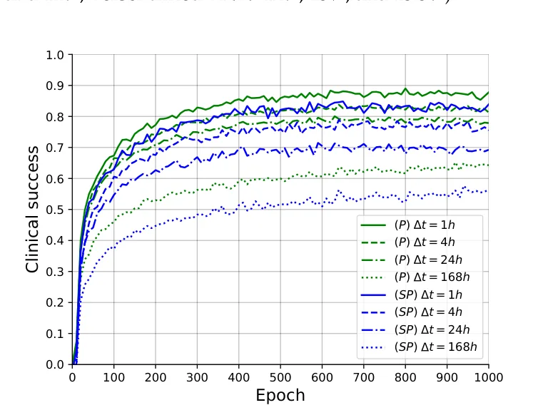
<figcaption><strong>Figure 3.</strong> The RNN models’ performance over the learning process. Each series denoted a different level of temporal discretization. Green series, denoted P, represent the personalized version of the RNN and the blue ones, denoted SP, represent the semi-personalized version.</figcaption>
</figure>

<figure class="table-figure" id="table-2">
<figcaption><strong>Table 2.</strong> A comparison between the proposed Personalized and Semi-personalized RNN models with the two baseline model’s Morales et al. [7] and Guzev et al. [22]. The results are shown as mean <em>±</em> standard deviation. Recall, <em>b</em>0 and <em>i</em>0 are the standard BCG and IL-2 injection amount proposed in [22].</figcaption>

<table><tr><th>Objective Configuration</th><th>Model</th><th>Cancer Cell Population</th><th>Administered BCG</th><th>Administered IL-2</th><th>ISR</th><th>Clinical Success</th></tr><tr><td>w1 = w4 = 0.25</td><td>Baseline [7]</td><td>0.417 ± 0.08</td><td>(6.00 ± 0.00)b0</td><td>(6.00 ± 0.00)i0</td><td>1.46 ± 0.07</td><td>0.642</td></tr><tr><td>w2 = w3 = 0.25</td><td>Guzev et al. [22]</td><td>0.336 ± 0.10</td><td>(6.13 ± 0.42)b0</td><td>(5.64 ± 0.22)i0</td><td>1.42 ± 0.09</td><td>0.681</td></tr><tr><td></td><td>Semi-personalized RNN</td><td>0.324 ± 0.07</td><td>(5.87 ± 0.61)b0</td><td>(5.69 ± 0.29)i0</td><td>1.63 ± 0.12</td><td>0.731</td></tr><tr><td></td><td>Personalized RNN</td><td>0.302 ± 0.07</td><td>(5.70 ± 0.58)b0</td><td>(5.52 ± 0.35)i0</td><td>1.58 ± 0.14</td><td>0.767</td></tr><tr><td>w1 = w4 = 0.33</td><td>Baseline [7]</td><td>0.417 ± 0.08</td><td>(6.00 ± 0.00)b0</td><td>(6.00 ± 0.00)i0</td><td>1.46 ± 0.07</td><td>0.642</td></tr><tr><td>w2 = w3 = 0.17</td><td>Guzev et al. [22]</td><td>0.315 ± 0.08</td><td>(6.24 ± 0.52)b0</td><td>(5.94 ± 0.22)i0</td><td>1.49 ± 0.1</td><td>0.692</td></tr><tr><td></td><td>Semi-personalized RNN</td><td>0.229 ± 0.07</td><td>(6.02 ± 0.70)b0</td><td>(5.89 ± 0.19)i0</td><td>1.51 ± 0.12</td><td>0.740</td></tr><tr><td></td><td>Personalized RNN</td><td>0.176 ± 0.07</td><td>(6.06 ± 0.74)b0</td><td>(5.96 ± 0.21)i0</td><td>1.52 ± 0.13</td><td>0.773</td></tr><tr><td>w1 = w4 = 0.4</td><td>Baseline [7]</td><td>0.417 ± 0.08</td><td>(6.00 ± 0.00)b0</td><td>(6.00 ± 0.00)i0</td><td>1.46 ± 0.07</td><td>0.642</td></tr><tr><td>w2 = w3 = 0.1</td><td>Guzev et al. [22]</td><td>0.401 ± 0.07</td><td>(5.78 ± 0.43)b0</td><td>(5.69 ± 0.31)i0</td><td>1.39 ± 0.06</td><td>0.703</td></tr><tr><td></td><td>Semi-personalized RNN</td><td>0.274 ± 0.06</td><td>(6.26 ± 0.58)b0</td><td>(6.18 ± 0.22)i0</td><td>1.35 ± 0.08</td><td>0.758</td></tr><tr><td></td><td>Personalized RNN</td><td>0.242 ± 0.06</td><td>(6.30 ± 0.61)b0</td><td>(6.19 ± 0.24)i0</td><td>1.37 ± 0.08</td><td>0.779</td></tr></table>

</figure>

### 4.4. Schedule Profiling

In order to better understand the apparent advantage of the RNNs over the baseline, as demonstrated in Table 2, we focus on three representative BC cases taken from [24] which correspond to mild, moderate, and severe BC clinical presentations. These cases differ in their initial cancer cell population size—*T*u(0). For each case, we calculate the schedules derived by the baseline and the RNNs which use a uniform weighting scheme and a 1-hour temporal discretization. The resulting schedules are graphically presented in Figure 4.

<figure id="fig-4">
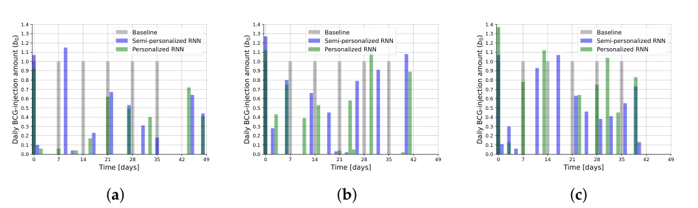
<figcaption><strong>Figure 4.</strong> The treatment schedule derived for each of the examined cases. The x-axis represents time (in days), and the y-axis represents the administered BCG. Grey bars are associated with the baseline approach, blue with the semi-personalized RNN, and green with the personalized RNN. (<strong>a</strong>) Mild case (<em>T</em>u(0) = 2 <em>·</em> 106). (<strong>b</strong>) Moderate case (<em>T</em>u(0) = 7 <em>·</em> 106). (<strong>c</strong>) Severe case (<em>T</em>u(0) = 2 <em>·</em> 107).</figcaption>
</figure>

As can be seen in Figure 4, the baseline approach, per definition, prescribes a regular weekly schedule of fixed injections with a regular dosage of 1*b*0 (six injections overall). That is not the case for the RNNs which produce schedules that vary temporally, in the number of injections and in the prescribed dosages, aligned with one’s expectation of personalization. First, consecutive injections are provided in non-standard intervals which range from less than 24 h to more than 7 days. The number of injections varies as well with both RNNs scheduling more injections compared to the baseline, with the personalized RNN scheduling 8–9 injections and the semi-personalized RNN scheduling 10–11 injections. Similarly, the dosage of each injection varies over time and across the initial clinical state of the patient. Interestingly, as one might expect, larger average dosages are prescribed by the RNNs for more severe cases, ranging from an average of *∼*0.4*b*0 injection dosage for the mild case to *∼*0.9*b*0 injection dosage for the severe case. This is clearly not the case for the baseline.

## 5. Discussion and Conclusions

In this article, we study the task of optimal injection scheduling for bladder cancer (BC) using BCG and IL-2 immunotherapy treatment. To represent the bio-clinical dynamics during the BCG and IL-2 treatment of the BC, we utilized the temporal biological model that uses a set of ordinary differential equations proposed by [22]. Based on this model we propose and evaluate a novel deep learning-based approach for deriving a personalized schedule. Based on real-world patient cases, as well as additional representative ones taken from the literature, we demonstrate the potential benefits of our proposed approach compared to the existing practices [7] and the current state-of-the-art scheduling approach [22]. Specifically, our results show that patients can significantly benefit from a more flexible and personalized temporal scheduling of injections which is associated with better clinical outcomes. The proposed approach requires little to negligible computational power at deployment and can be readily adjusted to accommodate different objectives.

However, the proposed approach and its evaluation are not without limitations. First, despite using the most extensive bio-clinical model we know of to date (see Section 2), it does not take the spatial component of the dynamics into account which is known to have a significant impact on both simulating the in vivo dynamics by themselves and the influence of the BCG treatment [48,49]. As such, more accurate future models may provide slightly different results. Second, the derived scheduling policy is obtained in the form of a deep neural network, a machine learning instance that is notorious for being hard to interpret in clinical and even layman’s terms [50]. Having that said, deep learning is currently at the forefront of many clinical applications in practice [51–55], and significant research is currently being conducted in order to mitigate this limitation.

**Author Contributions:** A.Y.-R.: Conceptualization, visualization, and writing—original draft. E.S.: Conceptualization, formal analysis, and writing—original draft. A.R.: Conceptualization, investigation, supervision, validation, project administration, and writing—review and editing. T.L.: Conceptualization, data curation, formal analysis, methodology, investigation, software, supervision, and writing—review and editing. All authors have read and agreed to the published version of the manuscript.

**Funding:** This research did not receive any specific grant from funding agencies in the public, commercial, or not-for-profit sectors.

**Data Availability Statement:** The data that has been used is presented in the manuscript with the relevant sources.

**Acknowledgments:** The authors wish to thank Svetlana Bunimovich-Mendrazitsky and Ekaterina Guzev for sharing the code of their model and the clinical data used in this research.

**Conflicts of Interest:** The authors have no financial or proprietary interests in any material discussed in this article.

## References

1. Cao, W.; Chen, H.D.; Yu, Y.W.; Li, N.; Chen, W.Q.; Ni, J. Changing profiles of cancer burden worldwide and in China: A secondary analysis of the global cancer statistics 2020. Chin. Med. J. 2021, 134, 783–791. [doi:10.1097/CM9.0000000000001474](https://doi.org/10.1097/CM9.0000000000001474)
2. Weinberg, R.A. How Cancer Arises. Sci. Am. 1996, 275, 62–70. [doi:10.1038/scientificamerican0996-62](https://doi.org/10.1038/scientificamerican0996-62)
3. Mohammadian, M.; Safari, A.; Bakeshei, K.A.; Bakeshei, F.A.; Asti, A.; Mohammadian-Hafshejani, A.; Salehiniya, H.; Emaiyan, M.; Khapour, H. Recent Patterns of Bladder Cancer Incidence and Mortality: A Global Overview. World Cancer Res. J. 2020, 7, e1464.
4. Knowles, M.A. Molecular subtypes of bladder cancer: Jekyll and Hyde or chalk and cheese? Carcinogenesis 2006, 27, 361–373. [doi:10.1093/carcin/bgi310](https://doi.org/10.1093/carcin/bgi310)
5. Shanock, L.R.; Baran, B.E.; Gentry, W.A.; Pattison, S.C.; Heggestad, E.D. Polynomial Regression with Response Surface Analysis: A Powerful Approach for Examining Moderation and Overcoming Limitations of Difference Scores. Discret. Contin. Dyn. Syst. Ser. B 2016, 1279–1295.
6. Urdaneta, G.; Solsona, E.; Palou, J. Intravesical chemotherapy and BCG for the treatment of bladder cancer: Evidence and opinion. Eur. Urol. Suppl. 2008, 7, 542–547. [doi:10.1016/j.eursup.2008.04.006](https://doi.org/10.1016/j.eursup.2008.04.006)
7. Morales, A.; Eidinger, D.; Bruce, A. Intracavity Bacillus Calmette-Guérin in the treatment of superficial bladder tumors. J. Urol 1976, 116, 180–183. [doi:10.1016/S0022-5347(17)58737-6](https://doi.org/10.1016/S0022-5347%2817%2958737-6)
8. Redelman-Sidi, G.; Glickman, M.S.; Bochner, B.H. The mechanism of action of BCG therapy for bladder cancer—A current perspective. Nat. Rev. Urol. 2014, 11, 153–162. [doi:10.1038/nrurol.2014.15](https://doi.org/10.1038/nrurol.2014.15)
9. Herr, H.W.; Laudone, V.P.; Badalament, R.A.; Oettgen, H.F.; Sogani, P.C.; Freedman, B.D.; Melamed, M.R.; Whitmore, W.F. Bacillus Calmette-Guérin therapy alters the progression of superficial bladder cancer. J. Clin. Oncol. 1988, 6, 1450–1455. [doi:10.1200/JCO.1988.6.9.1450](https://doi.org/10.1200/JCO.1988.6.9.1450)
10. Anastasiadis, A.; de Reijke, T.M. Best practice in the treatment of nonmuscle invasive bladder cancer. Ther. Adv. Urol. 2012, 4, 13–32. [doi:10.1177/1756287211431976](https://doi.org/10.1177/1756287211431976)
11. Lamm, D. Improving Patient Outcomes: Optimal BCG Treatment Regimen to Prevent Progression in Superficial Bladder Cance. Eur. Urol. Suppl. 2006, 5, 654–659. [doi:10.1016/j.eursup.2006.04.008](https://doi.org/10.1016/j.eursup.2006.04.008)
12. Ylösmäki, E.; Fusciello, M.; Martins, B.; Feola, S.; Hamdan, F.; Chiaro, J.; Ylosmaki, L.; Vaughan, M.J.; Viitala, T.; Kulkarni, P.S.; et al. Novel personalized cancer vaccine platform based on Bacillus Calmette-Guerin. J. Immunother. Cancer 2021, 9, e002707. [doi:10.1136/jitc-2021-002707](https://doi.org/10.1136/jitc-2021-002707)
13. Bhattacharya, S.; Sah, P.P.; Banerjee, A.; Ray, S. Structural impact due to PPQEE deletion in multiple cancer associated protein - Integrin alpha: An In silico exploration. Biosystems 2020, 198, 104216. [doi:10.1016/j.biosystems.2020.104216](https://doi.org/10.1016/j.biosystems.2020.104216)
14. Jordao, G.; Tavares, J.N. Mathematical models in cancer therapy. Biosystems 2017, 162, 12–23. [doi:10.1016/j.biosystems.2017.08.007](https://doi.org/10.1016/j.biosystems.2017.08.007)
15. Hornberg, J.J.; Bruggeman, F.J.; Westerhoff, H.V.; Lankelma, J. Cancer: A Systems Biology disease. Biosystems 2006, 83, 81–90. [doi:10.1016/j.biosystems.2005.05.014](https://doi.org/10.1016/j.biosystems.2005.05.014)
16. Chaplain, M.; Matzavinos, A. Mathematical Modelling of Spatio-temporal Phenomena in Tumour Immunology. In Tutorials in Mathematical Biosciences III: Cell Cycle, Proliferation, and Cancer; Friedman, A., Ed.; Springer: Berlin/Heidelberg, Germany, 2006; pp. 131–183.
17. Ghaffari, A.; Naserifar, N. Optimal therapeutic protocols in cancer immunotherapy. Comput. Biol. Med. 2010, 40, 261–270. [doi:10.1016/j.compbiomed.2009.12.001](https://doi.org/10.1016/j.compbiomed.2009.12.001)
18. Ahn, I.; Park, J. Drug scheduling of cancer chemotherapy based on natural actor-critic approach. Biosystems 2011, 106, 121–129. [doi:10.1016/j.biosystems.2011.07.005](https://doi.org/10.1016/j.biosystems.2011.07.005)
19. Peter, J.; Schaal, S. Natural Actor-Critic. Neurocomputing 2008, 71, 1180–1190. [doi:10.1016/j.neucom.2007.11.026](https://doi.org/10.1016/j.neucom.2007.11.026)
20. De Pillis, L.G.; Radunskaya, A. The dynamics of an optimally controlled tumor model: A case study. Math. Comput. Model. 2003, 37, 1221–1244. [doi:10.1016/S0895-7177(03)00133-X](https://doi.org/10.1016/S0895-7177%2803%2900133-X)
21. Bazrafshan, N.; Lotfi, M.M. A finite-horizon Markov decision process model for cancer chemotherapy treatment planning: An application to sequential treatment decision making in clinical trials. Ann. Oper. Res. 2020, 295, 483–502. [doi:10.1007/s10479-020-03706-5](https://doi.org/10.1007/s10479-020-03706-5)
22. Guzev, E.; Halachmi, S.; Bunimovich-Mendrazitsky, S. Additional Extension of the Mathematical Model for BCG Immunotherapy of Bladder Cancer and Its Validation by Auxiliary Tool. Int. J. Nonlinear Sci. Numer. Simul. 2019, 20, 675–689. [doi:10.1515/ijnsns-2018-0181](https://doi.org/10.1515/ijnsns-2018-0181)
23. Shaikhet, L.; Bunimovich-Mendrazitsky, S. Stability analysis of delayed immune response BCG infection in bladder cancer treatment model by stochastic perturbations. Comput. Math. Methods Med. 2018, 2018, 9653873. [doi:10.1155/2018/9653873](https://doi.org/10.1155/2018/9653873)
24. Lazebnik, T.; Bunimovich-Mendrazitsky, S. Improved Geometric Configuration for the Bladder Cancer BCG-Based Immunotherapy Treatment Model. In Proceedings of the Mathematical and Computational Oncology: Third International Symposium, ISMCO 2021, Virtual Event, 11–13 October 2021; Bebis, G., Gaasterland, T., Kato, M., Kohandel, M., Wilkie, K., Eds.; Springer: Berlin/Heidelberg, Germany, 2021; Volume 13060.
25. Rentsch, C.A.; Biot, C.; Gsponer, J.R.; Bachmann, A.; Albert, M.L.; Breban, R. BCG-Mediated Bladder Cancer Immunotherapy: Identifying Determinants of Treatment Response Using a Calibrated Mathematical Model. PLoS ONE 2013, 8, e56327. [doi:10.1371/journal.pone.0056327](https://doi.org/10.1371/journal.pone.0056327)
26. Starkov, K.E.; Bunimovich-Mendrazitsky, S. Dynamical properties and tumor clearance conditions for a nine-dimensional model of bladder cancer immunotherapy. Am. Inst. Math. Sci. 2016, 13, 1059–1075. [doi:10.3934/mbe.2016030](https://doi.org/10.3934/mbe.2016030)
27. unimovich-Mendrazitsky, S.; Halachmi, S.S.; Kronik, N. Improving Bacillus Calmette Guerin (BCG) immunotherapy for bladder cancer by adding interleukin-2 (IL-2): A mathematical model. Math. Med. Biol. 2015, 33, 159–188.
28. Song, D.; Powles, T.; Shi, L.; Zhang, L.; Ingersol, M.A.; Lu, Y.J. Bladder cancer, a unique model to understand cancer immunity and develop immunotherapy approaches. J. Pathol. 2019, 249, 151–165. [doi:10.1002/path.5306](https://doi.org/10.1002/path.5306)
29. Bunimovich-Mendrazitsky, S.; Pisarev, V.; Kashdan, E. Modeling and simulation of a low-grade urinary bladder carcinoma. Comput. Biol. Med. 2014, 58, 118–129. [doi:10.1016/j.compbiomed.2014.12.022](https://doi.org/10.1016/j.compbiomed.2014.12.022)
30. Bunimovich-Mendrazitsky, S.; Goltser, Y. Use of quasi-normal form to examine stability of tumor-free equilibrium in a mathematical model of BCG treatment of bladder cancer. Math. Biosci. Eng. 2011, 8, 529–547.
31. Eikenberry, S.; Thalhauser, C.; Kuang, Y. Tumor-immune interaction, surgical treatment, and cancer recurrence in a mathematical model of melanoma. PLoS Comput. Biol. 2009, e1000362. [doi:10.1371/journal.pcbi.1000362](https://doi.org/10.1371/journal.pcbi.1000362)
32. Lazebnik, T.; Bunimovich-Mendrazitsky, S.; Haroni, N. PDE Based Geometry Model for BCG Immunotherapy of Bladder Cancer. Biosystems 2021, 200, 104319. [doi:10.1016/j.biosystems.2020.104319](https://doi.org/10.1016/j.biosystems.2020.104319)
33. Matzavinos, A.; Chaplain, M.A.; Kuznetsov, V.A. Mathematical modelling of the spatio-temporal response of cytotoxic T-lymphocytes to a solid tumour. Math. Med. Biol. 2004, 21, 1–34. [doi:10.1093/imammb/21.1.1](https://doi.org/10.1093/imammb/21.1.1)
34. Guallar-Garrido, S.; Julián, E. Bacillus Calmette-Guerin (BCG) Therapy for Bladder Cancer: An Update. Immunotargets Ther. 2020, 13, 1–11. [doi:10.2147/ITT.S202006](https://doi.org/10.2147/ITT.S202006)
35. Sanli, O.; Dobruch, J.; Knowles, M.A.; Burger, M.; Alemozaffar, M.; Nielsen, M.E.; Lotan, Y. Bladder cancer. Nat. Rev. Dis. Primers 2017, 17022. [doi:10.1038/nrdp.2017.22](https://doi.org/10.1038/nrdp.2017.22)
36. Bunimovich-Mendrazitsky, S.; Byrne, H.; Stone, L. Mathematical Model of Pulsed Immunotherapy for Superficial Bladder Cancer. Bull. Math. Biol. 2008, 70, 2055–2076. [doi:10.1007/s11538-008-9344-z](https://doi.org/10.1007/s11538-008-9344-z)
37. Shah, P.; Kendall, F.; Khozin, S.; Goosen, R.; Hu, J.; Laramie, J.; Ringel, M.; Schork, N. Artificial intelligence and machine learning in clinical development: A translational perspective. Npj Digit. Med. 2019, 2, 69. [doi:10.1038/s41746-019-0148-3](https://doi.org/10.1038/s41746-019-0148-3)
38. Ngiam, K.Y.; Khor, I.W. Big data and machine learning algorithms for health-care delivery. Lancet Oncol. 2019, 20, e262–e273. [doi:10.1016/S1470-2045(19)30149-4](https://doi.org/10.1016/S1470-2045%2819%2930149-4)
39. Colic, S.; Wither, R.G.; Lang, M.; Zhang, L.; Eubanks, J.H.; Bardakjian, B.L. Prediction of antiepileptic drug treatment outcomes using machine learning. J. Neural Eng. 2016, 14, 016002. [doi:10.1088/1741-2560/14/1/016002](https://doi.org/10.1088/1741-2560/14/1/016002)
40. Kleinerman, A.; Rosenfeld, A.; Rosemarin, H. Machine-learning based routing of callers in an Israeli mental health hotline. Isr. J. Health Policy Res. 2022, 11, 1–15. [doi:10.1186/s13584-022-00534-9](https://doi.org/10.1186/s13584-022-00534-9)
41. Rosemarin, H.; Rosenfeld, A.; Lapp, S.; Kraus, S. LBA: Online Learning-Based Assignment of Patients to Medical Professionals. Sensors 2021, 21, 3021. [doi:10.3390/s21093021](https://doi.org/10.3390/s21093021)
42. Lim, B. Forecasting Treatment Responses Over Time Using Recurrent Marginal Structural Networks. In Proceedings of the Advances in Neural Information Processing Systems, Montreal, QC, Canada, 3–8 December 2018; Volume 31.
43. Poulos, J.; Zeng, S. RNN-based counterfactual prediction, with an application to homestead policy and public schooling. J. R. Stat. Soc. Ser. C 2021, 70, 1124–1139. [doi:10.1111/rssc.12511](https://doi.org/10.1111/rssc.12511)
44. Wang, L.; Tang, R.; He, X.; He, X. Hierarchical Imitation Learning via Subgoal Representation Learning for Dynamic Treatment Recommendation. In Proceedings of the Fifteenth ACM International Conference on Web Search and Data Mining, Tempe, AZ, USA, 21–25 February 2022; pp. 1081–1089.
45. Jin, H.; Song, Q.; Hu, X. Auto-Keras: An Efficient Neural Architecture Search System. In Proceedings of the 25th ACM SIGKDD International Conference on Knowledge Discovery & Data Mining, Anchorage, AK, USA, 4–8 August 2019; pp. 1946–1956.
46. Waring, J.; Lindvall, C.; Umeton, R. Automated machine learning: Review of the state-of-the-art and opportunities for healthcare. Artif. Intell. Med. 2020, 104, 101822. [doi:10.1016/j.artmed.2020.101822](https://doi.org/10.1016/j.artmed.2020.101822)
47. Skeel, R.D.; Berzins, M. A Method for the Spatial Discretization of Parabolic Equations in One Space Variable. IAM J. Sci. Stat. Comput. 1990, 11, 1–32. [doi:10.1137/0911001](https://doi.org/10.1137/0911001)
48. Lazebnik, T.; Yanetz, S.; Bunimovich-Mendrazitsky, S.; Haroni, N. Treatment of Bladder Cancer Using BCG Immunotherapy: PDE Modeling. Partial. Differ. Equations 2020, 26, 203–219.
49. Lazebnik, T. Cell-Level Spatio-Temporal Model for a Bacillus Calmette–Guérin-Based Immunotherapy Treatment Protocol of Superficial Bladder Cancer. Cells 2022, 15, 2372. [doi:10.3390/cells11152372](https://doi.org/10.3390/cells11152372)
50. Samek, W.; Montavon, G.; Lapuschkin, S.; Anders, C.J.; Müller, K.R. Explaining Deep Neural Networks and Beyond: A Review of Methods and Applications. Proc. IEEE 2021, 109, 247–278. [doi:10.1109/JPROC.2021.3060483](https://doi.org/10.1109/JPROC.2021.3060483)
51. Gulum, M.A.; Trombley, C.M.; Kantardzic, M. A Review of Explainable Deep Learning Cancer Detection Models in Medical Imaging. Appl. Sci. 2021, 11, 4573. [doi:10.3390/app11104573](https://doi.org/10.3390/app11104573)
52. Bai, X.; Wang, X.; Liu, X.; Liu, Q.; Song, J.; Sebe, N.; Kim, B. Explainable deep learning for efficient and robust pattern recognition: A survey of recent developments. Pattern Recognit. 2021, 120, 108102. [doi:10.1016/j.patcog.2021.108102](https://doi.org/10.1016/j.patcog.2021.108102)
53. Veturi, Y.A.; Woof, W.; Lazebnik, T.; Moghul, I.; Wagner, S.K.; de Guimarães, T.A.C.; Daich Varela, M.; Patel, P.J.; Beck, S.; Webster, A.R.; et al. SynthEye: Investigating the Impact of Synthetic Data on Artificial Intelligence-assisted Gene Diagnosis of Inherited Retinal Disease. Ophthalmol. Sci. 2023, 3, 100258. [doi:10.1016/j.xops.2022.100258](https://doi.org/10.1016/j.xops.2022.100258)
54. Lazebnik, T.; Bahouth, Z.; Bunimovich-Mendrazitsky, S.; Halachmi, S. Predicting acute kidney injury following open partial nephrectomy treatment using SAT-pruned explainable machine learning model. BMC Med. Inform. Decis. Mak. 2022, 22, 133. [doi:10.1186/s12911-022-01877-8](https://doi.org/10.1186/s12911-022-01877-8)
55. Rosenfeld, A.; Benrimoh, D.; Armstrong, C.; Mirchi, N.; Langlois-Therrien, T.; Rollins, C.; Tanguay-Sela, M.; Mehltretter, J.; Fratila, R.; Israel, S.; et al. Big Data analytics and artificial intelligence in mental healthcare. In Applications of Big Data in Healthcare; Elsevier: Amsterdam, The Netherlands, 2021; pp. 137–171.
