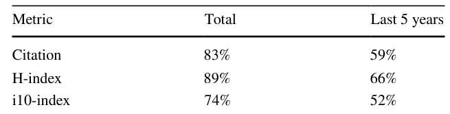
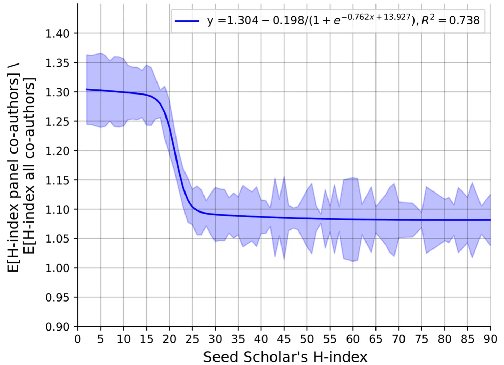

## Introduction

An individual’s online presence plays a central role in shaping one’s identity and reputation within society (Lowenthal & Dennen, 2017; Popescu, 2019). The increasing popularity of social media platforms is a testament to this phenomenon, as people strive to project a desired image to their online audience (Ashraf et al., 2023; Petroni, 2019). Within the academic community, online academic profiles have become essential reflections of scholars’ professional identities (Helal & Ozuem, 2018; Feher, 2021). Unfortunately, many academic profiles, and especially those (semi-)automatically generated by various bibliometric services, offer limited freedom for scholars’ self-information disclosure, leading scholars to

Teddy Lazebnik and Ariel Rosenfeld have contributed equally to this work.

carefully select which information to present (Martín-Martín et al., 2018). One intriguing aspect of this self-information disclosure, which to the best of our knowledge has yet to be examined in the literature, is the selection of co-authors one wishes to highlight in his/her academic profile.

In the realm of social psychology, self-identification theory (Goffman et al., 2016; Baumeister, 1982) provides a theoretical framework for understanding how individuals shape their public image and manage their self-presentation in various social contexts (Lough, 2023; Harris & Brison, 2023). For example, Guadagno and Cialdini (2007) studied how self-presentation strategies may lead to different outcomes based on the presenter’s gender. While several variants of the theory have been posed over the years, most proposals seem to agree on several fundamental concepts including the notion that individuals strive to present themselves in a way that aligns with their desired self-image, taking into account the perceived expectations and norms of the audience they wish to impress or influence (Liu & Brown, 2014; Schlenker & Leary, 1982). For instance, Krasnova et al. (2015) show that, on average, individuals tend to copy the self-presentation decisions and norms practiced by their peers, even if these may bring about undesired outcomes. In the academic context, scholars’ online profiles serve as a crucial platform for self-presentation, offering scholars the opportunity to curate an image they wish to project to their peers, potential collaborators, and even funding bodies (Macfarlane, 2020; Brown et al., 1998). Thus, conceivably, scholars may wish to enhance their own perceived image by aligning themselves with strong and prominent co-authors. In many ways, this expectation to benefit from one’s association with others is also connected to the sociological concept of “social capital” (Adler & Kwon, 2002). That is, social connections and interactions are assumed to have inherent value and can thus lead to various positive outcomes in personal and professional settings alike. Indeed, prior work has established that collaboration with leading researchers can positively impact one’s academic career (Amjad et al., 2017; Shen et al., 2021). For instance, Tarkang et al. (2017) reports that young scholars tend to perceive collaborations with senior scholars as instrumental in helping them publish in high-ranking journals. However, the choice to *highlight* specific co-authors in one’s academic profile, as opposed to the *actual collaboration* with that co-author, need not necessarily follow the same pattern. First, various social and professional norms such as *reciprocally* may also govern this unique socio-academic dynamic. That is, when one scholar includes another in his/her co-authorship panel, the other may feel pressured to reciprocate and do the same, as is often encountered in various professional and social interactions (Falcó-Gimeno & Munoz, 2017; Idan & Feigenbaum, 2019). In addition, the value derived from the collaboration may be traced back to the learning and mentoring experienced through that collaboration and significantly less to the association itself presented in one’s profile (van Rijnsoever & Hessels, 2021).

It is important to note that scholars may have different levels of control over the information displayed on their academic profile depending on the platform they use. This includes the presentation of publications, achievements, expertise, and collaborative networks, to name a few (Hurtado et al., 2009). Focusing on Google Scholar1 (GS), arguably the most widely used academic search engine and bibliographic database to date, scholars are provided with a simple interface to manage their academic profile (Gusenbauer, 2019). The profile includes a comprehensive list of that scholar’s publications, scientometrics, and various meta-data details such as name, field of study, and affiliation [??Abo]. In addition, the profile includes a social feature that is almost entirely under the scholar’s control – the *co-authorship panel*. This co-authorship panel allows scholars to select a subset of their co-authors, as determined by their indexed publications, to be showcased in a central location on their profile.

In this work, we examine whether the co-authors selected for inclusion in one’s co-authorship panel on GS can be explained by their associated scientometrics (i.e., citation counts, i10-index, and h-index). In addition, we examine the prevalence of reciprocally within this socio-academic dynamic. Methodologically, we scrape and analyze a novel and comprehensive set of roughly 120,000 GS profiles. For each profile, in addition to the provided meta-data of this scholar, the entire set of co-authors was extracted and the co-authorship panel was identified. Overall, our results seem to suggest that, indeed, scholars tend to favor co-authors with higher scientometrics over others for inclusion in their co-authorship panels. Interestingly, as one’s own scientometrics are higher, the tendency to include co-authors with high scientometrics is diminishing. Furthermore, we find that reciprocality is central in explaining scholars’ panel selections.

The article is organized as follows: In Sect. 2, we describe our data collection procedures and the adopted analytical approach. Next, in Sect. 3, we present our main findings. Following, in Sect. 4, we interpret the results in context. Finally, Sect. 5 concludes the obtained results and provides directions for future work.

## Materials and methods

### Data

To obtain a diverse and comprehensive set of scholars, we adopted 359 GS profiles which were retrieved and analyzed by Zargari et al. (2023) (albeit for other purposes). Per the authors’ study design, these profiles cover both high, middle, and low-ranked US universities,2 and are associated with four distinct disciplines: Biology (103), Computer Science (101), Philosophy (52), and Psychology (103). For each of these 359 scholars, which are at the focus of our subsequent analysis and can be conceptually thought of as “seed” scholars, we retrieved and scraped the GS profiles of *all* their co-authors, and all their co-authors’ co-authors – resulting in roughly 160,000 profiles. For 120,000 of these profiles (74.79%), *non-empty co-authorship panel* was observed. Basically, for each scholar, we retrieved the GS profiles of any scholar who either co-authored a publication with that scholar or has co-authored a publication with one of his/her co-authors. Computationally speaking, “seed” scholar is a scholar whose profile is used as the starting point in the scarping process. That is, we consider GS as a graph where each profile is a node, and there is an edge between two nodes if the two scholars had co-authored a publication. Note that all seed scholars had a non-empty co-authorship panel.

For each profile in the resulting dataset (both seed profiles and otherwise), we collected the six scientometrics provided in the GS profile: citation count, i10-index, and h-index; once since 2018 (i.e., last 5 years), and once in total as of June 2023 (i.e., lifetime). For completeness, we further determine the scholar’s academic age and estimate his/her gender. For the academic age, we consider the timespan between one’s earliest indexed publication and the current year (2023). As for gender, we adopted the widely used model of Lazebnik and Rosenfeld (2023) which predicts gender according to one’s name. To avoid ambiguity, we determine one’s gender only if the model’s confidence is higher than 95%. The remaining 21.45% profiles were disregarded in the corresponding analysis. Statistically, all data is approximately normally distributed according to the Anderson-Darling test at *p* ≤ 0.01.

### Analytical approach

Our analytical approach consists of four phases: First, we start our investigation with a basic statistical analysis examining whether the scholars included in one’s co-authorship panel favorably compare, in scientometric terms, to those who were excluded from it. To that end, for each seed scholar, we compare the mean scientometrics of the co-authors included in the panel to that of the co-authors excluded from it using standard two-tailed independent samples t-tests. In addition, we performed paired two-tailed t-tests at the population level with each scholar representing a single sample consisting of the mean scientometrics of those included in his/her panel on the one hand and that of those excluded from it on the other.

Second, we examine the possible connection between one’s own scientometrics metric and his/her alignment with the studied phenomenon. Specifically, we study whether one’s tendency to select higher-profile co-authors for inclusion in his/her co-authorship panel is regulated by their own scientometrics. To that end, for each seed scholar, we compute the ratio between the mean of each scientometric of those included in the panel and that of the entire set of co-authors and examine these ratios’ possible relation with the scholar’s own scientometrics. Distinctly, the higher the ratio in any of the examined scientometrics – the more often one chooses higher-performing co-authors over others for inclusion in his/her co-authorship panel. These ratios are used as dependent variables in separate regression models with the scholar’s own scientometric acting as the independent variables. To determine the best fit, we use the SciMed model (Simon-Keren et al., 2023), a symbolic regression tool that searches a large and versatile set of analytical functions given an optimization objective and a dataset. Third, we turn to examine the prevalence of reciprocality. We start by examining the prevalence of reciprocal inclusion in the entire population and look for possible differences across disciplines using a chi-square test with post-hoc chi-square tests with Bonferroni corrections. Then, using a machine learning-based analysis, we train and evaluate a Random Forest (RF) model (Belgiu & Draguţ, 2016) with grid search for the hyperparameter tuning (Liu et al., 2006). That is, we examine if, and to what extent, the scientometrics of two scholars who have published together in the past could explain the reciprocal inclusion in each other’s co-authorship panels or the lack thereof. The models are trained using a standard 80–20 split to a train (80%) and test (20%) cohorts of the dataset (Lazebnik et al., 2022; Savchenko & Lazebnik, 2022) and evaluated using the standard metrics of accuracy, recall, precision, and *F*1 score (see Ley et al., 2022 for the relevant statistical background). To determine feature importance, we adopted the standard technique used for RF models by removing each feature, one feature at a time, and computing the change in the model’s accuracy to obtain the relative importance (Qi et al., 2012).

<figure class="table-figure" id="table-1">
<figcaption><strong>Table 1</strong> The percent of scholars for which the co-authors included in the co-authorship panel significantly outperform, in scientometric terms, those who were excluded from it at <em>p</em> ≤ .05</figcaption>

</figure>

<figure class="table-figure" id="table-2">
<figcaption><strong>Table 2</strong> The <em>p</em>-value of an independent sample two-tailed t-test comparing the scientometrics (citation, H-index, and i10-index) between the co-authors included in one’s co-authorship panel and those who were excluded from it. ∗ denotes<em>p</em> ≤ .05,∗∗ denotes<em>p</em> ≤ .01 and ∗∗∗ denotes <em>p</em> ≤ .001</figcaption>

<table><tr><th>Metric</th><th>Total</th><th>Last 5 years</th></tr><tr><td>Citation</td><td>1.34 ⋅10−4∗∗∗</td><td>0.047∗</td></tr><tr><td>H-index</td><td>3.53 ⋅10−5∗∗∗</td><td>0.009∗∗</td></tr><tr><td>i10-index</td><td>6.74 ⋅10−6∗∗∗</td><td>0.059</td></tr></table>

</figure>

## Results

We start by reporting the main statistical characteristics of our dataset. For the entire set of seed scholars (i.e., the sample in the focus of our analysis), the mean academic age is 19.98 ± 9.98 with a range between 4 and 39. Considering gender, our data is characterized by approximately 3:1 male-to-female ratio. Considering scientometrics, the mean total citation count is 11375.36 ± 20608.60 with a range of 16 −−170195 ; the mean total h-index is 36.25 ± 27.18 with a range of 2 −−158 ; and mean total i10-index is 75.80 ± 94.70 with a range of 1 −−921 . Similarly, for last 5 years’ version of the scientometrics, mean citation count is 4453.63 ± 7960.33 with a range of 10 −−93743 ; mean h-index is 25.13 ± 16.54 with a range of 2 − 139 ; and i10-index is 52.28 ± 55.16 with a range of 0 −−379.

Next, we consider each seed scholar individually and examine whether the co-authors included in his/her co-authorship panel are statistically associated with higher scientometrics than those excluded from it. As can be seen from Table 1, most scholars seem to align with this expectation with higher rates being recorded for the scientometrics calculated throughout the co-authors’ lifetime (i.e., total) as opposed to the last 5 years. At the population level, as can be seen in Table 2, the results seem to agree with those reported above, with the scientometrics calculated throughout one’s lifetime demonstrating high levels of statistical significance, all at *p* ≤ .001 , compared to the those calculated based on the last 5 years which present lower levels of statistical significance, if any.

Focusing on individual seed scholars, we consider the possible connection between one’s own scientometrics and the ratio between the scientometrics of those included in his/her co-authorship panel and all his/her co-authors. Considering the lifetime H-index as a representative example, Fig. 1 presents a reversed sigmoid-like relation that seems to emerge from the data with following the mathematical form *y* = 1.304 − 1+e−0.762x+13.927 0.198 where *y* is the mean lifetime H-index of the panel co-authors divided by the mean lifetime H-index of all the co-authors and *x* is the seed scholar’s lifetime H-index. The coefficient of determination of this model is considered high, with *R*2 = 0.738 . Similar patterns, albeit with lower *R*2 scores, were identified for the lifetime citations and i10-index ( *R*2 of 0.417 and 0.386, respectively). Lower *R*2 scores were recorded for the last 5 years’ citations, H-index and i10-index ( *R*2 scores of 0.358 , 0.512 and 0.317 , respectively). Similar analyses considering gender, discipline, or academic age, did not yield any statistically significant differences.

<figure id="fig-1">

<figcaption><strong>Fig. 1</strong> The relation between one’s lifetime H-index and the ratio between his/her co-authorship panel’s mean life H-index and all his/her co-authors’ lifetime H-index. The shaded area denotes the confidence interval which includes 95% of the data</figcaption>
</figure>

<figure class="table-figure" id="table-3">
<figcaption><strong>Table 3</strong> Inclusion reciprocality across academic disciplines</figcaption>

<table><tr><th>Discipline</th><th>One-Way</th><th>Reciprocal</th></tr><tr><td>Philosophy</td><td>52.57% (175)</td><td>47.43% (194)</td></tr><tr><td>Biology</td><td>30.18% (1659)</td><td>69.82% (717)</td></tr><tr><td>Computer Science</td><td>48.08% (1767)</td><td>51.92% (1636)</td></tr><tr><td>Psychology</td><td>37.98% (1703)</td><td>62.02% (1043)</td></tr><tr><td>p-value (Cohen’s d)</td><td></td><td>0.017 (0.26)</td></tr><tr><td>Average</td><td>42.20%</td><td>57.80%</td></tr></table>

</figure>

Following, we focus on reciprocality in co-authorship panel inclusion. As shown in Table 3, a high average of 57.8% of all inclusions in one’s co-authorship panel are reciprocal, i.e., both scholars include each other in their respective panels. When breaking scholars by disciplines, we see that the disciplines differ significantly at *p* ≤ .05 . Specifically, we find that scholars from Biology present considerably higher levels of reciprocity (almost every seven out of ten inclusions – 69.82%) compared to all other disciplines. Similarly, scholars from Psychology show significantly higher levels of reciprocity (more than every six out of ten inclusions – 62.02%) compared to philosophy (less than half – 47.43%). All other differences are not found to be statistically significant. Similar analyses considering one’s own scientometrics, gender, or academic age, did not yield any statistically significant differences.

<figure class="table-figure" id="table-4">
<figcaption><strong>Table 4</strong> The performance of a Random Forest (RF) classifier model that predicts if an inclusion in one’s co-author panel is reciprocal or not</figcaption>

<table><tr><th>Model</th><th>Cohort</th><th>Accuracy</th><th>Recall</th><th>Precision</th><th>F1 score</th></tr><tr><td>Random Forest</td><td>Train</td><td>0.93</td><td>0.88</td><td>0.97</td><td>0.92</td></tr><tr><td></td><td>Test</td><td>0.85</td><td>0.80</td><td>0.87</td><td>0.83</td></tr></table>

</figure>

<figure class="table-figure" id="table-5">
<figcaption><strong>Table 5</strong> Feature importance of a Random Forest classifier that predicts if the 2nd scholar would reciprocate or not to the 1st scholar’s inclusion his/her co-author panel</figcaption>

<table><tr><th>Feature</th><th>Feature importance</th><th>Feature importance (reduced)</th></tr><tr><td>1st scholar’s gender</td><td>0.002</td><td>0.005</td></tr><tr><td>1st scholar’s one way authors count</td><td>0.037</td><td>0.099</td></tr><tr><td>1st scholar’s mutual inclusion count</td><td>0.040</td><td>0.107</td></tr><tr><td>1st scholar’s number of articles</td><td>0.016</td><td>0.040</td></tr><tr><td>1st scholar’s number of co-authors</td><td>0.031</td><td>0.042</td></tr><tr><td>1st scholar’s total citations</td><td>0.015</td><td>0.030</td></tr><tr><td>1st scholar’s citations from the last 5-years</td><td>0.012</td><td>0.031</td></tr><tr><td>1st scholar’s H-index</td><td>0.013</td><td>0.029</td></tr><tr><td>1st scholar’s H-index from the last 5-years</td><td>0.013</td><td>0.025</td></tr><tr><td>1st scholar’s i10-index</td><td>0.014</td><td>0.032</td></tr><tr><td>1st scholar’s i10-index from the last 5-years</td><td>0.012</td><td>0.026</td></tr><tr><td>1st scholar’s academic age</td><td>0.010</td><td>0.023</td></tr><tr><td>2nd scholar’s gender</td><td>0.004</td><td>0.027</td></tr><tr><td>2nd scholar’s one way authors count</td><td>0.033</td><td>0.015</td></tr><tr><td>2nd scholar’s mutual inclusion count</td><td>0.567</td><td>—</td></tr><tr><td>2nd scholar’s number of articles</td><td>0.000</td><td>0.066</td></tr><tr><td>2nd scholar’s total citations</td><td>0.026</td><td>0.055</td></tr><tr><td>2nd scholar’s citations from the last 5-years</td><td>0.026</td><td>0.058</td></tr><tr><td>2nd scholar’s H-index</td><td>0.024</td><td>0.045</td></tr><tr><td>2nd scholar’s H-index from the last 5-years</td><td>0.020</td><td>0.045</td></tr><tr><td>2nd scholar’s i10-index</td><td>0.029</td><td>0.062</td></tr><tr><td>2nd scholar’s i10-index from the last 5-years</td><td>0.027</td><td>0.048</td></tr><tr><td>2nd scholar’s academic age</td><td>0.024</td><td>0.071</td></tr></table>

</figure>

Finally, we train an RF model to predict if inclusion in one’s co-authorship panel is reciprocal or not using the entire set of features at our disposal (see the first column of Table 5). The results, as shown in Table 4, suggest that the trained model is well-suited for the task of predicting if inclusion is reciprocal or not at very high levels of accuracy, recall, precision, and ***F***1 scores (train set: 0.93, 0.88, 0.97 and 0.92; test set: 0.85, 0.8, 0.87 and 0.83, respectively). It is important to note that the model demonstrates only very minor overfitting on the train set compared to the test set. When focusing on feature importance, as shown in the second column of Table 5, the number of mutual inclusions of the other scholar has stood out from the rest. Basically, the tendency of other scholars to practice mutual inclusions *regardless of the scholar in question* is very indicative of his/her likelihood to include that scholar as well. When considering feature importance *without this feature* (i.e., a reduced model), as shown in the third column of Table 5, we see that the scholar’s tendency to practice mutual inclusion stands out. Essentially, this means that the tendency of a scholar to practice mutual inclusions is very indicative of the likelihood *others* will include him/her as well. Taken jointly, it seems that reciprocal practices, at either or both sides of the interaction, are prominent within the model for determining reciprocality for unseen instances. Interestingly, one’s gender, academic age, and own scientometrics seem to play relatively small roles in the model’s predictions. However, aligned with prior results, the *other scholar’s scientometrics* do seem to play a notable role within the model as those with higher scientometrics present less reciprocality than others.

## Discussion

The results seem to suggest that both scientometrics and reciprocality play central roles in explaining GS co-authorship panel selections.

Starting with scientometrics, our results suggest that scholars tend to include co-authors with higher scientometrics (see Table 1), most notably *lifetime* scientometrics (citation counts, H-index, and i10-index), over others in their co-authorship panel (see Table 2). These results are very much aligned with what one may expect based on the self-identification theory. Namely, the emphasis of one’s association with established prominent scholars is likely to reflect positively on that scholar as well (Liu and Campbell, 2017). Furthermore, the results point to one’s own scientometrics as mitigating factors for this phenomenon (see Fig. 1). Namely, scholars with high scientometrics present less tendency to favor co-authors with higher scientometrics for inclusion in their co-authorship panels. This result may be explained in several complementary ways: First, in the context of self-identification theory, this result may suggest that high-caliber scholars (i.e., those with high scientometrics) are less in need to “showcase” their associations with prominent scholars as they are, in fact, prominent scholars themselves. Second, it may be the case that these scholars’ associations are already well-known or have little effect on their status given their high scientometrics. Other factors, which are outside the scope of this study, may also partially explain this result. For example, well-established scholars may wish to promote other aspects of their collaboration network such as the mentoring of young proteges, internationalism, and inter-disciplinarity, to name a few (Heffernan, 2021). Additionally, more experienced scholars may put less effort into forming, updating, and maintaining their co-authorship panels over the years for a variety of reasons such as being less technologically oriented or simply considering the potential benefits of using this socio-academic feature to be low. Indeed, in our data, we see that older scholars tend to present a non-empty co-authorship panel less often than younger scholars (see Appendix, Table 6). We plan to investigate these intriguing yet intricate factors in future work.

Turning to the issue of reciprocality, most inclusions in our data are reciprocated. While some differences were encountered based on discipline, other factors such as gender, academic age, and one’s own scientometrics do not seem to significantly regulate this phenomenon. Jointly, these results suggest that while different disciplines may have slightly different norms, the concept of reciprocality in co-authorship panels is quite prevalent in practice in the academic community. One may consider this result to be intuitive – since scholars tend to rely on each other’s work, experience, and collaboration networks for a variety of professional purposes (Lazebnik et al., 2022; Dehdarirad & Nasini, 2017; de Oliveira et al., 2021), reciprocality naturally emerges. However, given that scholars tend to associate themselves with high-performing scholars (i.e., those with higher scientometrics as discussed above), reciprocality may partially conflict in cases where one of the scholars of this social interaction is not what the other considers to be a prominent scholar.

This study is not without limitations. First, our data is taken from a single platform (GS) which may present different characteristics than others due to its design and use patterns [Lampe, Ellison, and SteinfieldLampe et al.]. Therefore, further investigation into additional platforms, such as ReserachGate and LinkedIn seems merited. Second, our study primarily focused on the potential explanatory power of scientometrics and reciprocality in the selection of co-authorship panels. Other potential factors such as research expertise, geographic proximity, personal relationships, and technological orientation were not considered.

We plan to consider these and similar factors in future work using a variety of instruments, such as surveys and interviews, to provide a more comprehensive understanding of this unique socio-academic activity.

## Conclusion

In this work, we examined 120,000 Google Scholar profiles, across various disciplines, and show that scientometrics and reciprocity can satisfactorily explain the selection of co-authorship panels. Specifically, the results show that scholars tend to favor co-authors with higher scientometrics for inclusion in their panels over others, a tendency that is mitigated with one’s increased scientometrics. Reciprocity was also identified as a key element in the selection of co-authorship panels, with significant reciprocal inclusions across disciplines. These results seem to align well with self-identification theory and highlight the importance of academic reputation and peer association in online socio-academic self-presentation as well as the importance of reciprocal interactions in the academic realm.

## Appendix

Table 6 presents the percentage of scholars with a non-empty co-authorship panel. One can notice that there is a decline in the prevalence of non-empty co-authorship panels with academic age. Nonetheless, it is important to note that even for very academically mature scholars (such as those with over three decades of experience), a non-empty co-authorship panel is highly common (>50%).

**Author contributions** Ariel Alexi: Software, Data Curation, Formal analysis, Investigation, Writing–Review & Editing. Teddy Lazebnik: Resources, Software, Methodology, Project administration, Visualization, Writing–Original Draft, Writing–Review & Editing, Supervision. Ariel Rosenfeld: Conceptualization, Formal analysis, Validation, Writing–Original Draft, Writing–Review & Editing, Supervision.

**Funding** No funding was received to assist with the preparation of this manuscript.

<figure class="table-figure" id="table-6">
<figcaption><strong>Table 6</strong> The percentage of scholars with a non-empty co-authorship panel by academic age</figcaption>

<table><tr><th>Academic age</th><th>Non-empty co-authorship panel</th></tr><tr><td>0–5</td><td>92.3%</td></tr><tr><td>6–10</td><td>84.2%</td></tr><tr><td>11–15</td><td>77.5%</td></tr><tr><td>16–20</td><td>70.1%</td></tr><tr><td>21–25</td><td>65.8%</td></tr><tr><td>26–30</td><td>62.2%</td></tr><tr><td>31+</td><td>53.1%</td></tr></table>

</figure>

**Code and Data availability** The code and data that have been used in this study are available upon reasonable request from the authors.

## Declarations

**Conflict of interest/Conflict of interest** The authors have no Conflict of interest to declare that are relevant to the content of this article.

## References

- About google scholar. Retreived Apr 30, 2023 from https://scholar.google.com/intl/en/scholar/about.html [link](https://scholar.google.com/intl/en/scholar/about.html)
- Adler, P. S., & Kwon, S.-W. (2002). Social capital: Prospects for a new concept. Academy of Management Review, 27(1), 17–40. [link](https://scholar.google.com/intl/en/scholar/about.html)
- Amjad, T., Ding, Y., Xu, J., Zhang, C., Daud, A., Tang, J., & Song, M. (2017). Standing on the shoulders of giants. Journal of Informetrics, 11(1), 307–323.
- Ashraf, M. H., Zhang, J., & Özpolat, K. (2023). Antecedents of blatant benevolence on social media. Behaviour & Information Technology, 42(8), 1230–1252.
- Baumeister, R. F. (1982). A self-presentational view of social phenomena. Psychological Bulletin, 91(1), 3.
- Belgiu, M., & Draguţ, L. (2016). Random forest in remote sensing: A review of applications and future directions. ISPRS Journal of Photogrammetry and Remote Sensing, 114, 24–31.
- Brown, L. B., Uebelacker, L., & Heatherington, L. (1998). Men, women, and the self-presentation of achievement. Sex roles, 38(3–4), 253–268.
- de Oliveira, S. C., Cobre, J., & Pereira, D. F. (2021). A measure of reliability for scientific co-authorship networks using fuzzy logic. Scientometrics, 126(6), 4551–4563.
- Dehdarirad, T., & Nasini, S. (2017). Research impact in co-authorship networks: A two-mode analysis. Journal of Informetrics, 11(2), 371–388.
- Falcó-Gimeno, A., Munoz, J. (2017). Show me your friends: A survey experiment on the effect of coalition signals. The Journal of Politics 79(4), 1454–1459.
- Feher, K. (2021). Digital identity and the online self: Footprint strategies–An exploratory and comparative research study. Journal of Information Science, 47(2), 192–205.
- Goffman, S. (2016). The presentation of self in everyday life. In Social theory re-wired, pp. 482–493. Routledge.
- Guadagno, R. E., & Cialdini, R. B. (2007). Gender differences in impression management in organizations: A qualitative review. Sex Roles, 56, 483–494.
- Gusenbauer, M. (2019). Google scholar to overshadow them all? Comparing the sizes of 12 academic search engines and bibliographic databases. Scientometrics, 118(1), 177–214.
- Harris, H. A., & Brison, N. T. (2023). A tale of two brands: Examining elite female athletes’ branding and self-presentation strategies over time. International Journal of Sport Communication, 16(1), 12–20.
- Heffernan, T. (2021). Academic networks and career trajectory: ‘there’s no career in academia without networks’. Higher Education Research & Development, 40(5), 981–994.
- Helal, G., & Ozuem, W. (2018). Digital marketing strategies for fashion and luxury brands: Social identity matters: Social media and brand perceptions in the fashion apparel and accessories industries. IGI Global.
- Hurtado, S., Cabrera, N. L., Lin, M. H., Arellano, L., & Espinosa, L. L. (2009). Diversifying science: Underrepresented student experiences in structured research programs. Research in Higher Education, 50, 189–214.
- Idan, L., & Feigenbaum, J. (2019). Show me your friends, and i will tell you whom you vote for: Predicting voting behavior in social networks. In Proceedings of the 2019 IEEE/ACM international conference on advances in social networks analysis and mining (pp. 816–824).
- Krasnova, H., Widjaja, T., Buxmann, P., Wenninger, H., & Benbasat, I. (2015). Research note-why following friends can hurt you: An exploratory investigation of the effects of envy on social networking sites among college-age users. Information Systems Research, 26(3), 585–605.
- Lampe, C. A. C., Ellison, N., & Steinfield, C. A familiar face(book): Profile elements as signals in an online social network. In Proceedings of the SIGCHI conference on human factors in computing systems (pp. 435-444). Association for Computing Machinery.
- Lazebnik, T., Bahouth, Z., Bunimovich-Mendrazitsky, S., & Halachmi, S. (2022). Predicting acute kidney injury following open partial nephrectomy treatment using sat-pruned explainable machine learning model. BMC Medical Informatics and Decision Making, 22(1), 133.
- Lazebnik, T., Beck, S., & Shami, L. (2022). Academic co-authorship is a risky game. arXiv.
- Lazebnik, T., & Rosenfeld, A. (2023). A computational model for individual scholars’ writing style dynamics. arXiv.
- Ley, C., Martin, R. K., Pareek, A., Groll, A., Seil, R., & Tischer, T. (2022). Machine learning and conventional statistics: Making sense of the differences. Knee Surgery, Sports Traumatology, Arthroscopy, 30, 753–757.
- Liu, D., & Brown, B. B. (2014). Self-disclosure on social networking sites, positive feedback, and social capital among Chinese college students. Computers in Human Behavior, 38, 213–219.
- Liu, D., & Campbell, W. K. (2017). The big five personality traits, big two metatraits and social media: A meta-analysis. Journal of Research in Personality, 70, 229–240.
- Liu, R., Liu, E., Yang, J., Li, M., & Wang, F. (2006). Optimizing the hyper-parameters for svm by combining evolution strategies with a grid search. Intelligent Control and Automation 344, 1.
- Lough, K. (2023). Two days, twenty outfits: Coachella attendees’ visual presentation of self and experience on instagram. Journal of Visual Literacy, 42(1), 67–88.
- Lowenthal, P. R., & Dennen, V. P. (2017). Social presence, identity, and online learning: Research development and needs. Distance Education, 38(2), 137–140.
- Macfarlane, B. (2020). The CV as a symbol of the changing nature of academic life: Performativity, prestige and self-presentation. Studies in Higher Education, 45(4), 796–807.
- Martín-Martín, A., Orduna-Malea, E., & Delgado López-Cózar, E. (2018). Author-level metrics in the new academic profile platforms: The online behavior of the bibliometrics community. Journal of Informetrics, 12(2), 494–509.
- Petroni, S. (2019). How social media shape identities and discourses in professional digital settings: Self-communication or self-branding? (pp. 251–281). Analyzing digital discourse: New insights and future directions.
- Popescu, M. M. (2019). Personal online identity-branding or impression managment. Scientific Bulletin, 1(47), 67–75.
- Qi, Y. (2012). Random Forest for Bioinformatics, pp. 307–323.
- Savchenko, E., & Lazebnik, T. (2022). Computer aided functional style identification and correction in modern russian texts. Journal of Data, Information and Management, 4(1), 25–32.
- Schlenker, B. R., & Leary, M. R. (1982). Social anxiety and self-presentation: A conceptualization model. Psychological bulletin, 92(3), 641.
- Shen, H., Xie, J., Li, J., & Cheng, Y. (2021). The correlation between scientific collaboration and citation count at the paper level: A meta-analysis. Scientometrics, 126(4), 3443–3470.
- Simon-Keren, L., Liberzon, A., & Lazebnik, T. (2023). A computational framework for physics-informed symbolic regression with straightforward integration of domain knowledge. Scientific Reports, 13, 1249.
- Tarkang, E. E., Kweku, M., & Zotor, F. B. (2017). Publication practices and responsible authorship: A review article. Journal of Public Health in Africa 8, 1.
- van Rijnsoever, F., & Hessels, L. K. (2021). How academic researchers select collaborative research projects: A choice experiment. Journal of Technological Transforamtion 46, 1917–1948.
- Zargari, H., Rosenfeld, A., & Elmalech, A. (2023). Online self-presentation: Examining gender differences in academic scholars’ personal web-pages. In iConference 2023 proceedings.
- Springer Nature or its licensor (e.g. a society or other partner) holds exclusive rights to this article under
- a publishing agreement with the author(s) or other rightsholder(s); author self-archiving of the accepted
- manuscript version of this article is solely governed by the terms of such publishing agreement and applicable
- law.
