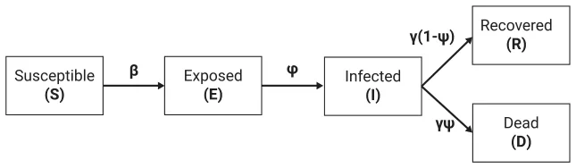
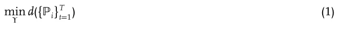
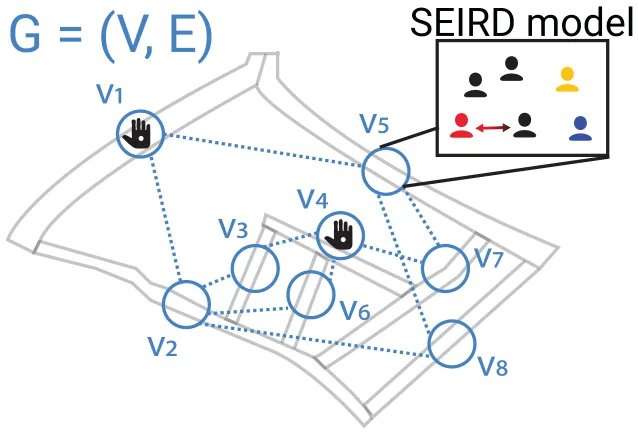
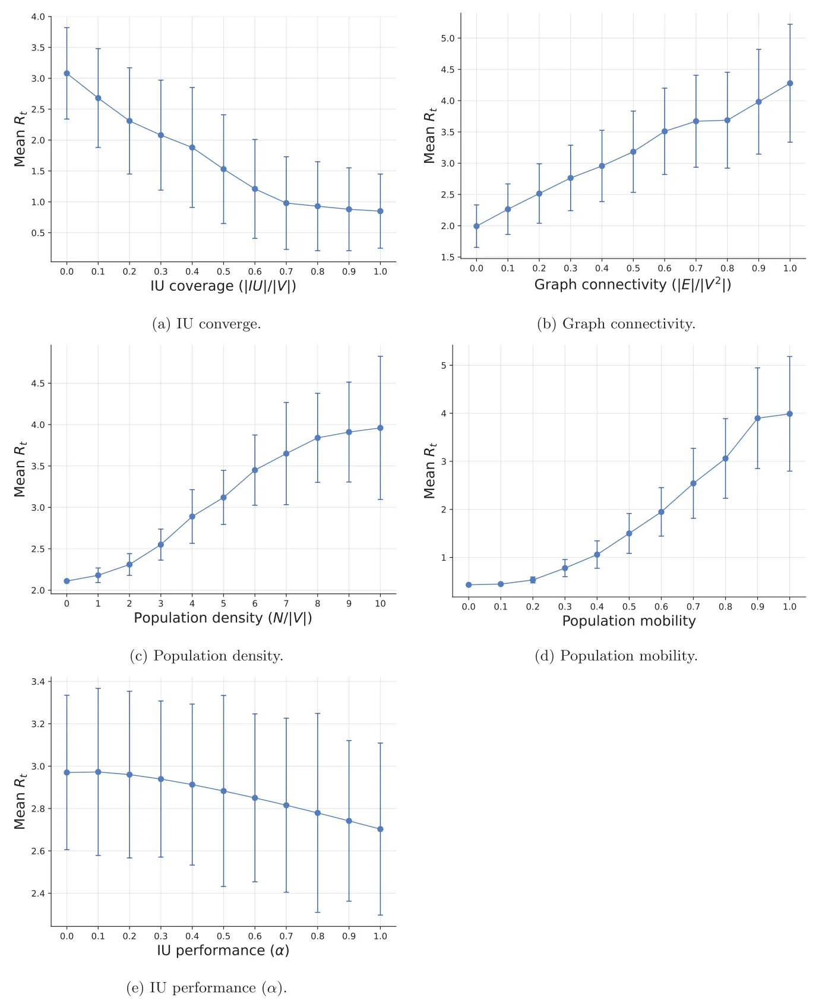
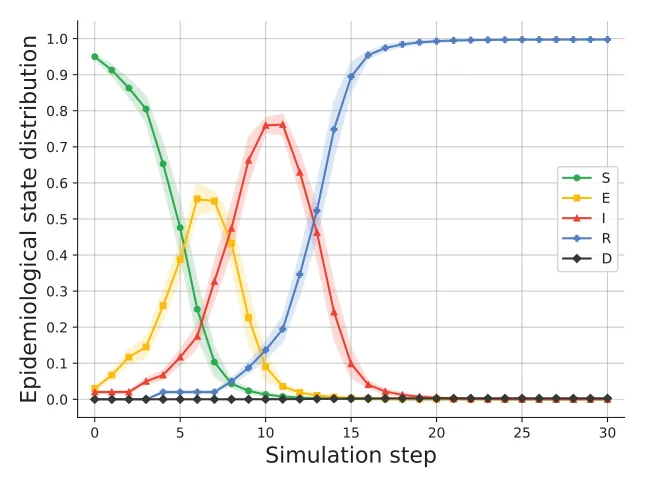
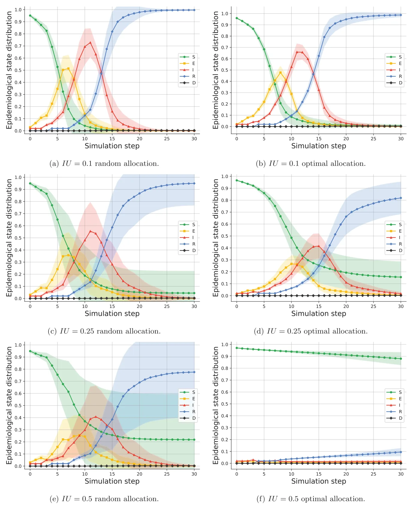
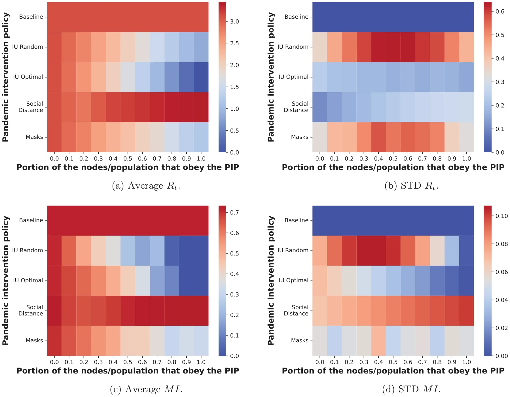

## 1. Introduction

Pandemics are natural disasters responsible for the death of millions, economical crises, and extreme political shifts.[1,2] In the past half a decade the world has experienced at least four large-scale outbreaks of pandemics: Seventh Cholera, HIV/AIDS, 2009 H1N1 flu, and COVID-19.[3,4] Despite the tremendous progress in medicine, epidemiological tracking, and government awareness, it is predicted that infectious disease outbreaks are inevitable in the near future due to urbanization and globalization processes that occur in the last few decades.[3] In particular, urbanization is bringing more individuals into denser neighborhoods, which increases the rate at which new infections are spread.[5] In a similar manner, globalization has facilitated pathogen spread among countries through the growth of trade and travel.[6]

The ORCID identification number(s) for the author(s) of this article can be found under https://doi.org/10.1002/adts.202200631

**DOI: 10.1002/adts.202200631** In particular, these mathematical models are of interest to policymakers as they allow for the investigation of the potential influence of PIPs on a pandemic spread in a fast, cheap, and controlled manner.[21] Multiple pandemic intervention policies (PIPs) have been proposed in the past, depending on the pathogen. For example, ref. [22] investigated the influence of the lockdown PIP on the pandemic spread of the COVID-19 pandemic,[23] analyzed the contribution of social distance in “flatting the (infection) curve” for the COVID-19 pandemic,[9] analyzed the contribution of the school and work duration to the course of the pandemic and infection rate, implementing the model for the case of COVID-19. These and similar PIPs are usually hard to manage,[24] especially since they are implemented on all individuals alike regardless of their epidemiological status. As such, non-infected individuals’ daily life is unnecessarily affected. In this article, we propose a novel PIP that is inspired by the security games approach.[25] In security games, a defender which has a limited number of resources seeks to protect a large set of potential targets from threats. In our context, the defender (e.g., the government) seeks to defend the population from the infected individuals by strategically deploying its resources. We propose the use of inspection units (IUs), which are able to test for the presence of a pathogen (or its symptoms) in individuals that cross it, as its resources. In practice, IUs are different based on the pathogen they are designed to detect. For example, during the COVID-19 pandemic, IUs in the form of polymerase chain reaction tests are currently being used worldwide in airports in order to reduce the national and international spread of the pathogen.[26] Similarly, contactless temperature sensors are used in some schools to detect common Influenza infected students and prevent them from entering the school and infecting other students and staff.[27] Using a spatio-temporal extended SIR model and both syntactic and real-world data, we show that the use of IUs favorably compares with the social distancing (SD) and mask-wearing (MW) PIPs for Influenza A. Moreover, the IU PIP is shown to work especially well for dense populations, a setting where other PIPs commonly fail, and significantly reduces the interruption to the daily lives of non-infected individuals compared to other PIPs (e.g., lockdowns or social distancing). Thus, the novelty of the proposed work lies in the proposal and investigation of the IU PIP; which, unlike most other intervention policies, is not implemented on all individuals in a uniform fashion regardless of their epidemiological status.

The rest of the paper is structured as follows: Section 2 provides an overview of mathematical modeling approaches for pandemic spread, PIP modeling and evaluation, and security games. Afterward, Section 3 formally defines the modeling of a pandemic and the implementation of PIPs within that model. Then, Section 4 defines our proposed IU PIP. Section 5 presents the results of our simulation-based evaluation using both synthetic and real-world data. Last, in Section 6, we analyze the results and discuss possible future work directions.

## 2. Related Work

### 2.1. Epidemiological Models

Multiple modeling approaches have been used to predict the course of a pandemic.[21] One of these models is the SIR model,[11] in which the population is divided into susceptible, infected, and recovered epidemiological groups. Susceptible individuals are healthy and can be infected from interaction with an infected individual. Infected individuals are covered over time, at some rate, and become recovered. Recovered individuals are again healthy and can not be re-infected. While the SIR is considered to be too simplistic, its extensions can perform well in realistic scenarios. Indeed, ref. [28] used an extension of the SIR model for modeling the COVID-19 pandemic, showing a fair prediction accuracy in six countries and for a duration of a few months. Similarly, ref. [29] combines an SIR model, containing two groups of a heterogeneous population, with a multi-sector economic model. Using their model, the authors were able to relatively accurately quantify the COVID-19 outbreak’s effect on the economy through the change in labor supply.

One direction of extending the SIR model is by introducing a spatial component, resulting in a spatio-temporal model of the pandemic spread. The introduction of the spatial component tackles one of the main shortcomings of the SIR model which is the assumption that for each point in time, the probability that any two individuals in the population would interact is uniformly distributed.[11] This assumption is known to be false even for small population sizes and results in worse performance as the population size increases.[30–32] One can divide the spatial component of the SIR model into two main groups: norm-based and graph-based. Norm-based spatial models assume that the space is continuous and people move in the space over time. For example, ref. [33] used an SIR model with a norm-space spatial model in which individuals move away from overcrowded regions, following diffusion equations. This approach usually provides a fine approximation to large-size locations with analytically appealing partial differential equations representation. However, for smaller size spatial locations such as cities, blocks, streets, or even a single building, this kind of model suffers from a poor representation of the realistic dynamics. On the other hand, graph-based spatial models abstract the locations’ of the individuals in the population into nodes in a graph. The edges in the graph indicate the possible transitions between these locations, in a single step in time. Thus, it is commonly assumed that each node in the graph represents a single physical location (for example, a city, street, or room) in which any two individual in the location has a uniform probability to interact.[34,35] For instance, ref. [9] proposed a two age-group extended SIR model with a three-node graph representing a school, a home, and a workplace such that the individuals move between them according to their age group and time of the day. Similarly, ref. [36] studies several models of disease transmission on small-world networks, in which either the probability of infection by a disease or the probability of its transmission is varied, or both. The authors conducted a numerical analysis that produce predictions similar to the recorded data gathered by ref. [31] for the pandemic spread of airborne infections.

### 2.2. Pandemic Intervention Policies

Using extended SIR-based models, policymakers can evaluate the influence of different PIPs on the pandemic spread and as such control it. Indeed, multiple PIPs are utilized in the past which are included by not limit to lockdowns,[22] artificial job separation,[17] school-work duration modification,[9] mask-wearing,[37] and others.[38–41] These PIPs can be classified by two main properties: local versus global and dynamic versus static. First, local PIPs have a different influence on either the environment or the population as a function of the location they operate in. For instance, in a context of a state that is divided into small regions, a lockdown that enforces that same duration of lockdown in a day across all regions is global since it influences both the environment and the population identically anywhere. However, allowing each region to define a local lockdown results in a local PIP. Second, dynamic PIPs are updated over time as a function of the system’s state while static PIPs do not. Continuing the example of the lockdown, a lockdown with a daily duration that is dependent on the current or historical reproduction number is a dynamic PIP while a lockdown that is defined at some point stays the same until the end of the PIP is a static PIP.

Dynamic PIPs have shown to provide remarkable results with respect to controlling a pandemic spread in general and compared to their respected static PIPs.[42] Nevertheless, they require dynamic sampling of the system’s state in order to provide the needed information for the PIP to update itself which is logistically hard and financially expensive.[43,44] In a similar manner, global PIPs more often than not operate on the entire population (or at least on a large sub-groups of the population) which is associated with significant damage to the economy and the mental health of the population.[45–48] In this respect, our proposed IU PIP is local and static.

Ridenhour et al.,[49] used a discrete-event simulation model to investigate school closures (in the United States) and their effectiveness in reducing the effective number of contacts between individuals within a community. In particular, the authors model a schematic 2D layout of a school and allow a dynamic closure of different subsets of the school according to the pandemic spread and individuals’ walk patterns (also known as mobility patterns). The authors found that a complete lockdown is sometimes performing worse in controlling the pandemic spread than other, less aggressive, configurations due to the stochastic nature of the individuals’ walk.

Barro[50] evaluated the effectiveness of static PIPs in controlling the COVID-19 pandemic spread from historical data about the 1918–1919 Influenza pandemic. The author used linear regression models on the mortality rate and statistically show there is a negative effect on relative peak flu-related excess death rates. In particular, they highlight the importance of the PIP’s applied duration and measured in order to see a significant change in the pandemic dynamics overall.

Epstein et al.[51] used a stochastic spatio-temporal SEIR model where the spatial component is implemented by a graph-based model where each node represents a city and the edges between them indicate flights. The authors implemented their model in the case of global influenza, following the analysis proposed by ref. [52]. Based on this model, they investigate the influence of travel restrictions on the pandemic spread, revealing that international travel restrictions per se do not provide an effective way to contain the epidemic and are associated with high, often unjustified, cost to the economy.

### 2.3. Security Games

A prominent approach for modeling and investigating security management settings is the security games (SGs) approach. SGs typically model a complex interaction between a defender and potential threats which necessitates a strategic deployment of the defender’s limited resources. A few notable examples include the protection of airports[53] and wildlife[54] against malicious activities, mitigating reckless driving,[55] effective patrolling to deter fare evasion in public transportation systems,[56] and the implementation of various cyber-security methods,[57] to name a few.

Common to these and similar SG settings are two explicit assumptions: First, the defender optimizes the use of a limited set of resources in order to protect against the threats over time and/or space. For example, Fang et al.[58] propose a model for defending moving ferries in harbors against terrorist attacks and Haskel et al.[59] propose a different model for protecting fisheries against illegal fishing. Second, the attackers who originate the threats are considered to be strategic to some extent. Namely, threats are potentially affected by the defender’s actions. For example, Zhang et al.[60] model opportunistic criminals as adaptive to police actions and Tsai et al.[61] model potential attackers on flights as being highly strategic.

In this study, we follow the first assumption and investigate the deployment of limited resources (in our case, IUs), in order to protect the population against the pandemic spread. However, as noted in prior work[62], Ch. 4.2] and ref. [63], different security settings may require different models of the attacker’s preferences and choices in order to bring about a beneficial defense policy. In an epidemiological setting, as is in our case, it is assumed that individuals are unaware of their epidemiological status, hence they act in a non-strategic fashion. In particular, we assume that the “attackers” (i.e., infected individuals) do not strategically avoid being sampled at the IUs or infect other people on purpose. Therefore, our proposed approach is inspired by existing SG literature.

## 3. Modeling a Pandemic and an Intervention Policy

In the following, we present a standard, general-purpose model for a pandemic. The proposed model is a combination of the epidemiological temporal SEIRD model proposed by ref. [64] (extending the classical SIR model[11]) and the location graph-based spatial model with population movement presented by ref. [9]. For ease of exposition, some of the formal mathematical definitions, especially those which outline the pandemic dynamics through the population, are moved to the Appendix. The pandemic model as a whole is denoted as *M*.

Formally, let *G* := (*V, E ⊂ V* × *V*) be a connected graph through which a fixed size population ℙ (*N* := |ℙ|) moves and interacts in rounds *t* ∈ [1*,* … *, T*], where *T <* ∞. Each individual in the population, *p*j ∈ ℙ, is represented by a timed finite state machine[65] such that, at round *i*, *p*i,j = (*l*i,j*, s*i,j) denotes *p*j’s location in the graph at round *i* (*l*i,j ∈ *V*) and her epidemiological status *s*i ∈ {*S, E, I, R, D*}, where *S* stands for susceptible, *E* for exposed, *I* for infected, *R* for recovered and *D* for dead, following the SEIRD model.[64]

At the first round (*t* = 1), the population (ℙ) is allocated in a given way to the nodes of the graph, each with an unobserved epidemiological status. Then, at each round *t*, each individual in the population can either stay at her current location (*l*i,j) or move to one of the neighboring nodes (*l*i,j*, v*) ∈ *E* at will. The decisions of all individuals are referred to as the population walk. Following standard convention, we assume that all individuals may travel through any edge in the graph in a single round and that each individual has a pre-defined path she follows. Between every two consecutive rounds, individuals at each node may interact, thus initiating some epidemiological dynamics (mathematically detailed as ordinary differential equations in the Appendix). As discussed in Section 2.1, individuals with a susceptible status (*S*) have no immunity and are susceptible to infection by the pathogen. When an individual with an *S* status is exposed to the pathogen through an interaction with an infected individual (*I* status), the individual is assigned with an exposed status (*E*) with a probability *𝛽*. Individuals with an *E* status have the pathogen but are not yet contagious. The individual remains with an *E* status for *𝜙* rounds, after which the individual is assigned with an infected status (*I*), which makes her contagious to other individuals. After *𝛾* rounds, an infected individual transitions to a recovered (*R*) or dead status (*D*) with probabilities (1 − *𝜓*) and (*𝜓*), respectively. Recovered individuals are no longer contagious, and immune from future infection while dead individuals are removed from the graph. A schematic view of an individual’s transition between epidemiological statuses is shown in **Figure 1**. Complete details are provided in the Appendix.

Given a pandemic model *M*, a PIP, denoted Υ, may be devised and implemented by policymakers in order to control the pandemic spread. We assume that Υ is static over rounds. In the following, we realize two of the most widely used PIPs as benchmarks: social distancing (SD) and mask-wearing (MW).

The SD PIP is a popular PIP through which individuals are instructed to keep their distance from other individuals in or-der to reduce infections of Influenza A or other airborne pandemics (such as COVID-19).[66,67] In our implementation of the SD policy, we follow the mathematical formulation of ref. [30]: when possible, and with probability *𝜒* ∈ [0*,* 1], an individual overrides her originally planned path with a “detour” through a neighboring node that has the smallest number of individuals in it at that time, in a greedy manner. In a similar fashion, the MW PIP reduces the rate of infection in the event of an encounter between infected and susceptible individuals.[24,68,69] However, masks have several levels of protection that differ according to their materials.[70] Hence, in this work, the MW policy was realized as follows:[30] If the infected individual wears a mask, the infection rate becomes *a*i*𝛽* and *a*s*𝛽* if the susceptible individual wears the mask. If both individuals wear a mask, the infection rate becomes *a*si*𝛽*, such that *a*s *< a*i *< a*si. For simplicity, we assume that the portion of individuals that are wearing masks throughout the interaction process is Γ ∈ [0*,* 1], whereas the rest do not wear a mask at all.

<figure id="fig-1">

<figcaption><strong>Figure 1.</strong> Schematic view of the transition between epidemiological statuses.</figcaption>
</figure>

More generally, policymakers are interested in implementing a PIP Υ in order to minimize some epidemiological metric *d* for a given *M*. For instance, the total number of infected individuals,[9] the average reproduction number (*E*[*R*t]),[71] mortality rate,[72] or any combination thereof. Formally, the optimization objective can be expressed as follows:

## 4. Inspection Units PIP

Our proposed PIP relies on the deployment of IUs through the graph. As discussed before, an IU is able to test for the presence of a pathogen (or its symptoms) in individuals that cross it. Albeit imperfect, the basic premise of IUs is that if an infected individual travels through a node in which an IU is located at that round, the infected individual is detected with probability *𝛼*. In that case, the detected individual is isolated in a designated node *V*isolation ∉ *V* in which it can not interact with any other individual in ℙ. Infected individuals remain in *V*isolation until they either recover or die. If the individual is recovered, she transitions to a random node *v* ∈ *V*. Crucially, individuals are assumed to be *non-strategic*, namely, they do not change their pre-defined path based on the allocation of IUs.

Given a known and fixed number of IUs at the policymaker’s disposal (*k*), Υ details where the IUs will be deployed at each round, namely Υi *⊂ V* such that |Υi| = *k*. In practice, moving an IU from one node to another may require substantial time and effort (e.g., constructing testing facilities, moving equipment, and recruiting personnel). As such, we restrict our following empiri-cal investigation to the case where Υi = Υj for all *i, j* ∈ [1*,* … *, T*]. See **Figure 2** for a schematic view of the IU PIP.

<figure id="fig-2">

<figcaption><strong>Figure 2.</strong> A schematic view of the IU PIP. The streets of a city are represented by a graph <em>G</em>. At each node <em>v</em> ∈ <em>V</em>, a sub-population <em>P ⊂</em> ℙ interacts according to an epidemiological model (in our case, SEIRD). Policymakers have allocated two IUs to nodes <em>v</em>1 and <em>v</em>4. The individuals are colored in black, yellow, red, and blue to indicate susceptible, exposed, infected, and recovered epidemiological statuses, respectively.</figcaption>
</figure>

Deriving a suitable allocation of IUs can be performed either optimally or heuristically. The simplest heuristic is, obviously, a random allocation of IUs on the graph. However, such an allocation may be far from optimal. In order to examine the importance of using a strategic allocation policy, in the following evaluation, we use the random allocation mechanism and contrast it with the optimal allocation (in cases where deriving the optimal allocation can be simply performed in reasonable time) or a greedy approximation thereof (otherwise). Specifically, for cases where the (|IU|) number of possible allocations ( ) is less than 1000, a simple |*V*| brute force search was performed. Otherwise, a standard greedy heuristic is used instead where a single IU is greedily allocated in each iteration, resulting in |*IU*| ⋅ |*V*| possible configurations. A detailed description of both methods is provided in the Appendix. Since the greedy approximation of the optimal allocation is, of itself, sub-optimal, using it provides us with a lower bound on the possible competitiveness of the random allocation compared to the optimal one. It is important to note that additional optimization techniques may prove useful in deriving a successful allocation in practice. However, these techniques are likely to heavily depend on the computational abilities of the defender, the characteristics of the graph and the population, the number of IUs to deploy, and many additional factors. As such, this computational aspect offers an interesting avenue for future work.

## 5. Evaluation

In order to evaluate the performance of the proposed PIP, we adopt an agent-based simulation approach following prior works on graph-based extended SIR models.[73–76]

For realizing this simulation, several parameters of *M* have to be set. We discuss the main configuration settings below and provide a summary in **Table 1**. First, the simulation is performed on two types of graphs: synthetic and real-world. Starting with the synthetic graphs, *n*=1000 randomly generated graphs are considered with the nodes, edges, and population size sampled uniformly from |*V*| ∈ [10*,* 500]*,* |*E*| ∈ [0*.*05|*V*|*,* 0*.*5|*V*|], and |*P*| ∈ [100*,* 5000], respectively. These ranges are picked to represent a small to medium size urban area and to balance between computational burden and accurate representation of possible areas. The population walk on these synthetic graphs is assumed to be completely at random where each individual, with a given probability, stays in its current position, otherwise making a random transition to a neighboring node. For the sampled 1000 graphs, we examine each of these probability values in the [0*,* 1] range in steps of 0.1 and vary the number of IUs available for deployment such that they can cover any portion of the graph in the [0*,* 1] range in steps of 0.1 (i.e., *k*∕|*V*| ∈ [0*,* 1]). In a complementary manner, a real-world graph based on an industrial area in Israel with 12 streets is considered. Here, following standard convention, the population walk is modeled as a Markovian walk[77,78] using the actual average traffic distribution over a week (sampled over 4 weeks in the field) between these streets as shown in **Table 2**. A full description of the data collection and processing performed to produce Table 2 is provided in the Appendix.

<figure class="table-figure" id="table-1">
<figcaption><strong>Table 1.</strong> Model parameters’ descriptions, values, and sources for Influenza A.</figcaption>

<table><tr><th>Parameter definition</th><th>Symbol</th><th>Value</th><th>Source</th></tr><tr><td>Infection rate [day−1]</td><td>𝛽</td><td>0.0145</td><td>[88]</td></tr><tr><td>Exposed to infected average duration [day−1]</td><td>𝜙</td><td>0.4762</td><td>[88]</td></tr><tr><td>Infected to recover or dead average duration [day−1]</td><td>𝛾</td><td>0.2350</td><td>[88]</td></tr><tr><td>Mortality rate [day−1]</td><td>𝜓</td><td>0.0028</td><td>[72]</td></tr><tr><td>Mask wearing infection reduction for susceptible, infected, and both individuals [1]</td><td>as, ai, asi</td><td>0.1, 0.5, 0.75</td><td>[89]</td></tr><tr><td>The probability an IU would detect an infected individual [1]</td><td>𝛼</td><td>0.90</td><td>[90]</td></tr><tr><td>Population size for the real world configuration [1]</td><td>|Prw|</td><td>1000</td><td>Assumed</td></tr><tr><td>Default IU PIP coverage [1]</td><td>|IU|</td><td>10%</td><td>Assumed</td></tr><tr><td>Real world nodes count [1]</td><td>|Vrw|</td><td>12</td><td>Sampled</td></tr><tr><td>Real world edges count [1]</td><td>|Erw|</td><td>18</td><td>Sampled</td></tr></table>

</figure>

<figure class="table-figure" id="table-2">
<figcaption><strong>Table 2.</strong> The average traffic between streets for the real world graph configuration.</figcaption>

<table><tr><td>From–to</td><td>1</td><td>2</td><td>3</td><td>4</td><td>5</td><td>6</td><td>7</td><td>8</td><td>9</td><td>10</td><td>11</td><td>12</td><td>13</td></tr><tr><td>1</td><td>0</td><td>0.59</td><td>0</td><td>0</td><td>0</td><td>0</td><td>0</td><td>0</td><td>0</td><td>0.41</td><td>0</td><td>0</td><td>0</td></tr><tr><td>2</td><td>0.41</td><td>0</td><td>0</td><td>0</td><td>0.11</td><td>0</td><td>0</td><td>0</td><td>0</td><td>0</td><td>0.48</td><td>0</td><td>0</td></tr><tr><td>3</td><td>0.23</td><td>0</td><td>0</td><td>0.30</td><td>0.26</td><td>0.10</td><td>0</td><td>0.06</td><td>0.05</td><td>0</td><td>0</td><td>0</td><td>0</td></tr><tr><td>4</td><td>0</td><td>0</td><td>0</td><td>0</td><td>0.24</td><td>0</td><td>0</td><td>0</td><td>0</td><td>0.67</td><td>0</td><td>0</td><td>0.09</td></tr><tr><td>5</td><td>0</td><td>0.46</td><td>0.34</td><td>0.13</td><td>0</td><td>0.07</td><td>0</td><td>0</td><td>0</td><td>0</td><td>0</td><td>0</td><td>0</td></tr><tr><td>6</td><td>0</td><td>0</td><td>0.18</td><td>0</td><td>0</td><td>0</td><td>0</td><td>0</td><td>0</td><td>0.82</td><td>0</td><td>0</td><td>0</td></tr><tr><td>7</td><td>0</td><td>0</td><td>0</td><td>0</td><td>0</td><td>0</td><td>0</td><td>0</td><td>0</td><td>1</td><td>0</td><td>0</td><td>0</td></tr><tr><td>8</td><td>0</td><td>1</td><td>0</td><td>0</td><td>0</td><td>0</td><td>0</td><td>0</td><td>0</td><td>0</td><td>0</td><td>0</td><td>0</td></tr><tr><td>9</td><td>0</td><td>0</td><td>1</td><td>0</td><td>0</td><td>0</td><td>0</td><td>0</td><td>0</td><td>0</td><td>0</td><td>0</td><td>0</td></tr><tr><td>10</td><td>0.38</td><td>0</td><td>0</td><td>0.19</td><td>0</td><td>0</td><td>0</td><td>0</td><td>0</td><td>0</td><td>0.34</td><td>0.09</td><td>0</td></tr><tr><td>11</td><td>0</td><td>0</td><td>1</td><td>0</td><td>0</td><td>0</td><td>0</td><td>0</td><td>0</td><td>0</td><td>0</td><td>0</td><td>0</td></tr><tr><td>12</td><td>0</td><td>0</td><td>1</td><td>0</td><td>0</td><td>0</td><td>0</td><td>0</td><td>0</td><td>0</td><td>0</td><td>0</td><td>0</td></tr><tr><td>13</td><td>0</td><td>0</td><td>0</td><td>0</td><td>0</td><td>0</td><td>0</td><td>0</td><td>0</td><td>1</td><td>0</td><td>0</td><td>0</td></tr></table>

</figure>

In order to evaluate the pandemic spread, one is required to define an epidemiological metric of interest (*d*). Nonetheless, it is not an easy task as different policymakers might be in-terested in different matrices. For example, a hospitable manager would likely be more interested in minimizing the number of individuals that required clinical treatment while other stakeholders may be more interested in minimizing the economical impairment associated with the pandemic and the measures taken to contain it.[79] In order to address this diversity, we consider three of the most popular epidemiological metrics: the average reproduction number (*E*[*R*t]), and maximum number of infections (MI).[9,80–84] *R*t measures the number of secondarily infected individuals given the pandemic state at a given time *t*.[82] *R*t can be approximated using the following formula: *R*t := (*I*(*t*) − *I*(*t* − 1) + *R*(*t*) − *R*(*t* − 1))∕*I*(*t* − 1) and the MI at time *t* is defined as follows MI(*t*) := maxi∈[t0,tt] *I*(*i*).

As for the pandemic dynamics, we used the Influenza A pathogen as a representative example. Influenza A is repeating on a yearly basis and causes a significant social, economic, and healthcare stress and discretion.[2,85–87]

### 5.1. Synthetic Graphs

**Figure 3** summarizes the main results recorded for the synthetic graphs case. As can be seen from Figure 3a, average *R*t is monotonically decreasing as the IU coverage (*k*∕|*V*|) is increasing. In a reverse manner, as can be seen in Figure 3b, average *R*t is monotonically increasing as a function of the graph’s connectivity (|*E*|∕|*V*|2). In addition, average *R*t is increasing as the population density (*N*∕|*V*|) is increasing as seen in Figure 3c. Last, Figure 3d shows a parabolic-like association between the population’s mobility and average *R*t, obtaining a local maximum at 0*.*5.

<figure id="fig-3">

<figcaption><strong>Figure 3.</strong> A sensitivity analysis of the average reproduction number (<em>E</em>[<em>R</em>t]) while using the optimal inspection units (IU) pandemic intervention policy. The results shown as mean ± standard deviation of <em>n</em> = 1000 repetitions.</figcaption>
</figure>

<figure id="fig-4">

<figcaption><strong>Figure 4.</strong> Baseline (<em>IU</em> = 0) for the graph-based SEIRD model for the real world configuration.</figcaption>
</figure>

### 5.2. Real-World Graph

In order to evaluate the proposed PIP in a more realistic setting, we consider the topology and flow characteristics of a real-world small industrial area in Israel (full details are provided in the Appendix). Naturally, since we do not have access to the true epidemiological status of the real individuals observed in this part of the work and thus, these are simulated under various conditions.

First, we examine the characteristics of the pandemic spread without any implemented PIP, as shown in **Figure 4**, and contrast it with the case where the IU PIP is implemented, either randomly or optimally, as shown in **Figure 5**. In both figures, the *x*-axis is the number of rounds elapsed since the beginning of the simulation and the *y*-axis is the normalized distribution of the population in the five epidemiological states. The results are shown as mean ± standard deviation of *n* = 1000 simulations. From the baseline configuration (i.e., without any PIP), one can see that the entire population is infected after 20 days with a maximum infected number of 0*.*76 after 10 days (see the *I* (red) line). In comparison, for an IU coverage of 0.1 (i.e., 10% of *V* is occupied by IUs), using either random or optimal allocation, all individuals in the population are infected, but at a slower pace. In addition, the max infected number of individuals occurs one day later than the baseline case (after 11 days) and peaks at 0*.*71 for random allocation and 0*.*67 for optimal allocation compared to 0*.*76 in the baseline no-PIP condition. When the IU coverage is set higher, up to 0.25, not the entire population is infected and the max infected occurred after 11 and 15 days with 0*.*6 and 0*.*41, for random and optimal allocations, respectively. Finally, for the case with a very high IU coverage of 0.5, using random allocation, only 19% of the population is infected while using optimal allocation results demonstrate that only 10% of the population is infected and recovered during the same period. Of note, the standard deviation is increasing as more rounds have passed using either random or optimal allocation policies.

Next, we compare the IU PIP to the SD and MW PIPs discussed in Section 3. For each of these two PIPs, separably, we compute the *R*t and MI. Naturally, both SD and MW are limited by the willingness of the population to comply with the imposed measures. In the following, we vary the portion of individuals who fully comply with either of the two PIPs (social distancing or mask-wearing) in the [0,1] range in steps of 0.1. The comparison is provided in **Figure 6** where the *x*-axis indicates the portion of covered nodes (in the IU PIP) or portion of the population who fully comply with the PIP (in the SD and MW PIPs), the *y*-axis stands for the tested PIP (random IU, optimal IU, SD, and MW), and the value corresponds to the mean (Figure 6a,c) and standard deviation (Figure 6b,d) of *n* = 1000 simulations. From Figure 6a, one can see that the IU PIP, implemented either randomly or optimally, is reducing the *R*t at least as well as the SD and MW PIPs. At the same time, the importance of optimal allocation is highlighted by the non-stable outcomes observed for the random allocation policy with its standard deviation following a skewed parabolic shape with a maximum in the 0.3, 0.5, and 0.5 IU coverage for the average *R*t and MI metrics. In addition, the SD PIP increases all metrics as a larger portion of the population complies with it.

## 6. Discussion

In this study, we proposed the inspection units (IUs) pandemic intervention policy (PIP) in which the policymakers allocate IUs that sample individuals that pass them for a pathogen or its symptoms. Considering Influenza A as a representative example, we implement an extensive agent-based simulation, using both synthetic and real-world graphs and data, and demonstrate the potential benefits of the proposed PIP which favorably compare with the two benchmark PIPs: social distancing (SD) and masks wearing (MW).

Starting with synthetic graphs and data, we examine the performance of the proposed IU PIP using a wide range of configurations. On average, as the number of IUs increases, the infection rate as reflected by the average reproduction number (*E*[*R*t]) decreases, as shown in Figure 3a. However, note that the marginal contribution of each additional IU is diminishing (i.e., diminishing returns), as is the case in most economic settings.[91] As the graph’s connectivity increases, the average *R*t monotonically increases, following a seemingly linear trend of *E*[*R*t] = 1*.*94|*E*|∕|*V*|2 + 2*.*04*, R*2 = 0*.*47 (computed using the least mean square method[92] for the entire set of obtained samples), as one can see from Figure 3b. This indicates that the IU PIP works especially well for low-connectivity graphs, as is the case for most realistic urban locations.[93,94] Furthermore, an increasing population density naturally results in increased pandemic spread, as shown in Figure 3c and thus the IU PIP is aligned with other PIPs in this context.[34,36] In a similar manner, as the population mobility increases, the mixture of the population increases and therefore the average infection rate increases as well. As a result, the average reproduction number is increasing, as observed in Figure 3d. This outcome is sensitive to the IU coverage as well as to the IU performance (e.g., *𝛼*).In addition, the IU performance seems to be correlated with the average reproduction number when larger than 0.2, as indicated by Figure 3e.

<figure id="fig-5">

<figcaption><strong>Figure 5.</strong> An SEIRD distribution divided into four levels of employing the inspection units (IU) pandemic intervention policy at random. The results are computed for the real-world graph configuration and shown as mean ± standard deviation of <em>n</em> = 1000 simulations.</figcaption>
</figure>

<figure id="fig-6">

<figcaption><strong>Figure 6.</strong> A comparison between the inspection units, social distance, and mask wearing pandemic intervention policies for different level of enforcement for the real world graph configuration. The results showing the average reproduction number computed from <em>n</em> = 1000 simulations.</figcaption>
</figure>

In addition, using real world data, we compared a random and optimal allocation of IUs with different levels of coverage, presented in Figure 5. For 10% IU coverage case, the differences between random and optimal allocation are relatively small as can be seen from Figure 5a,b and are statistically insignificant (*p >* 0*.*05) based on a two-tailed paired *T*-test. On the other hand, higher levels of coverage such as the 50% IU coverage case, the pandemic spread is significantly reduced (*p <* 0*.*05) such that a random allocation does not prevent the outbreak while an optimal allocation keeps the pandemic spread under control with eight times fewer infected individuals during the same time frame (see Figure 5e,f). As indicated by the increasing standard deviation for the IU coverage, a random allocation of IUs leads to instability in the course of the pandemic spread and may yield inconclusive and undesirable results. Taken jointly, these results highlight the need for the strategic allocation of IUs in practice, especially when a high coverage levels are considered.

Moreover, both random and optimal allocations of IUs favorably compare with the well-known SD and MW PIPs, as shown in Figure 6. However, as discussed before, the IU PIP requires a reasonable deployment strategy in order to obtain stable and satisfactory results, unlike SD and MW which do not require such a reasoning process. Another interesting result in this context is that the SD PIP seems to be inefficient when a large portion of the population obeys it as one can see from Figure 6a,c. This result, albeit counter-intuitive, is very much aligned with prior work suggesting and explaining the same phenomenon in similar settings.[23,30,95] Of note, this result is a direct outcome of the social distance performed on the graph-level, treating each node in the graph as a single location where individuals do not have the option to distance one another. In a more detailed model, one can introduce a multi-level spatial component such that in each node there is room for social distancing that reduces the infection rate at the node-level. That said, several previous models examined these settings by themselves, showing a somewhat linear (and trivial) reduction in the infection rate relative to the obeyness to the SD PIP.[96–98]

Altogether, the results indicate that the IU PIP is especially suited for pandemic spread control in spatially small to moderate size areas. As an example, quick tests that take seconds (such as temperature measurement) can be conducted on the building level where the graph’s nodes represent rooms in a building.[30] On a bit larger scale, small residential and business areas[22] can enforce the IU PIP as well. However, larger scale graphs where nodes represent larger areas such as cities are seemingly less suitable for the proposed IU PIP. We publish our model and simulator as open source[99] so other researchers and policymakers can replicate and extend our study for their needs.

This study has important limitations which offer additional fruitful avenues for future research. First, we assume that the population is homogeneous in its clinical and biological properties, an assumption known to be false.[30,100] An introduction of unique clinical and biological properties for each individual such as the infection and recovery rates would result in a more accurate pandemic spread analysis and prediction. Furthermore, the implementation of multiple PIPs at the same time can bring about even better control of the pandemic spread as suggested elsewhere.[89,101] Moreover, for many diseases, waiting until a symptom appears and detectable by an IU may be too late to stop transmission. Thus, one can investigate the influence of the IU PIP detection during the expose (*E*) epidemiological state or with some delay after the initial infection on the pandemic spread control. In addition, an extension of the proposed model for the case of a multi-strain pandemic such that each IU is limited in its ability to detect each strain can be of great interest for modern pandemics.[102–105] Last, we plan to extend our model to the case where *strategic* individuals might plan their walk based, in part, on the allocation of IUs in order to avoid being sampled. Modeling an individual decision if, when and where to avoid IUs is critical for a successful IU PIP implementation.

## Supporting Information

Supporting Information is available from the Wiley Online Library or from the author.

## Acknowledgements

The authors wish to thank Eyal Weiss for the thoughtful discussions. This research did not receive any specific grant from funding agencies in the public, commercial, or not-for-profit sectors.

## Conflict of Interest

The authors declare no conflict of interest.

## Author Contributions

A.A.: Conceptualization, formal analysis, investigation, methodology, software, visualization, and writing - original draft; A.R.: Conceptualization, formal analysis, investigation, supervision, validation, and writing - review and editing; T.L.: Conceptualization, data curation, formal analysis, investigation, project administration, software, supervision, and writing - review and editing.

## Data Availability Statement

The data that support the findings of this study are available on request from the corresponding author. The data are not publicly available due to privacy or ethical restrictions.

## Keywords

pandemic control, pandemic intervention policy, security games, spatio-temporal model

Received: August 31, 2022 Revised: November 1, 2022 Published online: December 15, 2022

## References

1. R. Baber, Climacteric 2020, 23, 211.
2. E. A. Haddad, F. S. Perobelli, I. F. Araújo, K. S. S. Bugarin, Spat. Econ. Anal. 2021, 16, 252.
3. A. Brodeur, D. Gray, A. Islam, S. Bhuiyan, J. Econ. Surv. 2021, 35, 1007.
4. E. E. Team, Eurosurveillance 2020, 25, 200131e.
5. J. Lederberg, JAMA, J. Am. Med. Assoc. 1988, 260, 684.
6. T. Wu, C. Perrings, A. Kinzig, J. P. Collins, B. A. Minteer, P. Daszak, Ambio 2017, 46, 18.
7. A. R. Tuite, D. N. Fisman, A. L. Greer, Can. Med. Assoc. J. 2020, 192, E497.
8. J. C. Miller, Infect. Dis. Modell. 2017, 2, 35.
9. T. Lazebnik, S. Bunimovich-Mendrazitsky, Adv. Theory Simul. 2021, 4, 2000298.
10. A. Atkeson, Q. Rev., Federal Reserve Bank Minneapolis 2020, 41, 1.
11. W. O. Kermack, A. G. McKendrick, Proc. Royal Soc. A 1927, 115, 700.
12. B. Ivorra, M. R. Ferrandez, M. Vela-Perez, A. M. Ramos, Commun. Nonlinear Sci. Numer. Simul. 2020, 88, 105303.
13. J. B. Long, J. M. Ehrenfeld, J . Med. Syst. 2020, 44, 59.
14. L. Nesteruk, Innovative Biosyst. Bioeng. 2020, 4, 13.
15. R. Vega, L. Flores, R. Greiner, Forecasting 2022, 4, 72.
16. A. Ignatov, S. Trigger, medRxiv 2022, DOI: [doi:10.1101/2022.01.11.22269046](https://doi.org/10.1101/2022.01.11.22269046)
17. T. Lazebnik, L. Shami, S. Bunimovich-Mendrazitsky, Econ. Res. 2021, 35, 1833.
18. K. Ghosh, A. K. Ghosh, Nonlinear Dyn. 2022, 109, 47.
19. D. Acemoglu, V. Chernozhukov, I. Werning, M. D. Whinston, Am. Econ. Rev.: Insights 2021, 3, 487.
20. J. Verdasca, T. M. M., A. Nunes, N. R. Bernardino, J. M. Pacheco, M. C. Gomes, J. Theor. Biol. 2005, 233, 553.
21. M. Andraud, N. Hens, C. Marais, P. Beutels, Plos One 2012, 7, e49085.
22. O. Aglar, A. Baxter, P. Keskinocak, J. Asplund, N. Serban, Res. Square 2020.
23. L. Thunström, S. C. Newbold, D. Finnoff, M. Ashworth, J. F. Shogren, J. Benefit-Cost Anal. 2020, 11, 179.
24. T. Li, Y. Liu, M. Li, X. Qian, S. Y. Dai, Plos One 2020, 15, e0237691.
25. M. Tambe, Security and Game Theory: Algorithms, Deployed Systems, Lessons Learned, Cambridge University Press, Cambridge 2011.
26. M. Arora, S. Tuchen, M. Nazemi, L. Blessing, Transp. Res. Interdiscip. Perspect. 2021, 11, 100449.
27. W. H. O. Writing Group, D. Bell, A. Nicoll, K. Fukuda, P. Horby, A. Monto, F. Hayden, C. Wylks, L. Sanders, J. Van TamEmerg. Infect. Dis. 2006, 12, 81.
28. I. Cooper, A. Mondal, C. G. Antonopoulos, CChaos, Solitons Fractals 2020, 139, 110057.
29. M. Bodenstein, G. Corsetti, L. Guerrieri, Quant. Econ. 2022, 13, 681.
30. T. Lazebnik, A. Alexi, Commun. Nonlinear Sci. Numer. Simul. 2022, 107, 106176.
31. W. J. Edmunds, C. J. O’Callaghan, D. J. Nokes, Proceedings. Biol. Sci. 1997, 264, 949.
32. M. J. Keeling, Theor. Popul. Biol. 2005, 67, 1.
33. F. A. Miler, R. Zhao, Math. Population Studies 2008, 15, 160.
34. M. J. Keeling, K. T. D. Eames, J. R. Soc., Interface 2005, 2, 295.
35. P. S. Bearman, J. Moody, K. Stovel, Am. J. Sociol. 2004, 110, 44.
36. C. Moore, M. E. J. Newman, arXiv:cond-mat/9911492, 2000.
37. S. F. Darabi, C. Scoglio, in Proc. of 50th IEEE Conf. on Decision and Control and European Control Conf., IEEE, Piscataway, NJ 2011 pp. 3008–3013.
38. A. Zlojutro, D. Rey, L. Gardner, Sci. Rep. 2019, 9, 2216.
39. V. Ram, L. P. Schaposnik, Sci. Rep. 2021, 11, 15194.
40. G. Giordano, F. Blanchini, R. Bruno, P. Colaneri, A. D. Filippo, A. D. Matteo, M. Colaneri, Nat. Med. 2020, 26, 855.
41. A. Kucharski, P. Klepac, A. Conlan, S. Kissler, M. Tang, H. Fry, J. Gog, W. Edmunds, Lancet Infect. Dis. 2020, 20, 1151.
42. O. O. Odusanya, B. A. Odugbemi, T. O. Odugbemi, W. S. Ajisegiri, Nigerian Postgrad. Med. J. 2020, 27, 261.
43. R. Chowdhury, K. Heng, M. S. R. Shawon, G. Goh, D. Okonofua, C. Ochoa-Rosales, V. Gonzalez-Jaramillo, A. Bhuiya, D. Reidpath, S. Prathapan, S. Shahzad, C. L. Althaus, N. Gonzalez-Jaramillo, O. H. Franco, Eur. J. Epidemiol. 2020, 35, 389.
44. C. He, F. Zeng, J. Xiao, J. Zhao, T. Liu, J. Hu, S. Zhang, Z. Lin, H. Zhu, D. Liu, M. Kang, H. Zhong, Y. Li, L. Sun, Y. Yang, Z. Li, Z. Rong, W. Zeng, X. Li, Z. Zhu, X. Liang, W. Ma, China CDC Wkly. 2022, 4, 199.
45. UNWTO, UNWTO World Tourism Barometer 2021, 19.
46. C. M. Hall, D. Scott, S. Gössling, Tourism Geogr. 2020, 22, 577.
47. E. Magill, Z. Siegel, K. M. Pike, Psychiatr. Serv. 2020, 71, 1260.
48. K. Srivastava, S. Chaudhry, A. V. Sowmya, J. Prakash, Ind. Psychiatr. J. 2020, 29, 1.
49. B. J. Ridenhour, A. Braun, T. Teyrasse, D. Goldsman, Plos One 2011, 6, e29640.
50. R. J. Barro, Non-Pharmaceutical Interventions and Mortality in U.S. Cities during the Great Influenza Pandemic, 1918-1919, National Bureau of Economic Research, Cambridge, MA 2020.
51. J. M. Epstein, D. M. Goedecke, F. Yu, R. J. Morris, D. K. Wagener, G. V. Bobashev, Plos One 2007, 2, e401.
52. L. A. Rvachev, I. M. Longini, Math. Biosci. 1985, 75, 3.
53. J. Pita, M. Jain, J. Marecki, F. Ordóñez, C. Portway, M. Tambe, C. Western, P. Paruchuri, S. Kraus, in Proc. of the 7th Int. Joint Conf. on Autonomous Agents and Multiagent Systems: Industrial Track, International Foundation for Autonomous Agents and Multiagent Systems, Richland, SC 2008, pp. 125–132.
54. B. Ford, D. Kar, F. M. Delle Fave, R. Yang, M. Tambe, in Proc. of the 2014 Int. Conf. on Autonomous Agents and Multi-Agent Systems, International Foundation for Autonomous Agents and Multiagent Systems, Richland, SC 2014, pp. 1641–1642.
55. A. Rosenfeld, O. Maksomov, S. Kraus, Artif. Intell. 2020, 289, 103381.
56. Z. Yin, A. X. Jiang, M. P. Johnson, C. Kiekintveld, K. Leyton-Brown, T. Sandholm, M. Tambe, J. P. Sullivan, in Twenty-Fourth IAAI Conference, Association for the Advancement of Artificial Intelligence, Palo Alto, CA 2012, pp. 59–72.
57. A. Sinha, T. H. Nguyen, D. Kar, M. Brown, M. Tambe, A. X. Jiang, J. Cybersecurity 2015, 1, 19.
58. F. Fang, A. X. Jiang, M. Tambe, J. Artif. Intell. Res. 2013, 48, 583.
59. W. Haskell, D. Kar, F. Fang, M. Tambe, S. Cheung, E. Denicola, in Proc. of the Twenty-Sixth IAAI Conf., AAAI Press, Palo Alto, CA 2014, pp. 2978–2983.
60. C. Zhang, S. Gholami, D. Kar, A. Sinha, M. Jain, R. Goyal, M. Tambe, Games 2016, 7, 15.
61. J. Tsai, S. Rathi, C. Kiekintveld, F. Ordonez, M. Tambe, in Proc. AAMAS (Industry Track), International Foundation for Autonomous Agents and Multiagent Systems, Richland, CA 2009, p. 37.
62. A. Rosenfeld, S. Kraus, Predicting Human Decision-Making, Synthesis Lectures on Artificial Intelligence and Machine Learning, Springer, Berlin 2018, 12, pp. 21–59.
63. D. Kar, F. Fang, F. Delle Fave, N. Sintov, M. Tambe, in Proc. of the 2015 Int. Conf. on Autonomous Agents and Multiagent Systems, International Foundation for Autonomous Agents and Multiagent Systems, Richland, CA 2015, pp. 1381–1390.
64. L. E. Piccolomini, F. Zama, Plos One 2020, 15, e0237417.
65. V. S. Alagar, K. Periyasamy, in Specification of Software Systems, Springer, London 2011, pp. 105–128.
66. F. Ahmed, N. Zviedrite, A. Uzicanin, BMC Public Health 2018, 18, 518.
67. A. Qualls, N. amd Levitt, N. Kanade, N. Wright-Jegede, S. Dopson, M. Biggerstaff, C. Reed, A. Uzicanin, C. Group, A. Levitt, S. Dopson, Morb. Mortal. Wkly. Rep. 2017, 66, 1.
68. H. Brüssow, S. Zuber, Microb. Biotechnol. 2022, 15, 721.
69. M. S. Kim, D. Seong, H. Li, S. Chung, Y. Park, M. Lee, S. Lee, D. Yon, J. Kim, K. Lee, M. Solmi, E. Dragioti, A. Koyanagi, L. Jacob, A. Kronbichler, K. Tizaoui, S. Cargnin, S. Terrazzino, S. H. Hong, R. A. Ghayda, J. Radua, H. Oh, K. Kostev, S. Ogino, I.-M. Lee, E. Giovan-nucci, Y. Barnett, L. Butler, D. McDermott, P.-C. Ilie, Med. Virol. 2022, 32, e2336.
70. K. O’Dowd, K. M. Nair, P. Forouzanadeh, S. Mathew, J. Grant, R. Moran, J. Bartlett, J. Bird, S. C. Pillai, Materials 2020, 13, 3363.
71. D. Breda, F. Florian, J. Ripoll, R. Vermiglio, J. Comput. Appl. Math. 2021, 384, 113165.
72. A. S. Monto, Vaccine 2008, 26, D45.
73. D. Chumachenko, V. Dobriak, M. Mazorchuk, I. Meniailov, K. Bazilevych, in 2018 14th Int. Conf. on Advanced Trends in Radio-elecrtronics, Telecommunications and Computer Engineering (TCSET), IEEE, Piscataway, NJ 2018, pp. 192–195.
74. K. M. Carley, D. B. Fridsma, E. Casman, A. Yahja, N. Altman, L.-C. C., B. Kaminsky, D. Nave, IEEE Trans. Syst., Man, Cybernet., A 2006, 36, 252.
75. R. Connell, P. Dawson, S. Alex, Comparison of an Agent-Based Model of Disease Propagation with the Generalised SIR Epidemic Model, ADA510899, Defence Technical Information Center, Fort Belvoir, VA 2009.
76. C. M. Macal, in Proc. of the 2010 Winter Simulation Conf., IEEE, Piscataway, NJ 2010, pp. 371–382.
77. M. Bestehorn, A. P. Riascos, T. M. Michelitsch, B. A. Collet, Continuum Mech. Thermodyn. 2021, 33, 1207.
78. T. Pechlivanoglou, J. Li, J. Sun, F. Heidari, M. Papagelis, Big Data Res. 2022, 27, 100275.
79. A. R. Tuite, D. N. Fisman, A. L. Greer, CMAJ 2020, 192, E497.
80. L. Di Domenico, G. Pullano, C. E. Sabbatini, P. Y. Bo Elle, V. Colizza, BMC Med. 2020, 18, 240.
81. S. Bunimovich-Mendrazitsky, L. Stone, J. Theor. Biol. 2005, 237, 302.
82. D. Breda, F. Florian, J. Ripoll, R. Vermiglio, J. Comput. Appl. Math. 2021, 384, 113165.
83. S. Zhao, L. Stone, D. Gao, S. S. Musa, M. K. C. Chong, D. He, M. H. Wang, Ann. Transl. Med. 2020, 8, 448.
84. K. Chatterjee, K. Chatterjee, A. Kumar, S. Shankar, Med. J. Armed Forces India 2020, 76, 147.
85. T. K. Das, A. A. Savachkin, Y. Zhu, IIE Trans. 2008, 40, 893.
86. M. Kiang, E. Chin, B. Huynh, L. Chapman, I. Rodríguez-Barraquer, B. Greenhouse, G. Rutherford, K. Bibbins-Domingo, D. Havlir, S. Basu, N. Lo, Lancet Infect. Dis. 2021, 21, 929.
87. E. Eryarsoya, M. Shahmanzaribc, F. Tanriseverd, Eur. J. Oper. Res. 2022, 304, 25.
88. F.-Z. Younsi, A. Bounnekar, D. Hamdadou, O. Boussaid, Tsinghua Sci. Technol. 2015, 20, 460.
89. T. Lazebnik, S. Bunimovich-Mendrazitsky, L. Shami, Int. J. Nonlinear Sci. Numer. Simulat. 2021, 107, 106176.
90. D. Jarrom, L. Elston, J. Washington, M. Prettyjohns, K. Cann, S. Myles, P. Groves, BMJ Evidence Based Med. 2022, 27, 33.
91. E. Cannan, Econ. J. 1892, 2, 53.
92. M. K. Transtrum, J. P. Sethna, arXiv:1201.5885, 2012.
93. B.-H. Lee, W.-S. Jung, Phys. A 2018, 497, 15.
94. M. Barthelemy, A. Flammini, Networks Spat. Econ. 2009, 9, 401.
95. K. P. Wasdani, A. Prasad, Local Environ. 2020, 25, 414.
96. S. Maharaj, A. Kleczkowski, BMC Public Health 2012, 12, 679.
97. J. Roslynlia, A. A. S. Gunawan, Proc. Comput. Sci. 2021, 179, 662.
98. B. G. Kang, H.-M. Park, M. Jang, K.-M. Seo, Int. J. Environ. Res. Public Health 2021, 18, 21.
99. https://github.com/ArielA147/inspection\_units\_pandemic\_simulator (accessed: Spetember 2022). [link](https://github.com/ArielA147/inspection_units_pandemic_simulator)
100. C.-H. Li, C.-C. Tsai, S.-Y. Yang, Commun. Nonlinear Sci. Numer. Simul. 2014, 19, 1042.
101. C. Jones, T. Philippon, V. Venkateswaran, Rev. Financ. Stud. 2021, 34, 5188.
102. I. Gordo, M. G. M. Gomes, D. G. Reis, P. R. A. Campos, Plos One 2009, 4, e4876.
103. O. Khyar, K. Allali, Nonlinear Dyn. 2020, 102, 489.
104. P. Minayev, N. Ferguson, J. R. Soc., Interface 2008, 6, 305.
105. Y.-X. Dang, X.-Z. Li, M. Martcheva, J. Biol. Dyn. 2016, 10, 416.
