## 1. Introduction and Related Work

At the beginning of 2020, the novel severe acute respiratory syndrome coronavirus 2 (SARS-CoV-2), also known as COVID-19, reached Europe and the western world from China.[1] Similar to other diseases from the coronavirus family, COVID-19 is transmitted human-to-human, but it turned out that COVID-19 is more infectious and transmissible than previous coronavirus.[2]

The World Health Organization (WHO) has declared COVID- 2019 a public health emergency of international concern.[3,4] Currently, due to a lack of an efficient vaccine or clinical treatment to COVID-19, policy-makers are forced to rely on non-pharmaceutical intervention (NPI) policies to reduce the infection rate and control the epidemic. A few examples of NPI policies are masks, social distancing, work capsules, and partial to a full lockdown of central locations (restaurants, malls, offices,

**DOI: 10.1002/adts.202000298** Model proposed by Tuite et al.[11] which used data from January 25 to March 1 (2020) Ontario, Canada, is SEIR (E-exposed) model, the extension of the SIR model. Authors of ref. [11] took into consideration four levels of infection severity, social isolation in the exposed and infected states, hospitalization dynamics, and death state.[11] Estimated that 56% of the Ontario population would be infected over the course of the epidemic with a peak of 55 500 cases in intensive care units (ICU) and 107 000 total cases. At the same time, in all of Canada there are only half of this number of infections.[4] This error in their prediction is associated with incomplete information due to lower frequency of tests and inaccurate ICU records. Nevertheless, Tuite et al.’s[11] model presents a more detailed dynamic between the infected population and the healthcare response which policy-makers can take into consideration.

Ivorra et al.[13] proposed nine states model divides individuals into isolated, hospitalized, or dead. In addition, authors of ref. [13] take into consideration the fact that the recorded confirmed data is under-sampled.

Furthermore, a machine learning-based model was proposed by Allam et al.[14] using several machine learning algorithms (Knn, Random Forest, Support Vector Machine) on data of 53 clinical cases. This model was used to predict infection severity and spread. However, this approach suffers from an imbalanced sample of the distribution of severity in the population, as simple or asymptomatic cases are not reported, leading to poor representation of the real dynamic.

Second, models aim to analyze and optimize NPI policies. A model proposed by Zhao et al.[15] is an extension to the SEIR model where the susceptible population is separated into two groups: individuals not taking infection-prevention actions and people taking infection-prevention actions as an NPI policy. In addition, authors of ref. [15] included a probability of willingness to take infection-prevention actions with changes over time. They predicted 148.5 thousand infections by the end of May 2020 in Wuhan alone, while in all of China there were 84.5 thousand infections at the same time.[4] The authors introduces a stochastic element to the SEIR model making it more robust for social changes happened during the epidemic.

Di Domenico et al.[16] used data from March 17 to May 11 (2020) Île-de-France with a stochastic age-structured transmission extension of the SEIR model integrating data on age profile and social contacts of four age-based classes. In this model, hospitalization dynamics with ICU cases are taken into consideration in the model. Model shows that during full lockdown the reproductive number is estimated to be 0.68, due to an 81% reduction of the average number of contacts. These results show that dividing the population into several age-based classes better represent the spread of COVID-19 from an epidemiological perspective.[18,19]

In this paper, we provide and study a more accurate spatio-temporal model for the COVID-19 transmission by using individual two age classes SIRD named hybrid model (D-death) model. We study two important factors concerning the diffusion of COVID-19: schooling/working hours and physical location of infected population has provided new insights into the epidemic dynamics. Based on the different impact of COVID- 19 to the immune response, severity of infection, and transmission of disease in different age groups (mainly children and adults),[18,20] we proposed a two classes age-structured SIRD epidemic model dividing the population into children and adults. Moreover, we developed a numerical, stochastic simulator based on this hybrid model (https://teddylazebnik.info/coronavirus-sir-simulation/index.html) for COVID-19 population spread in addition to the analytical examination of the epidemic dynamics.

This paper is organized as follows: First, we introduce our mathematical hybrid model based on the SIRD model with dual age-structured. Second, we present the model’s equilibria, stability analysis, and asymptotic form. Third, we present the spatial model extending the SIRD model by introducing a day– night circle and three locations of disease transmission (home, work, school). Fourth, an analysis of NPI policies including optimal lockdown and optimal work-school duration is presented, and a comparison to the Israeli historical data from August and September. Finally, we discuss the main epidemiological results arising from the model.

## 2. Hybrid Model

As shown in refs. [21] and [22], the spatial model plays an important role in describing the spreading of communicable diseases, because individuals move around inside a zone or habitat in time.

In this section, we present a hybrid model (**Figure 1**) that is based on an SIRD model for two age classes using eight populations (dynamics are shown in **Figure 2**) and a spatial model where these populations are distributed in space and time between work, school, and home (Figure 5). We will define these sub-models in the following sections.

### 2.1. Two Class Age-Structured Epidemic Model

The SIR model is proven to be a meaningful mathematical tool for epidemic analysis.[23] This model with the needed modifications has already been shown to predict the epidemics such as COVID-19,[24] influenza,[25] Ebola,[10] and others.

Data from several epidemiological studies show that children and adults transmit the disease at different rates.[18,20] In addition, adults, on average, have a much longer recovery duration compared to children .[6,8] Therefore, an SIR model which takes into consideration the different age groups better represents the epidemiological population dynamics. An extension of the SIR model to two age-classes has been investigated for explanation of Polio outbreak by Bunimovich-Mendrazitsky and Stone.[26]

#### 2.1.1. Model Definition

The model considers a constant population with a fixed number of individuals *N*. Each individual belongs to one of the three groups: susceptible (*S*), infected (*I*), and recovered (*R*) such that

*N* = *S* + *I* + *R*. When an individual in the susceptible group (*S*) is exposed to the infection, it is transferred to the infected group (*I*). The individual stays in this group on average *d*I→R days, after which it is transferred to the recovered group (*R*).

In addition to these groups, we define a death group (*D*) which is associated with individuals that are not able to fully recover from the disease or succumb to death. Individuals from the infected group (*I*) recover from the disease in some chance and move to (*R*), while the others do not and move to (*D*). Therefore, in each time unit, some rate of infected individuals recover while others die or remain seriously ill.

We divide the population into two classes based on their age: children and adults because these groups experience the disease in varying degrees of severity and have different infection rates. In addition, adults and children are present in various discrete locations throughout many hours of the day which affects the spread dynamics. Individuals below age *A* are associated with the “children” age-class while individuals in the complementary group are associated with the “adult” age-class. The specific threshold age (*A*) may differ in different locations but the main goal is to divide the population into two representative age-classes. Since it takes *A* years from birth to move from a child to an adult age group, the conversion rate is set as *𝛼* := 1 A.

<figure id="fig-1">
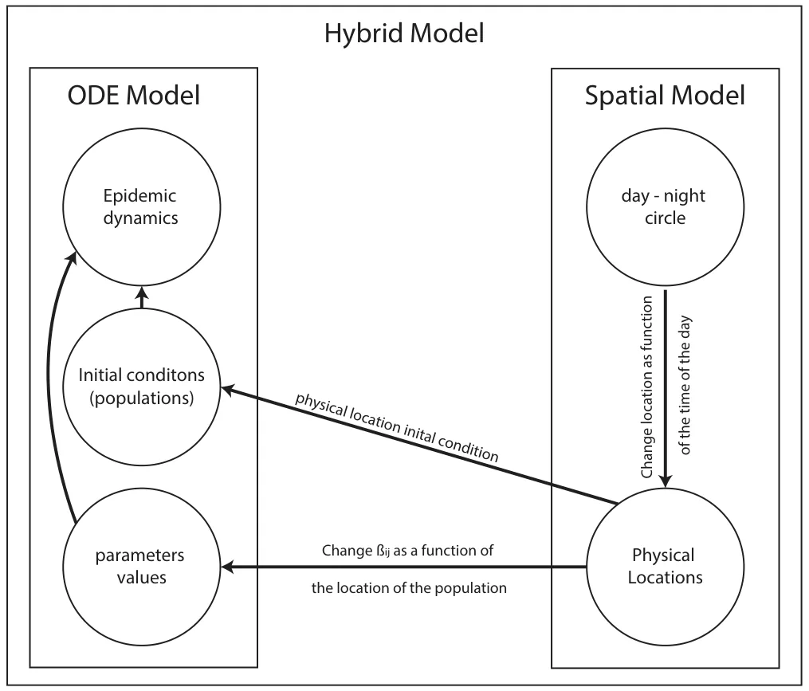
<figcaption><strong>Figure 1.</strong> Schematic view of the hybrid model’s components and relationship between the ODE and the spatial models.</figcaption>
</figure>

<figure id="fig-2">
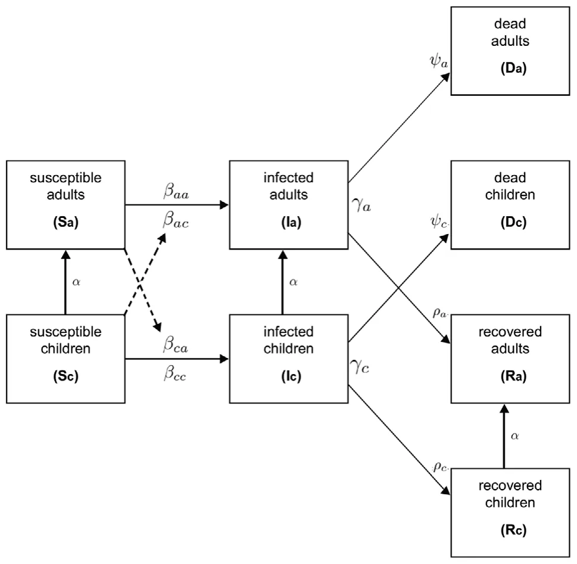
<figcaption><strong>Figure 2.</strong> The Hybrid model’s schematic view as a transition between disease stages, divided by age-class.</figcaption>
</figure>

By expanding the designation to two age-classes, we let *S*c*, I*c*, R*c*, D*c and *S*a*, I*a*, R*a*, D*a represent susceptible, infected, recovered, and death groups for children and adults, respectively such that

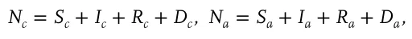

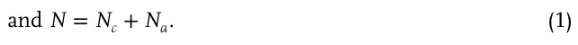

The model does not take into consideration death during the epidemic unrelated to the disease itself because in the United States in 2018, the birth rate was 11.6 for every 1000 individuals[27] while the mortality rate in 2017 was 8.6 for every 1000 individuals,[28] resulting in around 0.3% increment of the population size which is assumed to be small enough to be neglected. In addition, we introduce two death states for children and adults, respectively, that died from the epidemic.

In addition, Kelvin and Halperin[31] conclude that children may be asymptomatic but still act as transmission vectors for the virus. Thus, *I*c refers to children with asymptomatic infection who have minimal clinical symptoms, but are still able to infect others. As a result, it is assumed that the infant mortality rate is 0, as shown in the **Table 1**.

Equations (2)–(12) describes the epidemic’s dynamics.

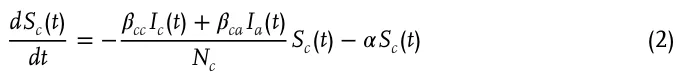

<figure class="table-figure" id="table-1">
<figcaption><strong>Table 1.</strong> The Hybrid model’s parameter description, values, and sources.</figcaption>

<table><tr><th>Parameter definition</th><th>Symbol</th><th>Value</th><th>Source</th></tr><tr><td>Children COVID-19 threshold age in days [t]</td><td>A</td><td>4745 (13 years)</td><td>[6]</td></tr><tr><td>Children to adult each day transition rate [t−1]</td><td>𝛼:= 1 A</td><td>2.1 ⋅10−4</td><td>[6]</td></tr><tr><td>Infected to recover average duration for children in days [t−1]</td><td>𝛾c</td><td>0.5</td><td>[17]</td></tr><tr><td>Infected to recover average duration for adults in days [t−1]</td><td>𝛾a</td><td>0.0714</td><td>[8]</td></tr><tr><td>Susceptible contacts in children which become infected due to direct disease transmission from an adult in a day [t−1]</td><td>𝛽ca</td><td>0.266</td><td>[18]</td></tr><tr><td>Susceptible contacts in adults which become infected due to direct disease transmission from children in a day [t−1]</td><td>𝛽ac</td><td>∼0</td><td>[20]</td></tr><tr><td>Susceptible contacts in children which become infected due to direct disease transmission from children in a day [t−1]</td><td>𝛽cc</td><td>0.308</td><td>[19]</td></tr><tr><td>Susceptible contacts in adults which become infected due to direct disease transmission from an adult in a day [t−1]</td><td>𝛽aa</td><td>0.308</td><td>[19]</td></tr><tr><td>The probability an infected adult will recover from the disease [1]</td><td>𝜌a</td><td>0.942, 0.98</td><td>[29, 30]</td></tr><tr><td>The probability an infected child will recover from the disease [1]</td><td>𝜌c</td><td>∼1</td><td>[31]</td></tr><tr><td>The probability an infected adult will not recover from the disease [1]</td><td>𝜓a</td><td>0.05, 0.02</td><td>[20, 30]</td></tr><tr><td>The probability an infected child will not recover from the disease [1]</td><td>𝜓c</td><td>∼0</td><td>[31]</td></tr></table>

</figure>

In Equation (2), dSc(t) is the dynamical amount of susceptible *dt* individual children over time. It is affected by the following three terms: First, with rate *𝛽*cc, each infected child infects susceptible children. Second, with rate *𝛽*ca, each infected adult infects the susceptible children. Finally, children grow and pass from the children’s age-class to the adult’s age-class with transition rate *𝛼*, reduced from the children’s age-class. *N*c is the size of the children population and used to take all variables as fixed proportions of the population *N*.

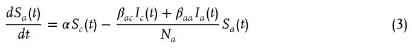

In Equation (3), dSa(t) is the dynamical amount of susceptible *dt* adult individuals over time. It is affected by the following three terms: First, children grow and pass from the children’s age-class to the adult’s age-class with transition rate *𝛼*, added to the adult age-class. Second, with rate *𝛽*ac, each infected child infects the susceptible adult. Finally, with rate *𝛽*aa, each infected adult infects a susceptible adult. *N*a is the size of the adult population and used to take all variables as fixed proportions of the population *N*.

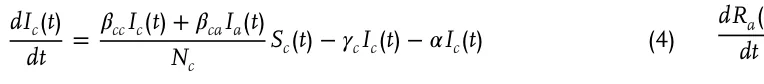

In Equation (4), dIc(t) is the dynamical amount of infected in- *dt* dividual children over time. It is affected by the following four terms. First, with rate *𝛽*ca, each infected child infects the susceptible adult. Second, with rate *𝛽*cc, each infected child infects a susceptible child. Third, individuals recover or die from the disease after a period *𝛾*c. Finally, children grow and pass from the children’s age-class to the adult’s age-class with transition rate *𝛼*, reduced from the adult’s age-class. While the last process has a minor impact relative to the first three processes, we do not neglect it in order to count edge-cases.

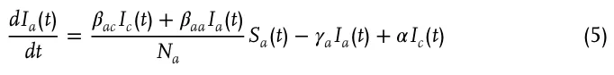

In Equation (5), dIa(t) is the dynamical amount of infected adult *dt* individuals over time. It is affected by the following four terms. First, with rate *𝛽*ac, each infected child infects the susceptible adult. Second, with rate *𝛽*aa, each infected adult infects a susceptible adult. Third, individuals recover or die from the disease after period *𝛾*a. Finally, children grow and pass from the children’s age-class to the adult’s age-class with transition rate *𝛼*, added to the adult’s age-class. While the last process has a minor impact relative to the first three processes, we do not neglect it to count edge-cases.

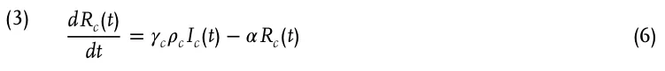

In Equation (6), dRc(t) is the dynamical amount of recovered *dt* individual children over time. It is affected by the following two terms: First, in each point, a portion of the infected children recover after period *𝛾*c, which is multiplied by the rate of children that do recover from the disease *𝜌*c. Second, children grow from birth and pass from the children’s age-class to the adult age-class with transition rate *𝛼*, reduced from the children’s age-class.

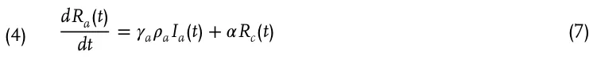

In Equation (7), dRa(t) is the dynamical amount of recovered *dt* adult individuals over time. It is affected by the following two terms. First, in each point, a portion of the infected adults recover after period *𝛾*a which is multiplied by the rate of adults that do recover from the disease *𝜌*a. Second, children grow from birth and pass from the children’s age-class to the adult age-class with transition rate *𝛼*, added to the adult age-class.

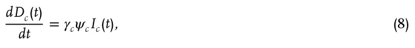

*dD*c(*t*) In Equation (8), is the dynamical amount of dead in- *dt* dividual children over time. It is affected by the portion of the infected children that do not recover after period *𝛾*c which is multiplied by the rate of children that do not recover from the disease *𝜓*c.

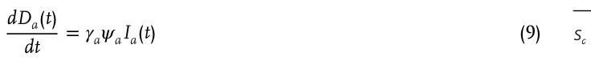

In Equation (9), dDa(t) is the dynamical amount of dead adult *dt* individuals over time. It is affected by a portion of the infected adult that do not recover after period *𝛾*a which is multiplied by the rate of adults that do not recover from the disease *𝜓*a.

It should be noted that both Equations (8) and (9) can be presented as one equation

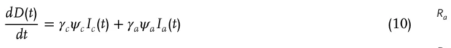

as *D*a and *D*c are accumulative populations which do not infect the dynamics separately. Nevertheless, to provide a better representation of the age-based death in the epidemic, we chose to divide the dead individuals into the same age-groups which allows later analysis of the death of children and adults separately. In summary, the interactions between disease stages presented in Figure 1 are modeled by the following system of eight coupled ordinary differential equations (ODE), Equation (11) with initial conditions at *t* = 0, Equation (12) as:

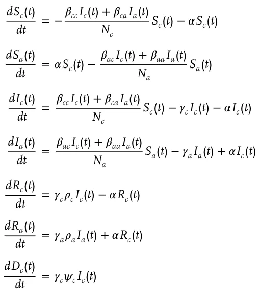

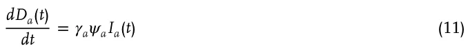

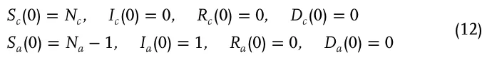

The parameters used in the calculation of the model throughout the paper are presented in Table 1. The values are cited from the sources themselves except *A* and *𝛽*ca calculated from the data of the correlated source.[6,18] The threshold of the children’s age to become adults in parameter *A* is set to 13 years as the mean value of the group of ages in which the percentage of critical cases relative to all cases is the highest as reported by Dong et al.[6] (Table 2). The susceptible contacts in children who become infected due to direct disease transmission from an adult *𝛽*ca are calculated based on data of 10 children. Eight children out of the 10 have been exposed to 30 adults in total and later found to be infected, as reported by Cai et al.[18] Therefore, the infected rate 8 is set to 30 = 0*.*266.

<figure class="table-figure" id="table-2">
<figcaption><strong>Table 2.</strong> The four equilibria solutions for Equations (11) and (12).</figcaption>

<table><tr><th></th><th>EQ1</th><th>EQ2</th><th>EQ3</th><th>EQ4</th></tr><tr><td>Sc</td><td>0</td><td>(𝛾c −𝛼)Nc</td><td>𝛽caN2 a(𝛼−𝛾a)</td><td>(𝛼+ 𝛾c)I∗ c</td></tr><tr><td></td><td></td><td>𝛽cc</td><td>𝛽aaNc</td><td>𝛽ccIc + 𝛽caIa</td></tr><tr><td>Sa</td><td>N</td><td>𝛽caN2 c(𝛾c −𝛼)</td><td>(𝛼−𝛾a)Na</td><td>(𝛾a −𝛼)I∗ c</td></tr><tr><td></td><td></td><td>Na𝛽cc</td><td>𝛽aa</td><td>𝛽acI∗ c + 𝛽aaI∗ a</td></tr><tr><td>Ic</td><td>0</td><td>𝛼Nc</td><td>𝛼Nc</td><td>I∗</td></tr><tr><td></td><td></td><td>𝛽cc</td><td>𝛽ca</td><td>c</td></tr><tr><td>Ia</td><td>0</td><td>0</td><td>𝛾a𝜌aNc 𝛽ca</td><td>I∗ a</td></tr><tr><td>Rc</td><td>0</td><td>𝛾c𝜌cNc</td><td>0</td><td>𝛾c𝜌cI∗ c</td></tr><tr><td></td><td></td><td>𝛽cc</td><td></td><td>𝛼</td></tr><tr><td>Ra</td><td>0</td><td>0</td><td>𝛼Nc</td><td>−𝛾a𝜌aI∗ a</td></tr><tr><td></td><td></td><td></td><td>𝛽ca</td><td>𝛼</td></tr><tr><td>Dc</td><td>0</td><td>𝛼Nc −−𝛾c𝜌cNc</td><td>0</td><td>I∗ − 𝛾c𝜌cI∗ c</td></tr><tr><td></td><td></td><td>𝛽cc 𝛽cc</td><td></td><td>c 𝛼</td></tr><tr><td>Da</td><td>0</td><td>0</td><td>𝛼Nc −𝛾a𝜌aNc</td><td>I∗ + 𝛾a𝜌aI∗ a</td></tr><tr><td></td><td></td><td></td><td>𝛽ca 𝛽ca</td><td>a 𝛼</td></tr></table>

</figure>

#### 2.1.2. Numerical Solution

To obtain a better understanding of how different parameter values influence the system dynamics, we illustrate the behavior of the system using numerical analysis. Equations (2)–(9) are ODEs, first-order, nonlinear, from ℝ to ℝ8, where ℝ is time (marked by *t*) and ℝ8 is the population distribution of all eight populations (marked by *S*c(*t*), *S*a(*t*), *I*c(*t*), *I*a(*t*), *R*c(*t*), *R*a(*t*), *D*c(*t*), and *D*a(*t*)). We processed eight-order Runge–Kutta integration on the differential system to enable numerical simulations. Runge–Kutta integration of the equations was implemented by Octave programming (version 5.2.0), using standard program lsode, for a set of initial conditions described in Eq (12).

The solutions of the system (11–12) are shown in **Figure 3**. In addition, the population size, adults, and children are set to be *N* = 8 000 000*, N*c = 2 240 000*, N*a = 5 760 000 to present the distribution of the Israeli population in 2017 as published by the Israeli central bureau of statistics. Figure 3 shows the population group sizes of *S*c(*t*), *S*a(*t*), *I*c(*t*), *I*a(*t*), *R*c(*t*), *R*a(*t*), *D*c(*t*), and *D*a(*t*) where the *x*-axis in all eight graphs represents the time (in days) that has passed from the beginning of the dynamics and the *y*- axis is the size of each population, respectively. A maximum in the percent of infected children and adults (39%, 89%) is reached in the 8th and 11th days as shown in Figure 3. Therefore, the maximum infected population was 89% of the whole population. Besides, all children infected and recovered after 17 days while all adults recovered after 82 days.

<figure id="fig-3">
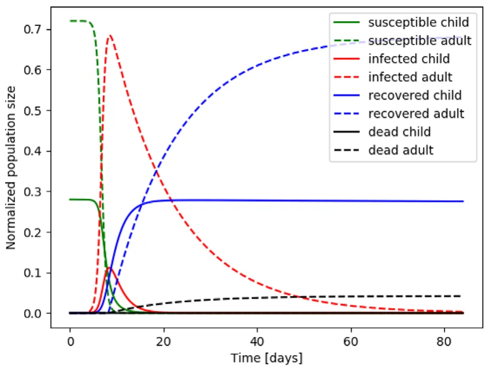
<figcaption><strong>Figure 3.</strong> Numerical simulation of trajectories of Equations (11) and (12) and the parameter values from Table 1. The graphs show the evolution in time (days) of <em>S</em>c(<em>t</em>), <em>S</em>a(<em>t</em>), <em>I</em>c(<em>t</em>), <em>I</em>a(<em>t</em>), <em>R</em>c(<em>t</em>), <em>R</em>a(<em>t</em>), <em>D</em>c(<em>t</em>), and <em>D</em>a(<em>t</em>). Adult and children graphs are presented with a dotted and solid lines, respectively. Susceptible, infected, recovered, and dead are shown in green, red, blue, and black, respectively.</figcaption>
</figure>

#### 2.1.3. Stability Analysis

In epidemiology, it is essential to quantify the severity of outbreaks of infectious diseases. The standard parameter indicates the severity called the basic reproduction number *R*0. In the standard SIR model,[23] *R*0 is defined to be the ratio between individual infection rate and recovery rate, where almost everyone is susceptible (namely, *S*c + *S*a ∼ *N*).

In order to find the asymptotic form *g* for given initial conditions and parameters, it is possible to use the next generation matrix approach.[33] Let *V*+ i be the rate of transfer of individuals by all means except of appearance of new infections in compartment *i*, and *V*− i be the rate of transfer of individuals out of compartment *i*. Let *F*i be the rate of appearance of new infections in compartment *i*. Equations (2)–(9) take the form:

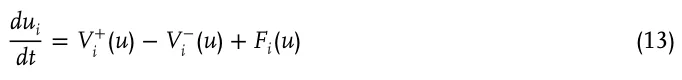

where

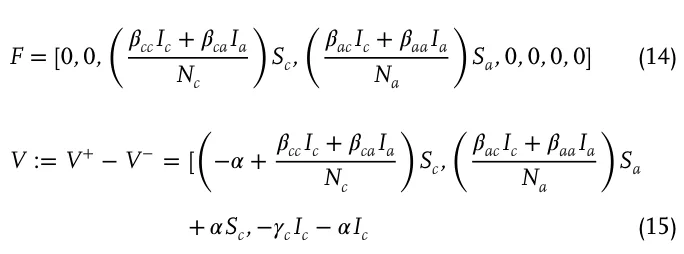

−*𝛾*a*I*a + *𝛼I*c*,* −*𝛼R*c + *𝛾*c*𝜌*(*r*c)*I*c*,* +*𝛼R*c + *𝛾*a*𝜌*(*r*a)*I*a*, 𝛾*c(1 − *𝜌*(*r*c))*I*c*,*

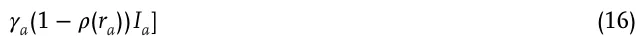

In equilibrium, *I*c and *I*a are both equal to zero so the derivatives at equilibrium, focusing on *I*c and *I*a from Equations (4) and (5), are mapped to the third and forth elements in vectors *F* and *V* giving the matrices **F** and **V**.

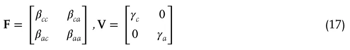

The next generation matrix is defined as **FV**−1.[33]

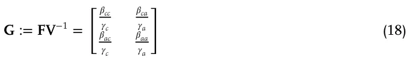

Assume an initial condition

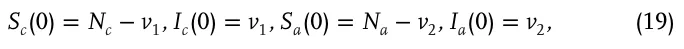

marked as *v* = [*v*1*, v*2]. After one time unit, the amount of infected individuals can be calculated using *v*′ = **G***v*. Therefore, for any start condition and model parameters one can find the asymptotic form *g* by calculating

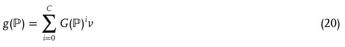

where *C* ∈ ℕ is the first index that satisfies *I*c(*C*) + *I*a(*C*) = 0.

It is possible to retrieve *R*0 from the next generation matrix 𝔾 as it is the dominant eigenvalue of the matrix,[26] as this matrix describes the total amount of infections caused by each class over the lifetime of the infection. The epidemic is assumed to be stable if *R*0 ≤ 1. This means that for each infected individual there is less than one infected individual in any of the groups in the next time unit. The dominant eigenvalue of **G** can be calculated using the characteristic equation which is a second-order polynomial of *R*0. The zero points of this polynomial are

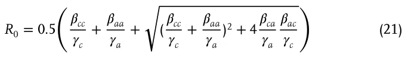

Both *𝛾*c and *𝛾*a are biological properties of the disease; on the other hand, *𝛽*aa*, 𝛽*ac*, 𝛽*ca, and *𝛽*cc can be managed using social distance, quarantine, masks, and other methods. **Figure 4**a–e presents five projections of stability from the parameter space {*𝛽*aa*, 𝛽*ac*, 𝛽*ca*, 𝛽*cc} calculated using Equation (21). Figure 4a shows the *𝛽*aa − *𝛽*ac projection where *𝛽*cc = 0*.*308*, 𝛽*ca = 0*.*266. There are no values such that *R*0 *<* 1 and from the color gradient, it is possible to see that *𝛽*ac has slightly more influence on *R*0 relatively to *𝛽*aa. Figure 4b shows the *𝛽*aa − *𝛽*ca projection where *𝛽*cc = 0*.*308*, 𝛽*ac = 0. There are no values such that *R*0 *<* 1 and from the color gradient, it is possible to see that *𝛽*aa has a minor to no influence on *R*0 relatively to *𝛽*ca. Figure 4c shows the *𝛽*cc − *𝛽*ca projection where *𝛽*aa = 0*.*308*, 𝛽*ca = 0*.*266. *R*0 *<* 1 for any combination of *𝛽*cc*, 𝛽*ac such that *𝛽*ac *<* 0*.*08 − 1*.*6*𝛽*cc. Figure 4d shows the *𝛽*cc − *𝛽*ac projection where *𝛽*aa = 0*.*308*, 𝛽*ac = 0. *R*0 *<* 1 for any combination of *𝛽*cc*, 𝛽*ac such that *𝛽*cc ≤ 0*.*3. Figure 4e shows the *𝛽*aa − *𝛽*cc projection where *𝛽*ca = 0*.*266*, 𝛽*ac = 0. *R*0 *<* 1 for any combination of *𝛽*aa*, 𝛽*cc such that *𝛽*cc *<* 0*.*9 − 0*.*155*𝛽*aa.

<figure id="fig-4">
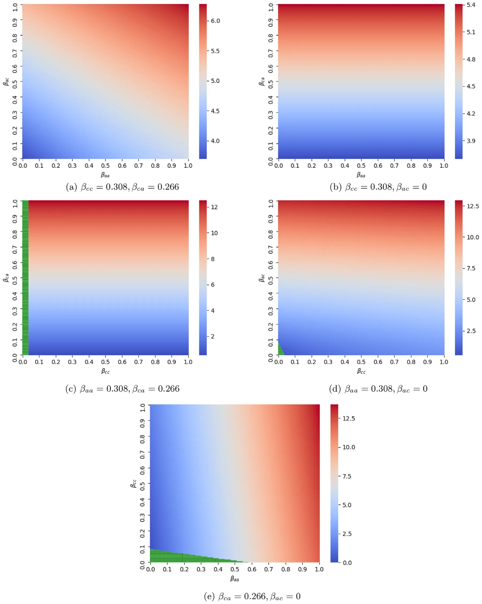
<figcaption><strong>Figure 4.</strong> 2D projections of the {<em>𝛽</em>aa<em>, 𝛽</em>ac<em>, 𝛽</em>ca<em>, 𝛽</em>cc} space and their influence on <em>R</em>0, as obtained from Equation (21). The green section is where <em>R</em>0 ≤ 1. The color gradient is from blue (lower <em>R</em>0) to red (higher <em>R</em>0). The model parameters used are <em>𝛼</em> = 8<em>.</em>78 × 10−6<em>, 𝛾</em>c = 0<em>.</em>5<em>, 𝛾</em>a = 0<em>.</em>0714.</figcaption>
</figure>

In order to obtain the equilibria points of the model and their stability properties, the Jacobian (*J*) is obtained by linearizing Equations (4) and (5) in the system (Equations (2)–(9)). The calculations show that such that *S*c = 0 if *I*c *>* 0 or *S*a = 0 if *I*a *>* 0. At time *t*∗, dSa dt = 0 or *dS*c dt=0 which is different then the values of *S*c and *S*a for equilibria *EQ*2*, EQ*3, and *EQ*4.

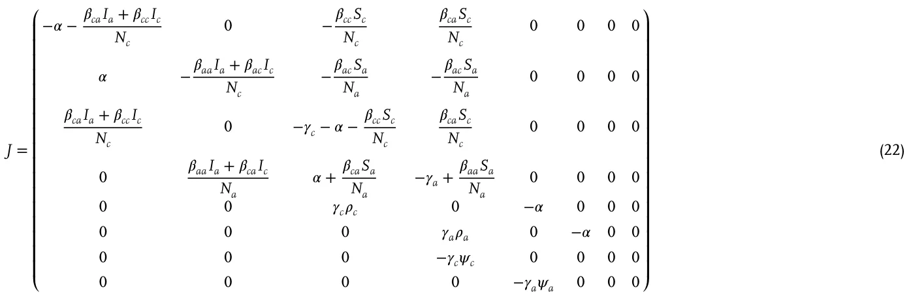

The system (Equations (11) and (12)) has four non-trivial equilibria which may be found by setting all rates in Equation (11) to zero; marked by *EQ*1*, EQ*2*, EQ*3, and *EQ*4. Thus, equilibria are provided as the state vector of the eight population states in Equation (11), where

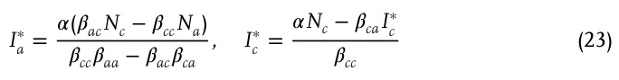

There are other equilibria for trivial cases such as *S*a(0) = 0 or *S*c(0) = 0 which are unrealistic for real-world dynamics. Below, we investigate the stability of four nontrivial equilibria.

*EQ*1: is the case for *I*c(*t*) = *I*a(*t*) = 0 for every *t* ∈ ℕ (see Table 2). This is a trivial equilibrium where there is no epidemic at all. Because the model does not take into consideration the birth of new children, after *A* days all children become adults and *EQ*1 is derived. By settings *J*(*EQ*1), all eigenvalues are negative for all *Na*+*Nc* parameter values except *𝜆* = −*𝛾*a + *𝛽*aa Na . Therefore, this equi- *Na*+*Nc* librium is stable if *𝛽*aa *< 𝛾*a. *Na EQ*2: is the case for *I*a(*t*) = 0 for every *t* ∈ ℕ (see Table 2). This equilibrium can be achieved if *𝛽*ac = 0 because in any other case (assuming *S*a(0) *>* 0) exists time *t* such that dIa(t) *>* 0 and there- *dt* fore *I*a(*t* + 1) ≠ 0. This equilibrium corresponding to the case where adults do not infect children at all which is improbable as a real world scenario. *EQ*3: is the case for *I*c(*t*) = 0 for every *t* ∈ ℕ (see Table 2). This equilibrium can be achieved if *𝛽*ca = 0 because in any other case (assuming *S*c(0) *>* 0) exists time *t* such that dIc(t) *>* 0 and there- *dt* fore *I*c(*t* + 1) ≠ 0. This equilibrium corresponding to the case where children do not infect adults at all which is similarly to *EQ*2, improbable as a real world scenario.

*EQ*4: is the case for ∃*t* such that *I*c(*t*) ≠ 0 and *I*a(*t*) ≠ 0 (see Table 2). This equilibrium is the generic case for the model. This equilibrium does not have a unique epidemiological properties.

The equilibria *EQ*2*, EQ*3, and *EQ*4 are not stable because in each of the cases, either *I*a *>* 0 or *I*c *>* 0. Assuming, the equilibria is kept until some time *t*∗ such that *t*∗ is defined as the first time *t*

### 2.2. Spatial Model

**Figure 5** shows the spatial model schema presenting the populations distribution and locations (work/school, and home) at some time of the day. In addition to the ODE model’s parameters (shown in Table 1), the following parameters are added to the hybrid model as part of the spatial model:

- 1) *𝜙*ac, the average number of meeting events between adults and children per hour.
- 2) *𝜙*aa, the average number of meeting events between adults and adults per hour.
- 3) *𝜙*cc, the average number of meeting events between children and children per hour.
- 4) *t*d c, hours of the day that children are at home and *t*n c = 24 − *t*d *c* hours of the day that children are at school. 5) *t*d a, hours of the day that adults are at home and *t*n a = 24 − *t*d *a* hours of the day that adults are at work.

We assume the transition from home to either work or school and back is immediate and that everybody is following the same clock. Each simulation step simulates 1 h. The population size is constant during the simulation and initialized in the beginning of each iteration by setting children population size *N*c and adult population size *N*a. In each simulation step, the following three actions take place:

- 1) If a member is in the susceptible group and meets other members of the infected group, there is a change of *𝛽*aa*, 𝛽*ac*, 𝛽*ca, or *𝛽*cc according to the age-class of the two members that the first will be infected.
- 2) Each infected child or adult that was infected for 1 𝛾c *,* 1 𝛾a simulation steps becomes either recovered or deceased, respectively.
- 3) According to the hour of the day, the adults transition to home or work and the children to home or school.

The spatial model adds day–night circle and three main locations to the dynamics of the hybrid model. A description of the whole of the hybrid model. The *x*-axis is the time (in days) that has passed from the beginning of the epidemic and the *y*-axis is the normalized size of each population, respectively. The parameters used in the simulations are *t*d c = *t*d a = 12*, 𝜙*ac = *𝜙*aa = *𝜙*cc = 1*, N* = 1000*, N*c = 280*, N*a = 720.

<figure id="fig-5">
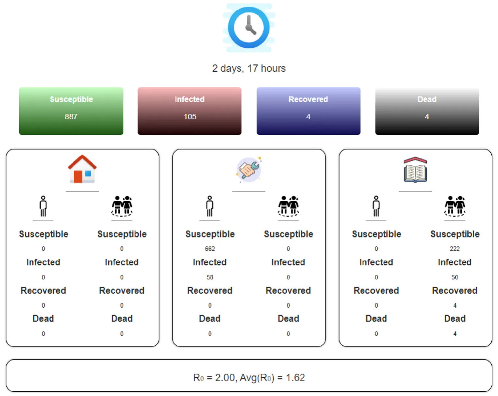
<figcaption><strong>Figure 5.</strong> The panel of the spatial model. From top to bottom: the time from the beginning of the simulation. Distribution of the population to susceptible, infected, recovered, and dead groups. The distribution of the population to susceptible, infected, recovered, and dead groups with separation to children and adults and their current location (home, work, school). The <em>R</em>0 at a certain time and the average <em>R</em>0 from the beginning of the simulation.</figcaption>
</figure>

<figure id="fig-6">
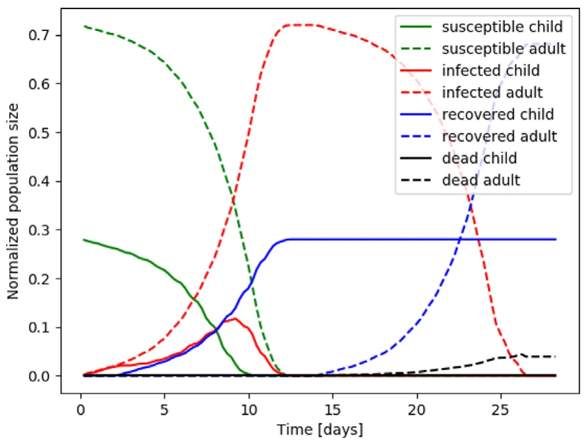
<figcaption><strong>Figure 6.</strong> Average of ten iterations of numerical simulation of the hybrid model where the parameter values are taken from Table 1. Children and adult graphs are presented with a dotted and solid lines, respectively. Susceptible, infected, recovered, and dead are shown in green, red, blue, and black, respectively.</figcaption>
</figure>

A maximum in the percent of infected children and adults (38.5%, 100%) is reached on the 9th and 12th day, as shown in Figure 6. In addition, all children were infected and recovered after 12 days while all adults recovered after 28 days. The simulation shows similar results to the results derived by solving the model (Equations (11) and (12)) as presented in Figure 3. The main difference between the two is that the simulation predicts 4.43 times shorter duration from the time of maximum infected adults to the time that all adults are either dead or recovered, as the infected adult population equals zero on the 82nd and 28th days. In addition, the maximum of infected adults is reached on the 11th and 12th days resulting in 71 and 16 days for full recovery.

## 3. Results

### 3.1. Outbreak Analysis

spatio-temporal dynamics of the Hybrid model as a system of ODEs can be found in Equations (S1)– (S16), Supporting Information.

**Figure 6** shows the population group sizes of *S*c(*t*), *S*a(*t*), *I*c(*t*), *I*a(*t*), *R*c(*t*), *R*a(*t*), *D*c(*t*), and *D*a(*t*) as an average of ten iterations The proposed hybrid model provide an in silico environment allowing relatively fast, cheap, and accurate analysis of different policies on the COVID-19 spread dynamics.

One of the major hopes of politicians is for an NPI policy in which the epidemic does not reach an outbreak at any time after they initialized a given decision. We define this condition mathematically as follows:

<figure id="fig-7">
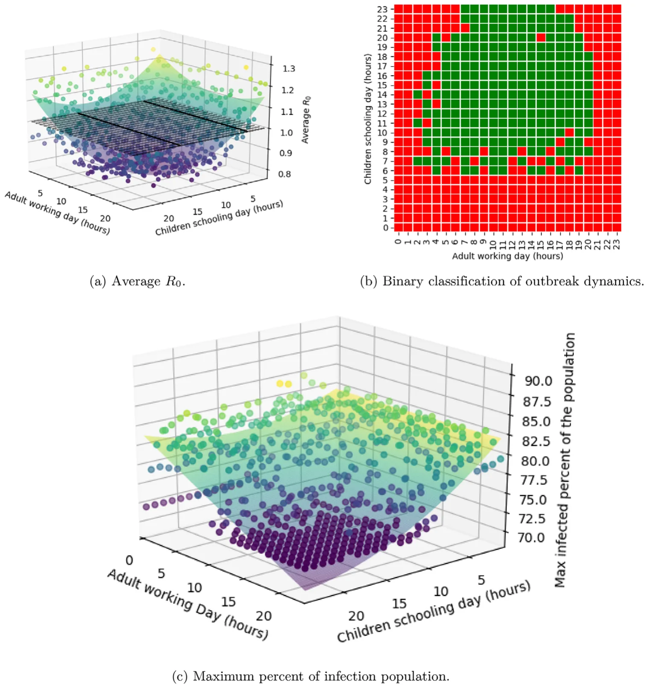
<figcaption><strong>Figure 7.</strong> Analysis of the epidemic spread as a function of working (<em>d</em>W) and schooling (<em>d</em>S) duration in hours each day.</figcaption>
</figure>

**Definition 2.** For given initial condition and model’s parameter (ℙ). A solution of Equations (11) and (12) is defined as outbreak dynamics if ∃*t* ∈ ℕ : *R*0(*t*) *>* 1.

We will examine two policies, based on this condition, to determine if each one is possible to fulfill the condition. If so, the optimal NPI policy is based on the parameter-space criteria:

- 1) The influence of the duration of the work/school day.
- 2) Lockdown in homes with partial to full separation between individuals.

### 3.2. Duration of Working and Schooling Day

We will assume that children meet only children in school and adults meet only adults at work and at home adults and children meet each other. This is a good approximation of the real dynamics as a relatively small percent of adults work with children during the day which keeps the interactions between children and adults at this time relatively small to the extent of interaction when both adults and children are at home and therefore can be neglected.

Based on the proposed spatial model, we change the number of hours children and adults spend in school and work each day, respectively. **Figure 7**a shows the average *R*0 as a function of the duration in hours of the working (*d*W) and schooling (*d*S) day. The dots are the calculated values from the simulator and the surface is a fitting function *R*0(*d*W*, d*S). The fitting function is calculated using the least mean square (LMS) method.[34] In order to use the LMS method, one needs to define the family function approximating a function. The family function

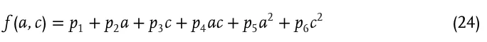

has been chosen to balance between the accuracy of the sampled data on the one hand and simplicity of usage on the other,[35]

*R*0(*d*W*, d*S) = 1*.*267 − 0*.*018*d*W − 0*.*030*d*S + 0*.*001*d*2 W + 0*.*001*d*2 *S*

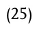

and was obtained with a coefficient of determination *R*2 = 0*.*815. Similarly, Figure 7c shows the average maxt(*I*c(*t*) + *I*a(*t*)) as a function of the duration in hours of the working (*d*W) and schooling (*d*S) day. The dots in Figure 7c are the calculated values from the spatial model and the surface is the fitting function

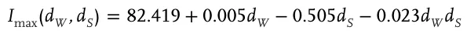

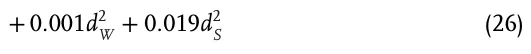

obtained with a coefficient of determination *R*2 = 0*.*748.

The duration of either working or schooling day has a local minimum at (*d*W*, d*S) = (18*,* 14) with *R*0 = 0*.*808, as shown in Figure 7a. The optimal point from Equation (25) is (*d*W*, d*S) = (9*,* 17*.*5) with *R*0 = 0*.*967 obtained by setting the gradient of *R*0(*d*W*, d*S) to zero. The inconsistency in the values is resulted by the error in the fitting function but both show the same behavior in which longer working hours reduce significantly the infection rate but too many hours increase the infection rate back as the lack of circulation of contagious adults and children during the day helps to reduce the infection rate. Furthermore, Figure 7b presents a binary classification where red cells are cases with an outbreak and green cells are cases without outbreak during the simulation as a function of the working (*d*W) and schooling (*d*S) duration in hours each day.

On the other hand, the duration of either working or schooling day has an effect of 10% (as the maximal value is 82.5 while the minimal is 72.5) on the maximal infected percent of individuals from the population as shown in Figure 7c and by setting the limits *d*W = {0*,* 24}*, d*S = {0*,* 24} in Equation (26). There is a sharp decline between a shorter working–schooling duration of 10 h or less and longer than that. This is associated with the fact that with more than 12 h (half-day) the dynamics that have a higher incidence are the ones with *𝛽*ca = *𝛽*ac = 0 which reduces the number of infected individuals in total.

### 3.3. Lockdown Policy

Partial or full lockdown of several locations or entire countries were broadly used at the beginning of the COVID-19 outbreak as a policy to reduce the number of infected individuals and control the spread dynamics. The lockdown policy yields social distance which reduces the ratio of infection. On the other hand, this policy negatively affects the economy and mental health, and increases the presence of other diseases (both physical and mental) in the population. Therefore, the optimization task of finding the minimal portion of the population to be locked down such that the epidemic will be constrained is important.

The lockdown policy is similar to the schooling-working hours policy in the manner that both modify the spatial dynamics of the population. Nevertheless, the schooling-working hours policy defined the number of hours all the children and working adults populations go to school and work, respectively, while the lockdown policy keeps part (or all) the population at home all day long alongside the remain part of the population keeps the regular working and schooling hours. In addition, the lockdown policy isolates individuals at home, which is expressed by the fact that individuals can contact with them but they can not initial an contact with other individuals while this constraint does not take place in the working-schooling hours policy.

The optimization problem can be written formally as

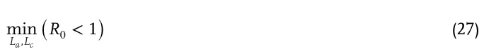

where *L*a and *L*c are the portion of adults and children in lockdown. We ran the spatial model multiple times where each time a combination of (*L*a*, L*c) = {(0*.*1*i,* 0*.*1*i*)}10 i=0 of the population is assumed to be in lockdown. **Figure 8**a shows the results of this calculation. Each dot represents *R*0 of each case *L*a*, L*c. The black grid shows the threshold *R*0 = 1.

The behavior of *R*0 as a function of *L*a*, L*c has been retrieved using the LMS method and takes the form

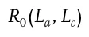

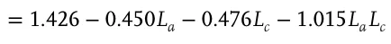

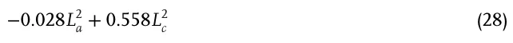

obtained with a coefficient of determination *R*2 = 0*.*971. Therefore, it is safe to claim that function *R*0(*L*a*, L*c) is well fitting the data despite the stochastic noise of the simulation and presents a fair approximation for the *R*0 behavior as a function of *L*a*, L*c. Using Equation (28), it is possible to find the constraints of *L*a*, L*c such that *R*0 ≤ 1, by solving *R*0(*L*a*, L*c) ≤ 1.

Closing only schools without any reduction in adults going to work does not prevent an epidemic outbreak, while locking down half of the adult population will prevent an outbreak. Lockdown of children (*L*c) have a minor effect relatively to lockdown adults (*L*a) as shown in both Equation (28) and Figure 8b. In addition, the same phenomena repeat in the max infected individuals, as shown in Figure 8c. The surface calculated using the LMS method:

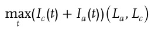

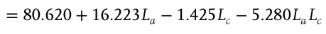

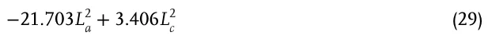

and obtained with a coefficient of determination *R*2 = 0*.*840.

In addition, we repeat the analysis by numerically solving the system (Equations (11) and (12)). The lockdown is reflected in the model as the infection rate between every two individuals. *L*a affects the interactions between adults and either other adults or children *𝛽*aa*, 𝛽*ac, and *L*c affect the interactions between children and either other children or adults *𝛽*cc*, 𝛽*ca. Mark the original values of *𝛽*aa*, 𝛽*ac*, 𝛽*ca*, 𝛽*cc from Table 1 as *𝛽*∗ aa*, 𝛽*∗ ac*, 𝛽*∗ ca*, 𝛽*∗ cc. Each time, the system solved where (*L*a*, L*c) = {(0*.*1*i,* 0*.*1*i*)}10 i=0 such that *𝛽*aa = *𝛽*∗ aa ⋅ *L*a, *𝛽*ac = *𝛽*∗ ac ⋅ *L*a, *𝛽*ca = *𝛽*∗ ca ⋅ *L*c, and *𝛽*cc = *𝛽*∗ cc ⋅ *L*c. **Figure 9**a shows the results of this calculation based on Equation (21). Each dot represents *R*0 of each case *L*a*, L*c. The black grid shows the threshold *R*0 = 1. Figure 9b presents a binary classification of the cases with outbreak dynamics (red) or without (green). Figure 9b is similar to Figure 8b such that adult lockdown has a higher influence on the outbreak and predicts that a much higher percentage of the population will be in lockdown. Again, the difference in the percent of adult’s lockdown (*L*a) such *t*d *a* 24 that *R*0 *<* 1 can be associated with the slower infection rate in hours of each day because part of the adults change their location which in it turns influence the infection rate. In addition, the recovery process is faster in the spatial model (as shown in Figures 3 and 6).

<figure id="fig-8">
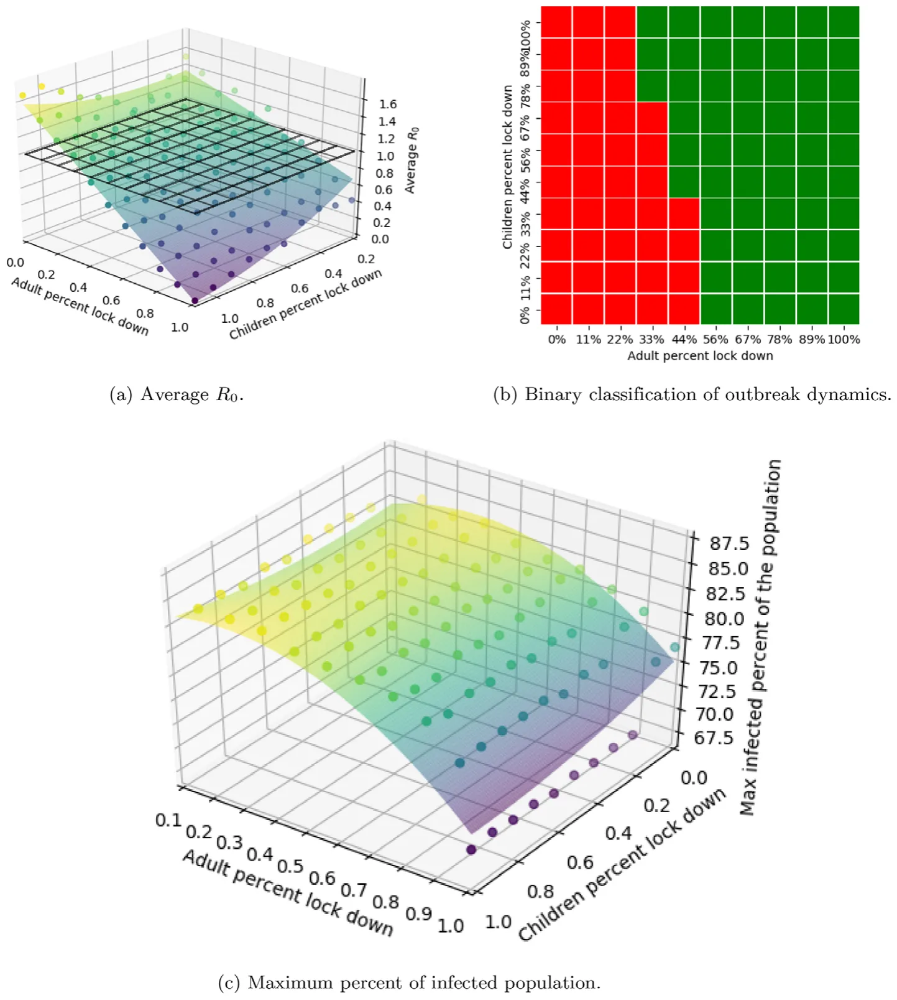
<figcaption><strong>Figure 8.</strong> Analysis of the epidemic spread as a function of adult lockdown (<em>L</em>a) and children lockdown (<em>L</em>c) using the computer simulation of the hybrid model.</figcaption>
</figure>

The behavior of *R*0 as a function of *L*a*, L*c has been derived using the LMS method and takes the form

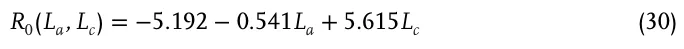

obtained with a coefficient of determination *R*2 = 0*.*952.

In addition, Figure 9c presents the max infected individuals as a function of adult and children lockdown. The surface has been calculated using the LMS method and takes the form:

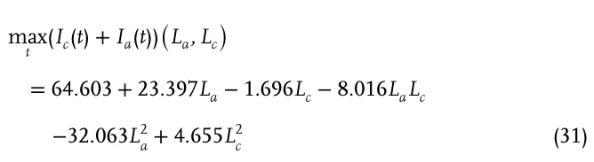

obtained with a coefficient of determination *R*2 = 0*.*702. Figures 8c and 9c are presenting the same behavior while Figure 8c predicts 5% more infected individuals on average. The influence of the adult lockdown is one order of magnitude more significant than that of the children’s lockdown in a first and second order approximation as shown in Equations (29) and (31). That is, where there is no lockdown for children (*L*c = 0), there is a local maximum in infected individuals regardless of the lockdown of adults (*L*a).

### 3.4. Validation of the Hybrid Model on the Dynamics of the COVID-19 Pandemic in Israel

In Israel, in February 21, the first COVID-19 infected individual was detected. On March 25, a national quarantine was implemented that continued for 2 months with local relief and restriction on several occasions and in several cities. **Figure 10** presents the daily new confirmed cases from August 15 to September 28, respectively. Where the blue (solid) line marks the date when the schools returned to almost full capacity, the green (solid-dotted) lines are linear regression for before and after school opening, respectively. It is easy to see a significant increment in the number of new daily cases.

<figure id="fig-9">
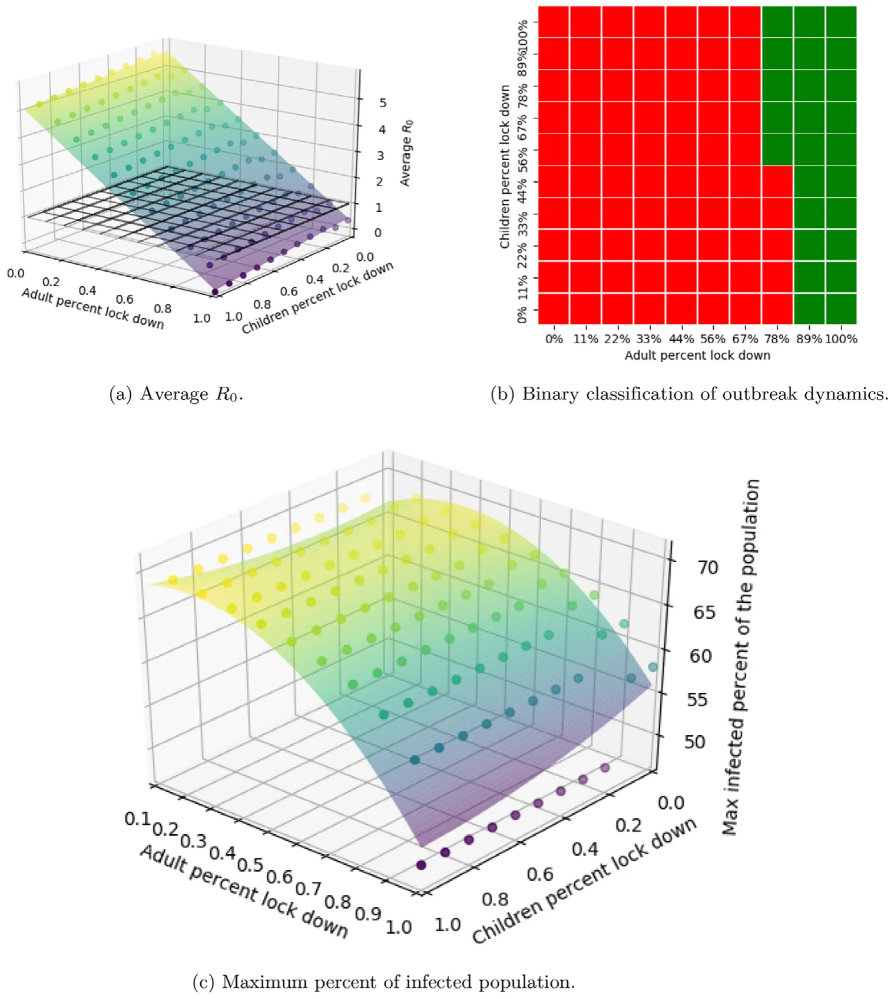
<figcaption><strong>Figure 9.</strong> Analysis of the epidemic spread as a function of adult lockdown (<em>L</em>a) and children lockdown (<em>L</em>c) by the hybrid model.</figcaption>
</figure>

From ref. [4], there were 90 232 infected at August 15. Given that the average recovery rate of children is 2 days and adults is 14 days (see Table 1) and that children is 28% of the population, we obtain that there was approximately 18 899 infected adults and 868 infected children. We assume that the amount of recovered individuals is heterogeneous in the population and that only adults die from the epidemic until this point. Equation (32) shows the initial conditions for August 15 (*t*0), Israel.

*S*c(*t*0) = 2219418*, I*c(*t*0) = 868*, R*c(*t*0) = 19*,* 714*, D*c(*t*0) = 0

*S*a(*t*0) = 5686182*, I*a(*t*0) = 18899*, R*a(*t*0) = 54196*, D*a(*t*0) = 723 To test the hybrid model, we calculated the *R*0 on average per day for the period from August 15 to September 1 and from September 1 to September 15, dividing the number of new cases by the total number of cases on that day (obtained from ref. [4]). We solve numerically the hybrid model and calculate *R*0 for the case in which schools are open versus the case in which schools are closed. If schools are open, children go to school three times a week (every other day, except weekends) for 5 h each day. If schools are closed, children stay at home all the time. In both cases, we assume that adults work 8 h each day, except on weekends when they stay home. The obtained values of *R*0 for both cases are shown in **Figure 11**, with a mean square error (MSE) of 0*.*205.

Considering that, longer school day is reducing the infection rate (Figure 7a), we solve numerically the hybrid model and calculate *R*0 for the case when the schools are open (from September 1). We assume that children go to school every day (except weekends) for 9 h while the adults go to work for the same period. We obtain that the difference in the average *R*0 of the case with the optimal NPI (*R*0 = 1*.*45) and the historical NPI (*R*0 = 2*.*28) is Δ*R*0 = 0*.*83 (see Figure 11).

<figure id="fig-10">
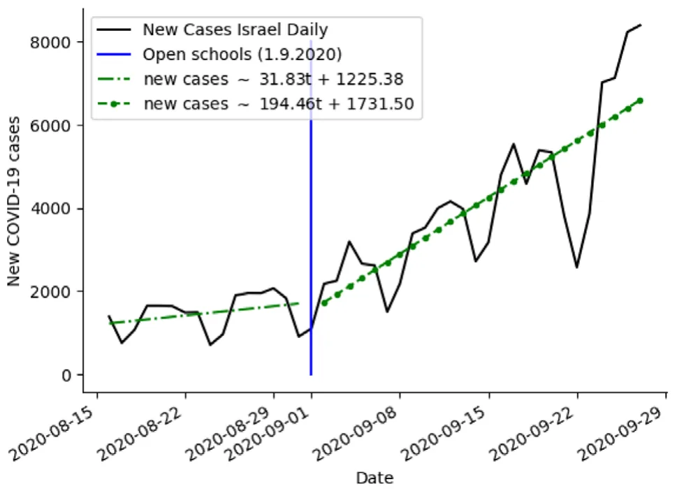
<figcaption><strong>Figure 10.</strong> Daily confirmed cases in Israel between August 15 and September 29 (2020).[4] The blue (solid) line is the full opening of schools. The green (solid-dotted) lines are a linear regression for before and after school opening, respectively.</figcaption>
</figure>

<figure id="fig-11">
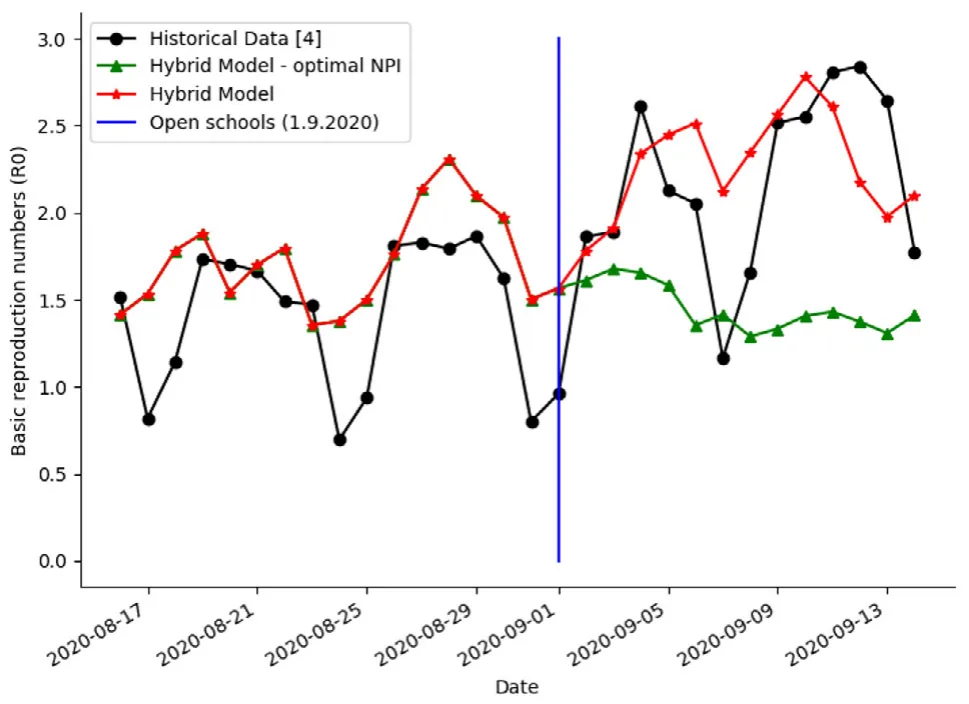
<figcaption><strong>Figure 11.</strong> <em>R</em>0 between August 15 and September 15 (2020) comparison between the historical data and the hybrid model predictions.</figcaption>
</figure>

## 4. Discussion

This study presents a model showing the effects of population age, time of day, and gathering location on the spread of the epidemic. Based on the proposed model Equations (11) and (12), the non-trivial equilibria of the system is presented in Table 2. Although the proposed model is a simplification of the total complexity of the COVID-19 epidemic, the asymptotic solution without any intervention will result in a high percentage 39% children, 89% adults and 38.5% children, 100% adults of infected individuals as shown in Figures 3 and 6, respectively.

In addition, the asymptotic solutions of the model are insignificant for themselves as in practice these results occur after *A* days (13 years). The main epidemic dynamics as obtained from both the SIRD model Equations (11) and (12) and the hybrid model is a few month long, as shown in Figures 3 and 6. Besides, the asymp-totic solution can be used to easily obtain *D*a and *D*c as they accumulative sums of infected infected adults and children multiplied by a factor *𝜓*a and *𝜓*c and do not change after the epidemic is over. As a result, *𝛼* = 2*.*1 × 10−4 is not used as for 82 days (as shown in Figure 3) only 0.017% of the children will become adults which effectually has only a minor affect on the epidemic results.

Furthermore, two policies for controlling the epidemic and preventing outbreak have been investigated using the hybrid model. First, the duration of working and schooling day has an influence (up to 10%) on the maximum of infected individuals but can prevent outbreaks under the assumption that during this time adults do not contact children at all as shown in Figure 7. These results match the conclusions reported by Keskinocak et al. (2020) for Georgia state.[36] In addition, these results match the results reported by Di Domenico[16] that school closure has a minor influence on the epidemic peak, just delays it. Second, a partial lockdown of adults and children shows that adults’ and children’s lockdowns have a similar first-order effect (linear coefficients of *L*a and *L*c) but the combination between the two (*L*a*L*c) has a bigger weight on the average infection rate as shown in Equations (28) and (30). These results match the conclusions reported by Aglar et al. (2020) for the state of Georgia regarding the voluntary lockdown with school closure.[37] By the same token, a lockdown of approximately half of the adult population prevents an outbreak where children lockdown has a less significant influence as shown in Figures 8 and 9. These results are based on values from Table 1, which can vary significantly between countries and depend on other hyperparameters such as population density, age distribution of the population and others.

The model explains the dynamics that took place between August 15 and September 15 (2020) in Israel as presented in Figure 11, with MSE of 0*.*205. The opening of the schools is equal to reducing the lockdown for children with some relaxation (smaller *L*a) of the lockdown for adults (because if the children are in school they can go to work) with less than half (50%) of the adult population voluntarily in lockdown. Also, the schooling hours were reduced to less than 6 h each day. From Figures 7a and 8c, it is easy to see that this policy predicts high increase in the infection rate, as indeed happened. Keeping the schools open while keeping the increase in the infection rate from increasing significantly is possible if the schooling hours are longer (8–9 h) as shown in Figure 7a. The influence of this policy in Israel during the school opening which take place in September 1 shows that the *R*0 can be reduced by 0*.*83 in comparison to a policy in which children go to school every other day for 5 h, as shown in Figure 11. Also, if at least half of the adult population will be in lockdown, the influence of the schools on the infection rate will be relatively small as shown in Figure 8b.

In the case of a future pandemic virus, researchers will be able to use our approach to predict the exact consequences of choosing “Lockdown” strategies, especially those needed for pandemics with a lack of immunity in the world’s population. Understanding the age-based dynamics in COVID-19 spread in the population will be crucial for the development of an optimal NPI policy, as well as for optimizing current polices and analyzing clinical data. The further extensions of the model will be used to learn how to manage international travel between countries with a range of healthcare system abilities in both the context of the COVID-19 epidemic and for other epidemics scenarios.

- **Supporting Information**

Supporting Information is available from the Wiley Online Library or from the author. **Conflict of Interest** The authors declare no conflict of interest. **Data Availability Statement** Data sharing is not applicable to this article as no new data were created or analyzed in this study.

## Keywords

COVID-19 spread dynamics, hybrid models, spatio-temporal models, two-age group SIR

Received: November 19, 2020 Revised: January 30, 2021 Published online:

## References

1. J. Chen, T. Qi, L. Liu, Y. Ling, Z. Qian, T. Li, F. Li, Q. Xu, Y. Zhang, S. Xu, Z. Song, Y. Zeng, Y. Shen, Y. Shi, T. Zhu, H. Lu, The Journal of infection 2020, 80, e1.
2. F.-W. C. Jasper S. Yuan, K. H. Kok, T, K. K., H. Chu, J. Yang, F. Xing, J. Liu, C. C. Yip, R. W. Poon, H. Tsoi, S. K. Lo, K. Chan, V. K. Poon, W. Chan, J. D. Ip, J. Cai, V. C. Cheng, H. Chen, C. K. Hiu, Lancet 2020, 395, 514.
3. Eurosurveillance Editorial Team, Euro Surveill 2020, 25, 200131e.
4. WHO Coronavirus Disease (COVID-19) Dashboard, 2020. https://covid19.who.int/ [link](https://covid19.who.int/)
5. S. F. Darabi, C. Scoglio, in 50th IEEE Conf. on Decision and Control and European Control Conf., IEEE, Piscataway, NJ 2011, pp. 3008– 3013.
6. Y. Dong, X. Mo, Y. Hu, X. Qi, F. Jiang, Z. Jiang, S. Tong, Pediatrics 2020, 145, e20200702.
7. J. R. Lechien, C. M. Chiesa-Estomba, S. Place, Y. V. Laethem, P. Caba-raux, Q. Mat, K. Huet, J. Plzak, M. Horoi, S. Hans, M. R. Barillari, G. Cammaroto, D. Fakhry, T. Ayad, L. Jouffe, C. Hopkins, S. Saussez, J. Intern. Med. 2020, 288, 335.
8. I. Voinsky, G. Baristaite, D. Gurwitz, The Journal of Infection 2020, 81, e102.
9. J. Wu, W. Li, X. Shi, Z. Chen, B. Jiang, J. Liu, D. Wang, C. Liu, Y. Meng, Y. Cui, J. Yu, H. Cao, L. Li, J. Intern. Med. 2020, 288, 128.
10. J. C. Miller, Infectious Disease Modelling 2017, 2, 35.
11. A. R. Tuite, D. N. Fisman, A. L. Greer, CMAJ 2020, 192, E497.
12. L. Nesteruk, Innov Biosyst Bioeng 2020, 4, 13.
13. B. Ivorra, M. R. Ferrandez, M. Vela-Perez, A. M. Ramos, Communications in nonlinear science and numerical simulation 2020, 88, 105303.
14. Z. Allam, G. Dey, D. S. Jones, AI 2020, 1, 156.
15. S. Zhao, L. Stone, D. Gao, S. S. Musa, M. K. C. Chong, D. He, M. H. Wang, Annals of Transnational Medicine 2020, 8, 448.
16. L. Di Domenico, G. Pullano, C. E. Sabbatini, P. Y. Bo Elle, V. Colizza, BMC Med. 2020, 18, 240.
17. Y. Dong, X. Mo, Y. Hu, F. Jiang, Z. Jiang, S. Tong, Pediatrics 2020, 145, e20200702.
18. J. Cai, J. Xu, D. Lin, Z. Yang, L. Xu, Z. Qu, Y. Zhang, H. Zhang, R. Jia, P. Liu, X. Wang, Y. Ge, A. Xia, H. Tian, H. Chang, C. Wang, J. Li, J. Wang, M. Zeng, Clin. Infect. Dis. 2020, 71, 1547.
19. H. Nishiura, T. Kobayashi, International Journal of Infections Diseases 2020, 94, 154.
20. J. She, L. Liu, W. Liu, Journal of medical virology 2020, 92, 747.
21. A. Viguerie, G. Lorenzo, F. Auricchio, D. Baroli, T. J. R. Hughes, A. Patton, A. Reali, T. E. Yankeelov, A. Veneziani, Applied Mathematics Letters 2020, 111, 106617.
22. Z. Wang, X. Zhang, G. H. Teichert, M. Carrasco-Teja, K. Garikipati, Computational Mechanics 2020, 66, 1177.
23. W. O. Kermack, A. G. McKendrick, Proceedings of the Royal Society 1927, 115, 700.
24. W. Yang, D. Zhang, L. Peng, C. Zhuge, L. Liu, medRxiv, 2020, https: //doi.org/10.1101/2020.03.12.20034595 [doi:10.1101/2020.03.12.20034595](https://doi.org/10.1101/2020.03.12.20034595)
25. O. Barnea, R. Yaari, G. Katriel, L. Stone, Mathematical Biosciences and Engineering 2011, 8, 561.
26. S. Bunimovich-Mendrazitsky, L. Stone, Journal of Theoretical Biology 2005, 237, 302.
27. J. A. Martin, B. E. Hamilton, M. J. K. Osterman, A. K. Driscoll, National Vital Statistics Reports 2019, 68, 1.
28. K. D. Kochanek, S. L. Murphy, J. Xu, E. Arias, National Vital Statistics Reports 2019, 68, 1.
29. M. R. Mehra, S. S. Desai, S. Kuy, T. D. Henry, A. N. Patel, The New England Journal of Medicine 2020, 382, e102.
30. Z. Wu, J. M. McGoogan, JAMA, J. Am. Med. Assoc. 2020, 323, 1239.
31. A. A. Kelvin, S. Helperin, Lancet 2020, 20, 633.
32. P. Bremaud, Non-Homogeneous Markov Chains, Vol. 31, Springer, New York 2020, pp. 399–422.
33. P. Driessche Van den, J. Watmough, Math. Biosci. 2002, 180, 29.
34. A. Bjorck, Society for Industrial and Applied Mathmatics 1996, 5, 497.
35. L. R. Shanock, B. E. Baran, W. A. Gentry, S. C. Pattison, E. D. Hegges-tad, Journal of Business and Psychology 2010, 25, 543.
36. P. Keskinocak, J. Asplund, N. Serban, B. Eylul, O. Aglar, medRxiv, 2020. [doi:10.1101/2020.07.22.20160036](https://doi.org/10.1101/2020.07.22.20160036)
37. O. Aglar, A. Baxter, P. Keskinocak, J. Asplund, N. Serban, Research Square, 2020. [doi:10.1101/2020.07.22.20160085](https://doi.org/10.1101/2020.07.22.20160085)
