## 1. Introduction

The COVID-19 outbreak has caused massive unrest around the world, with significant human and economic costs. The uncertainty surrounding the outbreak dynamics and its economic effects, in the short and long term, has exposed the government institutions’ unpreparedness for integrated epidemiological-economic crises (Bruinen de Bruin et al., 2020; Pratiwi & Salamah, 2020), and the lack of understanding regarding the unique dynamics between the spread of the disease and the economic loss resulting from measures taken to curb it.

Indeed, mathematical models have long been generating quantitative information in epidemiology, providing useful guidelines for outbreak management and policy development (Kermack & McKendrick, 1927; Miller, 2017; Sahneh and Scoglio, 2011). However, epidemic-mathematical models typically did not consider the economic impact of the pandemic (Wang, 2020), even in some COVID-19 related studies (Allam et al., 2020; Di Domenico et al., 2020; Ivorra et al., 2020; Nesteruk, 2020; Nishiura et al., 2020; Tuite et al., 2020; Wu et al., 2020; Yang et al., 2020; Zhao et al., 2020). Similarly, from the economic point of view, not all economic-focused COVID- 19 models include detailed epidemiological dynamics in them (del Rio-Chanona et al., 2020; Fornaro & Wolf, 2020).

However, in the face of the rapid spread of COVID-19, many researchers have strived to assess the optimal degree of non-pharmaceutical intervention (NPI) policies, such as lockdown, to keep infection rates low while maximising overall economic performance. This has stimulated a rapidly growing body of literature on the economics of the pandemic, integrating basic epidemiological models with dynamic optimisation tools from economics (Bethune & Korinek, 2020; Dasaratha, 2020; Pindyck, 2020). In line with this recent trend, several scholars have extended the classic Susceptible-Infected-Recovered (SIR) model, which is presented as a system of ordinary differential equations (ODE), to study the interaction between economic decisions and the pandemic dynamics of the COVID-19 outbreak (Acemoglu et al., 2020; Alfaro et al., 2020; Argente et al., 2020; Bethune & Korinek, 2020; Bodenstein et al., 2020; Dasaratha, 2020; Fernández-Villaverde & Jones, 2020; Krueger et al., 2020; Pindyck, 2020; Quaas, 2020).

Indeed, economists are pushing the study of these compartmental models in a multitude of dimensions, improving our understanding of the economic transmission mechanism through which health shocks affect the economy. Acemoglu et al. (2020) characterise the optimal lockdown policy for a planner whose aim is to control the number of fatalities while minimising the output loss during the lockdown. Bethune and Korinek (2020) quantify the infection externalities associated with COVID-19 using an individualised, decentralised and social planners’ approach. Bodenstein et al. (2020) combine a standard SIR model, containing two groups of a heterogeneous population, with a multi-sector dynamic general equilibrium model. In their model, the economic transmission mechanism through which the outbreak affects the economy is the change in labour supply, since infected individuals can not participate in the workforce. Similarly, Krueger et al. (2020) present heterogeneity across sectors by introducing a multi-sector economy, however, the authors focus on the demand side of the economic activity. Dasaratha (2020) and Quaas (2020) provide some theoretical propositions on behavioural responses to various changes in policies or regarding infection levels.

Moreover, Glover et al. (2020) studied optimal mitigation policies in an extended SIR-based model that considers the age distribution of the population. The authors explore infection and economic dynamics in a model featuring heterogeneous risks and incorporate sectoral differences (namely, between the essential and luxury industries) and redistribution between different groups, emphasizing the need to consider a multi-sector economy to analyze the economic impact of the pandemic. Although the authors consider optimal policy, this policy is chosen from a parametric family and focuses on the contrast between this mitigation policy and those preferred by the young and the elderly. In addition, the authors do not address spatial dynamics and how these dynamics change the infection rates over time, nor the fact that progression of individuals through a sequence of possible health states may end with some of them lose their jobs due to the crisis.

Eichenbaum et al. (2020a) integrate the standard SIR model with a macroeconomic general equilibrium model of consumption, savings, and labour supply. In their SIR- Macro model, the authors consider a real one-sector dynamic model analysis and study the effect of the pandemic considering optimal rational responses by identical agents, while measuring the influence of quarantine policies on output and mortality. Moreover, the authors consider optimal Pigouvian taxation policy to internalise the externalities and find that increasing consumption taxes during the contagion phase of a pandemic reduces infections.

Berger et al. (2020) outline a Susceptible-Exposed-Infectious-Recovered (SEIR) model to account for the incomplete information caused by unidentified infected-asymptomatic cases. The authors find that quarantining this segment of the population (a targeted quarantine policy) will reduce the negative impact of the pandemic on the economy, as compared with the standard uniform quarantine policy. Similarly, Eichenbaum et al. (2020b) conclude that ‘smart containment’ policies, which are a combination of testing and quarantining of infected individuals, would dramatically reduce the economic costs of the epidemic.

Toda (2020) evaluated the potential economic impact of COVID-19 using a styl-ised production-based asset pricing model with Cobb-Douglas production technology. According to the study, in the absence of mitigation measures the virus may infect around 30 percent of the population at the peak of the pandemic. However, if the government introduces mitigation measures once the number of cases reaches 6.3% of the population (the optimal mitigation policy), the peak infection rate reduces to 6.2%.

Overall, one can identify three meaningful extensions of the classic SIR model, to better represent the spread dynamics and its effect on the economy. First, Zhao et al. (2020) added a dead state to the model to investigate the mortality rate following different intervention policies. In our study, we adopt this extension for similar reasons. Second, Cai et al. (2020); She et al. (2020); Dong et al. (2020) and Voinsky et al. (2020) account for the social and epidemiological differences between different age-groups (such as children and adults). In our model, we divide the population into adults and children, as the former group may contribute to the economic activity (working adults) while the latter does not (in addition to the social and epidemiological differences between these two groups). Third, Viguerie et al. (2021) show that the places where individuals spend their time during the day affect the pandemic dynamics by changing the rate of infection among the population. Therefore, we take into consideration the spatial property of the pandemic using a graph-based spatial model.

Surely, adopting the classic SIR model by economists has led to new perspectives and novel insights. However, like any model, it is not without shortcomings. These limitations include, among other things, ignoring the role of children in the dynamics of the spread of the disease, and their impact on their parents’ labour supply; the increase in job separation as a result of the financial crisis caused by the outbreak, and not just as of sickness; and finally, all studies lack a computational platform for use by non-technical individuals, such as policymakers. These are common and serious limitations of the currently available models, and solving them is important for managing crises such as the COVID-19 outbreak.

The current study addresses the above limitations and attempts to provide them with appropriate solutions. We build, and then quantitatively implement, an Economic Mathematical model (EM). To account for the role of the children in the dynamics of the outbreak and their impact on the adult labour supply, the EM model consists of: a) a two age-class (children and adults) Susceptible-Infectious-Recovered- Death (SIRD) model with the division to working and non-working adults (temporary sub-model); b) three location graph-based spatial model with a linear production technology (spatial sub-model)1 In this way, it is possible to manage the crisis by preventing an outbreak (R0 ≤ 1), while maintaining as normal a lifestyle as possible.

Essential workers shortage may be a primary challenge to implementing surge capacity plans during an epidemic (Hick et al., 2020). Essential staff may be furloughed due to exposures to infected individuals or illness. Indeed, COVID-19 has sickened many essential workers, with a growing number of health care workers who are infected or quarantined after exposure to the virus. However, workers in non-essential professions may find themselves unemployed in emergencies, especially when a general curfew and restrictions on movement are imposed on the public, a situation that could lead to huge economic losses and even recession. Thus, while only non-infected agents can supply labour, the employment status of each adult is also affected by the epidemic spread through the economy, whereas the job separation rate is positively affected by it.

Figure 1 illustrates the gap between the classic unemployment rate and the broad unemployment rate in the State of Israel during the spread of COVID-19. The broad unemployment rate includes, in addition to Unemployed individuals, temporarily absent from work for reasons related to Coronavirus, not participating in the labour force who stopped working due to dismissal from March 2020 and not participating in the labour force who stopped working due to other reasons or not worked in the past, interest to work now and did not looking for job during last month due to Coronavirus pandemic.

In the short term, our model can be used to design an optimal course of action to deal with an outbreak (specifically, COVID-19), while maintaining a low level of infection and vigorous economic activity. In the long term, the theoretical platform we plan to provide will be able to guide the decision-making process in the event of a pandemic crisis, while providing a forecast for the results of the selected course of action.

This paper is organised as follows: First, we discuss the impact of COVID-19 on the economic and financial systems, then we introduce our economic mathematical EM model based on two sub-models: (a) temporary sub-model based on the SIRD model with dual age-structured and division of the adult’s age class into working and non-working; (b) spatial sub-model based on a three location graph-based model. Next, we calculate the model’s parameters based on the Israeli historical data. We then present an analysis of the consumers dynamics given a government which redistributes income. Subsequently, we analyze two NPI policies including optimal lockdown and optimal work-school duration from both economic and epidemiological perspectives. Finally, we discuss the main epidemiological-economic results arising from the model and conclude briefly.

<figure id="fig-1">
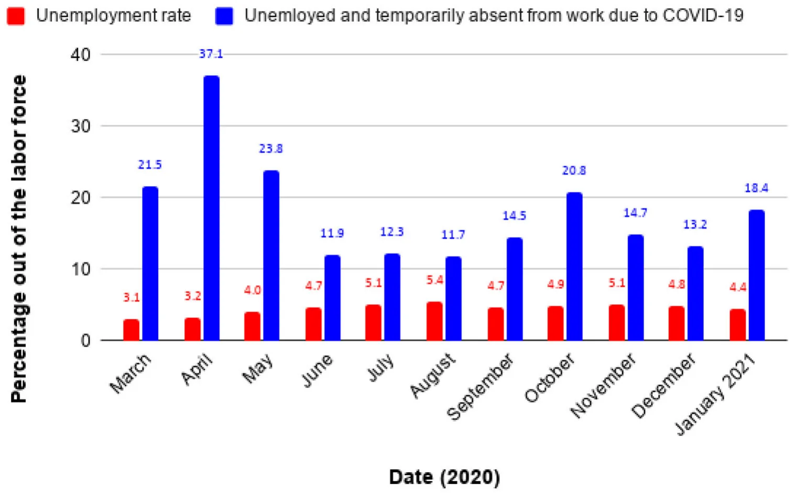
<figcaption>Figure 1. Unemployment rate and the broad rate of unemployment, as a percentage out of the labour force, during the COVID-19 pandemic in Israel. Source: Central Bureau of Statistics, Israel.</figcaption>
</figure>

## 2. The impact of COVID-19 on economic and financial systems

The rapid spread of COVID-19 has shaken the global economic systems and financial markets, causing the greatest collapse in global economic activity since the collapse of the South Sea Bubble in 1720 (McKibbin & Vines, 2020). The economic meltdown caused by the pandemic is still being evaluated and clearly, it is not a mere health issue. McKibbin and Vines (2020) argue that in order to allow many of the emerging market economies to undertake the kind of massive fiscal response that advanced countries have been able to carry out, there is a need for international cooperation which involves large sums of money – a total of $2 trillion. Following such a huge worldwide impact, the economic effects of the pandemic have been explored across commodities, stock markets, the banking sector, and even cryptocurrencies.

Salisu et al. (2020) show evidence of a positive relationship between commodity price returns and the global fear index, confirming that commodity returns increase as COVID-19 related fear rises. Thus, given the negative association between the global fear index and the stock market, the commodity market offers better safe-haven properties than the latter. Yarovaya et al. (2020) analysed the risk-adjusted performance of Islamic and conventional equity funds during the COVID-19 pandemic and showed that Islamic equity funds are more resilient to COVID-19 shock, confirming their safe haven properties. However, unlike commodities and Islamic equity funds, Conlon and McGee (2020) show that Bitcoin does not act as a safe haven during the COVID-19 bear market, thus casting doubt on the ability of Bitcoin to provide shelter from turbulence in traditional markets. Moreover, Yarovaya et al. (2021) analyze herding in cryptocurrency markets during the COVID-19 pandemic. Referring to the COVID-19 as a” black swan” event, the authors suggest that COVID-19 does not amplify herding in cryptocurrency markets.

Yarovaya et al. (2021) analyze the impact of investment in human capital on the coping mechanism of a sample of EU mutual funds and their resilience to the COVID-19 crisis. The authors found that during the COVID-19 outbreak, the equity funds that were ranked higher in human capital efficiency (HCE) outperformed their counterparts. The same conclusion was reached by Mirza et al. (2020). Moreover, as the contagion peaked, Yarovaya et al. (2021) found that the funds with higher HCE continued to demonstrate resilience with significant positive risk-adjusted returns.

Rizvi et al. (2020) and Mirza et al. (2020) documented the investment styles and volatility timing of funds managers during the pandemic. Rizvi et al. (2020) evaluated the impact of COVID-19 on selected categories of actively managed mutual funds in the European Union and conducted a style analysis to understand the investment behavior of fund managers. The authors observed that fund managers have been drifting from high-risk options to low-risk in terms of size and investment strategy, with a clear switch in investments towards non-cyclical sectors. Moreover, the authors found that there has been a transition of investment from countries with higher infections to those with a relatively lower number of cases. Mirza et al. (2020) assessed the price reaction, performance and volatility timing of European investment funds during the outbreak of COVID-19. The study found that while the majority of investment funds exhibit stressed performance, social entrepreneurship funds bear flexibility.

Mirza et al. (2020) investigated the impact of COVID-19 on corporate solvency by introducing a multiple stress scenarios on the non-financial listed firms in the EU member states. The authors reported a progressive increase in the probability of default, an increase of debt payback, and declining coverages. Their results indicate that the solvency profile of all firms deteriorates, which could lead to a decline in loan quality and increase in the credit risk for banks and credit institutions (Yarovaya et al., 2020). Moreover, using a sample of 5342 listed non-financial firms across 10 EU member states, Rizvi et al. (2020) investigated to what extent the COVID-19 may deteriorate the value of non-financial firms. Their findings show a significant loss in valuations across all sectors due to a possible decline in sales and increase in cost of equity. In the extreme cases, average firms in some sectors may lose up to 60% of their intrinsic value in one year.

## 3. The model

The model considers a constant population with a fixed number of individuals, N. For simplicity, and given the short time horizon of interest, we abstract from population growth. Each individual belongs to one of the four groups: susceptible (S), infected (I), recovered (R), and dead (D) such that N = S + I + R + D. Individuals in the first group have no immunity and are susceptible to infection. When an individual in the susceptible group (S) is exposed to the pathogen, the individual is transferred to the infected group (I). The individual stays in this group on average c days, after which the individual is transferred to the recovered group (R) or to the dead group (D). Therefore, some portion of infected individuals remain seriously ill or die while others recover. The recovered are again healthy, no longer contagious, and immune from future infection.

We divide the population into two classes based on their age: children and adults, because these groups experience the disease in varying degrees of severity and have different infection rates (Cai et al., 2020; Dong et al., 2020; Voinsky et al., 2020). In addition, adults and children are present in various discrete locations throughout many hours of the day, which affects the spread dynamics.

Individuals below age A are associated with the” children” age-class, while individuals in the complementary group are associated with the” adult” age-class. Since it takes A years from birth to move from a child to an adult age group, the conversion rate is set as a := 1/A. We neglected the transformation of children into adults during the infection period Ic, as on average children recover within two days (Dong et al., 2020), which resulted in a small percentage of children becoming adults, on average, during this period.

Furthermore, we divided the adult groups (Sa, Ia, Ra, Da) based on their employment status into two groups: working (Sw a , Iw a , Rw a ) and non-working (Sn a, In a, Rn a, Da) individuals, because these groups differently influence the economic performance. Working adults contribute to the economy by producing some average output e per working individual in some time frame; while non-working adults do not. Thus, the importance of including the division of the adult group to working and non-working is twofold. First, non-working individuals have different spatial dynamics than working adults, as they do not go to work and by not doing so, influence the infection rate, and thus affect economic outcomes. Second, the transformation between the two classes (working and non-working adults) as a result of the crisis has a direct influence on the output. Thus, the importance of including the group of children in the model is also twofold. First, in a state of keeping schools open during a pandemic, children who become infected on the school grounds may infect their parents (workers), and thus affect economic outcomes. Second, if it is decided on school closures as a means of restraining the spread of the virus, the parents (workers) will have to stay at home, which carries a heavy economic cost for both – households and the state.

The computational flow of an individual in the population as performed by the EM model for any algorithmic step ({ASi}5 i=1) and the interactions between the temporary sub model and spatial sub model are shown in Figure 2.

### 3.1. Economic two-age structured SIRD model definition

By expanding the designation to two age-classes and two employment-classes, we let Sc, Ic, Rc, Dc, Sw a , Iw a , Rw a , Sn a, In a, Rn a, and Da represent susceptible, infected, recovered, and death groups for children and adults (working and non-working), respectively such that

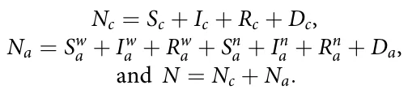

We mark the basic reproduction number of working individuals as Rw 0 (t) for a given time t.

<figure id="fig-2">
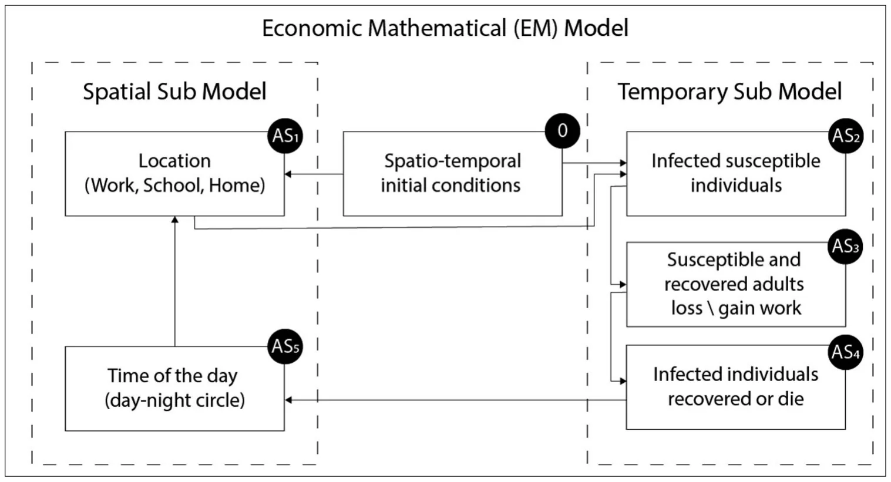
<figcaption>Figure 2. The computational flow of an individual in the population for any algorithmic step (ASi) and the interactions between the temporary and spatial sub-models. AS1 the locations of the individual are updated according to its state and time of the day. AS2 if the individual is susceptible, which then becomes infected according to its location and the locations and state of the other individuals in the population. AS3 according to the infection rate in the population an adult individual can lose or find a job. AS4 if the infected individual, according to the period, passes from being infected to becoming either recovered (R) or dead (D). AS5 updates the time of the day. The order of {ASi}5 i=1 is immaterial to simulation and can be replaced in any other order. A detailed description of the model is presented in Sections 2.1, 2.2, and the Supplementary Materials of the paper. Source: Authors generated.</figcaption>
</figure>

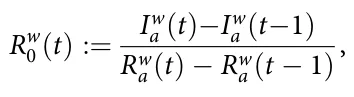

where Rw 0 (t) defined to be Iw a (t)−Iw a (t−1) if Rw a (t) = Rw a (t−1). In addition, for the case where 0&lt;Rw 0 (t)<1, the simulator will calculated Rw 0 (t) as −1/Rw 0 (t). The full description of the temporal sub-model is provided in Eqs. (S1-S13), in the Supplementary Materials of the paper. A schematic view of the transition between disease stages and employment status, divided by age-class, is presented in Figure 3.

The model’s parameters highly differ between countries and time (WHO, 2020). In order to investigate the influence of different NPI policies on the current Israeli situation, we calculated the model’s parameters to best fit the current published data available on Israel.

We obtained the number of Israeli daily new cases and daily new dead count between August 15 and September 15 from WHO (2020). In addition, we took the adult’s unemployment rate from the Israeli central bureau of statistics (CBS 2020a) between August 1 and September 30. According to WHO (2020), on August 15 there were 90, 232 infected individuals in Israel. Given that the average recovery duration for children is two days and for adults is 14 days (see Table 1) and that children comprise 28% of the population (CBS 2017), we calculated that there were approximately 18, 899 infected adults and 868 infected children. We assumed that the number of recovered individuals is heterogeneous in the population, and that only adults have died as result of the pandemic up to this point. Eq (1) shows the initial conditions for August 15 (t0), in Israel. In addition, we assume that up to this point, the infection rate between working and non-working adults is the same as of August 15. From the Israeli central bureau of statistics (CBS 2020a), as of the end of August, the number of individuals aged 15 and over in the labour force was 4,126,300, with 94.6% of them employed and the remainder unemployed. Of those employed, 5.4% were absent from work for reasons related to the corona crisis (such as job closure or downsizing) (CBS 2020b). Therefore, the chance of an employed person losing his job as a result of the crisis is 4.7% (in total, at August 2020). The chance that a child who has become an adult, and is interested in working, will find a job is 94.6%.

<figure id="fig-3">
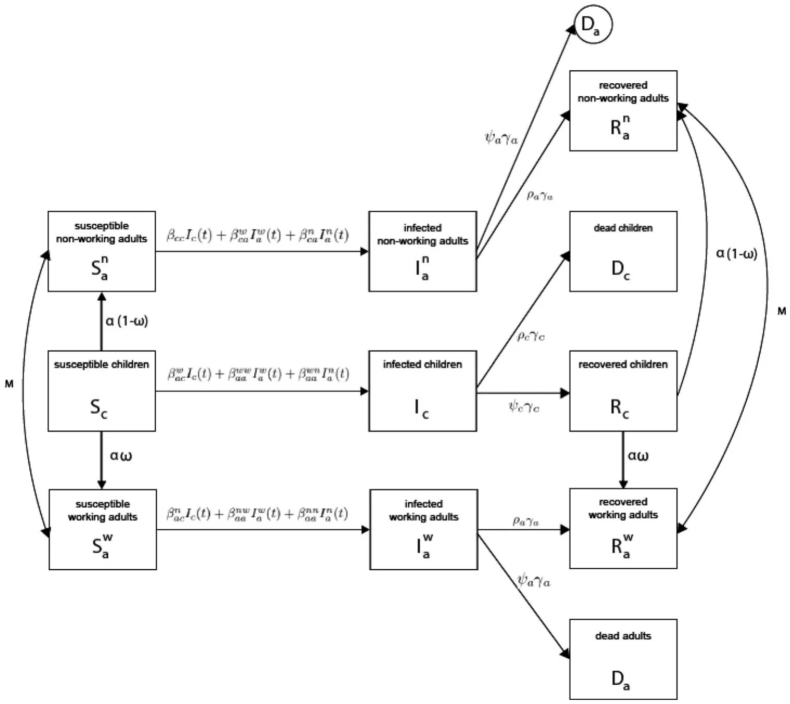
<figcaption>Figure 3. Schematic view of the transition between disease stages, divided by age-class and employment status. Source: Authors generated.</figcaption>
</figure>

<figure class="table-figure" id="table-1">
<figcaption>Table 1. Model’s parameters’ description, values, and sources.</figcaption>
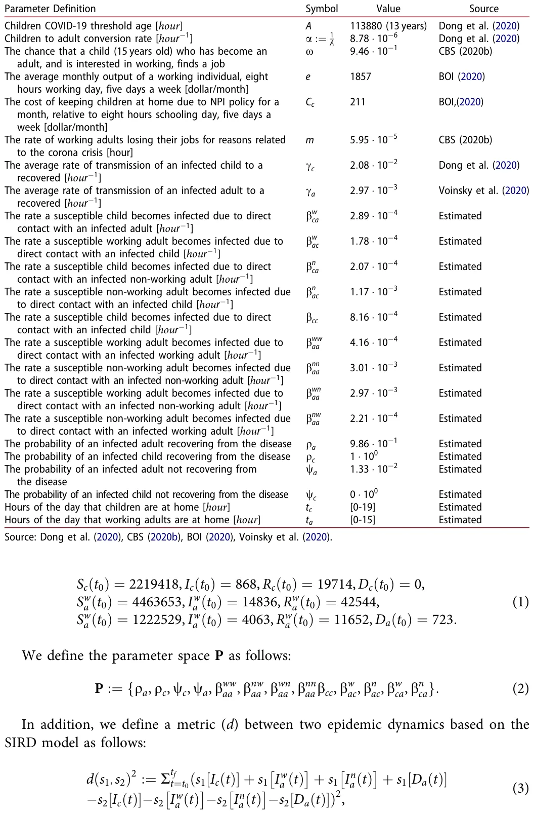

</figure>

<figure id="fig-4">
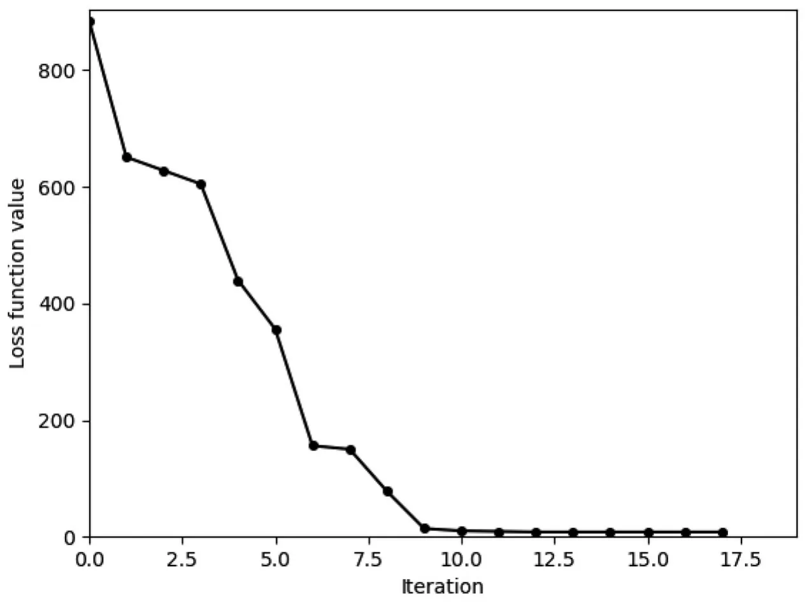
<figcaption>Figure 4. Loss function of the EM model () between the historical data and the model predictions over training steps. Source: Authors generated.</figcaption>
</figure>

where [t0, tf ] is the segment in time where the comparison between the two dynamics takes place. Metric d is used as the loss function of the following model fitting process.

Given the initial conditions Eq. (1), the parameter space Eq. (2), and the historical data from (CBS, 2020a; WHO, 2020), we used the gradient descent method with the loss function d to obtain the best representing values for the model’s parameters (Haskell, 1944). The initial condition was taken from the sources presented in Table 1 and the remaining values obtained by the Monte-Carlo method, which sampled 1000 random parameter values (marked by X), and used the one that fulfils minxd(x) (Liu et al., 2000). The results of this process are the parameter values shown in Table 1, with” computed” as the source. In addition, Figure 4 shows the value of the loss function (d) over computation iteration.

### 3.2. Spatial model

The spatial sub-model is a graph-based model. The population N from the temporal dynamics is allocated in some distribution to the nodes of an undirected, connected graph. Specifically, we used a three-node graph where each node represents a different location (home, work, school).

In addition, by dividing the time passed from the beginning of the temporal model T into a 24 hours cycle, the model defines an hour-level discrete step in time. Each hour, the population on the graph is moving to one of the neighbour nodes of the node they are currently located at or stay in the same node, according to the following rules:

<figure id="fig-5">
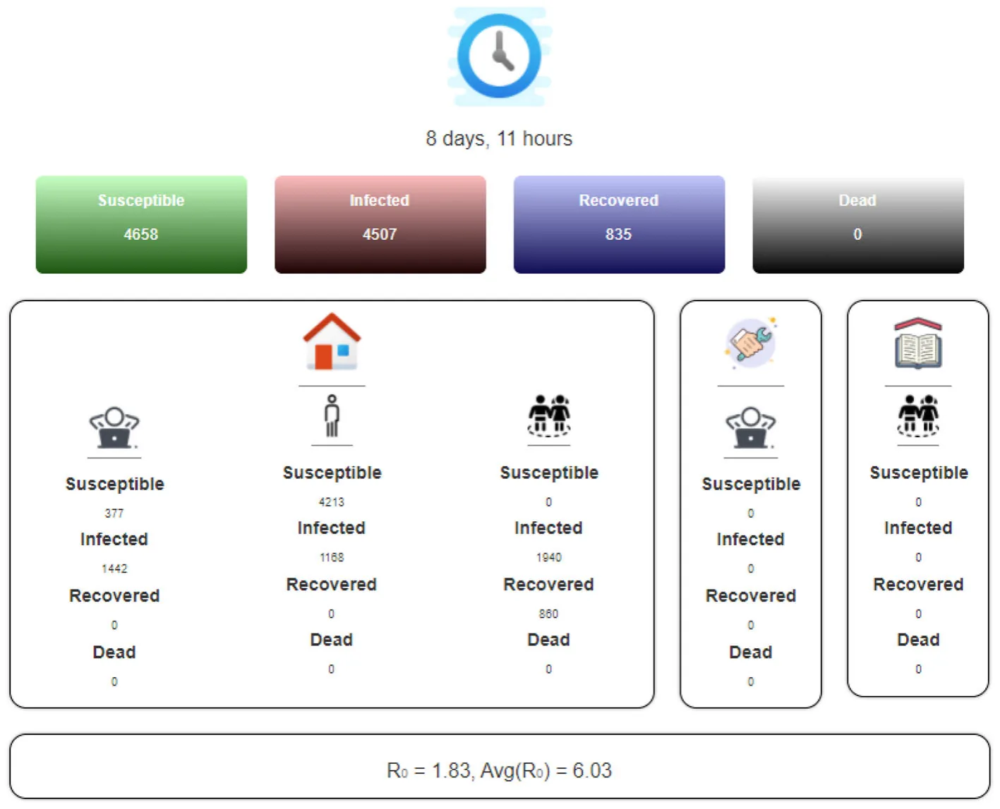
<figcaption>Figure 5. The panel of the spatial model. From top to bottom: the time from the beginning of the simulation. Distribution of the population to susceptible, infected, recovered, and dead groups. The distribution of the population to susceptible, infected, recovered, and dead groups with separation to children and adults and their current location (home, work, school). The R0 at a certain time and the average R0 from the beginning of the simulation. Source: Authors generated.</figcaption>
</figure>

- 1. If T mod24 = td c , all of the children sub-population that is located at the home node moves to the school node.
- 2. If T mod24 = td a, all of the adult sub-population that is located at the home node moves to the work node.
- 3. If , all of the adult sub-population that is located at the work node and all of the children sub-population that is located at the school node move to the home node.

We assume the transition from home to either work or school and back is immediate and that everybody is following the same clock. Otherwise, the distribution of the population on the graph stays the same. Between each population movement on the graph, the temporal sub-model is performed simultaneously on all the graph’s nodes. Figure 5 shows the spatial model schema presenting the population distribution and locations at some point in time. Each simulation step simulates for one hour.

### 3.3. Preferences and the government

Each adult derives his or her lifetime utility from the discounted flow of private consumption:

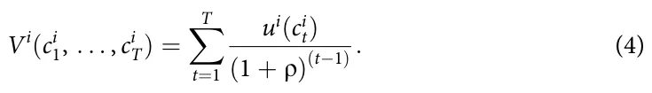

Here q ∈ (0, 1) is a discount factor, ci t is the adult’s consumption in period t ∈ T and ui(·) is a concave, continuous, non-decreasing utility function such that

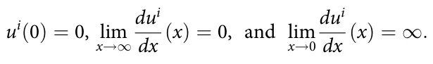

We introduce to the EM model a government that is responsible for two choices: mitigation strategies and redistribution of income from workers to individuals who do not or cannot work because of shutdowns or illness. Thus, for each t ∈ T the period-by-period budget constraint faced by a working adult, w, is given by:

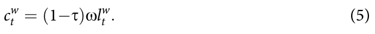

Here, s is the income tax rate imposed by the government, x = e is the marginal product of labour, and lx t is working unit of time. The tax revenue is defined by:

Bt = RSwa +Rwa xlw t .

Therefore, the period-by-period budget constraint faced by a non-working adult, n, is given by:

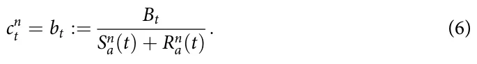

We assume that the government does not consume and the consumption of the children is embedded (equally) into the consumption of their parents.

### 3.4. Non-Pharmaceutical intervention policies definition

The proposed EM model provides an in-silico environment allowing investigation of multiple non-pharmaceutical intervention (NPI) policies to reduce infection in the population, while reducing economic loss as well. From the epidemiological point of view, an NPI policy is more efficient in comparison to another NPI policy if, during the time the policy takes place, the average R0 is smaller. From the economic point of view, an NPI policy is more efficient in comparison to another NPI policy if during the time the policy takes place, the output is higher.

Furthermore, the balance between the damage an NPI policy has on the economy and its epidemiological efficiency, plays a critical role for policy makers. Therefore, given a policy (p) with the parameter space (A) and the weight of reducing the damage to the economy we comparing to the weight of reducing the infection rate wir such that we + wir = 1; the optimal policy between two dates t0 and tf is defined by Eq. (7):

<figure id="fig-6">
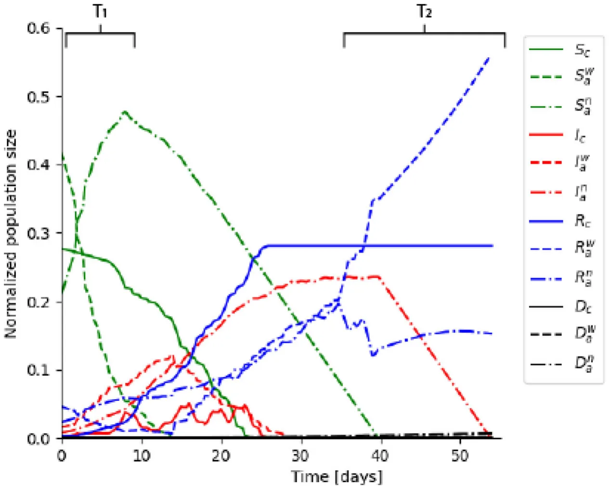
<figcaption>Figure 6. The distribution of the population by age, employment status, and health state over time by the EM model with the parameter values from Table 1. Source: Authors generated.</figcaption>
</figure>

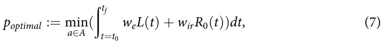

Here L(t) := E∗(t)−E(t) such that E∗(t) is the output where ∀t : R0(t) = 0.

We will examine two policies, the influence of the duration of the work/school day and lockdown in homes with partial to full separation between individuals. In order to study the influence of the duration of the work/school day, the parameters tc and ta are changed between [0, 24]. The lockdown in homes influences both tc and ta for part (or all) of the population by setting them to 24. In addition, as a result of the separation between individuals, the parameters bxy ij such that i, j ∈ [a, c] and x, y ∈ [w, n] are multiplied by the related complementary lockdown percentage of the population.

## 4. Simulation

We solve the system numerically using a stochastic computer simulation. Each simulation is repeated 10 times and the results presented are the mean values.

The results of the EM model are shown in Figure 6, with the parameters’ values from Table 1 and the initial conditions from Eq. (1). The dynamics shown in this figure have two-time frames, T1 and T2, with unique dynamics in comparison with the traditional SIR models. In T1, the size of the group of the susceptible non-working adults increases, as a result of susceptible working adults losing their jobs due to the economic crisis caused by the spread of the pandemic. This growth is faster than the decrease in the size of the group due to infected susceptible non-working adults.

<figure id="fig-7">
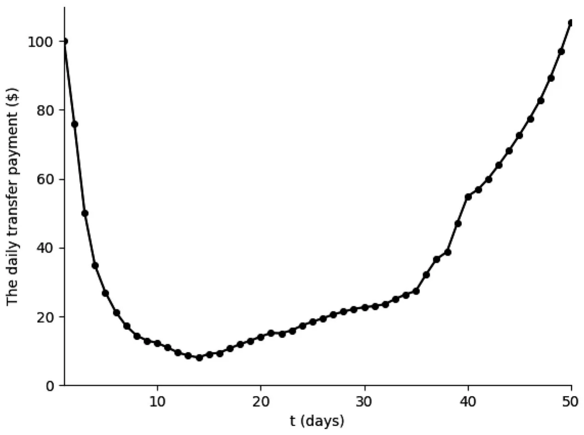
<figcaption>Figure 7. The daily transfer payment for each non-working adult cn t during the outbreak. The model’s parameter taken from Table 1. Source: Authors generated.</figcaption>
</figure>

However, the size of the susceptible working adults group decreases even faster relative to the standard SIR models with similar infection rates. In T2, the increase in the size of the group of recovered working adults is faster than the standard SIR models due to the opposite dynamics of time frame T1. Similarly, although infected non-working adults recover, the graph decreases and then increases slowly, as the number of total infected individuals decreases and, therefore, previously unemployed adult individuals return to the workforce.

For the case of Israel, in 2019, the average monthly output of a working individual is e = 1857 (BOI, 2020), and the tax wedge is 22.7% (s = 0.227)2Based on the EM model with the parameters from Table 1, and assuming that the government cannot run a deficit, the daily transfer payment for each non-working individual during the pandemic outbreak is shown in Figure 7. As can be seen, the government’s ability to financially support the non-working individuals, without running a deficit, diminishes with the spread of the disease. The reason lies in the fact that the number of workers is decreasing as a result of infection or job loss due to the economic crisis. This dynamic continues until the 14th day - the peak of the outbreak as shown in Figure 6, after which the trend is reversed as a result of the return of recovering individuals to work, thus, resulting in an increase in government tax revenue.

Indeed, in the period between the 14th and 37th day (see Figure 6), the outbreak slows down, and so the number of employed individuals increases. Government tax revenues are growing and simultaneously, so are the transfer payments to the unemployed. After the 37th day, the outbreak enters the fade-out phase as shown in Figure 6. As a result, the number of employed individuals jumps back to the pre-outbreak state, while less individuals require government support.

<figure id="fig-8">
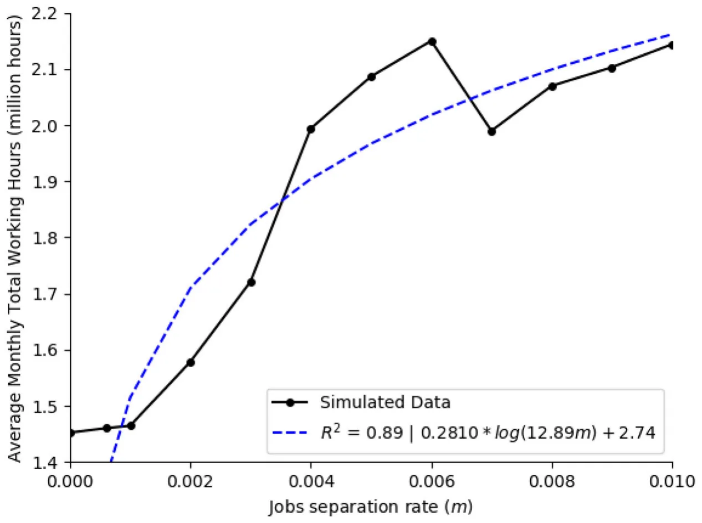
<figcaption>Figure 8. The total working hours during the outbreak as a function of the job separation rate due to crisis (m). The results are the mean of 20 simulation runs. The model’s parameter taken from Table 1. Source: Authors generated.</figcaption>
</figure>

In the model, the parameter m stands for the increase in the job separation rate as a result of the economic crisis caused by the outbreak, and not just as a result of sickness. Thus, we assume that as a result of the increase (decrease) in the R0 among the working sub-population (Rw 0 ), the proportion of workers who will lose their jobs will increase (decrease).

Figure 8 shows the total working hours (in millions) which a population of size 10, 000 will produce in a month, on average, during three months of outbreak as a function of the job separation rate (m).

The transition between employment statuses (working and non-working) will influence the way the model predicts the impact of the outbreak on the economy (Figure 9). Specifically, Figure 9(a) shows the influence of the job separation ratio among the working individuals on the aggregate R0. The dots are the calculated values from the simulator and the dotted line is a fitting function. The fitting function is calculated using the least mean square (LMS) method (Bjorck, 1996). In order to use the LMS method, one needs to define the family function approximating a function. The family function that has been chosen is

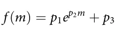

After testing multiple function families an exponent function family produced the highest coefficient of determination. Specifically, resulted in

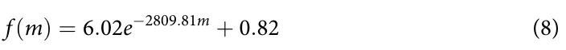

The fitting function was obtained with a coefficient of determination R2 = 0.996.

<figure id="fig-9">
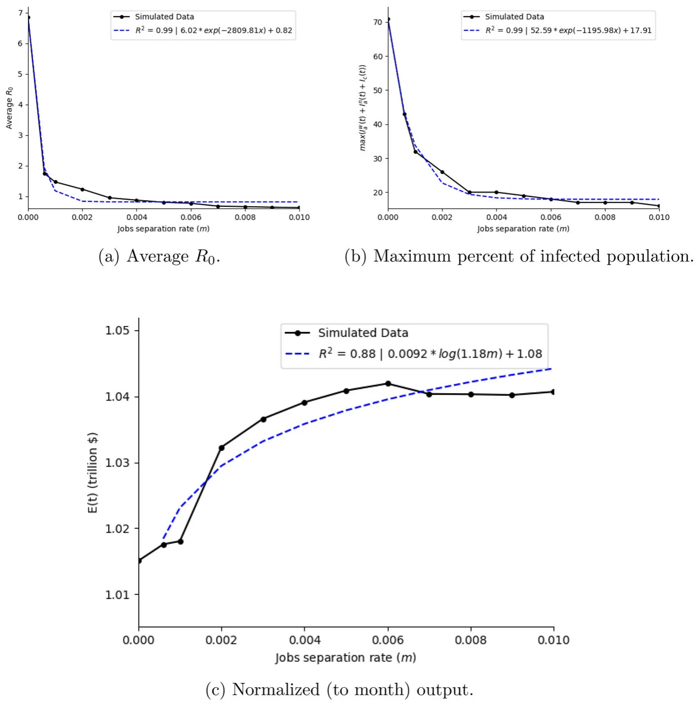
<figcaption>Figure 9. Output and outbreak dynamics as a function of working individuals losing their jobs as a result of the crisis . The model’s parameter taken from Table 1. Source: Authors generated.</figcaption>
</figure>

Similarly, Figure 9(b) shows the average number of infected individuals, maxt(Ic(t) + Iw a (t) + In a(t)), as a function of the job separation ratio, m. The dots in Figure 9(b) are the calculated values and the dotted line is the fitting function (obtained with a coefficient of determination R2 = 0.992)

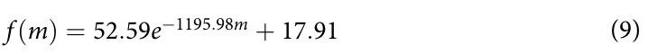

The introduction of these dynamics significantly affects the maximum predicted percentage of infected individuals among the population, based on the data from August 15 to September 15 in Israel, as shown in Figure 9(b). Specifically, for the case in which m = 0 (namely, without the economic dynamics) as in Lazebnik and Bunimovich-Mendrazitsky (2021). There is a 37% change between the case where m = 0andm = 0.001, therefore there is a strong connection between the economic effect in general, and the job separation ratio in particular, on the pandemic dynamics, and vice versa. From Figure 9(b), it is possible to see that asymptotically, the increase of m reduces the maximum percent of infected individuals to 17.91%.

In addition, Figure 9(c) shows the influence of the job separation ratio on the total monthly output. For this case, the family function that has been chosen is: f (m) = p1ln(p2m) + p3, which resulted in:

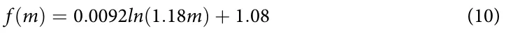

And was obtained with a coefficient of determination R2 = 0.88.

### 4.1. School/work duration policy

Controlling for the location of children and adults in space (school, work or home) and in time (duration of school and work hours) will allow dynamic planning according to the spread of the disease, while minimising economic damage. We assume that children meet only children in school and adults meet only adults at work, while at home adults and children can mingle. Based on the proposed model, we change the number of hours children and adults spend in school and work each day, respectively. Figure 10(a) shows the average R0 as a function of the duration in hours of the working (dW) and schooling (dS) day. The dots are the calculated values from the simulator and the surface is a fitting function R0(dW, dS). The fitting function is calculated using the LMS method (Bjorck, 1996) on 576 dots (24 × 24). The family function is:

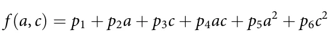

This family function has been chosen to balance the accuracy of the sampled data on the one hand and simplicity of usage on the other (Shanock et al., 2010), and was obtained with a coefficient of determination R2 = 0.56. The fitting function is:

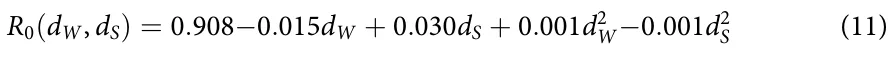

Similarly, Figure 10(b) shows the average maxt(Ic(t) + Iw a (t) + In a(t)) as a function of the duration in hours of the working (dW) and schooling (dS) day. The dots in Figure 10(b) are the calculated values from the spatial model and the surface is the fitting function obtained with a coefficient of determination R2 = 0.62 :

Imax(dW, dS) = 32.916−0.740dW−0.547dS + 0.027dWdS + 0.020d2 W + 0.004d2 (12) S

By setting the gradient of R0(dW, dS) to zero, one retrieves that this NPI policy has a local maximum which is when children attend school for 8.5 hours. In addition, there is a positive linear correlation between adults attending work and R0, which is 0.026. Similarly, setting the gradient of Imax(dW, dS) to zero, shows that the minimal point is (dW, dS) = (0, 19.7). From Figure 10(b) and Eq. 12 one can see that the worst cases are when children and adults spend all day (24 hours) at school and work, respectively, or at home. In either case, the duration of either the work day or school has an effect of almost 15% on the highest infected rate of individuals as shown in Figure 10(b) and by setting the limits dW = {0, 24}, dS = {0, 24} in Eq. (12).

<figure id="fig-10">
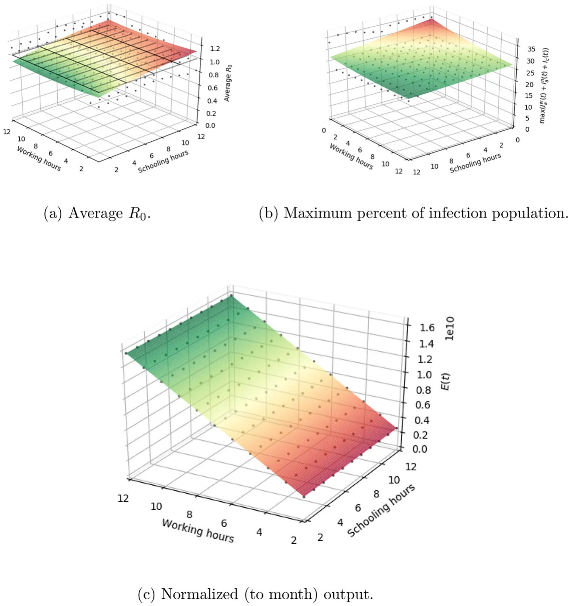
<figcaption>Figure 10. Analysis of the epidemic spread and economical influence as a function of working (24−ta) and schooling (24−tc) duration in hours each day. The model’s parameter taken from Table 1. Source: Authors generated.</figcaption>
</figure>

From Figure 10(a) and (b), one can see that in a situation where working hours and schooling hours are equal to zero, the R0 is low on average but the number of infected is high. In order to explain these two extremes we need to keep in mind that in Figure 10(a) the value Z is the average of the R0 throughout the dynamics. At point (0,0) there is an extreme because at the beginning of the dynamics there is a high R0 but then its value is significantly lower (long tail in the distribution of R0). A high R0 at the beginning of the period increases the number of infected individuals. Because the recovery period is long, the total number of infections climbs and remains high for a long time. At point (24, 24) there is an extreme where adults only mingle with adults and children only with children. Mixing adults and children at home actually lowers R0 (up to some level) and in particular the extreme (expressed in Figure 9B) because infection coefficients between children and adults are smaller (see Table 1).

Figure 10(c) illustrates the influence of the working and school hours on the output, normalised to one month (186 hours). As expected, the school hours of the children have a minor effect on the output; however, the working hours have a positive linear effect on it. The surface calculated using the LMS method:

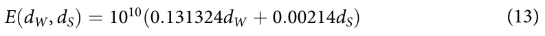

and obtained with a coefficient of determination R2 = 0.869.

### 4.2. Lockdown Policy

Partial or full lockdown of several locations or entire countries were broadly used at the beginning of the COVID-19 outbreak as a policy to reduce the number of infected individuals and control the spread dynamics. The lockdown policy yields social distance which reduces the ratio of infection. On the other hand, this policy negatively affects the economy. Therefore, the optimisation task of finding the minimal rate of the population to be locked down such that the outbreak will be constrained is important.

The lockdown policy is similar to the school-working hours policy in the manner that both modify the spatial dynamics of the population. Nevertheless, the school-working hours policy defines the number of hours all the children and working adult populations go to school and work, respectively, while the lockdown policy keeps part (or all) of the population at home all day long alongside the remaining part of the population keeps the regular working and school hours. In addition, the lockdown policy isolates individuals at home which is expressed by the fact that individuals can contact them, but they cannot initiate any contact with other individuals, while this constraint does not take place in the working-school hours policy.

Figure 11(a) shows the results of this calculation. Each dot represents R0 of each case, the lockdown of children, Lc, and the lockdown of adults, La. The black grid shows the threshold R0 = 1.

The behavior of R0 as a function of La, Lc has been retrieved using the LMS method and takes the form:

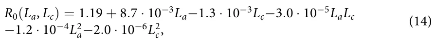

This was obtained with a coefficient of determination R2 = 0.813. Therefore, it is safe to claim that function R0(La, Lc) is well-fitting the data. Using Eq (14) it is possible to find the constraints of La, Lc such that R0 ≤ 1 (by solving R0(La, Lc) ≤ 1). The lockdown of children has a relatively small effect on R0 as shown by

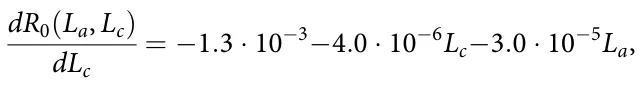

relative to

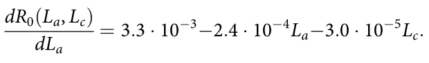

Lockdown of children (Lc) have a similar effect relatively to the lockdown of adults (La) on the maximum percent of infected individuals, as shown in both Eq (16) and Figure 11b. The surface calculated using the LMS method:

<figure id="fig-11">
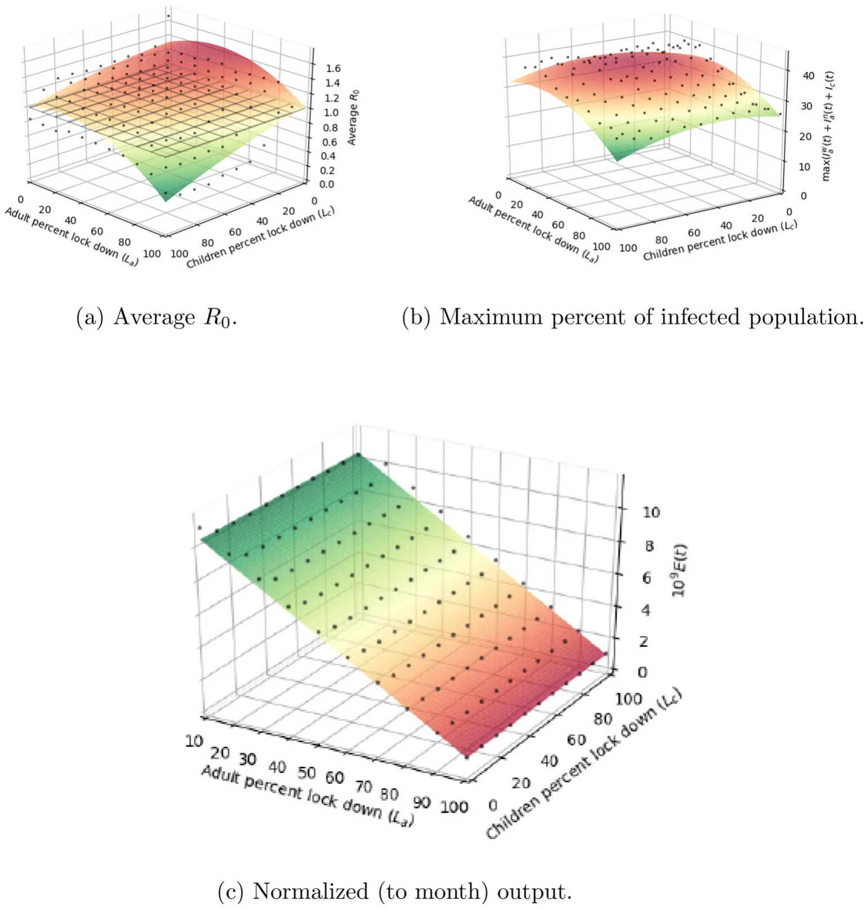
<figcaption>Figure 11. Analysis of the epidemic spread and economical influence as a function of adult lockdown (La) and children lockdown (Lc). The model’s parameter taken from Table 1. Source: Authors generated.</figcaption>
</figure>

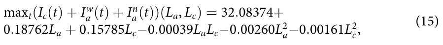

and obtained with a coefficient of determination R2 = 0.812.

<figure id="fig-12">
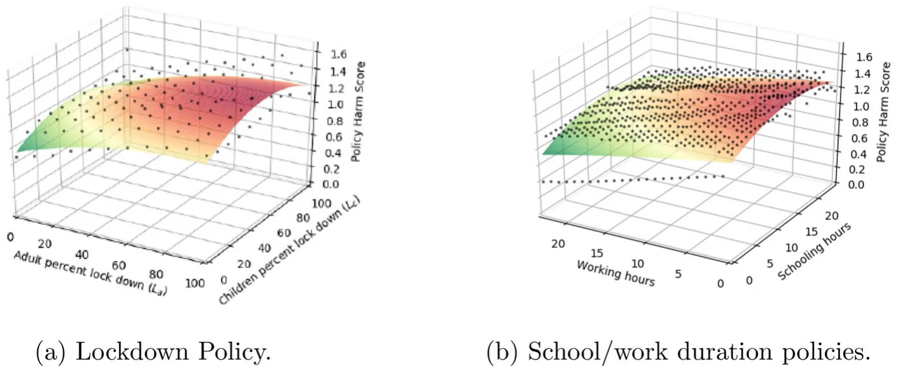
<figcaption>Figure 12. Analysis of both the adults and children lockdown and school/work duration policies based on Eq. (7), where the weight of reducing the infection rate and not damaging the economy is equal (we = wir = 0.5). The model’s parameter taken from Table 1. Source: Authors generated.</figcaption>
</figure>

Furthermore, Figure 11c shows that children’s lockdown has a minor effect on the economy relative to adults’ lockdown. The surface is calculated using the LMS method:

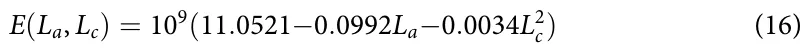

and obtained with a coefficient of determination R2 = 0.978.

### 4.3. Economic-Epidemiological influence on NPI analysis

In order to determine the influence of the school-work duration and lockdown policy on both the outbreak and the economy, we computed the Policy Harm index obtained using Eq. (7). The index obtained by normalising the monthly output (E) to an average hour base output by dividing E by 186 (the number of monthly working hours in Israel) and afterwards further normalising EandR0 by linear scaling both to [0, 1] after multiplying by the weights weandwe, respectively. The resulting Policy Harm index describes the relative harmfulness of different variations of the policy itself and not between policies.

The model predicts that, due to the influence of the working hours on the average output, there is a major effect on the economic-epidemiological optimal policy, as shown in Figure 12(a) and (b), compared to Figures 10(a) and 11(a) describing R0 of the NPI and Figures 10(c) and 11(c) and describing E as a result of the NPI. By directly investigating the optimal working-school and lockdown policies, while requiring that the damage to the economy is equally weighted to preventing outbreak (we = wir = 0.5) (using Eq. (7)), we obtain that both NPIs have more economical damage in comparison to their contribution in reducing the infection rate, as shown in Figures 12(a) and (b). Therefore, both NPI policies are too aggressive from an economic point of view.

## 5. Discussion

The model presented in this paper follows the dynamics that took place between August 15 and September 15 (2020) in Israel, as presented in Figure 4, with a mean square error (MSE) of 0.08 after only 11 iterations. Therefore, it is safe to claim that the model is capable to properly represent the dynamics of the outbreak.

Counter-intuitively, Figures 8 and 9(c) conclude that the higher the rate of job separation due to the economic crisis, the greater the average total working hours and the long-term output will be, where the positive effect of the job separation rate on both variables decreases with the increase in its value. However, as shown in Figure (9a and b) this results from the dynamics of the outbreak. Workers who lose their jobs due to the economic crisis cause a rapid decline in the R0, compared to a situation where, seemingly, workplaces do not respond (without government intervention) to the precarious economic situation during an outbreak. This way, fewer workers will be infected and the curve will” flatten out”, enabling the non-infected unemployed individuals to regain their employment status and contribute to the increase in output (compared to a situation where they would stop working as a result of sickness due to a high infection rate). That is, an increase in the job separation rate (m) will reduce the overall R0 in the economy, which will reduce the spread of the disease; thus the economic crisis will fade, and workers who lost their jobs as a result of the economic crisis will return to work. Hence, the long-term output will be greater since the loss of working hours, given the separation job rate, will be less than the loss of working hours as a result of illness among the workers (without introducing the separation job rate to the model).

Throughout the study, controlling the spread of the pandemic and preventing outbreaks has been investigated using two non-pharmaceutical interventions: the duration of working and school days and lockdown to varying degrees among the adult and child populations.

The effect of the duration of working and school days on the dynamics of the pandemic, and its effect on economic output, is shown in Figure 9 a, b, and c. Under this NPI, preventing the outbreak (i.e., maintaining R0 ≤ 1) requires solving Eq. (11), subject to the assumption that R0(dW, dS) = 1, as shown in Figure 9a. Therefore, any combination of working and school hours in accordance with Eq. (13) (or a smaller combination thereof) will lead to the prevention of the pandemic’s outbreak. In particular, and if our interest is only to maximise output, each worker can be allowed a full working day (9 working hours) combined with a maximum of 6.1 study hours. In this case, the maximum infected percent among the population will reach 26.2%, as shown by Eq. (14) and Figure 9b, and the output will equal 1.2 · 1010, as shown by Eq. (15) and Figure 9c.

Nevertheless, the introduction of this policy ignores the death toll resulting from its implementation. By sampling all the combinations of school-working hours (dW, dS) that satisfies R0(dW, dS) ≤ 1 (Eq. (11)), with a 0.5 hour resolution, one can obtain that (dW, dS) = (7.5, 4.5) will minimise the death toll (0.48%) while maximising the output and preventing outbreak. These results match the conclusions reported by Keskinocak et al. (2020) for Georgia state and by Lazebnik and Bunimovich-Mendrazitsky (2021) for the state of Israel for the number of activity hours in order to obtain R0 ≤ 1. In addition, these results match those reported by Di Domenico et al. (2020) indicating that school closure has a minor influence on the epidemic peak.

The influence of partial to full lockdown among different age-groups (adults and children) on the spread of the pathogen, the economic loss involved in such policy, and the predicted percentage of infected resulting from such a decision, is shown in Figure (10a, b, c). The lockdown of adults and children has a similar (same order of magnitude) first-order effect (linear coefficients of La and Lc) as shown in Eq. (14). However, the second-order effect (quadratic coefficients of La and Lc), as shown in Eq. (14) of adults’ lockdown is two orders of magnitude higher than that of the children’s lockdown, which implies that during the work day, adults are infected at a higher rate, compared to the infection rate of children in schools. These results match the conclusions reported by Oruc et al. (2021) for the state of Georgia regarding the voluntary lockdown with school closure.

By Figure 11(a) and Eq. (14) we obtain that a lockdown of 90% or more among adults alongside full mobility freedom (or less) among children, or a full lockdown of children combined with 54% lockdown of adult, will result in R0 ≤ 1, i.e., will prevent an outbreak. The maximum percent of infected individuals follow a similar behavior, as shown in Figure 11(b) and Eq. (17). As expected, the higher the adults and children lockdown rate, the lower the maximum infected percent of individuals among the population. However, similar to the influence of the working-school hour’s NPI policy on the output, there is a linear decrease in the output as a function of the adult’s lockdown rate (see Eq. (18)), as shown in Figure 10c. Given the lockdown rate among the adult population, the lockdown rate among children has relatively minor effect (30 times smaller compared to the adult’s lockdown) on the output. This is despite the negative impact of children staying home has on the output (see Eq. (S12)). Hence, in order to obtain an epidemic-economic optimal NPI policy, one needs to minimise the adults’ lockdown while keeping children’s lockdown as minimal as possible, which results in closing the schools and keeping 54% of the adult group in lockdown ((La, Lc) = (54, 100)). This policy will lead to a maximum contagion rate of 32.21% alongside maximum possible output of (5.35 · 109). Nevertheless, the introduction of this policy ignores the death toll resulting from its implementation. By sampling all combinations of (La, Lc) that satisfies R0(La, Lc) ≤ 1 (Eq.(16)), with a one percent resolution, one can obtain that (La, Lc) = (63, 89) will minimise the death toll (0.21%) while maximising the output and preventing outbreak.

## 6. Conclusion

The model developed in this study allows us to examine the impact of non-pharmaceutical intervention (NPI) policies on the course of a pandemic spread, while assessing the economic losses caused by it. The model is implemented to the COVID-19 outbreak, and extends the traditional SIR model by introducing a dead group, two age-groups, time dimension, and several different locations where individuals can be present during the day. These spatial-temporal interactions allow us to explore the reciprocal effects between the spread of the pandemic and economic losses, such as the effect of job separation (due to the economic crisis resulting from the pandemic) on the outbreak dynamics presented in Figure 6. The inclusion of these interactions improves the accuracy of the model forecasts and allows for multidimensional analysis of the impact of non-pharmaceutical interventions and the dynamics of the crisis.

As a complement to the model, we provide an open-source code which can be used as an in silico environment (simulator) that is deployed as a web-based service. The open-source code will allow both researchers and developers to easily use and extend our code to investigate more NPIs. Furthermore, in silico environment allows non-technical individuals (e.g., policymakers) to incorporate real-time data in our simulator and investigate the way proposed NPI policies, with different scenarios, influence the economy and the dynamics of the outbreak.

Our results indicate that better outcomes are reachable if targeted NPI policies are implemented. Differential lockdown among different age groups, or varying working-school activity hours, significantly improve policy trade-offs, enabling considerable reductions in economic loss and excess deaths. Moreover, minimising the death toll while maximising the output and preventing outbreak, can be achieved with a targeted NPI policy - limiting the duration of working and school days or lockdown - that applies more aggressive policy measures on the children rather than on the adults.

The results in this study were obtained given the values in Table 1 and the fitting process presented in Section 2.1, which can vary significantly across countries and time, and depends on several hyper-parameters such as population density, the age distribution of the population, etc. Moreover, the proposed model does not take into consideration the parenting relationship between children and adults, except for the penalty component in Eq. (S12). Assuming such dynamics, the results shown in Figure 10(c) could significantly be altered. However, these dynamics are not within the scope of this research, and we intend to include them in future studies. Further extensions of the model will be aimed at investigating the heterogeneous dynamics at the individual level using distributed computing models from computer science.

We are all full of hope and confidence that humanity will overcome the current corona crisis. In the event of a future pathogen outbreak, especially involving a lack of immunity among the population, researchers and decision-makers will be able to follow our approach to more accurately evaluate the outcomes of their policy measures. The calculations presented in this study assume a high social tolerance for the substitution rate between saving human lives and minimising economic losses in the economy. A society that is willing to” sacrifice” output in exchange for saving as many human lives as possible can always choose lockdown and/or limiting working and school hours at a higher intensity.

## Notes

## Notes

1. The linear production function represents a production process in which the inputs are perfect substitutes. In our case, we consider a representative individual that works eight hours a day, five days a week, with a monthly output reflecting the average monthly output of each of the workers in the economy. 2. OECD (2020), Tax wedge (indicator). doi: 10.1787/cea9eba3-en (Accessed on 20 November 2020).

## References

- Acemoglu, D., Chernozhukov, V., Werning, I., & Whinston, M. D. (2020, May). Optimal targeted lockdowns in a multi-group sir model. Working Paper 27102. National Bureau of Economic Research.
- Alfaro, L., E., Faia, N. Lamersdorf, & Saidi, F. (2020). Social interactions in pandemics: Fear, altruism, and reciprocity. Working Paper 27134. National Bureau of Economic Research.
- Allam, Z., Dey, G., & Jones, D. S. (2020). Artificial intelligence (AI) provided early detection of the coronavirus (COVID-19) in China and will influence future urban health policy internationally. AI, 1(2), 156–165. [doi:10.3390/ai1020009](https://doi.org/10.3390/ai1020009)
- Argente, D. O., Hsieh, C.-T., & Lee, M. (2020). The cost of privacy: Welfare effects of the disclosure of COVID-19 cases. Working Paper 27220. National Bureau of Economic Research.
- Berger, D. W., Herkenhoff, K. F., & Mongey, S. (2020). An SEIR infectious disease model with testing and conditional quarantine. Working Paper 26901. National Bureau of Economic Research.
- Bethune, Z. A., & Korinek, A. (2020). Covid-19 infection externalities: Trading off lives vs. livelihoods. Working Paper 27009. National Bureau of Economic Research.
- Bjorck, A. (1996). Numerical methods for least squares problems. Society for Industrial and Applied Mathematics, 5, 497–513.
- Bodenstein, M., Corsetti, G., & Guerrieri, L. (2020). Social distancing and supply disruptions in a pandemic. CEPR Discussion Paper No. DP14629. https://ssrn.com/abstract=3594260 [link](https://ssrn.com/abstract=3594260)
- BOI (2020). Special analysis of the Research Division of the Bank of Israel: Estimation of the economic damage from the prolonged shutdown of the education system. Bank of Israel. [In Hebrew].
- Bruinen de Bruin, Y., Lequarre, A.-S., McCourt, J., Clevestig, P., Pigazzani, F., Jeddi, M. Z., Colosio, C., & Goulart, M. (2020). Initial impacts of global risk mitigation measures taken during the combatting of the covid-19 pandemic. Safety Science, 128, 104773. [doi:10.1016/j.ssci.2020.104773](https://doi.org/10.1016/j.ssci.2020.104773)
- Cai, J., Xu, J., Lin, D., Yang, Z., Xu, L., Qu, Z., Zhang, Y., Zhang, H., Jia, R., Liu, P., Wang, X., Ge, Y., Xia, A., Tian, H., Chang, H., Wang, C., Li, J., Wang, J., & Zeng, M. (2020). A case series of children with 2019 novel coronavirus infection: Clinical and epidemiological features. Clinical Infectious Diseases, 71, 1547–1551.
- CBS (2017). Population by social group, religion, age, sex, district, and sub-district. The Israeli Central Bureau of Statistics. [In Hebrew].
- CBS (2020a). The percentage in labour force of employed persons temporarily absent from work all week due to reasons related to the Coronavirus pandemic, by sex. The Israeli Central Bureau of Statistics. [In Hebrew].
- CBS (2020b). Social and economic consequences of the outbreak of the corona plague. The Israeli Central Bureau of Statistics. [In Hebrew].
- Conlon, T., & McGee, R. (2020). Safe haven or risky hazard? bitcoin during the covid-19 bear market. Finance Research Letters, 35, 101607. [doi:10.1016/j.frl.2020.101607](https://doi.org/10.1016/j.frl.2020.101607)
- Dasaratha, K. (2020). Virus dynamics with behavioral responses. arXiv preprint arXiv: 2004.14533.
- del Rio-Chanona, R. M., Mealy, P., Pichler, A., Lafond, F., & Farmer, D. (2020). Supply and demand shocks in the COVID-19 pandemic: An industry and occupation perspective. arXiv preprint arXiv:2004.06759.
- Di Domenico, L., Pullano, G., Sabbatini, C. E., Bo Elle, P. Y., & Colizza, V. (2020). Impact of lockdown on covid-19 epidemic in ile-de-france and possible exit strategies. BMC Medicine, 18(1) [doi:10.1186/s12916-020-01698-4](https://doi.org/10.1186/s12916-020-01698-4)
- Di Domenico, L., Pullano, G., Sabbatini, C. E., Boëlle, P.-Y., & Colizza, V. (2020). Impact of lockdown on covid-19 epidemic in île-de-france and possible exit strategies. medRxiv.
- Dong, Y., Mo, X., Hu, Y., Qi, X., Jiang, F., Jiang, Z., & Tong, S. (2020). Epidemiological characteristics of 2143 pediatric patients with 2019 coronavirus disease in china. Pediatrics, 145(6), e20200702.
- Eichenbaum, M. S., Rebelo, S., & Trabandt, M. (2020a). The macroeconomics of epidemics. Working Paper 26882. National Bureau of Economic Research.
- Eichenbaum, M. S., Rebelo, S., & Trabandt, M. (2020b). The macroeconomics of testing and quarantining. Working Paper 27104. National Bureau of Economic Research.
- Fernández-Villaverde, J., & Jones, C. I. (2020). Estimating and simulating a SIRD model of COVID-19 for many countries, states, and cities. Working Paper 27128. National Bureau of Economic Research.
- Fornaro, L., & Wolf, M. (2020). Covid-19 coronavirus and macroeconomic policy: Some analytical notes. CREI/UPF and University of Vienna.
- Glover, A., Heathcote, J., Krueger, D., & Ríos-Rull, J.-V. (2020). Health versus wealth: On the distributional effects of controlling a pandemic. Working Paper 27046. National Bureau of Economic Research.
- Hick, J. L., Hanfling, D., Wynia, M. K., & Pavia, A. T. (2020). Duty to plan: Health care, crisis standards of care, and Novel Coronavirus SARS-CoV-2. Discussion Paper. National Academy of Medicine.
- Ivorra, B., Ferrández, M. R., Vela-Pérez, M., & Ramos, A. M. (2020). Mathematical modeling of the spread of the coronavirus disease 2019 (COVID-19) taking into account the undetected infections. The case of China. Communications in Nonlinear Science and Numerical Simulation, 88, 105303. [doi:10.1016/j.cnsns.2020.105303](https://doi.org/10.1016/j.cnsns.2020.105303)
- Kermack, W. O., & McKendrick, A. G. (1927). A contribution to the mathematical theory of epidemics. Proceedings of the Royal Society of London. Series A, Containing Papers of a Mathematical and Physical Character, 115 (772), 700–721.
- Keskinocak, P., Asplund, J., Serban, N., Eylul, B., & Aglar, O. (2020). Evaluating scenarios for school reopening under covid19. medRxiv.
- Krueger, D., Uhlig, H., & Xie, T. (2020). Macroeconomic dynamics and reallocation in an epidemic: Evaluating the “Swedish Solution. Working Paper 27047. National Bureau of Economic Research.
- Lazebnik, T., & Bunimovich-Mendrazitsky, S. (2021). The signature features of covid-19 pandemic in a hybrid mathematical model—implications for optimal work—school lockdown policy. Advanced Theory and Simulations, 4(5), 2000298. [doi:10.1002/adts.202000298](https://doi.org/10.1002/adts.202000298)
- Liu, J., Liang, F., & Wong, W. (2000). The multiple-try method and local optimization in metropolis sampling. Journal of the American Statistical Association, 95(449), 121–134. [doi:10.1080/01621459.2000.10473908](https://doi.org/10.1080/01621459.2000.10473908)
- McKibbin, W., & Vines, D. (2020). Global macroeconomic cooperation in response to the COVID-19 pandemic: a roadmap for the G20 and the IMF. Oxford Review of Economic Policy, 36(Supplement\_1), S297–S337.
- Miller, J. C. (2017). Mathematical models of SIR disease spread with combined non-sexual and sexual transmission routes. Infectious Disease Modelling, 2(1), 35–55. [doi:10.1016/j.idm.2016.12.003](https://doi.org/10.1016/j.idm.2016.12.003)
- Mirza, N., Naqvi, B., Rahat, B., & Rizvi, S. K. A. (2020). Price reaction, volatility timing and funds’ performance during covid-19. Finance Research Letters, 36, 101657. [doi:10.1016/j.frl.2020.101657](https://doi.org/10.1016/j.frl.2020.101657)
- Mirza, N., Rahat, B., Naqvi, B., & Rizvi, S. K. A. (2020). Impact of covid-19 on corporate solvency and possible policy responses in the eu. The Quarterly Review of Economics and Finance. [doi:10.1016/j.qref.2020.09.002](https://doi.org/10.1016/j.qref.2020.09.002)
- Nesteruk, I. (2020). Statistics-based predictions of coronavirus epidemic spreading in mainland China. Innovative Biosystems and Bioengineering, 4(1), 13–18. [doi:10.20535/ibb.2020.4.1.195074](https://doi.org/10.20535/ibb.2020.4.1.195074)
- Nishiura, H., Kobayashi, T., Suzuki, A., Jung, S., Hayashi, K., Kinoshita, R., Yang, Y., Yuan, B., Akhmetzhanov, A., Linton, N. (2020). Estimating clinical severity of COVID-19 from the transmission dynamics in Wuhan, China. Estimation of the asymptomatic ratio of novel coronavirus infections (COVID-19). International Journal of Infectious Diseases, 94, 154–155.
- Oruc, B. E., Baxter, A., Keskinocak, P., Asplund, J., & Serban, N. (2021). Homebound by COVID19: the benefits and consequences of non-pharmaceutical intervention strategies. BMC public health, 21(1), 1–8.
- Pindyck, R. S. (2020). COVID-19 and the welfare effects of reducing contagion. Working Paper 27121. National Bureau of Economic Research.
- Pratiwi, F. I., & Salamah, L. (2020). Italy on covid-19: Response and strategy. Journal Global & Strategies, 14 (2), 389–402. [doi:10.20473/jgs.14.2.2020.389-402](https://doi.org/10.20473/jgs.14.2.2020.389-402)
- Quaas, G. (2020). The reproduction number in the classical epidemiological model. Working Paper 167. Universität Leipzig, Wirtschaftswissenschaftliche Fakultät.
- Rizvi, S. K. A., Mirza, N., Naqvi, B., & Rahat, B. (2020). Covid-19 and asset management in eu: A preliminary assessment of performance and investment styles. Journal of Asset Management, 21(4), 281–291. [doi:10.1057/s41260-020-00172-3](https://doi.org/10.1057/s41260-020-00172-3)
- Rizvi, S. K. A., Yarovaya, L., Mirza, N., & Naqvi, B. (2020). The impact of covid-19 on valuations of non-financial european firms. Available at SSRN 3705462.
- Sahneh, F. D., & Scoglio, C. (2011). Epidemic spread in human networks. In 50th IEEE Conference on Decision and Control and European Control Conference (pp. 3008–3013). IEEE.
- Salisu, A. A., Akanni, L., & Raheem, I. (2020). The covid-19 global fear index and the predictability of commodity price returns. Journal of Behavioral and Experimental Finance, 27, 100383. [doi:10.1016/j.jbef.2020.100383](https://doi.org/10.1016/j.jbef.2020.100383)
- Shanock, L. R., Baran, B., Gentry, W., Pattison, S. C., & Heggestad, E. D. (2010). Polynomial regression with response surface analysis: A powerful approach for examining moderation and overcoming limitations of difference scores. Journal of Business and Psychology, 25(4), 543–554. [doi:10.1007/s10869-010-9183-4](https://doi.org/10.1007/s10869-010-9183-4)
- She, J., Liu, L., & Liu, W. (2020). COVID-19 epidemic: Disease characteristics in children. Journal of Medical Virology, 92(7), 747–754.
- Toda, A. A. (2020). Susceptible-infected-recovered (SIR) dynamics of Covid-19 and economic impact. Covid Economics, 1, 43–63.
- Tuite, A. R., Fisman, D. N., & Greer, A. L. (2020). Mathematical modelling of COVID-19 transmission and mitigation strategies in the population of ontario, canada. CMAJ, 192(19), E497–E505. [doi:10.1503/cmaj.200476](https://doi.org/10.1503/cmaj.200476)
- Viguerie, A., Lorenzo, G., Auricchio, F., Baroli, D., Hughes, T. J. R., Patton, A., Reali, A., Yankeelov, T. E., & Veneziani, A. (2021). Simulating the spread of covid-19 via a spatially-resolved susceptible-exposed-infected-recovered-deceased (seird) model with heterogeneous diffusion. Applied Mathematics Letters, 111, 106617. [doi:10.1016/j.aml.2020.106617](https://doi.org/10.1016/j.aml.2020.106617)
- Voinsky, I., Baristaite, G., & Gurwitz, D. (2020). Effects of age and sex on recovery from COVID-19: Analysis of 5769 Israeli patients. Journal of Infection , 81(2), e102–103. [doi:10.1016/j.jinf.2020.05.026](https://doi.org/10.1016/j.jinf.2020.05.026)
- Wang, J. (2020). Mathematical models for Covid-19: Applications, limitations, and potentials. Journal of Public Health and Emergency, 4, 9–9. [doi:10.21037/jphe-2020-05](https://doi.org/10.21037/jphe-2020-05)
- WHO (2020). WHO coronavirus disease (COVID-19) dashboard. World Health Organization.
- Wu, J. T., Leung, K., & Leung, G. M. (2020). Nowcasting and forecasting the potential domestic and international spread of the 2019-nCoV outbreak originating in Wuhan, China: a modelling study. The Lancet, 395 (10225), 689–697. [doi:10.1016/S0140-6736(20)30260-9](https://doi.org/10.1016/S0140-6736%2820%2930260-9)
- Wu, J. T., Leung, K., Bushman, M., Kishore, N., Niehus, R., de Salazar, P. M., Cowling, B. J., Lipsitch, M., & Leung, G. M. (2020). Estimating clinical severity of COVID-19 from the transmission dynamics in Wuhan, China. Nature Medicine, 26 (4), 506–510. [doi:10.1038/s41591-020-0822-7](https://doi.org/10.1038/s41591-020-0822-7)
- Yang, Z., Zeng, Z., Wang, K., Wong, S.-S., Liang, W., Zanin, M., Liu, P., Cao, X., Gao, Z., & Mai, Z. (2020). Modified SEIR and AI prediction of the epidemics trend of COVID-19 in China under public health interventions. Journal of Thoracic Disease, 12 (3), 165–174. [doi:10.21037/jtd.2020.02.64](https://doi.org/10.21037/jtd.2020.02.64)
- Yarovaya, L., Matkovskyy, R., & Jalan, A. (2021). The effects of a “black swan” event (covid- 19) on herding behavior in cryptocurrency markets. Journal of International Financial Markets, Institutions and Money, 101321. [doi:10.1016/j.intfin.2021.101321](https://doi.org/10.1016/j.intfin.2021.101321)
- Yarovaya, L., Mirza, N., Abaidi, J., & Hasnaoui, A. (2021). Human capital efficiency and equity funds’ performance during the covid-19 pandemic. International Review of Economics & Finance, 71, 584–591. [doi:10.1016/j.iref.2020.09.017](https://doi.org/10.1016/j.iref.2020.09.017)
- Yarovaya, L., Mirza, N., Rizvi, S. K. A., & Naqvi, B. (2020). Covid-19 pandemic and stress testing the eurozone credit portfolios. Available at SSRN 3705474.
- Yarovaya, L., Mirza, N., Rizvi, S. K. A., Saba, I., & Naqvi, B. (2020). The resilience of Islamic equity funds during covid-19: Evidence from risk adjusted performance, investment styles and volatility timing. (November 25, 2020).
- Zhao, S., Stone, L., Gao, D., Musa, S. S., Chong, M. K., He, D., & Wang, M. H. (2020). Imitation dynamics in the mitigation of the novel coronavirus disease (COVID-19) outbreak in Wuhan, China from 2019 to 2020. Annals of Translational Medicine, 8 (7), 448–414. [doi:10.21037/atm.2020.03.168](https://doi.org/10.21037/atm.2020.03.168)
