## 1. Introduction

Prostate cancer is the second leading cause of cancer death in men in the United States, behind only lung cancer. American Cancer Society estimates that there will be 300,00 new cases in 2024 and about 32,500 deaths from prostate cancer. The majority of patients are diagnosed with cancer localized to the prostate and are treated with surgery and radiation therapy. But, if the cancer has metastasized, other therapies are needed. The standard treatment is androgen deprivation therapy (ADT). Prostate cells depend on androgen for their survival, and ADT inhibits androgen receptor by releasing hormones produced by the pituitary gland; this treatment is called medical castration. A commonly used ADT drug is Enzalutamide (ENZ). ADT provides remission of the disease, which at this state is called metastatic hormone sensitive prostate cancer (mHSPC). But after mean-time of 2–3 years, the disease progresses as cancer cells become androgen independent, i.e. castration resistant. This advanced state of the disease is called metastatic castration-resistant prostate cancer (mCRPC), and the mean survival time is only 16–18 months (Karantanos et al., 2013). The treatment for mCRPC includes, in addition to ADT, chemotherapy drugs such as Docetaxel (DTX) and Cabazitaxel (CBZ) (Sweeney et al., 2015; Park et al., 2023; Andren et al., 2017; Davis, 2022).

Cellular senescence is a state in which cells stop dividing but sustain viability. Senescence is a primary hallmark of aging; it is triggered by factors such as telomere alteration, epigenetic degradation, DNA damage, and mitochondria dysfunction. Senescence in cancer is primarily triggered by cell stress, tumor suppression of gene activation, and oncogene activity (Wyld et al., 2020).

Senescent cells in cancer may be either pro-cancer or anti-cancer (Wang et al., 2020; Huang et al., 2022). Senescent cells secrete senescence-associated secretory phenotype (SASP), a collection of proteins, some are anti-tumor and others are pro-tumor, depending on the specific tumor and its microenvironment (Wyld et al., 2020; Yang et al., 2021). Senescent cells have been reported in tumor mas of various cancers, including prostate cancer (Wyld et al., 2020).

IL-6, IL-8, and VEGF are highly expressed proteins in SASP of senescence prostate cancer cells (Pardella et al., 2022; Xu et al., 2024). IL-6 and IL-8 impair the activity of NK cells, and are positively correlated with prostate cancer progression (Katongole et al., 2022). In the sequel, we focus on the pro-cancer angiogenic effects of VEGF.

Senolytic drugs are drugs that selectively kill senescent cells. Desa-tinib, Quercetin, and fisetin are senolytic drugs used in experimental and clinical studies in cancer (Wyld et al., 2020; Malayaperumal et al., 0022-5193/© 2025 Elsevier Ltd. All rights are reserved, including those for text and data mining, AI training, and similar technologies.

2023). Fisetin is anti-angiogenesis, that is used in combination with chemotherapy in various cancers (Qaed et al., 2023), including mH- SPC (Pungsrinont et al., 2020; Lorenzo et al., 2022). In cancer, fisetin acts to reduce VEGF (Zhou et al., 2023). Indeed, in experimental paper (Takahashi et al., 2020), using fluorescence properties of fisetin bounding to VEGF, it was found that VEGF changed its structure, while also inducing dramatic changes in fisetin. Accordingly, we assume that fisetin interaction with VEGF results in a mutual reduction in both. In a mouse model inoculated with castration resistant prostate cancer cell, it was demonstrated, in Mukhtar et al. (2016), that combination of CBZ with fisetin is highly synergetic.

There are many mathematical models of prostate cancer but none of them addresses the presence of senescent cancer cells. A comprehensive 2020 review in Phan et al. (2020) included mostly models with ADT, and few treated with vaccine or immunotherapy. More recent papers are (Forys et al., 2022) with ADT, Salim et al. (2021) with curative vaccine, Zhang et al. (2022) with combination of ADT and chemotherapy, and Siewe and Friedman (2022) with treatment of mCRPC by combination of ADT, vaccine, and immunotherapy.

In this paper, we develop for the first time a mathematical model of mCRPC with treatment by combination of ADT (ENZ), chemotherapy (CBZ), and senolytic drug (fisetin). The model includes the following variables. Cancer cells (*𝐶*), senescent cancer cells (*𝐶*𝑠), castration-resistant (androgen-independent) cancer cells (*𝐶*𝑟), dendritic cells (*𝐷*), CD8+ *𝑇* cells (*𝑇*), endothelial cells (*𝐸*), VEGF (*𝑉* ), oxygen (*𝑊* ), Interleukin IL-12 (*𝐼*), the ADT ENZ (*𝐴*), chemotherapy CBZ (*𝑃*), and the senolytic drug fisetin (*𝐹*). Table 1 lists the model variables in densities with units of g∕cm3.

Cancer cells (*𝐶*) can become senescent cells (*𝐶*𝑠) or castration-resistant cells (*𝐶*𝑟); dendritic cells (*𝐷*) are activated by proliferating cancer cells (*𝐶*), and by proteins such as HMGB-1 from necrotic cancer cells. Activated dendritic cells secrete *𝐼*12, which leads to activation of CD8+ *𝑇* cells (*𝑇*) (Henry et al., 2008) that kill cancer cells (*𝐶*) and *𝐶*𝑟. On the other hand, cancer cells and senescent cancer cells (*𝐶*𝑠) secrete VEGF, which begins a process of angiogenesis by chemoattract-ing endothelial cells (*𝐸*) toward the tumor and by increasing their proliferation (Carmeliet, 2005; Ferre-Torres et al., 2023). Since the density of endothelial cells is proportional to the density of blood, and hence to the density of oxygen, secretion of VEGF increases the flow of oxygen (*𝑊* ) into the cancer microenvironment, which enables the cancer to keep growing. Chemotherapy (*𝑃*) kills cancer cells (*𝐶* and *𝐶*𝑟) and *𝑇* cells (Das et al., 2020). ADT (*𝐴*) kills cancer cells, but some cells become senescent cells (Ewald et al., 2013; Blute et al., 2017; Kawata et al., 2017; Kallenbach et al., 2022) while others become castration-resistant (*𝐶*𝑟); although it was demonstrated in Carpenter et al. (2021) that some of these senescent cells may resume proliferation as *𝐶*𝑟 cells, we shall not include this assertion explicitly in the model, since the end result of the effect of *𝐴* on *𝐶* is to increase both *𝐶*𝑠 and *𝐶*𝑟. CBZ kills *𝐶* and *𝐶*𝑟 cells, but some of these cells become senescent cells (Wyld et al., 2020). Senolytic drug (*𝐹*) eliminates senescent cells (*𝐶*𝑠). Fig. 1 shows the network of interactions among the model variables.

The mathematical model is based on Fig. 1, and is represented by a system of partial differential equations (PDEs) within the tumor. We first show that the model predictions are in agreement with the experimental results, in Mukhtar et al. (2016), of mouse treatment with cabazitaxel and fisetin. We then use the model to assess the synergy between CBZ and fisetin. We also address the hypothesis that, in optimal schedules of treatments, fisetin is to be administered immediately after administration of CBZ.

## 2. Mathematical model

The model variables are listed in Table 1 in densities with units of g∕cm3.

The mathematical model is based on Fig. 1, and is represented by a system of PDEs within the tumor. The tumor region varies with time, and in order to solve the PDE system, we need to know how the unknown tumor boundary varies in time. To do that, we assume that the density of all the cells within the tumor region is constant in space and time, namely,

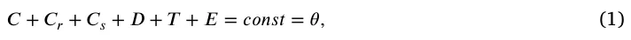

for some 0 *< 𝜃 <* 1. This assumption will be used to determine the dynamics of the ‘‘free’’ boundary of radially symmetric tumors. The movement of the tumor boundary and Eq. (1) imply a movement of cells that remain within the tumor; we assume that all these cells are moving with the same velocity*⃖⃗𝑢*. In addition, we also assume that all cells undergo dispersion (diffusion) with the same coefficient, *𝛿*. Following these assumptions and the biological network presented in Fig. 1, each species of cells, denoted by *𝑋*, satisfies an equation of the following form:

<figure class="table-figure" id="table-1">
<figcaption><strong>Table 1</strong> A list of the model variables.</figcaption>

<table><tr><th>Variable</th><th>Definition</th></tr><tr><td>C</td><td>Cancer cells</td></tr><tr><td>𝐶𝑠</td><td>Senescent cancer cells</td></tr><tr><td>𝐶𝑟</td><td>Castration-resistant cancer cells</td></tr><tr><td>D</td><td>Dendritic cells</td></tr><tr><td>T</td><td>CD8+ T cells</td></tr><tr><td>E</td><td>Endothelial cells</td></tr><tr><td>V</td><td>Vascular endothelial growth factor (VEGF)</td></tr><tr><td>W</td><td>Oxygen</td></tr><tr><td>I</td><td>Interleukin 12 (IL-12)</td></tr><tr><td>A</td><td>ADT drug, Enzalutamide (ENZ)</td></tr><tr><td>P</td><td>Chemotherapy drug, Cabazitaxel (CBZ)</td></tr><tr><td>F</td><td>Senlytic drug, fisetin</td></tr></table>

</figure>

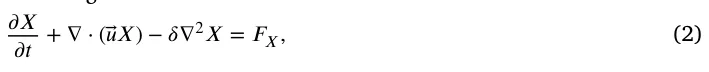

where *𝐹*𝑋 is determined by the effect on *𝑋* of all the model variables, as indicated in Fig. 1.

An expression in *𝐹*𝑋 of the form *𝜆𝑋* 𝑌 𝐾+𝑌 (*𝐾* constant depending on *𝑌*) describes a process where species *𝑌* (e.g. proteins) is absorbed by cells *𝑋*, at rate coefficient *𝜆*. We denote the death rate (or degradation rate) of species *𝑋* by *𝑑*𝑋. The dynamics of *𝑉 , 𝐼*, and *𝑊* are similar to those of the cells. However, since their diffusion coefficients are much larger than those of cells (by several orders of magnitude), the effect of the velocity,*⃖⃗𝑢*, can be neglected.

We proceed to represent the biological network in Fig. 1 by a system of PDEs.

## Equation for 𝐶

We write the equation for *𝐶* in the following form:

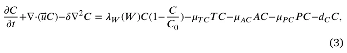

where the first term on the right-hand side represents a logistic growth, with carrying capacity *𝐶*0, at oxygen-dependent rate {

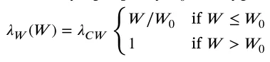

where *𝑊*0 is the normal density of oxygen in tissue; we assume that cancer cells grow at a rate *𝜆*𝐶 𝑊 if oxygen level is above *𝑊*0, but the growth rate decreases if *𝑊* decreases below *𝑊*0, so that, in particular, when *𝜆*𝐶 𝑊 *𝑊* ∕*𝑊*0 *< 𝑑*𝐶, *𝐶* is actually decreasing. The second term on the right-hand side of Eq. (3) accounts for the killing of cancer cells by *𝑇* cells, the third term represents the decrease in cancer cells by the hormone therapy ADT (ENZ, *𝐴*), and the fourth term represents the decrease in cancer cells by CBZ (*𝑃*).

<figure id="fig-1">
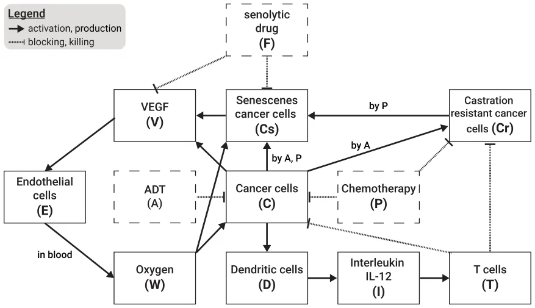
<figcaption><strong>Fig. 1.</strong> A schematic view of the biological model including five cell populations and five free chemicals. The treatment-related components are marked by dashed borders.</figcaption>
</figure>

## Equation for 𝐶𝑟

Under ADT some C-cells become castration resistant *𝐶*𝑟-cells, which continue to proliferate but are killed by *𝑇* cells and *𝑃*. We assume, that the killing rates of *𝐶* by *𝑇* and *𝑃* are the same as their killing rates of *𝐶*𝑟. Hence,

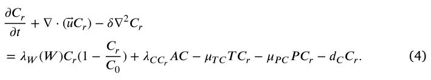

## Equation for 𝐶𝑠

We write the equation for *𝐶*𝑠 as follows:

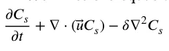

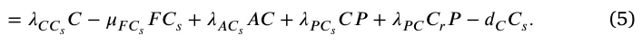

In the first term on the right hand side, *𝜆*𝐶 𝐶𝑠 represents the rate by which cancer cells become senescent under cell stress and oncogene activity (Wyld et al., 2020). The second term on the right-hand side accounts for the elimination of senescent cells by the senolytic drug fisetin Wyld et al. (2020), Malayaperumal et al. (2023); the third term represents the fact that, under ADT, some C-cells become senescent cells, and the fourth and the fifth terms represent the rates by which, under chemotherapy *𝑃*, *𝐶* and *𝐶*𝑟 cells become senescent cells (Wyld et al., 2020). Chemotherapy kills the highly proliferating cancer cells during cell division; since senescent cells do not divide, we do not include a killing term of *𝐶*𝑠 by *𝑃*.

## Equation for 𝐷

Inactive dendritic cells, *𝐷*0, are activated by identifying special proteins on cancer cells. We view this activation process as an ‘‘eating’’ process by *𝐷*0 of these special proteins whose density is proportional to the density of *𝐶*, and because an eating process is limited by the available food, we represent the rate of *𝐷*0 activation by the Michaelis–Menten law: *𝜆*𝐷*𝐷*0 𝐶 𝐾𝐶+𝐶, where *𝜆*𝐷 and *𝐾*𝐶 are constants. Hence,

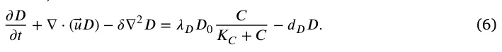

*Equation for 𝑇*

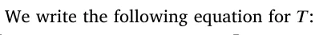

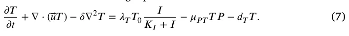

The first term on the right-hand side is the activation of inactive naive *𝑇* cells, *𝑇*0, directly by *𝐼* (*𝐼*12) (Henry et al., 2008), but also indirectly as follows: *𝐼*12 secreted by *𝐷* cells activate CD4+ *𝑇* cells of type Th1 (Henry et al., 2008), who secrete IL-2 (Viallard et al., 1999), which activates CD8+ *𝑇* cells (Niederlova et al., 2023). The second term on the right-hand side of Eq. (7) represents the killing of *𝑇* cells by the chemotherapy drug (Das et al., 2020).

## Equation for 𝐸

VEGF (*𝑉* ) promotes angiogenesis: it attracts endothelial cells, and it also increases their proliferation when *𝑉* is above a threshold level *𝑉*0 (Carmeliet, 2005; Ferre-Torres et al., 2023). Hence,

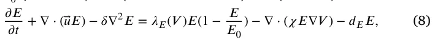

where *𝜒* is a chemotactic parameter, and *𝐸* proliferates with logistic growth at rate

## Equation for 𝑊

The density of endothelial cells is proportional to the density of blood in tissue. Hence the concentration of oxygen from the blood can be written as follows:

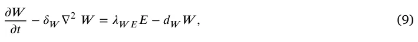

where *𝛿*𝑊 is the diffusion coefficient of *𝑊* and *𝑑*𝑊 is the consumption rate of oxygen by all cells from Eq. (1); we assume that *𝑑*𝑊 is constant.

## Equation for 𝐼

*𝐼* is lost in the process of activating T. The binding process of *𝐼* proteins with receptors in *𝑇* cells is limited by receptor recycling time; we assume that the density of these receptors on *𝑇* cells is proportional to the density of *𝑇* cells. Hence, we express the binding rate of *𝐼* to *𝑇* by the Michaelis–Menten law: *𝑑*𝑇 𝐼*𝐼* 𝑇 𝐾𝑇+𝑇 for some constants *𝑑*𝑇 𝐼 and *𝐾*𝑇, so that *𝜕 𝐼 𝑇 𝜕 𝑡* − 𝛿𝐼∇2𝐼 = 𝜆𝐼 𝐷𝐷 − 𝑑𝑇 𝐼𝐼 *𝐾*𝑇 + *𝑇* − 𝑑𝐼𝐼 , (10)

where *𝛿*𝐼 is the diffusion coefficient of *𝐼*, and *𝜆*𝐼 𝐷 is the production rate of *𝐼* by *𝐷*.

## Equation for 𝑉

VEGF (*𝑉* ) is secreted by *𝐶* and *𝐶*𝑟, and also by *𝐶*𝑠 (Pardella et al., 2022; Xu et al., 2024), at a rate that depends on the oxygen level, and fisetin reduces *𝑉* (Zhou et al., 2023; Takahashi et al., 2020); *𝑉* is also lost in the process of activating and increasing the proliferation of *𝐸*. The equation for *𝑉* takes the following form:

*𝜕 𝑉 𝜕 𝑡* − 𝛿𝑉 ∇2𝑉

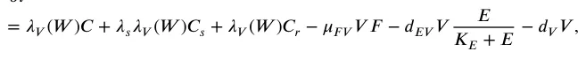

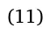

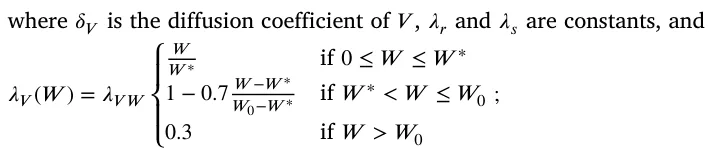

*𝑊*0 is the normal level of tissue oxygen, and *𝑊* ∗ is the hypoxia threshold of oxygen. Here we assume that *𝜆*𝑉 (*𝑊* ) is equal to 0.3 if *𝑊* is above the normal oxygen density *𝑊*0, but it increases to 1 when the level of *𝑊* is decreased down to *𝑊* ∗ and cancer cells are then more ‘‘motivated’’ and able to secrete VEGF; however, when *𝑊* is below the hypoxia level *𝑊* ∗ (extreme hypoxia), their production of VEGF is impaired, and *𝜆*𝑉 (*𝑊* ) decreases as *𝑊* decreases.

## Equation for 𝐹

The half-life rate of a drug *𝐵*, *𝑡*1∕2(*𝐵*), is the length of time it takes *𝐵* to decrease to half of its starting amount. Modeling the decrease process of *𝐵* by 𝑑 𝐵 𝑙 𝑛(2) 𝑑 𝑡 = −*𝑑*𝐵*𝐵 ,* we get *𝐵*(*𝑡*) = *𝑒*−𝑑𝐵𝑡*𝐵*(0), so that *𝑑*𝐵 = 𝑡1∕2(𝐵). Hence, if *𝐹* is administered at amount *𝛾*𝐹 at times *𝑡*1*, 𝑡*2*,* … *, 𝑡*𝑚, then the total injections level at any time *𝑡* can be represented by *𝛾*𝐹*𝑓*𝐹 ,𝛼(*𝑡*), where:

## or

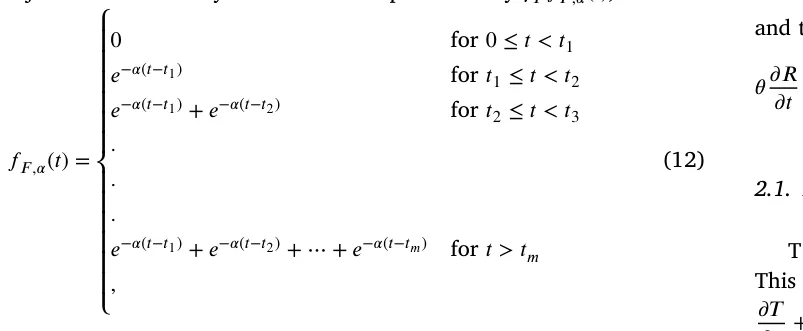

*𝑙 𝑛*(2) and *𝛼* = 𝑡1∕2(𝐹). Drug washout is the loss of the substance by excretion. Fisetin is decreased in the process of eliminating *𝐶*𝑠 and in reducing *𝑉* (Zhou et al., 2023; Takahashi et al., 2020), at rates *𝜇*𝐶𝑠𝐹 and *𝜇*𝑉 𝐹, respectively. Hence, we write the equation for *𝐹* as follows:

*𝜕 𝐹 𝜕 𝑡* − 𝛿𝐹∇2𝐹 = 𝛾𝐹𝑓𝐹 ,𝛼(𝑡) − 𝜇𝐶𝑠𝐹𝐶𝑠𝐹 − 𝜇𝑉 𝐹𝑉 𝐹 − 𝜇𝐹𝐹 , (13)

where *𝛿*𝐹 is the diffusion coefficient of *𝐹*, and *𝜇*𝐹 is the washout rate of *𝐹*.

## Equation for 𝑃

Similarly, we write the equation of *𝑃* as follows:

*𝜕 𝑃 𝜕 𝑡* − 𝛿𝑃∇2𝑃 = 𝛾𝑃𝑓𝑃 ,𝛽(𝑡) − 𝜇𝐶 𝑃𝐶 𝑃 − 𝜇𝐶 𝑃𝐶𝑟𝑃 − 𝜇𝑇 𝑃𝑇 𝑃 − 𝜇𝑃𝑃 , (14)

where *𝑃* is injected at amount *𝛾*𝑃, and is consumed in the process of killing *𝐶*, *𝐶*𝑟 and *𝑇*; *𝛿*𝑃 is the diffusion coefficient of *𝑃*, *𝜇*𝑃 is the washout rate of *𝑃*, and *𝑓*𝑃 ,𝛽(*𝑡*) represents the protocol of injections at times *𝑡*1*, 𝑡*2*,* … *, 𝑡*𝑛,

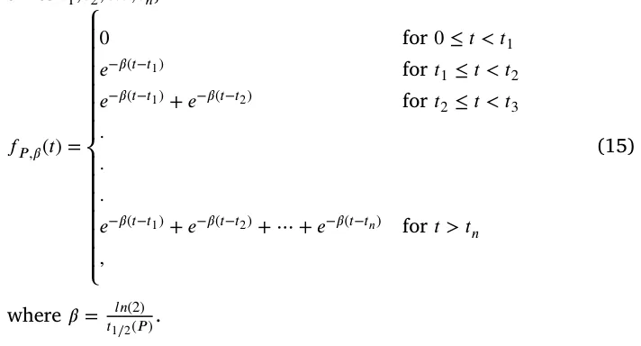

*Equation for 𝐴*

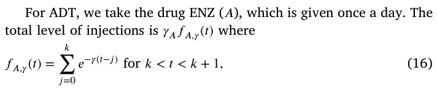

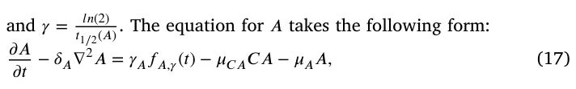

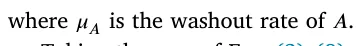

Taking the sum of Eqs. (3)–(8) and using Eq. (1), we get:

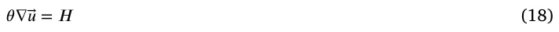

where *𝐻* is the sum of the right-hand side of Eqs. (3)–(8). In the radially symmetric case, where*⃖⃗𝑢* is a given by a scalar function, *𝑢*(*𝑟, 𝑡*), Eq. (18) becomes:

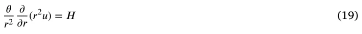

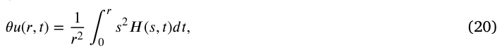

and the tumor radius *𝑟* = *𝑅*(*𝑡*) satisfies the following equation:

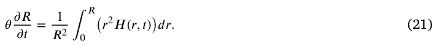

### 2.1. Boundary condition

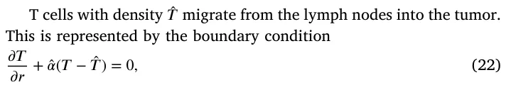

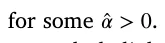

Endothelial cells*̂ 𝐸* are attracted by VEGF into the tumor; we represent the influx of *𝐸* by the boundary condition

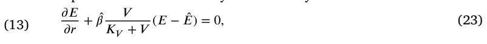

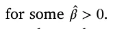

The exchange between oxygen from outside the tumor (*𝑊*0) and inside the tumor (*𝑊* ) is represented by the boundary condition

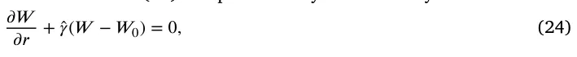

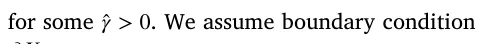

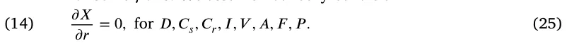

The boundary condition for *𝐶* is derived from Eq. (1), namely, *𝐶* = *𝜃* − *𝐶*𝑟 − *𝐶*𝑠 − *𝐷* − *𝑇* − *𝐸*

### 2.2. Initial condition

We take the following initial conditions in units of g∕cm3:

*𝐷* = 2 ⋅ 10−4*, 𝑇* = 0*.*5 ⋅ 10−3*, 𝐸* = 4 ⋅ 10−3*, 𝑊* = 1*.*4 ⋅ 10−4*, 𝑉* = 2 ⋅ 10−8*, 𝐼* = 4 ⋅ 10−10*, 𝐶*𝑟 = 0*.*1*𝐶 , 𝐶*𝑠 = 0*.*1*𝐶 , 𝐶* = *𝜃* − *𝐶*𝑟 − *𝐶*𝑠 − *𝐷* − *𝑇* − *𝐸 ,* and *𝐹* = *𝑃* = *𝐴* = 0*.*

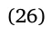

We take *𝑅*(0) = 0*.*05 cm. We assume that moderate changes in the initial conditions will not qualitatively change the model simulations after a few days.

### 2.3. Parameter estimation

The computational methods are based on the Runge–Kutta scheme with moving mesh, as will be explained in Appendix *𝐼*. In order to estimate some model’s parameters, we use genetic algorithm (GA) coupled with the Monte Carlo (MC) process; this combined MCGA scheme will be explained in Appendix *𝐼 𝐼*. Sensitivity analysis of model’s parameters is performed in Appendix *𝐼 𝐼 𝐼*.

Some of the parameters have already been estimated in previous publications, as indicated in Table 2, while others, indicated by ‘‘this work’’, are assumed for this paper.

The half-life of senescent cells is 12–24 h (Fan et al., 2020). Taking it to be approximately 16 h, we get *𝑑*𝐶𝑠 = 𝑙 𝑛(2) 0.75 = 0*.*92∕d. We assume that the fraction *𝐶*𝑠∕*𝐶* varies from 5% to 20%, and take its average to be 10%. Hence, from the steady state of the control case, *𝜆*𝐶 𝐶𝑠*𝐶* = *𝑑*𝐶𝑠*𝐶*𝑠, we get *𝜆*𝐶 𝐶𝑠 = *𝑑*𝐶𝑠 𝐶𝑠 𝐶 = 0*.*092∕d.

The half-life of fisetin, *𝑡*1∕2(*𝐹*), is 3 h (Alzheimer’s Drug Discovery *𝑙 𝑛*(2) Foundation, 2018; Zhu et al., 2017). Hence, *𝛼* = 𝑡1∕2(𝐹) = 𝑙 𝑛(2) 1∕8 = 5*.*32∕d.

The half-life of cabazitaxel is 95 h (JEVTANA, 2010). Hence, *𝛽* = *𝑙 𝑛*(2) 𝑡1∕2 (*𝑃*) = 𝑙 𝑛(2) 3.96 = 0*.*174∕d. The half-life of oral enzalutamide is 5.8 days (Gibbons et al., 2015), hence *𝛾* = 𝑙 𝑛(2) 5.8 = 0*.*12∕d.

Some of the remaining parameters to be estimated will be determined by fitting the model simulations of tumor-volume growth to experimental results in Mukhtar et al. (2016) in mouse inoculated with castration resistant prostate cancer cells. In Mukhtar et al. (2016), mice are treated with fisetin of 20 mg/kg, 3 times each week (e.g., Monday, Wednesday, Friday), and with CBZ at 5 mg/kg once a week (e.g. Monday). The average weight of a laboratory mouse is 32 g. Assuming that 1 cm3 of tissue has average mass of 1 g, we find that 1 mg∕k g = 3*.*2 ⋅ 10−5 gm∕cm3, *𝛾*𝐹 = 32 ⋅ 20 ⋅ 10−6 = 6*.*4 ⋅ 10−4 cm3∕g d, and *𝛾*𝑃 = 32 ⋅ 5 ⋅ 10−6 = 1*.*6 ⋅ 10−4 cm3∕g d.

We take the washout rate of all drugs to be *𝜇*𝐹 = *𝜇*𝑃 = *𝜇*𝐴 = 2.

We introduce a ‘‘sub-model’’ of our model, which fits the experimental study in Mukhtar et al. (2016). This means that we set *𝐶* = 0*, 𝐴* = 0 in our model, in Eq. (5) for *𝐶*𝑠 we introduce a production term *𝜆*𝐶𝑟𝐶𝑠*𝐶*𝑟 with *𝜆*𝐶𝑟𝐶𝑠 = 0*.*09∕d, in Eq. (6) we replace *𝐶* by *𝐶*𝑟, and we also take initial condition *𝐶*𝑟 = *𝜃* − *𝐶*𝑠 − *𝐷* − *𝑇* − *𝐸*.

We begin to estimate the remaining parameters of the sub-model by using the ‘‘steady state’’ condition, namely, by equating to zero the right-hand sides of the sub-model equations. We assume that in steady *𝑋* state, 𝐾𝑋+𝑋 = 1 2overrightarrow, or *𝑋* = *𝐾*𝑋 for all species; *𝐾*𝑋 is called the ‘‘half-saturation’’ of *𝑋*. We temporally fix the unknown parameters *𝜆*𝐹*, 𝜆*𝑃 at *𝜆*𝐹 = 4*.*10*, 𝜆*𝑃 = 2*.*96, and this will be used to determine the ‘‘steady state’’ values of all other parameters. We also assume that in ‘‘steady state’’, *𝛾*𝐹*𝑓*𝐹 ,𝛼 = *𝜆*𝐹*𝐹* and *𝛾*𝑃*𝑓*𝑃 ,𝛽 = *𝜆*𝑃*𝑃*, for some parameters *𝜆*𝐹*, 𝜆*𝑃. Since the ‘‘steady state’’ assumption does not actually exist, the parameters that have been estimated under this condition need to be made more precise. These parameters include the production parameters in the control case

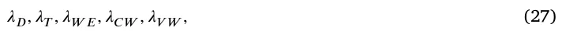

and the production and degradation parameters

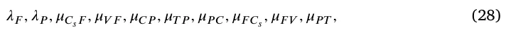

associated with the drugs *𝐹* and *𝑃*. All these parameters will be estimated by fitting the tumor volume profiles in the control case and in the three case treatments by *𝐹*, by *𝑃*, and by *𝐹* + *𝑃*, to the four corresponding tumor profiles in the mouse model (Mukhtar et al., 2016) (Fig. 4). *𝐹* is administered orally in capsules or tablets (Underwood, 2023), and *𝑃* is administered intravenously (Anon, 2024a).

From the steady state of Eq. (6) in the control case, we get 0*.*5*𝜆*𝐷*𝐷*0 = *𝑑*𝐷*𝐾*𝐷. Hence, *𝜆*𝐷 = 2𝑑𝐷𝐾𝐷 = 4∕d, and by MCGA we get *𝜆*𝐷 = 1*.*47∕d. *𝐷*0 From the steady state of Eq. (7) in the control case, we get 0*.*5*𝜆*𝑇*𝑇*0 = *𝑑*𝑇*𝐾*𝑇, so that *𝜆*𝑇 2𝑑𝑇𝐾𝑇 = 1*.*8∕d, and by MCGA fitting, we get = *𝑇*0 *𝜆*𝑇 = 1*.*47∕d.

With *𝑉* ≥ *𝑉*0, the steady state of Eq. (8) takes the form *𝜆*𝐸 𝑉 *𝑉 𝐸*(1 − *𝐾𝐸* 𝐸0 ) = *𝑑*𝐸*𝐸*, where *𝐾*𝐸∕*𝐸*0 = 0*.*5. Hence, *𝜆*𝐸 𝑉 = 2𝑑𝐸 𝐾𝑉 = 1*.*87 ⋅ 107∕d.

From the steady state of Eq. (9), *𝜆*𝑊 𝐸*𝐸* = *𝑑*𝑊 *𝑊* , so that *𝜆*𝑊 𝐸 = *𝐾𝑊 𝑑*𝑊 𝐾𝐸 = 7*.*4 ⋅ 10−2∕d, and by MCGA fitting we get *𝜆*𝑊 𝐸 = 9*.*45 ⋅ 10−2. Eq. (10) in steady state can be written as follows: *𝜆*𝐼 𝐷*𝐷* = (0*.*5*𝑑*𝑇 𝐼 + *𝑑*𝐼)*𝐼*. We take *𝑑*𝑇 𝐼 = 2*𝑑*𝐼 = 2*.*76∕d, and then, *𝜆*𝐼 𝐷 = 2𝑑𝐼𝐾𝐼 = 5*.*52⋅10−6∕d. *𝐾𝐷* From the steady state of Eq. (11) in the control case, with *𝜆*𝑉 (*𝑊* ) ∼ *𝜆*𝑉 𝑊 ⋅ 0*.*2, we get 0*.*2*𝜆*𝑉 𝑊 (*𝐶*𝑟 + *𝜆*𝑠*𝐶*𝑠) = (0*.*5*𝑑*𝐸 𝑉 + *𝑑*𝑉 )*𝑉* . Taking *𝑑*𝐸 𝑉 = 2*𝑑*𝑉 = 25*.*2∕d, recalling that *𝐶*𝑠 = 0*.*1*𝐶*𝑟 in steady state, and choosing *𝜆*𝑠 = 5, we get *𝜆*𝑉 𝑊 = 2𝑑𝑉 𝐾𝑉 0.2𝐾𝐶⋅1.5 = 1*.*47 ⋅ 10−7∕d and by MCGA fitting we get *𝜆*𝑉 𝑊 = 2*.*44 ⋅ 10−7∕d.

If *𝑊* ≥ *𝑊*0, the steady state of Eq. (7) gives the relation 0*.*5*𝜆*𝐶 𝑊 = *𝜇*𝑇 𝐶*𝐾*𝑇 + *𝑑*𝐶 = 0*.*6. But this value of *𝜆*𝐶 𝑊 needs to be increased, since the cancer continues to grow in the no-drug case even if *𝑊* is below *𝑊*0. We take *𝜆*𝐶 𝑊 = 1*.*7∕d, and by MCGA fitting we get *𝜆*𝐶 𝑊 = 1*.*49∕d.

Eqs. (13)–(14) in steady state take the following form: *𝜆*𝐹 = *𝜇*𝐶𝑠𝐹*𝐶*𝑠 + *𝜇*𝑉 𝐹*𝑉* + 2 (with *𝐶*𝑠 = 0*.*1*𝐶*) and *𝜆*𝑃 = *𝜇*𝐶 𝑃*𝐶*𝑟 + *𝜇*𝑇 𝑃*𝑇* + 2.

We assume that *𝜇*𝐶𝑠𝐹*𝐶*∕10 = *𝜇*𝑉 𝐹*𝑉* in steady state, so that, with *𝐶* = *𝐾*𝐶 and *𝑉* = *𝐾*𝑉 we get 2 ⋅ 0*.*04*𝜇*𝐶𝑠𝐹 = 2 ⋅ 7 ⋅ 10−8*𝜇*𝑉 𝐹 = *𝜆*𝐹 − 2. Hence, *𝜇*𝐶𝑠𝐹 = 12*.*5(*𝜆*𝐹 − 2) cm3∕g d and *𝜇*𝑉 𝐹 = 7*.*4 ⋅ 10−6(*𝜆*𝐹 − 2) cm3∕g d, and by MCGA fitting *𝜇*𝐶𝑠𝐹 = 9*.*15(*𝜆*𝐹 − 2) cm3∕g d and *𝜇*𝑉 𝐹 = 4*.*1 ⋅ 106(*𝜆*𝐹 − 2) cm3∕g d. Thus, *𝜇*𝐶𝑠𝐹 = 2*.*59 ⋅ 101 cm3∕g d and *𝜇*𝑉 𝐹 = 1*.*03 ⋅ 107 cm3∕g d. Similarly we assume that *𝜇*𝐶 𝑃*𝐶 𝑃* = *𝜇*𝑇 𝑃*𝑇* so that 2 ⋅0*.*4*𝜇*𝐶 𝑃 = 2 ⋅10−3*𝜇*𝑇 𝑃 = *𝜆*𝑃 − 2; hence *𝜇*𝐶 𝑃 = 1*.*25(*𝜆*𝑃 − 2) cm3∕g d and *𝜇*𝑇 𝑃 = 5⋅102(*𝜆*𝑃 − 2) cm3∕g d, and by MCGA fitting *𝜇*𝐶 𝑃 = 1*.*84(*𝜆*𝑃 − 2) cm3∕g d and *𝜇*𝑇 𝑃 = 3*.*2(*𝜆*𝑃 − 2) cm3∕g d. Thus, *𝜇*𝐶 𝑃 = 1*.*38 cm3∕g d and *𝜇*𝑇 𝑃 = 2*.*45 cm3∕g d.

Fisetin eliminates senescent cells at rate *𝜇*𝐹 𝐶𝑠 and removes VEGF at rate *𝜇*𝐹 𝑉 . We take *𝜇*𝐹 𝑉 *𝑉 𝐹* = *𝜇*𝐹 𝐶𝑠*𝐶*𝑠*𝐹* in steady state or 7 ⋅ 10−8*𝜇*𝐹 𝑉 = 0*.*04*𝜇*𝐹 𝐶𝑠.

We assume that *𝜇*𝑃 𝑇*𝑃* = 0*.*105*𝑑*𝑇 in steady state, so that *𝜇*𝑃 𝑇 = 5*.*55 and by MCGA *𝜇*𝑃 𝑇 = 4*.*78 ⋅ 101. Note that *𝜇*𝑃 𝐶 *> 𝜇*𝑃 𝑇, which is as it should be, since *𝐶* divides at faster rate than *𝑇*.

In order to determine *𝜇*𝑃 𝐶 and *𝜇*𝐹 𝐶𝑠, from the steady states of Eqs. (3) and (4), we need to have estimates for ‘‘steady state’’ of *𝑃* and *𝐹*, which we do not have. Assuming that *𝑃* ∼ *𝑂*(*𝛾*𝑃∕*𝜆*𝑃), *𝐹* ∼ *𝑂*(*𝛾*𝐹∕*𝜆*𝐹), we chose some values, from which we get, in ‘‘steady state’’ of Eqs. (3) and (4), *𝜇*𝑃 𝐶 = 4*.*7 ⋅ 102 and *𝜇*𝐹 𝐶𝑠 = 3*.*0 ⋅ 105. By MCGA we get *𝜇*𝑃 𝐶 = 7*.*01 ⋅ 102*, 𝜇*𝐹 𝐶𝑠 = 2*.*94 ⋅ 105, and then also *𝜇*𝐹 𝑉 = 1*.*37 ⋅ 101.

The MCGA output gave us, in particular, *𝜆*𝐹 = 5*.*0 and *𝜆*𝑃 = 2*.*82. Recalling that *𝜇*𝐴 = 2∕d and *𝛾* = 1*.*2∕d, we proceed to estimate the remaining parameters that are associated with ENZ (*𝐴*), which is administered orally in tablets or capsules (Anon, 2024b), namely

*𝜆*𝐴𝐶𝑠*, 𝜆*𝐶 𝐶𝑟*, 𝜇*𝐴𝐶*, 𝜆*𝐶 𝐴*.* (29)

We assume that *𝜆*𝐴𝐶𝑠 = 1∕20*𝜇*𝐴𝐶*, 𝜆*𝐶 𝐶𝑟 = 1∕60*𝜇*𝐴𝐶 and that *𝜇*𝑇 𝐶 *< 𝜇*𝐴𝐶 *< 𝜇*𝑃 𝐶. Taking *𝜇*𝐴𝐶 = 600 cm3∕g d, we get *𝜆*𝐴𝐶𝑠 = 30 cm3∕g d, *𝜆*𝐶 𝐶𝑟 = 10 cm3∕g d. We also assume that *𝜇*𝐶 𝐴 = *𝜇*𝐶 𝑃, so that *𝜇*𝐶 𝐴 = 1*.*38 cm3∕g d. We next improve the values of the parameters in Eq. (29) by fitting model simulations to the experimental results in Guerrero et al. (2013). In Guerrero et al. (2013), mice were first inoculated with castration-resistant prostate cancer cells, and 5 days later were administered with androgen-dependent prostate cancer cells. Mice were then given daily gavage of ENZ for 28 days, at 1mg/kg (group 1), 10 mg/kg (group 2), and 50 mg/kg (group 3); (i.e. 3*.*2 ⋅10−5*,* 3*.*2 ⋅10−4, and 1*.*6 ⋅10−3 g∕cm3).

In Guerrero et al. (2013) mice were inoculated with *𝐶*𝑟 at day *𝑡* = −5, and 5 days later, at *𝑡* = 0, were inoculated with ADT. Hence, the control case in our model is different from the control case in Guerrero et al. (2013), but we slightly bridge the gap by taking 𝐶𝑟(0) 𝐶(0) = *𝜎* for some 0 *< 𝜎 <* 1. We take *𝜎* = 0*.*1 (to be consistent with initial conditions for *𝐶* and *𝐶*𝑟 in Eq. (26)), and the values of the parameters in Eq. (29) estimated above, and we use the MCGA method for fitting to Guerrero et al. (2013) (Fig. 3). We found that *𝜆*𝐴𝐶𝑠 = 3*.*92⋅101*, 𝜆*𝐶 𝐶𝑟 = 1*.*06 ⋅ 10−1*, 𝜇*𝐴𝐶 = 9*.*13 ⋅ 102*, 𝜇*𝐶 𝐴 = 9*.*7 ⋅ 10−1, and *𝜎* = 0*.*136.

## 3. Results

The proposed model, described by Eqs. (3)–(11), is a system of second-order nonlinear partial differential equations with a free boundary in a spherical geometric configuration. This model can be numerically solved using the Runge–Kutta method (Verwer and Sommeijer, 2004). All numerical analyses in this study were conducted using the Python programming language (Langtangen and Logg, 2016). The code to solve the model is provided in the project’s Github repository: https: //github.com/teddy4445/adt\_chemo\_senlytic\_model.

### 3.1. Fitness to experiments in Mukhtar et al. (2016), Guerrero et al. (2013)

In this section, we describe in detail the treatments used in Mukhtar et al. (2016), Guerrero et al. (2013), which we precisely followed in our simulations, in order to estimate some of model’s parameters by fitting to the experimentally derived volume profiles in Mukhtar et al. (2016), Guerrero et al. (2013). In Mukhtar et al. Mukhtar et al. (2016), mice inoculated with castration-resistant prostate cancer cells (CRPC) were injected with fisetin every week on Monday, Wednesday, and Friday, and with Cabazitaxel once a week on Monday, for 7 weeks. In Mukhtar et al. (2016) (Fig. 4) tumor volumes were displayed in the control case, with *𝐹* and *𝑃* as single agents, and with *𝐹* + *𝑃*. Using the same treatment data, we used our model to simulate the tumor volume in all four cases. Fig. 2 shows the comparison of our simulations with the experimental profiles in Mukhtar et al. (2016) (Fig. 4). Computing the coefficients of determination (*𝑅*2) that serves as a measure of goodness of fitness between the simulated and experimental profiles, we found that *𝑅*2 = 0*.*936 in the control case, *𝑅*2 = 0*.*909 for *𝐹*, *𝑅*2 = 0*.*918 for *𝑃*, and *𝑅*2 = 0*.*915 for *𝐹* + *𝑃*.

In Guererro et al. Guerrero et al. (2013), mice were inoculated with CRPC cells, and, 5 days later, with androgen-dependent prostate cancer cells. Mice were then treated daily with ENZ, for 28 days, with 1 mg/kg (group 1), 10 mg/kg (group 10), 50 mg/kg (group 3). Fig. 3 A in Guerrero et al. (2013) shows tumor volume profiles in the control case and the three treated groups. Our model simulation in Fig. 3 shows a comparison with (Guerrero et al., 2013) (Fig. 3 A). The fitness in the control case is weak (*𝑅*2 = 0*.*710) which is not surprising, since the control case generated in Guerrero et al. (2013) is different from the control case in our model, as explained above. Nonetheless, as the dose of ENZ increases, the fitness between our model and Guerrero et al. (2013) (Fig. 3 A) improves, and the coefficient of determination are *𝑅*2 = 0*.*908 for group 2 (10 mg/kg) and *𝑅*2 = 0*.*915 for group 3 (50 mg/kg).

<figure id="fig-2">
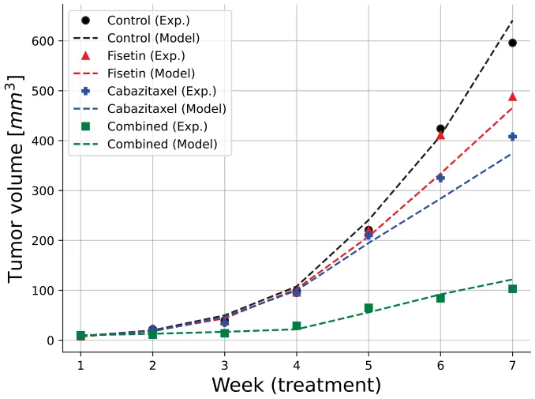
<figcaption><strong>Fig. 2.</strong> Comparison between the model’s prediction for the tumor volume and the experimental mice model from (Mukhtar et al., 2016). For the control case, the coefficient of determination is <em>𝑅</em>2 = 0<em>.</em>936, <em>𝑅</em>2 = 0<em>.</em>909 for <em>𝐹</em>, <em>𝑅</em>2 = 0<em>.</em>918 for <em>𝑃</em>, and <em>𝑅</em>2 = 0<em>.</em>915 for <em>𝐹</em> + <em>𝑃</em>.</figcaption>
</figure>

### 3.2. Synergy between 𝑃 and 𝐹

When evaluating the effectiveness of multiple drugs, it is important to include a synergy score to assess their combined effect; such a score would strengthen the analysis of the treatments’ efficacy. In this section, we derive a synergy score for a combination of *𝑃* and *𝐹*, for three different doses of ADT, and display it in color maps.

For any fixed dose *𝛾*𝐴 of ADT, we denote by *𝑉 𝛾*𝑃*, 𝛾*𝐹, for any fixed doses *𝛾*𝑃*, 𝛾*𝐹, the tumor volume at end-time of 10 weeks under treatment by *𝛾*𝐴*, 𝛾*𝑃*, 𝛾*𝐹, where *𝑓*𝐹 ,𝛼(*𝑡*) = *𝑓*𝑃 ,𝛽(*𝑡*) = *𝐹*𝐴,𝛾(*𝑡*) = 1, and define the efficacy of the treatment by

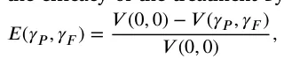

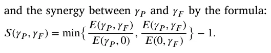

If *𝑆*(*𝛾*𝑃*, 𝛾*𝐹) *>* 0 then the efficacy of the combination *𝛾*𝑃 + *𝛾*𝐹 is larger than the efficacy of both *𝛾*𝑃 and *𝛾*𝐹, so that the two drugs are in synergetic relation. If *𝑆*(*𝛾*𝑃*, 𝛾*𝐹) *<* 0, then the efficacy of the combination *𝛾*𝑃 + *𝛾*𝐹 is smaller than the efficacy of either *𝛾*𝑃 or *𝛾*𝐹, or both, so that at least one of the drugs is antagonistic to the other.

Fig. 4 shows three color maps of synergy for ADT dose: *𝛾*𝐴 = 1*𝑚𝑔*∕*𝑘𝑔* = 3*.*2 ⋅ 10−5 g∕cm3*,* 10*𝛾*𝐴, and 50*𝛾*𝐴, as used in Guerrero et al. (2013). The doses*̂ 𝛾*𝑃 and*̂ 𝛾*𝐹 vary between 0.5 and 1.5 of the doses of *𝛾*𝑃 = 1*.*6 ⋅10−4*, 𝛾*𝐹 = 6*.*4 ⋅10−4 g∕cm3, which were used in Mukhtar et al. (2016). We see that in the case of *𝛾*𝐴, the synergy *𝑆*(*̂𝛾*𝑃*, ̂𝛾*𝐹) is always positive, and it increases when*̂ 𝛾*𝑃 and*̂ 𝛾*𝐹 increase. In the case of 10*𝛾*𝐴, *𝑆*(*̂𝛾*𝑃*, ̂𝛾*𝐹) increases when*̂ 𝛾*𝐹 increase, but for some small values of*̂ 𝛾*𝐹 there is an interval of*̂ 𝛾*𝑃 values where the synergy decreases when*̂ 𝛾*𝑃 is increasing; this is easily deduced from the concave curves of equi-synergy corresponding to 0.1. In the case of 50*𝛾*𝐴, synergy increases as*̂ 𝛾*𝑃 and*̂ 𝛾*𝐹 increase, but the synergy is negative for small values of*̂ 𝛾*𝑃 and*̂ 𝛾*𝐹. These somewhat surprising differences in the synergy dependence on the dose of *𝐴*, apparently result from the facts that *𝐴* and *𝑃* work in the same direction in Eq. (3) for *𝐶*, that *𝐴* and *𝑃* work in a reverse direction in Eq. (4) for *𝐶*𝑟, and that *𝐴* works in the same direction as *𝑃* and in reverse direction to *𝐹* in Eq. (5) for *𝐶*𝑠. We note that the maximum synergy score *𝑆*(1*.*5*𝛾*𝑃*,* 1*.*5*𝛾*𝐹) is increasing from 0.2 for *𝛾*𝐴 to 0.3 for 10*𝛾*𝐴, and to 0.5 for 50*𝛾*𝐴.

<figure class="table-figure" id="table-2">
<figcaption><strong>Table 2</strong> Summary of the model parameters with their values and sources; ‘‘estimated’’ means by ‘‘steady state’’, ‘‘by fitting’’ means by MCGA.</figcaption>

<table><tr><th>Parameter</th><th>Description</th><th>Value</th><th>Reference</th></tr><tr><td>𝛿</td><td>Diffusion coefficient of cells</td><td>8.64 ⋅10−3 cm2∕d</td><td>Lai et al. (2018)</td></tr><tr><td>𝛿𝑊</td><td>Diffusion coefficient of oxygen</td><td>0.8 cm2∕d</td><td>Lai and Friedman (2019)</td></tr><tr><td>𝛿𝐼</td><td>Diffusion coefficient of 𝐼12</td><td>6.05 ⋅10−2 cm2∕d</td><td>Lai and Friedman (2017)</td></tr><tr><td>𝛿𝑉</td><td>Diffusion coefficient of VEGF</td><td>8.64 ⋅10−2 cm2∕d</td><td>Liao et al. (2014)</td></tr><tr><td>𝑑𝐶</td><td>Death rate of cancer cells</td><td>0.1 d</td><td>Lai and Friedman (2019)</td></tr><tr><td>𝑑𝐶𝑠</td><td>Death rate of senescent cancer cells</td><td>0.92 d</td><td>Friedman and Hao (2018)</td></tr><tr><td>𝑑𝐷</td><td>Death rate of dendritic cells</td><td>0.1 d</td><td>Hao and Friedman (2016)</td></tr><tr><td>𝑑𝑇</td><td>Death rate of CD8+ T cells</td><td>0.18 d</td><td>Hao and Friedman (2016)</td></tr><tr><td>𝑑𝐸</td><td>Death rate of endothelial cells</td><td>0.69 d</td><td>Chen et al. (2012)</td></tr><tr><td>𝑑𝑊</td><td>Takeup rate of oxygen by cells</td><td>1.04 d</td><td>Lai and Friedman (2019)</td></tr><tr><td>𝑑𝐼</td><td>Degradation rate of 𝐼 𝐿− 12</td><td>1.38 d</td><td>Friedman and Hao (2018)</td></tr><tr><td>𝑑𝑉</td><td>Degradation rate of VEGF</td><td>12.6 d</td><td>Hao and Friedman (2016)</td></tr><tr><td>𝐶0</td><td>Carrying capacity of 𝐶</td><td>0.8 g∕cm3</td><td>Hao and Friedman (2016)</td></tr><tr><td>𝐸0</td><td>Carrying capacity of 𝐸</td><td>5 ⋅10−3 g∕cm3</td><td>Friedman and Hao (2018)</td></tr><tr><td>𝐷0</td><td>Density of immature dendritic cells</td><td>2 ⋅10−5 g∕cm3</td><td>Friedman and Hao (2018)</td></tr><tr><td>𝑇0</td><td>Density of naive T cells</td><td>2 ⋅10−4 g∕cm3</td><td>Friedman and Hao (2018)</td></tr><tr><td>𝑊0</td><td>Normal density of oxygen in tissue</td><td>4.65 ⋅10−4 g∕cm3</td><td>Chen et al. (2012)</td></tr><tr><td>𝑊∗</td><td>Threshold of hypoxia</td><td>1.69 ⋅10−4 g∕cm3</td><td>Chen et al. (2012)</td></tr><tr><td>𝑉0</td><td>Threshold VEGF concentration</td><td>3.65 ⋅10−10 g∕cm3</td><td>Hao and Friedman (2016)</td></tr><tr><td>𝜒</td><td>Chemotartic parameter</td><td>0.8 cm5∕g d</td><td>Chen et al. (2012)</td></tr><tr><td>𝜃</td><td>Total density of cells</td><td>0.406 g∕cm3</td><td>Lai and Friedman (2019)</td></tr><tr><td>𝐾𝐶</td><td>Half-saturation of 𝐶</td><td>0.4 g∕cm3</td><td>Lai and Friedman (2017)</td></tr><tr><td>𝐾𝐷</td><td>Half-saturation of 𝐷</td><td>4 ⋅10−4 g∕cm3</td><td>Lai and Friedman (2019)</td></tr><tr><td>𝐾𝑇</td><td>Half-saturation of 𝑇</td><td>1 ⋅10−3 g∕cm3</td><td>Lai and Friedman (2019)</td></tr><tr><td>𝐾𝐸</td><td>Half-saturation of 𝐸</td><td>2.5 ⋅10−3 g∕cm3</td><td>Hao and Friedman (2016)</td></tr><tr><td>𝐾𝑊</td><td>Half-saturation of 𝑊</td><td>1.69 ⋅10−4 g∕cm3</td><td>Hao and Friedman (2016)</td></tr><tr><td>𝐾𝐼</td><td>Half-saturation of 𝐼12</td><td>8 ⋅10−10 g∕cm3</td><td>Slewe and Friedman (2022)</td></tr><tr><td>𝐾𝑉</td><td>Half-saturation of 𝑉</td><td>7 ⋅10−8 g∕cm3</td><td>Hao and Friedman (2016)</td></tr><tr><td>𝜆𝐶 𝑊</td><td>Growth rate of cancer cells</td><td>1.49 ∕d</td><td>Estimated by fitting</td></tr><tr><td>𝜆𝐶 𝐶𝑠</td><td>Production rate of 𝐶𝑠</td><td>0.092 ∕d</td><td>Estimated</td></tr><tr><td>𝜆𝐷</td><td>Production of 𝐷</td><td>1.12 ∕d</td><td>Estimated by fitting</td></tr><tr><td>𝜆𝑇</td><td>Production of CD8+ 𝑇cells</td><td>1.47 ∕d</td><td>Estimated by fitting</td></tr><tr><td>𝜆𝐸 𝑉</td><td>Production of 𝐸cells</td><td>1.87 ⋅107 ∕d</td><td>Estimated</td></tr><tr><td>𝜆𝑊 𝐸</td><td>Production of 𝑊</td><td>9.45 ⋅10−2 ∕d</td><td>Estimated by fitting</td></tr><tr><td>𝜆𝐼 𝐷</td><td>Production of 𝐼12</td><td>5.52 ⋅10−6 ∕d</td><td>Estimated</td></tr><tr><td>𝜆𝑉 𝑊</td><td>Production of 𝑊</td><td>2.44 ⋅10−7 ∕d</td><td>Estimated by fitting</td></tr><tr><td>𝜇𝑇 𝐶</td><td>Killing rate of 𝐶by 𝑇</td><td>500 cm3∕g d</td><td>This work</td></tr><tr><td>𝑑𝑇 𝐼</td><td>Loss rate of 𝐼12 by 𝑇</td><td>2.76 ∕d</td><td>This work</td></tr><tr><td>𝑑𝐸 𝑉</td><td>Loss rate of VEGF by 𝐸</td><td>25.2 ∕d</td><td>This work</td></tr><tr><td>𝜆𝑠</td><td>Increased production of 𝑉by 𝐶𝑠</td><td>5</td><td>This work̂</td></tr><tr><td>𝑇</td><td>T cells density from outside the tumor</td><td>2 ⋅10−3 g∕cm3</td><td>This work̂</td></tr><tr><td>𝐸</td><td>E cells density from outside the tumor</td><td>5 ⋅10−3 g∕cm3</td><td>This work̂</td></tr><tr><td>𝛼</td><td>Flux rate for T</td><td>1 ∕cm</td><td>This work̂</td></tr><tr><td>𝛽</td><td>Flux rate for E</td><td>1 ∕cm</td><td>This work̂</td></tr><tr><td>𝛾</td><td>Flux rate for W</td><td>1 ∕cm</td><td>This work</td></tr><tr><td>𝛼</td><td>Exponential decrease of fisetin (𝐹)</td><td>5.32∕d</td><td>Alzheimer’s Drug Discovery Foundation (2018), Zhu et al. (2017)</td></tr><tr><td>𝛽</td><td>Exponential decrease of cabazitaxel (𝑃)</td><td>0.174∕d</td><td>Gibbons et al. (2015)</td></tr><tr><td>𝜇𝐹</td><td>Washout rate of 𝐹</td><td>2∕d</td><td>This work</td></tr><tr><td>𝜇𝑃</td><td>Washout rate of 𝑃</td><td>2∕d</td><td>This work</td></tr><tr><td>𝜇𝐶𝑠𝐹</td><td>Loss rate of 𝐹by eliminating 𝐶𝑠</td><td>2.59 ⋅101 cm3∕g d</td><td>Estimated by fitting</td></tr><tr><td>𝜇𝑉 𝐹</td><td>Loss rate of 𝐹by eliminating 𝑉</td><td>1.03 ⋅107 cm3∕g d</td><td>Estimated by fitting</td></tr><tr><td>𝜇𝐶 𝑃</td><td>Loss rate of 𝑃killing 𝐶</td><td>1.38 ⋅100 cm3∕g d</td><td>Estimated by fitting</td></tr><tr><td>𝜇𝑇 𝑃</td><td>Loss rate of 𝑃by killing 𝑇</td><td>2.45 ⋅100 cm3∕g d</td><td>Estimated by fitting</td></tr><tr><td>𝜆𝑃 𝐶𝑠</td><td>Production rate of 𝐶𝑠by 𝑃acting on 𝐶</td><td>3.41 ⋅101 cm3∕g d</td><td>Estimated by fitting</td></tr><tr><td>𝜇𝑃 𝐶</td><td>Killing rate of 𝐶by 𝑃</td><td>7.01 ⋅102 cm3∕g d</td><td>Estimated by fitting</td></tr><tr><td>𝜇𝐹 𝐶𝑠</td><td>Elimination rate of 𝐶𝑠by 𝐹</td><td>2.94 ⋅105 cm3∕g d</td><td>Estimated by fitting</td></tr><tr><td>𝜇𝑃 𝑇</td><td>Killing rate of 𝑇by 𝑃</td><td>4.78 ⋅101</td><td>Estimated by fitting</td></tr><tr><td>𝜇𝐹 𝑉</td><td>Removal rate of 𝑉by 𝐹</td><td>1.87 ⋅101 cm3∕g d</td><td>Estimated by fitting</td></tr><tr><td>𝜆𝐴𝐶𝑠</td><td>Production rate of 𝐶𝑠by 𝐴acting on 𝐶</td><td>3.92 ⋅101 cm3∕d</td><td>Estimated by fitting</td></tr><tr><td>𝜇𝐴𝐶</td><td>Production rate of 𝐶𝑠by 𝐴acting on 𝐶</td><td>9.13 ⋅102 cm3∕d</td><td>Estimated by fitting</td></tr><tr><td>𝜆𝐶 𝐶𝑟</td><td>Production rate of 𝐶𝑟</td><td>0.106 ⋅100 d</td><td>Estimated by fitting</td></tr><tr><td>𝜇𝐶 𝐴</td><td>Killing rate of 𝐶by 𝐴</td><td>9.7 ⋅10−1 cm3∕g d</td><td>Estimated by fitting</td></tr><tr><td>𝜇𝐴</td><td>ENZ washout rate</td><td>1.82 ⋅100 d</td><td>Estimated by fitting</td></tr><tr><td>𝛾𝐹</td><td>Fisetin dose amount</td><td>6.4 ⋅10−4 g∕cm3 d</td><td>Mukhtar et al. (2016)</td></tr><tr><td>𝛾𝑃</td><td>CBZ dose amount</td><td>1.6 ⋅10−4 g∕cm3 d</td><td>Mukhtar et al. (2016)</td></tr><tr><td>𝛾𝐴</td><td>ENZ dose amount</td><td>3.2 ⋅10−5–1.6 ⋅10−3 g∕cm3 d</td><td>Guerrero et al. (2013)</td></tr></table>

</figure>

### 3.3. Optimal scheduling of 𝑃 and 𝐹

In Section 3.2 we showed that, with *𝛾*𝐴 = 1 mg∕k g (as in Guerrero et al. (2013)), the drugs *𝑃* and *𝐹* are synergetic in the range of doses from 50% to 150% of the doses *𝛾*𝑃 and *𝛾*𝐹 used in mice model (Mukhtar et al., 2016). In this section, we focus on optimal schedules in administering *𝑃* and *𝐹*, and consider, for simplicity, the case of *𝛾*𝑃 and *𝛾*𝐹.

Since a treatment with *𝑃* results in the production of senescent cancer cells, and since fisetin eliminates senescent cells, we may expect that, optimally, *𝐹* should be administered very soon after *𝑃*.

We test this hypothesis in a setup of four different schedules defined in Fig. 5, where *𝐴* is given daily during 8 weeks, while *𝑃* and *𝐹* are administered during three of these weeks; in each of these weeks, *𝑃* is administered just once, on Sunday, and *𝐹* three times, on Monday, Wednesday, and Friday.

<figure id="fig-3">
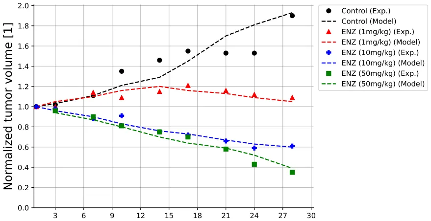
<figcaption><strong>Fig. 3.</strong> Comparison between the model’s prediction for the normalized tumor volume and the experimental mice model from (Guerrero et al., 2013). For the control case, the coefficient of determination is <em>𝑅</em>2 = 0<em>.</em>710, <em>𝑅</em>2 = 0<em>.</em>803 for 1 mg∕k g, <em>𝑅</em>2 = 0<em>.</em>908 for 10 mg∕k g, and <em>𝑅</em>2 = 0<em>.</em>915 for 50 mg∕k g.</figcaption>
</figure>

<figure id="fig-4">
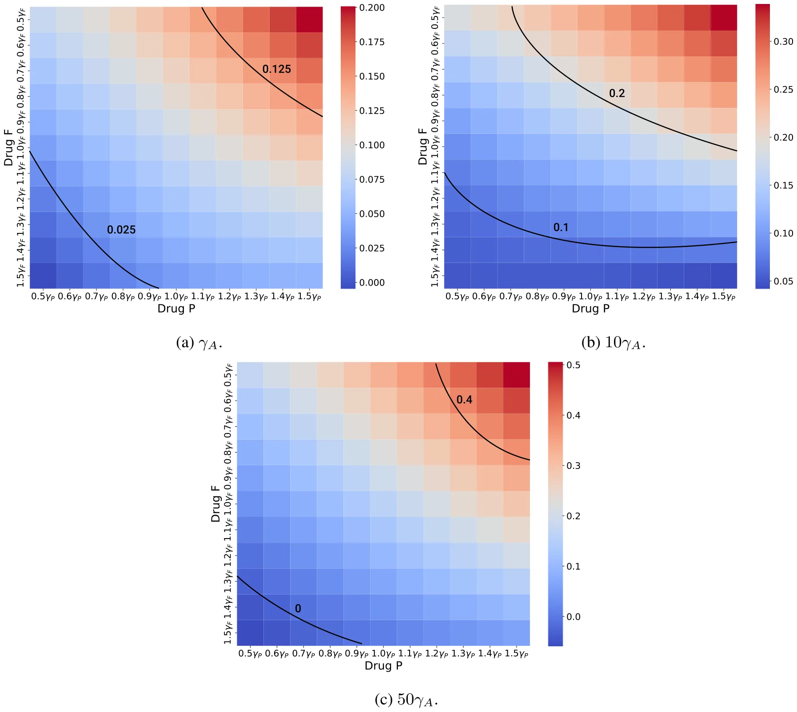
<figcaption><strong>Fig. 4.</strong> Color maps of the synergy score under treatment with (<em>̂𝛾</em>𝑃<em>, ̂𝛾</em>𝐹) where 0<em>.</em>5<em>𝛾</em>𝑃 ≤<em>̂ 𝛾</em>𝑃 ≤ 1<em>.</em>5<em>𝛾</em>𝑃<em>,</em> 0<em>.</em>5<em>𝛾</em>𝐹 ≤<em>̂ 𝛾</em>𝐹 ≤ 1<em>.</em>5<em>𝛾</em>𝐹, for three different doses of the ADT drug.</figcaption>
</figure>

For Treatment I, *𝐹* is totally wasted in its role of eliminating senescent cells. In Treatment II, the pro-cancer senescent cells continue to be produced by *𝑃* for three consecutive weeks before *𝐹* begins to eliminate them; so *𝐹* is not as effective as it could be. In Treatment III, *𝐹* comes one week after *𝑃*, which is a more effective use of it, while in Treatment IV, *𝐹* is administered in the same week as *𝑃* but a few days after *𝑃*, so it should be even more effective.

<figure id="fig-5">
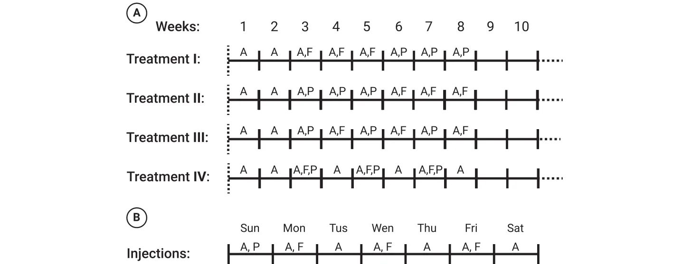
<figcaption><strong>Fig. 5.</strong> A schematic view of the four treatment protocols explored. Panel (A) shows the four treatment protocols with the weeks of injection and panel (B) shows the days of the week each drug is injected.</figcaption>
</figure>

<figure id="fig-6">
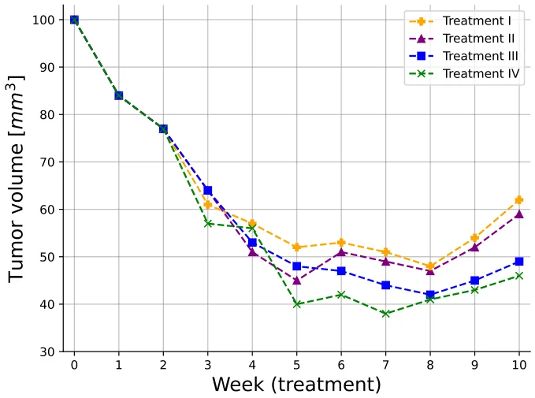
<figcaption><strong>Fig. 6.</strong> A comparison of four treatment protocols in terms of the tumor volume for 10 weeks.</figcaption>
</figure>

Fig. 6 shows that, indeed, Treatment IV yields the smallest tumor volume from week 5 onward; the anomaly around week 4 may be due to differences in the action dynamics of *𝑃* and *𝐹*, or to the additional role of *𝐹* in clearing VEGF.

Fig. 7 shows color maps of tumor volume *𝑉* (*̂𝛾*𝑃*, ̂𝛾*𝐹), where*̂ 𝛾*𝑃 and *𝛾*𝐹 vary from 0.5 to 1.5 of *𝛾*𝑃 and *𝛾*𝐹, respectively, under treatment IV at the last day of week 10, with three fixed doses of ADT, 10*𝛾*𝐴*,* 30*𝛾*𝐴*,* 50*𝛾*𝐴 and *𝑉* (*̂𝛾*𝑃*, ̂𝛾*𝐹) decreases when*̂ 𝛾*𝑃 and*̂ 𝛾*𝐹 increase, and when the fixed ADT dose is increased, but the equi-volume curves are convex.

## 4. Conclusion

Senescence is a primary hallmark of aging, but in cancer it is also triggered by cells stress, tumor suppression of gene activation, and oncogene activity. Senolytic drugs eliminate senescent cells, and are expected to reduce the negative pro-cancer effects of senescent cancer cells. In this paper, we considered metastatic prostate cancer, commonly treated with ADT and chemotherapy, and added to this combination a senolytic drug. Specifically, we took Enzalutamide (ENZ) for ADT, Cabazitaxl (CBZ) for chemotherapy, and fisetin (F) for senolytic drug, and briefly set *𝐴* = ENZ and *𝑃* = CBZ.

ENZ and CBZ are standard drugs used in the treatment of metastatic prostate cancer, but fisetin has not been clinically used so far, and was only recently considered in experimental studies (Qaed et al., 2023; Mukhtar et al., 2016; Guerrero et al., 2013). The first question we wanted to address is what is the potential benefits we can expect, if any, by including *𝐹* in the combination of ENZ and CBZ. We assess the potential benefits in terms of synergy between *𝐹* and *𝑃*, for any *𝐴*.

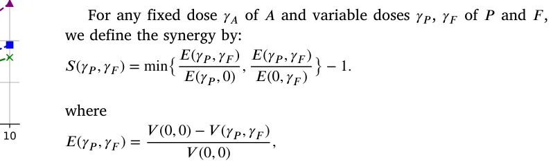

is the efficacy of (*𝛾*𝑃*, 𝛾*𝐹) and *𝑉* (*𝛾*𝑃*, 𝛾*𝐹) is the tumor volume by the end of the 10 weeks; in these definitions we take *𝑓*𝐹 ,𝛼(*𝑡*) = *𝑓*𝑃 ,𝛽(*𝑡*) = *𝑓*𝐴,𝛾(*𝑡*) = 1.

In Fig. 4, we simulated three color maps of *𝑆*(*̂𝛾*𝑃*, ̂𝛾*𝐹) for a range of*̂ 𝛾*𝑃 and of*̂ 𝛾*𝐹, for three values of the *𝐴* drug. We found that in all three maps, *𝑆*(*̂𝛾*𝑃*, ̂𝛾*𝐹) is ‘‘mostly’’ positive and increasing when*̂ 𝛾*𝑃 and (*̂𝛾*𝐹) increase, but there were few exceptions, presumably due to the cooperative and antagonist actions of *𝐴* with respect to *𝑃* and *𝐹* in the equations of *𝐶 , 𝐶*𝑟, and *𝐶*𝑠. The synergy scores in Fig. 4 could be useful in the analysis of treatment by a combination of *𝑃* and *𝐹*, under different doses of *𝐴*. Since treatment with *𝑃* gives rise to senescent cancer cells while fisetin eliminates senescent cells, we hypothesize that, in optimal schedules of cancer treatment, *𝐹* should be administered immediately after treatment with *𝑃*. We supported this hypothesis with a setup of four different treatments.

The model has several limitations:

- 1. Since there is always uncertainty in estimating parameters, we included in the model only the most important biological entities that are needed to consider the effects of the three drugs (*𝐴, 𝑃 , 𝐹*) on reducing tumor volume. We naturally included *𝑇* cells that kill cancer cells and their activation by dendritic cells by secreting *𝐼*12, and VEGF, which plays a central role in the interactions between cancer and *𝑃* and *𝐹*; finally, we included

<figure id="fig-7">
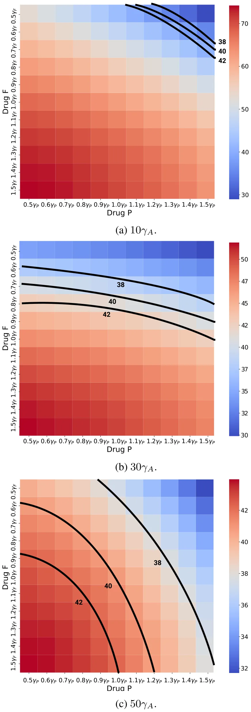
<figcaption><strong>Fig. 7.</strong> Cancer volume (<em>𝑚𝑚</em>3) after ten weeks under treatment <em>𝐼 𝑉</em> with variable doses of <em>𝐹</em> and <em>𝑃</em>.</figcaption>
</figure>

endothelial cells, and oxygen in order to express the angiogenesis effect of VEGF.

- 2. The ‘‘minimal’’ model still has many parameters; some were estimated (under some assumptions) or directly determined from

previous biological papers, some were assumed for this paper, and the remaining parameters were derived by fitting to experiments with mice inoculated with prostate cancer cells, which were treated with A, P, and F.

- 3. In order to simulate the dynamics of the cancer, in particular the movement of its boundary, we made the assumptions that the combined densities of all cells is constant in space and time (Eq. (1)), and that all cells move with same advection velocity.
- 4. Since the space of initial conditions is high dimensional, we limited our simulation to one set of initial conditions (Eq. (26)) and *𝑅*(0) = 0*.*05 cm. We expect a moderate change in the initial conditions will not significantly affect the results of the paper.
- 5. We assumed that drugs action is linear (e.g. *𝐴𝐶*, *𝑃 𝐶*, *𝐹 𝐶*𝑠), which is only justified under limited dosage.
- 6. We made a simplified assumption on the PK profile of the drugs, assuming exponential decrease, for instance, *𝑒*−𝛼 𝑡, where *𝛼* is the half-life of the drug.

A comprehensive review of prognostic implications of cellular senescence in many types of cancer is given in Domen et al. (2022), and comprehensive description of senolytic therapies is given in Schmitt et al. (2022). The methods developed in the present paper could be useful in the study of treatments and prognostics of other cancers with other combinations of chemotherapy and senolytic drugs.

## CRediT authorship contribution statement

**Teddy Lazebnik:** Writing – review & editing, Visualization, Software, Methodology, Investigation, Formal analysis. **Avner Friedman:** Writing – original draft, Validation, Methodology, Investigation, Formal analysis, Conceptualization.

## Declaration of competing interest

The authors declare that they have no known competing financial interests or personal relationships that could have appeared to influence the work reported in this paper.

## Appendix A

**Computational method:** We employed the moving mesh method (Verwer and Sommeijer, 2004) in conjunction with a refined Explicit Runge–Kutta method of order 5(4), utilizing the Scipy library in Python (Langtangen and Logg, 2016). The method’s higher order (5(4)) signifies that it uses an embedded fourth-order method to estimate the error, facilitating adaptive step size adjustments to improve accuracy in solving PDEs. Notably, for free-boundary equations, the boundary is updated at each step of the Runge–Kutta method. The free boundary is moved from one step to the next by updating the position (*𝑥*) based on the velocity *𝑣*(*𝑥*) and the time step *ℎ*. This process involves evaluating *𝑣*(*𝑥*) at the boundary point and then shifting the boundary accordingly.

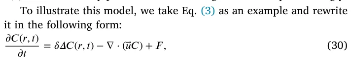

where *𝐹* represents the term on the right-hand side of Eq. (3). Let *𝑟*𝑖 𝑘 and *𝑐*𝑖 𝑘 denote numerical approximations of the *𝑖*𝑡ℎ grid point and *𝐶*(*𝑟*𝑖 𝑘*, 𝑛𝜏*), respectively, where *𝜏* is the time-step size. The discretization of Eq. (30) is derived using the fully implicit finite difference scheme obtained from the Runge–Kutta method mentioned above. The mesh moves according to *𝑟*𝑖 𝑘+1 = *𝑟*𝑖 𝑘 + *𝑢*𝑖 𝑘+1*𝜏* where *𝑢*𝑖 𝑘+1 is determined by the velocity equation. To ensure the stability of the scheme, we take *𝜏* ≤ *ℎ*2∕4*𝛿*.

## Appendix B

**Parameter fitting procedure:** To use the proposed model, biologically relevant parameter values must be identified. Initially, known parameters from the literature were used to estimate most values, as described in Table 2. For the remaining parameters, an equilibrium (steady state) analysis provided initial estimates. These values were refined using tumor volume data over time from (Mukhtar et al., 2016; Guerrero et al., 2013). A heuristic optimization process, combining the Monte Carlo and Genetic Algorithm (GA), was employed to fit the parameter values to the data.

Genetic algorithms (GAs) are optimization methods inspired by evolution, where solutions (chromosomes) achieving higher fitness function scores are more likely to be selected for the next generation (Holland, 1992). The algorithm involves mutation, crossover, and selection operators iteratively until a stopping condition is met, producing the chromosome with the highest fitness value as the output. In addition, the Monte Carlo (MC) method uses random sampling to approximate solutions to complex problems, particularly effective in high-dimensional spaces (Murtha, 1997).

Based on these two algorithms, the optimization process proceeds as follows: In the GA, a chromosome represents the parameter values to be fitted to biological data. The mutation operator randomly alters chromosome values, followed by the ring crossover operator (Davis, 1985) and the tournament with royalty selection operator (Bo et al., 2006). The fitness function, defined as the coefficient of determination between the model’s predicted cancer volume and the biological data, is calculated for each chromosome. The GA may converge to local minima, so the MC method is used alongside to achieve a more global minimum. The initial GA population is sampled from a pre-defined range, and the GA conducts searches for different initial conditions. The best result from all MC repetitions is taken as the final output, ensuring a more global minimum rather than a single GA run.

## Appendix C

**Sensitivity analysis :** We performed sensitivity analysis with respect to tumor volume at day 15, using a set of parameters that represent production, proliferation, degradation, and killing rates. The computations were done using Latin Hypercube sampling/Partial Rank Correlation Coefficient (LHS/PRCC) with Matlab package (Marino et al., 2008; Kirschner et al., 2016). The range of parameters was ±50% their baseline in Table 2. We retained parameters exhibiting significant PRCC and *𝑝*-value below 0.1.

Fig. 8 shows the results of this analysis for *𝑛* = 10*,* 000 samples in the control case, and Fig. 9 shows the results for *𝑛* = 10*,* 000 samples in the case of combined therapy, *𝐹* + *𝑃* + *𝐴*.

Fig. 8 shows that *𝜆*𝐶 𝑊 and *𝜆*𝐶 𝐶𝑠 are positively correlated; indeed, if these parameters increase then, respectively, *𝐶*, *𝐶*𝑠 increase. The parameters *𝜆*𝑊 𝐸 and *𝜆*𝑉 𝑊 are also positively correlated, since if they increase then oxygen supply to the cancer cells increases. *𝑇* cells kill cancer cells, hence *𝜇*𝑇 𝐶 is negatively correlated, and so is the growth rate *𝜆*𝑇 of T. Since *𝐼* activates *𝑇* cells, *𝜆*𝐼 𝐷 is negatively correlated, and *𝑑*𝑇 𝐼 is positively correlated. If *𝜆*𝐷 is increased then *𝐷* will increase, and so also *𝐼*; hence *𝜆*𝐷 is negatively correlated. Finally, *𝑑*𝐸 𝑉 is positively correlated, since if it is increased then VEGF is decreased.

Fig. 9 shows that *𝜇*𝐹, *𝜇*𝑃, and *𝜇*𝐴 are positively correlated. Indeed, when these parameters increase then the washout rates of the drugs increase, and the efficacy of drugs will be reduced. If *𝜇*𝑃 𝑇 is increased then *𝑇* is decreased, and if *𝜇*𝐹 𝑉 is increased then VEGF is decreased; hence both parameters are positively correlated. If *𝜆*𝑃 𝐶𝑠*, 𝜆*𝐴𝐶𝑠, and *𝜆*𝑃 𝐶 are increased then *𝐶*𝑠 is increased, and if *𝜇*𝐹 𝐶𝑠 is increased then *𝐶*𝑠 is decreased, hence *𝜆*𝑃 𝐶𝑠*, 𝜆*𝐴𝐶𝑆, and *𝜆*𝑃 𝐶 are positively correlated while *𝜇*𝐹 𝐶𝑠 is negatively correlated. Finally, the parameters *𝜇*𝐶𝑠𝐹*, 𝜇*𝑉 𝑃*, 𝜇*𝐶 𝑃*, 𝜇*𝑇 𝑃, and *𝜇*𝐶 𝐴 are positively correlated since if they increase then the drugs *𝐹* + *𝑃* + *𝐴* are decreased.

<figure id="fig-8">
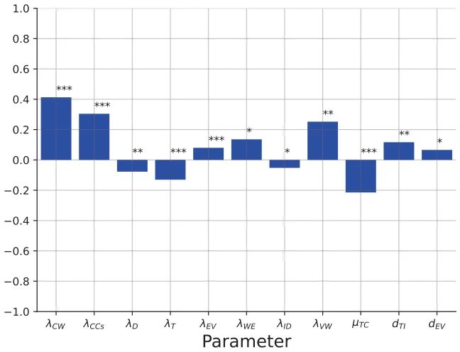
<figcaption><strong>Fig. 8.</strong> Parameter sensitivity analysis for the tumor volume at day 15 with all the activation, transition, and absorption parameters. We marked each parameter by ∗<em>,</em> ∗∗, and ∗∗∗ corresponding to <em>𝑝 &lt;</em> 0<em>.</em>1<em>,</em> 0<em>.</em>05, and 0.01.</figcaption>
</figure>

<figure id="fig-9">
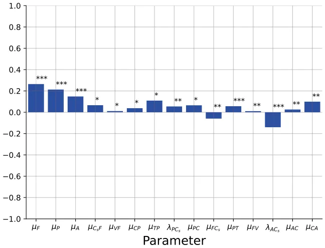
<figcaption><strong>Fig. 9.</strong> Parameter sensitivity analysis for the tumor volume at day 15 for the drug-related parameters. We marked each parameter by ∗<em>,</em> ∗∗, and ∗∗∗ corresponding to <em>𝑝 &lt;</em> 0<em>.</em>1<em>,</em> 0<em>.</em>05, and 0.01.</figcaption>
</figure>

## References

- Alzheimer’s Drug Discovery Foundation, 2018. Fisetin. Cognative Vitality. [link](http://refhub.elsevier.com/S0022-5193%2825%2900035-9/sb1)
- Andren, O., Widmark, A., Falt, A., Ulvskog, E., Davidsson, S., Thellenberg Karlsson, C., Hjalm-Eriksson, M., 2017. Cabazitaxel followed by androgen deprivation therapy (ADT) significantly improves time to progression in patients with newly diagnosed metastatic hormone sensitive prostate cancer (mHSPC): A randomized, open label, phase III, multicenter trial. Ann. Oncol. 28. [link](http://refhub.elsevier.com/S0022-5193%2825%2900035-9/sb2)
- Anon, 2024a. Cabazitaxel dosage. Drugs. Com. [link](http://refhub.elsevier.com/S0022-5193%2825%2900035-9/sb3)
- Anon, 2024b. Enzalutamide (oral route). Mayo Clin.. [link](http://refhub.elsevier.com/S0022-5193%2825%2900035-9/sb4)
- Blute, M.L., Jr., N., Wagner, J., Yang, B., Gleave, M., Fazli, L., Shi, F., Abel, E.J., Downs, T.M., Huang, W., Jarrard, D.F., 2017. Persistence of senescent prostate cancer cells following prolonged neoadjuvant androgen deprivation therapy. PLoS One 12 (2), e0172048. [link](http://refhub.elsevier.com/S0022-5193%2825%2900035-9/sb5)
- Bo, Z.W., Hua, L.Z., Yu, Z.G., 2006. Optimization of process route by genetic algorithms. Robot. Comput.-Integr. Manuf. 22, 180–188. [link](http://refhub.elsevier.com/S0022-5193%2825%2900035-9/sb6)
- Carmeliet, P., 2005. VEGF as a key mediator of angiogenesis in cancer. Oncology 69, 4–10. [link](http://refhub.elsevier.com/S0022-5193%2825%2900035-9/sb7)
- Carpenter, V., Saleh, T., Min Lee, S., Murray, G., Reed, J., Souers, A., Faber, A.C., Harada, H., Gewirtz, D.A., 2021. Androgen-deprivation induced senescence in prostate cancer cells is permissive for the development of castration-resistance but susceptible to senolytic therapy. Biochem. Pharmacol. 193, 114765. [link](http://refhub.elsevier.com/S0022-5193%2825%2900035-9/sb8)
- Chen, D., Rode, J.M., MArsh, C.B., Eubank, T.D., Friedman, A., 2012. Hypoxia inducible factors-mediated inhibition of cancer by GM-CSF: A mathematical model. Bull. Math. Biol. 74 (11), 2752–2777. [link](http://refhub.elsevier.com/S0022-5193%2825%2900035-9/sb9)
- Das, R.K., O’Conner, R.S., Grupp, S.A., Barrett, D.M., 2020. Lingering effects of chemotherapy on mature T-cells impair proliferation. Blood Adv. 4. [link](http://refhub.elsevier.com/S0022-5193%2825%2900035-9/sb10)
- Davis, L., 1985. Applying adaptive algorithms to epistatic domains. Proc. Int. Jt. Conf. Artif. Intell. 162–164. [link](http://refhub.elsevier.com/S0022-5193%2825%2900035-9/sb11)
- Davis, I.D., 2022. Combination therapy in metastatic hormone-sensitive prostate cancer: is three a crowd? Ther. Adv. Med. Oncol. 29 (14). [link](http://refhub.elsevier.com/S0022-5193%2825%2900035-9/sb12)
- Domen, A., Deben, C., Verswyvel, J., Flieswasser, T., Prenen, H., Peeters, M., Lardon, F., Wouters, A., 2022. Cellular senescence in cancer: clinical detection and prognostic implications. J. Exp. Clin. Cancer Res. 41, 360. [link](http://refhub.elsevier.com/S0022-5193%2825%2900035-9/sb13)
- Ewald, J.A., Desotelle, J.A., Church, D.R., Yang, B., Huang, W., Laurila, T.A., Jarrard, D.F., 2013. Androgen deprivation induces senescence characteristics in prostate cancer cells in vitro and in vivo. Prostate 73 (4), 337–345. [link](http://refhub.elsevier.com/S0022-5193%2825%2900035-9/sb14)
- Fan, Y., Cheng, J., Zeng, H., Shao, L., 2020. Senescen cell depletion through targeting BCL-family proteins and mitochondria. Front. Physiol.. [link](http://refhub.elsevier.com/S0022-5193%2825%2900035-9/sb15)
- Ferre-Torres, J., Noguera-Monteagudo, A., Lopez-Canosa, A., Romero-Arias, J.R., Barrio, R., Castano, O., Hernandez-Machado, A., 2023. Modelling of chemotactic sprouting endothelial cells through an extracellular matrix. Front. Bioen. Biotechnol. 11, 1145550. [link](http://refhub.elsevier.com/S0022-5193%2825%2900035-9/sb16)
- Forys, U., Nahshony, A., Elishmereni, M., 2022. Mathematical model of hormone sensitive prostate cancer treatment using leuprolide: A small step towards personalization. PLoS One 17 (2), e0263648. [link](http://refhub.elsevier.com/S0022-5193%2825%2900035-9/sb17)
- Friedman, A., Hao, W., 2018. The role of exosomes in pancreatic cancer microenvironment. Bull. Math. Biol. 80, 1111–1133. [link](http://refhub.elsevier.com/S0022-5193%2825%2900035-9/sb18)
- Gibbons, J.A., Ouatas, T., Krauwinkel, W., Ohtsu, Y., vad det Walt, J.-S., Beddo, V., de Vries, M., Mordenti, J., 2015. Clinical pharmacokinetic studies of enzalutamide. Clin. Pharmacokinet. 54, 1043–1055. [link](http://refhub.elsevier.com/S0022-5193%2825%2900035-9/sb19)
- Guerrero, J., Alfaro, I.E., Gómez, F., Protter, A.A., Bernales, S., 2013. Enzalutamide, an androgen receptor signaling inhibitor, induces tumor regression in a mouse model of castration-resistant prostate cancer. Prostate 73 (12), 1291–1305. [link](http://refhub.elsevier.com/S0022-5193%2825%2900035-9/sb20)
- Hao, W., Friedman, A., 2016. Serum uPAR as biomarker in breast cancer recurrence: A mathematical model. Plos One 11 (4), e0153508. [link](http://refhub.elsevier.com/S0022-5193%2825%2900035-9/sb21)
- Henry, C.J., Ornelles, D.A., Mitchell, L.M., Brzoza-Lewis, K.L., Hiltbold, E.M., 2008. IL-12 produced by dendritic cells augments CD8+T cell activation through the production of the chemokines CCL1 and CCL171. J. Immunol. 181 (12). [link](http://refhub.elsevier.com/S0022-5193%2825%2900035-9/sb22)
- Holland, J.H., 1992. Genetic algorithms. Sci. Am. 267 (1), 66–73. [link](http://refhub.elsevier.com/S0022-5193%2825%2900035-9/sb23)
- Huang, W., Hickson, L.J., Eirin, A., Kirkland, J.L., Lerman, L.O., 2022. Cellular senescence: the good, the bad, and the unknown. Nat. Rev. Nephrol. 18, 611–627. [link](http://refhub.elsevier.com/S0022-5193%2825%2900035-9/sb24)
- JEVTANA, 2010. Cabazitaxel. Cent. Drug Eval. Res. 201023, 1–71. [link](http://refhub.elsevier.com/S0022-5193%2825%2900035-9/sb25)
- Kallenbach, J., Atri Roozbahani, G., Heidari Horestani, M., Baniahmad, A., 2022. Distinct mechanisms mediating therapy-induced cellular senescence in prostate cancer. Cell & Biosci. 12 (1), 200. [link](http://refhub.elsevier.com/S0022-5193%2825%2900035-9/sb26)
- Karantanos, T., Corn, P.G., Thompson, T.C., 2013. Prostate cancer progression after androgen deprivation therapy: mechanisms of castrate resistance and novel therapeutic approaches. Oncogene 32 (49), 5501–5511. [link](http://refhub.elsevier.com/S0022-5193%2825%2900035-9/sb27)
- Katongole, P., Sande, O.J., Nabweyambo, S., Joloba, M., Kajumbula, H., Kalungi, S., Reynolds, S.J., Ssebambulidde, K., Atuheirwe, M., Orem, J., Niyonzima, N., 2022. IL-6 and IL-8 cytokines are associated with elevated prostate-specific antigen levels among patients with adenocarcinoma of the prostate at the uganda cancer institute. Futur. Oncol. 18 (6), 661–667. [link](http://refhub.elsevier.com/S0022-5193%2825%2900035-9/sb28)
- Kawata, H., Kamiakito, T., Nakaya, T., Komatsubara, M., Komatsu, K., Morita, T., Nagao, Y., Tanaka, A., 2017. Stimulation of cellular senescent processes, including secretory phenotypes and anti-oxidant responses, after androgen deprivation therapy in human prostate cancer. J. Steroid Biochem. Mol. Biology 165, 219–227. [link](http://refhub.elsevier.com/S0022-5193%2825%2900035-9/sb29)
- Kirschner, H., Hilbert, K., Hoyer, J., Lueken, U., Beesdo-Baum, K., 2016. Psychophsyi-ological reactivity during uncertainty and ambiguity processing in high and low worriers. J. Behav. Ther. Exp. Psychiatry 50, 97–105. [link](http://refhub.elsevier.com/S0022-5193%2825%2900035-9/sb30)
- Lai, X., Friedman, A., 2017. Combination therapy of cancer with cancer vaccine and immune checkpoint inhibitors: A mathematical model. Plos One 12 (5), e0178479. [link](http://refhub.elsevier.com/S0022-5193%2825%2900035-9/sb31)
- Lai, X., Friedman, A., 2019. How to schedule VEGF and PD-1 inhibitors in combination cancer therapy? BMC Syst. Biology 13 (30). [link](http://refhub.elsevier.com/S0022-5193%2825%2900035-9/sb32)
- Lai, X., Stiff, A., Duggan, M., Wesolowski, R., Carson III, W.E., Friedman, A., 2018. Modeling combination therapy for breast cancer with BET and immune checkpoint inhibitors. PNAS 115 (21), 5534–5539. [link](http://refhub.elsevier.com/S0022-5193%2825%2900035-9/sb33)
- Langtangen, H.P., Logg, A., 2016. Solving PDEs in python. In: Simula SpringerBriefs on Computing, Springer Cham, XI, 146. [link](http://refhub.elsevier.com/S0022-5193%2825%2900035-9/sb34)
- Liao, K.-L., Bai, X.-F., Friedman, A., 2014. Mathematical modeling of interleukin-27 induction of anti-tumor T cells response. Plos One 9 (3), e91844. [link](http://refhub.elsevier.com/S0022-5193%2825%2900035-9/sb35)
- Lorenzo, G.D., Scafuri, L., Costabile, F., Pepe, L., Scognamiglio, A., Crocetto, F., Guerra, G., Buonerba, C., 2022. Fisetin as an adjuvant treatment in prostate cancer patients receiving androgen-deprivation therapy. Futur. Sci. OA 8 (3), FSO784. [link](http://refhub.elsevier.com/S0022-5193%2825%2900035-9/sb36)
- Malayaperumal, S., Marotta, F., Kumar, M.M., Somasundaram, I., Ayala, A., Pinto, M.M., Banerjee, A., Pathak, S., 2023. The emerging role of senotherapy in cacner: A comprehensive review. Clin. Pr. 68, 838–852. [link](http://refhub.elsevier.com/S0022-5193%2825%2900035-9/sb37)
- Marino, S., Hogue, I.B., Ray, C.J., Kirschner, D.E., 2008. A methodology for performing global uncertainty and sensitivity analysis in systems biology. J. Theoret. Biol. 254 (1), 178–196. [link](http://refhub.elsevier.com/S0022-5193%2825%2900035-9/sb38)
- Mukhtar, E., Adhami, V.M., Siddiqui, I.A., Verma, A.K., Mukhtar, H., 2016. Fisetin enhances chemotherapeutic effect of cabazitaxel against human prostate cancer cells. Mol. Cancer Ther. 15 (12), 2863–2874. [link](http://refhub.elsevier.com/S0022-5193%2825%2900035-9/sb39)
- Murtha, J.A., 1997. Monte Carlo simulation: Its status and future. J. Pet. Technol. 49 (04), 361–373. [link](http://refhub.elsevier.com/S0022-5193%2825%2900035-9/sb40)
- Niederlova, V., Tsyklauri, O., Kovar, M., Stepanek, O., 2023. IL-2-driven CD8+T cell phenotypes: implications for immunotherapy. Trends Immunol. 44 (11), 890–901. [link](http://refhub.elsevier.com/S0022-5193%2825%2900035-9/sb41)
- Pardella, E., Pranzini, E., Nesi, I., Parri, M., Spatafora, P., Torre, E., Muccilli, A., Castiglione, F., Fambrini, M., Sorbi, F., Cirri, P., Caselli, A., Puhr, M., Klocker, H., Serni, S., Raugei, G., Magherini, F., Taddei, M.L., 2022. Therapy-induced stromal senescence promoting aggressiveness of prostate and ovarian cancer. Cells 11 (24), 4026. [link](http://refhub.elsevier.com/S0022-5193%2825%2900035-9/sb42)
- Park, K., Kim, J.Y., Park, I., Shin, S.H., Lee, H.J., Lee, J.L., 2023. Effectiveness of adding docetaxel to androgen deprivation therapy for metastatic hormone-sensitive prostate cancer in Korean real-world practice. Yonsei Med. J. 54 (2), 86–93. [link](http://refhub.elsevier.com/S0022-5193%2825%2900035-9/sb43)
- Phan, T., Crook, S.M., Bryce, A.H., Maley, C.C., Kostelich, E.J., Kuang, Y., 2020. Review: Mathematical modeling of prostate cancer and clinical application. Appl. Sci. 10 (8), 2721. [link](http://refhub.elsevier.com/S0022-5193%2825%2900035-9/sb44)
- Pungsrinont, T., Sutter, M.F., Ertingshausen, M.C.C.M., Lakshmana, G., Kokal, M., Khan, A.S., Baniahmad, A., 2020. Senolytic compounds control a distinct fate of androgen receptor agonist- and antagonist-induced cellular senescent LNCaP prostate cancer cells. Cell Biosci. 10 (59). [link](http://refhub.elsevier.com/S0022-5193%2825%2900035-9/sb45)
- Qaed, E., Al-Hamyari, B., Al-Maamari, A., Qaid, A., Alademy, H., Almoiliqy, M., Munyemana, J.C., Al-Nusaif, M., Alafifi, J., Alyafeai, E., Safi, M., Geng, Z., Tang, Z., Ma, X., 2023. Fisetin’s promising antitumor effects: Uncovering mechanisms and targeting for future therapies. Glob. Med. Genet. 10 (3), 205–220. [link](http://refhub.elsevier.com/S0022-5193%2825%2900035-9/sb46)
- Salim, S.S., Mureithi, E., Shabanm, N., Malinzi, J., 2021. Mathematical modelling of the dynamics of prostate cancer with a curative vaccine. Sci. Afr. 11, e00715. [link](http://refhub.elsevier.com/S0022-5193%2825%2900035-9/sb47)
- Schmitt, C.A., Wang, B., Demaria, M., 2022. Senescence and cancer — role and therapeutic opportunities. Nat. Rev. Clin. Oncol. 19, 619–636. [link](http://refhub.elsevier.com/S0022-5193%2825%2900035-9/sb48)
- Siewe, N., Friedman, A., 2022. Combination therapy for mCRPC with immune checkpoint inhibitors, ADT and vaccine: A mathematical model. PLoS One 17 (1), e0262453. [link](http://refhub.elsevier.com/S0022-5193%2825%2900035-9/sb49)
- Slewe, N., Friedman, A., 2022. Optimal timing of steroid initiation in response to CTLA-4 antibody in metastatic cancer: A mathematical model. Plos One 17 (11), e0277248. [link](http://refhub.elsevier.com/S0022-5193%2825%2900035-9/sb50)
- Sweeney, C.J., Chen, Y.-H., Carducci, M., Liu, G., Jarrard, D.F., Eisenberger, M., Wong, Y.N., Hahn, N., Kohli, M., Cooney, M.M., Dreicer, R., Vogelzang, N.J., Pi-cus, J., Shevrin, D., Hussain, M., Garcia, J.A., DiPaola, R.S., 2015. Chemohormonal therapy in metastatic hormone-sensitive prostate cancer. N. Engl. J. Med. 373 (8), 737–746. [link](http://refhub.elsevier.com/S0022-5193%2825%2900035-9/sb51)
- Takahashi, S., Bhattacharjee, S., Ghosh, S., Sugimoto, N., Bhowmik, S., 2020. Preferential targeting cancer-related i-motif DNAs by the plant flavonol fisetin for theranostics applications. Sci. Rep. 10, 2504. [link](http://refhub.elsevier.com/S0022-5193%2825%2900035-9/sb52)
- Underwood, R., 2023. What is fisetin? Benefits, dosage, and risks. VitalityPro. [link](http://refhub.elsevier.com/S0022-5193%2825%2900035-9/sb53)
- Verwer, J.G., Sommeijer, B.P., 2004. An implicit-explicit Runge–Kutta–Chebyshev scheme for diffusion-reaction equations. SIAM J. Sci. Comput. 25 (5), 1824–1835. [link](http://refhub.elsevier.com/S0022-5193%2825%2900035-9/sb54)
- Viallard, J.F., Pellegrin, J.L., Ranchin, V., Schaeverbeke, T., Dehais, J., Longy- Boursier, M., Ragnaud, J.M., Leng, B., Moreau, J.F., 1999. Th1 (IL-2, interferon-gamma (IFN-gamma)) and Th2 (IL-10, IL-4) cytokine production by peripheral blood mononuclear cells (PBMC) from patients with systemic lupus erythematosus (SLE). Clin. Exp. Immunol. 115 (1), 189–195. [link](http://refhub.elsevier.com/S0022-5193%2825%2900035-9/sb55)
- Wang, B., Kohil, J., Demaria, M., 2020. Senescent cells in cancer therapy: Friends or foes. Trends Cancer 6 (10), 838–857. [link](http://refhub.elsevier.com/S0022-5193%2825%2900035-9/sb56)
- Wyld, L., I., B., Tchkonia, T., Morgan, J., Turner, O., Foss, F., George, J., Danson, S., Kirkland, J.L., 2020. Senescence and cancer: A review of clinical implications of sensescence and senotherapies. Cancers. [link](http://refhub.elsevier.com/S0022-5193%2825%2900035-9/sb57)
- Xu, M.Y., Xia, Z.Y., Sun, J.X., Liu, C.Q., An, Y., Xu, J.Z., Zhang, S.H., Zhong, X.Y., Zeng, N., Ma, S.Y., He, H.D., Wang, S.G., Xia, Q.D., 2024. A new perspective on prostate cancer treatment: the interplay between cellular senescence and treatment resistance. Front. Immunol. 15, 1395047. [link](http://refhub.elsevier.com/S0022-5193%2825%2900035-9/sb58)
- Yang, J., Liu, M., Hong, D., Zeng, M., Zhang, X., 2021. The paradoxical role of cellular senescence in cancer. Front. Cell Dev. Biol. 722205. [link](http://refhub.elsevier.com/S0022-5193%2825%2900035-9/sb59)
- Zhang, J., Cunningham, J., Brown, J., Gatenby, R., 2022. Evolution-based mathematical models significantly prolong response to abiraterone in metastatic castrate-resistant prostate cancer and identify strategies to further improve outcomes. ELife 11, e76284. [link](http://refhub.elsevier.com/S0022-5193%2825%2900035-9/sb60)
- Zhou, C., Huang, Y., Nie, S., Zhou, S., Gao, X., Chen, G., 2023. Biological effects and mechanisms of fisetin in cancer: a promising anti-cancer agent. Eur. J. Med. Res. 28, 297. [link](http://refhub.elsevier.com/S0022-5193%2825%2900035-9/sb61)
- Zhu, Y., Doornebal, E.J., Pirtskhalava, T., Giorgadze, N., Wentworth, M., Fuhrmann- Stroissnigg, H., Neidernhofer, L.J., Robbins, P.D., Tchkonia, T., Kirkland, J.L., 2017. New agents that target senescent cells: the flavone, fisetin, and the BCL-XL inhibitors, A1331852 and A1155463. Aging 9. [link](http://refhub.elsevier.com/S0022-5193%2825%2900035-9/sb62)
