## 1. Introduction

Cellular senescence is a state in which cells stop dividing but sustain viability. Senescence is a primary hallmark of aging; it is triggered by factors such as telomere alteration, epigenetic degradation, DNA (Deoxyribonucleic acid) damage, and mitochondria dysfunction. Senescence in cancer is also triggered by cell stress, tumor suppression of gene activation, and oncogene activity [1].

Senescent cells in cancer may be either pro-cancer or anti-cancer [2, 3]. Senescent cells secrete senescence-associated secretory phenotype (SASP), a collection of proteins, some are anti-tumor and others are pro-tumor, depending on the specific tumor and its microenvironment [1,4]. Senescent cells have been reported in tumor mass of various cancers, in particular in tumor mass of lung cancer [5,6]. SASP from senescent cells of several cell-lines of lung cancer include pro-cancer VEGF [7–9]. Senolytic drugs are drugs that selectively kill senescent cells, or block their SASP. Senotherapy is a therapy with senolytic drugs. A review of senotherapy with different senotytic drugs is presented in [1,9]. Two of these drugs are Desatinib + Quertin and fisetin. In particular, studies of lung cancer in which VEGF is secreted from senescent cells show that fisetin is anti-angiogenesis [7–9]. Chemotherapy may cause cell death, often by apoptosis, but may also cause cell senescence [1]. This suggests that a senolytic drug has the ability to improve chemotherapy treatment in lung cancer. In fact, this was demonstrated in a mouse model with fisetin and cyclophosphamide [7], and in co-encapsulation of fisetin and cisplatin [10]. Cyclophosphamide is used to treat several different cancers, including myeloma, breast cancer, and lung cancer [11], although it is not one of the most currently used chemotherapy drugs. Touil et al. [7] demonstrated that in mouse infected with Lewis’ lung cancer cell line and treated with cyclophosphamide and fisetin, combined treatment significantly increased tumor volume reduction, compared to treatment based on each of the components as a single agent.

There are a number of mathematical models of lung cancer, and most of them are represented by ordinary differential equations (ODEs). However, these do not include senescence. A recent model in [12] includes only cancer, macrophages, and fibroblasts; another recent model includes cancer, macrophages, and CD8+ T cells [13]. A 2023 review of ODE models is given in [14]. A model that includes signaling cascade within cancer cells and the role of microRNAs was studied in [15]. In [16], a model with three variables (cancer, enzyme, and extracellular matrix) was represented by partial differential equations (PDEs), and studied by discrete methods, cellular automata, and agent-based methods.

0025-5564/© 2024 Elsevier Inc. All rights are reserved, including those for text and data mining, AI training, and similar technologies.

<figure id="fig-1">
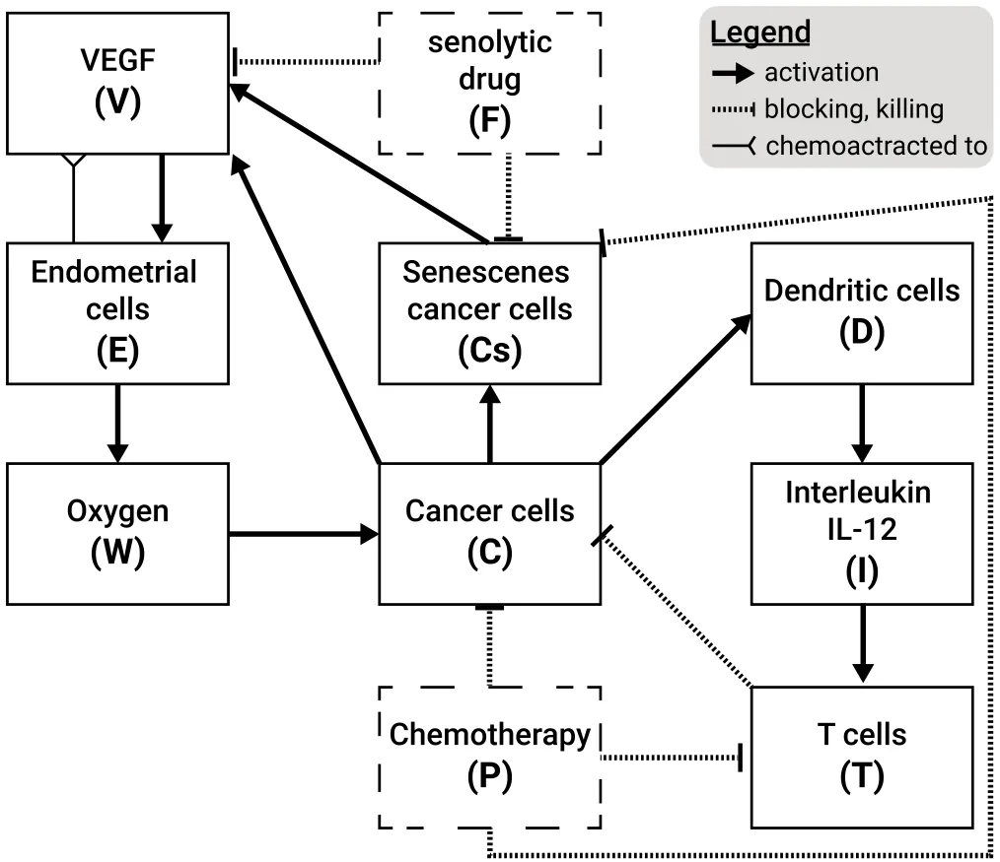
<figcaption><strong>Fig. 1.</strong> A schematic view of the biological model including five cell populations and five free chemicals. The treatment-related components are marked by dashed borders.</figcaption>
</figure>

## 2. Mathematical model

In this paper, we develop a mathematical model of lung cancer treatment with a combination of chemotherapy and a senolytic drug.

The model includes: cancer cells (*𝐶*), senescence cancer cells (*𝐶*𝑠), dendritic cells (*𝐷*), CD8+ T cells (*𝑇*), endothelial cells (*𝐸*), VEGF (*𝑉* ), Oxygen (*𝑊* ), Interleukin IL-12 (*𝐼*), the chemotherapy cyclophosphamide (*𝑃*), and the senolytic drug fisetin (*𝐹*). Table 1 lists the model variables in densities with units of g∕cm3.

Cancer cells (*𝐶*) can become senescence cells (*𝐶*𝑠); dendritic cells (*𝐷*) are activated by proliferating cancer cells (*𝐶*), and by proteins such as HMGB-1 from necrotic cancer cells. Activated dendritic cells secrete *𝐼*12, which leads to activation of CD8+ T cells (*𝑇*) that kill cancer cells (*𝐶*). On the other hand, cancer cells and senescent cancer cells (*𝐶*𝑠) secrete VEGF, which begins a process of angiogenesis by chemoat-tracting endothelial cells (*𝐸*) toward the tumor and by increasing their proliferation [17,18]. The newly formed blood capillaries increase the flow of oxygen (*𝑊* ) into the cancer microenvironment, which enables the cancer to keep growing. Chemotherapy (*𝑃*) kills cancer cells (*𝐶*) and T cells [19]. Senolytic drug (*𝐹*) eliminates senescent cells (*𝐶*𝑠), and blocks the production of VEGF by *𝐶* and *𝐶*𝑠. Fig. 1 shows the network of interactions among the model variables.

The mathematical model is represented by a system of partial differential equations (PDEs) within the tumor. We show that the model predictions are in agreement with the experimental results, in [7], of mouse treatment with cyclophosphamide and fisetin. We then demonstrate how the model can be used to assess the benefits of this therapy, in terms of tumor volume reduction, for any combination of the two drugs and any schedule of injections.

The model variables are listed in Table 1 in densities with units of g∕cm3.

The mathematical model is based on Fig. 1, and is represented by a system of PDEs within the tumor. The tumor region varies with time, and in order to solve the PDE system, we need to know how the unknown tumor boundary varies in time. To do that, we assume that the density of all the cells within the tumor region is constant over time, namely,

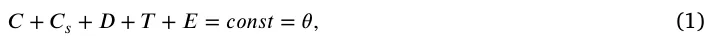

for some 0 *< 𝜃 <* 1. This assumption will be used to determine the dynamics of the ‘‘free’’ boundary of radially symmetric tumors. The movement of the tumor boundary and Eq. (1) imply a movement of cells that remain within the tumor; we assume that all these cells are moving with the same velocity*⃖⃗𝑢*. In addition, we also assume that all cells undergo dispersion (diffusion) with the same coefficient, *𝛿*. Following these assumptions and the biological network presented in Fig. 1, each cell type, denoted by *𝑋*, satisfies an equation of the following form:

<figure class="table-figure" id="table-1">
<figcaption><strong>Table 1</strong> A list of the model variables.</figcaption>

<table><tr><th>Variable</th><th>Definition</th></tr><tr><td>C</td><td>Cancer cells</td></tr><tr><td>𝐶𝑠</td><td>Senescent cancer cells</td></tr><tr><td>D</td><td>Dendritic cells</td></tr><tr><td>T</td><td>CD8+ T cells</td></tr><tr><td>E</td><td>Endothelial cells</td></tr><tr><td>V</td><td>Vascular endothelial growth factor (VEGF)</td></tr><tr><td>W</td><td>Oxygen</td></tr><tr><td>I</td><td>Interleukin 12 (IL-12)</td></tr><tr><td>P</td><td>Chemotherapy drug (cyclophosphamide)</td></tr><tr><td>F</td><td>Senlytic drug (fisetin)</td></tr></table>

</figure>

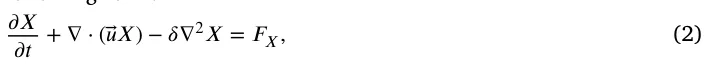

where *𝐹*𝑋 is determined by the sum of all the interactions of *𝑋* with the model variables, as indicated in Fig. 1.

An expression in *𝐹*𝑋 of the form *𝜆𝑋* 𝑌 𝐾+𝑌 (*𝐾* constant depending on *𝑌*) describes a process where species *𝑌* (e.g. proteins) is absorbed by cells *𝑋*, at rate coefficient *𝜆*. We denote the death rate (or degradation rate) of species *𝑋* by *𝑑*𝑋. The dynamics of *𝑉 , 𝐼*, and *𝑊* are similar to those of the cells. However, since their diffusion coefficients are much larger than those of cells (by several orders of magnitude), the effect of the velocity,*⃖⃗𝑢*, can be neglected.

## Equation for cancer cells (𝐶)

We proceed to represent the biological network in Fig. 1 by a system of PDEs.

We write the equation for *𝐶* in the following form:

*𝜕 𝐶 𝜕 𝑡* + ∇⋅(⃖⃗𝑢𝐶) −𝛿∇2𝐶 = 𝜆𝑊 (𝑊 )𝐶(1 − 𝐶 ) −*𝜇*𝑇 𝐶*𝑇 𝐶* −*𝜇*𝑃 𝐶*𝑃 𝐶* −*𝑑*𝐶*𝐶 ,* (3) *𝐶*0 where the first term on the right-hand side represents a logistic growth, with carrying capacity *𝐶*0, at oxygen-dependent rate {

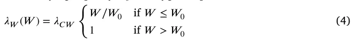

with threshold value *𝑊*0 and constant coefficient *𝜆*𝐶 𝑊 . The second term on the right-hand side of Eq. (3) accounts for the killing of cancer cells by T cells, and the third term represents the decrease in cancer cells by the chemotherapy drug *𝑃* (mostly are killed, but some become senescent).

**Equation for senescent cancer cells** (*𝐶*𝑠)

We write the equation for *𝐶*𝑠 as follows:

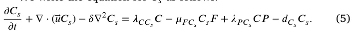

In the first term on the right hand side, *𝜆*𝐶 𝐶𝑠 represents the rate by which cancer cells become senescent under cell stress and oncogene activity [1]. The second term on the right-hand side accounts for the elimination of senescent cells by fisetin, and the third term represents the fact that, under chemotherapy, cancer cells become senescent (hence *𝜆*𝑃 𝐶𝑠 *< 𝜇*𝑃 𝐶). Chemotherapy kills the highly proliferating cancer cells during the cell cycle when they divide; since senescent cells do not divide, we do not include a killing term of *𝐶*𝑠 by *𝑃*.

## Equation for dendritic cells (𝐷)

Inactive dendritic cells, *𝐷*0, are activated by identifying special surface proteins on cancer cells, or proteins, such as HMGB-1, in necrotic cancer cells. We consider this activation process as an ‘‘eating’’ process by *𝐷*0 cells, and represent the rate of *𝐷*0 activation by the Michaelis–Menten law: *𝜆*𝐷*𝐷*0 𝐶 𝐾𝐶+𝐶, where *𝜆*𝐷 and *𝐾*𝐶 are constants. Hence,

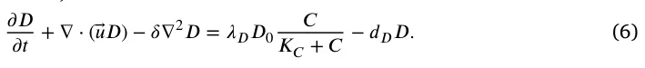

## Equation for CD8+ T cancer cells (𝑇)

We write the following equation for T:

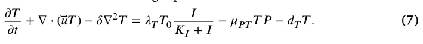

The first term on the right-hand side is the activation of inactive naive T cells, *𝑇*0, by *𝐼*. This is actually a simplification, since, first, *𝐼* activates the CD4+ T cells of type Th1, and then Th1 cells secrete IL-2, which activates the CD8+ T cells. The second term on the right-hand side of Eq. (7) represents the killing of T cells by the chemotherapy drug [19].

## Equation for endothelial cells (𝐸)

VEGF (*𝑉* ) promotes angiogenesis: it attracts endothelial cells, and also increases their proliferation when *𝑉* is above a threshold level *𝑉*0 [17,18]. Hence,

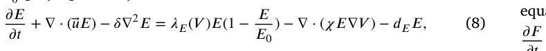

where *𝜒* is a chemotactic parameter, and *𝐸* proliferates with logistic growth at rate

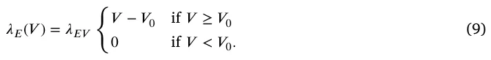

## Equation for oxygen (𝑊 )

The density of oxygen, or of blood, in a tissue is proportional to the density of endothelial cells. Accordingly, *𝜕 𝑊 𝜕 𝑡* − 𝛿𝑊 ∇2 𝑊 = 𝜆𝑊 𝐸𝐸 − 𝑑𝑊 𝑊 , (10)

where *𝛿*𝑊 is the diffusion coefficient of *𝑊* and *𝑑*𝑊 is the consumption rate of oxygen by all cells from Eq. (1), we assume that *𝑑*𝑊 is constant.

## Equation for 𝐼12 (𝐼)

*𝐼* is lost in the process of activating T. The binding process of *𝐼* proteins with receptors in T cells is limited by receptor recycling time. We express the binding rate of *𝐼* to T by the Michaelis–Menten law: *𝑇 𝑑*𝑇 𝐼*𝐼* 𝐾𝑇+𝑇 for some constants *𝑑*𝑇 𝐼 and *𝐾*𝑇. Hence,

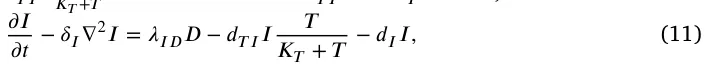

where *𝛿*𝐼 is the diffusion coefficient of *𝐼*, and *𝜆*𝐼 𝐷 is the production rate of *𝐼* by *𝐷*.

## Equation for VEGF (𝑉 )

VEGF (*𝑉* ) is secreted by *𝐶* and by *𝐶*𝑠 [7–9], at a rate that depends on the oxygen level, and fisetin reduces *𝑉* ; *𝑉* is also lost in the process of activating and increasing the proliferation of *𝐸*. The equation for *𝑉* takes the following form:

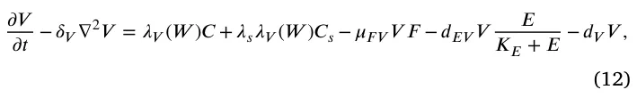

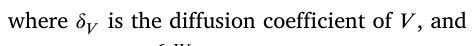

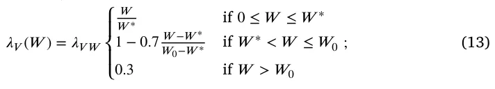

*𝑊*0 is the normal level of tissue oxygen, and *𝑊* ∗ is the hypoxia threshold of oxygen. By [8], the parameter *𝜆*𝑠 is larger than 1.

The elimination rate of drug *𝑁*, *𝑡*1∕2(*𝑁*), is the length of time it takes *𝑁* to decrease to half of its starting amount. Modeling elimination by *𝑑 𝑁* 𝑑 𝑡 = −*𝜈 𝑁 ,* we get *𝑁*(*𝑡*) = *𝑒*−𝜈 𝑡*𝑁*(0), which gives *𝜈* = 𝑙 𝑛(2) 𝑡1∕2(𝑁). Hence, if *𝑁* is injected at amount *𝛾*𝑁 at times *𝑡*1*, 𝑡*2*,* … *, 𝑡*𝑚, then the total injections level at any time *𝑡* can be represented by *𝛾*𝑁*𝑓*𝑁 ,𝜈(*𝑡*), where

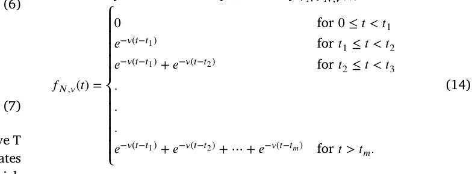

A percentage of injected drug *𝑁* is secreted in the urine unchanged. We model the rate of this drug washout by *𝜇*𝑁*𝑁*, with constant coefficient *𝜇*𝑁.

## Equation for fisetin (𝐹)

Fisetin is decreased in the process of eliminating *𝐶*𝑠 and in reducing *𝑉* , at rates *𝜇*𝐶𝑠𝐹 and *𝜇*𝑉 𝐹, respectively. Hence, we can write the equation for *𝐹* as follows:

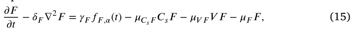

where *𝛿*𝐹 is the diffusion coefficient of *𝐹*, *𝜇*𝐹 is the washout coefficient of *𝐹*, and *𝑓*𝐹 ,𝛼 has a structure similar to *𝑓*𝑁 ,𝜈.

**Equation for chemotherapy** (*𝑃*)

Similarly, we write the equation of *𝑃* as follows:

*𝜕 𝑃 𝜕 𝑡* − 𝛿𝑃∇2𝑃 = 𝛾𝑃𝑓𝑃 ,𝛽(𝑡) − 𝜇𝐶 𝑃𝐶 𝑃 − 𝜇𝑇 𝑃𝑇 𝑃 − 𝜇𝑃𝑃 , (16)

where *𝑃* is injected at amount *𝛾*𝑃, and is consumed in the process of killing *𝐶* and T; *𝛿*𝑃 is the diffusion coefficient of *𝑃*, *𝜇*𝑃 is the washout *𝑙 𝑛*(2) coefficient of *𝑃*, *𝛽* = 𝑡1∕2(𝑃), and *𝑓*𝑃 ,𝛽(*𝑡*) has a structure similar to *𝑓*𝑁 ,𝜈.

**Equation for the radial velocity** (*𝑢*(*𝑟, 𝑡*))

Taking the sum of Eqs. ((3), (5)–(8)) and using Eq. (1), we get:

*𝜃*∇*⃖⃗𝑢* = *𝐻* (17)

where *𝐻* is the sum of the right-hand side of Eqs. (3)–(8). In the radially symmetric case, where*⃖⃗𝑢* is a given by a scalar function, *𝑢*(*𝑟, 𝑡*), Eq. (17) becomes:

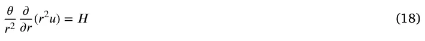

or

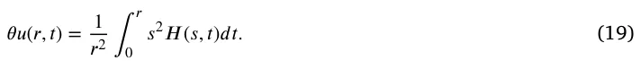

## Equation of the tumor radius (𝑅(𝑡))

From Eq. (19) it follows that the radius *𝑟* = *𝑅*(*𝑡*) of the tumor satisfies the following equation:

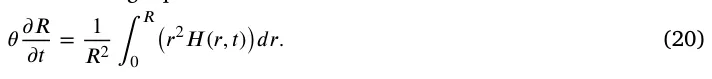

### 2.1. Boundary condition

T cells with density*̂ 𝑇* migrate from the lymph nodes into the tumor. This is represented by the boundary condition

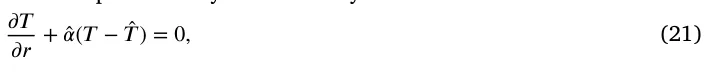

for some*̂ 𝛼 >* 0.

Endothelial cells*̂ 𝐸* are attracted by VEGF into the tumor; we represent the influx of *𝐸* by the boundary condition

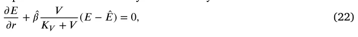

for some*̂ 𝛽 >* 0.

The exchange between oxygen from outside the tumor (*𝑊* 0) and inside the tumor (*𝑊* ) is represented by the boundary condition

*𝜕 𝑊 𝜕 𝑟* +̂ 𝛾(𝑊 − 𝑊0) = 0, (23)

for some*̂ 𝛾 >* 0. We assume no flux for *𝐷* and *𝐶*𝑠: *𝜕 𝐷 𝜕 𝑟* = 0, 𝜕 𝐶𝑠 *𝜕 𝑟* = 0. (24) The boundary condition for *𝐶* is then derived from Eq. (1), *𝐶* = *𝜃* − *𝐶*𝑠 − *𝐷* − *𝑇* − *𝐸* (25)

### 2.2. Initial condition

We take the following initial conditions in units of g∕cm3: *𝐷* = 2 ⋅ 10−4*, 𝑇* = 0*.*5 ⋅ 10−3*, 𝐸* = 4 ⋅ 10−3*, 𝑊* = 1*.*4 ⋅ 10−4*, 𝑉* = 2 ⋅ 10−8*, 𝐼* = 4 ⋅ 10−10*, 𝐶*𝑠 = 0*.*1*𝐶 ,* and *𝐶* = *𝜃* − *𝐶*𝑠 − *𝐷* − *𝑇* − *𝐸 .* (26)

We take *𝑅*(0) = 0*.*05 cm.

### 2.3. Parameters estimation

The computational methods are based on the Runge–Kutta scheme with moving mesh, as will be explained in Appendix A.

Many of the parameters have already been estimated in earlier papers, as seen in Table 2, and some were chosen for this work. All other parameters will be estimated by fitting the simulated profiles of tumor volume in the control case, and the cases of treatment with *𝐹 , 𝑃*, and *𝐹* + *𝑃*, to the profiles of the experimental data in [7] (Fig. 5) with mice model.

In order to estimate production parameters in an equation, we use the ‘‘steady state’’ assumption, by making the right-hand side of the equations equal to zero. We assume that, in ‘‘steady state’’, 𝐾𝑋+𝑋 = 1 *𝑋* 2 for each species *𝑋*, so that *𝑋* = *𝐾*𝑋 (the ‘‘half-saturation’’ of *𝑋*). We also assume that in steady state,

*𝛾*𝐹*𝑓*𝐹 ,𝛼 = *𝜆*𝐹*𝐹 , 𝛾*𝑃*𝑓*𝑃 ,𝛽 = *𝜆*𝑃*𝑃* for some parameters *𝜆*𝐹*, 𝜆*𝑃.

#### 2.3.1. Parameters in the control case

If *𝑊* ≥ *𝑊*0, the steady state of Eq. (3) gives the relation 0*.*5*𝜆*𝐶 𝑊 = *𝜇*𝑇 𝐶*𝐾*𝑇 + *𝑑*𝐶 = 0*.*6. But this value of *𝜆*𝐶 𝑊 needs to be increased, since cancer continues to grow in the no-drug case even if *𝑊* is below *𝑊*0. We take *𝜆*𝐶 𝑊 = 1*.*7∕*𝑑*.

The half-life of senescent cells is between 12 and 24 h [20]. Taking it to be approximately 16 h, we get *𝑑*𝐶𝑠 = 𝑙 𝑛2 0.75 = 0*.*92∕*𝑑*.

We assume that the fraction *𝐶*𝑠∕*𝐶* can vary from 5% to 20% and take it, in steady state, to be 10%. From the steady state of Eq. (5), we *𝐶𝑠* 𝐶 = 0*.*1*𝑑*𝑠 = 0*.*092∕*𝑑*. get *𝜆*𝐶 𝐶𝑆 = *𝑑*𝑠

For the steady state of Eq. (6), we get 0*.*5*𝜆*𝐷*𝐷*0 = *𝑑*𝐷*𝐾*𝐷. Hence, *𝜆*𝐷 = 2𝑑𝐷𝐾𝐷 = 4∕*𝑑*. *𝐷*0

- From the steady state of Eq. (7) we have, 0*.*5*𝜆*𝑇*𝑇*0 = *𝑑*𝑇*𝐾*𝑇, so that *𝜆*𝑇 = 2𝑑𝑇𝐾𝑇 = 1*.*8∕*𝑑*. *𝑇*0
- With *𝑉* ≥ *𝑉*0, the steady state of Eq. (8) takes the form *𝜆*𝐸 𝑉 *𝑉 𝐸*(1 − *𝐾𝐸* 𝐸0 ) = *𝑑*𝐸*𝐸*, where *𝐾*𝐸∕*𝐸*0 = 0*.*5. Hence, *𝜆*𝐸 𝑉 = 2𝑑𝐸 𝐾𝑉 = 1*.*87 ⋅ 107∕*𝑑*. From the steady state of Eq. (10), *𝜆*𝑊 𝐸*𝐸* = *𝑑*𝑊 *𝑊* , so that *𝜆*𝑊 𝐸 = *𝐾𝑊 𝑑*𝑊 𝐾𝐸 = 7*.*4 ⋅ 10−2∕*𝑑*, and by MCGA fitting we get *𝜆*𝑊 𝐸 = 9*.*13 ⋅ 10−2. Eq. (11) in steady state can be written as follows: *𝜆*𝐼 𝐷*𝐷* = (0*.*5*𝑑*𝑇 𝐼 + *𝑑*𝐼)*𝐼*. We take *𝑑*𝑇 𝐼 = 2*𝑑*𝐼 = 2*.*76∕*𝑑*, and then, *𝜆*𝐼 𝐷 = 2𝑑𝐼𝐾𝐼 = 5*.*52⋅10−6∕*𝑑*. *𝐾𝐷* From the steady state of Eq. (12), with *𝜆*𝑉 (*𝑊* ) ∼ *𝜆*𝑉 𝑊 ⋅ 0*.*2, we get 0*.*2*𝜆*𝑉 𝑊 (*𝐶* + *𝜆*𝑠*𝐶*𝑠) = (0*.*5*𝑑*𝐸 𝑉 + *𝑑*𝑉 )*𝑉* . Taking *𝑑*𝐸 𝑉 = 2*𝑑*𝑉 = 25*.*2∕*𝑑*, recalling that *𝐶* = 0*.*1*𝐶*𝑠 in steady state, and choosing *𝜆*𝑠 = 5, we get 2*𝑑𝑉 𝐾𝑉 𝜆*𝑉 𝑊 = 0.2𝐾𝐶⋅1.5 = 1*.*47 ⋅ 10−7∕*𝑑*.

#### 2.3.2. Drugs associated parameters

Fisetin half-elimination rate is *𝑡*1∕2(*𝐹*) = 3 h [21,22]. Hence, *𝛼* = *𝑙 𝑛*(2) 3∕24 = 5*.*32∕*𝑑*. Cyclophosphamide half-elimination rate is in the range of 3-12 h [11]. We take *𝑡*1∕2(*𝑃*) = 8 h, so that *𝛽* = 𝑙 𝑛(2) 8∕24 = 2*.*07∕*𝑑*.

The washout rate for cyalophaphamide is in the range of 5%– 25% [11]. Writing *𝑑 𝑃*∕*𝑑 𝑡* = −*𝜇*𝑃*𝑃*, we take *𝜇*𝑃 = 2∕*𝑑*, which corresponds to washout of approximately 14% a day. We also take *𝜇*𝐹 = 2∕*𝑑*.

Laboratory mouse’s average weight is 32 g. Fiseton is injected in [7] at 223 mg/kg. Assuming that 1 cm3 of tissue has an average weight of 1 g, the amount of injection of fisetin is *𝛾*𝐹 = 32 ⋅ 223 ⋅ 10−6 = 7*.*136 ⋅ 10−3 g∕cm3 d.

Similarly, cytophosphemide is injected in [7] at 30 mg∕k g, so that *𝛾*𝑃 = 32 ⋅ 30 ⋅ 10−6 = 9*.*6 ⋅ 10−4 g∕cm3 d.

Eqs. (15)–(16) in steady state take the following form: *𝜆*𝐹 = *𝜇*𝐶𝑠𝐹*𝐶*𝑠 + *𝜇*𝑉 𝐹*𝑉* + 2 (with *𝐶*𝑠 = 0*.*1*𝐶*) and *𝜆*𝑃 = *𝜇*𝐶 𝑃*𝐶* + *𝜇*𝑇 𝑃*𝑇* + 2.

We assume that *𝜇*𝐶𝑠𝐹*𝐶*∕10 = *𝜇*𝑉 𝐹*𝑉* in steady state, so that, with *𝐶* = *𝐾*𝐶 and *𝑉* = *𝐾*𝑉 we get 2 ⋅ 0*.*04*𝜇*𝐶𝑠𝐹 = 2 ⋅ 7 ⋅ 10−8*𝜇*𝑉 𝐹 = *𝜆*𝐹 − 2. Hence, *𝜇*𝐶𝑠𝐹 = 12*.*5(*𝜆*𝐹 − 2) cm3∕g d and *𝜇*𝑉 𝐹 = 7*.*4⋅10−6(*𝜆*𝐹 − 2) cm3∕g d. Similarly we assume that *𝜇*𝐶 𝑃*𝐶 𝑃* = *𝜇*𝑇 𝑃*𝑇* so that 2 ⋅ 0*.*4*𝜇*𝐶 𝑃 = 2 ⋅ 10−3*𝜇*𝑇 𝑃 = *𝜆*𝑃 − 2; hence *𝜇*𝐶 𝑃 = 1*.*25(*𝜆*𝑃 − 2) cm3∕g d and *𝜇*𝑇 𝑃 = 5 ⋅ 102(*𝜆*𝑃 − 2) cm3∕g d.

<figure class="table-figure" id="table-2">
<figcaption><strong>Table 2</strong> Summary of the model parameters with their values and sources; ‘‘estimated’’ means by ‘‘steady state’’, ‘‘by fitting’’ means by MCGA.</figcaption>

<table><tr><th>Parameter</th><th>Description</th><th>Value</th><th>Reference</th></tr><tr><td>𝛿</td><td>Diffusion coefficient of cells</td><td>8.64 ⋅10−3 cm2∕d</td><td>[23]</td></tr><tr><td>𝛿𝑊</td><td>Diffusion coefficient of oxygen</td><td>0.8 cm2∕d</td><td>[24]</td></tr><tr><td>𝛿𝐼</td><td>Diffusion coefficient of 𝐼12</td><td>6.05 ⋅10−2 cm2∕d</td><td>[25]</td></tr><tr><td>𝛿𝑉</td><td>Diffusion coefficient of VEGF</td><td>8.64 ⋅10−2 cm2∕d</td><td>[26]</td></tr><tr><td>𝑑𝐶</td><td>Death rate of cancer cells</td><td>0.1 d</td><td>[24]</td></tr><tr><td>𝑑𝐶𝑠</td><td>Death rate of senescent cancer cells</td><td>0.92 d</td><td>[20]</td></tr><tr><td>𝑑𝐷</td><td>Death rate of dendritic cells</td><td>0.1 d</td><td>[27]</td></tr><tr><td>𝑑𝑇</td><td>Death rate of CD8+ T cells</td><td>0.18 d</td><td>[27]</td></tr><tr><td>𝑑𝐸</td><td>Death rate of endothelial cells</td><td>0.69 d</td><td>[28]</td></tr><tr><td>𝑑𝑊</td><td>Takeup rate of oxygen by cells</td><td>1.04 d</td><td>[24]</td></tr><tr><td>𝑑𝐼</td><td>Degradation rate of 𝐼 𝐿− 12</td><td>1.38 d</td><td>[27]</td></tr><tr><td>𝑑𝑉</td><td>Degradation rate of VEGF</td><td>12.6 d</td><td>[28]</td></tr><tr><td>𝐶0</td><td>Carrying capacity of 𝐶</td><td>0.8 g∕cm3</td><td>[28]</td></tr><tr><td>𝐸0</td><td>Carrying capacity of 𝐸</td><td>5 ⋅10−3 g∕cm3</td><td>[27]</td></tr><tr><td>𝐷0</td><td>Density of immature dendritic cells</td><td>2 ⋅10−5 g∕cm3</td><td>[27]</td></tr><tr><td>𝑇0</td><td>Density of naive T cells</td><td>2 ⋅10−4 g∕cm3</td><td>[27]</td></tr><tr><td>𝑊0</td><td>Normal density of oxygen in tissue</td><td>4.65 ⋅10−4 g∕cm3</td><td>[29]</td></tr><tr><td>𝑊∗</td><td>Threshold of hypoxia</td><td>1.69 ⋅10−4 g∕cm3</td><td>[29]</td></tr><tr><td>𝑉0</td><td>Threshold VEGF concentration</td><td>3.65 ⋅10−10 g∕cm3</td><td>[28]</td></tr><tr><td>𝜒</td><td>Chemotartic parameter</td><td>0.8 cm5∕g d</td><td>[30]</td></tr><tr><td>𝜃</td><td>Total density of cells</td><td>0.406 g∕cm3</td><td>[24]</td></tr><tr><td>𝐾𝐶</td><td>Half-saturation of 𝐶</td><td>0.4 g∕cm3</td><td>[25]</td></tr><tr><td>𝐾𝐷</td><td>Half-saturation of 𝐷</td><td>4 ⋅10−4 g∕cm3</td><td>[24]</td></tr><tr><td>𝐾𝑇</td><td>Half-saturation of 𝑇</td><td>1 ⋅10−3 g∕cm3</td><td>[24]</td></tr><tr><td>𝐾𝐸</td><td>Half-saturation of 𝐸</td><td>2.5 ⋅10−3 g∕cm3</td><td>[28]</td></tr><tr><td>𝐾𝑊</td><td>Half-saturation of 𝑊</td><td>1.69 ⋅10−4 g∕cm3</td><td>[28]</td></tr><tr><td>𝐾𝐼</td><td>Half-saturation of 𝐼12</td><td>8 ⋅10−10 g∕cm3</td><td>[31]</td></tr><tr><td>𝐾𝑉</td><td>Half-saturation of 𝑉</td><td>7 ⋅10−8 g∕cm3</td><td>[28]</td></tr><tr><td>𝜆𝐶 𝑊</td><td>Growth rate of cancer cells</td><td>1.67∕d</td><td>estimated by fitting</td></tr><tr><td>𝜆𝐶 𝐶𝑠</td><td>Production rate of 𝐶𝑠</td><td>0.092∕d</td><td>estimated</td></tr><tr><td>𝜆𝐷</td><td>Production of 𝐷</td><td>1.18∕d</td><td>estimated by fitting</td></tr><tr><td>𝜆𝑇</td><td>Production of CD8+ 𝑇cells</td><td>1.43∕d</td><td>estimated by fitting</td></tr><tr><td>𝜆𝐸 𝑉</td><td>Production of 𝐸cells</td><td>1.87 ⋅107∕d</td><td>estimated</td></tr><tr><td>𝜆𝑊 𝐸</td><td>Production of 𝑊</td><td>9.13 ⋅10−2∕d</td><td>estimated by fitting</td></tr><tr><td>𝜆𝐼</td><td>Production of 𝐼12</td><td>5.52 ⋅10−6∕d</td><td>estimated</td></tr><tr><td>𝐷 𝜆𝑉 𝑊</td><td>Production of 𝑊</td><td>2.35 ⋅10−7∕d</td><td>estimated by fitting</td></tr><tr><td>𝜇𝑇 𝐶</td><td>Killing rate of 𝐶by 𝑇</td><td>500 cm3∕g d</td><td>This work</td></tr><tr><td>𝑑𝑇 𝐼</td><td>Loss rate of 𝐼12 by 𝑇</td><td>2.76∕d</td><td>This work</td></tr><tr><td>𝑑𝐸 𝑉</td><td>Loss rate of VEGF by 𝐸</td><td>25.2∕d</td><td>This work</td></tr><tr><td>𝜆𝑠</td><td>Increased production of 𝑉by 𝐶𝑠</td><td>5</td><td>This work̂</td></tr><tr><td>𝑇</td><td>T cells density from outside the tumor</td><td>2 ⋅10−3 g∕cm3</td><td>This work̂</td></tr><tr><td>𝐸</td><td>E cells density from outside the tumor</td><td>5 ⋅10−3 g∕cm3</td><td>This work̂</td></tr><tr><td>𝛼</td><td>Flux rate for T</td><td>1/cm</td><td>This work̂</td></tr><tr><td>𝛽</td><td>Flux rate for E</td><td>1/cm</td><td>This work̂</td></tr><tr><td>𝛾</td><td>Flux rate for W</td><td>1/cm</td><td>This work</td></tr><tr><td>𝛼</td><td>Exponential decrease of fisetin (𝐹)</td><td>5.32∕d</td><td>[21,22]</td></tr><tr><td>𝛽</td><td>Exponential decrease of cyclophosphamide (𝑃)</td><td>2.07∕d</td><td>[11]</td></tr><tr><td>𝜇𝐹</td><td>Washout rate of 𝐹</td><td>2∕d</td><td>estimated</td></tr><tr><td>𝜇𝑃</td><td>Washout rate of 𝑃</td><td>2∕d</td><td>[11]</td></tr><tr><td>𝜇𝐶𝑠𝐹</td><td>Loss rate of 𝐹by eliminating 𝐶𝑠</td><td>2.81 ⋅101 cm3∕g d</td><td>estimated by fitting</td></tr><tr><td>𝜇𝑉</td><td>Loss rate of 𝐹by eliminating 𝑉</td><td>1.26 ⋅107 cm3∕g d</td><td>estimated by fitting</td></tr><tr><td>𝐹 𝜇𝐶 𝑃</td><td>Loss rate of 𝑃killing 𝐶</td><td>1.51 ⋅100 cm3∕g d</td><td>estimated by fitting</td></tr><tr><td>𝜇𝑇 𝑃</td><td>Loss rate of 𝑃by killing 𝑇</td><td>2.62 ⋅100 cm3∕g d</td><td>estimated by fitting</td></tr><tr><td>𝜆𝑃</td><td>Production rate of 𝐶𝑠by 𝑃acting on 𝐶</td><td>3.41 ⋅101 cm3∕g d</td><td>estimated by fitting</td></tr><tr><td>𝐶𝑠 𝜇𝑃 𝐶</td><td>Killing rate of 𝐶by 𝑃</td><td>6.75 ⋅102 cm3∕g d</td><td>estimated by fitting</td></tr><tr><td>𝜇𝐹</td><td>Elimination rate of 𝐶𝑠by 𝐹</td><td>3.18 ⋅105 cm3∕g d</td><td>estimated by fitting</td></tr><tr><td>𝐶𝑠 𝜇𝑃 𝑇</td><td>Killing rate of 𝑇by 𝑃</td><td>5.29 ⋅101</td><td>estimated by fitting</td></tr><tr><td>𝜇𝐹 𝑉</td><td>Removal rate of 𝑉by 𝐹</td><td>1.82 ⋅101 cm3∕g d</td><td>estimated by fitting</td></tr><tr><td>𝛾𝐹</td><td>Fisetin amount from [7]</td><td>7.136 ⋅10−3 g∕cm3 d</td><td>estimated by fitting</td></tr><tr><td>𝛾𝑃</td><td>Cyclophosphamide from [7]</td><td>9.6 ⋅10−4 g∕cm3 d</td><td>estimated by fitting</td></tr></table>

</figure>

Fisetin eliminates senescent cells at rate *𝜇*𝐹 𝐶𝑠 and removes VEGF at rate *𝜇*𝐹 𝑉 . We take *𝜇*𝐹 𝑉 *𝑉 𝐹* = *𝜇*𝐹 𝐶𝑠*𝐶*𝑠*𝐹* in steady state or 7 ⋅ 10−8*𝜇*𝐹 𝑉 = 0*.*04*𝜇*𝐹 𝐶𝑠.

We assume that *𝜇*𝑃 𝑇*𝑃* = 0*.*105*𝑑*𝑇 in steady state, so that *𝜇*𝑃 𝑇 = 5*.*55 and by MCGA *𝜇*𝑃 𝑇 = 5*.*29 ⋅ 101. Note that *𝜆*𝑃 𝐶 *> 𝜇*𝑃 𝑇, which is as it should be, since *𝐶* divides at faster rate than T.

In order to determine *𝜇*𝑃 𝐶 and *𝜇*𝐹 𝐶𝑠 from the steady states of Eqs. (3) and (5), we need to have estimates for ‘‘steady state’’ of *𝑃* and *𝐹*, which we do not have. Assuming that *𝑃* ∼ *𝑂*(*𝛾*𝑃∕*𝜆*𝑃), *𝐹* ∼ *𝑂*(*𝛾*𝐹∕*𝜆*𝐹), we chose some values, from which we get, in ‘‘steady state’’ of Eqs. (3) and (5), *𝜇*𝑃 𝐶 = 4*.*7 ⋅ 102 and *𝜇*𝐹 𝐶𝑠 = 3*.*0 ⋅ 105.

#### 2.3.3. Improving the fitting parameters

We fixed unknown parameters *𝜆*𝐹*, 𝜆*𝑃 at *𝜆*𝑃 = 4*.*20*, 𝜆*𝑃 = 2*.*96, and this determined all the drug associated parameters. However, since this choice was somewhat arbitrary, and since the ‘‘steady state’’ assumption is too crude, we did not get a good enough fit to [7] (Fig. 5). To improve the fit, we focused on the production parameters in the control case:

## and the production and degradation parameters

*𝜆*𝐹*, 𝜆*𝑃*, 𝜇*𝐶𝑠𝐹*, 𝜇*𝑉 𝐹*, 𝜇*𝐶 𝑃*, 𝜇*𝑇 𝑃*, 𝜇*𝑃 𝐶*, 𝜇*𝐹 𝐶𝑠*, 𝜇*𝐹 𝑉 *, 𝜇*𝑃 𝑇*,* associated with the drugs. All these parameters will be re-estimated by better fitting the tumor volume profiles in the control case and in the three case treatments by *𝐹*, by *𝑃*, and by *𝐹* + *𝑃*, to the four corresponding tumor profiles in the mouse model [7] (figure 5).

We first performed Genetic Algorithm (GA) [32], with fitting to [7] (figure 5), with an initial set of values given mostly by the ‘‘steady states’’ of the parameters in (27)–(28), which we view as chromosome. In order to further improve the fitting, we took random initial values from a neighborhood of the GA-derived set of parameters in (27)–(28), and applied GA to each; the GA outputs were taken as elements in a Monte Carlo (MC) process. The MC output was the final set of estimated parameters in Eqs. (27)–(28); in particular, *𝜆*𝐹 = 5*.*07 and *𝜆*𝑃 = 2*.*82.

We denote the above GA + MC method by MCGA; the MCGA method is explained in more detail in Appendix B.

The MCGA method gave us new parameters *𝜆*𝐹 = 5*.*07 and *𝜆*𝑃 = 2*.*82 and the following revised values of the parameters in Eqs. (27)–(28):

*𝜆*𝐷 = 1*.*18∕*𝑑 , 𝜆*𝑇 = 1*.*43∕*𝑑 , 𝜆*𝑊 𝐸 = 9*.*13 ⋅ 10−2∕*𝑑 , 𝜆*𝐶 𝑊 = 1*.*67∕*𝑑 ,*

*𝜆*𝑉 𝑊 − 2*.*35 ⋅ 10−7*,* (29)

## and

*𝜇*𝐶𝑠𝐹 = 9*.*15(*𝜆*𝐹 − 2) = 2*.*81 ⋅ 101 cm3∕g d*, 𝜇*𝑉 𝐹 = 4*.*1 ⋅ 106(*𝜆*𝐹 − 2) = 1*.*26 ⋅ 107 cm3∕g d*, 𝜇*𝐶 𝑃 = 1*.*84(*𝜆*𝑃 − 2) = 1*.*51 cm3∕g d*, 𝜇*𝑇 𝑃 = 3*.*2(*𝜆*𝐹 − 2) = 2*.*62 cm3∕g d*,* (30) *𝜇*𝑃 𝑇 = 5*.*29 ⋅ 101 cm3∕g d*, 𝜇*𝑃 𝐶 = 6*.*75 ⋅ 102 cm3∕g d*, 𝜇*𝐹 𝐶𝑠 = 3*.*18 ⋅ 105 cm3∕g d*, 𝜇*𝐹 𝑉 = 1*.*82 ⋅ 101 cm3∕g d*,* note that *𝜆*𝑃 𝐶 *> 𝜇*𝑃 𝑇, as it should be since *𝐶* divides at faster rate than T.

## 3. Results

The proposed model (see Eqs. (3)–(12)) takes a second-order and nonlinear partial differential equation form with a free boundary spherical geometrical configuration. As such, one can numerically solve the proposed model using the Runge–Kutta method [33]. In particular, all the numerical analysis in this study was performed using the Python programming language [34].

### 3.1. Simulation of the model with no drugs

We derived the average density *𝐶*(*𝑡*) by ∫|𝑥|<𝑅(𝑡) *𝐶*(*𝑡, 𝑥*)*𝑑 𝑥*∕∫|𝑥|<𝑅(𝑡) *𝑑 𝑥* where *𝐶*(*𝑡, 𝑥*) is the density of *𝐶* at (*𝑡, 𝑥*) and *𝑅*(*𝑡*) is the tumor radius. The same definition is used for all other variables. Fig. 2 shows the profiles of the average densities of the model variables, for 15 days, in the control case, i.e. with *𝐹* = *𝑃* = 0. We see that *𝐶* is slowly increasing in the first 7 or 8 days, after which it sharply increases; the profile if *𝐷* has the same pattern, in agreement with Eq. (6). Cytokine *𝐼* is produced by *𝐷* and is lost by activating *𝑇*. Hence the profile of *𝐼* is determined by the balance between the increasing profiles of *𝐷* and *𝑇*. The rate of increase/decrease of the profile of *𝑊* is proportional to the density of *𝐸*; since *𝐸* is decreasing, the slope of the *𝑊* -profile is also decreasing, as seen in Fig. 2.

The profile of *𝐶* is slow to increase in the first 7 or 8 days due to a low level of oxygen (*𝑊* ). Thereafter, *𝐶* is sharply increasing; although *𝑇* is also sharply increasing at the same time, *𝑇* is unable to block the growth of *𝐶* in the control case, and the tumor volume is continuously increasing. We note that the profile of *𝐶*𝑠 is similar to the profile of *𝐶*. The relation between *𝐸* and *𝑉* is nonlinear due to the fact that *𝑉* is produced by *𝐶* and *𝐶*𝑠 at rates that depend on *𝑊* . After a sharp increase in *𝑉* due to the initial conditions, *𝑉* and *𝐸* are both decreasing, as it should be, since angiogenesis is mediated by VEGF.

### 3.2. Validation of the model

In Touil et al. [7], mice bearing Lewis’ lung cancer cells were injected with fisetin 223 mg∕k g on days 4, 5, 6, 7, 8, 11, 12, 14 and cyclophosphamide 30 mg∕k g on days 4, 5, 7, 8. In [7] (Fig. 5) tumor volumes were displayed in the control case, under treatment with *𝐹* and *𝑃* as single agents, and under treatment with *𝐹* + *𝑃*. Using the same treatment data, we used our model to simulate the tumor volume in all four cases. Fig. 3 shows the comparison of our simulations with the experimental results in [7] (Fig. 5). Computing the coefficients of determination (*𝑅*2) that measure the goodness of fitness between the simulated and experimental serves, we found that *𝑅*2 = 0*.*902 in the control case, *𝑅*2 = 0*.*894 for *𝐹*, *𝑅*2 = 0*.*921 for *𝑃*, and *𝑅*2 = 0*.*905 for *𝐹* + *𝑃*.

Taking these results as a validation of the model, we shall next show the model can be used to determine effective combinations of *𝐹* + *𝑃*.

### 3.3. Using the model to assess treatments

We assess the benefits of treatment with *𝐹* + *𝑃* in terms of the reduction in tumor volume. We first illustrate it by comparing three different treatments schematically shown in Fig. 4. Treatments are given in four 3-week cycles, with cyclophosphamide (denoted by ‘‘c’’) on day 1 of each cycle, and fisetin (denoted by ‘‘f’’) in days 2, 4, and 6 of either week 1 (Treatment *𝐼*), week 2 (Treatment *𝐼 𝐼*), or week 3 (Treatment *𝐼 𝐼 𝐼*).

Fig. 5(a) shows the profiles of the three volume under treatment with *𝛾*𝐹 = 7*.*50 ⋅10−4*, 𝛾*𝑃 = 1*.*50 ⋅10−4 in units of g∕cm3 d, and Fig. 5(b) shows the volume profiles with the larger drugs, *𝛾*𝐹 = 1*.*50 ⋅ 10−3 and *𝛾*𝑃 = 3*.*00 ⋅ 10−4. We see that Treatment *𝐼* is best; it reduces tumor volume more than the other two treatments, and treatment *𝐼 𝐼 𝐼* is the worst.

We next consider the three treatments for variables combinations of (*𝛾*𝐹*, 𝛾*𝑃), taking 1*.*50⋅10−4 ≤ *𝛾*𝐹 ≤ 1*.*50⋅10−3, 1*.*50⋅10−4 ≤ *𝛾*𝑃 ≤ 3*.*00⋅10−4 in units of g∕cm3 d, and denote by *𝑉* (*𝑡*𝑒𝑛𝑑) the volume *𝑉* (*𝑡*) at the end time, *𝑡*𝑒𝑛𝑑 = 14 weeks, i.e., two weeks post treatment. Fig. 6 shows color maps with *𝑉* (*𝑡*𝑒𝑛𝑑) on the vertical color columns. On the horizontal axis, *𝛾*𝐹 is increasing from left to right, and on the vertical axis *𝛾*𝑃 is increasing from top to bottom.

Fig. 6 demonstrates that Treatment *𝐼* has the best benefits, and Treatment *𝐼 𝐼 𝐼* has the worst benefits, in the following sense: The region *𝐴*𝐼 (300) of drugs (*𝛾*𝐹*, 𝛾*𝑃) with *𝑉* (*𝑡*𝑒𝑛𝑑) *<* 300 is much larger than the corresponding region *𝐴*𝐼 𝐼(300), and *𝐴*𝐼 𝐼(300) is larger than *𝐴*𝐼 𝐼 𝐼(300). The same is seen for other equi-volumes curves, e.g. *𝑉* (*𝑡*𝑒𝑛𝑑) = 350 and *𝑉* (*𝑡*𝑒𝑛𝑑) = 400.

Drug treatment regime is sometimes repeated after a period of rest in order to counter drug resistance, or reduce the time to progression (TTP). We use our model to give a simple example. We consider a repetition of Treatment *𝐼* after a period of rest and compare two different rest periods: A short one of 3 weeks and a longer one of 9 weeks. Fig. 7 shows that, by week 38, tumor volume has sharply increased to 2000 mm3 in the case of 3 week rest (Fig. 7(a)), while with the longer 9 week rest tumor volume is only at 800 mm3 (Fig. 7(b)); the 9 week rest is more beneficial. However, the local maximum in week 22 of Fig. 7(b) suggests that the rest period should not be too large.

## 4. Conclusion

In the present paper, we developed a mathematical model of lung cancer treatment by a combination of cyclophosphamide and senolytic drug fisetin. Since chemotherapy treatment results in the production of pro-tumor senescent cancer cells, while fisetin eliminates these cells, the combination is expected to be synergistic. We first demonstrated that the model prediction of tumor volume evolution agrees with *in vivo* experimental mouse model in [7]. We then proceeded to show how the model can be used to assess various protocols of treatment in a clinical trial setting of four 3-week cycles where the chemotherapy is injected on day 1 of each cycle and the senolytic drug is administered in the same week of each cycle (week 1, or 2, or 3). We found that Treatment *𝐼*, where fisetin is administered at week 1 is the most beneficial in reducing tumor volume. Since chemotherapy gives rise to pro-cancer senescent cells while senolytic drugs eliminate these cells, it is indeed most beneficial to administer the senolytic drug during the week that the chemotherapy is injected.

<figure id="fig-2">
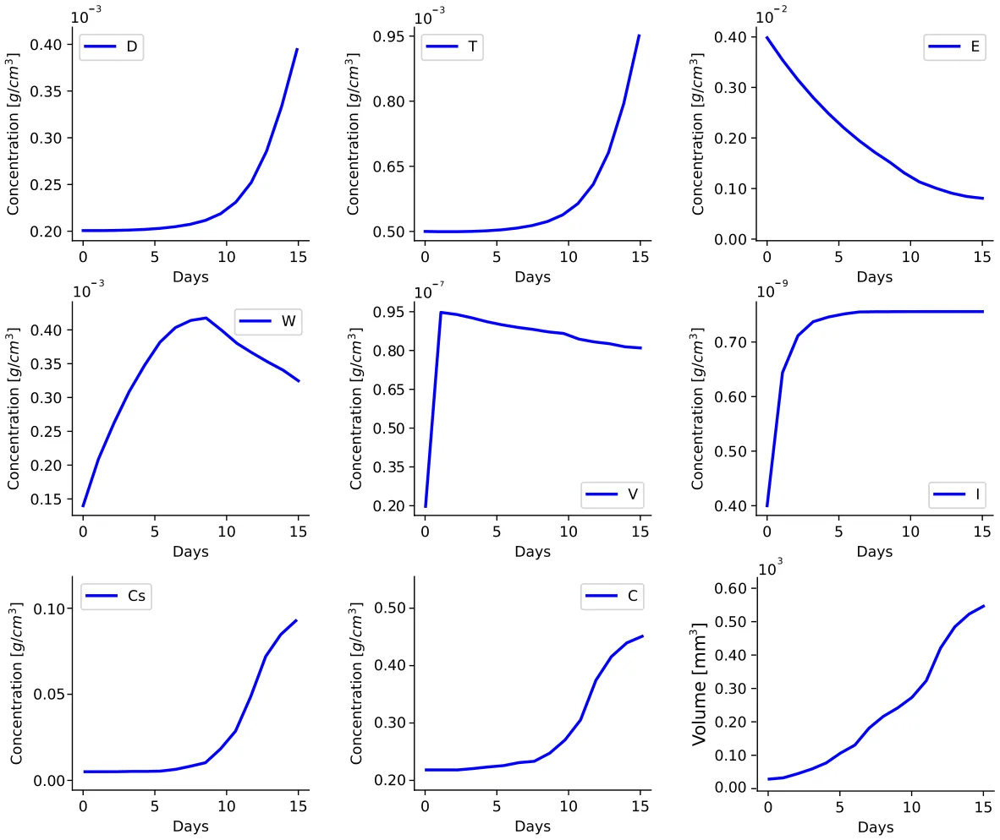
<figcaption><strong>Fig. 2.</strong> Average densities/concentrations, in g∕cm3, of all the variables in the control case (no drugs). All parameter values are the same as in Table 2, for the mouse model.</figcaption>
</figure>

<figure id="fig-3">
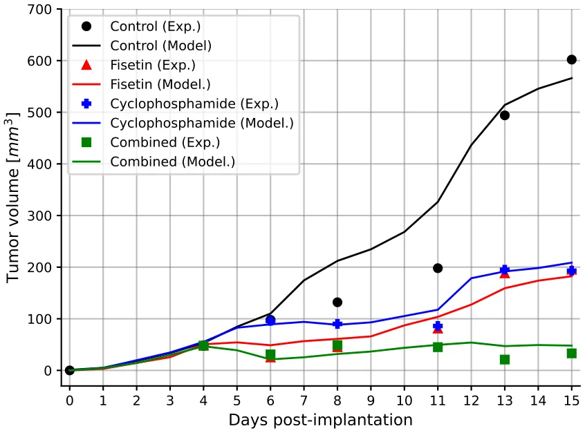
<figcaption><strong>Fig. 3.</strong> Comparison between the model’s prediction for the tumor volume and the average mice experiment results.</figcaption>
</figure>

<figure id="fig-4">
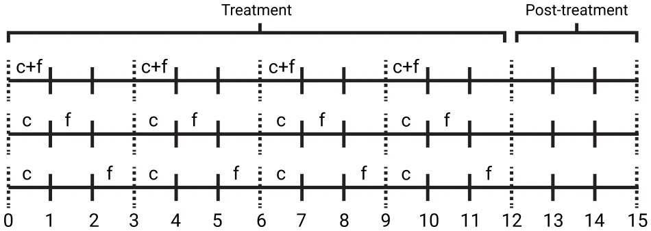
<figcaption><strong>Fig. 4.</strong> A schematic view of the three treatment protocols explored. ‘‘c’’ stands for cyclophosphamide injection and ‘‘f’’ stands for fisetin injection.</figcaption>
</figure>

<figure id="fig-5">
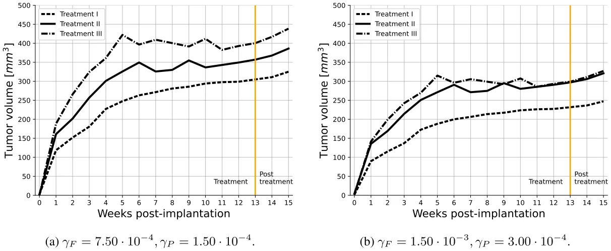
<figcaption><strong>Fig. 5.</strong> The cancer volume (mm3) over time for different injection amounts, divided into the three treatment protocols.</figcaption>
</figure>

We also gave an example of repeated application of the same Treatment *𝐼*, with some rest time between them. In that example, we show that the optimal rest time should be not too short but not too long.

The model has several limitations.

- 1. In developing a mathematical model there is always uncertainty in estimating parameters, hence the model should be ‘‘minimal’’, it should include only the biological entities that are absolutely necessary to address the posed biological questions. It should exclude entities that are presumed to affect very little the conclusions of the study; this is a judgment call. In our case, we needed of course to include the pro-cancer angiogenesis effect of senescent cells (VEG, endothelial cells, and oxygen), the cytotoxic T cells that kill cancer cells, and some activators of dendritic cells that detect cancer, and the messenger IL-12 (*𝐼*). But we did include, for instance, other anti- and pro-cancer immune cells (e.g., macrophages and related cytokines).
- 2. The ‘‘minimal’’ model still has many unknown parameters, which we estimated by fitting to experimental results in mice model [7]. Although we performed a sensitivity analysis, we do not know the full range of parameters for which the conclusions of the paper remain valid. This limitation could be improved when new experimental data become available.
- 3. Our spatio-temporal model is represented by a system of PDEs within the tumor. The tumor boundary is moving in time, and in order to solve the system we had to impose a condition on the dynamic of the unknown boundary. For simplicity, we considered a spherically symmetric tumor, and imposed the condition that the sum of all cells density in the moving tumor is constant (Eq. (1)). This enabled us to proceed to solve the model
- and to compute the tumor boundary. The assumption in Eq. (1) is another limitation of the model.
- 4. We did not include in this paper the negative side effects of the drugs, particularly cyclophosphamide
- 5. We did not consider the effect of drug resistance, which impairs many treatments of cancer; these topics are beyond the scope of the present paper.

A comprehensive review of prognostic implications of cellular senescence in many cancers is given in [35], and comprehensive descriptions of senolytic therapies are reviewed in [36]. The methods developed in this paper could be useful in the study of treatments and in prognostic of other cancers with other combinations of chemotherapy and senolytic drugs.

## CRediT authorship contribution statement

**Teddy Lazebnik:** Writing – review & editing, Visualization, Software, Resources, Project administration, Methodology, Investigation, Formal analysis, Conceptualization. **Avner Friedman:** Writing – review & editing, Writing – original draft, Validation, Investigation, Formal analysis, Data curation, Conceptualization.

## Declaration of competing interest

none

## Appendix A

**Computational method:** We used the moving mesh method [37] together with a refined Explicit Runge–Kutta method of order 5(4). We used the Scipy library in the Python programming language. A formal definition of the refined Explicit Runge–Kutta method 5(4) takes the following form:

<figure id="fig-6">
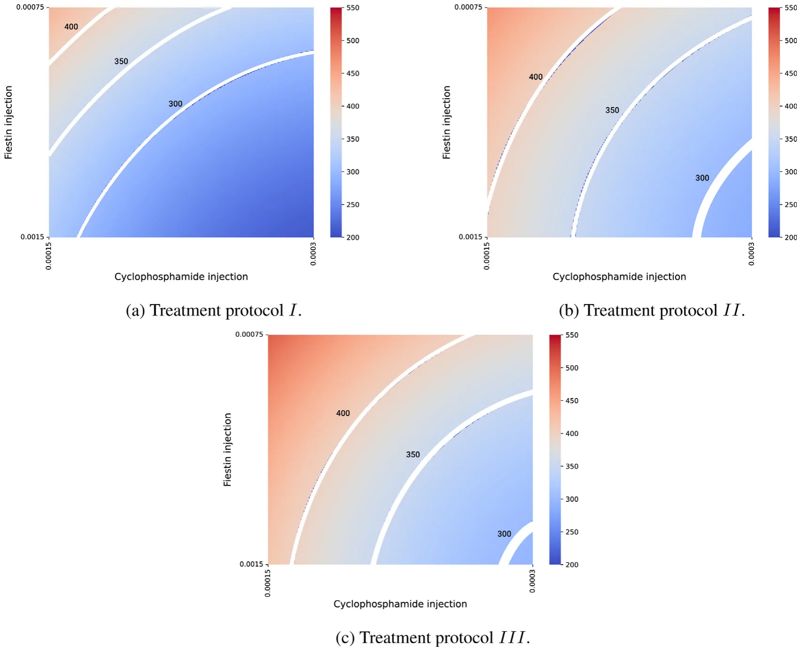
<figcaption><strong>Fig. 6.</strong> Cancer volume (mm3) three weeks after the end of a treatment for different drug injection protocols.</figcaption>
</figure>

<figure id="fig-7">
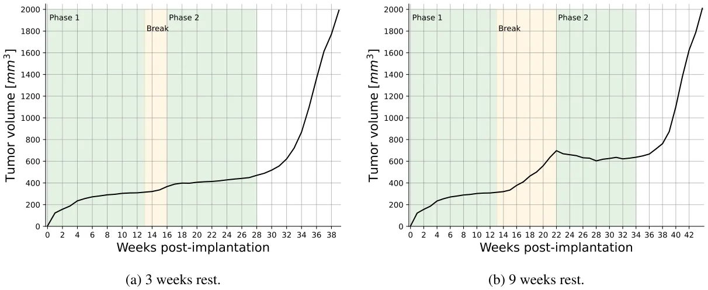
<figcaption><strong>Fig. 7.</strong> Two-phase application of Treatment <em>𝐼</em> with <em>𝛾</em>𝑃 = 1<em>.</em>9 ⋅ 10−3<em>, 𝛾</em>𝐹 = 1<em>.</em>4 ⋅ 10−2.</figcaption>
</figure>

*𝑘*1 = *ℎ𝑓* (*𝑡*𝑛*, 𝑦*𝑛)*,*

*𝑘*2 = *ℎ𝑓* (*𝑡*𝑛 + *𝑐*2*ℎ, 𝑦*𝑛 + *𝑎*21*𝑘*1)*,*

*𝑘*3 = *ℎ𝑓* (*𝑡*𝑛 + *𝑐*3*ℎ, 𝑦*𝑛 + *𝑎*31*𝑘*1 + *𝑎*32*𝑘*2)*,*

*𝑘*4 = *ℎ𝑓* (*𝑡*𝑛 + *𝑐*4*ℎ, 𝑦*𝑛 + *𝑎*41*𝑘*1 + *𝑎*42*𝑘*2 + *𝑎*43*𝑘*3)*,*

*𝑘*5 = *ℎ𝑓* (*𝑡*𝑛 + *𝑐*5*ℎ, 𝑦*𝑛 + *𝑎*51*𝑘*1 + *𝑎*52*𝑘*2 + *𝑎*53*𝑘*3 + *𝑎*54*𝑘*4)*,*

*𝑘*6 = *ℎ𝑓*(*𝑡*𝑛 + *𝑐*6*ℎ, 𝑦*𝑛 + *𝑎*61*𝑘*1 + *𝑎*62*𝑘*2 + *𝑎*63*𝑘*3 + *𝑎*64*𝑘*4 + *𝑎*65*𝑘*5)*,* *𝑦*𝑛+1 = *𝑦*𝑛 + *𝑏*1*𝑘*1 + *𝑏*2*𝑘*2 + *𝑏*3*𝑘*3 + *𝑏*4*𝑘*4 + *𝑏*5*𝑘*5 + *𝑏*6*𝑘*6 + *𝑂*(*ℎ*5)*,* where *𝑐*2 = 1 5, *𝑐*3 = 3 10, *𝑐*4 = 4 5, *𝑐*5 = 8 9, *𝑐*6 = 1*, 𝑎*21 = 1 5, *𝑎*31 = 3 40, *𝑎*32 = 9 40 , *𝑎*41 = 44 45, *𝑎*42 = −56 15 , *𝑎*43 = 32 9 , *𝑎*51 = 19372 6561 , *𝑎*52 = −25360 2187 , *𝑎*53 = 64448 6561 , *𝑎*54 = −212 729,

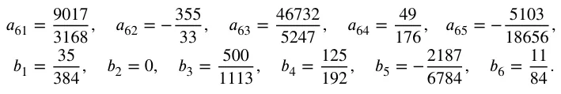

such that *ℎ ≪* 1 ∈ R+ is the step size, *𝑡*𝑛 ∈ R is the *𝑛*𝑡ℎ step in time, *𝑦*𝑛 ∈ R8 is the *𝑛*𝑡ℎ state of the model. The coefficients *𝑎*𝑖𝑗*, 𝑏*𝑖, and *𝑐*𝑖 are automatically chosen by the library to strike a balance between accuracy and computational efficiency. The method’s higher order (5(4)) indicates that it employs an embedded fourth-order method to estimate the error, allowing for adaptive step size adjustments to enhance accuracy in solving PDEs. Importantly, for free-boundary equations, the boundary is moved for each step of the Runge–Kutta method. To move the free boundary from one step to the next, the method updates the position *𝑥* based on the velocity *𝑣*(*𝑥*) and the time step *ℎ*. This involves evaluating *𝑣*(*𝑥*) at the boundary point and then shifting the boundary accordingly.

To illustrate this model, we take Eq. (3) as an example and rewrite it in the following form:

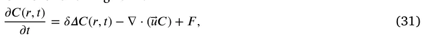

where *𝐹* represents the term on the right-hand side of Eq. (3). Let *𝑟*𝑖 *𝑘* and *𝐶*𝑖 𝑘 denote numerical approximations of *𝑖*th grid point and *𝐶*(*𝑟*𝑖 𝑘*, 𝑛𝜏*), respectively, where *𝜏* is the size of time-step. The discretization of Eq. (31) is derived by the fully implicit finite difference scheme obtained from the Runge Kutta method presented above. The mesh moves by *𝑟*𝑖 𝑘+1 = *𝑟*𝑖 𝑘 + *𝑢*𝑖 𝑘+1*𝜏* where *𝑢*𝑖 𝑘+1 is solved by the velocity equation. In order to make the scheme stable, we take *𝜏* ≤ *ℎ*2∕4*𝛿*.

## Appendix B

**Parameter fitting procedure:** In order to use the proposed model, one is required to find biologically relevant values for the model’s parameters. To this end, we start by taking known parameters from the literature and finding values for most of the parameters. For the remaining parameters, we used an equilibria analysis to obtain an initial value estimation. In order to refine these parameter values, we used the biological data regarding tumor volume over time presented in [7] (Fig. 5). To fit the parameter values to the data, we used a heuristic optimization process based on the combination of the Monte Carlo and Genetic Algorithm. In this section, we first briefly introduce the two algorithms. Afterward, we formally present the computational method used to fit the parameter values.

Genetic algorithms (GA) are optimization method inspired by the biological concept of evolution, as described in [38]. Specifically, GA mimics the evolutionary process of natural selection, whereby solutions—often called ‘‘chromosomes’’ — that achieve higher scores from a fitness function are more likely to be passed on to subsequent generations. Every two generations, stochastic processes such as mutation [39], crossover [40], and feasibility tests [41] occur, which may vary among chromosomes. The algorithm performs the mutation, crossover, and selection operators in an interactive manner until a stop condition is met. The chromosome with the highest fitness function value during the entire process is the algorithm’s output.

The Monte Carlo (MC) method is a probabilistic technique used for obtaining numerical solutions to mathematical problems that might be deterministic in principle but are difficult to solve directly [42]. It relies on random sampling to approximate solutions, often employed where the space of potential outcomes is too large for exhaustive enumeration. This method is particularly effective in high-dimensional spaces and for integrating functions or simulating complex systems and processes.

We utilize both algorithms as follows. In order to use the GA, we define a chromosome as the parameter values (or some subset of these) as described in Table 2. Namely, a chromosome is a vector of the model’s parameter we wish to fit into biological data. Next, in an iterative manner, we used the mutation operator which picks a value of the chromosome in a random manner and alters it with some mutation rate. Next, the ring crossover operator [43] is used. Finally, we used the tournament with royalty selection operator [40]. Notably, as part of the selection operator, for each chromosome in the population, the fitness function is calculated. Thus, the proposed model was calculated for 14 days and the cancer volume was calculated for the same time period. Afterward, the coefficient of determination of the cancer volume compared to the biological data from [7] was defined to be the fitness of the chromosome. In Section 2.4, the chromosomes are sets of parameter values of the variables listed in Eqs. (27)–(28). Fitness of chromosome *𝑃* is measured by *𝑅*2(*𝑀*𝑃*, 𝐷*) where *𝑅*2(*𝑥, 𝑦*) → [0*,* 1] is a function that accepts model prediction of *𝑃* (i.e., the profiles of four tumor volume constructed from the control case and the treatments by *𝐹*, *𝑃*, and *𝐹* + *𝑃*), given the historical data (namely, the profiles in [7] (figure 5).

Since the GA method may converge to local minima, we included the MC method with GA to get a (more) global minimum, as follows. We set the initial population of the GA to be sampled from a manually pre-defined random range of values from a neighborhood in the parameter space of the GA local minima, and allow the GA algorithm to conduct a search (and optimization) process for different initial conditions. The random outcomes of the GA are then used in a Monte Carlo process. After all the MC repetitions are computed, the best result, produced by the GA method, across all the MC repetitions is taken to be the overall method’s output. This method ensures the output is a more global minimum rather than a single run of a GA algorithm.

The source code of the model and the fitting procedure is freely available in the project’s GitHub repository: https://github.com/tedd y4445/senolytic\_treatment\_pde\_model. Algorithm 1 presents a pseudo-code of the fitting procedure.

**Algorithm 1** Parameter Fitting Using Genetic Algorithm (GA) and Monte Carlo (MC) Method

- 1: **Input:** Initial parameter values **𝐏**init from literature, biological data *𝐷* (tumor volume over time)
- 2: **Output:** Optimized parameter values **𝐏**∗
- 3: Initialize population **𝐏**0 with parameters from **𝐏**init
- 4: Perform equilibria analysis to estimate initial values for remaining parameters **𝐏**rem
- 5: **for** each generation *𝑔* **do**
- 6: **for** each chromosome **𝐜** in population **𝐏**𝑔 **do** 7: Apply mutation operator (**𝐜**) to randomly alter parameter values 8: Apply ring crossover operator (**𝐜**) 9: Calculate fitness function *𝑅*2(*𝑀*𝐜*, 𝐷*) for each chromosome **𝐜** 10: **end for** 11: Apply tournament with royalty selection operator (**𝐏**𝑔)
- 12: **end for**
- 13: Set initial population **𝐏**0 for GA from pre-defined random range around GA local minima
- 14: **for** each MC repetition *𝑟* **do** 15: Run GA with different initial conditions **𝐏**𝑟 16: Collect GA outcomes **𝐎**𝑟 17: **end for**
- 18: Select best result **𝐏**∗ = ar g max𝐎𝑟 *𝑅*2(*𝑀*𝐎𝑟*, 𝐷*) from all MC repetitions 19: **return** Optimized parameter values **𝐏**∗

## Appendix C

**Sensitivity analysis :** We performed sensitivity analysis with respect to tumor volume at day 15, using a set of parameters that represent production, proliferation, degradation, and killing rates. The computation were done using Latain Hypercube sampling/Partial Rank Correlation Coefficient (LHS/PRCC) with Matlab package [44,45]. The range of parameters was ±50% their baseline in Table 2. We retained parameters exhibiting significant PRCC and *𝑝*-value below 0.1.

<figure id="fig-8">
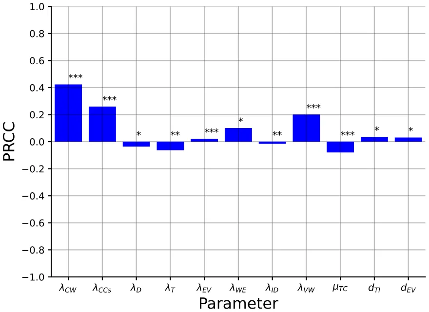
<figcaption><strong>Fig. 8.</strong> Parameter sensitivity analysis for the tumor volume at day 15 with all the activation, transition, and absorption parameters. We marked each parameter by ∗<em>,</em> ∗∗, and ∗∗∗ corresponding to <em>𝑝 &lt;</em> 0<em>.</em>1<em>,</em> 0<em>.</em>05, and 0.01.</figcaption>
</figure>

<figure id="fig-9">
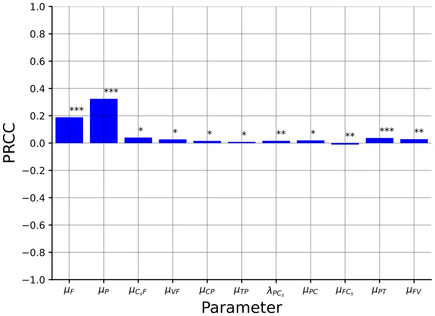
<figcaption><strong>Fig. 9.</strong> Parameter sensitivity analysis for the tumor volume at day 15 for the drug-related parameters. We marked each parameter by ∗<em>,</em> ∗∗, and ∗∗∗ corresponding to <em>𝑝 &lt;</em> 0<em>.</em>1<em>,</em> 0<em>.</em>05, and 0.01.</figcaption>
</figure>

Fig. 8 shows the results of this analysis for *𝑛* = 10 000 samples in the control case, and Fig. 9 shows the results for *𝑛* = 10 000 samples in the case of combined therapy, *𝐹* + *𝑃*.

Fig. 8 shows that *𝜆*𝐶 𝑊 and *𝜆*𝐶 𝐶𝑠 are positively correlated; indeed, it these parameters increase then, respectively, *𝐶*, *𝐶*𝑠 increase the parameters *𝜆*𝑊 𝐸 and *𝜆*𝑉 𝑊 are also positively correlated, since if they increase then oxygen supply to the cancer cells increases. T cells kill cancer cells, hence *𝜇*𝑇 𝐶 is negatively correlated, and so is the growth rate *𝜆*𝑇 of T. Since *𝐼* activates T cells, *𝜆*𝐼 𝐷 is negatively correlated, and *𝑑*𝑇 𝐼 is positively correlated. If *𝜆*𝐷 is increased then *𝐷* will increase, hence also *𝐼*; hence *𝜆*𝐷 is negatively correlated. Finally, *𝑑*𝐸 𝑉 is positively correlated, since if it is increased then VEGF is decreased.

Fig. 9 shows that *𝜇*𝐹 and *𝜇*𝑃 are negatively correlated. Indeed, when these parameters increase then the washout rate of the drugs increases, and the decrease in the effective drugs will reduce their anti-cancer efficacy. If *𝜇*𝑃 𝑇 is increased then *𝑇* is decreased, and if *𝜇*𝐹 𝑉 is increased then VEGF is decreased, hence both parameters are positively correlated. If *𝜆*𝑃 𝐶𝑠 is increased then *𝐶*𝑠 is increased, and if *𝜇*𝐹 𝐶𝑠 is increased then *𝐶*𝑠 is decreased, hence *𝜆*𝑃 𝐶𝑠 is positively correlated while *𝜇*𝐹 𝐶𝑠 is negatively correlated. Finally, the parameters *𝜇*𝐶𝑠𝐹*, 𝜇*𝑉 𝑃*, 𝜇*𝐶 𝑃*, 𝜇*𝑇 𝑃 are positively correlated since if they increase then the drugs *𝐹* + *𝑃* are decreased.

## Data availability

No data was used for the research described in the article.

## References

1. L. Wyld, B. I, T. Tchkonia, J. Morgan, O. Turner, F. Foss, J. George, S. Danson, J.L. Kirkland, Senescence and cancer: A review of clinical implications of sensescence and senotherapies, Cancers (2020). [link](http://refhub.elsevier.com/S0025-5564%2824%2900202-5/sb1)
2. B. Wang, J. Kohil, M. Demaria, Senescent cells in cancer therapy: Friends or foes, Trends Cancer 6 (10) (2020) 838–857. [link](http://refhub.elsevier.com/S0025-5564%2824%2900202-5/sb2)
3. W. Huang, L.J. Hickson, A. Eirin, J.L. Kirkland, L.O. Lerman, Cellular senescence: the good, the bad, and the unknown, Nat. Rev. Nephrol. 18 (2022) 611–627. [link](http://refhub.elsevier.com/S0025-5564%2824%2900202-5/sb3)
4. J. Yang, M. Liu, D. Hong, M. Zeng, X. Zhang, The paradoxical role of cellular senescence in cancer, Front. Cell Dev. Biol. (2021) 722205. [link](http://refhub.elsevier.com/S0025-5564%2824%2900202-5/sb4)
5. Y.H. Kim, T.J. Park, Ceulluar senescence in cancer, BMB Rep. (2019). [link](http://refhub.elsevier.com/S0025-5564%2824%2900202-5/sb5)
6. W. Lin, X. Wang, Z. Wang, F. Shao, Y. Yang, Z. Cao, X. Feng, Y. Gao, J. He, Comprehensive analysis uncovers prognostic and immunogenic characteristics of cellular senescence for lung adenocarcinoma, Front. Cell Dev. Biol. (2021). [link](http://refhub.elsevier.com/S0025-5564%2824%2900202-5/sb6)
7. Y.S. Touil, J. Seguin, D. Scherman, G.G. Chabot, Improved antiangiogenic and antitumor activity of the combination of the natural flavonoid fisetin and cyclophosphamide in lewis lung carcinoma-bearing mice, Cancer Chemother. Pharmacol. 68 (2011) 445–455. [link](http://refhub.elsevier.com/S0025-5564%2824%2900202-5/sb7)
8. A. Bojko, J. Czarnecka-Herok, A. Charzynska, M. Dabrowski, E. Sikore, Diversity of the senescence phenotype of cancer cells treated with chemotherapeutic agents, Cells 68 (2019). [link](http://refhub.elsevier.com/S0025-5564%2824%2900202-5/sb8)
9. S. Malayaperumal, F. Marotta, M.M. Kumar, I. Somasundaram, A. Ayala, M.M. Pinto, A. Banerjee, S. Pathak, The emerging role of senotherapy in cacner: A comprehensive review, Clin. Pract. 68 (2023) 838–852. [link](http://refhub.elsevier.com/S0025-5564%2824%2900202-5/sb9)
10. M. Renault-Mahieux, J. Seguin, V. Vieillard, D.-T. Le, P. Espeau, R. Lai-Kuen, C. Richard, N. Mignet, M. Paul, K. Andrieux, Co-encapsulation of fisetin and cisplatin into liposomes: Stability considerations and in vivo efficacy on lung cancer animal model, Int. J. Pharm. 651 (2024) 123744. [link](http://refhub.elsevier.com/S0025-5564%2824%2900202-5/sb10)
11. FDA, Cyclophosphamide for Injection, Usp, Cyclophosphamide Tablets, Usp, FDA, 2012. [link](http://refhub.elsevier.com/S0025-5564%2824%2900202-5/sb11)
12. R. Sulimanov, K. Koshelev, V. Makarov, A. Mezentsev, M. Durymanov, L. Ismail, K. Zahid, Y. Rumyantsev, I. Laskov, Mathematical modeling of non-small-cell lung cancer biology through the experimental data on cell composition and growth of patient-derived organoids, Life 13 (2023) 2228. [link](http://refhub.elsevier.com/S0025-5564%2824%2900202-5/sb12)
13. E. Lourenco, D.S. Rodrigues, M.E. Antunes, P.F.A. Mancera, G. Rodrigues, A simple mathematical model of non-small cell lung cancer involving macrophages and cd8+ t cells, J. Biol. Systems 31 (04) (2023) 1407–1431. [link](http://refhub.elsevier.com/S0025-5564%2824%2900202-5/sb13)
14. J. Smieja, Mathematical modeling support for lung cancer therapy - a short review, Int. J. Mol. Sci. 24 (2023) 14516. [link](http://refhub.elsevier.com/S0025-5564%2824%2900202-5/sb14)
15. H.W. Kang, M. Crawford, M. Fabbri, G. Nuovo, M. Garofalo, P.K. Nana-Sinkam, A mathematical model for microrna in lung cancer, PLoS One 8 (2013) e53663. [link](http://refhub.elsevier.com/S0025-5564%2824%2900202-5/sb15)
16. R. Salgia, I. Mambetsariev, B. Hewelt, S. Achuthan, H. Li, V. Poroyko, Y. Wang, M. Sattler, Modeling small cell lung cancer (sclc) biology through deterministic and stochastic mathematical models, Oncotarget 9 (2018) 26226–26242. [link](http://refhub.elsevier.com/S0025-5564%2824%2900202-5/sb16)
17. P. Carmeliet, Vegf as a key mediator of angiogenesis in cancer, Oncology 69 (2005) 4–10. [link](http://refhub.elsevier.com/S0025-5564%2824%2900202-5/sb17)
18. J. Ferre-Torres, A. Noguera-Monteagudo, A. Lopez-Canosa, J.R. Romero-Arias, R. Barrio, O. Castano, A. Hernandez-Machado, Modelling of chemotactic sprouting endothelial cells through an extracellular matrix, Front. Bioeng. Biotechnol. 11 (2023) 1145550. [link](http://refhub.elsevier.com/S0025-5564%2824%2900202-5/sb18)
19. R.K. Das, R.S. O’Conner, S.A. Grupp, D.M. Barrett, Lingering effects of chemotherapy on mature t-cells impair proliferation, Blood Adv. 4 (2020). [link](http://refhub.elsevier.com/S0025-5564%2824%2900202-5/sb19)
20. Y. Fan, J. Cheng, H. Zeng, L. Shao, Senescen cell depletion through targeting bcl-family proteins and mitochondria, Front. Physiol. (2020). [link](http://refhub.elsevier.com/S0025-5564%2824%2900202-5/sb20)
21. A.D.D. Foundation, Fisetin, Cogn. Vitality (2018). [link](http://refhub.elsevier.com/S0025-5564%2824%2900202-5/sb21)
22. Y. Zhu, E.J. Doornebal, T. Pirtskhalava, N. Giorgadze, M. Wentworth, H. Fuhrmann-Stroissnigg, L.J. Neidernhofer, P.D. Robbins, T. Tchkonia, J.L. Kirkland, New agents that target senescent cells: the flavone, fisetin, and the bcl-xl inhibitors, a1331852 and a1155463, Aging. (Milano). 9 (2017). [link](http://refhub.elsevier.com/S0025-5564%2824%2900202-5/sb22)
23. X. Lai, A. Stiff, M. Duggan, R. Wesolowski, W.E. Carson III, A. Friedman, Modeling combination therapy for breast cancer with bet and immune checkpoint inhibitors, Proc. Natl. Acad. Sci. USA 115 (21) (2018) 5534–5539. [link](http://refhub.elsevier.com/S0025-5564%2824%2900202-5/sb23)
24. X. Lai, A. Friedman, How to schedule vegf and pd-1 inhibitors in combination cancer therapy? BMC Syst. Biol. 13 (30) (2019). [link](http://refhub.elsevier.com/S0025-5564%2824%2900202-5/sb24)
25. X. Lai, A. Friedman, Combination therapy of cancer with cancer vaccine and immune checkpoint inhibitors: A mathematical model, PLoS One 12 (5) (2017) e0178479. [link](http://refhub.elsevier.com/S0025-5564%2824%2900202-5/sb25)
26. K.-L. Liao, X.-F. Bai, A. Friedman, Mathematical modeling of interleukin-27 induction of anti-tumor t cells response, PLoS One 9 (3) (2014) e91844. [link](http://refhub.elsevier.com/S0025-5564%2824%2900202-5/sb26)
27. A. Friedman, W. Hao, The role of exosomes in pancreatic cancer microenvironment, Bull. Math. Biol. 80 (2018) 1111–1133. [link](http://refhub.elsevier.com/S0025-5564%2824%2900202-5/sb27)
28. W. Hao, A. Friedman, Serum upar as biomarker in breast cancer recurrence: A mathematical model, PLoS One 11 (4) (2016) e0153508. [link](http://refhub.elsevier.com/S0025-5564%2824%2900202-5/sb28)
29. D. Chen, J.M. Rode, C.B. MArsh, T.D. Eubank, A. Friedman, Hypoxia inducible factors-mediated inhibition of cancer by gm-csf: A mathematical model, Bull. Math. Biol. 74 (11) (2012) 2752–2777. [link](http://refhub.elsevier.com/S0025-5564%2824%2900202-5/sb29)
30. Y. Kim, S. Lawler, M.O. Nowicki, E.A. Chiocca, A. Friedman, A mathematical model for pattern formation of glioma cells outside the tumor spheroid core, J. Theoret. Biol. 260 (2009) 359–371. [link](http://refhub.elsevier.com/S0025-5564%2824%2900202-5/sb30)
31. N. Slewe, A. Friedman, Optimal timing of steroid initiation in response to ctla-4 antibody in metastatic cancer: A mathematical model, PLoS One 17 (11) (2022) e0277248. [link](http://refhub.elsevier.com/S0025-5564%2824%2900202-5/sb31)
32. M. Kumar, M. Husain, N. Upreti, D. Gupta, Genetic algorithm: Review and application, Int. J. Inf. Technol. Knowl. Manage. 2 (2) (2010) 451–454. [link](http://refhub.elsevier.com/S0025-5564%2824%2900202-5/sb32)
33. J.G. Verwer, B.P. Sommeijer, An implicit-explicit Runge–Kutta–Chebyshev scheme for diffusion-reaction equations, SIAM J. Sci. Comput. 25 (5) (2004) 1824–1835. [link](http://refhub.elsevier.com/S0025-5564%2824%2900202-5/sb33)
34. H.P. Langtangen, A. Logg, Solving PDEs in Python, in: Simula SpringerBriefs on Computing, Springer, Cham, 2016. [link](http://refhub.elsevier.com/S0025-5564%2824%2900202-5/sb34)
35. A. Domen, C. Deben, J. Verswyvel, T. Flieswasser, H. Prenen, M. Peeters, F. Lardon, A. Wouters, Cellular senescence in cancer: clinical detection and prognostic implications, J. Exp. Clin. Cancer Res. 41 (2022) 360. [link](http://refhub.elsevier.com/S0025-5564%2824%2900202-5/sb35)
36. C.A. Schmitt, B. Wang, M. Demaria, Senescence and cancer — role and therapeutic opportunities, Nat. Rev. Clin. Oncol. 19 (2022) 619–636. [link](http://refhub.elsevier.com/S0025-5564%2824%2900202-5/sb36)
37. B. D’Acunto, Computational Methods for PDE in Mechanics, in: Series on Advances in Mathematics for Applied Sciences, vol. 67, World Scientific, 2004. [link](http://refhub.elsevier.com/S0025-5564%2824%2900202-5/sb37)
38. J.H. Holland, Genetic algorithms, Sci. Am. 267 (1) (1992) 66–73. [link](http://refhub.elsevier.com/S0025-5564%2824%2900202-5/sb38)
39. L. Davis, Applying adaptive algorithms to epistatic domains, in: Proceedings of the International Joint Conference on Artificial Intelligence, 1985, pp. 162–164. [link](http://refhub.elsevier.com/S0025-5564%2824%2900202-5/sb39)
40. Z.W. Bo, L.Z. Hua, Z.G. Yu, Optimization of process route by genetic algorithms, Robot. Comput.-Integr. Manuf. 22 (2006) 180–188. [link](http://refhub.elsevier.com/S0025-5564%2824%2900202-5/sb40)
41. M. Salehi, A. Bahreininejad, Optimization process planning using hybrid genetic algorithm and intelligent search for job shop machining, J. Intell. Manuf. 22 (4) (2011) 643–652. [link](http://refhub.elsevier.com/S0025-5564%2824%2900202-5/sb41)
42. J.A. Murtha, Monte Carlo simulation: Its status and future, J. Pet. Technol. 49 (04) (1997) 361–373. [link](http://refhub.elsevier.com/S0025-5564%2824%2900202-5/sb42)
43. Y. Kaya, M. Uyar, T. R, A novel crossover operator for genetic algorithms: ring crossover, 2011, arXiv. [link](http://refhub.elsevier.com/S0025-5564%2824%2900202-5/sb43)
44. S. Marino, I.B. Hogue, C.J. Ray, D.E. Kirschner, A methodology for performing global uncertainty and sensitivity analysis in systems biology, J. Theoret. Biol. 254 (1) (2008) 178–196. [link](http://refhub.elsevier.com/S0025-5564%2824%2900202-5/sb44)
45. H. Kirschner, K. Hilbert, J. Hoyer, U. Lueken, K. Beesdo-Baum, Psychophsyio-logical reactivity during uncertainty and ambiguity processing in high and low worriers, J. Behav. Ther. Exp. Psychiatry 50 (2016) 97–105. [link](http://refhub.elsevier.com/S0025-5564%2824%2900202-5/sb45)
