Throughout history, pandemics have significantly influenced societal structures, economic stability, political systems, and impacted mortality rates.17 In recent decades, the ongoing threat of emerging and reemerging pandemics and epidemics has posed a significant challenge to humanity.11 In a similar yet distinct manner, the overall number of wars and conflicts worldwide has shown a concerning increase recently, following a relatively peaceful period after World War II.18,19

Pandemics and military operations have long been interlinked due to the sociological and operational dynamics associated with armies and warfare.22,30 The levels of hygiene, self-care, and immune system stress in individuals provided fertile conditions for the outbreak of diseases within armies and the communities interacting with them.5 Moreover, the density of military bases and army deployments facilitates the spread of pathogens within the population.5 Notable examples include the 1917-1918 Spanish Influenza, which affected populations worldwide and particularly impacted the US military during World War I, and the COVID-19 outbreak in Ukraine during the Russia-Ukraine war starting in 2022.6,23

The intersection of pandemics and military operations has placed economic and health care systems worldwide under considerable strain.44,80,93 To prepare for such events, researchers frequently design policies and plans for a wide range of scenarios using mathematical models.26,27,48,54,64 Models related to warfare are often less accessible to the general public and, consequently, can be difficult to locate in the literature.76 Unlike, numerous models have been proposed to simulate the spread of pandemics.50,71,87 For example,60 proposed an SIR (Susceptible-Infected-Recovered) based disease spread model that incorporates multiple transmission pathways, including direct contact and vectors. This model effectively captures the dynamics of pandemic spread across large populations,14 and introduced an extended SIR model that differentiates between symptomatic and asymptomatic cases of COVID-19, assigning distinct infection paths for each. In this model, susceptible individuals can become asymptomatic immediately upon infection, while those who develop symptoms first enter an exposed stage. Yan et al. (2018) proposed an extended spatio-temporal SIR model for the spread of sexually transmitted diseases on a bipartite random contact network.94 Building on top of these modeling efforts, a growing body of work has focused on the capacity of health care systems to support the treatment of infected individuals during large-scale pandemics.13 For instance, Kozyreff et al. (2021) utilized an SIR model incorporating the dynamics of hospitalized patients, assumed to be proportional to the number of infected individuals, with considerations for delay and exponential decay during their stay in health care centers.42 Notably, the hospitalized population does not affect other epidemiological states, which is crucial for accurately modeling health care center dynamics. This model was applied to COVID-19 pandemic data from the first 3 months in 5 different regions: Belgium, France, Italy, Switzerland, and New York City (US). Similarly, Huang et al. (2021) introduced a risk-stratified SIR- HCD model that incorporates variables representing the dynamics of low- and high-contact subpopulations, with shared parameters to manage their respective rates over time.35 The authors tested their model using data on daily reported hospitalizations and cumulative mortality from COVID-19 in Harris County, TX.

Despite the extensive epidemiological-mathematical research, a model that captures the dynamics of a pandemic during wartime and its influence on the health care system’s ability to provide necessary services has yet to be developed. This gap leaves policymakers without crucial insights for planning in such scenarios. Hence, in this work, we propose a novel spatio-temporal extended SIR-based model that includes civilian and military health care systems with asymmetric administration policies to study the effect of pandemics on warfare performance from the health care perspective. In addition, we provide an agent-based simulation implementation of the proposed model with a reinforcement learning model that is able to approximate optimal patient administration policies for the entire health care system, including both war and civilian zones to reduce overall mortality (from both war and pandemic), operating as an applicative tool to investigate efficient administration polices with different properties without the need to manually search for them. A schematic view of the study’s structure is presented in Figure 1.

First, we formalize the model by introducing 4 key components: spatial movement dynamics, pandemic spread dynamics, hospitalization dynamics, and warfare dynamics. Next, we utilize agent-based simulation to solve the model and optimize patient administration policies using reinforcement learning. Finally, we establish a realistic setup to evaluate the pandemic- and war-related deaths, analyzing the impact of various patient administration strategies on these outcomes.

The remaining paper is organized as follows: Section 2 presents the related work for pandemic spread during wars and spatio-temporal modeling practices for pandemic spread. Section 3 describes the proposed model’s mathematical formalization. Section 4 outlines the implementation of the proposed model as a computer simulator and optimal patient administration using a reinforcement learning model. Section 5 provides a comprehensive evaluation of the proposed model. Finally, Section 6 provides a conclusion on the possible applications and limitations followed by suggestions for future work.

## Related Work

Warfare has been studied from various perspectives, including sociological,45 political,8 and economic,56 among others. In addition, over the last century, advancements in biology, medicine, and engineering have greatly enhanced our epidemiological understanding.68 As such, the relationship between the 2 started to emerge in the literature and a growing body of work captured the interplay between warfare and pandemics. In this section, we review the unique relationship between warfare and pandemic spread. Furthermore, we present recent modeling practices for pandemic spread which will be the mathematical base for our model.

## Pandemic During War

In the context of large-scale pandemics and wars, one can detect 2 central and relatively recent global-scale events - the Spanish influenza pandemic of 1917-1918 during the First World War23 and the COVID-19 pandemic during the Russian-Ukrainian war.6

Following the sequence of events, we first examine the Spanish influenza pandemic, which stands out as one of the deadliest pandemics in recent history.21 Estimates place the global death toll between 21.5 million and 39.3 million, with some scholars suggesting even higher numbers, though these may be exaggerated.67 The initial wave of the pandemic, occurring in the spring of 1918, was relatively mild with few fatalities. However, a drastic change occurred in the summer of the same year when the virus underwent a mutation, becoming highly virulent and leading to millions of deaths worldwide in October and November.7 A less severe third wave followed in early 1919, while the fourth and final wave extended into the initial months of 1920. The demographic most affected comprised young, healthy adults aged 15-44. Mortality rates varied across countries and continents, with estimates in Europe ranging from 1.1%-1.2%.24 Importantly, Oxford et al. proposed that the pandemic originated at the British military base in Étaples, located in northern France in the Pas-de-Calais department.65 Significant during World War I, this base housed 100 000 soldiers within a 12 square kilometer area. Adjacent to the base were coastal marshes frequented by migratory birds. In the vicinity, numerous farms kept pigs, ducks, and geese for the soldiers’ consumption, along with horses used for transportation. The convergence of dense soldier populations, various livestock, and the extensive use of 24 types of war gases, several of which were mutagenic, could potentially explain the initial outbreak of the epidemic between December 1916 and March 1917. Moreover, Erkoreka et al. suggested that the Spanish influenza was exported by boat to the US from Tanger and the Spanish colonies in the north of Africa, highlighting the influence of military personnel movement as a vector of pandemic spread.23

The Russian-Ukraine war began in February 2022, during the third year of the COVID-19 pandemic. By that time, the pandemic, caused by the SARS-CoV-2 pathogen, had resulted in over 6 million deaths.15 Before the pandemic, Ukraine’s health care system had many shortcomings, making it difficult to detect and control the spread of COVID-19.15 These challenges included a lack of essential health care equipment, inadequate personal protective gear, a shortage of skilled health care workers, limited availability of infectious disease departments across different regions of Ukraine, insufficient surveillance measures, and a scarcity of authorized testing laboratories. These issues indicate that Ukraine was already struggling with the COVID-19 crisis, a situation made worse by the ongoing conflict.15 Due to the Russian invasion of Ukraine, approximately 5 million Ukrainians immigrated to neighboring European countries, such as Poland, Romania, Russia, Hungary, Moldova, Slovakia, and Belarus. The invasion also caused population mixing inside of the country as people relocated from war zones.16 During the invasion, the Ukrainian community experienced major disruptions in primary health care services and faced challenges accessing basic preventive medicine.66 Additionally, COVID-19 vaccination efforts and routine immunizations nearly ceased nationwide. The rise in COVID-19 cases in Ukraine caused concern for the EU. The large influx of refugees—the largest since World War II—posed a risk of spreading the virus beyond Ukraine’s borders, potentially triggering new outbreaks across Europe.70

<figure id="fig-1">
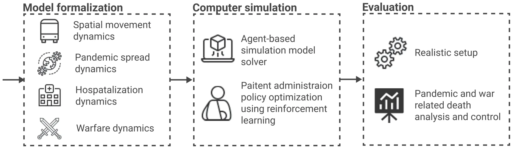
<figcaption><strong>Figure 1.</strong> A schematic view of the study’s design.</figcaption>
</figure>

## Spatio-temporal Pandemic Modeling

Pandemics can arise from various sources, including sexually transmitted diseases,69 socially influenced behavior,20 and airborne diseases.25 Airborne pandemics have raised the most concern due to their high infection rates and the wide population they can affect without restriction. This category of airborne pandemics includes various pathogens such as influenza, Lassa virus, COVID-19, and Nipah virus, among others.88

Modeling pandemic spread and control is a complex interdisciplinary endeavor that requires understanding various domains like mathematics, biology, medicine, sociology, and economics; all of which influence or are influenced by pandemics and pandemic intervention policies (PIPs).49,72 These models can generally be categorized into statistical models and mechanistic models. Statistical models rely on data-driven approaches without specific assumptions on dynamics, often using statistical and machine learning methods for forecasting some properties related to the pandemic.36,74 On the other hand, mechanistic models, commonly exemplified by the Susceptible-Infected-Recovered (SIR) model, operate based on theoretical principles to explain pandemic dynamics.28 For instance, the SIR model assumes that the population is divided into susceptible, infected, and recovered individuals such that each infected individual infected on average β susceptible individuals and that infected individuals recover and become recovered at a rate γ .39 The SIR model’s simplicity often falls short in capturing real-world pandemic dynamics,61 leading to the development of numerous extensions and adaptations.1,91 These extensions are typically divided into spatial and temporal categories. Spatial extensions are represented either by norm-based or graph-based models, addressing the well-mixed population assumption used in the SIR model. Temporal extensions introduce more types of interactions and properties for individuals in the population, which play a role in the spread of the pandemic.46

Recently, several spatio-temporal extended SIR-based models have been proposed to better capture the spread of the COVID-19 pandemic.9,37,38,47,52 For instance, Viguerie et al. proposed a partial differential equation (PDE) with the SEIRD (E - exposed, D - dead) model based spatio-temporal.86 Different diffusion parameters are also factored in for various population groups with spatial movement across a large population modeled using an inhomogeneous random walk, converging to a second-order differential operator in the limit. The authors applied this model specifically to the COVID-19 outbreak in Lombardy, Italy, focusing on the initial 6 months of the pandemic. Goel and Sharma (2021) introduced a location graph-based SIR model where each graph node represents a location inhabited by a subset of the population.32 In their model, susceptible individuals can become infected either through contact with infectious individuals at the same node (local infection) or through infectious individuals from neighboring nodes who visit their node (global infection). The authors also factored in social connectivity, which represents the average number of individuals moving between nodes, thus facilitating global infection. In our model, we follow this trend, proposing a graph-based extended SIR model for the pandemic spread.

Moreover, multiple models also take into consideration the complex relationship between health care systems and pandemics.34,90 For example, Fox et al. (2022) used a stochastic extended SIRD model with symptomatic infectious, asymptomatic infectious, and hospitalized individuals such that the model’s parameters are binomial distributed rather than constant.31 The authors used data from COVID-19 in Texas (US) to predict the number of hospitalized individuals over time due to the pandemic. Similarly, Li and Zhang (2017) integrated the average quality of treatment into the SIR model to capture the pandemic spread with different levels of health care systems.55 In our model, we also include a health care system, extending it to handle both pandemic-related patients and soldiers with war injuries.

## Model Definition

During times of war, countries are divided into civilian and war zones,85 each hosting distinct yet interconnected populations of civilians and soldiers. In civilian zones, individuals engage in various activities such as commuting for work, accessing social services, or leisure purposes like tourism.29 Similarly, war zones consist of multiple locations where soldiers are deployed and often commute between, either for operational duties or to civilian areas for rest and recuperation. The effectiveness of soldiers in fulfilling their duties in war zones is critically dependent on adequate personnel availability.78 Injured soldiers in war zones are evacuated to health care centers—either military or civilian—where the proximity of the facility to the site of injury significantly impacts the quality of care and recovery outcomes.58,62 Compounding the challenges of war, pandemics can emerge, affecting both soldiers and civilians. Infected individuals may present as asymptomatic or symptomatic, with the latter at greater risk of death without timely medical intervention.33 To improve survival rates, symptomatic individuals often require hospitalization, emphasizing the importance of accessible health care during such crises.53,92 Figure 2 presents a schematic view of the pandemic spread with a dual health care system during a war model.

<figure id="fig-2">
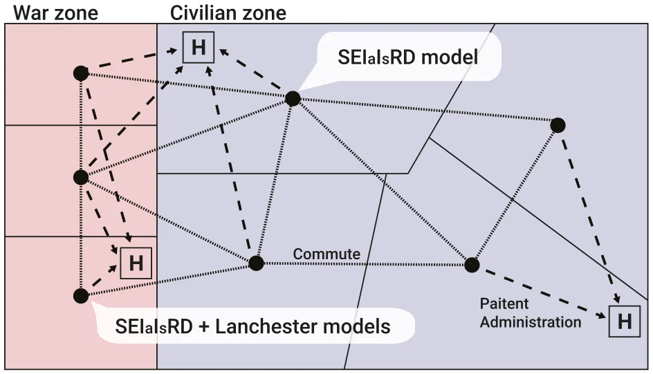
<figcaption><strong>Figure 2.</strong> A schematic view of the pandemic spread with a dual health care system during war model. The dynamics can be divided into 4 interconnected components: pandemic spread (SEIaIsRD model), war-related death and wounded soldiers (Lanchester model), commute between locations (graph-based model), and health care system (functional model).</figcaption>
</figure>

To capture the epidemiological dynamics during warfare involving civilian and military populations within a dual-use health care system, we propose a spatio-temporal framework that integrates an extended SIR model for epidemiological dynamics and the Lanchester model for warfare dynamics. For simplicity, we divide the proposed model into 4 components: spatial movement, pandemic spread, hospitalization, and warfare. Based on these components, we assemble a single mathematical framework.

Formally, we define the spatio-temporal model that captures these dynamics as follows. A model, M , is defined by the tuple M ≔ G,P,H,W ( ) such that G is the graph of locations and possible commute between them, P is the pandemic spread dynamics, H is the association of health care centers with locations and their treatment dynamics, and W is the war-related dynamics. Below, we define each component independently and then combine them into a single framework.

## Spatial graph representation

Let us consider a graph G≔ Vw,Vc,E ( ) where Vw is the set of war zone locations, Vc is the set of civilian locations, and E is the set of possible commutes between all locations, such that E ⊆ Vw∪Vc ( ) × (Vw∪Vc ) × ℝ2. Each location contains 2 sub-populations - a civilian and a military. In terms of the pandemic spread, the populations are well-mixed1 and heterogeneous. For the commute dynamics, each edge e ≔ i,j.cw,cc ( ) ∈E between nodes i and j, has 2 weights cw and cc indicating the average commute between the 2 locations for military and civilian sub-populations, respectively. In practice, cw and cc are time-dependent, however, for simplicity, we use the average value over time.

## Pandemic spread dynamics

We adopted the SEIaIsRD model.12,51,63 Namely, the model considers a constant population with a fixed number of individuals N. For simplicity, and given the short time horizon of interest, we abstract from population growth. Each individual belongs to 1 of the 6 groups: susceptible S ( ), exposed E, asymptomatic infected ( ), symptomatic infected Is Ia ( ), recovered R ( ), and dead D ( ) such that N = S + E + Ia + Is + R + D . Individuals in the first group have no immunity and are susceptible to infection. When an individual in the susceptible group (S) is exposed to the pathogen, the individual is transferred to the exposed state (E) at rate β. The individual stays in the exposed state for ψ time steps in time and then transforms to either the asymptomatic infected group (Ia) or symptomatic infected group (Is) with rate ρand 1−ρ, respectively. The individual stays in the symptomatic infected group on average γs time steps, after which the individual is transferred to the recovered group (R) or the dead group D ( ) with rate λ and 1−λ, respectively. All asymptomatic infected individuals stay in the infected Ia group on average γa time steps, after which the individual is transferred to the recovered group R ( ). The recovered are again healthy, no longer contagious, and immune from future infection. The epidemiological dynamics are formally described below using a system of ordinary differential equations:

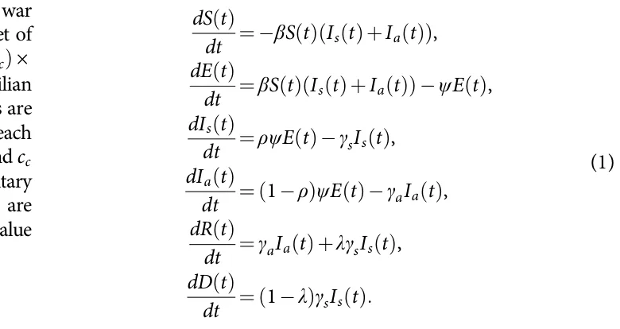

<figure id="fig-3">
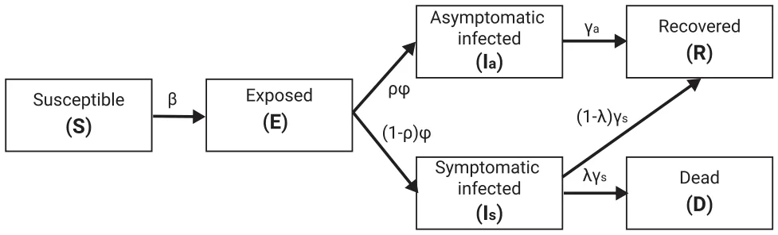
<figcaption><strong>Figure 3.</strong> A schematic view of the pandemic spread model presenting the epidemiological states and the transformations between them.</figcaption>
</figure>

Figure 3 presents a schematic view of the pandemic spread models, divided into its epidemiological states.

## Hospitalization dynamics

The health care system is based on a set of health care service provider locations. Each health care service provider’s location is able to treat a number of individuals (μs) while providing the best clinical treatment possible which reduces the probability of dying due to the pandemic or war injuries (λ,ε) in a rate ζ s. However, once the number of individuals administrated to the health care center extends μs, the treatment performance is linearly decreasing until μf individuals are administrated to the health care center where the treatment performance is reaching ζ f. In other words, Ψ : ℕ→ 0,1 [ ], indicates the reduction in the probability of dying due to the pandemic (λ) as a function of the number of administrated individuals:

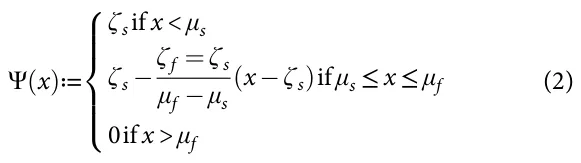

Figure 4 presents a schematic view of the hospitalization performance as a function of the number of administrated individuals.

<figure id="fig-4">
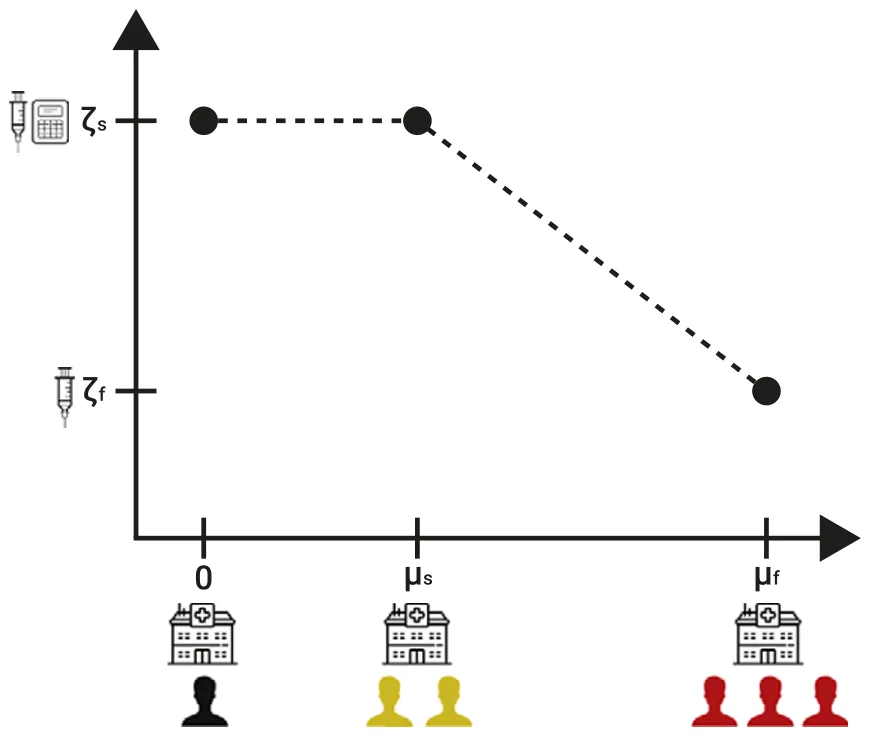
<figcaption><strong>Figure 4.</strong> A schematic view of the hospitalization performance as a function of the number of administrated individuals.</figcaption>
</figure>

## War dynamics

To capture the war dynamics, we adopted the Lanchester model43 and added wounded soldiers dynamics. Formally, we assume that there are only 2 combating sides and that the 2 sides comprise a homogeneous force. Let us consider A t( ) and B t( ) to be the sizes of the 2 armies at time t. Each side has an average performance of reducing the size of the other army denoted by εa and εb, respectively. From the population that was removed from each army at some point in time t, a portion is only wounded with injury rates of θa and θb, respectively. Wounded soldiers do not participate in the war and die out at a rate d if not treated. Formally, this dynamic takes the form:

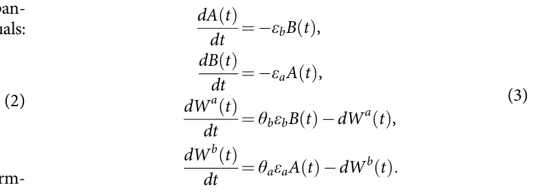

## Assembling the components into a single framework

To assemble the 4 components into a single framework, one has to outline the relationship between the components. First, the graph-based spatial component introduces a spatial separation to local interaction - either for the war or pandemic dynamics as well as a commute between the locations, it enforces the later dynamics to occur on each node of the graph and includes movement of the population. Next, the pandemic’s spread should consider both soldiers and civilians to fit the war dynamics and the commute dynamics that occur in parallel. The pandemic and war occurring for both armies in each location are combined into a single process. Finally, both symptomatic infected individuals and wounded soldiers are administrated to health care service providers according to some policy.

To this end, the framework is presented at the node level such that the dynamics in all the nodes occur in parallel over time. Because there are both civilian and war-related nodes, we describe the dynamics in each separately. Starting with the civilian node, the dynamics take the following form:

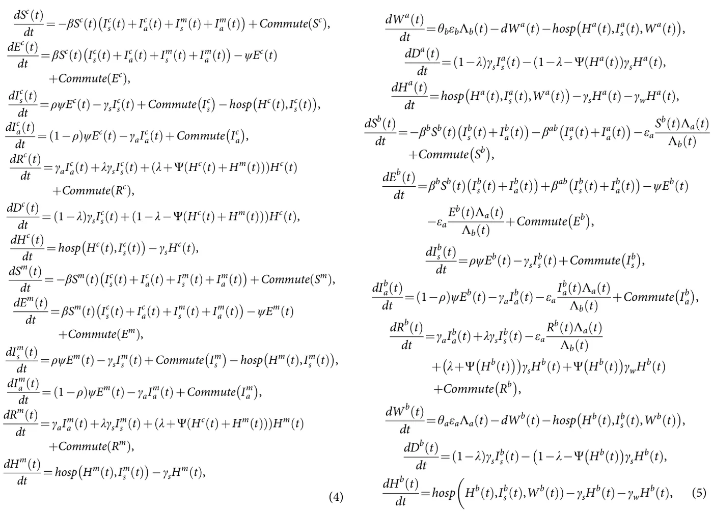

where n ≔∣Vw∣+∣Vc∣ is the total number of nodes, mi,j is the average commute between nodes i and j , Commute X ( )≔ Pn ( ) −Pn ( ) j=1,j ≠k mj,kXj t( ) j=1,j ≠k mk,jX t( ) , and hosp x,y ( ) is the patient administration policy for symptomatically infected individuals. For the war nodes, the dynamics occur for 2 army groups as it is assumed no citizens of either side of the war are present in such locations. Thus, the dynamics take the form:

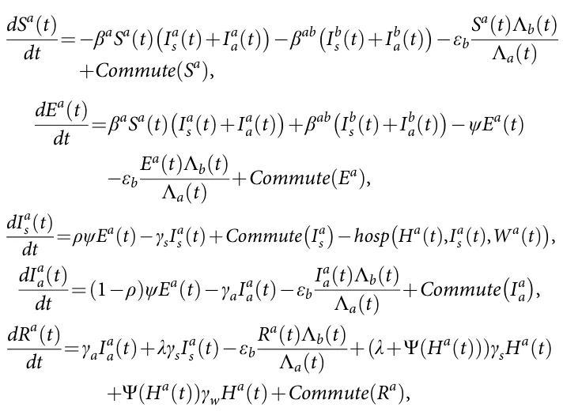

where βa, βb, and βab are the infection rates of the first army, second army, and between armies. We denote Λa t( ) = Sa t( ) + Ea t( ) + Ia a t( ) + Ra t( ) and Λb t( ) = Sb t( ) + Eb t( ) + Ib a t( ) + Rb t( ).

## Computer Simulation

In this section, we present an agent-based simulation (ABS) approach to solve the proposed model (Eq. [4-5]), followed by a reinforcement learning-based model to derive a (near-)optimal patient administration policy.

## System Solver Using Agent-based Simulation

We implemented the proposed model (Eq. [4-5]) using the ABS approach following the scheme proposed by Labeznik (2023).46 Formally, let us assume a population of agents allocated to a graph of location (G) in some pre-defined distribution. These agents move and interact in discrete finite time steps t ∈ 1,…,T [ ], where T < ∞. In order to use the ABS approach, one has to define the agents in the dynamics as well as their 3 types of interactions: agent-agent, agent-environment, and spontaneous (i.e., depends only on the agent’s state and time).82 To this end, for our model, each agent is represented by a timed finite state machine3 with its epidemiological-clinical status (S,E,Ic,Ia,R,D,W,H), current location (v ∈Vm∪Vc), and sociological status (solder or civilian). The simulation starts by generating the location graph and allocating the agents inside it with their walking dynamics, as indicated by the average commute rate between each of the 2 locations, and epidemiological state. Next, iteratively, until a stop condition is met or a pre-defined number of steps in time is reached, the simulation solves the dynamics of each node in a random order. First, the portion of the population in each node moves to other nodes according to the average commute rate between locations. Afterward, the epidemiological and war-related dynamics take place (Eq. [4-5]). Finally, individuals are allocated to health care centers according to some patient administration policies. Notably, health care centers and locations can be associated in many-to-many manner.

## Patient Administration Policy Optimization

In this section, we outline a deep reinforcement learning (DRL) model to determine the optimal patient administration policy aimed at minimizing overall mortality, considering deaths from both war-related causes and the pandemic. The RL method leverages the agent-based simulation (ABS) model described earlier to iteratively improve decision-making regarding the allocation of patients to health care centers.

The goal of the DRL method is to identify a patient administration policy π that minimizes the cumulative death count over the simulation period t ∈ 0,T [ ]. The administration policy π ( ) determines the actions (patient administration) based on the current state of the system, which includes the epidemiological-clinical status of individuals, their locations, and the capacity and status of health care centers. Formally, the RL model’s state space at time t (st ) is a comprehensive representation of the current situation, including, the epidemiological status of individuals (S,E,Is,Ia,R,D,W,H), their current location (v ∈Vm∪Vc), sociological status, and current capacity and occupancy of health care centers, as well as the state of the other army in the war zones. The action space, A, is composed of the set of patient administrations from all nodes in the graph to all health care centers and represented by a tensor of size ∣Vm∪Vc∣× ∣C∣× 2 such that ∣C∣indicates the number of health care centers where each value in the tensor is a 2-dimensional vector indicating the number of civilians and soldiers allocated to each of the health care centers. The reward function of the RL model for time t is

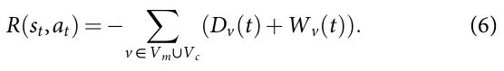

We employ a deep Q-network (DQN) algorithm [92], a model-free, online, and off-policy RL method, to optimize the patient administration policy. A DQN algorithm is a value-based RL method that trains a critic to estimate the expected discounted cumulative long-term reward when following the optimal administration policy. For the neural network architecture, we used 3 hidden layers including an LSTM with 64 neurons and 2 fully connected layer of sizes 64 and 32 with ReLu activations. The output layer’s size corresponds to the number of health care centers (∣C∣). Notably, during the training phase, actions involving nodes that cannot allocate civilians and/or soldiers to specific hospitals, or to hospitals that are already at full capacity, were masked by assigning a large negative value to their corresponding entries in the action space (−109).

The RL algorithm is implemented within the ABS framework, enabling the simulation of various patient administration strategies and their impacts on overall mortality. Through iterative learning, the administration policy π converges towards an optimal strategy that effectively allocates patients to minimize deaths from both war-related causes and the pandemic. Formally, in order to allow the RL model to learn a representative policy, we repeat each ABS configuration multiple times and then alter the ABS configuration. Table 1 presents the parameter values of the DRL model. The parameter values are chosen using a manual trial-and-error to achieve a good administration policy’s performance.

<figure class="table-figure" id="table-1">
<figcaption><strong>Table 1.</strong> Hyperparameters for training the Q-learning model</figcaption>

<table><tr><th>Hyperparameter</th><th>Description</th><th>Default value</th></tr><tr><td>Learning Rate</td><td>Step size for updating the Q-values</td><td>0.001</td></tr><tr><td>Discount Factor</td><td>Factor to discount future rewards</td><td>0.98</td></tr><tr><td>Exploration Rate</td><td>Probability of choosing a random action</td><td>0.15</td></tr><tr><td>Min. Exploration Rate</td><td>Minimum value of the exploration rate</td><td>0.02</td></tr><tr><td>Exploration Decay Rate</td><td>Rate at which the exploration rate decays</td><td>0.985</td></tr><tr><td>Replay Buffer Size</td><td>Number of experiences stored in the replay buffer</td><td>104</td></tr><tr><td>Batch Size</td><td>Number of experiences sampled from the replay buffer</td><td>8</td></tr><tr><td>Number of Episodes</td><td>Total number of episodes for training</td><td>100</td></tr><tr><td>Maximum Steps per Episode</td><td>Maximum number of steps per episode</td><td>2160</td></tr></table>

</figure>

## Evaluation

To evaluate the proposed model, we first established realistic, while synthetic, scenarios. The sociological and movement parameters such as the population size and number of nodes in the graphs (which represent central cities) aim to capture a large-scale region up to the entire western country.89 For the pandemic’s spread, we focused on the COVID-19 pathogen due to the large amount of accurate recorded data associated with this pathogen.10 The warfare and hospitalization parameters ranged greatly in the literature. As such, we adopted a range without anomalies. Table 2 summarizes the parameters and their values as these are used by the proposed model.

Initially, we train the proposed DRL model to learn a (near-) optimal policy for patient administration. Figure 5 shows the relative performance of the DRL model, with aims to decrease the total number of deaths from both the pandemic and war (see Eq. [6]), with respect to the normalized random allocation (baseline) that is computed for n = 100 random simulations. Initially, the DRL’s performance is comparable to the baseline one, as it is also initialized with random logic. Next, for the first 80 simulations, the DRL performance was worse than the baseline, up to 35% in comparison. This initial decline in performance can be attributed to the exploration phase of the DRL model which searches for policies that may be worse than random allocation, such as no-allocation at all. However, after this point, a relatively smooth exponential improvement in the DRL’s performance occurs, converging to around 30% of the baseline performance (i.e., 70% improvement) after 800 simulations. Notably, around the 300-350 and 625-675 simulations, a local divergence takes place which can be associated with a local optimum of the optimization process converging and requires more exploration to overcome it and re-converge to more global optima.97

Next, to evaluate the performance of the DRL model, we compared it to 2 baseline policies and 2 single-usage health care polices. Figure 6 shows the overall death as the mean ± standard deviation of ntest = 100 simulations following a ntrain = 1000 simulation to train the DRL model for each case, divided into 4 patient administration policies - no patient administration, random allocation up to full capacity, optimized based on Eq. (6), DRL model optimized to reduce the death of soldiers alone, and DRL model optimized to reduce the death of civilians alone. The optimal configuration is found to be statistically significantly better based on ANOVA (Analysis of Variance) with Tukey post-hoc test79 with p < 0.05. Unsuspectingly, the case with no health care system is significantly worse than the other cases, with slightly over 4% death of the population. The naive random allocation results in less than half of the percent of death while also the standard deviation is smaller, as indicated by the error bars. Moreover, comparing the single-usage health care cases, in the form of the soldiers and civilians alone cases, the latter is statistically significantly worse, with p < 0.01 based on a Mann–Whitney U test.59

Figure 6 revealed that providing health care services to soldiers, on average, results in overall less death in a population. Nevertheless, taking civilians into account provides a statistically significant improvement. Thus, we further explore the death and injured dynamics of soldiers over time. Figure 7 shows the wounded soldiers and overall deaths (both soldiers and civilians) over time under the optimal DRL administration policy. The results are presented as the mean ± standard deviation of n = 100simulations, assuming a fixed population size of N = 5·106, with 10% of the population comprising army personnel. For the injured soldiers, an initial linear increase is observed up to the 35th simulation step, aligning with the expectations of the Lanchester model (see Eq. [3]). Afterward, a more chaotic pattern emerges, characterized by a slower rate of increase, which can be attributed to treated soldiers returning from the health care system. This behavior persists until approximately the 75th simulation step. These dynamics are followed by another increase up to the 110th simulation step, after which the values stabilize for approximately 35 simulation steps. Subsequently, a sharp decline is observed, reaching zero around the 185th simulation step. This decline can be explained by the end of the war as the other army is eliminated. In a complementary manner, the total deaths exhibit a monotonically increasing trend with a sigmoid-like pattern, reflecting the combined fatalities of injured soldiers who succumbed to war-related injuries and both soldiers and civilians who died due to the pandemic. The impact of injured soldiers on total deaths is twofold: their presence drives a faster-than-linear increase in deaths, delayed relative to their numbers. This strain on the health care system, occupied with treating injured soldiers, limits its capacity to manage infected individuals, exacerbating pandemic spread and mortality.

<figure class="table-figure" id="table-2">
<figcaption><strong>Table 2.</strong> The model’s parameters’ description, value ranges, and sources</figcaption>

<table><tr><th>Symbol</th><th>Description</th><th>Value range</th><th>Source</th></tr><tr><td>N</td><td>Initial population size</td><td>106 108</td><td>Assumed</td></tr><tr><td></td><td>Portion of the population participating in the army</td><td>0:01 0:1</td><td>Assumed</td></tr><tr><td></td><td>Number of hospitals</td><td>1–6</td><td>Assumed</td></tr><tr><td>∣Vm∣</td><td>Number of war-zone nodes of the graph</td><td>1–20</td><td>Assumed</td></tr><tr><td>∣Vc∣</td><td>Number of civilian nodes of the graph</td><td>10–100</td><td>Assumed</td></tr><tr><td>T</td><td>Total number of simulation steps</td><td>200</td><td>Assumed</td></tr><tr><td>Δt</td><td>Time steps in each simulation iteration</td><td>1 hour</td><td>Assumed</td></tr><tr><td>cw,cc</td><td>Average commute rates between locations</td><td>1 10 5 5 10 4</td><td>[4]</td></tr><tr><td>β</td><td>Average infection rate</td><td>0:0014 0:0072</td><td>[52]</td></tr><tr><td>ρ</td><td>Symptomatic rate</td><td>0:01 0:1</td><td>[52]</td></tr><tr><td>λ</td><td>Death rate</td><td>0:0014 0:0072</td><td>[52]</td></tr><tr><td>ψ</td><td>Average incubation time in days spent in the exposed state</td><td>4 7</td><td>[52]</td></tr><tr><td>γs</td><td>Average time in days spent in the symptomatically infected state</td><td>10 18</td><td>[52]</td></tr><tr><td>γa</td><td>Average time in days spent in the asymptomatic infected state</td><td>7 10</td><td>[52]</td></tr><tr><td>μs</td><td>Maximum number of patients hospitals can treat without effect on clinical performance</td><td>1000 10000</td><td>Assumed</td></tr><tr><td>μf</td><td>Maximum number of patients hospitals can treat overμs</td><td>125% 150%</td><td>Assumed</td></tr><tr><td>ζ s</td><td>The baseline rate of recovery from pandemic or war injuries</td><td>0:95 0:99</td><td>[43]</td></tr><tr><td>ζ f</td><td>The baseline rate of recovery from pandemic or war injuries when the hospital is full</td><td>0:8 0:95</td><td>[43]</td></tr><tr><td>εa,εb</td><td>Military death rate due to war</td><td>1 10 5 5 10 5</td><td>[80]</td></tr><tr><td>θa,θb</td><td>Military injury rate due to war</td><td>1 10 5 5 10 5</td><td>[80]</td></tr><tr><td>d</td><td>Death rate of wounded soldiers that were not treated</td><td>4:07 10 5</td><td>[87]</td></tr></table>

</figure>

Figure 7 reveals non-linear and phase-dependent dynamics, which further increase the uncertainty of the dynamics. Because the model assumes know-in-advance war results, in the form of the Lanchester model, the uncertainty can be associated with the pandemic spread, which “breaks” the symmetry in the Lanchester dynamics at the node level. Thus, the event optimization horizon for which the DRL model is trained should result in different performances. To this end, Figure 8 shows the mean percent improvement over the random administration (baseline) policy for ntest = 100 simulations followed by ntrain = 1000 simulations. Notably, the model’s performance improves when the event optimization horizon aligns with the average recovery rate. Interestingly, this trend holds even for a 28-day event optimization horizon, suggesting that other dynamics, such as warfare, have a secondary effect on administration policy optimization due to their greater predictability.

<figure id="fig-5">
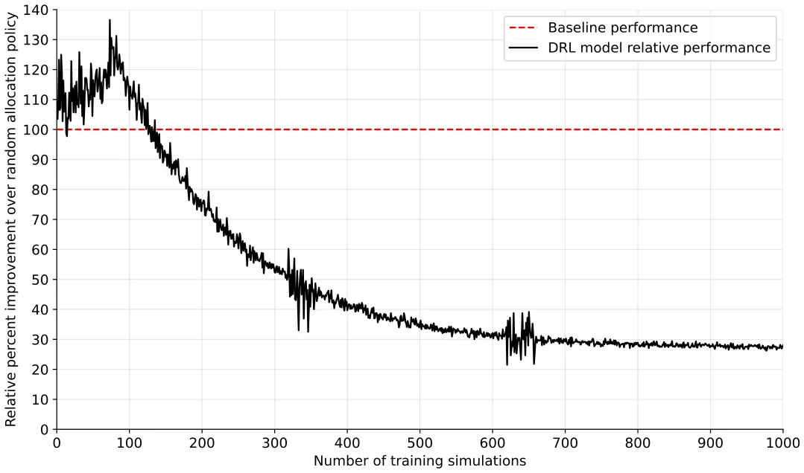
<figcaption><strong>Figure 5.</strong> The DRL’s administration policy’s average performance normalized to the naive administration policy for n = 100 simulations as a function of the number of training simulations.</figcaption>
</figure>

<figure id="fig-6">
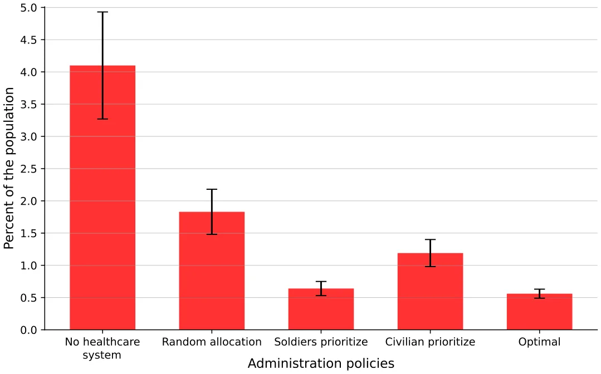
<figcaption><strong>Figure 6.</strong> Overall death as a function of different administration policies. The results are shown as the mean ± standard deviation of n = 100 simulations.</figcaption>
</figure>

## Conclusion

In this study, we have developed a novel spatio-temporal model to address the complex dynamics of dual-use health care administration policy during a pandemic in wartime conditions. By extending the SIR model to include the effects of both civilian and military populations, we offer a comprehensive framework that captures the intricate interactions between pandemic spread, war dynamics, and health care system performance. Our model incorporates 4 key components: spatial movement, pandemic spread, hospitalization dynamics, and warfare dynamics. By integrating these components, we offer a comprehensive representation of the interplay between pandemics and wars and their mutual impacts.

As an intervention strategy to reduce overall population deaths, we propose a DRL-based model that optimizes health care administration policy using in silico data generated by the proposed agent-based simulation framework. The inclusion of a dual health care system allows for the differentiation between civilian and military medical services, highlighting the unique challenges and administrative policies in both contexts.

<figure id="fig-7">
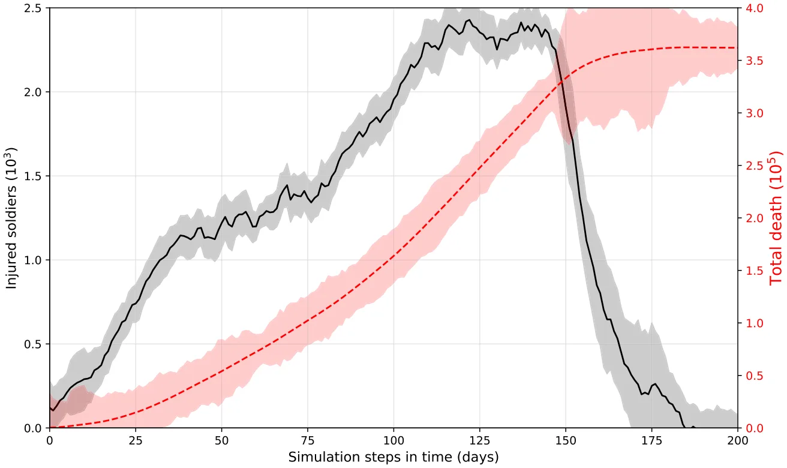
<figcaption><strong>Figure 7.</strong> The wounded soldiers and overall deaths (both soldiers and civilians) over time using the optimal DRL administration policy. The results are shown as the mean ± standard deviation of n = 100 simulations assuming a fixed population size of N = 5·106, with 10% of the population are in the army.</figcaption>
</figure>

<figure id="fig-8">
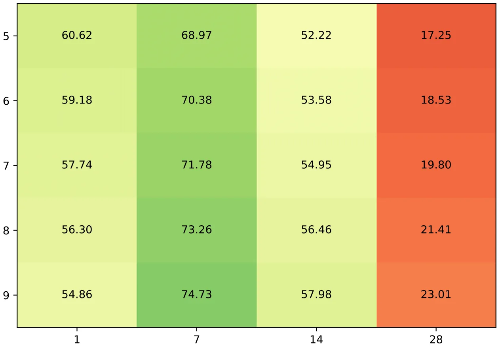
<figcaption><strong>Figure 8.</strong> The mean percent improvement over the random administration (baseline) policy for ntest = 100 simulations followed by ntrain = 1000 simulations.</figcaption>
</figure>

As shown in Figure 5, the DRL model successfully learns an optimal administration policy, reducing the death toll by 70% compared to a naive policy in which patients are randomly allocated, provided hospitals are not at full capacity. Moreover, the evaluation of the DRL model compared to other baseline and single-usage health care policies, as shown in Figure 6, highlights its effectiveness. The DRL policy optimized for overall population health demonstrated statistically significant improvements over other strategies. Specifically, the allocation strategy focused solely on soldiers led to fewer deaths than the one focused solely on civilians, but the combined optimization yielded the best overall results. These findings underline the importance of accounting for both military and civilian health in designing administrative policies, as neglecting 1 population segment leads to suboptimal outcomes. In addition, focusing on only 1 population segment can raise sociological and ethical challenges in practice.

Further insights into the dynamics of death and injury under the optimal DRL administration policy are provided in Figure 7. The time-dependent behavior of wounded soldiers and overall deaths reveals non-linear and phase-dependent dynamics. For example, the sharp decline in wounded soldiers around the 185th simulation step coincides with the end of the war, whereas the sigmoid-like increase in total deaths reflects the dual impact of injuries from war and deaths from the pandemic. The delay in responding to pandemic needs due to the saturation of the health care system by injured soldiers highlights a critical trade-off between war-related injuries and pandemic management. To this end, Figure 8 illustrates the relationship between the optimization event horizon and the performance of the DRL model. The results indicate that shorter event optimization horizons, aligned with the average recovery rate, yield better outcomes. This suggests that the predictability of war dynamics, as described by the Lanchester model, allows the DRL model to focus on mitigating the more uncertain and impactful pandemic spread. Importantly, even with longer event optimization horizons, the model maintains a degree of robustness, though the influence of pandemic dynamics becomes more pronounced.

This study is not without limitations. First, the proposed model and simulation considered relatively short periods of time and therefore do not take into account population growth, reinfection, and multipathogen pandemics.4,41,57,77,84 However, because wars can be extended over many years,81 this assumption may not hold. Future work could relax these assumptions to improve the model’s robustness. In addition, the model assumes simplified military contact patterns and neglects the complexity of modern warfare. Although the current approach assumes a historical perspective in which battles occur far from civilian zones,83 extending the model to include civilian casualties common in contemporary conflicts40 would improve its applicability. Furthermore, the model assumes isolation, ignoring international interdependencies during wars and pandemics.2 Lastly, the simulation only considers 1 side of the war, neglecting the asymmetric nature of conflicts and assuming a static opposing force. Future studies should incorporate dynamic interactions between opposing forces to better capture real-world complexities73 and consider more refined socio-demographic grouping for the administration policies.75,95,96

Taken together, our model provides valuable insights into designing effective health care and pandemic policies during wartime. For government agencies, understanding the predicted impact of conflict on disease spread can help prioritize resource allocation and intervention strategies. For military organizations, the model’s predictions can guide operational planning to minimize health impacts on both civilian populations in war zones and military personnel. Further investigation is required to refine and extend the proposed model for greater practical utility.

**Data availability statement.** The code and data that have been used in this study are publicly available in this study’s GitHub repository: https://github.com/shuchaa/pandemic\_during\_war\_abs.

**Acknowledgments.** The authors wish to thank Noga Givon-Lavi for the clinical-epidemiological consulting.

**Author contribution.** Adi Shuchami: Conceptualization, Formal Analysis, Investigation, Software, Visualization, Writing – original draft.

Teddy Lazebnik: Conceptualization, Data curation, Formal Analysis, Investigation, Methodology, Supervision, Visualization, Writing – original draft, Writing – review & editing.

**Funding statement.** This study received no funding.

**Competing interests.** The authors declare none.

## References

1. Adiga A, Dubhashi D, Lewis B, et al. Mathematical models for COVID-19 pandemic: a comparative analysis. J Indian Inst Sci. 2020;100(4):793–807.
2. Aguas R, White L, Hupert N, et al. Modelling the COVID-19 pandemic in context: an international participatory approach. BMJ Glob Health. 2020; 5(12):e003126.
3. Alagar VA, Periyasamy K. Extended finite state machine. In: Specification of Software Systems. Springer: 2011;105–128.
4. Alexi A, Rosenfeld A, Lazebnik T. Multi-species prey–predator dynamics during a multi-strain pandemic. Chaos. 2023;33(7):073106.
5. Aligne CA. Overcrowding and mortality during the influenza pandemic of 1918. Am J Public Health. 2016;106(4):642–644.
6. Anghel V, Jones E. Is Europe really forged through crisis? Pandemic EU and the Russia – Ukraine war. J Eur Public Policy. 2023;30(4):766–786.
7. Ansart S, Pelat C, Boelle P-Y, et al. Mortality burden of the 1918–1919 influenza pandemic in Europe. Influenza. 2009;3:99–106.
8. Balcells L, Steele A. Warfare, political identities, and displacement in Spain and Colombia. Pol Geogr. 2016;51:15–29.
9. Bearman PS, Moody J, Stovel K. Chains of affection: the structure of adolescent romantic and sexual networks. Am J Sociol. 2004;110:44–91.
10. Betthäuser BA, Bach-Mortensen AM, Engzell P. A systematic review and meta-analysis of the evidence on learning during the COVID-19 pandemic. Nat Hum Behav. 2023;7(3):375–385.
11. Brodeur A, Gray D, Islam A, et al. A literature review of the economics of COVID-19. IZA Discussion Paper No. 13411. 2020. https://ssrn.com/abstract=3636640 [link](https://ssrn.com/abstract=3636640)
12. Cai J, Zhou J. How many asymptomatic cases were unconfirmed in the US COVID-19 pandemic? The evidence from a serological survey. Chaos Solit. 2022;164:112630.
13. Cascini F, Hoxhaj I, Zaçe D, et al. How health systems approached respiratory viral pandemics over time: a systematic review. BMJ Glob Health. 2020;5(12).
14. Chen X. Infectious disease modeling and epidemic response measures analysis considering asymptomatic infection. IEEE Access. 2020;8:149652–149660.
15. Choudhary OP, Saied AA, Priyanka ARK, et al. Russo-Ukrainian war: an unexpected event during the COVID-19 pandemic. Travel Med Infect Dis. 2022;48:102346.
16. Chumachenko D, Chumachenko T. Impact of war on the dynamics of COVID-19 in Ukraine. BMJ Glob Health. 2022;7(4).
17. Conti AA. Historical and methodological highlights of quarantine measures: from ancient plague epidemics to current coronavirus disease (COVID-19) pandemic. Acta Bio-medica: Atenei Parmensis. 2020;91(2):226–229.
18. Cunen C, Hjort NL, Nygard HM. Statistical sightings of better angels: analysing the distribution of battle-deaths in interstate conflict over time. J Peace Res. 2020;2:221–234.
19. Davies S, Pettersson T, Oberg M. Organized violence 1989–2022, and the return of conflict between states. J Peace Res. 2023;60(4):691–708.
20. Djillali S, Bentout S, Touaoula TM, et al. Global dynamics of alcoholism epidemic model with distributed delays. Math Biosci Eng. 2021;18.
21. Edwards SN. Understanding the present through the past: a comparison of Spanish news coverage of the 1918 flu and COVID-19 pandemics. J Mass Commun Q. 2022;99(1):12–43.
22. Erkoreka A. Origins of the Spanish Influenza pandemic (1918-1920) and its relation to the First World War. J Mol Genet Med. 2009;3(2):190–194.
23. Erkoreka A. Origins of the Spanish Influenza pandemic (1918-1920) and its relation to the First World War.” J Mol Genet Med. 2009;30(3):190–194.
24. Erkoreka A. The Spanish influenza pandemic in occidental Europe (1918– 1920) and victim age. Influenza. 2010;4:81–89.
25. Ferguson NM, Cummings DAT, Fraser C, et al. Strategies for mitigating an influenza pandemic. Nature. 2006:448–452.
26. Ferguson NM, Laydon D, Nedjati-Gilani G, et al. Impact of non-pharmaceutical interventions (NPIs) to reduce COVID-19 mortality and healthcare demand. Imperial College. 2020.
27. Fernandes GD, Maldonado V. Behavioral aspects and the transmission of Monkeypox: A novel approach to determine the probability of transmission for sexually transmissible diseases. Infect Dis Model. 2023;8(3):842–854.
28. Fernández-Villaverde J, Jones CI. Estimating and Simulating a SIRD Model of COVID-19 for Many Countries, States, and Cities. Working Paper 27128. National Bureau of Economic Research: 2020.
29. Findley MG, Young JK. Terrorism and civil war: a spatial and temporal approach to a conceptual problem. Perspect Polit. 2012;10(2):285–305.
30. Flecknoe D, Wakefield BC, Simmons A. Plagues & wars: the “Spanish Flu” pandemic as a lesson from history. Med Confl Surviv. 2018;34(2):61–68.
31. Fox SJ, Lachmann M, Tec M, et al. Real-time pandemic surveillance using hospital admissions and mobility data. Proceed Natl Acad Sci. 2022;119(7): e2111870119.
32. Goel R, Sharma R. Mobility based SIR model for pandemics – with case study of COVID-19. IEEE/ACM International Conference on Advances in Social Networks Analysis and Mining (ASONAM):2020.
33. He J, Guo Y, Mao R, et al. Proportion of asymptomatic coronavirus disease 2019: a systematic review and meta-analysis. J Med Virol. 2020:1–11.
34. Hespanha JP, Chinchilla R, Costa RR, et al. Forecasting COVID-19 cases based on a parameter-varying stochastic SIR model. Ann Rev Control. 2021; 51:460–476.
35. Huang T, Chu Y, Shams S, et al. Population stratification enables modeling effects of reopening policies on mortality and hospitalization rates. J Biomed Inform. 2021;119:103818.
36. Ivorra B, Ferrandez MR, Vela-Perez M, et al. Mathematical modeling of the spread of the coronavirus disease 2019 (COVID-19) taking into account the undetected infections. The case of China. Commun Nonlinear Sci Numer Simulat. 2020.
37. Keeling MJ. The implications of network structure for epidemic dynamics. Theor Popul Biol. 2005;67(1).1–8.
38. Keeling MJ, Eames KTD. Networks and epidemic models. JR Soc Interface. 2005;2:295–307.
39. Kermack WO, McKendrick AG. A contribution to the mathematical theory of epidemics. Proc R Soc. 1927;115:700–721.
40. Khorram-Manesh A, Burkle FM, Goniewicz, et al. “Estimating the number of civilian casualties in modern armed conflicts–a systematic review. Front Public Health. 2021;9:765261.
41. Khyar O, Allali K. Global dynamics of a multi-strain SEIR epidemic model with general incidence rates: application to COVID-19 pandemic. Non-linear Dyn. 2020;102:489–509.
42. Kozyreff G. Hospitalization dynamics during the first COVID-19 pandemic wave: SIR modelling compared to Belgium, France, Italy, Switzerland and New York City data. Infect Dis Model. 2021;6:398–404.
43. Kress M. Lanchester models for irregular warfare. Mathematics. 2020;8(5).
44. Krueger D, Uhlig H, Xie T. Macroeconomic dynamics and reallocation in an epidemic. CEPR COVID Economics. 2020;1(5):21–55.
45. Kuznar AB. Understanding war: the sociological perspective revisited. Eur J Soc Theor. 2024.
46. Lazebnik T. Computational applications of extended SIR models: a review focused on airborne pandemics. Ecol Model. 2023;483:110422.
47. Lazebnik T, Alexi A. High resolution spatio-temporal model for room-level airborne pandemic spread. Mathematics. 2023;11(2):426.
48. Lazebnik T, Blumrosen G. Advanced multi-mutation with intervention policies pandemic model. IEEE Access. 2022;10:22769–22781.
49. Lazebnik T, Bunimovich-Mendrazitsky S, Ashkenazi S, et al. Early detection and control of the next epidemic wave using health communications: development of an artificial intelligence-based tool and its validation on COVID-19 data from the US. Int J Environ Res Public Health. 2022; 19(23).
50. Lazebnik T, Bunimovich-Mendrazitsky S, Shaikhet L. Novel method to analytically obtain the asymptotic stable equilibria states of extended SIR-type epidemiological models. Symmetry. 2021;13(7).1120.
51. Lazebnik T, Bunimovich-Mendrazitsky S, Shami L. Pandemic management by a spatio–temporal mathematical model. Int J Nonlinear Sci Numer Simul. 2021.
52. Lazebnik T, Shami L, Bunimovich-Mendrazitsky S. Spatio-temporal influence of non-pharmaceutical interventions policies on pandemic dynamics and the economy: the case of COVID-19. Res Econ. 2021.
53. Lechien JR, Chiesa-Estomba CM, Place S, et al. Clinical and epidemiological characteristics of 1420 European patients with mild-to-moderate coronavirus disease 2019. J Intern Med. 2020.
54. Lemaitre JC, Grantz KH, Kaminsky J, et al. A scenario modeling pipeline for COVID-19 emergency planning. Sci Rep. 2021;11:7534.
55. Li GH, Zhang Y-X. Dynamic behaviors of a modified SIR model in epidemic diseases using nonlinear incidence and recovery rates. PLoS One. 2017;12(4):1–28.
56. Liadze I, Macchiarelli C, Mortimer-Lee P, et al. Economic costs of the Russia-Ukraine war. World Econ. 2023;46(4):874–886.
57. Lopez L, Rodo X. A modified SEIR model to predict the COVID-19 outbreak in Spain and Italy: simulating control scenarios and multi-scale epidemics. Results Physics. 2021;21.
58. McGuirk MA, Porell FW. Spatial patterns of hospital utilization: the impact of distance and time. Inquiry. 1984;21(1).84–95.
59. McKnight PE, Najab J. Mann-Whitney U Test. The Corsini Encyclopedia of Psychology. John Wiley & Sons:2010.
60. Miller JC. Mathematical models of SIR disease spread with combined nonsexual and sexual transmission routes. Infect Dis Model. 2017;2(1):35–55.
61. Moein S, Nickaeen N, Roointan A, et al. Inefficiency of SIR models in forecasting COVID-19 epidemic: a case study of Isfahan. Sci Rep. 2021;11: 4725.
62. Nicholl J, West J, Goodacre S, et al. The relationship between distance to hospital and patient mortality in emergencies: an observational study. Emerg Med J. 2007;24(9):665–668.
63. Nurlaila I, Hidayat AA, Pardamean B. Lockdown strategy worth lives: the SEIRD modelling in COVID-19 outbreak in Indonesia. IOP Conf Ser: Earth Environ Sci. 2021;729(1):012002.
64. Eylul Oruc B, Baxter A, Keskinocak P, et al. Homebound by COVID19: the benefits and consequences of non-pharmaceutical intervention strategies. Res Sq. 2020.
65. Oxford JS, Lambkin R, Sefton A, et al. A hypothesis: the conjunction of soldiers, gas, pigs, ducks, geese and horses in Northern France during the Great War provided the conditions for the emergence of the “Spanish” influenza pandemic of 1918–1919. Vaccine. 2005;23:940–945.
66. Patel SP, Moncayo OE, Conroy KM, et al. The landscape of disinformation on health crisis communication during the COVID-19 pandemic in Ukraine: hybrid warfare tactics, fake media news and review of evidence. JCOM J Sci Commun. 2020;19:102346.
67. Patterson KD, Pyle GF. The geography and mortality of the 1918-1919 influenza pandemic. Bull Hist Med. 1991;65:4–21.
68. Piret J, Boivin G. Pandemics throughout history. Front Microbiol. 2021; 11.
69. Quinn TC. Global burden of the HIV pandemic. Lancet. 1996;348(9020): 99–106.
70. Quinn VJM, Dhabalia TJ, Roslycky LL, et al. COVID-19 at war: the joint forces operation in Ukraine. Disaster Med Public Health Prep. 2022;16(5): 1753–1760.
71. Rahimi I, Chen F, Gandomi AH. A review on COVID-19 forecasting models. Neural Comput Appl. 2021.
72. Rock K, Brand S, Moir J, et al. Dynamics of infectious diseases. Rep Prog Phys. 2014;77:26602.
73. Sabin P. Simulating War: Studying Conflict Through Simulation Games. Bloomsbury Publishing: 2012.
74. Salgotra R, Gandomi M, Gandomi AH. Time series analysis and forecast of the COVID-19 pandemic in India using genetic programming. Chaos Solit. 2020;138:109945.
75. Savchenko E, Rosenfeld A, Bunimovich-Mendrazitsky S. A mathematical framework of SMS reminder campaigns for pre-and post-diagnosis checkups using socio-demographics: an in-silco investigation into breast cancer. Socio-Econ Plann Sci. 2024;95:102047.
76. Sengar KPS, Lohiya RK. A bibliometric profile of world nuclear weapons research output from 2010 to 2019: a scientometric analysis based on WoS Database. Int J Libr Inform Netw. 2022;7:110–128.
77. Shami L, Lazebnik T. Economic aspects of the detection of new strains in a multi-strain epidemiological–mathematical model. Chaos Solit. 2022;165: 112823.
78. Simonton DK. Land battles, generals, and armies: Individual and situational determinants of victory and casualties. J Pers Soc Psychol. 1980; 38(1):110–119.
79. St L, Wold S. Analysis of variance (ANOVA). Chemom Intell Lab Syst. 1989;6(4):259–272.
80. The Israeli Central Bureau of Statistics. Social and Economic Consequences of the Outbreak of the Corona Plague. The Israeli Central Bureau of Statistics [In Hebrew]. Published 2020. Accessed at 09.2024 https://www.cbs.gov.il/he/Statistical/statistical-182-corona.pdf. [link](https://www.cbs.gov.il/he/Statistical/statistical-182-corona.pdf)
81. Sullivan PL. At what price victory? The effects of uncertainty on military intervention duration and outcome. Confl Manag Peace Sci. 2008;25(1): 49–66.
82. Tesfatsion L. Agent-based computational economics: growing economies from the bottom up. Artif Life. 2002;8(1).
83. Thorne J. Battle, tactics, and the emergence of the limites in the West. A Companion to the Roman Army. 2007:218–234
84. Turkyilmazoglu M. A restricted epidemic SIR model with elementary solutions. Physica A. 2022;600:127570.
85. Verwimp P, Justino P, Bruck T. The analysis of conflict: a micro-level perspective. J Peace Res. 2009;46(3):307–314.
86. Viguerie A, Lorenzo G, Auricchio F, et al. Simulating the spread of COVID-19 via a spatially-resolved susceptible–exposed–infected–recovered– deceased (SEIRD) model with heterogeneous diffusion. Appl Math Lett. 2021; 111:106617.
87. Vytla V, Ramakuri SK, Peddi KK, et al. Mathematical models for predicting Covid-19 pandemic: a review. J Phys: Conf Ser. 2021;1797:012009.
88. Wang CC, Prather KA, Sznitman J, et al. Airborne transmission of respiratory viruses. Sci. 2021;373(6558):eabd9149.
89. Weber H, Sciubba JD. The effect of population growth on the environment: evidence from European regions.” Eur J Popul. 2019;35:379–402.
90. Weissman GE, Crane-Droesch A, Chivers C, et al. Locally informed simulation to predict hospital capacity needs during the COVID-19 pandemic. Ann Intern Med. 2020;173(1):21–28.
91. Wiratsudakul A, Suparit P, Modchang C. Dynamics of Zika virus outbreaks: an overview of mathematical modeling approaches. PeerJ. 2018.
92. Wu J, Li W, Shi X, et al. Early antiviral treatment contributes to alleviate the severity and improve the prognosis of patients with novel coronavirus disease (COVID-19). J Intern Med. 2020.
93. Wu T, Perrings C, Kinzig A, et al. Economic growth, urbanization, globalization, and the risks of emerging infectious diseases in China: a review. Ambio. 2017;46(1):18–29.
94. Yan S, Zhang Y, Ma J, et al. An edge-based SIR model for sexually transmitted diseases on the contact network. J Theor Biol. 2018;439:216–225.
95. Yaniv-Rosenfeld A, Savchenko E, Elalouf A, et al. Socio-demographic predictors of the time interval between successive hospitalizations among patients with borderline personality disorder. J Ment Health. 2024:1–7.
96. Yaniv-Rosenfeld A, Savchenko E, Netzer M, et al. Socio-demographic predictors of hospitalization duration among patients with borderline personality disorder. Adm Policy Ment Health. 2024:1–9.
97. Zhang K, Koppel A, Zhu H, et al. Global convergence of policy gradient methods to (almost) locally optimal policies. SIAM J Control Optim. 2020; 58(6).3586–3612.
