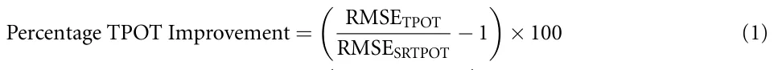
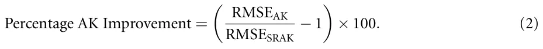
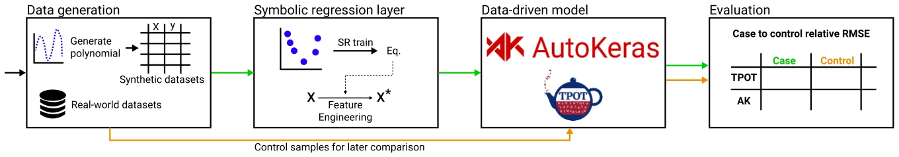
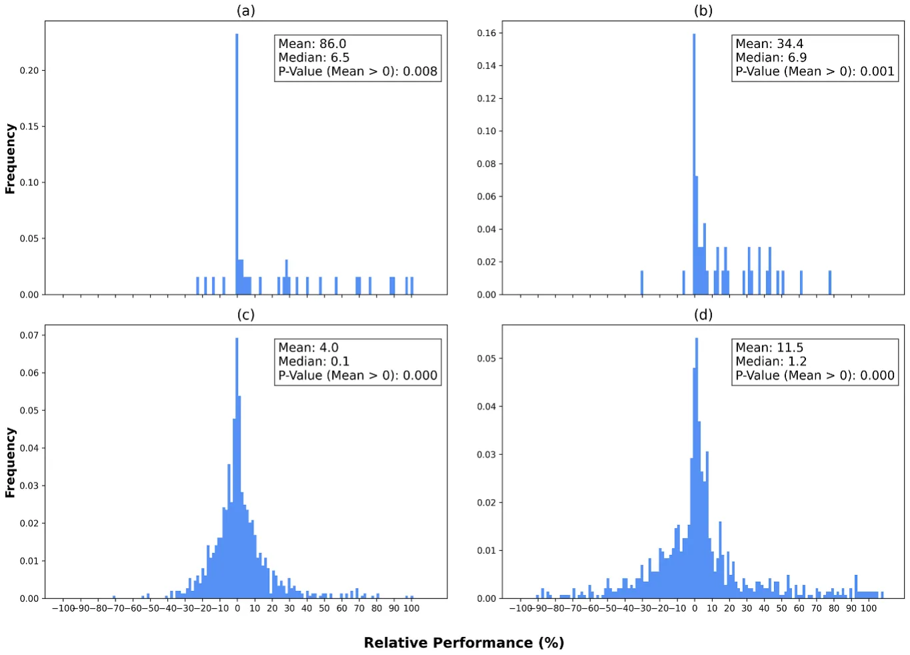
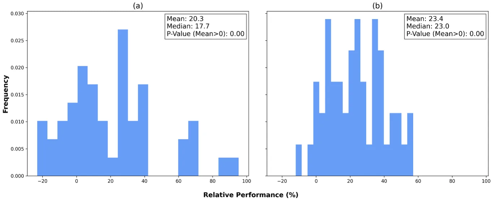
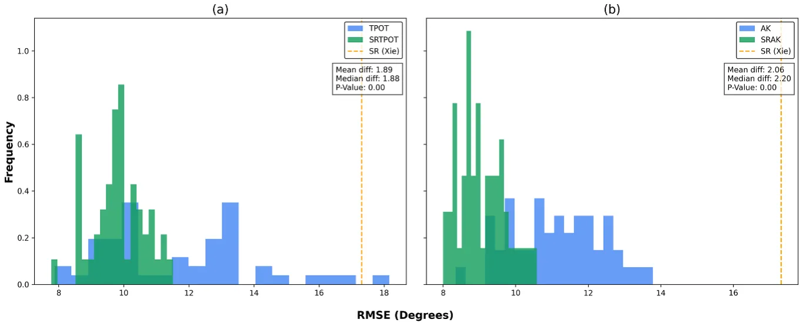
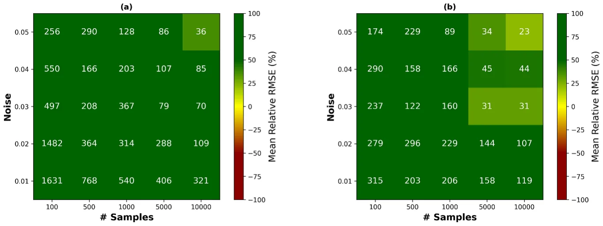
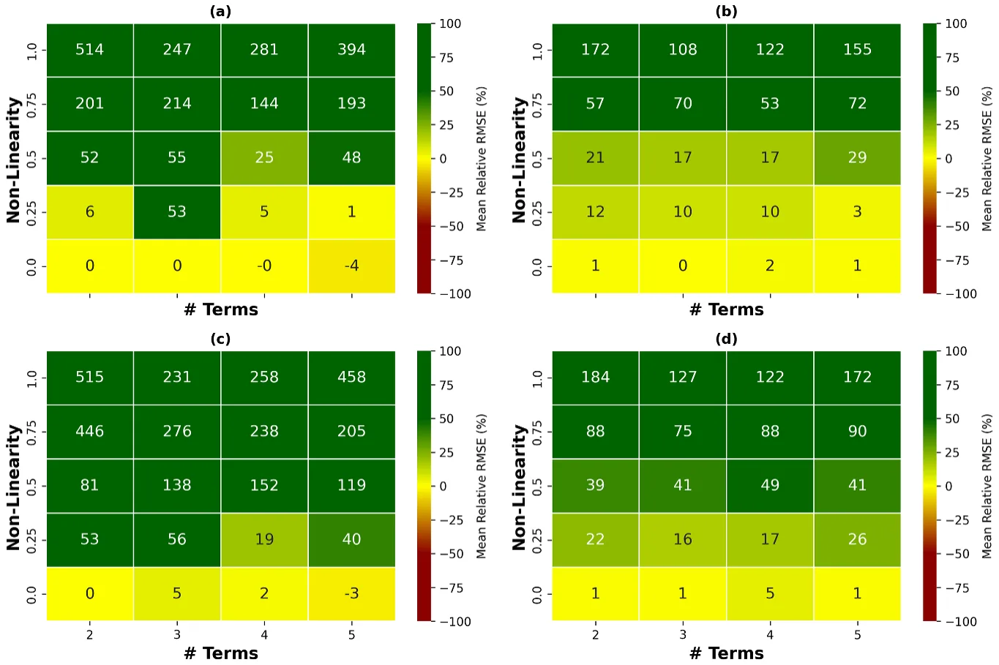
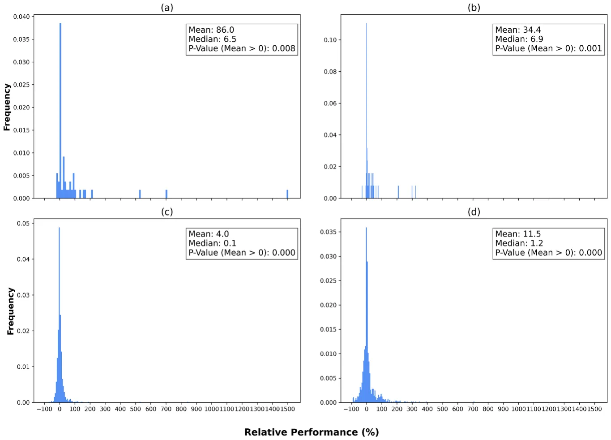
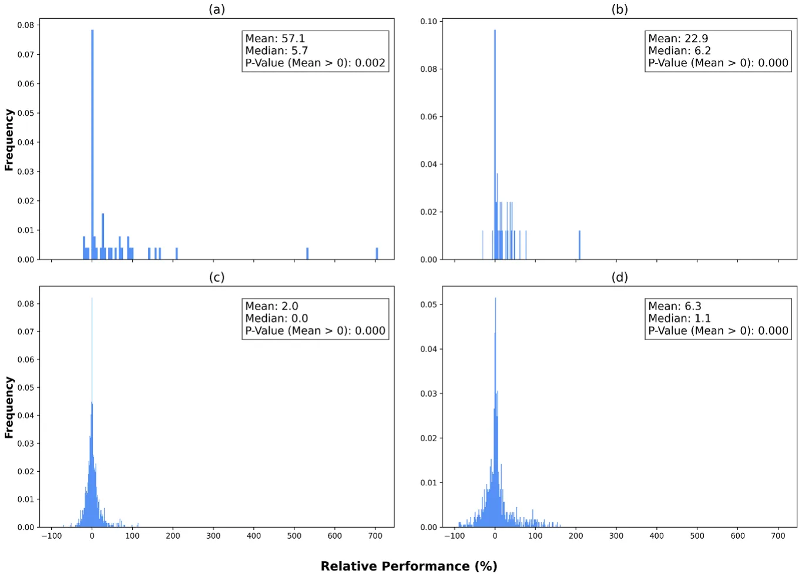

## 1. Introduction

Machine and deep learning (DL), achieving optimal performance and interpretability in regression tasks stands as a fundamental computational challenge, critical for applications spanning various fields of science and engineering [1–7]. The efficacy of the machine learning (ML) pipeline hinges on numerous components that govern its performance [8–10], explainability [11, 12], and development efficiency [13, 14]. Arguably, feature selection and feature engineering (FE) are the most important steps [15] as they are commonly one of the first steps in the ML pipeline and therefore determine the performance of everything computed afterward [16]. Moreover, the FE process is instrumental in transforming raw data into meaningful representations that empower models to capture underlying patterns effectively [17, 18].

Traditionally, crafting relevant features necessitates domain expertise, a labor-intensive approach that may not fully harness the intricate relationships within complex datasets [19–21]. In contrast, contemporary DL models treat feature extraction as an inherent ‘black box’ process, relinquishing some degree of interpretability and control in favor of automated extraction [3, 22]. Between these extremes, alternative FE methods aim to furnish meaningful features that improve a down-the-line objective [23, 24]. While intuitive and promising, the last group is usually the most time-consuming and computationally intensive, making it challenging or even unrealistic to be efficiently utilized for many cases [24].

To address this challenge, this paper proposes a paradigm shift by advocating the integration of symbolic regression (SR) as an FE method. SR empowers models to autonomously evolve mathematical expressions, capturing intricate data relationships and uncovering latent features that elude manual construction [25–28] by incorporating SR-derived features before applying ML or DL models.

To evaluate this method’s performance, we employ an ‘off-the-shelf’ SR model (GPlearn [29]), automatic ML (AutoML) (Tree-based Pipeline Optimization Tool (TPOT) [30]), and automatic DL models (AutoKeras [31]) on both synthetic and real-world datasets. We investigate how the introduction of SR-derived features impacts the performance of data-driven models while reducing the reliance on developer expertise. Our results demonstrate that integrating SR-derived features significantly enhances (*p <* 0.01) the predictive capabilities of both ML and DL regression models across a wide range of synthetic (*n* = 1250) and real-world (*n* = 1000) datasets, yielding performance gains of up to 86.0% and 34.4% for synthetic datasets and 4.0% and 11.5% for real-world datasets, respectively.

The remainder of this paper is organized as follows: section 2 provides an overview of related work in the field of FE, discussing both traditional methods and recent advances in automated feature extraction. Section 3 delves into our proposed methodology for integrating SR into the FE process. In section 4, we detail our experimental setup and present the datasets used. Section 5 presents and thoroughly analyzes our results. Finally, section 6 explores the implications and insights drawn from our findings, discussing the advantages, limitations, and potential applications of our proposed approach.

## 2. Related work

FE has long been a pivotal aspect in bolstering the performance and interpretability of ML and DL regression tasks [19, 20]. Traditional approaches have relied on the manual crafting of features by domain experts, yielding potent but labor-intensive methods [25–27]. Conversely, recent advancements in DL have introduced automated feature extraction within the model architecture, often at the expense of interpretability [3, 22]. In this section, we provide an overview of existing research, commencing with a spectrum of FE methodologies and their implications. Subsequently, we provide an overview of the main groups of SR methods and recent developments in the field, highlighting its potential as an automated FE (AFE) method.

### 2.1. Fe

Informally, FE involves the creation, selection, transformation, and manipulation of features in a dataset to enhance the performance of a down-the-line data-driven model. The importance of FE in ML and regression tasks is widely acknowledged [32, 33]. As such, a growing body of work explores AFE methods [34, 35]. Given the complexity of this task, researchers have employed diverse strategies to tackle this challenge. These include genetic programming [36], evolutionary algorithms [37], neural architecture search (NAS) for automatic feature construction [10, 38], and wrapper feature selection [24], among others. While these approaches alleviate the manual burden, they often fall short in terms of interpretability.

Traditional FE methods typically necessitate domain-specific expertise to devise relevant features tailored to specific problem domains [39]. These methods have been extensively employed in various fields, including natural language processing, computer vision, and sensor data analysis [40–42]. For instance, in the context of stroke risk prediction (as exemplified in [43]), it is common practice to incorporate a feature encompassing body mass index (BMI = weight*/*height2), effectively amalgamating weight and height parameters.

Feature transformation is a common FE practice involving data modification to enhance modeling suitability. This may include scaling, normalization, or applying mathematical functions like logarithms to address skewed distributions. As datasets grow larger and more complex, practitioners resort to computationally intensive FE techniques. Feature extraction methods create new features by transforming or combining existing ones. Common techniques include principal component analysis [44, 45], independent component analysis [46], and autoencoders [47]. These methods can automatically generate new features or reduce data dimensionality while preserving essential information, proving valuable for a wide range of ML and DL models [48–50]. For example, [51] applied principal component analysis to data derived from a socioeconomic questionnaire regarding barriers to healthcare.

A few studies have examined the potential of genetic algorithms (GA) to automatically generate meaningful features. de Melo and Banzhaf [52] evaluate a hybrid approach called Kaizen Programming that combines evolutionary computation (EC) and statistical methods (ordinary least squares (OLSs)) to perform automatic FE for deterministic regression models. They demonstrate that their model outperforms traditional Genetic Programming and other methods by producing high-quality solutions with fewer function evaluations. In contrast to the current study, they use the EC-derived features as inputs to an OLSs analysis, and not to ML or DL models. Heaton [36] introduce a modular approach that utilizes SR and combines EC with FE to extract hidden flow physics from sparse data, employing gene expression programming and sequential threshold ridge regression to discover equations, analyze errors, and reveal hidden physics in fluid dynamics. They, too, do not estimate the contribution of such features to ML or DL models. [53] proposes to apply AFE for automatically generating features as an input layer to neural network (NN). Leveraging genetic programming, the algorithm explores the mathematical expression space to identify effective features to enhance accuracy of a given DNN model. Unlike the targeted integration of features into specific DNN models, our approach emphasizes the broader scope of applying SR techniques within AutoML pipelines, facilitating the discovery and optimization of models across diverse ML tasks and architectures.

In the following subsection we discuss the different existing approaches of tackling the challenge of SR.

### 2.2. Sr

SR is approached via various strategies, broadly classified into four primary categories based on computational techniques: brute-force search, sparse regression, DL, and GA [54, 55]. Each category has its unique merits and limitations, with no single approach prevailing over others, as demonstrated in a recent comparative survey [56].

Brute-force SR models theoretically possess the capability to solve any SR task by exhaustively testing all possible equations to identify the best-performing one [57]. Nevertheless, the practical application of brute-force methods frequently proves unfeasible due to their substantial computational requirements, which persist as a challenge even when dealing with small datasets. Moreover, these models tend to overfit when confronted with large and noisy data [58], a common scenario in many real-world datasets [59, 60]. DL SR models excel in handling noisy data due to NNs’ intrinsic resistance to outliers [61]. Nonetheless, empirical studies indicate limited generalization capabilities, constraining their utility [56]. Notably, [62] introduced a deep SR (DSR) model catering to general SR tasks, employing reinforcement learning to train a generative recurrent NN model for symbolic expressions. Moreover, DSR integrates a variant of the Monte Carlo policy gradient approach to customize the generative model for exact formulas. Sparse regression methods significantly narrow the exploration scope by identifying concise models through sparsity-driven optimization [63].

Finally, GA SR models efficiently incorporate prior knowledge to constrain the function search space [64]. For instance, SR can adhere to predefined solution shapes [65–68], or employ probabilistic models to sample grammar rules governing solution generation [69–72]. An effective yet simple GA-based SR implementation is the *gplearn* Python Library [73]. It commences by generating a population of basic random formulas, structured as tree-like relationships between independent variables (features) and dependent variables (targets). Subsequently, through stochastic optimization, it iterates on subtree replacement, recombination, fitness evaluation by executing trees, and stochastic survival of the fittest. This technique demonstrates proficiency in solving real-world problems and achieves one of the top ranking in studies comparing SR models [55]. Thus, it can serve as a foundational framework for more intricate models, as we present in this work.

### 2.3. AutoML

AutoML[74] has emerged as a transformative technology in the field of artificial intelligence and ML. It aims to automate and simplify the intricate process of building, training, and deploying ML models. Two notable frameworks within the AutoML domain are TPOT and AutoKeras, each offering unique approaches to streamline and optimize the ML pipeline.

TPOT [30]: TPOT is a widely recognized AutoML framework that leverages genetic programming to automatically search and construct effective ML pipelines. Genetic programming involves evolving a population of ML pipelines over generations, with each generation improving upon the previous one. TPOT explores a wide range of preprocessing techniques, FE methods, and ML algorithms, evolving optimal combinations tailored to a specific problem. It assesses the performance of these pipelines using cross-validation and selects the best-performing model. TPOT is particularly valuable when dealing with structured data and tabular datasets.

AutoKeras [31]: AutoKeras is another prominent AutoML framework that specializes in the automation of DL model construction. It simplifies the process of NN architecture search and hyperparameter tuning. AutoKeras employs a technique known as NAS to automatically discover the most suitable NN architectures for a given task. This involves exploring a wide range of NN configurations, including various layers and hyperparameters, to identify the architecture that yields the best performance. AutoKeras is especially beneficial when working with unstructured data types such as images, text, and sequences, where DL approaches excel.

Both TPOT and AutoKeras exemplify the power of AutoML in terms of automating complex decision-making processes in ML. By minimizing the need for manual intervention, they make ML accessible to a broader audience, accelerate model development, and enable non-experts to harness the potential of artificial intelligence for their specific applications. In a recent benchmark study [75] AutoKeras and TPOT showed the best results for wave data classification.

## 3. SR as FE

In this study, our objective is to investigate the role of SR as a preliminary layer in ML and DL models, essentially functioning as a FE step, generating more intricate features for data-driven models to leverage. To achieve this, we incorporate an SR model into our workflow, introducing its output as an additional feature for subsequent ML and DL models. Formally, this technique involves the simultaneous training of two models: the SR model and the subsequent ML/DL model. The SR model is trained on the input features, denoted as *X*, and produces a new SR-derived feature, which is appended to *X* to create *X*∗. Subsequently, the ML/DL model is trained on *X*∗. Both models address the same regression task with respect to a specified target feature, denoted as *y*.

To be exact, let us assume a given dataset *D ∈* Rn×m with *n* rows and *m* features such that the features are divided into source (*X*) and target (*y*) features. Consistent with common data-driven model development practices, we initially divide the rows into training and validation subsets. Focusing on the training subset to avoid data leakage [76], we employ the well-known GPlearn SR model [29] to create multiple SR models for the training data, each one contributing a potential feature to *X*∗. Each instance of the SR model is characterized by a distinct parsimony coefficient. These SR models generate multiple solutions during the search for the optimal equation. Consequently, we select the equation with the lowest root mean square error (RMSE) score across the entire search process, which may not necessarily be the latest one. Subsequently, we train either an ML model using an AutoML model—TPOT [30] or a DL model using an automatic DL model—Autokeras (AK) [31].

Once the models are trained, we compare the performance of the TPOT model on the validation subset of the original data *X* (referred to as TPOT), treating it as the control sample, and the SR-enhanced data *X*∗ (referred to as SRTPOT), considering it as the case sample. Similarly, we assess the performance of the AK model on the validation subset of the original data *X* (referred to as AK) and the SR-enriched data *X*∗ (referred to as SRAK). In both cases, we calculate the RMSE score of the TPOT or AK models divided by the score of the SRTPOT or SRAK models respectively, ensuring the metric is unit-free and comparable across various datasets. We then subtract 1 from the result and multiply by 100 to express the change in percentages. Thus, in this proposed metric, values greater than zero indicate a favorable performance for the SRTPOT or SRAK models in comparison to the TPOT or AK models, respectively. The metric for comparing the performance of the models is calculated as follows:

Figure 1 provides a schematic representation of this methodology and experiment.

## 4. Experimental setup

To provide a comprehensive analysis of the proposed method, we used both synthetic and real-world datasets, focusing exclusively on regression tasks with numerical features.

### 4.1. Generating synthetic datasets

We initiated the experiment with synthetic datasets. To generate these datasets, we followed a procedure of randomly creating polynomials and introducing Gaussian noise. The polynomial generation process involved random selection of the number of features, ranging between 2 and 5, and the highest exponent for each variable in each term, fluctuating between 1 and 3. Once a polynomial was randomly generated, we produced a predefined number of *n* data samples (equivalent to the number of rows in the dataset). These samples were generated by assigning a value between *−*2 and 2 to each feature, following a uniform distribution. This range was chosen to ensure clear differentiation between symmetric and asymmetric functions, which exhibit different behaviors around zero. Additionally, higher-order polynomials tend to yield values closer to zero in the range of *−*1 to 1, while larger values between [*−*2, *−*1] and [1, 2] allow for rich samples of polynomials, focusing on a relatively small value range to prevent numerical issues such as float overflow. We computed the target feature (*y*) for each row based on the polynomial, adding Gaussian noise with a mean value of zero and a standard deviation of 5% of the original *y* value. The noise percentage is defined by the mean of the entire sample, and not for each observation individually.

<figure id="fig-1">

<figcaption><strong>Figure 1.</strong> A schematic view of this method and experiment. We begin by either generating synthetic datasets or using real-world datasets. We then train the SR model and create the SR-based feature. Next, we train AutoML models on both the SR-enhanced data as the case sample, and the original data as control. We compare the RMSE scores in the testing data of both models.</figcaption>
</figure>

### 4.2. Real-world datasets

For the real-world datasets, we utilized datasets from a recent benchmarking study on AutoML regression tasks [77]. Specifically, we analyzed a total of 20 datasets from nine studies [78–86]. The only modification applied to these datasets was the removal of categorical variables, as this study exclusively focused on numerical variables. This alteration did not impact our ability to evaluate the SRTPOT and SRAK methods, as we compared their results to TPOT and AK models trained on the exact same datasets, specifically using an identical train-test split in each case.

In addition, inspired by [87], we examined the method’s performance in predicting superconducting critical temperatures based on Eliashberg theory. Estimation of superconducting critical temperatures is an extremely active field of research which has drawn extensive scholarly interest [88]. Xie *et al* [87] developed an SR model for this purpose using artificially generated *α*2*F* functions and computed critical temperatures *T*c using numerical solutions of the Eliashberg equations. They tested their model on hydride superconductors and found a substantial improvement compared to traditional equations in the field. As [87] had already developed an SR model for this purpose, we extended their findings by training AutoML models either with or without the SR feature based on their work. We decided to use this case due to its physical importance and relatively large dataset.

### 4.3. GPlearn, TPOT, and AK runs

Next, we describe how we ran the GPlearn, TPOT, and AK models in our experiments. As these experiments are designed to compare the performance of AutoML models either with or without the SR-derived features, we mostly used the default configurations of these models.

For the GPlearn model, we used the four basic operators (addition, subtraction, multiplication, and division). We also examined 200 runs with the default GPlearn operators and found no significant difference (not presented). We conducted the modeling process over 50 generations, testing the model six times using different parsimony coefficients (0.005, 0.01, 0.02, 0.03, 0.04, 0.05). For each test, we selected the parsimony coefficient that resulted in the lowest RMSE on the training data. Apart from these hyperparameters, all other hyperparameters were set to the default values provided by GPlearn. As for the TPOT and AutoKeras models, we used the default models’ configuration either with or without the SR-derived feature. The only modification we applied was to limit the TPOT run time to ten minutes.

### 4.4. Evaluation methodology

To ensure comprehensive evaluation, we repeated the assessment process 50 times, each time with a different split between the training and validation cohorts, for each dataset, resulting in a total of 1000 runs. For both synthetic and real-world datasets, the training cohort comprised 80% of the dataset, while the validation cohort contained the remaining 20%.

To explore the robustness of our proposed method, we conducted two additional experiments. First, we performed a total of 1250 repetitions of the synthetic dataset analysis, varying sample sizes (100, 500, 1000, 5000, 10 000) and noise levels (1%–5%). Each configuration consisted of 50 repetitions. Second, we investigated the influence of the number of terms and the non-linearity of the data on our method’s performance. Non-linearity was measured in two ways: by dividing the RMSE of a linear regression (LR) model by the standard deviation of the target variable and by using 1 *−R*2 of the LR model trained on the training dataset. The *p*-value for statistical significance was set at *p* ⩽ 0*.*01.

<figure class="table-figure" id="table-1">
<figcaption><strong>Table 1.</strong> Example of one synthetic dataset. We randomly generate a polynomial and present its fitted SR. The SR did not capture the exact polynomial (fitted 2 <em>∗x</em>1 instead of <em>x</em>3 1), but did accurately predict part of the polynomial (<em>x</em>3 1 <em>∗x</em>3 2 + <em>x</em>3 3). This inaccuracy resulted in a relatively high RMSE score for the SR model (1.31). However, although the TPOT and AK models both obtained better RMSE scores compared to the SR model (0.99 and 0.70 respectively), adding the SR-based feature significantly improved their performance (0.79 and 0.36 respectively).</figcaption>

<table><tr><th>Method</th><th>Features</th><th>RMSE</th><th>Comments</th></tr><tr><td>True polynomial</td><td>x3 1 ∗x3 2 + x3 3 + x3 1</td><td>0.29</td><td>RMSE not 0 due to the added noise</td></tr><tr><td>Fitted SR</td><td>x3 1 ∗x3 2 + x3 3 + 2 ∗x1 (FSR)</td><td>1.31</td><td>Note that fitted SR is not identical to true polynomial</td></tr><tr><td>LR</td><td></td><td>9.38</td><td>Linear regression with original features</td></tr><tr><td>TPOT</td><td>x1,x2,x3</td><td>0.99</td><td>TPOT AutoML with original features</td></tr><tr><td>AK</td><td></td><td>0.70</td><td>AutoKeras AutoML with original features</td></tr><tr><td>SRTPOT</td><td>x1,x2,x3, FSR</td><td>0.79</td><td>TPOT with original features and Fitted SR feature</td></tr><tr><td>SRAK</td><td></td><td>0.39</td><td>AutoKeras with original features and Fitted SR feature</td></tr></table>

</figure>

## 5. Results

In this section, we present the outcomes of our experiments. We begin by reporting the performance of our proposed method on both synthetic and real-world datasets. Subsequently, we demonstrate the robustness of our approach through various assessments.

### 5.1. Performance

Table 1 demonstrates the results of one synthetic dataset. We begin by randomly generating the polynomial *x*3 1 *∗x*3 2 + *x*3 3 + *x*3 1. As we add 5% Gaussian noise, the true polynomial prediction RMSE is nonzero and equals 0.29. We fit the SR model, which provides the polynomial *x*3 1 *∗x*3 2 + *x*3 3 + 2 *∗x*1. While the first two terms are correct, the third term is not accurate, resulting in an RMSE score of 1.31. Even though both the TPOT and AK models outperform the SR model with RMSE scores of 0.99 and 0.70, adding the SR-derived feature substantially improves these models. When training the SRTPOT and SRAK models with the SR-derived feature, the TPOT RMSE score improves from 0.99 to 0.79 and the AK RMSE score improves from 0.70 to 0.36.

Figure 2 provides a comprehensive overview of the model performances. Figures 2(a) and (b) pertain to the synthetic datasets, showcasing the relative improvements achieved by the SRTPOT model over the TPOT model and the SRAK model over the AK model, respectively. These synthetic datasets encompassed 5000 samples in each run and 5% noise level. Additional datasets are analyzed in section 5.2. On average, the TPOT model displayed a mean RMSE of 86.0% higher than that of the SRTPOT model, with a median difference of 6.5%. Similarly, the AK model exhibited a mean RMSE of 34.4% higher than that of the SRAK model, with a median difference of 6.9%. Notably, the results displayed considerable positive skewness. Figure 2 presents values up to 100%, due to visual convenience, allowing an easier review of the results. The full range plot is presented in the appendix. In addition, we verify that the results are still positive and statistically significant following outlier removal and present this analysis in the appendix.

Figures 2(c) and (d) detail the results for the real-world datasets. The advantage of the SRTPOT and SRAK models in these datasets is comparatively more modest compared to the synthetic datasets. Nonetheless, it remains substantial in both magnitude and statistical significance (*p <* 0.01). In particular, the TPOT model was outperformed by 4.0% (*p <* 0.01), with a positive median difference slightly above zero. In contrast, the SRAK model outperformed the AK model by 11.5% (*p <* 0.01), with a median difference of 1.2%.

Figure 3 presents the relative performances for superconducting critical temperature prediction. The SR-based TPOT and AK models exhibited improvements in mean RMSE by 20.3% and 23.4%, respectively. In absolute terms, the SR model developed in [87] obtained an RMSE score of 17.31 degrees. The TPOT and AK models obtained 11.71 and 11.13 degrees RMSE respectively; when integrating the SR model into the TPOT and AK training process, the RMSE scores improved to 9.81 and 9.06 degrees, respectively. The RMSE scores of these models are presented in figure 4.

### 5.2. Robustness

In addition, figure 5 presents robustness tests encompassing various sample sizes and noise levels. Across all 25 configurations, which varied in sample size (100, 500, 1000, 5000, 10 000) and noise levels (1%–5%) the SRTPOT and SRAK models consistently improved mean RMSE scores. The cells with 5% noise and 5000 observations correspend to the two top subfigures in figure 2. As expected, the most significant improvements were observed in datasets with lower noise levels and smaller sample sizes, aligning with SR’s known advantage in such scenarios. Despite a decrease in improvement percentages by 143.7% (ML) or 25.1% (DL) for each 1% increase in noise level, and by 0.05% (ML) or 0.02% (DL) for each additional observation, substantial improvements were still observed in datasets with 5% noise and 10 000 observations, showing a mean improvement of 36% for ML and 23% for DL, respectively.

<figure id="fig-2">

<figcaption><strong>Figure 2.</strong> Summary of model performances. (a) and (b) illustrate the relative improvement of the SRTPOT and SRAK models compared to the TPOT and AK models, respectively, in the synthetic datasets. (c) and (d) illustrate the relative improvement of the SRTPOT and SRAK models compared to the TPOT and AK models, respectively, in the real datasets. Values above 100% are not presented, encompassing approximately 25% of the observations in subfigures (a) and (b), 1% of the observations in subfigure (c) and 3% of the observations in subfigure (d).</figcaption>
</figure>

<figure id="fig-3">

<figcaption><strong>Figure 3.</strong> Summary of model performances predicting superconducting critical temperature. (a) and (b) illustrate the relative improvement of the SRTPOT and SRAK models compared to the TPOT and AK models, respectively.</figcaption>
</figure>

Moreover, figure 6 presents robustness tests for the complexity of the generated polynomials. The horizontal axis presents the number of terms in the polynomial expression and the vertical axis presents the non-linearity, measured either with the RMSE score of the LR model divided by the standard deviation of the target variable, or by 1 *−R*2 of the LR model. While the number of terms has no statistically significant effect, in all four subfigures it is evident that the contribution of the SR layer is more substantial in non-linear datasets. The OLSs coefficients of both robustness tests are summarized in table A.1 in the appendix.

<figure id="fig-4">

<figcaption><strong>Figure 4.</strong> Summary of model performances predicting superconducting critical temperature. (a) and (b) illustrate the RMSE scores of the SRTPOT and SRAK models (green) compared to the TPOT and AK models (blue), respectively. The dashed orange line indicates the RMSE of the original SR model developed by [87].</figcaption>
</figure>

<figure id="fig-5">

<figcaption><strong>Figure 5.</strong> Robustness tests for synthetic data noise and sample size. (a) illustrates the relative improvement of the SRTPOT model compared to the TPOT model. (b) illustrated the relative improvement of the SRAK model compared to the AK model.</figcaption>
</figure>

## 6. Discussion

In this study, we have introduced a novel approach to FE by incorporating SR into ML and DL regression models. Our findings unequivocally demonstrate the potential of SR-derived features to significantly enhance the predictive performance of data-driven models while reducing the reliance on extensive domain expertise. By enabling models to autonomously evolve mathematical expressions that capture intricate data relationships, SR bridges the gap between interpretability and complexity. Developing SR models is also relatively simple and requires significantly less computation time than ML and DL models.

As illustrated in figure 2, our results show that the proposed SR FE method can statistically improve the average performance of both synthetic and real-world datasets across both ML and DL-based models. As demonstrated in table 1, the SR-derived feature improves the TPOT and AK models even though the SR model itself results in an inferior RMSE score. This improvement is independent of the data type or the specific data-driven model used. Moreover, the median value in all cases exceeds 0, indicating that the proposed method enhances the majority of the samples. In more complex real-world datasets, the mean improvement for ML models is 4.0%, while for DL models, it is 11.5%. It’s important to note that in some cases, many models remain unchanged or experience only slight modifications, as evidenced by the large number of datasets with a relative performance of 0. This outcome is a result of both ML and DL models often performing feature selection, potentially disregarding the features generated by our method if they are found to be non-beneficial. Our analysis also extended to the prediction of superconducting critical temperatures, where the integration of SR-derived features into TPOT and AK models resulted in significant improvements, with mean RMSE reductions of 20.3% and 23.4%, respectively, as shown in figure 3. This highlights the effectiveness of our approach in a physics-based context, particularly when using SR models tailored for specific applications, as demonstrated by the specialized SR model developed in [87].

<figure id="fig-6">

<figcaption><strong>Figure 6.</strong> Robustness tests for synthetic data non-linearity. In subfigures (a) and (b), non-linearity is defined as the LR RMSE divided by the standard deviation of the target variable in each dataset. (a) illustrates the relative improvement of the SRTPOT model compared to the TPOT model. (b) illustrates the relative improvement of the SRAK model compared to the AK model. In subfigures (c) and (d), non-linearity is defined as 1 <em>−R</em>2 of the LR model in each dataset. (c) illustrates the relative improvement of the SRTPOT model compared to the TPOT model. (d) illustrates the relative improvement of the SRAK model compared to the AK model.</figcaption>
</figure>

After establishing the effectiveness of the proposed method, we turned our attention to its robustness. We conducted extensive robustness tests that assessed the contribution of SR in 1250 ML and DL training processes under varying conditions. Based on this data, we computed a two-dimensional sensitivity analysis for the number of samples in a dataset, their noise levels, and the complexity of the regression task (indicated by the number of terms in the mathematical equation) alongside the non-linearity coefficient, as presented in figures 5 and 6. Based on these results, and as indicated by table A.1, we observed a negative correlation between an increase in the number of samples, noise levels, and the relative performance of the proposed method. This observation aligns with the known notion that larger and cleaner datasets are generally easier to handle for data-driven models [89]. Nevertheless, even for datasets with 10 000 samples and 5% Gaussian noise, the proposed method demonstrates a relative average performance increase of 36% and 23% for ML and DL models, respectively, reaffirming its robustness to both noise and sample size. Additionally, as datasets become more complex, as depicted in figure 6, the proposed method continues to improve (or at least, not worsen) model performance. Notably, for linearly dependent datasets (i.e. with a non-linearity coefficient close to zero), the proposed method does not contribute to model performance. However, even with slight non-linearity, the proposed method demonstrates significant improvement on average.

While our study underscores the potential of SR-derived features, numerous challenges remain. The computational complexity of SR, particularly for larger datasets, necessitates further exploration of efficient optimization strategies [90]. Furthermore, the applicability of SR may vary depending on dataset characteristics, necessitating investigations into its adaptability to diverse domains and computational properties of the dataset [56, 91]. Additionally, this study solely employed one SR method—the GPlearn model [29]. Further exploration of other SR models (as proposed in [56]) could yield different results and pave the way for a meta-learning-based approach to select the best SR model based on dataset characteristics [9]. Moreover, exploring the potential of SR in time series or image analysis could extend its applicability across various domains.

## Data availability statements

The data that support the findings of this study are openly available at the following URL/DOI: https://github.com/AssafS91/Symbolic-Regression-as-Feature-Engineering-Method-for-Machine-and-Deep-Learning-Regression-Tasks.

## Acknowledgments

We express our gratitude to Amir Dalal for his invaluable support in managing the data related to superconducting critical temperatures. T L wishes to thank Alex Liberzon for encouraging him to pursue this line of work.

## Funding

This research did not receive any specific grant from funding agencies in the public, commercial, or not-for-profit sectors.

## Appendix

Figure A.1 is equivalent to figure 2 but displays the entire *x*-axis, including some very high observations. Figure A.2 is also equivalent to figure 2, but includes an outlier removal using a threshold of *Z*-score = 3. While the relative improvements are somewhat lower, they are still positive and statistically significant. Table A.1 summarizes the robustness tests performed in figures 5 and 6.

<figure id="fig-a1">

<figcaption><strong>Figure A.1.</strong> Summary of model performances, with the full <em>x</em>-axis displayed. (a) and (b) illustrate the relative improvement of the SRTPOT and SRAK models compared to the TPOT and AK models, respectively, in the synthetic datasets. (c) and (d) illustrate the relative improvement of the SRTPOT and SRAK models compared to the TPOT and AK models, respectively, in the real datasets.</figcaption>
</figure>

<figure id="fig-a2">

<figcaption><strong>Figure A.2.</strong> Summary of model performances after outlier removal using a threshold of <em>Z</em>-score = 3. (a) and (b) illustrate the relative improvement of the SRTPOT and SRAK models compared to the TPOT and AK models, respectively, in the synthetic datasets. (c) and (d) illustrate the relative improvement of the SRTPOT and SRAK models compared to the TPOT and AK models, respectively, in the real datasets.</figcaption>
</figure>

<figure class="table-figure" id="table-a1">
<figcaption><strong>Table A.1.</strong> Summary of robustness tests.</figcaption>

<table><tr><th>Variable</th><th>Model 1</th><th>Model 2</th><th>Model 3</th><th>Model 4</th><th>Model 5</th><th>Model 6</th></tr><tr><th>Model type</th><th>TPOT</th><th>AK</th><th>TPOT</th><th>AK</th><th>TPOT</th><th>AK</th></tr><tr><td># Samples</td><td>−0.05 (0.01)</td><td>−0.02 (0.00)</td><td></td><td></td><td></td><td></td></tr><tr><td>Noise</td><td>−143.7</td><td>−25.1</td><td></td><td></td><td></td><td></td></tr><tr><td></td><td>(0.00)</td><td>(0.00)</td><td></td><td></td><td></td><td></td></tr><tr><td># Terms</td><td></td><td></td><td>−10.78</td><td>−0.27</td><td>−17.29</td><td>0.15</td></tr><tr><td></td><td></td><td></td><td>(0.49)</td><td>(0.96)</td><td>(0.29)</td><td>(0.45)</td></tr><tr><td>Non-linearity (LR/STD)</td><td></td><td></td><td>356.72 (0.00)</td><td>132.19 (0.00)</td><td></td><td></td></tr><tr><td>Non-linearity (1 −R2)</td><td></td><td></td><td></td><td></td><td>391.50</td><td>145.05</td></tr><tr><td></td><td></td><td></td><td></td><td></td><td>(0.00)</td><td>(0.00)</td></tr><tr><td>R2</td><td>0.48</td><td>0.69</td><td>0.76</td><td>0.80</td><td>0.78</td><td>0.88</td></tr></table>

<em>Note</em>: <em>P</em>-values are shown in parentheses.

</figure>

## ORCID iDs

Assaf Shmuel https://orcid.org/0000-0002-1794-9381 Oren Glickman https://orcid.org/0009-0000-5158-7372 Teddy Lazebnik https://orcid.org/0000-0002-7851-8147

## References

1. Kutz J N 2017 Deep learning in fluid dynamics J. Fluid Mech. 814 1–4 [doi:10.1017/jfm.2016.803](https://doi.org/10.1017/jfm.2016.803)
2. Reichstein M et al 2019 Deep learning and process understanding for data-driven earth system science Nature 566 195–204 [doi:10.1038/s41586-019-0912-1](https://doi.org/10.1038/s41586-019-0912-1)
3. Alzubaidi L, Zhang J, Humaidi A J, Al-Dujaili A, Duan Y, Al-Shamma O, Santamaría J, Fadhel M A, Al-Amidie M and Farhan L 2021 Review of deep learning: concepts, cnn architectures, challenges, applications, future directions J. Big Data 8 1–74 [doi:10.1186/s40537-021-00444-8](https://doi.org/10.1186/s40537-021-00444-8)
4. Raissi M and Karniadakis G E 2018 Hidden physics models: machine learning of nonlinear partial differential equations J. Comput. Phys. 357 125–41 [doi:10.1016/j.jcp.2017.11.039](https://doi.org/10.1016/j.jcp.2017.11.039)
5. Virgolin M, Wang Z, Alderliesten T and Bosman P A N 2020 Machine learning for the prediction of pseudorealistic pediatric abdominal phantoms for radiation dose reconstruction J. Med. Imaging 7 046501 [doi:10.1117/1.JMI.7.4.046501](https://doi.org/10.1117/1.JMI.7.4.046501)
6. Lazebnik T, Bahouth Z, Bunimovich-Mendrazitsky S and Halachmi S 2022 Predicting acute kidney injury following open partial nephrectomy treatment using sat-pruned explainable machine learning model BMC Med. Inform. Decis. Making 22 133 [doi:10.1186/s12911-022-01877-8](https://doi.org/10.1186/s12911-022-01877-8)
7. Savchenko E and Lazebnik T 2022 Computer aided functional style identification and correction in modern russian texts J. Data Inform. Manage. 4 25–32 [doi:10.1007/s42488-021-00062-2](https://doi.org/10.1007/s42488-021-00062-2)
8. Zhong J, Hu X, Zhang J and Gu M 2005 Comparison of performance between different selection strategies on simple genetic algorithms Int. Conf. on Computational Intelligence for Modelling, Control and Automation and Int. Conf. on Intelligent Agents, web Technologies and Internet Commerce (CIMCA-IAWTIC’06) vol 2 (IEEE) pp 1115–21
9. Lazebnik T and Rosenfeld A 2023 FSPL: a meta-learning approach for a filter and embedded feature selection pipeline Int. J. Appl. Math. Comput. Sci. 33 103–15 [doi:10.34768/amcs-2023-0009](https://doi.org/10.34768/amcs-2023-0009)
10. He X, Zhao K and Chu X 2021 Automl: a survey of the state-of-the-art Knowl.-Based Syst. 212 106622 [doi:10.1016/j.knosys.2020.106622](https://doi.org/10.1016/j.knosys.2020.106622)
11. Huber M F 2021 A survey on the explainability of supervised machine learning J. Artif. Intell. Res. 70 245–317 [doi:10.1613/jair.1.12228](https://doi.org/10.1613/jair.1.12228)
12. Marcinkevics R and Vogt J E 2020 Interpretability and explainability: a machine learning zoo mini-tour (arXiv:2012.01805) [link](https://arxiv.org/abs/2012.01805)
13. Li T, Zhong J, Liu J, Wu W and Zhang C 2018 Ease. ml: Towards multi-tenant resource sharing for machine learning workloads Proc. VLDB Endowment vol 11 pp 607–20
14. Dalessandro B 2013 Bring the noise: embracing randomness is the key to scaling up machine learning algorithms Big Data 1 110–2 [doi:10.1089/big.2013.0010](https://doi.org/10.1089/big.2013.0010)
15. Chandrashekar G and Sahin F 2014 A survey on feature selection methods Comput. Electrical Eng. 40 16–28 [doi:10.1016/j.compeleceng.2013.11.024](https://doi.org/10.1016/j.compeleceng.2013.11.024)
16. Miao J and Niu L 2016 A survey on feature selection Proc. Comput. Sci. 91 919–26 [doi:10.1016/j.procs.2016.07.111](https://doi.org/10.1016/j.procs.2016.07.111)
17. Heaton J 2016 An empirical analysis of feature engineering for predictive modeling SoutheastCon 2016 pp 1–6
18. Khurana U, Turaga D, Samulowitz H and Parthasrathy S 2016 Cognito: automated feature engineering for supervised learning 2016 IEEE 16th Int. Conf. on Data Mining Workshops (ICDMW) pp 1304–7
19. Bolón-Canedo V and Alonso-Betanzos A 2019 Ensembles for feature selection: a review and future trends Inf. Fusion 52 1–12 [doi:10.1016/j.inffus.2018.11.008](https://doi.org/10.1016/j.inffus.2018.11.008)
20. Guyon I and Elisseeff A 2003 An introduction to variable and feature selection J. Mach. Learn. Res. 3 1157–82
21. Liu H, Motoda H, Setiono R and Zhao Z 2010 Feature selection: an ever evolving frontier in data mining Feature Selection in Data Mining (PMLR) pp 4–13
22. Le D-T, Ramas J G, Grishina Y and Rottmann K 2022 De-biasing training data distribution using targeted data enrichment techniques KDD 2022 Workshop on Deep Learning Practice and Theory for High-Dimensional Sparse and Imbalanced Data (DLP)
23. Zhu Q, Lin L, Shyu M-L and Chen S-C 2010 Feature selection using correlation and reliability based scoring metric for video semantic detection 2010 IEEE 4th Int. Conf. on Semantic Computing (IEEE) pp 462–9
24. Aboudi E N and Benhlima L 2016 Review on wrapper feature selection approaches 2016 Int. Conf. on Engineering & MIS (ICEMIS) pp 1–5
25. Udrescu S M and Tegmark M 2020 Ai Feynman: a physics-inspired method for symbolic regression Sci. Adv. 6 eaay2631 [doi:10.1126/sciadv.aay2631](https://doi.org/10.1126/sciadv.aay2631)
26. Stijven S, Vladislavleva E, Kordon A, Willem L and Kotanchek M E 2016 Prime-time: symbolic regression takes its place in the real world Genetic Programming Theory and Practice XIII (Genetic and Evolutionary Computation) (Springer)
27. Mahouti P, Gunes F, Belen M A and Demirel S 2021 Symbolic regression for derivation of an accurate analytical formulation using “big data”: An application example Appl. Compu. Electromagn. Soc. J. 32 372–80
28. Veran T, Portier P E and Fouquet F 2023 Interpretable hierarchical symbolic regression for safety-critical systems with an application to highway crash prediction Eng. Appl. Artif. Intell. 117 105534 [doi:10.1016/j.engappai.2022.105534](https://doi.org/10.1016/j.engappai.2022.105534)
29. Sathia V, Ganesh V and Nanditale S R T 2021 Accelerating genetic programming using gpus (arXiv:2110.11226) [link](https://arxiv.org/abs/2110.11226)
30. Olson R S and Moore J H 2016 Tpot: a tree-based pipeline optimization tool for automating machine learning JMLR: Workshop and Conf. Proc. vol 64 pp 66–74
31. Jin H, Song Q and Hu X 2019 Auto-keras: An efficient neural architecture search system Proc. 25th ACM SIGKDD Int. Conf. on Knowledge Discovery & Data Mining (Association for Computing Machinery) pp 1946–56
32. Cai J, Luo J, Wang S and Yang S 2018 Feature selection in machine learning: A new perspective Neurocomputing 300 70–79 [doi:10.1016/j.neucom.2017.11.077](https://doi.org/10.1016/j.neucom.2017.11.077)
33. Dhal P and Azad C 2022 A comprehensive survey on feature selection in the various fields of machine learning Appl. Intell. 52 4543–81 [doi:10.1007/s10489-021-02550-9](https://doi.org/10.1007/s10489-021-02550-9)
34. Wang Y, Zhao X, Xu T and Wu X 2022 Autofield: automating feature selection in deep recommender systems Proc. ACM Web Conf. 2022 (Association for Computing Machinery) pp 1977–86
35. Zivkovic M, Stoean C, Chhabra A, Budimirovic N, Petrovic A and Bacanin N 2022 Novel improved salp swarm algorithm: an application for feature selection Sensors 22 1711 [doi:10.3390/s22051711](https://doi.org/10.3390/s22051711)
36. Vaddireddy H, Rasheed A, Staples A E and San O 2020 Feature engineering and symbolic regression methods for detecting hidden physics from sparse sensor observation data Phys. Fluids 32 015113 [doi:10.1063/1.5136351](https://doi.org/10.1063/1.5136351)
37. Xue Y, Cai X and Neri F 2022 A multi-objective evolutionary algorithm with interval based initialization and self-adaptive crossover operator for large-scale feature selection in classification Appl. Soft Comput. 127 109420 [doi:10.1016/j.asoc.2022.109420](https://doi.org/10.1016/j.asoc.2022.109420)
38. Lazebnik T, Somech A and Weinberg A I 2022 Substrat: a subset-based optimization strategy for faster automl Proc. VLDB Endow. 16 772–80 [doi:10.14778/3574245.3574261](https://doi.org/10.14778/3574245.3574261)
39. Siqueira V S D M, Cuadros M A S, Munaro C J and de Almeida G M 2024 Expert system for early sign stuck pipe detection: feature engineering and fuzzy logic approach Eng. Appl. Artif. Intell. 127 107229 [doi:10.1016/j.engappai.2023.107229](https://doi.org/10.1016/j.engappai.2023.107229)
40. Bekhuis T, Tseytlin E, Mitchell K J and Demner-Fushman D 2014 Feature engineering and a proposed decision-support system for systematic reviewers of medical evidence PLoS One 9 1–10 [doi:10.1371/journal.pone.0086277](https://doi.org/10.1371/journal.pone.0086277)
41. Khalid S, Khalil T and Nasreen S 2014 A survey of feature selection and feature extraction techniques in machine learning 2014 Science and Information Conf. pp 372–8
42. Xu Y, Hong K, Tsujii J and Chang E I-C 2012 Feature engineering combined with machine learning and rule-based methods for structured information extraction from narrative clinical discharge summaries J. Am. Med. Inform. Assoc. 19 824–32 [doi:10.1136/amiajnl-2011-000776](https://doi.org/10.1136/amiajnl-2011-000776)
43. Yin Q, Xiaoyan Y, Huang B, Qin L, Xiaoying Y and Wang J 2023 Stroke risk prediction: comparing different sampling algorithms Int. J. Adv. Comput. Sci. Appl. 14 01 [doi:10.14569/IJACSA.2023.01406115](https://doi.org/10.14569/IJACSA.2023.01406115)
44. Vasan K K and Surendiran B 2016 Dimensionality reduction using principal component analysis for network intrusion detection Perspec. Sci. 8 510–2 [doi:10.1016/j.pisc.2016.05.010](https://doi.org/10.1016/j.pisc.2016.05.010)
45. Ivosev G, Burton L and Bonner R 2008 Dimensionality reduction and visualization in principal component analysis Anal. Chem. 80 4933–44 [doi:10.1021/ac800110w](https://doi.org/10.1021/ac800110w)
46. Stone J V 2002 Independent component analysis: an introduction Trends Cogn. Sci. 6 59–64 [doi:10.1016/S1364-6613(00)01813-1](https://doi.org/10.1016/S1364-6613%2800%2901813-1)
47. Bank D, Koenigstein N and Giryes R 2023 Autoencoders (Springer) 353–74
48. Meng Q, Catchpoole D, Skillicom D and Kennedy P J 2017 Relational autoencoder for feature extraction 2017 Int. Joint Conf. on Neural Networks (IJCNN) pp 364–71
49. Vyas S and Kumaranayake L 2006 Constructing socio-economic status indices: how to use principal components analysis Health Policy Plann. 21 459–68 [doi:10.1093/heapol/czl029](https://doi.org/10.1093/heapol/czl029)
50. Ben Amor L, Lahyani I and Jmaiel M 2017 PCA-based multivariate anomaly detection in mobile healthcare applications 2017 IEEE/ACM 21st Int. Symp. on Distributed Simulation and Real Time Applications (DS-RT) pp 1–8
51. Mona H, Andersson L M C, Hjern A and Ascher H 2021 Barriers to accessing health care among undocumented migrants in Sweden—a principal component analysis BMC Health Serv. Res. 21 830 [doi:10.1186/s12913-021-06837-y](https://doi.org/10.1186/s12913-021-06837-y)
52. de Melo V V and Banzhaf W 2018 Automatic feature engineering for regression models with machine learning: an evolutionary computation and statistics hybrid Inf. Sci. 430 287–313 [doi:10.1016/j.ins.2017.11.041](https://doi.org/10.1016/j.ins.2017.11.041)
53. Heaton J 2017 Automated feature engineering for deep neural networks with genetic programming PhD Dissertation Nova Southeastern University
54. Wang Y, Wagner N and James M R 2019 Symbolic regression in materials science MRS Commun. 9 793–805 [doi:10.1557/mrc.2019.85](https://doi.org/10.1557/mrc.2019.85)
55. La Cava W, Orzechowski P, Burlacu B, de França F O, Virgolin M, Jin Y, Kommenda M and Moore J H 2021 Contemporary symbolic regression methods and their relative performance (arXiv:2107.14351) [link](https://arxiv.org/abs/2107.14351)
56. Zegklitz J and Posik P 2021 Benchmarking state-of-the-art symbolic regression algorithms Genet. Program. Evolvable Mach. 22 5–33 [doi:10.1007/s10710-020-09387-0](https://doi.org/10.1007/s10710-020-09387-0)
57. Heule M J H and Kullmann O 2017 The science of brute force Commun. ACM 60 70–79 [doi:10.1145/3107239](https://doi.org/10.1145/3107239)
58. Riolo R 2013 Genetic Programming Theory and Practice X (Springer)
59. Keren L S, Liberzon A and Lazebnik T 2023 A computational framework for physics-informed symbolic regression with straightforward integration of domain knowledge Sci. Rep. 13 1249 [doi:10.1038/s41598-023-28328-2](https://doi.org/10.1038/s41598-023-28328-2)
60. Miller B L et al 1995 Genetic algorithms, tournament selection and the effects of noise Complex Syst. 9 193–212
61. Orzechowski P, La Cava W and Moore J H 2018 Where are we now?: a large benchmark study of recent symbolic regression methods GECCO18: Proc. Genetic and Evolutionary Computation Conf.
62. Petersen B K, Larma M L, Mundhenk T N, Santiago C P, Kim S K and Kim J T 2019 Deep symbolic regression: recovering mathematical expressions from data via risk-seeking policy gradients (arXiv:1912.04871) [link](https://arxiv.org/abs/1912.04871)
63. Quade M, Abel M, Nathanutz J and Brunton S L 2018 Sparse identification of nonlinear dynamics for rapid model recovery Chaos 28 063116 [doi:10.1063/1.5027470](https://doi.org/10.1063/1.5027470)
64. Kronberger G, de França F O, Burlacu B, Haider C and Kommenda M 2022 Shape-constrained symbolic regression-improving extrapolation with prior knowledge Evolution. Comput. 30 75–98 [doi:10.1162/evco_a_00294](https://doi.org/10.1162/evco_a_00294)
65. Salustowicz R and Schmidhuber J 1997 Probabilistic incremental program evolution Evolution. Comput. 5 123–41 [doi:10.1162/evco.1997.5.2.123](https://doi.org/10.1162/evco.1997.5.2.123)
66. Sastry K and Goldberg D E 2003 Probabilistic model building and competent genetic programming Genetic Programming Theory and Practice (Springer) pp 205–20
67. Yanai K and Iba H 2003 Estimation of distribution programming based on bayesian network The 2003 Congress on Evolutionary Computation, 2003. CEC’03 vol 3 (IEEE) pp 1618–25
68. Hemberg E, Veeramachaneni K, McDermott J, Berzan C and O’Reilly U-M 2012 An investigation of local patterns for estimation of distribution genetic programming Proc. 14th Annual Conf. on Genetic and Evolutionary Computation pp 767–74
69. Shan Y, McKay R I, Baxter R, Abbass H, Essam D and Nguyen H X 2004 Grammar model-based program evolution Proc. 2004 Congress on Evolutionary Computation vol 1 (IEEE) pp 478–85
70. Bosman P A N and de Jong E D 2004 Learning probabilistic tree grammars for genetic programming Int. Conf. on Parallel Problem Solving From Nature (Springer) pp 192–201
71. Wong P-K, Lo L-Y, Wong M-L and Leung K-S 2014 Grammar-based genetic programming with bayesian network 2014 IEEE Congress on Evolutionary Computation (IEEE) pp 739–46
72. Sotto L F D P and de Melo V V 2017 A probabilistic linear genetic programming with stochastic context-free grammar for solving symbolic regression problems Proc. Genetic and Evolutionary Computation Conf. pp 1017–24
73. Stephens T 2016 Genetic Programming in Python With a scikit-learn Inspired API: gplearn (available at: https://gplearn.readthedocs.io/en/stable/intro.html) [link](https://gplearn.readthedocs.io/en/stable/intro.html)
74. Vaccaro L, Sansonetti G and Micarelli A 2021 An empirical review of automated machine learning Computers 10 11 [doi:10.3390/computers10010011](https://doi.org/10.3390/computers10010011)
75. Neverov E A, Viksnin I I and Chuprov S S 2023 The research of automl methods in the task of wave data classification 2023 XXVI Int. Conf. on Soft Computing and Measurements (SCM) (IEEE) pp 156–8
76. Hewamalage H, Ackermann K and Bergmeir C 2023 Forecast evaluation for data scientists: common pitfalls and best practices Data Min. Knowl. Discovery 37 788–832 [doi:10.1007/s10618-022-00894-5](https://doi.org/10.1007/s10618-022-00894-5)
77. Conrad F, Mälzer M, Schwarzenberger M, Wiemer H and Ihlenfeldt S 2022 Benchmarking AutoML for regression tasks on small tabular data in materials design Sci. Rep. 12 19350 [doi:10.1038/s41598-022-23327-1](https://doi.org/10.1038/s41598-022-23327-1)
78. Huang J S, Liew J X and Liew K M 2021 Data-driven machine learning approach for exploring and assessing mechanical properties of carbon nanotube-reinforced cement composites Compos. Struct. 267 113917 [doi:10.1016/j.compstruct.2021.113917](https://doi.org/10.1016/j.compstruct.2021.113917)
79. Su M, Zhong Q, Peng H and Li S 2021 Selected machine learning approaches for predicting the interfacial bond strength between FRPs and concrete Constr. Build. Mater. 270 121456 [doi:10.1016/j.conbuildmat.2020.121456](https://doi.org/10.1016/j.conbuildmat.2020.121456)
80. Atici U 2011 Prediction of the strength of mineral admixture concrete using multivariable regression analysis and an artificial neural network Expert Syst. Appl. 38 9609–18 [doi:10.1016/j.eswa.2011.01.156](https://doi.org/10.1016/j.eswa.2011.01.156)
81. Guo S, Yu J, Liu X, Wang C and Jiang Q 2019 A predicting model for properties of steel using the industrial big data based on machine learning Comput. Mater. Sci. 160 95–104 [doi:10.1016/j.commatsci.2018.12.056](https://doi.org/10.1016/j.commatsci.2018.12.056)
82. Koya B P, Aneja S, Gupta R and Valeo C 2022 Comparative analysis of different machine learning algorithms to predict mechanical properties of concrete Mech. Adv. Mater. Struct. 29 4032–43 [doi:10.1080/15376494.2021.1917021](https://doi.org/10.1080/15376494.2021.1917021)
83. Dunn A, Wang Q, Ganose A, Dopp D and Jain A 2020 Benchmarking materials property prediction methods: the Matbench test set and Automatminer reference algorithm Comput. Mater. 6 138 [doi:10.1038/s41524-020-00406-3](https://doi.org/10.1038/s41524-020-00406-3)
84. Xiong J, Zhang G, Hu J and Wu L 2014 Bead geometry prediction for robotic GMAW-based rapid manufacturing through a neural network and a second-order regression analysis J. Intell. Manuf. 25 157–63 [doi:10.1007/s10845-012-0682-1](https://doi.org/10.1007/s10845-012-0682-1)
85. Yin B B and Liew K M 2021 Machine learning and materials informatics approaches for evaluating the interfacial properties of fiber-reinforced composites Compos. Struct. 273 114328 [doi:10.1016/j.compstruct.2021.114328](https://doi.org/10.1016/j.compstruct.2021.114328)
86. Bachir R, Mohammed A M S and Habib T 2018 Using artificial neural networks approach to estimate compressive strength for rubberized concrete Periodica Polytechn. Civil Eng. 62 858–65
87. Xie S R, Quan Y, Hire A C, Deng B, DeStefano J M, Salinas I and Hennig R G 2022 Machine learning of superconducting critical temperature from Eliashberg theory npj Comput. Mater. 8 14 [doi:10.1038/s41524-021-00666-7](https://doi.org/10.1038/s41524-021-00666-7)
88. Jose A, de Mendonça J P A, Devijver E, Jakse N, Monbet V and Poloni R 2023 Regression tree-based active learning Data Min. Knowl. Discovery 38 420–60
89. Jain A, Patel H, Nagalapatti L, Gupta N, Mehta S, Guttula S, Mujumdar S, Afzal S, Sharma Mittal R and Munigala V 2020 Overview and importance of data quality for machine learning tasks Proc. 26th ACM SIGKDD Int. Conf. on Knowledge Discovery & Data Mining (Association for Computing Machinery) pp 3561–2
90. Zhou Z-H, Jiang Y and Chen S-F 2003 Extracting symbolic rules from trained neural network ensembles AI Commun. 16 3–15
91. Chen Q and Xue B 2022 Generalisation in Genetic Programming for Symbolic Regression: Challenges and Future Directions (Springer) pp 281–302
