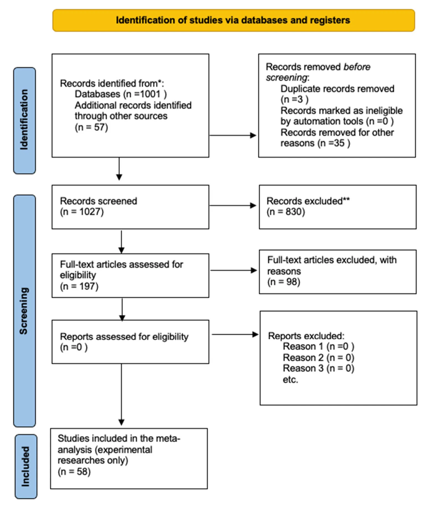
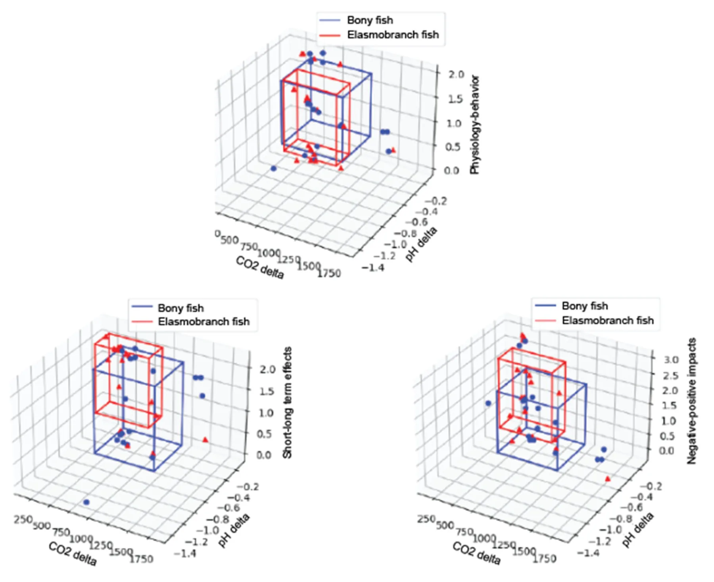
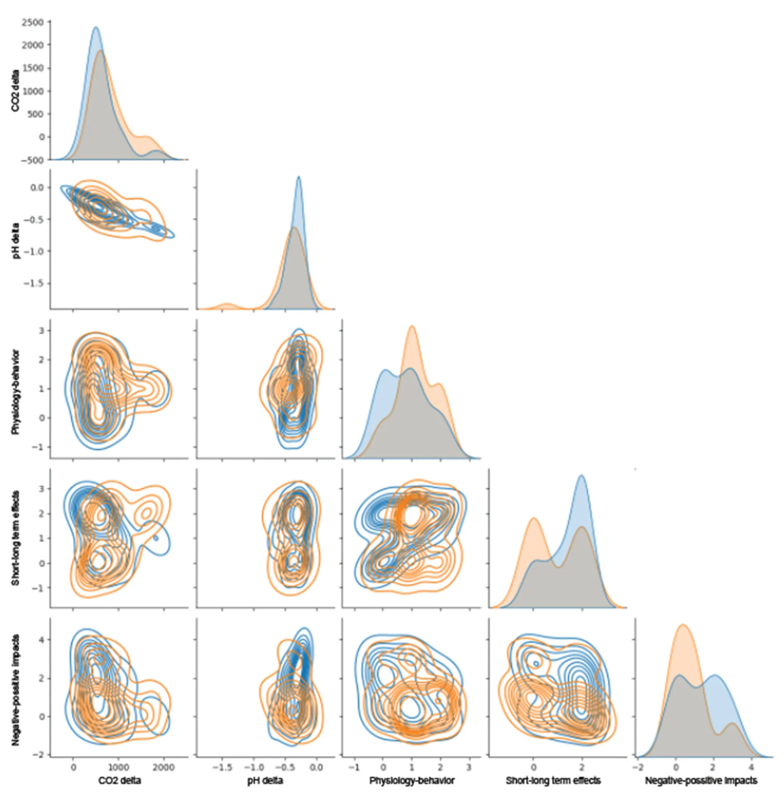
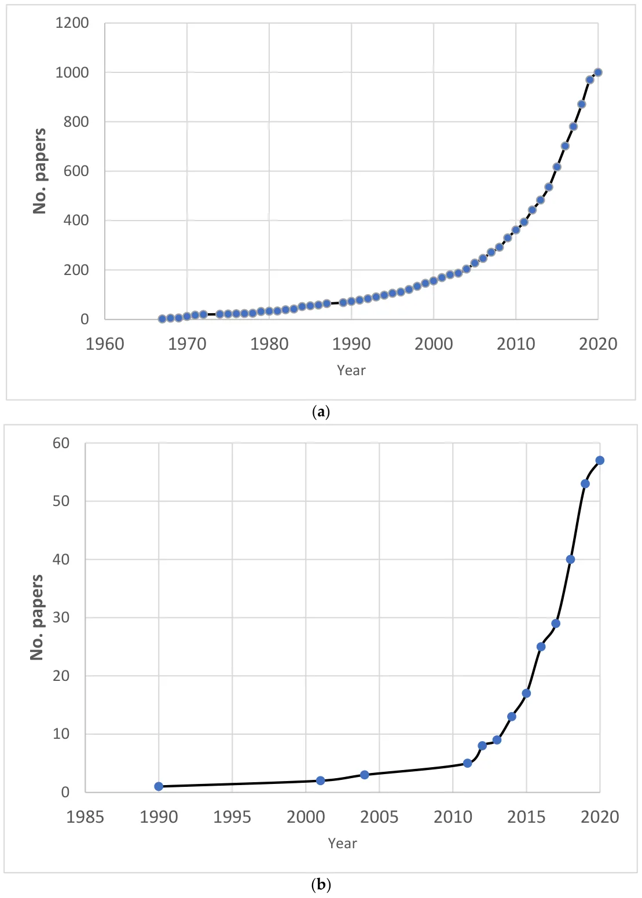
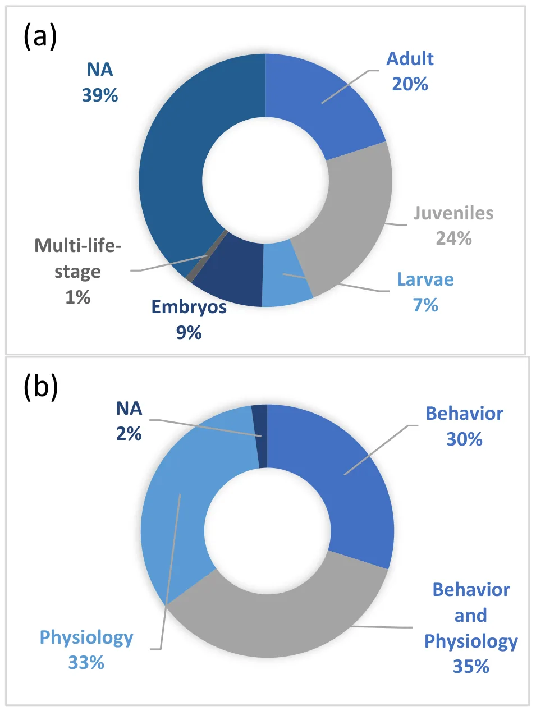
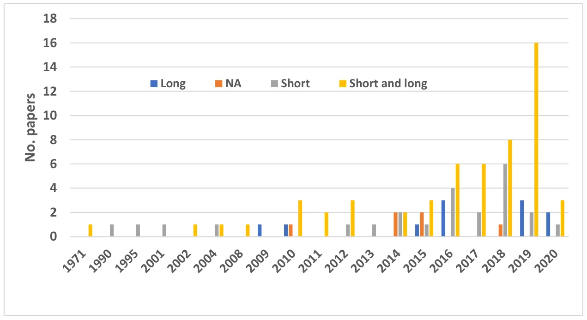
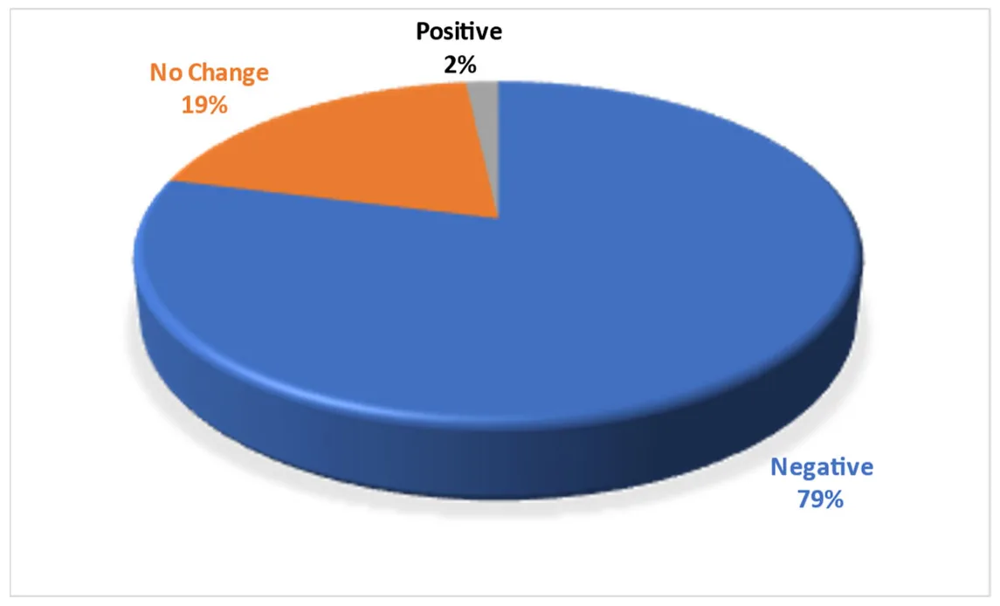
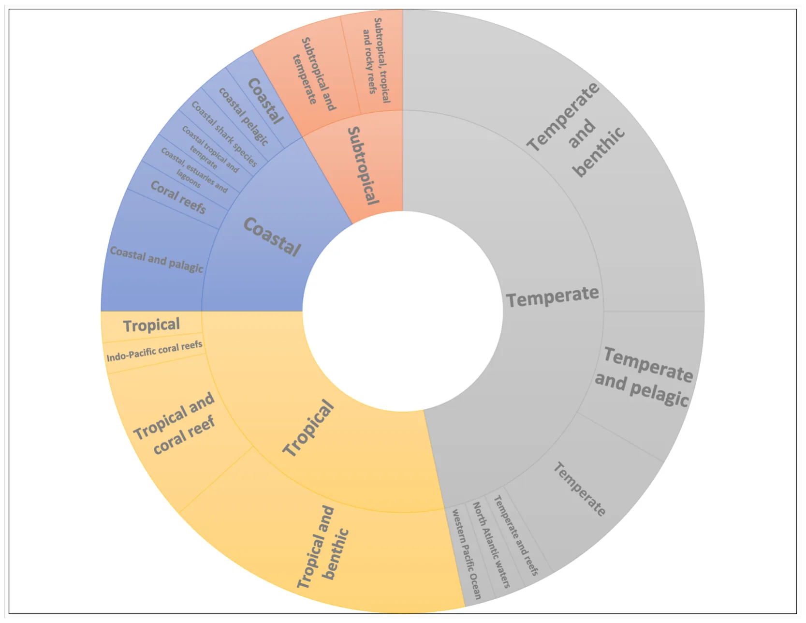

## 1. Introduction

Despite the shark’s long evolutionary history and being cosmopolitan in nature [1,2], they face substantial new threats, namely climate change and its resulting environmental impacts [1]. For long‐living animals that evolve very slowly over thousands of years, these rapid global climate changes may be the cause of both acute and chronic stress. Changes in water temperature and other abiotic factors may affect the rates of physiological processes of these marine ectotherms [3] and their ability to adapt quickly to anthropogenic carbon dioxide (CO2) absorbed by the oceans to be limited [2] Sharks, like most elasmobranchs, generally have a highly *K*‐selected life‐history strategy (slow growth rate, late maturity, low fecundity, very few offspring, long gestation periods, and long to very long lifespans), making them extremely susceptible to population decline [2,4], particularly during their most vulnerable life stages [5].

Sharks belong to the class of elasmobranchs (subclass elasmobranchii) that are considered the most vulnerable class of marine vertebrates, second only to the amphibians in the degree of threat of all vertebrate classes assessed to date [6]. Elasmobranchs are in a state of decline globally, with more than one‐third (37.5%) of all species threatened by extinction [6,7]. New global reassessment reveals that 167 out of 536 (31.2%) sharks are threatened by extinction, and up to 75.7% of the coastal sharks [6].Shark biodiversity, abundance, and distribution have already been altered, with dramatic declines through direct mortality (overexploitation and bycatch, habitat loss, and more), but also via the sub‐lethal effects of environmental stressors [2,4,8,9]. These not fully understood sublethal stressors may have fitness consequences [10], leading to a continuing decline in vitality and adaptability to the new environments. The recovery of shark populations from stress and disturbances is generally slower than that of groups at lower trophic levels [11]. Possible acclimation through phenotypic plasticity may allow marine organisms to persist in the face of environmental change and provide time for populations to genetically adapt over the longer term. With the rapid increase in the rate of global change, phenotypic plasticity is likely to be especially important in responding to the climate changes as a result of sharks’ long‐life span [12].

Atmospheric CO2 concentration has risen above 415 ppm for the first time in human history [13] and is predicted to reach ~800 ppm [14] or even ~900 ppm by the end of the 21st century [9,14]. According to the business‐as‐usual emissions scenario, it could reach 1000 ppm [10,13,15] and even higher in some coastal areas [16]. Projections suggest that by 2100, pH will fall by a further 0.3–0.4 units [2,17,18], with a continuous accumulation of CO2. That accumulation will increase the concentration of hydrogen (H+) and bicarbonate (HCO3−) ions and decrease the concentration of carbonate ions (CO32−) [17], a process that leads to the phenomenon called ocean acidification (OA). Approximately 30– 34% [14,19,20] of the CO2 is absorbed by the oceans, which has already led to a 0.1 unit drop in seawater pH from the pre‐industrial period to the present day [19] with a current acidification rate of 0.0020 units per year [21]. Under the business‐as‐usual scenario, the drop will be even greater (up to 0.5 units by 2100), which would be the fastest change in at least a million years [22,23]. Carbon dioxide levels are projected to increase even above 2200 ppm (global pH of about 7.3) by the year 2300 [24,25].

Until recently, OA was not considered a direct threat to sharks, but recent empirical evidence is worrying [2]. Acute hypercapnia (excessive carbon dioxide levels in shark’s bloodstream) already occurs with increasing frequency along the western and southern South African coasts due to upwelling and low‐oxygen events [25]. These changes in seawater chemistry are underpinned by a clear increase in the concentrations of hydrogen (H+) and bicarbonate (HCO3−) ions and a decrease in the concentration of carbonate ions (CO32−) [26]. From the CO2 perspective, there are two major impacts on marine creatures: reduced calcium carbonate mineral saturation [17], which is what most research has focused on (see [27]), and hypercapnia [25]. Numerous laboratory experiments suggest that CO2 enrichment, and the resultant changes in seawater chemistry, will directly harm some marine species [20] including sharks [2]. How marine animals respond to CO2 enrichment depends on how these changes directly and indirectly affect the particular species.

Higher ambient CO2 levels act to acidify the blood and tissues of water‐breathing marine organisms. In somewhat of a contrast to sharks, bony fishes (which are mostly osmoregulators) are considered moderately resilient to elevated CO2 [2] because they can regulate the pH balance through bicarbonate accumulation and ion exchange across their gills. Sharks and batoids (which are osmoconformers) have blood salt concentrations similar to those of the bony fishes, and well below the salt concentration of seawater. They use similar mechanisms [28],), but their osmotic pressure is slightly higher than that of seawater (except a few hypoosmotic examples) due to high concentrations of urea and trimethylamine N‐oxide [2]. Green and Jutfelt [29] reported on bicarbonate accumulation in response to buffered internal acidosis following a four‐week experiment under conditions of 990 μatm pCO2. Another limiting factor that is connected to the acid‐base equilibrium is the ventilation rate. Ventilation is mostly driven by water oxygenation and can be expected to have a significantly lower rate when sharks are exposed to high CO2 levels. Disruption of the acid–base equilibrium can influence the ventilation rate and attempts to compensate can lead even to metabolic depression [30].

Stress is a vital factor in the study of how water chemistry affects fishes. Stress was first defined by Hans Hugo Bruno Selye as the “perception of threat, with resulting anxiety discomfort, emotional tension, and difficulty in adjustment” (quoted in [31]). In 1958, Brett defined stress as “a physiological state produced by an environmental factor that extends the normal adaptive responses of the animal or disturbs the normal functioning to such an extent that the chances for survival are significantly reduced” (quoted in [1,32]. A stressor may not only change the homeostatic equilibrium but also elicit a coordination response (behaviors and movements that use coordination, such as left/right, swimming straight, and more). Responses can be behavioral (e.g., fleeing from a predator), physiological (e.g., depressed metabolic rate), or both [1].

Studying the effects of the anticipated rise in CO2 on shark behavior and physiology is important, given their impressive evolutionary load and conquest of virtually all aquatic environments and the crucial roles they play in the aquatic environment. However, any examination of sharks in the wild is difficult as sharks seldom swim near the surface, and they migrate over long distances. Thus, significant knowledge gaps exist, and research into their physiological responses has only begun in recent years, as described below. The goal of this study was to offer a comprehensive and systematic review of the knowledge gained to date on the likely impact of rising CO2 on sharks. Furthermore, we attempted to highlight key knowledge gaps related to shark survival under the projected increase in CO2. Underpinning this introduction is the question of whether sharks will be able to adapt to rapid anthropogenic climate change, particularly under conditions of increasing OA. Due to the lack of valid information on sharks and elasmobranchs, we also use teleost fish studies. We, therefore, conducted a comparative analysis of the two groups as explained in the next section.

## 2. Methods

We followed a scoping review approach in line with PRISMA (Preferred Reporting Items for Systematic Reviews and Meta‐Analyses) [33] (see supplementary materials File for Preferred Reporting Items for Systematic reviews and Meta‐Analyses extension for Scoping Reviews (PRISMA‐ScR) Checklist). The approach is comprised of three steps: systematic article selection using a search engine, article screening, and review of relevant articles and extraction of the information (Figure 1). We performed the bibliographic search using Elsevier’s Scopus database (www.scopus.com). We sought any article, review, or book chapter published between 1966 (as the first paper on this subject was published in 1966) and 27 March 2020, with the following search terms in the title, abstract, or keywords:

1\. “CO2” OR “carbon” AND “dioxide” OR “ocean” AND “acidification”; and 2. “shark” OR “sharks” OR “elasmobranch” OR “elasmobranches” OR “cartilaginous”; and 3.“behaviour” OR “behavior” OR “physiology” OR “physiological” OR “metabolism” OR “metabolic” OR “vitality” OR “vital” OR “survive” OR “survival”.

The search was limited to the relevant subject areas (agriculture and biology science, environmental science, biochemistry, genetic and molecular biology, earth and planetary sciences, multidisciplinary, immunology and microbiology, economics) and to English-language publications; this search returned a total of 1001 publications. We then manually added relevant papers from other sources that were not found in the main search, as has been done in previous studies [34]. The added papers included bibliographic reviews on the behavior and physiology of elasmobranch and bony fishes [35,36], papers with more information on other stress factors reflected in shark behavior [1], papers from the personal files of the authors (e.g., [8]), relevant papers found in selected articles during the third step of the systematic review (extraction of the information), and more recent papers published after the search (e.g. [4]). This brought the total number of papers to 1027.

These 1027 articles were screened in two stages, first considering just the title and abstract, and then considering the full article. In the first stage, articles were excluded if they did not mention CO2 levels, and if they did not mention or quantify the behavior, physiology, or survival of sharks or elasmobranchs (or contain the words *cartilaginous* or *metabolic*). This left 197 articles (28.3% of the original papers). In the second stage, articles were excluded if they did not include either (1) experiments or reviews on rising global CO2 levels, with a comparison to the current situation, or (2) behavioral or physiological changes to elasmobranchs or even bony fishes, which, we used due to lack of information on sharks. This left 93 articles for the analysis, representing 10% of the original collection. We further excluded the secondary literature—dissertations that their results were published in other papers (that were included) and all the review papers, leaving only 58 (5.65%) for the analysis. One of the main challenges of this paper was to review and explore changes to sharks’ behavior and physiology due to OA based on available scientific data, as there is a lack of knowledge on sharks and OA, however, we examined possible effects on other fishes as well. This comparison was justified via the statistical analysis provided below. All articles are listed in Online Supplement A. In studies that have more than one species, we separately incorporate the information for each species.

The following information was extracted from each selected article:

1. Digital object identifier (DOI).
2. Paper ID (surname and year) as given in the article itself (e.g., [13]).
3. Year of publication.
4. Type of study (e.g., an experiment, a review).
5. Number of individuals included in the study (if available).
6. Information on the species included in the papers: scientific and common names (e.g., spiny chromis, *Acanthochromis polyacanthus*), type of species (based on taxonomic details of the study and the ecology of the organism, e.g., bony fish, elasmobranch), life stage (e.g., eggs, larvae, adults), life strategy (e.g., tropical, benthic, coastal), and species total body length.
7. Geographical sources of the individuals (e.g., Lungsod ng Cebu, Philippines; Gullmar Fjord, Sweden).
8. Climatic parameters (CO2, pH, temperature, salinity) for experiment and control.
9. Acclimation periods (in days), if available.
10. Parameters tested and the climatic effects on them, whether positive (e.g., greater biomass in all food chain levels—[27]), negative (e.g., lower ability to hunt effectively—[37]), or neutral (e.g., no change in predation avoidance—[38]).

<figure id="fig-1">

<figcaption><strong>Figure 1.</strong> The flowchart of stages we followed in the review, based on the PRISMA approach to a systematic review [39]. “*”， “**”</figcaption>
</figure>

Just over 50% (*n* = 93) of the articles were deemed eligible to be used for a qualitative analysis and quantitative synthesis, after excluding reviews papers, 58 experimental papers were used for the analysis. We used quantitative information in the papers to test whether there is a significant effect of increased CO2 concentration on shark fitness, mortality and behavior avoidance (see supplementary materials). To do so, we used logistic regression (*Logit Model’* R version 2.11.1) to model the probability of an impact. For a model with a dichotomous outcome variable (Delta CO2), fitness = 0 for no impact and 1 for negative impacts (behavior avoidance, mortality and more).

Our review highlighted the limited available information on the impact of elevated CO2 and OA on shark behavior and physiology and therefore utilized available information on bony fish. In order to determine whether sufficient similarity exists between elasmobranch and bony fish, we examined their response to changes in CO2 and pH levels. We did so by calculating the feature vector (set of properties = F) where F = {Elasmobranch/Bony fish, pCO2 control, pCO2 treatment, pH control, pH treatment, physiology/behavior, short/long term effects, Negative/positive impacts} which are the factors considered in this study.

Afterward, we computed *CO2‐delta* and *pH‐delta* to be the difference between the control and treatment CO2 and pH values, respectively. Based on the obtained data, we computed the mean and standard deviation of each target variable (e.g., physiology/behavior, short/long term effects, Negative/positive impacts) as shown in Figure 2, where the x‐axis is the delta in CO2 levels between the control and treatment, the y‐axis is the delta in pH levels between the control and treatment, and the z‐axis is each one of the target features. The boxes indicate the area which is one standard deviation around the mean of each class. Indeed, a two‐tailed *T*‐test shows that for \\alpha = 0.05 confidence level, the value 0 is in the confidence interval. Namely, the two classes are not significantly different.

<figure id="fig-2">

<figcaption><strong>Figure 2.</strong> Equivalence between elasmobranch (red) and bony fish (blue) on the effect of expected changes in CO2 and pH concentrations on behavior (short/long effect and negative/positive effect). Points (blue and red) on the scatter plot are the values from the review summarized table. Specifically, the CO2 delta and pH delta are the absolute value from the control and modified columns of each type, respectively. The z‐axis represents 0 for the short term, 1 for the long term, and 2 for the short + long term. The boxes encompass the center around the mean of the data (on all three dimensions) and the length of each side corresponding to 2 STD. As a result, the boxes represent the area of statistical significance for alpha = 0.05.</figcaption>
</figure>

To demonstrate the similarity between bony fish and elasmobranch fish, we used a pair‐plot graph that represents data distribution between any two testing features at a time. The distributions of the bony fish and elasmobranch fish across all five evaluated features (short/long effect, short+long effect, and negative/positive effect) are similar (Figure 3). From the two first plots on the diagonal, it is incontrovertibly that the distribution of the interventions between these two super classes is similar (*p* < 0.05 for a two‐tailed *T*‐test) computed using the MATLAB 2017b software) [40]. Therefore, it is possible to examine the distribution of the target features. In addition to the significant difference of each target feature by itself, the combined three‐dimensional feature vector was not significantly different between these two super classes fish (*p* < 0.05).

<figure id="fig-3">

<figcaption><strong>Figure 3.</strong> Comparison of the distribution of each factor in <em>F</em>, using the kernel density estimate (KDE) method. Orange for elasmobranch and blue for bony fish.</figcaption>
</figure>

## 3. Results

Since 2001, there has been rapid growth in the number of publications on the impact of the expected increase in CO2 emissions on cartilaginous fish (Figure 4) and on the direct impacts of OA on sharks. The number of publications increased from two publications per year over a period of 30 years up to 2001, to more than 20 per year from 2014 to the present (n.b., 2020 covers up until 27 March).

<figure id="fig-4">

<figcaption><strong>Figure 4.</strong> The cumulative number of scientific publications covered in the review (from 1966 to 27 March 2020). (<strong>a</strong>) all records identified in the search (<em>n</em> = 1001), and (<strong>b</strong>) only those used for analysis (experimental research only, <em>n</em> = 58). Note that the number of papers in 2020 is relatively low due to the review coverage date (through to 27 March 2020).</figcaption>
</figure>

Of the included publications, approximately two‐thirds described experiments. Most of the studies were on either juveniles or adults, and only a few papers fall under the “multi‐life‐stage” category (Figure 5). Almost 40% of the studies did not identify specific life stages but considered the animal in general. In recent years, there has been an increasing trend of examining both short‐term (one life span of an individual) and long-term (multi‐generation) effects in the published studies (Figure 6). Almost an equal number of studies considered behavior (30%), physiology (33%), or both (35%). Almost half of the studies dealt with changes in temperature and the life strategy of the fish, and 25% of the studies examined the habitat and climatic region in tropical areas and habitats (Figure 7).

<figure id="fig-5">

<figcaption><strong>Figure 5.</strong> Publications classified by (<strong>a</strong>) life stage of the fishes being studied and (<strong>b</strong>) parameters tested. NA represents papers in which the information was not provided.</figcaption>
</figure>

<figure id="fig-6">

<figcaption><strong>Figure 6.</strong> Papers considering short‐ and long‐term effects of ocean acidification on fishes. NA indicates that the timescale of the effect was not provided.</figcaption>
</figure>

<figure id="fig-7">

<figcaption><strong>Figure 7.</strong> Experimental papers describing negative (79%), positive (2%) or no‐change (19%) effects in response to elevated CO2 concentration on fishes.</figcaption>
</figure>

Ocean acidification is believed to affect marine ecosystems in multiple ways and at a range of levels. It is likely to affect and modify the behavior of sharks and other fishes [41– 43]. And indeed, modifications to predator−prey interactions, homing ability, choice and discriminatory behavior, auditory response, learning, foraging, exploratory behavior, swimming behavior, and lateralization have all been reported (see the review by Clements and Hunt [42]).

More recently, studies have reported that exposure to elevated CO2 caused significant negative effects to sharks’ senses, thereby impacting on odor tracking, hunting behavior, swimming ability, and more [2,5,29]. The reduction in asymmetric behavior, the innate preference for turning either left or right, has been tested in both bony and cartilage fish. Sharks exposed to elevated CO2 typically show less lateralization [29] or even complete loss of lateralization [29,44]. In particular, according to Pinto [30], sharks exposed to high‐CO2 conditions spend a smaller percentage of their time swimming. Changes in swimming behavior have been reported in both adults and juveniles [2,9,29,30,45].

The effectiveness of a shark’s senses is a crucial factor in determining its ability to survive. A number of senses have been the focus of research. Chemical cues—*olfaction*— are essential for shark ecology and survival and are perhaps the sense most identified with them. Most fish use olfaction to obtain crucial information over long distances, even in environmental conditions that render other sensory modalities unavailable [46]. In reef fishes, elevated CO2 reduces the homing ability and habitat selection and increases the risk of predation by reducing olfactory ability [21], especially in larvae and juveniles [47] and may interfere with critical migratory behaviors [48]. One example is a preference for the smell of the predator rather than avoidance, i.e., a prey is expected to flee from the predator and not be attracted to it. Maybe the most extreme example was seen by Nilsson and Lefevre [44], who observed that clownfish larvae that had been reared at 1000 atm pCO2 showed an almost 100% preference for the smell of the predator, a behavior that would obviously reduce their survival in nature. Other olfactory behavioral effects of elevated CO2 include avoiding food chemical cues [21] and reduced foraging success [45].

The impact of OA on acoustic cue (sound*)* has been studied only in recent years. The first evidence that OA affects the hearing of fishes, with potentially detrimental impacts on early survival, was reported by Simpson et al. [41]. Juveniles from ambient CO2 conditions significantly avoided reef noise, as expected, but juveniles from CO2‐enriched conditions did not. Recent research by Chapuis et al. [49] suggests that the physiology and behavior of sharks are sensitive to both elevated CO2 and anthropogenic noise. It even mentioned that the behavioral response of reef sharks to acoustic cues raises concerns about the effects of anthropogenic noise on sharks. Elevated CO2 and anthropogenic noise can affect foraging behavior, space use, activity level, mating success, metabolism, and even offspring survival [34]. Sharks have also been shown to exhibit changes in movement patterns, feeding behavior, social interactions, and antipredator behavior in response to anthropogenic noise [49].

Several studies, mostly conducted on bony fishes, have indicated a deficient response to visual cues and altered retinal functioning under OA conditions [50]. In damselfish (*Acanthochromis polyacanthus*), critical clicker fusion (the threshold frequency at which an animal perceives a flickering light as continuous) was significantly reduced after exposure to OA conditions, as compared to controls. The only study that mentioned testing of a shark’s visual food cue as a behavioral response under elevated CO2 was conducted by Pistevos et al. [51]. This study had inconclusive results; moreover, the food cue was combined with chemical cues, rendering the results inseparable. Impacts on senses such as *magnetic sense and lateral line sense* have not been reported to date. It is apparent that knowledge gaps still remain.

To date, limited work has been conducted on the impact of combined stressors and major gaps still exist. Results from a number of areas affected by the accumulation of anthropogenic disturbances have been noted, even including increased anthropogenic noise that similarly affected the kinetics of the prey response [34]. Schwieterman et al. [43] examined the multi‐stressor responses of two skate species: the clearnose skate (*Rostroraja eglanteria*), the thorny skate (*Amblyraja radiata*), and on the estuarine bony fish, summer flounder (*Paralichthys dentatus*). They noted that in experiments at the lowest test temperature (~5 °C) and under low pH levels (~7.4), all three species exhibited significant increases (44–105%) in standard metabolic rates and decreases (60–84%) in hypoxia tolerance. In the low‐oxygen field, only limited work has been done on elasmobranchs. Gobler and Baumann [52] noted synergistically negative effects of OA and low‐oxygen conditions in the bony Atlantic silverside (*Menidia menidia*) when they tested fluctuating pH and low dissolved oxygen levels on different traits (e.g., survival, growth, metabolism), but in the same study, the sheepshead minnow (*Cyprinodon variegatus)* was not affected. Therefore, they concluded that the true threat of concurrent acidification and hypoxia is still not fully understood.

Behavior may act as the first indicator for changing environmental conditions [53] and can influence physiology and even on survival of the individual. Loss or reduction of learning abilities is among the topics investigated in animal behaviors under laboratory conditions. Learning ability is crucial to the long‐term survival ability of animals with a long lifespan. Decreased learning‐related skills may indicate widespread disruption of the central nervous system [44] and may, therefore, impair animal competence and fitness in both the short and long term. One example of a cognitive decline demonstrating a reduction in learning ability was given by Munday et al. [47], but only for bony fishes. They exposed young fishes to high CO2, resulting in a loss of their capability for associative learning. As a consequence, they avoided risk assessment processing and the use of chemical cues to identify specific predators.

From the physiological perspective, CO2 affects a shark’s physiology dramatically on a regular basis through osmoregulation and respiration. Negative consequences are predicted for oxygen uptake rates in embryonic, juvenile, and adult sharks and their relatives [10]. Sharks exhibit primary and secondary responses to stress that manifest in their blood biochemistry. The primary response is an increase in circulating catecholamines and corticosteroids, which are important for energy reserves, oxygen supply, and osmotic balance. Secondary responses include hyperglycemia, in particular acidemia resulting from metabolic and respiratory acidosis, and disturbances in ionic, osmotic, and fluid volume homeostasis [4,32]. These secondary effects are species‐specific and may be linked to metabolic and physiological conditions as well as to the type and duration of the stressor [32]. Green and Jutfelt [29] showed significant increases in plasma ions in the small‐spotted catshark (*Scyliorhinus canicula*) as a result of elevated CO2 concentration. Furthermore, Rosa et al. [54] reported reduced survival and development of the embryonic stage of the bamboo shark *(Chiloscyllium punctatum).*

Metabolic performance and the antioxidant defense system are also disturbed by OA. Ocean acidification interferes with the acid–base balance of sharks and other marine fishes, and though marine fishes are known to compensate for internal pH disturbances, this reduces metabolic performance and alters protein activities and functions [25]. Under OA conditions, the antioxidant defense system of bony fish, as opposed to sharks, sometimes may fail, increasing skeletal and tissue deformities (damage to lipids in tissues) and reducing metabolism, growth, and survival rates [25,55]. One example of the physiological tolerance of fishes is the consistent finding in bony fishes that plasma Cl− concentration decreases at a nearly 1:1 ratio with increasing plasma bicarbonate in both freshwater and seawater species [56]. Elasmobranch responses of plasma sodium and chloride ion concentrations to different levels of hypercapnia differ from those in teleosts. Hayashi et al. [57] reported in their review either no change in Cl− or a small but significant decrease (see Figure 5 in [28]).

This provides bony fishes with the ability to tolerate lower Hb–O2 affinity (Bohr effect) and Hb–O2 carrying capacity (Root effect), but sharks are not known to possess this mechanism. Sharks, similarly, to other elasmobranch species, are unaffected by high pCO2 levels in terms of aerobic scope (the total aerobic energy, above basic maintenance costs, available to an organism for life‐history processes, such as growth and reproduction) and metabolic performance, as evidenced by a less than 10% reduction in Hb–O2 saturation under acidosis, compared with over 40% reduction in bony fishes [58].

Sharks physiologically compensate for acid–base disturbances in similar ways to bony fishes, but their use of non‐enzymatic antioxidants (urea) may give them greater resilience, i.e., stronger buffering capacity to OA [25,51]. Hayashi et al. [57] found that of three marine fishes—Japanese flounder, *Paralichthys olivaceus*, yellowtail, *Seriola quinqueradiata*; and starspotted dogfish, *Mustelus manazo*—the dogfish was the most resilient to lethal levels of CO2. Their results suggested that these species may be exposed to an acid environment during embryonic development as a way to reduce the deleterious effects of acid toxicity [59] and may imply an existing mechanism to cope with OA.

Munday [60] examined the longer‐term responses of bony fish to OA and found that transgenerational and evolutionary responses can partly mitigate the adverse effects of OA. Similarly, some shark species may have the capacity to acclimate to warmer and more acidic future environments [61]. Nonetheless, Gattuso et al. [62] showed that most studies of animal responses to OA were relatively short‐term (single‐generation experiments, for animals like sharks) and, therefore, did not consider the potential multi‐generational response and genetic adaptation. Indeed, investigating the impact of OA on shark reproduction and life cycles has been carried out mostly in the laboratory due to logistic issues. Embryonic duration appears to be unaffected by elevated CO2 in all shark species tested to date, such as the tropical benthic shark and the whitespotted bamboo shark (*Chiloscyllium plagiosum*) [9,36]. Results from the articles covered in this review indicate that larvae (a developmental stage of bony fish) are generally more sensitive than embryos, juveniles, and adults [36]. Furthermore, they are, in fact, the weak link or critical stage in the development of these fish under OA conditions. To date, no study has assessed the effect of OA on reproductive biology in adult elasmobranchs. There are, however, claims that elasmobranchs cannot reproduce rapidly enough to compensate for fishing pressure and other anthropogenic impacts and stressors [4]. Furthermore, sharks have a K‐selection life strategy, and though climate changes are gradual, they may nevertheless be too fast for these ancient animals to keep up.

The papers reviewed in this study highlight a bias in terms of the general habitat the studied sharks occupy. All past studies (100%) covered in the review focused on relatively sedentary benthic sharks, which are capable of buccal ventilation. However, none of them focused on pelagic sharks, which depend on ram ventilation and therefore must swim ceaselessly [2].

Based on the papers we reviewed, we compiled the information referring to the effect of changes in CO2 concentration (Delta CO2 μatm) on fitness, behavior avoidance, and mortality (see Tables S1–S3). The results suggested a significant effect of changes in CO2 concentration on fitness indicating a 1% decrease in “Fitness” for every one‐unit increase in delta pCO2 (Table 1). This implies that CO2 does influence shark fitness, at least statistically. Shark behavior avoidance and shark mortality were, however, not statistically significant.

<figure class="table-figure" id="table-1">
<figcaption><strong>Table 1.</strong> Logistic regression of fitness, behavior avoidance, and mortality in relation to changes in pCO2 (delta CO2, i.e., the difference between the upper and lower bounds of the CO2 concentrations presented in the reviewed papers). Data is provided in Tables S1–S3.</figcaption>

<table><tr><th></th><th>Fitness</th><th>Behavior Avoidance</th><th>Mortality</th></tr><tr><td>N</td><td>48</td><td>29</td><td>14</td></tr><tr><td>p value</td><td>0.0413 **</td><td>0.133</td><td>0.225</td></tr><tr><td>Estimated effect on the variables</td><td>0.011</td><td>0.011</td><td>0.007</td></tr><tr><td>Akaike information criterion (AIC)</td><td>40.141</td><td>26.567</td><td>17.569</td></tr></table>

** <em>p</em> &lt; 0.05.

</figure>

## 4. Discussion

Global‐scale environmental changes such as climate change, OA, and anthropogenic activities such as overfishing, overexploitation, dumping of waste, pollution, invasive species, and others, are affecting the oceans and their ecosystems [63]. All of these have a significant impact on animals, which is expressed in various ways. The first response of animals to environmental change is expected to be behavioral, impacting species interactions and ecological processes [64] In addition, anthropogenic activities are specifically responsible for a major decline in the world’s biodiversity, possibly accelerating extinction rates to 1000–10,000 times the natural rate [63,65]. Anthropogenic activities and stressors affecting organisms and ecosystems rarely occur in isolation [66] and are also dramatically increasing shark vulnerability worldwide, mostly through overfishing and habitat degradation [9]. An estimated 100 million sharks are killed by commercial fisheries every year, and a quarter of all shark species have an elevated risk of extinction [67,68]. Irreversible disruption of apex marine predators, such as sharks, can exacerbate the pressure on food webs through top‐down control effects [5]. As apex predators, sharks play an important role in the marine ecosystem and food web and serve as an indicator of ocean health. In this section, we discuss the different aspects of OA change on sharks’ senses, behavior, and physiology in order to predict these effects.

Papers on the effects of CO2 on sharks have been published since the early 1960s, but only in 2009 did they begin to consider the ecological effects of predicted future atmospheric and oceanic CO2 levels (OA) on sharks [36]. Since then, with the growing awareness of the climate change problem, at least 190 primary research articles have been published (as of 2019), and over 100 of them have found that in both tropical and temperate species, a range of behavioral responses can be altered under elevated CO2 levels (Figure 8) [13,36].

<figure id="fig-8">

<figcaption><strong>Figure 8.</strong> Studies categorized by the habitat and climatic region of the fish being studied. Most studies were conducted on the temperate and tropical zones, and none on the polar and sub‐polar zones.</figcaption>
</figure>

The major question we addressed in this review was whether sharks would be able to adapt to the manifestations of rapid anthropogenic climate change, specifically OA. Although OA is the most highly investigated stressor [10], it has only recently been considered a threat to elasmobranchs [2]. We faced four major limitations in our review: (1) The availability of only limited relevant literature limiting the conclusions that can be drawn from the review; (2) The available research focuses on benthic shark species (mostly due to logistical limitations); (3) Studies ignores the large pelagic sharks, which depend on ram ventilation, (see a review by [2]); and, (4) a lack of multi‐life‐stage studies on sharks (see Figure 5a). All four issues constitute large gaps that need to be addressed in future research. Since scientific data on sharks and other elasmobranchs are limited, we used scientific data from bony fish studies to fill in the missing gaps. We were able to apply these conclusions to sharks due to the similarity between the sharks, elasmobranchs, and bony fishes in their reaction to changes in CO2 and pH levels based on statistical analysis (Figures 2 and 3). Although we did not search for bony fish using the SCOPUS search engine and the keywords, fish from this class appeared in the search results in some of the articles.

We followed a systematic review approach with three steps: systematic article selection using a search engine; article screening; and review of relevant articles and extraction of the information. The review clearly indicated that although there has been a growing focus on the impact of climate change and OA on sharks, it has been limited to benthic sharks and typically has not included complete life cycles. We also found a growing number of studies dealing with short‐ and long‐term ecological effects of predicted future CO2 levels on sharks, especially since 2009 [36]. Forecasting the responses of particular shark species and mapping their climate vulnerability according to OA would be a challenging task; even more challenging would be to forecast the indirect effects at the community level. Heinrich et al. [19] suggested that behavioral tolerance and adaptation flexibility of sharks may help to deal with projected future CO2 levels. A recent meta‐analysis [53] found a wide range of ecological dependencies that have the potential to strongly influence elasmobranch. Whether those catastrophes will happen or not depends on context and species‐specific. Similar to what we found in this study.

Sharks’ senses appear to be negatively affected by OA and it seems to be the first indication that environmental conditions are changing. Sharks use a range of senses that has enabled them to evolve as apex predators of the oceans, including hearing, lateral line, electroreception, and chemoreception. All these are important for sharks to be effective hunters and maintain their position at the top of the food chain, where they are overrepresented at higher trophic levels as apex predators [11]. Reduced olfactory capacity would leave some prey items undetected and increase search times, for example, reduced foraging success in the Port Jackson shark (*Heterodontus portusjacksoni*) [45]. No study has directly tested whether acidification would limit vision in a way that could influence a shark’s orientation and reduce hunting success [69]. Furthermore, the reception of magnetic‐field cues might not be affected, but their interpretation might be, thus hindering navigation [50,69]. Sharks have a unique ability to detect bioelectric stimuli using ampullary electrosense, which they use during foraging, social interactions, reproduction, and anti‐predatory behaviors [50]. The perception of external cues (pressure, current direction) through the lateral line system may be influenced by the neural component of sensory perception (the ampullae of Lorenzini). However, no studies have been conducted to date regarding the effects of increased CO2 on the efficacy of this sensory system. Despite these knowledge gaps, and with respect to the possible impact on the senses alone, sharks will hopefully succeed in adapting to these global changes or may have to improve behavioral strategies in order to keep pace with the rate of rising CO2 levels.

Sharks also rely on their swimming performance to search for food and refuge and, especially as juveniles, to escape predators [70]; thus, it is a major contributor to shark fitness. Changes in swimming behavior and a reduction in the proportion of time spent swimming due to elevated CO2 concentration have been reported recently [2,9,29,30,45]. High CO2 also affects the kinematics of predator–prey interactions, especially among juvenile prey. Exposed juvenile reef‐fishes allowed predators to get closer before responding, swam away at reduced speed, and over shorter distances [47]. It is possible that these sharks, detecting higher CO2 levels, altered their swimming behavior to search for their accustomed water quality. Such CO2 avoidance has also been reported for Atlantic cod by Jutfelt and Hedgärde [38].

Physiologically, OA interferes with the acid–base balance of marine fishes, reduces metabolic performance, and alters protein activity and functions [25]. Although higher CO2 appears to have direct effects on cardio‐ventilatory reflexes in elasmobranchs, these effects are weaker than the response to O2 [71], and they may have some resilience to the acid–base disturbances caused by OA [9] as they developed under high acidity conditions in utero [59]. Recent studies observed impairment of juvenile sharks’ condition and survival [72], peroxidative damage in the brain, significant changes in Fulton’s condition factor, aerobic potential (citrate synthase activity), cholinergic neurotransmission, digestive enzyme activities [2,73], and resting metabolic rate [2,30], among other physiological variables, when facing OA. An elevated metabolic rate usually reduces hypoxia tolerance (e.g., in the sandbar shark, *Carcarhinus plumbeus*) and can drive changes in behavior, energy requirements, and both somatic and gonadal growth [11]. Different studies have produced contradictory results, for example, a reduction in metabolic rate in juveniles of the tropical benthic brownbanded bamboo shark, *Chiloscyllium punctatum*, but no change in juveniles of the tropical benthic epaulette shark, *Hemiscyllium ocellatum*, or juveniles of the temperate benthic small‐spotted catshark, *Scyliorhinus canicula* [2]. Despite similar life niches, models revealed differences in metabolic response to changing environmental parameters [11], suggesting a variety of species‐specific adaptations.

Most of the marine elasmobranchs maintain plasma osmolality (~20 mOsm) slightly above ambient levels [74]. Sharks, like bony fishes, counter acidosis by H+/Na+ and Cl−/HCO3− counter‐exchange in their gills, as shown in sharks after short‐term exposure to very high pCO2. The significant increases in plasma Na+ and HCO3− concentrations observed by Green and Jutfelt [29] show that the same mechanism is responsible for pH regulation under near‐future CO2 levels and that the ion concentrations remain altered after long‐term exposure. Their conclusion was that during long‐term exposure to OA conditions, plasma pH is maintained via chronic elevation of HCO3− concentrations, with an associated decrease in Na+. Plasma Na+ and Cl− concentrations of marine elasmobranchs are maintained below the environmental concentration but are higher than those in bony fishes, with the main osmolyte being urea, at concentrations of 300–400 mOsm [74].This leads us to assume that in terms of plasma osmolality effects, sharks will be able to tolerate a moderate increase in OA in the long term.

Dissolved oxygen levels may play an important role in the spatial ecology of some sharks. Several studies have documented movement in response to changes in dissolved oxygen concentrations in different species, for example, the bull shark (*Carcharhinus leucas*) [75]; these studies have shown that some species display some degree of tolerance to fluctuations in dissolved oxygen levels. Wise et al. [76] found that epaulette sharks exhibited tolerance to both mild hypoxia (20% of normoxia) and cyclic exposure to extreme hypoxia (5% of normoxia). Acidification and low‐oxygen conditions are strongly linked via the process of respiration and therefore display similar dynamics in marine ecosystems. It seems that low‐oxygen conditions are more stressful to marine organisms than high CO2 levels, but in combination, the two stressors appear to have mostly additive negative effects [77]. Lefevre [78], in his analysis on the influence of global climate change on marine ectotherms, noted that for some species, it is not surprising that elevated CO2 does not have an effect since they are used to hypercapnic events. For example, the epaulette shark (*H. ocellatum*), a shallow‐reef species, is diurnally exposed to severe hypoxia and hypercapnia.

When reproducing, sharks all use internal fertilization; they can be divided into oviparous (egg‐laying) and viviparous (live‐bearing) species [4]. Oviparous species retain the fertilized eggs for short periods, after which the eggs are attached to benthic structures until hatching [2]. Due to basic logistical issues, most of the research on viviparous species cannot be conducted in the laboratory, and studies of the effects of climate change on reproduction and development have been limited to oviparous species [4]. Elevated CO2 appears to have diverse and variable effects on the reproductive traits of marine fishes. Neither Rosa et al. [2] nor Wheeler et al. [4] found a change in the body condition of adults that might indicate that the observed changes in reproduction were associated with changes in energy allocation. It is possible that elevated CO2 reduces the motivation to reproduce, but this has not been tested [36]. No studies have been conducted on the effects of OA on sperm motility in sharks or elasmobranchs. Munday et al. [36] noted that except in flatfishes (*Pleuronectiformes*), the sperm of marine bony fishes appears to tolerate moderate OA, but sperm can be highly sensitive to water pH in some freshwater fishes.

The effects of OA on sharks in their early life stages (eggs, embryos, neonates, and juveniles) are highly variable and species‐specific. Most studies on the effects of elevated CO2 on larval survival (of bony species) have reported either negative or no effects; juvenile survival indicate they are more resistant, with most studies seeing no significant effect [36]. However, Rosa et al. [2] refer to some evidence that sharks may be more sensitive to OA than bony fishes, especially during their early life stages, with examples from Heinrich et al. [79] on the epaulette shark (*H. ocellatum*) and Rosa et al. [54] on the brownbanded bamboo shark (*C. punctatum).* Pegado et al. [9] found that exposure to elevated CO2 concentration did not significantly alter hematological parameters in juveniles of the small‐spotted catshark, *S. canicula*. Indeed, Green and Jutfelt [29] showed that pH was balanced in this shark through elevation of HCO3− concentration in the blood plasma, with no other physiological changes. Furthermore, because their hemoglobin has a higher buffering capacity than that of most known bony fishes, they may have some resilience to the acid–base disturbances that may result from expected future OA [9]. Rosa et al. [2] hypothesized that oviparous shark species, such as the small‐spotted catshark, have developed successful mechanisms to cope with higher CO2 levels inside their egg capsules. In a recent review, Wheeler et al. [4] noted that “during embryonic development, ocean acidification in isolation does not pose measurable, negative effects on development time, hatching success, or hatching condition/size in any elasmobranch species studied thus far”, and also included studies that have found mixed impacts on neonates and juveniles. Sharks lack a larval stage, which is particularly vulnerable to predation, settlement difficulties, etc. Rummer and Munday [12] noted that while there is limited evidence for transgenerational behavioral acclimation to elevated CO2, physiological and life‐history traits are restored when both parents and offspring experience the same elevated CO2 environment. Even negative effects, such as reduced metabolic rate, growth, and survival, may be entirely absent in juveniles when they and their parents are exposed to the same elevated CO2 concentration.

One discovery that emphasizes the resilience of sharks is their ability to recover from injury or distress. Abnormal anatomical changes were first observed by Dziergwa et al. [24], who saw denticle corrosion with chronic exposure to OA. They speculated that denticle corrosion could increase denticle turnover and compromise hydrodynamics and skin protection. Nevertheless, when Bouyoucos et al. [10] examined the effects of exposure to very high CO2 concentration (pH 6.8, pCO2 ~13,000 μatm) on wound healing in the yellow ray, *Urobatis jamaicensis*, they found that invasive procedures have only short‐term effects (if any) in elasmobranchs. Furthermore, wound healing is not impaired by exposure to a chronic environmental stressor, even at ~13,000 μatm, although they found variation between species. In addition, experiments conducted already in the early 1960s and 1970s suggested that there might be extensive acclimation to high CO2 concentration within a comparatively short time, such as 20 h [80].

## 5. Conclusions

Ocean acidification is a complex process that requires several levels of considerations, including chemical–biological interaction, species‐specific influences, and global ocean hypoxia events. We have reviewed various effects of near‐future OA, on the behavior and physiology of sharks supplemented by studies on bony fish. We present in the analysis the experimental papers describing mostly negative effects in response to elevated CO2 concentration on fishes (Figure 8), but almost half of them (48.3%) describing “mostly negative” (32.8%) or “slightly negative” (15.5%). A finding that does not allow for an unequivocal answer for the major question we posed. Ocean acidification and other human‐related pressures are well‐documented stressors that can harm marine ecosystems. Anthropogenic factors are dramatically increasing shark vulnerability worldwide, mostly through overfishing, habitat degradation, and global climate change, but still, much more work is needed to understand the mechanisms behind the potential effects of OA on shark physiology. If the change is gradual, organisms may be able to acclimate and/or adapt. However, when changes are much faster (or greater) than the rate of evolutionary adaptation, mass extinction can occur. For a migrating shark, OA may increase energy requirements; however, sharks might be able to relocate to more suitable and stable habitats. Within each location, better‐adapted species will replace those that cannot cope with the new conditions. Increasing OA effects will affect shark physiology and behavior, but the effects vary widely across species. Though there will probably be some impairment of eligibility at the species level, we cannot elucidate the broader impacts on populations and marine ecosystems. More research is required, and if the impact of OA is tested in experiments as a continuous disturbance rather than a single short disturbance, as is currently the main practice, it is possible that acclimation abilities not previously observed will be found. We do note, however, that in one pioneering study [45] sharks exposed to elevated CO2 levels for more than seven months showed no clear sign of acclimation (physiological or behavioral) over this critical period for growth and survival. In our analysis of published results, we found a negative effect of the change in pCO2 on fitness but not on mortality or avoidance behavior parameters. Indeed, to date, the latest available literature reports only uncertain or negligible effects of OA on sharks. Therefore, we conclude that, despite the temporal reduction in fitness, sharks may manage to adapt to the new future OA with minor to moderate differences between species and at the population level. Possible future directions for study may include research on more pelagic, ram‐ventilated sharks, rather than benthic shark species, multi-life‐stage studies, and a long term in high pH conditions research.

**Supplementary Materials:** The following are available online at www.mdpi.com/article/10.3390/fishes7020056/s1, Table S1. Fitness. Experimental results of the change in pCO2 (delta CO2: second CO2 minus first CO2) and its impact on fitness during life stages 1 = embryo, 2 = larva, 3 = juvenile, and 4 = adult. In elasmobranch/bony fish, 1 = elasmobranch and 0= bony fish. A value of 1 for fitness represents a negative impact on fish fitness. Table S2. Mortality. Experimental results of the change in pCO2 (delta CO2) and its impact on mortality during life stages 1 = embryo, 2 = larva, 3 = juvenile, or 4 = adult. In elasmobranch/bony fish, 1 = elasmobranch and 0= bony fish. A value of 1 for fitness represents a negative impact on fish fitness. Table S3. Behavior avoidance. Experimental results of the change in pCO2 (delta CO2) and its impact on behavior avoidance, during life stages 1=embryo, 2 = larva, 3 = juvenile, and 4 = adult. In elasmobranch/bony fish, 1= elasmobranch and 0= bony fish. A value of 1 for fitness represents a negative impact on fish fitness. File: Preferred Reporting Items for Systematic reviews and Meta‐Analyses extension for Scoping Reviews (PRISMA‐ScR) Checklist

**Author Contributions:** Conceptualization, Z.Z.‐S.; methodology, Z.Z.‐S., S.Z.‐S., G.G.; validation, Z.Z.‐S., S.Z.‐S.; formal analysis, Z.Z.‐S., S.Z.‐S., G.G., T.L.; investigation, Z.Z.‐S., T.L.; resources, D.T., A.S.; data curation, Z.Z.‐S., T.L.; writing—original draft preparation, Z.Z.‐S., S.Z.‐S., G.G.; writing— review and editing, Z.Z.‐S., S.Z.‐S., G.G.; visualization, Z.Z.‐S., T.L.; supervision, D.T., A.S.; project administration, Z.Z.‐S.; funding acquisition, D.T., A.S. All authors have read and agreed to the published version of the manuscript.

**Funding:** This research was funded by the Morris Kahn marine research station and the Department of Marine Biology at the University of Haifa, Israel.

**Data Availability Statement:** See supplementary data attached.

**Acknowledgments:** This research was funded by the Morris Kahn Marine Research Station and the Department of Marine Biology of the University of Haifa as part of Ziv Zemah‐Shamir’s Ph. D dissertation.

**Conflicts of Interest:** The authors declare no conflict of interest.

## References

1. Skomal, G.; Bernal, D. Physiological responses to stress in sharks. In Sharks and Their Relatives II: Biodiversity, Adaptive Physiology, and Conservation; Carrier, J.C. Musick, J.A., Heithaus, M.R., Eds.; CRC Press: Boca Raton, FL, USA, 2010; pp 459–490. [doi:10.1201/9781420080483‐c11](https://doi.org/10.1201/9781420080483‐c11)
2. Rosa, R.; Rummer, J.L.; Munday, P.L. Biological responses of sharks to ocean acidification. Biol. Lett. 2017, 13, 20160796. [doi:10.1098/rsbl.2016.0796](https://doi.org/10.1098/rsbl.2016.0796)
3. Luongo, S.M.; Lowe, C.G. Seasonally acclimated metabolic Q10 of the California horn shark, Heterodontus francisci. J. Exp. Mar. Biol. Ecol. 2018, 503, 129–135. [doi:10.1016/j.jembe.2018.02.006](https://doi.org/10.1016/j.jembe.2018.02.006)
4. Wheeler, C.R.; Gervais, C.R.; Johnson, M.S.; Vance, S.; Rosa, R.; Mandelman, J.W.; Rummer, J.L. Anthropogenic stressors influence reproduction and development in elasmobranch fishes. Rev. Fish Biol. Fish. 2020, 30, 373–386. [doi:10.1007/s11160‐020‐09604‐0](https://doi.org/10.1007/s11160‐020‐09604‐0)
5. Pegado, M.R.; Santos, C.; Couto, A.; Pinto, E.; Lopes, A.R.; Diniz, M.; Rosa, R. Reduced impact of ocean acidification on growth and swimming performance of newly hatched tropical sharks (Chiloscyllium plagiosum). Mar. Freshw. Behav. Physiol. 2018, 51, 347–357. [doi:10.1080/10236244.2019.1590120](https://doi.org/10.1080/10236244.2019.1590120)
6. Dulvy, N.K.; Pacoureau, N.; Rigby, C.L.; Pollom, R.A.; Jabado, R.W.; Ebert, D.A.; Finucci, B.; Pollock,C.M.; Cheok, J.; Derrick, D.H.; et al. Overfishing drives over one‐third of all sharks and rays toward a global extinction crisis. Curr. Biol. 2021, 31, 4773– 4787. [doi:10.1016/j.cub.2021.08.062](https://doi.org/10.1016/j.cub.2021.08.062)
7. Dulvy, N.K.; Fowler, S.L.; Musick, J.A.; Cavanagh, R.D.; Kyne, P.M.; Harrison, L.R.; White, W.T. Extinction risk and conservation of the world’s sharks and rays. elife 2014, 3, e00590. [doi:10.7554/eLife.00590](https://doi.org/10.7554/eLife.00590)
8. Shamir, Z.Z.; Shamir, S.Z.; Becker, N.; Scheinin, A.; Tchernov, D. Evidence of the impacts of emerging shark tourism in the Mediterranean. Ocean Coast Manag. 2019, 178, 104847. [doi:10.1016/j.ocecoaman.2019.104847](https://doi.org/10.1016/j.ocecoaman.2019.104847)
9. Pegado, M.R.; Santos, C.P.; Pimentel, M.; Cyrne, R.; Paulo, M.; Maulvaut, A.L.; Raffoul, D.; Diniz, M.; Bispo, R.; Rosa, R. Effects of elevated carbon dioxide on the hematological parameters of a temperate catshark. J. Exp. Zool. Part A Ecol. Integr. Physiol. 2020, 333, 126–132. [doi:10.1002/jez.2333](https://doi.org/10.1002/jez.2333)
10. Bouyoucos, I.A.; Shipley, O.N.; Jones, E.; Brooks, E.J.; Mandelman, J.W. Wound healing in an elasmobranch fish is not impaired by high‐CO2 exposure. J. Fish Biol. 2020, 96, 1508–1511. [doi:10.1111/jfb.14320](https://doi.org/10.1111/jfb.14320)
11. Schwieterman, G.D. The Impacts of Acute Hypoxic Exposure and Other Concomitant Stressors on the Cardiorespiratory Physiology of Coastal Elasmobranch Fishes. Ph.D. Thesis’s Dissertation, The College of William and Mary, Williamsburg, VA, USA, 2020.
12. Rummer, J.L.; Munday, P.L. Climate change and the evolution of reef fishes: Past and future. Fish. 2017, 18, 22–39. [doi:10.1111/faf.12164](https://doi.org/10.1111/faf.12164)
13. Jarrold, M.D.; Welch, M.J.; McMahon, S.J.; McArley, T.; Allan, B.J.; Watson, S.A.; Parsons, D.M.; Pether, S.M.; Pope, S.; Nicol, S.; et al. Elevated CO2 affects anxiety but not a range of other behaviours in juvenile yellowtail kingfish. Mar. Environ. Res. 2020, 157, 104863. [doi:10.1016/j.marenvres.2019.104863](https://doi.org/10.1016/j.marenvres.2019.104863)
14. Feely, R.A.; Sabine, C.L.; Lee, K.; Berelson, W.; Kleypas, J.; Fabry, V.J.; Millero, F.J. Impact of anthropogenic CO2 on the CaCO3 system in the oceans. Science 2004, 305, 362–366. [doi:10.1126/science.1097329](https://doi.org/10.1126/science.1097329)
15. Jarrold, M.D.; Munday, P.L. Elevated temperature does not substantially modify the interactive effects between elevated CO2 and diel CO2 cycles on the survival, growth, and behavior of a coral reef fish. Front. Mar. Sci. 2018, 5, 458. [doi:10.3389/fmars.2018.00458](https://doi.org/10.3389/fmars.2018.00458)
16. Pimentel, M.S.; Faleiro, F.; Machado, J.; Pousão‐Ferreira, P.; Rosa, R. Seabream Larval Physiology under Ocean Warming and Acidification. Fishes 2020, 5, 1. [doi:10.3390/fishes5010001](https://doi.org/10.3390/fishes5010001)
17. Orr, J.C.; Fabry, V.J.; Aumont, O.; Bopp, L.; Doney, S.C.; Feely, R.A.; Yool, A. Anthropogenic Ocean acidification over the twenty‐first century and its impact on calcifying organisms. Nature 2005, 437, 681–686. [doi:10.1038/nature04095](https://doi.org/10.1038/nature04095)
18. Bopp, L.; Resplandy, L.; Orr, J.C.; Doney, S.C.; Dunne, J.P.; Gehlen, M.; Vichi, M. Multiple stressors of ocean ecosystems in the 21st century: Projections with CMIP5 models. Biogeosciences 2013, 10, 6225–6245. [doi:10.5194/bg‐10‐6225‐2013](https://doi.org/10.5194/bg‐10‐6225‐2013)
19. Heinrich, D.D.; Watson, S.A.; Rummer, J.L.; Brandl, S.J.; Simpfendorfer, C.A.; Heupel, M.R.; Munday, P.L. Foraging behaviour of the epaulette shark Hemiscyllium ocellatum is not affected by elevated CO2. ICES J. Mar. Sci. 2016, 73, 633–640. [doi:10.1093/icesjms/fsv085](https://doi.org/10.1093/icesjms/fsv085)
20. Bindoff, N.L., Cheung, W.W., Kairo, J.G., Arístegui, J., Guinder, V.A., Hallberg, R., Hilmi, N.J.M., Jiao, N., Karim, M.S., Levin, L.; et al. Changing ocean, marine ecosystems, and dependent communities. In IPCC Special Report on the Ocean and Cryosphere in a Changing Climate; Intergovernmental Panel on Climate Change: Geneva, Switzerland, 2019; pp.477–587.
21. Dixson, D.L.; Jennings, A.R.; Atema, J.; Munday, P.L. Odor tracking in sharks is reduced under future ocean acidification conditions. Glob. Change Biol. 2015, 21, 1454–1462. [doi:10.1111/gcb.12678](https://doi.org/10.1111/gcb.12678)
22. Cominassi, L.; Moyano, M.; Claireaux, G.; Howald, S.; Mark, F.C.; Zambonino‐Infante, J.L.; Peck, M.A. Food availability modulates the combined effects of ocean acidification and warming on fish growth. Sci. Rep. 2020, 10, 1–12. [doi:10.1038/s41598‐020‐58846‐2](https://doi.org/10.1038/s41598‐020‐58846‐2)
23. Baumann. H.; Talmage, S.C.; Gobler, C.J. Reduced early life growth and survival in a fish in direct response to increased carbon dioxide. Nat. Clim. Change 2012, 2, 38–41. [doi:10.1038/nclimate1291](https://doi.org/10.1038/nclimate1291)
24. Dziergwa, J.; Singh, S.; Bridges, C.R.; Kerwath, S.E.; Enax, J.; Auerswald, L. Acid‐base adjustments and first evidence of denticle corrosion caused by ocean acidification conditions in a demersal shark species. Sci. Rep. 2019, 9, 1–10. [doi:10.1038/s41598‐019‐54795‐7](https://doi.org/10.1038/s41598‐019‐54795‐7)
25. Lopes, A.R.; Sampaio, E.; Santos, C.; Couto, A.; Pegado, M.R.; Diniz, M.; Munday, P.L.; Rummer, J.L.; Rosa, R. Absence of cellular damage in tropical newly hatched sharks (Chiloscyllium plagiosum) under ocean acidification conditions. Cell Stress Chaperones 2018, 23, 837–846. [doi:10.1007/s12192‐018‐0892‐3](https://doi.org/10.1007/s12192‐018‐0892‐3)
26. Sen Gupta, A.; McNeil, B. Variability and change in the ocean. In The Future of the World’s Climate; Elsevier: Amsterdam, The Netherlands, 2012; pp. 141–165. [doi:10.1016/B978‐0‐12‐386917‐3.00006‐3](https://doi.org/10.1016/B978‐0‐12‐386917‐3.00006‐3)
27. Doubleday, Z.A.; Nagelkerken, I.; Coutts, M.D.; Goldenberg, S.U.; Connell, S.D. A triple trophic boost: How carbon emissions indirectly change a marine food chain. Glob. Change Biol. 2019, 25, 978–984. [doi:10.1111/gcb.14536](https://doi.org/10.1111/gcb.14536)
28. Ishimatsu, A.; Kikkawa, T.; Hayashi, M.; Lee, K.S.; Kita, J. Effects of CO2 on marine fish: Larvae and adults. J. Oceanogr. 2004, 60, 731–741. https://doi.org/0.1007/s10872‐004‐5765‐y.
29. Green, L.; Jutfelt, F. Elevated carbon dioxide alters the plasma composition and behaviour of a shark. Biol. Lett. 2014, 10, 20140538. [doi:10.1098/rsbl.2014.0538](https://doi.org/10.1098/rsbl.2014.0538)
30. Pinto, E.F.C. Physiological Responses of Whitespotted Bamboo Shark (Chiloscyllium Plagiosum) to High CO2 Levels. Master’s Thesis, University of Lisbon Faculty of Sciences Department of Animal Biology, Lisbon, Portugal, 2018.
31. Fink, G. Stress: Definition and history. In Encyclopedia of Neuroscience; Squire, L.R., Ed.; Academic Press: Cambridge, MA, USA, 2010; pp. 549–555. [doi:10.1016/B978‐008045046‐9.00076‐0](https://doi.org/10.1016/B978‐008045046‐9.00076‐0)
32. Skomal, G.B.; Mandelman, J.W. The physiological response to anthropogenic stressors in marine elasmobranch fishes: A review with a focus on the secondary response. Comp. Biochem. Physiol. A Mol. Integr. Physiol. 2012, 162, 146–155. [doi:10.1016/j.cbpa.2011.10.002](https://doi.org/10.1016/j.cbpa.2011.10.002)
33. Moher, D.; Liberati, A.; Tetzlaff, J.; Altman, D.G. Preferred reporting items for systematic reviews and meta‐analyses: The PRISMA statement. Int. J. Surg. 2010, 8, 336–341. [doi:10.1016/j.ijsu.2010.02.007](https://doi.org/10.1016/j.ijsu.2010.02.007)
34. McCormick, M.I.; Watson, S.A.; Simpson, S.D.; Allan, B.J. Effect of elevated CO2 and small boat noise on the kinematics of predator–prey interactions. Proc. Royal Soc. B 2018, 285, 20172650. [doi:10.1098/rspb.2017.2650](https://doi.org/10.1098/rspb.2017.2650)
35. Miller, L.H. Global Order: Values and Power in International Relations; Routledge: Oxfordshire, UK, 2018.
36. Munday, P.L.; Jarrold, M.D.; Nagelkerken, I. Ecological effects of elevated CO2 on marine and freshwater fishes: From individual to community effects. In Fish Physiology; Grosell, M., Munday, P.L., Farrell, A.P., Brauner, C.J., Eds.; Academic Press: Cambridge, MA, USA, 2019; Volume 37, pp. 323–368. [doi:10.1016/bs.fp.2019.07.005](https://doi.org/10.1016/bs.fp.2019.07.005)
37. Pistevos, J.C.A. Early Life Behaviour and Sensory Ecology of Predatory Fish Under Climate Change and Ocean Acidification. Ph.D. Dissertation, School of biological Science, University of Adelaide, Adelaide, Austraila. 2016. [doi:10.4225/55/58c0ef4b37022](https://doi.org/10.4225/55/58c0ef4b37022)
38. Jutfelt, F.; Hedgärde, M. Atlantic cod actively avoid CO2 and predator odour, even after long‐term CO2 exposure. Front. Zool. 2013, 10, 81. [doi:10.1186/1742‐9994‐10‐81](https://doi.org/10.1186/1742‐9994‐10‐81)
39. Page, M.J.; McKenzie, J.E.; Bossuyt, P.M.; Boutron, I.; Hoffmann, T.C.; Mulrow, C.D.; Shamseer, L.; Tetzlaff, J.M.; Akl, E.A.; Brennan, S.E.; et al. The PRISMA 2020 statement: An updated guideline for reporting systematic reviews. Int. J. Surg. 2021, 88, 105906. n71. [doi:10.1136/bmj](https://doi.org/10.1136/bmj)
40. De Winter, J.C.F. Using the student’s t‐test with extremely small sample sizes. Pract. Assess. Res. Eval. 2013, 18, 10.
41. Simpson, S.D.; Munday, P.L.; Wittenrich, M.L.; Manassa, R.; Dixson, D.L.; Gagliano, M.; Yan, H.Y. Ocean acidification erodes crucial auditory behaviour in a marine fish. Biol. Lett. 2011, 7, 917–920. [doi:10.1098/rsbl.2011.0293](https://doi.org/10.1098/rsbl.2011.0293)
42. Clements, J.C.; Hunt, H.L. Marine animal behaviour in a high CO2 Ocean. Mar. Ecol. Prog. Ser. 2015, 536, 259–279. [doi:10.3354/meps11426](https://doi.org/10.3354/meps11426)
43. Schwieterman, G.D.; Crear, D.P.; Anderson, B.N.; Lavoie, D.R.; Sulikowski, J.A.; Bushnell, P.G.; Brill, R.W. Combined effects of acute temperature change and elevated pCO2 on the metabolic rates and hypoxia tolerances of clearnose skate (Rostroraja eglanteria), summer flounder (Paralichthys dentatus), and thorny skate (Amblyraja radiata). Biology 2019, 8, 56. [doi:10.3390/biology8030056](https://doi.org/10.3390/biology8030056)
44. Nilsson, G.E.; Lefevre, S. Physiological challenges to fishes in a warmer and acidified future. Physiology 2016, 31, 409–417. https://doi.org/0.1152/physiol.00055.2015.
45. Pistevos, J.C.; Nagelkerken, I.; Rossi, T.; Olmos, M.; Connell, S.D. Ocean acidification and global warming impair shark hunting behaviour and growth. Sci. Rep. 2015, 5, 1–10. [doi:10.1038/srep16293](https://doi.org/10.1038/srep16293)
46. Tierney, K.B.; Baldwin, D.H.; Hara, T.J.; Ross, P.S.; Scholz, N.L.; Kennedy, C.J. Olfactory toxicity in fishes. Aquat. Toxicol. 2010, 96, 2–26. [doi:10.1016/j.aquatox.2009.09.019](https://doi.org/10.1016/j.aquatox.2009.09.019)
47. Munday, P.L.; Welch, M.J.; Allan, B.J.; Watson, S.A.; McMahon, S.J.; McCormick, M.I. Effects of elevated CO2 on predator avoidance behaviour by reef fishes is not altered by experimental test water. Peer J. 2016b, 4, e2501. [doi:10.7717/peerj.2501](https://doi.org/10.7717/peerj.2501)
48. Devine, B.M.; Munday, P.L.; Jones, G.P. Homing ability of adult cardinalfish is affected by elevated carbon dioxide. Oecologia 2012a, 168, 269–276. [doi:10.1007/s00442‐011‐2081‐2](https://doi.org/10.1007/s00442‐011‐2081‐2)
49. Chapuis, L.; Collin, S.P.; Yopak, K.E.; McCauley, R.D.; Kempster, R.M.; Ryan, L.A.; Schmidt, C.; Kerr, C.C.; Gennari, E.; Egeberg, C.A.; et al. The effect of underwater sounds on shark behaviour. Sci. Rep. 2019, 9, 1–11. w. [doi:10.1038/s41598‐019‐43078‐](https://doi.org/10.1038/s41598‐019‐43078‐)
50. Ashur, M.M.; Johnston, N.K.; Dixson, D.L. Impacts of ocean acidification on sensory function in marine organisms. Integr. Comp. Biol. 2017, 57, 63–80. [doi:10.1093/icb/icx010](https://doi.org/10.1093/icb/icx010)
51. Pistevos, J.C.; Nagelkerken, I.; Rossi, T.; Connell, S.D. Antagonistic effects of ocean acidification and warming on hunting sharks. Oikos 2017a, 126, 241–247. [doi:10.1111/oik.03182](https://doi.org/10.1111/oik.03182)
52. Gobler, C.J.; Baumann, H. Hypoxia and acidification in ocean ecosystems: Coupled dynamics and effects on marine life. Biol. Lett. 2016, 12, 20150976. [doi:10.1098/rsbl.2015.0976](https://doi.org/10.1098/rsbl.2015.0976)
53. Santos, C.P.; Sampaio, E.; Pereira, B.P.; Pegado, M.R.; Borges, F.O.; Wheeler, C.R.; Bouyoucos. I.A.; Rummer, J.L.; Santos, C.F.; Rosa, R. Elasmobranch Responses to Experimental Warming, Acidification, and Oxygen Loss—A Meta‐Analysis. Front. Mar. Sci. 2021, 1380. [doi:10.3389/fmars.2021.735377](https://doi.org/10.3389/fmars.2021.735377)
54. Rosa, R.; Pimentel, M.; Galan, J.G.; Baptista, M.; Lopes, V.M.; Couto, A.; Guerreiro, M.; Sampaio, E.; Castro, J.; Santos, C.; et al. Deficit in digestive capabilities of bamboo shark early stages under climate change. Mar. Biol. 2016b, 163, 60. [doi:10.1007/s00227‐016‐2840‐z](https://doi.org/10.1007/s00227‐016‐2840‐z)
55. Klein, R.D.; Borges, V.D.; Rosa, C.E.; Colares, E.P.; Robaldo, R.B.; Martinez, P.E.; Bianchini, A. Effects of increasing temperature on antioxidant defense system and oxidative stress parameters in the Antarctic fish Notothenia coriiceps and Notothenia rossii. J. Therm. Biol. 2017, 68, 110–118.
56. Ishimatsu, A.; Hayashi, M.; Kikkawa, T. Fishes in high‐CO2, acidified oceans. Mar. Ecol. Prog. Ser. 2008, 373, 295–302. [doi:10.3354/meps07823](https://doi.org/10.3354/meps07823)
57. Hayashi, M.; Kita, J.; Ishimatsu, A. Acid‐base responses to lethal aquatic hypercapnia in three marine fishes. Mar. Biol. 2004, 144, 153–160. [doi:10.1007/s00227‐003‐1172‐y](https://doi.org/10.1007/s00227‐003‐1172‐y)
58. Hannan, K.D.; Rummer, J.L. Aquatic acidification: A mechanism underpinning maintained oxygen transport and performance in fish experiencing elevated carbon dioxide conditions. J. Exp. Biol. 2018, 221, jeb154559. [doi:10.1242/jeb.154559](https://doi.org/10.1242/jeb.154559)
59. Kormanik, G.A.; Evans, D.H. The acid‐base status of prenatal pups of the dogfish, Squalus acanthias, in the uterine environment. J. Exp. Biol. 1986, 125, 173–179. [doi:10.1242/jeb.125.1.173](https://doi.org/10.1242/jeb.125.1.173)
60. Munday, P.L. Transgenerational acclimation of fishes to climate change and ocean acidification. F1000Prime Rep. 2014, 6, 99. [doi:10.12703/P6‐99](https://doi.org/10.12703/P6‐99)
61. Rummer, J.L.; Bouyoucos, I.A.; Mourier, J.; Nakamura, N.; Planes, S. Responses of a coral reef shark acutely exposed to ocean acidification conditions. Coral Reefs 2020, 39, 1215–1220. [doi:10.1007/s00338‐020‐01972‐0](https://doi.org/10.1007/s00338‐020‐01972‐0)
62. Gattuso, J.P.; Magnan, A.; Billé, R.; Cheung, W.W.; Howes, E.L.; Joos, F.; Allemand, D.; Bopp, L.; Cooley, S.R.; Eakin, C.M.; et al. Contrasting futures for ocean and society from different anthropogenic CO2 emissions scenarios. Science 2015, 349, aac4722. [doi:10.1126/science.aac4722](https://doi.org/10.1126/science.aac4722)
63. Derraik, J.G. The pollution of the marine environment by plastic debris: A review. Mar. Pollut. Bul. 2002, 44, 842–852. (02)00220‐5. [doi:10.1016/S0025‐326X](https://doi.org/10.1016/S0025‐326X)
64. Nagelkerken, I.; Munday, P.L. Animal behaviour shapes the ecological effects of ocean acidification and warming: Moving from individual to community‐level responses. Glob. Change Biol. 2016, 22, 974–989. [doi:10.1111/gcb.13167](https://doi.org/10.1111/gcb.13167)
65. Díaz, S.; Settele, J.; Brondízio, E.S.; Ngo, H.T.; Agard, J.; Arneth, A.; Balvanera, P.; Brauman, K.A.; Butchart, S.H.; Chan, K.M.; et al. Pervasive human‐driven decline of life on Earth points to the need for transformative change. Science 2019, 366, aax3100. [doi:10.1126/science](https://doi.org/10.1126/science)
66. Bruder, A.; Frainer, A.; Rota, T.; Primicerio, R. The importance of ecological networks in multiple‐stressor research and management. Front. Environ. Sci. 2019, 7, 59. [doi:10.3389/fenvs.2019.00059](https://doi.org/10.3389/fenvs.2019.00059)
67. Worm, B.; Davis, B.; Kettemer, L.; Ward‐Paige, C.A.; Chapman, D.; Heithaus, M.R.; Kessel, S.T.; Gruber, S.H. Global catches, exploitation rates, and rebuilding options for sharks. Mar. Policy 2013, 40, 194–204. [doi:10.1016/j.marpol.2012.12.034](https://doi.org/10.1016/j.marpol.2012.12.034)
68. Zemah‐Shamir, Z.; Zemah‐Shamir, S.; Tchernov, D.; Scheinin, A.; Becker, N. (Shark aggregation and tourism: Opportunities and challenges of an emerging phenomenon. Int. J. Sust. Dev. World 2019, 26, 406–414. [doi:10.1080/13504509.2019.1573769](https://doi.org/10.1080/13504509.2019.1573769)
69. Leis, J.M. Paradigm lost: Ocean acidification will overturn the concept of larval‐fish biophysical dispersal. Front. Mar. Sci. 2018, 5, 47. [doi:10.3389/fmars.2018.00047](https://doi.org/10.3389/fmars.2018.00047)
70. Di Santo, V Ocean acidification exacerbates the impacts of global warming on embryonic little skate, Leucoraja erinacea (Mitchill). J. Exp. Mar. Biol. Ecol. 2015, 463, 72–78. [doi:10.1016/j.jembe.2014.11.006](https://doi.org/10.1016/j.jembe.2014.11.006)
71. Burleson, M.L. Oxygen availability: Sensory systems. In Biochemistry and Molecular Biology of Fishes, Environmental and Ecological Biochemistry; Hochachka, P.W., Mommsen. T.P., Eds.; Elsevier: Amsterdam, The Netherlands, 1995; Volume 5, pp. 1–18. [doi:10.1016/S1873‐0140(06)80027‐5](https://doi.org/10.1016/S1873‐0140%2806%2980027‐5)
72. Rosa, R.; Baptista, M.; Lopes, V.M.; Pegado, M.R.; Ricardo Paula, J.; Trübenbach, K.; Leal, M.C.; Calado, R.; Repolho, T. Early-life exposure to climate change impairs tropical shark survival. Proc. R. Soc. B 2014, 281, 20141738. [doi:10.1098/rspb.2014.1738](https://doi.org/10.1098/rspb.2014.1738)
73. Rosa, R.; Paula, J.R.; Sampaio, E.; Pimentel, M.; Lopes, A.R.; Baptista, M.; Guerreiro, M.; Santos, C.; Campos, D.; Almeida‐Val, V.M.; et al. Neuro‐oxidative damage and aerobic potential loss of sharks under elevated CO2 and warming. Mar. Biol. 2016a, 163, 119. [doi:10.1007/s00227‐016‐2898‐7](https://doi.org/10.1007/s00227‐016‐2898‐7)
74. Larsen, E.H.; Deaton, L.E.; Onken, H.; O’Donnell, M.; Grosell, M.; Dantzler, W.H.; Weihrauch, D. Osmoregulation and excretion. Compr. Physiol. 2014, 4, 405–573. [doi:10.1002/cphy.c130004](https://doi.org/10.1002/cphy.c130004)
75. Heithaus, M.R.; Delius, B.K.; Wirsing, A.J.; Dunphy‐Daly, M.M. Physical factors influencing the distribution of a top predator in a subtropical oligotrophic estuary. Limnol. Oceanogr. 2009, 54, 472–482. [doi:10.4319/lo.2009.54.2.0472](https://doi.org/10.4319/lo.2009.54.2.0472)
76. Wise, G.; Mulvey, J.M.; Renshaw, G.M.C. Hypoxia tolerance in the epaulette shark (Hemiscyllium ocellatum). J. Exp. Zool. 1998, 281, 1–5. (19980501)281:1<1: AID‐JEZ1>3.0.CO;2‐S. [doi:10.1002/(SICI)1097‐010X](https://doi.org/10.1002/%28SICI%291097‐010X)
77. Baumann, H. Experimental assessments of marine species sensitivities to ocean acidification and co‐stressors: How far have we come? Can. J. Zool. 2019, 97, 399–408. [doi:10.1139/cjz‐2018‐0198](https://doi.org/10.1139/cjz‐2018‐0198)
78. Lefevre, S. Are global warming and ocean acidification conspiring against marine ectotherms? A meta‐analysis of the respiratory effects of elevated temperature, high CO2 and their interaction. Conserv. Physiol. 2016, 4, cow009. [doi:10.1093/conphys/cow009](https://doi.org/10.1093/conphys/cow009)
79. Heinrich, D.D.; Rummer, J.L.; Morash, A.J.; Watson, S.A.; Simpfendorfer, C.A.; Heupel, M.R.; Munday, P.L. A product of its environment: The epaulette shark (Hemiscyllium ocellatum) exhibits physiological tolerance to elevated environmental CO2. Conserv. Physiol. 2014, 2, cou047. [doi:10.1093/conphys/cou047](https://doi.org/10.1093/conphys/cou047)
80. Fry, F.E.J. The effect of environmental factors on the physiology of fish. In Fish Physiology; Hoar, W.S., Randall, D.J., Eds.; Academic Press: New York, NY, USA, 1971; Volume 6, pp. 1–98. [doi:10.1016/S1546‐5098(08)60146‐6](https://doi.org/10.1016/S1546‐5098%2808%2960146‐6)
