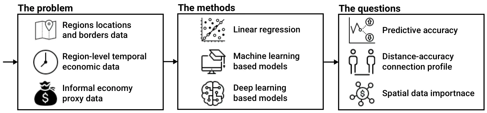
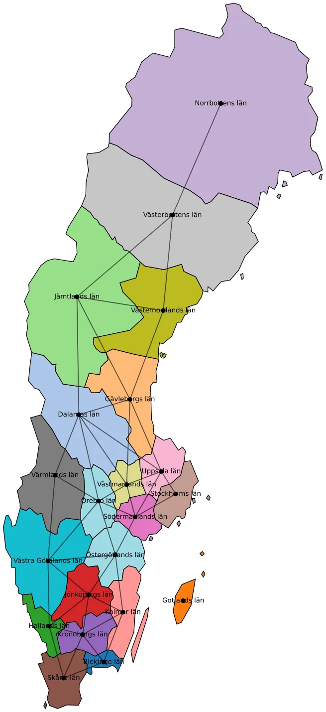
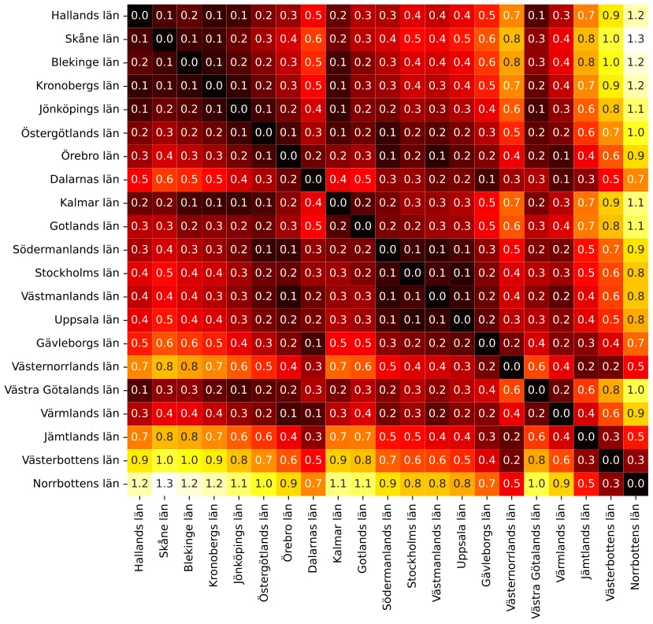
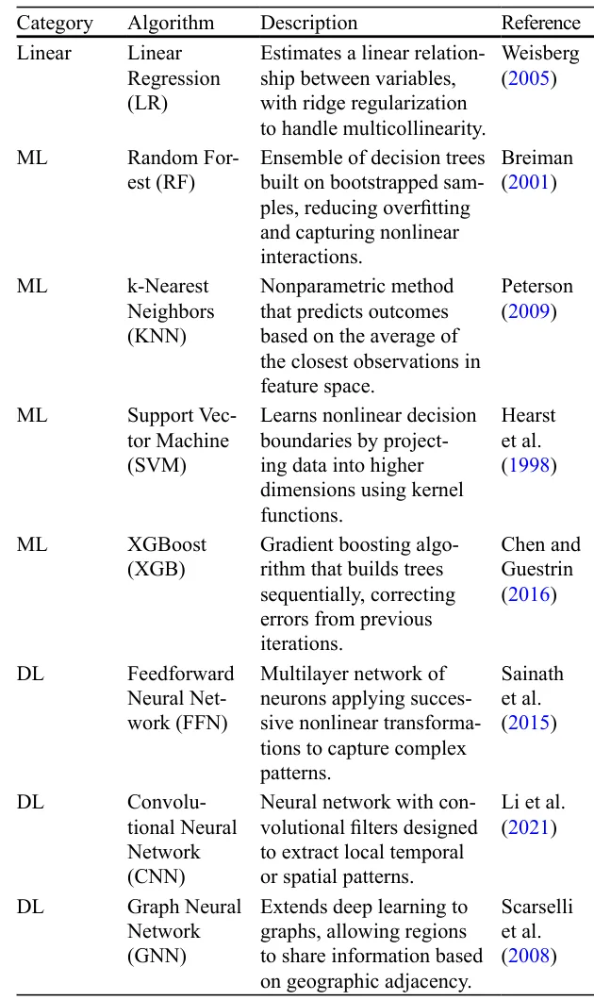
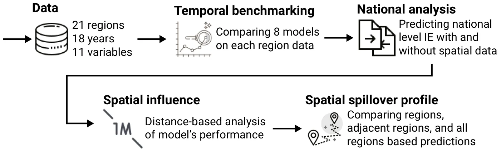
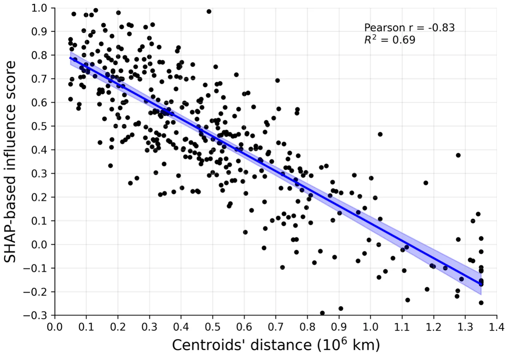

## 1 Introduction

The informal economy (IE) constitutes a substantial share of economic activity in both developed and developing countries (Elgin & Erturk, 2019). Its persistence over decades demonstrates that it is not a temporary phenomenon, but rather an integral part of contemporary economic systems. Nevertheless, its presence challenges economic measurement, governance, and policymaking (Dell’Anno, 2025; Blades & Roberts, 2002). At the macroeconomic level, failing to account for IE activities skews important statistics such as GDP, employment, productivity, and consumption. For policymakers, these distortions undermine the effectiveness of fiscal and monetary policy and strategies. At the institutional level, the IE erodes tax bases, weakens the credibility of public institutions, and increases the risk of social insurance abuse and underfunded public services. This explains why international organizations such as the OECD have long prioritized the monitoring of informality (Blades & Roberts, 2002). The OECD’s 2011 survey of member states, which estimated informal economies during 2008–2009, revealed striking differences: countries such as Italy and Poland reported informal economies exceeding 15% of GDP, while others like Canada and Sweden reported figures below 3% (Gyomai et al., 2012).

Despite this long-standing interest, the IE remains difficult to measure. Extensive literature has developed over the past four decades (Dell’Anno, 2025, 2023; Shami & Lazebnik, 2023; Dybka et al., 2019; Enste & Schneider, 2002; Schneider & Enste, 2000); however, there is still no consensus on a single best method. Different methodologies capture different aspects of the phenomenon, leading to widely divergent estimates even when applied to the same economy (Schneider et al., 2010; Breusch, 2005a; Schneider & Buehn, 2018). These discrepancies are not merely technical; they shape debates about the scale of tax evasion, the severity of institutional weakness, and the effectiveness of labour market policies.

In recent years, methodological innovation has reshaped IE estimation. Traditional econometric methods such as linear regression often produce estimates that drift upward over time, even when data quality is high (Dybka et al., 2019, 2020; Shami et al., 2021). To overcome these limitations, machine learning (ML) and deep learning (DL) models have been introduced. Random Forest models applied to currency demand data (Shami & Lazebnik, 2023), AutoEncoders for feature extraction, and Long Short-Term Memory (LSTM) networks for time-series forecasting (Lazebnik, 2024) have all demonstrated superior performance relative to classical approaches. These models are less prone to drift, capture non-linear relationships, and provide interpretable outputs through techniques such as Shapley values (Felix et al., 2023). The application of Artificial Intelligence (AI) to IE estimation reflects a broader trend in economics: the use of computationally intensive methods to uncover complex dynamics in large datasets (Franic, 2024; Kotzinos et al., 2023; Alogogianni & Virvou, 2023). Nevertheless, even these innovative approaches share a fundamental limitation. They remain almost entirely temporal, focusing on how the IE evolves over time but neglecting its spatial structure. In this context, geography profoundly shapes the size and dynamics of the IE. Regions with porous borders are more vulnerable to smuggling (Oladopo et al., 2021; Kim & Tajima, 2022); areas with limited access to banks and credit may experience more cash-based informal activity (Gërxhani & Cichocki, 2023); industrial districts may exhibit informal subcontracting (Estevao et al., 2022); and cities with dense informal networks may display clustering effects that reinforce informality (Qayyum et al., 2021). Empirical evidence supports these insights: studies in Romania (Albu et al., 2011), Russia (Volchik et al., 2020), Brussels (Kesteloot & Meert, 1999), and Nigerian cities (Onyenechere et al., 2022) show that informality is not randomly distributed but spatially ordered, reflecting accessibility, governance, and social networks.

The absence of systematic spatial analysis in IE research has been confirmed by recent reviews. Soyinka and Chiaradia (2023), analyzing over a thousand publications from 1999 to 2019, concluded that despite the inherently spatial nature of the IE, most studies still rely on aggregate national approaches that obscure local variations. They call for a “spatial turn” in IE research, involving GIS, spatio-temporal econometrics, and the integration of geographic data.

This study responds directly to that gap. It introduces a novel framework that combines temporal and spatial estimation, comparing classical econometric models, AI-based methods, and spatio-temporal approaches. By applying this framework to Sweden, covering 21 regions from 2006 to 2023, it not only evaluates the performance of different methods but also demonstrates the added value of explicitly incorporating geography. In this study, we use the term “informal economy” to refer to economic activity that is sufficiently hidden so that it is untaxed and may be unmeasured. The activities themselves may be legal or illegal, and the assumption is that the economic agents are, at least passively, aware that bringing their activities to the attention of the authorities would have tax (and possibly other legal) ramifications. This definition aligns with the term Non-Observed Economy (NOE) that was introduced by the United Nations System of National Accounts in 1993, which has become accepted in policy discussions within the OECD (Blades & Roberts, 2002). Empirically, we do not estimate the informal economy as a calibrated share of GDP. Rather, we model and forecast a regional cash-use indicator( RCW, the ratio of cash withdrawals to non-cash payments) as a proxy for the intensity of informal transactions, and we compare how temporal and spatial methods perform in predicting this proxy.

Sweden is particularly well-suited for incorporating the spatial aspect into methodologies for estimating the informal economy. Its welfare model has undergone market-oriented reforms since the mid-1980s, yet retains strong institutions and high service quality; at the same time, informal and unregistered activities persist and vary across regions and social groups, and existing estimates range widely, from relatively modest monetary-method figures to much higher MIMIC and survey-based values, highlighting the need for approaches that leverage geography. The institutional setting of centralized wage bargaining and high taxation financing extensive welfare programs creates ambiguous incentives (universal provision can reduce reliance on informal substitutes, while high tax burdens may encourage underreporting, especially among the self-employed), and migration inflows since the early 1990s have concentrated informal work in major urban centers.

Crucially, Sweden’s 21 administrative regions differ markedly in demography, settlement patterns, economic structure, business environment, labour-market conditions, income levels, institutional capacity, public services, and spatial access—with metropolitan Stockholm contrasting with resource-based northern regions, industrial/logistics hubs such as Skåne and Västra Götaland, and smaller regions reliant on agriculture and tourism; OECD evidence also points to persistent regional inequalities in employment, education, and demographics. Treating these regions as interlinked units makes it possible to capture local dynamics and cross-regional spillovers, and (together with Sweden’s relatively low overall informality and rich administrative data) provides an ideal setting to evaluate spatially explicit estimation methods.

Although Sweden is often viewed as a low-informality economy, the empirical literature reports substantial variation depending on the measurement approach. OECD survey-based figures for 2008–2009 report estimates below 3% of GDP, whereas later studies using alternative methodologies (e.g., MIMIC models and survey evidence) yield markedly higher values, in some cases approaching 20% of GDP (Asllani et al., 2024). This dispersion highlights both the sensitivity of informal economy measurement and the policy relevance of improving monitoring even in high-income welfare states, where undeclared economic activity can distort recorded output and employment statistics and, importantly, erode the tax base that finances public services (Schneider et al., 2023).

This paper contributes to the literature in three ways. First, it builds a regional panel for Sweden (21 regions, 2006–2023) and models a cash-use based informality proxy at the regional level. Second, it provides a systematic benchmark of classical econometric models against modern machine-learning and deep-learning approaches in a one-step-ahead forecasting design. Third, it introduces an explicitly spatio-temporal perspective by incorporating geographic adjacency and distance, testing the value of neighboring information and documenting distance-decay spillovers, including a graph-neural-network specification that is designed to capture spatial dependence.

The remainder of this study is organized as follows. Section 2 presents the Literature Review and the unique socio-economic properties of Sweden. Section 3 formally outlines the methods used in this study and the experimental design. Section 4 presents the obtained results. Section 5 discusses the methodological and applicative outcomes of this study, and Section 6 concludes the study and suggests possible future work.

## 2 Literature Review

The IE has been studied extensively. However, defining and measuring the IE remain among the most contested tasks in economics. Scholars generally agree that the absence of taxation and regulatory oversight is its defining characteristic (Schneider & Buehn, 2016; Blades & Roberts, 2002). This implies that the IE includes a spectrum of activities, from legal but untaxed work to illegal practices. Participants are at least passively aware of the fiscal and legal implications of remaining outside the formal sector, and policymakers are aware that the omission of such activities distorts macroeconomic statistics and policy assessments (Gyomai et al., 2012).

### 2.1 Estimating the Size of the Informal Economy

Efforts to measure the size of the IE have generated a wide range of methodologies. The direct approach relies on surveys and tax audits. Voluntary surveys can provide valuable micro-level data on who participates in the IE and why, but they typically underestimate its true size due to underreporting and self-selection (Feld & Schneider, 2010; Feld & Larsen, 2012; Cantekin & Elgin, 2017). Tax audit studies, comparing declared with actual income, provide more concrete estimates but are costly and limited in coverage.

The indirect approach infers the size of the IE through macroeconomic indicators and discrepancies. Classic techniques include comparing national expenditure and income statistics, detecting gaps in labour force participation data, or applying transaction-based approaches. The currency demand approach (CDA) is one of the most influential methods, estimating informality by linking excess cash holdings to unreported activity (Tanzi, 1980, 1983). Similarly, electricity consumption has been used as a proxy for total activity under the assumption that formal records understate actual production (Ferwerda et al., 2010; Ardizzi et al., 2014). These methods have been applied widely but remain sensitive to assumptions and calibration, often producing divergent estimates for the same country or period (Breusch, 2005b).

The modeling approach treats the IE as a latent, unobservable variable. The Multiple Indicator Multiple Cause (MIMIC) model has been particularly influential. First applied by Weck (1983) and Frey and Weck (1983), MIMIC-based models combine observable causes (such as tax burdens or unemployment) with indicators (such as cash demand or labour market discrepancies) in a structural equation framework. Subsequent applications have refined the method (Andrews et al., 2011; Elgin & Schneider, 2016; Elgin & Erturk, 2019), and it remains a dominant tool in cross-country comparisons. However, it depends heavily on the validity of assumptions and the quality of indicators (Schneider et al., 2010).

In recent years, AI, in general, and machine learning methods, in particular, have become prominent in IE estimation. These methods address some of the limitations of econometric approaches, especially the tendency of regression-based estimates to drift upward over time even when they fit historical data well (Dybka et al., 2019, 2020; Shami et al., 2021). Random Forest and other ensemble methods have been applied to currency demand data, outperforming linear regression models (Shami & Lazebnik, 2023). AutoEncoders have been used to reduce data dimensionality before estimation, and Long Short-Term Memory (LSTM) networks have been used to forecast IE time series (Lazebnik, 2024). These models consistently provide more accurate and stable results, and interpretable AI techniques such as Shapley values allow researchers to identify which features drive informality (Felix et al., 2023; Franic, 2024; Kotzinos et al., 2023; Alogogianni & Virvou, 2023). The result is a methodological shift: from fragile econometric estimates toward computationally robust models capable of handling large datasets and nonlinearities. The MIMIC and AI-based models for IE are conceptually different in the model design, data representation, and underlying theoretical conceptualization (Takanohashi et al., 2025)

However, both econometric and current AI-based approaches share a common shortcoming: they focus almost exclusively on temporal dynamics, neglecting geog raphy. This omission is striking, because geography fundamentally shapes informality. Empirical studies provide consistent evidence. In Romania, estimates reveal substantial regional variation in the size of the IE (Albu et al., 2011). In Russia and Eastern Europe, informal employment clusters spatially in particular urban centers and regions, reinforcing precarious labour market conditions (Volchik et al., 2020). In Brussels, informal activities concentrate in peripheral neighborhoods and near the central business district (Kesteloot & Meert, 1999). In Nigerian cities such as Jos, Sokoto, Owerri, and Port Harcourt, informal activities follow structured spatial logics, clustering around markets, roads, and residential districts (Onyenechere et al., 2022). In Japan, agglomeration effects enhance productivity in both formal and informal sectors, illustrating how spatial concentration shapes outcomes (Tanaka & Hashiguchi, 2020).

Beyond the IE literature itself, spatio-temporal models have been successfully applied in other domains. Studies have shown how house prices across U.S. states reflect both macroeconomic fundamentals and local shocks (Holly et al., 2010). In China, CO2 emissions have been modeled at the provincial level, linking spatial and temporal variation to energy consumption and growth (Wang et al., 2016). Spatio-temporal econometric models have been used to predict firearm prevalence across U.S. states, accounting for interactions between locations (Barak-Ventura et al., 2022). These examples illustrate that spatio-temporal modeling is well-established in economics and social sciences but has not yet been systematically applied to the informal economy.

Recent systematic reviews confirm this absence. Soyinka and Chiaradia (2023), in their analysis of over one thousand IE-related publications from 1999 to 2019, found that most studies do not adopt spatial methods or strategies, despite the inherently geographic nature of informality. They concluded that a “spatial turn” has not yet occurred in IE research and called for greater integration of GIS, spatio-temporal econometrics, and ICT-enabled mapping.

Therefore, the literature draws a clear picture. A wide array of methods has been developed to estimate the size of the IE, ranging from direct surveys to sophisticated AI models. Each method has strengths and weaknesses, but all are limited by their neglect of geography. Meanwhile, evidence from case studies shows that informality is spatially clustered and shaped by local conditions. This study addresses that gap by systematically comparing traditional econometric approaches, AI-based methods, and spatio-temporal models that explicitly incorporate geography, thereby contributing both methodologically and empirically to the study of informality.

### 2.2 The Swedish Case

Sweden provides a particularly instructive case for the study of the informal economy. The Swedish welfare state has long been regarded as a universalist and egalitarian model, combining market capitalism with high levels of taxation and extensive public services (Rothstein, 1998). Since the mid-1980s, however, a sequence of market-oriented reforms, privatization, and financialization has reshaped this institutional framework, altering the balance between public provision and market forces (Skyrman et al., 2023). While Sweden continues to perform well in international comparisons and retains strong institutions, these reforms have been accompanied by rising inequalities and greater reliance on market mechanisms in service provision. This evolving institutional setting makes Sweden a relevant case for examining informal economic activity in a high-income country where informality coexists with strong governance and advanced administrative capacity.

Despite the quality of public institutions, informal and unregistered economic activities persist in Sweden and vary across social groups and sectors (Schneider & Buehn, 2018; Gavanas, 2013). A key source of this variation lies in Sweden’s incentive structure. High tax burdens, which finance generous welfare programs, can encourage underreporting and informal practices, particularly among the self-employed (Engström & Holmlund, 2009; Williams & Horodnic, 2015). At the same time, universal public provision can reduce reliance on informal substitutes, creating an ambiguous overall effect. Migration has further reinforced heterogeneity in informal activity. Since the early 1990s, Sweden has experienced substantial inflows of migrants and refugees, many of whom (especially in major urban centers such as Stockholm, Malmö, and Gothenburg) have participated in informal employment in sectors including domestic work, construction, and transport, particularly when access to the formal labour market has been delayed (Gavanas, 2013; Slavnic & Urban, 2008; Tjernberg, 2010; Scarpa, 2016). These dynamics underscore that informality in Sweden is shaped by a combination of fiscal incentives, labour-market frictions, and demographic change.

Crucially for the purposes of this study, Sweden’s division into 21 administrative regions provides a natural framework for spatial analysis. These regions differ markedly in demography, settlement patterns, economic structure, labour-market conditions, income levels, institutional capacity, and access to public services (Schneider & Lundager, 1986; André et al., 2021). Metropolitan regions such as Stockholm are dominated by high-value services and host large migrant populations, while northern regions such as Norrbotten and Västerbotten rely more heavily on natural-resource industries. Other regions, including Skåne and Västra Götaland, function as industrial and logistical hubs with strong European linkages, while smaller regions depend more on agriculture and tourism. OECD evidence documents persistent regional inequalities across these dimensions (André et al., 2021). Treating these regions as interlinked units makes it possible to capture local dynamics and cross-regional spillovers, and, together with Sweden’s relatively low overall informality and rich administrative data, provides an ideal setting for evaluating spatially explicit approaches to informal economy estimation.

## 3 Methods and Materials

This section presents the data, the construction of the variables, the modelling strategy employed in our study, and the experimental design. Figure 1 provides a schematic overview of the structure of the study design.

<figure id="fig-1">

<figcaption><strong>Fig. 1</strong> A schematic view of the study’s structure</figcaption>
</figure>

<figure class="table-figure" id="table-1">
<figcaption><strong>Table 1</strong> Definition of Variables. The variables used in this study are adapted from (Shami et al., 2021). RCW is used as a proxy for informal economic activity through the currency-demand logic</figcaption>

<table><tr><th>Variable</th><th>Definition</th></tr><tr class="row-group"><td>Dependent variable</td><td></td></tr><tr><td>RCW</td><td>Ratio of the value of cash withdrawn from bank accounts to total non-cash payments</td></tr><tr class="row-group"><td>Structural variables</td><td></td></tr><tr><td>RPCYD</td><td>Gross rate of consumption of private dispos- able income from all sources, current prices</td></tr><tr><td>RYDGDP</td><td>Ratio of private disposable income to GDP, current prices</td></tr><tr><td>PRIME</td><td>Quoted basic interest rate (prime)</td></tr><tr><td>PRID</td><td>Ratio of quoted basic interest rate to interest rate on total deposits of the public</td></tr><tr><td>Informal self-employed</td><td>economic activity and tax burden</td></tr><tr><td>TD</td><td>Net direct tax burden, percentage of GDP</td></tr><tr><td>TI</td><td>Net indirect tax burden, percentage of GDP</td></tr><tr><td>ISET</td><td>Self-employment rate among employed individuals multiplied by tax burden</td></tr><tr><td>ISEMT</td><td>Self-employment rate among employed men multiplied by tax burden</td></tr><tr><td>ISEFT</td><td>Self-employment rate among employed women multiplied by tax burden</td></tr><tr class="row-group"><td>Illegal economic activity</td><td></td></tr><tr><td>RIFM</td><td>Ratio of morality offences investigation files opened by the police to total criminal investigation files</td></tr></table>

</figure>

### 3.1 Dataset

Our dataset covers Sweden’s 21 administrative regions from 2006 to 2023. This yields a panel of *N* = 378 region–year observations (21 *×* 18). For each region and year we collected 11 variables (see Table 1), covering: (i) structural component of the demand for cash payments, (ii) indicators of informal economic activity, and (iii) proxies for illegal activity. Although the informal economy is by nature unobservable, prior research has shown that cash payment proxies are strongly correlated with hidden economic activity (Shami et al., 2021). The other variables capture the economic environment: consumption and income measures, tax burdens, self-employment adjusted by taxation, and financial system indicators. Together they form a multidimensional representation of the structural and fiscal pressures that encourage participation in informal or illegal markets. The selection of variables, as well as their categorization in Table 1, is grounded in prior research in the field. For a comprehensive discussion and justification of these choices, please refer to Shami et al. (2021).

Data were obtained from official Swedish authorities, including Statistics Sweden (SCB) for labor market, household income, taxation, and national/regional accounts (Statistics Sweden (SCB), 2024), Tillväxtverket for SME-related registers and surveys (RAPS and PIPOS) (Tillväxtverket, 2024), Finance Sweden for banking and credit statistics (Finance Sweden, 2024), and the Swedish Riksbank for monetary and payments data (Sveriges Riksbank, 2024). Where necessary, annual series were harmonized to ensure consistent definitions across regions and over time. Missing values were rare; in such cases, we applied local averages from neighboring years to avoid losing observations.

In addition to temporal variation, we exploit spatial information. We collected the official geographic boundaries (polygons) of the 21 regions from Eurostat’s GISCO database1 and constructed a spatial graph linking regions that share a physical border. From these polygons we also computed the centroid of each region, which allows us to measure the geographical distance between regions. This spatial structure enables us to test whether the influence of one region on another diminishes with physical distance, and whether neighbouring regions provide valuable additional information for prediction. Figure 2 illustrates the Swedish regions as nodes (their centroids) with lines drawn whenever two regions share a geographical border. Figure 3 complements this by showing the matrix of pairwise geographical distances between the regional centroids in terms of million kilometers.

### 3.2 Models

In order to capture both the structural regularities and the nonlinear dynamics of the informal economy, we deliberately employ a spectrum of models that range from classical econometric tools to modern ML and DL approaches. LR with ridge regularization serves as a transparent benchmark, allowing direct comparison with previous empirical studies. Beyond this, we introduce several ML algorithms such as Random Forests (RF), *k*-Nearest Neighbors (KNN), Support Vector Machines (SVM), and XGBoost (XGB). These methods are designed to flexibly account for nonlinearities, complex interactions between variables, and heterogeneous regional responses. Importantly, these algorithms represent different families of ML techniques: tree-based ensembles, distance-based methods, kernel machines, and boosting; allowing us to compare not only their predictive performance but also how distinct learning paradigms capture the underlying economic processes. Finally, we extend the analysis to DL models, including feedforward neural networks (FNN), convolutional neural networks (CNN), and graph neural networks (GNN). These architectures are particularly suited to identifying high-dimensional patterns, temporal regularities, and spatial spillovers across regions (Lu & Cui, 2020). Table 2 summarizes the models used in this study. A technical description of all algorithms is provided in the Appendix.

<figure id="fig-2">

<figcaption><strong>Fig. 2</strong> The 21 Swedish regions with lines connecting their centroids if they share a geographical border</figcaption>
</figure>

<figure id="fig-3">

<figcaption><strong>Fig. 3</strong> Distances between centroids of the 21 Swedish regions in 106 kilometers</figcaption>
</figure>

### 3.3 Informal Economy Size Estimation Task

To evaluate the predictive performance of the different modelling approaches, we formulate the task as a one-step-ahead forecasting problem. Formally, for each spatial configuration (region, set of regions, whole country) and temporal observation, the predictors are lagged by one year (*t −* 1) in order to avoid simultaneity and ensure that only information available at the time of prediction is used (Lütkepohl & Krätzig, 2004). Models are trained on the historical data and evaluated on a holdout test set consisting of the last three years of the sample (2021-2023). This split allows us to assess model performance on recent data while avoiding look-ahead bias.

For each modelling family, we conduct a hyperparameter search using the grid search method (Liu et al., 2006), see Appendix for more details. The grid is tailored to each algorithm (e.g., number of neighbors for KNN, depth and learning rate for XGBoost, architecture for neural networks), and the optimal set of hyperparameters is selected on the basis of predictive MA in the training period. The selection criterion is the minimization of the mean absolute error (MAE), which is robust to outliers and easily interpretable in terms of forecast errors.

Once the best hyperparameters are identified, each model is retrained on the full training period and evaluated on the test set. We report three complementary performance metrics: mean absolute error (MAE), root mean squared error (RMSE), and the coefficient of determination (*R*2). This combination of metrics provides a comprehensive evaluation, balancing interpretability, sensitivity to large deviations, and overall explanatory power.

<figure class="table-figure" id="table-2">
<figcaption><strong>Table 2</strong> The models used in our analysis</figcaption>

</figure>

### 3.4 Experimental Design

Our experimental design consists of a sequence of complementary exercises that gradually expand the scope of estimation from the regional to the national level, and from purely temporal models to explicitly spatial ones. This strategy enables us to assess the relative contributions of different modeling approaches, as well as the importance of spatial spillovers across Swedish regions. We begin by benchmarking the models (see Table 2) as purely temporal models by estimating the IE’s size in each region by all the algorithms. In the second step, we pool all regions and esti mate the informal economy at the national scale. Here we consider two aggregation strategies: one that preserves the full regional disaggregation (called “spread”), and another that sums regional estimations into a single national indicator, which mimics country-level data without spatial information. This experiment is designed to assess how models handle the increased heterogeneity of combining regions. The third step introduces spatial information explicitly. By linking regions through their shared borders and distances, we test whether spatial relationships improve predictive accuracy and whether the influence of one region on another decays with distance. Finally, we compare three information configurations for each region: its own data alone, its own data plus data from adjacent neighbors, and the full national dataset. This final experiment directly addresses the role of spillovers by asking whether additional information from neighbors significantly improves prediction, and whether the marginal gain from including all regions is large or small. Below, we describe each experiment in detail. Figure 4 presents a schematic view of the experimental design.

#### 3.4.1 Temporal Benchmarking

In this setting, the eight models (see Table 2) are estimated using only the historical time series of predictors from the target region, lagged by one year. Although the GNN is inherently designed to exploit spatial dependencies, in this setup it reduces to a degenerate case equivalent to a local feedforward model, since no spatial information is available. We nevertheless include it to maintain methodological consistency across all experimental stages.

#### 3.4.2 Spatial Data at the National Level

In this setting, the models are trained on the pooled dataset that combines observations from all 21 regions, thereby exposing the algorithms to the full heterogeneity of the Swedish economy. Predictions are then generated for the country as a whole under two alternative aggregation strategies. The first, referred to as the “spread” specification, retains the full set of disaggregated regional forecasts, thus preserving variation across regions. The second, referred to as the “summed” specification, aggregates the regional predictions into a single national indicator. This latter approach mirrors earlier studies that relied exclusively on country-level data without accounting for internal spatial differences, while the former allows us to investigate whether models can exploit the additional structure embedded in regional disaggregation.

<figure id="fig-4">

<figcaption><strong>Fig. 4</strong> A schematic view of the experimental design</figcaption>
</figure>

To formally assess whether predictive performance differs between the *spread* and *summed* specifications, we apply the Diebold–Mariano (DM) test (Diebold, 2015). The DM test evaluates the null hypothesis that two competing forecasts have equal predictive accuracy by comparing the mean loss differential between them. For each model, we compute forecast errors under both aggregation schemes and construct the series of loss differentials, defined as *d*t = *L*(*e*spread ) *− L*(*e*summed )*,* where *L*(*·*) *t t* denotes the chosen loss function, here, MAE.

#### 3.4.3 Cross-regional Spatial Influence

A further dimension of our analysis examines the extent to which predictors from one region contribute to explaining the dynamics of another, which we refer to as *spatial influence across regions*. To capture these effects, we employ SHAP (SHapley Additive exPlanations) values (Mokhtari et al., 2019), a model-agnostic interpretability framework grounded in cooperative game theory and increasingly applied in economic prediction tasks (Ivas & Tefoni, 2023). SHAP decomposes each model prediction into additive contributions from every predictor, guaranteeing that the sum of contributions equals the predicted value. In our context, we compute SHAP values for all predictors across all models, and then classify each predictor according to the region from which it originates. By aggregating contributions in this way, we construct, for every ordered pair of regions (*i, j*), a measure of how strongly the variables of region *j* influence the predicted informal economy outcome in region *i*. The result is a directed influence matrix, which provides a systematic quantification of interregional dependencies that traditional accuracy measures cannot reveal.

In the next step, we test whether the strength of these cross-regional influences diminishes with geographic distance. To do so, we compute the geographic centroid of each of the 21 Swedish regions from their official administrative polygons, and calculate the pairwise Haversine distance between all centroids2. We then correlate the off-diagonal elements of the SHAP-based influence matrix with the corresponding interregional distances using Pearson’s correlation coefficient. Namely, if spatial proximity matters, we would expect predictors from nearby regions to exert a stronger influence on each other’s predictions than those from more distant regions.

#### 3.4.4 Information Configurations and the Role of Local Spillovers

The final part of our experimental design builds directly on the evidence of spatial attenuation and examines how the scope of available information affects predictive performance. Specifically, we evaluate three distinct *information configurations* for each target region. In the first configuration, models are trained using only the historical data of the target region itself, which serves as the strictest local benchmark. The second configuration augments this dataset by including the predictors of geographically contiguous neighbors, thereby allowing the model to exploit potential spillovers across directly adjacent regions. The third configuration extends the information set even further by pooling data from all 21 regions simultaneously, giving each regional model access to the full national dataset. This design allows us to directly test whether the inclusion of information from other regions—particularly neighbors—provides measurable improvements in forecasting accuracy.

## 4 Results

Table 3 reports the average prediction performance (mean ± standard deviation) across the 21 regions when models are trained and tested on each region separately using only their own predictors (see Table 1). Reported metrics are mean absolute error (MAE), root mean squared error (RMSE), and coefficient of determination (*R*2). Notably, the ML-based models achieve the lowest errors and highest *R*2, with XGBoost and SVM leading, while LR performs the worst overall. Moreover, the relatively large standard deviations for LR and the DL based models suggest that their performance varies considerably across regions, whereas tree-based ML methods show more stable accuracy. To this end, while the DL based models (FNN, CNN, GNN) outperform the LR model, on average, their gains are modest compared to the improvement delivered by ML models such as XGBoost and SVM, which consistently show both low MAE and high explanatory power.

Table 4 shows the results when all regions are pooled into a single dataset and predictions are produced at the national level, reporting the mean ± standard deviation values for three metrics: MAE, RMSE, and *R*2. Two aggregation strategies are compared: the *spread* specification, which retains disaggregated regional forecasts, and the *summed* specification, which aggregates predictions into a single national index. Noticeably, LR performs relatively better under the summed specification, whereas ML and DL based models perform best under the spread specification, with the GNN achieving the highest *R*2. Furthermore, the performance improvement of ML and DL models under the spread specification indicates that these algorithms can effectively exploit regional heterogeneity, capturing cross-sectional variation that LR cannot. The deterioration of LR in the spread case, combined with its relative improvement under the summed specification, highlights its tendency to oversimplify and perform better when variation is aggregated away. Furthermore, while the differences in MAE and RMSE between spread and summed are modest for ML methods, the systematically higher *R*2 in the spread case suggests that disaggregation preserves more explanatory information than aggregation.

<figure class="table-figure" id="table-3">
<figcaption><strong>Table 3</strong> Prediction performance across 21 Swedish regions using only local time-series data. Values reported as mean ± standard deviation for mean absolute error (MAE), root mean squared error (RMSE), and coefficient of determination (<em>R</em>2)</figcaption>

<table><tr><th>Model</th><th>MAE</th><th>RMSE</th><th>R2</th></tr><tr><td>LR</td><td>1.42 ± 0.21</td><td>1.91 ± 0.27</td><td>0.26 ± 0.08</td></tr><tr><td>RF</td><td>1.02 ± 0.15</td><td>1.45 ± 0.20</td><td>0.51 ± 0.07</td></tr><tr><td>KNN</td><td>1.09 ± 0.18</td><td>1.52 ± 0.23</td><td>0.48 ± 0.09</td></tr><tr><td>SVM</td><td>0.99 ± 0.13</td><td>1.40 ± 0.18</td><td>0.54 ± 0.06</td></tr><tr><td>XGB</td><td>0.94 ± 0.12</td><td>1.36 ± 0.17</td><td>0.56 ± 0.05</td></tr><tr><td>FNN</td><td>1.18 ± 0.20</td><td>1.59 ± 0.25</td><td>0.42 ± 0.10</td></tr><tr><td>CNN</td><td>1.12 ± 0.19</td><td>1.54 ± 0.24</td><td>0.45 ± 0.09</td></tr><tr><td>GNN</td><td>1.15 0.18</td><td>1.57 0.22</td><td>0.44 0.08</td></tr></table>

</figure>

<figure class="table-figure" id="table-4">
<figcaption><strong>Table 4</strong> National-level prediction performance (mean ± standard deviation) under two aggregation strategies: spread (regional forecasts retained) and summed (regional predictions aggregated to a single national index)</figcaption>

<table><tr><th></th><th>Spread</th><th></th><th></th><th>Summed</th><th></th><th></th></tr><tr><th>Model</th><th>MAE</th><th>RMSE</th><th>R2</th><th>MAE</th><th>RMSE</th><th>R2</th></tr><tr><td>LR</td><td>3.04 ± 0.37</td><td>4.04 ± 0.54</td><td>0.22 ± 0.07</td><td>2.56 ± 0.30</td><td>3.49 ± 0.44</td><td>0.31 ± 0.06</td></tr><tr><td>RF</td><td>1.82 ± 0.22</td><td>2.68 ± 0.36</td><td>0.48 ± 0.05</td><td>1.88 ± 0.24</td><td>2.78 ± 0.38</td><td>0.46 ± 0.05</td></tr><tr><td>SVM</td><td>1.78 ± 0.20</td><td>2.60 ± 0.34</td><td>0.50 ± 0.04</td><td>1.86 ± 0.22</td><td>2.74 ± 0.36</td><td>0.47 ± 0.05</td></tr><tr><td>XGB</td><td>1.68 ± 0.18</td><td>2.48 ± 0.30</td><td>0.53 ± 0.04</td><td>1.76 ± 0.20</td><td>2.62 ± 0.34</td><td>0.50 ± 0.04</td></tr><tr><td>FNN</td><td>1.58 ± 0.16</td><td>2.36 ± 0.26</td><td>0.56 ± 0.03</td><td>1.70 ± 0.18</td><td>2.52 ± 0.30</td><td>0.52 ± 0.04</td></tr><tr><td>CNN</td><td>1.62 ± 0.16</td><td>2.40 ± 0.28</td><td>0.55 ± 0.03</td><td>1.72 ± 0.18</td><td>2.56 ± 0.30</td><td>0.51 ± 0.04</td></tr><tr><td>GNN</td><td>1.54 0.14</td><td>2.30 0.26</td><td>0.58 0.03</td><td>1.68 0.16</td><td>2.50 0.28</td><td>0.53 0.03</td></tr></table>

</figure>

<figure id="fig-5">

<figcaption><strong>Fig. 5</strong> The relationship between SHAP-based cross-regional contributions and regions’ centroids distances</figcaption>
</figure>

Figure 5 presents the relationship between SHAP-based cross-regional influence measures and the geographical distances between the centroids of the Swedish regions in terms of million kilometers. Influence values were obtained by averaging SHAP contributions from predictors of region *j* to predictions in region *i*, while distances were computed using the Haversine formula based on official regional polygons. To quantify the relationship, we estimated an ordinary least squares (OLS) regression of influence on distance. The Pearson correlation coefficient between influence and distance is *r* = *−*0*.*83, and the regression explains 69% of the variation in influence (*R*2 = 0*.*69).

Table 5 outlines the prediction performance of the best model of each category (LR - LR, ML - XGB, DL - GNN) under three information configurations: using only a region’s own data, combining a region’s data with that of its immediate geographical neighbors, and pooling all regions simultaneously. Prediction accuracy improves monotonically for ML/DL models; for LR, adding all regions does not further improve performance beyond neighbors. The largest gains are observed when moving from the own-data specification to the neighbor specification, where MAE decreases sharply and *R*2 increases by more than 0.15 points on average. Moving from the neighbor specification to the all-regions specification produces further improvements, but these are comparatively modest, suggesting diminishing returns once local spatial spillovers are accounted for. In addition, the relatively small standard deviations in the all-regions specification point to more stable performance across regions when models are trained with the full national dataset.

## 5 Discussion

This study advances the estimation of the informal economy by introducing a spatio-temporal, data-driven framework that systematically evaluates both temporal and spatial dimensions. We revisit key claims from the literature, including the superiority of machine learning and deep learning methods relative to linear regression in informal economy estimation, the conditions under which these models are most effective, and the hypothesis that geographically proximate regions exert stronger mutual influence on each other in the dynamics of informality. Sweden, with its 21 regions observed over 18 years, provides a particularly suitable empirical setting to test these questions through a sequence of experiments that benchmark models at the regional level, extend estimation to the national level, and explicitly incorporate spatial dependence. This design allows us to move beyond descriptive estimation and to examine how methodological choices and spatial structures shape the empirical representation of informal economic activity.

The results should be interpreted in terms of forecasting performance for a cash-use-based proxy (RCW) rather than as direct estimates of the informal economy’s share of GDP. RCW follows the currency-demand logic that links excess cash usage to hidden or undeclared activity, while recognizing that cash demand may also reflect legitimate payment preferences and financial access (Tanzi, 1980, 1983; Blades & Roberts, 2002; Shami et al., 2021). As emphasized in the literature, different measurement approaches capture different facets of informality, and proxy-based indicators must therefore be interpreted cautiously (Schneider et al., 2010; Schneider & Buehn, 2018; Breusch, 2005b). Within this framework, improved predictive accuracy indicates that the selected fiscal, structural, and financial variables contain systematic information about future regional cash intensity, rather than establishing causal mechanisms.

<figure class="table-figure" id="table-5">
<figcaption><strong>Table 5</strong> Prediction performance (mean ± standard deviation) under different information configurations for each region: own data only, own data plus neighbors, and all regions pooled</figcaption>

<table><tr><th>Configuration</th><th>Model</th><th>MAE</th><th>RMSE</th><th>R2</th></tr><tr><td>Own data only</td><td>LR</td><td>3.24 ± 0.40</td><td>4.28 ± 0.56</td><td>0.22 ± 0.09</td></tr><tr><td></td><td>XGB</td><td>2.56 ± 0.32</td><td>3.58 ± 0.48</td><td>0.37 ± 0.08</td></tr><tr><td></td><td>GNN</td><td>2.42 ± 0.30</td><td>3.42 ± 0.44</td><td>0.40 ± 0.07</td></tr><tr><td>Own + neighbors</td><td>LR</td><td>2.78 ± 0.34</td><td>3.72 ± 0.46</td><td>0.36 ± 0.08</td></tr><tr><td></td><td>XGB</td><td>2.06 ± 0.26</td><td>2.98 ± 0.40</td><td>0.53 ± 0.06</td></tr><tr><td></td><td>GNN</td><td>1.96 ± 0.24</td><td>2.82 ± 0.36</td><td>0.56 ± 0.05</td></tr><tr><td>All regions</td><td>LR</td><td>2.90 ± 0.15</td><td>3.32 ± 0.24</td><td>0.34 ± 0.04</td></tr><tr><td></td><td>XGB</td><td>1.94 ± 0.24</td><td>2.84 ± 0.36</td><td>0.56 ± 0.05</td></tr><tr><td></td><td>GNN</td><td>1.84 0.22</td><td>2.72 0.34</td><td>0.58 0.05</td></tr></table>

</figure>

At the regional level, our temporal benchmarking results show that machine learning models consistently outperform both linear regression and deep learning models. This finding aligns with prior research demonstrating that ML methods are particularly well suited to currency-demand-style datasets, where relationships between taxation, self-employment, income structure, and cash use are nonlinear and interaction-rich (Felix et al., 2023; Ivas & Tefoni, 2023; Shami & Lazebnik, 2023). At the same time, each region provides a relatively short time series, which constrains the effective estimation of deep architectures. Existing evidence shows that deep learning models typically require larger samples and richer data regimes to reliably outperform simpler methods, especially in economic forecasting contexts (Brigato & Iocchi, 2021; Lazebnik, 2024; Zhao, 2017). These results are also consistent with earlier critiques that regression-based approaches in informal economy estimation can be unstable or exhibit artificial drift over time, motivating the adoption of more flexible ML techniques (Dybka et al., 2019, 2020; Shami et al., 2021).

When all regions are pooled and predictions are generated at the national level, the performance ranking changes. Deep learning models (particularly the graph neural network) outperform both linear regression and standard ML approaches when regional disaggregation is preserved. This pattern reflects the ability of high-capacity models to exploit cross-sectional heterogeneity once sufficient variation is available, a point emphasized in recent work on deep learning in economics and spatio-temporal modeling (Dell, 2025; Lu & Cui, 2020; Zheng et al., 2023). By contrast, when regional predictions are aggregated into a single national index, linear regression performs relatively better. This contrast illustrates a well-known aggregation effect: pooling and summation mechanically smooth heterogeneity, making simpler linear structures appear more competitive, even though they do not capture underlying spatial dynamics (Anselin, 2022). This helps explain why earlier national-level studies relying on linear specifications sometimes produced seemingly reasonable results despite ignoring internal geographic structure.

The spatial analysis provides further insight into the nature of interregional dependence. Using SHAP-based influence measures, we document a strong negative relationship between cross-regional predictive influence and geographic distance, with influence declining sharply as distance increases. This distance-decay pattern is a foundational empirical regularity in spatial economics, reflecting the tendency of economic interactions and spillovers to weaken with geographic separation (Anselin, 2022; Artell et al., 2019; Elhorst et al., 2024; Johansson & Klaesson, 2017). In practical terms, geographically proximate regions are more likely to share labor markets, commuting zones, supply chains, and informal social and economic networks, which strengthens their mutual influence on cash-based informal activity. By contrast, distant regions tend to operate more independently, resulting in weaker cross-predictive contributions. In the context of the informal economy, this finding directly responds to recent systematic reviews calling for a “spatial turn” in the literature, which argue that national aggregates obscure meaningful local variation (Soyinka & Chiaradia, 2023). It also complements empirical case studies documenting spatial clustering of informality in diverse settings, including Romania, Russia, Brussels, and Nigerian cities (Albu et al., 2011; Kesteloot & Meert, 1999; Onyenechere et al., 2022; Volchik et al., 2020).

Beyond predictive accuracy, the SHAP-based approach highlights the value of interpretability in spatio-temporal informal economy research. By decomposing predictions into additive contributions and attributing them to specific regions, SHAP provides a transparent way to quantify localized spillovers, extending earlier applications of interpretable AI in informal economy estimation (Felix et al., 2023; Ivas & Tefoni, 2023; Mokhtari et al., 2019). This adds an empirical dimension that is often absent from traditional econometric approaches, which typically identify correlations without directly revealing the geographic channels through which interdependence operates.

The information-configuration experiments further reinforce the predominance of local dynamics. Most predictive gains arise when models are augmented with data from a region’s immediate neighbors, while the additional benefit of including all regions is comparatively modest. This pattern is consistent with spatial-econometric intuition: once the strongest local interactions are incorporated, additional distant information yields diminishing marginal predictive value (Anselin, 2022; Elhorst et al., 2024). In the informal economy context, this supports the view that informal activity is embedded in local economic systems rather than driven primarily by nationwide forces, echoing findings from spatial case studies and regional analyses (Albu et al., 2011; Kesteloot & Meert, 1999; Onyenechere et al., 2022; Volchik et al., 2020).

One important qualification concerns the behavior of linear regression. While LR improves when neighbor information is added, it does not improve further (and slightly deteriorates) when all regions are pooled. This exception is informative rather than problematic. It reflects both the limitations of linear specifications in capturing nonlinear and heterogeneous relationships in currency-demand-based informal economy settings (Dybka et al., 2019, 2020; Shami et al., 2021) and the risks of pooling heterogeneous regional dynamics without explicitly modeling spatial structure (Anselin, 2022; Lu & Cui, 2020). In this sense, the LR result strengthens the conclusion that spatial dependence exists but is not well summarized by global linear pooling.

The discussion highlights that Sweden’s informal economy proxy is shaped by strongly localized spatial dynamics and nonlinear relationships that vary across regions. Ignoring geography or relying solely on aggregated national data risks obscuring these dynamics and contributes to the inconsistent estimates observed in the literature. By integrating spatio-temporal modeling, modern ML and DL techniques, and interpretable AI tools, this study provides empirical support for recent calls to embed informal economy analysis within a geographic framework and demonstrates how doing so improves both predictive performance and substantive understanding.

## 6 Conclusion

Taken together, the results demonstrate that incorporating spatial awareness substantially improves the estimation of the IE compared to traditional approaches that rely solely on national-level, temporal models. At the regional scale, ML methods dominate, while at the national scale, DL (particularly GNNs) capture the benefits of disaggregated spatial heterogeneity most effectively. The strong distance-decay effect observed in the spatial analysis confirms that local proximity drives the most significant cross-regional influences, and the largest predictive gains arise from including neighboring regions’ data. Beyond these neighbors, additional gains are modest, suggesting diminishing returns once local spillovers are accounted for.

From a socio-economic policy perspective, these findings suggest that uniform national strategies may be too blunt to address informality effectively. Regional variation is pronounced, and interventions are likely to be most effective when tailored to local conditions and coordinated across neighboring regions that share common spillovers. For example, metropolitan areas with large migrant populations may require integration and monitoring policies distinct from those appropriate for rural counties where seasonal cash-based activities dominate. The evidence that adjacent spillovers are strongest highlights the potential for cooperative, regionally targeted interventions rather than purely centralized measures.

As such, the obtained results suggest several practical implications for monitoring and reducing informal economic activity in Sweden. Because the forecasting accuracy improves when spatial information is incorporated, and because the distance-decay patterns indicate interregional spillovers, policy responses should be designed with a regional-systems perspective rather than treating counties as isolated units. In practice, the proposed spatio-temporal framework can be used as an early-warning monitoring tool: persistent, model-unexpected increases in the RCW can flag regions where undeclared transactions may be becoming more prevalent, prompting proportionate follow-up (e.g., targeted sectoral inspections, compliance outreach, or audit prioritization). At the same time, since RCW is a proxy and cash use can have legitimate drivers, any enforcement action should be triangulated with complementary evidence (labor inspection results, business registration anomalies, sector-level indicators, and local economic conditions) to avoid false positives and to protect trust. Finally, the findings support preventive policies that reduce unnecessary reliance on cash, such as improving digital payment access for small firms and underserved groups, and using carefully designed incentives for electronic traceability in high-risk sectors, while balancing financial inclusion and privacy concerns.

At the same time, the study has clear limitations. First, the relatively short time series of 18 years constrains the complexity of models that can be reliably estimated, particularly for DL at the regional level. Second, our distance measure, which is based on centroids and administrative borders, may not fully reflect functional economic linkages such as commuting flows, supply chains, or cultural ties (Rabe et al., 2016; Van Schendel & Abraham, 2005). Alternative measures could refine our understanding of spatial dependence. Third, while SHAP values provide valuable interpretability, they remain correlational rather than causal (Lamsaf et al., 2025). Future work combining predictive frameworks with causal inference could help distinguish genuine spillovers from statistical associations. Finally, as the analysis is limited to Sweden, external validity remains uncertain: it is not yet clear whether the predominance of local spillovers is unique to Sweden’s socio-economic context or a broader characteristic of informality across welfare states and developing economies.

Overall, this study demonstrates that Sweden’s informal economy is not homogeneously distributed but shaped by local dynamics and spatial spillovers. By embedding predictive accuracy in a geographic context and integrating modern ML/DL methods with spatial modeling, the study provides a methodological template that can be extended to other contexts. Future work on IE estimation should adopt a spatio-temporal approach to better capture the complexity of informal economic activity.

## Appendix

### Sweden Regions

Table 6 presents the Swedish regions with their properties, including population size, area in *km*2, and establishment year.

<figure class="table-figure" id="table-6">
<figcaption><strong>Table 6</strong> Swedish regions with population, area, and year of establishment</figcaption>

<table><tr><th>Table 6  Swedish regions with population, area, and year of</th><th>Region</th><th>Population</th><th>Area (km2)</th><th>Est. year</th></tr><tr><td>establishment</td><td>Blekinge</td><td>157,223</td><td>2,931</td><td>1820</td></tr><tr><td></td><td>Dalarna</td><td>286,546</td><td>28,030</td><td>1614</td></tr><tr><td></td><td>Gotland</td><td>60,971</td><td>3,134</td><td>1646</td></tr><tr><td></td><td>Gävleborg</td><td>284,558</td><td>18,113</td><td>1942</td></tr><tr><td></td><td>Halland</td><td>345,074</td><td>5,427</td><td>1683</td></tr><tr><td></td><td>Jämtland</td><td>132,839</td><td>48,935</td><td>1645</td></tr><tr><td></td><td>Jönköping</td><td>370,009</td><td>10,436</td><td>1687</td></tr><tr><td></td><td>Kalmar</td><td>246,352</td><td>11,160</td><td>1634</td></tr><tr><td></td><td>Kronoberg</td><td>203,351</td><td>8,423</td><td>1634</td></tr><tr><td></td><td>Norrbotten</td><td>248,620</td><td>97,242</td><td>1810</td></tr><tr><td>Note: Population data are from</td><td>Skåne</td><td>1,428,626</td><td>10,965</td><td>1614</td></tr><tr><td>Statistics Sweden (Statistics</td><td>Stockholm</td><td>2,473,307</td><td>6,514</td><td>1634</td></tr><tr><td>Sweden (SCB), 2024); area</td><td>Södermanland</td><td>301,542</td><td>6,072</td><td>1683</td></tr><tr><td>size and economic data from Ekonomifakta (Ekonomifakta,</td><td>Uppsala</td><td>407,912</td><td>8,189</td><td>1641</td></tr><tr><td>2024); establishment years</td><td>Värmland</td><td>283,384</td><td>17,519</td><td>1948</td></tr><tr><td>compiled from historical</td><td>Västerbotten</td><td>281,138</td><td>54,664</td><td>1936</td></tr><tr><td>sources including the Swedish</td><td>Västernorrland</td><td>241,458</td><td>21,548</td><td>1936</td></tr><tr><td>Constitution of 1634 (Riksdag,</td><td>Västmanland</td><td>281,158</td><td>5,117</td><td>1992</td></tr><tr><td>2023), Tacitus (Tacitus History</td><td>Västra Götaland</td><td>1,772,821</td><td>23,800</td><td>1998</td></tr><tr><td>Archive, 2024), and regional county administrative boards</td><td>Örebro</td><td>308,375</td><td>8,504</td><td>1856</td></tr><tr><td>(Länsstyrelsen, 2024)</td><td>Östergötland</td><td>472,446</td><td>10,557</td><td>1834</td></tr></table>

</figure>

### Algorithms Description

**Linear Regression (LR).** Linear regression estimates the conditional expectation of the dependent variable as a linear combination of explanatory variables. In this study, we employ ridge regression, which modifies the ordinary least squares (OLS) estimator by adding a penalty proportional to the squared magnitude of the coefficients. This shrinks coefficients towards zero when predictors are highly correlated, reducing variance and improving predictive stability. The model is transparent and interpretable, but it assumes additive linear relationships and may perform poorly when the true dynamics are nonlinear or involve complex interactions.

**Random Forest (RF)** Random Forest is an ensemble learning method built from a collection of decision trees. Each tree is trained on a bootstrap sample of the data, and at each node only a random subset of predictors is considered for splitting. The model prediction is the average (for regression) of all trees’ outputs. This procedure reduces overfitting compared to a single decision tree and can capture complex nonlinear relationships and interactions between variables. However, because it averages across many trees, interpretability is limited, and predictions may be biased in regions with sparse data.

**k-Nearest Neighbors (KNN)** The k-nearest neighbors algorithm predicts the outcome for a new observation based on the outcomes of the *k* most similar past observations. Similarity is defined in terms of a distance metric—in this case, Euclidean distance in standardized predictor space. The predicted value is usually the average of neighbors’ outcomes. KNN is simple and nonparametric, making no assumption about functional form. However, its performance can degrade in high-dimensional settings because distances become less informative (“curse of dimensionality”), and the choice of *k* strongly influences the bias–variance tradeoff.

**Support Vector Machine (SVM)** Support vector machines construct a decision function by finding the hyperplane that maximizes the margin between classes (or, in regression, between predicted and actual values within a tolerance band). Using kernel functions, such as the radial basis function (RBF), SVMs project the data into a higher-dimensional feature space where nonlinear relations can become linear and separable. The method is robust and effective in capturing nonlinear dynamics, but it requires careful tuning of kernel parameters, and the resulting model is less interpretable than traditional econometric techniques.

**XGBoost (XGB)** Extreme Gradient Boosting (XGBoost) is a powerful implementation of gradient boosting machines. It builds decision trees sequentially, where each new tree is trained to minimize the residual errors of the previous ensemble using gradient descent optimization. Regularization terms are included to prevent overfitting, and the algorithm uses efficient procedures for handling sparsity and missing values. By combining many shallow trees, XGBoost often achieves very high predictive accuracy. However, like Random Forests, interpretability is limited, although post-hoc tools such as SHAP can help reveal variable importance.

**Feedforward Neural Network (FNN)** A feedforward neural network (multilayer perceptron) is composed of layers of interconnected “neurons,” each applying a weighted sum of inputs followed by a nonlinear activation function such as the rectified linear unit (ReLU). Information flows forward from the input layer, through hidden layers, to the output. The network is trained by backpropagation, adjusting weights to minimize a loss function using gradient-based optimization (Adam). By stacking multiple hidden layers, FNNs can approximate highly nonlinear mappings. However, they require large amounts of data, careful tuning, and may overfit without regularization.

**Convolutional Neural Network (CNN)** Convolutional neural networks apply convolutional filters that scan over structured input data, capturing local patterns and hierarchical features. In our context, one-dimensional convolutions are used over temporal sequences, enabling the network to extract short-run dynamics in regional economic indicators. Convolutional layers are typically followed by pooling (down-sampling) and fully connected layers that combine local features into final predictions. CNNs are effective at detecting localized dependencies but assume that useful patterns repeat across the input, and their complexity makes interpretation challenging.

**Graph Neural Network (GNN)** Graph neural networks extend deep learning to data structured as graphs, where observations are “nodes” and relationships (such as geographic adjacency) are “edges.” Each node’s representation is updated iteratively by aggregating information from its neighbors through message-passing. In this study, we use a graph attention network (GAT), where attention coefficients determine the weight given to each neighbor when updating a region’s representation. This allows the model to learn which neighbors are more influential. GNNs are especially well suited to capture spatial spillovers and interdependence across regions, making them a natural choice for studying the informal economy in a geographic context.

**Acknowledgements** The authors wish to thank Deividas Malaska for his assistance with the data collection and Charlotte Gaia Lazebnik for inspiring this research.

**Author Contributions** Teddy Lazebnik: Conceptualization, Methodology, Software, Formal analysis, Investigation, Writing - Original Draft, Visualization, Project administration. Labib Shami: Validation, Investigation, Writing - Review & Editing. Einav Peretz-Andersson: Resources, Data Curation, Writing - Review & Editing.

**Funding** Open access funding provided by Jönköping University.

**Code and Data Availability** The code and data that have been used in this study are available upon reasonable request from the corresponding author.

### Declarations

**Competing Interests** The authors have no competing interests to declare that are relevant to the content of this article.

**Declaration of Generative AI and AI-assisted Technologies in the Writing Process** During the preparation of this work the authors used several large language models in order to generate code and the preparation of the study. The authors write the final content.

## Notes

1 https://ec.europa.eu/eurostat/web/gisco

2 The Haversine distance computes the great-circle (shortest) path between two points on the Earth’s surface, based on latitude and longitude coordinates (Chopde & Nichat, 2013).

## References

- Albu, L. L., Ghizdeanu, I., & Stanica, C. (2011). Spatial distribution of the informal economy: A theoretical and empirical investigation. Journal of Economic Issues, 45, 559–578. [doi:10.1177/1091142113487007](https://doi.org/10.1177/1091142113487007)
- Alogogianni, E., & Virvou, M. (2023). Interpretable machine learning for undeclared work prediction. In 2023 14th International Conference on Information, Intelligence, Systems & Applications (IISA), IEEE. pp. 1–8. [doi:10.1177/1091142113487007](https://doi.org/10.1177/1091142113487007)
- André, C., Beom, J., Pak, M., & Purwin, A. (2021). Keeping regional inequality in check in Sweden. Technical Report 1682. OECD Economics Department Working Papers. https://www.oecd.org/economy/keeping-regional-inequality-in-check-in-sweden-e4bec28f-en.htm. [link](https://www.oecd.org/economy/keeping-regional-inequality-in-check-in-sweden-e4bec28f-en.htm)
- Andrews, D., Sánchez, A.C., & Johansson, A. (2011). Towards a Better Understanding of the Informal Economy. Technical Report 873. OECD Economics Department Working Papers, OECD Publishing. [link](https://www.oecd.org/economy/keeping-regional-inequality-in-check-in-sweden-e4bec28f-en.htm)
- Anselin, L., (2022). Spatial econometrics. Handbook of spatial analysis in the social sciences, 101–122.
- Ardizzi, G., Petraglia, C., Piacenza, M., & Turati, G. (2014). Measuring the underground economy with the currency demand approach: A reinterpretation of the methodology, with an application to Italy. Review of Income and Wealth, 60, 747–772.
- Artell, J., Ahtiainen, H., & Pouta, E. (2019). Distance decay and regional statistics in international benefit transfer. Ecological Economics, 164, Article 106383.
- Asllani, A., Dell’Anno, R., & Schneider, F. (2024). Mapping the Informal Economy Around the World with an Enhanced MIMIC Approach: New Estimates for 110 Countries from 1997–2022. Technical Report. CESifo Working Paper.
- Barak-Ventura, R., Marín, M.R., & Porfiri, M. (2022). A spatiotemporal model of firearm ownership in the united states. Patterns 3.
- Blades, D., & Roberts, D. (2002). Measuring the non-observed economy statistics. Statistics Brief: OECD.
- Breiman, L. (2001). Random forests. Machine learning, 45, 5–32.
- Breusch, T. (2005a). The Canadian underground economy: an examination of Giles and Tedds. Canadian Tax Journal,53, 367.
- Breusch, T. (2005b). Estimating the underground economy using MIMIC models. Technical Report. Working Paper, National University of Australia, Canberra, Australia.
- Brigato, L., & Iocchi, L. (2021). A close look at deep learning with small data. In 2020 25th international conference on pattern recognition (ICPR), IEEE. pp. 2490–2497.
- Cantekin, K., & Elgin, C. (2017). Extent and growth effects of informality in Turkey: Evidence from a firm-level survey. The Singapore Economic Review, 62, 1017–1037.
- Chen, T., & Guestrin, C. (2016). Xgboost: A scalable tree boosting system. In Proceedings of the 22nd acm sigkdd international conference on knowledge discovery and data mining, pp. 785–794.
- Chopde, N. R., & Nichat, M. (2013). Landmark based shortest path detection by using a\* and haversine formula. International Journal of Innovative Research in Computer and Communication Engineering, 1, 298–302.
- Dell, M. (2025). Deep learning for economists. Journal of Economic Literature, 63, 5–58.
- Dell’Anno, R. (2023). Measuring the unobservable: estimating informal economy by a structural equation modeling approach. International Tax and Public Finance, 30, 247–277.
- Dell’Anno, R. (2025). Integrating national accounting and macroeconomic approaches to estimate the underground, informal, and illegal economy in european countries. International Tax and Public Finance, 32, 526–565.
- Diebold, F. X. (2015). Comparing predictive accuracy, twenty years later: A personal perspective on the use and abuse of diebold-mariano tests. Journal of Business & Economic Statistics, 33, 1–1.
- Dybka, P., Kowalczuk, M., Olesiński, B., Torój, A., & Rozkrut, M. (2019). Currency demand and MIMIC models: towards a structured hybrid method of measuring the shadow economy. International Tax and Public Finance, 26, 4–40.
- Dybka, P., Olesiński, B., Rozkrut, M., & Torój, A. (2020). Measuring the uncertainty of shadow economy estimates using Bayesian and frequentist model averaging. Working Paper 2020/046. Szkoła Główna Handlowa W Warszawie.
- Ekonomifakta. (2024). Regional statistics: County figures. https://www.ekonomifakta.se/. accessed: 2024–08-27. [link](https://www.ekonomifakta.se/)
- Elgin, C., & Erturk, F. (2019). Informal economies around the world: Measures, determinants and consequences. Eurasian Economic Review, 9, 221–237.
- Elgin, C., & Schneider, F. (2016). Shadow economies in OECD countries: DGE vs. MIMIC approaches. Bogazici Journal: Review of Social, Economic & Administrative Studies, 30, 1–32.
- Elhorst, J. P., Tziolas, I., Tan, C., & Milionis, P. (2024). The distance decay effect and spatial reach of spillovers. Journal of Geographical Systems, 26, 265–289.
- Engström, P., & Holmlund, B. (2009). Tax evasion and self-employment in a high-tax country: evidence from sweden. Applied Economics, 41, 2419–2430. [doi:10.1080/00036840701765452](https://doi.org/10.1080/00036840701765452)
- Enste, D., & Schneider, F. (2002). The shadow economy: Theoretical approaches, empirical studies, and political implications. Cambridge (UK): Cambridge University Press. 3, 9278. [doi:10.1080/00036840701765452](https://doi.org/10.1080/00036840701765452)
- Estevao, J., Lopes, J. D., & Penela, D. (2022). The importance of the business environment for the informal economy: Evidence from the doing business ranking. Technological Forecasting and Social Change, 174, 121288.
- Feld, L.P., & Larsen, C. (2012). The size of the German shadow economy and tax morale according to various methods and definitions. In Undeclared Work, Deterrence and Social Norms. Springer, pp. 15–20.
- Feld, L. P., & Schneider, F. (2010). Survey on the shadow economy and undeclared earnings in OECD countries. German economic review, 11, 109–149.
- Felix, J., Alexandra, M., & Lima, G.T. (2023). Applying machine learning algorithms to predict the size of the informal economy. Computational Economics.
- Ferwerda, J., Deleanu, I., & Unger, B. (2010). Revaluating the Tanzi-model to estimate the underground economy (p. 10). Koopmans Research Institute: Discussion Paper Series/Tjalling C. [link](https://www.financesweden.se)
- Finance Sweden. (2024). Banking and financial statistics. https://www.financesweden.se. accessed August 2025. [link](https://www.financesweden.se)
- Franic, J. (2024). What do we really know about the drivers of undeclared work? an evaluation of the current state of affairs using machine learning. AI & society, 39, 597–616.
- Frey, B. S., & Weck, H. (1983). Estimating the shadow economy: a ‘naive’ approach. Oxford Economic Papers, 35, 23–44.
- Gavanas, A. (2013). Migrant domestic workers, social network strategies and informal markets for domestic services in sweden. In Women’s Studies International Forum, Elsevier. pp. 54–64.
- Gërxhani, K., & Cichocki, S. (2023). Formal and informal institutions: understanding the shadow economy in transition countries. Journal of Institutional Economics, 19, 656–672.
- Gyomai, G., Arriola, C., Gamba, M., & Guidetti, E. (2012). Summary of the OECD survey on measuring the non-observed economy. Working Party on National Accounts. OECD, Paris https://one.oecd.org/document/STD/CSTAT/WPNA(2012)21/En/pdf. [link](https://one.oecd.org/document/STD/CSTAT/WPNA%282012%2921/En/pdf)
- Hearst, M. A., Dumais, S. T., Osuna, E., Platt, J., & Scholkopf, B. (1998). Support vector machines. IEEE Intelligent Systems and their applications, 13, 18–28. [link](https://one.oecd.org/document/STD/CSTAT/WPNA%282012%2921/En/pdf)
- Holly, S., Pesaran, M. H., & Yamagata, T. (2010). A spatio-temporal model of house prices in the usa. Journal of Econometrics, 158, 160–173.
- Ivas, C. F., & Tefoni, S. S. E. (2023). Modelling the non-linear dependencies between government expenditures and shadow economy using data-driven approaches. Scientific Annals of Economics and Business, 70, 97–114.
- Johansson, B., & Klaesson, J. (2017). Distance decay for supply and demand potentials. Letters in spatial and resource sciences, 10, 87–108.
- Kesteloot, C., & Meert, H. (1999). Informal spaces: The geography of informal economic activities in brussels. International Journal of Urban and Regional Research, 23, 232–251. [doi:10.1111/1468-2427.00193](https://doi.org/10.1111/1468-2427.00193)
- Kim, D., & Tajima, Y. (2022). Smuggling and border enforcement. International Organization, 76, 830–867.
- Kotzinos, A., Canellidis, V., & Psychoyios, D. (2023). Informal sector, ICT dynamics, and the sovereign cost of debt: A machine learning approach. Computation, 11, 90.
- Lamsaf, A., Samale, P., & Neves, J. (2025). Causal-shap: Feature selection with explainability and causal analysis. In Iberian Conference on Pattern Recognition and Image Analysis, Springer. pp. 429–440.
- Lazebnik, T. (2024). Going a step deeper down the rabbit hole: Deep learning model to measure the size of the unregistered economy activity. Computational Economics,pp. 1–16.
- Li, Z., Liu, F., Yang, W., Peng, S., & Zhou, J. (2021). A survey of convolutional neural networks: analysis, applications, and prospects. IEEE transactions on neural networks and learning systems, 33, 6999–7019.
- Liu, R., Liu, E., Yang, J., Li, M., & Wang, F. (2006). Optimizing the hyper-parameters for svm by combining evolution strategies with a grid search. Intelligent Control and Automation, 344.
- Länsstyrelsen. (2024). Regional county administrative boards: Historical records. Various regional county administrative board websites, accessed 2024–08-27.
- Lu, X., & Cui, X. (2020). A spatiotemporal neural network modeling method for nonlinear distributed parameter systems. IEEE Transactions on Industrial Informatics, 17, 1916–1926.
- Lütkepohl, H., & Krätzig, M. (2004). Applied time series econometrics. Cambridge University Press.
- Mokhtari, K.E., Higdon, B.P., & Başar, A. (2019). Interpreting financial time series with shap values. In Proceedings of the 29th Annual International Conference on Computer Science and Software Engineering, IBM Corp. pp. 166–172.
- Oladopo, S. O., Aladejebi, D. T., & Ayeni, A. O. (2021). The porous border on nigeria economics and security implications. Randwick International of Social Science Journal, 2, 335–340.
- Onyenechere, E. C., Areola, A. A., Asikogu, L. O., & Chikwendu, L. (2022). Spatial ordering of informal sector activities in african cities: Perspectives and lessons from the development of informal sector in nigeria. South African Geographical Journal, 105, 1–22. [doi:10.1080/03736245.2022.2113558](https://doi.org/10.1080/03736245.2022.2113558)
- Peterson, L. E. (2009). K-nearest neighbor. Scholarpedia, 4, 1883. [doi:10.1080/03736245.2022.2113558](https://doi.org/10.1080/03736245.2022.2113558)
- Qayyum, U., Sabir, S., & Anjum, S. (2021). Urbanization, informal economy, and ecological footprint quality in south asia. Environmental Science and Pollution Research, 28, 67011–67021.
- Rabe, M., Clausen, U., Klueter, A., & Poeting, M. (2016). An approach for modeling collaborative route planning in supply chain simulation. In 2016 Winter Simulation Conference (WSC), IEEE. pp. 2228–2238.
- Riksdag. (2023). The constitution of sweden: The fundamental laws and the riksdag act (english version). https://www.riksdagen.se/globalassets/03.-dokument-och-lagar/bestall-och-ladda-ner/other-languages/grundlagar-2023-engelsk-web.pdf. accessed: 2025–08-27. [link](https://www.riksdagen.se/globalassets/03.-dokument-och-lagar/bestall-och-ladda-ner/other-languages/grundlagar-2023-engelsk-web.pdf)
- Rothstein, B. (1998). Just institutions matter: The moral and political logic of the universal welfare state. Cambridge University Press. [link](https://www.riksdagen.se/globalassets/03.-dokument-och-lagar/bestall-och-ladda-ner/other-languages/grundlagar-2023-engelsk-web.pdf)
- Sainath, T.N., Vinyals, O., Senior, A., & Sak, H. (2015). Convolutional, long short-term memory, fully connected deep neural networks. In 2015 IEEE international conference on acoustics, speech and signal processing (ICASSP), Ieee. pp. 4580–4584.
- Scarpa, S. (2016). Immigration policy regimes, welfare states and urban inequality patterns: A comparison between malmö and genoa. Environment and Planning A: Economy and Space, 48, 1302–1321. [doi:10.1177/0969776415578199](https://doi.org/10.1177/0969776415578199)
- Scarselli, F., Gori, M., Tsoi, A. C., Hagenbuchner, M., & Monfardini, G. (2008). The graph neural network model. IEEE transactions on neural networks, 20, 61–80. [doi:10.1177/0969776415578199](https://doi.org/10.1177/0969776415578199)
- Schneider, F., & Buehn, A. (2016). Estimating the Size of the Shadow Economy: Methods. Institute for the Study of Labor (IZA): Problems and Open Questions. Technical Report.
- Schneider, F., & Buehn, A. (2018). Shadow economy: Estimation methods, problems, results and open questions. Open Economics, 1, 1–29.
- Schneider, F., Buehn, A., & Montenegro, C. E. (2010). New estimates for the shadow economies all over the world. International Economic Journal, 24, 443–461.
- Schneider, F., & Enste, D. H. (2000). Shadow economies: size, causes, and consequences. Journal of Economic Literature, 38, 77–114.
- Schneider, F., & Lundager, J. (1986). The development of the shadow economies for denmark, norway, and sweden: A comparison. European Journal of Political Economy, 2, 351–394.
- Schneider, F., Morkunas, M., & Quendler, E. (2023). An estimation of the informal economy in the agricultural sector in the eu-15 from 1996 to 2019. Agribusiness, 39, 406–447.
- Shami, L., Cohen, G., Akirav, O., Herscovici, A., Yehuda, L., & Barel-Shaked, S. (2021). Informal self-employment within the non-observed economy of Israel. International Journal of Entrepreneurship and Small Business.
- Shami, L., & Lazebnik, T. (2023). Implementing machine learning methods in estimating the size of the non-observed economy. Computational Economics.
- Skyrman, V., Allelin, M., Kallifatides, M., & Sjöberg, S. (2023). Financialized accumulation, neoliberal hegemony, and the transformation of the swedish welfare model, 1980–2020. Capital & Class, 47, 565–591.
- Slavnic, Z., & Urban, S. (2008). Socio-economic trends in the swedish taxi sector: Deregulation, recommodification, ethnification. The Economic and Industrial Democracy Journal,29, 231–256. https://www.diva-portal.org/smash/get/diva2:263466/FULLTEXT01.pdf. [link](https://www.diva-portal.org/smash/get/diva2:263466/FULLTEXT01.pdf)
- Soyinka, O., & Chiaradia, A. J. F. (2023). The landscape of informal economy research: A systematic review of transient trends, pivot, and emerging pattern: Is there a spatial turn? GeoJournal, 88, 1205– 1225. [doi:10.1007/s10708-022-10611-w](https://doi.org/10.1007/s10708-022-10611-w) · [link](https://www.diva-portal.org/smash/get/diva2:263466/FULLTEXT01.pdf)
- Statistics Sweden (SCB). (2024). Statistics sweden (scb) database. https://www.scb.se. accessed August 2025. [doi:10.1007/s10708-022-10611-w](https://doi.org/10.1007/s10708-022-10611-w) · [link](https://www.scb.se)
- Riksbank, S. (2024). Payments and monetary statistics. https://www.riksbank.se. accessed August 2025. [link](https://www.riksbank.se) · [link](https://www.tacitus.nu/svenskhistoria/land/)
- Tacitus History Archive. (2024). Swedish history: Counties. https://www.tacitus.nu/svenskhistoria/land/.accessed: 2024–08-27. [link](https://www.riksbank.se) · [link](https://www.tacitus.nu/svenskhistoria/land/)
- Takanohashi, M., Ribeiro, M., & Schneider, F. (2025). The impact of inequality on the informal economy in latin america and caribbean with a mimic model. Empirical Economics, pp. 1–31.
- Tanaka, K., & Hashiguchi, Y. (2020). Agglomeration economies in the formal and informal sectors: A bayesian spatial approach. Journal of Economic Geography, 20, 37–63. [doi:10.1093/jeg/lbz011](https://doi.org/10.1093/jeg/lbz011)
- Tanzi, V. (1980). The underground economy in the United States: estimates and implications. PSL Quarterly Review, 33, 427–453. [doi:10.1093/jeg/lbz011](https://doi.org/10.1093/jeg/lbz011)
- Tanzi, V. (1983). The underground economy in the United States: annual estimates, 1930–80. IMF Staff Papers, 30, 283–305.
- Tillväxtverket. (2024). Serviceanalys and sme statistics (raps and pipos). https://www.tillvaxtverket.se.accessed August 2025. [link](https://www.tillvaxtverket.se)
- Tjernberg, M. (2010). The economy of undocumented migration: Taxation and access to welfare. European Journal of Migration and Law, 12, 149–170. [doi:10.1163/138836410X13476363652149](https://doi.org/10.1163/138836410X13476363652149)
- Van Schendel, W., & Abraham, I. (2005). Illicit flows and criminal things: States, borders, and the other side of globalization. Indiana University Press. [doi:10.1163/138836410X13476363652149](https://doi.org/10.1163/138836410X13476363652149)
- Volchik, V., Maslyukova, E., & Makarov, A. (2020). Informal employment and institutional traps: Spatial analysis of labor markets in russia and eastern europe. Terra Economicus,18, 118–134. [doi:10.18522/2073-6606-2020-18-4-118-134](https://doi.org/10.18522/2073-6606-2020-18-4-118-134)
- Wang, S., Zhou, C., Li, G., & Feng, K. (2016). Co2, economic growth, and energy consumption in china’s provinces: investigating the spatiotemporal and econometric characteristics of china’s co2 emissions. Ecological indicators, 69, 184–195. [doi:10.18522/2073-6606-2020-18-4-118-134](https://doi.org/10.18522/2073-6606-2020-18-4-118-134)
- Weck, H. (1983). Schattenwirtschaft: eine Möglichkeit zur Einschränkung der öffentlichen Verwaltung? eine ökonomische Analyse. Frankfurt/Main: Lang.
- Weisberg, S. (2005). Applied linear regression. volume 528. John Wiley & Sons.
- Williams, C. C., & Horodnic, I. A. (2015). Explaining participation in the informal economy: An institutional incongruence perspective. International Sociology, 30, 294–313. [doi:10.1177/0268580915578745](https://doi.org/10.1177/0268580915578745)
- Zhao, W. (2017). Research on the deep learning of the small sample data based on transfer learning. In AIP conference proceedings, AIP Publishing LLC. p. 020018. [doi:10.1177/0268580915578745](https://doi.org/10.1177/0268580915578745)
- Zheng, Y., Xu, Z., & Xiao, A. (2023). Deep learning in economics: a systematic and critical review. Artificial Intelligence Review, 56, 9497–9539.
