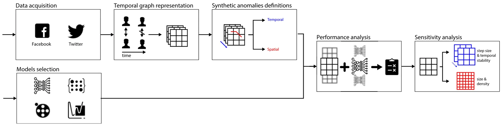
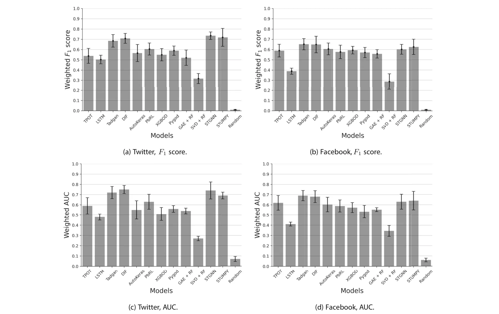

## 1 Introduction

The analysis of complex dynamic systems with multiple agents has gained significant attention in various fields, such as social networks [1], biological systems [2], and transportation networks [3]. Recently, temporal graphs have gained much attention as a fundamental framework for capturing the dynamic nature of these systems, enabling the study of evolving relationships and interactions over time [4– 7]. Representing systems as temporal graphs is considered straightforward in most cases which makes it a robust and appealing data structure to use [8].

Anomalies in temporal graphs can manifest as unexpected shifts in network behavior, sudden changes in interaction patterns, or the emergence of unusual group dynamics [9, 10]. These anomalies often provide valuable insights into signif-icant events, emerging phenomena, or potentially malicious activities within the underlying system. Detecting emerging anomalies in such temporal graphs has become a critical task with wide-ranging applications, including identifying credit frauds [11], identifying social trends [12], and understanding cell-level biological processes [13]. Consequently, developing effective methods for anomaly emergence detection in temporal graphs allows temporally-close-proximity or even immediate reaction to shifts in the dynamics.

Several approaches have been proposed to tackle the challenge of anomaly emergence detection in general [14, 15], and in temporal graphs, in particular [16, 17]. These approaches span statistical methods, machine learning algorithms, and graph-based techniques, each leveraging different assumptions and models to capture the unique characteristics of temporal graph data [18, 19]. However, due to the complexity and inherent uncertainty associated with detecting anomalies in dynamic systems, identifying the most suitable method for a specific application remains mostly unclear.

In this paper, we present a comprehensive benchmarking study that focuses on the task of anomaly emergence detection in temporal graphs, with a specific emphasis on social media interactions. Social media platforms, such as Twitter and Facebook, provide rich sources of temporal graph data, capturing the dynamic interactions among individuals, groups, and communities that can shed light on social and economic trends in real-time. Detecting anomalies in group interactions within these platforms holds immense value in understanding influential events, collective behaviors, and the spread of information. In particular, we evaluated 12 state-of-the-art methods that represent a diverse range of approaches and techniques employed in the field. By conducting experiments on two temporal graphs obtained from Twitter and Facebook, we seek to investigate the performance of these methods in identifying anomalies in group interactions within the context of social media.

Our findings present an unexpected outcome: an unclear pattern emerges regarding the best-performing method for anomaly emergence detection in social media interactions. This outcome underscores the need for further research and the development of novel techniques tailored to the unique characteristics of social media data.

This paper is structured as follows. Section 2 provides an overview of the temporal graphs’ data structure as well as the formalization of anomaly emergence detection. Next, Section 3 describes the methodology and experimental setup employed in our benchmarking study. Subsequently, Section 4 presents the performance of each method on the Twitter and Facebook temporal graphs. Finally, Section 5 analyzes our findings and suggests potential future studies.

## 2 Related work

Temporal graphs have gained significant attention in various domains as a means to capture the evolving relationships and interactions in complex dynamic systems [20–22]. In this section, we provide a formalization of temporal graphs followed by the anomaly emergence detection task definition.

Temporal (also known as dynamic, evolving, overtime-varying) graphs can be informally described as graphs that change with time. A temporal graph is a mathematical representation of a dynamic system that captures both the structural properties of a graph and the temporal aspects of interactions between entities. Formally, a temporal graph can be defined as follow. Let *G* = *(V , E, T )* be a temporal graph, where *V* ∈ Nk represents the set of nodes or entities in the graph represented as finite state machines with *k* ∈ N possible states, *E* ⊂ *V* × *V* × R denotes the set of edges such that each edge *e* ∈ *E* := *(u, v, t)* represents an interaction between nodes *u* and *v* at time *t*, and *T* ∈ N is the set of discrete time points or intervals at which the interactions occur. Intuitively, one can represent a temporal graph as a set of timestamped edges, *G* = *(u, v, t)*|*(u, v)* ∈ *E, t* ∈ *T* , that implicitly indicates the nodes of the graph and their interactions over time.

Though the formal treatment of temporal graphs is still in its infancy, there is already a huge identified set of applications and research domains that motivate it and that could benefit from the development of a concrete set of results, tools, and techniques for temporal graphs [23]. In the domain of biological systems, for instance, gene regulatory networks can be represented as temporal graphs, where nodes correspond to genes and edges capture interactions between genes at different time points, which allows the study of gene expression patterns [24]. Indeed, [25] proposed an inference algorithm based on linear ordinary differential equations. The authors show that algorithm can infer the local network of gene-gene interactions surrounding a gene of interest from time-series gene expression profiles of synthetic genomics samples. In addition, in the transportation systems realm, nodes of a temporal graph can represent locations, and edges capture movements or interactions between locations at different time points, providing an intuitive formalization to analyze traffic flows and congestion patterns [3]. For example, [26] propose a framework that enables extending the traditional convolutional neural network model to graph domains and learns the graph structure for traffic forecasting. Most relevant for this work, temporal graphs can capture the evolving relationships between individuals, communities, and groups over time. They enable the study of social phenomena, such as information diffusion [27], opinion formation [28], and community detection [2]. Plepi et al. [29] propose a dynamic graph-based framework that leverages the dynamic nature of the users’ network for detecting fake news spreaders. Using their model, the authors show that by analyzing the users’ time-evolving semantic similarities and social interactions, one can indicate misinformation spreading.

While there are many possible queries one can perform on a temporal graph, we focus on detecting anomalies over time in close temporal proximity to when they start to emerge. Namely, the anomaly emergence detection (AED) task aims to identify and characterize anomalous events or patterns in temporal graphs and alert about them shortly after they start to occur. Since anomalies can manifest in many forms such as unexpected changes in the interaction patterns, shifts in network behavior, or the emergence of unusual group dynamics. Hence, the AED task’s definition is closely related to the definition of an anomaly, in practice. Abstractly, we can assume the anomaly’s definition is implicitly provided by the tagging of anomalies in a given dataset [30].

Mathematically, the AED task can be defined as follows. Let *G* be a temporal graph and let *A* = *a*1*, a*2*, . . . , a*n represent the set of anomalies in *G* such that *a*i := *(U*i*, T*i*)*, where: *U*i is a subset of nodes *U*i ⊂ *V* , representing the entities involved in the anomaly and *T*i is a point in time that indicates the start of the anomaly emergence *T*i ∈ *T* . The AED task considered with finding a function *M* that accepts *G* and a subset *A*train := *(a*1*, a*2*, . . . , a*k*)* and predicts *A*test := *(a*k+1*, . . . , a*n*)*.

For example, let us consider a temporal graph that represents a transportation network’s dynamics, where nodes represent physical locations and edges represent the movement of vehicles between these locations, over time. An anomaly can be sudden and unexpected traffic congestion in a location or set of locations which could be caused by an accident or unplanned road closure. In this example, one can use historical records for such events and the data about the transportation network to try and predict the emergence of unexpected traffic congestion.

## 3 Experiment setup

In this section, we outline the experimental setup used for our benchmarking, including six main steps (Fig. 1).

To conduct the benchmarking study, we carefully selected 12 data-driven models that encompass a wide range of computational approaches. Our aim was to ensure that these models represent the current state-of-the-art in the field, to the best of our knowledge. Below, we provide a detailed description of each model, including its working principles and the rationale behind our selection.

- Tree-based pipeline optimization tool (TPOT) [31] - is an automated machine learning (AutoML) framework that optimizes a pipeline of preprocessing steps and machine learning models using genetic programming, based on the Scikit-learn library [32].
- AutoKeras [33] - is an automated machine learning framework that uses neural architecture search to automatically select and optimize deep learning models based on the TensorFlow framework [34].
- Time Series Anomaly Detection Using Generative Adversarial Networks (TADGAN) [35] - is a model that uses generative adversarial networks (GANs) to detect anomalies in time series data. We Include TADGAN in the analysis to explore the effectiveness of GAN framework for anomaly detection, which can capture both local and global patterns in the temporal graph data.
- Deep Isolation Forest (DIF) [36] - is an extension of the Isolation Forest algorithm [37] that uses deep learning techniques to improve anomaly detection performance.
- Long-short term memory (LSTM) neural network [38] - is a type of recurrent neural network (RNN) that can model sequential data and capture long-term dependencies. It has the ability to learn temporal dependencies in the data without taking into consideration the graph-based nature of the data.
- Policy-based reinforcement learning for time series anomaly detection (PbRL) [39]. This model applies rein-

forcement learning techniques to train a policy network for anomaly detection in time series data. It is an adaptive approach that learns from a complex from a trial-and-error approach which potentially allows it the detection of complex and evolving anomalies.

- A XGboost for anomaly detection (XGBOD) [40] - is an anomaly detection algorithm based on the XGBoost gradient boosting framework [41]. XGboost is widely considered one of the best machine learning models.
- A Python library for graph outlier detection (Pygod) [42] - Pygod is a Python library specifically designed for detecting outliers in graph-structured data.
- Graph AutoEncoder with Random Forest (GAE+RF) [43, 44]. This model combines a graph autoencoder to obtain a meaningful representation of the data from the graph, operating as a feature engineering component that is used by an RF classifier.
- Singular Value Decomposition with Random Forest (SVD+RF) [44, 45] - This model combines the singular value decomposition method which operates as an unsupervised feature engineering component followed by a random forest classifier.
- Spatio-Temporal Graph Neural Networks (STGNN) [46] - is a model that integrates graph neural networks (GNNs) with spatial and temporal information for anomaly detection in spatio-temporal data.
- Scalable Python Library for Time Series Data Mining (STUMPY) [47] - is a Python library that provides scalable algorithms for time series data mining, including motif discovery and time series approximation.
- *Random* model that randomly decides if an anomaly occurs or not to be a naive baseline. Namely, for each prediction request, with a uniform distribution, the model returns each label at random.

This set of models aims to capture a wide range of possible methods to tackle anomaly detection in spatio-temporal graphs. First, the TPOT and AutoKeras are automatic ML and DL libraries. Automatic ML (DL) gains popularity due to its powerful results on one hand and low level of expertise to utilize on the other hand [48, 49]. Second, generic machine and deep learning models like GAE + RF, SVD + RF, STUMPY, LSTM. Third, dedicated data-driven anomaly detection algorithms such as XGBOD, DIF, and Pygod which not designed for spatio-temporal graph per-se but are the closest compared to the other algorithms. Finally, graph deep learning models that designed for anomaly detection, such as TADGAN, STGNN, and PbRL.

We acquire data from the Twitter1 and Facebook2 social media websites using their official application programming

- 1 https://developer.twitter.com/en/docs/twitter-api
- 2 https://developers.facebook.com/docs/graph-api/

<figure id="fig-1">

<figcaption><strong>Fig. 1</strong> A schematic view of the experiments flow. First, we acquire data from a social media platform. Afterward, we represent the data as a temporal graph. Next, we define both temporal and spatial anomalies and</figcaption>
</figure>

interfaces (APIs). We picked these two social media websites as they provide access to the interaction data between their users over time. In addition to capturing user profiles, we also collected information about user interactions with posts (tweets) on both platforms. This included data on actions such as re-tweeting, commenting, and reacting (liking) to posts. For each interaction, we recorded the type of action, the timestamp, and the ID of the post owner. Overall, our dataset consisted of 44.8 thousand users from Twitter and 29.7 thousand users from Facebook, encompassing a total of 51.07 million and 65.93 million interactions, respectively. The data covered a duration of one month, specifically from the 22nd of August to the 22nd of September, 2020, and the 1st of February to the 1st of March, 2023, respectively.

In order to generate the temporal graph representation of this data, one has to define the nodes and edges first. To this end, each account in the dataset represents a node, *v* ∈ *V* in the graph while an action (like, comment, share) that an account *v* ∈ *V* performance on a post of account *u* ∈ *V* at some time *t* ∈ N represents an edge *e* := *(v, u, t)*. Based on this definition, we obtain a direct temporal graph. For simplicity, we bin all actions to time durations of 15 minutes, in order to get a representation that agrees with a temporal sequence of graphs since the chosen models require such representation.

Moreover, in order to obtain a population of temporal graphs from each dataset, we sampled 100 sub-graphs as follows. First, we picked at random a node of the graph, denoted by *v*c. Next, starting from *v*c, we computed Breadth-first search (BFS) [50] while ignoring the time (*t*) component of the edges *e* ∈ *E* (and duplicate edges caused as a result) until |*V* | = 10000 nodes are obtained. Once the nodes were obtained, we trimmed the temporal graph representing the entire dataset to include only these nodes.

In order to perform the analysis, one should define spatial, temporal, or spatio-temporal anomalies in the network. Unfortunately, the datasets used lack such tagged anomalies and it would be infeasible in terms of time and cost to manually tag anomalies. As such, we had to generate test various models’ performance in these settings. Finally, we conduct a sensitivity analysis on four properties of the temporal graph for each model them synthetically. Importantly, these synthetic tags have to be computed by information that is not fully available to the models; otherwise one would just examine the model’s ability to reconstruct the rules used to generate the synthetic tags. As such, inspired by the works of [51, 52], we define three anomaly rules. For all of them, let us consider a node *v* ∈ *V* at a time *t* ∈ N to be anomaly if and only if: *N*t*(v) > E*t−z,t+z[*N(v)*] + 2 ∗ *S*t−z,t+z[*N(v)*] or t+z d2Ni(v) *>* t+z 1 dNi(u) or the *i*=*t*−*z di*2 *i*=*t*−*z N*i*(v) u*∈*C*i*(v) di* largest eigenvalue of a matrix representing node’s *v* number of interactions with the rest of nodes between *t* − *z* and *t* + *z* is larger than 1, where *C*t*(v)* := {∀*u* : *(u, v, t)* ∈ *E*}, *N*t*(v)* := |*C*t*(v)*|, *z* ∈ N is a window size, *E*a,b*(x)* is the mean value of *x* such that *t* ∈[*a, b*], and *S*a,b*(x)* is the standard deviation value of *x* such that *t* ∈[*a, b*].

In order to emphasize these definitions, let us consider an example of each one of them. For the first definition, a spatial anomaly, let us consider a user who typically interacts with an average of 10 other users per day, with a standard deviation of 2. If on a particular day, the user interacts with 20 users, this could be flagged as a spatial anomaly, as it exceeds the mean plus two standard deviations (14). For the second definition, a temporal anomaly, a user who typically shows a gradual increase in interactions suddenly starts posting and interacting at a much higher rate. If the user’s rate of change in interactions (second-order derivative) spikes sharply, while the users they interact with do not show a similar pattern (weighted first-order derivatives), this can be considered an anomaly behavior. Lastly, for the spatio-temporal anomaly, if a user suddenly starts interacting with a large number of new users in a very structured way (forming a dense subgraph), this can cause the largest eigenvalue of the interaction matrix to spike. For example, a user becoming a central figure in a rapidly forming group chat or event coordination could be considered an anomaly in the way social networks emerge.

Based on these anomalies, for each instance of a temporal graph, we computed the weighted *F*1 score [53] and weighted AUC (Area Under the receiver Curve) [54] using each one of the models. Formally, the *F*1 score balances precision (the accuracy of positive predictions) and recall (the ability to find all positive instances), making it suitable for anomaly detection where both false positives and false negatives are important. It is calculated as *F*1 := 2*T P/(*2*T P*+*F P*+*F N)* where *T P, F P,* and *F N* are the number of true positive, false positive, and false negative samples, respectively. For weighted *F*1, different anomalies are assigned weights based on their frequency, *F*weighted := n i=1*(ω*i *F*i 1, where *ω*i is 1 the relative frequency of anomalies of type *i* and *n* is the number of anomaly types. In addition, the AUC measures a model’s ability to distinguish between classes, useful for evaluating anomaly detection where distinguishing normal from anomalous behavior is critical and defined by *AUC* := 1 0 *T P R(F P R)d(FT R)* where *T P R* = *T P/(T P* + *F N)* and *F P R* = *F P/(F P* + *T N)* such that *T N* is the number of true negative samples. In a similar manner to *F*weighted , *AUC*weighted := n 1 i=1*(ω*i *AUC*i. For all models, we used the first 80% of temporal samples of each temporal graph instance to train the model while using the remaining 20% for the evaluation. Importantly, the model’s prediction is set to the next step in time, such that the window size is obtained for each model using the grid search method [55] ranging from 1 to 2*z*.

Afterward, for each model, we conducted four sensitivity analysis tests, measuring the effect of changing one parameter of the task on each of the model’s performances. Namely, the prediction lag, temporal concept drift, spatial size, and spatial density. Formally, we increase the prediction lag from 1 to *z* with steps of 1. For the temporal concept drift, for each step in time *t* with a probability *p* ∈[0*,* 0*.*001*, . . . ,* 0*.*01], all edges that are connected to node *v* are removed from the temporal graph. The spatial size sensitivity test was conducted by repeating the temporal graph instances construction but with 9500 + 100*i* such that *i* ∈[0*, . . . ,* 10]. Finally, the spatial was implemented by adding |*E*0|*t* · *i* · 10−5 edges to the graph at time *t*, where *i* ∈[1*,* 10]. Formally, for each of these parameters, the value of the parameter is altered and the model’s performance is measured. A linear regression is fitted on this meta-data and the gradient is reported [56].

## 4 Results

Initially, we explore the properties of the temporal graphs of both Facebook and Twitter. Table 1 shows several central properties of social media graphs [57]. Overall, Twitter is more dense with more connected nodes compared to Facebook but with lower average path length and betweenness centrality which indicates that Twitter has more strict communities with small number of users operating as “bridges” between them compared to Facebook.

Figure 2 summarizes the main results obtained where Fig. 2a and b show the weighted *F*1 score and Fig. 2c and d show the weighted AUC of each model for the Twitter and Facebook datasets, respectively. The results are shown as the mean ± standard deviation of *n* = 100 instances for each dataset. Upon examining the results, it becomes evident that the Facebook dataset consistently yielded lower performance, on average, compared to the Twitter dataset. This observation holds true when comparing each individual model’s performance within the dataset, as well as when considering the collective performance of all the models. In addition, focusing on Fig. 2a, we can see that STGNN provides the best results with 0*.*735 ± 0*.*037 followed by STUMPY with 0*.*718 ± 0*.*088 and DIF with 0*.*709 ± 0*.*048. All of the selected models in our benchmarking study are neural network-based approaches that have been specifically designed for anomaly detection. Unlike, Fig. 2b reveal that Tadgan obtained the best results with 0*.*652±0*.*055, followed by DIF with 0*.*649±0*.*081 and STUMPY with 0*.*625±0*.*075, showing somewhat consistency in the results. Similarly, the LSTM and SVD with RF models consistently performed worse compared to the other models. However, the performance order of the remaining models varied inconsistently between the two cases, indicating that the relative performance of these models is not consistently predictable or generalizable across different datasets or scenarios. A similar pattern is emerging for the weighted AUC.

<figure class="table-figure" id="table-1">
<figcaption><strong>Table 1</strong> Comparison of network properties between Facebook and Twitter</figcaption>

<table><tr><th>Property</th><th>Facebook</th><th>Twitter</th></tr><tr><td>Node degree</td><td>5.37 ± 13.49</td><td>8.02 ± 19.15</td></tr><tr><td>Density</td><td>0.07 ± 0.04</td><td>0.11 ± 0.04</td></tr><tr><td>Average path length</td><td>2.352 ± 0.306</td><td>2.319 ± 0.212</td></tr><tr><td>Diameter</td><td>5.09 ± 0.28</td><td>4.73 ± 0.44</td></tr><tr><td>Betweenness centrality</td><td>19.13 ± 26.73</td><td>14.26 ± 34.51</td></tr></table>

The results are shown as the mean ± of all the sub-graphs sampled for the models’ training over time

</figure>

Furthermore, the sensitivity analysis results for each model have been summarized in Table 2, which is divided into four sensitivity tests, and the values presented represent the average change in performance, as measured by the weighted *F*1 score, resulting from variations in the parameters investigated in each sensitivity test.

## 5 Discussion and conclusion

In this study, we conducted a comprehensive benchmarking analysis to compare 12 data-driven methods for anomaly emergence detection in temporal graphs, with a specific focus on social media interactions. We evaluated the performance of these methods on two temporal graphs obtained from Twitter and Facebook, aiming to identify anomalies in pairwise and group interactions alike.

<figure id="fig-2">

<figcaption><strong>Fig. 2</strong> Comparison of different anomaly detection methods</figcaption>
</figure>

Initially, the properties of the used social graphs, as summarized in Table 1, are aligned with previous studies analyzing social graphs from Facebook and Twitter in different timeframes and settings [58, 59]. Thus, one can consider these datasets as well as represent social media graphs in general.

Next, the comparison of various anomaly detection methods on both Twitter and Facebook datasets, as shown in Fig. 2, has yielded surprising results. Despite employing different computational approaches, several methods achieved statistically similar results while demonstrating inconsistency between the two datasets. This finding highlights the complex nature of anomaly detection in temporal graphs and the challenges associated with generalizing results across different platforms. For instance, we observed that the TPOT automatic machine-learning framework performed as the 9th-best model for the Twitter dataset, while ranking as the 7th-best for the Facebook dataset. This discrepancy emphasizes the need for tailored approaches and the consideration of dataset-specific characteristics when selecting the most effective anomaly detection method. Unsurprisingly, anomaly detection algorithms based on neural networks, such as STGNN and STUMPY outperformed general-purpose models such as AutoKeras and LSTM-based neural networks. This outcome highlights the advantage of leveraging the inherent temporal dependencies and graph structures present in the data for improved anomaly detection performance. More generally, deep learning models seem to outperform other types of models. This can be explained by the ability of these models to capture more complex spatio-temporal connections in the data [60]. The inconsistency observed in the performance order of models across datasets further emphasizes the importance of dataset-specific exploration and evaluation. Different social media platforms exhibit unique characteristics in terms of user behaviors, network dynamics, and information propagation patterns. Indeed, the patterns of interactions differ between Twitter and Facebook significantly [61, 62], leading to variations in the effectiveness of the methods. This outcome further supports the common no-free-lunch theorem as we were not able to find a single clear model that outperforms all others even on a small sample size of only two datasets [63]. In the same manner, these results agree with a similar benchmarking analysis conducted for unsupervised outlier node detection on static attributed graphs [64]. More interestingly, Table 2 shows that different models excel in different tests. Generally speaking, the models designed for anomaly detection are more sensitive to temporal concept drift and spatial density while for the prediction lag and spatial size, the generic purpose models were found to decrease in performance faster. This research contributes to a better understanding of the complexities and challenges associated with anomaly detection in large and dynamic systems represented as temporal graphs. Future work should continue to explore novel techniques and methodologies that can effectively address these challenges and provide more robust anomaly detection solutions for diverse real-world applications.

Based on the results of this study, a compelling real-world application emerges in the field of cybersecurity, specifically for monitoring and detecting anomalous activities in social media platforms. By using deep learning models such as STGNN and STUMPY, which demonstrated superior performance in capturing complex spatio-temporal connections, these systems could more effectively identify suspicious activities such as coordinated misinformation campaigns or account hijacking attempts. One specific use case can be opinion manipulation through account hacking and publication of propaganda [65]. Detecting such accounts and blocking them can be extremely important in times of elections [66].

This study is not without limitations. First, the evaluation was conducted on a limited number of datasets, which may not fully capture the diversity and complexity of social media interactions. Furthermore, the anomalies used in this study are synthetic due to the time and resource burden of tagging such events in real data. As such, our results might change given realistic or other anomaly tagging. Second, while our sensitivity analysis included common properties such as prediction lag and spatial size other properties such as spaito-temporal rarity of the anomalies and noise levels in the data could play a central role in the models’ performance [67, 68]. Further multi-factor analysis of the influence of such properties on the models performance can shed more light on the way partitioners can choose a method given their data. Third, data-driven models in general, and anomaly detection models, in particular, benefit from the introduction of domain knowledge [69–73]. As such, it is of great interest how the proposed results would alter if domain knowledge is integrated into the examined models in the form of integrating expert-informed features or designing specialized model architectures. Nevertheless, such knowledge integration usu-ally narrows the scope of the models to a set of associated assumptions. A study of this trade-off across the different methods as well as the ease of adding domain knowledge is a promising future venue for research. Fourth, in the context of social media, all the interactions and data are available as all interactions are performed in a single (virtual) ecosystem. However, in other settings, this is usually not the case. Hence, future work should also explore cases where data is missing and the performance of multiple methods to address this shortcoming. Finally, in this study, transformer-based models are not included due to the computational power required to use train it [74]. Since transformer-based models show superior results in several domain such as natural language processing and computer vision [75, 76], future work may evaluate such models in this context as well.

<figure class="table-figure" id="table-2">
<figcaption><strong>Table 2</strong> A sensitivity analysis of each model on four properties</figcaption>

<table><tr><th>Test</th><th>Model</th><th>Value</th></tr><tr><td>Prediction lag</td><td>TPOT</td><td>−0.027</td></tr><tr><td></td><td>AutoKeras</td><td>−0.021</td></tr><tr><td></td><td>Tadgan</td><td>−0.014</td></tr><tr><td></td><td>DIF</td><td>−0.012</td></tr><tr><td></td><td>LSTM</td><td>−0.030</td></tr><tr><td></td><td>Policy-based RL</td><td>−0.017</td></tr><tr><td></td><td>XGBOD</td><td>−0.018</td></tr><tr><td></td><td>Pygod</td><td>−0.021</td></tr><tr><td></td><td>GAE + RF</td><td>−0.025</td></tr><tr><td></td><td>SVD + RF</td><td>−0.032</td></tr><tr><td></td><td>STGNN</td><td>−0.015</td></tr><tr><td></td><td>STUMPY</td><td>−0.015</td></tr><tr><td>Temopral concept drift</td><td>TPOT</td><td>−0.052</td></tr><tr><td></td><td>AutoKeras</td><td>−0.032</td></tr><tr><td></td><td>Tadgan</td><td>−0.038</td></tr><tr><td></td><td>DIF</td><td>−0.041</td></tr><tr><td></td><td>LSTM</td><td>−0.029</td></tr><tr><td></td><td>Policy-based RL</td><td>−0.031</td></tr><tr><td></td><td>XGBOD</td><td>−0.035</td></tr><tr><td></td><td>Pygod</td><td>−0.040</td></tr><tr><td></td><td>GAE + RF</td><td>−0.026</td></tr><tr><td></td><td>SVD + RF</td><td>−0.028</td></tr><tr><td></td><td>STGNN</td><td>−0.037</td></tr><tr><td></td><td>STUMPY</td><td>−0.042</td></tr><tr><td>Spatial size</td><td>TPOT</td><td>−0.007</td></tr><tr><td></td><td>AutoKeras</td><td>−0.008</td></tr><tr><td></td><td>Tadgan</td><td>−0.011</td></tr><tr><td></td><td>DIF</td><td>−0.006</td></tr><tr><td></td><td>LSTM</td><td>−0.009</td></tr><tr><td></td><td>Policy-based RL</td><td>−0.010</td></tr><tr><td></td><td>XGBOD</td><td>−0.013</td></tr><tr><td></td><td>Pygod</td><td>−0.012</td></tr><tr><td></td><td>GAE + RF</td><td>−0.008</td></tr><tr><td></td><td>SVD + RF</td><td>−0.008</td></tr><tr><td></td><td>STGNN</td><td>−0.009</td></tr><tr><td></td><td>STUMPY</td><td>−0.007</td></tr><tr><td>Spatial density</td><td>TPOT</td><td>0.003</td></tr><tr><td></td><td>AutoKeras</td><td>−0.001</td></tr><tr><td></td><td>Tadgan</td><td>−0.002</td></tr><tr><td></td><td>DIF</td><td>−0.004</td></tr><tr><td></td><td>LSTM</td><td>−0.002</td></tr><tr><td></td><td>Policy-based RL</td><td>0.002</td></tr><tr><td></td><td>XGBOD</td><td>0.005</td></tr><tr><td></td><td>Pygod</td><td>0.002</td></tr><tr><td></td><td>GAE + RF</td><td>−0.001</td></tr><tr><td></td><td>SVD + RF</td><td>−0.007</td></tr></table>

</figure>

<figure class="table-figure" id="table-2b">
<figcaption><strong>Table 2</strong> continued</figcaption>

<table><tr><th>Test</th><th>Model</th><th>Value</th></tr><tr><td></td><td>STGNN</td><td>−0.002</td></tr><tr><td></td><td>STUMPY</td><td>−0.002</td></tr></table>

The results are shown as an average change in the weighted <em>F</em>1 score. We marked in bold the best model for each sensitivity test

</figure>

Taken jointly, this study shows that while machine and deep learning models achieve relatively high results with weighted *F*1 score of 0.6 to 0.7 in large spatio-temporal graphs with complex dynamics, there is no clear model that outperforms others and these their performance highly dependent on the nature of the dataset itself. The main outcome of this study is being the baseline for further developments in the field such as knowledge-integrated solutions, dedicated DL models designed for social media graphs, and even the collections of realistic anomalies in social media spatio-temporal graphs for more accurate analysis of future solutions.

**Acknowledgements** The author wishes to thank Tom Hope for inspiring this research and implicitly suggesting several of the models used as part of this study.

**Author Contributions** Teddy Lazebnik: Conceptualization, Data Curation, Methodology, Software, Validation, Formal analysis, Investigation, Writing - Original Draft, Writing - Review & Editing. Or Iny: Conceptualization, Data Curation, Validation, Resources, Writing - Review & Editing.

**Funding** This research did not receive any specific grant from funding agencies in the public, commercial, or not-for-profit sectors.

**Data Availibility** The data used as part of this study is available upon reasonable request from the authors.

### Declarations

**Conflicts of Interest/Competing Interests** None.

## References

1. Robins G, Pattison P (2001) Random graph models for temporal processes in social networks. J Math Sociol 25(1):5–41
2. Zheng M, Domanskyi S, Piermarocchi C, Mais GI (2021) Visibility graph based temporal community detection with applications in biological time series. Sci Rep 11:5623
3. Del Mondo G, Peng P, Gensel J, Claramunt C, Lu F (2021) Leveraging spatio-temporal graphs and knowledge graphs: perspectives in the field of maritime transportation. ISPRS Int J Geo-Inf 10(8)
4. Zhao L, Song Y, Zhang C, Liu Y, Wang P, Lin T, Deng M, Li H (2020) T-gcn: a temporal graph convolutional network for traffic prediction. IEEE Trans Intell Transp Syst 21(9):3848–3858
5. Wang X, Ma Y, Wang Y, Jin W, Wang X, Tang J, Jia C, Yu J (2020) Traffic flow prediction via spatial temporal graph neural network. In: Proceedings of the web conference 2020, pp 1082– 1092. Association for Computing Machinery
6. Xiao G, Wang R, Zhang C, Ni A (2021) Demand prediction for a public bike sharing program based on spatio-temporal graph convolutional networks. Multimed Tools Appl 80
7. Zhang C, Yu JJQ, Liu Y (2019) Spatial-temporal graph attention networks: a deep learning approach for traffic forecasting. IEEE Access 7:166246–166256
8. Huang S, Cheng J, Wu H (2014) Temporal graph traversals: definitions, algorithms, and applications. arXiv
9. Cai L, Chen Z, Luo C, Gui J, Ni J, Li D, Chen H (2021) Structural temporal graph neural networks for anomaly detection in dynamic graphs. In: Proceedings of the 30th ACM international conference on information & knowledge management, pp 3747–3756
10. Rayana S, Akoglu L (2015) Less is more: building selective anomaly ensembles with application to event detection in temporal graphs, pp 622. Proceedings of the 2015 SIAM International conference on data mining
11. Cao D, Wang Y, Duan J, Zhang C, Zhu X, Huang C, Tong Y, Xu B, Bai J, Tong J, Zhang Q (2020) Spectral temporal graph neural network for multivariate time-series forecasting. In: Advances in neural information processing systems vol 33, pp 17766– 17778
12. Chung W, Lai VS (2023) A temporal graph framework for intelligence extraction in social media networks. Information & Management 60(4):103773
13. Fu D, Fang L, Maciejewski R, Torvik VI, He J (2022) Meta-learned metrics over multi-evolution temporal graphs. In: Proceedings of the 28th ACM SIGKDD conference on knowledge discovery and data mining, pp 367–377
14. Du H, Wang S, Huo H (2021) Xfinder: Detecting unknown anomalies in distributed machine learning scenario. Front Comput Sci 3
15. Liu D, Zhao Y, Xu H, Sun Y, Pei D, Luo J, Jing X, Feng M (2015) Opprentice: towards practical and automatic anomaly detection through machine learning. In: Proceedings of the 2015 internet measurement conference, pp 211–224
16. Ding C, Sun S, Zhao J (2023) Mst-gat: a multimodal spatial– temporal graph attention network for time series anomaly detection. Inf Fusion 89:527–536
17. Zeng X, Jiang Y, Ding W, Li H, Hao Y, Qiu Z (2023) A hierarchical spatio-temporal graph convolutional neural network for anomaly detection in videos. IEEE Trans Circuits Syst Video Technol 33(1):200–212
18. Cai L, Chen Z, Luo C, Gui J, Ni J, Li D, Chen H (2021) Structural temporal graph neural networks for anomaly detection in dynamic graphs. In: Proceedings of the 30th ACM international conference on information & knowledge management, pp 3747–3756
19. Pandhre S, Mittal H, Gupta M, Balasubramanian VN (2018) Stwalk: learning trajectory representations in temporal graphs. In: Proceedings of the ACM India joint international conference on data science and management of data, pp 210–219
20. Brito LFA, Travencolo BAN, Alertini MK (2022) A review of in-memory space-efficient data structures for temporal graphs. arXiv
21. Holme P, Saramaki J (2012) Temporal networks. Phys Rep 519(3):97–125
22. Zhang T, Gao Y, Qiu L, Chen L, Linghu Q, Pu S (2020) Distributed time-respecting flow graph pattern matching on temporal graphs. World Wide Web 23:609–630
23. Michail O (2015) An introduction to temporal graphs: an algorithmic perspective. arXiv
24. McNeil MJ, Zhang L, Bogdanov P (2021) Temporal graph signal decomposition. In: Proceedings of the 27th ACM SIGKDD conference on knowledge discovery & data mining, pp 1191– 1201
25. Bansal M, di Bernardo D (2007) Inference of gene networks from temporal gene expression profiles. IET Systems Biology 1(6):306– 312
26. Zhang Q, Chang J, Meng G, Xiang S, Pan C (2020) Spatio-temporal graph structure learning for traffic forecasting. In: Proceedings of the AAAI Conference on Artificial Intelligence 34(01), pp 1177– 1185
27. Byun J, Woo S, Kim D (2020) Chronograph: enabling temporal graph traversals for efficient information diffusion analysis over time. IEEE Trans Knowl Data Eng 32(3):424–437
28. Maity SK, Manoj TV, Mukherjee A (2012) Opinion formation in time-varying social networks: the case of the naming game. Phys Rev E 86:036110
29. Plepi J, Sakketou F, Geiss H-J, Flek L (2022) Temporal graph analysis of misinformation spreaders in social media. In: Proceedings of TextGraphs-16: Graph-based methods for natural language processing, pp 89–104
30. Blázquez-García A, Conde A, Mori U, Lozano JA (2021) A review on outlier/anomaly detection in time series data. ACM Comput Surv 54(3):56
31. Olson RS, Moore JH (2016) Tpot: a tree-based pipeline optimization tool for automating machine learning. In: Workshop on automatic machine learning, pp 66–74. PMLR
32. Pedregosa F, Varoquaux G, Gramfort A, Michel V, Thirion B, Grisel O, Blondel M, Prettenhofer P, Weiss R, Dubourg V, Vanderplas J, Passos A, Cournapeau D, Brucher M, Perrot M, Duchesnay E (2011) Scikit-learn: machine learning in Python. J Mach Learn Res 12:2825–2830
33. Jin H, Chollet F, Song Q, Hu X (2023) Autokeras: an automl library for deep learning. J Mach Learn Res 24(6):1–6
34. Abadi M, Barham P, Chen J, Chen Z, Davis A, Dean J, Devin M, Ghemawat S, Irving G, Isard M (2016) Tensorflow: a system for large-scale machine learning. In: 12th {USENIX} Symposium on operating systems design and implementation ({OSDI} 16), pp 265–283
35. Geiger A, Liu D, Alnegheimish S, Cuesta-Infante A, Veera-machaneni K (2020) Tadgan: time series anomaly detection using generative adversarial networks. arXiv
36. Xu H, Pang G, Wang Y, Wang Y (2023) Deep isolation forest for anomaly detection. arXiv
37. Liu FT, Ting KM, Zhou Z-H (2008) Isolation forest. In: Data mining, pp 265–283. ICDM’08
38. Sutskever I, Vinyals O, Le QV (2014) Sequence to sequence learning with neural networks. Adv Neural Inf Process Syst 27:3104–3112
39. Yu M, Sun S (2020) Policy-based reinforcement learning for time series anomaly detection. Eng Appl Artif Intell 95:103919
40. Zhao Y, Hryniewicki MK (2019) Xgbod: improving supervised outlier detection with unsupervised representation learning. arXiv
41. Chen T, Guestrin C (2016) XGBoost: a scalable tree boosting system. In: Proceedings of the 22nd ACM SIGKDD international conference on knowledge discovery and data mining, KDD ’16, pp 785–794. ACM
42. Liu K, Dou Y, Zhao Y, Ding X, Hu X, Zhang R, Ding K, Chen C, Peng H, Shu K, Chen GH, Jia Z, Yu PS (2022) Pygod: A python library for graph outlier detection. arXiv
43. Kipf TN, Welling M (2016) Variational graph auto-encoders. NIPS Workshop on Bayesian deep learning
44. Ho TK (1995) Random decision forests. In: Proceedings of 3rd international conference on document analysis and recognition, vol 1, pp 278–282. IEEE
45. Klema V, Laub A (1980) The singular value decomposition: its computation and some applications. IEEE Trans Autom Control 25(2):164–176
46. Chen J, Wang Y, Wu R, Campbell M (2021) Spatial-temporal graph neural network for interaction-aware vehicle trajectory prediction. In: 2021 IEEE 17th International conference on automation science and engineering (CASE), pp 2119–2125
47. Law SM (2019) STUMPY: A powerful and scalable Python library for time series data mining. J Open Source Softw 4(39):1504
48. Wang W, Xu W, Yao X, Wang H (2022) Application of data-driven method for automatic machine learning in economic research. In: 2022 21st International symposium on distributed computing and applications for business engineering and science (DCABES), pp 42–45
49. Lazebnik T, Somech A, Itzhak Weinberg A (2022) Substrat: a subset-based optimization strategy for faster automl. In: Proceedings of the VLDB endowment, 16(4), pp 772–780, 12
50. Kozen DC (1992) Depth-first and breadth-first search, pp 19–24. Springer New York
51. Yu R, Qiu H, Wen Z, Lin C, Liu Y (2016) A survey on social media anomaly detection. SIGKDD Explor. Newsl. 18(1):1–14
52. Yu R, He X, Liu Y (2015) Glad: group anomaly detection in social media analysis. ACM Trans Knowl Discov Data 10(2)
53. Goutte C, Gaussier E (2005) A probabilistic interpretation of precision, recall and f-score, with implication for evaluation. In: Losada DE, Fernandez-Luna JM (eds) Advances in information retrieval. Springer, Berlin Heidelberg, pp 345–359
54. Cortes C, Mohri M (2003) Auc optimization vs. error rate minimization. In: Advances in neural information processing systems, vol 16
55. Liu R, Liu E, Yang J, Li M, Wang F (2006) Optimizing the hyper-parameters for svm by combining evolution strategies with a grid search. Intelligent Control and Automation, 344
56. Frey CH, Patil SR (2002) Identification and review of sensitivity analysis methods. Risk Anal 22(3):553–578
57. Mincer M, Niewiadomska-Szynkiewicz E (2012) Application of social network analysis to the investigation of interpersonal connections. J Telecommun Inf Technol 2:83–91
58. Teutle ARM (2010) Twitter: network properties analysis. In: 2010 20th International conference on electronics communications and computers (CONIELECOMP), pp 180–186
59. Ugander J, Karrer B, Backstrom L, Marlow C (2011) The anatomy of the facebook social graph. arXiv
60. Janiesch C, Zschech P, Heinrich K (2021) Machine learning and deep learning. Electron Markets 31:685–695
61. Jaidka K, Guntuku S, Ungar L (2018) Facebook versus twitter: differences in self-disclosure and trait prediction. In: Proceedings of the international AAAI conference on web and social media, 12(1)
62. Petrocchi N, Asnaani A, Martinez AP, Nadkarni A, Hofmann SG (2015) Differences between people who use only facebook and those who use facebook plus twitter. Int J Human-Comput Interact 31(2):157–165
63. Wolpert DH, Macready WG (1997) No free lunch theorems for optimization. IEEE Trans Evol Comput, 67
64. Liu K, Dou Y, Zhao Y, Ding X, Hu X, Zhang R, Ding K, Chen C, Peng H, Shu K, Sun L, Li J, Chen GH, Jia Z, Bond PSYu (2022) Benchmarking unsupervised outlier node detection on static attributed graphs. Adv Neural Inf Process Syst 35:27021–27035
65. Goswami MP (2018) Fake news and cyber propaganda: a study of manipulation and abuses on social media. In: Mediascape in 21st century: emerging perspectives, pp 535–544
66. Lightfoot S, Jacobs S (2017) Political propaganda spread through social bots. Media, Culture, & Global Politics 8:1–22
67. Hu W, Gao J, Li B, Wu O, Du J, Maybank S (2020) Anomaly detection using local kernel density estimation and context-based regression. IEEE Trans Knowl Data Eng 32(2):218–233
68. Nazari Z, Danish MSS (2018) Evaluation of class noise impact on performance of machine learning algorithms. Int J Comput Sci Netw Sec 18(8):148–153
69. Lazebnik T, Simon-Keren L (2023) Knowledge-integrated autoencoder model. Expert Syst Appl 252:124108
70. Ma T, Zhang A (2019) Integrate multi-omics data with biological interaction networks using multi-view factorization autoencoder (mae). BMC Genomics 20:944
71. Ding W, Lin H, Li B, Eun KJ, Zhao D (2022) Semantically adversarial driving scenario generation with explicit knowledge integration. arXiv
72. Keren LS, Liberzon A, Lazebnik T (2023) A computational framework for physics-informed symbolic regression with straightforward integration of domain knowledge. Sci Rep 13(1):1249
73. Deng Y, Sander A, Faulstich L, Denecke K (2019) Towards automatic encoding of medical procedures using convolutional neural networks and autoencoders. Artif Intell Med 93:29– 42
74. Singh S, Mahmood A (2021) The nlp cookbook: modern recipes for transformer based deep learning architectures. IEEE Access 9:68675–68702
75. Han K, Wang Y, Chen H, Chen X, Guo J, Liu Z, Tang Y, Xiao A, Xu C, Xu Y, Yang Z, Zhang Y, Tao D (2023) A survey on vision transformer. IEEE Trans Pattern Anal Mach Intell 45(1):87– 110
76. Tetko IV, Karpov P, Deursen RV, Godin G (2020) State-of-the-art augmented nlp transformer models for direct and single-step retrosynthesis. Nat Commun 11:5575
