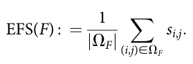
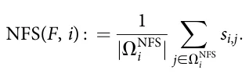
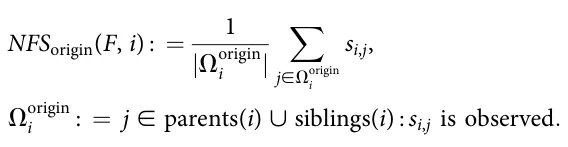
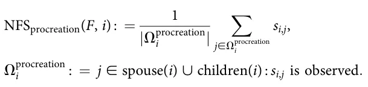
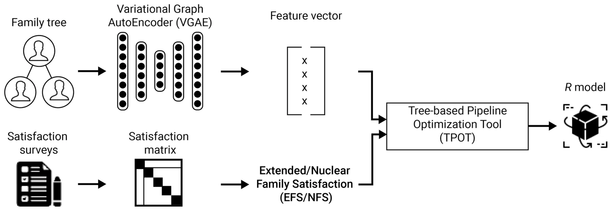
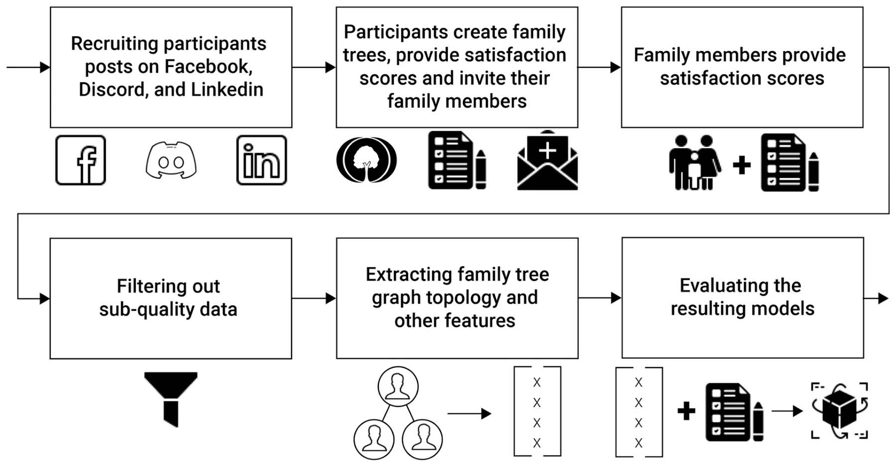
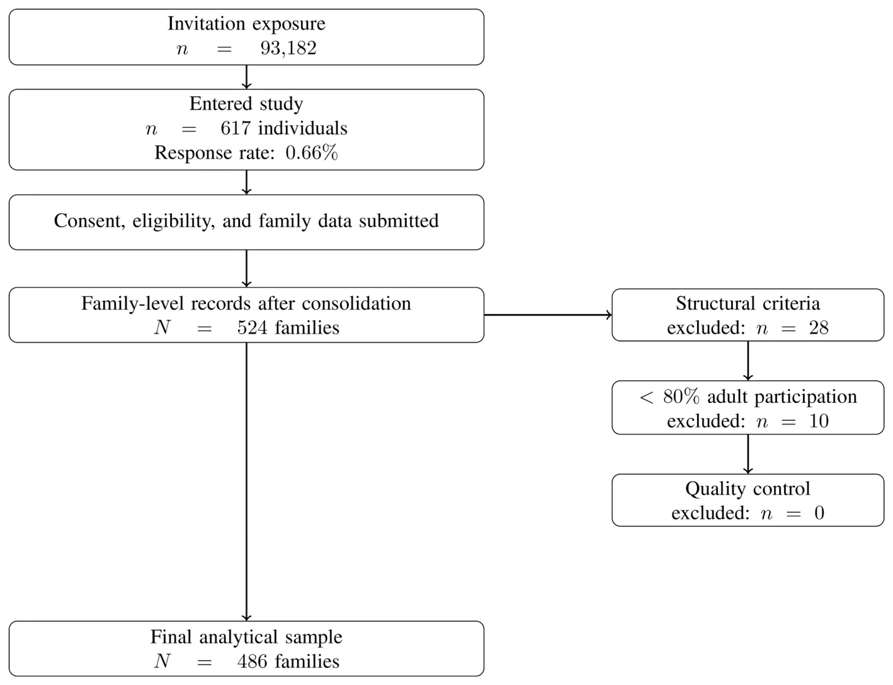
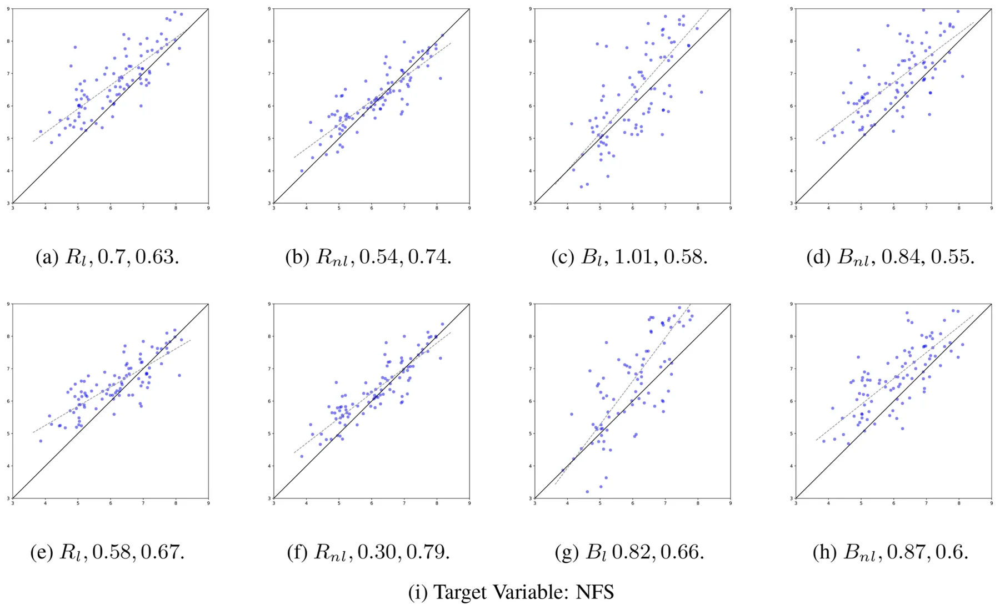

## 1 Introduction

Family dynamics and relationships are fundamental to human life, influencing individual well-being, social development, and emotional health (Simmel, 1998; Mauno et al., 2006; Prime et al., 2020; Cherlin, 1999). In this work, we define a family broadly as a set of individuals connected through kinship, partnership, parenthood, marriage, divorce, adoption, or other socially recognized family ties. This definition intentionally accommodates different family forms, including nuclear families, extended families, single-parent families, blended or reconstituted families, and multigenerational families. Such a broad definition is important because contemporary family life is heterogeneous, and family-related outcomes may depend not only on isolated dyadic relationships but also on the wider organization of family ties (Slivšek et al., 2024). In fact, understanding the factors associated with family members’ satisfaction with one another is a focal research challenge inherent to various fields, including sociology (Gilman and Huebner, 2006; Becchetti and Pelloni, 2013), mental healthcare (Rego Lins Fumis et al., 2006; Zabriskie and Ward, 2013), psychology (Schwarze and Winkelmann, 2011; Agate et al., 2009), and family studies (Fitzpatrick, 1985; Nes et al., 2010; Brown, 2004), to name a few. Broadly speaking, research efforts in this realm seek to study associations between family relationships, family organization, and family well-being, and to improve our understanding of how family environments are related to individual and relational outcomes (Kramer and Bank, 2005; Brik and Luebbe, 2024; van Dijk et al., 2022). The present study contributes to this literature from a predictive perspective. Specifically, we examine whether the structural organization of the family tree contains information that is useful for predicting reported satisfaction outcomes. We do not attempt to identify causal mechanisms or to explain why particular family structures may be associated with higher or lower satisfaction.

A socio-ecological view of family life provides a useful conceptual bridge between these family-research constructs and the graph-based approach used in the present study. From this perspective, the family is not merely a descriptive background characteristic, but a relational and contextual environment that may shape individual and family-level outcomes across the life course. Family structure and family dynamics may reflect major life events and transitions, including marriage, divorce, parenthood, widowhood, and changes in household composition (Slivšek et al., 2024). These transitions alter not only the number of family members but also the pattern of possible

Abbreviations

Bl, Linear literature-based aggregate baselinemodel; Bnl, Non-linear literature-based aggregate baselinemodel; d, Latent embedding dimension; E, Set of family-relationship edges in the family graph; EFS, Extended Family Satisfaction; F, Family represented as a tuple F = (G, S); G, Family tree graph, G = (V,E); Gl, Linear topology-based graph-statistical baseline model; Gnl, Non-linear topology-based graph-statistical baseline model; GCN, Graph Convolutional Network; GIN, Graph Isomorphism Network; GNN, Graph Neural Network; hG, Pooled graph-level representation of family graph G; IRB, Institutional Review Board; MAE, Mean Absolute Error; NFS, Nuclear Family Satisfaction; R, Supervised regression model selected after graph representation learning; Rl, Linear regression model using the proposed VGAE-based representation; Rnl, Nonlinear regression model using the proposed VGAE-based representation; R2, Coefficient of determination; S, Directed satisfaction matrix; si,j , Satisfaction rating reported by family member i toward family member j; TPOT, Tree-based Pipeline Optimization Tool; V , Set of nodes in the family graph, where each node represents a family member; VGAE, Variational Graph AutoEncoder; XG, Node-feature matrix for graph G; zi, Latent embedding of family member i; ZG, Matrix of latent node embeddings for graph G; μi, Operational immediatefamily set for focal member i; F, Set of observed directed satisfaction ratings used to compute EFS; NFS i, Set of observed immediate-family ratings used to compute NFS for focal member i.

relationships among them. Accordingly, the overall organization of the family may contain predictive information relevant to reported satisfaction, even when no individual-level demographic or psychological attributes are used. A natural way to operationalize the structural component of the family is through a family-tree graph (Bouquet, 1996). In such a tree graph, nodes represent the family members (possibly along with some basic information about each of them such as name, gender, and birth and/or demise dates) and edges represent relationships native to family dynamics, such as marriage, divorce, and parenthood. Family tree graphs may be highly complex (Guttmacher et al., 2004; Moos and Moos, 1976) and may vary widely in their topology from one family to the other due to cultural, demographic, and economic factors, to name a few (Bouquet, 1996). This motivates the central research question of the present study: Does the topology of a family tree graph contain predictive information about family members’ reported satisfaction with one another, beyond selected aggregate family characteristics commonly discussed in prior literature? From a research methodology perspective, in order to overcome these challenges, prior literature has typically focused on a limited number of aspects within the family tree graph and investigated their possible relationships with family members’ satisfaction with one another. For example, extensive lines of work have focused almost exclusively on parent-child characteristics (Paikoff and Brooks-Gunn, 1991), sibling relationships (Whiteman et al., 2011), marital dynamics (Cook et al., 1995), and other specific aspects of the family tree graph. That is, to the best of our understanding, the *topology* of a family tree graph, i.e., its entire structure, is not considered as the basic unit of analysis in existing literature.

In this work, we propose and evaluate a computational technique for exploring the relationship between the topology of a family tree graph and family members’ reported satisfaction with one another. Conceptually, the graph topology represents the structural organization of the family, while the satisfaction scores represent subjective evaluations of relationships within that structure. We therefore treat topology as the input representation and satisfaction as the modeled outcome. Specifically, we consider two modeled outcomes: Extended Family Satisfaction (EFS), which summarizes observed reported satisfaction across the broader family graph, and Nuclear Family Satisfaction (NFS), which summarizes observed reported satisfaction within the focal member’s study-specific immediate-family environment. In particular, the proposed technique is based on a machine-learning pipeline consisting of a graph representation-learning stage and a supervised regression stage. Initially, the family tree graph is converted into latent feature vectors using a variational graph AutoEncoder model (Kipf and Welling, 2016). These feature vectors are then used to train supervised regression models for two predictive tasks: estimating average satisfaction across the extended family graph and estimating the satisfaction of a focal family member with his or her nuclear family members. The purpose of this pipeline is to assess whether topology-only graph representations contain predictive indicators for these satisfaction outcomes. Using data from 486 families recruited through a self-selected online convenience sampling procedure, the results present preliminary predictive evidence that topology-only graph representations are predictive and perform competitively relative to comparison models based on established aggregate family variables. However, given the observational design, self-selected convenience sample, participation requirements, low response rate, and lack of sociodemographic control variables, we interpret these findings as exploratory predictive associations rather than definitive causal, representative, or population-level relationships.

The rest of the article is organized as follows: In Section 2, we review relevant prior work. Then, in Section 3, we formally present the proposed technique. In Section 4, we apply and compare our technique with two baseline models using family tree graphs and satisfaction scores we curated. Finally, in Section 5, we discuss and interpret the results, highlighting possible implications and future work directions.

## 2 Related work

The present study draws on three bodies of literature: family satisfaction, family structure, and graph representation learning. As terminology diverges between fields, we start by defining several central terms used in this study. First, *Family satisfaction* refers to the subjective evaluation of relationships among family members. Second, *Family structure* is used in the social-science sense to denote the composition, roles, and organization of the family, including household form, marital status, generational composition, and kinship roles. Third, *Family relationships* refer to specific ties between members, such as parent-child, spouse, sibling, and grandparent relations. Fourth, *Family dynamics* refer to interactional and emotional processes, such as support, conflict, caregiving, and communication. In contrast, *family-tree topology* has a narrower graph-theoretic meaning in this study: it refers to the complete arrangement of family members and formal family ties represented as nodes and edges. Finally, *graph representation learning* refers to computational methods that learn numerical representations of graph-structured data for downstream tasks such as prediction.

### 2.1 Family satisfaction and related family outcomes

Focusing on the study of family members’ satisfaction with one another, a large body of work has considered specific aspects of the family tree graph (Agate et al., 2009; Benson et al., 1995; Evans and Kelley, 2004). For instance, (Georgas et al., 2001) investigated the relationship between family structure and other cultural and functional aspects of the family, such as emotional distance, social interaction, and communication quality. As mentioned before, family tree graphs may be highly complex and may vary widely in their topology from one family to another (Bouquet, 1996). As a result, these and similar prior studies often examine “direct” factors, such as individual and relational attributes, rather than the overall structure of family tree graphs.

Specifically, prior studies in the realm of family members’ satisfaction with one another have focused on a wide range of specific aspects within the family tree graph, such as “nuclear family” size (Hofferth, 1984; Popenoe, 1987; Cáceres-Delpiano, 2006); male-to-female ratio (Fox et al., 2002; Chen et al., 1981);

generation age difference (Amato, 2005; Jackson et al., 2007); step-siblings and divorce (Gennetian, 2005); and the oldest-generation members’ average satisfaction (Ruiz and Silverstein, 2007). Nevertheless, the above-mentioned “direct” characteristics of the family tree graph are used in our analysis as well for the baseline modeling, formally outlined in Section 4.

In the context of family members’ satisfaction with one another, the terms “nuclear family” and “extended family” commonly emerge to differentiate between the immediate, and typically presumed most influential, family environment and the broader family environment (Yorburg, 1975). However, there is no single universally accepted operational definition of these terms, and different studies distinguish nuclear and extended family relations in different ways (Castillo et al., 1968). Conceptually, the nuclear family is often described broadly as the set of immediate family relations surrounding an individual, including parents, siblings, spouse, and children, whereas more distant relatives are considered part of the extended family (Saggers and Sims, 2005; Garcimartin, 2012). In the present study, we distinguish this broad conceptual meaning from the study-specific operational definition used to compute Nuclear Family Satisfaction (NFS). Specifically, NFS is operationalized as an ego-centered immediate-family satisfaction measure. The operational rule follows the distinction between a family of origin and a family of procreation. For focal members who have formed a family of procreation, namely those with a spouse and/or children, the immediate-family set includes the spouse and children. For focal members without a spouse or children, the immediate-family set includes parents and siblings, corresponding to the family of origin. This conditional rule was adopted for methodological consistency: it assigns each focal member one primary immediate-family context rather than merging two different life-stage contexts into the same target variable. Thus, NFS should not be interpreted as a universal definition of the nuclear family. Rather, it is a study-specific operationalization designed to summarize satisfaction within the focal member’s closest available family environment under the constraints of the collected family-tree and satisfaction data.

The conceptual separation between nuclear and extended family is prominent in the study of families (Howells, 1962). For example, Al Awad and Sonuga-Barke (1992) studied the relationship between family structure and emotional and social development in the Sudanese capital, Khartoum. Their analysis revealed that children living with their nuclear families had more conduct, emotional, and sleep problems, poorer self-care, and were more likely to be overdependent compared to those living with their extended families. In particular, the authors show that the grandmother’s involvement was the strongest predictor of normal social and emotional adjustment for young children. Carr and Utz (2020) investigated changes in later-life families, namely families where most members are 65 years old or older, focusing on how family caregiving occurs within these families. The authors show multiple differences between nuclear and extended families in this context. As such, in this work, we too consider nuclear family satisfaction and extended family satisfaction separately.

A recurring feature of prior family-studies research is that family outcomes are often examined through aggregate descriptors of family composition, intergenerational organization, and family transitions rather than through the complete topology of the family tree. In the present study, we use five such aggregate descriptors as literature-based comparison variables. First, nuclear-family size captures the size of the immediate relational environment around a person. Family size and sibship size have long been used as structural indicators in family research because the number of children or close kin relations may affect the distribution of parental time, attention, material resources, and opportunities for interaction (Blake, 1981; Downey, 1995). Second, the male-to-female ratio captures family composition. Prior work on sibling sex composition shows that the gender composition of the family can be associated with educational and resource-allocation outcomes, while broader caregiving research suggests that gender is also relevant to family roles and support patterns (Butcher and Case, 1994; Powell and Steelman, 1989; Pinquart and Sörensen, 2006). Third, generation age difference summarizes intergenerational spacing. Intergenerational family research emphasizes that family ties across generations are shaped by life-course position, role timing, contact opportunities, and solidarity between parents, adult children, and older relatives (Bengtson and Roberts, 1991; Bengtson, 2001). Fourth, step-sibling and divorce counts capture family reconfiguration. Divorce, remarriage, and stepfamily formation are major structural transitions that can alter household boundaries, kinship roles, obligations, and patterns of closeness or conflict within the family system (Cherlin, 1978; Coleman et al., 2000; Sweeney, 2010; Amato, 2010). Fifth, oldest-generation members’ average satisfaction is included because senior family members often occupy important intergenerational positions. Research on multigenerational family bonds and intergenerational solidarity suggests that older-generation members may be central to continuity, support, and cohesion across the family system (Bengtson and Roberts, 1991; Bengtson, 2001; Silverstein and Bengtson, 1997).

### 2.2 Family structure and family-tree topology

Family tree graphs are not restricted to the social sciences alone (Sturgess et al., 2001; Foxman et al., 1989). They also serve as important tools in other fields, ranging from biology, where family tree graphs are commonly used to represent and study evolutionary processes (Thompson and Zimmermann, 2009), to public health, where historical records of family members in the family tree are used to infer disease probabilities in individuals (Williams et al., 2001).

Focusing on the use of family tree graphs in the social sciences, prior studies have explored possible associations between family structure and various socio-economic phenomena, such as economic stability, educational attainment, and health. For instance, McLanahan and Percheski (2008) reviewed studies of income inequality and family-structure changes and found associations between family structure and class, race, and gender inequalities. In a similar manner, (McLanahan, 1985) used data from the Michigan Panel Study of Income Dynamics (MPSID) to explore the relationship between female-headed families and economic deprivation. Sandefur and Wells (1999) examined the effects of family structure on educational attainment after controlling for common family influences, both observed and unobserved, using data from siblings. The authors found that family structure is a statistically significant indicator of educational attainment. Gorman and Braverman (2008) investigated the relationship between family structure and children’s access to health care, in general, and the extent to which family-structure types predict children’s utilization of preventive health care and barriers to care, in particular. The authors found that children of single mothers demonstrate different patterns of healthcare access than children of single fathers.

It is important to distinguish between the social-science concept of family structure and the graph-analytic concept of family-tree topology. In the social-science literature, family structure often refers to family form, household composition, marital status, number of children, generational composition, or other aggregate descriptors of the family system. In contrast, in the present study, family-tree topology refers specifically to the graph-theoretic arrangement of family members and their formal ties. Nodes represent family members, and edges represent formal family relations such as parenthood, marriage, and divorce. Thus, topology is narrower than family structure: it does not include demographic attributes, socioeconomic background, relationship quality, or satisfaction scores.

To the best of our knowledge, this is the first work to consider the entire structure, i.e., topology, of the family tree graph as the basic unit of analysis. This novelty claim is intentionally limited in scope. We do not claim to be the first to study family structure, family composition, household form, or specific family relationships. Rather, the contribution is the use of the complete topology of the family tree graph as the primary input representation for predicting reported family satisfaction.

### 2.3 Graph representation learning and graph-based prediction

Graph representation learning provides a methodological framework for converting graph-structured data into numerical representations that can be used in downstream machine-learning tasks (Hamilton et al., 2017a; Zhou et al., 2020). In this framework, the input is not a fixed-length tabular feature vector, but a graph composed of nodes, edges, and, when available, node or edge attributes. The aim is to learn embeddings that preserve information about the graph’s connectivity patterns and local or global structural organization. Depending on the task, these embeddings may represent individual nodes, links between nodes, subgraphs, or entire graphs. Once learned, they can be used for prediction tasks such as node classification, graph classification, link prediction, clustering, or regression.

A central family of graph representation-learning models is graph neural networks (GNNs). GNNs operate by iteratively updating the representation of each node using information from its neighboring nodes (Kipf and Welling, 2017; Hamilton et al., 2017b). At each layer, a node receives information from its local neighborhood, combines this information with its current representation, and passes the updated representation to the next layer. Stacking multiple layers allows the model to represent increasingly wider neighborhoods around each node. In this way, a node embedding can encode both the node’s local position in the graph and the structural context around it. This message-passing mechanism makes GNNs suitable for data in which the relations between observations are informative, rather than merely incidental.

Different GNN architectures implement this general idea in different ways. Graph Convolutional Networks (GCNs) aggregate information from neighboring nodes using a normalized graph-convolution operation and learn hidden representations that reflect both node features and graph connectivity (Kipf and Welling, 2017). GraphSAGE extends this idea to an inductive setting by learning aggregation functions that can generate embeddings for previously unseen nodes or graphs, rather than learning a separate embedding for each node observed during training (Hamilton et al., 2017b). Graph Attention Networks (GATs) use attention mechanisms to assign different weights to different neighboring nodes, allowing the model to learn which neighbors are more informative for a given prediction task (Veličković et al., 2018). Graph Isomorphism Networks (GINs) were proposed to improve the expressive power of message-passing GNNs and to better distinguish between different graph structures (Xu et al., 2019). These architectures are relevant to the present study because they provide standard supervised graph-learning baselines for evaluating whether family-tree topology can be used directly for prediction.

For graph-level prediction tasks, node embeddings must be transformed into a representation of the entire graph. This is typically done using a permutation-invariant readout or pooling operation, such as summing, averaging, or taking the maximum over node embeddings (Ying et al., 2018; Zhou et al., 2020). More complex pooling methods can also learn hierarchical graph summaries, but the central goal is the same: to obtain a fixed-length representation of a graph even when different graphs contain different numbers of nodes and edges. This property is particularly important in the present study because family trees naturally vary in size, number of generations, and number of relationships. A graph-learning model can therefore process families of different sizes while still producing representations that can be passed to a supervised regression model.

Autoencoder-based graph models provide another approach to graph representation learning. In a graph autoencoder, an encoder maps the graph into a latent representation, and a decoder attempts to reconstruct some aspect of the original graph, such as its connectivity pattern. Variational Graph AutoEncoders (VGAEs) extend this idea using a probabilistic latent representation and have been proposed for unsupervised learning on graph-structured data (Kipf and Welling, 2016). In the present study, the VGAE is used as a topology-based representation-learning component. It receives the family-tree graph as input and learns latent embeddings that summarize the position of each family member within the graph structure. These embeddings are then aggregated for graph-level prediction or combined with a focal member’s embedding for member-level prediction.

## 3 Computational technique

Formally, each family is represented as a tuple *F* : = (*G*, *S*), where *G* : = (*V*, *E*) is the family tree graph. The set *V* contains the graph nodes, where each node corresponds to one family member. The set *E* ⊆ *V* × *V* × *T* contains the family relationships between members, where *T* : = {married, divorced, parent}. Importantly, the proposed model uses a topology-only representation of the family tree graph. That is, nodes correspond only to family members and are not assigned demographic, personal, or satisfaction-related attributes. In particular, names, gender, age, birth/death dates, and satisfaction scores are not used as node features. Thus, the input node-feature matrix is defined as *X*G : = **1**|V|×1, where each family member is assigned the same constant feature. Consequently, all predictive information available to the VGAE comes from the structure of the family graph and from the encoded family relationships. The satisfaction matrix *S* is used only to construct the target variables and is not provided as an input feature to the VGAE or to the supervised regression model. In addition, we assume access to a possibly incomplete directed satisfaction matrix *S* ∈ ℝ|V|×|V|, where *s*i,j denotes the subjective satisfaction rating reported by family member *i* ∈ *V* toward family member *j* ∈ *V*, when such a rating is observed. Since not all family members necessarily provide ratings for all other family members, some entries of *S* may be missing. Missing entries are excluded from target construction and are not imputed. For convenience, let us assume *s*i,j ∈ [1, .. . , 10]. Clearly, matrix *S* may not be symmetrical as family members *i* and *j* need not necessarily have the same satisfaction from one another (i.e., *s*i,j ≠ *s j*,i).

At the core of the proposed technique is a two-step machine-learning pipeline. First, we use a deep neural network model to convert the family tree graph (*G*) into a representative feature vector. Deep neural networks are currently considered the state-of-the-art computational tool for representing graphs in a manner that captures complex patterns and relationships, making them particularly suitable for analyzing intricate data structures like family tree graphs (Hamilton et al., 2017a). We adopt the Variational Graph AutoEncoder (VGAE) architecture as a representative model (Kipf and Welling, 2016) given its promising results in similar tasks with limited-sized datasets in the past (Girin et al., 2020). The VGAE naturally handles family graphs with different numbers of members. For a family graph *G* = (*V*, *E*), the encoder produces a latent embedding matrix *Z*G = [*z*1, . . . , *z*|V|]⊤ ∈ ℝ|V|×d, where *d* = 16 and each row *z*i is the latent representation of one family member. Thus, the number of latent vectors changes with the number of family members, |*V*|, but the dimensionality of each node representation is fixed. No padding or truncation of family graphs is required. For graph-level prediction of the Extended Family Satisfaction measure, we aggregate the node embeddings using mean pooling: *h*G : = ∑|V| i=1 *z*i*=*|*V*| ∈ ℝ16. The resulting vector *h*G is then used as the fixed-size graph representation for predicting family satisfaction. The resulting feature vectors are considered training features for a supervised regression model. Each of these vectors is then extended with a family satisfaction measure of interest as a target variable. Aligned with prior literature, we consider two measures of family satisfaction. Because the satisfaction matrix may be incomplete, both measures are computed only from observed directed satisfaction ratings. Let ΩF : = {(*i*, *j*) ∈ *V* × *V* : *i* ≠ *j* and *s*i,j is observed} denote the set of observed directed ratings in family *F*. The Extended Family Satisfaction (EFS) measure captures the average observed satisfaction rating between family members across the extended family graph. Mathematically, EFS is defined as follows:

Second, we consider the Nuclear Family Satisfaction (NFS) measure, which is defined as a study-specific ego-centered immediate-family satisfaction measure. Let μi denote the operational immediate-family set for focal member *i*, as defined above. Since the satisfaction matrix may be incomplete, NFS(*F*, *i*) is computed only over observed directed ratings from *i* to members of μi. For each focal member *i*, let ΩNFS : = {*j* ∈ μi : *s*i,j is observed} denote the set of immediate- *i* family members for whom *i*’s satisfaction rating is observed. Operationally, if focal member (i) has a spouse and/or children, μi is defined as the set of (i)’s spouse and children, corresponding to the family of procreation. Otherwise, μi is defined as the set of (i)’s parents and siblings, corresponding to the family of origin. This rule defines the primary immediate-family context used for the study-specific (NFS) target. Formally, we define NFS as follows:

Because this operational definition of NFS depends on the focal member’s life stage, we additionally evaluate the robustness of the NFS results using alternative target definitions. Specifically, we define two sensitivity targets. The first, NFSorigin(*F*, *i*), is computed using only parents and siblings whenever at least one such observed rating is available:

The second, NFSprocreation(*F*, *i*), is computed using only spouse and children whenever at least one such observed rating is available:

Members for whom the relevant observed-rating set is empty are excluded from the corresponding sensitivity analysis but remain eligible for the primary NFS analysis when their primary immediate-family set is observed. These sensitivity analyses are not intended to redefine the primary outcome. Rather, they test whether the predictive conclusions for NFS are driven primarily by the conditional family-of-origin/family-of-procreation rule.

Specifically, in our implementation, the family tree graph feature vectors are considered as training input for a supervised regression model with the EFS measure and the NFS measures associated with each member as target variables. Since NFS(*F*, *i*) is defined with respect to a focal family member *i*, its prediction requires a member-specific representation rather than only a graph-level representation. Therefore, for the NFS task we use the latent embedding of the focal member, *z*i, together with the pooled graph representation *h*G. Specifically, the regression input for member *i* is φ(*G*, *i*) : = [*h*G ‖ *z*i] ∈ ℝ32, where ‖ denotes vector concatenation. This representation preserves the topology-only nature of the proposed model while allowing the regression model to distinguish between different members of the same family graph. To make the representation explicit, we provide a simplified serialized example in the Supplementary Material.

The resulting regression task is then solved using the Tree-based Pipeline Optimization Tool (TPOT) (Olson and Moore, 2016), an automated tool for optimizing the learning process using a genetic algorithm approach (Holland, 1992; Bo and Rein, 2005; Ghaheri et al., 2005), resulting in a regression model *R*. TPOT is used here as an automated supervised model-selection tool rather than as an additional representation-learning component. To improve reproducibility, we fixed the random seed, restricted TPOT to the training embeddings in each evaluation split, and exported the final selected pipelines as open-access Python code. The TPOT configuration, including the number of generations, population size, mutation rate, crossover rate, number of cross-validation folds, scoring function, and random seed, is reported in Supplementary Material. The exported final regression pipelines are also reported in the Supplementary Material. This makes the final model transparent and avoids treating TPOT as an unspecified black-box procedure. All reported evaluations follow a train-test protocol. The data split is performed at the family level before fitting any trainable component of the pipeline. Specifically, we first split the families into training and held-out test sets using an 80%–20% random split. The VGAE is then trained only on the family graphs in the training set. After training, the VGAE encoder is frozen and used to generate embeddings for both the training graphs and the held-out test graphs. TPOT is then applied only to the training-set embeddings and their corresponding target variables. The held-out test set is used only once, for the final evaluation of the selected regression pipeline. This procedure ensures that neither the VGAE nor the supervised regression model is exposed to test-set family graphs or satisfaction scores during training or model selection. Within the training set, TPOT uses 5-fold cross-validation for supervised pipeline selection. Thus, the 5-fold cross-validation is internal to TPOT and is not applied to the held-out test set (Kohavi, 1995). To avoid data leakage, the data split is performed before any trainable component of the pipeline is fitted. Specifically, in each evaluation split, the VGAE is trained only on the family tree graphs included in the training set. The trained VGAE encoder is then frozen and used to generate 16-dimensional feature vectors for both the training graphs and the held-out validation/test graphs. Subsequently, TPOT is applied only to the training-set embeddings and their corresponding target variables, and the resulting regression model *R* is evaluated on the held-out embeddings. This procedure ensures that neither the VGAE nor the supervised regression model is exposed to validation/test family graphs or satisfaction scores during training. The models’ hyperparameters and their values are provided in the Supplementary Material. Importantly, as the reported performance values are based on a single family-level 80–20% train/test split, they should be interpreted as held-out performance estimates for this split, rather than as estimates of performance stability across repeated resampling procedures.

It is important to note that the feature vector representing the family tree graph is typically not self-explanatory (Janiesch et al., 2021) and, as such, it does not facilitate a “direct” examination of any specific family tree property of interest due to its highly complex non-linear computation. Hence, in order to investigate specific aspects of interest in the family tree graph (e.g., nuclear family size, male-to-female ratios, generation age differences, step-siblings and divorce, oldest generation members’ satisfaction, etc.), one needs to measure or compute them directly from the raw input *F*. Figure 1 shows a schematic view of the proposed model.

## 4 Empirical study

To evaluate the proposed technique, we conducted an empirical study. First, we collected a real-world dataset of family-tree graphs and satisfaction scores. Then, we evaluate the proposed technique compared to baseline regression models using the EFS and NFS measures as target variables. Next, we detail the data collection process, followed by the implementation details of the baseline models, and conclude with the evaluation itself. Figure 2 presents a schematic view of the study’s workflow. All study procedures were approved by Jönköping University’s IRB. The study was conducted in accordance with the Declaration of Helsinki.

### 4.1 Data collection

In order to obtain a diverse set of samples, we recruited participants through a social-media-based convenience sampling procedure. Specifically, we posted invitations on several social networks including Facebook (https://www.facebook.com/), Discord (https://discord.com/), and LinkedIn (https://linkedin.com/). While this strategy enabled us to reach a relatively large and heterogeneous set of potential participants, it also introduces an important source of selection bias, since individuals who are not active on these platforms, do not have stable Internet access, have limited English proficiency, or are less comfortable using digital tools were less likely to be included in the sample (Bethlehem, 2010; Hanley, 2017). To minimize the possible bias of inviting participants from a specific social group (e.g., a single profession, association with some organization, or even country), we published multiple invitations on quasi-randomly chosen groups on social platforms that focused on hobbies such as football fans, fantasy book lovers, and home carpentry enthusiasts. Importantly, participants were not offered any compensation for their participation.

Participants who responded to the invitation, referred to here as “seed participants,” provided digital informed consent, declared that they were legally adults in their country of residence, and reported fluency in English. Seed participants were then asked to generate their digital family tree structure using the MyHeritage (https://myheritage.com) website, which provides a simple and visual tool to generate and export family trees. The exported family-tree records included the formal family relations used to construct the graph topology. The practical export-to-graph preprocessing pipeline, including parsing of the MyHeritage files, relationship encoding, and construction of the final graph objects, is described in the Supplementary Material. When available, the exported records also included birth-year information for some family members. These birth-year values were not obtained through a separate sociodemographic questionnaire and were used only for constructing the generation age-difference baseline feature described in Section 4. 2. Participants were asked to place themselves at the center of the tree graph and detail at least two “vertical” generations (i.e., grandparents) and at least two “horizontal” generations (i.e., second-order cousins, if exist). Then, each seed participant was asked to provide his/her subjective personal satisfaction from the relationship with each other family member in the tree using a 10-point Likert scale ranging from 1 (completely unsatisfied) to 10 (completely satisfied). After completing the above, the seed participant was asked to share a designated link (URL) with their family members who could, in turn, provide their own personal satisfaction scores with other family members of the same tree using the existing tree graph structure. It is important to note that family members could not observe the satisfaction scores provided by others, and this fact was highlighted to all participants alike (both seed participants and those invited by them). All responses were kept confidential and anonymous, as clearly stated to the participants at the beginning of the questionnaire.

<figure id="fig-1">

<figcaption>FIGURE 1 A schematic view of the leakage-free proposed technique. The family-level train/test split is performed before any trainable component is fitted. The Variational Graph AutoEncoder (VGAE) is trained only on training-family graphs. After training, the VGAE encoder is frozen and used to generate embeddings for both training and held-out family graphs. The Tree-based Pipeline Optimization Tool (TPOT) performs supervised model selection only on the training embeddings and training targets. The held-out test families remain separated throughout representation learning and model selection and are used only once for final evaluation.</figcaption>
</figure>

<figure id="fig-2">

<figcaption>FIGURE 2 A schematic view of the empirical study’s workflow.</figcaption>
</figure>

Overall, 93,182 individuals were exposed to our invitation to participate in this study. A sample of 617 individuals was obtained, corresponding to a response rate of roughly 0*:*66%. This low response rate is an additional source of possible selection bias, as individuals who chose to participate may systematically differ from those who were exposed to the invitation but did not respond. For example, respondents may have had greater interest in family history, greater willingness to disclose family-related information, higher digital literacy, or different family-satisfaction patterns than non-respondents. Therefore, the sample should not be interpreted as representative of the general population. To ensure that each family tree contained sufficient structural information for the topology-based prediction task, we applied three family-level inclusion criteria in the primary analysis: at least three generations, at least ten family members, and participation by at least 80% of adult family members. These criteria led to the exclusion of 28 families for structural reasons and 10 families for insufficient adult participation. The thresholds should be understood as study-specific design choices rather than universal definitions of valid family graphs. The three-generation criterion was used to ensure that the graph contained intergenerational structure rather than only a single household or dyad. The ten-member criterion was used to avoid very small graphs in which topology is too sparse to support meaningful graph-level representation learning. The 80% adult-participation criterion was used to reduce missingness in the satisfaction matrix and to improve the reliability of the family-level satisfaction targets. In total, after accounting for possibly multiple seed participants from the same family, 486 families are considered in our subsequent analysis. Since multiple individuals may belong to the same family tree graph, observations associated with the same family are not fully independent. This is particularly relevant for the member-level NFS task, where multiple focal members may be derived from a single family graph. To reduce dependence-related leakage in predictive evaluation, all train/test splits are performed at the family level rather than at the individual-member level. Thus, members of the same family are assigned to the same split, and no family contributes observations to both the training and held-out test sets. Figure 3 presents the participant and data-flow process from recruitment exposure to the final analytical sample.

We applied quality-control filters before computing the final family-level satisfaction outcomes. First, we applied the family-level structural inclusion criteria described above: at least three generations, at least ten family members, and participation by at least 80% of adult family members. Second, we screened individual respondent-level satisfaction-rating vectors for two distinct low-quality response patterns: straight-line responding and random-like responding. For respondent *r*, let *Q*r = *q*r1, . . . , *q*rmr denote the vector of observed satisfaction ratings provided by that respondent, where *q*rk ∈ 1, . . . , 10, and *m*r is the number of observed ratings. Missing ratings were excluded from these respondent-level calculations.

<figure id="fig-3">

<figcaption>FIGURE 3 Participant diagram from recruitment exposure to the final analytical sample.</figcaption>
</figure>

Straight-line responding was defined as a response vector with very low within-respondent variation. Specifically, respondent *r* was flagged for straight-line responding if *m*r ≥ 5 and the sample variance of *Q*r was *s*2 r ≤ 0*:*25, corresponding to a within-respondent standard deviation of at most 0.5 rating points on the 1–10 scale. This rule captures cases in which a participant assigned the same, or nearly the same, score to all rated family members. Random-like responding was treated as a separate pattern. Respondent *r* was flagged for random-like responding if *m*r ≥ 10 and a chi-square goodness-of-fit test did not reject the null hypothesis that the ratings in *Q*r were drawn from a discrete uniform distribution over the ten response categories, using α = 0*:*05. This rule was used only as a conservative screen for response vectors that were statistically compatible with random use of the full rating scale; it was not used to identify constant response patterns. Respondents flagged by either rule were removed before computing EFS and NFS. Families were then re-evaluated against the family-level inclusion criteria after respondent-level filtering.

These families are highly heterogeneous: considering the number of generations—91.77% (446) of the families consist of three generations, 5.14% (25) consist of four generations, and 3.09% (15) consist of five generations. The number of family members also varied between 10 and 93 members with an average and standard deviation of 32*:*47 ± 8*:*04. The distributions of the two satisfaction outcomes are summarized in Table 1. For (EFS), the unit of analysis is the family, whereas for (NFS), the unit of analysis is the focal family member nested within a family. The table reports the number of observations, mean, standard deviation, median, interquartile range, minimum, and maximum for each target variable.

### 4.2 Comparison models

In order to evaluate the proposed technique more rigorously, we compare it with several increasingly informative baseline models. First, we include a null reference model, *M*0, which predicts the mean target value observed in the training set for all held-out cases. This model provides a minimal reference point for interpreting predictive performance. Second, we evaluate literature-based aggregate baselines trained on the five family-study variables discussed above: nuclear-family size, male-to-female ratio, generation age differences, step-sibling and divorce counts, and oldest-generation members’ average satisfaction. For these aggregate variables, we train both regularized linear models and tree-based non-linear models. Specifically, the linear aggregate baseline is implemented using ridge regression, and the non-linear aggregate baselines are implemented using random forest regression and gradient boosting regression. Third, we evaluate non-neural topology-based structural baselines trained on graph-statistical descriptors computed directly from each family tree graph. These descriptors summarize graph size, density, degree distribution, generational depth, branching structure, connectivity, and relationship-type composition. As with the literature-based aggregate features, the graph-statistical features are evaluated using regularized linear regression and tree-based non-linear regression. Fourth, we compare the proposed method with supervised graph neural network baselines trained directly on the topology-only family graph. All comparison models are evaluated using the same family-level train/test protocol described above. In particular, the train/test split is performed before any model fitting, feature normalization, representation learning, or hyperparameter selection. The held-out test families are used only for final evaluation.

<figure class="table-figure" id="table-1">
<figcaption>TABLE 1 Descriptive statistics for the satisfaction target variables.</figcaption>

<table><tr><th>Target variable</th><th>n</th><th>Mean</th><th>SD</th><th>Median</th><th>IQR</th><th>Min–Max</th></tr><tr><td>EFS</td><td>486</td><td>4.63</td><td>1.73</td><td>4.18</td><td>3.84–5.12</td><td>3.62–8.45</td></tr><tr><td>NFS</td><td>2,472</td><td>5.94</td><td>1.27</td><td>6.03</td><td>5.12–6.81</td><td>2.49–8.92</td></tr></table>

SD denotes standard deviation; IQR denotes interquartile range.

</figure>

For the non-neural feature-based baselines, feature scaling and hyperparameter tuning were performed using only the training set. Ridge regression used standardized input features, with the regularization strength selected by internal cross-validation on the training set. Random forest and gradient boosting regressors were tuned over a predefined grid of tree depth, number of estimators, and minimum samples per leaf using the training set only. The null model *M*0 did not use input features and predicted the training-set mean of the target variable for every held-out case. For the (NFS) task, all feature-based models were trained on focal-member observations, but the train/test split was performed at the family level so that no family contributed members to both training and held-out test partitions.

The first family of baselines relies on five established aggregate variables adopted from prior family-studies literature: nuclear-family size, male-to-female ratio, generation age differences, step-sibling and divorce counts, and oldest-generation members’ average satisfaction. These variables are repeatedly investigated in prior work on family structure, family relationships, and family-related outcomes, as reviewed in Section 2. In addition, they provide an interpretable non-graph-learning benchmark against which the learned topology-based representation can be compared. Each feature is included for a specific theoretical reason. Nuclear-family size captures the size of the immediate relational environment surrounding a family member and may be predictive because immediate family relations are often central to family satisfaction. The male-to-female ratio captures family composition and is included because gender composition has been associated in prior work with differences in family roles, resource allocation, and relational dynamics. Generation age difference captures intergenerational spacing, which may be related to communication, caregiving expectations, and perceived closeness across generations. Step-sibling and divorce counts capture family reconfiguration and relational complexity, including transitions that may alter household and kinship relations. Finally, oldest-generation members’ average satisfaction captures satisfaction among senior family members, who may occupy central intergenerational positions and may reflect broader family cohesion or conflict. The literature-based baselines are denoted by *B*l and *B*nl, where *B*l is a linear regression model and *B*nl is a non-linear regression model trained using the same five aggregate variables. These baselines are not intended to exhaust all possible family-study predictors. Rather, they provide a transparent benchmark based on interpretable variables that have clear links to prior literature.

Formally, let *F* = (*G*, *S*) denote a family, where *G* = (*V*, *E*) is the typed family graph and *S* is the possibly incomplete directed satisfaction matrix. Let *n* = |*V*| denote the number of family members. For each relationship type *t* ∈ *T* = married, divorced, parent, let *E*t : = (*u*, *v*, *t*) ∈ *E* denote the set of edges of type *t*. Parent edges are directed from parent to child. Marriage and divorce relations are treated as symmetric family relations; when they appear as two directed records in the exported graph, each unordered pair is counted once for count-based baseline features. Let *A*(*v*) denote the age of member *v*, when birth-year information is available, and let *g*(*v*) denote the inferred generation index of *v*, computed from parent-child relations. Members in the oldest observed generation have *g*(*v*) = 0, and each directed parent-child edge increases the generation index by one from parent to child. Thus, the five literature-based aggregate features are defined as follows.

- (1) *x*1(*F*) : = |μseed| is the normalized nuclear-family size, |*V*| where μseed is the operational immediate-family set of the seed participant, defined using the same family-of-origin/family-of-procreation rule used for NFS. The division by |*V*| normalizes this feature by the size of the extended family graph.
- (2) *x*2(*F*) : = Nmale Nfemale is the male-to-female ratio, where *N*male and *N*female are the numbers of family members marked as male and female in the submitted family-tree record. Members with missing or non-coded gender values are excluded from both counts. If *N*female = 0, the ratio is treated as missing and is imputed using the training-set median within the corresponding evaluation split. ∑
- (3) *x*3(*F*) : = 1 k∈𝒦 *Ak* + 1 − | *Ak*| is the average generation |𝒦| age difference, where *A*k is the mean age of members in generation *k* for whom birth-year information is available, and 𝒦 : = *k* : *Ak* and *Ak* + 1 are both observed. If fewer than two consecutive generations have available age information, this feature is treated as missing and is imputed using the training-set median within the corresponding evaluation split. Birth-year information is used only for this aggregate baseline feature and is not used as a node feature in the graph-learning models.
- (4) *x*4(*F*) : = *C*step(*F*) + *C*divorce(*F*) is the family-reconfiguration count. Here, *C*divorce(*F*) is the number of unique unordered divorced pairs in the graph, and *C*step(*F*) is the number of step-sibling pairs inferred from the family graph. Two members *u* and *v* are counted as step-siblings if they share

exactly one social or biological parent in the reconstructed family graph and at least one of their parents has a marriage, divorce, or partnership relation with a parent of the other member. Each unordered step-sibling pair is counted once.

- ∑ (5) *x*5(*F*) : = 1 is the oldest-generation |Ωold| (i,j)∈Ωold *s*i,j satisfaction feature, where *V*old : = *v* ∈ *V*(*v*) = 0 is the set of members in the oldest inferred generation, and Ωold : = (*i*, *j*) : *i* ∈ *V*old, ; *j* ∈ *V*, ; *i* ≠ *j*, ; *s*i,j is observed is the set of observed directed satisfaction ratings reported by oldest-generation members. If Ωold is empty, this feature is treated as missing and is imputed using the training-set median within the corresponding evaluation split.

Missing baseline-feature values are handled only within the training data of each evaluation split. Specifically, medians used for imputation are computed from the training families only and then applied to the corresponding held-out test families. This prevents information from the held-out test set from entering the feature-preprocessing stage.

The topology-based structural feature set includes five groups of variables. First, graph-size features include the number of nodes, number of edges, and graph density. These variables summarize the overall scale and connectedness of the family tree. Second, degree-distribution features include average degree, degree variance, maximum degree, and degree centralization. These variables capture whether family ties are evenly distributed or concentrated around a small number of highly connected members. Third, generational-depth and branching features include the number of generations, maximum generational depth, average number of children per parent node, and variance in the number of children per parent node. These variables summarize the vertical and branching structure of the family tree. Fourth, connectivity features include the number of connected components, graph diameter, and average shortest-path length, computed on the undirected version of the family graph where appropriate. These variables capture the extent to which members are structurally close or distant from one another. Fifth, relationship-type features include counts and proportions of marriage, divorce, and parenthood edges, as well as in-degree and out-degree summaries for directed parenthood relations.

The resulting graph-statistical feature vector is used to train both a linear and a non-linear regression model, denoted by *G*l and *G*nl, respectively. These models allow us to assess whether the proposed VGAE-based representation provides predictive value beyond standard hand-crafted graph-topological descriptors.

All baseline and proposed models are trained and evaluated using the same family-level train/test split. For feature-based models, feature scaling and hyperparameter selection are performed using only the training set. For supervised GNN baselines, model training, early stopping, and hyperparameter selection are also performed using only the training set or an internal validation split derived from the training set. The held-out test set is used only for final reporting. This procedure prevents information from the test families from influencing feature construction, representation learning, model selection, or hyperparameter tuning.

In addition to the above feature-based baselines, we compare the proposed method with standard supervised graph neural network models. These models are trained directly to predict the target satisfaction measures from the family graph topology. We consider the following graph-ML baselines: a Graph Convolutional Network (GCN), a GraphSAGE model, and a Graph Isomorphism Network (GIN). These models were selected because they are widely used supervised GNN architectures for graph-level regression. To ensure a fair comparison, the supervised GNN baselines use the same topology-only input as the proposed VGAE-based model. That is, nodes correspond to family members and are assigned a constant one-dimensional feature, while the predictive information is derived from the graph structure. For the EFS task, each GNN produces node embeddings that are aggregated using a permutation-invariant readout function *h*G = READOUT {*z*i : *i* ∈ *V*} ( ) where READOUT is implemented as mean pooling. The pooled graph representation *h*G is then passed to a regression head to predict EFS(*F*). For the NFS task, the prediction is member-specific. Therefore, the supervised GNN baselines use the embedding of the focal member *z*i, optionally concatenated with the graph-level pooled embedding *h*G, and pass this representation to a regression head ^*y*i = *f*θ([*h*G‖*z*i]). This mirrors the member-specific representation used by the proposed model and ensures that the comparison is based on the learning architecture rather than on differences in input information.

### 4.3 Results

We evaluate the proposed VGAE-based models against the null predictor, literature-based aggregate baselines, non-neural topology-statistical baselines, and supervised GNN baselines using the same family-level train/test protocol. In each split, all trainable preprocessing and representation-learning steps, including the VGAE, are fitted using only the training set. The held-out test set is used only for final evaluation. We compare the proposed VGAE-based models with four families of comparison models: null model, the original literature-based aggregate baselines, the topology-based graph-statistical baselines, and the supervised GNN baselines. All models are evaluated using the EFS and NFS measures as target variables under the same family-level train/test protocol. Specifically, we use a standard 80%–20% train-test random split performed at the family level, where the split precedes both VGAE training and regression-model optimization. This family-level split ensures that all observations derived from the same family graph are assigned to the same partition. As a result, the held-out test set contains families that were not used during representation learning, model selection, or regression-model training.

Table 2 summarizes the structural properties of the final family-tree dataset and the coverage of the observed satisfaction ratings. The included family graphs varied substantially in size, ranging from 10 to 93 family members, with an average of 32*:*47 ± 8*:*04 members. Most families contained three generations, although some included four or five generations. The family-relation graphs were relatively sparse, as expected for family-tree structures, with a mean graph density of 0.056.

<figure class="table-figure" id="table-2">
<figcaption>TABLE 2 Descriptive summary of the family-tree graphs and satisfaction rating coverage.</figcaption>

<table><tr><th>Dataset characteristic</th><th>Mean</th><th>SD</th><th>Median</th><th>Min– Max</th></tr><tr><td>Number of family members</td><td>32.47</td><td>8.04</td><td>31.00</td><td>10–93</td></tr><tr><td>Number of generations</td><td>3.11</td><td>0.40</td><td>3.00</td><td>3–5</td></tr><tr><td>Number of family-relation edges</td><td>54.12</td><td>15.36</td><td>52.00</td><td>14–154</td></tr><tr><td>Graph density</td><td>0.056</td><td>0.021</td><td>0.052</td><td>0.018– 0.156</td></tr><tr><td>Observed satisfaction-rating density</td><td>0.17</td><td>0.08</td><td>0.15</td><td>0.06–0.82</td></tr><tr><td>Missing satisfaction-rating proportion</td><td>0.83</td><td>0.08</td><td>0.85</td><td>0.18–0.94</td></tr><tr><td>Number of responding family members</td><td>5.09</td><td>2.18</td><td>5.00</td><td>2–18</td></tr><tr><td>Adult participation proportion</td><td>0.91</td><td>0.07</td><td>0.92</td><td>0.80–1.00</td></tr></table>

</figure>

Satisfaction-rating coverage was also incomplete: on average, 17% of all possible directed non-self ratings were observed, corresponding to a mean missing-rating proportion of 83%. This reflects the fact that participants rated only observed or reported family relationships rather than providing a complete directed satisfaction matrix for every possible family-member pair. The average number of responding family members was 5.09, and the average adult participation proportion was 0.91.

In order to provide an exploratory statistical comparison of model errors, we compared the proposed non-linear VGAE pipeline *R*nl with each baseline using paired absolute prediction errors on the held-out test set. For each model *m*, the absolute prediction error was computed as |*y* − ^*y*m|. For the EFS task, the unit of pairing was the held-out family, since each family contributes one EFS value. For the NFS task, where multiple focal-member observations may be nested within the same family, we first averaged the absolute prediction errors within each held-out family and then used the held-out family as the unit of pairing. Thus, the paired comparisons were performed at the family level for both target variables. For each comparison, we tested the paired family-level error differences between *R*nl and the corresponding baseline using a two-sided Wilcoxon signed-rank test.

Table 3 reports the predictive performance of all models. The comparison is organized to distinguish between three benchmark levels: literature-based aggregate baselines, non-neural topology-based structural baselines, and supervised graph-learning baselines. This structure allows us to evaluate whether the learned VGAE representation provides predictive value beyond both interpretable family-study variables and stronger manually computed graph-topology descriptors. In particular, the comparison with supervised GNN baselines evaluates whether an end-to-end graph-learning model can outperform the two-stage VGAE-plus-regression approach.

To assess whether the observed differences are not merely descriptive, we also compare the absolute prediction errors of the proposed model and each baseline on the held-out test set. Specifically, for each target variable we compute the per-sample absolute error and compare the proposed model against each baseline using a paired statistical test. Since all models are evaluated on the same held-out families, this paired comparison directly tests whether the proposed model reduces prediction error relative to each alternative. The resulting *p*-values are reported in Table 4.

Furthermore, focusing on the proposed VGAE pipeline, Figure 4 depicted the predicted vs actual satisfaction scores. Starting with the EFS measure [subfigures (a),(b)], *R*l obtained a Mean Absolute Error (MAE) of 0*:*70 with a coefficient of determination *R*2 = 0*:*63 and *R*nl obtained an MAE of 0*:*54 with a coefficient of determination *R*2 = 0*:*74. In comparison, *B*l brings about an MAE of 1*:*01 with *R*2 = 0*:*58 and *B*nl brings about an MAE of 0*:*84 with *R*2 = 0*:*55. Considering the NFS measure, *R*l obtained an MAE of 0.58 with a coefficient of determination of *R*2 = 0*:*67 and *R*nl obtained an MAE of 0*:*30 with a coefficient of determination of *R*2 = 0*:*79. In comparison, *B*l brings about an MAE of 0*:*82 with *R*2 = 0*:*66 and *B*nl brings about an MAE of 0*:*87 with *R*2 = 0*:*60.

<figure class="table-figure" id="table-3">
<figcaption>TABLE 3 Predictive performance of the proposed model and comparison models.</figcaption>

<table><tr><th>Model</th><th>EFS</th><th></th><th colspan="2">NFS</th></tr><tr><th></th><th>MAE</th><th>R2</th><th>MAE</th><th>R2</th></tr><tr><td>Null mean predictor M0</td><td>1.39</td><td>0.03</td><td>1.02</td><td>0.08</td></tr><tr><td>Literature baseline Bl</td><td>1.01</td><td>0.58</td><td>0.82</td><td>0.66</td></tr><tr><td>Literature baseline Bnl</td><td>0.84</td><td>0.55</td><td>0.87</td><td>0.60</td></tr><tr><td>Topology baseline Gl</td><td>0.82</td><td>0.61</td><td>0.71</td><td>0.68</td></tr><tr><td>Topology baseline Gnl</td><td>0.69</td><td>0.68</td><td>0.59</td><td>0.72</td></tr><tr><td>GCN baseline</td><td>0.65</td><td>0.70</td><td>0.53</td><td>0.74</td></tr><tr><td>GraphSAGE baseline</td><td>0.62</td><td>0.71</td><td>0.49</td><td>0.75</td></tr><tr><td>GIN baseline</td><td>0.60</td><td>0.72</td><td>0.46</td><td>0.76</td></tr><tr><td>Proposed VGAE pipeline Rl</td><td>0.70</td><td>0.63</td><td>0.58</td><td>0.67</td></tr><tr><td>Proposed VGAE pipeline Rnl</td><td>0.54</td><td>0.74</td><td>0.30</td><td>0.79</td></tr></table>

Lower MAE and higher <em>R</em>2 indicate better predictive performance. All models are evaluated using the same family-level train/test protocol. The reported <em>p</em>-values are from two-sided Wilcoxon signed-rank tests comparing family-level paired absolute errors of the proposed non-linear VGAE pipeline <em>R</em>nl against each baseline. For EFS, the paired unit is the held-out family. For NFS, absolute errors are first averaged within each held-out family, and the paired unit is again the held-out family.

</figure>

<figure class="table-figure" id="table-4">
<figcaption>TABLE 4 Paired statistical comparison of absolute prediction errors on the held-out test set.</figcaption>

<table><tr><th>Comparison</th><th>EFS p-value</th><th>NFS p-value</th></tr><tr><td>Proposed vs. M0</td><td>, 0:001</td><td>, 0:001</td></tr><tr><td>Proposed vs. Bl</td><td>, 0:001</td><td>, 0:001</td></tr><tr><td>Proposed vs. Bnl</td><td>0:004</td><td>, 0:001</td></tr><tr><td>Proposed vs. Gl</td><td>0:006</td><td>, 0:001</td></tr><tr><td>Proposed vs. Gnl</td><td>0:041</td><td>0:002</td></tr><tr><td>Proposed vs. GCN</td><td>0:083</td><td>0:006</td></tr><tr><td>Proposed vs. GraphSAGE</td><td>0:118</td><td>0:011</td></tr><tr><td>Proposed vs. GIN</td><td>0:176</td><td>0:019</td></tr></table>

</figure>

<figure id="fig-4">

<figcaption>FIGURE 4 Comparison of the four main models using predicted vs. actual satisfaction scores. The x-axis represents the actual values, and the y-axis represents the predicted values. Ideally, perfect predictions would lie along the solid black identity line. Each panel reports the model name, Mean Absolute Error (MAE; lower is better), and coefficient of determination (<em>R</em>2; higher is better). The top row presents the EFS results, and the bottom row presents the NFS results. The gray dashed line indicates the fitted linear trend across the scatter points.</figcaption>
</figure>

To examine whether the NFS findings were sensitive to the operational definition of the immediate-family set, we repeated the NFS prediction task using two alternative target definitions: NFSorigin, based only on parents and siblings, and NFSprocreation, based only on spouse and children. The same family-level train/test protocol was used. Table 5 reports the results of this analysis, showing partial consistency with the primary *NFS* analysis. In particular, the proposed VGAE pipeline retained lower MAE than the literature-based aggregate baselines under both alternative definitions. These results indicate that the primary NFS findings should be interpreted as partly dependent on the study-specific immediate-family operationalization.

## 5 Discussion and conclusions

In this work, we proposed and evaluated a graph-based predictive framework for assessing whether family-tree topology contains information useful for predicting reported family satisfaction. Under the revised leakage-free evaluation protocol, the proposed topology-based representation showed predictive performance on two satisfaction outcomes, Extended Family Satisfaction (EFS) and Nuclear Family Satisfaction (NFS), within the collected sample. The comparison with literature-based aggregate baselines, non-neural structural baselines, and supervised graph-learning baselines provides an initial assessment of whether learned topology-based representations offer predictive value beyond selected engineered features.

<figure class="table-figure" id="table-5">
<figcaption>TABLE 5 Sensitivity analysis for alternative operational definitions of nuclear family satisfaction.</figcaption>

<table><tr><th>Model</th><th>Primary NFS</th><th>NFSorigin</th><th>NFSprocreation</th></tr><tr><th></th><th>MAE/R2</th><th>MAE/R2</th><th>MAE/R2</th></tr><tr><td>Null mean predictor M0</td><td>1:02=0:08</td><td>1:08=0:07</td><td>0:98=0:10</td></tr><tr><td>Literature baseline Bl</td><td>0:82=0:66</td><td>0:88=0:61</td><td>0:79=0:64</td></tr><tr><td>Literature baseline Bnl</td><td>0:87=0:60</td><td>0:92=0:56</td><td>0:84=0:60</td></tr><tr><td>Topology baseline Gl</td><td>0:71=0:68</td><td>0:76=0:63</td><td>0:68=0:66</td></tr><tr><td>Topology baseline Gnl</td><td>0:59=0:72</td><td>0:65=0:67</td><td>0:56=0:71</td></tr><tr><td>GCN baseline</td><td>0:53=0:74</td><td>0:59=0:69</td><td>0:50=0:73</td></tr><tr><td>GraphSAGE baseline</td><td>0:49=0:75</td><td>0:55=0:71</td><td>0:47=0:74</td></tr><tr><td>GIN baseline</td><td>0:46=0:76</td><td>0:52=0:72</td><td>0:44=0:75</td></tr><tr><td>Proposed VGAE pipeline Rl</td><td>0:58=0:67</td><td>0:64=0:62</td><td>0:55=0:68</td></tr><tr><td>Proposed VGAE pipeline Rnl</td><td>0:30=0:79</td><td>0:42=0:73</td><td>0:36=0:76</td></tr></table>

</figure>

These results suggest that the proposed representation may encode topology-based predictive information that is not fully captured by the selected aggregate variables or by the non-neural graph descriptors evaluated here. The comparison with supervised GNN baselines should be interpreted cautiously, as performance may depend on dataset size, model configuration, search space, and evaluation design. Therefore, the present results support the proposed VGAE-based pipeline as a potentially useful predictive approach in this setting, rather than as definitive evidence that it is superior to alternative graph-learning methods. Taken jointly, these findings provide preliminary evidence that family-tree topology may contain information relevant to predicting reported family satisfaction in this dataset. However, the results do not show that topology determines satisfaction, nor do they identify the mechanisms through which family structure and relationship quality may be related. Moreover, it seems that the connection between the topology of the family tree graph and its members’ satisfaction with one another is not straightforward, and cannot be fairly explained through established features from the literature. In particular, the original five-feature literature-based baselines provide an interpretable but limited benchmark. For this reason, the revised analysis also includes non-neural topology-based structural baselines, which provide a more informative comparison for assessing the predictive value of the learned graph representation.

The present work should be viewed primarily as a hypothesis-generating predictive study. Future studies could use the proposed implementation as a methodological benchmark for testing whether family-tree topology contains predictive information in other datasets, satisfaction measures, cultural contexts, or longitudinal settings. Such studies should use larger and more representative samples, include sociodemographic and household-level covariates, evaluate external validity, and report uncertainty across repeated evaluation procedures. Only after such validation would it be appropriate to consider whether graph-based family representations have practical relevance beyond exploratory prediction. In addition, given the multiplex nature of the underlying prediction process, future work should examine explainability and robustness before drawing substantive or applied conclusions from model outputs.

It is important to note that there are several limitations to this work. First, as discussed before, the predictions made using our technique, albeit fairly accurate, are not self-explanatory. As such, we plan to explore explanatory variables through additional, possibly complementary, tools such as symbolic regression (Reinbold et al., 2021; Keren et al., 2023; Kammerer et al., 2020). If successful, these complementary new results could provide a stronger theoretical basis for emerging patterns and associations. Second, since our technique relies solely on the family tree graph’s topology, we plan to extend it with additional features that are typically not native to the family tree graph, such as income, education, and cultural background. Such an extension could further increase the predictive ability of our technique and provide new insights into the intricate interaction between these multiplex characteristics. Third, our work considers only *subjective* family satisfaction measures, which may be highly susceptible to various biases [e.g., social desirability bias Chung and Monroe (2003)]. While this limitation is not unique to our work, future studies could reexamine the issue at hand, using our technique or other means, by using more direct measures of satisfaction such as through bio-markers (Loonen and Ivanova, 2022), physiological responses (Heffner et al., 2004), or behavioral observations (Wills et al., 1974), facilitating deeper, more nuanced and more objective understanding of family members’ emotional states and well-being. Fourth, focusing on the data used in our evaluation, it is important to note that our sample should not be interpreted as representative of the entire population. The recruitment process relied on social-media platforms and required English proficiency, Internet access, and sufficient digital skills to generate an online family tree and complete the study questionnaire. Fifth, the response rate was low, approximately 0*:*66%, which raises the possibility that participating families differ systematically from non-participating families. For example, participants may have had greater interest in family history, greater willingness to report family relationships, higher technological literacy, or different satisfaction dynamics. Importantly, we did not administer a separate sociodemographic questionnaire and did not collect variables such as income, education, country, culture, occupation, religion, ethnicity, household socioeconomic status, or household composition. Consequently, the present analysis cannot control for these potential confounders. Although birth-year information was available for some family members through the exported family-tree records, it was used only to compute the generation age-difference baseline feature and was not analyzed as an individual-level sociodemographic covariate. These factors may influence both family-tree topology and reported family satisfaction. Accordingly, the results should be interpreted as predictive associations within the collected sample, rather than as causal claims or population-level estimates. Sixth, although the term nuclear family has a broader conceptual meaning in the literature, our (NFS) measure uses a study-specific ego-centered definition based on the focal member’s primary immediate-family context. This operational choice was made to obtain a consistent target variable across heterogeneous family trees and across focal members at different life stages. However, it also means that (NFS) is not identical to every classical definition of the nuclear family. Seventh, although the train/test split was performed at the family level before representation learning and model selection, the reported MAE and *R*2 values are based on a single 80%–20% split. Consequently, the results may be sensitive to the particular families assigned to the training and held-out test sets. Finally, observations derived from members of the same family are not statistically independent. We reduce the risk of dependence-related data leakage by performing train/test splits at the family level, so that members of the same family cannot appear in both training and test sets. Nevertheless, the presence of multiple observations from the same family, particularly in the NFS task, remains an important statistical consideration. Future studies should collect larger and more representative samples, include sociodemographic variables, and consider statistical procedures that explicitly model family-level clustering.

Future studies could examine whether similar graph-based representations are useful in larger, more representative, and longitudinal datasets; whether adding sociodemographic, cultural, psychological, and household-level variables improves prediction; and whether temporal changes in family-tree structure are associated with changes in reported family satisfaction. In principle, future research may also examine whether graph-based representations can help predict other family-related outcomes, such as relationship instability or divorce risk. However, such applications would require dedicated study designs, appropriate outcome data, external validation, and causal or explanatory methods when intervention or policy implications are considered. The present study should therefore be viewed as an exploratory predictive analysis, not as evidence supporting near-term practical intervention.

Taken jointly, the proposed method provides a data-driven framework for evaluating whether family-tree topology can support predictive modeling of reported family satisfaction. The results should be interpreted as preliminary predictive evidence from a self-selected online convenience sample, not as definitive, representative, explanatory, or causal conclusions. Future work should evaluate the approach on larger and more representative datasets, collect sociodemographic variables that allow potential confounding to be examined, report uncertainty across repeated evaluation procedures, and test whether similar predictive patterns hold across cultural, socioeconomic, and demographic contexts. With these extensions, graph-based family representations may become useful tools for predictive modeling and hypothesis generation in family research, but their practical use would require independent validation, uncertainty quantification, and careful assessment of possible confounding.

## Data availability statement

The datasets presented in this study can be found in online repositories. The names of the repository/repositories and accession number(s) can be found below: https://github.com/teddy4445/family\_tree\_ai.

## Ethics statement

This study received ethics approval from the Jönköping University Institutional Review Board.

## Author contributions

TL: Conceptualization, Data curation, Formal analysis, Funding acquisition, Investigation, Methodology, Project administration, Resources, Software, Supervision, Validation, Visualization, Writing – original draft, Writing – review & editing. AY-R: Data curation, Formal analysis, Investigation, Writing – original draft, Writing – review & editing.

## Supplementary material

The Supplementary Material for this article can be found online at: https://www.frontiersin.org/articles/10.3389/fhumd.2026.1744764/full#supplementary-material

Amato, P. R. (2005). The impact of family formation change on the cognitive, social, and emotional well-being of the next generation. *Future Child.* 15(2), 75–96. doi: 10. 1353/foc.2005.0012

Amato, P. R. (2010). Research on divorce: continuing trends and new developments. *J. Marriage Fam.* 72(3), 650–666. doi: 10.1111/j.1741-3737.2010.00723.x Becchetti, L., and Pelloni, A. (2013). What are we learning from the life satisfaction literature? *Int. Rev. Econ.* 60, 113–155. doi: 10.1007/s12232-013- 0177-1

Bengtson, V. L. (2001). Beyond the nuclear family: the increasing importance of multigenerational bonds. *J. Marriage Fam.* 63(1), 1–16. Bengtson, V. L., and Roberts, R. E. L. (1991). Intergenerational solidarity in aging families: an example of formal theory construction. *J. Marriage Fam.* 53(4), 856–870. doi: 10.2307/352993 Benson, M. J., Curtner-Smith, M. E., Collins, W. A., and Keith, T. Z. (1995). The structure of family perceptions among adolescents and their parents: individual satisfaction factors and family system factors. *Fam. Process.* 34, 323–336. doi: 10. 1111/j.1545-5300.1995.00323.x Bethlehem, J. (2010). Selection bias in web surveys. *Int. Stat. Rev.* 78(2), 161–188. Blake, J. (1981). Family size and the quality of children. *Demography* 18(4), 421–442. doi: 10.2307/2060941 Bo, L., and Rein, L. (2005). Comparison of the luus–jaakola optimization procedure and the genetic algorithm. *Eng. Optim.* 37(4), 381–396. doi: 10.1080/03052150512331328312 Bouquet, M. (1996). Family trees and their affinities: the visual imperative of the genealogical diagram. *J. R. Anthropol. Inst.* 2 (1), 43–66. doi: 10.2307/3034632 Brik, A. B., and Luebbe, A. M. (2024). Covid-19 parent stress in middle eastern and north african countries: relations to family adjustment. *J. Fam. Psychol.* 38(4), 511–522. Brown, S. L. (2004). Family structure and child well-being: the significance of parental cohabitation. *J. Marriage Fam.* 66, 351–367. doi: 10.1111/j.1741-3737.2004.00025.x Butcher, K. F., and Case, A. (1994). The effect of sibling sex composition on women’s education and earnings. *Q. J. Econ.* 109(3), 531–563. doi: 10.2307/2118413 Carr, D., and Utz, R. L. (2020). Families in later life: a decade in review. *J. Marriage Fam.* 82, 346–363. Castillo, G. T., Weisblat, A. M., and Villareal, F. R. (1968). The concepts of nuclear and extended family: an exploration of empirical referents. *Int. J. Comp. Sociol.* 9 (1), 1–40. doi: 10.1163/156854268X00014 Cáceres-Delpiano, J. (2006). The impacts of family size on investment in child quality. *J. Hum. Resour.* 41(4), 738–754. doi: 10.3368/jhr.XLI.4.738 Chen, L. C., Huq, E., and D’Souza, S. (1981). Sex bias in the family allocation of food and health care in rural bangladesh. *Popul. Dev. Rev.* 7(1), 55–70. doi: 10.2307/1972764 Cherlin, A. J. (1978). Remarriage as an incomplete institution. *Am. J. Sociol.* 84(3), 634–650. doi: 10.1086/226830 Cherlin, A. J. (1999). Going to extremes: family structure, children’s well-being, and social science. *Demography* 36, 421–428. doi: 10.2307/2648081 Chung, J., and Monroe, G. S. (2003). Exploring social desirability bias. *J. Bus. Ethics* 43, 291–302. doi: 10.1023/A:1023648703356

Coleman, M., Ganong, L., and Fine, M. (2000). Reinvestigating remarriage: another decade of progress. *J. Marriage Fam.* 62(4), 1288–1307. doi: 10.1111/j.1741-3737. 2000.01288.x

Cook, J., Tyson, R., White, J., Rushe, R., Gottman, J., and Murray, J. (1995). Mathematics of marital conflict: qualitative dynamic mathematical modeling of marital interaction. *J. Fam. Psychol.* 9(2), 110–130.

Downey, D. B. (1995). When bigger is not better: family size, parental resources, and children’s educational performance. *Am. Sociol. Rev.* 60(5), 746–761. doi: 10.2307/2096320 Evans, M. D. R., and Kelley, J. (2004). Effect of family structure on life satisfaction: Australian evidence. *Soc. Indic. Res.* 69, 303–349. doi: 10.1007/s11205-004-5578-9

Fitzpatrick, M. A. T. (1985). “All in the family: interpersonal communication in kin relationships relationships,” in *Handbook of Interpersonal Communication*, eds. Knapp, M. L. and Miller, G. R. (Thousand Oaks: SAGE Publications), 687–736. Fox, G. L., Benson, M. L., DeMaris, A. A., and Van Wyk, J. (2002). Economic distress and intimate violence: testing family stress and resources theories. *J. Marriage Fam.* 64, 793–807. doi: 10.1111/j.1741-3737.2002.00793.x

Foxman, E. R., Tansuhaj, P. S., and Ekstrom, K. M. (1989). Family members’ perceptions of adolescents’ influence in family decision making. *J. Consum. Res.* 15(4), 482–491. doi: 10.1086/209187

Garcimartin, C. (2012). Defining familial relations within the law: nuclear family vs. extended family. *Int. J. Jurisprud. Fam.* 3, 85.

Gennetian, L. A. J. (2005). One or two parents? Half or step siblings? The effect of family structure on young children’s achievement. *J. Popul. Econ.* 18, 415–436. doi: 10.1007/s00148-004-0215-0

Georgas, J., Mylonas, K., Bafiti, T., Poortinga, Y. H., Christakopoulou, S., and Kagitcibasi, C., et al. (2001). Functional relationships in the nuclear and extended family: a 16-culture study. *Int. J. Psychol.* 36, 289–300.

Ghaheri, A., Shoar, S., Naderan, M., and Hoseini, S. S. (2005). The applications of genetic algorithms in medicine. *Oman Med. J.* 30(6), 406–416. doi: 10.5001/omj. 2015.82 Gilman, R., and Huebner, E. S. (2006). Characteristics of adolescents who report very high life satisfaction. *J. Youth Adolesc.* 35, 293–301. doi: 10.1007/s10964-006-9036-7 Girin, L., Leglaive, S., Bie, X., Diard, J., Hueber, T., and Alameda-Pineda, X. (2020). Dynamical variational autoencoders: a comprehensive review. *arXiv* [Preprint]. Gorman, B. K., and Braverman, J. (2008). Family structure differences in health care utilization among U.S. children. *Soc. Sci. Med.* 67(11), 1766–1775. doi: 10.1016/j. socscimed.2008.09.034

Guttmacher, A. E., Collins, F. S., and Carmona, R. H. (2004). The family history— more important than ever. *N. Engl. J. Med.* 351(22), 2333–2336. doi: 10.1056/ NEJMsb042979 Hamilton, W. L., Ying, R., and Leskovec, J. (2017a). Representation learning on graphs: methods and applications. *IEEE Data Eng. Bull.* 40(3), 52–74. doi: 10. 48550/arXiv.1709.05584

Hamilton, W. L., Ying, Z., and Leskovec, J. (2017b). “Inductive representation learning on large graphs,” in *Proceedings of the 31st International Conference on Neural Information Processing Systems (NIPS’17)*, (Red Hook, NY: Curran Associates Inc.), 1025–1035.

Hanley, J. A. (2017). Correction of selection bias in survey data: is the statistical cure worse than the bias? *Am. J. Epidemiol.* 185 (6), 1–3. doi: 10.1093/aje/kww175

Heffner, K. L., Kiecolt-Glaser, J. K., Loving, T. J., Glaser, R., and Malarkey, W. B. (2004). Spousal support satisfaction as a modifier of physiological responses to marital conflict in younger and older couples. *J. Behav. Med.* 27, 233–254. doi: 10. 1023/B:JOBM.0000028497.79129.ad

Hofferth, S. L. (1984). Long-term economic consequences for women of delayed childbearing and reduced family size. *Demography* 32, 141–155. doi: 10.2307/2061035

Holland, J. H. (1992). Genetic algorithms. *Sci. Am.* 267(1), 66–72. doi: 10.1038/scientificamerican0792-66

Howells, J. G. (1962). The nuclear family as the functional unit in psychiatry. *J. Ment. Sci.* 108(456), 675–684.

Jackson, J. S., Forsythe-Brown, I., and Govia, I. O. (2007). Age cohort, ancestry, and immigrant generation influences in family relations and psychological well-being among black caribbean family members. *J. Soc. Issues* 63, 729–743. doi: 10.1111/j. 1540-4560.2007.00533.x

Janiesch, C., Zschech, P., and Heinrich, K. (2021). Machine learning and deep learning. *Electron Mark.* 31, 685–695. doi: 10.1007/s12525-021-00475-2 Kammerer, L., Kronberger, G., Burlacu, B., Winkler, S. M., Kommenda, M., and Affenzeller, M. (2020). “Symbolic regression by exhaustive search: reducing the search space using syntactical constraints and efficient semantic structure deduplication,” in *Genetic Programming Theory and Practice XVII* (Germany: Springer), 79–99.

Keren, L. S., Liberzon, A., and Lazebnik, T. (2023). A computational framework for physics-informed symbolic regression with straightforward integration of domain knowledge. *Sci. Rep.* 13(1), 1249.

Kipf, T. N., and Welling, M. (2016). “Variational graph auto-encoders,” in *NIPS workshop on Bayesian deep learning*. Kipf, T. N., and Welling, M. (2017). “Semi-supervised classification with graph convolutional networks,” in *5th international conference on learning representations, ICLR 2017, Toulon, France, April 24–26, 2017, conference track proceedings* (OpenReview.net).

Kohavi, R. (1995). “A study of cross validation and bootstrap for accuracy estimation and model select,” in *International joint conference on artificial intelligence*. Kramer, L., and Bank, L. (2005). Sibling relationship contributions to individual and family well-being: introduction to the special issue. *J. Fam. Psychol.* 19(4), 483–485. doi: 10.1037/0893-3200.19.4.483

Loonen, A. J., and Ivanova, S. A. (2022). Circuits regulating pleasure and happiness— focus on potential biomarkers for circuitry including the habenuloid complex. *Acta Neuropsychiatr.* 34(5), 229–239.

Mauno, S., Kinnunen, U., and Ruokolainen, M. (2006). Exploring work- and organization-based resources as moderators between work—family conflict, well-being, and job attitudes. *Work Stress* 20(3), 210–233. doi: 10.1080/02678370600999969

McLanahan, S. (1985). Family structure and the reproduction of poverty. *Am. J. Sociol.* 90(4), 873–901. doi: 10.1086/228148

McLanahan, S., and Percheski, C. (2008). Family structure and the reproduction of inequalities. *Annu. Rev. Sociol.* 34, 257–276.

Moos, R. H., and Moos, B. S. (1976). A typology of family social environments. *Fam. Process.* 15(4), 357–371.

Nes, R. B., Czajkowski, N., and Tambs, K. (2010). Family matters: happiness in nuclear families and twins. *Behav. Genet.* 40, 577–590. doi: 10.1007/s10519-010- 9365-x

Olson, R. S., and Moore, J. H. (2016). “TPOT: a tree-based pipeline optimization tool for automating machine learning,” in *JMLR: workshop and conference proceedings*, 64, 66–74.

Paikoff, R. L., and Brooks-Gunn, J. (1991). Do parent-child relationships change during puberty? *Psychol. Bull.* 110(1), 47–66. doi: 10.1037/0033-2909.110.1.47

Pinquart, M., and Sörensen, S. (2006). Gender differences in caregiver stressors, social resources, and health: an updated meta-analysis. *J. Gerontol. Ser. B* 61(1), P33–P45. doi: 10.1093/geronb/61.1.P33

Popenoe, D. (1987). Beyond the nuclear family: a statistical portrait of the changing family in Sweden. *J. Marriage Fam.* 49(1), 173–183.

Powell, B., and Steelman, L. C. (1989). The liability of having brothers: paying for college and the sex composition of the family. *Sociol. Educ.* 62(2), 134–147. doi: 10.2307/2112845

Prime, H., Wade, M., and Browne, D. T. (2020). Risk and resilience in family well-being during the covid-19 pandemic. *Am. Psychol.* 75(5), 631–643. doi: 10.1037/amp0000660

Rego Lins Fumis, R., Nishimoto, I. N., and Deheinzelin, D. (2006). Measuring satisfaction in family members of critically ill cancer patients in Brazil. *Intensive Care Med.* 32, 124–128. doi: 10.1007/s00134-005-2857-0

Reinbold, P. A. K., Kageorge, L. M., Schatz, M. F., and Grigoriev, R. O. (2021). Robust learning from noisy, incomplete, high-dimensional experimental data via physically constrained symbolic regression. *Nat. Commun.* 12(1), 1–8.

Ruiz, S. A., and Silverstein, M. (2007). Relationships with grandparents and the emotional well-being of late adolescent and young adult grandchildren. *J. Soc. Issues* 63, 793–808. doi: 10.1111/j.1540-4560.2007.00537.x

Saggers, S., and Sims, M. (2005). “Diversity: beyond the nuclear family,” in *Family: Changing Families. Changing Times*, ed. M. Poole (Crows Nest, NSW: Allen & Unwin), 66–87.

Sandefur, G. D., and Wells, T. (1999). Does family structure really influence educational attainment? *Soc. Sci. Res.* 28(4), 331–357.

Schwarze, J., and Winkelmann, R. (2011). Happiness and altruism within the extended family. *J. Popul. Econ.* 24, 1033–1051. doi: 10.1007/s00148-010-0326-8 Silverstein, M., and Bengtson, V. L. (1997). Intergenerational solidarity and the structure of adult child–parent relationships in american families. *Am. J. Sociol.* 103(2), 429–460. doi: 10.1086/231213

Simmel, G. (1998). On the sociology of the family. *Theory Cult. Soc.* 15(3-4), 283–293. doi: 10.1177/0263276498015003014

Slivšek, G., Vitale, K., and Lončarek, K. (2024). How do changes in the family structure and dynamics reflect on health: the socio-ecological model of health in the family. *Med. Flum.* 60(1), 62–77.

Sturgess, W., Dunn, J., and Davies, L. (2001). Young children’s perceptions of their relationships with family members: links with family setting, friendships, and adjustment. *Int. J. Behav. Dev.* 25(6), 521–529. doi: 10.1080/01650250042000500

Sweeney, M. M. (2010). Remarriage and stepfamilies: strategic sites for family scholarship in the 21st century. *J. Marriage Fam.* 72(3), 667–684.

Thompson, J., and Zimmermann, W. (2009). The carcinoembryonic antigen gene family: structure, expression and evolution. *Tumor Biol.* 9(2-3), 63–83. doi: 10. 1159/000217547 van Dijk, R., van der Valk, I. E., Deković, M., and Branje, S. (2022). Triangulation and child adjustment after parental divorce: underlying mechanisms and risk factors. *J. Fam. Psychol.* 36(7), 1117–1131. doi: 10.1037/fam0001008

Veličković, P., Cucurull, G., Casanova, A., Romero, A., Liò, P., and Bengio, Y. (2018). “Graph attention networks,” in *6th international conference on learning representations, ICLR 2018, Vancouver, BC, Canada, April 30–May 3, 2018, conference track proceedings* (OpenReview.net).

Whiteman, S. D., McHale, S. M., and Soli, A. (2011). Theoretical perspectives on sibling relationships. *J. Fam. Theory Rev.* 3(2), 124–139. doi: 10.1111/j.1756-2589. 2011.00087.x

Williams, R. R., Hunt, S. C., Heiss, G., Province, M. A., Bensen, J. T., and Higgins, M., et al. (2001). Usefulness of cardiovascular family history data for population-based preventive medicine and medical research (the health family tree study and the nhlbi family heart study). *Am. J. Cardiol.* 87(2), 129–135.

Wills, T. A., Weiss, R. L., and Patterson, G. R. (1974). A behavioral analysis of the determinants of marital satisfaction. *J. Consult. Clin. Psychol.* 42(6), 802–811. doi: 10.1037/h0037524

Xu, K., Hu, W., Leskovec, J., and Jegelka, S. (2019). “How powerful are graph neural networks?” in *7th international conference on learning representations, ICLR 2019, New Orleans, LA, USA, May 6–9, 2019* (OpenReview.net).

Ying, Z., You, J., Morris, C., Ren, X., Hamilton, W. L., and Leskovec, J. (2018). “Hierarchical graph representation learning with differentiable pooling,” in *Advances in Neural Information Processing Systems*, 31, 4805–4815.

Yorburg, B. (1975). The nuclear and the extended family: an area of conceptual confusion. *J. Comp. Fam. Stud.* 6(1), 5–14. doi: 10.3138/jcfs.6.1.5

Zabriskie, R. B., and Ward, P. J. (2013). Satisfaction with family life scale. *Marriage Fam. Rev.* 49(5), 446–463. doi: 10.1080/01494929.2013.768321 Zhou, J., Cui, G., Hu, S., Zhang, Z., Yang, C., and Liu, Z., et al. (2020). Graph neural networks: a review of methods and applications. *AI Open* 1, 57–81. doi: 10.1016/j. aiopen.2021.01.001

## References

- Agate, J. R., Zabriskie, R. B., Agate, S. T., and Poff, R. (2009). Family leisure
- satisfaction and satisfaction with family life. J. Leis. Res. 41(2), 205–223.
- Al Awad, E. H. A. M., and Sonuga-Barke, E. J. S. (1992). Childhood problems in a
- sudanese city: a comparison of extended and nuclear families. Child Dev. 63,
- 906–914. [doi:10.2307/1131242](https://doi.org/10.2307/1131242)
- Funding The author(s) declared that financial support was not received
- for this work and/or its publication.
- Acknowledgments The authors wish to thank Svetlana Hardak-Nisan for
- inspiring this research.
- Conflict of interest The author(s) declared that this work was conducted in the
- absence of any commercial or financial relationships that could
- be construed as a potential conflict of interest.
- Generative AI statement The author(s) declared that Generative AI was used in the
- creation of this manuscript. We used AI tools for the initial
- code development, analysis ideation process, and manuscript
- draft preparation. The authors manually reviewed all the
- materials and take full responsibility to the content. Any alternative text (alt text) provided alongside figures in this
- article has been generated by Frontiers with the support of
- artificial intelligence and reasonable efforts have been made to
- ensure accuracy, including review by the authors wherever
- possible. If you identify any issues, please contact us. All claims expressed in this article are solely those of the
- authors and do not necessarily represent those of their affiliated
- organizations, or those of the publisher, the editors and the
- reviewers. Any product that may be evaluated in this article, or
- claim that may be made by its manufacturer, is not guaranteed
- or endorsed by the publisher.
