## 1. Introduction

Pandemics throughout history caused intense impact on societies across centuries, leaving an indelible mark on mortality rates, economic stability, and political landscapes (Andrea Alberto Conti, 2020). In the last decades, the persistent threat of emerging and reemerging pandemics and epidemics looms large over humanity (Brodeur et al., 2020). Indeed, recent outbreaks such as the severe acute respiratory syndrome (SARS) in 2003, the H1N1 influenza pandemic in 2009, the Middle East respiratory syndrome coronavirus (MERS-CoV) in 2012, the Ebola virus in 2014, and the ongoing global severe acute respiratory syndrome coronavirus 2 (SARS-CoV-2) pandemic, underscore the urgency of comprehending, preparing, and managing pandemics (Eurosurveillance Editorial Team, 2020; Mackey and Liang, 2012; Shami and Lazebnik, 2023; De Groot et al., 2013; Iuliano et al., 2018).

To this end, multiple mathematical and computational models have been proposed to ameliorate our understanding of the pandemic spread and advance our ability to control it (Jones et al., 2021; Acemoglu et al., 2021; Wiratsudakul et al., 2018; Adiga et al., 2020). These models can be roughly divided into two primary groups: statistical models and mechanistic models. The former group employs a data-driven approach without making explicit assumptions about the underlying dynamics, while the latter relies on theoretical principles to elucidate the mechanisms governing pandemic dynamics. Statistical models, on the other hand, commonly leverage statistical and machine learning (ML) methods to project a diverse array of outcomes. Within this category, a multitude of models has been developed utilizing various techniques, including auto-regressive time series methods, Bayesian optimization techniques, and, more recently, deep learning models (Desai et al., 2019; Ivorra et al., 2020; Long and Ehrenfeld, 2020; Salgotra et al., 2020; Agarwal and Jhajharia, 2021). Recently, a growing body of work uses neural dynamic models, in which deep neural networks, in particular Graph Neural Networks (GNNs) and Transformer-based 0952-1976/© 2025 The Author. Published by Elsevier Ltd. This is an open access article under the CC BY license ( http://creativecommons.org/licenses/by/4.0/ ).

architectures, are trained end-to-end to approximate complex spatio-temporal dynamics directly from data (Liu et al., 2024; Tomy et al., 2022). In these models, interactions between agents or locations are typically encoded through message-passing mechanisms on graphs, and the learned latent representations implicitly capture mobility patterns, contact structures, and non-linear temporal dependencies (Jin et al., 2023; Yu et al., 2023b; Wang et al., 2022). These models have been shown to provide promising results on the pandemic they were trained on, but they usually do not generalize well to other cases, require large amounts of data to obtain reasonable performance, and are very sensitive to noise. The latter group, exemplified by the SIR model, operates based on a predefined set of rules or processes governing interactions among individuals within a population (Tuite et al., 2020; Miller, 2017a; Berge et al., 2017; Miller, 2017b). At the forefront of this approach stands the Susceptible–Infected–Recovered (SIR) model (Al- Raeei, 2020; Fernández-Villaverde and Jones, 2020; Ellison, 2020), originally proposed by Kermack and McKendrick (1927). Models belonging to this group require more effort from the modeler, as one needs to manually detect, define, and formalize the main interactions and processes occurring in a pandemic for the model to capture the dynamics correctly. That said, once done efficiently, models from this group are more generalizable, adaptable, explainable, and require less data.

Focusing on the mechanistic models, a growing number of works adopted a spatiotemporal model formalization as the spatial nature of pandemics is repeatedly shown to take a significant part in the dynamics (Byrd et al., 1995; Friedman et al., 2021; Lazebnik et al., 2021b). Intuitively, the first SIR model (Kermack and McKendrick, 1927) assumes a well-mixed property of the population, which means that for each point in time *𝑡*, the probability two random individuals in the population would interact is uniformly distributed. This assumption is problematic as it is known not to be accurate for large-scale scenarios such as cities or countries (Baber, 2020; Andraud et al., 2012; Conti, 2020). Commonly, modelers mistakenly assume one can use the well-mixture assumption for short periods of time or small spatial locations, such as rooms or buildings, but recent studies show that even for these cases, the approximation is sub-optimal if one desires reasonably accurate predictions (Peng et al., 2020; Lazebnik and Alexi, 2022; Fukuoka and Ito, 2010; Chen et al., 2017). Therefore, spatial dynamics are important in order to capture pandemic spread. One can categorize the spatial component into two main groups: Graph-based and Norm-based. The graph-based approach assumes a graph, *𝐺* = (*𝑉, 𝐸*) such that *𝐸⊆𝑉* × *𝑉* , where *𝑉* are the nodes and *𝐸* are the edges between them. Interestingly, the nodes (*𝑉* ) can either represent locations where individuals are located at in a given time (Masuda and Holme, 2017; Holme, 2021; Kiss et al., 2017) or the individuals themselves. For the first case, the edges are usually the possible connections between the physical location and the individuals performing some kind of walk between the nodes (Ellison, 2020; Holme, 2021). This approach abstracts the physical domain of the pandemic in favor of a more abstract and computationally attractive representation allowing the modeler to focus on ‘‘conceptual’’ locations, often ignoring the transformation between them (Alexi et al., 2023b). On the other hand, for the second case, the edges indicate the interaction between the individuals, often associated with infectious routes (Viguerie et al., 2021; Bognanni et al., 2020). In a complementary manner, the norm-based approach assumes a continuous space, rather than a discrete one enforced in the graph-based approach, where individuals are moving and interacting over time. This setting is usually more computationally expensive while providing a more physically accurate presentation of reality (Connell et al., 2009).

One can easily notice that the norm-based representation is more expressive than the graph-based one. Nonetheless, this expressiveness can be computationally overwhelming while relatively easy to model and comprehend compared to the more abstract graph-based approach.

Therefore, it is interesting to pose the question of whether we can transform models from norm-based to graph-based representations, in a way that preserves the model’s accuracy in representing the epidemiological dynamics. Hence, in this study, we proposed a novel framework that utilizes an agent-based simulation (ABS) (Chumachenko et al., 2018; Priest et al., 2021) representation of a norm-based spatio-temporal model to obtain a numerically similar graph-based spatio-temporal model. We evaluate the proposed model on three different temporal epidemiological models as well as three different pandemic settings to explore the algorithm’s performance.

The rest of the paper is organized as follows. Section 2 outlines the model definition and ABS representation. Section 3 provides a formal description of the norm-based to graph-based representation conversion task and possible heuristic numerical-based solutions to this task. Section 4.1 describes the experimental setup used to evaluate the proposed algorithms and the obtained experimental results. Finally, Section 5 discusses the results, the proposed algorithm’s limitations, and provides possible future work.

## 2. Generic spatio-temporal model formalization

In this section, we outline the formalization of the temporal component of the epidemiological model based on the SIR model’s structure, the norm-based spatial component, the graph-based spatial component formalization, and the ABS representation of the model.

### 2.1. Temporal component formalization

For the temporal component, let us assume a population of timed finite state machines (Alagar and Periyasamy, 2011) agents, *𝑃*, such that each agent in the population, *𝑝* ∈ *𝑃*, is defined by a tuple *𝑝* ∶= (*𝜉, 𝜏*) where *𝜉* ∈ *𝛯* is the current epidemiological state of the agent out of the set of all possible epidemiological states (*𝛯*) and *𝜏* is a set of variables used to determinate the additional properties of the agent.

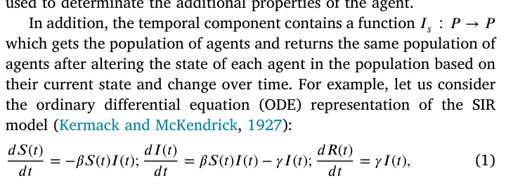

where *𝑆*(*𝑡*)*, 𝐼*(*𝑡*), and *𝑅*(*𝑡*) are the number of susceptible, infected, and recovered agents in the population, *𝛽* is the average infection rate, and *𝛾* is the average recovery rate. In this example, the second term of the *𝑑𝐼*(*𝑡*) 𝑑𝑡 and the third equation is part of the *𝐼*𝑠 function while the term *𝛽𝑆*(*𝑡*)*𝐼*(*𝑡*) is not as the change in the agents’ state is not exclusively depended on time.

Importantly, we allow *𝐼*𝑠 to both add and remove agents to the population. This allows the temporal model to include the birth and death of agents into and from the dynamic, respectively.

### 2.2. Norm-based spatial component formalization

For the norm-based spatial component, one should consider three main elements: the environment (*𝐸*), agents’ walk dynamics, and infection dynamics. In this formalization, we assume that the information related to the agent’s location, movement, and infection dynamics is described as part of the *𝜏* parameter.

Intuitively, the environment element, *𝐸*, outlines the physical location where the pandemic takes place. For example, for small-scale, the environment can be a specific building, and for larger-scale, the environment can be a city or even a country. On top of that, the resolution of the environment and its accuracy are also important parts of it. Following the same example, a one-meter resolution of a building is feasible, while the same resolution for a city can be computationally infeasible for the average modern computation system. Similarly, in a building or even room setting, one may take into consideration the agents’ breathing patterns (Lazebnik and Alexi, 2023) as the population size is small, while on the city level, the time of year may be more relevant (and computationally feasible) property to consider. Formally, The environment is presented by continuous space, *𝐿* ∈ R𝑘 (*𝑘* ∈ {1*,* 2*,* 3}) is the spatial dimension of the environment, such that point, *𝑙* ∈ *𝐿*, is represented by some set of parameters denoted by {*𝛼*1*,* … *, 𝛼*𝑗} where *𝑗* ∈ N is the number of parameters. Theoretically, an infinite number of locations are presented in the environment.

The agent’s walk dynamics is a function *𝐼*𝑤 ∶(*𝑝, 𝑃, 𝐸*) → (*𝑝, 𝐸*) that gets a specific individual, the entire population, and the environment and returns the same individual with the relevant alter to the *𝜏* parameter related to its location and other variables which related to the fact it moved, as well as updating the relevant points in the environment.

Finally, the agents’ interaction dynamics is a function *𝐼*𝑖 ∶(*𝑃, 𝐸*) → (*𝑃, 𝐸*) that gets the population and the environment and returns the population with the relevant alter to the *𝜉* epidemiological parameter as well as to *𝜏* while also updating the relevant points in the environment. This function is responsible for capturing the infection performed between agents in the population, as well as between an agent and the environment itself.

### 2.3. Graph-based spatial component formalization

The graph-based spatial component is similar to the norm-based spatial component, where the differentiation is present only in the formalization of the environment itself. Namely, the environment, *𝐸*, is represented by a graph *𝐺* ∶= (*𝑉, 𝐸*) where *𝑉* are a set of locations and *𝐸⊂𝑉* × *𝑉* is a set of edges between these locations. Importantly, the size of |*𝑉* | is finite. For the agent’s walk dynamics (*𝐼*𝑤) we allow individuals to move from a current location (*𝑣*𝑐 ∈ *𝑉* ) to a neighbor location (*𝑣*𝑛 ∈ *𝑉* ) in a single step in time if and only if *𝑒* = (*𝑣*𝑐*, 𝑣*𝑛) ∈ *𝐸*. Finally, for the interaction dynamics, *𝐼*𝑖, we assume that at each location (*𝑣* ∈ *𝑉* ) the individuals are well-mixed.

### 2.4. Agent-based simulation representation

Following the structure proposed by Lazebnik (2023a), an ABS representation of a spatio-temporal model is presented in Algo 1. Initially, a population of agents (*𝑃*) and the environment (*𝐸*) are generated. Then, in an iterative manner, until a pre-defined stop condition (*𝐶*) is met, three operators take place — the spontaneous operator (*𝐼*𝑠), the walk operator (*𝐼*𝑤), and the interaction operator (*𝐼*𝑖). These operators alter the agents’ state over time. Commonly, the population’s epidemiological state (denoted by *𝑃*𝜉), defined to be the vector of agents’ states, over time is returned for further analysis.

**Algorithm 1** Generic agent-based simulation representation of spatio-temporal epidemiological model.

1: **Input:** population (*𝑃*)*,* environment (*𝐸*) 2: **Output:** Population’s state over time (*𝐴*) 3: *𝑡* ← 1 4: **while** *𝐶*(*𝑃, 𝑡, 𝐸*) **do** 5: *𝑃* ⇐ *𝐼*𝑠(*𝑃*) **for** *𝑝* ∈ *𝑃* **do** 6: 7: *𝑝* ⇐ *𝐼*𝑤(*𝑝, 𝑃, 𝐸*) **end for** 8: 9: (*𝑃, 𝐸*) ⇐ *𝐼*𝑖(*𝑃, 𝐸*) 10: *𝐴*[*𝑡*] ← *𝑃*𝜉 11: *𝑡* ← *𝑡* + 1 12: **end while** 13: return *𝐴*

## 3. Norm-based to graph-based spatial component translation

Following the formalization in Section 2, one can notice that the translation of the norm-based to graph-based spatial component is trivial without constraints as one can pick a discretization to the continuous environment which is at least as small as the smallest interaction-related distance and generate a mesh graph. However, this solution ignores the motivation of reducing computational time when transforming from norm-based to graph-based spatial component representation while also not necessarily resulting in analytically isomorphic results. To prove this point, let us again consider the SIR model in Eq. (1) but this time we define the infection rate at time *𝑡* between two agents in the population (*𝑖, 𝑗*) to be *𝛽*𝑖,𝑗 = |𝐿𝑖−𝐿𝑗| where *𝐿*𝑥 ∈ R𝑘 is 1 the locations of the *𝑥*’s agents at time *𝑡* (Lazebnik, 2023b). Moreover, let us assume the agents in the population apply the following walking dynamics: ∀*𝑗* ∶ *𝐿*(*𝑡* + 1) = 1 ∑|𝑃| 𝑖=1,𝑖≠𝑗 *𝐿*𝑖(*𝑡*). In this case, there is no existing fixed discretization size that is at least as small as the smallest |*𝑃*|−1 interaction-related distance as the latter converges to zero.

At a high level, our goal is to construct a coarse-grained spatial representation that preserves the epidemiologically relevant dynamics of the original norm-based model. In the norm-based setting, infection events are driven by spatio-temporal co-location patterns and local densities of agents in continuous space. The graph-based representation can be viewed as a partition of this continuous space into a finite set of ‘‘regions’’ (graph nodes) within which individuals are approximately well-mixed at the time scale of infection, together with a transition kernel describing how agents move between these regions. If (i) the partition groups together locations that are dynamically similar with respect to contact patterns, and (ii) the induced transition kernel reproduces the empirical flows of agents between regions, then the resulting graph-based model will, by construction, approximate the norm-based epidemic dynamics as measured by the population state trajectories *𝐴*𝑛 and *𝐴*𝑔.

### 3.1. Problem definition

Following this example, the desired graph-based representation should be both computationally appealing and preserve as much as possible the norm-based dynamics. We treat the norm-based to graph-based translation as a constrained optimization problem:

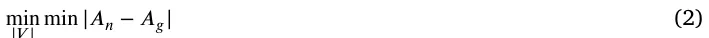

## min |𝑉 | min |𝐴𝑛 − 𝐴𝑔|

where *𝐴*𝑛 and *𝐴*𝑔 are the population’s state over time for the norm-based and graph-based spatial components, respectively. From the computational point of view, one should define the graph, *𝐺* = (*𝑉, 𝐸*), and the walk dynamics on the graph.

Below, the algorithms used for both sub-tasks are briefly descripted with extended technical description is provided in Appendix.

*3.2. Stage 1: Heuristic numerical-based solution*

Since the problem is challenging and solving it analytically can be computationally expensive (or even infeasible) even for relatively small cases, we propose a heuristic approach to solve the problem. The methods presented below are not independent heuristics but different numerical strategies to approximate this optimization problem by (i) searching over spatial partitions (graph search) and (ii) learning the induced transition kernel (walk dynamics approximation - WDA). Namely, let us consider a given case with a norm-based spatial component with some walk dynamics. In order to convert it into a graph-based representation, one would need to find *𝐺* as well as transform the walk dynamics to the constraints enforced by *𝐺*. Below, we describe five methods for the graph search and four for the WDA, resulting in 20 possible models.

#### 3.2.1. Graph search

For the graph search component, we assume each algorithm gets the locations of the agent population at each step in time and returns the spatial graph (*𝐺*).

*Uniform square grid (Grid).* As a simple, fixed spatial discretization baseline, we consider a uniform square grid over the environment. Let the walkable area be contained in an axis-aligned bounding box [*𝑥*min*, 𝑥*max] × [*𝑦*min*, 𝑦*max]. We discretize this domain into *𝑁*𝑥 × *𝑁*𝑦 rectangular cells of equal size, where *𝑁*𝑥 and *𝑁*𝑦 are chosen using a grid search (Lerman, 1980) optimizing Eq. (2). Nodes are connected by an undirected edge if their corresponding cells share a common side (4-neighborhood connectivity). In environments with obstacles or non-rectangular floorplans, we remove cells that fall entirely outside the walkable region; this yields an irregular subset of the original grid but preserves the local regularity of node spacing where agents can actually move.

*Quadtree.* A Quadtree is a hierarchical data structure used for efficient spatial partitioning of an environment. It recursively subdivides a region of dimension *𝑘* into 2𝑘 sub-sections, each representing a smaller portion of the environment (Chien and Aggarwal, 1986). This treelike structure is commonly employed in computer graphics, image processing, and geographical information systems for efficient spatial indexing and searching (Samet, 1984). In our case, we first build a Quadtree at each simulation time step, *𝑡*, given the agents’ locations. Formally, let the root node be the entire environment. Recursively subdivide a node into 2𝑘 children (for a *𝑘*-dimensional space) until one of the following conditions holds for that node (Krekov et al., 2015): (i) it contains no agents; (ii) it contains a single agent that cannot interact with any other agent within the node; or (iii) all agents inside the node can interact with each other (i.e., their pairwise distances are below the interaction radius). The resulting structure at time *𝑡* is a Quadtree *𝑄*𝑡. To obtain a single, time-aggregated spatial partition from the sequence {*𝑄*𝑡}𝑇 𝑡=1, we construct what we refer to as the ‘‘average Quadtree’’ as follows. First, we align all *𝑄*𝑡 to a common maximum depth, interpreting missing children in shallower trees as empty cells at that level. Then, for each cell *𝑐* at each level, we compute an occupancy score 𝑇∑ **𝟏**{*𝑐* exists in *𝑄*𝑡 and satisfies the interaction condition (ii) or (iii)}*, 𝜔*(*𝑐*) = 1 *𝑇 𝑡*=1 which is the fraction of time steps in which *𝑐* is a leaf in *𝑄*𝑡 and is ‘‘interaction-coherent’’. We then prune the tree by selecting as leaves those cells whose occupancy score exceeds a threshold *𝜔*(*𝑐*) ≥ *𝜃* and whose children (if any) have strictly lower scores; all such leaves constitute the nodes of the final, time-aggregated Quadtree. Finally, each selected leaf cell becomes a vertex *𝑣* ∈ *𝑉* of the graph *𝐺* = (*𝑉, 𝐸*), and an undirected edge *𝑒* = (*𝑣*𝑖*, 𝑣*𝑗) is added between two vertices if their corresponding cells share a common face or parent in the Quadtree. This procedure yields a single graph-based spatial discretization that summarizes how the continuous environment is populated and used over the entire simulation horizon, rather than at a single snapshot in time.

*Genetic algorithm (GA).* A GA is an optimization technique inspired by the process of natural selection, where populations of potential solutions evolve over generations (Bo and Rein, 2005; Ghaheri et al., 2005). It involves the use of genetic operators such as selection, crossover, and mutation to iteratively improve candidate solutions towards achieving optimal or near-optimal outcomes for a given problem (Davis, 1985a; Bo et al., 2006a; Hassanat and Alkafaween, 2017). In order to use the GA approach, one is required to answer seven modeling decisions: (1) How to define a member (also known as ‘‘gene’’) in the population; (2) how to generate the initial population; (3) what is the stop condition for the evolution process; (4) how to define the mutation operator; (5) how to define the cross-over operator; (6) how to define the selection operator; and (7) how to define the loss function of each member (also known as the ‘‘fitness function’’) (Nix and Vose, 1992; Alexi et al., 2023a). To this end, we represent each member in the GA’s population as a vector of location such that each location is the node’s location in the environment. An agent is associated with the node that is the closest to it at any given point in time. Next, the GA’s population initialization involves generating an initial population with a random number of nodes as well as their locations, denoted by *𝛿*𝑖 for the *𝑖*𝑡ℎ agent. Hence, the loss function (i.e., the *fitness* function) is defined to be:

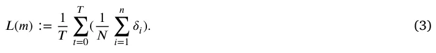

In order to obtain a more computationally appealing initial condition, for an initial number of nodes *𝑥* ∈ N, we compute the set cover using a greedy algorithm for the initial state of the agents’ population (i.e., *𝑡* = 0) (Grossman and Wool, 1997). The stop condition for the algorithm is a pre-defined number of iterations (also known as ‘‘generation’’) (Holland, 1992). For each iteration, three operators are performed. First, the mutation operator picks a node’s index randomly, with a uniform distribution, and changes its location by adding to its current location a random vector sampled from a pre-defined *𝑛*-dimensional normal distribution. Second, the cross-over operator accepts two node location vectors of identical size (*𝑉*1*, 𝑉*2), picks an index, *𝑗* ∈[1*,* … *,* |*𝑉*1|] in a uniform distribution and returns *𝑉* 𝑛𝑒𝑤 = *𝑉*1[1*,* … *, 𝑗*] ∪ *𝑉*2[*𝑗* + 1*,* … *,* |*𝑉*2|] and *𝑉* 𝑛𝑒𝑤 = *𝑉*2[1*,* … *, 𝑗*] ∪ *𝑉*1[*𝑗* + 1*,* … *,* |*𝑉*2|] (Davis, 1985b). Finally, for 1 the selection operator, we adopted the *royalty tournament* operator (Bo 2 et al., 2006b), which selects the top *𝛼* ∈ [0*,* 1] graphs from the population according to their loss function. Afterward, the population is sampled (with repetitions) according to their loss function values, i.e., with probability *𝑝*𝑠𝑒𝑙𝑒𝑐𝑡(*𝑚*) = 𝑚′∈𝑃𝑖 𝐿(𝑚′) where *𝑃*𝑖 is the population *𝐿*(*𝑚*) ∑ in the *𝑖*𝑡ℎ iteration.

*Time series X-means (TSxM).* Time series K-means (TSkM) is a clustering algorithm tailored for time-dependent data, aiming to identify homogeneous groups or clusters based on temporal patterns (Cai et al., 2021). It employs the traditional K-means approach but incorporates dynamic time warping or other distance metrics suitable for capturing similarities in time series data. On top of that, it automatically finds the number of clusters, *𝑘*, using a hyperparameter optimization process. To use the TSxM approach, the location of each agent in the population is treated as a time-series vector, with each value representing the location of the agent in the environment in a single step in time. The locations are normalized to the environment’s size to ensure comparability. The number of clusters (i.g., the nodes of the graph *𝐺*, *𝑥*, is set to 1 and increases up to a pre-defined number *𝜖* ∈ N. The final value of *𝑥* is obtained using the elbow point method (Syakur et al., 2018). For each value of *𝑥*, a Dynamic Time Warping K-means algorithm (Soheily-Khah et al., 2016) is used to cluster the time-series data. As the Dynamic Time Warping K-means algorithm is sensitive to its random initial condition, we run it for each simulation for *𝑎* ∈ N times, taking the configuration with the smallest *𝐿*1 metric value between the agent’s true location and the cluster’s center of mass.

*Recurrent Neural Network (RNN).* A Recurrent Neural Network (RNN) is a type of neural network architecture designed to process sequential data by maintaining a hidden state that captures information from previous time steps and enables the modeling of temporal dependencies in sequences, making it suitable for tasks such as time-series prediction and classification (Zhang and Man, 1998). In particular, for our case where the number of agents in the population may change over time, we cannot assume a fixed input space’s size. As such, we use two layers of Gated Recurrent Unit (GRUs) such that one obtains the agent population as a vector with arbitrary size, followed by two fully connected layers to obtain a fixed-sized and with a more computationally appealing feature space, while the latter accepts sequences of the processed agent’s population locations and also followed by two layers of fully connected layers. As such, the input of the RNN model is the agent population’s locations over time, and the output is the graph’s nodes’ locations. For the loss function, we adopted Eq. (3) and for the optimization algorithm, we adopted ADAM (Kingma and Ba, 2017).

Notably, in the GA- and RNN- based variants, we do not optimize Eq. (2) directly inside the search loop. Instead, we use the following spatial surrogate: we assign each agent to its closest node and minimize the average distance between agents and their assigned node over all agents and time steps (Eq. (3)). Intuitively, this encourages each node to represent a compact, approximately well-mixed region of space, and pushes the graph towards a low-distortion partition of the continuous environment, which in turn is expected to preserve the pairwise proximity patterns that drive infection events.

*3.2.2. Stage 2: Walk dynamics approximation*

Given a fixed graph-based environment *𝐺* = (*𝑉, 𝐸*), we refer to ‘‘WDA’’ as the task of learning a graph-based walk operator *𝐼*𝑔 𝑤 that mimics the movement behavior of the original norm-based walk operator *𝐼*𝑤. Formally, *𝐼*𝑔 𝑤 defines, at each time step, a transition policy that maps from an agent’s current node *𝑣* ∈ *𝑉* , its internal and epidemiological state, and possibly aggregate properties of the population and environment, to a probability distribution over feasible next nodes *𝑣*′ ∈ *𝑉* such that (*𝑣, 𝑣*′) ∈ *𝐸*. This transition policy induces a Markov kernel on *𝑉* and is chosen so that the resulting trajectories on the graph reproduce, as closely as possible, the trajectories generated by *𝐼*𝑤 in the continuous space.

*Markov chain (MC).* A Markov chain is a stochastic process where the probability of transitioning to a particular state depends only on the current state, disregarding the sequence of events leading to that state. Intuitively, it is characterized by a set of states and transition probabilities between those states (Privault, 2018; Sharma, 2017). In our case, for each node in the graph (*𝑣* ∈ *𝑉* ) and agent (*𝑝* ∈ *𝑃*) that is currently located in the node, let us assume the MC’s state is represented by the agent’s state, the environment’s state, and the epidemiological’s state distribution of the agents in each node *𝑣*𝑛 ∈ *𝑉* such that *𝑒* = (*𝑣, 𝑣*𝑛) ∈ *𝐸*. Notably, this approach ignores any additional properties the agents might have in favor of the common (epidemiological) ground.

*Multi-agent classification with AutoEncoder (MAC-AE).* The multi-agent classification approach stands for the idea that a classification task can be solved by multiple models, each one governing a sub-set of the task, and they are autonomous from each other. In our case, each node of the graph (*𝑣* ∈ *𝑉* ) is associated with an ML classification model. Each such ML model obtains the state of an agent currently located in the node, the environment, and the entire population. However, as the size of the entire population can alter over time, a fully connected attention AutoEncoder model (Bank et al., 2023; Lazebnik and Simon- Keren, 2023) is used to obtain a fixed-length representation of the population data. As such, the model is trained on tuples of the agent’s state, environment, and encoded population representation, while the target column is the agent’s location, as represented by the graph node’s index, in the next step in time. In order to find the best ML model for each node, we used an automatic machine learning (AutoML) approach. Namely, we adopted the Tree-Based Pipeline Optimization Tool (TPOT), a genetic algorithm-based automatic ML library (Olson and Moore, 2016). TPOT produces a full ML pipeline, including feature selection engineering, model selection, model ensemble, and hyperparameter tuning, which is close to optimal for relatively long enough computational time (Lazebnik et al., 2023).

*Deep reinforcement learning (DRL).* Deep Reinforcement Learning (DRL) is a data-driven algorithm that combines reinforcement learning with deep neural networks to enable agents to learn complex behaviors and decision-making processes (Lazebnik, 2023c; Witty et al., 2021; Zhang et al., 2020; Veturi et al., 2023). It involves training artificial agents to interact with an environment, receive feedback in the form of rewards or penalties, and leverage deep neural networks to approximate optimal strategies for maximizing cumulative rewards over time (Arulkumaran et al., 2017). For our case, the walk dynamics are represented in the same manner as the MAC-AE method. However, rather than using an AutoML model with AE for each node of the graph (*𝑣* ∈ *𝑉* ), we use a single DRL model for the entire graph (*𝐺*). To be exact, we adopt the Proximal Policy Optimization (PPO) (Schulman et al., 2017), which considers one of the state-of-the-art DRL algorithms for a wide range of tasks. Specifically, we use a fully connected neural network at the base of the PPO algorithm.

*Spatio-temporal graph neural network (STGNN)* Spatio-temporal graph neural networks extend message-passing GNNs with temporal sequence models (e.g., recurrent or attention-based modules) to capture how node states evolve over time on a fixed graph, and have been successfully applied to pandemic forecasting from regional case data (Hy et al., 2022; Nguyen et al., 2023). We adapt this idea to WDA by treating the graph *𝐺* = (*𝑉, 𝐸*) as given and constructing, at each time step, node features describing the current occupancy and epidemiological composition. A stack of spatial GNN layers first propagates information along edges to encode the local neighborhood of each node; these node embeddings are then processed by a temporal encoder that summarizes recent history and outputs, for each node *𝑣* ∈ *𝑉* , a probability distribution over its neighbors representing the likelihood of agents moving to each adjacent node at the next step. Agents sample their next node from this distribution during simulation, and the model parameters are learned by training on the norm-based trajectories so that the induced flows between nodes match the observed movements as closely as possible.

### 3.3. Evaluation metric

We quantify the approximation quality of the graph-based spatial representation by comparing the time series of epidemiological compartment counts produced by the norm-based and graph-based models, denoted by *𝐴*𝑛(*𝑡*) and *𝐴*𝑔(*𝑡*), respectively. Let *𝐴*∙(*𝑡*) ∈ R𝑑 be the vector of compartment counts (e.g., *𝑆, 𝐼, 𝑅,* … ) at time *𝑡*, and let *𝑇* be the total number of time steps. We define the normalized agreement (i.e., performance) between the two models as

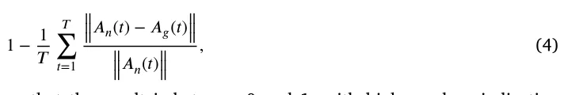

so that the result is between 0 and 1, with higher values indicating better preservation of the epidemiological dynamics of the norm-based model by the graph-based model.

## 4. Results

Based on the algorithms presented in Section 3, an experimental setup is defined for both real-world and synthetic cases such that the real-world cases are used to evaluate the algorithms’ performances in realistic scenarios while the synthetic cases are used for further sensitivity analysis of different spatial conditions.

### 4.1. Experimental setup

In order to evaluate the proposed algorithms, we adopted three temporal component dynamics as well as three norm-based spatial components with increasing levels of complexity for both. For the temporal component, we used SIR (Kermack and McKendrick, 1927), SIRD with two age groups (Lazebnik et al., 2021a), and two-strain SIR models (Lazebnik and Bunimovich-Mendrazitsky, 2022). Simply put, SIR is considered the most simplistic model with only three states — susceptible (S), infected (I), and recovered (R) individuals, where cases.

<figure class="table-figure" id="table-1">
<figcaption><strong>Table 1</strong> A summary of the epidemiological model’s parameters’ values for the synthetic and three real-world</figcaption>

<table><tr><th>Symbol</th><th>Parameter</th><th>Synthetic</th><th>Airport</th><th>Restaurant</th><th>Bus</th></tr><tr><td>𝛽</td><td>Infection rate in a hour [𝑡]</td><td>0.037–0.1</td><td>0.05–0.1</td><td>0.062–0.079</td><td>0.048–0.069</td></tr><tr><td>𝛾</td><td>Recovery duration in a hour [𝑡]</td><td>120–240</td><td>144–170</td><td>144–170</td><td>144–170</td></tr><tr><td>𝜌</td><td>Recovery rate (Andrea Alberto Conti, 2020)</td><td>0.9–0.99</td><td>0.98–1</td><td>0.98–1</td><td>0.98–1</td></tr><tr><td>𝜓</td><td>Symptomatic rate (Andrea Alberto Conti, 2020)</td><td>0.05–0.20</td><td>0.1–0.15</td><td>0.1–0.15</td><td>0.1–0.15</td></tr></table>

</figure>

susceptible individuals become infected from interaction with infected individuals while infected slowly recover over time until they fully recover and transform to the recovered epidemiological state where they are immune to re-infection. The SIRD with two age groups introduces a dead state (denoted by *𝐷*) where individuals who are infected have some probability of dying rather than recovering. Moreover, it extends the SIR model by dividing the population into two age groups (for example, children and adults) with asymmetric infection rates and unique recovery durations. Finally, the two-strain SIR assumes two pathogens are causing a pandemic in parallel and individuals can be infected and/or recovered from either or both of them at any given moment. A formal ODE and ABS descriptions of each temporal model are provided in Appendix. In all experiments, the norm-based spatial component is simulated via an ABS, which yields complete trajectories for all agents over time. These fully observed trajectories serve as ‘‘privileged information’’ for the translation framework: they are used by the graph search stage to infer a spatial partition and by the WDA stage to estimate transition behavior between regions.

Since each epidemiological scenario is known to have unique parameter values, we set a biologically relevant range for the synthetic cases while adopting the values presented in the original works of the real-world cases, following the values for COVID-19 (Adiga et al., 2020). Table 1 summarizes the parameters and their values for all four cases.

Moreover, the proposed algorithms require that some hyperparameter would be configured before being used. These hyperparameters are closely related to the algorithm’s performance and commonly different for different tasks to obtain the algorithm’s optimal performance (Yang and Shami, 2020). As such, we used the default suggested hyperparameters’ values from the code libraries we adopted in Python. Fig. 1 presents a schematic view of the experimental process.

All experiments were conducted on the same workstation to ensure comparable runtime measurements. The machine is equipped with an Intel Xeon Gold 6230R, 2.1 GHz, 40 cores with 128 GB RAM, running *Ubuntu 18.04* as the operating system. All algorithms were implemented in Python 3.9 with PyTorch 2.1 and executed in single-precision floating point, where applicable. For each epidemiological scenario, we report wall-clock times averaged over three runs with different random seeds. The reported translation times should therefore be interpreted as indicative of relative, rather than absolute, computational cost under this hardware setup.

#### 4.1.1. Real-world cases

For the real-world cases, we adopted three locations and walks: airport (Harweg et al., 2023), restaurant (Kwon et al., 2020), and bus (Shen et al., 2020). Fig. 2 shows schematic views of the three locations as presented by Harweg et al. (2023), Shen et al. (2020), Kwon et al. (2020). In order to make the representation of all three locations identical, we used pixel-level measurements of the provided images alongside the scale declared by the authors, generating a grid of (a) 2,5 m, (b) 0.5 m, and (c) 0.5 m. Despite the fact that height plays a role in the infection dynamics (Lazebnik and Alexi, 2023), it is shown only when taking airflow dynamics into account, which we do not do in this experiment. Hence, we ignore any height-related information that may be in these settings.

In addition, we adopted the walk dynamics presented in the original papers. Simply put, each agent has a unique set of locations in the space, which is influenced by the simulation’s step in time as well as the presence of other agents. In the airport, agents randomly obtain a path from the entrance and a gate and move at a constant speed until they arrive at the gate. For the restaurant, some agents were allocated to sit, at random, according to the time of the day in the simulation, while small, pre-defined agents performed random walks. In a similar manner, agents in the bus case enter from the top door, picking a free sit at random, walking to the seat, waiting for a random number of simulation steps, moving to the exit door, and exiting.

Importantly, as not the entire population is present in the dynamics at any point in time, as required by the SIR-based temporal component, we assume individuals getting and leaving the scene are not interacting with each other and only can recover (or die) if they are infected. We pick the individuals to enter the scene at random, in a uniformly distributed manner.

These three scenarios can be seen as ‘‘semi-real’’ or ‘‘proxy’’ validation settings. The floorplans and walk dynamics are directly adapted from published investigations of real environments and outbreaks, and thus reflect empirically grounded geometries and movement patterns. However, we emphasize that the infection and recovery processes in our experiments are still simulated. We do not have access to jointly observed high-resolution mobility and infection time series for these environments.

#### 4.1.2. Synthetic cases

In order to explore the proposed algorithms’ sensitivity to multiple spatial components of the space, we decided to keep the spatial configuration simple and highly adaptable. To this end, we allocate an on a plane, a set of non-pairwise distinct circles. Each circle is defined by its radius and center location. As such, the spatial configuration of each synthetic case is defined by a set of circles and their properties. This allows the generation of a wide space of configurations while keeping the seed relatively simple. Moreover, it allows for control of the average density of the population, enforces walking patterns, etc. An example of the simplest configuration, a configuration with different sub-locations with different densities, and spatially-enforced walk patterns are shown in panels a, b, and c, respectively, in Fig. 3. For simplicity, in these examples, we assume individuals perform random walks and can occupy the same location. To capture complex enough settings, we set the number of circles to be between 1 and 40 and the radius to be between 2 and 25 m.

We assume individuals follow random walks, but have a ‘‘pulling’’ power towards their original spawn location which is reversibly proportional to their distance up to some distance *𝛿*.

### 4.2. Performance analysis

We start by exploring the performance of all twelve possible combinations of the graph search and the WDA for the synthetic cases. As such, we generate *𝑛* = 10000 random synthetic cases where the population size is set to 1000 individuals. Table 2 summarizes the results, where the performance represents the average agreement between the norm-based and graph-based population states over time, and the relative time reduction quantifies the speed-up of the translated model.

<figure id="fig-1">
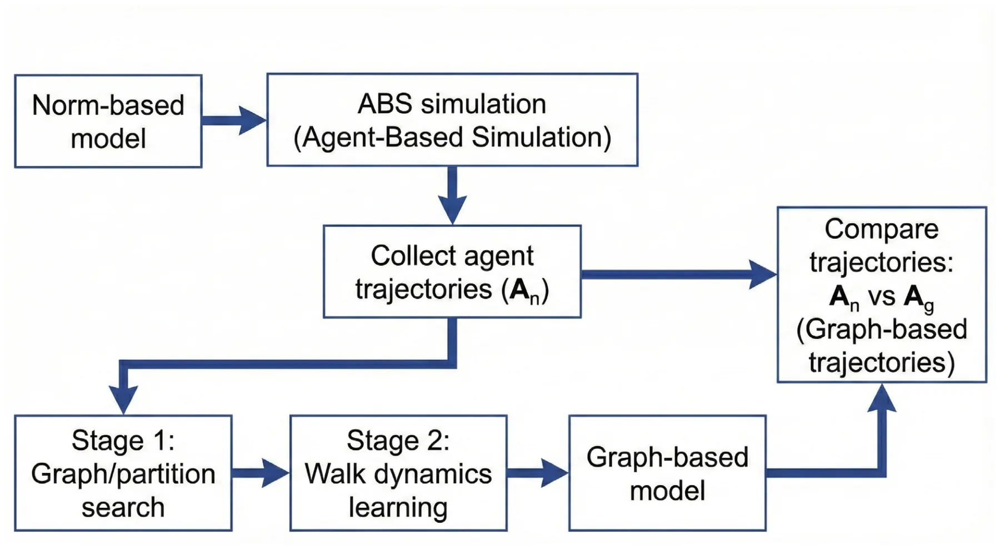
<figcaption><strong>Fig. 1.</strong> A schematic view of the experimental process.</figcaption>
</figure>

<figure class="table-figure" id="table-2">
<figcaption><strong>Table 2</strong> Performance analysis for the synthetic cases divided into the graph search and WDA options. All models were trained for <em>𝑛</em>𝑡𝑟𝑎𝑖𝑛 = 900 random cases and evaluated on <em>𝑛</em>𝑡𝑒𝑠𝑡 = 100 random cases; the performance, |<em>𝑉</em> |, and |<em>𝐸</em>| are shown as the mean ± standard deviation over the test set.</figcaption>

<table><tr><th>Graph search</th><th>WDA</th><th>Performance</th><th>Rel. time reduction [%]</th><th>|𝑉|</th><th>|𝐸|</th></tr><tr><td></td><td>MC</td><td>0.70 ± 0.07</td><td>41.43 ± 7.31</td><td>145.32 ± 70.15</td><td>3.72 ± 0.05</td></tr><tr><td></td><td>MAC-AE</td><td>0.69 ± 0.08</td><td>52.37 ± 10.46</td><td>138.91 ± 65.44</td><td>3.80 ± 0.05</td></tr><tr><td>Grid</td><td>DRL</td><td>0.63 ± 0.08</td><td>49.82 ± 9.73</td><td>142.08 ± 67.29</td><td>3.75 ± 0.06</td></tr><tr><td></td><td>STGNN</td><td>0.71 ± 0.09</td><td>55.68 ± 10.25</td><td>140.55 ± 66.82</td><td>3.78 ± 0.05</td></tr><tr><td></td><td>MC</td><td>0.73 ± 0.06</td><td>68.29 ± 13.47</td><td>72.14 ± 39.14</td><td>5.14 ± 3.88</td></tr><tr><td></td><td>MAC-AE</td><td>0.76 ± 0.05</td><td>70.84 ± 12.15</td><td>65.38 ± 35.15</td><td>5.48 ± 3.26</td></tr><tr><td>Quadtree</td><td>DRL</td><td>0.68 ± 0.10</td><td>65.39 ± 14.92</td><td>46.03 ± 51.09</td><td>5.95 ± 4.78</td></tr><tr><td></td><td>STGNN</td><td>0.78 ± 0.07</td><td>71.56 ± 13.08</td><td>69.02 ± 37.98</td><td>5.32 ± 3.51</td></tr><tr><td></td><td>MC</td><td>0.84 ± 0.07</td><td>74.12 ± 12.37</td><td>75.19 ± 37.13</td><td>6.02 ± 3.70</td></tr><tr><td></td><td>MAC-AE</td><td>0.88 ± 0.08</td><td>78.95 ± 11.42</td><td>62.29 ± 42.08</td><td>4.89 ± 2.90</td></tr><tr><td>GA</td><td>DRL</td><td>0.82 ± 0.07</td><td>73.58 ± 12.16</td><td>67.58 ± 40.37</td><td>5.12 ± 3.23</td></tr><tr><td></td><td>STGNN</td><td>0.87 ± 0.08</td><td>79.63 ± 11.07</td><td>64.15 ± 39.62</td><td>5.05 ± 3.10</td></tr><tr><td></td><td>MC</td><td>0.84 ± 0.07</td><td>82.13 ± 11.28</td><td>68.14 ± 40.05</td><td>4.19 ± 3.05</td></tr><tr><td></td><td>MAC-AE</td><td>0.90 ± 0.09</td><td>87.52 ± 10.63</td><td>77.08 ± 34.40</td><td>4.65 ± 3.15</td></tr><tr><td>TSxM</td><td>DRL</td><td>0.89 ± 0.10</td><td>85.27 ± 10.94</td><td>75.19 ± 37.11</td><td>4.95 ± 3.80</td></tr><tr><td></td><td>STGNN</td><td>0.89 ± 0.09</td><td>86.04 ± 10.37</td><td>76.02 ± 35.72</td><td>4.58 ± 3.21</td></tr><tr><td></td><td>MC</td><td>0.83 ± 0.05</td><td>81.16 ± 10.95</td><td>81.06 ± 43.72</td><td>4.22 ± 2.96</td></tr><tr><td></td><td>MAC-AE</td><td>0.85 ± 0.06</td><td>84.31 ± 10.72</td><td>83.71 ± 41.18</td><td>4.08 ± 3.53</td></tr><tr><td>RNN</td><td>DRL</td><td>0.86 ± 0.05</td><td>83.09 ± 10.88</td><td>68.26 ± 40.01</td><td>4.21 ± 3.04</td></tr><tr><td></td><td>STGNN</td><td>0.87 ± 0.06</td><td>85.38 ± 10.41</td><td>80.12 ± 42.05</td><td>4.15 ± 3.18</td></tr></table>

</figure>

The uniform Grid baseline, despite using the largest number of nodes, attains the lowest performance overall and relatively modest time savings. The Quadtree also performs worse than the learned graph-search methods, although it already yields substantial runtime reductions. In contrast, GA, TSxM, and RNN achieve clearly higher agreement with the norm-based dynamics (typically 0*.*84–0*.*90), with TSxM and RNN slightly outperforming GA on average. For the WDA, the simple MC baseline consistently underperforms the learned methods, while MAC- AE, DRL, and STGNN achieve comparable performance, with MAC-AE and STGNN often giving the best trade-off between accuracy and cost. Across methods, higher performance generally correlates with a moderate increase in |*𝑉* | and |*𝐸*|, but even the best-performing combinations (e.g., TSxM or RNN with MAC-AE or STGNN) still provide large relative time reductions, often above 80%.

Table 3 presents the performance of the best-performing combination of graph search and WDA for each real-world case. As in the synthetic setting, there is no single graph search or WDA algorithm that dominates across all three environments: the airport case is best captured by the combination of RNN with TSGNN, whereas both the restaurant and bus cases favor TSxM, paired with MAC-AE and DRL, respectively. Despite this heterogeneity, all three best combinations achieve high agreement with the norm-based dynamics, with average performance above 0.92 in every case. Importantly, these accuracies are obtained together with substantial computational gains, with relative time reductions between approximately 83% and 89%. The largest and most complex geometrical configuration, the airport, requires an order of magnitude more nodes (|*𝑉* | = 182*.*28) than the smaller restaurant and bus layouts (|*𝑉* | = 18*.*13 and |*𝑉* | = 26*.*41, respectively). The average node degree is also slightly higher in the airport case (|*𝐸*| ≈ 4*.*4) than in the restaurant (|*𝐸*| = 2*.*89) and bus (|*𝐸*| = 3*.*77), reflecting the greater diversity of movement paths and contact opportunities in that environment.

<figure id="fig-2">
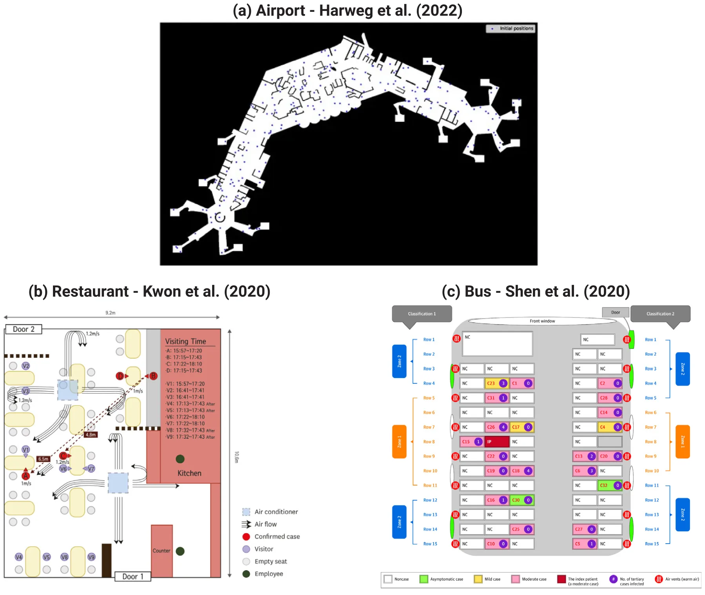
<figcaption><strong>Fig. 2.</strong> A schematic view of the locations used for the experiments. <em>Source:</em> Images taken from Harweg et al. (2023), Shen et al. (2020), Kwon et al. (2020).</figcaption>
</figure>

<figure id="fig-3">
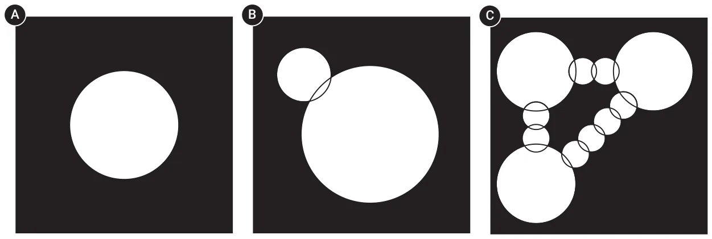
<figcaption><strong>Fig. 3.</strong> Examples for (a) the simplest configuration; (b) configuration with different sub-locations with different densities; and (c) spatially-enforced walk patterns using the synthetic spatial component formalization.</figcaption>
</figure>

### 4.3. Sensitivity analysis

While the results above do not reveal a single winner across all graph search and WDA combinations, TSxM with MAC-AE consistently exhibits strong performance and favorable computational cost, on average. We therefore examine its sensitivity to several key temporal and spatial properties. First, we consider a circular spatial configuration with radius 50 m and vary the density by changing the population size from 3*.*14 ⋅ 102 to 3*.*14 ⋅ 104. Second, we fix the radius of all circles at 2 m and vary the number of circles defining the geometrical configuration between 10 and 100. Third, we study the effect of different infection levels by varying the infection rate *𝛽* from 0.037 to 0.37. Fourth, we vary the recovery duration *𝛾* between 60 and 380 h. Table 4 summarizes the results for *𝑛* = 1000 random cases, sampled uniformly over the specified ranges. The spatially related perturbations (first two rows) lead to slightly lower performance (0*.*94–0*.*95 with standard deviations 0*.*02–0*.*03) and more variable time reductions (∼ 66%–70% with standard deviations around 13%–15%). By contrast, the temporally related perturbations (last two rows) maintain very high performance (≈0*.*97±0*.*01) together with consistently large time savings (around 90% with small standard deviations ≈2%–3%). Taken together, these results indicate that the proposed method is relatively robust to changes in temporal parameters, while being somewhat more sensitive to variations in the spatial configuration and density.

<figure class="table-figure" id="table-3">
<figcaption><strong>Table 3</strong> Performance analysis for real-world cases. All 20 model combinations are trained on <em>𝑛</em>𝑡𝑟𝑎𝑖𝑛 = 900 random initial conditions of each real-world case and evaluated on <em>𝑛</em>𝑡𝑒𝑠𝑡 = 100 other random initial conditions such that the performance, |<em>𝑉</em> |, |<em>𝐸</em>|, and the relative time reduction are shown as the mean ± standard deviation of the test set for the best combination of graph search and WDA.</figcaption>

<table><tr><th>Case</th><th>Airport</th><th>Restaurant</th><th>Bus</th></tr><tr><th>Best graph search</th><th>RNN</th><th>TSxM</th><th>TSxM</th></tr><tr><th>Best WDA</th><th>TSGNN</th><th>MAC-AE</th><th>DRL</th></tr><tr><td>Performance</td><td>0.94 ± 0.04</td><td>0.95 ± 0.04</td><td>0.92 ± 0.02</td></tr><tr><td>Rel. time reduction [%]</td><td>86.47 ± 8.12</td><td>83.35 ± 8.74</td><td>89.02 ± 9.95</td></tr><tr><td>|𝑉|</td><td>182.28 ± 13.08</td><td>18.13 ± 2.04</td><td>26.41 ± 3.16</td></tr><tr><td>|𝐸|</td><td>4.43 ± 1.35</td><td>2.89 ± 0.66</td><td>3.77 ± 0.34</td></tr></table>

</figure>

Fig. 4 visualizing the trade-off between the performance and reduction in computational time. Panel A shows, for the synthetic configurations, how the average relative time reduction increases as the performance of TSxM with MAC-AE decreases, together with a shaded band indicating one standard deviation across random cases while Panel B shows the same relationship for the three real-world environments, where each dashed line summarizes the empirical performance–cost frontier obtained by varying the graph-search and WDA hyperparameters. Overall, both panels highlight that substantial reductions in runtime (often above 80%) can be achieved while preserving a high level of agreement with the norm-based dynamics.

## 5. Discussion

In this study, we proposed a novel approach for translating norm-based spatial components to graph-based representations in the context of epidemiological modeling. Our approach balances computational efficiency with the preservation of norm-based dynamics, thereby facilitating more efficient simulations while maintaining analytical fidelity.

Our experimental results demonstrated the effectiveness of various algorithms for translating norm-based spatial components to graph-based representations. Through extensive experimentation with synthetic and real-world scenarios, we evaluated twelve combinations of graph search and WDA algorithms. The analysis revealed promising performance across different scenarios. Notably, the Time Series X-means (TSxM) algorithm combined with Multi-agent Classification with AutoEncoder (MAC-AE) for WDA consistently demonstrated robust performance across both synthetic and real-world cases.

Practically, the proposed approach has significant implications for public health policy and epidemic management. By enabling more efficient simulations of epidemic spread in real-world environments such as airports, restaurants, and buses, our methodology can inform decision-making processes aimed at mitigating disease transmission (Shami and Lazebnik, 2022; Silva et al., 2023). Moreover, the ability to accurately model spatial dynamics in diverse settings enhances our understanding of epidemic dynamics and facilitates the development of targeted intervention strategies (Yu et al., 2023a; Orozco- Acosta et al., 2023).

The study’s proposed methodology introduces promising advancements but comes with several limitations. Mainly, the proposed method is not validated against real-world data, leaving uncertainties about the accuracy and reliability of the proposed approach in predicting actual pandemic dynamics. However, this limitation is in the field of epidemiological modeling as the required data is usually scares or even unavailable. Second, the proposed method is not interpretable nor explainable as it solves a multi-dimensional and complex task using a heuristic or ML approach, making the proposed approach a *black-box*. This fact may limit the ability of policymakers to put their faith in this solution by itself or as part of a larger epidemiological model (Yin et al., 2023; McDowell, 2023). Moreover, the study predominantly assumes a static environment throughout the spatio-temporal simulations, disregarding potential changes in the spatial landscape that could influence epidemic dynamics. Third, we assume fully observed, noise-free agent trajectories. Both the graph search and WDA stages are trained and evaluated on complete simulated paths, whereas in many practical deployments, only partially observed or noisy mobility traces are available (e.g., temporally sparse location pings, aggregated origin–destination matrices, or trajectories with missing segments). Importantly, the proposed framework does not fundamentally rely on exact continuous paths, but rather on the empirical co-location and flow patterns they induce. This makes it, in principle, compatible with partially observed data after appropriate pre-processing steps such as temporal subsampling, interpolation or smoothing of trajectories, or direct estimation of transition frequencies between candidate regions. A systematic robustness analysis across different observation regimes is a prerequisite for large-scale deployment in real-world surveillance settings. As such, future research should aim to refine the proposed solutions and address these limitations for a more comprehensive understanding of their practical implications. One particular promising future venue is to investigate multimodal data and its influence on the proposed model, as it has been shown to significantly influence pandemic spread dynamics (Tran et al., 2024; Lazebnik et al., 2022).

## CRediT authorship contribution statement

**Teddy Lazebnik:** Writing – review & editing, Writing – original draft, Visualization, Software, Resources, Methodology, Investigation, Formal analysis, Data curation, Conceptualization.

## Funding

This research received no specific grant from any funding agency in the public, commercial, or not-for-profit sectors.

## Declaration of competing interest

The authors declare that they have no known competing financial interests or personal relationships that could have appeared to influence the work reported in this paper.

## Acknowledgment

The author wishes to thank Sveta Hardak-Nissan for teaching me the professional maturity required for fundamental research.

<figure class="table-figure" id="table-4">
<figcaption><strong>Table 4</strong> Sensitivity analysis of the TSxM with MAC-AE to spatial and temporal changes. The results are shown as the mean ± standard deviation of <em>𝑛</em> = 1000 random cases.</figcaption>

<table><tr><th>Parameter</th><th>Range</th><th>Performance</th><th>Rel. time reduction [%]</th></tr><tr><td>Population size (𝑁)</td><td>314–31400</td><td>0.95 ± 0.02</td><td>69.73 ± 13.58</td></tr><tr><td>Number of circles defining the geometrical configuration</td><td>10–100</td><td>0.94 ± 0.03</td><td>66.15 ± 14.97</td></tr><tr><td>Infection rate (𝛽)</td><td>0.037–0.37</td><td>0.97 ± 0.01</td><td>91.42 ± 2.31</td></tr><tr><td>Recovery duration in hours (𝛾)</td><td>60–380</td><td>0.97 ± 0.01</td><td>89.96 ± 2.74</td></tr></table>

</figure>

<figure id="fig-4">
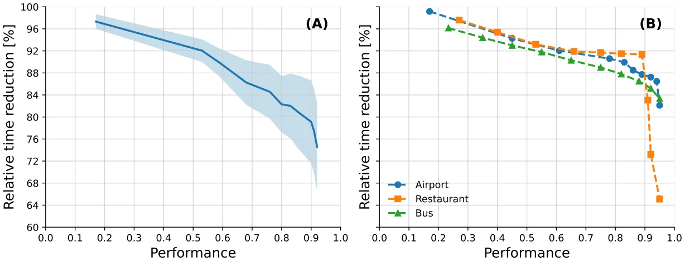
<figcaption><strong>Fig. 4.</strong> Trade-off between norm-based to graph-based performance and relative time reduction. Panel A shows the average relative time reduction as a function of performance for the synthetic configurations when using TSxM with MAC-AE; the shaded region denotes one standard deviation. Panel B presents the corresponding performance–cost profiles for the three real-world cases (airport, restaurant, and bus), where each dashed line is obtained by varying the underlying graph-search and WDA hyperparameters.</figcaption>
</figure>

## Appendix

*Temporal component for epidemiological models*

In this sub-section, the formal ordinary differential equation (ODE), as well as the agent-based simulation (ABS) representation, are provided for the three models used in the experiments.

## SIR

For the SIR model, the ODE representation takes the form:

*𝑑𝑆*(*𝑡*) = −*𝛽𝑆*(*𝑡*)*𝐼*(*𝑡*)*, 𝑑𝑡*

*𝑑𝐼*(*𝑡*) = *𝛽𝑆*(*𝑡*)*𝐼*(*𝑡*) − *𝛾𝐼*(*𝑡*)*,* (5) *𝑑𝑡 𝑑𝑅*(*𝑡*) = *𝛾𝐼*(*𝑡*)*, 𝑑𝑡* where *𝑆*(*𝑡*)*, 𝐼*(*𝑡*), and *𝑅*(*𝑡*) are the number of susceptible, infected, and recovered agents in the population, *𝛽* is the average infection rate, and *𝛾* is the average recovery rate.

For the ABS representation, let us assume each agent has an inner clock, *𝜃* ∈ N, that indicates the number of steps in time passed since the agent’s epidemiological state changed last time. Moreover, the epidemiological state (*𝜉*) belongs to *𝜉* ∈{*𝑆, 𝐼, 𝑅*}.

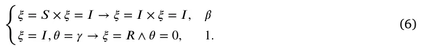

Any other case that is not specifically mentioned in Eq. (6), is the identity function with probability 1. Moreover, for all transactions, *𝜃* = 0.

*SEIRD with two age groups*

For the SEIRD with two age groups model, the ODE representation takes the form:

𝑑𝑆𝑐(𝑡) = −(*𝛽*𝑠 𝑎(*𝑡*))*𝑆*𝑐(*𝑡*)*,* 𝑐𝑐*𝐼*𝑠 𝑐(*𝑡*) + *𝛽*𝑎 𝑐𝑐*𝐼*𝑎 𝑐(*𝑡*) + *𝛽*𝑠 𝑐𝑎*𝐼*𝑠 𝑎(*𝑡*) + *𝛽*𝑎 𝑐𝑎*𝐼*𝑎 *𝑑𝑡* 𝑑𝑆𝑎(𝑡) = −(*𝛽*𝑠 𝑎(*𝑡*))*𝑆*𝑎(*𝑡*)*,* 𝑎𝑐*𝐼*𝑠 𝑐(*𝑡*) + *𝛽*𝑎 𝑎𝑐*𝐼*𝑎 𝑐(*𝑡*) + *𝛽*𝑠 𝑎𝑎*𝐼*𝑠 𝑎(*𝑡*) + *𝛽*𝑎 𝑎𝑎*𝐼*𝑎 *𝑑𝑡 𝑑𝐼*𝑠 𝑐(𝑡) = (1 − *𝜓*𝑐)(*𝛽*𝑠 𝑎(*𝑡*))*𝑆*𝑐(*𝑡*) − *𝛾*𝑐*𝐼*𝑠 𝑐𝑐*𝐼*𝑠 𝑐(*𝑡*) + *𝛽*𝑎 𝑐𝑐*𝐼*𝑎 𝑐(*𝑡*) + *𝛽*𝑠 𝑐𝑎*𝐼*𝑠 𝑎(*𝑡*) + *𝛽*𝑎 𝑐𝑎*𝐼*𝑎 𝑐(*𝑡*)*, 𝑑𝑡 𝑑𝐼*𝑎 𝑐 (𝑡) (*𝛽*𝑠 𝑎(*𝑡*))*𝑆*𝑐(*𝑡*) − *𝛾*𝑐*𝐼*𝑐(*𝑡*)*,* = *𝜓*𝑐 𝑐𝑐*𝐼*𝑠 𝑐(*𝑡*) + *𝛽*𝑎 𝑐𝑐*𝐼*𝑎 𝑐(*𝑡*) + *𝛽*𝑠 𝑐𝑎*𝐼*𝑠 𝑎(*𝑡*) + *𝛽*𝑎 𝑐𝑎*𝐼*𝑎 *𝑑𝑡 𝑑𝐼*𝑠 𝑎(𝑡) (*𝛽*𝑠 𝑎(*𝑡*))*𝑆*𝑎(*𝑡*) − *𝛾*𝑎*𝐼*𝑎(*𝑡*)*,* = *𝜓*𝑎 𝑎𝑐*𝐼*𝑠 𝑐(*𝑡*) + *𝛽*𝑎 𝑎𝑐*𝐼*𝑎 𝑐(*𝑡*) + *𝛽*𝑠 𝑎𝑎*𝐼*𝑠 𝑎(*𝑡*) + *𝛽*𝑎 𝑎𝑎*𝐼*𝑎 𝑑𝑡 (7) *𝑑𝐼*𝑎 𝑎(𝑡) = (1 − *𝜓*𝑎)(*𝛽*𝑠 𝑎(*𝑡*))*𝑆*𝑎(*𝑡*) − *𝛾*𝑎*𝐼*𝑎 𝑎𝑐*𝐼*𝑠 𝑐(*𝑡*) + *𝛽*𝑎 𝑎𝑐*𝐼*𝑎 𝑐(*𝑡*) + *𝛽*𝑠 𝑎𝑎*𝐼*𝑠 𝑎(*𝑡*) + *𝛽*𝑎 𝑎𝑎*𝐼*𝑎 𝑎(*𝑡*)*, 𝑑𝑡* 𝑑𝑅𝑐(𝑡) = *𝛾*𝑐*𝜌*𝑐(*𝐼*𝑠 𝑐(*𝑡*) + *𝐼*𝑎 𝑐(*𝑡*))*, 𝑑𝑡* 𝑑𝑅𝑎(𝑡) = *𝛾*𝑎*𝜌*𝑎(*𝐼*𝑠 𝑎(*𝑡*) + *𝐼*𝑎 𝑎(*𝑡*))*, 𝑑𝑡* 𝑑𝐷𝑐(𝑡) = *𝛾*𝑐(1 − *𝜌*𝑐)(*𝐼*𝑠 𝑐(*𝑡*) + *𝐼*𝑎 𝑐(*𝑡*))*, 𝑑𝑡* 𝑑𝐷𝑎(𝑡) = *𝛾*𝑎(1 − *𝜌*𝑎)(*𝐼*𝑠 𝑎(*𝑡*) + *𝐼*𝑎 𝑎(*𝑡*))*, 𝑑𝑡* where *𝑆*(*𝑡*)*, 𝐼*𝑎(*𝑡*)*, 𝐼*𝑠(*𝑡*)*, 𝑅*(*𝑡*), and *𝐷*(*𝑡*) are the number of susceptible, asymptomatic infected, symptomatic infected, recovered, and dead agents in the population, *𝛽* is the average infection rate, *𝛾* is the average recovery rate, *𝜌* is the recovery probability.

For the ABS representation, let us assume each agent has an inner clock, *𝜃* ∈ N, that indicates the number of steps in time passed since the agent’s epidemiological state changed last time and an age group, *𝜁* ∈{*𝑐, 𝑎*}. Moreover, the epidemiological state (*𝜉*) belongs to *𝜉* ∈

## {𝑆, 𝐼𝑎, 𝐼𝑠, 𝑅, 𝐷}

*𝑅*{1,2}*, 𝑅*∅*𝐼*1(*𝑡*)*, 𝑅*∅*𝐼*2(*𝑡*)*, 𝑅*{1}*𝐼*2*, 𝑅*{2}*𝐼*1*, 𝐷*}.

In this section, we provide implementation details for all algorithms used in the norm-to-graph transformation framework. Recall that the norm-based agent-based simulator defines a walk operator *𝐼*norm ∶ *𝑤* (*𝑝, 𝑃, 𝐸*) → (*𝑝, 𝐸*) acting on an individual *𝑝*, the full population *𝑃*, and the spatial environment *𝐸* in continuous space *𝐿⊂* R𝑘 (Section 2.2). In the graph-based simulator, the environment is a graph *𝐺* = (*𝑉, 𝐸*) and the walk operator *𝐼*graph moves agents between graph nodes according *𝑤* to a learned transition policy (Section 2.3). All algorithms below are trained on trajectories generated by *𝐼*norm and are used either to con- *𝑤* struct the graph *𝐺* (graph search algorithms) or to approximate *𝐼*norm *𝑤* by a graph-based walk operator *𝐼*graph (walk dynamics approximation *𝑤* algorithms). Throughout, the norm-based simulator produces agent locations 𝓁𝑝(*𝑡*) ∈ *𝐿* and epidemiological states *𝜉*𝑝(*𝑡*) for *𝑝* ∈ *𝑃* and discrete time indices *𝑡* = 0*,* … *, 𝑇*. Graph search algorithms consume only the locations {𝓁𝑝(*𝑡*)}, whereas walk dynamics approximation algorithms use both the graph *𝐺* and the discrete node assignments *𝑣*𝑝(*𝑡*) ∈ *𝑉* induced by the chosen graph search method.

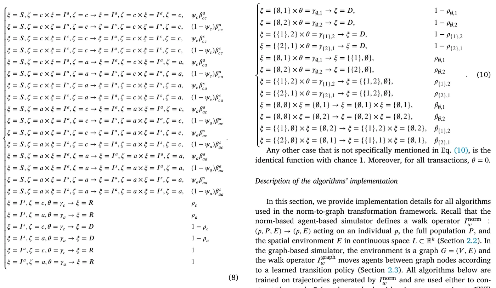

Any other case that is not specifically mentioned in Eq. (10), is the identical function with chance 1. Moreover, for all transactions, *𝜃* = 0.

## Two-strain SIR

For the two-strain SIR model, the ODE representation takes the form:

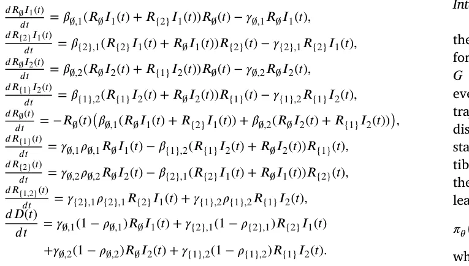

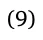

where *𝑅*∅(*𝑡*)*, 𝑅*{1}*, 𝑅*{2}*, 𝑅*{1,2}*, 𝑅*∅*𝐼*1(*𝑡*)*, 𝑅*∅*𝐼*2(*𝑡*)*, 𝑅*{1}*𝐼*2*, 𝑅*{2}*𝐼*1, and *𝐷*(*𝑡*) are the number of recovered from strains ∅*,* {1}*,* {2}*,* {1*,* 2}, infected with the first and second strains, and dead agents in the population, *𝛽* is the average infection rate, *𝛾* is the average recovery rate, *𝜓* is the recovery probability.

For the ABS representation, let us assume each agent has an inner clock, *𝜃* ∈ N, that indicates the number of steps in time passed since the agent’s epidemiological state changed last time and an age group. Moreover, the epidemiological state (*𝜉*) belongs to *𝜉* ∈{*𝑅*∅(*𝑡*)*, 𝑅*{1}*, 𝑅*{2}*,*

## Integration into the framework

Given a fixed norm-based model and initial condition, we first run the norm-based ABS and record the continuous trajectories {𝓁𝑝(*𝑡*)}𝑝,𝑡 for all agents. A graph search algorithm then constructs a finite graph *𝐺* = (*𝑉, 𝐸*) together with a mapping *𝑐* ∶ *𝐿* → *𝑉* that associates every continuous location 𝓁 with a node *𝑣* = *𝑐*(𝓁). For each recorded trajectory, we obtain a discrete node sequence *𝑣*𝑝(*𝑡*) = *𝑐*(𝓁𝑝(*𝑡*)). These discrete trajectories, together with the corresponding epidemiological states *𝜉*𝑝(*𝑡*) and aggregate population statistics (e.g., counts of susceptible, infected, recovered agents per node), form the training data for the walk dynamics approximation algorithms. A walk dynamics model learns, from these data, a probabilistic transition rule of the form

## (𝑣′ ∣ 𝑠𝑡(𝑝)) ≈ P(𝑣𝑝(𝑡+1) = 𝑣′ ∣ 𝑠𝑡(𝑝)), 𝜋𝜃

where *𝑠*𝑡(*𝑝*) is a state vector summarizing the information available to the agent at time *𝑡*. The learned transition probabilities define the graph-based walk operator *𝐼*graph used in Algorithm 1: at each time *𝑤* step and for each agent *𝑝* located at node *𝑣*𝑝(*𝑡*), we sample a new node *𝑣*𝑝(*𝑡*+1) from *𝜋*𝜃(⋅ ∣ *𝑠*𝑡(*𝑝*)) and update the agent’s location accordingly. The infection and temporal operators are kept identical to the original norm-based model; only the spatial part of *𝐼*𝑤 is replaced.

## Graph search algorithms

*Uniform square grid.* The uniform square grid provides the simplest graph discretization of the continuous environment. Let [*𝑥*min*, 𝑥*max] × [*𝑦*min*, 𝑦*max] be the axis-aligned bounding box of all observed locations {𝓁𝑝(*𝑡*)} in two dimensions. We overlay this domain with an axis-aligned square grid of cell side length *ℎ>* 0. Each grid cell that is visited by at least one agent at any time step becomes a node *𝑣* ∈ *𝑉* whose spatial coordinate is taken as the cell’s center of mass. Two nodes are connected by an edge (*𝑣, 𝑢*) ∈ *𝐸* if the corresponding cells share a side (4-neighborhood). The mapping *𝑐* ∶ *𝐿* → *𝑉* assigns each continuous location 𝓁 to the unique cell that contains it, and therefore to the corresponding grid node. This construction yields a mesh-like discretization where the number of nodes |*𝑉* | is controlled primarily by the grid spacing *ℎ*, and the average node degree |*𝐸*|∕|*𝑉* | is close to four. The resulting graph *𝐺* and mapping *𝑐* are subsequently used to generate training data for the walk dynamics approximation algorithms and to define *𝐼*graph. *𝑤*

*Quadtree.* The Quadtree graph search algorithm constructs an adaptive spatial discretization that refines the grid where the agent density is high and keeps it coarse elsewhere. We start from the same bounding box as for the grid and recursively subdivide each square cell into four equal subcells until either the maximum tree depth *𝑑*max is reached or the number of agents contained in the cell at a given time step falls below a threshold *𝑛*leaf. For each time step *𝑡*, this procedure yields a Quadtree *𝑄*𝑡 whose leaves partition the domain into square cells of varying size. To obtain a single graph *𝐺* over the entire simulation horizon, we construct an ‘‘average Quadtree’’ by aligning all Quadtrees to the same maximal depth and counting how often each leaf cell at that depth is occupied. Formally, for each potential leaf cell *𝑐* at depth *𝑑*max, we define an occupancy frequency

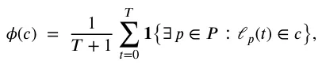

and keep only those cells whose occupancy *𝜙*(*𝑐*) exceeds a small threshold *𝑛*min∕(*𝑇*+1). Each retained cell becomes a node *𝑣* ∈ *𝑉* whose coordinate is the geometric center of the cell. Two nodes are connected by an edge if their corresponding cells share a side. The mapping *𝑐*(𝓁) assigns each location to the unique retained cell that contains it (or to the nearest retained cell if 𝓁 falls into a pruned region). This adaptive discretization tends to produce more nodes in crowded regions and fewer nodes elsewhere, with relatively heterogeneous degree distribution, and is again used only to define *𝐺* and the mapping *𝑐*; *𝐼*graph is *𝑤* entirely determined by the WDA algorithms.

*Genetic algorithm (GA).* The GA-based graph search treats the node locations as a continuous optimization variable and searches over candidate graphs by minimizing the proxy loss in Eq. (3). A candidate solution (an individual in the GA population) is a vector of *𝐾* node coordinates (*𝑥*1*,* … *, 𝑥*𝐾) ∈ *𝐿*𝐾, where *𝐾* is implicitly controlled by the encoding and mutation operators. Given a candidate graph *𝐺*𝑚 defined by these nodes, we connect nodes using a simple proximity rule: for each node *𝑣*, we connect it to its *𝑘*𝑒 nearest neighbors by undirected edges, which results in a sparse, locally connected graph. The fitness of *𝐺*𝑚 is measured by the loss *𝐿*(*𝑚*) in Eq. (3), which averages, over all agents and time steps, the Euclidean distance between each continuous location 𝓁𝑝(*𝑡*) and its closest node in the candidate graph. A standard generational GA is used to minimize *𝐿*(*𝑚*): at each generation, a population of *𝑁*pop graphs is updated by tournament selection (parameterized by a fraction *𝛼* of the best individuals), one-point or uniform crossover with probability *𝑝*cross, and Gaussian mutation of node coordinates with standard deviation *𝜎*mut and probability *𝑝*mut. After a fixed number of generations *𝐺*gen, the best-performing candidate graph is selected, and its nodes and edges define *𝐺*, while the mapping *𝑐*(𝓁) is taken as nearest-neighbor assignment to the learned node coordinates. The GA itself does not define *𝐼*graph; it only produces a graph *𝐺* that is later *𝑤* used by the WDA algorithms.

*Time-series X-means (TSxM).* The TSxM graph search algorithm constructs *𝐺* by clustering entire agent trajectories rather than individual locations. Each agent *𝑝* is represented by its discrete-time trajectory {𝓁𝑝(*𝑡*)}𝑇 𝑡=0, treated as a multivariate time series. We use dynamic time warping (DTW) as the distance between trajectories and perform DTW *𝑘*-means clustering for a range of cluster counts *𝑘* = 1*,* … *, 𝜖*. For each *𝑘*, we run the DTW *𝑘*-means algorithm *𝑎* times with different random initializations and keep the solution that minimizes an *𝐿*1- type trajectory reconstruction error. For each resulting clustering, we compute the proxy loss in Eq. (3) by assigning each trajectory point to the centroid of its cluster and measuring its distance to that centroid’s spatial center of mass. The number of clusters *𝑘*⋆ is then selected by a simple elbow-like rule that balances this loss against model complexity or, in the implementation used here, by directly choosing the *𝑘* that yields the smallest value of *𝐿*(*𝑚*) among *𝑘* = 1*,* … *, 𝜖*. Each cluster *𝑐* defines a node *𝑣*𝑐 ∈ *𝑉* whose spatial coordinate is the average of all 𝓁𝑝(*𝑡*) that belong to that cluster. Edges between nodes are induced by observed temporal transitions: we add an edge (*𝑣*𝑐*, 𝑣*𝑐′) if there exists an agent *𝑝* and time *𝑡* such that 𝓁𝑝(*𝑡*) is assigned to cluster *𝑐* and 𝓁𝑝(*𝑡*+1) to cluster *𝑐*′. The mapping *𝑐*(𝓁) assigns each location to the cluster centroid that is closest under DTW distance. In this way, TSxM constructs *𝐺* and *𝑐* by capturing typical movement patterns; *𝐼*graph is subsequently *𝑤* learned from the induced discrete trajectories.

*Recurrent neural network (RNN) graph search.* The RNN-based graph search algorithm learns the node locations directly from the trajectories via a sequence model trained with the proxy loss in Eq. (3). At each time step *𝑡*, the continuous agent locations {𝓁𝑝(*𝑡*)}𝑝∈𝑃 are embedded into a fixed-length vector representation by an order-invariant encoder (for example, an average or attention-based pooling layer) that produces a population-level vector *𝑧*𝑡 ∈ R𝑑ℎ. The sequence {*𝑧*𝑡}𝑇 𝑡=0 is then fed into a stacked GRU-based recurrent network with *𝐿*RNN layers and hidden dimension *𝑑*ℎ. The final hidden state is passed through a small fully connected network to output *𝐾* node coordinates *̂𝑥*1*,* … *,̂ 𝑥*𝐾, where *𝐾* is fixed a priori based on the desired graph resolution. During training, we construct the candidate graph *𝐺*𝑚 using these coordinates and a proximity-based edge rule (as in the GA case) and minimize Eq. (3) with respect to the RNN parameters using the Adam optimizer. After convergence, the learned node coordinates define *𝑉* , edges are added by *𝑘*-nearest neighbors, and the mapping *𝑐*(𝓁) again assigns each location to its nearest node. This method leverages temporal correlations in the population-level dynamics to produce a compact and data-adaptive graph structure that is subsequently used by the WDA algorithms to define *𝐼*graph. *𝑤*

## Walk dynamics approximation algorithms

*Markov chain (MC).* The MC-based walk dynamics approximation models *𝐼*graph as a first-order Markov chain on the graph whose state *𝑤* summarizes the epidemiological and local spatial context. For each agent *𝑝* and time *𝑡*, we define a discrete state

*𝑠*𝑡(*𝑝*) = (*𝑣*𝑝(*𝑡*)*, 𝜉*𝑝(*𝑡*)*, 𝐶*𝑣𝑝(𝑡)(*𝑡*))*,* where *𝑣*𝑝(*𝑡*) ∈ *𝑉* is the node occupied by *𝑝*, *𝜉*𝑝(*𝑡*) is its epidemiological state, and *𝐶*𝑣(*𝑡*) is a vector of counts of agents in each epidemiological state across *𝑣* and its neighbors {*𝑢* ∶(*𝑣, 𝑢*) ∈ *𝐸*}. We then estimate, from the discrete trajectories, the empirical transition probabilities

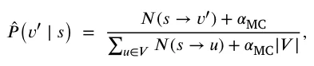

where *𝑁*(*𝑠* → *𝑣*′) is the number of observed transitions from state *𝑠* to node *𝑣*′ and *𝛼*MC *>* 0 is a Laplace smoothing parameter. The walk operator *𝐼*graph is then defined by this Markov chain: at simulation *𝑤* time, for an agent with current state *𝑠*𝑡(*𝑝*), the next node is sampled from the categorical distribution *̂𝑃* (⋅ ∣ *𝑠*𝑡(*𝑝*)), and the agent’s location component in *𝜏* is updated accordingly. This approach is purely tabular and does not involve any trainable neural network parameters; its hyperparameters are the definition of the context vector *𝐶*𝑣(*𝑡*) and the smoothing constant *𝛼*MC.

*Multi-agent classification with AutoEncoder (MAC-AE).* The MAC-AE algorithm learns a set of node-specific classifiers that map the current local and global state to a distribution over neighboring nodes. For each time step *𝑡*, we construct a population-level representation by feeding the features of all agents (node index, epidemiological state, and possibly additional attributes) into a fully connected attention-based autoencoder. The encoder part of this autoencoder outputs a fixed-length embedding *𝑧*𝑡 ∈ R𝑑𝑧 that summarizes the current configuration of the entire population. For an agent *𝑝* at node *𝑣*𝑝(*𝑡*) = *𝑣*, we then build a feature vector *𝑥*𝑡(*𝑝*) by concatenating its local features (e.g., its epidemiological state *𝜉*𝑝(*𝑡*) and node index *𝑣*), relevant aggregate counts in its neighborhood, and the global embedding *𝑧*𝑡. For each node *𝑣* ∈ *𝑉* , we train a separate supervised classifier *𝑓*𝑣 that receives *𝑥*𝑡(*𝑝*) and predicts the node index *𝑣*𝑝(*𝑡*+1) at the next time step. To avoid hand-tuning the classifier architecture and hyperparameters, we use the TPOT AutoML library to search over a space of pipelines comprising feature preprocessing, model families, and their hyperparameters, with population size *𝑁*TPOT and number of generations *𝐺*TPOT. The training objective is a cross-entropy loss between the predicted distribution over nodes and the true next node *𝑣*𝑝(*𝑡*+1). At simulation time, the graph-based walk operator *𝐼*graph is defined by these classifiers: given the *𝑤* current state *𝑠*𝑡(*𝑝*), we compute *𝑥*𝑡(*𝑝*), query the corresponding classifier *𝑓*𝑣𝑝(𝑡), and either sample the next node from the predicted categorical distribution or take its argmax. The hyperparameters for MAC-AE comprise the latent dimension *𝑑*𝑧 of the autoencoder, its architecture and training epochs, and the TPOT search parameters.

*Deep reinforcement learning (DRL).* The DRL-based approach treats the walk-dynamics learning problem as an imitation-style reinforcement learning task on the graph. We define, for each fixed graph *𝐺* = (*𝑉, 𝐸*), an episodic Markov decision process in which all agents share a single stochastic policy *𝜋*𝜃, parameterized by a fully connected neural network. The state space  is continuous and consists of feature vectors *𝑠*𝑡(*𝑝*) constructed similarly to the MAC-AE method: for each agent *𝑝* at time *𝑡* we encode its current node as a one-hot vector *𝑒*𝑣𝑝(𝑡) ∈ R|𝑉 |, its epidemiological state *𝜉*𝑝(*𝑡*) as a one-hot vector over compartments, its local neighborhood configuration as a vector of counts *𝐶*𝑣𝑝(𝑡)(*𝑡*) of agents in each compartment in *𝑣*𝑝(*𝑡*) and its neighbors (*𝑣*𝑝(*𝑡*)), and a global embedding *𝑧*𝑡 ∈ R𝑑𝑧 of the entire population obtained from the autoencoder described in MAC-AE. These components are concatenated, normalized (zero mean and unit variance per feature), and form the state vector *𝑠*𝑡(*𝑝*) = [*𝑒*𝑣𝑝(𝑡)*, 𝜉*𝑝(*𝑡*)*, 𝐶*𝑣𝑝(𝑡)(*𝑡*)*, 𝑧*𝑡] fed into the policy.

The action space (*𝑣*) for an agent located at node *𝑣* is the finite set of indices corresponding to the neighbors of *𝑣* plus a ‘‘stay’’ action, i.e., (*𝑣*) = (*𝑣*) ∪{*𝑣*}, where (*𝑣*) = {*𝑢* ∶(*𝑣, 𝑢*) ∈ *𝐸*}. In practice, we implement this by building, for each node *𝑣*, a fixed ordering of its neighbors and padding with a dummy ‘‘stay’’ index when necessary; the policy network outputs a categorical distribution over this local action set via a softmax layer. Given *𝑠*𝑡(*𝑝*), the policy computes logits *𝑔*𝜃(*𝑠*𝑡(*𝑝*)) ∈ R|(𝑣𝑝(𝑡))| and the action *𝑎*𝑡(*𝑝*) is sampled from *𝜋*𝜃(⋅ ∣ *𝑠*𝑡(*𝑝*)) = softmax(*𝑔*𝜃(*𝑠*𝑡(*𝑝*))) during training; at evaluation time, we use the greedy action arg max𝑎 *𝜋*𝜃(*𝑎* ∣ *𝑠*𝑡(*𝑝*)).

To define the reward function, we leverage the norm-based trajectories as expert demonstrations. For each agent *𝑝* and time step *𝑡* in the recorded trajectories, we know the ‘‘expert’’ next node *𝑣*𝑝(*𝑡*+1) induced by applying the mapping *𝑐* to the continuous norm-based location. We then define a per-step imitation reward

*𝑟*𝑡(*𝑝*) = **𝟏**{*𝑎*𝑡(*𝑝*) = *𝑣*𝑝(*𝑡*+1)} − *𝜆* **𝟏**{*𝑎*𝑡(*𝑝*) ≠ *𝑣*𝑝(*𝑡*+1)}*,* where *𝑎*𝑡(*𝑝*) is the node selected by the policy at time *𝑡* and *𝜆* ≥ 0 is a penalty parameter (controlling how strongly deviations from the expert are discouraged; in our experiments we set *𝜆* = 0*.*1). Intuitively, this reward encourages the policy to choose actions that match the expert next-node assignments while mildly penalizing exploratory deviations.

Episodes are finite-horizon sequences obtained from the norm-based simulation. For each training episode, we sample an agent *𝑝* and a starting time index *𝜏* from the dataset of recorded trajectories and roll out the policy for a fixed horizon *𝐻*ep steps (or until the end of the trajectory), using the expert transitions to update the state from *𝑠*𝑡(*𝑝*) to *𝑠*𝑡+1(*𝑝*) while giving the policy credit or penalty via *𝑟*𝑡(*𝑝*). In the experiments we use a discount factor of *𝛾*RL = 0*.*99 and an episode length of *𝐻*ep = 32 steps. Rollouts are batched across multiple agents and starting times: each PPO update uses a batch of *𝐵* = 8192 transitions, obtained by concatenating several episodes until the batch size is reached.

The policy *𝜋*𝜃 and the value function *𝑉*𝜙 are parameterized by separate multilayer perceptrons (MLPs) with the same architecture: two hidden layers of width *𝑑*𝑝 = 128 with ReLU activations, followed by either a softmax output over actions (policy) or a linear scalar output (value). We train both networks using the Proximal Policy Optimization (PPO) algorithm, which maximizes the clipped surrogate objective

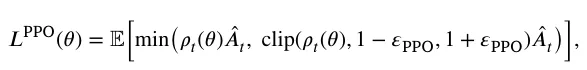

where *𝜌*𝑡(*𝜃*) = *𝜋*𝜃(*𝑎*𝑡 ∣ *𝑠*𝑡)∕*𝜋*𝜃old(*𝑎*𝑡 ∣ *𝑠*𝑡) is the importance sampling ratio, *̂𝐴*𝑡 is a generalized advantage estimate computed from the value network with *𝜆*GAE = 0*.*95, and *𝜀*PPO = 0*.*2 is the clipping parameter. Each PPO iteration runs *𝑁*epochs = 4 epochs of minibatch stochastic gradient ascent with the Adam optimizer (learning rate *𝜂* = 10−3, minibatch size *𝑀* = 512) on the collected batch of *𝐵* transitions.

Training proceeds for a maximum of *𝑁*iter PPO iterations (we use *𝑁*iter = 200) or until an early stopping criterion is met. For early stopping, we hold out a validation set of trajectories from the norm-based simulation and periodically measure the imitation accuracy, defined as the fraction of time steps for which the greedy policy’s action arg max𝑎 *𝜋*𝜃(*𝑎* ∣ *𝑠*𝑡(*𝑝*)) matches the expert next node *𝑣*𝑝(*𝑡*+1). If this validation accuracy does not improve for *𝑁*patience = 10 consecutive evaluations, we stop training and keep the policy parameters from the best validation epoch. After training, the learned policy *𝜋*𝜃(*𝑎* ∣ *𝑠*) defines the graph-based walk operator *𝐼*graph: in the translated simulation, for *𝑤* each agent and time step we build the state *𝑠*𝑡(*𝑝*) from the current graph-based population, sample or select the next node from *𝜋*𝜃(⋅ ∣ *𝑠*𝑡(*𝑝*)), and update the agent’s location in *𝐺*, while the infection and temporal operators remain identical to those of the original norm-based model.

*Spatio-temporal graph neural network (STGNN).* The STGNN-based walk dynamics approximation adapts recent spatio-temporal graph neural network architectures for epidemic prediction to our local transition-learning setting. Inspired by the Temporal Multiresolution Graph Neural Network (TMGNN) and transfer GNN models for pandemic forecasting, the STGNN operates on sequences of graph snapshots and learns to predict node-level flows between neighbors over time. At each time step *𝑡*, we construct node features *𝜙*𝑣(*𝑡*) consisting of the counts of agents at node *𝑣* in each epidemiological state, possibly concatenated with static node attributes such as spatial coordinates. We then build a temporal window of length *𝐻* for each node, (*𝜙*𝑣(*𝑡* − *𝐻* + 1)*,* … *, 𝜙*𝑣(*𝑡*)), and feed the sequence of graph snapshots {(*𝜙*𝑣(*𝜏*))𝑣∈𝑉 }𝑡 𝜏=𝑡−𝐻+1 into a multiresolution GNN encoder. Following Hy et al. and Panagopoulos et al. the encoder stacks several message-passing GNN layers at multiple spatial resolutions and couples them with temporal recurrence or attention to capture both local and long-range dynamics. Its output is a collection of node-level embeddings *ℎ*𝑣(*𝑡*), which are then passed through a decoder that outputs, for each node *𝑣*, a vector of non-negative flows *𝑓*𝑣→𝑢(*𝑡*) for all *𝑢* ∈ (*𝑣*) ∪{*𝑣*}.

To train the model, we derive, from the discrete trajectories, the empirical normalized flows

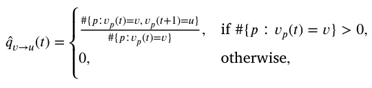

which represent the fraction of agents at node *𝑣* that move to neighbor *𝑢* at the next time step. The STGNN is trained to minimize the discrepancy between the predicted probabilities *𝑞*𝑣→𝑢(*𝑡*) = softmax𝑢(*𝑓*𝑣→𝑢(*𝑡*)) and the empirical *̂𝑞*𝑣→𝑢(*𝑡*), for example using a cross-entropy or Kullback– Leibler loss aggregated over nodes and time. After training, the walk operator *𝐼*graph uses these predicted flow distributions: when simulating *𝑤* the graph-based model, for each node *𝑣* and time *𝑡* we compute *𝑞*𝑣→𝑢(*𝑡*), and for every agent currently at *𝑣* we sample its next node *𝑣*𝑝(*𝑡*+1) from the categorical distribution over (*𝑣*) ∪{*𝑣*} given by *𝑞*𝑣→⋅(*𝑡*). Core hyperparameters include the node embedding dimension *𝑑*ST, the number of resolutions *𝐿*ST, the number of GNN layers per resolution, the temporal window length *𝐻*, the learning rate, and the number of training epochs.

<figure class="table-figure" id="table-5">
<figcaption><strong>Table 5</strong> Summary of the main hyperparameters for all graph search and walk dynamics approximation algorithms.</figcaption>

<table><tr><th>Hyperparameter</th><th>Short description</th><th>Default value</th></tr><tr><td>Quadtree: 𝑑max</td><td>Maximum depth of the Quadtree</td><td>𝑑max = 16</td></tr><tr><td>Quadtree: 𝑛leaf</td><td>Max. agents per cell before stopping subdivision</td><td>𝑛leaf = 5</td></tr><tr><td>GA: 𝑁pop</td><td>Population size (number of candidate graphs)</td><td>𝑁pop = 100</td></tr><tr><td>GA: 𝐺gen</td><td>Number of GA generations</td><td>𝐺gen = 50</td></tr><tr><td>GA: 𝑝mut</td><td>Mutation probability for each individual</td><td>𝑝mut = 0.05</td></tr><tr><td>GA: 𝑝cross</td><td>Crossover probability for selected parents</td><td>𝑝cross = 0.1</td></tr><tr><td>TSxM: 𝜖</td><td>Maximum number of clusters considered</td><td>𝜖= 200</td></tr><tr><td>TSxM: 𝑎</td><td>Number of DTW 𝑘-means restarts per 𝑘</td><td>𝑎= 10</td></tr><tr><td>RNN: 𝑑ℎ</td><td>GRU hidden dimension for population encoder</td><td>𝑑ℎ= 128</td></tr><tr><td>RNN: 𝐿RNN</td><td>Number of stacked GRU layers</td><td>𝐿RNN = 3</td></tr><tr><td>MC: 𝛼MC</td><td>Laplace smoothing added to transition counts</td><td>𝛼MC = 10−3</td></tr><tr><td>MAC-AE: 𝑑𝑧</td><td>Latent dimension of population autoencoder</td><td>𝑑𝑧= 128</td></tr><tr><td>MAC-AE: 𝐺TPOT</td><td>TPOT generations for node-wise classifier search</td><td>𝐺TPOT = 20</td></tr><tr><td>MAC-AE: 𝑁TPOT</td><td>TPOT population size per node</td><td>𝑁TPOT = 50</td></tr><tr><td>DRL (PPO): 𝛾RL</td><td>Discount factor for cumulative reward</td><td>𝛾RL = 0.98</td></tr><tr><td>DRL (PPO): 𝜀PPO</td><td>Clipping parameter in PPO objective</td><td>𝜀PPO = 0.20</td></tr><tr><td>DRL (PPO): 𝑑𝑝</td><td>Hidden dimension of policy/value networks</td><td>𝑑𝑝= 128</td></tr><tr><td>STGNN: 𝑑ST</td><td>Node embedding dimension in STGNN</td><td>𝑑ST = 128</td></tr><tr><td>STGNN: 𝐻</td><td>Temporal window length (number of past steps)</td><td>𝐻= 8</td></tr><tr><td>STGNN: 𝐿ST</td><td>Number of spatial resolutions (including finest)</td><td>𝐿ST = 4</td></tr><tr><td>STGNN: 𝐸ST</td><td>Number of STGNN training epochs</td><td>𝐸ST = 100</td></tr><tr><td>Neural models: 𝜂</td><td>Adam learning rate (RNN, AE, DRL, STGNN)</td><td>𝜂= 10−3</td></tr></table>

</figure>

Table 5 summarizes the main hyperparameters used across all algorithms. When possible, we adopt the default values recommended by the corresponding Python libraries; for custom components (e.g., grid spacing, Quadtree thresholds) we select values that provide a reasonable trade-off between accuracy and computational cost.

## Data availability

No data was used for the research described in the article.

## References

- Acemoglu, D., Chernozhukov, V., Werning, I., Whinston, M.D., 2021. Optimal targeted lockdowns in a multigroup sir model. Am. Econ. Rev.: Insights 3 (4), 487–502. [link](http://refhub.elsevier.com/S0952-1976%2825%2903651-6/sb1)
- Adiga, A., Dubhashi, D., Lewis, B., Marathe, M., Venkatramanan, S., Vollikanti, A., 2020. Mathematical models for covid-19 pandemic: A comparative analysis. J. Indian Inst. Sci. 100 (4), 793–807. [link](http://refhub.elsevier.com/S0952-1976%2825%2903651-6/sb1) · [link](http://refhub.elsevier.com/S0952-1976%2825%2903651-6/sb2)
- Agarwal, P., Jhajharia, K., 2021. Data analysis and modeling of covid-19. J. Stat. Manag. Syst. 24 (1), 1. [link](http://refhub.elsevier.com/S0952-1976%2825%2903651-6/sb2) · [link](http://refhub.elsevier.com/S0952-1976%2825%2903651-6/sb3)
- Al-Raeei, M., 2020. The forecasting of covid-19 with mortality using SIRD epidemic model for the united states, russia, china, and the syrian arab republic. AUO Adv. 10 (6). [link](http://refhub.elsevier.com/S0952-1976%2825%2903651-6/sb3) · [link](http://refhub.elsevier.com/S0952-1976%2825%2903651-6/sb4)
- Alagar, V.S., Periyasamy, K., 2011. Extended Finite State Machine. Springer London, pp. 105–128. [link](http://refhub.elsevier.com/S0952-1976%2825%2903651-6/sb4) · [link](http://refhub.elsevier.com/S0952-1976%2825%2903651-6/sb5)
- Alexi, A., Lazebnik, T., Shami, L., 2023a. Microfounded tax revenue forecast model with heterogeneous population and genetic algorithm approach. Comput. Econ.. [link](http://refhub.elsevier.com/S0952-1976%2825%2903651-6/sb5) · [link](http://refhub.elsevier.com/S0952-1976%2825%2903651-6/sb6)
- Alexi, A., Rosenfeld, A., Lazebnik, T., 2023b. A security games inspired approach for distributed control of pandemic spread. Adv. Theory Simulations 6 (2), 2200631. [link](http://refhub.elsevier.com/S0952-1976%2825%2903651-6/sb6) · [link](http://refhub.elsevier.com/S0952-1976%2825%2903651-6/sb7)
- Andraud, M., Hens, N., Marais, C., Beutels, P., 2012. Dynamic epidemiological models for dengue transmission: A systematic review of structural approaches. Plos One 7 (11), 1–14, 11. [link](http://refhub.elsevier.com/S0952-1976%2825%2903651-6/sb7) · [link](http://refhub.elsevier.com/S0952-1976%2825%2903651-6/sb8)
- Andrea Alberto Conti, 2020. Historical and methodological highlights of quarantine measures: from ancient plague epidemics to current coronavirus disease (COVID-19) pandemic. Acta Bio-Medica : Atenei Parm. 91 (2), 226–229. [link](http://refhub.elsevier.com/S0952-1976%2825%2903651-6/sb9)
- Arulkumaran, K., Deisenroth, M.P., Brundage, M., Bharath, A.A., 2017. Deep reinforcement learning: A brief survey. IEEE Signal Process. Mag. 34 (6), 26–38. [link](http://refhub.elsevier.com/S0952-1976%2825%2903651-6/sb9) · [link](http://refhub.elsevier.com/S0952-1976%2825%2903651-6/sb10)
- Baber, R., 2020. Pandemics: learning from the past. Climacteric 23 (3), 211–212. [link](http://refhub.elsevier.com/S0952-1976%2825%2903651-6/sb10) · [link](http://refhub.elsevier.com/S0952-1976%2825%2903651-6/sb11)
- Bank, D., Koenigstein, N., Giryes, R., 2023. Autoencoders. Springer International Publishing, Cham, pp. 353–374. [link](http://refhub.elsevier.com/S0952-1976%2825%2903651-6/sb11) · [link](http://refhub.elsevier.com/S0952-1976%2825%2903651-6/sb12)
- Berge, T., Lubuma, J.M.-S., Moremedi, G.M., Morris, N., Kondera-Shava, R., 2017. A simple mathematical model for ebola in africa. J. Biol. Dyn. 11 (1), 42–74. [link](http://refhub.elsevier.com/S0952-1976%2825%2903651-6/sb12) · [link](http://refhub.elsevier.com/S0952-1976%2825%2903651-6/sb13)
- Bo, Z.W., Hua, L.Z., Yu, Z.G., 2006a. Optimization of process route by genetic algorithms. Robot. Comput.-Integr. Manuf. 22, 180–188. [link](http://refhub.elsevier.com/S0952-1976%2825%2903651-6/sb13) · [link](http://refhub.elsevier.com/S0952-1976%2825%2903651-6/sb14)
- Bo, Z.W., Hua, L.Z., Yu, Z.G., 2006b. Optimization of process route by genetic algorithms. Robot. Comput.-Integr. Manuf. 22, 180–188. [link](http://refhub.elsevier.com/S0952-1976%2825%2903651-6/sb14) · [link](http://refhub.elsevier.com/S0952-1976%2825%2903651-6/sb15)
- Bo, L., Rein, L., 2005. Comparison of the luus–jaakola optimization procedure and the genetic algorithm. Eng. Optim. 37 (4), 381–396. [link](http://refhub.elsevier.com/S0952-1976%2825%2903651-6/sb15) · [link](http://refhub.elsevier.com/S0952-1976%2825%2903651-6/sb16)
- Bognanni, M., Doug, H., Kolliner, D., Mitman, K., 2020. Economics and epidemics: Evidence from an estimated spatial econ-sir model. In: Finance and Economics Discussion Series 2020-091. Board of Governors of the Federal Reserve System, Washington. [link](http://refhub.elsevier.com/S0952-1976%2825%2903651-6/sb16) · [link](http://refhub.elsevier.com/S0952-1976%2825%2903651-6/sb17)
- Brodeur, A., Gray, D., Islam, A., Bhuiyan, S., 2020. A literature review of the economics of covid-19. IZA Discussion Paper No. 13411, Available at SSRN: https://ssrn.com/abstract=3636640. [link](http://refhub.elsevier.com/S0952-1976%2825%2903651-6/sb17) · [link](http://refhub.elsevier.com/S0952-1976%2825%2903651-6/sb18)
- Byrd, R.H., Lu, P., Nocedal, J., Zhu, C., 1995. A limited memory algorithm for bound constrained optimization. SIAM J. Sci. Comput. 16 (5), 1190–1208. [link](http://refhub.elsevier.com/S0952-1976%2825%2903651-6/sb18) · [link](http://refhub.elsevier.com/S0952-1976%2825%2903651-6/sb19)
- Cai, B., Huang, G., Samadiani, N., Li, G., Chi, C.-H., 2021. Efficient time series clustering by minimizing dynamic time warping utilization. IEEE Access 9, 46589–46599. [link](http://refhub.elsevier.com/S0952-1976%2825%2903651-6/sb19) · [link](http://refhub.elsevier.com/S0952-1976%2825%2903651-6/sb20)
- Chen, Y., Liang, X., Hong, T., Luo, X., 2017. Simulation and visualization of energy-related occupant behavior in office buildings. Build. Simul. 10, 785–798. [link](http://refhub.elsevier.com/S0952-1976%2825%2903651-6/sb20) · [link](http://refhub.elsevier.com/S0952-1976%2825%2903651-6/sb21)
- Chien, C.H., Aggarwal, J.K., 1986. Identification of 3d objects from multiple silhouettes using quadtrees/octrees. Comput. Vis. Graph. Image Process. 36 (2), 256–273. [link](http://refhub.elsevier.com/S0952-1976%2825%2903651-6/sb21) · [link](http://refhub.elsevier.com/S0952-1976%2825%2903651-6/sb22)
- Chumachenko, D., Dobriak, V., Mazorchuk, M., Meniailov, I., Bazilevych, K., 2018. On agent-based approach to influenza and acute respiratory virus infection simulation. In: 2018 14th International Conference on Advanced Trends in Radioelecrtronics, Telecommunications and Computer Engineering. (TCSET), pp. 192–195. [link](http://refhub.elsevier.com/S0952-1976%2825%2903651-6/sb22) · [link](http://refhub.elsevier.com/S0952-1976%2825%2903651-6/sb23)
- Connell, R., Dawson, P., Alex, S., 2009. Comparison of an agent-based model of disease propagation with the generalised sir epidemic model. ADA510899. [link](http://refhub.elsevier.com/S0952-1976%2825%2903651-6/sb23) · [link](http://refhub.elsevier.com/S0952-1976%2825%2903651-6/sb24)
- Conti, A.A., 2020. Historical and methodological highlights of quarantine measures: from ancient plague epidemics to current coronavirus disease (COVID-19) pandemic. Acta Bio-Medica : Atenei Parm. 91 (2), 226–229. [link](http://refhub.elsevier.com/S0952-1976%2825%2903651-6/sb24) · [link](http://refhub.elsevier.com/S0952-1976%2825%2903651-6/sb25)
- Davis, L., 1985a. Applying adaptive algorithms to epistatic domains. In: Proceedings of the International Joint Conference on Artificial Intelligence. pp. 162–164. [link](http://refhub.elsevier.com/S0952-1976%2825%2903651-6/sb25) · [link](http://refhub.elsevier.com/S0952-1976%2825%2903651-6/sb26)
- Davis, L., 1985b. Applying adaptive algorithms to epistatic domains. In: Proceedings of the International Joint Conference on Artificial Intelligence. pp. 162–164. [link](http://refhub.elsevier.com/S0952-1976%2825%2903651-6/sb26) · [link](http://refhub.elsevier.com/S0952-1976%2825%2903651-6/sb27)
- De Groot, R.J., Baker, S.C., Baric, R.S., Brown, C.S., Drosten, C., Enjuanes, L., Fouch-ier, R.A.M., Galiano, M., Gorbalenya, A.E., Memish, Z.A., Perlman, S., Poon, L.L.M., Snijder, E.J., Stephens, G.M., Woo, P.C.Y., Zaki, A.M., Zambon, M., Ziebuhr, J., 2013. Middle east respiratory syndrome coronavirus (mers-cov): announcement of the coronavirus study group. J. Virol. 87, 7790–7792. [link](http://refhub.elsevier.com/S0952-1976%2825%2903651-6/sb27) · [link](http://refhub.elsevier.com/S0952-1976%2825%2903651-6/sb28)
- Desai, A., Kraemer, M., Bhatia, S., Cori, A., Nouvellet, P., Herringer, M., Cohn, E., Carrion, M., Brownstein, J., Madoff, L., Lassmann, B., 2019. Real-time epidemic forecasting: challenges and opportunities. Health Secur. 17 (8), 268–275. [link](http://refhub.elsevier.com/S0952-1976%2825%2903651-6/sb28) · [link](http://refhub.elsevier.com/S0952-1976%2825%2903651-6/sb29)
- Ellison, G., 2020. Implications of Heterogeneous SIR Models for Analyses of COVID-19. National Bureau of Economic Research, page Working paper 27373. [link](http://refhub.elsevier.com/S0952-1976%2825%2903651-6/sb30)
- Eurosurveillance Editorial Team, 2020. Note from the editors: world health organization declares novel coronavirus (2019-ncov) sixth public health emergency of international concern. Euro Surveill 25, 200131e. [link](http://refhub.elsevier.com/S0952-1976%2825%2903651-6/sb30) · [link](http://refhub.elsevier.com/S0952-1976%2825%2903651-6/sb31)
- Fernández-Villaverde, J., Jones, C.I., 2020. Estimating and Simulating a SIRD Model of COVID-19 for Many Countries, States, and Cities. National Bureau of Economic Research, Working Paper 27128. [link](http://refhub.elsevier.com/S0952-1976%2825%2903651-6/sb31) · [link](http://refhub.elsevier.com/S0952-1976%2825%2903651-6/sb32)
- Friedman, J., Liu, P., Troeger, C.E., Carter, A., Reiner, R.C., Barber, R.M., Collins, J., Lim, S.S., Pigott, D.M., Vos, T., Hay, S.I., Murray, C.J.L., Gakidou, E., 2021. Predictive performance of international covid-19 mortality forecasting models. Nat. Commun. 12, 2609. [link](http://refhub.elsevier.com/S0952-1976%2825%2903651-6/sb32) · [link](http://refhub.elsevier.com/S0952-1976%2825%2903651-6/sb33)
- Fukuoka, T., Ito, K., 2010. Exposure Risk Assessment By Coupled Analysis of Cfd and Sir Model in Enclosed Space. AIVC. [link](http://refhub.elsevier.com/S0952-1976%2825%2903651-6/sb33) · [link](http://refhub.elsevier.com/S0952-1976%2825%2903651-6/sb34)
- Ghaheri, A., Shoar, S., Naderan, M., Hoseini, S.S., 2005. The applications of genetic algorithms in medicine. Oman Med J. 30 (6), 406–416. [link](http://refhub.elsevier.com/S0952-1976%2825%2903651-6/sb34) · [link](http://refhub.elsevier.com/S0952-1976%2825%2903651-6/sb35)
- Grossman, T., Wool, A., 1997. Computational experience with approximation algorithms for the set covering problem. European J. Oper. Res. 101 (1), 81–92. [link](http://refhub.elsevier.com/S0952-1976%2825%2903651-6/sb35) · [link](http://refhub.elsevier.com/S0952-1976%2825%2903651-6/sb36)
- Harweg, T., Wagner, M., Weichert, F., 2023. Agent-based simulation for infectious disease modelling over a period of multiple days, with application to an airport scenario. Int. J. Environ. Res. Public Health 20 (1). [link](http://refhub.elsevier.com/S0952-1976%2825%2903651-6/sb36) · [link](http://refhub.elsevier.com/S0952-1976%2825%2903651-6/sb37)
- Hassanat, A.B.A., Alkafaween, E., 2017. On enhancing genetic algorithms using new crossovers. Int. J. Comput. Appl. Technol. 55 (3). [link](http://refhub.elsevier.com/S0952-1976%2825%2903651-6/sb37) · [link](http://refhub.elsevier.com/S0952-1976%2825%2903651-6/sb38)
- Holland, J.H., 1992. Genetic algorithms. Sci. Am. 267 (1), 66–73. [link](http://refhub.elsevier.com/S0952-1976%2825%2903651-6/sb38) · [link](http://refhub.elsevier.com/S0952-1976%2825%2903651-6/sb39)
- Holme, P., 2021. Fast and principled simulations of the sir model on temporal networks. Plos One 16 (2), e0246961. [link](http://refhub.elsevier.com/S0952-1976%2825%2903651-6/sb39) · [link](http://refhub.elsevier.com/S0952-1976%2825%2903651-6/sb40)
- Hy, Truong Son, Nguyen, Viet Bach, Tran-Thanh, Long, Kondor, Risi, 2022. Temporal multiresolution graph neural networks for epidemic prediction. In: Workshop on Healthcare AI and COVID-19. PMLR, pp. 21–32. [link](http://refhub.elsevier.com/S0952-1976%2825%2903651-6/sb40) · [link](http://refhub.elsevier.com/S0952-1976%2825%2903651-6/sb41)
- Iuliano, A.D., et al., 2018. Estimates of global seasonal influenza-associated respiratory mortality: a modelling study. Lancet 391 (10127), 1285–1300. [link](http://refhub.elsevier.com/S0952-1976%2825%2903651-6/sb41) · [link](http://refhub.elsevier.com/S0952-1976%2825%2903651-6/sb42)
- Ivorra, B., Ferrandez, M.R., Vela-Perez, M., Ramos, A.M., 2020. Mathematical modeling of the spread of the coronavirus disease 2019 (covid-19) taking into account the undetected infections. the case of china. Commun Nonlinear Sci Numer. Simulat. [link](http://refhub.elsevier.com/S0952-1976%2825%2903651-6/sb42) · [link](http://refhub.elsevier.com/S0952-1976%2825%2903651-6/sb43)
- Jin, Guangyin, Liang, Yuxuan, Fang, Yuchen, Shao, Zezhi, Huang, Jincai, Zhang, Junbo, Zheng, Yu, 2023. Spatio-temporal graph neural networks for predictive learning in urban computing: A survey. IEEE Trans. Knowl. Data Eng. 36 (10), 5388–5408. [link](http://refhub.elsevier.com/S0952-1976%2825%2903651-6/sb43) · [link](http://refhub.elsevier.com/S0952-1976%2825%2903651-6/sb44)
- Jones, C., Philippon, T., Venkateswaran, V., 2021. Optimal mitigation policies in a pandemic: Social distancing and working from home. Rev. Financ. Stud. 34 (11), 5188–5223. [link](http://refhub.elsevier.com/S0952-1976%2825%2903651-6/sb44) · [link](http://refhub.elsevier.com/S0952-1976%2825%2903651-6/sb45)
- Kermack, W.O., McKendrick, A.G., 1927. A contribution to the mathematical theory of epidemics. Proc. R. Soc. 115, 700–721. [link](http://refhub.elsevier.com/S0952-1976%2825%2903651-6/sb45) · [link](http://refhub.elsevier.com/S0952-1976%2825%2903651-6/sb46)
- Kingma, D.P., Ba, J., 2017. Adam: A method for stochastic optimization. arXiv. [link](http://refhub.elsevier.com/S0952-1976%2825%2903651-6/sb46) · [link](http://refhub.elsevier.com/S0952-1976%2825%2903651-6/sb47)
- Kiss, I.Z., Miller, J.C., Simon, P.L., 2017. Mathematics of Epidemics on Networks. Springer, Cham. [link](http://refhub.elsevier.com/S0952-1976%2825%2903651-6/sb47) · [link](http://refhub.elsevier.com/S0952-1976%2825%2903651-6/sb48)
- Krekov, A., Gruninger, J., Schlonvoigt, R., Kruger, J., 2015. Towards in situ visualization of extreme-scale, agent-based, worldwide disease-spreading simulations. SIGGRAPH Asia 2015 Vis. High Perform. Comput. 7, 1–4. [link](http://refhub.elsevier.com/S0952-1976%2825%2903651-6/sb48) · [link](http://refhub.elsevier.com/S0952-1976%2825%2903651-6/sb49)
- Kwon, K.S., Park, J.I., Park, Y.J., Jung, D.M., Ryu, K.W., Lee, J.H., 2020. Evidence of long-distance droplet transmission of sars-cov-2 by direct air flow in a restaurant in Korea. J. Korean Med. Sci. 35 (46), e415. [link](http://refhub.elsevier.com/S0952-1976%2825%2903651-6/sb49) · [link](http://refhub.elsevier.com/S0952-1976%2825%2903651-6/sb50)
- Lazebnik, T., 2023a. Computational applications of extended sir models: A review focused on airborne pandemics. Ecol. Model. 483, 110422. [link](http://refhub.elsevier.com/S0952-1976%2825%2903651-6/sb50) · [link](http://refhub.elsevier.com/S0952-1976%2825%2903651-6/sb51)
- Lazebnik, T., 2023b. Cost-optimal seeding strategy during a botanical pandemic in domesticated fields. arXiv. [link](http://refhub.elsevier.com/S0952-1976%2825%2903651-6/sb51) · [link](http://refhub.elsevier.com/S0952-1976%2825%2903651-6/sb52)
- Lazebnik, T., 2023c. Data-driven hospitals staff and resources allocation using agent-based simulation and deep reinforcement learning. Eng. Appl. Artif. Intell. 126, 106783. [link](http://refhub.elsevier.com/S0952-1976%2825%2903651-6/sb52) · [link](http://refhub.elsevier.com/S0952-1976%2825%2903651-6/sb53)
- Lazebnik, T., Alexi, A., 2022. Comparison of pandemic intervention policies in several building types using heterogeneous population model. Commun. Nonlinear Sci. Numer. Simul. 107 (4), 106176. [link](http://refhub.elsevier.com/S0952-1976%2825%2903651-6/sb53) · [link](http://refhub.elsevier.com/S0952-1976%2825%2903651-6/sb54)
- Lazebnik, T., Alexi, A., 2023. High resolution spatio-temporal model for room-level airborne pandemic spread. Mathematics 11 (2), 426. [link](http://refhub.elsevier.com/S0952-1976%2825%2903651-6/sb54) · [link](http://refhub.elsevier.com/S0952-1976%2825%2903651-6/sb55)
- Lazebnik, T., Bunimovich-Mendrazitsky, S., 2022. Generic approach for mathematical model of multi-strain pandemics. Plos One 17 (4), e0260683. [link](http://refhub.elsevier.com/S0952-1976%2825%2903651-6/sb55) · [link](http://refhub.elsevier.com/S0952-1976%2825%2903651-6/sb56)
- Lazebnik, Teddy, Bunimovich-Mendrazitsky, Svetlana, Ashkenazi, Shai, Levner, Eugene, Benis, Arriel, 2022. Early detection and control of the next epidemic wave using health communications: Development of an artificial intelligence-based tool and its validation on COVID-19 data from the US. Int. J. Environ. Res. Public Health 19 (23), 16023. [link](http://refhub.elsevier.com/S0952-1976%2825%2903651-6/sb56) · [link](http://refhub.elsevier.com/S0952-1976%2825%2903651-6/sb57)
- Lazebnik, T., Bunimovich-Mendrazitsky, S., Shami, L., 2021a. Pandemic management by a spatio–temporal mathematical model. Int. J. Nonlinear Sci. Numer. Simul. 107 (4), 106176. [link](http://refhub.elsevier.com/S0952-1976%2825%2903651-6/sb57) · [link](http://refhub.elsevier.com/S0952-1976%2825%2903651-6/sb58)
- Lazebnik, T., Fleischer, T., Yaniv-Rosenfeld, A., 2023. Benchmarking biologically-inspired automatic machine learning for economic tasks. Sustainability 15 (14). [link](http://refhub.elsevier.com/S0952-1976%2825%2903651-6/sb58) · [link](http://refhub.elsevier.com/S0952-1976%2825%2903651-6/sb59)
- Lazebnik, T., Shami, L., Bunimovich-Mendrazitsky, S., 2021b. Spatio-temporal influence of non-pharmaceutical interventions policies on pandemic dynamics and the economy: The case of covid-19. Res. Econ.. [link](http://refhub.elsevier.com/S0952-1976%2825%2903651-6/sb59) · [link](http://refhub.elsevier.com/S0952-1976%2825%2903651-6/sb60)
- Lazebnik, T., Simon-Keren, L/., 2023. Cancer-inspired genomics mapper model for the generation of synthetic dna sequences with desired genomics signatures. Comput. Biol. Med. 164, 107221. [link](http://refhub.elsevier.com/S0952-1976%2825%2903651-6/sb61)
- Lerman, P.M., 1980. Fitting segmented regression models by grid search. J. R. Stat. Soc. Ser. C. Appl. Stat. 29 (1), 77–84. [link](http://refhub.elsevier.com/S0952-1976%2825%2903651-6/sb61) · [link](http://refhub.elsevier.com/S0952-1976%2825%2903651-6/sb62)
- Liu, Zewen, Wan, Guancheng, Aditya Prakash, B., Lau, Max S.Y., Jin, Wei, 2024. A review of graph neural networks in epidemic modeling. In: Proceedings of the 30th ACM SIGKDD Conference on Knowledge Discovery and Data Mining. pp. 6577–6587. [link](http://refhub.elsevier.com/S0952-1976%2825%2903651-6/sb62) · [link](http://refhub.elsevier.com/S0952-1976%2825%2903651-6/sb63)
- Long, J.B., Ehrenfeld, J.M., 2020. The role of augmented intelligence (ai) in detecting and preventing the spread of novel coronavirus. J. Med. Syst. 44. [link](http://refhub.elsevier.com/S0952-1976%2825%2903651-6/sb63) · [link](http://refhub.elsevier.com/S0952-1976%2825%2903651-6/sb64)
- Mackey, T.K., Liang, B.A., 2012. Lessons from sars and h1n1/a: employing a who–wto forum to promote optimal economic-public health pandemic response. J. Public Health Policy 33, 119–139. [link](http://refhub.elsevier.com/S0952-1976%2825%2903651-6/sb64) · [link](http://refhub.elsevier.com/S0952-1976%2825%2903651-6/sb65)
- Masuda, N., Holme, P., 2017. Temporal Network Epidemiology. Springer, Singapore. [link](http://refhub.elsevier.com/S0952-1976%2825%2903651-6/sb65) · [link](http://refhub.elsevier.com/S0952-1976%2825%2903651-6/sb66)
- McDowell, I., 2023. Explanation and Causal Models for Social Epidemiology. Springer International Publishing, pp. 37–88. [link](http://refhub.elsevier.com/S0952-1976%2825%2903651-6/sb66) · [link](http://refhub.elsevier.com/S0952-1976%2825%2903651-6/sb67)
- Miller, J.C., 2017a. Mathematical models of sir disease spread with combined non-sexual and sexual transmission routes. Infect. Dis. Model. 2, 35–55. [link](http://refhub.elsevier.com/S0952-1976%2825%2903651-6/sb67) · [link](http://refhub.elsevier.com/S0952-1976%2825%2903651-6/sb68)
- Miller, Joel C., 2017b. Mathematical models of SIR disease spread with combined non-sexual and sexual transmission routes. Infect. Dis. Model. 2 (1), 35–55. [link](http://refhub.elsevier.com/S0952-1976%2825%2903651-6/sb68) · [link](http://refhub.elsevier.com/S0952-1976%2825%2903651-6/sb69)
- Nguyen, Viet Bach, Hy, Truong Son, Tran-Thanh, Long, Nghiem, Nhung, 2023. Predicting covid-19 pandemic by spatio-temporal graph neural networks: A new zealand’s study. arXiv preprint arXiv:2305.07731. [link](http://refhub.elsevier.com/S0952-1976%2825%2903651-6/sb69) · [link](http://arxiv.org/abs/2305.07731)
- Nix, A.E., Vose, M.D., 1992. Modeling genetic algorithms with Markov chains. Ann. Math. Artif. Intell. 5 (1). [link](http://arxiv.org/abs/2305.07731) · [link](http://refhub.elsevier.com/S0952-1976%2825%2903651-6/sb71)
- Olson, R.S., Moore, J.H., 2016. Tpot: A tree-based pipeline optimization tool for automating machine learning. In: Workshop on Automatic Machine Learning. PMLR, pp. 66–74. [link](http://refhub.elsevier.com/S0952-1976%2825%2903651-6/sb71) · [link](http://refhub.elsevier.com/S0952-1976%2825%2903651-6/sb72)
- Orozco-Acosta, E., Adin, A., Ugarte, M.D., 2023. Big problems in spatio-temporal disease mapping: Methods and software. Cpmputer Methods PRograms Biomed. 231 (107403). [link](http://refhub.elsevier.com/S0952-1976%2825%2903651-6/sb72) · [link](http://refhub.elsevier.com/S0952-1976%2825%2903651-6/sb73)
- Peng, Z., Rogas, P.A.L., Kropff, E., Bahnfleth, W., Buonanno, G., Dancer, S.J., Kur-nitski, J., Li, Y., Loomans, M.G.L.C., Marr, L.C., Morawska, L., Nazaroff, W., Noakes, C., Querol, X., Sekhar, C., Tellier, R., Greenhalgh, T., Bourouiba, L., Boerstra, A., Tang, J.W., Miller, S.L., Jimenez, J.L., 2020. Practical indicators for risk of airborne transmission in shared indoor environments and their application to covid-19 outbreaks. Environ. Sci. Technol. 56, 1125–1137. [link](http://refhub.elsevier.com/S0952-1976%2825%2903651-6/sb73) · [link](http://refhub.elsevier.com/S0952-1976%2825%2903651-6/sb74)
- Priest, J.D., Kishore, A., Machi, L., Kuhlman, C.J., Machi, D., Ravi, S.S., 2021. Csonnet: An agent-based modeling software system for discrete time simulation. In: 2021 Winter Simulation Conference. (WSC), pp. 1–12. [link](http://refhub.elsevier.com/S0952-1976%2825%2903651-6/sb74) · [link](http://refhub.elsevier.com/S0952-1976%2825%2903651-6/sb75)
- Privault, N., 2018. Understanding Markov Chains. Springer Singapore. [link](http://refhub.elsevier.com/S0952-1976%2825%2903651-6/sb75) · [link](http://refhub.elsevier.com/S0952-1976%2825%2903651-6/sb76)
- Salgotra, R., Gandomi, M., Gandomi, A.H., 2020. Time series analysis and forecast of the covid-19 pandemic in india using genetic programming. Chaos Solitons Fractals 138, 109945. [link](http://refhub.elsevier.com/S0952-1976%2825%2903651-6/sb76) · [link](http://refhub.elsevier.com/S0952-1976%2825%2903651-6/sb77)
- Samet, H., 1984. The quadtree and related hierarchical data structures. ACM Comput. Surv. 16 (2), 187–260. [link](http://refhub.elsevier.com/S0952-1976%2825%2903651-6/sb77) · [link](http://refhub.elsevier.com/S0952-1976%2825%2903651-6/sb78)
- Schulman, J., Wolski, F., Dhariwal, P., Radford, A., Klimov, O., 2017. Proximal policy optimization algorithm. arXiv. [link](http://refhub.elsevier.com/S0952-1976%2825%2903651-6/sb78) · [link](http://refhub.elsevier.com/S0952-1976%2825%2903651-6/sb79)
- Shami, L., Lazebnik, T., 2022. Economic aspects of the detection of new strains in a multi-strain epidemiological–mathematical model. Chaos Solitons Fractals 165, 112823. [link](http://refhub.elsevier.com/S0952-1976%2825%2903651-6/sb79) · [link](http://refhub.elsevier.com/S0952-1976%2825%2903651-6/sb80)
- Shami, L., Lazebnik, T., 2023. Financing and managing epidemiological-economic crises: Are we ready for another outbreak?. J. Policy Model. 45 (1), 74–89. [link](http://refhub.elsevier.com/S0952-1976%2825%2903651-6/sb80) · [link](http://refhub.elsevier.com/S0952-1976%2825%2903651-6/sb81)
- Sharma, S., 2017. Markov chain monte carlo methods for bayesian data analysis in astronomy. Annu. Rev. Astron. Astrophys. 55 (1), 213–259. [link](http://refhub.elsevier.com/S0952-1976%2825%2903651-6/sb81) · [link](http://refhub.elsevier.com/S0952-1976%2825%2903651-6/sb82)
- Shen, Y., Li, C., Dong, H., Wang, Z., Martinez, L., Sun, Z., Handel, A., Chen, Z., Chen, E., Ebell, M.H., Wang, F., Yi, B., Wang, H., Wang, X., Wang, A., Chen, B., Qi, Y., Liang, L., Li, Y., Ling, F., Chen, J., Xu, G., 2020. Community outbreak investigation of sars-cov-2 transmission among bus riders in eastern china. JAMA Intern. Med. 180 (12), 1665–1671. [link](http://refhub.elsevier.com/S0952-1976%2825%2903651-6/sb82) · [link](http://refhub.elsevier.com/S0952-1976%2825%2903651-6/sb83)
- Silva, V.L.S., Heaney, C.E., Li, Y., Pain, C.C., 2023. Data assimilation predictive gan (da-predgan) applied to a spatio-temporal compartmental model in epidemiology. J. Sci. Comput. 94 (25). [link](http://refhub.elsevier.com/S0952-1976%2825%2903651-6/sb83) · [link](http://refhub.elsevier.com/S0952-1976%2825%2903651-6/sb84)
- Soheily-Khah, S., Douzal-Chouakria, A., Gaussier, E., 2016. Generalized k-means-based clustering for temporal data under weighted and kernel time warp. Pattern Recognit. Lett. 75, 63–69. [link](http://refhub.elsevier.com/S0952-1976%2825%2903651-6/sb84) · [link](http://refhub.elsevier.com/S0952-1976%2825%2903651-6/sb85)
- Syakur, M.A., Khotimah, B.K., Rochman, E.M.S., Satoto, B.D., 2018. Integration k-means clustering method and elbow method for identification of the best customer profile cluster. IOP Conf. Ser.: Mater. Sci. Eng. 336 (1), 012017. [link](http://refhub.elsevier.com/S0952-1976%2825%2903651-6/sb85) · [link](http://refhub.elsevier.com/S0952-1976%2825%2903651-6/sb86)
- Tomy, Abhishek, Razzanelli, Matteo, Lauro, Francesco Di, Rus, Daniela, Santina, Cosimo Della, 2022. Estimating the state of epidemics spreading with graph neural networks. Nonlinear Dynam. 109 (1), 249–263. [link](http://refhub.elsevier.com/S0952-1976%2825%2903651-6/sb86) · [link](http://refhub.elsevier.com/S0952-1976%2825%2903651-6/sb87)
- Tran, Khanh-Tung, Hy, Truong Son, Jiang, Lili, Vu, Xuan-Son, 2024. Mglep: Multimodal graph learning for modeling emerging pandemics with big data. Sci. Rep. 14 (1), 1–16. [link](http://refhub.elsevier.com/S0952-1976%2825%2903651-6/sb87) · [link](http://refhub.elsevier.com/S0952-1976%2825%2903651-6/sb88)
- Tuite, A.R., Fisman, D.N., Greer, A.L., 2020. Mathematical modelling of covid-19 transmission and mitigation strategies in the population of ontario, canada. CMAJ 192, E497–E505. [link](http://refhub.elsevier.com/S0952-1976%2825%2903651-6/sb88) · [link](http://refhub.elsevier.com/S0952-1976%2825%2903651-6/sb89)
- Veturi, Y.A., Woof, W., Lazebnik, T., Moghul, I., Woodward-Court, P., Wagner, S.K., Cabral de Guimarães, T. a., Varela, D., Liefers, M.B., Patel, P.J., Beck, S., Webster, A.R., Mahroo, O., Keane, P.A., Michaelides, M., Balaskas, K., Ponikos, N., 2023. Syntheye: Investigating the impact of synthetic data on artificial intelligence-assisted gene diagnosis of inherited retinal disease. Ophthalmol. Sci. 3, 100258. [link](http://refhub.elsevier.com/S0952-1976%2825%2903651-6/sb90)
- Viguerie, A., Lorenzo, G., Auricchio, F., Baroli, D., Hughes, T.J.R., Patton, A., Reali, A., Yankeelov, T.E., Veneziani, A., 2021. Simulating the spread of covid-19 via a spatially-resolved susceptible–exposed–infected–recovered–deceased (seird) model with heterogeneous diffusion. Appl. Math. Lett. 111, 106617. [link](http://refhub.elsevier.com/S0952-1976%2825%2903651-6/sb90) · [link](http://refhub.elsevier.com/S0952-1976%2825%2903651-6/sb91)
- Wang, Lijing, Adiga, Aniruddha, Chen, Jiangzhuo, Sadilek, Adam, Venkatramanan, Srinivasan, Marathe, Madhav, 2022. Causalgnn: Causal-based graph neural networks for spatio-temporal epidemic forecasting. In: Proceedings of the AAAI conference on artificial intelligence, vol. 36, pp. 12191–12199. [link](http://refhub.elsevier.com/S0952-1976%2825%2903651-6/sb91) · [link](http://refhub.elsevier.com/S0952-1976%2825%2903651-6/sb92)
- Wiratsudakul, A., Suparit, P., Modchang, C., 2018. Dynamics of zika virus outbreaks: an overview of mathematical modeling approaches. PeerJ. [link](http://refhub.elsevier.com/S0952-1976%2825%2903651-6/sb92) · [link](http://refhub.elsevier.com/S0952-1976%2825%2903651-6/sb93)
- Witty, S., Lee, J.K., Tosch, E., Atrey, A., Clary, K., Littman, M.L., Jensen, D., 2021. Measuring and characterizing generalization in deep reinforcement learning. Appl. AI Lett. 2 (4), e45. [link](http://refhub.elsevier.com/S0952-1976%2825%2903651-6/sb93) · [link](http://refhub.elsevier.com/S0952-1976%2825%2903651-6/sb94)
- Yang, L., Shami, A., 2020. On hyperparameter optimization of machine learning algorithms: Theory and practice. Neurocomputing 415, 295–316. [link](http://refhub.elsevier.com/S0952-1976%2825%2903651-6/sb95)
- Yin, S., Wu, J., Song, P., 2023. Optimal control by deep learning techniques and its applications on epidemic models. J. Math. Biol. 86 (36). [link](http://refhub.elsevier.com/S0952-1976%2825%2903651-6/sb95) · [link](http://refhub.elsevier.com/S0952-1976%2825%2903651-6/sb96)
- Yu, X., Fang, M., Yu, J., Cheng, L., Ding, S., Kou, Z., 2023a. Epidemiological characteristics and spatio-temporal analysis of brucellosis in shandong province, 2015–2021. BMC Infect. Dis. 23 (669). [link](http://refhub.elsevier.com/S0952-1976%2825%2903651-6/sb96) · [link](http://refhub.elsevier.com/S0952-1976%2825%2903651-6/sb97)
- Yu, Shuo, Xia, Feng, Li, Shihao, Hou, Mingliang, Sheng, Quan Z., 2023b. Spatio-temporal graph learning for epidemic prediction. ACM Trans. Intell. Syst. Technol. 14 (2), 1–25. [link](http://refhub.elsevier.com/S0952-1976%2825%2903651-6/sb97) · [link](http://refhub.elsevier.com/S0952-1976%2825%2903651-6/sb98)
- Zhang, J., Man, K.F., 1998. Time series prediction using rnn in multi-dimension embedding phase space. In: SMC’98 Conference Proceedings 1998 IEEE International Conference on Systems, Man, and Cybernetics (Cat. No. 98CH36218), vol. 2, pp. 1868–1873. [link](http://refhub.elsevier.com/S0952-1976%2825%2903651-6/sb98) · [link](http://refhub.elsevier.com/S0952-1976%2825%2903651-6/sb99)
- Zhang, C., Song, W., Cao, Z., Zhang, J., Tan, P.S., Xu, C., 2020. Learning to dispatch for job shop scheduling via deep reinforcement learning. In: 34th Conference on Neural Information Processing Systems. [link](http://refhub.elsevier.com/S0952-1976%2825%2903651-6/sb99) · [link](http://refhub.elsevier.com/S0952-1976%2825%2903651-6/sb100)
