## 1 Introduction and related work

Bladder Cancer (BC) is the seventh most common cancer worldwide. It is estimated that around 400,000 new cases are diagnosed annually and 150,000 people die directly from BC every year [1]. Bacillus Calmette–Guérin (BCG) has been used to treat non-invasive BC for more than 40 years [2]. It is one of the most successful biotherapies for cancer in use. Despite long clinical experience with BCG, the mechanism of its therapeutic effect is still under investigation. BCG-immunotherapy has proven to reduce both recurrence and progression of BC and, therefore, represents an important tool in the treatment of BC. BCG treatment protocols differ mainly by the amount of the injected dosage, the injection rate, and the schedule of the treatment [3].

Mathematical modeling of biological processes in general and medical processes in particular is an active field of study. The benefit gained from describing a system using mathematical modeling is the ability to analyze and understand it better by using only theoretical analysis, which decreases the need for clinical experiments to further understand the system in question [4]. Several mathematical models that describe the interactions of the immune system with tumor cells based on ODE are [5-11]. Study of the bladder cancer using mathematical modeling has been researched in the past from different angles [12-15].

One of the models was invented by Bunimovich-Mendrazitsky et al. [16]. Their model assumed continuous BCG instillation and allowing both exponential and logistic growth for tumor cells inside the bladder. They studied the equilibria when the stability and analysis of the system’s bifurcation was the main focus. It was found that bistability excises so that a treatment may result in the tumor-free equilibrium or high-tumor state, depending on the initial tumor size reflected by the cancer cell count. The equations describe a balance between a high dosage which **caused** the patient to suffer from side effects and too little dosage caused inefficient treatment.

The mathematical model proposed by Bunimovich - Mendrazitsky et al. [16] is as follows:

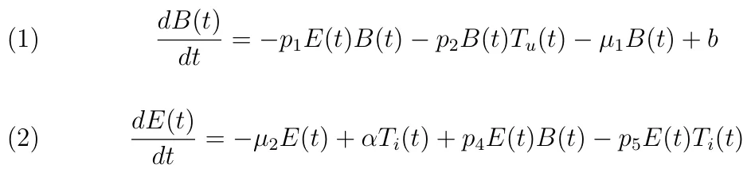

*BCG Immunotherapy PDE Modeling*

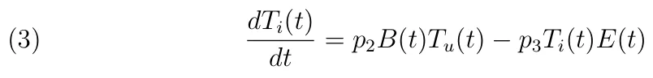

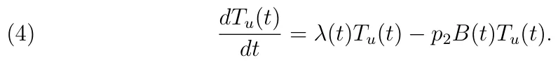

The state variables *B*(*t*), *E*(*t*), *T*i(*t*), and *T*u(*t*) represent the concentration of BCG in the bladder, effector cell population, tumor cell population that has been infected with BCG, and tumor cell population that is uninfected with BCG, respectively. The parameter *p*1 is the rate of BCG killed by effector cells; *p*2 is the infection rate of uninfected tumor cells by BCG; *p*3 is the rate of destruction of tumor cell infected by BCG by effector cells; *p*4 is the immune response activation rate; *p*5 is the rate of effector cells deactivation after binding with infected tumor cells. *α* is the growth rate of effector cell population; *λ* is the tumor’s population growing rate; *b* is the strength of BCG instillation.

Several attempts of modeling the problem have taken under consideration only the population’s size of different cells in the system over time, based on the biological dynamic of the system using Ordinary Differential Equations (ODEs) [6], [7]. One approach to improve the model is taking under consideration an approximation of the geometry configuration of the bladder in the mathematical modeling yielding in Partial Differential Equations (PDEs). The PDEs Model’s parameters sensitivity and solution’s stability for given parameters is the main focus of this paper. We combine numerical calculations with computer vision algorithms to find the PDE’s model solution’s stability for a non-Lyaponov PDE system.

## 2 Mathematical modeling and numerical analysis

The mathematical model differs from the Bunimovich-Mendrazitsky et al. [16] model by taking under consideration the geometrical configuration of the human bladder. The new model can be described by the following system of PDEs:

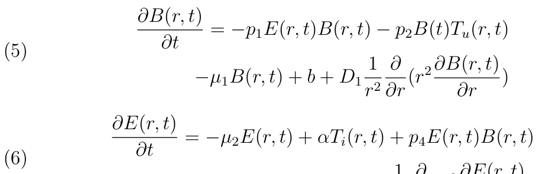

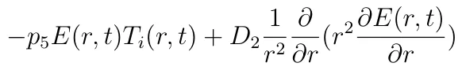

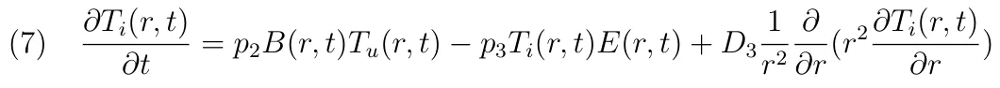

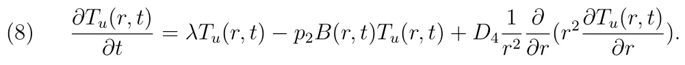

All the variables with the same notation and meaning as described in equations (1), (2), (3), (4). *D*1*, D*2*, D*3*, D*4 are the diffusion rate in the system for *B*(*r, t*), *E*(*r, t*), *T*i(*r, t*), and *T*u(*r, t*) respectively. The variable *t* stands for the time of the system and *r* stands for the euclidean distance in R3 from the point (0*,* 0*,* 0) in polar coordinates. The center of the system’s geometry is defined to be (0*,* 0*,* 0).

In the scope of this paper it will be assumed that the bladder has a form of a perfect sphere ring satisfying the following condition:

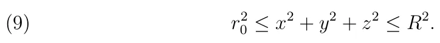

The variables *x*, *y*, *z* are the *Cartesian* coordinates system, *r*0 and *R* are the radius of the internal and external spheres of the geometrical configuration, respectively. We ignore the three tunnels connected to the approximately ellipsoidal shape of the bladder’s epithelium and approximate the ellipsoidal shape with a sphere shape.

The PDE system differs from the ODE system in two ways: 1) the PDE model adds another dimension (*r*); 2) the PDE model takes under consideration the geometry of the problem, and the diffusion factor added to each population, respectively. Figure (1) is a schematic view describing the interactions between the model’s variables, viewed as compartments. BCG (*B*)

<figure id="fig-1">
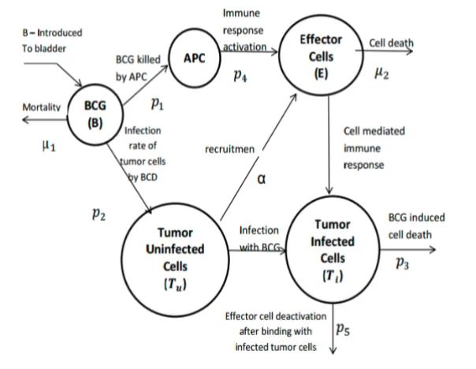
<figcaption>Figure 1: Cell population dynamics in the bladder.</figcaption>
</figure>

stimulates effector cells (*E*) of the immune system via APC activation. In addition, BCG infects uninfected tumor cells (*T u*) which recruit effector cells into the bladder. Infected tumor cells (*T i*) are destroyed by effector cells.

The inner sphere boundary condition is given to be:

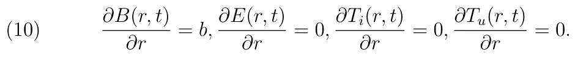

The initial condition is assumed to be:

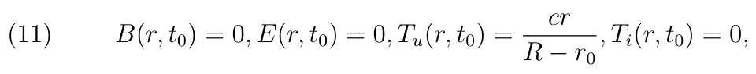

where *c >* 0 is the tumor cells distribution factor.

### 2.1 Biological border and start conditions

The boundary condition of the external sphere is unknown. It is assumed that naturally the cell population spread over time satisfies diffusion equations. Therefore, one can find the boundary condition of the external sphere by reverse engineering of the values that best satisfy the known start conditions and internal boundary sphere conditions. Algorithm (1) addresses this problem.

**Algorithm 1** Find external sphere boundary conditions

- 1: **procedure** ExternalBoundary(*startConditions, internalBoundaryCondition*) *▷* The external sphere boundary conditions
- 2: sample uniformly points from the inner and outer sphere and mark as P
- 3: *i ←* 1
- 4: **while** start condition not satisfied **do**
- 5: *t*start *← t*0 *− i*
- 6: run diffusion equations with system’s start conditions and internal boundary condition at *t*start and the points *P*

7: *i ← i* + 1

- 8: **return** *P*

### 2.2 Numerical analysis

- *▷* The external boundary conditions

The set of equations can be classified as a set of nonlinear, second order, partial differential equations from R2 to R4, where R2 is the space of time (marked by *t*) and radial distance from the center of the bladder’s geometry configuration (marked by *r*) and R4 is the populations’ counts of all four populations (marked by *E, B, T*i*, T*u). In such case, it is possible to use Galerkin-Petrov’s method [17] taking the form

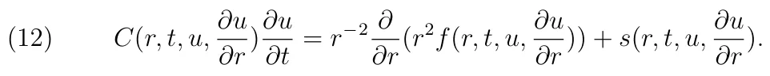

This method is a numerical process allowing to retrieve the populations’ size of all four cell populations given the start condition, boundary condition, and equations (5), (6), (7), (8).

The calculation has been performed on a software by *Matlab* (version 2012b) using the *pdepe* method [17]. Few tests have been conducted to examine the results and differences between the ODE model and the PDE model.

In Figure (2) the x-axis represents the time that has been passed from the beginning of the treatment in weeks and the y-axis is the size of the cell population. This graph averages a thousand of iteration results in order to reduce the error which inherently takes place in numerical calculation. One can notice a reduction in the cancer cell population decrements over time reflecting the effect of the treatment. Furthermore, the decrements of the BCG infected cell in the first graph can be explained by the fact that the BCG is injected into the system in the same place, but the immune system increases its effort to fight the disease as described in the second graph (E) which in turn leads to a decrease in the BCG infected cell population.

<figure id="fig-2">
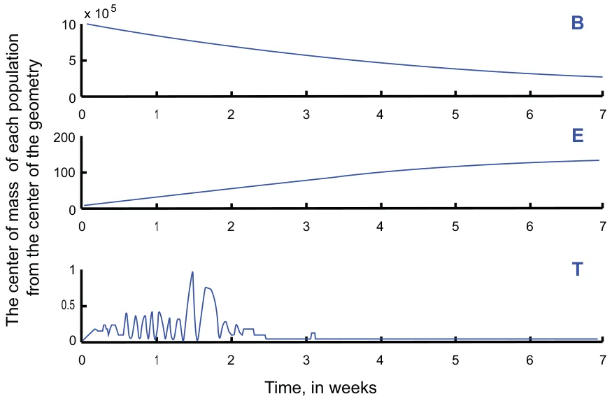
<figcaption>Figure 2: Cell population over time.</figcaption>
</figure>

The PDE model provides further understanding of the system as its predicts the population size to be two orders of magnitude bigger than the original ODE model prediction. A Pearson correlation between each individual population size between the ODE and the PDE models provides poor results showing that there is no linear correlation between the models and they provide different predictions for the system. On the other hand, the difference between the models converges to a constant for all the cell population after the fifth week, basically indicating a correlation which converges to one between the ODE and PDE models in long enough treatments.

Figure (3) shows the deltas in the different populations between the two models when the x-axis is the time passed from the beginning of the treatment in days and the y-axis is the difference between the sizes of the cells populations.

<figure id="fig-3">
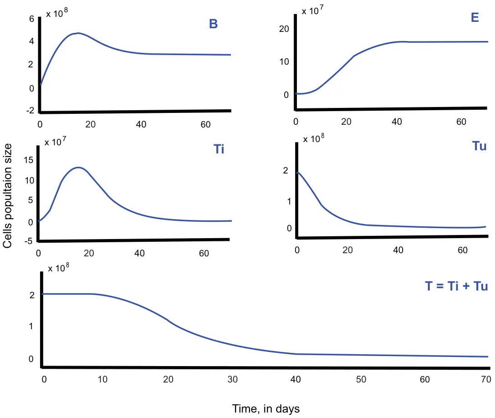
<figcaption>Figure 3: Delta in cell population over time between the ODE and PDE models.</figcaption>
</figure>

## 3 PDE model parameters sensitivity analysis

The numerical calculation of the PDE allows to analyze the system’s sensitivity to different parameters. The first parameter is the influence of the insert rate of BCG into the bladder (*b*). From clinical experiments [16], it is known that *b ∈* [105*,* 107]. The *least squares* [18] analysis method has been used to calculate the effect on the system’s output. Note that [*t*i]70 *∈* [0*,* 70] 0 such that *∀i* : ∆(*t*i+1 *− t*i) = *c*. The function family used to approximated the real function is:

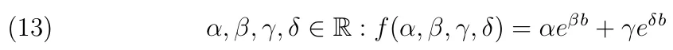

The algorithm to calculate function *f* which minimizes the sum of the square of the errors between the function value and model’s value is:

**Algorithm 2** Find best fitting function to parameter’s behavior 1: **procedure** PdeLeastSquares(PDE model, boundaries, *f*, *h*) 2: *▷f* is the approximation function and h is the sample step size 3: *T ←* empty list 4: *i ←* 0 5: *b ← boundaries*[0] 6: **while** b ¡ boundaries[1] **do** 7: *t*start *← t* + 0 *− i* 8: *T* [*i*] *←*solve(PDEmodel) 9: *R*2[*i*]*, T* [*i*] *←*LeastSquaresFit(*t, T* [*i*], normal distribution)) 10: *b ← b* + *h* 11: *i ← i* + 1 12: *R*2, bestModel *←* LeastSquaresFit([boundaries[0], boundaries[1], h], T, f) 13: **return** *bestModel*

Running the algorithm given a sampling step in the size of 107−105 = 990 104 provides the following results:

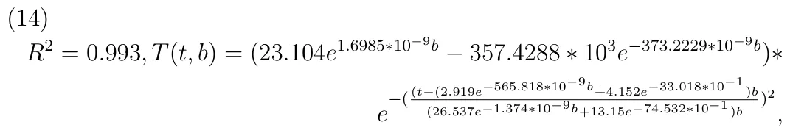

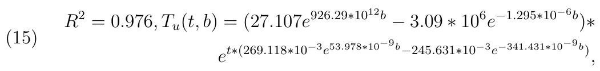

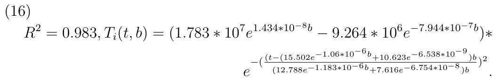

<figure id="fig-4">
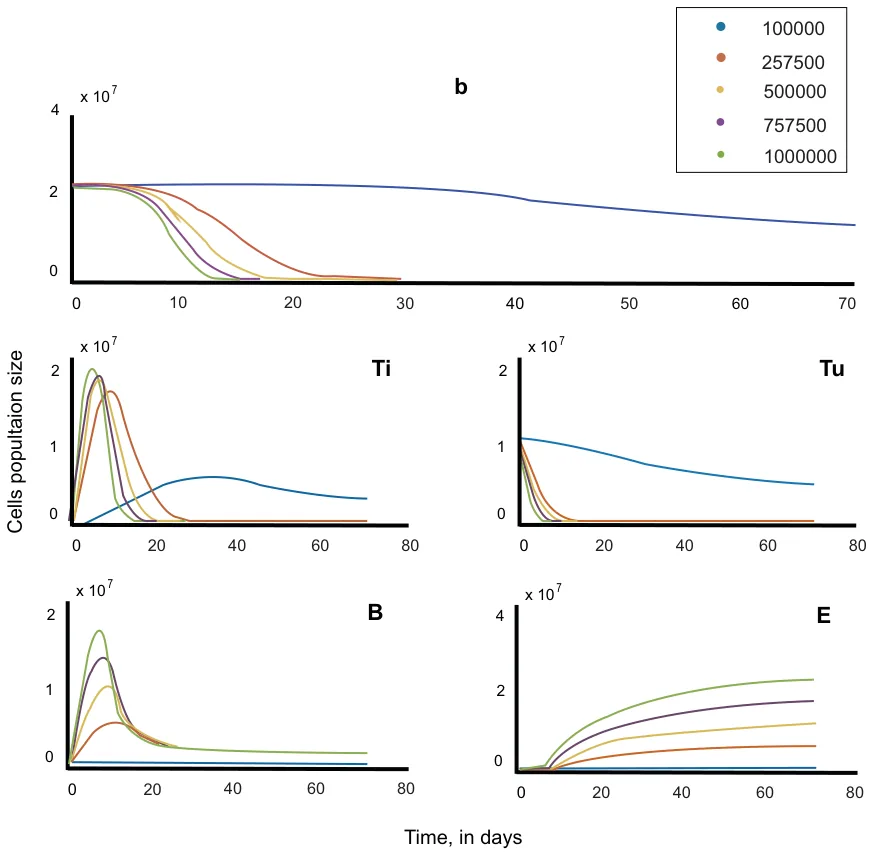
<figcaption>Figure 4: Cell population over time with respect to the BCG injection rate.</figcaption>
</figure>

Figure (4) shows at the x-axis the time passed from the beginning of the treatment in days and at the y-axis the cell population size; each color represents different amount of BCG injection rate (*b*) in the system. A smaller *b* produces a smaller BCG infected population (*B*) and also a smaller effector cell population (*E*). The decrease in the tumor cell population (*T*) over time has a lower rate for smaller *b*. Not enough injected BCG can even produce the unwanted result that tumor cell population decrements will not reset at the end of the treatment. On the other hand, bigger *b* produces a higher peak around the end of the first week of the treatment risking the penitent immune system.

To approximate the influence function of parameter *b*, the *least square* analysis method can be used again with function (13). From clinical experiments [16] it is known that this treatment is reasonable when *T*u(*t*0) *∈* [2 *∗* 105*,* 3 *∗* 109]. Running algorithm (2) provides the following results:

<figure id="fig-5">
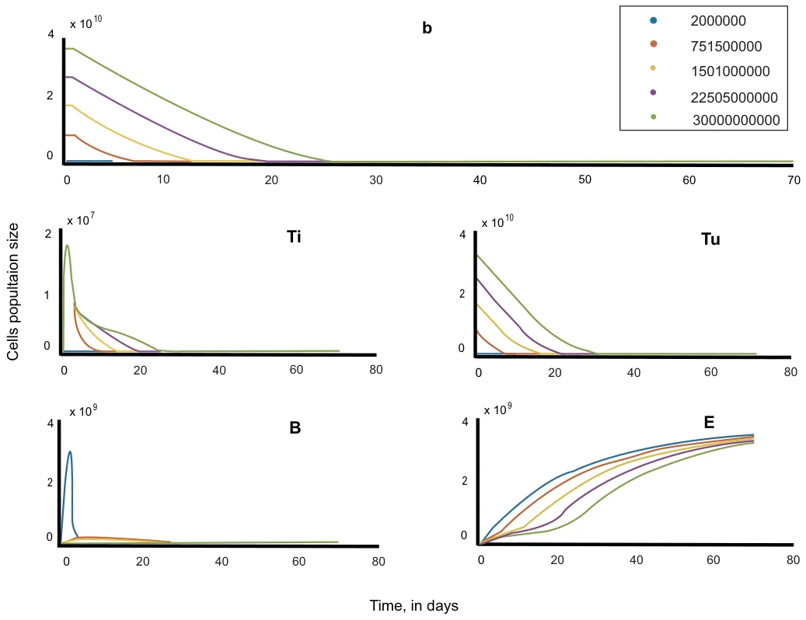
<figcaption>Figure 5: Cell population over time with respect to the cancer cell population size (<em>T</em>u(<em>r, t</em>0)) at the beginning of the treatment.</figcaption>
</figure>

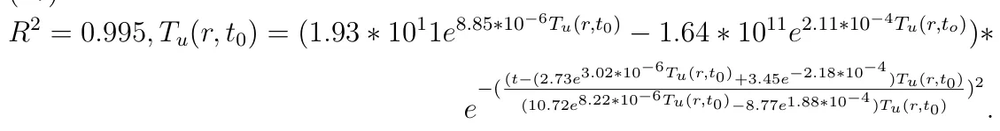

Figure (5) shows at the x-axis the time passed from the beginning of the treatment in days and at the y-axis the cell population size; each color represents different *T*u(*t*o) in the system. A smaller *T*u(*t*o) produce faster treatment time. In addition, very small *T*u(*t*o) without correlated *b* may result in risky peak in the first few days of the treatment.

## 4 PDE model solution’s stability analysis

The PDE does not satisfy the conditions needed to use Lyapunov’s stability analysis method. On the other hand, the numerical calculation of the system does not diverge to infinity. One can analyze the image of the dynamics of the system by solving the PDE for given parameters. Such analysis will allow to find a function *g*(*T*u*, BCG, time*) *→{*0*,* 1*}* when the source space contained in R3 and the image space is exactly *{*0*,* 1*}*. This allows to set the start condition of the problem and to find whether the treatment will succeed or not without the need to solve the PDE from scratch each time.

Calculating an approximation to the function *g* first requires to sample the parameter’s space. There are six parameters affecting the system: *t*, *BCG*, *T*u, *C*1, *C*2, *C*3 when *C*1*, C*2*, C*3 *∈* R+ are thresholds of the three population sizes *T, B, E*, respectively, depending if the treatment succeeded or not. Assume there are lower and upper boundaries from biological experiments for the parameters yielding a compact parameter’s set. This is because the set is complete as a sub-set of R6 and bounded. Assuming the solution is continuous and can be restored from discrete sampling, define *h ∈ ,* 1 *≫ h* such that *h* is the size of sampling step.

**Algorithm 3** Sample the PDE’s image space of function *g* **procedure** PdeImageSampling(*P DEmodel, B, C, h*)*▷* B is an array of boundries, C is an array of thresholds and h is the sample step size *output ← zeros*(*B*[0][0]*, B*[0][1]*, B*[1][0]*, B*[1][1]*, B*[2][0]*, B*[2][1]) **while** *i ∈* [*B*[0][0]*, B*[0][1] **do while** *j ∈* [*B*[1][0]*, B*[1][1]] **do while** *k ∈* [*B*[2][0]*, B*[2][1]] **do** *s ←*solve(PDEmodel(*i, j, k*)) **if** *s*[0] *< c*1 and *s*[1] *< c*2 and *s*[2] *< c*3 **then** *output*[*i*][*j*][*k*] *←* 1 **EndIf return** *output*

Figure (6) presents the results of algorithm (3) using the average values of all the parameters in the system. Using the output of algorithm (3) one can extract the border pixels. In this case, a border pixel is a pixel with neighbor pixels from in the case the treatment succeeded (blue pixels) or in the case is did not succeeded (red pixels). Algorithm (4) preforms such a

<figure id="fig-6">
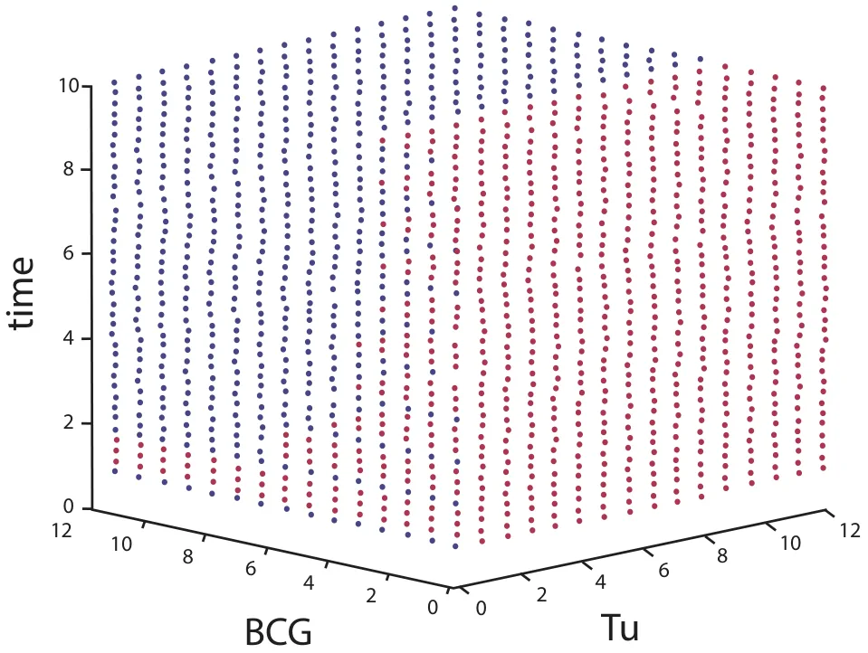
<figcaption>Figure 6: Discrete sampling of the PDE’s image space. Blue pixels represent a successful treatment and red pixels represent an unsuccessful treatment.</figcaption>
</figure>

- 14 *T. Lazebnik, S. Yanetz, S. Bunimovich-Mendrazitsky, N. Aaroni*

task.

**Algorithm 4** Finding the border pixels in 3d Boolean tensor

**procedure** FindBooleanTensorBorder(*M, B*)

*▷* M is a 3d boolean tensor and B is an array of boundries **while** *i ∈* [*B*[0][0]*, B*[0][1] **do while** *j ∈* [*B*[1][0]*, B*[1][1]] **do while** *k ∈* [*B*[2][0]*, B*[2][1]] **do if** *M*[*i*][*j*][*k*] = 1 and *sum*(*M*[*i−*1 : *i*+1][*j −*1 : *j* +1][*k −*1 :

*k* + 1]) *<* 27 **then**

*M*[*i*][*j*][*k*] *←* 2 **EndIf**

**return** *M* One can take advantage again of the *least squares* analysis method to find an approximation to the function describing the border between the two cases. We assume the model is as follows:

#### (18)

*F* (*x, y*) = *a*1*sin*(*x*) + *a*2*cos*(*x*) + *a*3*sin*(*y*) + *a*4*cos*(*y*) + *a*5*sin*(*x*)*cos*(*y*) + *a*6*sin*(*y*)*cos*(*x*) +*a*7*sin*(*x*)*sin*(*y*) + *a*8*cos*(*x*)*cos*(*y*)*.*

This results in an approximation as shown in Figure (7).

This produces the following models for both the PDE and the ODE models, respectively:

#### (19)

*F*pde(*x, y*) = 2*.*644*sin*(*x*) + 3*.*904*cos*(*x*) + 9*.*636*sin*(*y*) + 8*.*931*cos*(*y*) *−* 8*.*544*sin*(*x*)*cos*(*y*) *−*2*.*607*sin*(*y*)*cos*(*x*) *−* 1*.*266*sin*(*x*)*sin*(*y*) *−* 9*.*393*cos*(*x*)*cos*(*y*)

#### (20)

*F*ode(*x, y*) = 2*.*433*sin*(*x*) + 4*.*446*cos*(*x*) + 10*.*111*sin*(*y*) + 7*.*971*cos*(*y*) *−* 9*.*022*sin*(*x*)*cos*(*y*) *−*2*.*944*sin*(*y*)*cos*(*x*) *−* 2*.*076*sin*(*x*)*sin*(*y*) *−* 8*.*331*cos*(*x*)*cos*(*y*)

Using equations (19), (20) it is possible to predict the needed time (if it exists) so the tumor cell population size is small enough *T* (*t, r*) *< C*1 on one hand and the effector, BCG-infected cell populations sizes are not growing to large *B*(*t, r*) *< C*2*, E*(*t, r*) *< C*3 on the other hand, yielding a successful treatment, given only the tumor’s initial cell population size and the BCG injection rate. Figure (8) shows the approximated function (20) in yellow on top of the border pixels in green, approximating the border with *R*2 = 0*.*918.

<figure id="fig-7">
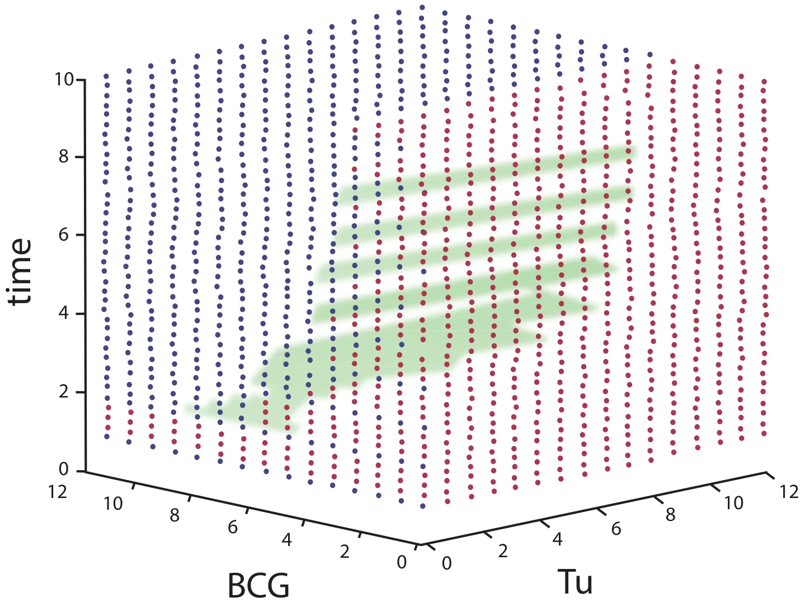
<figcaption>Figure 7: Discrete sampling of the PDE’s image space. Green pixels represent border pixels.</figcaption>
</figure>

<figure id="fig-8">
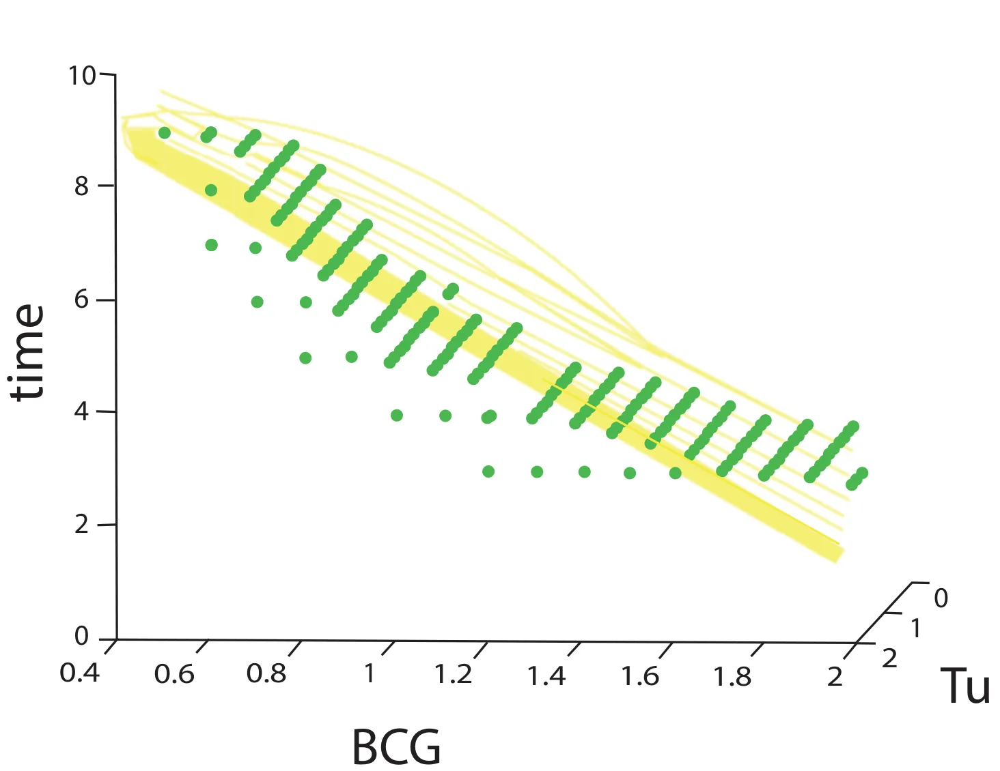
<figcaption>Figure 8: Approximation of the border’s function using least squares method. Function (20) is presented as the yellow plot. The green pixels are the border pixels found by algorithm (4).</figcaption>
</figure>

## 5 Conclusions and future work

It is safe to claim that mathematical modeling is a useful tool for studying the mechanism of tumor growth and response to therapy. The use of numerical simulation of complex mathematical models that is not yet analytically solvable can help predict the outcome of a treatment and determine better therapeutic protocols. As population analysis is a common way of describing such systems [8], [9], [10], it is important to add the geometrical configuration of the problem into the dynamics since the system parameter values vary across different geometries.

Bifurcation analysis of the mathematical model considered in this paper was not previously available because the numerical methods developed for bifurcation analysis require continuous vector fields. We found that PDE representation in bladder cancer treatment with BCG provides more accurate predictions to observations done in vitro in mice and humans than the ODE representation. As can been observed from Figure (3), the delta between the ODE and PDE model in all cell population sizes are in a factor of 100, where the PDE model’s predictions better fits previous observations in respect to the ODE model’s predictions [16].

On the other hand, after five weeks of treatment, the delta between the models converges to a constant for each population function (*E, B, T*i*, T*u) and basically indicates a complete linear correlation between the ODE and PDE models (*R*2 *→* 1).

The difference between the models is initially associated with the introduction of the geometry reflected in the diffusion coefficients introduced into the dynamics of the system. In fact, from the very beginning there is a disagreement between the models: for PDE there is diffusion dynamics, and for ODE there is an instant reaction to the introduction of BCG. After diffusion spreads throughout the space, it behaves like an instantaneous response, and therefore the ODE and PDE models ultimately work identically, as can be seen from the calculation of the delta between the models.

This study develops a numerical method for the stability analysis of PDE’s solutions of a mathematical model with pulsed BCG immunotherapy based on well-known algorithms from the field of computer vision. We can make few clinical conclusions based on analysis of function (20): 1) BCG injected with a rate smaller then sixty thousand cells almost does not have an effect. 2) In the case of bladder cancer when there are 10 percent or less cancer cells from the overall population and BCG is injected at a rate of eighty thousand cells then the cancer can be cured in ninety percent of the cases for a treatment that is given between eight and ten weeks. 3) There is a strong linear correlation between the amount of BCG injected and the time of the treatment in the successful cases when the cancer’s cell population is around five percent of the overall cell population at the beginning of the treatment.

## References

1. Jemal A., Bray F., Center M. M., Ferlay J., Ward E., Forman D., Global Cancer Statistics, CA:A Cancer J. for Clinicians 61, 2011, 69–90.
2. Morales A., Eidinger D., Bruce A.W., Intracavity Bacillus Calmette- Guérin in the treatment of superficial bladder tumors, J. Urol., 116, 1976, 180-183.
3. Guzev E., Halachmi S., Bunimovich-Mendrazitsky S., Additional extension of the mathematical model for BCG immunotherapy of bladder cancer and its validation by auxiliary tool, International Journal Of Nonlinear Sciences And Numerical Simulation, 2019.
4. Byrne, H.M., Dissecting cancer through mathematics: from the cell to the animal model, Nature Reviews Cancer, Vol. 10(3), 2010, 221-230.
5. Kuznetsov V.A., Makalkin I.A., Taylor M.A., Perelson A.S., Nonlinear dynamics of immunogenic tumours: parameter estimation and global bifurcation analysis, Bull. Math. Biol. 56, 1994, 295–321.
6. Kim J.C., Steinberg G.D., The limits of bacillus Calmette–Guerin for carcinoma in situ of the bladder, J. Urol. 165(3), 2001, 745–56.
7. Castiglione F., Piccoli B., Cancer immunotherapy, mathematical modeling and optimal control, J. Theor. Biol. 247, 2007, 723–732.
8. De Pillis L.G., Gu W., Radunskaya, A.E., Mixed immunotherapy and chemotherapy of tumors: modeling, applications and biological interpretations, J. Theor. Biol. 238, 2006, 841–862.
9. Kirschner D., Panetta J.C., Modeling immunotherapy of the tumor–immune interaction, J. Math. Biol. 37, 1998, 235–252.
10. Panetta J.C., A mathematical model of periodically pulsed chemotherapy: tumor recurrence and metastasis in a competitive environment, Bull. Math. Biol. 58, 1996, 425–447.
11. De Pillis L.G., Radunskaya A.E., Wiseman C.L., A validated mathematical model of cell-mediated immune response to tumor growth, Cancer Res. 65(17), 2005, 7950–7958.
12. Bunimovich-Mendrazitsky S., Pisarev V., Kashdan E, Modeling and simulation of a low-grade urinary bladder carcinoma, Computers in Biology and Medicine, 58, 2015, 118-129.
13. Bunimovich-Mendrazitsky S., Goltser Y, Use of quasi-normal form to examine stability of tumor-free equilibrium in a mathematical model of BCG treatment of bladder cancer, Math. Biosci. Eng., 8, 2011, 529-547.
14. Nave O., Hareli S., Elbaz M., Iluz I.H., Bunimovich-Mendrazitsky S., BCG and IL2 model for bladder cancer treatment with fast and slow dynamics based on SPVF method—stability analysis, Mathematical Bio-sciences and Engineering (MBE), 16 (5), 2019, 5346-5379.
15. Shaikhet L., Bunimovich-Mendrazitsky S., Stability analysis of delayed immune response BCG infection in bladder cancer treatment model by stochastic perturbations, Computational And Mathematical Methods In Medicine, 2018.
16. Bunimovich-Mendrazitsky S., Shochat E., Stone L., Mathematical model of BCG immunotherapy in superficial bladder cancer. Bull. Math. Biol. 69(6), 2007, 1847-1870.
17. Skeel, R. D., Berzins M., A Method for the Spatial Discretization of Parabolic Equations in One Space Variable, SIAM Journal on Scientific and Statistical Computing, Vol. 11, 1990, 1–32. 20 T. Lazebnik, S. Yanetz, S. Bunimovich-Mendrazitsky, N. Aaroni
18. Björck, Å., Numerical Methods for Least Squares Problems, SIAM Journal on Scientific and Statistical Computing, Book OT51, 1996.
