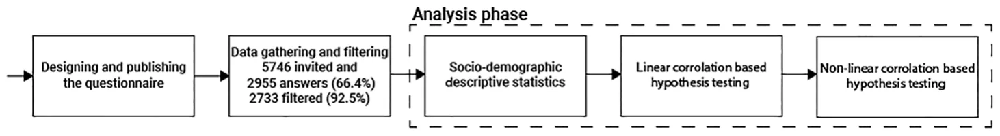

## Introduction

Public organisations are always called upon to deal with emergencies and crises (Boin and Bynander 2015; Kapuco and Van Mart 2006). Navigating such crises demands readiness before they unfold, as well as delivering services and solutions throughout and after their occurrence (Jones and Murphy 2009; Kapuco and Van Mart 2006; Moynihan 2008). Street-level bureaucrats (SLBs) are the frontline workers sent by public organisations to deal with emergencies and disasters (Henderson 2014). In addition to facing challenging new scenarios (Gofen and Lotta 2021), in many cases, they are also willing to risk their private property, their jobs or promotions, and even their lives for their clients (Cohen 2022). Their clients, usually unfamiliar with the practices needed to deal with crises, see them as the major authority for resolving the situation (Anderson 2022; Christensen, Fimreite, and Lægreid 2011). Some clients handle such events better than others. Unfortunately, emergences often inflict the greatest damage on those least prepared or able to deal with them (Bolin 2007; Underhill 2009).

Prior to the COVID-19 crisis, few studies focused on crises in SLBs’ workplaces (Gofen and Lotta 2021). The suddenness of the pandemic and the degree of urgency involved in dealing with it resulted in numerous studies about the impact of a crisis on the coping of SLBs and the importance of their preparedness in such times (see e.g., Brodkin 2021; Civinskas, Dvorak, and Šumskas 2021; de Boer, Schott, and Loyens 2024; Gofen and Lotta 2021). Crises are far-reaching emergencies that can significantly undermine SLBs’ work environment. Previous studies have revealed how SLBs faced with managing a crisis without prior specific preparation feel uncertain about how to respond (Davidovitz, Cohen, and Gofen 2021). Better preparedness can help them feel more confident and successful in coping with emergencies.

According to the Merriam-Webster dictionary, an emergency is “an unforeseen combination of circumstances or the resulting state that calls for immediate action.” Examples include large fires, natural disasters, epidemics, terrorist attacks, outbreaks of mass violence, and the collapse of the central infrastructure that may disrupt and even paralyse societies (Boin and ‘t Hart 2010). Thus, it is not surprising that the literature emphasises the importance of prior planning to help SLBs deal with such situations (Pedersen et al. 2016; Perry and Lindell 2003).

Furthermore, in such situations trust may play a major role. There are numerous definitions of trust, but we adopted Robinson’s (1996) definition, which describes trust as an individual’s “expectations, assumptions, or beliefs about the likelihood that another’s future actions will be beneficial, favourable, or at least not detrimental to one’s interests” (p. 576). Therefore, we focused on SLBs’ expectations, assumptions, and beliefs regarding the future operations of their organisations and their trust in their superiors and colleagues. These factors inform their assessments of their organisations’ readiness for an emergency.

Trust is the basis of social interactions in organisations (Destler 2017). In uncertain times, trust can be a connecting thread within and between organisations (Schoorman, Mayer, and Davis 2007; Wolfe and Nix 2017). It can prompt SLBs to take risks and put themselves in a vulnerable position (Davidovitz and Cohen 2022a). However, to date there is little consideration of the factors that affect SLBs’ assessments of their organisations’ ability to deal with emergency situations. Furthermore, no research has focused on the weight of organisational trust in this context. To fill this gap, we explored the link between SLBs’ trust in their organisations and their perceptions regarding their organisations’ readiness for various emergencies.

To do so, we used a case study of how Brazilian police officers do their jobs. Brazil has one of the highest crime rates in the world and police officers are exposed to many dangerous situations (Alcadipani 2021). Based on previous research (Cohen et al. 2023; Henderson 2014), we claim that, due to the dangerous and violent situations to which these police officers are exposed, they work in a constant state of emergency.

Our research makes several contributions to the implementation literature. First, it emphasises the need for emergency preparedness for the optimal implementation of policies on the frontline to deal with such situations. Second, we demonstrate the decisive role of SLBs’ trust in their assessments about their organisation’s emergency preparedness. Third, we show that for police officers to be willing to deal with emergencies, they must trust those with whom they work. Finally, we make recommendations for helping organisations improve the trust that their SLBs have in them, which should increase the SLBs’ willingness to deal with emergencies.

## Literature review

### Emergencies and SLBs’ trust

Welfare agents, educators, health workers and law enforcement officers are all examples of SLBs - public professionals who implement public policy through daily interactions with citizens to whom they provide public services. As public servants on the frontlines of public administration, SLBs have a crucial role as the face of the state in dealing with emergency situations (Henderson 2014). They provide an initial response to such situations (Frenkel et al. 2021; Gofen and Lotta 2021) and help meet people’s needs in uncertain and risky circumstances. Therefore, the readiness of these workers for emergency situations is particularly important.

Although such emergencies are rare, their consequences for people, property, the environment, and society are enormous (Sommer, Njå, and Lussand 2017) and therefore require optimal preparation (Boin and ‘t Hart 2010). Studies have reported how extreme conditions add to the uncertainty and risks of SLBs’ work (Brodkin 2021; Davidovitz et al. 2021; Møller 2021; Lavee 2021), which involves organisational and political pressures and ever-increasing demands from clients (see e.g., Hupe and Buffat 2014; May and Winter 2009; Cohen 2021).

The uncertainty and insecurity arising from emergencies underscore the need for SLBs’ trust in the institutions in which they operate. Trust involves the willingness to be in a position of vulnerability vis-a-vis another party who might harm them. Rousseau et al. (1998) defined trust as “a psychological state comprising the intention to accept vulnerability based upon expectations of the intentions or behaviour of another” (p. 395). Trust is based on the assessment of qualities such as honesty, reliability, integrity, and the good intentions of the party toward whom the trust is directed (Moye, Henkin, and Egley 2005). Hence, trust is considered a core component of effective working relationships (Colquitt, Scott, and LePine 2007) and promotes open communication and information sharing (Kramer 1999).

Trust is a critical element in the work of public servants (Bouckaert 2012; Zhang, Li, and Yang 2022) and of SLBs (Davidovitz and Cohen 2022a; Destler 2017; Raaphorst and Van de Walle 2018; Spink, Lotta, and Burgos 2021). Although the public administration literature generally deals with trust from the perspective of citizens, previous studies have emphasised the importance of public employees’ trust in various factors as the basis for a better understanding of public policy outcomes (see e.g., Yang 2006).

Moreover, trust has the potential to improve the effectiveness and management of public officials (Boateng and Cox 2016; Favero, Meier, and O’Toole 2016). It can also incentivise coordination among various stakeholders within the public sector and mitigate transaction costs, which often pose significant barriers in administrative systems (Robbins 2012). These dynamics assume particular significance in emergencies when citizens’ trust in the authorities is pivotal for ensuring their cooperation (Christensen, Lægreid, and Rykkja 2016; Jung, Song, and Park 2019).

For SLBs, organisational trust is especially critical. They must implement policies in work conditions that are far from optimal (Thomann 2015). Their interactions with their managers and colleagues are critical to understanding their behaviour (see e.g., Evans 2011; Keulemans and Van de Walle 2020; Oberfield and Incantalupo 2021). Therefore, SLBs who trust their organisations may feel that they can exercise their discretion in implementing policies, because their organisations will likely back their decisions (Davidovitz and Cohen 2022a).

In particular, SLBs’ trust in their colleagues and their managers shapes their behaviour (Cohen et al. 2024; Destler 2017). In emergencies, when SLBs must act together to find effective solutions to sudden events, this trust is especially critical. Studies have underscored the role of factors such as managers’ care about the safety and security of their employees, their commitment to acting with good intentions, and their professionalism, honesty, and openness in gaining the trust of those who work for them (Kramer 1999; Schoorman et al. 2007). Trust is also reciprocal (Serva, Fuller, and Mayer 2005). When SLBs trust their managers, their managers will likely trust them, evident in the degree of latitude the latter gives their SLBs in implementing policy. This is critical in emergency situations, where decisions are dynamic and instinctive and fraught with uncertainty. The SLBs’ trust in their managers naturally shapes their feelings about the organisation in which they work (Mishra and Morrissey 1990).

Based on these studies, we posit that SLBs who feel that their organisations are prepared to deal with emergencies are more likely to trust their organisations. Similarly, SLBs who trust their organisations are more likely to feel that they are prepared to deal with emergencies. Research has provided evidence suggesting a positive relationship between more trust in government and individual preparedness for dealing with various types of hazards (Choi and Wehde 2024). Therefore, we claim that there might also be a connection between SLBs’ trust in their organisations and their perceptions about their organisations’ emergency readiness.

### Street-Level Bureaucrats’ trust in their organizations, superiors and peers and organizational readiness for emergencies

Emergency preparedness involves planning, training and physical activity, and the purchase of equipment to help manage the emergency (Gillespie et al. 1993; Perry and Lindell 2003). Most organisations have a detailed written plan for training and exercises to deal with emergencies. Such plans are constantly updated as threats change and new responses are needed (Perry and Lindell 2003). Pedersen et al. (2016) noted that successful training leads to a better understanding of the SLBs’ roles and tasks during the operation, which may reduce their psychological distress during and after the operation and even help in future disaster operations. Given that emergency preparedness is particularly relevant for SLBs who must implement government policies during emergencies, understanding the factors that shape their sense of emergency preparedness is particularly important. We argue that organisational trust may play a role in this context.

Research emphasises that trust in one’s organisation is a normative phenomenon (Gilbert and Tang 1998; Legood, Thomas, and Sacramento 2016). According to Nyhan and Marlowe (1997), organisational trust involves the belief that one’s organisation and its leaders can accomplish its objectives by creating an intra-organisational value chain that is both horizontal and vertical. Such a value chain is particularly relevant to public sector employees (Perry and Mankin 2007). According to Nyhan’s (2000) findings, in public sector organisations, trust-based models increase interpersonal trust, commitment, and productivity.

Organisational trust plays a major role in how street-level organisations operate. For example, in the field of education, research has established that certain elements of the organisational climate such as trust among colleagues and support from supervisors have a stronger influence on some performance behaviours than others (Destler 2017). Davidovitz and Cohen (2022a) reported that SLBs’ distrust in rule makers, which is directly related to trust in intra-organisational actors, plays a role in their tendency to deviate from existing policies and adopt strategies to protect themselves.

Organisational trust is a direct derivative of employees’ trust in their managers. According to some authors, it is the leader of an organisation who creates an environment that promotes trust (Shaw 1997). Trust is mentioned as the factor most identified with transformational and transactional leadership styles. Leaders who use these styles behave in ways that help them gain trust, which in turn, leads to desirable outcomes for managers (Dayan, Di Benedetto, and Colak 2009; Podsakoff et al. 1990). Mishra and Morrissey (1990) noted that trust between managers and employees leads to trust in the organisation, increasing its efficiency and credibility, and as a result, the loyalty of its customers. We argue that emergency preparedness may also be relevant to the trust between colleagues in street-level organisations. Employees’ trust in their colleagues is not necessarily related to employees’ trust in their supervisors (Nedkovski et al. 2017). Trusting relationships with colleagues build the foundation for mutual support and collective conscience among the rank and file. Prior studies have shown that employees who trust their coworkers are more likely to pay attention to their tasks. As Geller (1999) argued, a high degree of interpersonal trust between coworkers is necessary to have a successful feedback process and to use advanced behaviour-based observation.

### Organisational trust among police officers

Individuals who anticipate potential emergency situations in the future are inclined to place their trust in emergency organisations. Heightened feelings of threat and fear amplify vulnerability and uncertainty, prompting individuals to seek trustworthy sources of information (Jung, Song, and Park 2019; Perry 2007). Public organisations, such as police organisations, are frequently called upon to manage emergencies and crises. Similarly, SLBs who work in emergency professions must trust their peers because they put their lives in their hands (Varvel et al. 2007). Given the degree of uncertainty in their work, police officers must trust each other to support and defend one another when they are on duty (Ralston and Chadwick 2010). Due to the hazardous and violent conditions they face, these police officers often operate in a state of emergency. It is almost self-evident that in such organisations there is a culture of cohesion and mutual trust between colleagues (Varvel et al. 2007). Police officers’ previous experiences with these situations indicate their ability to trust their colleagues. Assuming they trust their peers, we posit that such trust will be related to their sense of being ready to deal with emergencies.

Trust in the organisational context is particularly critical for police officers, who are the focus of our study. Like other types of SLBs, police officers routinely operate in emergency situations (Sommer et al. 2017). Given that risk, vulnerability, and danger are inherent elements in their work (Sherwood et al. 2019; Van Craen 2016), trust in organisational actors is a significant motivator in doing their jobs (Wolfe and Nix 2017). Such trust is critical specifically regarding their peers, on whom they rely to help and support them when dealing with dangerous situations (Ralston and Chadwick 2010). Their commanders are authority figures who they are required to obey. However, the officers’ trust in their peers might help them obey their commanders, increasing the legitimacy of the latter’s instructions and the officers’ sense that they have the support of their commanders (Wolfe and Nix 2017). Nevertheless, when their commanders violate this trust, the officers can lose faith in them. As previous literature shows, a breach of trust can lead to feelings of betrayal and significantly influence future behaviour towards the party responsible for the breach. Such breaches of trust can have far-reaching, often long-term, and even irreversible consequences for the success of the relationship. Trust is fragile and vital to maintaining healthy relationships (Davidovitz and Cohen 2023; Kramer 1999). As van Engen et al. (2016) explained, public professionals’ earlier experiences with government policies will affect their current predisposition toward policies in general. These factors become extremely significant when making split-second decisions during a emergency, decisions that can endanger the police officers’ lives or the lives of the citizens they serve.

Indeed, research has identified trust as a major motivator in the willingness of police officers to risk their lives (Cohen 2022). The opposite is also true. Lack of trust in supervisors leads to a decline in organisational commitment (Wolfe and Nix 2017). Since trust involves the willingness of police officers to take risks in their work (Schoorman et al. 2007), and risk is a common feature of their work routine and certainly in emergency situations (Sherwood et al. 2019), it is reasonable to assume that when police officers trust their organisation, they may trust it to be ready to deal with emergencies. In other words, given that trust is based on previous observations from which we can predict future behaviour (Schoorman et al. 2007), police officers’ previous positive experiences with the functioning of their organisation in high-risk situations in normal circumstances may predict the trust they have about the organisation’s functioning in an emergency.

There is a positive relationship between police officers’ trust and compliance with the dictates of their jobs. Such trust is based on previous observations of the behaviour of their superiors (Kramer 1999; Luhmann 2018). As prior studies have highlighted, when their commanders treat citizens equally, police officers learn that their commanders are benevolent and have good intentions, and therefore, trust them (Van Craen 2016). Moreover, watching how their commanders deal with emergency situations gives police officers an indication of the competence of their commanders, which is a critical element in trusting them (Kramer 1999). It is likely that they base their degree of trust in their commanders on this indication. Assuming that police officers trust their commanders, it is likely that they will feel that they can be trusted in extreme situations. Thus, we can infer that police officers’ trust in their commanders may be expressed in their sense of their organisation’s emergency preparedness.

Utilising these insights, we posit that:

**H1:** SLBs’ trust in their organisation is positively related to their perceptions of the emergency readiness of their organisation.

**H2:** SLBs’ trust in their commanders is positively related to their perceptions of the emergency readiness of their organisation.

**H3:** SLBs’ trust in their peers is positively related to their perceptions of the emergency readiness of their organisation.

***The context: The Brazilian state police*** To test these hypotheses, we conducted a study among the Brazilian State Police. Brazil is a federation composed of 26 states plus a Federal District where the country’s capital is located. Each state, as well as the Federal District, has two distinct police forces: the military police and the civilian police. While they are two separate agencies, the military police perform typical civil police duties.

According to the UN, Brazil is one of the most violent countries in the world. Data from the Forum Brasileiro de Segurança Pública Brazilian (Yearbook of Public Security 2022) show that in 2021, more than 47,000 people were violently killed and more than 6,000 were killed by the police. The latter figure is five times more than that for American police officers. The police reported more than 66,000 rapes in that period and more than 1.2 million cases of domestic violence. Brazil has many drug gangs and organised crime is a major issue. Therefore, police officers also face violent situations quite often, exposing them to permanent emergency situations. In 2021, 4% of them were shot while on duty, and 19.9% of them witnessed a colleague being shot. In 2021 alone, 121 police officers committed suicide. These data indicate that the Brazilian police constantly encounter emergencies during which they put themselves at risk and may use violence.

## Method

### Sample and procedure

To test our three hypotheses, we asked Brazilian police officers to report their perceptions about and attitudes toward emergencies, as well as their trust in their peers, commanders, and the police in general. Data were collected between August and October 2021 thanks to the cooperation of the Brazilian Forum of Public Security (FBSP). The FBSP distributed the questionnaire nationally to detectives and military police in various units, geographical areas, and ranks. All participants were assured anonymity.

Initially, the survey was sent to a list of 5,746 emails. This list was composed of police officers from the entire country who had attended previous activities of the Brazilian Forum of Public Security as well as contacts provided by the Ministry of Justice. In total, 4,448 SLBs accessed the survey and 2,955 completed it (response rate: 66.4%). Of them, we excluded those whose jobs had less in common with the work of police officers, such as members of the state penal police, and respondents with improbable or erroneous answers. As a result, our final sample consisted of 2,733 military police and detectives (92.5%). To minimise the risk of bias, we checked if the demographics of respondents were representative of the population.

Of the respondents, 2,297 were males and 436 females (18% in the sample, 16% in the population), with ages ranging from 21 to 68 (mean: 37.88 years). Most were married (73.4%); 20.71% were single, 5.56% divorced, and 0.33% widowed. Of the respondents, 65.17% had children. With regard to monthly income, 2.23% earned up to 3,000 reals, 51.99% earned 3,001 to 5,000 reals, 22.17% earned 5,001 to 8,000 reals, 7.57% earned 8,001 to 10,000 reals, 7.87% earned 10,001 to 15,000 reals, and 8.16% earned more than 15,001 reals (one Brazilian real is approximately $0.18). With regard to ethnicity, 66.01% were White (compared to 65% in the population), 28.14% mixed Black and White (29% in the population), 4.54% Black (5% in the population), 1.13% Asian, and 0.18% Indigenous (summing 1,5% in the population). As to religion, 54.88% defined themselves as Catholic, 1.94% as “non-Catholic Christian,” 6.92% as Spiritist, 11.96% as Traditional Evangelical, 6.77% as Pentecostal Evangelical, 10.35% as non-religious, 3.04% as “other,” and the rest (4.13%) preferred not to say.

### Measures and analysis

Figure 1 illustrates how we gathered our data and analysed it.

We asked the participants to indicate the degree to which they agreed or disagreed with the statements we presented on a Likert scale ranging from 1 = I totally disagree to 6 = I totally agree.

*Perceived readiness for emergency* was measured by the average of the responses to eight statements: "My organisation is well prepared to deal with crime", "My organisation is well prepared to deal with natural disasters", “My organisation is well prepared for a state of war”, “My organisation is well prepared to face criminal factions, militias and organised crime”, “My organisation is well prepared to handle biological, chemical or radiation hazards”, “My organisation is well prepared to deal with cyber terrorism”, “My organisation is well prepared to deal with pandemics”, and “My organisation is well prepared to face rebellions in the prison system”. While the routine duties of typical police work might not involve them dealing directly with cyber terrorism or war, these elements are integral to comprehensive emergency readiness. For example, police officers in Ukraine and Israel have recently been required to participate in wartime activities, despite these tasks falling outside their traditional organisational responsibilities.

<figure id="fig-1">

<figcaption><strong>Figure 1.</strong> The analysis phase.</figcaption>
</figure>

*Trust in the police in general* was measured by the statement: “I have great trust in the Brazilian police.”

*Trust in commanders within their organization* was measured by the statement: “I have a lot of trust in my police commander.”

*Trust in their peers* was measured by the statement: “I have a lot of trust in my co-workers.”

We conducted the analysis in three stages. Hence, there are three main independent variables in our study, corresponding to the three types of trust in our questionnaire, and indicated by T T T , , . In addition, we used secondary independent variables – age, gender, race, religion, 1 2 3 marital status, number of children, and salary, which are the most relevant individual characteristics for our study and help address potential common source bias. Our dependent variable is the organisation’s perceived readiness for dealing with emergencies, indicated by P.

First, we analysed a zero-order correlation to assess the internal relationships among the research variables. Second, a standard linear regression analysis was conducted to test for the effect of the independent variables on public trust in emergency organisations. Third, to explore the non-linear links between trust and the other sociological and demographic variables, we used recent machine-learning based methods. For each hypothesis, we created a machine-learning pipeline using the automatic machine learning approach (Hen et al. 2021; Lazebnik, Somech, and Weinberg 2022), utilising the Tree-Based Pipeline Optimisation (TPOT) library (Olson and Moore 2016). We chose to adopt an automatic machine learning approach as it is showing promising results finding efficient machine learning models in a wide range of tasks, in general, for in social science, in particular (Grimmer, Roberts, and Stewart 2021; Lazebnik, Fleischer, and Yaniv-Rosenfeld 2023; Oreški, Vušnjić, and Kadoić 2024; Singh and Joshi 2022; Vaccaro, Sansonetti, and Micarelli 2021; Waring, Lindvall, and Umeton 2020). The non-linear model is investigated in addition to the linear model is able to capture a more complex and high-order relationship inside our data (Kim 2008) and provide better predictive power compared to linear models (Leatherbarrow 1990; Maulud and Abdulazeez 2020; Shami and Lazebnik 2024).

We conducted the described statistical and machine-learning analyses using the Python (version 3.7.5) programming language (Van Rossum and Drake 2009). Due to the non-linear nature of the model, depending on the value range introduced to the model, each feature can be considered as a control as well as input for the prediction (Ij 2018). Data cleaning was not required for the analysis because we collected the information from a survey where each feature was categorical (ordinal, to be precise) and only surveys answered in full were included in the sample.

## Findings

Table 1 presents the descriptive statistics and Cronbach’s α for the research variables. It indicates that our respondents have rather low levels of trust in the police in general (Mean = 2.81, S.*D = 1*.52) and the commanders in their organisations in particular (Mean = 2.76, S.*D = 1*.51). On the other hand, they have more trust in their peers (Mean = 3.31, S.*D = 1*.54). Nonetheless, in all three cases, based on the large standard deviation in the answers, they have quite different views on the issue of trust. In addition, the statements used to measure the perceived readiness for emergency are well-defined, as indicated by the Cronbach’s α of 0 92 . . Here as well, the means reflect low levels of emergency readiness.

As Table 2 illustrates, the inter-correlations hold in the expected directions. The Pearson’s correlation between preparedness for emergencies and trust in the police in general and trust in peers, specifically, is statistically significant, supporting the first and third hypotheses. However, SLBs’ trust in their commanders is not significant. In addition, the results indicate that SLBs’ trust in peers and their trust in the police in general are correlated to each other. Thus, there is a link between trust in the organisation and trust in peers, as reflected in the perceived readiness for emergencies.

Table 3 presents the results of the linear correlation model’s parameters to test the independent variables on perceived organisational readiness for emergencies. It shows that most of our independent variables tested– trust in the organisation, in commanders, and in peers – are related to the SLBs’ perceptions about their organisations’ readiness for emergencies. We therefore conclude that trust is an important component in analysing the operation and management of the organisation in providing emergency services.

Our findings support H1 and H3. They indicate that two variables – trust in the organisation and trust in peers – have the strongest relationships with SLBs’ perceptions about the readiness of their organisations to deal with emergencies (R2 = .202, *p < .01*; R2 = .188, *p < .01*, respectively). However, the linear model does not support H2 that SLBs’ trust in their commanders has a positive relationship with their perceptions about their organisation’s emergency readiness. In addition, age and the SLBs’ income do not affect these perceptions. However, gender is the second most important factor in perceptions about the readiness of their organisations to deal with emergencies. Marital status and having children play a major role in these perceptions as well. Finally, SLBs with higher incomes and those who are older have more trust in the organisation and in their commanders.

<figure class="table-figure" id="table-1">
<figcaption><strong>Table 1.</strong> Descriptive statistics for the research variables.</figcaption>

<table><tr><th>Parameter</th><th>Statement</th><th>Mean</th><th>Standard deviation</th><th>Cronbach’s alpha</th></tr><tr><td>Perceived readiness for emergencies (P)</td><td>My organization is well prepared to face rebellions in the prison system</td><td>2.76</td><td>1.56</td><td>0.92</td></tr><tr><td></td><td>My organization is well prepared to deal with natural disasters</td><td>2.63</td><td>1.40</td><td></td></tr><tr><td></td><td>My organization is well prepared for a state of war</td><td>2.39</td><td>1.37</td><td></td></tr><tr><td></td><td>My organization is well prepared to handle biological, chemical or radiation hazards</td><td>2.08</td><td>1.26</td><td></td></tr><tr><td></td><td>My organization is well prepared to deal with cyber terrorism</td><td>2.04</td><td>1.21</td><td></td></tr><tr><td></td><td>My organization is well prepared to deal with pandemics</td><td>2.50</td><td>1.36</td><td></td></tr><tr><td>Trust in the police in general (T1)</td><td></td><td>2.81</td><td>1.52</td><td>–</td></tr><tr><td>Trust in the commanders within their organization (T2)</td><td></td><td>2.76</td><td>1.51</td><td>–</td></tr><tr><td>Trust in their peers (T3)</td><td></td><td>3.31</td><td>1.54</td><td>–</td></tr><tr class="row-group"><td>Note: N = 2773 for all statements.</td><td></td><td></td><td></td><td></td></tr></table>

</figure>

<figure class="table-figure" id="table-2">
<figcaption><strong>Table 2.</strong> Pearson’s correlations between the research variables.</figcaption>

<table><tr><th></th><th>T1</th><th>T2</th><th>T3</th><th>P</th></tr><tr><td>T1</td><td>1</td><td>0.04</td><td>0.67**</td><td>0.41**</td></tr><tr><td>T2</td><td>0.03</td><td>1</td><td>0.03</td><td>0.05*</td></tr><tr><td>T3</td><td>0.67**</td><td>0.03</td><td>1</td><td>0.43**</td></tr><tr><td>P</td><td>0.41**</td><td>0.05*</td><td>0.43**</td><td>1</td></tr></table>

\<strong>p* &lt; 0.05. *\</strong>p* &lt; 0.01.

</figure>

<figure class="table-figure" id="table-3">
<figcaption><strong>Table 3.</strong> Parameters of the linear correlation models.</figcaption>

<table><tr><th></th><th>P</th><th>P</th><th>P</th></tr><tr><td>Age</td><td>0</td><td>0</td><td>0</td></tr><tr><td>Gender</td><td>0.122*</td><td>0.152*</td><td>0.209*</td></tr><tr><td>Race</td><td>0.033</td><td>0.121*</td><td>0.016</td></tr><tr><td>Religion</td><td>0.049*</td><td>0.018</td><td>0.016</td></tr><tr><td>Marital status</td><td>0.051</td><td>0.286**</td><td>0.052*</td></tr><tr><td>Children</td><td>0.117**</td><td>0.213**</td><td>0.074**</td></tr><tr><td>Salary</td><td>0</td><td>0</td><td>0</td></tr><tr><td>T1</td><td>0.628**</td><td>0</td><td>0</td></tr><tr><td>T2</td><td>0</td><td>0.208**</td><td>0</td></tr><tr><td>T3</td><td>0</td><td>0</td><td>0.202**</td></tr><tr><td>R2</td><td>0.202</td><td>0.007</td><td>0.188</td></tr></table>

\<strong>p &lt; 0<em>.05. *\</strong>p &lt; 0</em>.01.

</figure>

<figure class="table-figure" id="table-4">
<figcaption><strong>Table 4.</strong> Parameters of the non-linear correlation models.</figcaption>

<table><tr><th></th><th>P</th><th>P</th><th>P</th></tr><tr><td>Age</td><td>0.243**</td><td>0.306**</td><td>0.293**</td></tr><tr><td>Gender</td><td>0.042</td><td>0.047</td><td>0.059</td></tr><tr><td>Race</td><td>0.073*</td><td>0.057*</td><td>0.068*</td></tr><tr><td>Religion</td><td>0.092*</td><td>0.048*</td><td>0.085*</td></tr><tr><td>Marital status</td><td>0.026*</td><td>0.035*</td><td>0.021**</td></tr><tr><td>Children</td><td>0.123**</td><td>0.097**</td><td>0.118**</td></tr><tr><td>Salary</td><td>0.077**</td><td>0.070**</td><td>0.102**</td></tr><tr><td>T1</td><td>0.287**</td><td>0</td><td>0</td></tr><tr><td>T2</td><td>0</td><td>0.135*</td><td>0</td></tr><tr><td>T3</td><td>0</td><td>0</td><td>0.233**</td></tr><tr><td>R2</td><td>0.524</td><td>0.435</td><td>0.482</td></tr></table>

\<strong>p* &lt; 0.05. *\</strong>p* &lt; 0.01.

</figure>

Table 4 presents the results of the non-linear correlation model’s parameters to test the effect of the independent variables on perceived organisational readiness for emergencies. Using the automatic machine learning process, we tested 2000 possible models (population size of 50 and 40 generations), obtaining an XGboost model with a depth of 4, a minimal number of samples to split of 10, and an entropy-based splitting algorithm. The results of this model support H1, H2, and H3 (R2 = .524, *p < .01*; R2 = .435, *p < .01*; R2 = .482, *p < .01*, respectively). In this model, as in the linear model, age is either the first or second most important parameter. However, unlike the linear model, gender has a relatively small weight in this model, but the SLBs’ income has more weight than in the linear model. Note that due to the non-linear nature of the models, one cannot draw a singular dependency between the input and target parameters, as this dependency is sensitive to the variables’ exact values. Remarkably, as the coefficient of determination of the non-linear models (.524, .435, and 0.482) are higher than these of the linear models (.202, 0.007, and 0.188), we can conclude that there is indeed a non-linear relationship between the variables.

## Discussion

Our results indicate that SLBs’ trust in their organisation, their commanders, and their peers have a positive association with their perceptions about the emergency preparedness of their organisation. Together, these findings shed light on the normative role of trust in SLBs’ work (Cohen 2022; Davidovitz and Cohen 2022a, 2022b). Trust has proven to be the “glue” that connects the state and society. It is particularly relevant to how SLBs, who are the face of public management vis-à-vis citizens, implement policy. Indeed, various studies have identified the trust between public servants and citizens as derived from the broader context of trust between institutions and society (Rothstein 2000; Uslaner 2002; Vigoda-Gadot and Mizrahi 2014). Others emphasised public workers’ trust in citizens (Vigoda-Gadot, Zalmanovitch, and Belonogov 2012). Here, the trust of public officials in citizens is reciprocally linked to citizens’ trust in government institutions, demonstrating that trust is a predictor of proactive citizen engagement efforts (Yang 2005), and encourages public service motivations (Chen, Hsieh, and Chen 2014). This study also underscores the correlation between trust and public organisations, but from a different perspective, that of the employees of these organisations.

Trust is recognised as an important factor in an organisation’s success and stability and the well-being of its employees (Albrecht and Travaglione 2003; McKnight and Chervany 2001). It is also a determinant of individual performance in organisations (Dirks and Ferrin 2001), where lack of trust is associated with suspicion (Deutsch 1960), uncertainty, and efforts to avoid harm (Kramer 1999) rather than do one’s job. In contrast, workers’ trust in their organisation not only increases their organisational collaboration, commitment, positive attitudes, and citizenship behaviour but also reduces their turnover intentions (Cho and Song 2017; Zeinabadi and Salehi 2011).

Based on the correlative dynamics between the SLBs’ trust and the organisation’s performance, we call on implementation scholars to test SLBs’ trust in their organisations in general and especially in extreme situations such as emergencies, which represent the daily reality for many SLBs (Brodkin 2021; Edri-Peer and Cohen 2023; Henderson 2014). Although there is a wealth of research on institutional trust, less is known about trust in emergency organisations, particularly the variables that may underlie it (Christensen et al. 2016; Mizrahi, Vigoda-Gadot, and Cohen 2021). By concentrating on SLBs’ trust in their peers, managers, and organisations, we not only shed light on a crucial facet of public sector trust but also integrate empirical evidence from the public administration literature into the study of emergency management.

Governments worldwide have learned how crucial it is to plan for, fund, and be prepared for emergencies (Alexander 2018; Boin and Bynander 2015; Jones and Murphy 2009). Research in dealing with emergencies has been growing (Dunlop, Ongaro, and Baker 2020). However, while there are studies about the effects of emergencies on SLBs’ work (e.g., Brodkin 2021; Davidovitz, Cohen, and Gofen 2021; Gofen, Lotta, and Henderson 2014), there is limited research on SLBs’ perceptions about this issue. Our article aims to fill this gap by suggesting that SLBs’ trust in their organisation, their managers, and their peers is strongly correlated with their perceptions about their organisation’s readiness for emergencies.

As H1 and H3 are confirmed by both the linear and non-linear models, one can use both of them to further investigate these relationships, picking between explainability and predictive power. Unlike, for H2, only the non-linear model was able to capture statistically significant relationship, indicating that there is no clear linear relationship in the data.

### Implications, limitations, and future research

Our findings have several practical implications for policymakers. In particular, the findings indicate that those who manage police forces should prioritise strategies to strengthen their officers’ trust in their peers, managers, and institutions to improve their readiness to work in emergencies, which is a fundamental part of their job. Street-level managers should also adopt practices to improve trust in the workplace, including activities that promote better relationships and trust among their teams. Examples include conducting emergency drills involving simulations and trust-building exercises. These activities can help emphasise the importance of mutual trust within organisations as a foundation for optimal functioning during an emergency. Additionally, team-building activities can foster closer relationships among colleagues, as well as between superiors and subordinates. Such initiatives can strengthen the relationships within the organisation, thereby increasing the sense of closeness and trust among its members. Decision-makers should provide the resources needed for activities aimed at improving organisational trust. Finally, conducting anonymous trust surveys among team members can help identify potential barriers to establishing trusting relationships within police teams. Early identification of these barriers may enable the implementation of trust-building workshops that emphasise the importance of trust among team members as a foundation for reducing feelings of vulnerability and increasing the willingness to take risks in real-time emergency situations.

Notwithstanding its contributions, our study has its limitations. First, we examined only one specific group of SLBs – police officers. This group of frontline workers is usually involved in emergencies more than other groups of SLBs, particularly those considered social services providers such as teachers and social workers. Second, we studied only the Brazilian case. Hence, although we can generalise from the Brazilian experience to other cases, we should remember that different findings might emerge in other institutional contexts around the globe. Furthermore, the configuration of services related to emergencies varies among countries and societies, also limiting the ability to make generalisations. Nevertheless, in this study we presented a generic model and did not include factors that were related specifically to the emergency services in Brazil. Indeed, specific institutional and cultural characteristics may influence the views of Brazilian police officers differently than in other cases. However, this possibility is a limitation of any country-focused study. Third, we used a questionnaire that assessed the SLBs’ subjective perceptions and beliefs. It did not measure objective facts. This approach is common in trust research, and especially in areas that are rarely explored. Fourth, empirically, we established a regression-based correlation rather than causation. From a sociological point of view, the latter is more desirable. Thus, future work can develop experiments to determine the casual relationship between the different forms of SLBs’ trust and the organisation’s performance. Fifth, we measured three forms of trust using only one-item statements. Finally, further research on the socio-demographic and economic status of SLBs can shed more light on our findings and help policymakers design and adopt more personalised programs accordingly.

Our findings pave the way for several promising avenues for future research on SLBs’ trust and perceptions of organisational emergency readiness. Future studies should explore causality through longitudinal or experimental designs, such as field experiments testing whether trust-building interventions enhance perceptions of organisational readiness. Research should extend beyond Brazilian police officers to investigate if our findings apply to other SLBs like educators and healthcare workers with different organisational cultures and emergency exposure. Cross-national comparative studies could examine how institutional and political differences affect the trust-readiness relationship. Future work should also decompose "trust" using multi-item validated scales instead of single-item measures, potentially employing qualitative methods to explore how SLBs experience trust in emergencies. Finally, researchers should investigate the non-linear dynamics identified in our study, perhaps using mixed-method approaches to better understand how trust influences readiness perceptions in complex ways.

## Disclosure statement

No potential conflict of interest was reported by the author(s).

## Notes on contributors

***Nissim Cohen*** is a Professor of Public Administration and Policy at the University of Haifa. His research interests include interactions between politicians and bureaucrats, public administration reform, street level bureaucracy, policy entrepreneurship, and social welfare and health policies.

***Maayan Davidovitz*** is a postdoctoral research fellow in The Lester and Sally Entin Faculty of Humanities at Tel Aviv University. Between April 2022 and October 2023 she was a postdoctoral research fellow in the Wagner Graduate School of Public Service at New York University. Dr. Davidovitz received her Ph.D. in Public Administration and Policy from the University of Haifa in 2021. Her research interests include public policy, public administration, policy implementation, street-level bureaucracy, trust in public administration, educational policy, and social policy.

***Gabriela Lotta*** received her Ph.D. in political science from the University of São Paulo, Brazil. She is a Professor of Public Administration at Fundação Getulio Vargas (FGV) and was a visiting professor at Oxford University in 2021. She is a researcher at the Centre for Metropolitan Studies (CEM), and at Brazil.Lab at Princeton University.

***Teddy Lazebnik*** is a postdoctoral research fellow at the Cancer Institute, University College London, UK. He obtained his Ph.D. in biomathematics from the Mathematics Department of Ariel University, Israel. His research focuses on personalised data-driven treatment and policy design from either the bio-clinical or socio-economic perspective.

## References

- Albrecht, S., and A. Travaglione. 2003. “Trust in Public-Sector Senior Management.” The International Journal of Human Resource Management 14(1):76–92. [doi:10.1080/09585190210158529](https://doi.org/10.1080/09585190210158529)
- Alcadipani, R. 2021. “Pandemic and Macho Organizations: Wake-up Call or Business as Usual?” Gender.” Work & Organization 27(5):736–46. [doi:10.1080/09585190210158529](https://doi.org/10.1080/09585190210158529)
- Alexander, D. 2018. “A Magnitude Scale for Cascading Disasters.” International Journal of Disaster Risk Reduction 30:180–5. [doi:10.1016/j.ijdrr.2018.03.006](https://doi.org/10.1016/j.ijdrr.2018.03.006)
- Anderson, C. 2022. “Citizens and the State during Crisis: Public Authority, Private Behaviour and the Covid-19 Pandemic in France.” European Journal of Political Research 62(2):571–93. [doi:10.1111/1475-6765.12524](https://doi.org/10.1111/1475-6765.12524)
- Boateng, J., and R. W. Cox. III. 2016. “Exploring the Trust Question in the Midst of Public Management Reforms.” Public Personnel Management 45(3):239–63. [doi:10.1177/0091026016658030](https://doi.org/10.1177/0091026016658030)
- Boin, A., and F. Bynander. 2015. “Explaining Success and Failure in Crisis Coordination.” Geografiska Annaler: Series A, Physical Geography 97(1):123–35. [doi:10.1111/geoa.12072](https://doi.org/10.1111/geoa.12072)
- Boin, A., and P. ‘t Hart. 2010. “Organising for Effective Emergency Management: Lessons from Research 1.” Australian Journal of Public Administration 69(4):357–71. [doi:10.1111/j.1467-8500.2010.00694.x](https://doi.org/10.1111/j.1467-8500.2010.00694.x)
- Bolin, B. 2007. “Race, Class, Ethnicity, and Disaster Vulnerability.” Pp. 113–29 in Handbook of Disaster Research, edited by H. Rodriguez, E. Quarantelli, and R. Dynes. New York: Springer. [doi:10.1111/j.1467-8500.2010.00694.x](https://doi.org/10.1111/j.1467-8500.2010.00694.x)
- Bouckaert, G. 2012. “Trust and Public Administration.” Administration 60(1):91–115.
- Brodkin, E. Z. 2021. “Street-Level Organizations at the Front Lines of Crises.” Journal of Comparative Policy Analysis: Research and Practice 23(1):16–29.
- Chen, C. A., C. W. Hsieh, and D. Y. Chen. 2014. “Fostering Public Service Motivation through Workplace Trust: Evidence from Public Managers in Taiwan.” Public Administration 92(4):954–73. [doi:10.1111/padm.12042](https://doi.org/10.1111/padm.12042)
- Cho, Y. J., and H. J. Song. 2017. “Determinants of Turnover Intention of Social Workers: Effects of Emotional Labor and Organizational Trust.” Public Personnel Management 46(1):41–65. [doi:10.1177/0091026017696395](https://doi.org/10.1177/0091026017696395)
- Choi, J., and W. Wehde. 2024. “Who Wants to Pay More? Exploring Citizen Willingness to Pay for Supporting Local Emergency Management.” Public Performance & Management Review 47(4):1–30. [doi:10.1080/15309576.2024.2326443](https://doi.org/10.1080/15309576.2024.2326443)
- Christensen, T., A. L. Fimreite, and P. Lægreid. 2011. “Crisis Management: The Perceptions of Citizens and Civil Servants in Norway.” Administration & Society 43(5):561–94. [doi:10.1177/0095399711412914](https://doi.org/10.1177/0095399711412914)
- Christensen, T., P. Lægreid, and L. H. Rykkja. 2016. “Organizing for Crisis Management: Building Governance Capacity and Legitimacy.” Public Administration Review 76(6):887–97. [doi:10.1111/puar.12558](https://doi.org/10.1111/puar.12558)
- Civinskas, R., J. Dvorak, and G. Šumskas. 2021. “Beyond the Front-Line: The Coping Strategies and Discretion of Lithuanian Street-Level Bureaucracy during COVID-19.” Corvinus Journal of Sociology and Social Policy 12(1):3–28. [doi:10.1111/puar.12558](https://doi.org/10.1111/puar.12558)
- Cohen, N. 2021. Policy Entrepreneurship at the Street Level: Understanding the Effect of the Individual. Cambridge: Cambridge University Press.
- Cohen, N. 2022. “An Exploratory Examination of the Relationship Between Trust and Street-Level Bureaucrats’ Willingness to Risk Their Lives for Others.” The American Review of Public Administration 52(3):221–34. [doi:10.1177/02750740211055470](https://doi.org/10.1177/02750740211055470)
- Cohen, N., G. Lotta, R. Alcadipani, and T. Lazebnik. 2024. “Trust and Street-Level Bureaucrats’ Willingness to Risk Their Lives for Others: The Case of Brazilian Law Enforcement.” The American Review of Public Administration 54(2):119–34. [doi:10.1177/02750740231200468](https://doi.org/10.1177/02750740231200468)
- Cohen, N., T. Klenk, M. Davidovitz, and S. Cardaun. 2023. “Varieties of Welfare Markets from a Street‐Level Perspective: Comparing Long‐Term Care Services in Germany and Israel.” Public Administration Review 83(2):419–28. [doi:10.1111/puar.13549](https://doi.org/10.1111/puar.13549)
- Colquitt, J. A., B. A. Scott, and J. A. LePine. 2007. “Trust, Trustworthiness, and Trust Propensity: A Meta-Analytic Test of Their Unique Relationships with Risk Taking and Job Performance.” The Journal of Applied Psychology 92(4):909–27. [doi:10.1037/0021-9010.92.4.909](https://doi.org/10.1037/0021-9010.92.4.909)
- Davidovitz, M., and N. Cohen. 2022a. “Alone in the Campaign: Distrust in Regulators and the Coping of Front-Line Workers.” Regulation & Governance 16(4):1005–21. [doi:10.1111/rego.12396](https://doi.org/10.1111/rego.12396)
- Davidovitz, M., and N. Cohen. 2022b. “Playing Defense: The Impact of Trust on The Coping Mechanisms of Street-Level Bureaucrats.” Public Management Review 24(2):279–300. [doi:10.1080/14719037.2020.1817532](https://doi.org/10.1080/14719037.2020.1817532)
- Davidovitz, M., and N. Cohen. 2023. “I Have Learned my Lesson’: How Clients’ Trust Betrayals Shape the Future Ways in Which Street-Level Bureaucrats Cope with Their Clients.” Public Administration 101(1):335–51. [doi:10.1111/padm.12769](https://doi.org/10.1111/padm.12769)
- Davidovitz, M., N. Cohen, and A. Gofen. 2021. “Governmental Response to Crises and Its Implications for Street-Level Implementation: Policy Ambiguity, Risk, and Discretion during the COVID-19 Pandemic.” Journal of Comparative Policy Analysis: Research and Practice 23(1):120–30. [doi:10.1080/13876988.2020.1841561](https://doi.org/10.1080/13876988.2020.1841561)
- Dayan, M., C. A. Di Benedetto, and M. Colak. 2009. “Managerial Trust in New Product Development Projects: Its Antecedents and Consequences.” R&D Management 39(1):21–37. [doi:10.1111/j.1467-9310.2008.00538.x](https://doi.org/10.1111/j.1467-9310.2008.00538.x)
- de Boer, N., C. Schott, and K. Loyens. 2024. “Increasing Street-Level Bureaucrats’ Well-Being in Times of Crisis: A Survey Experiment With Two Social Belonging Interventions.” Review of Public Personnel Administration. Advance online publication. [doi:10.1177/0734371X241227899](https://doi.org/10.1177/0734371X241227899)
- Destler, K. N. 2017. “A Matter of Trust: Street Level Bureaucrats, Organizational Climate and Performance Management Reform.” Journal of Public Administration Research and Theory 27(3):muw055. [doi:10.1093/jopart/muw055](https://doi.org/10.1093/jopart/muw055)
- Deutsch, M. 1960. “The Effect of Motivational Orientation upon Trust and Suspicion.” Human Relations 13(2):123– 39. [doi:10.1177/001872676001300202](https://doi.org/10.1177/001872676001300202)
- Dirks, K. T., and D. L. Ferrin. 2001. “The Role of Trust in Organizational Settings.” Organization Science 12(4):450– 67. [doi:10.1287/orsc.12.4.450.10640](https://doi.org/10.1287/orsc.12.4.450.10640)
- Dunlop, C., E. Ongaro, and K. Baker. 2020. “Researching COVID-19: A Research Agenda for Public Policy and Administration Scholars.” Public Policy and Administration 35(4):365–83. [doi:10.1177/0952076720939631](https://doi.org/10.1177/0952076720939631)
- Edri-Peer, O., and N. Cohen. 2023. “Procedural Justice and the Unintended Role of Street-Level Bureaucrats in Prompting Citizens to Act as Vigilantes.” The American Review of Public Administration 53(2):51–63. [doi:10.1177/02750740221148192](https://doi.org/10.1177/02750740221148192)
- Evans, T. 2011. “Professionals, Managers and Discretion: Critiquing Street-Level Bureaucracy.” The British Journal of Social Work 41(2):368–86. [doi:10.1093/bjsw/bcq074](https://doi.org/10.1093/bjsw/bcq074)
- Favero, N., K. J. Meier, and L. J. O’Toole, Jr. 2016. “Goals, Trust, Participation, and Feedback: Linking Internal Management with Performance Outcomes.” Journal of Public Administration Research and Theory 26(2):327–43. [doi:10.1093/jopart/muu044](https://doi.org/10.1093/jopart/muu044)
- Frenkel, Marie Ottilie, Laura Giessing, Sebastian Egger-Lampl, Vana Hutter, Raoul R. D. Oudejans, Lisanne Kleygrewe, Emma Jaspaert, and Henning Plessner. 2021. “The Impact of the COVID-19 Pandemic on European Police Officers: Stress, Demands, and Coping Resources.” Journal of Criminal Justice 72:101756. jcrimjus.2020.101756. [doi:10.1016/j](https://doi.org/10.1016/j)
- Geller, E. S. 1999. “Interpersonal Trust.” Professional Safety 44(4):16–9. [doi:10.1016/j.jcrimjus.2020.101756](https://doi.org/10.1016/j.jcrimjus.2020.101756)
- Gillespie, D. F., R. A. Colignon, M. M. Banerjee, S. A. Murty, and M. Rogge. 1993. Partnerships for Community Preparedness, p. 140. Boulder, CO: University of Colorado.
- Gilbert, J. A., and T. L. P. Tang. 1998. “An Examination of Organizational Trust Antecedents.” Public Personnel Management 27(3):321–38. [doi:10.1177/009102609802700303](https://doi.org/10.1177/009102609802700303)
- Gofen, A., and G. Lotta. 2021. “Street-Level Bureaucrats at the Forefront of Pandemic Response: A Comparative Perspective.” Journal of Comparative Policy Analysis: Research and Practice 23(1):3–15. [doi:10.1080/13876988.2020.1861421](https://doi.org/10.1080/13876988.2020.1861421)
- Grimmer, J., M. E. Roberts, and B. M. Stewart. 2021. “Machine Learning for Social Science: An Agnostic Approach.” Annual Review of Political Science 24(1):395–419. [doi:10.1146/annurev-polisci-053119-015921](https://doi.org/10.1146/annurev-polisci-053119-015921)
- Hen, X., K. Zhao, and X. Chu. 2021. “AutoML: A Survey of the State-of-the-Art.” Knowledge-Based Systems 212:106622. [doi:10.1146/annurev-polisci-053119-015921](https://doi.org/10.1146/annurev-polisci-053119-015921)
- Henderson, A. C. 2014. “The Critical Role of Street-Level Bureaucrats in Disaster and Crisis Response.” Pp. 210–45 in Handbook of Critical Incident Analysis, edited by Richard W Schwester. New York: Routledge.
- Hupe, P., and A. Buffat. 2014. “A Public Service Gap: Capturing Contexts in a Comparative Approach of Street-Level Bureaucracy 2.” Public Management Review 16(4):548–69. [doi:10.1080/14719037.2013.854401](https://doi.org/10.1080/14719037.2013.854401)
- Ij, H. 2018. “Statistics versus Machine Learning.” Nat Methods. 15(4):233. [doi:10.1080/14719037.2013.854401](https://doi.org/10.1080/14719037.2013.854401)
- Jones, E. C., and A. D. Murphy, Eds. 2009. The Political Economy of Hazards and Disasters. Lanham, MD: AltaMira Press.
- Jung, K., M. Song, and H. J. Park. 2019. “The Dynamics of an Interorganizational Emergency Management Network: Interdependent and Independent Risk Hypotheses.” Public Administration Review 79(2):225–35. [doi:10.1111/puar.12993](https://doi.org/10.1111/puar.12993)
- Keulemans, S., and S. Van de Walle. 2020. “Street-Level Bureaucrats’ Attitude toward Clients: A Study of Work Group Influence in the Dutch and Belgian Tax Administration.” Public Performance & Management Review 43(2):334–62. [doi:10.1080/15309576.2019.1697303](https://doi.org/10.1080/15309576.2019.1697303)
- Kim, Y. S. 2008. “Comparison of the Decision Tree, Artificial Neural Network, and Linear Regression Methods Based on the Number and Types of Independent Variables and Sample Size.” Expert Systems with Applications 34(2):1227–34. [doi:10.1016/j.eswa.2006.12.017](https://doi.org/10.1016/j.eswa.2006.12.017)
- Kramer, R. M. 1999. “Trust and Distrust in Organizations: Emerging Perspectives, Enduring Questions.” Annual Review of Psychology 50(1):569–98. [doi:10.1146/annurev.psych.50.1.569](https://doi.org/10.1146/annurev.psych.50.1.569)
- Lavee, E. 2021. “Who is in Charge? The Provision of Informal Personal Resources at the Street Level.” Journal of Public Administration Research and Theory 31(1):4–20. [doi:10.1093/jopart/muaa025](https://doi.org/10.1093/jopart/muaa025)
- Lazebnik, T., T. Fleischer, and A. Yaniv-Rosenfeld. 2023. “Benchmarking Biologically-Inspired Automatic Machine Learning for Economic Tasks.” Sustainability 15(14):11232. [doi:10.3390/su151411232](https://doi.org/10.3390/su151411232)
- Lazebnik, T., A. Somech, and A. I. Weinberg. 2022. “SubStrat: A Subset-Based Optimization Strategy for Faster AutoML.” Proceedings of the VLDB Endowment 16(4):772–80. [doi:10.14778/3574245.3574261](https://doi.org/10.14778/3574245.3574261)
- Leatherbarrow, R. J. 1990. “Using Linear and Non-Linear Regression to Fit Biochemical Data.” Trends in Biochemical Sciences 15(12):455–8. [doi:10.1016/0968-0004(90)90295-m](https://doi.org/10.1016/0968-0004%2890%2990295-m)
- Legood, A., G. Thomas, and C. Sacramento. 2016. “Leader Trustworthy Behavior and Organizational Trust: The Role of the Immediate Manager for Cultivating Trust.” Journal of Applied Social Psychology 46(12):673–86. [doi:10.1111/jasp.12394](https://doi.org/10.1111/jasp.12394)
- Luhmann, N. 2018. Trust and Power. New York: John Wiley & Sons. [doi:10.1111/jasp.12394](https://doi.org/10.1111/jasp.12394)
- Maulud, D., and A. M. Abdulazeez. 2020. “A Review on Linear Regression Comprehensive in Machine Learning.” Journal of Applied Science and Technology Trends 1(2):140–7. [doi:10.38094/jastt1457](https://doi.org/10.38094/jastt1457)
- May, P. J., and S. C. Winter. 2009. “Politicians, Managers, and Street-Level Bureaucrats: Influences on Policy Implementation.” Journal of Public Administration Research and Theory 19(3):453–76. [doi:10.1093/jopart/mum030](https://doi.org/10.1093/jopart/mum030)
- McKnight, D. H., and N. L. Chervany. 2001. “Trust and Distrust Definitions: One Bite at a Time.” Pp. 27–54 in Trust in Cyber-Societies, edited by R. Falcone, M. Singh, and Y. H. Tan. Springer, Berlin, Heidelberg [doi:10.1093/jopart/mum030](https://doi.org/10.1093/jopart/mum030)
- Mishra, J., and M. A. Morrissey. 1990. “Trust in Employee/Employer Relationships: A Survey of West Michigan Managers.” Public Personnel Management 19(4):443–86. [doi:10.1177/009102609001900408](https://doi.org/10.1177/009102609001900408)
- Mizrahi, S., E. Vigoda-Gadot, and N. Cohen. 2021. “Drivers of Trust in Emergency Organizations Networks: The Role of Readiness, Threat Perceptions and Participation in Decision Making.” Public Management Review 23(2):233–53. [doi:10.1080/14719037.2019.1674367](https://doi.org/10.1080/14719037.2019.1674367)
- Møller, M. Ø. 2021. “The Dilemma between Self-Protection and Service Provision under Danish Covid-19 Guidelines: A Comparison of Public Servants’ Experiences in the Pandemic Frontline.” Journal of Comparative Policy Analysis: Research and Practice 23(1):95–108. [doi:10.1080/13876988.2020.1858281](https://doi.org/10.1080/13876988.2020.1858281)
- Moye, M. J., A. B. Henkin, and R. J. Egley. 2005. “Teacher-Principal Relationships: Exploring Linkages between Empowerment and Interpersonal Trust.” Journal of Educational Administration 43(3):260–77. [doi:10.1108/09578230510594796](https://doi.org/10.1108/09578230510594796)
- Moynihan, D. P. 2008. “Combining Structural Forms in the Search for Policy Tools: Incident Command Systems in US Crisis Management.” Governance 21(2):205–29. [doi:10.1111/j.1468-0491.2008.00395.x](https://doi.org/10.1111/j.1468-0491.2008.00395.x)
- Nedkovski, V., M. Guerci, F. De Battisti, and E. Siletti. 2017. “Organizational Ethical Climates and Employee’s Trust in Colleagues, the Supervisor, and the Organization.” Journal of Business Research 71:19–26. [doi:10.1016/j.jbusres.2016.11.004](https://doi.org/10.1016/j.jbusres.2016.11.004)
- Nyhan, R. C. 2000. “Changing the Paradigm: Trust and Its Role in Public Sector Organizations.” The American Review of Public Administration 30(1):87–109. [doi:10.1177/02750740022064560](https://doi.org/10.1177/02750740022064560)
- Nyhan, R. C., and H. A. Marlowe, Jr. 1997. “Development and Psychometric Properties of the Organizational Trust Inventory.” Evaluation Review 21(5):614–35. [doi:10.1177/0193841X9702100505](https://doi.org/10.1177/0193841X9702100505)
- Oberfield, Z. W., and M. B. Incantalupo. 2021. “Racial Discrimination and Street-Level Managers: Performance, Publicness, and Group Bias.” Public Administration Review 81(6):1055–70. [doi:10.1111/puar.13376](https://doi.org/10.1111/puar.13376)
- Olson, R. S., and J. H. Moore. 2016. “TPOT: A Tree-Based Pipeline Optimization Tool for Automating Machine Learning.” Pp. 66–74 in Workshop on Automatic Machine Learning (PMLR). [doi:10.1111/puar.13376](https://doi.org/10.1111/puar.13376)
- Oreški, Dijana, Dunja Vušnjić, and Nikola Kadoić. 2024. “Unlocking Automated Machine Learning Efficiency: Meta-Learning Dynamics in Social Sciences for Education and Business Data.” TEM Journal 13(1):797–808. [doi:10.18421/TEM131-82](https://doi.org/10.18421/TEM131-82)
- Pedersen, M. J. B., A. Gjerland, B. R. Rund, Ø. Ekeberg, and L. Skogstad. 2016. “Emergency Preparedness and Role Clarity among Rescue Workers during the Terror Attacks in Norway July 22, 2011.” PloS One 11(6):e0156536. [doi:10.1371/journal.pone.0156536](https://doi.org/10.1371/journal.pone.0156536)
- Perry, R. W. 2007. “What Is a Disaster?” Pp. 1–15 in Handbook of Disaster Research, edited by H. Rodríguez, E. L. Quarantelli, and R. Dynes. New York: Springer. [doi:10.1371/journal.pone.0156536](https://doi.org/10.1371/journal.pone.0156536)
- Perry, R. W., and L. D. Mankin. 2007. “Organizational Trust, Trust in the Chief Executive and Work Satisfaction.” Public Personnel Management 36(2):165–79. [doi:10.1177/009102600703600205](https://doi.org/10.1177/009102600703600205)
- Perry, R. W., and M. K. Lindell. 2003. “Preparedness for Emergency Response: Guidelines for the Emergency Planning Process.” Disasters 27(4):336–50. [doi:10.1111/j.0361-3666.2003.00237.x](https://doi.org/10.1111/j.0361-3666.2003.00237.x)
- Podsakoff, P. M., S. B. MacKenzie, R. H. Moorman, and R. Fetter. 1990. “Transformational Leader Behaviors and Their Effects on Followers’ Trust in Leader, Satisfaction, and Organizational Citizenship Behaviors.” The Leadership Quarterly 1(2):107–42. [doi:10.1016/1048-9843(90)90009-7](https://doi.org/10.1016/1048-9843%2890%2990009-7)
- Raaphorst, N., and S. Van de Walle. 2018. “Trust in and by the Public Sector.” Pp. 469–82 in The Routledge Companion to Trust. London: Routledge. [doi:10.1016/1048-9843(90)90009-7](https://doi.org/10.1016/1048-9843%2890%2990009-7)
- Ralston, E. S., and S. A. Chadwick. 2010. “An Empirical Exploration of the Dimensionality of Inter-Employee Trust in Police Organizations.” Policing: An International Journal of Police Strategies & Management 33(3):431–51. [doi:10.1108/13639511011066845](https://doi.org/10.1108/13639511011066845)
- Robbins, B. G. 2012. “Institutional Quality and Generalized Trust: A Nonrecursive Causal Model.” Social Indicators Research 107(2):235–58. [doi:10.1007/s11205-011-9838-1](https://doi.org/10.1007/s11205-011-9838-1)
- Robinson, S. L. 1996. “Trust and Breach of the Psychological Contract.” Administrative Science Quarterly 41(4):574– 99. [doi:10.2307/2393868](https://doi.org/10.2307/2393868)
- Rousseau, D. M., S. B. Sitkin, R. S. Burt, and C. Camerer. 1998. “Not So Different After All: A Cross-Discipline View of Trust.” Academy of Management Review 23(3):393–404. [doi:10.2307/2393868](https://doi.org/10.2307/2393868)
- Rothstein, B. 2000. “Trust, Social Dilemmas and Collective Memories.” Journal of Theoretical Politics 12(4):477–501. [doi:10.1177/0951692800012004007](https://doi.org/10.1177/0951692800012004007)
- Schoorman, F. D., R. C. Mayer, and J. H. Davis. 2007. “An Integrative Model of Organizational Trust: Past, Present, and Future.” Academy of Management Review 32(2):344–54. [doi:10.5465/amr.2007.24348410](https://doi.org/10.5465/amr.2007.24348410)
- Serva, M. A., M. A. Fuller, and R. C. Mayer. 2005. “The Reciprocal Nature of Trust: A Longitudinal Study of Interacting Teams.” Journal of Organizational Behavior 26(6):625–48. [doi:10.1002/job.331](https://doi.org/10.1002/job.331)
- Shami, L., and T. Lazebnik. 2024. “Implementing Machine Learning Methods in Estimating the Size of the Non-Observed Economy.” Computational Economics 63(4):1459–76. [doi:10.1007/s10614-023-10369-4](https://doi.org/10.1007/s10614-023-10369-4)
- Shaw, R. B. 1997. Trust in the Balance: Building Successful Organizations on Results, Integrity, and Concern (pp. 21–37). San Francisco, CA: Jossey-Bass. [doi:10.1007/s10614-023-10369-4](https://doi.org/10.1007/s10614-023-10369-4)
- Sherwood, L., S. Hegarty, F. Vallières, P. Hyland, J. Murphy, G. Fitzgerald, and T. Reid. 2019. “Identifying the Key Risk Factors for Adverse Psychological Outcomes among Police Officers: A Systematic Literature Review.” Journal of Traumatic Stress 32(5):688–700. [doi:10.1002/jts.22431](https://doi.org/10.1002/jts.22431)
- Singh, V. K., and K. Joshi. 2022. “Automated Machine Learning (AutoML): an Overview of Opportunities for Application and Research.” Journal of Information Technology Case and Application Research 24(2):75–85. [doi:10.1080/15228053.2022.2074585](https://doi.org/10.1080/15228053.2022.2074585)
- Sommer, M., O. Njå, and K. Lussand. 2017. “Police Officers’ Learning in Relation to Emergency Management: A Case Study.” International Journal of Disaster Risk Reduction 21:70–84. [doi:10.1016/j.ijdrr.2016.11.003](https://doi.org/10.1016/j.ijdrr.2016.11.003)
- Spink, P., G. Lotta, and F. Burgos. 2021. “Institutional Vulnerability and Trust in Public Agencies: Views from Both Sides of the Street.” Governance 34(4):1057–73. [doi:10.1111/gove.12574](https://doi.org/10.1111/gove.12574)
- Thomann, E. 2015. “Customizing Europe: Transposition as Bottom-Up Implementation.” Journal of European Public Policy 22(10):1368–87. [doi:10.1080/13501763.2015.1008554](https://doi.org/10.1080/13501763.2015.1008554)
- Underhill, M. 2009. “The Invisible Toll of Katrina: How Social and Economic Resources Are Altering the Recovery Experience among Katrina Evacuees in Colorado.” Pp. 59–82 in The Political Economy of Hazards and Disasters, edited by E. C. Jones and A. D. Murphy. Lanham, MD: AltaMira Press. [doi:10.1080/13501763.2015.1008554](https://doi.org/10.1080/13501763.2015.1008554)
- Uslaner, E. M. 2002. The Moral Foundations of Trust. Cambridge: Cambridge University Press.
- Vaccaro, L., G. Sansonetti, and A. Micarelli. 2021. “An Empirical Review of Automated Machine Learning.” Computers 10(1):11. [doi:10.3390/computers10010011](https://doi.org/10.3390/computers10010011)
- Van Craen, M. 2016. “Understanding Police Officers’ Trust and Trustworthy Behavior: A Work Relations Framework.” European Journal of Criminology 13(2):274–94. [doi:10.1177/1477370815617187](https://doi.org/10.1177/1477370815617187)
- van Engen, N., L. Tummers, V. Bekkers, and B. Steijn. 2016. “Bringing History in: Policy Accumulation and General Policy Alienation.” Public Management Review 18(7):1085–106. [doi:10.1080/14719037.2015.1088568](https://doi.org/10.1080/14719037.2015.1088568)
- Van Rossum, G., and F. L. Drake. 2009. Python 3 Reference Manual. New York: CreateSpace. [doi:10.1080/14719037.2015.1088568](https://doi.org/10.1080/14719037.2015.1088568)
- Varvel, Shiloh Jordan, Yuhong He, Jennifer K. Shannon, David Tager, Rashanta A. Bledman, Adipat Chaichanasakul, Monique M. Mendoza, and Brent Mallinckrodt. 2007. “Multidimensional, Threshold Effects of Social Support in Firefighters: Is More Support Invariably Better?” Journal of Counseling Psychology 54(4):458–65. [doi:10.1037/0022-0167.54.4.458](https://doi.org/10.1037/0022-0167.54.4.458)
- Vigoda-Gadot, E., and S. Mizrahi. 2014. Managing Democracies in Turbulent Times. New York: Springer. [doi:10.1037/0022-0167.54.4.458](https://doi.org/10.1037/0022-0167.54.4.458)
- Vigoda-Gadot, E., Y. Zalmanovitch, and A. Belonogov. 2012. “Public Servants’ Trust in Citizens: An Extension of Theory and an Empirical Examination with Structural Equation Modeling (SEM).” Public Organization Review 12(4):383–99. [doi:10.1007/s11115-012-0179-6](https://doi.org/10.1007/s11115-012-0179-6)
- Waring, J., C. Lindvall, and R. Umeton. 2020. “Automated Machine Learning: Review of the State-of-the-Art and Opportunities for Healthcare.” Artificial Intelligence in Medicine 104:101822. [doi:10.1016/j.artmed.2020.101822](https://doi.org/10.1016/j.artmed.2020.101822)
- Wolfe, S. E., and J. Nix. 2017. “Police Officers’ Trust in Their Agency: Does Self-Legitimacy Protect against Supervisor Procedural Injustice?” Criminal Justice and Behavior 44(5):717–32. [doi:10.1177/0093854816671753](https://doi.org/10.1177/0093854816671753)
- Yang, K. 2005. “Public Administrators’ Trust in Citizens: A Missing Link in Citizen Involvement Efforts.” Public Administration Review 65(3):273–85. [doi:10.1111/j.1540-6210.2005.00453.x](https://doi.org/10.1111/j.1540-6210.2005.00453.x)
- Yang, K. 2006. “Trust and Citizen Involvement Decisions: Trust in Citizens, Trust in Institutions, and Propensity to Trust.” Administration & Society 38(5):573–95. [doi:10.1177/0095399706292095](https://doi.org/10.1177/0095399706292095)
- Yearbook of Public Security 2022. Produced by the Forum Brasileiro de Segurança Pública. São Paulo. [doi:10.1177/0095399706292095](https://doi.org/10.1177/0095399706292095)
- Zeinabadi, H., and K. Salehi. 2011. “Role of Procedural Justice, Trust, Job Satisfaction, and Organizational Commitment in Organizational Citizenship Behavior (OCB) of Teachers: Proposing a Modified Social Exchange Model.” Procedia - Social and Behavioral Sciences 29:1472–81. [doi:10.1016/j.sbspro.2011.11.387](https://doi.org/10.1016/j.sbspro.2011.11.387)
- Zhang, J., H. Li, and K. Yang. 2022. “A Meta-Analysis of the Government Performance-Trust Link: Taking Cultural and Methodological Factors into Account.” Public Administration Review 82(1):39–58. [doi:10.1111/puar.13439](https://doi.org/10.1111/puar.13439)
