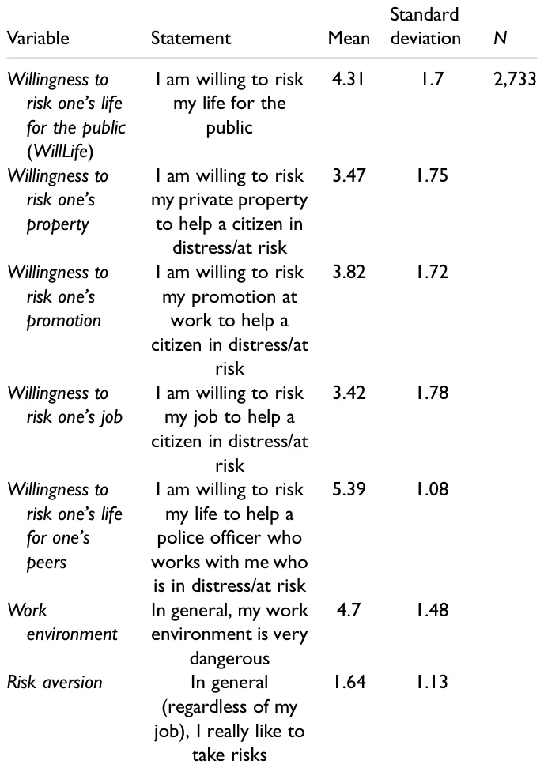
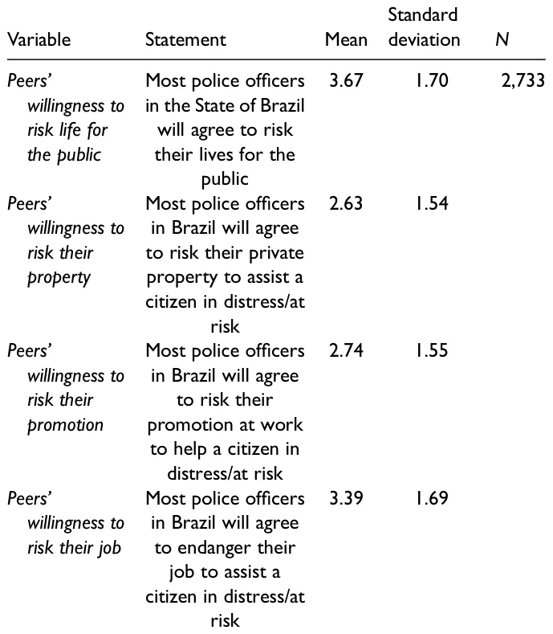

## Introduction

Street-level bureaucrats (SLBs) are the furthest away from the centers of power and the closest to citizens (Maynard-Moody & Musheno, 2000). In their daily work on the frontlines of government, they change people’s lives (Evans, 2016; Maynard-Moody & Portillo, 2010). Their discretion in implementing policy has been defined as a fundamental feature of providing public services (Brodkin, 2011) and understood as a matter of freedom or choice that a worker can exercise in a specific context (Evans, 2013). This discretion is necessary to cope with uncertainties and work pressures (Gofen, 2014; Lipsky, 2010; Portillo & Rudes, 2014; Raaphorst et al., 2018; Riccucci, 2005; Sager et al., 2014; Thomann, 2015; Tummers et al., 2015) and is critical in extreme situations such as disasters and crises (Brodkin, 2021; Henderson, 2014).

SLBs’ discretion can have different results for different citizens (Thomann & Rapp, 2018) and in different contexts (Cohen & Hertz, 2020). Their choices are often based on subjective assessments of their clients (Jilke & Tummers, 2018). On the one hand, as Lipsky (2010) argued, they usually have “nothing to lose by failing to satisfy clients” (p. 56). Hence, their priorities are not always focused on their clients’ needs (Brodkin, 2011). Thus, they prioritize “speed over need”

(ibid, 266) in order to “make the numbers” (ibid, 259). They make efficient but unfair decisions (Cárdenas and Ramirez de la Cruz 2017). They also engage in “creaming” by selecting clients with whom performance targets are more easily realized and focus on quick rather than effective help for citizens (Considine et al., 2015; Soss et al., 2011). Moreover, in some contexts, they use their discretion to deny, defer, and disregard the claims and needs of their clients (Brodkin, 2009; Cohen et al., 2016). In extreme situations, they may also intimidate their clients and heighten the asymmetry of information between them and their clients, increasing feelings of uncertainty in the latter (Cohen & Gershgoren, 2016). On the other hand, their discretion also allows them to help their clients (Tummers et al., 2015). They get their hands dirty for society and are sometimes even willing to risk their jobs to provide assistance to citizens they believe worthy (Maynard-Moody & Musheno, 2003, pp. 156–157). Indeed, they may be compassionate (Belabas & Gerrits, 2017), become emotionally committed to their clients (Lavee & Strier, 2019), empathize with them (Jensen & Pedersen, 2017), and even act to change the policy’s design to benefit their clients (Lavee et al., 2018).

However, in other cases (Do et al., 2017), helping citizens has risks and costs for SLBs (Lipsky, 2010), including their own lives (Cohen, 2022; Cohen & Golan-Nadir, 2020). The Russian invasion of Ukraine, as well as the Covid-19 pandemic (Gofen & Lotta, 2021), demonstrated that frontline workers must sometimes deal with risky situations that imperil their lives. While the literature has already explored the factors that influence SLBs’ willingness to implement policies (Thomann et al., 2018), what remains underexplored are the factors that explain SLBs’ willingness to risk their lives for others.

In this article, we build on Cohen’s (2022) exploratory research about the role of trust in how SLBs do their jobs. While research has indicated that trust is a predictor of organizational outcomes (Colquitt et al., 2007) and commitment (Cho & Park, 2011), we investigated whether it is a significant factor in SLBs’ decisions to risk their lives for others. There are times when SLBs such as doctors, nurses, police officers, and firefighters must put their lives in danger. Why are they willing to do so? Based on the above, we posit that this willingness is linked to the SLBs’ trust in their institutions and the people in their organizations. Indeed, trust is a reasonable factor in this regard because it is the “glue” that connects the state and society (Van de Walle & Bouckaert, 2003). As such, it is one of the most studied elements in the public administration literature (Bouckaert, 2012) and has become the focus of several studies on SLBs (Davidovitz & Cohen, 2022a, 2022c, 2022d; Rothstein & Dietlind, 2008).

According to Hardin (2002), Party A trusts Party B because A presumes that it is in B’s interest to act in a way consistent with A’s interests. Thus, trust may be described as the belief of an individual in the good faith of others and their future intentions (Hosmer, 1995). This element features prominently in daily interactions between people (Rothstein & Dietlind, 2008), including state agents and citizens (Spink et al., 2021), and depends on the broader context of trust between the state and society (Uslaner, 2003). As such, it has long been considered a key concept in social relations and social capital (Hardin, 2006; Uslaner, 2002).

Trust exists at three main levels: interpersonal, organizational, and institutional (Nyhan, 2000; Oomsels & Bouckaert, 2014). These levels are all present in SLBs’ work. Therefore, we investigate whether the trust of SLBs in their peers, managers and the institution they belong to is reflected in their willingness to risk their lives for others. Interpersonal trust is usually developed through frequent contacts between individuals and depends on the personal characteristics of the trustee (Zand, 1997). However, because organizational and institutional trust often develop from the structured relationships or formal rules of the organization (Fox, 1974), it is built by the organizational culture or through the management of the system (McCauley & Kuhnert, 1992).

While we do not explore the motivations of these SLBs to join the public sector, we are interested in why, after joining their organization, they are willing to risk their lives to help others. We distinguish between this willingness and other seemingly related phenomena such as public service motivations or organizational citizenship behaviors. Specifically, we suggest that since trust plays a core role in any relationships between two parties (Kramer, 1999) and has consequences for behavior (Lewicki et al., 1998), understanding this link will improve our understanding of the delivery of public services at the street level (Davidovitz & Cohen, 2022a). Other scholars have examined trust in public professionals (Six, 2013, 2018). We focus not only on SLBs’ trust in their institution but also on their trust in the people in their organization and its impact on how services are provided in the extreme context of life-threatening situations.

We examine our question empirically by studying police officers in Brazil. These civil servants are classic examples of SLBs (Cohen & Cohen, 2021) who have daily interactions with citizens (Lipsky, 2010) and can have a significant impact on their lives in critical situations (Maynard-Moody & Musheno, 2000). With the Brazilian Forum of Public Security’s (FBSP’s) cooperation, we distributed a questionnaire to a sample of 2,733 detectives and military police throughout Brazil. This methodology allowed us to investigate the impact of various factors on SLBs’ choice to risk their lives for others. While Cohen’s (2022) exploratory research improved our understanding of this topic, its results were tentative and cannot be relied upon for effective decision-making. In this paper, we use a representative sample to contribute to the theory, testing the hypotheses and variables proposed previously in an exploratory way.

The paper proceeds as follows: in the next section, we briefly review trust in the context of SLBs. In the third section, we present the research model, and in the fourth section describe the research context. In the fifth section, we present our data analysis, and lastly, in the final section we discuss the possible implications of the analysis.

## Understanding Trust in Street-Level Bureaucrats’ Work

There are numerous definitions of trust, which is not surprising, given its associations with situations involving personal conflict, uncertain outcomes and problem solving (Nyhan, 2000). One common definition sees trust as the willingness of one individual to be vulnerable to the actions of another, or to a group or institution that has the ability to harm or betray the trustor (Levi & Stoker, 2000; Mayer et al., 1995). It is a psychological state comprising the intention to accept vulnerability based upon positive expectations of the intentions or behavior of another (Rousseau et al., 1998, 395). These definitions imply that, as Lewicki and Bunker (1996) suggested, trust involves an element of risk and expectations about how another individual will behave (Gilson, 2003). This risk is the product of the uncertainty of one party with respect to the motives, intentions, and future actions of another party on which it depends in a given situation.

Trust is an important element in SLBs’ work. While it is a major factor in all human interactions (Hardin, 2002; Rothstein, 2000) and exists on all levels of SLBs’ work— interpersonal, organizational, and institutional (Nyhan, 2000; Oomsels & Bouckaert, 2014)—only a few studies have focused on this subject (Davidovitz & Cohen, 2022a). Several studies have investigated elements associated with trust, such as trustworthiness (Raaphorst et al., 2018) or clients’ honesty (Maynard-Moody & Musheno, 2003).

Some recent efforts have increased our understanding about the role of trust in street-level work. Destler (2017) focused on the New York City public school system, documenting that trust among SLBs affects certain performance behaviors. Senghaas et al.’s (2019) exploratory study of three local employment agencies in Germany found that trust is essential in overcoming possible barriers to co-operation with clients. Spink et al. (2021) analyzed how in contexts where SLBs are very vulnerable and there is a lack of reciprocal trust between clients and SLBs, the latter find ways to meet daily demands. However, in these contexts, the work of SLBs is not enough to create citizens’ trust in the state. Recently, Davidovitz and Cohen (2022a) investigated whether the level of trust that SLBs (in this case, Israeli teachers and social workers) have in their clients is reflected in their mechanisms for handling them. The findings revealed something of a paradox. When SLBs feel that their organization does not support them, they are more responsive to the demands of those clients in whom they have little trust, and less responsive to the demands of those whom they actually trust. In such situations, they might even bend or break the rules to meet the demands of clients they actually do not trust. In addition, they will limit the services they give to the clients they do trust. These findings contradict our normal understanding of trust as a positive factor by demonstrating that trust may also have undesirable consequences that may subvert the goals of public policy. Another recent study (Davidovitz & Cohen, 2022b) compared the responses of Israeli SLBs to betrayals of trust on the part of their clients. As a result of such betrayals, SLBs become much more careful in their interactions with future clients and set clear boundaries when dealing with them. Lastly, Davidovitz and Cohen (2022c) explored how SLBs’ trust in Israeli regulators is reflected in how they deal with their clients. To deal with a lack of trust, SLBs engage in acts of self-protection and deviate from formal policy. They are also more likely to consider seeking another job.

One major insight gleaned from these studies, therefore, is that SLBs’ trust in various players is crucial for understanding their behavior and, in turn, organizational outcomes. SLBs’ interactions with the people within and outside their organizations predict their interactions with clients and impact both their organizational commitment (Cho & Park, 2011) and organizational outcomes (Colquitt et al., 2007). A second major insight is that SLBs’ trust is not an isolated phenomenon, nor an exogenous or independent force. There are various elements associated with trust. Examples include cooperation (Deutsch, 1958), suspicion (Heretick, 1981), honesty, openness, competence, benevolence, and reliability (Hoy & Tschannen-Moran, 1999), as well as ability, integrity, and predictability (Wu et al., 2010).

A third major insight is that research on SLBs and trust must consider not only interpersonal trust but also SLBs’ trust in their institutions (Kramer, 1999; Six & Verhoest, 2017). SLBs’ behavior toward their clients is also affected by the formal rules of the organization (Fox, 1974), the organizational culture, and the management of the system (McCauley & Kuhnert, 1992). Indeed, trust has long been associated with organizational culture (Farris et al., 1973). Regarding police work, while some suggest that the traditional view of police culture is too monolithic in nature (Ingram et al., 2018), the literature points to several values and attitudes typical of traditional police culture: being authoritative and macho, courage and respect for physical strength, preparedness to be coercive, emphasis on autonomy, eagerness for excitement, in-group solidarity and loyalty, viewing the police as a family and policing as a job for life, suspiciousness, secrecy, hostility towards groups regarded as deviant or threatening, sexism, racism, cynicism, and a commitment to fighting crime and doing one’s duty (Cordner, 2017; Crank, 2004; du Plessis et al., 2021; Paoline, 2003; Paoline et al., 2000).

This organizational culture has proven strong enough even to change individuals’ values through socialization processes. A common assumption in the literature is that passive representation leads to active representation (Riccucci & Van Ryzin, 2017). However, studies emphasize that several conditions are necessary but not sufficient for this to occur (Wilkins & Wenger, 2015). For example, Wilkins and Williams (2008) reported that a higher rate of representation of Black police officers actually increases racial profiling in vehicle stops. One explanation for this finding is the strong organizational socialization in police departments. Thus, socialization processes could affect SLBs’ willingness to risk their lives for specific groups.

While these important efforts contribute to a theoretical understanding of the role played by trust in the daily interactions of SLBs and their clients, much more work remains in order to develop this area of study. One step in accomplishing this goal is testing the link between trust and SLBs’ willingness to risk their lives for their clients.

## The Link Between Trust and SLBs’ Willingness to Risk Their Lives

The study of why SLBs might be willing to risk their lives for their clients is still in its infancy. Scholars have long sought to identify the factors that can affect SLBs’ willingness to implement public policies and have pointed to possibilities such as conflict (Tummers et al., 2012), meaningfulness (Tummers, 2012), and powerfulness (Tummers & Bekkers, 2013). They have also shown that the willingness to implement policy affects the use of the SLB’s discretion in doing so (Thomann et al., 2018). However, when it comes to their willingness to risk their lives for citizens, until now, only one exploratory study has provided some tentative direction (Cohen, 2022). In order to broaden our understanding of this subject, we must use a large, representative sample in various contexts and case studies.

Like other individuals, SLBs vary in the extent to which they are willing to help others as well as the risks they are willing to take for them (Cohen, 2022; Cohen & Hertz, 2020). When people risk themselves for others, they are considered “cooperative” (Rand & Nowak, 2013) and willing to challenge the natural human instinct to be selfish (Lupton & Tulloch, 2002; Sigmund, 2016). However, risking one’s life seems to go above and beyond this notion of being cooperative. Why would SLBs be willing to do so? Focusing on soldiers and other combatants, Glowacki and Wrangham (2013, pp. 445–446) suggested three groups of explanations, which, following Cohen (2021), we may cautiously adjust to the SLBs’ context. Although we realize that this group is not quite the same as police officers, given that police officers use violence as a last resort, while soldiers have permission to kill the enemy, much can be learned about risk-taking through soldiers.

The first explanation is associated with biological altruism. We have long known that people have the biological potential to care about the welfare of others. Newborn infants show a primitive form of empathy; when they hear another infant crying, they begin to cry (Simner, 1971). This behavior plays a role in choosing a mate, both in humans and other species (Farrelly, 2011). In this regard, altruism is a “signal” of kindness and a prosocial nature, and a predictor of a more lasting partner relationship. Empathy and altruism develop based on experience. Stressing to children the consequences of their actions, both positive and negative, is useful in promoting prosocial behavior and empathy (Staub, 2015). Carnegie Heroes, people recognized by the Carnegie Hero Foundation for risking their lives to save the life of someone not related to them, were more likely than other people to report that their parents expected them to help others (McNamee & Wesolik, 2014). Engagement with outsiders and the example of helpful parents promote caring about all human beings.

Nevertheless, the desire to help other people is not always enough. Helping often requires both motivation and confidence in one’s ability. Staub (2013) determined that a combination of a prosocial orientation and belief in one’s capacity to improve the wellbeing of others were key factors for people who reported helping others. Such behavior includes helping in times of danger, sharing food, assisting the very young and old, the sick or wounded, sharing implements, and sharing knowledge (Gouldner, 1960). Heroism is considered a higher form of altruism, as it is associated with risking one’s life (Margana et al., 2019, p. 127). Those who risk their lives to save others to whom they are not closely related are considered altruistic (Trivers, 1971).

A second explanation is the threat of punishment. In wartime, some societies impose community-enforced social sanctions for inadequate participation (Mathew & Boyd 2011). Balliet and Van Lange’s (2013) meta-analysis addressed the role of punishment in dealing with free-rider problems and its link to trust. Interestingly, in societies with high levels of trust, the threat of punishment promotes cooperation more strongly than other mechanisms. In societies characterized by mutual trust, individuals count on one another to contribute to collective action.

The third explanation deals with rewards. Glowacki and Wrangham (2013, p. 445) suggested that both “material and immaterial, culturally specific rewards” could be used to incentivize participation in life-threatening situations. In the context of war, “warriors may be motivated to participate in conflict because of a number of different factors, including the possibility of rewards, punishment, and a parochially altruistic psychology…” (Glowacki & Wrangham, 2013, p. 446).

We can use these studies to establish several insights regarding SLBs’ willingness to risk their lives for others. First, given that SLBs usually work in an environment in which they serve and protect civilians who need their help, it is reasonable to assume that their trust in others will increase their willingness to help others—even if it comes with risks. Indeed, trust involves an element of risk and expectations about how another individual will behave (Gilson, 2003). Scholars regard it as an important element of voluntary compliance (Hardin, 2003; Tyler, 2003). This notion is in line with previous scholars who suggested that SLBs’ behavior is affected by their relations with their colleagues (Keiser, 2010; Loyens, 2019), their managers (Gofen, 2014; May & Winter, 2009) and their organizational environment (Brodkin, 2021; DeHart-Davis, 2007; Oberfield, 2010), including the organizational culture (Cohen, 2018).

Indeed, focusing on police officers, Cohen and Golan-Nadir (2020) underscored the importance of individual characteristics in SLBs’ willingness to risk themselves for others. They noted the role of the fit between police officers’ values and ideology and the values and ideology reflected by their institutions. Nevertheless, they concluded that such individual characteristics alone did not account for their willingness to put themselves at risk. According to their findings, this willingness also develops through experience and interactions with others, and believing in their good intentions. If their conclusion is correct, it is not only the SLBs’ trust in management, reflecting organizational policies, processes, and programs, but also their trust in their supervisors and co-workers, which is more relational than institutional (Cho & Park, 2011) that should affect their willingness to risk their lives. As organizational and institutional trust often develops from the structured relationships or formal rules of the organization (Fox, 1974), it is built by the organizational culture or through the management of the system (McCauley & Kuhnert, 1992).

Second, SLBs—especially police officers and firefighters who are expected to risk themselves for others—may do so under threats from their organizations. We know that SLBs’ practices with regard to clients they trust or distrust vary depending on organizational conditions (Davidovitz & Cohen, 2022a). While their interpersonal trust in their peers or managers is important (DeHart-Davis, 2007), so is their trust in their institutions (Six & Verhoest, 2017). Indeed, social and organizational expectations are factors in SLBs’ calculations regarding risking their lives (Cohen & Golan-Nadir, 2020). However, it is unclear how effective these expectations really are. On the one hand, managers’ leadership is an important motivating factor in SLBs’ practices (Keulemans & Groeneveld, 2020). Thus, it is reasonable to assume that their trust in their managers and organizations might prompt them to risk their lives. On the other hand, authoritarian leadership and punishment cannot be expected to work for the long term. In addition, public organizations may encourage SLBs to risk their lives by offering promotions or professional recognition. However, from a rational point of view, the reward is far less than the price of risking one’s life. Hence, it is unlikely that people will risk their lives for a promotion or material rewards. Moreover, it is unclear if this will increase their trust. However, SLBs are expected to serve civilians who need help or protection. When SLBs risk their lives for others, they may enjoy social recognition. Nevertheless, as discussed above, the management of the system and the organizational culture also play a role. As Cohen (2022) noted, there are common values in all societies even if they are not shared by every member. Clients, as well as peers and managers, are part of the SLBs’ society. Trust in them should prompt SLBs to want to realize the organization’s goals. It is reasonable to assume, therefore, that their trust in their peers and managers will be associated with their willingness to help clients— even if it involves risks. Hence, when SLBs believe that others in society have good intentions towards them, they may reciprocate.

Utilizing these insights, we posit three hypotheses:

- **H1:** SLBs’ willingness to risk their lives for others will have a positive relationship with their trust in colleagues.
- **H2:** SLBs’ willingness to risk their lives for others will have a positive relationship with their trust in the managers in their organization.
- **H3:** SLBs’ willingness to risk their lives for others will have a positive relationship with their general trust in the police as an institution.

**The Context: Brazilian State Police**

Brazil is a federation composed of 26 states plus a Federal District where the country’s capital is located. Like other police forces worldwide (Cohen & Cohen, 2021), the Brazilian state police have the authority to use coercion and provide various services such as law enforcement, public order, public security, and crime prevention. Due to historical reasons, each state, as well as the Federal District, has two distinct police forces: the military police and the civilian police (a third institution is the state penal police, whose officers come from the state’s prison system). While they are two separate agencies, the military police perform typical civil police duties. They report directly to the executive branch, but they are not an internal force of the national military. As of 2021, there were 406,426 military police officers and 93,143 civilian police officers in the country. About 10% of police officers in the Brazilian state police are women. However, most of the women work in administrative positions rather than frontline work such as patrolling the streets.

The military police oversee crime prevention and riot control. In practice, they are responsible for patrolling the streets and responding to emergency calls from the general public. The civilian police are responsible for investigating crimes, formally registering all types of crimes, and formalizing arrests made by the military police. Thus, when the military police catch a criminal, he or she is taken to a civilian police station where the arrest is formalized by a police chief who decides if the person should be kept in jail, released, or released on bail. The civilian police chief decides on the legality of the military police’s arrest and makes all the arrangements to take the accused to court.

Moreover, if a person is a victim of a crime, he or she goes to a civilian police station to report the crime, which will be investigated. As they patrol streets and respond to emergency calls, the military police tend to arrive at a crime when it is still taking place, meaning that military police officers are at greater risk than civilian police officers. The military police also tend to use far more lethal force than the civilian police. Brazilians have little trust or confidence in the police forces, who are viewed as corrupt and abusive.

Brazil also has one of the worst global records on crime. Thus, the SLBs in our study are likely to face the possibility of risking their lives during their work. According to the Brazilian Forum on Public Safety (Brazilian Yearbook of Public Security, 2021), in 2020, 50,033 people were violently killed, and 6,416 people were killed by the police. In contrast, 194 police officers were murdered in the country in 2020. In the same year, 60,460 rapes were reported to the police. In comparison, Brazilian police officers kill perpetrators five times more often than American police officers do (Super Interessante, 2020). The country also has several criminal gangs, some of which operate in various countries. These gangs control the sale of drugs in Brazil and export drugs to Europe, Africa, the Middle East, and Oceania.

## Method

## Sample and Procedure

To test our three hypotheses, we asked Brazilian police officers to report their perceptions about and attitudes towards risking their lives, as well as their trust in peers, direct managers, and the police in general. We used a questionnaire with both open and closed-ended questions that had already been used in an exploratory examination in Israel (Cohen, 2022). The authors translated it into Portuguese for this study. Data were collected between August and October 2021, thanks to the cooperation of the Brazilian Forum of Public Security (FBSP). The FBSP distributed the questionnaire nationally to detectives and military police in various units, geographical areas, and ranks. All participants were assured anonymity. The research was described as examining “the willingness of police officers to risk their lives for others.”

<figure class="table-figure" id="table-1">
<figcaption><strong>Table 1.</strong> Participants’ Willingness to Risk Themselves, Their Work Environment, and Their Risk Aversion.</figcaption>

</figure>

Initially, the survey was sent to a list of 5,746 emails. This list was composed of police officers from the entire country who had attended previous activities of the Brazilian Forum of Public Security as well as contacts provided by the Ministry of Justice. In total, 4,448 SLBs accessed the survey, and 2,955 completed it (response rate: 66.4%). Among them, we excluded those whose jobs had less in common with the work of police officers, such as members of the state penal police, and respondents with improbable or erroneous answers. As a result, our final sample consisted of 2,733 military police officers and detectives.

Among them, there were 2,297 males and 436 females, with ages ranging from 21 to 68 (mean: 37.88 years). Most were married (73.4%); 20.71% were single, 5.56% were divorced and 0.33% were widowed. Among the respondents, 65.17% had children. With regard to monthly income, 2.23% earned up to 3,000 reals, 51.99% earned 3,001 to 5,000 reals, 22.17% earned 5,001 to 8,000 reals, 7.57% earned 8,001 to 10,000 reals, 7.87% earned 10,001 to 15,000 reals, and 8.16% earned more than 15,001 reals (one Brazilian real is approximately $0.18 USD). With regard to ethnicity, 66.01% were White, 28.14% were mixed Black and White, 4.54% were Black, 1.13% were Asian and 0.18% were Indigenous. Regarding religion, 54.88% defined themselves as Catholic, 1.94% as “non-Catholic Christian,” 6.92% as Spiritist, 11.96% as Traditional Evangelical, 6.77% as Pentecostal Evangelical, 10.35% as non-religious, 3.04% as “other,” and the rest (4.13%) preferred not to say.

## Measures and Analysis

We asked the participants to indicate their responses to the statements or groups of statements we used to measure the variables on a scale ranging from 1 to 6. We verified the statements for consistency using Cronbach’s α test. We also included an MSE regression analysis that controlled for age, gender, having children, marital status, wage, ethnicity, religion, risk aversion, and their subjective sense about the expectation that officers would risk their lives for others. We tested each of these factors in separate sensitivity models.

Willingness to risk one’s life was measured by the simple statement: “I am willing to risk my life for the public.” Although we focused on the extreme situation of a life-threatening encounter, we also measured the participants’ willingness to risk other resources (private property, promotion at work, and their job). See Table 1 bellow.

We used projection questions for the above statements. As detailed in Table 2, we assessed the participants’ perceptions regarding the willingness of other police officers to risk their lives with the statement: “Most police officers in the State of Brazil will agree to risk their lives for the public.” We also measured their perceptions regarding other police officers’ willingness to risk other resources by modifying the preceding statement to read: “Most police officers in Brazil will agree to risk their…”

Trust in the police in general was measured by the statement: “I have great trust in the Brazilian police.” Trust in commanders within their organization was measured by the statement: “I have a lot of trust in my police commander.” Trust in their peers was measured by the statement: “I have a lot of trust in my co-workers.”

Following Cohen (2021) and building on previous literature linking trust to other variables (Bouckaert, 2012; Hardin, 2006; Sønderskov & Dinesen, 2016), we explored whether additional elements might be linked to police officers’ willingness to risk their lives in the Brazilian context. Among these variables were the participants’ organizational commitment, perceptions of the police force in the eyes of the public, professionalism, participation in decision-making, politicization, and discrimination. Finally, to add texture to the data, we included some quotes from the survey’s open-ended questions.

To explore the non-linear connections between trust and the other sociological and demographic variables, we used recent machine-learning-based methods. For each hypothesis, we created a machine-learning pipeline (Drori et al., 2021; He et al., 2021) from a data reduction algorithm, a feature selection algorithm, and a machine-learning model. The data reduction method limits the overlapping information obtained from similar questions in the questionnaire, thereby making the models more robust (Maćkiewicz & Ratajczak, 1993). The feature selection algorithm reveals only the most relevant features in the data to analyze each hypothesis. Finally, the machine-learning model establishes a non-linear connection between multiple factors and each one of the elements of trust, corresponding to those suggested three hypotheses.

<figure class="table-figure" id="table-2">
<figcaption><strong>Table 2.</strong> Participants’ Perceptions Regarding Other Police Officer<strong>s</strong>.</figcaption>

</figure>

We implemented the proposed machine-learning pipelines using the Python (version 3.7.5) programming language with the scikit-learn library (Pedregosa et al., 2011). A manual trial-and-error approach revealed the machine-learning pipeline that made the most accurate predictions when using the k-fold cross-validation method with k **=** 5 (Fushiki, 2011). In order to evaluate if the model’s predictions were statistically and significantly similar to the participants’ answers, we computed the confidence interval of a paired T-test and ensured that zero was not included in it. Note that we replaced the categorical variables with a set of binary variables corresponding to the number of unique values (i.e., one-hot encoding) (Al-Shehari & Alsowail, 2021).

## Findings

## Descriptive Statistics

As indicated in Table 1, the participants reported their willingness to risk their lives for others (mean = 4.31), as well as for other resources such as private property (mean = 3.47), their promotion (mean = 3.82), and their job (mean = 3.42). They also indicated that their work environment was dangerous (mean = 4.7). Their average risk aversion was 1.64. In addition, as Table 2 shows, our respondents also agreed that their colleagues were willing to risk themselves for others, but to a lesser degree, especially with regard to property (mean = 2.63) and promotion (mean = 2.74).

When asked if they had ever risked their lives at work, 41.79% said that they did so “many times”; 28.17% said “sometimes”; 13.72% “a few times”; and the rest (16.32%) reported that they had never done so. When asked to provide examples of situations in which they had risked their lives (an open-ended question), the participants described engaging in dangerous missions that involved confronting armed or unarmed violent individuals and engaging in high-speed car chases.

When asked if they were expected to risk their lives as part of their work, 72.67% reported that their organization expected them to risk their lives “on a daily basis,” 3.99% “on a weekly basis,” 1.2% “on a monthly basis,” 17.78% “sometimes,” and 4.32% answered “no.” For example, one police officer stated: “Putting your life at risk is a necessary act for the profession. No risks, no results.”

Other findings relate to the question of for whom police officers are willing to risk their lives. In this regard, we asked the participants to indicate their willingness to risk their lives for specific groups from 1 (not willing at all to risk my life for them) to 6 (very willing to risk my life for them). Table 3 presents the findings. While the respondents indicated a great deal of willingness to risk their lives for certain groups, this willingness declined sharply for other groups. Our respondents were highly willing to risk their lives for co-workers (mean = 5.40), children (mean = 5.56), the elderly (mean = 5.14), people with formal jobs (mean = 4.92) and women (mean = 4.88). However, they were less willing to do so for other groups, such as LGBTQ individuals + people (mean = 4.55), men (mean = 4.58), and the homeless (mean = 4.58). One police officer said that “If a police officer says he puts his life at risk for any citizen, he is lying (…). In my view, cops are willing to put their lives at risk to protect some types of people and to kill others.”

Given that the literature on SLBs’ willingness to risk their lives is in its infancy, we also wanted to identify other major factors, in addition to trust, that Brazilian police officers believed increased their willingness to endanger themselves for others. We asked them to indicate the impact of various factors, based on the possible choices on the literature (Cohen, 2022). As shown in Table 4, our respondents reported that the major factors were the desire to do “the right thing” (mean = 5.05), professional commitment (mean = 4.13), and a sense of satisfaction and self-fulfillment (mean = 4.34). Doing the right thing, commitment, and self-fulfillment can be associated with the idea of heroism in police officers’ work, as exemplified by one respondent “It is an ideological-institutional construction that makes us think that we must always be heroes.” Another police officer said “We took an oath that we will always be heroes, and we like that.”

Following Cohen’s (2021) exploratory research, in pursuit of more knowledge in this area, we explored whether additional elements might be linked to police officers’ willingness to risk their lives. Table 5 details these variables and their results.

<figure class="table-figure" id="table-3">
<figcaption><strong>Table 3.</strong> Willingness to Risk One’s Life for Specific Groups.</figcaption>

<table><tr><th>Statement</th><th>Mean</th><th>Standard deviation</th><th>N</th></tr><tr><td>Women</td><td>4.88</td><td>1.38</td><td>2,733</td></tr><tr><td>Children</td><td>5.56</td><td>0.95</td><td></td></tr><tr><td>Men</td><td>4.58</td><td>1.51</td><td></td></tr><tr><td>Elderly</td><td>5.14</td><td>1.25</td><td></td></tr><tr><td>Other public security professionals</td><td>5.40</td><td>1.04</td><td></td></tr><tr><td>People with formal jobs</td><td>4.92</td><td>1.34</td><td></td></tr><tr><td>Homeless population</td><td>4.58</td><td>1.53</td><td></td></tr><tr><td>LGBTQ+ people</td><td>4.55</td><td>1.59</td><td></td></tr></table>

</figure>

Table 6 presents the results of our survey regarding participants’ trust in their peers, managers, and the Brazilian State Police. As indicated in the table, our participants had more trust in their peers than in their managers or the police in general.

## Correlations and Regressions

Table 7 presents Pearson’s correlation between the willingness of the participants to risk their lives, the independent variables (trust in peers, managers, and the police), and additional variables measured in order to test their link to the willingness to risk their lives or as control variables. As the table demonstrates, as in Israel (Cohen, 2022), we found a significant linear link between the willingness of SLBs to risk their lives and their trust in their colleagues and the police as an institution. One police officer commented “In my work, I see a lot of seriousness and commitment among police officers. In this way, I trust a lot in the services provided by my colleagues, regardless of the situations we face daily.”

Moreover, probably due to our large sample, we also found a significant correlation between that willingness and the participants’ trust in their managers. In addition, there was a positive correlation between the SLB’s willingness to risk their lives and their perceptions about professionalism (p = 0.305), organizational support (p = 0.236), and commitment (p = 0.045). However, we also found a small but significant negative correlation (p = -0.116) with discrimination. Thus, those who reported feeling discriminated against at work were less willing to risk their lives for others.

<figure class="table-figure" id="table-4">
<figcaption><strong>Table 4.</strong> Police Officers’ Perceptions Regarding the Factors That Increase Their Willingness to Risk Their Lives.</figcaption>

<table><tr><th>Statement</th><th>Mean</th><th>Standard deviation</th><th>N</th></tr><tr><td>Ideology</td><td>3.16</td><td>1.92</td><td></td></tr><tr><td>My religious beliefs</td><td>2.45</td><td>1.76</td><td>2,733</td></tr><tr><td>My professional commitment (as a police officer)</td><td>4.13</td><td>1.89</td><td></td></tr><tr><td>Expectations of my commanders</td><td>2.87</td><td>1.74</td><td></td></tr><tr><td>Expectations of my co-workers</td><td>3.07</td><td>1.71</td><td></td></tr><tr><td>Expectations of my family members</td><td>3.76</td><td>1.85</td><td></td></tr><tr><td>Expectations of Brazilian society/ my community</td><td>3.3</td><td>1.8</td><td></td></tr><tr><td>Desire for respect and recognition from my environment</td><td>3.79</td><td>1.84</td><td></td></tr><tr><td>Job promotion options</td><td>3.43</td><td>1.87</td><td></td></tr><tr><td>Sense of satisfaction and self-fulfillment</td><td>4.34</td><td>1.73</td><td></td></tr><tr><td>Desire to do the right thing</td><td>5.05</td><td>1.51</td><td></td></tr><tr><td>Desire to explore the true limits of my abilities</td><td>3.87</td><td>1.79</td><td></td></tr><tr><td>Fear of internal investigations or external criticism (e.g., Department for the Investigation of Police or journalistic investigation)</td><td>3.31</td><td>2</td><td></td></tr><tr><td>Intuition (decisions made on the spot without forethought)</td><td>3.73</td><td>1.65</td><td></td></tr><tr><td>Exercises and procedures as part of my training</td><td>3.81</td><td>1.68</td><td></td></tr></table>

</figure>

<figure class="table-figure" id="table-5">
<figcaption><strong>Table 5.</strong> Additional Elements That Might be Linked to Police Officers’ Willingness to Risk Their Lives.</figcaption>

<table><tr><th>Variable</th><th>Statement</th><th>Mean</th><th>Standard deviation</th><th>N</th><th>Cronbach’s alpha</th></tr><tr><td>Politicization</td><td>The actions of the Brazilian police are professional and not affected by political pressure The actions of my direct commanders are professional and not affected by political pressures</td><td>2.07 2.53</td><td>1.4 1.58</td><td>2,733</td><td>0.8104</td></tr><tr><td>Perceived professionalism</td><td>Brazilian police officers demonstrate a high level of skill and professionalism The Brazilian police have a professional and responsible leadership Most police officers in Brazil are professional and responsible</td><td>3.70 4.06 4.47</td><td>1.51 1.45 1.38</td><td></td><td>0.8103</td></tr><tr><td>Discrimination</td><td>The Brazilian police discriminate against certain groups in the population</td><td>2.55</td><td>1.64</td><td></td><td></td></tr><tr><td>Perceptions about the image of the police in the public eye</td><td>The Brazilian police have a positive overall image in the eyes of the public</td><td>2.82</td><td>1.46</td><td></td><td></td></tr><tr><td>Innovation</td><td>The Brazilian police initiate ideas and innovations that improve the lives of citizens</td><td>3.46</td><td>1.57</td><td></td><td></td></tr><tr><td>Participation</td><td>The Brazilian police are interested in involving me in decision-making processes</td><td>2.37</td><td>1.50</td><td></td><td></td></tr><tr><td>Organizational support</td><td>If I get hurt, the Brazilian police will do everything in their power to help me and my family</td><td>2.85</td><td>1.68</td><td></td><td></td></tr><tr><td>Organizational commitment</td><td>My organizational commitment to the Brazilian police is very strong</td><td>4.93</td><td>1.28</td><td></td><td></td></tr></table>

</figure>

<figure class="table-figure" id="table-6">
<figcaption><strong>Table 6.</strong> Police Officers’ Trust in Their Peers, Managers, and the Police.</figcaption>

<table><tr><th>Variable</th><th>Statement</th><th>Mean</th><th>Standard deviation</th></tr><tr><td>Trust in their peers</td><td>I have a lot of trust in</td><td>4.34</td><td>1.31</td></tr><tr><td>and colleagues</td><td>my co-workers</td><td></td><td></td></tr><tr><td>Trust in</td><td>I have a lot of trust in</td><td>3.47</td><td>1.69</td></tr><tr><td>commanders</td><td>my police commander</td><td></td><td></td></tr><tr><td>Trust in the police in</td><td>I have a lot of trust in</td><td>3.64</td><td>1.67</td></tr><tr><td>general</td><td>the Brazilian police</td><td></td><td></td></tr></table>

</figure>

Table 8 presents the results of the multiple MLE regression analysis (non-standardized and standardized coefficients) for the direct effect of independent variables on the SLBs’ willingness to risk their lives. It shows a positive relationship between this willingness and three of the independent variables we tested—trust in peers, trust in managers, and trust in the police in general. Thus, while Cohen’s (2021) exploratory research failed to support the idea that SLBs’ trust in managers is associated with their willingness to risk their lives, our results support all of our research hypotheses.

<figure class="table-figure" id="table-7">
<figcaption><strong>Table 7.</strong> Correlation Matrix for the Research Variables.</figcaption>

<table><tr><th>Variable</th><th>Pearson’s correlation with willingness to risk one’s life</th><th>N</th></tr><tr><td>Trust in colleagues</td><td>0.2770*</td><td>2733</td></tr><tr><td>Trust in commanders in the organization</td><td>0.2857*</td><td></td></tr><tr><td>General trust in the police as an institution</td><td>0.3271*</td><td></td></tr><tr><td>Politicization</td><td>0.1648*</td><td></td></tr><tr><td>Perceptions about professionalism</td><td>0.3052*</td><td></td></tr><tr><td>Discrimination</td><td>−0.1167*</td><td></td></tr><tr><td>Perceptions about the image of the police in the eyes of the public</td><td>0.2005*</td><td></td></tr><tr><td>Innovation</td><td>0.3033*</td><td></td></tr><tr><td>Participation</td><td>0.1603*</td><td></td></tr><tr><td>Organizational support</td><td>0.2366*</td><td></td></tr><tr><td>Organizational commitment</td><td>0.4057*</td><td></td></tr></table>

* p &lt; 0.05.

</figure>

<figure class="table-figure" id="table-8">
<figcaption><strong>Table 8.</strong> Multiple Regression Analysis of the Direct Effect of the Independent Variables on SLBs’ Willingness to Risk Their Lives.</figcaption>

<table><tr><th></th><th></th><th>Trust in peers</th><th></th><th colspan="3">Trust in managers</th><th>Trust in</th><th>the police</th><th>in general</th></tr><tr><th></th><th>B</th><th>(SE)</th><th>β</th><th>B</th><th>(SE)</th><th>β</th><th>B</th><th>(SE)</th><th>β</th></tr><tr><td>Main IV</td><td>0.35***</td><td>(0.02)</td><td>0.27***</td><td>0.28***</td><td>(0.02)</td><td>0.28***</td><td>0.32***</td><td>(0.02)</td><td>0.32***</td></tr><tr><td>Age</td><td>0.00</td><td>(0.01)</td><td>0.01</td><td>0.00</td><td>(0.01)</td><td>0.01</td><td>0.00</td><td>(0.00)</td><td>0.01</td></tr><tr><td>Female</td><td>−0.23**</td><td>(0.09)</td><td>−0.05**</td><td>−0.31***</td><td>(0.09)</td><td>−0.07***</td><td>−0.29***</td><td>(0.09)</td><td>−0.06***</td></tr><tr><td>Have children</td><td>−0.07</td><td>(0.09)</td><td>−0.02</td><td>−0.03</td><td>(0.09)</td><td>−0.01</td><td>−0.01</td><td>(0.08)</td><td>−0.00</td></tr><tr><td>Divorced or separated</td><td>0.27</td><td>(0.14)</td><td>0.04</td><td>0.26</td><td>(0.14)</td><td>0.03</td><td>0.30*</td><td>(0.14)</td><td>0.04*</td></tr><tr><td>Single</td><td>0.41***</td><td>(0.09)</td><td>0.10***</td><td>0.37***</td><td>(0.09)</td><td>0.09***</td><td>0.31***</td><td>(0.09)</td><td>0.07***</td></tr><tr><td>Widowed</td><td>−0.19</td><td>(0.54)</td><td>−0.01</td><td>−0.28</td><td>(0.54)</td><td>−0.01</td><td>−0.15</td><td>(0.54)</td><td>−0.01</td></tr><tr><td>3,001 to 5,000 reals</td><td>0.32</td><td>(0.21)</td><td>0.10</td><td>0.25</td><td>(0.21)</td><td>0.07</td><td>0.25</td><td>(0.21)</td><td>0.07</td></tr><tr><td>5,001 to 8,000 reals</td><td>0.26</td><td>(0.22)</td><td>0.06</td><td>0.15</td><td>(0.22)</td><td>0.04</td><td>0.12</td><td>(0.22)</td><td>0.03</td></tr><tr><td>8,001 to 10,000 reals</td><td>0.40</td><td>(0.24)</td><td>0.06</td><td>0.28</td><td>(0.24)</td><td>0.04</td><td>0.22</td><td>(0.24)</td><td>0.03</td></tr><tr><td>10,001 to 15,000 reals</td><td>0.59*</td><td>(0.24)</td><td>0.09*</td><td>0.44</td><td>(0.24)</td><td>0.07</td><td>0.41</td><td>(0.24)</td><td>0.06</td></tr><tr><td>15,001 reals or more</td><td>0.31</td><td>(0.24)</td><td>0.05</td><td>0.12</td><td>(0.24)</td><td>0.02</td><td>0.04</td><td>(0.24)</td><td>0.01</td></tr><tr><td>Christian–other</td><td>−0.04</td><td>(0.23)</td><td>−0.00</td><td>0.01</td><td>(0.23)</td><td>0.00</td><td>−0.02</td><td>(0.22)</td><td>−0.00</td></tr><tr><td>Espírita</td><td>−0.09</td><td>(0.13)</td><td>−0.01</td><td>−0.06</td><td>(0.13)</td><td>−0.01</td><td>−0.06</td><td>(0.12)</td><td>−0.01</td></tr><tr><td>Pentecostal Evangelical</td><td>0.07</td><td>(0.13)</td><td>0.01</td><td>0.04</td><td>(0.13)</td><td>0.01</td><td>0.01</td><td>(0.13)</td><td>0.00</td></tr><tr><td>Traditional Evangelical</td><td>−0.01</td><td>(0.10)</td><td>−0.00</td><td>−0.08</td><td>(0.10)</td><td>−0.01</td><td>−0.06</td><td>(0.10)</td><td>−0.01</td></tr><tr><td>Non-religious</td><td>−0.36***</td><td>(0.11)</td><td>−0.06***</td><td>−0.30**</td><td>(0.11)</td><td>−0.05**</td><td>−0.23*</td><td>(0.11)</td><td>−0.04*</td></tr><tr><td>Other</td><td>−0.16</td><td>(0.18)</td><td>−0.02</td><td>−0.09</td><td>(0.18)</td><td>−0.01</td><td>−0.09</td><td>(0.18)</td><td>−0.01</td></tr><tr><td>Prefer not to answer</td><td>−0.21</td><td>(0.16)</td><td>−0.02</td><td>−0.26</td><td>(0.16)</td><td>−0.03</td><td>−0.22</td><td>(0.16)</td><td>−0.03</td></tr><tr><td>Black</td><td>−0.12</td><td>(0.15)</td><td>−0.02</td><td>−0.14</td><td>(0.15)</td><td>−0.02</td><td>−0.14</td><td>(0.15)</td><td>−0.02</td></tr><tr><td>Indigenous</td><td>−0.40</td><td>(0.73)</td><td>−0.01</td><td>−0.30</td><td>(0.73)</td><td>−0.01</td><td>−0.30</td><td>(0.72)</td><td>−0.01</td></tr><tr><td>Mixed White and Black</td><td>−0.06</td><td>(0.07)</td><td>−0.02</td><td>−0.05</td><td>(0.07)</td><td>−0.01</td><td>−0.03</td><td>(0.07)</td><td>−0.01</td></tr><tr><td>Asian (a)</td><td>−0.29</td><td>(0.29)</td><td>−0.02</td><td>−0.22</td><td>(0.29)</td><td>−0.01</td><td>−0.22</td><td>(0.29)</td><td>−0.01</td></tr><tr><td>Constant</td><td>2.47***</td><td>(0.29)</td><td></td><td>3.13***</td><td>(0.27)</td><td></td><td>2.92***</td><td>(0.27)</td><td></td></tr><tr><td>R-squared</td><td></td><td>0.10</td><td></td><td></td><td>0.10</td><td></td><td></td><td>0.12</td><td></td></tr><tr><td>Adjusted R-squared</td><td></td><td>0.09</td><td></td><td></td><td>0.09</td><td></td><td></td><td>0.11</td><td></td></tr><tr><td>F</td><td></td><td>12.55</td><td></td><td></td><td>13</td><td></td><td></td><td>16.29</td><td></td></tr><tr><td>N</td><td></td><td>2733</td><td></td><td></td><td>2733</td><td></td><td></td><td>2733</td><td></td></tr></table>

</figure>

As indicated in Table 8 indicates, we controlled for various socio-demographic variables. Given that one possible explanation for the differences in the willingness to risk one’s life might simply be that some individuals love risk-taking, whereas others avoid it, we decided to control for these variables. We conducted sensitivity tests to establish whether risk aversion and expectations about the possibility of risking one’s life (on a weekly basis, monthly basis, seldom, or never) were related to the willingness to do so, or affected the relationship between dependent and independent variables. We established an association between organizational expectations that police officers would risk their lives as part of their work and their actual willingness to do so. Nevertheless, in sensitivity regression analyses, the inclusion of this variable did not affect the association between the main explanatory variables and the dependent variable to any great extent. Hence, given the results of these tests, we argue that the data support H1, H2 and H3.

Other interesting results emerged from our analyses as well. For example, men are more willing than women to risk their lives. In addition, religious people are more willing to risk their lives for others than those who define themselves as non-religious. Income also plays a role. Hence, SLBs with a higher income, specifically, those who reported earning 10,001 to 15,000 reals, are significantly more willing to risk their lives for others than those who reported earning less than that amount. Finally, not surprisingly, singles are more willing to risk their lives than those who are married or people with children. Some of these findings are aligned with previous research indicating how some individual characteristics of SLBs affect their behavior (Baviskar & Winter, 2017; Boer, 2020).

## Analysis of Non-Linear Correlations

To investigate the first hypothesis, we conducted a PCA reduction (Maćkiewicz & Ratajczak, 1993) combined with the XGboost (Chen & Guestrin, 2016) model and a mutual-information feature selection algorithm (Azhagusundari & Thanamani, 2013). The result was a very accurate prediction of 0.458 (obtained as the average of the cross-validation analyses). A paired t-test indicated that the results were statistically significant with p<0.01.

To explore the second hypothesis, we used t-SNE embedding (Pollcar et al., 2019) with a support vector machine model (Suthaharan, 2016). The result was a very accurate prediction of 0.531 with a p < 0.005. Finally, to examine the third hypothesis, we used a PCA reduction with a Random Forest (Chaudhary et al., 2016) and Backward Feature Elimination (Kostrzewa & Brzeski, 2018). The result was the best machine-learning pipeline with a very accurate prediction of 0.663 score and p < 0.01. Recall that since there are six possible answers for each hypothesis, based on the questionnaire the participants answered, a random sample would result in a 0.166 score. Thus, all three models were able to find a connection between the social and demographic variables and the trust of the SLBs.

In addition, when comparing the machine-learning models’ results with those of the linear model shown in Table 8, it is clear that the connection between the variables is largely non-linear. The linear model yielded coefficients of determination of 0.1, 0.1, and 0.12, respectively. These results indicate that there is some level of linear connection but most of the connection is non-linear.

## Discussion and Conclusions

What factors explain SLBs’ willingness to risk their lives for others? Using the results of a survey of Brazilian police officers, we established a significant link between SLBs’ willingness to risk their lives for others and their trust in their peers, managers, and the institution to which they belong. We also found that police officers’ perceptions regarding being discriminated against, police professionalism, and organizational commitment and support are linearly linked to their willingness to risk their lives. Building on Cohen’s (2022) exploratory work, our findings add to the street-level bureaucracy literature by identifying the factors that actually influence police officers’ choice to risk their lives for others. While Cohen’s (2022) work inspired the design of our model, the small Israeli sample he used increased the risk of the responses being non-representative of the target audience. By using a larger sample, our analyses enabled us to determine which factors matter and how they help explain police officers’ behavior.

Consistent with previous studies highlighting the importance of trust in human interactions (see, e.g., Mayer et al., 1995) each of the levels of trust (peers, managers and the institution) is directly related to the willingness of frontline workers to risk themselves for others. Previous studies have established that SLBs’ trust in internal organizational players such as their managers and colleagues is critical to the implementation of public policy. However, we demonstrated that trust at the institutional level is also a crucial factor (Davidovitz & Cohen, 2022c, 2022d; Destler, 2017; Six, 2018; Spink et al., 2021).

Brazilian police officers are indeed willing to risk their lives for others. However, this willingness differs with respect to specific groups. They are more willing to risk their lives for co-workers, children, the elderly, people with formal jobs, and women, and less so for other groups such as men, LGBTQ+ people, and the homeless. A one-sided T-test determined that these results were statistically significant (p<0.01). This difference might be related to the fact that police officers actively assess and evaluate the people they encounter. For example, police officers tend to separate victims into “deserving” and “undeserving” of their fate (Charman, 2020; Christie, 1986; Maynard-Moody & Musheno, 2003). Finally, they also report that the desire to do “the right thing,” professional commitment and support, and a sense of satisfaction and self-fulfillment are associated with their willingness to endanger themselves.

## Limitations of Our Study

Despite our contribution, our study has several limitations. First, studying why people risk their lives is challenging because actual behavior in extreme situations cannot be fully understood through laboratory experiments and surveys (Rand & Epstein, 2014). Second, our research focuses not only on the specific institutional context of Brazil but also on a specific group of SLBs—police officers located in an extreme context. Brazil is one of the most unequal countries in the world according to the Gini Index (World Bank, 2021). Moreover, as noted above, Brazil is also an extremely violent country. This second limitation raises the question of whether we can generalize our findings to other contexts. The case presented here is specific with regard to time, place, and policy content. We do not claim that the same links will emerge for other types of SLBs operating within institutional contexts or cultures where different or additional factors may play a role.

From a methodological point of view, our analysis does not take into consideration the connections between the different agencies in Brazil and the possible influence they might have on each other. In future work, researchers can address this issue by asking the participants about the number of connections they have with a list of agencies and conducing a graph-based analysis. Note, too, that the linear correlations we obtained have a coefficient of determination of less than 0.3, which is considered relatively low. Thus, while we were able to show that these linear connections are statistically significant, the connections are somewhat weak and should be taken into consideration when applied to other cases. Moreover, as the non-linear models indicated, there is a strong non-linear correlation between the variables. Thus, linear connections do indeed exist but provide only a first-order approximation of the entire complexity of the system.

Nevertheless, our findings accord with Cohen’s (2021) exploratory research conducted in Israel that reported similar results. Given the major differences in the rates of poverty and crime in Brazil and Israel, the similarity of the findings is particularly striking. Thus, we need additional studies that broaden the scope of the investigation, both theoretically and empirically.

These studies should explore the willingness of various SLBs to risk their lives, as well as other resources, using a comparative approach and multiple research tools. Moreover, one explanation for the unwillingness of police officers to give their lives for members of the LGBTQ+ community might be the culture of the police force, which is very masculine and macho (Alcadipani, 2020). The masculinity can also explain why men are more willing than women to risk their lives. Thus, future research can investigate how organizational and professional culture can also impact SLBs’ behavior.

### Acknowledgements

The authors thank the Forum Brasileiro de Segurança Pública for contributing to this publication solely with the collection of data, through the application of online questionnaires with Brazilian police officers, between September and October 2021. The Forum is not responsible for the analyses, methodologies, and opinions contained here. Gabriela Lotta thanks FAPESP and CNPQ for supporting her research (Processes 2019/13439-7, CEPIDCEM and 2019/24495-5; 305180/2018-5).

### Declaration of Conflicting Interests

The authors declared no potential conflicts of interest with respect to the research, authorship, and/or publication of this article.

### Ethics Approval Statement

The research was approved by the ethical committee of Getulio Vargas Foundation, process number 268/2021.

### Funding

The authors received no financial support for the research, authorship, and/or publication of this article.

### ORCID iDs

Nissim Cohen https://orcid.org/0000-0002-8485-3646 Gabriela Lotta https://orcid.org/0000-0003-2801-1628

## References

- Alcadipani, R. (2021). Pandemic and macho organizations: Wake-up call or business as usual? Gender, Work & Organization, 27(5), 736–746. [doi:10.1111/gwao.12466](https://doi.org/10.1111/gwao.12466)
- Al-Shehari, T., & Alsowail, R. A. (2021). An insider data leakage detection using one-hot encoding, synthetic minority oversampling and machine learning technique. Entropy, 23(10), 1258. [doi:10.3390/e23101258](https://doi.org/10.3390/e23101258)
- Azhagusundari, B., & Thanamani, A. S. (2013). Feature selection based on information gain. International Journal of Innovative Technology and Exploring Engineering, 2(2), 18– 21.
- Balliet, D., & Van Lange, P. A. (2013). Trust, punishment, and cooperation across 18 societies: A meta-analysis. Perspectives on Psychological Science, 8(4), 363–379.
- Baviskar, S., & Winter, S. C. (2017). Street-level bureaucrats as individual policymakers: The relationship between attitudes and coping behavior toward vulnerable children and youth. International Public Management Journal, 20(2), 316–353. [doi:10.1080/10967494.2016.1235641](https://doi.org/10.1080/10967494.2016.1235641)
- Belabas, W., & Gerrits, L. (2017). Going the extra mile? How street-level bureaucrats deal with the integration of immigrants. Social Policy & Administration, 51(1), 133–150. [doi:10.1111/spol.12184](https://doi.org/10.1111/spol.12184)
- Boer, N. (2020). How do citizens assess street-level Bureaucrats’ warmth and competence? A typology and test. Public Administration Review, 80(4), 532–542. [doi:10.1111/puar.13217](https://doi.org/10.1111/puar.13217)
- Bouckaert, G. (2012). Trust and public administration. Administration, 60(1), 91–115.
- Brazilian Forum on Public Safety (2021). Brazilian Yearbook of Public Security. ISSN 1983-7364.
- Brodkin, E. Z. (2009). The politics and governance of workfare in the US. The New Governance and Implementation of Labour Market Policies, 139–165.
- Brodkin, E. Z. (2011). Policy work: Street-level organizations under new managerialism. Journal of Public Administration Research and Theory, 21(2), i253–i277. [doi:10.1093/jopart/muq093](https://doi.org/10.1093/jopart/muq093)
- Brodkin, E. Z. (2021). Street-level organizations at the front lines of crises. Journal of Comparative Policy Analysis: Research and Practice, 23(1), 1–14. [doi:10.1080/13876988.2020.1848352](https://doi.org/10.1080/13876988.2020.1848352)
- Cárdenas, S., & Ramirez de la Cruz, E. E. (2017). Controlling administrative discretion promotes social equity? Evidence from a natural experiment. Public Administration Review, 77(1), 80–89. [doi:10.1111/puar.12590](https://doi.org/10.1111/puar.12590)
- Charman, S. (2020). Making sense of policing identities: The ‘deserving’ and the ‘undeserving’ in policing accounts of vic-timisation. Policing and Society, 30(1), 81–97. [doi:10.1080/10439463.2019.1601721](https://doi.org/10.1080/10439463.2019.1601721)
- Chaudhary, A., Kolhe, S., & Kamal, R. (2016). An improved random forest classifier for multi-class classification. Information Processing in Agriculture, 3(4), 215–222. [doi:10.1016/j.inpa.2016.08.002](https://doi.org/10.1016/j.inpa.2016.08.002)
- Chen, T., & Guestrin, C. (2016). XGBoost: A Scalable Tree Boosting System. In Proceedings of the 22nd ACM SIGKDD International Conference on Knowledge Discovery and Data Mining, 785–794.
- Cho, Y. J., & Park, H. (2011). Exploring the relationships among trust, employee satisfaction, and organizational commitment. Public Management Review, 13(4), 551–573. [doi:10.1080/14719037.2010.525033](https://doi.org/10.1080/14719037.2010.525033)
- Christie, N. (1986). The ideal victim. In E. Fattah (Ed.), From crime policy to victim policy (pp. 17–30). Macmillan.
- Cohen, G., & Cohen, N. (2022). Understanding street-level bureaucrats’ informal collaboration: Evidence from police officers across the jurisdictional divide. Public Management Review. 25(2), 1–19. [doi:10.1080/14719037.2021.1963824](https://doi.org/10.1080/14719037.2021.1963824)
- Cohen, N. (2018). How culture affects street-level bureaucrats’ bending the rules in the context of informal payments for health care: The Israeli case. The American Review of Public Administration, 48(2), 175–187. [doi:10.1177/0275074016665919](https://doi.org/10.1177/0275074016665919)
- Cohen, N. (2022). An exploratory examination of the relationship between trust and street-level bureaucrats’ willingness to risk their lives for others. The American Review of Public Administration, 52(3), 221–234. [doi:10.1177/02750740211055470](https://doi.org/10.1177/02750740211055470)
- Cohen, N., & Gershgoren, S. (2016). The incentives of street-level bureaucrats and inequality in tax assessments. Administration & Society, 48(3), 267–289. [doi:10.1177/0095399712473984](https://doi.org/10.1177/0095399712473984)
- Cohen, N., & Golan-Nadir, N. (2020). Why do street level bureaucrats risk themselves for others? The case of Israeli police officers. Australian Journal of Public Administration, 79(4), 480– 494. [doi:10.1111/1467-8500.12417](https://doi.org/10.1111/1467-8500.12417)
- Cohen, N., & Hertz, U. (2020). Street-level bureaucrats’ social value orientation on and off duty. Public Administration Review, 80(3), 442–453. [doi:10.1111/puar.13190](https://doi.org/10.1111/puar.13190)
- Cohen, N., Benish, A., & Shamriz-Ilouz, A. (2016). When the clients can choose: Dilemmas of street-level workers in choice-based social services. Social Service Review, 90(4), 620–646.
- Colquitt, J. A., Scott, B. A., & LePine, J. A. (2007). Trust, trustworthiness, and trust propensity: A meta- analytic test of their unique relationship with risk-taking and job performance. Journal of Applied Psychology, 92(4), 909–927. [doi:10.1037/0021-9010.92.4.909](https://doi.org/10.1037/0021-9010.92.4.909)
- Considine, M., Lewis, J. M., O'Sullivan, S., & Sol, E. (2015). Getting welfare to work: Street-level governance in Australia, the UK, and the Netherlands. OUP Oxford.
- Cordner, G. (2017). Police culture: Individual and organizational differences in police officer perspectives. Policing (Bradford, England), 40(1), 11–25. [doi:10.1108/PIJPSM-07-2016-0116](https://doi.org/10.1108/PIJPSM-07-2016-0116)
- Crank, J. P. (2004). Understanding police culture. Routledge.
- Davidovitz, M., & Cohen, N. (2022a). Playing defence: The impact of trust on the coping mechanisms of street-level bureaucrats. Public Management Review, 24(2), 279–300. [doi:10.1080/14719037.2020.1817532](https://doi.org/10.1080/14719037.2020.1817532)
- Davidovitz, M., & Cohen, N. (2022b). ‘I have learned my lesson’: How clients’ trust betrayals shape the future ways in which street-level bureaucrats cope with their clients. Public Administration, 54(8), 1516–1541. [doi:10.1177/00953997211061686](https://doi.org/10.1177/00953997211061686)
- Davidovitz, M., & Cohen, N. (2022c). Alone in the campaign: Distrust in regulators and the coping of front-line workers. Regulation and Governance, 16(4), 1005–1021. [doi:10.1111/rego.12396](https://doi.org/10.1111/rego.12396)
- Davidovitz, M., & Cohen, N. (2022d). Which clients inspire or reduce the trust of street-level bureaucrats?. Administration & Society, 54(8), 1516–1541.
- DeHart-Davis, L. (2007). The unbureaucratic personality. Public Administration Review, 67(5), 892–903. [doi:10.1111/j.1540-6210.2007.00776.x](https://doi.org/10.1111/j.1540-6210.2007.00776.x)
- Destler, K. N. (2017). A matter of trust: Street level bureaucrats, organizational climate and performance management reform. Journal of Public Administration Research and Theory, 27(3), 517–534. [doi:10.1093/jopart/muw055](https://doi.org/10.1093/jopart/muw055)
- Deutsch, M. (1958). Trust and suspicion. Journal of Conflict Resolution, 2(4), 265–279. [doi:10.1177/002200275800200401](https://doi.org/10.1177/002200275800200401)
- Do, K. T., Moreira, J. F. G., & Telzer, E. H. (2017). But is helping you worth the risk? Defining prosocial risk taking in adolescence. Developmental Cognitive Neuroscience, 25, 260–271.
- Drori, I., Krishnamurthy, Y., Rampin, R., Lourenco, R., de, P., Ono, J. P., Cho, K., Silva, C., & Freire, J. (2021). AlphaD3M: Machine learning pipeline synthesis. ArXiv.
- du Plessis, C., Winterbotham, S., Fein, E. C., Brownlow, C., du Preez, J., McKenna, B., & du Plessis, G. (2021). I’m still in the blue family: Gender and professional identity construction in police officers. Journal of Police and Criminal Psychology, 36(3), 386–396. [doi:10.1007/s11896-020-09397-9](https://doi.org/10.1007/s11896-020-09397-9)
- Evans, T. (2013). The moral economy of street-level service. International Political Science Association: RC32-Public Policy and Administration, 381–399.
- Evans, T. (2016). Professional discretion in welfare services: Beyond street-level bureaucracy. Routledge.
- Farrelly, D. (2011). Cooperation as a signal of genetic or phenotypic quality in female mate choice? Evidence from preferences across the menstrual cycle. British Journal of Psychology, 102(3), 406–430. [doi:10.1348/000712610X532896](https://doi.org/10.1348/000712610X532896)
- Farris, G. F., Senner, E. E., & Butterfi, D. (1973). Trust, culture, and organizational behavior. Industrial Relations, 12(2), 144–157. [doi:10.1111/j.1468-232X.1973.tb00544.x](https://doi.org/10.1111/j.1468-232X.1973.tb00544.x)
- Fox, A. (1974). Beyond contract: Work, power, and trust relations. Faber & Faber.
- Fushiki, T. (2011). Estimation of prediction error by using K-fold cross-validation. Statistical Computation, 21(2), 137–146. [doi:10.1007/s11222-009-9153-8](https://doi.org/10.1007/s11222-009-9153-8)
- Gilson, L. (2003). Trust and the development of health care as a social institution. Social Science & Medicine, 56(7), 1453– 1468. [doi:10.1016/S0277-9536(02)00142-9](https://doi.org/10.1016/S0277-9536%2802%2900142-9)
- Glowacki, L., & Wrangham, R. W. (2013). The role of rewards in motivating participation in simple warfare. Human Nature, 24(4), 444–460. [doi:10.1007/s12110-013-9178-8](https://doi.org/10.1007/s12110-013-9178-8)
- Gofen, A. (2014). Mind the gap: Dimensions and influence of street-level divergence. Journal of Public Administration Research and Theory, 24(2), 473–493. [doi:10.1093/jopart/mut037](https://doi.org/10.1093/jopart/mut037)
- Gofen, A., & Lotta, G. (2021). Street-level bureaucrats at the forefront of pandemic response: A comparative perspective. Journal of Comparative Policy Analysis: Research and Practice, 23(1), 3–15. [doi:10.1080/13876988.2020.1861421](https://doi.org/10.1080/13876988.2020.1861421)
- Gouldner, A. W. (1960). The norm of reciprocity: A preliminary statement. American Sociological Review, 4(4), 468–490 [doi:10.2307/2092623](https://doi.org/10.2307/2092623)
- Hardin, R. (2002). Trust and trustworthiness. Russell Sage Foundation.
- Hardin, R. (2003). Trust in government. In V. Braithwaite & M. Levi (Eds.), In trust and governance (pp. 9–27). Russell Sage Foundation.
- Hardin, R. (2006). Trust. Polity Press.
- He, X., Zhao, K., & Chu, X. (2021). AutoML: A survey of the state-of-the-art. Knowledge Based Systems, 212, 106622., v. 212 .106622 [doi:10.1016/j.knosys.2020](https://doi.org/10.1016/j.knosys.2020)
- Henderson, A. C. (2014). The critical role of SLBs in disaster and crisis. In Handbook of critical incident analysis (pp. 210– 245). Routledge.
- Heretick, D. M. (1981). Gender-specific relationships between trust-suspicion, locus of control, and psychological distress. The Journal of Psychology, 108(2), 267–274. [doi:10.1080/00223980.1981.9915274](https://doi.org/10.1080/00223980.1981.9915274)
- Hosmer, L. T. (1995). Trust: The connecting link between organizational theory and philosophical ethics. Academy of Management Review, 20(2), 379–403.
- Hoy, W. K., & Tschannen-Moran, M. (1999). Five faces of trust: An empirical confirmation in urban elementary schools. Journal of School Leadership, 9(3), 184–208. [doi:10.1177/105268469900900301](https://doi.org/10.1177/105268469900900301)
- Ingram, J. R., Terrill, W., & Paoline, E. A. (2018). Police culture and officer behaviour: Application of a multilevel framework. Criminology; An Interdisciplinary Journal, 56(4), 780–811. [doi:10.1111/1745-9125.12192](https://doi.org/10.1111/1745-9125.12192)
- Jensen, D. C., & Pedersen, L. B. (2017). The impact of empathy— Explaining diversity in street-level decision-making. Journal of Public Administration Research and Theory, 27(3), 433–449. [doi:10.1093/jopart/muw070](https://doi.org/10.1093/jopart/muw070)
- Jilke, S., & Tummers, L. (2018). Which clients are deserving of help? A theoretical model and experimental test. Journal of Public Administration Research and Theory, 28(2), 226–238. [doi:10.1093/jopart/muy002](https://doi.org/10.1093/jopart/muy002)
- Keiser, L. R. (2010). Understanding street-level bureaucrats’ decision making: Determining eligibility in the social security disability program. Public Administration Review, 70(2), 247– 257.
- Keulemans, S., & Groeneveld, S. (2020). Supervisory leadership at the frontlines: Street-level discretion, supervisor influence, and street-level bureaucrats’ attitude towards clients. Journal of Public Administration Research and Theory, 30(2), 307–323. [doi:10.1093/jopart/muz019](https://doi.org/10.1093/jopart/muz019)
- Kostrzewa, D., & Brzeski, R. (2018). The data dimensionality reduction in the classification process through greedy backward feature elimination. In A. Gruca, T. Czachórski, K. Harezlak, & S. Kozielski, & A. Piotrowska (Eds.), Man-Machine interactions 5. ICMMI 2017. Advances in intelligent systems and computing (p. 659). Springer.
- Kramer, R. M. (1999). Trust and distrust in organizations: Emerging perspectives, enduring questions. Annual Review of Psychology, 50(1), 569–598. [doi:10.1146/annurev.psych.50.1.569](https://doi.org/10.1146/annurev.psych.50.1.569)
- Lavee, E., Cohen, N., & Nouman, H. (2018). Reinforcing public responsibility? Influences and practices in street-level bureaucrats’ engagement in policy design. Public Administration, 96(2), 333–348. [doi:10.1111/padm.12402](https://doi.org/10.1111/padm.12402)
- Lavee, E., & Strier, R. (2019). Transferring emotional capital as coerced discretion: Street-level bureaucrats reconciling structural deficiencies. Public Administration, 97(4), 910–925. [doi:10.1111/padm.12598](https://doi.org/10.1111/padm.12598)
- Levi, M., & Stoker, L. (2000). Political trust and trustworthiness. Annual Review of Political Science, 3(1), 475–507. [doi:10.1146/annurev.polisci.3.1.475](https://doi.org/10.1146/annurev.polisci.3.1.475)
- Lewicki, R. J., & Bunker, B. B. (1996). Developing and maintaining trust in work relationships. Trust in Organizations: Frontiers of Theory and Research, 114(139), 30.
- Lewicki, R. J., McAllister, D. J., & Bies, R. J. (1998). Trust and distrust: New relationships and realities. The Academy of Management Review, 23(3), 438–458. [doi:10.2307/259288](https://doi.org/10.2307/259288)
- Lipsky, M. (2010). Street-level bureaucracy: Dilemmas of the individual in public service. Russell Sage Foundation.
- Loyens, K. (2019). 23, Networks as unit of analysis in street-level bureaucracy research. Research handbook on street-level bureaucracy, 351.
- Lupton, D., & Tulloch, J. (2002). ‘Life would be pretty dull without risk’: Voluntary risk-taking and its pleasures. Health, Risk & Society, 42(2), 113–124. [doi:10.1080/13698570220137015](https://doi.org/10.1080/13698570220137015)
- Maćkiewicz, A., & Ratajczak, W. (1993). Principal components analysis (PCA). Computers & Geosciences, 19(3), 303–342. [doi:10.1016/0098-3004(93)90090-R](https://doi.org/10.1016/0098-3004%2893%2990090-R)
- Margana, L., Bhogal, M. S., Bartlett, J. E., & Farrelly, D. (2019). The roles of altruism, heroism, and physical attractiveness in female mate choice. Personality and Individual Differences, 137, 126–130. [doi:10.1016/j.paid.2018.08.018](https://doi.org/10.1016/j.paid.2018.08.018)
- Mathew, S., & Boyd, R. (2011). Punishment sustains large-scale cooperation in prestate warfare. Proceedings of the National Academy of Sciences, 108(28), 11375–11380.
- Mayer, R. C., Davis, J. H., & Schoorman, F. D. (1995). An integrative model of organizational trust. The Academy of Management Review, 20(3), 709–734. [doi:10.2307/258792](https://doi.org/10.2307/258792)
- Maynard-Moody, S., & Musheno, M. (2000). State agent or citizen agent: Two narratives of discretion. Journal of Public Administration Research and Theory, 10(2), 329–358. [doi:10.1093/oxfordjournals.jpart.a024272](https://doi.org/10.1093/oxfordjournals.jpart.a024272)
- Maynard-Moody, S., & Musheno, M. C. (2003). Cops, teachers, counselors: Stories from the front lines of public service. University of Michigan Press.
- Maynard-Moody, S., & Portillo, S. (2010). Street-level bureaucracy theory. In R. F. Durant (Ed.), The Oxford handbook of American bureaucracy (pp. 252–277). Oxford University Press.
- May, P. J., & Winter, S. C. (2009). Politicians, managers, and street-level bureaucrats: Influences on policy implementation. Journal of Public Administration Research and Theory, 19(3), 453– 476.
- McCauley, D. P., & Kuhnert, K. W. (1992). A theoretical review and empirical investigation of employee trust in management. Public Administration Quarterly, 16(2), 265–284.
- McNamee, S., & Wesolik, F. (2014). Heroic behavior of carnegie medal heroes: Parental influence and expectations. Peace and Conflict: Journal of Peace Psychology, 20(2), 171–173. [doi:10.1037/pac0000026](https://doi.org/10.1037/pac0000026)
- Nyhan, R. C. (2000). Changing the paradigm: Trust and its role in public sector organizations. The American Review of Public Administration, 30(1), 87–109. [doi:10.1177/02750740022064560](https://doi.org/10.1177/02750740022064560)
- Oberfield, Z. W. (2010). Rule following and discretion at government’s frontlines. Journal of Public Administration Research and Theory 20(4): 735–755.
- Oomsels, P., & Bouckaert, G. (2014). Studying interorganizational trust in public administration: A conceptual and analytical framework for administrational trust. Public Performance & Management Review, 37(4), 577–604. [doi:10.2753/PMR1530-9576370403](https://doi.org/10.2753/PMR1530-9576370403)
- Paoline, E. A. III (2003). Taking stock: Toward a richer understanding of police culture. Journal of Criminal Justice, 31(3), 199– 214. [doi:10.1016/S0047-2352(03)00002-3](https://doi.org/10.1016/S0047-2352%2803%2900002-3)
- Paoline, E. A., Myers, S. M., & Worden, R. E. (2000). Police culture, individualism, and community policing: Evidence from two police departments. Justice Quarterly, 17(3), 575– 605. [doi:10.1080/07418820000094671](https://doi.org/10.1080/07418820000094671)
- Pedregosa, F., Varoquaux, G., Gramfort, A., Michel, V., Thirion, B., Grisel, O., Blondel, M., Prettenhofer, P., Weiss, R., & Dubourg, V. (2011). Scikit-learn: Machine learning in python. Journal of Machine Learning Research, 12, 2825–2830.
- Pollcar, P. G., Strazar, M., & Zupan, B. (2019). openTSNE: A modular Python library for t-SNE dimensionality reduction and embedding. bioRxiv.
- Portillo, S., & Rudes, D. S. (2014). Construction of justice at the street level. Annual Review of Law and Social Science, 10(1), 321–334. [doi:10.1146/annurev-lawsocsci-102612-134046](https://doi.org/10.1146/annurev-lawsocsci-102612-134046)
- Raaphorst, N., Groeneveld, S., & Van de Walle, S. (2018). Do tax officials use double standards in evaluating citizen-clients? A policy-capturing study among Dutch frontline tax officials. Public Administration, 96(1), 134–153. [doi:10.1111/padm.12374](https://doi.org/10.1111/padm.12374)
- Rand, D. G., & Epstein, Z. G. (2014). Risking your life without a second thought: Intuitive decision-making and extreme altruism. PLOS One, 9(10), e109687. [doi:10.1371/journal.pone.0109687](https://doi.org/10.1371/journal.pone.0109687)
- Rand, D. G., & Nowak, M. A. (2013). Human cooperation. Trends in Cognitive Sciences, 17(8), 413–425. [doi:10.1016/j.tics.2013.06.003](https://doi.org/10.1016/j.tics.2013.06.003)
- Riccucci, N. M. (2005). SLBs and intrastate variation in the implementation of temporary assistance for needy families policies. Journal of Public Administration Research and Theory, 15(1), 89–111. [doi:10.1093/jopart/mui005](https://doi.org/10.1093/jopart/mui005)
- Riccucci, N. M., & Van Ryzin, G. G. (2017). Representative bureaucracy: A lever to enhance social equity, coproduction, and democracy. Public Administration Review, 77(1), 21–30. [doi:10.1111/puar.12649](https://doi.org/10.1111/puar.12649)
- Rothstein, B. (2000). Trust, social dilemmas and collective memories. Journal of Theoretical Politics, 12(4), 477–501. [doi:10.1177/0951692800012004007](https://doi.org/10.1177/0951692800012004007)
- Rothstein, B., & Dietlind, S. (2008). The state and social capital: An institutional theory of generalized trust. Comparative Politics, 40(4), 441–459. [doi:10.5129/001041508X12911362383354](https://doi.org/10.5129/001041508X12911362383354)
- Rousseau, D. M., Sitkin, S. B., Burt, R. S., & Camerer, C. (1998). Not so different after all: A cross-discipline view of trust. Academy of Management Review, 23(3), 393–404.
- Sager, F., Thomann, E., Zollinger, C., van der Heiden, N., & Mavrot, C. (2014). SLBs and new modes of governance: How conflicting roles affect the implementation of the Swiss ordinance on veterinary medicinal products. Public Management Review, 16(4), 481–502. [doi:10.1080/14719037.2013.841979](https://doi.org/10.1080/14719037.2013.841979)
- Senghaas, M., Freier, C., & Kupka, P. (2019). Practices of activation in frontline interactions: Coercion, persuasion, and the role of trust in activation policies in Germany. Social Policy & Administration, 53(5), 613–626. [doi:10.1111/spol.12443](https://doi.org/10.1111/spol.12443)
- Sigmund, K. (2016). The calculus of selfishness. Princeton University Press.
- Simner, M. L. (1971). Newborn’s response to the cry of another infant. Developmental Psychology, 5(1), 136–150. [doi:10.1037/h0031066](https://doi.org/10.1037/h0031066)
- Six, F. (2013). Trust in regulatory relations: How new insights from trust research improve regulation theory. Public Management Review, 15(2), 163–185. [doi:10.1080/14719037.2012.727461](https://doi.org/10.1080/14719037.2012.727461)
- Six, F. (2018). Trust in public professionals and their professions. In R. Searle & A. M. Nienaber, & S. B. Sitkin (Eds.), Routledge compendium to trust (pp. 361–375). Routledge.
- Six, F., & Verhoest, K. (2017). An agenda for further research into the role of trust in regulatory regimes. In J. Jav (Ed.), Trust in regulatory regimes (Vol. 7, pp. 226–229). Edward Elgar Publishing.
- Sønderskov, K. M., & Dinesen, P. T. (2016). Trusting the state, trusting each other? The effect of institutional trust on social trust. Political Behavior, 38, 179–202.
- Soss, J., Fording, R.C., & Schram, S.F. (2011). Disciplining the poor: Neoliberal paternalism and the persistent power of race. University of Chicago Press.
- Spink, P., Lotta, G., & Burgos, F. (2021). Institutional vulnerability and trust in public agencies: Views from both sides of the street. Governance, 34(4), 1057–1073. [doi:10.1111/gove.12574](https://doi.org/10.1111/gove.12574)
- Staub, E. (2013). Positive social behavior and morality: Social and personal influences. Elsevier.
- Staub, E. (2015). The roots of goodness and resistance to evil: Inclusive caring, moral courage, altruism born of suffering, active bystandership, and heroism. Oxford University Press.
- Super Interessante Website (2020). Police lethality in Brazil is five times higher than in the US. &lt;https://super.abril.com.br/sociedade/letalidade-policial-no-brasil-e-cinco-vezes-maior-que-nos-eua/>. [link](https://super.abril.com.br/sociedade/letalidade-policial-no-brasil-e-cinco-vezes-maior-que-nos-eua/%3E)
- Suthaharan, S. (2016). Support vector machine. In: Machine learning models and algorithms for big data classification. Integrated Series in Information Systems, 36, 237–255. [doi:10.1007/978-1-4899-7641-3](https://doi.org/10.1007/978-1-4899-7641-3)
- Thomann, E. (2015). Is output performance all about the resources? A fuzzy-set qualitative comparative analysis of street-level bureaucrats in Switzerland. Public Administration, 93(1), 177–194. [doi:10.1111/padm.12130](https://doi.org/10.1111/padm.12130)
- Thomann, E., & Rapp, C. (2018). Who deserves solidarity? Unequal treatment of immigrants in Swiss welfare policy delivery. Policy Studies Journal, 46(3), 531–552. [doi:10.1111/psj.12225](https://doi.org/10.1111/psj.12225)
- Thomann, E., van Engen, N., & Tummers, L. (2018). The necessity of discretion: A behavioral evaluation of bottom-up implementation theory. Journal of Public Administration Research and Theory, 28(4), 583–601. [doi:10.1093/jopart/muy024](https://doi.org/10.1093/jopart/muy024)
- Trivers, R. L. (1971). The evolution of reciprocal altruism. The Quarterly Review of Biology, 46(1), 35–57. [doi:10.1086/406755](https://doi.org/10.1086/406755)
- Tummers, L. (2012). Policy alienation of public professionals: The construct and its measurement. Public Administration Review, 72(4), 516–525. [doi:10.1111/j.1540-6210.2011.02550.x](https://doi.org/10.1111/j.1540-6210.2011.02550.x)
- Tummers, L., & Bekkers, V. (2014). Policy implementation, street-level bureaucracy, and the importance of discretion. Public Management Review, 16(4), 527–547.
- Tummers, L., Bekkers, V., Vink, E., & Musheno, M. (2015). Coping during public service delivery: A conceptualization and systematic review of the literature. Journal of Public Administration Research and Theory, 25(4), 1099–1126. [doi:10.1093/jopart/muu056](https://doi.org/10.1093/jopart/muu056)
- Tummers, L., Vermeeren, B., Steijn, A., & Bekkers, V. (2012). Public professionals and policy implementation: Conceptualizing and measuring three types of role conflicts. Public Management Review, 14(2), 1041–1059. [doi:10.1080/14719037.2012.662443](https://doi.org/10.1080/14719037.2012.662443)
- Tyler, T. R. (2003). Trust and democratic governance. In V. Braithwaite & M. Levi (Eds.), Trust and governance (pp. 269–294). Russell Sage Foundation.
- Uslaner, E. M. (2002). The moral foundations of trust. Cambridge University Press.
- Uslaner, E. M. (2003). Trust, democracy and governance: Can government policies influence generalized trust? In Generating social capital: Civil society and institutions in comparative perspective (pp. 171–190). New York: Palgrave Macmillan US.
- Van de Walle, S., & Bouckaert, G. (2003). Public service performance and trust in government: The problem of causality. International Journal of Public Administration, 26(8-9), 891–913. [doi:10.1081/PAD-120019352](https://doi.org/10.1081/PAD-120019352)
- Wilkins, V. M., & Wenger, J. B. (2015). Street-level bureaucrats and client interaction in a just world. In P. Hupe & M. Hill, & A. Buffat (Eds.), Understanding street-level bureaucracy (pp. 79–96). Policy Press.
- Wilkins, V. M., & Williams, B. N. (2008). Black or blue: Racial profiling and representative bureaucracy. Public Administration Review, 68(4), 654–664. [doi:10.1111/j.1540-6210.2008.00905.x](https://doi.org/10.1111/j.1540-6210.2008.00905.x)
- World Bank (2021). ProvocalNet: An online analysis tool for global poverty monitoring. http://iresearch.worldbank.org/PovcalNet/home.aspx. [link](http://iresearch.worldbank.org/PovcalNet/home.aspx)
- Wu, J. J., Chen, Y. H., & Chung, Y. S. (2010). Trust factors influencing virtual community members: A study of transaction communities. Journal of Business Research, 63(9–10), 1025– 1032. [doi:10.1016/j.jbusres.2009.03.022](https://doi.org/10.1016/j.jbusres.2009.03.022)
- Zand, D. E. (1997). The leadership triad: Knowledge, trust, and power. Oxford University Press.
- Author Biographies
- Nissim Cohen received his PhD degree in public policy from
- Ben-Gurion University of the Negev, Israel. He is an associate pro-
- fessor of Public Policy and Administration at the University of
- Haifa, Department of Public Administration & Policy, School of
- Political Sciences, Israel.
- Gabriela Lotta received her PhD degree in political science
- from USP. She was a professor of Public Administration at
- Fundação Getulio Vargas (FGV) and a visiting professor at
- Oxford in 2021. She is a researcher at the Center for
- Metropolitan Studies (CEM) and a researcher at Brazil.Lab
- from Princeton University.
- Rafael Alcadipani received his PhD degree in management from
- the Manchester Business School and is a full professor of
- Management at FGV-EAESP (Brazil) and an Associate Editor for
- Organization. He is also a visiting professor at the University of
- South Wales.
- Teddy Lazebnik received his PhD degree in Applied Mathematics
- at Ariel University, Israel. He is a post-doctoral research associate in
- Bioinformatics at the Cancer Biology department, Cancer Institute,
- University College London, UK.
