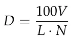
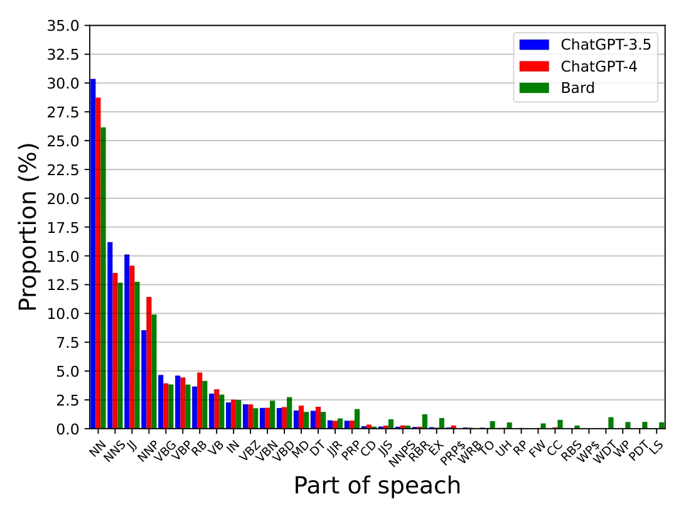
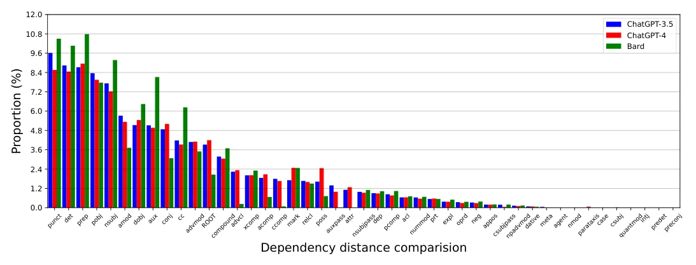
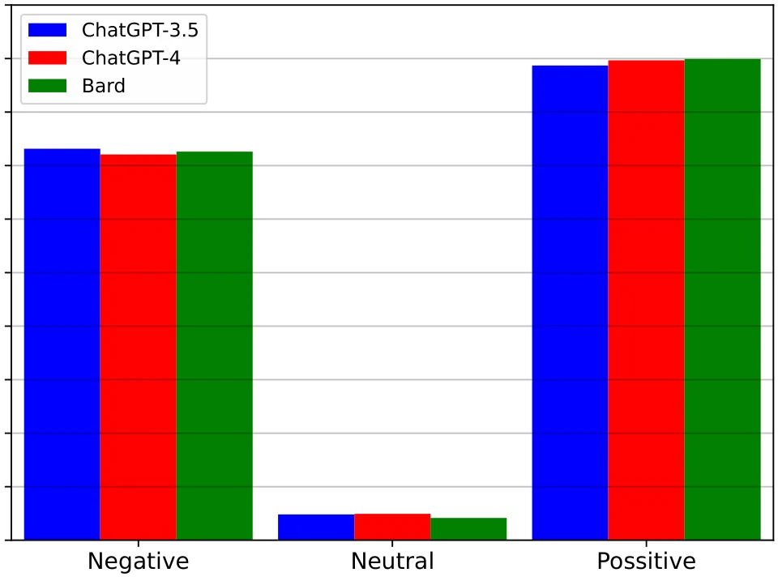
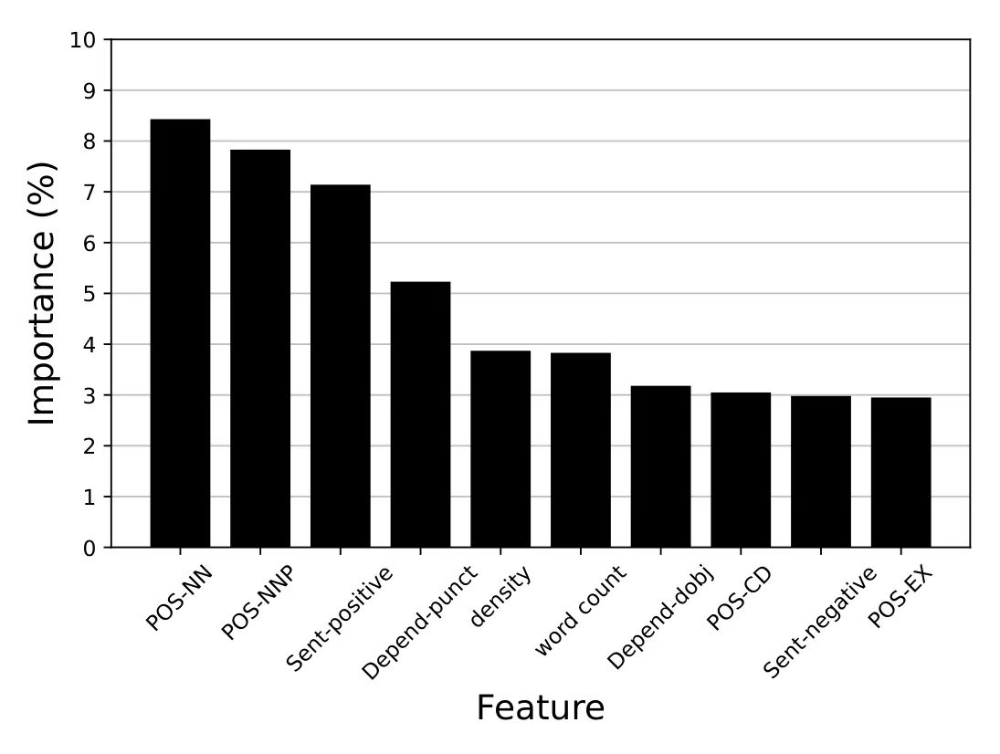

## 1. Introduction

Large Language Models (LLMs), such as GPT-3.5 [1], GPT-4 [2] and Bard [3], have revolutionized and popularized natural language processing and AI, demonstrating human-like and super-human performance in a wide range of text-based tasks [4–7]. While the layman may find the responses of LLMs hard to distinguish from human-generated ones [8,9], a plethora of recent literature has shown that it is possible to successfully discern human-generated text from LLM-generated text using various computational techniques [10–12]. Among the developed techniques, the *linguistic approach*, which focuses on the structure, patterns, and nuances inherent in human language, stands out as a promising option that offers both high statistical performance [13] as well as theoretically-grounded explanatory power [14], as opposed to alternative “black-box” machine learning techniques [15,16].

Indeed, recent literature has shown that human and LLM-generated texts are, generally speaking, linguistically different across a wide variety of tasks and datasets including news reporting [14], hotel reviewing [17], essay writing [13] and scientific communication [18] to name a few. Common to these and similar studies is the observation that LLM-generated texts tend to be extensive and comprehensive, highly organized, follow a logical structure or are formally stated, and present higher objectivity and lower prevalence of bias and harmful content compared to human-generated texts [19].

Extensive research into human-generated texts has consistently demonstrated the inherent diversity in human writing styles, resulting in distinct linguistic patterns, structures, and nuances [20–22]. Notably, highly successful techniques for author attribution [23,24] and author profiling [25,26] have leveraged linguistic markers to identify and differentiate between authors and their characteristics (sometimes referred to as Stylometrics [27]). These remarkable capabilities underscore both the richness and variability present in human-generated texts as well as the unique linguistic traits presented, rather consistently, by different authors. Unfortunately, to the best of our knowledge, a similar inquiry into LLM-generated texts has yet to take place. That is, it remains unclear whether different LLMs present distinct linguistic styles and, if so, whether these linguistic markers could be effectively used for LLM attribution (i.e., identifying which LLM has generated a given text).

In this work, we report on a comprehensive linguistic comparison of LLM-generated texts generated by three of the most popular LLMs today: GPT-3.5, GPT-4, and Bard. Using a wide range of topics and prompts, the results reveal that, indeed, these LLMs are linguistically different, particularly in terms of vocabulary, Part-of-Speech (POS), and dependencies. In turn, these linguistic markers are shown to bring about a remarkable performance when applied to the LLM attribution task.

## 2. Methods and Materials

### 2.1. Data

We build upon the highly influential Human ChatGPT Comparison Corpus (HC3) [28]. HC3 is the most utilized database today for comparing LLM to human-generated texts. In its English portion, it encompasses both human and GPT-3.5 responses (termed ChatGPT in the original manuscript) to identical inputs divided into five distinct datasets: Finance [29], Medicine [30], Long-Form Question Answering [31] (aka reddit\_eli5), Open-Domain Question Answering (aka open\_qa) [32], and Computer Science (aka wiki\_csai dataset) [28]. Here, we consider 1000 randomly sampled inputs from each dataset, along with their GPT- 3.5 responses. We then extend the database to include the matched responses provided by GPT-4 and Bard to these inputs. The GPT-3.5 responses were taken directly from the original HC3 corpus [28]. The additional GPT-4 and Bard responses were generated by submitting the same sampled HC3 inputs to each model. GPT-4 was accessed via the OpenAI API. Bard was accessed via the Google Bard web interface with code-based automation. No model-specific prompt adaptation was performed. The resulting database, which we term the LLM Comparison Corpus (LC2), consists of 5000 inputs and 15,000 responses (5000 from each examined LLM). LC2, along with our entire code. For reproducibility, the same prompting protocol was used across the examined LLMs. Specifically, each model was provided with the corresponding HC3 input using the prompt template reported in Appendix A.1. No model-specific prompt adaptation was performed.

### 2.2. Analytical Approach

Drawing upon the comprehensive linguistic analysis of HC3 [28], we analyze the key linguistic features of LC2 as follows: we examine possible linguistic differences in terms of vocabulary, POS, dependencies, and sentiment across the three LLMs (see [33] for a linguistic overview of these and related concepts). For clarity, we briefly define the main NLP concepts used throughout the analysis. Part-of-Speech (POS) tagging refers to the process of assigning each token in a text a grammatical category, such as noun, verb, adjective, adverb, or pronoun [34]. Dependency parsing, in contrast, analyzes the grammatical relations between tokens in a sentence [35]. In this framework, a sentence is represented as a directed graph: tokens (i.e., parts of words or full words) are represented as nodes, and directed edges indicate syntactic relations between them, such as nominal subject, direct object, adjectival modifier, or auxiliary verb. Thus, POS tagging characterizes individual tokens, whereas dependency parsing characterizes the syntactic relations among them. Following common practice in modern dependency-parsing systems, punctuation marks are also treated as tokens and may therefore appear as nodes in the dependency graph, with corresponding punctuation dependency relations. Finally, sentiment analysis refers to the automatic classification of the affective orientation of a text, commonly into categories such as positive, neutral, or negative sentiment [36].

Statistically, for comparing vocabulary, we use an ANOVA test with Tukey post hoc pairwise t-testing. Similarly, for comparing the distributions over POS and dependencies, we use Kolmagorov–Smirnov testing with the Bonferroni correction. For sentiment analysis, given its ordinal nature, we use a Wilcoxon signed-rank test. Notably, in our setting, sentiment analysis is used as a coarse linguistic marker capturing whether a generated response is predominantly positive, neutral, or negative in tone. Although sentiment is less syntactic than POS and dependency features, it captures another potentially relevant stylistic dimension of LLM-generated text, namely the affective orientation expressed in the response. Statistical significance is set to 0.05. Finally, we use the aforementioned linguistic markers as input to an off-the-shelf supervised machine learning model (XGBoost [37]) for the task LLM attribution—i.e., classifying a given text to its assumed LLM origin. The model’s performance is reported in standard form.

## 3. Results

### 3.1. Vocabulary

We start by examining the vocabulary presented by the studied LLMs. We focus on the following three characteristics: *Average length* (*L*)—the average number of words in each response; *Vocabulary size* (*V*)—the total number of unique words used in all responses; and *Density* (*D*)—which is defined as

where N is the number of responses in the relevant dataset. The results are summarized in Table 1.

<figure class="table-figure" id="table-1">
<figcaption><strong>Table 1.</strong> Average response length, vocabulary size, and density of GPT-3.5, GPT-4, and Bard using five datasets.</figcaption>

<table><tr><th>Dataset</th><th>LLM</th><th>Average Length</th><th>Vocabulary Size</th><th>Density</th></tr><tr><td></td><td>GPT-3.5</td><td>208.13</td><td>20,974</td><td>2.49</td></tr><tr><td>Finance</td><td>GPT-4</td><td>197.53</td><td>22,785</td><td>2.73</td></tr><tr><td></td><td>Bard</td><td>219.28</td><td>21,809</td><td>2.64</td></tr><tr><td></td><td>GPT-3.5</td><td>206.14</td><td>7910</td><td>3.11</td></tr><tr><td>Medicine</td><td>GPT-4</td><td>168.09</td><td>8827</td><td>5.69</td></tr><tr><td></td><td>Bard</td><td>180.16</td><td>7594</td><td>3.24</td></tr><tr><td></td><td>GPT-3.5</td><td>142.61</td><td>15,379</td><td>9.06</td></tr><tr><td>open_qa</td><td>GPT-4</td><td>88.42</td><td>12,097</td><td>16.93</td></tr><tr><td></td><td>Bard</td><td>65.74</td><td>10,829</td><td>17.34</td></tr><tr><td></td><td>GPT-3.5</td><td>191.38</td><td>45,198</td><td>1.40</td></tr><tr><td>reddit_eli5</td><td>GPT-4</td><td>151.18</td><td>48,095</td><td>2.05</td></tr><tr><td></td><td>Bard</td><td>133.70</td><td>46,147</td><td>1.87</td></tr><tr><td></td><td>GPT-3.5</td><td>202.39</td><td>9347</td><td>5.03</td></tr><tr><td>wiki_csai</td><td>GPT-4</td><td>215.05</td><td>10,074</td><td>6.73</td></tr><tr><td></td><td>Bard</td><td>186.18</td><td>9240</td><td>7.18</td></tr></table>

</figure>

Starting with the average length, the three LLMs are found to statistically differ from one another. Specifically, Bard provides the shortest average responses. In fact, it provides the shortest average answers in three out of the five datasets. In the remaining two datasets, Bard provides the longest average responses in one case and the second longest in the other. In addition, GPT-3.5 provides longer average responses than GPT-4 (i.e., in four of the five datasets). Turning to vocabulary size, once more, Bard provides the smallest number of unique words in three out of the five datasets whereas in the remaining two, it comes second to GPT-4. Interestingly, GPT-4 provides greater vocabulary size than GPT-3.5 in four of the five settings. When considering density, GPT-4 demonstrates the highest density metric in three of the five datasets whereas in the remaining two datasets, Bard brings about a higher density.

Taken jointly, Bard seems to provide shorter responses compared to GPT-3.5 and GPT- 4 while also presenting smaller vocabulary size and relatively high density. In addition, GPT-4 seems to provide shorter responses than GPT-3.5 while presenting higher vocabulary size and density.

### 3.2. Part-of-Speech (POS)

Next, we examine the POS distribution of the provided responses (the complete list, along with their abbreviations and complete results, are provided in Appendix A). The results are summarized in Figure 1. The three LLMs provide statistically different POS distributions.

<figure id="fig-1">

<figcaption><strong>Figure 1.</strong> Part-of-Speech (POS) distribution comparison between GPT-3.5, GPT-4, and Bard.</figcaption>
</figure>

We start by examining the use of nouns and adjectives, the most prevalent POSs for all three LLMs. Starting with nouns, we see that GPT-3.5 uses nouns more often than the other LLMs both in singular (NN: 30.36% vs. 28.73% by GPT-4 and 26.15% by Bard) and plural form (NNS: 16.19% vs. 13.51% by GPT-4 and 12.67% by Bard). In turn, GPT-4 uses nouns more often than Bard in both forms, although the differences are much smaller. That is not the case for singular-form proper nouns (NNP), which are around twice less prevalent than non-proper nouns (NN), where GPT-4 demonstrates higher use patterns than Bard (11.43% vs. 9.91%) which, in turn, uses them more often than GPT-3.5 (8.55%). When plural-form proper nouns (NNPS) are considered, all LLMs scarcely use them (all are below 0.3% prevalence). However, GPT-3.5 uses them almost two times less often than the others (0.17% compared to 0.29% and 0.26% by GPT-4 and Bard, respectively). Turning to adjectives (JJ) and the significantly less prevalent comparative adjectives (JJR), once more, we see that GPT-3.5 provides the greatest prevalence followed by GPT-4 and Bard (JJ: 15.12%, 14.15%, 12.75%; JJR: 0.72%, 0.68%, 0.89%). When superlative adjectives (JJS) are concerned, all LLMs rarely use them (all are below 0.9%). However, Bard uses them more often as the GPT-4 which, in turn, uses them more than GPT-3.5 (0.82% vs. 0.26%, 0.19%).

Considering verbs and adverbs, the results point to very minor differences between the LLMs. Specifically, GPT-3.5 slightly uses present tense verbs (VBG and VBP) more often than the others whereas Bard uses past verbs (VBN and VBD) and third-person verbs (VBZ) slightly more often. In turn, GPT-4 presents a marginally higher use of base-form verbs (VB) than the others (for the complete results, see Appendix A). Turning to adverbs, GPT-3.5 presents a lower use of adverbs (3.66%) compared to GPT-4 and Bard (4.87% and 4.15%, respectively).

The remaining POSs (7.26–23% of the text), encompass a relatively small portion of the text. However, considerable differences between the LLMs are encountered. Specifically, Bard presents a relatively high use of personal pronouns (PRP: 1.7% vs. 0.69% by GPT-3.5 and 0.7% by GPT-4), existential theres (EX: 0.92% vs. 0.13% by GPT-3.5 and 0.09% by GPT-4), coordinating conjunctions (CC: 0.76% vs. 0.02% by GPT-4 and 0.11% by GPT-3.5), foreign words (FW: 0.45% vs. 0.03% by GPT-3.5 and 0.05% by GPT-4), list markers (LS: 0.55% vs. 0% by GPT-3.5 and 0% by GPT-4), wh-pronouns (WP: 0.58% vs. 0% by GPT-3.5 and 0.01% by GPT-4), wh-determiners (WDT: 1.00% vs. 0% by GPT-3.5 and 0.01% by GPT-4), and interjections (UH: 0.53% vs. 0.06% by GPT-3.5 and 0.08% by GPT-4). More broadly speaking, when non-negligible use of POSs is considered (i.e., over 0.25% prevalence), Bard presents conspicuously diverse use patterns (88.5%) compared to GPT-3.5 and GPT-4 (48.6% and 60.0%, respectively).

Overall, notable differences are observed in the POS distributions associated with the examined LLMs. The differences seem to span over both highly frequent POSs (i.e., noun) and low-frequency POSs (i.e., existential there). Most notably, significant differences are observed in the presence of low-frequency POSs with Bard typically using them more often.

### 3.3. Dependency Parsing

Next, we examine the distribution of key dependencies in the provided responses, as summarized in Figure 2 (the complete list, along with their abbreviations and complete results, are provided in Appendix A). Each dependency represents a directed syntactic relation between two tokens, where one token functions as the syntactic head and the other as its dependent. For example, in a dependency relation such as nominal subject, the subject token is linked to the predicate it depends on. Since the parser treats punctuation as tokens, punctuation marks are included in the resulting dependency graph and may be assigned a punctuation dependency relation. The results are summarized in Figure 4. Statistically, GPT-3.5 and GPT-4 do not differ significantly in terms of dependencies (*p* = 0.13) while BARD does differ from both at *p <* 0.05.

<figure id="fig-2">

<figcaption><strong>Figure 2.</strong> Top 30 dependency relations comparison between GPT-3.5, GPT-4, and Bard.</figcaption>
</figure>

Given the wide variety of dependency types, we discuss the prominent differences only for dependencies with at least 1% prevalence (for at least one of the examined LLMs). Starting with the three most prevalent dependency types in the data, punctuation, determiner, and preposition, we see that Bard uses them more often than GPT-3.5 and GPT-4 (punct: 10.5% vs. 9.62%, 8.56%; det: 10.06% vs. 8.84%, 8.46%; prep: 10.78% vs. 8.73%, 8.95%). Other noteworthy differences include Bard’s higher use of nominal subjects (nsubj: 9.17% vs. 7.72%, 7.23%), direct objects (dobj: 6.44% vs. 5.13%, 5.44%), auxiliary (aux: 8.12% vs. 5.12%, 4.96%) and coordinating conjunctions (cc: 6.23% vs. 4.18%, 3.93%), and lower use of adjectival modifier (amod: 3.72% vs. 5.13%, 5.44%), conjunct (conj: 3.07% vs. 4.87%, 5.2%), root dependencies (ROOT: 2.06% vs. 3.92%, 4.19%), adverbial clause modifier (advcl: 0.23% vs. 2.24% and 2.33%), adjectival complement (acomp: 0.67% vs. 1.85%, 2.07%), clausal complement (ccomp: 0.08% vs. 1.79%, 1.66%), possession modifiers (poss: 0.72% vs. 1.62%, 2.45%), passive auxiliaries (auxpass: 0% vs. 1.39%, 0.99%) and attributions (attr: 0% vs. 1.11%, 1.27%).

Overall, while no significant differences are observed between GPT-3.5 and GPT- 4, Bard seems to significantly differ from both with a distinctively higher use of highly frequent dependencies (i.e., punctuation, determination, preposition, direct object, auxiliary verb, etc) and a lower use of other dependencies (i.e., adverbial clause modifier, adjectival complement, clausal complement, attributions, etc).

### 3.4. Sentiment Analysis

Considering sentiment, the three LLMs do not present statistically significant differences *p* = 0.284, as presented in Figure 3. Therefore, sentiment should not be interpreted as an independently distinctive marker for differentiating between GPT-3.5, GPT-4, and Bard. Rather, the sentiment distributions suggest that the three examined LLMs express broadly similar affective orientations in their responses. All three LLMs tend to produce positive sentiment (GPT-3.5: 53.8%; GPT-4: 53.3%; and Bard: 53.22%) with relatively few cases of neutral sentiment (GPT-3.5: 2.96%; GPT-4: 3.75%; and Bard: 2.89%).

### 3.5. Baseline and Ablation Analysis

In order to further examine which linguistic feature families contribute to the LLM-attribution performance, we conducted additional baseline and ablation analyses. First, we considered a majority-class baseline, which always predicts the most frequent class. Since the attribution task is balanced across the three examined LLMs, this baseline obtains an accuracy of approximately 0.33. Second, we trained separate models using each feature family independently: vocabulary features, POS features, dependency features, and sentiment features. Finally, we conducted leave-one-feature-family-out ablations, in which each feature group was removed from the full linguistic feature set in turn.

<figure id="fig-3">

<figcaption><strong>Figure 3.</strong> Sentiment distribution over the responses generated by GPT-3.5, GPT-4, and Bard.</figcaption>
</figure>

The results are reported in Table 2. Overall, the results indicate that attribution performance is not driven by a single linguistic marker alone. Rather, vocabulary, POS, and dependency features all contribute to the model’s performance, whereas sentiment alone provides limited discriminatory power. The best performance is obtained when all feature families are combined, suggesting that the attribution model relies on a multivariate linguistic profile of the generated text.

<figure class="table-figure" id="table-2">
<figcaption><strong>Table 2.</strong> Baseline and ablation results for the LLM-attribution task. The results are shown as the mean of <em>k</em> = 5 folds.</figcaption>

<table><tr><th>Feature Setting</th><th>Accuracy</th><th>F1 Score</th></tr><tr><td>Majority-class baseline</td><td>0.33</td><td>0.17</td></tr><tr><td>Vocabulary only</td><td>0.73</td><td>0.72</td></tr><tr><td>POS only</td><td>0.79</td><td>0.78</td></tr><tr><td>Dependency only</td><td>0.76</td><td>0.75</td></tr><tr><td>Sentiment only</td><td>0.36</td><td>0.31</td></tr><tr><td>All features except vocabulary</td><td>0.84</td><td>0.83</td></tr><tr><td>All features except POS</td><td>0.82</td><td>0.81</td></tr><tr><td>All features except dependency</td><td>0.83</td><td>0.82</td></tr><tr><td>All features except sentiment</td><td>0.87</td><td>0.86</td></tr><tr><td>All features</td><td>0.88</td><td>0.87</td></tr></table>

</figure>

### 3.6. LLM Attribution

Here, we consider the task of LLM attribution. That is, given a text, we wish to classify it to its LLM source. Recall that in this study, we are primarily interested in investigating the linguistic differences between LLMs and their potential use as indicators for LLM attribution. As such, we opt for an off-the-shelf XGboost model that receives the above linguistic profile of a given text as input (i.e., vocabulary, POS distribution, dependency distribution, and sentiment) and classifies it into one of the three LLMs (i.e., its origin).

We used a grouped *k*-fold cross-validation approach with *k* = 5. The grouping unit was the original HC3 input prompt. That is, for each sampled input *q*i, the corresponding responses generated by GPT-3.5, GPT-4, and Bard were always assigned to the same fold. Therefore, responses originating from the same prompt could not appear in both the training and test sets. The split was additionally stratified by dataset, such that in each fold the relative portion of train and test instances from each of the five HC3 datasets was identical. Concretely, each fold used approximately 80% of the original prompts for training and 20% for testing, with all model-specific responses to a given prompt kept together. Note that, presumably, more advanced and fine-tuned models could be developed for the task of LLM attribution; however, these are outside the focus of our analysis.

Our results show a high accuracy of 0.88 with *F*1 score of 0.87. Table 3 presents the classification performance of the XGboost model for each LLM and the average performance. The results are shown as the mean of *k* = 5 folds.

<figure class="table-figure" id="table-3">
<figcaption><strong>Table 3.</strong> Classification performance of the linguistic-based XGboost model for each LLM and the average performance. The results are shown as the mean of <em>k</em> = 5 folds.</figcaption>

<table><tr><th></th><th>Prediction</th><th>Recall</th><th>F1 Score</th><th>Accuracy</th><th>Support</th></tr><tr><td>GPT-3.5</td><td>0.90</td><td>0.82</td><td>0.86</td><td>0.87</td><td>1000</td></tr><tr><td>GPT-4</td><td>0.82</td><td>0.84</td><td>0.83</td><td>0.85</td><td>1000</td></tr><tr><td>Bard</td><td>0.94</td><td>0.89</td><td>0.91</td><td>0.92</td><td>1000</td></tr><tr><td>Average</td><td>0.89</td><td>0.85</td><td>0.87</td><td>0.88</td><td>3000</td></tr></table>

</figure>

Feature importance is extracted using the information gain method and is reported in Figure 4. Note that linguistic features from all examined aspects (i.e., vocabulary, POS, dependency, and sentiment) are present in the top ten most important features of the model; however, this should be understood as their relative contribution to the multivariate classifier rather than as evidence that each feature type is independently distinctive across the three LLMs. These are led by the noun (NN) and proper noun (NNP) POSs, positive sentiment, punctuation dependency (punct), and the vocabulary’s density and word count. Importantly, feature importance in the XGBoost model should not be interpreted in the same way as the univariate statistical comparisons reported above. A feature may contribute to the classifier in tandem with other features, even when it does not show a statistically significant difference when examined independently. Accordingly, the appearance of sentiment-related features among the top-ranked features does not imply that sentiment is, by itself, a distinctive marker of a specific LLM. Instead, it indicates that sentiment provides some information gain within the multivariate classification model, in interaction with the broader linguistic profile of the text.

Additional baseline and ablation analyses are reported in Section 3.5. These analyses align with the above results and further indicate that the attribution performance is driven primarily by the combination of vocabulary, POS, and dependency features, rather than solely by sentiment or by any single feature family.

<figure id="fig-4">

<figcaption><strong>Figure 4.</strong> Feature importance of the top 10 most important features of the XGboost model.</figcaption>
</figure>

## 4. Discussion

In this study, we analyzed and compared the linguistic characteristics of three of the most popular LLMs today: GPT-3.5, GPT-4, and Bard. Our results combine to suggest that, just like human authors, LLMs are linguistically distinguishable. Specifically, the results show that different LLMs present different linguistic markers, especially in terms of vocabulary, POS, and dependencies. In contrast, sentiment does not significantly differ across the three examined LLMs when analyzed independently, and should therefore be viewed only as a feature that may contribute to attribution in combination with other linguistic markers. These and similar differences are shown to be effectively used for LLM attribution—i.e., the identification of which LLM generated a given text, with a remarkably high accuracy.

This key result has important theoretical and practical implications. From a theoretical perspective, this result seems to affirm the potential of LLMs to reproduce some of the diversity inherent in human language expression. That is, different LLMs tend to display different linguistic styles, akin to how human authors do. Furthermore, the observed differences could advance our understanding of the potential impact of various design and training decisions on the linguistic style presented by an LLM. We plan to conduct such an inquiry in future work. From a practical perspective, the identified differences could aid in model comparison and evaluation, and guide the selection and development of LLMs for specific purposes and applications [38–40]. Moreover, we believe that the results should be taken into consideration for the important task of LLM detection [41,42]. The present findings suggest that LLM detection should not be viewed solely as a binary distinction between human-generated and machine-generated text [43]. Instead, LLM-generated texts may themselves constitute a heterogeneous class, with different models exhibiting different linguistic profiles. This observation may have important implications, as many detection models are trained and evaluated on texts generated by a limited set of models and may therefore learn markers specific to those models rather than to LLM-generated text more generally. Specifically, a detector trained primarily on outputs from one LLM may show reduced reliability when applied to outputs generated by another LLM, especially when the models differ in vocabulary, POS distribution, dependency structure, or other stylistic properties. Therefore, we speculate that future LLM-detection systems could benefit from incorporating model-specific linguistic markers, both to improve robustness across different LLMs and to provide more interpretable evidence for detection decisions. From this perspective, LLM attribution and LLM detection are complementary tasks: attribution can reveal which linguistic markers distinguish among different generators, while detection can leverage this information to construct broader, more reliable human-versus-LLM classifiers. At the same time, it is important to note that our study should not be interpreted as proposing a complete LLM-detection framework; rather, it highlights a source of variation that detection systems could capitalize on when targeting cross-model generalization.

This study is not without limitations. First, our analysis focuses on a diverse, yet limited, cohort of datasets. As such, an investigation into different datasets may result in slightly different outcomes, depending on the nature of the inputs provided to the LLM. Second, the linguistic style is collected for the zero-shot case where the LLMs do not have any context. Thus, our study focuses on the most simplistic use-case of these advanced tools where context does not play a role. Future works may replicate our analysis with different datasets and contexts, providing a wider perspective on the matter. Additionally, our analysis focuses on the English language. Studying the differences between LLMs across languages can be valuable to a wider range of applications and use cases.

**Author Contributions:** Conceptualization, T.L. and A.R.; methodology, T.L. and A.R.; software, T.L. and A.R.; validation, T.L. and A.R.; formal analysis, T.L. and A.R.; investigation, T.L. and A.R.; data curation, T.L. and A.R.; writing—original draft, T.L. and A.R.; writing—review & editing, T.L.; visualization, T.L. and A.R.; supervision, T.L.; and project administration, A.R. All authors have read and agreed to the published version of the manuscript.

**Funding:** This research received no external funding.

**Data Availability Statement:** The data presented in this study are openly available in [Github].

**Conflicts of Interest:** The authors declare no conflicts of interest

## Appendix A

*Appendix A.1. Prompting Protocol* Since prompting may affect the linguistic style of LLM-generated text, we report here the exact prompting protocol used to generate the additional responses analyzed in this study. For each input *q*i sampled from HC3, the same prompt template was used for GPT-4 and Bard:

Please answer the following question: {*q*i}

That is, the original HC3 input was submitted verbatim to the model, without additional task-specific instructions, style instructions, examples, or model-specific modifications. The GPT-3.5 responses were taken from the original HC3 corpus, which pairs the same inputs with GPT-3.5-generated answers. Thus, all three LLMs were compared on responses to the same underlying inputs.

### Appendix A.2. Additional Results

<figure class="table-figure" id="table-a1">
<figcaption><strong>Table A1.</strong> Sentiment distribution.</figcaption>

<table><tr><th>LLM</th><th>Negative</th><th>Neutral</th><th>Positive</th></tr><tr><td>GPT-3.5</td><td>43.24</td><td>2.96</td><td>53.80</td></tr><tr><td>GPT-4</td><td>42.95</td><td>3.75</td><td>53.30</td></tr><tr><td>Bard</td><td>43.89</td><td>2.89</td><td>53.22</td></tr></table>

</figure>

<figure class="table-figure" id="table-x5">

<table><tr><th>POS</th><th>Symbol</th><th>GPT-3.5</th><th>GPT-4</th><th>Bard</th></tr><tr><td>noun singular</td><td>NN</td><td>30.36</td><td>28.73</td><td>26.15</td></tr><tr><td>noun plural</td><td>NNS</td><td>16.19</td><td>13.51</td><td>12.67</td></tr><tr><td>adjective</td><td>JJ</td><td>15.12</td><td>14.15</td><td>12.75</td></tr><tr><td>proper noun, singular</td><td>NNP</td><td>8.55</td><td>11.43</td><td>9.91</td></tr><tr><td>verb, gerund/present participle</td><td>VBG</td><td>4.66</td><td>3.93</td><td>3.84</td></tr><tr><td>verb, singular, present, non-3d</td><td>VBP</td><td>4.61</td><td>4.45</td><td>3.83</td></tr><tr><td>adverb</td><td>RB</td><td>3.66</td><td>4.87</td><td>4.15</td></tr><tr><td>verb, base form</td><td>VB</td><td>3.04</td><td>3.42</td><td>2.96</td></tr><tr><td>preposition/subordinating conjunction</td><td>IN</td><td>2.27</td><td>2.52</td><td>2.49</td></tr><tr><td>verb, 3rd person singular present</td><td>VBZ</td><td>2.12</td><td>2.11</td><td>1.77</td></tr><tr><td>verb, past participle</td><td>VBN</td><td>1.8</td><td>1.81</td><td>2.43</td></tr><tr><td>verb, past tense</td><td>VBD</td><td>1.79</td><td>1.88</td><td>2.74</td></tr><tr><td>modal</td><td>MD</td><td>1.58</td><td>1.99</td><td>1.45</td></tr><tr><td>determiner</td><td>DT</td><td>1.55</td><td>1.9</td><td>1.45</td></tr><tr><td>adjective, comparative</td><td>JJR</td><td>0.72</td><td>0.68</td><td>0.89</td></tr><tr><td>personal pronoun</td><td>PRP</td><td>0.69</td><td>0.7</td><td>1.7</td></tr><tr><td>cardinal digit</td><td>CD</td><td>0.21</td><td>0.35</td><td>0.18</td></tr><tr><td>adjective, superlative</td><td>JJS</td><td>0.19</td><td>0.26</td><td>0.82</td></tr><tr><td>proper noun, plural</td><td>NNPS</td><td>0.17</td><td>0.29</td><td>0.26</td></tr><tr><td>adverb, comparative</td><td>RBR</td><td>0.15</td><td>0.17</td><td>1.25</td></tr><tr><td>existential there</td><td>EX</td><td>0.13</td><td>0.09</td><td>0.92</td></tr><tr><td>possessive pronoun</td><td>PRP$</td><td>0.1</td><td>0.28</td><td>0</td></tr><tr><td>wh-abverb</td><td>WRB</td><td>0.1</td><td>0.08</td><td>0</td></tr><tr><td>to go ‘to’</td><td>TO</td><td>0.08</td><td>0.05</td><td>0.65</td></tr><tr><td>interjection</td><td>UH</td><td>0.06</td><td>0.08</td><td>0.53</td></tr><tr><td>particle</td><td>RP</td><td>0.04</td><td>0.06</td><td>0</td></tr><tr><td>foreign word</td><td>FW</td><td>0.03</td><td>0.05</td><td>0.45</td></tr><tr><td>coordinating conjunction</td><td>CC</td><td>0.02</td><td>0.11</td><td>0.76</td></tr><tr><td>possessive ending</td><td>RBS</td><td>0.02</td><td>0.01</td><td>0.27</td></tr><tr><td>possessive wh-pronoun</td><td>WP$</td><td>0</td><td>0.01</td><td>0</td></tr><tr><td>wh-determiner</td><td>WDT</td><td>0</td><td>0.01</td><td>1</td></tr><tr><td>wh-pronoun</td><td>WP</td><td>0</td><td>0.01</td><td>0.58</td></tr><tr><td>predeterminer</td><td>PDT</td><td>0</td><td>0</td><td>0.59</td></tr><tr><td>list marker</td><td>LS</td><td>0</td><td>0</td><td>0.55</td></tr></table>

</figure>

<figure class="table-figure" id="table-x6">

<table><tr><th>Dependency</th><th>Symbol</th><th>GPT-3.5</th><th>GPT-4</th><th>Bard</th></tr><tr><td>punctuation</td><td>punct</td><td>9.62</td><td>8.56</td><td>10.5</td></tr><tr><td>determiner</td><td>det</td><td>8.84</td><td>8.46</td><td>10.06</td></tr><tr><td>Prepositional modifier</td><td>prep</td><td>8.73</td><td>8.95</td><td>10.78</td></tr><tr><td>Preposition object</td><td>pobj</td><td>8.36</td><td>7.95</td><td>7.77</td></tr><tr><td>Nominal subject</td><td>nsubj</td><td>7.72</td><td>7.23</td><td>9.17</td></tr><tr><td>Adjectival modifier</td><td>amod</td><td>5.72</td><td>5.33</td><td>3.72</td></tr><tr><td>Direct Object</td><td>dobj</td><td>5.13</td><td>5.44</td><td>6.44</td></tr><tr><td>Auxiliary verb</td><td>aux</td><td>5.12</td><td>4.96</td><td>8.12</td></tr><tr><td>Conjunct</td><td>conj</td><td>4.87</td><td>5.2</td><td>3.07</td></tr><tr><td>Coordinating conjunction</td><td>cc</td><td>4.18</td><td>3.93</td><td>6.23</td></tr><tr><td>Adverbial modifier</td><td>advmod</td><td>4.08</td><td>4.1</td><td>3.49</td></tr><tr><td>Root</td><td>ROOT</td><td>3.92</td><td>4.19</td><td>2.06</td></tr><tr><td>Compound word</td><td>compound</td><td>3.17</td><td>3.05</td><td>3.69</td></tr><tr><td>Adverbial clause modifier</td><td>advcl</td><td>2.24</td><td>2.33</td><td>0.23</td></tr><tr><td>Open clausal complement</td><td>xcomp</td><td>2.01</td><td>2.02</td><td>2.3</td></tr><tr><td>Adjectival complement</td><td>acomp</td><td>1.85</td><td>2.07</td><td>0.67</td></tr><tr><td>Clausal complement</td><td>ccomp</td><td>1.79</td><td>1.66</td><td>0.08</td></tr><tr><td>Marker</td><td>mark</td><td>1.71</td><td>2.47</td><td>2.47</td></tr><tr><td>Relative clause modifier</td><td>relcl</td><td>1.66</td><td>1.6</td><td>1.5</td></tr><tr><td>Possession modifier</td><td>poss</td><td>1.62</td><td>2.45</td><td>0.72</td></tr><tr><td>Auxiliary verb (passive)</td><td>auxpass</td><td>1.39</td><td>0.99</td><td>0</td></tr><tr><td>Attribute</td><td>attr</td><td>1.11</td><td>1.27</td><td>0</td></tr><tr><td>Nominal subject (passive)</td><td>nsubjpass</td><td>0.99</td><td>0.93</td><td>1.1</td></tr><tr><td>Unclassified dependent</td><td>dep</td><td>0.9</td><td>0.88</td><td>1.02</td></tr><tr><td>Preposition complement</td><td>pcomp</td><td>0.84</td><td>0.76</td><td>1.04</td></tr><tr><td>Clausal modifier of noun</td><td>acl</td><td>0.64</td><td>0.64</td><td>0.71</td></tr><tr><td>Number</td><td>nummod</td><td>0.64</td><td>0.56</td><td>0.68</td></tr><tr><td>Verb particle</td><td>prt</td><td>0.54</td><td>0.57</td><td>0.54</td></tr><tr><td>Expletive</td><td>expl</td><td>0.37</td><td>0.37</td><td>0.5</td></tr><tr><td>Object predicate</td><td>oprd</td><td>0.34</td><td>0.29</td><td>0.37</td></tr><tr><td>Negation modifier</td><td>neg</td><td>0.32</td><td>0.29</td><td>0.38</td></tr><tr><td>Appositional modifier</td><td>appos</td><td>0.19</td><td>0.19</td><td>0.2</td></tr><tr><td>Clausal subject (passive)</td><td>csubjpass</td><td>0.19</td><td>0.05</td><td>0.19</td></tr><tr><td>Noun phrase as adverbial modifier</td><td>npadvmod</td><td>0.13</td><td>0.1</td><td>0.14</td></tr><tr><td>Dative</td><td>dative</td><td>0.08</td><td>0.08</td><td>0.06</td></tr><tr><td>Meta data</td><td>meta</td><td>0.05</td><td>0.01</td><td>0</td></tr><tr><td>Agent (passive)</td><td>agent</td><td>0</td><td>0</td><td>0</td></tr><tr><td>Modifier of nominal</td><td>nmod</td><td>0</td><td>0</td><td>0</td></tr><tr><td>Parataxis</td><td>parataxis</td><td>0</td><td>0.06</td><td>0</td></tr><tr><td>Case marker</td><td>case</td><td>0</td><td>0</td><td>0</td></tr><tr><td>Clausal subject</td><td>csubj</td><td>0</td><td>0.01</td><td>0</td></tr></table>

</figure>

## References

1. Ouyang, L.; Wu, J.; Jiang, X.; Almeida, D.; Wainwright, C.; Mishkin, P.; Zhang, C.; Agarwal, S.; Slama, K.; Ray, A.; et al. Training language models to follow instructions with human feedback. Adv. Neural Inf. Process. Syst. 2022, 35, 27730–27744.
2. Achiam, J.; Adler, S.; Agarwal, S.; Ahmad, L.; Akkaya, I.; Aleman, F.L.; Almeida, D.; Altenschmidt, J.; Altman, S.; Anadkat, S.; et al. Gpt-4 technical report. arXiv 2023, arXiv:2303.08774. [doi:10.48550/arXiv.2303.08774](https://doi.org/10.48550/arXiv.2303.08774)
3. McGowan, A.; Gui, Y.; Dobbs, M.; Shuster, S.; Cotter, M.; Selloni, A.; Goodman, M.; Srivastava, A.; Cecchi, G.A.; Corcoran, C.M. ChatGPT and Bard exhibit spontaneous citation fabrication during psychiatry literature search. Psychiatry Res. 2023, 326, 115334. [doi:10.1016/j.psychres.2023.115334](https://doi.org/10.1016/j.psychres.2023.115334)
4. Zhao, W.X.; Zhou, K.; Li, J.; Tang, T.; Wang, X.; Hou, Y.; Min, Y.; Zhang, B.; Zhang, J.; Dong, Z.; et al. A survey of large language models. arXiv 2023, arXiv:2303.18223. [doi:10.1007/s11704-026-60308-3](https://doi.org/10.1007/s11704-026-60308-3)
5. Ben-Zion, Z.; Simon, G.; Lazebnik, T. Can LLMs Get High? A Dual-Metric Framework for Evaluating Psychedelic Simulation and Safety in Large Language Models. Res. Sq. 2026.
6. Taskin, B.; Xie, W.; Lazebnik, T. Knowledge integration for physics-informed symbolic regression using pre-trained large language models. Sci. Rep. 2026, 16, 1614. [doi:10.1038/s41598-026-35327-6](https://doi.org/10.1038/s41598-026-35327-6)
7. Lazebnik, T.; Shami, L. Investigating tax evasion emergence using dual large language model and deep reinforcement learning powered agent-based simulation. arXiv 2025, arXiv:2501.18177. [doi:10.48550/arXiv.2501.18177](https://doi.org/10.48550/arXiv.2501.18177)
8. Sadasivan, V.S.; Kumar, A.; Balasubramanian, S.; Wang, W.; Feizi, S. Can AI-Generated Text be Reliably Detected? arXiv 2023, arXiv:2303.11156.
9. Casal, J.E.; Kessler, M. Can linguists distinguish between ChatGPT/AI and human writing?: A study of research ethics and academic publishing. Res. Methods Appl. Linguist. 2023, 2, 100068. [doi:10.1016/j.rmal.2023.100068](https://doi.org/10.1016/j.rmal.2023.100068)
10. Tang, R.; Chuang, Y.N.; Hu, X. The Science of Detecting LLM-Generated Texts. arXiv 2023, arXiv:2303.07205. [doi:10.1145/3624725](https://doi.org/10.1145/3624725)
11. Deng, Z.; Gao, H.; Miao, Y.; Zhang, H. Efficient Detection of LLM-generated Texts with a Bayesian Surrogate Model. arXiv 2023, arXiv:2305.16617. [doi:10.48550/arXiv.2305.16617](https://doi.org/10.48550/arXiv.2305.16617)
12. Koike, R.; Kaneko, M.; Okazaki, N. OUTFOX: LLM-generated Essay Detection through In-context Learning with Adversarially Generated Examples. arXiv 2023, arXiv:2307.11729. [doi:10.1609/aaai.v38i19.30120](https://doi.org/10.1609/aaai.v38i19.30120)
13. Herbold, S.; Hautli-Janisz, A.; Heuer, U.; Kikteva, Z.; Trautsch, A. A large-scale comparison of human-written versus ChatGPT-generated essays. Sci. Rep. 2023, 13, 18617.
14. Muñoz-Ortiz, A.; Gómez-Rodríguez, C.; Vilares, D. Contrasting linguistic patterns in human and llm-generated text. arXiv 2023, arXiv:2308.09067. [doi:10.1007/s10462-024-10903-2](https://doi.org/10.1007/s10462-024-10903-2)
15. Bhattacharjee, A.; Kumarage, T.; Moraffah, R.; Liu, H. ConDA: Contrastive Domain Adaptation for AI-generated Text Detection. In Proceedings of the 13th International Joint Conference on Natural Language Processing and the 3rd Conference of the Asia-Pacific Chapter of the Association for Computational Linguistics; Association for Computational Linguistics: Stroudsburg, PA, USA, 2023; pp. 598–610.
16. Su, J.; Zhuo, T.Y.; Wang, D.; Nakov, P. DetectLLM: Leveraging Log Rank Information for Zero-Shot Detection of Machine- Generated Text. arXiv 2023, arXiv:2306.05540.
17. Giorgi, S.; Markowitz, D.M.; Soni, N.; Varadarajan, V.; Mangalik, S.; Schwartz, H.A. I slept like a baby: Using human traits to characterize deceptive ChatGPT and human text. In Proceedings of the International workshop on implicit author characterization from texts for search and retrieval (IACT’23), Taipei, Taiwan, 27 July 2023 .
18. Desaire, H.; Chua, A.E.; Isom, M.; Jarosova, R.; Hua, D. Distinguishing academic science writing from humans or ChatGPT with over 99% accuracy using off-the-shelf machine learning tools. Cell Rep. Phys. Sci. 2023, 4, 101426. [doi:10.1016/j.xcrp.2023.101426](https://doi.org/10.1016/j.xcrp.2023.101426)
19. Wu, J.; Yang, S.; Zhan, R.; Yuan, Y.; Wong, D.F.; Chao, L.S. A survey on llm-gernerated text detection: Necessity, methods, and future directions. arXiv 2023, arXiv:2310.14724.
20. Savchenko, E.; Lazebnik, T. Computer aided functional style identification and correction in modern Russian texts. J. Data Inf. Manag. 2022, 4, 25–32. [doi:10.1007/s42488-021-00062-2](https://doi.org/10.1007/s42488-021-00062-2)
21. McNamara, D.S.; Crossley, S.A.; McCarthy, P.M. The linguistic features of writing quality. Writ. Commun. 2010, 27, 57–86. [doi:10.1177/0741088309351547](https://doi.org/10.1177/0741088309351547)
22. Snow, E.L.; Allen, L.K.; Jacovina, M.E.; Perret, C.A.; McNamara, D.S. You’ve Got Style: Detecting Writing Flexibility across Time. In Proceedings of the Fifth International Conference on Learning Analytics and Knowledge; Association for Computing Machinery: New York, NY, USA, 2015; pp. 194–202.
23. Matsuda, P.K.; Tardy, C.M. Voice in academic writing: The rhetorical construction of author identity in blind manuscript review. Engl. Specif. Purp. 2007, 26, 235–249. [doi:10.1016/j.esp.2006.10.001](https://doi.org/10.1016/j.esp.2006.10.001)
24. Lample, G.; Subramanian, S.; Smith, E.; Denoyer, L.; Ranzato, M.; Boureau, Y. Multiple-Attribute Text Rewriting. In Proceedings of the International Conference on Learning Representations, New Orleans, LO, USA, 6–9 May 2019.
25. Hartley, J.; Pennebaker, J.W.; Fox, C. Using New Technology to Assess the Academic Writing Styles of Male and Female Pairs and Individuals. J. Tech. Writ. Commun. 2003, 33, 243–261. [doi:10.2190/9VPN-RRX9-G0UF-CJ5X](https://doi.org/10.2190/9VPN-RRX9-G0UF-CJ5X)
26. Hartley, J.; Howe, M.; McKeachie, W. Writing through time: Longitudinal studies of the effects of new technology on writing. Br. J. Educ. Technol. 2001, 32, 141–151. [doi:10.1111/1467-8535.00185](https://doi.org/10.1111/1467-8535.00185)
27. Lagutina, K.; Lagutina, N.; Boychuk, E.; Vorontsova, I.; Shliakhtina, E.; Belyaeva, O.; Paramonov, I.; Demidov, P.G. A Survey on Stylometric Text Features. In Proceedings of the 2019 25th Conference of Open Innovations Association (FRUCT), Helsinki, Finland, 5–8 November 2019; pp. 184–195.
28. Guo, B.; Zhang, X.; Wang, Z.; Jiang, M.; Nie, J.; Ding, Y.; Yue, J.; Wu, Y. How close is chatgpt to human experts? comparison corpus, evaluation, and detection. arXiv 2023, arXiv:2301.07597. [doi:10.48550/arXiv.2301.07597](https://doi.org/10.48550/arXiv.2301.07597)
29. Maia, M.; Handschuh, S.; Freitas, A.; Davis, B.; McDermott, R.; Zarrouk, M.; Balahur, A. WWW’18 open challenge: Financial opinion mining and question answering. In Proceedings of the Web Conference 2018, Lyon, France, 23–27 April 2018; pp. 1941–1942.
30. Zeng, G.; Yang, W.; Ju, Z.; Yang, Y.; Wang, S.; Zhang, R.; Zhou, M.; Zeng, J.; Dong, X.; Zhang, R.; et al. MedDialog: Large-scale Medical Dialogue Datasets. In Proceedings of the 2020 Conference on Empirical Methods in Natural Language Processing (EMNLP); Webber, B., Cohn, T., He, Y., Liu, Y., Eds.; Association for Computational Linguistics: Stroudsburg, PA, USA, 2020; pp. 9241–9250. [doi:10.18653/v1/2020.emnlp-main.743](https://doi.org/10.18653/v1/2020.emnlp-main.743)
31. Fan, A.; Jernite, Y.; Perez, E.; Grangier, D.; Weston, J.; Auli, M. ELI5: Long Form Question Answering. In Proceedings of the 57th Annual Meeting of the Association for Computational Linguistics; Korhonen, A., Traum, D., Màrquez, L., Eds.; Association for Computational Linguistics: Stroudsburg, PA, USA, 2019; pp. 3558–3567. [doi:10.18653/v1/P19-1346](https://doi.org/10.18653/v1/P19-1346)
32. Yang, Y.; Yih, W.t.; Meek, C. WikiQA: A Challenge Dataset for Open-Domain Question Answering. In Proceedings of the 2015 Conference on Empirical Methods in Natural Language Processing; Màrquez, L., Callison-Burch, C., Su, J., Eds.; Association for Computational Linguistics: Stroudsburg, PA, USA, 2015; pp. 2013–2018. [doi:10.18653/v1/D15-1237](https://doi.org/10.18653/v1/D15-1237)
33. Nadkarni, P.M.; Ohno-Machado, L.; Chapman, W.W. Natural language processing: An introduction. J. Am. Med. Inform. Assoc. 2011, 18, 544–551. [doi:10.1136/amiajnl-2011-000464](https://doi.org/10.1136/amiajnl-2011-000464)
34. Lehmann, C. The nature of parts of speech. Sprachtypol. Universalienforschung 2013, 66, 141–177.
35. Di Caro, L.; Grella, M. Sentiment analysis via dependency parsing. Comput. Stand. Interfaces 2013, 35, 442–453. [doi:10.1016/j.csi.2012.10.005](https://doi.org/10.1016/j.csi.2012.10.005)
36. Wankhade, M.; Rao, A.C.S.; Kulkarni, C. A survey on sentiment analysis methods, applications, and challenges. Artif. Intell. Rev. 2022, 55, 5731–5780. [doi:10.1007/s10462-022-10144-1](https://doi.org/10.1007/s10462-022-10144-1)
37. Chen, T.; Guestrin, C. XGBoost: A Scalable Tree Boosting System. In Proceedings of the 22nd ACM SIGKDD International Conference on Knowledge Discovery and Data Mining, San Francisco, CA, USA, 13–17 August 2016; pp. 785–794.
38. Ghosal, S.S.; Chakraborty, S.; Geiping, J.; Huang, F.; Manocha, D.; Bedi, A. A Survey on the Possibilities & Impossibilities of AI-generated Text Detection. Trans. Mach. Learn. Res. 2023.
39. Verma, V.; Fleisig, E.; Tomlin, N.; Klein, D. Ghostbuster: Detecting Text Ghostwritten by Large Language Models. arXiv 2023, arXiv:2305.15047.
40. Macko, D.; Moro, R.; Uchendu, A.; Srba, I.; Lucas, J.S.; Yamashita, M.; Tripto, N.I.; Lee, D.; Simko, J.; Bielikova, M. Authorship Obfuscation in Multilingual Machine-Generated Text Detection. arXiv 2024, arXiv:2401.07867. [doi:10.48550/arXiv.2401.07867](https://doi.org/10.48550/arXiv.2401.07867)
41. Glukhov, D.; Shumailov, I.; Gal, Y.; Papernot, N.; Papyan, V. LLM Censorship: A Machine Learning Challenge or a Computer Security Problem? arXiv 2023, arXiv:2307.10719. [doi:10.48550/arXiv.2307.10719](https://doi.org/10.48550/arXiv.2307.10719)
42. Wu, J.; Hooi, B. Fake News in Sheep’s Clothing: Robust Fake News Detection Against LLM-Empowered Style Attacks. arXiv 2023, arXiv:2310.10830.
43. Wang, Y.; Mansurov, J.; Ivanov, P.; Su, J.; Shelmanov, A.; Tsvigun, A.; Whitehouse, C.; Afzal, O.M.; Mahmoud, T.; Aji, A.F.; et al. M4: Multi-generator, Multi-domain, and Multi-lingual Black-Box Machine-Generated Text Detection. arXiv 2023, arXiv:2305.14902.
